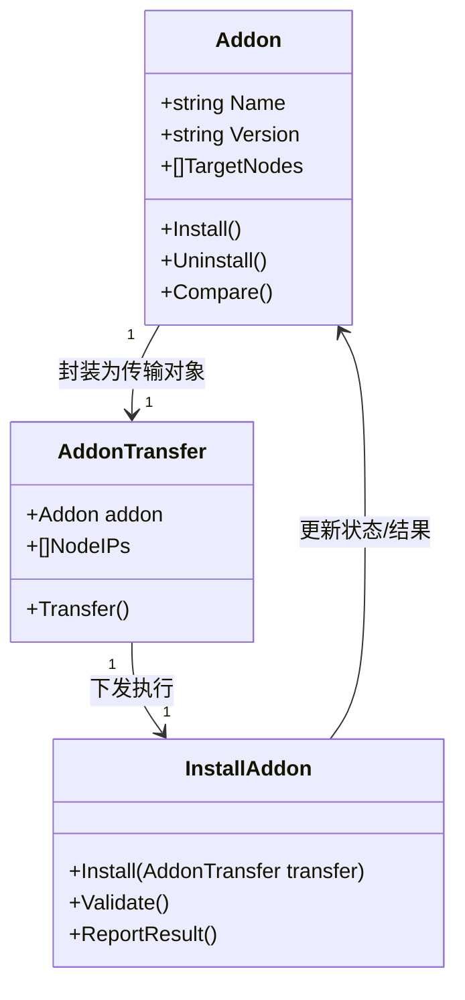
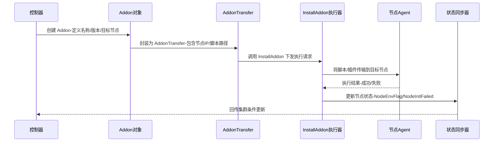

# addon
**`common/cluster/addon` 目录的设计核心是：为集群提供统一的 Addon 管理抽象，支持插件的声明、比较、常量定义和测试，从而实现节点环境初始化与扩展能力的可编排化。**
## 📑 目录结构与文件作用
- **addon.go**  
  - 定义 Addon 的核心结构与接口。  
  - 封装 Addon 的元信息（名称、版本、目标节点、执行方式）。  
  - 提供创建、安装、卸载等操作的统一入口。  
- **addon_test.go**  
  - 针对 `addon.go` 的单元测试。  
  - 验证 Addon 的创建、执行逻辑是否符合预期。  
  - 保证 Addon 管理的稳定性和可维护性。  
- **compare.go**  
  - 提供 Addon 对象的比较逻辑。  
  - 用于判断两个 Addon 是否一致（版本、配置、目标节点）。  
  - 在集群状态同步时非常关键，避免重复安装或错误覆盖。  
- **compare_test.go**  
  - 针对 `compare.go` 的测试用例。  
  - 验证 Addon 比较逻辑的正确性，确保状态机一致性。  
- **consts.go**  
  - 定义 Addon 相关的常量。  
  - 包括内置脚本名称（如 `install-lxcfs.sh`、`install-nfsutils.sh`）、通用脚本名称（如 `file-downloader.sh`）。  
  - 保证脚本调用的一致性和可维护性。  
## ⚙️ 设计思路
1. **抽象化 Addon**  
   - 将脚本、工具、插件统一抽象为 Addon 对象。  
   - 通过统一接口管理安装、卸载、比较。  
2. **声明式管理**  
   - Addon 的定义和执行通过 YAML/CRD 或配置文件声明。  
   - 控制器根据声明生成 `AddonTransfer` 对象并调用 `InstallAddon` 下发。  
3. **状态一致性**  
   - `compare.go` 确保 Addon 状态与集群状态一致。  
   - 避免重复安装或版本冲突。  
4. **可测试性**  
   - `addon_test.go` 和 `compare_test.go` 提供单元测试，保证逻辑正确。  
   - 提升可维护性和可靠性。  
## 📊 设计优势与风险
| 方面 | 优势 | 风险 |
|------|------|------|
| **模块化** | Addon 抽象统一管理脚本和插件 | 抽象过度可能增加复杂度 |
| **声明式** | 配置驱动，易于编排和扩展 | 配置错误可能导致执行失败 |
| **一致性** | 比较逻辑保证状态同步 | 逻辑缺陷可能导致状态漂移 |
| **可测试性** | 单元测试覆盖关键逻辑 | 测试不足可能遗漏边界情况 |
## ✅ 总结
- **`common/cluster/addon`** 提供了 Addon 的抽象、比较、常量和测试，是整个节点环境初始化与扩展机制的核心。  
- 它把 **脚本/插件** 统一建模为 Addon，使得安装流程声明式化、可编排化。  
- 通过 **比较逻辑** 保证状态一致性，通过 **测试** 提升可靠性。  

# 类图
展示 `Addon` 对象、`AddonTransfer`、`InstallAddon` 之间的关系与交互：

## 📑 图解说明
- **Addon**  
  - 抽象插件/脚本对象，包含名称、版本、目标节点等信息。  
  - 提供安装、卸载、比较等方法。  
- **AddonTransfer**  
  - 封装 Addon 的传输对象，指定目标节点 IP。  
  - 用于在控制器和节点之间传递 Addon。  
- **InstallAddon**  
  - 接收 `AddonTransfer`，负责下发并执行脚本。  
  - 验证执行结果并回传状态。  
## ✅ 总结
- **Addon** 是逻辑抽象，描述插件/脚本。  
- **AddonTransfer** 是传输载体，负责把 Addon 下发到节点。  
- **InstallAddon** 是执行器，负责在节点上运行并更新状态。  

这样形成了一个 **三层关系**：抽象对象 → 传输对象 → 执行器，保证 Addon 的声明式管理和可编排执行。  

# 时序图
展示从控制器生成 Addon → 封装为 AddonTransfer → 调用 InstallAddon → 节点执行 → 状态回传的完整交互过程：

## 📑 图解说明
- **控制器**：负责生成 Addon 对象，描述需要安装的脚本或插件。  
- **AddonTransfer**：封装 Addon 的传输信息（目标节点、脚本路径）。  
- **InstallAddon**：执行器，负责下发并调用节点 Agent 执行脚本。  
- **节点 Agent**：实际运行脚本，返回执行结果。  
- **状态同步器**：根据结果更新节点和集群状态，保证一致性。  

这样整个流程就是一个 **声明式、可编排的插件下发执行链**：  
1. 控制器声明 Addon。  
2. 封装为 AddonTransfer。  
3. 调用 InstallAddon 下发。  
4. 节点执行脚本。  
5. 状态回传并同步集群条件。  

# **`pkg/kube/addon.go` 的设计
核心是：为 BKE 集群提供一个统一的 Addon 安装与管理框架，支持 YAML/Chart 两种形式的插件，自动生成参数、执行任务、记录状态，并针对特殊插件（如 bocoperator、cluster-api、fabric、nodelocaldns）进行增强处理。**
## 📑 设计要点
### 1. Addon 安装入口
- **InstallAddon** 方法是核心入口，接收 `AddonTransfer` 对象。  
- 根据 Addon 类型（Chart 或 YAML）选择不同的安装路径：  
  - `installChartAddon` → Helm Chart 安装。  
  - `installYamlAddon` → 遍历 YAML 文件并应用。

### 2. Task 抽象
- 定义 `Task` 结构体，封装单个 YAML 文件的应用任务：  
  - **属性**：名称、文件路径、参数、是否忽略错误、是否阻塞等待、超时、操作类型。  
  - **方法**：`SetWaiter`、`AddRepo`、`SetOperate`、`RegisAddonRecorder`。  
- **作用**：把每个 YAML 文件应用过程抽象为可配置任务，支持重试和超时控制。
### 3. AddonRecorder
- 用于记录 Addon 安装过程中生成的对象（名称、Kind、Namespace）。  
- **作用**：便于后续状态查询和调试，保证安装过程可追溯。
### 4. 参数生成与增强
- **prepareAddonParameters**：根据集群配置和节点信息生成通用参数。  
- **enhanceCommonParamForSpecialAddons**：针对特殊插件进行参数增强：  
  - **bocoperator**：增加 pipeline server、portal token 等参数。  
  - **cluster-api**：增加 clusterToken 和节点模板数据。  
  - **fabric**：解析 `excludeIps` 参数，支持 IP 范围。  
  - **nodelocaldns**：根据 proxyMode 设置 DNS 参数。  
### 5. YAML 文件管理
- **getAddonYamlFiles**：遍历 Addon 目录，收集所有 `.yaml` 文件。  
- 根据操作类型（安装/删除）排序文件，保证执行顺序正确。  
### 6. 错误处理
- **handleApplyError**：针对不同操作类型和错误类型进行处理：  
  - 删除操作失败 → 忽略错误。  
  - 不匹配错误 → 打印详细日志。  
  - 其他错误 → 警告并返回。  
## 📊 设计优势与风险
| 方面 | 优势 | 风险 |
|------|------|------|
| **模块化** | Task 抽象，Recorder 记录，参数生成，职责清晰 | 逻辑复杂，维护成本高 |
| **灵活性** | 支持 YAML/Chart 两种形式，参数可扩展 | 特殊插件参数增强逻辑可能耦合过深 |
| **可追溯性** | Recorder 记录对象，日志详细 | Recorder 数据量大时可能影响性能 |
| **健壮性** | 错误处理区分安装/删除场景 | 错误忽略可能掩盖潜在问题 |
## ✅ 总结
- **addon.go** 提供了一个完整的 Addon 安装框架：入口方法、任务抽象、参数生成、状态记录、错误处理。  
- 它既支持通用插件安装，又针对特殊插件做了增强，保证灵活性和可扩展性。  
- 整体设计体现了 **声明式 + 可编排 + 可追溯** 的思想，是 BKE 集群插件管理的核心模块。  
