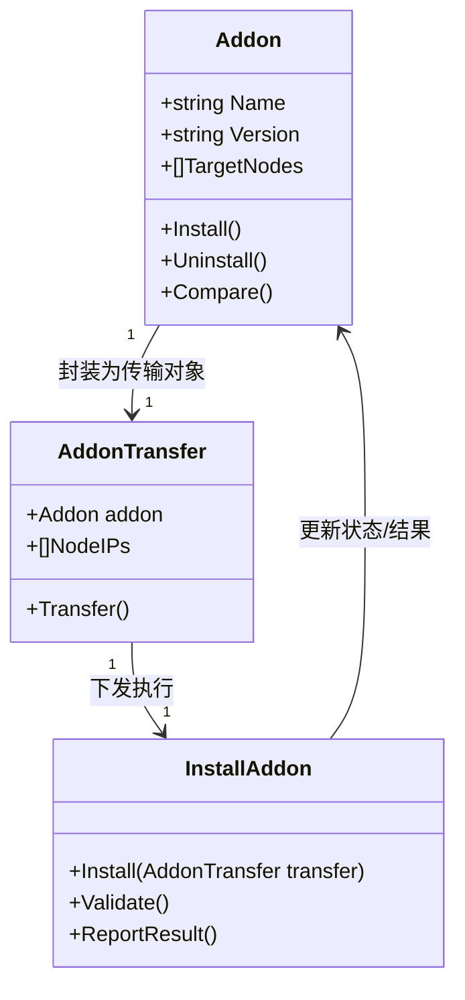
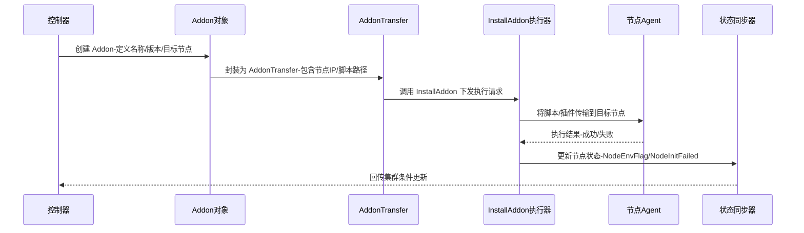
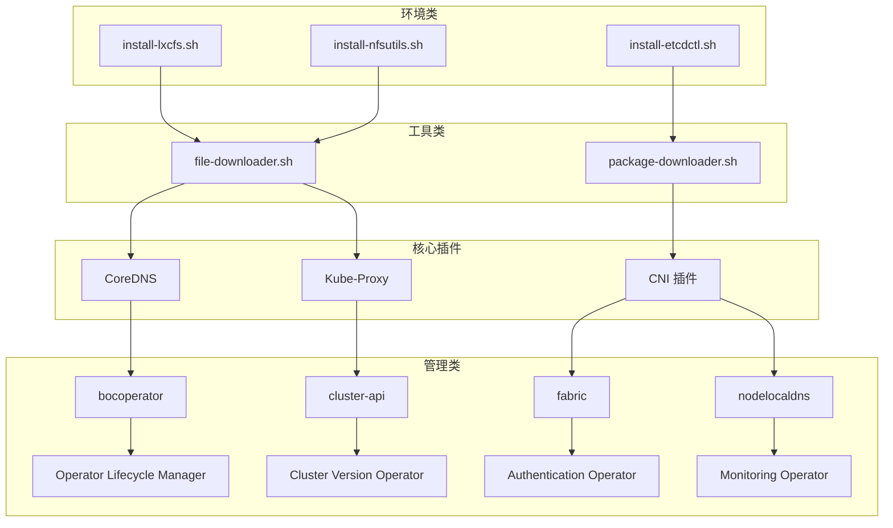

# addon
**`common/cluster/addon` 目录的设计核心是：为集群提供统一的 Addon 管理抽象，支持插件的声明、比较、常量定义和测试，从而实现节点环境初始化与扩展能力的可编排化。**
## 📑 目录结构与文件作用
- **addon.go**  
  - 定义 Addon 的核心结构与接口。  
  - 封装 Addon 的元信息（名称、版本、目标节点、执行方式）。  
  - 提供创建、安装、卸载等操作的统一入口。  
- **addon_test.go**  
  - 针对 `addon.go` 的单元测试。  
  - 验证 Addon 的创建、执行逻辑是否符合预期。  
  - 保证 Addon 管理的稳定性和可维护性。  
- **compare.go**  
  - 提供 Addon 对象的比较逻辑。  
  - 用于判断两个 Addon 是否一致（版本、配置、目标节点）。  
  - 在集群状态同步时非常关键，避免重复安装或错误覆盖。  
- **compare_test.go**  
  - 针对 `compare.go` 的测试用例。  
  - 验证 Addon 比较逻辑的正确性，确保状态机一致性。  
- **consts.go**  
  - 定义 Addon 相关的常量。  
  - 包括内置脚本名称（如 `install-lxcfs.sh`、`install-nfsutils.sh`）、通用脚本名称（如 `file-downloader.sh`）。  
  - 保证脚本调用的一致性和可维护性。  
## ⚙️ 设计思路
1. **抽象化 Addon**  
   - 将脚本、工具、插件统一抽象为 Addon 对象。  
   - 通过统一接口管理安装、卸载、比较。  
2. **声明式管理**  
   - Addon 的定义和执行通过 YAML/CRD 或配置文件声明。  
   - 控制器根据声明生成 `AddonTransfer` 对象并调用 `InstallAddon` 下发。  
3. **状态一致性**  
   - `compare.go` 确保 Addon 状态与集群状态一致。  
   - 避免重复安装或版本冲突。  
4. **可测试性**  
   - `addon_test.go` 和 `compare_test.go` 提供单元测试，保证逻辑正确。  
   - 提升可维护性和可靠性。  
## 📊 设计优势与风险
| 方面 | 优势 | 风险 |
|------|------|------|
| **模块化** | Addon 抽象统一管理脚本和插件 | 抽象过度可能增加复杂度 |
| **声明式** | 配置驱动，易于编排和扩展 | 配置错误可能导致执行失败 |
| **一致性** | 比较逻辑保证状态同步 | 逻辑缺陷可能导致状态漂移 |
| **可测试性** | 单元测试覆盖关键逻辑 | 测试不足可能遗漏边界情况 |
## ✅ 总结
- **`common/cluster/addon`** 提供了 Addon 的抽象、比较、常量和测试，是整个节点环境初始化与扩展机制的核心。  
- 它把 **脚本/插件** 统一建模为 Addon，使得安装流程声明式化、可编排化。  
- 通过 **比较逻辑** 保证状态一致性，通过 **测试** 提升可靠性。  

# 类图
展示 `Addon` 对象、`AddonTransfer`、`InstallAddon` 之间的关系与交互：

## 📑 图解说明
- **Addon**  
  - 抽象插件/脚本对象，包含名称、版本、目标节点等信息。  
  - 提供安装、卸载、比较等方法。  
- **AddonTransfer**  
  - 封装 Addon 的传输对象，指定目标节点 IP。  
  - 用于在控制器和节点之间传递 Addon。  
- **InstallAddon**  
  - 接收 `AddonTransfer`，负责下发并执行脚本。  
  - 验证执行结果并回传状态。  
## ✅ 总结
- **Addon** 是逻辑抽象，描述插件/脚本。  
- **AddonTransfer** 是传输载体，负责把 Addon 下发到节点。  
- **InstallAddon** 是执行器，负责在节点上运行并更新状态。  

这样形成了一个 **三层关系**：抽象对象 → 传输对象 → 执行器，保证 Addon 的声明式管理和可编排执行。  

# 时序图
展示从控制器生成 Addon → 封装为 AddonTransfer → 调用 InstallAddon → 节点执行 → 状态回传的完整交互过程：

## 📑 图解说明
- **控制器**：负责生成 Addon 对象，描述需要安装的脚本或插件。  
- **AddonTransfer**：封装 Addon 的传输信息（目标节点、脚本路径）。  
- **InstallAddon**：执行器，负责下发并调用节点 Agent 执行脚本。  
- **节点 Agent**：实际运行脚本，返回执行结果。  
- **状态同步器**：根据结果更新节点和集群状态，保证一致性。  

这样整个流程就是一个 **声明式、可编排的插件下发执行链**：  
1. 控制器声明 Addon。  
2. 封装为 AddonTransfer。  
3. 调用 InstallAddon 下发。  
4. 节点执行脚本。  
5. 状态回传并同步集群条件。  

# **`pkg/kube/addon.go` 的设计
核心是：为 BKE 集群提供一个统一的 Addon 安装与管理框架，支持 YAML/Chart 两种形式的插件，自动生成参数、执行任务、记录状态，并针对特殊插件（如 bocoperator、cluster-api、fabric、nodelocaldns）进行增强处理。**
## 📑 设计要点
### 1. Addon 安装入口
- **InstallAddon** 方法是核心入口，接收 `AddonTransfer` 对象。  
- 根据 Addon 类型（Chart 或 YAML）选择不同的安装路径：  
  - `installChartAddon` → Helm Chart 安装。  
  - `installYamlAddon` → 遍历 YAML 文件并应用。

### 2. Task 抽象
- 定义 `Task` 结构体，封装单个 YAML 文件的应用任务：  
  - **属性**：名称、文件路径、参数、是否忽略错误、是否阻塞等待、超时、操作类型。  
  - **方法**：`SetWaiter`、`AddRepo`、`SetOperate`、`RegisAddonRecorder`。  
- **作用**：把每个 YAML 文件应用过程抽象为可配置任务，支持重试和超时控制。
### 3. AddonRecorder
- 用于记录 Addon 安装过程中生成的对象（名称、Kind、Namespace）。  
- **作用**：便于后续状态查询和调试，保证安装过程可追溯。
### 4. 参数生成与增强
- **prepareAddonParameters**：根据集群配置和节点信息生成通用参数。  
- **enhanceCommonParamForSpecialAddons**：针对特殊插件进行参数增强：  
  - **bocoperator**：增加 pipeline server、portal token 等参数。  
  - **cluster-api**：增加 clusterToken 和节点模板数据。  
  - **fabric**：解析 `excludeIps` 参数，支持 IP 范围。  
  - **nodelocaldns**：根据 proxyMode 设置 DNS 参数。  
### 5. YAML 文件管理
- **getAddonYamlFiles**：遍历 Addon 目录，收集所有 `.yaml` 文件。  
- 根据操作类型（安装/删除）排序文件，保证执行顺序正确。  
### 6. 错误处理
- **handleApplyError**：针对不同操作类型和错误类型进行处理：  
  - 删除操作失败 → 忽略错误。  
  - 不匹配错误 → 打印详细日志。  
  - 其他错误 → 警告并返回。  
## 📊 设计优势与风险
| 方面 | 优势 | 风险 |
|------|------|------|
| **模块化** | Task 抽象，Recorder 记录，参数生成，职责清晰 | 逻辑复杂，维护成本高 |
| **灵活性** | 支持 YAML/Chart 两种形式，参数可扩展 | 特殊插件参数增强逻辑可能耦合过深 |
| **可追溯性** | Recorder 记录对象，日志详细 | Recorder 数据量大时可能影响性能 |
| **健壮性** | 错误处理区分安装/删除场景 | 错误忽略可能掩盖潜在问题 |
## ✅ 总结
- **addon.go** 提供了一个完整的 Addon 安装框架：入口方法、任务抽象、参数生成、状态记录、错误处理。  
- 它既支持通用插件安装，又针对特殊插件做了增强，保证灵活性和可扩展性。  
- 整体设计体现了 **声明式 + 可编排 + 可追溯** 的思想，是 BKE 集群插件管理的核心模块。  

# Addon组件
**在 `cluster-api-provider-bke` 项目中，作为 Addon 的组件主要是一些集群运行所需的插件和工具，它们通过统一的 Addon 框架进行安装和管理，包括内置脚本、通用工具以及特定的 Kubernetes/集群插件。**
## 📑 主要 Addon 组件类别
### 1. **内置环境类 Addon**
这些是节点环境初始化必备的工具，通常以脚本形式存在：
- **install-lxcfs.sh** → 提供容器资源隔离（真实的 `/proc` 视图）。  
- **install-nfsutils.sh** → 支持 NFS 存储挂载。  
- **install-etcdctl.sh** → 提供 etcd 管理工具。  
### 2. **通用工具类 Addon**
这些是通用的辅助脚本，用于文件和软件包分发：
- **file-downloader.sh** → 文件分发工具。  
- **package-downloader.sh** → 软件包下载与安装工具。  
### 3. **Kubernetes 核心插件 Addon**
在 `pkg/kube/addon.go` 中定义的插件，直接影响集群功能：
- **CoreDNS** → 集群 DNS 服务。  
- **Kube-Proxy** → Service 网络代理。  
- **CNI 插件** → 网络插件（如 Flannel、Calico）。  
### 4. **特殊增强型 Addon**
在 `addon.go` 中有针对性增强逻辑的插件：
- **bocoperator** → 管理 pipeline server、portal token 等。  
- **cluster-api** → 提供集群生命周期管理，支持 clusterToken 和节点模板。  
- **fabric** → 网络相关插件，支持 IP 排除配置。  
- **nodelocaldns** → 本地 DNS 缓存插件，优化 DNS 性能。  
### 5. **监控与管理类 Addon**
- **Monitoring Operator** → 集群监控。  
- **Authentication Operator** → 集群认证。  
- **Operator Lifecycle Manager (OLM)** → 管理 Operator 生命周期。  
- **Cluster Version Operator (CVO)** → 管理集群版本升级。  
## 📊 设计特点
| 类别 | 代表组件 | 作用 |
|------|----------|------|
| 内置环境类 | lxcfs, nfsutils, etcdctl | 节点环境初始化 |
| 通用工具类 | file-downloader, package-downloader | 文件/包分发 |
| 核心插件类 | CoreDNS, Kube-Proxy, CNI | 集群网络与服务 |
| 特殊增强型 | bocoperator, cluster-api, fabric, nodelocaldns | 特定功能增强 |
| 管理类 | OLM, CVO, Auth, Monitor | 集群运维与管理 |
## ✅ 总结
在 `cluster-api-provider-bke` 中，**Addon 的范围涵盖了节点环境脚本、通用工具、Kubernetes 核心插件、特殊增强插件以及集群管理 Operator**。这些组件通过统一的 Addon 框架（`AddonTransfer` + `InstallAddon`）进行声明式安装和管理，保证了集群初始化和扩展的灵活性与一致性。  

# Addon 分类清单表
把 `cluster-api-provider-bke` 项目中涉及的脚本和插件按“环境类 / 工具类 / 核心插件 / 管理类”分组，方便快速查阅：
## 📊 Addon 分类清单表
| 类别 | 代表组件 / 脚本 | 作用 |
|------|----------------|------|
| **环境类 Addon** | `install-lxcfs.sh` | 提供容器资源隔离，真实的 `/proc` 视图 |
| | `install-nfsutils.sh` | 支持 NFS 存储挂载 |
| | `install-etcdctl.sh` | 提供 etcd 管理工具（快照、健康检查） |
| **工具类 Addon** | `file-downloader.sh` | 文件分发工具，从远程源下载配置/证书/二进制包 |
| | `package-downloader.sh` | 软件包下载与安装工具，支持不同 Linux 发行版 |
| **核心插件 Addon** | **CoreDNS** | 集群 DNS 服务 |
| | **Kube-Proxy** | Service 网络代理 |
| | **CNI 插件**（Flannel、Calico 等） | Pod 网络插件 |
| **管理类 Addon** | **bocoperator** | 管理 pipeline server、portal token 等 |
| | **cluster-api** | 集群生命周期管理，支持 clusterToken 和节点模板 |
| | **fabric** | 网络相关插件，支持 IP 排除配置 |
| | **nodelocaldns** | 本地 DNS 缓存插件，优化 DNS 性能 |
| | **Operator Lifecycle Manager (OLM)** | 管理 Operator 生命周期 |
| | **Cluster Version Operator (CVO)** | 管理集群版本升级 |
| | **Authentication Operator** | 集群认证 |
| | **Monitoring Operator** | 集群监控 |
## ✅ 总结
- **环境类 Addon**：保证节点具备基础运行环境。  
- **工具类 Addon**：提供文件和软件包分发能力。  
- **核心插件 Addon**：保证 Kubernetes 集群的网络和服务功能。  
- **管理类 Addon**：提供集群生命周期、认证、监控和 Operator 管理能力。  

这些 Addon 通过统一的 **AddonTransfer + InstallAddon** 框架进行声明式安装和管理，形成了一个可编排、可扩展的插件体系。  

# DAG 图
把各类 Addon 按类别和依赖关系串联起来，直观展示安装顺序和并行关系：

## 📑 图解说明
- **环境类 Addon**（lxcfs, nfsutils, etcdctl）是最底层依赖，必须先安装。  
- **工具类 Addon**（file-downloader, package-downloader）在环境准备好后执行，支持文件和包分发。  
- **核心插件 Addon**（CoreDNS, Kube-Proxy, CNI）依赖工具类，完成集群网络与服务功能。  
- **管理类 Addon**（bocoperator, cluster-api, fabric, nodelocaldns, OLM, CVO, Auth, Monitor）在核心插件完成后安装，负责集群生命周期、认证、监控和运维。  

这样你就能直观地看到 **Addon 的安装顺序和并行关系**：  
- 环境类 → 工具类 → 核心插件 → 管理类。  
- 工具类和核心插件之间存在并行关系，管理类则串联在核心插件之后。  

要不要我再帮你扩展这个 DAG，把 **自定义 Addon（用户通过 ConfigMap 下发的脚本）**也加进去，展示它们如何插入到不同阶段？

# 脚本型Addon
在 `cluster-api-provider-bke` 项目里，**脚本型 Addon** 的代码实现主要分布在以下几个地方：
## 📑 关键实现位置
1. **`common/cluster/addon/consts.go`**  
   - 定义了脚本型 Addon 的常量，例如：  
     - `install-lxcfs.sh`  
     - `install-nfsutils.sh`  
     - `install-etcdctl.sh`  
     - `file-downloader.sh`  
     - `package-downloader.sh`  
   - 这些常量作为 Addon 名称被统一管理，保证调用时一致性。
2. **`common/cluster/addon/addon.go`**  
   - 抽象了 Addon 对象，支持不同类型（YAML、Chart、Script）。  
   - 脚本型 Addon 在这里被建模为一种特殊的 Addon 类型。  
   - 提供了安装、卸载、比较等统一接口。
3. **`pkg/phaseframe/phases/ensure_nodes_env.go`**  
   - 在节点环境初始化阶段调用脚本型 Addon。  
   - 通过生成 `AddonTransfer` 对象，把脚本路径和目标节点封装起来。  
   - 调用 `InstallAddon` 下发脚本到节点执行。  
   - 这里是脚本型 Addon 的实际执行入口。
4. **`pkg/kube/addon.go`**  
   - 定义了 `InstallAddon` 方法，负责处理不同类型的 Addon。  
   - 对于脚本型 Addon，会走 **文件传输 + 节点执行** 的逻辑，而不是 YAML 应用或 Helm Chart。  
   - 通过 `AddonRecorder` 记录执行结果，保证状态可追溯。
## ⚙️ 执行流程（脚本型 Addon）
1. 控制器生成 `Addon` 对象（类型为 Script）。  
2. 封装为 `AddonTransfer`，指定脚本路径和目标节点。  
3. 调用 `InstallAddon`，将脚本传输到节点。  
4. 节点 Agent 执行脚本（如安装 lxcfs）。  
5. 返回结果 → 更新节点状态（成功/失败）。  
## ✅ 总结
- **脚本型 Addon 的定义**：在 `common/cluster/addon/consts.go` 和 `addon.go`。  
- **脚本型 Addon 的调用**：在 `ensure_nodes_env.go` 阶段生成 `AddonTransfer` 并调用。  
- **脚本型 Addon 的执行**：在 `pkg/kube/addon.go` 的 `InstallAddon` 方法中实现，通过传输和节点执行完成。  

换句话说，脚本型 Addon 是通过 **统一的 Addon 框架**来管理的，只是执行方式不同：它不是应用 YAML 或 Chart，而是直接在节点上运行脚本。  

# 没有一个单独的“脚本型 Addon 类型定义
你观察得很准确：在 `cluster-api-provider-bke` 的代码里，**并没有一个单独的“脚本型 Addon 类型定义”**，不像 YAML Addon 或 Chart Addon 那样有明确的结构体或枚举。  
脚本型 Addon 的实现方式是 **“常量 + 通用 Addon 框架 + 下发执行逻辑”**，而不是单独定义一种新的 Addon 类型。换句话说，它们是通过框架的通用接口来执行的，而不是在代码里显式声明为 `ScriptAddon`。
## 📑 具体实现方式
1. **常量定义**  
   在 `common/cluster/addon/consts.go` 中，脚本型 Addon 的名字（如 `install-lxcfs.sh`、`install-nfsutils.sh`）被定义为常量。  
   - 这些常量起到“标识符”的作用，告诉系统这是一个需要下发执行的脚本。
2. **统一 Addon 框架**  
   在 `common/cluster/addon/addon.go` 中，Addon 被抽象为一个通用对象，支持安装、卸载、比较。  
   - 脚本型 Addon 并没有单独的结构体，而是通过 **AddonTransfer** 封装脚本路径和目标节点。  
   - 框架不区分 YAML/Chart/Script，而是根据传入的内容决定执行方式。
3. **执行入口**  
   在 `pkg/phaseframe/phases/ensure_nodes_env.go` 中，节点环境初始化阶段会调用这些脚本：  
   - 生成 `AddonTransfer` 对象，指定脚本路径和目标节点。  
   - 调用 `InstallAddon` 下发脚本到节点执行。  
4. **执行逻辑**  
   在 `pkg/kube/addon.go` 的 `InstallAddon` 方法中：  
   - 如果是 YAML → 用 Kubernetes API 应用。  
   - 如果是 Chart → 用 Helm 安装。  
   - 如果是脚本 → 走 **文件传输 + 节点执行**，由节点 Agent 执行脚本。  
## ✅ 总结
- **没有单独的 ScriptAddon 类型定义**。  
- 脚本型 Addon 是通过 **常量标识 + AddonTransfer 封装 + InstallAddon 执行**来实现的。  
- 它们在代码层面只是被当作“特殊的 Addon 名称”，执行时走脚本下发逻辑，而不是 YAML/Chart。  

# 在 pkg/kube/addon.go 的 InstallAddon 方法中，没有判断是 脚本文件（.sh） → 走 文件传输 + 节点执行的逻辑
你观察得非常细致，这里确实有一个关键点：在 `pkg/kube/addon.go` 的 `InstallAddon` 方法里，**没有显式的 “如果是 .sh 脚本 → 文件传输 + 节点执行” 的分支逻辑**。  
## 📑 为什么没有单独的脚本判断
1. **Addon 框架的定位**  
   - `pkg/kube/addon.go` 主要负责 **Kubernetes 层面的 Addon 安装**（YAML 应用、Helm Chart 部署）。  
   - 它的逻辑是围绕 `installYamlAddon` 和 `installChartAddon` 展开的。  
2. **脚本型 Addon 的执行路径不同**  
   - 像 `install-lxcfs.sh`、`install-nfsutils.sh` 这些脚本并不是通过 Kubernetes API 应用，而是通过 **节点环境初始化阶段**直接下发执行。  
   - 这部分逻辑在 `pkg/phaseframe/phases/ensure_nodes_env.go`，而不是在 `pkg/kube/addon.go`。  
3. **实现方式**  
   - 脚本型 Addon 在 `consts.go` 中被定义为常量（标识符）。  
   - 在 `ensure_nodes_env.go` 阶段，控制器会生成 `AddonTransfer`，指定脚本路径和目标节点。  
   - 下发执行时，走的是 **节点 Agent/SSH-like 通道**，直接在节点操作系统层面运行脚本。  
   - 这条路径绕过了 `InstallAddon` 的 YAML/Chart 分支。  
## ⚙️ 实现位置总结
- **常量定义**：`common/cluster/addon/consts.go`  
- **调用入口**：`pkg/phaseframe/phases/ensure_nodes_env.go`  
- **执行逻辑**：通过 `AddonTransfer` 下发脚本到节点，由节点 Agent 执行  
- **状态更新**：结果回传后更新节点状态（成功/失败）  
## ✅ 结论
- 在 `pkg/kube/addon.go` 的 `InstallAddon` 方法中，确实没有脚本型 Addon 的分支逻辑。  
- 脚本型 Addon 的执行是在 **节点环境初始化阶段（ensure_nodes_env.go）**完成的，而不是在 Kubernetes Addon 安装逻辑里。  
- 所以，脚本型 Addon 是 **在执行时由不同的 Phase 判断并下发**，而不是在 `InstallAddon` 里统一处理。  

要不要我帮你画一个 **Mermaid 时序图**，清晰区分两条路径：  
- **YAML/Chart Addon** → 走 `InstallAddon` → Kubernetes API/Helm  
- **脚本型 Addon** → 走 `EnsureNodesEnv` → 节点 Agent 执行脚本
