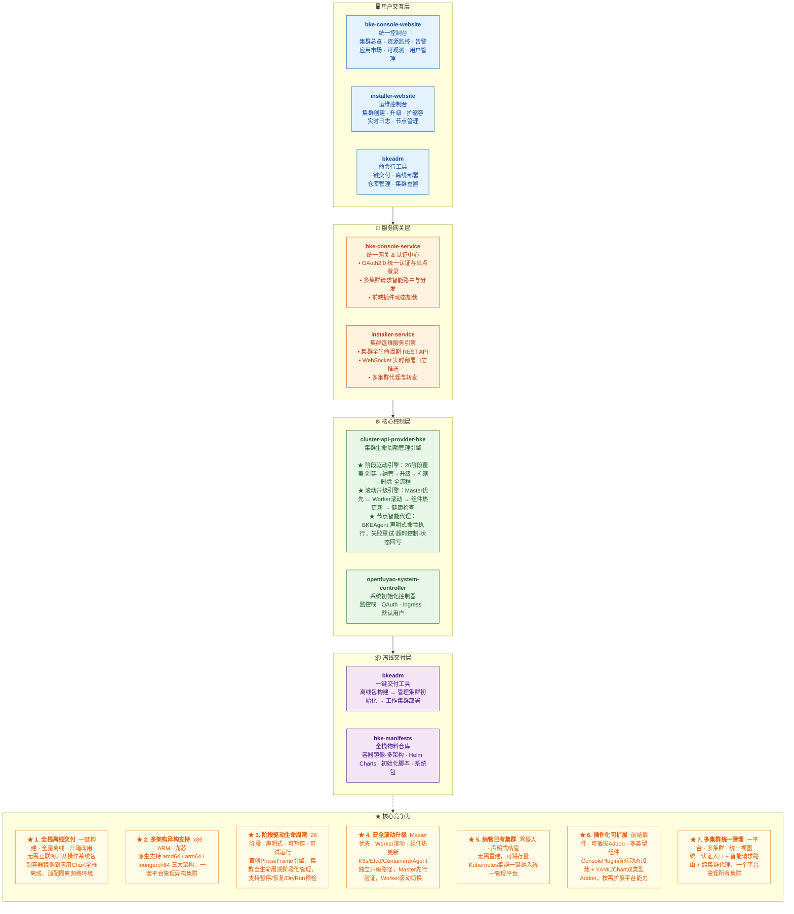

# 组件架构图(标注竞争力元素)

```text
┌─────────────────────────────────────────────────────────────────────────────────────────────────────┐
│                                     openFuyao / BKE 平台组件架构图                                    │
├─────────────────────────────────────────────────────────────────────────────────────────────────────┤
│                                                                                                     │
│  ┌───────────────────────────────────────────────────────────────────────────────────────────────┐  │
│  │                                 用户交互层 (User Interface Layer)                              │  │
│  │                                                                                               │  │
│  │   ┌─────────────────┐    ┌─────────────────┐    ┌─────────────────┐                          │  │
│  │   │  bke-console-   │    │  installer-     │    │    bkeadm       │                          │  │
│  │   │  website        │    │  website        │    │    (CLI)        │                          │  │
│  │   │  ─────────────  │    │  ─────────────  │    │  ──────────     │                          │  │
│  │   │  • 集群总览      │    │  • 集群创建      │    │  • init 初始化  │                          │  │
│  │   │  • 资源监控      │    │  • 节点扩缩容    │    │  • build 离线包 │                          │  │
│  │   │  • 告警管理      │    │  • 集群升级      │    │  • cluster 管理 │                          │  │
│  │   │  • 应用市场      │    │  • 实时日志      │    │  • registry 仓库│                          │  │
│  │   │  • 可观测性      │    │  • 节点详情      │    │  • agent 管理   │                          │  │
│  │   │  • 用户/角色管理  │    │  • 集群详情      │    │  • config 配置  │                          │  │
│  │   └────────┬────────┘    └────────┬────────┘    └────────┬────────┘                          │  │
│  └────────────┼──────────────────────┼──────────────────────┼────────────────────────────────────┘  │
│               │                      │                      │                                       │
│               ▼                      ▼                      │                                       │
│  ┌──────────────────────────────────────────────────────────┼────────────────────────────────────┐  │
│  │                              服务网关层 (API Gateway Layer)                                │  │
│  │                                                                                            │  │
│  │   ┌──────────────────────────────┐    ┌──────────────────────────────┐                      │  │
│  │   │  bke-console-service         │    │  installer-service           │     ◄── bkeadm 直连   │  │
│  │   │  ──────────────────────      │    │  ──────────────────          │         K8s API       │  │
│  │   │  • OAuth2.0 认证授权         │    │  • 集群生命周期 REST API     │                      │  │
│  │   │  • 请求路由 & 反向代理       │    │  • WebSocket 实时日志流      │                      │  │
│  │   │  • 多集群请求分发            │    │  • 集群创建/删除/升级/扩缩容 │                      │  │
│  │   │  • ConsolePlugin 插件代理    │    │  • 多集群代理转发            │                      │  │
│  │   │  • 会话管理 (Session/WS)     │    │  • 自动升级策略              │                      │  │
│  │   │  • 安全防护 (CSP/Headers)    │    │                              │                      │  │
│  │   └──────────────┬───────────────┘    └──────────────┬───────────────┘                      │  │
│  └─────────────────┼───────────────────────────────────┼───────────────────────────────────────┘  │
│                    │                                   │                                          │
│                    └───────────────┬───────────────────┘                                          │
│                                    ▼                                                              │
│  ┌───────────────────────────────────────────────────────────────────────────────────────────────┐  │
│  │                          核心控制层 (Core Control Layer)                                       │  │
│  │                                                                                                │  │
│  │   ┌─────────────────────────────────────────────────────────────────────────────────────────┐ │  │
│  │   │                     cluster-api-provider-bke (Kubernetes Operator)                       │ │  │
│  │   │                                                                                           │ │  │
│  │   │  ┌─────────────────────────────────────────────────────────────────────────────────┐    │ │  │
│  │   │  │  ★ PhaseFrame 阶段引擎 (竞争力: 声明式+阶段驱动的集群生命周期管理)                    │    │ │  │
│  │   │  │  ┌──────────────┐  ┌──────────────┐  ┌──────────────┐                           │    │ │  │
│  │   │  │  │ CommonPhases │  │ DeployPhases │  │PostDeployPhs │                           │    │ │  │
│  │   │  │  │ • Finalizer  │  │ • BKEAgent   │  │ • AgentUpgrd │                           │    │ │  │
│  │   │  │  │ • Paused     │  │ • NodesEnv   │  │ • EtcdUpgrd  │                           │    │ │  │
│  │   │  │  │ • ClusterMgnt│  │ • ClusterAPI │  │ • K8sUpgrd   │                           │    │ │  │
│  │   │  │  │ • DeleteReset│  │ • Certs      │  │ • CompUpgrd  │                           │    │ │  │
│  │   │  │  │ • DryRun     │  │ • LoadBalnce │  │ • ClusterChk │                           │    │ │  │
│  │   │  │  └──────────────┘  │ • MasterInit │  └──────────────┘                           │    │ │  │
│  │   │  │                    │ • MasterJoin │                                             │    │ │  │
│  │   │  │                    │ • WorkerJoin │                                             │    │ │  │
│  │   │  │                    │ • AddonDeploy│                                             │    │ │  │
│  │   │  │                    │ • AgentSwitch│                                             │    │ │  │
│  │   │  │                    └──────────────┘                                             │    │ │  │
│  │   │  └─────────────────────────────────────────────────────────────────────────────────┘    │ │  │
│  │   │                                                                                           │ │  │
│  │   │  ┌──────────────────────┐  ┌──────────────────────┐  ┌────────────────────────────┐   │ │  │
│  │   │  │ BKECluster Controller│  │ BKEMachine Controller│  │  Command Controller        │   │ │  │
│  │   │  │ (集群生命周期)        │  │ (节点生命周期)        │  │  (命令执行控制)             │   │ │  │
│  │   │  └──────────────────────┘  └──────────────────────┘  └────────────────────────────┘   │ │  │
│  │   │                                                                                           │ │  │
│  │   │  ┌─────────────────────────────────────────────────────────────────────────────────┐    │ │  │
│  │   │  │  ★ Job 执行引擎 (竞争力: 可插拔的 BuiltIn/Shell/K8s 三类执行器)                     │    │ │  │
│  │   │  │  ┌──────────┐  ┌──────────┐  ┌──────────┐  ┌──────────┐  ┌──────────┐          │    │ │  │
│  │   │  │  │ Kubeadm  │  │Containerd│  │    HA    │  │  Reset   │  │ SelfUpdate│          │    │ │  │
│  │   │  │  │  Plugin  │  │  Plugin  │  │  Plugin  │  │  Plugin  │  │  Plugin  │          │    │ │  │
│  │   │  │  └──────────┘  └──────────┘  └──────────┘  └──────────┘  └──────────┘          │    │ │  │
│  │   │  │  ┌──────────┐  ┌──────────┐  ┌──────────┐  ┌──────────┐  ┌──────────┐          │    │ │  │
│  │   │  │  │  Certs   │  │ PostProc │  │ PreProc  │  │ Switch   │  │  Backup  │          │    │ │  │
│  │   │  │  │  Plugin  │  │  Plugin  │  │  Plugin  │  │  Plugin  │  │  Plugin  │          │    │ │  │
│  │   │  │  └──────────┘  └──────────┘  └──────────┘  └──────────┘  └──────────┘          │    │ │  │
│  │   │  └─────────────────────────────────────────────────────────────────────────────────┘    │ │  │
│  │   │                                                                                           │ │  │
│  │   │  ┌─────────────────────────────────────────────────────────────────────────────────┐    │ │  │
│  │   │  │  CRD 定义层                                                                       │    │ │  │
│  │   │  │  BKECluster · BKEMachine · BKENode · Command · ContainerdConfig                  │    │ │  │
│  │   │  └─────────────────────────────────────────────────────────────────────────────────┘    │ │  │
│  │   └─────────────────────────────────────────────────────────────────────────────────────────┘ │  │
│  │                                                                                                │  │
│  │   ┌─────────────────────────────────────────────────────────────────────────────────────────┐ │  │
│  │   │  openfuyao-system-controller (系统初始化控制器)                                           │ │  │
│  │   │  ─────────────────────────────────────────────                                            │ │  │
│  │   │  • kube-prometheus 监控栈部署    • OAuth Webhook 配置                                     │ │  │
│  │   │  • 默认用户创建                  • Ingress-Nginx 部署                                     │ │  │
│  │   │  • Helm Chart 仓库初始化         • Metrics-Server 部署                                    │ │  │
│  │   └─────────────────────────────────────────────────────────────────────────────────────────┘ │  │
│  └───────────────────────────────────────────────────────────────────────────────────────────────┘  │
│                    │                              │                                                │
│                    ▼                              ▼                                                │
│  ┌───────────────────────────────────────────────────────────────────────────────────────────────┐  │
│  │                         节点代理层 (Node Agent Layer)                                          │  │
│  │                                                                                                │  │
│  │   ┌─────────────────────────────────────────────────────────────────────────────────────────┐ │  │
│  │   │  ★ BKEAgent (竞争力: 轻量级节点代理，Command CR 驱动的安全命令执行)                          │ │  │
│  │   │                                                                                           │ │  │
│  │   │  • Watch Command CR → 过滤本节点命令 → 顺序执行 → 状态回写                                │ │  │
│  │   │  • 支持 NodeName / NodeSelector 精确调度                                                  │ │  │
│  │   │  • 支持 BackoffLimit / ActiveDeadline / TTL 自动清理                                      │ │  │
│  │   │  • 支持 Suspend 暂停执行                                                                  │ │  │
│  │   └─────────────────────────────────────────────────────────────────────────────────────────┘ │  │
│  └───────────────────────────────────────────────────────────────────────────────────────────────┘  │
│                    │                                                                              │
│                    ▼                                                                              │
│  ┌───────────────────────────────────────────────────────────────────────────────────────────────┐  │
│  │                         制品与物料层 (Artifact & Material Layer)                                │  │
│  │                                                                                                │  │
│  │   ┌─────────────────────────────────────────────────────────────────────────────────────────┐ │  │
│  │   │  ★ bke-manifests (竞争力: 全栈离线物料仓库，多架构支持 amd64/arm64/loongarch64)             │ │  │
│  │   │                                                                                           │ │  │
│  │   │  ┌──────────────┐  ┌──────────────┐  ┌──────────────┐  ┌──────────────┐                │ │  │
│  │   │  │ K8s 组件      │  │ 监控组件      │  │ 网络组件      │  │ AI/GPU 组件  │                │ │  │
│  │   │  │ • kube-proxy │  │ • prometheus │  │ • calico     │  │ • kube-gpu   │                │ │  │
│  │   │  │ • coredns    │  │ • grafana    │  │ • beyondELB  │  │ • gpu-manager│                │ │  │
│  │   │  │ • etcd-backup│  │ • vpa        │  │ • nfs-csi    │  │ • katib      │                │ │  │
│  │   │  │ • kubectl    │  │ • vm-ctrl    │  │ • rdma       │  │ • kserve     │                │ │  │
│  │   │  └──────────────┘  └──────────────┘  └──────────────┘  └──────────────┘                │ │  │
│  │   │  ┌──────────────┐  ┌──────────────┐  ┌──────────────┐  ┌──────────────┐                │ │  │
│  │   │  │ 镜像构建      │  │ 初始化脚本    │  │ Helm Charts  │  │ RPM 包       │                │ │  │
│  │   │  │ • Dockerfile │  │ • install-*.sh│ │ • addon yaml │  │ • CentOS     │                │ │  │
│  │   │  │ • Makefile   │  │ • kernel.sh  │  │ • chart repo │  │ • Ubuntu     │                │ │  │
│  │   │  └──────────────┘  └──────────────┘  └──────────────┘  └──────────────┘                │ │  │
│  │   └─────────────────────────────────────────────────────────────────────────────────────────┘ │  │
│  │                                                                                                │  │
│  │   ┌─────────────────────────────────────────────────────────────────────────────────────────┐ │  │
│  │   │  ★ bkeadm (竞争力: 一键式离线交付工具，支持全量/增量/在线多种构建模式)                       │ │  │
│  │   │                                                                                           │ │  │
│  │   │  ┌──────────┐  ┌──────────┐  ┌──────────┐  ┌──────────┐  ┌──────────┐                  │ │  │
│  │   │  │  build   │  │   init   │  │ cluster  │  │ registry │  │  reset   │                  │ │  │
│  │   │  │ 离线包构建│  │ 管理集群  │  │ 集群部署  │  │ 仓库管理  │  │ 集群重置  │                  │ │  │
│  │   │  └──────────┘  └──────────┘  └──────────┘  └──────────┘  └──────────┘                  │ │  │
│  │   │  ┌──────────────────────────────────────────────────────────────────────────────────┐   │ │  │
│  │   │  │  Infrastructure Layer: containerd / docker / k3s / kubelet 配置管理               │   │ │  │
│  │   │  │  Initialize Layer: bkeagent / bkeconfig / bkeconsole / clusterapi / repository   │   │ │  │
│  │   │  └──────────────────────────────────────────────────────────────────────────────────┘   │ │  │
│  │   └─────────────────────────────────────────────────────────────────────────────────────────┘ │  │
│  └───────────────────────────────────────────────────────────────────────────────────────────────┘  │
│                                                                                                     │
└─────────────────────────────────────────────────────────────────────────────────────────────────────┘


═══════════════════════════════════════════════════════════════════════════════════════════════════════
                                     ★ 竞争力元素总览
═══════════════════════════════════════════════════════════════════════════════════════════════════════

  ┌─────────────────────────────────────────────────────────────────────────────────────────────────┐
  │  1. ★ PhaseFrame 阶段驱动引擎                                                                   │
  │     声明式 + 阶段驱动的集群生命周期管理，26个Phase覆盖安装/升级/删除全流程                           │
  │     支持暂停(Pause)、试运行(DryRun)、纳管已有集群(ClusterManage)等差异化能力                        │
  ├─────────────────────────────────────────────────────────────────────────────────────────────────┤
  │  2. ★ BKEAgent 轻量级节点代理                                                                    │
  │     基于 Command CR 的安全命令执行模型，支持 NodeName/NodeSelector 精确调度                         │
  │     内置 BackoffLimit/ActiveDeadline/TTL/Suspend 等生产级控制能力                                  │
  ├─────────────────────────────────────────────────────────────────────────────────────────────────┤
  │  3. ★ 全栈离线交付能力                                                                           │
  │     bkeadm + bke-manifests 联合提供一键式离线交付，支持全量/增量/在线多种构建模式                     │
  │     覆盖镜像、RPM包、Helm Chart、初始化脚本的完整离线物料链                                         │
  ├─────────────────────────────────────────────────────────────────────────────────────────────────┤
  │  4. ★ 多架构支持 (amd64 / arm64 / loongarch64)                                                  │
  │     bke-manifests 提供多架构镜像构建，支持 x86/ARM/龙芯等多硬件平台                                 │
  ├─────────────────────────────────────────────────────────────────────────────────────────────────┤
  │  5. ★ 可插拔 Addon 体系                                                                          │
  │     支持 YAML / Chart 两种 Addon 类型，灵活扩展 CNI/CSI/监控/GPU/AI 等组件                          │
  │     Addon 版本化管理和自动升级能力                                                                  │
  ├─────────────────────────────────────────────────────────────────────────────────────────────────┤
  │  6. ★ 全生命周期升级引擎                                                                          │
  │     支持 K8s 版本 / Etcd / Containerd / Agent / 核心组件的独立升级                                  │
  │     Master 优先 → Worker 滚动的安全升级策略                                                         │
  ├─────────────────────────────────────────────────────────────────────────────────────────────────┤
  │  7. ★ 多集群统一管理                                                                              │
  │     Management Cluster ↔ Workload Cluster 分层架构                                                │
  │     bke-console-service 多集群请求分发 + installer-service 多集群代理                               │
  ├─────────────────────────────────────────────────────────────────────────────────────────────────┤
  │  8. ★ ConsolePlugin 插件化前端架构                                                                │
  │     bke-console-service 支持动态加载 ConsolePlugin，installer-website 作为插件接入                   │
  │     实现前端功能的可插拔扩展                                                                        │
  └─────────────────────────────────────────────────────────────────────────────────────────────────┘
```

## 架构说明

### 分层架构

整个系统分为 **5 层**，自上而下为：

| 层级 | 名称 | 包含组件 | 职责 |
|------|------|---------|------|
| **L1** | 用户交互层 | bke-console-website, installer-website, bkeadm | 提供 Web UI 和 CLI 两种交互方式 |
| **L2** | 服务网关层 | bke-console-service, installer-service | 认证授权、请求路由、API 代理、WebSocket 日志流 |
| **L3** | 核心控制层 | cluster-api-provider-bke, openfuyao-system-controller | 集群生命周期管理、Phase 阶段引擎、系统初始化 |
| **L4** | 节点代理层 | BKEAgent | 节点级命令执行、状态回写 |
| **L5** | 制品物料层 | bke-manifests, bkeadm | 离线物料仓库、镜像构建、交付工具 |

### 组件间核心交互流

1. **集群创建流**: 用户 → installer-website → installer-service → 创建 BKECluster CR → capbke PhaseFrame 引擎执行 26 个 Phase → BKEAgent 在节点执行命令
2. **集群管理流**: 用户 → bke-console-website → bke-console-service → 代理到 K8s API Server / 各组件服务
3. **离线交付流**: bkeadm build 构建离线包 → bkeadm init 初始化管理集群 → bke-manifests 提供物料 → bkeadm cluster 部署集群
4. **系统初始化流**: capbke EnsureAddonDeploy → 以 Chart 类型部署 openfuyao-system-controller → 初始化监控/OAuth/Ingress 等基础服务

## 高层汇报
       
面向高层汇报，架构图需要**去技术化、突出价值、一目了然**。

```text
┌─────────────────────────────────────────────────────────────────────────────────────────────┐
│                                                                                             │
│                          openFuyao 容器管理平台 · 产品架构                                    │
│                                                                                             │
└─────────────────────────────────────────────────────────────────────────────────────────────┘


  ┌────────────────────────────────────────────────────────────────────────────────────────┐
  │                                                                                        │
  │   🖥  统一控制台                     🖥  运维控制台                    💻  命令行工具    │
  │   bke-console-website               installer-website                  bkeadm          │
  │   ─────────────────                 ─────────────────                ──────────        │
  │   集群总览 · 资源监控 · 告警        集群创建 · 升级 · 扩缩容          一键交付 · 离线部署   │
  │   应用市场 · 可观测 · 用户管理      实时日志 · 节点管理               仓库管理 · 集群重置   │
  │                                                                                        │
  └────────────────────────────┬────────────────────────┬──────────────────────────────────┘
                               │                        │
                               ▼                        ▼
  ┌─────────────────────────────────────────────────────────────────────────────────────────┐
  │                                                                                         │
  │   🔐 统一网关 & 认证中心              🔧 集群运维服务引擎                                 │
  │   bke-console-service                installer-service                                  │
  │   ────────────────────               ────────────────────                               │
  │   • OAuth2.0 统一认证与单点登录       • 集群全生命周期 REST API                            │
  │   • 多集群请求智能路由与分发          • WebSocket 实时部署日志推送                         │
  │   • 前端插件动态加载                  • 多集群代理与转发                                   │
  │                                                                                         │
  └────────────────────────────┬────────────────────────┬───────────────────────────────────┘
                               │                        │
                               └───────────┬────────────┘
                                           ▼
  ┌─────────────────────────────────────────────────────────────────────────────────────────┐
  │                              ⚙️ 集群生命周期管理引擎                                      │
  │                              cluster-api-provider-bke                                    │
  │  ┌───────────────────────────────────────────────────────────────────────────────────┐  │
  │  │                                                                                   │  │
  │  │   ★ 阶段驱动引擎 PhaseFrame                                                       │  │
  │  │   26个阶段覆盖集群 创建→纳管→升级→扩缩→删除 全流程                                   │  │
  │  │   ┌────────┐  ┌────────┐  ┌────────┐  ┌────────┐  ┌────────┐  ┌────────┐          │  │
  │  │   │ 证书   │  │ 控制面  │  │ 负载   │  │ 工作节  │  │ 组件   │  │ 集群   │          │  │
  │  │   │ 签发   │→ │ 初始化  │→ │ 均配置  │→│ 点加入  │→ │ 部署   │→ │ 就绪    │         │  │
  │  │   └────────┘  └────────┘  └────────┘  └────────┘  └────────┘  └────────┘          │  │
  │  │                                                                                   │  │
  │  └───────────────────────────────────────────────────────────────────────────────────┘  │
  │                                                                                         │
  │   ★ 滚动升级引擎                                                                        │
  │   ┌─────────────────────────────────────────────────────────────┐                       │
  │   │  Master 优先升级 → Worker 滚动升级 → 组件热更新 → 健康检查     │                       │
  │   │  支持 K8s / Etcd / Containerd / Agent 独立版本升级           │                       │
  │   └─────────────────────────────────────────────────────────────┘                       │
  │                                                                                         │
  └────────────────────────────────┬────────────────────────────────────────────────────────┘
                                   │
                                   ▼
  ┌─────────────────────────────────────────────────────────────────────────────────────────┐
  │                              🤖 节点智能代理                                             │
  │                              BKEAgent                                                   │
  │                                                                                         │
  │   ★ 声明式命令执行模型                                                                   │
  │   ┌──────────┐    ┌──────────┐    ┌──────────┐    ┌──────────┐                         │
  │   │ 接收指令  │ →  │ 精准调度 │ →  │ 安全执行  │ →  │ 状态回写  │                         │
  │   │ (Watch)  │    │ (Filter) │    │ (Execute)│    │ (Report) │                         │
  │   └──────────┘    └──────────┘    └──────────┘    └──────────┘                         │
  │                                                                                        │
  │   • 失败自动重试 · 超时控制 · 执行暂停 · 完成自动清理                                      │
  │                                                                                         │
  └────────────────────────────────┬────────────────────────────────────────────────────────┘
                                   │
                                   ▼
  ┌─────────────────────────────────────────────────────────────────────────────────────────┐
  │                              📦 全栈离线交付体系                                         │
  │                                                                                         │
  │   ★ bkeadm 一键交付工具                     ★ bke-manifests 全栈物料仓库                  │
  │   ┌────────────────────────────┐          ┌────────────────────────────┐                 │
  │   │                            │          │                            │                 │
  │   │  build ──→ 离线包构建       │          │  🖼 容器镜像 (多架构)       │                 │
  │   │  init  ──→ 管理集群初始化   │          │  📋 Helm Charts            │                 │
  │   │  cluster──→ 工作集群部署   │          │  📜 初始化脚本              │                 │
  │   │  registry→ 仓库管理        │          │  📦 RPM/DEB 系统包         │                 │
  │   │                            │          │                            │                 │
  │   └────────────────────────────┘          └────────────────────────────┘                 │
  │                                                                                         │
  └─────────────────────────────────────────────────────────────────────────────────────────┘


═══════════════════════════════════════════════════════════════════════════════════════════════
                                    ★ 核心竞争力
═══════════════════════════════════════════════════════════════════════════════════════════════

  ┌─────────────────────────────────────────────────────────────────────────────────────────┐
  │                                                                                         │
  │  ★ 1. 全栈离线交付          一键构建 · 全量离线 · 开箱即用                                │
  │     无需互联网，从操作系统包到容器镜像到应用 Chart 全栈离线，适配隔离网络环境                │
  │                                                                                         │
  │  ★ 2. 多架构异构支持        x86 · ARM · 龙芯                                             │
  │     原生支持 amd64 / arm64 / loongarch64 三大架构，一套平台管理异构集群                    │
  │                                                                                         │
  │  ★ 3. 阶段驱动生命周期      26阶段 · 声明式 · 可暂停 · 可试运行                            │
  │     首创 PhaseFrame 引擎，集群全生命周期阶段化管理，支持暂停/恢复/DryRun 预检               │
  │                                                                                         │
  │  ★ 4. 安全滚动升级          Master优先 · Worker滚动 · 组件热更新                           │
  │     K8s/Etcd/Containerd/Agent 独立升级路径，Master 先行验证，Worker 滚动切换               │
  │                                                                                         │
  │  ★ 5. 纳管已有集群          零侵入 · 声明式纳管                                           │
  │     无需重建，可将存量 Kubernetes 集群一键纳入统一管理平台                                  │
  │                                                                                         │
  │  ★ 6. 插件化可扩展          前端插件 · 可插拔Addon · 多类型组件                            │
  │     ConsolePlugin 前端动态加载 + YAML/Chart 双类型 Addon，按需扩展平台能力                 │
  │                                                                                         │
  │  ★ 7. 多集群统一管理        一平台 · 多集群 · 统一视图                                    │
  │     统一认证入口 + 智能请求路由 + 跨集群代理，一个平台管理所有集群                           │
  │                                                                                         │
  └─────────────────────────────────────────────────────────────────────────────────────────┘
```

## 优化要点说明

| 优化维度 | 之前 | 之后 |
|---------|------|------|
| **语言** | 技术术语为主（CRD、Reconciler、PhaseFrame） | 业务语言为主（阶段驱动、滚动升级、离线交付） |
| **层级** | 5层技术分层 | 5层业务分层，每层用 emoji + 一句话定位 |
| **竞争力** | 散落在各组件中 | 底部独立板块，7条一句话概括 + 一行展开 |
| **流程** | 26个Phase平铺 | 创建流用箭头串联6个关键阶段，升级流突出策略 |
| **组件** | 每个仓库内部细节全展示 | 只保留组件名+核心能力，去掉实现细节 |
| **视觉** | 纯文字框图 | 用 emoji 图标区分层级，★ 标记竞争力 |

> **汇报建议**：如果需要进一步精简，可以只保留 **架构图上半部分（4层）+ 底部7条竞争力**，将中间的 PhaseFrame/升级引擎/Agent 执行模型 3 个展开框各压缩为1行，整图可控制在半页 PPT 内。


## 精简架构

```text
┌─────────────────────────────────────────────────────────────────────────────────────────────┐
│                                                                                             │
│                          openFuyao 容器管理平台 · 产品架构                                     │
│                                                                                             │
└─────────────────────────────────────────────────────────────────────────────────────────────┘


  ┌─────────────────────────────────────────────────────────────────────────────────────────┐
  │                                                                                         │
  │   🖥  统一控制台                     🖥  运维控制台                    💻  命令行工具       │
  │   bke-console-website               installer-website                  bkeadm             │
  │   ─────────────────                 ─────────────────                ──────────          │
  │   集群总览 · 资源监控 · 告警        集群创建 · 升级 · 扩缩容          一键交付 · 离线部署   │
  │   应用市场 · 可观测 · 用户管理      实时日志 · 节点管理               仓库管理 · 集群重置   │
  │                                                                                         │
  └────────────────────────────┬────────────────────────┬───────────────────────┘
                               │                        │
                               ▼                        ▼
  ┌─────────────────────────────────────────────────────────────────────────────────────────┐
  │                                                                                         │
  │   🔐 统一网关 & 认证中心              🔧 集群运维服务引擎                                  │
  │   bke-console-service                installer-service                                   │
  │   ────────────────────               ────────────────────                               │
  │   • OAuth2.0 统一认证与单点登录       • 集群全生命周期 REST API                           │
  │   • 多集群请求智能路由与分发          • WebSocket 实时部署日志推送                         │
  │   • 前端插件动态加载                  • 多集群代理与转发                                  │
  │                                                                                         │
  └────────────────────────────┬────────────────────────┬───────────────────────┘
                               │                        │
                               └───────────┬────────────┘
                                           ▼
  ┌─────────────────────────────────────────────────────────────────────────────────────────┐
  │                                                                                         │
  │   ⚙️ 集群生命周期管理引擎              cluster-api-provider-bke                            │
  │   ─────────────────────────────────────────────────────────────────────────────          │
  │   ★ 阶段驱动引擎：26阶段覆盖 创建→纳管→升级→扩缩→删除 全流程                               │
  │   ★ 滚动升级引擎：Master优先 → Worker滚动 → 组件热更新 → 健康检查                          │
  │   ★ 节点智能代理：BKEAgent 声明式命令执行，失败重试·超时控制·状态回写                        │
  │                                                                                         │
  └────────────────────────────────┬────────────────────────────────────────────────────────┘
                                   │
                                   ▼
  ┌─────────────────────────────────────────────────────────────────────────────────────────┐
  │                                                                                         │
  │   📦 全栈离线交付体系                                                                    │
  │   ★ bkeadm 一键交付工具：离线包构建 → 管理集群初始化 → 工作集群部署                         │
  │   ★ bke-manifests 全栈物料仓库：容器镜像(多架构) · Helm Charts · 初始化脚本 · 系统包        │
  │                                                                                         │
  └─────────────────────────────────────────────────────────────────────────────────────────┘


═══════════════════════════════════════════════════════════════════════════════════════════════
                                    ★ 核心竞争力
═══════════════════════════════════════════════════════════════════════════════════════════════

  ┌─────────────────────────────────────────────────────────────────────────────────────────┐
  │                                                                                         │
  │  ★ 1. 全栈离线交付          一键构建 · 全量离线 · 开箱即用                                │
  │     无需互联网，从操作系统包到容器镜像到应用 Chart 全栈离线，适配隔离网络环境               │
  │                                                                                         │
  │  ★ 2. 多架构异构支持        x86 · ARM · 龙芯                                             │
  │     原生支持 amd64 / arm64 / loongarch64 三大架构，一套平台管理异构集群                    │
  │                                                                                         │
  │  ★ 3. 阶段驱动生命周期      26阶段 · 声明式 · 可暂停 · 可试运行                            │
  │     首创 PhaseFrame 引擎，集群全生命周期阶段化管理，支持暂停/恢复/DryRun 预检               │
  │                                                                                         │
  │  ★ 4. 安全滚动升级          Master优先 · Worker滚动 · 组件热更新                           │
  │     K8s/Etcd/Containerd/Agent 独立升级路径，Master 先行验证，Worker 滚动切换               │
  │                                                                                         │
  │  ★ 5. 纳管已有集群          零侵入 · 声明式纳管                                           │
  │     无需重建，可将存量 Kubernetes 集群一键纳入统一管理平台                                  │
  │                                                                                         │
  │  ★ 6. 插件化可扩展          前端插件 · 可插拔Addon · 多类型组件                            │
  │     ConsolePlugin 前端动态加载 + YAML/Chart 双类型 Addon，按需扩展平台能力                 │
  │                                                                                         │
  │  ★ 7. 多集群统一管理        一平台 · 多集群 · 统一视图                                    │
  │     统一认证入口 + 智能请求路由 + 跨集群代理，一个平台管理所有集群                          │
  │                                                                                         │
  └─────────────────────────────────────────────────────────────────────────────────────────┘
```
精简后整图控制在 **半页 PPT** 以内，4层架构 + 7条竞争力，领导 30 秒可读完。如需进一步适配 PPT 排版（如横版 16:9）。
        
## PPT


### 使用说明

| 项目 | 说明 |
|------|------|
| **渲染方式** | 粘贴到支持 Mermaid 的编辑器即可渲染（Typora、VS Code Mermaid 插件、Notion、GitHub Markdown） |
| **PPT 使用** | 推荐用 [Mermaid Live Editor](https://mermaid.live) 渲染后导出 SVG/PNG 插入 PPT |
| **配色调整** | 修改 `classDef` 中的 `fill`/`stroke`/`color` 即可更换各层配色 |
| **横版适配** | 将第一行 `graph TB` 改为 `graph LR` 即可切换为左右布局 |
        
