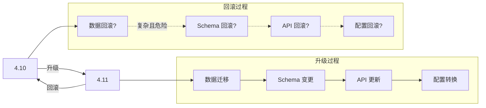
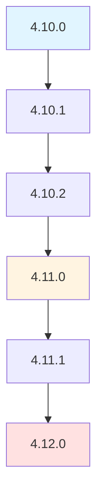
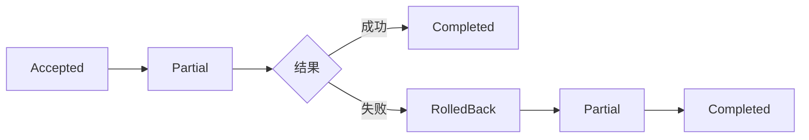
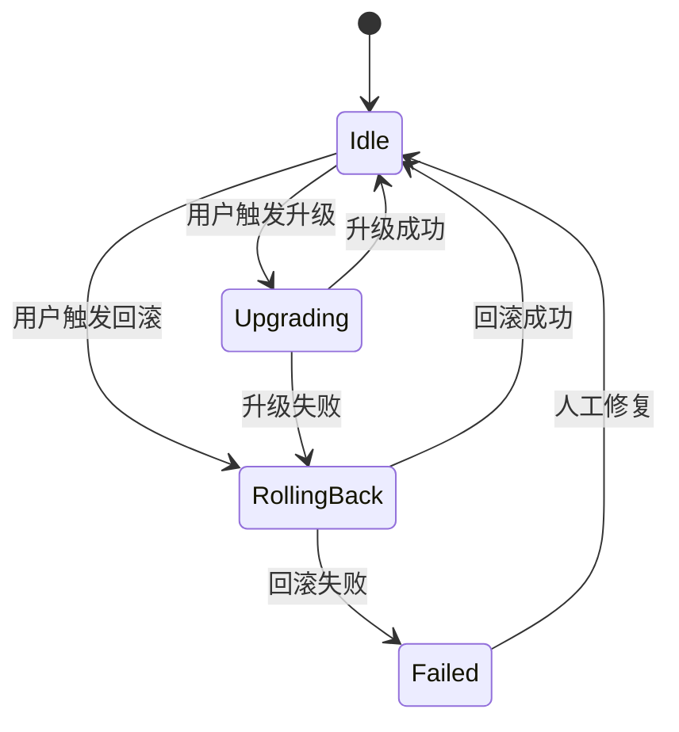
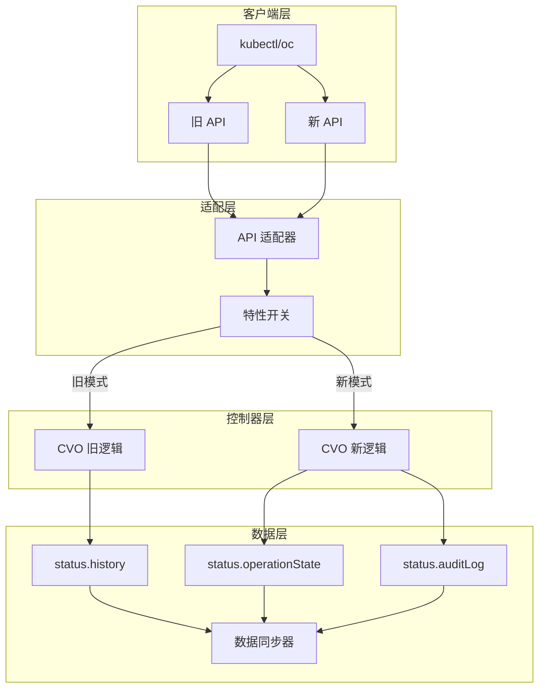
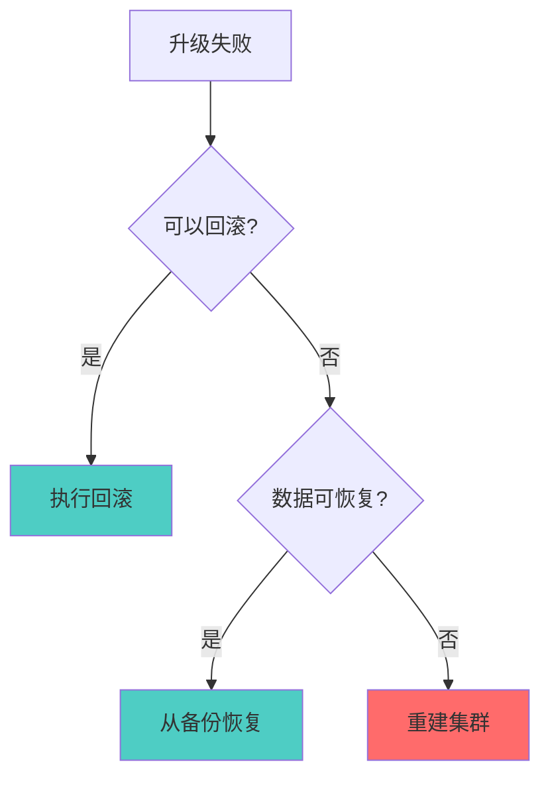
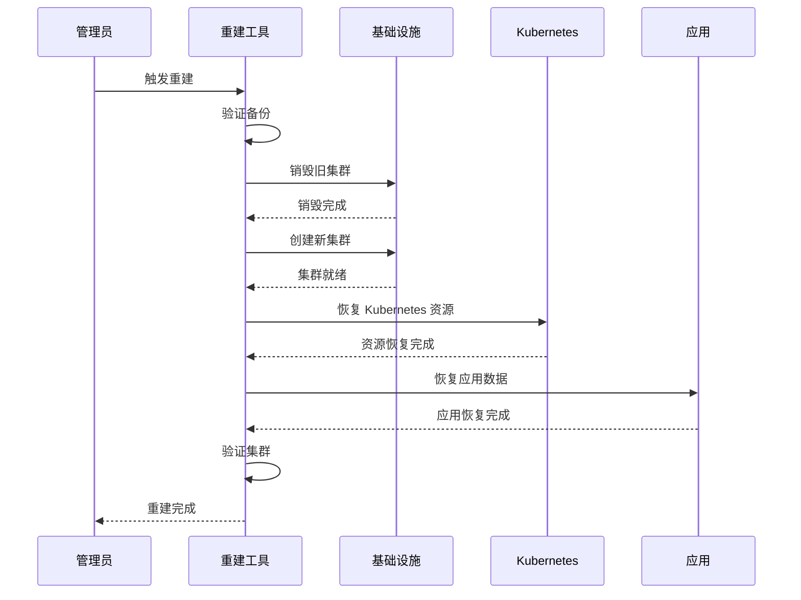
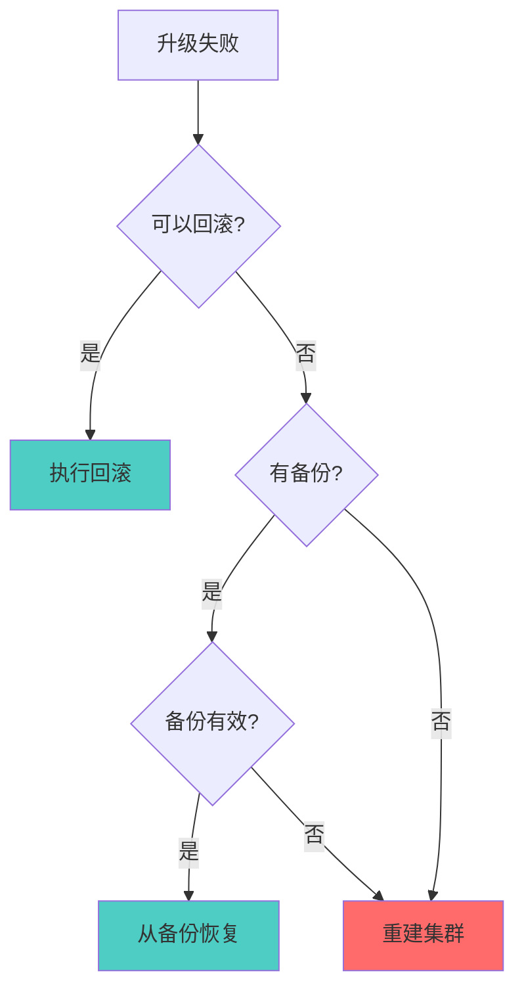

# OpenShift 集群安装与扩容回滚能力洞察报告

## 一、OpenShift 集群生命周期管理架构

### 1.1 核心组件

| 组件 | 职责 | 关键 CRD |
|------|------|---------|
| **Cluster Version Operator (CVO)** | 集群版本管理，驱动升级/回滚 | `ClusterVersion` |
| **Machine Config Operator (MCO)** | 节点配置管理，驱动节点级变更 | `MachineConfig`, `MachineConfigPool` |
| **Cluster API Provider** | 基础设施管理，驱动节点扩缩容 | `Machine`, `MachineSet`, `MachineDeployment` |

### 1.2 状态管理模型

```
ClusterVersion (集群级)
  ├─ desired.version: 目标版本
  ├─ status.desired: 当前目标
  ├─ status.history: 升级历史
  └─ status.conditions: 状态条件

MachineConfigPool (节点池级)
  ├─ spec.configuration: 目标配置
  ├─ status.configuration: 当前配置
  ├─ status.machineCount: 节点数量
  └─ status.unavailableMachineCount: 不可用节点数
```

## 二、集群安装机制

### 2.1 安装流程

```
1. 安装程序 (openshift-install)
   ├─ 生成 Ignition 配置
   ├─ 创建 Bootstrap 节点
   └─ 创建控制平面节点

2. Bootstrap 阶段
   ├─ 启动临时控制平面
   ├─ 创建 etcd 集群
   └─ 启动 CVO

3. CVO 接管
   ├─ 应用 ClusterVersion
   ├─ 部署核心 Operator
   └─ 部署工作负载

4. Bootstrap 完成
   └─ 销毁 Bootstrap 节点
```

### 2.2 安装回滚能力

**关键洞察**：OpenShift 安装过程**不支持自动回滚**，原因：

| 因素 | 说明 |
|------|------|
| **状态不可逆** | etcd 数据、证书、网络配置一旦创建无法简单回滚 |
| **基础设施耦合** | 云资源（VM、网络、存储）已创建 |
| **时间窗口** | 安装失败通常在早期阶段，重建比回滚更快 |

**推荐做法**：安装失败时销毁集群重新安装，而非回滚。

## 三、扩容机制

### 3.1 扩容流程

```
1. 修改 MachineDeployment/MachineSet
   └─ replicas: 3 → 5

2. Machine Controller 创建 Machine
   ├─ 调用 Cloud Provider API
   └─ 创建 VM/实例

3. Node Controller 批准 CSR
   └─ 节点加入集群

4. MCO 应用配置
   ├─ 应用 MachineConfig
   └─ 节点配置完成
```

### 3.2 扩容回滚能力

**支持回滚**，机制如下：

```yaml
# 回滚 MachineDeployment
apiVersion: machine.openshift.io/v1beta1
kind: MachineDeployment
metadata:
  name: worker-us-east-1a
spec:
  replicas: 3  # 从 5 回滚到 3
```

**回滚流程**：
1. 减少 `replicas` 数量
2. Machine Controller 删除多余的 Machine
3. Cloud Provider 销毁 VM/实例
4. Node 从集群中移除

**关键设计**：
- **声明式回滚**：通过修改期望状态触发回滚
- **优雅删除**：先 cordon → drain → delete
- **数据保留**：PVC 数据可选择保留或删除

## 四、升级与回滚机制

### 4.1 升级流程

```
1. 设置目标版本
   └─ oc adm upgrade --to=4.12.0

2. CVO 验证升级路径
   ├─ 检查当前版本
   ├─ 检查目标版本
   └─ 验证升级图

3. CVO 执行升级
   ├─ 更新 ClusterVersion.status
   ├─ 按顺序更新 Operator
   └─ 等待 Operator 就绪

4. MCO 更新节点
   ├─ 生成新的 MachineConfig
   ├─ 逐节点更新配置
   └─ 重启节点应用配置

5. 升级完成
   └─ 更新 ClusterVersion.status.history
```

### 4.2 回滚机制

**OpenShift 4.x 支持两种回滚方式**：

#### 4.2.1 自动回滚（Operator 级别）

```yaml
# ClusterVersion 配置
apiVersion: config.openshift.io/v1
kind: ClusterVersion
metadata:
  name: version
spec:
  clusterID: xxx
  channel: stable-4.12
  desiredUpdate:
    version: 4.12.0
    image: quay.io/openshift-release-dev/ocp-release:4.12.0
    force: false
  autoRollback: true  # 启用自动回滚
  rollbackTimeout: 30m  # 回滚超时时间
```

**自动回滚触发条件**：
- Operator 更新后健康检查失败
- 节点配置应用后节点 NotReady
- 升级超时（默认 30 分钟）

**自动回滚流程**：
```
1. 检测到升级失败
2. 回滚 ClusterVersion 到上一版本
3. CVO 回滚 Operator 到上一版本
4. MCO 回滚节点配置
5. 等待所有组件就绪
6. 更新 ClusterVersion.status.history
```

#### 4.2.2 手动回滚

```bash
# 查看升级历史
oc get clusterversion version -o jsonpath='{.status.history}'

# 手动回滚到指定版本
oc adm upgrade --to=4.11.0 --allow-not-recommended

# 或者修改 ClusterVersion
oc edit clusterversion version
# 修改 spec.channel 和 spec.desiredUpdate
```

**手动回滚限制**：
- 只能回滚到**相邻的上一版本**
- 不能跨多个版本回滚（如 4.12 → 4.10）
- 需要 `--allow-not-recommended` 标志

#### 4.2.1 回滚限制的设计原因

**为什么限制只能回滚到相邻版本？**

##### 1. 技术层面的限制

###### 1.1 数据结构变更不可逆

```yaml
# 示例：CRD schema 变更
# 4.10 → 4.11 升级
apiVersion: apiextensions.k8s.io/v1
kind: CustomResourceDefinition
spec:
  versions:
  - name: v1
    schema:
      openAPIV3Schema:
        properties:
          newField:  # 4.11 新增字段
            type: string

# 如果从 4.11 回滚到 4.10
# 问题：4.10 的代码不认识 newField
# 可能导致：数据丢失、验证失败、API 错误
```

**问题**：
- 每个版本可能引入新的 CRD 字段
- 旧版本代码无法处理新字段
- 回滚时需要删除或转换新字段，但可能丢失数据

###### 1.2 etcd 数据迁移

```go
// 示例：etcd 数据格式变更
type ClusterVersion struct {
    Status ClusterVersionStatus `json:"status"`
}

// 4.10
type ClusterVersionStatus struct {
    History []UpdateHistory `json:"history"`
}

// 4.11 新增字段
type ClusterVersionStatus struct {
    History []UpdateHistory `json:"history"`
    OperationState string `json:"operationState"` // 新增
}

// 回滚问题：
// 1. 4.10 的代码不认识 OperationState
// 2. 从 etcd 读取时会忽略该字段
// 3. 如果再次升级到 4.11，该字段可能丢失或损坏
```

###### 1.3 API 版本兼容性

```yaml
# 示例：API 版本变更
# 4.10: config.openshift.io/v1
# 4.11: config.openshift.io/v1alpha1 (新增)

# 回滚问题：
# 1. 4.11 创建的资源使用 v1alpha1
# 2. 4.10 不认识 v1alpha1
# 3. 回滚后这些资源无法访问
```

##### 2. 数据一致性考虑

###### 2.1 升级是单向过程



**问题**：
- 升级过程包含多个步骤，每个步骤可能修改数据
- 回滚需要逆向执行所有步骤，但某些步骤不可逆
- 跨版本回滚需要处理多个版本的变更，复杂度指数级增长

###### 2.2 状态不一致风险

```yaml
# 示例：跨版本回滚的状态不一致
status:
  # 4.12 的状态
  history:
  - version: "4.12.0"
    state: "Completed"
  - version: "4.11.18"
    state: "Completed"
  - version: "4.11.0"
    state: "Completed"
  
  # 如果从 4.12 回滚到 4.11.0
  # 问题：
  # 1. 4.11.18 的配置可能已被 4.12 修改
  # 2. 4.11.0 的配置可能与当前状态不匹配
  # 3. 某些资源可能处于中间状态
```

##### 3. 升级路径的复杂性

###### 3.1 OpenShift 升级图



**设计原则**：
- 每个版本之间的升级路径经过严格测试
- 只允许经过验证的升级路径
- 跨版本升级需要逐步进行（4.10 → 4.11 → 4.12）

###### 3.2 回滚路径同样需要验证

```go
// 示例：回滚路径验证
type RollbackPath struct {
    FromVersion string
    ToVersion   string
    Tested      bool
    Verified    bool
}

// 允许的相邻回滚
var AllowedRollbacks = []RollbackPath{
    {From: "4.12.0", To: "4.11.18", Tested: true, Verified: true},
    {From: "4.11.18", To: "4.11.0", Tested: true, Verified: true},
}

// 不允许的跨版本回滚
var DisallowedRollbacks = []RollbackPath{
    {From: "4.12.0", To: "4.11.0", Tested: false, Verified: false},
    {From: "4.12.0", To: "4.10.0", Tested: false, Verified: false},
}
```

**原因**：
- 跨版本回滚没有经过充分测试
- 可能存在未发现的兼容性问题
- 风险太高，可能导致集群不可用

##### 4. 实际场景的需求

###### 4.1 大多数场景只需相邻回滚

```yaml
# 场景 1：升级后立即发现问题
时间线：
T0: 升级到 4.12.0
T1: 发现严重 bug
T2: 回滚到 4.11.18

# 场景 2：升级后运行一段时间发现问题
时间线：
T0: 升级到 4.12.0
T30: 运行 30 天
T31: 发现性能问题
T32: 回滚到 4.11.18

# 这两种场景都只需要相邻回滚
```

###### 4.2 需要跨版本回滚的场景

```yaml
# 场景 3：多次升级后发现问题
时间线：
T0: 升级到 4.11.0
T30: 升级到 4.11.18
T60: 升级到 4.12.0
T90: 发现严重问题，需要回滚到 4.11.0

# 这种场景很少见，通常建议：
# 1. 重建集群（推荐）
# 2. 逐步回滚（4.12 → 4.11.18 → 4.11.0）
```

##### 5. 理论和实践的差距

###### 5.1 理论上可以跨版本回滚

```go
// 理论上的跨版本回滚实现
func (cvo *ClusterVersionOperator) RollbackToVersion(targetVersion string) error {
    currentVersion := cvo.getCurrentVersion()
    
    // 1. 计算回滚路径
    path := cvo.calculateRollbackPath(currentVersion, targetVersion)
    
    // 2. 逐步回滚
    for _, version := range path {
        if err := cvo.rollbackToAdjacent(version); err != nil {
            return err
        }
    }
    
    return nil
}
```

**理论上可行的原因**：
- 可以逐步回滚（4.12 → 4.11.18 → 4.11.0）
- 每个步骤都是相邻版本回滚
- 最终达到目标版本

###### 5.2 实践中的挑战

```yaml
# 挑战 1：数据迁移的复杂性
升级 4.10 → 4.11 → 4.12：
- 4.10 → 4.11: 数据迁移 A
- 4.11 → 4.12: 数据迁移 B

回滚 4.12 → 4.11 → 4.10：
- 4.12 → 4.11: 需要逆向执行 B
- 4.11 → 4.10: 需要逆向执行 A

问题：
1. 某些迁移可能不可逆
2. 逆向迁移可能丢失数据
3. 需要为每个迁移编写逆向逻辑

# 挑战 2：测试覆盖
相邻回滚：
- 4.12 → 4.11: 需要测试
- 4.11 → 4.11.18: 需要测试
- 4.11.18 → 4.11.0: 需要测试

跨版本回滚：
- 4.12 → 4.11.0: 需要测试（4.12 → 4.11.18 → 4.11.0）
- 4.12 → 4.10.0: 需要测试（4.12 → 4.11.18 → 4.11.0 → 4.10.x）

问题：
1. 测试矩阵爆炸
2. 某些路径可能无法测试（版本已废弃）
3. 维护成本太高
```

##### 6. OpenShift 的设计哲学

###### 6.1 保守策略

```yaml
# OpenShift 的选择
设计原则：
1. 只支持经过充分测试的功能
2. 降低复杂度，提高可靠性
3. 对于复杂场景，推荐重建集群

回滚策略：
1. 只支持相邻版本回滚
2. 跨版本回滚需要逐步进行
3. 如果需要回滚多个版本，建议重建集群
```

###### 6.2 替代方案

```bash
# 如果需要回滚多个版本

# 方案 1：逐步回滚（推荐）
oc adm upgrade --to=4.11.18  # 4.12 → 4.11.18
oc adm upgrade --to=4.11.0   # 4.11.18 → 4.11.0

# 方案 2：重建集群（更推荐）
openshift-install destroy cluster
openshift-install create cluster --version 4.11.0

# 方案 3：从备份恢复
# 如果有 etcd 备份，可以恢复到备份时的状态
```

##### 7. 总结

###### 7.1 限制原因

| 原因 | 说明 | 影响 |
|------|------|------|
| **数据结构变更** | CRD schema、API 版本等变更可能不可逆 | 跨版本回滚可能导致数据丢失 |
| **数据一致性** | 升级过程包含多个不可逆步骤 | 回滚需要逆向执行所有步骤 |
| **测试覆盖** | 跨版本回滚路径未经充分测试 | 可能存在未发现的兼容性问题 |
| **复杂度** | 跨版本回滚需要处理多个版本的变更 | 维护成本太高 |
| **实际需求** | 大多数场景只需相邻回滚 | 跨版本回滚场景很少 |

###### 7.2 理论上可以跨版本回滚吗？

**可以，但不推荐**：

1. **理论上可行**：通过逐步回滚（4.12 → 4.11.18 → 4.11.0）
2. **实践中困难**：
   - 需要为每个版本编写逆向迁移逻辑
   - 测试矩阵爆炸
   - 某些版本可能已废弃，无法测试
3. **更好的替代方案**：
   - 逐步回滚（推荐）
   - 重建集群（更推荐）
   - 从备份恢复

###### 7.3 OpenShift 的设计选择

OpenShift 选择了**保守策略**：
- 只支持相邻版本回滚
- 降低复杂度，提高可靠性
- 对于复杂场景，推荐重建集群

这是一个**权衡取舍**：
- **优点**：简单、可靠、易维护
- **缺点**：灵活性受限

对于 BKE 的设计，可以考虑：
1. **初期**：只支持相邻版本回滚（降低复杂度）
2. **后期**：根据实际需求，逐步支持跨版本回滚
3. **始终**：提供重建集群的替代方案

### 4.3 回滚版本获取机制

**核心问题**：如何确定可以回滚到哪个版本？

#### 4.3.1 升级历史数据结构

OpenShift ClusterVersion 的 `status.history` 字段存储了完整的升级历史：

```go
type UpdateHistory struct {
    // state 记录升级状态
    // - Completed: 升级成功完成
    // - Partial: 升级进行中或部分完成
    // - Accepted: 升级已被接受但尚未开始
    // - RolledBack: 升级失败并已回滚（OpenShift 4.14+）
    State UpdateState `json:"state"`
    
    // version 是目标版本
    Version string `json:"version"`
    
    // image 是发布镜像
    Image string `json:"image"`
    
    // startedTime 是升级开始时间
    StartedTime metav1.Time `json:"startedTime"`
    
    // completionTime 是升级完成时间
    // - state=Completed 时：升级成功完成时间
    // - state=RolledBack 时：回滚决策时间（非回滚完成时间）
    // - state=Partial 时：不存在
    CompletionTime *metav1.Time `json:"completionTime,omitempty"`
    
    // verified 表示发布镜像是否已验证
    Verified bool `json:"verified"`
    
    // acceptedRisks 记录升级过程中接受的风险
    AcceptedRisks string `json:"acceptedRisks,omitempty"`
}

type UpdateState string

const (
    // CompletedUpdateState 表示升级已成功完成
    CompletedUpdateState UpdateState = "Completed"
    
    // PartialUpdateState 表示升级正在进行或部分完成
    // 包括：升级中、升级失败、回滚中
    PartialUpdateState UpdateState = "Partial"
    
    // AcceptedUpdateState 表示升级已被接受但尚未开始
    AcceptedUpdateState UpdateState = "Accepted"
    
    // RolledBackUpdateState 表示升级失败并已回滚（OpenShift 4.14+）
    // 这是一个终态，表示该升级尝试已被放弃
    RolledBackUpdateState UpdateState = "RolledBack"
)
```

**回滚记录的字段设计**：

**1. state 字段**

回滚记录有两种形态：

| 形态 | state 值 | 含义 | 是否终态 |
|------|---------|------|---------|
| **失败的升级记录** | `RolledBack` | 该升级尝试失败并已回滚 | 是（不可转换） |
| **回滚执行记录** | `Partial` → `Completed` | 正在执行回滚 → 回滚完成 | 否 → 是 |

**2. completionTime 字段**

`completionTime` 在不同状态下的含义：

| state | completionTime | 含义 |
|-------|----------------|------|
| `Completed` | 升级成功完成时间 | 升级流程结束时间 |
| `RolledBack` | 回滚决策时间 | CVO 决定回滚的时间点 |
| `Partial` | 不存在 | 操作尚未完成 |

**3. version 字段**

回滚记录中的 `version` 字段含义：

| 记录类型 | version 含义 | 示例 |
|---------|-------------|------|
| 失败的升级记录 | 失败的升级目标版本 | `4.12.0`（升级失败） |
| 回滚执行记录 | 回滚目标版本 | `4.11.18`（回滚到此版本） |

**4. 回滚记录的完整字段说明**

```yaml
# 失败的升级记录（标记为 RolledBack）
- state: RolledBack              # 状态：已回滚
  version: "4.12.0"              # 失败的升级目标版本
  image: "quay.io/.../4.12.0"    # 失败的发布镜像
  startedTime: "2024-01-15T10:00:00Z"      # 升级开始时间
  completionTime: "2024-01-15T11:00:00Z"   # 回滚决策时间
  verified: true                 # 镜像已验证
  acceptedRisks: ""              # 无接受的风险

# 回滚执行记录
- state: Completed               # 状态：回滚完成
  version: "4.11.18"             # 回滚目标版本
  image: "quay.io/.../4.11.18"   # 回滚使用的镜像
  startedTime: "2024-01-15T11:00:00Z"      # 回滚开始时间
  completionTime: "2024-01-15T12:00:00Z"   # 回滚完成时间
  verified: true                 # 镜像已验证
  acceptedRisks: ""              # 无接受的风险
```

**5. 回滚记录与升级记录的对比**

| 字段 | 升级记录 | 回滚记录（失败） | 回滚记录（执行） |
|------|---------|-----------------|-----------------|
| `state` | `Completed` | `RolledBack` | `Partial` → `Completed` |
| `version` | 升级目标版本 | 失败的升级目标版本 | 回滚目标版本 |
| `image` | 升级镜像 | 失败的升级镜像 | 回滚镜像 |
| `startedTime` | 升级开始时间 | 升级开始时间 | 回滚开始时间 |
| `completionTime` | 升级完成时间 | 回滚决策时间 | 回滚完成时间 |
| `verified` | 是否验证 | 是否验证 | 是否验证 |

**6. 回滚记录的创建时机**

```
T0: 升级到 4.12.0 开始
    创建升级记录：history[0] = {state: Partial, version: 4.12.0, startedTime: T0}

T1: 升级失败
    升级记录保持：history[0] = {state: Partial, version: 4.12.0}

T2: CVO 触发自动回滚
    修改升级记录：history[0] = {state: RolledBack, version: 4.12.0, completionTime: T2}
    创建回滚记录：history[1] = {state: Partial, version: 4.11.18, startedTime: T2}

T3: 回滚执行中
    回滚记录保持：history[1] = {state: Partial, version: 4.11.18}

T4: 回滚完成
    更新回滚记录：history[1] = {state: Completed, version: 4.11.18, completionTime: T4}
```

**7. 回滚记录的关键设计点**

1. **分离失败记录和回滚记录**：失败的升级记录标记为 `RolledBack`，回滚执行创建新记录
2. **completionTime 的双重含义**：对于 `RolledBack` 记录，`completionTime` 是回滚决策时间；对于 `Completed` 记录，是完成时间
3. **保留完整历史**：即使升级失败，也保留完整的升级历史记录，便于审计和问题排查
4. **版本一致性**：回滚记录的 `version` 字段指向回滚目标版本，而非失败的升级版本

#### 4.3.2 升级历史示例

**成功升级的历史记录：**

```yaml
status:
  history:
  - state: Completed
    version: 4.12.0
    image: quay.io/openshift-release-dev/ocp-release:4.12.0-x86_64
    startedTime: "2024-01-15T10:00:00Z"
    completionTime: "2024-01-15T11:30:00Z"
    verified: true
  - state: Completed
    version: 4.11.18
    image: quay.io/openshift-release-dev/ocp-release:4.11.18-x86_64
    startedTime: "2023-12-01T08:00:00Z"
    completionTime: "2023-12-01T09:30:00Z"
    verified: true
```

**升级失败时的历史记录：**

```yaml
status:
  history:
  - state: Partial          # 升级失败，state 保持为 Partial
    version: 4.12.0
    image: quay.io/openshift-release-dev/ocp-release:4.12.0-x86_64
    startedTime: "2024-01-15T10:00:00Z"
    # completionTime 不存在，因为升级未完成
    verified: true
  - state: Completed
    version: 4.11.18
    image: quay.io/openshift-release-dev/ocp-release:4.11.18-x86_64
    startedTime: "2023-12-01T08:00:00Z"
    completionTime: "2023-12-01T09:30:00Z"
    verified: true
  conditions:
  - type: Failing
    status: "True"
    reason: UpgradeFailed
    message: "Unable to apply 4.12.0: Operator health check failed"
    lastTransitionTime: "2024-01-15T10:45:00Z"
```

**Partial 状态的详细含义：**

**字面含义**：Partial = 部分的、不完整的

**在 OpenShift 中的含义**：
- 升级已开始但尚未完成
- 没有 `completionTime`（完成时间）
- 可能是正常状态（升级中）或异常状态（升级失败）

**Partial 的两种场景**：

| 场景 | state | conditions | 含义 |
|------|-------|------------|------|
| **升级进行中** | `Partial` | `Progressing=True` | 正常状态，升级正在执行 |
| **升级失败** | `Partial` | `Failing=True` | 异常状态，升级失败 |

**为什么使用 Partial 而不是 Failed？**

1. **升级是渐进过程**：OpenShift 升级涉及多个组件，可能部分成功、部分失败
2. **保留失败记录**：即使失败，也需要保留记录用于回滚和审计
3. **允许手动干预**：用户可以选择重试升级或触发回滚
4. **状态一致性**：Partial 表示"未完成"，不预设结果（成功/失败）

**状态转换图**：

```
Accepted → Partial (升级中) → Completed (成功)
                         ↓
                    Partial (失败) → RolledBack (回滚)
```

**关键区别：**

| 状态 | history[0].state | completionTime | conditions |
|------|------------------|----------------|------------|
| 升级成功 | `Completed` | 有值 | `Available=True` |
| 升级失败 | `Partial` | 无值 | `Failing=True` |
| 升级中 | `Partial` | 无值 | `Progressing=True` |

**CVO 如何检测升级失败：**

```go
func (cvo *ClusterVersionOperator) isUpgradeFailed(cv *configv1.ClusterVersion) bool {
    if len(cv.Status.History) == 0 {
        return false
    }
    
    latest := cv.Status.History[0]
    
    // 条件 1: state 为 Partial（未完成）
    if latest.State != configv1.PartialUpdateState {
        return false
    }
    
    // 条件 2: 检查 Failing condition
    for _, cond := range cv.Status.Conditions {
        if cond.Type == "Failing" && cond.Status == "True" {
            return true
        }
    }
    
    // 条件 3: 检查是否超时
    if time.Since(latest.StartedTime.Time) > cvo.upgradeTimeout {
        return true
    }
    
    return false
}
```

#### 4.3.3 版本选择算法

**CVO 通过以下算法确定可回滚版本**：

```go
// GetRollbackTarget 获取可回滚的目标版本
func (cvo *ClusterVersionOperator) GetRollbackTarget(cv *configv1.ClusterVersion) (string, error) {
    // 1. 获取升级历史
    history := cv.Status.History
    
    // 2. 查找最新的 Completed 状态记录（当前版本）
    var currentVersion string
    for _, h := range history {
        if h.State == configv1.CompletedUpdateState {
            currentVersion = h.Version
            break
        }
    }
    
    if currentVersion == "" {
        return "", fmt.Errorf("no completed upgrade found")
    }
    
    // 3. 查找上一条 Completed 状态记录（可回滚版本）
    var rollbackVersion string
    foundCurrent := false
    for _, h := range history {
        if h.State == configv1.CompletedUpdateState {
            if foundCurrent {
                // 这是上一条 Completed 记录
                rollbackVersion = h.Version
                break
            }
            if h.Version == currentVersion {
                foundCurrent = true
            }
        }
    }
    
    if rollbackVersion == "" {
        return "", fmt.Errorf("no rollback target found")
    }
    
    // 4. 验证回滚版本是否在升级图中
    if !cvo.isVersionInUpgradeGraph(rollbackVersion) {
        return "", fmt.Errorf("rollback version %s not in upgrade graph", rollbackVersion)
    }
    
    return rollbackVersion, nil
}
```

#### 4.3.4 版本验证机制

**CVO 在回滚前会进行以下验证**：

1. **升级图验证**：检查目标版本是否在官方升级图中
   ```bash
   # 查看可用升级路径
   oc adm upgrade --allow-explicit-upgrade --to-image=<image>
   ```

2. **发布镜像验证**：验证目标版本的发布镜像签名
   ```go
   if !verified {
       return fmt.Errorf("release image not verified")
   }
   ```

3. **兼容性验证**：检查目标版本与当前组件的兼容性
   ```go
   if !cvo.isCompatible(currentComponents, targetVersion) {
       return fmt.Errorf("version not compatible with current components")
   }
   ```

### 4.4 回滚时 ClusterVersion 的目标版本

**核心问题**：回滚时 ClusterVersion 的 `spec.desiredUpdate.version` 是什么？

#### 4.4.1 目标版本确定规则

**回滚目标版本 = 上一个成功升级的版本**

```
升级前状态：
  spec.desiredUpdate.version: 4.11.18  (当前运行版本)
  status.history[0].version: 4.11.18
  status.history[0].state: Completed

升级到 4.12.0：
  spec.desiredUpdate.version: 4.12.0   (目标版本)
  status.history[0].version: 4.12.0
  status.history[0].state: Partial     (升级中)
  status.history[1].version: 4.11.18
  status.history[1].state: Completed

升级失败触发回滚：
  spec.desiredUpdate.version: 4.11.18  (回滚目标 = 上一个成功版本)
  status.history[0].version: 4.12.0
  status.history[0].state: RolledBack  (标记为已回滚)
  status.history[1].version: 4.11.18
  status.history[1].state: Completed   (回滚到此版本)
```

#### 4.4.2 目标版本设置时机

**自动回滚时**：

```go
// CVO 检测到升级失败后自动设置回滚目标
func (cvo *ClusterVersionOperator) handleUpgradeFailure(cv *configv1.ClusterVersion) error {
    // 1. 获取回滚目标版本
    rollbackVersion, err := cvo.GetRollbackTarget(cv)
    if err != nil {
        return err
    }
    
    // 2. 设置回滚目标
    cv.Spec.DesiredUpdate = &configv1.Update{
        Version: rollbackVersion,
        Image:   cvo.getReleaseImage(rollbackVersion),
        Force:   false,
    }
    
    // 3. 更新 ClusterVersion 对象
    return cvo.client.Update(context.TODO(), cv)
}
```

**手动回滚时**：

```bash
# 用户手动设置回滚目标
oc adm upgrade --to=4.11.18 --allow-not-recommended

# 这会修改 ClusterVersion.spec.desiredUpdate
kubectl get clusterversion version -o yaml
# spec:
#   desiredUpdate:
#     version: 4.11.18
#     image: quay.io/openshift-release-dev/ocp-release:4.11.18-x86_64
```

#### 4.4.3 ClusterVersion 状态变化

**升级前**：
```yaml
apiVersion: config.openshift.io/v1
kind: ClusterVersion
metadata:
  name: version
spec:
  clusterID: xxx
  channel: stable-4.11
  desiredUpdate:
    version: 4.11.18
    image: quay.io/openshift-release-dev/ocp-release:4.11.18-x86_64
status:
  desired:
    version: 4.11.18
    image: quay.io/openshift-release-dev/ocp-release:4.11.18-x86_64
  history:
  - state: Completed
    version: 4.11.18
    startedTime: "2023-12-01T08:00:00Z"
    completionTime: "2023-12-01T09:30:00Z"
  - state: Completed
    version: 4.11.0
    startedTime: "2023-10-15T10:00:00Z"
    completionTime: "2023-10-15T11:30:00Z"
```

**升级到 4.12.0（失败）**：
```yaml
spec:
  desiredUpdate:
    version: 4.12.0
    image: quay.io/openshift-release-dev/ocp-release:4.12.0-x86_64
status:
  desired:
    version: 4.12.0
    image: quay.io/openshift-release-dev/ocp-release:4.12.0-x86_64
  history:
  - state: Partial          # 升级失败
    version: 4.12.0
    startedTime: "2024-01-15T10:00:00Z"
  - state: Completed
    version: 4.11.18
    startedTime: "2023-12-01T08:00:00Z"
    completionTime: "2023-12-01T09:30:00Z"
  conditions:
  - type: Failing
    status: "True"
    reason: UpgradeFailed
    message: "Upgrade to 4.12.0 failed: Operator health check failed"
```

**触发自动回滚**：
```yaml
spec:
  desiredUpdate:
    version: 4.11.18        # 回滚目标 = 上一个成功版本
    image: quay.io/openshift-release-dev/ocp-release:4.11.18-x86_64
status:
  desired:
    version: 4.11.18        # 目标版本已更新
    image: quay.io/openshift-release-dev/ocp-release:4.11.18-x86_64
  history:
  - state: RolledBack       # 标记为已回滚
    version: 4.12.0
    startedTime: "2024-01-15T10:00:00Z"
    completionTime: "2024-01-15T11:00:00Z"
  - state: Partial          # 正在回滚
    version: 4.11.18
    startedTime: "2024-01-15T11:00:00Z"
  - state: Completed
    version: 4.11.0
  conditions:
  - type: Failing
    status: "False"         # 失败状态已清除
  - type: RollbackInProgress
    status: "True"
    reason: AutomaticRollback
    message: "Rolling back to 4.11.18 due to upgrade failure"
```

**回滚触发详细流程**：

**步骤 1: 检测升级失败**

CVO 在调谐循环中持续检查升级状态，通过以下条件判断升级是否失败：

```go
func (cvo *ClusterVersionOperator) detectUpgradeFailure(cv *configv1.ClusterVersion) bool {
    // 条件 1: 检查最新的升级记录是否为 Partial 状态
    if len(cv.Status.History) == 0 {
        return false
    }
    
    latest := cv.Status.History[0]
    if latest.State != configv1.PartialUpdateState {
        return false
    }
    
    // 条件 2: 检查 Failing condition 是否为 True
    for _, cond := range cv.Status.Conditions {
        if cond.Type == "Failing" && cond.Status == metav1.ConditionTrue {
            return true
        }
    }
    
    // 条件 3: 检查是否超时（默认 30 分钟）
    if time.Since(latest.StartedTime.Time) > cvo.upgradeTimeout {
        return true
    }
    
    return false
}
```

**步骤 2: 获取回滚目标版本**

```go
func (cvo *ClusterVersionOperator) getRollbackTarget(cv *configv1.ClusterVersion) (string, error) {
    // 遍历 history，找到最近的 Completed 状态记录
    // 跳过第一个 Partial 状态记录（失败的升级）
    for i := 1; i < len(cv.Status.History); i++ {
        if cv.Status.History[i].State == configv1.CompletedUpdateState {
            return cv.Status.History[i].Version, nil
        }
    }
    return "", fmt.Errorf("no rollback target found")
}
```

**步骤 3: 标记失败记录为 RolledBack**

```go
func (cvo *ClusterVersionOperator) markAsRolledBack(cv *configv1.ClusterVersion) {
    // 修改第一个记录的 state 为 RolledBack
    cv.Status.History[0].State = configv1.RolledBackUpdateState
    
    // 设置 completionTime（标记回滚决策时间）
    now := metav1.Now()
    cv.Status.History[0].CompletionTime = &now
    
    // 清除 Failing condition
    for i, cond := range cv.Status.Conditions {
        if cond.Type == "Failing" {
            cv.Status.Conditions[i].Status = metav1.ConditionFalse
            cv.Status.Conditions[i].Message = "Upgrade failed, rollback initiated"
            break
        }
    }
    
    // 添加 RollbackInProgress condition
    cv.Status.Conditions = append(cv.Status.Conditions, configv1.ClusterOperatorStatusCondition{
        Type:               "RollbackInProgress",
        Status:             metav1.ConditionTrue,
        Reason:             "AutomaticRollback",
        Message:            fmt.Sprintf("Rolling back to %s due to upgrade failure", rollbackTarget),
        LastTransitionTime: metav1.Now(),
    })
}
```

**步骤 4: 创建新的回滚记录**

```go
func (cvo *ClusterVersionOperator) createRollbackRecord(cv *configv1.ClusterVersion, targetVersion string) {
    // 创建新的回滚记录
    rollbackRecord := configv1.UpdateHistory{
        State:       configv1.PartialUpdateState,  // 初始为 Partial
        Version:     targetVersion,
        Image:       cvo.getReleaseImage(targetVersion),
        StartedTime: metav1.Now(),
        // CompletionTime 不存在，因为回滚尚未完成
    }
    
    // 插入到 history 数组的开头
    // 原来的 RolledBack 记录变成 history[0]
    // 新的回滚记录变成 history[1]
    newHistory := make([]configv1.UpdateHistory, len(cv.Status.History)+1)
    newHistory[0] = cv.Status.History[0]  // RolledBack 记录
    newHistory[1] = rollbackRecord        // 新的回滚记录
    copy(newHistory[2:], cv.Status.History[1:])  // 其他历史记录
    
    cv.Status.History = newHistory
    
    // 更新 desired 状态
    cv.Status.Desired.Version = targetVersion
    cv.Status.Desired.Image = rollbackRecord.Image
}
```

**步骤 5: 更新 ClusterVersion 对象**

```go
func (cvo *ClusterVersionOperator) executeRollback(cv *configv1.ClusterVersion) error {
    // 1. 获取回滚目标
    targetVersion, err := cvo.getRollbackTarget(cv)
    if err != nil {
        return err
    }
    
    // 2. 标记失败记录为 RolledBack
    cvo.markAsRolledBack(cv)
    
    // 3. 创建新的回滚记录
    cvo.createRollbackRecord(cv, targetVersion)
    
    // 4. 更新 spec.desiredUpdate（触发回滚执行）
    cv.Spec.DesiredUpdate = &configv1.Update{
        Version: targetVersion,
        Image:   cvo.getReleaseImage(targetVersion),
    }
    
    // 5. 更新 ClusterVersion 对象到 API Server
    if err := cvo.client.Status().Update(context.TODO(), cv); err != nil {
        return err
    }
    
    // 6. 发送事件
    cvo.recorder.Eventf(cv, corev1.EventTypeWarning, "UpgradeFailed",
        "Upgrade to %s failed, initiating automatic rollback to %s",
        cv.Status.History[0].Version, targetVersion)
    
    return nil
}
```

**状态转换时序图**：

```
时间线                          ClusterVersion 状态变化
────────────────────────────────────────────────────────────────
T0: 升级到 4.12.0 开始          history[0] = {state: Partial, version: 4.12.0}
                                
T1: 升级失败                    history[0] = {state: Partial, version: 4.12.0}
                                conditions = [{type: Failing, status: True}]
                                
T2: CVO 检测到失败              调用 executeRollback()
                                
T3: 标记失败记录                history[0] = {state: RolledBack, version: 4.12.0, completionTime: T3}
                                history[1] = {state: Partial, version: 4.11.18}  ← 新创建
                                conditions = [{type: RollbackInProgress, status: True}]
                                spec.desiredUpdate.version = 4.11.18
                                
T4: 回滚执行中                  history[0] = {state: RolledBack, version: 4.12.0}
                                history[1] = {state: Partial, version: 4.11.18}
                                
T5: 回滚完成                    history[0] = {state: RolledBack, version: 4.12.0}
                                history[1] = {state: Completed, version: 4.11.18, completionTime: T5}
                                conditions = [{type: Available, status: True}]
```

**关键点总结**：

| 步骤 | 操作 | history 变化 |
|------|------|-------------|
| 1. 检测失败 | 检查 `Partial` + `Failing=True` | 无变化 |
| 2. 获取目标 | 遍历 history 找 `Completed` 记录 | 无变化 |
| 3. 标记 RolledBack | 修改 `history[0].state` | `history[0]`: `Partial` → `RolledBack` |
| 4. 创建回滚记录 | 在 `history[0]` 后插入新记录 | 新增 `history[1]`: `{state: Partial, version: 4.11.18}` |
| 5. 更新 spec | 修改 `spec.desiredUpdate.version` | 无变化 |
| 6. 执行回滚 | CVO 执行回滚操作 | `history[1]`: `Partial` → `Completed` |

**为什么需要两个步骤（标记 + 创建）？**

1. **保留失败记录**：将失败的升级标记为 `RolledBack`，保留完整的审计历史
2. **记录回滚决策**：`completionTime` 记录回滚决策时间，而非回滚完成时间
3. **触发回滚执行**：创建新的 `Partial` 记录，表示回滚正在进行
4. **状态一致性**：`spec.desiredUpdate.version` 与 `history[1].version` 一致，触发回滚执行

**回滚完成**：
```yaml
spec:
  desiredUpdate:
    version: 4.11.18        # 保持回滚目标
    image: quay.io/openshift-release-dev/ocp-release:4.11.18-x86_64
status:
  desired:
    version: 4.11.18
    image: quay.io/openshift-release-dev/ocp-release:4.11.18-x86_64
  history:
  - state: RolledBack       # 失败的升级
    version: 4.12.0
    startedTime: "2024-01-15T10:00:00Z"
    completionTime: "2024-01-15T11:00:00Z"
  - state: Completed        # 回滚成功
    version: 4.11.18
    startedTime: "2024-01-15T11:00:00Z"
    completionTime: "2024-01-15T12:00:00Z"
  - state: Completed
    version: 4.11.0
  conditions:
  - type: Available
    status: "True"
    reason: AsExpected
    message: "Cluster version is 4.11.18"
  - type: RollbackInProgress
    status: "False"         # 回滚已完成
```

#### 4.4.4 目标版本选择规则

**CVO 遵循以下规则选择回滚目标**：

| 规则 | 说明 | 示例 |
|------|------|------|
| **最近成功原则** | 选择最近的 `state=Completed` 版本 | 4.12.0 失败 → 回滚到 4.11.18 |
| **升级图验证** | 目标版本必须在官方升级图中 | 不能回滚到不在升级图中的版本 |
| **镜像验证** | 目标版本的发布镜像必须可用且已验证 | 镜像签名验证通过 |
| **兼容性检查** | 目标版本与当前组件兼容 | 不能回滚到不兼容的版本 |
| **单一回滚** | 只能回滚一个版本，不能跨多个版本 | 4.12.0 → 4.11.18，不能直接到 4.11.0 |

#### 4.4.5 特殊情况处理

**情况 1：没有可回滚版本**

```yaml
status:
  history:
  - state: Partial        # 只有失败的升级记录
    version: 4.12.0
  - state: Failed         # 没有 Completed 状态
    version: 4.11.18
```

**处理**：CVO 无法自动回滚，需要用户手动干预
```bash
# 用户需要手动指定回滚目标
oc adm upgrade --to=4.11.18 --allow-explicit-upgrade --force
```

**情况 2：回滚目标版本不可用**

```go
// 发布镜像无法拉取
if !cvo.isImageAvailable(rollbackImage) {
    return fmt.Errorf("rollback image %s not available", rollbackImage)
}
```

**处理**：CVO 会重试或等待用户介入

**情况 3：多次升级失败**

```yaml
status:
  history:
  - state: Partial        # 第三次升级失败
    version: 4.13.0
  - state: RolledBack     # 第二次升级失败并回滚
    version: 4.12.0
  - state: Completed      # 当前稳定版本
    version: 4.11.18
```

**处理**：回滚目标仍然是最近的 `Completed` 版本（4.11.18）

### 4.5 回滚触发机制

**核心问题**：当回滚目标版本（4.11.18）与 status 中的实际版本（4.11.18）一致时，CVO 如何触发回滚执行？

#### 4.5.1 关键对比：spec.desiredUpdate vs status.history

**CVO 通过对比 `spec.desiredUpdate.version` 与 `status.history[0].version` 来判断是否需要执行升级/回滚**

```
升级前：
  spec.desiredUpdate.version: 4.11.18
  status.history[0].version: 4.11.18
  status.history[0].state: Completed
  → 一致，无需操作

升级到 4.12.0：
  spec.desiredUpdate.version: 4.12.0  ← 用户设置目标
  status.history[0].version: 4.12.0
  status.history[0].state: Partial    ← 升级中
  → 目标与当前尝试版本一致，继续升级

升级失败触发回滚：
  spec.desiredUpdate.version: 4.11.18 ← CVO 修改为目标
  status.history[0].version: 4.12.0   ← 失败的版本
  status.history[0].state: RolledBack ← 标记为已回滚
  → 目标 (4.11.18) != 当前尝试 (4.12.0)，触发回滚

回滚执行中：
  spec.desiredUpdate.version: 4.11.18
  status.history[0].version: 4.12.0   ← 已标记为 RolledBack
  status.history[1].version: 4.11.18
  status.history[1].state: Partial    ← 正在回滚到此版本
  → 目标与回滚尝试版本一致，继续回滚

回滚完成：
  spec.desiredUpdate.version: 4.11.18
  status.history[0].version: 4.12.0   ← RolledBack
  status.history[1].version: 4.11.18
  status.history[1].state: Completed  ← 回滚成功
  → 一致，无需操作
```

#### 4.5.2 CVO 调谐循环逻辑

```go
func (cvo *ClusterVersionOperator) Reconcile() error {
    cv := cvo.getClusterVersion()
    
    // 1. 获取期望版本
    desiredVersion := cv.Spec.DesiredUpdate.Version
    
    // 2. 获取当前状态
    currentHistory := cv.Status.History[0]
    
    // 3. 判断是否需要操作
    if cvo.needsUpgradeOrRollback(desiredVersion, currentHistory) {
        // 4. 判断是升级还是回滚
        actionType := cvo.determineActionType(desiredVersion, currentHistory)
        
        // 5. 执行升级或回滚
        return cvo.executeUpgradeOrRollback(desiredVersion, actionType)
    }
    
    return nil
}

func (cvo *ClusterVersionOperator) needsUpgradeOrRollback(
    desiredVersion string,
    currentHistory configv1.UpdateHistory,
) bool {
    // 情况 1: 当前版本与期望版本一致且已完成 → 无需操作
    if currentHistory.Version == desiredVersion && 
       currentHistory.State == configv1.CompletedUpdateState {
        return false
    }
    
    // 情况 2: 当前版本与期望版本不一致 → 需要升级或回滚
    if currentHistory.Version != desiredVersion {
        return true
    }
    
    // 情况 3: 当前版本与期望版本一致但未完成 → 继续执行
    if currentHistory.State == configv1.PartialUpdateState {
        return true
    }
    
    return false
}

// determineActionType 判断是升级还是回滚
func (cvo *ClusterVersionOperator) determineActionType(
    desiredVersion string,
    currentHistory configv1.UpdateHistory,
) ActionType {
    currentVersion := currentHistory.Version
    
    // 情况 1: 版本相同，继续当前操作
    if currentVersion == desiredVersion {
        if currentHistory.State == configv1.PartialUpdateState {
            // 检查是否有 RolledBack 标记
            // 如果有，说明是回滚操作
            return cvo.inferActionFromHistory(currentHistory)
        }
        return ActionUpgrade // 默认是升级
    }
    
    // 情况 2: 版本不同，通过版本比较判断
    return cvo.compareVersions(desiredVersion, currentVersion)
}

// compareVersions 通过版本比较判断是升级还是回滚
func (cvo *ClusterVersionOperator) compareVersions(desired, current string) ActionType {
    // 使用语义化版本比较
    desiredSemver, err := semver.Parse(desired)
    if err != nil {
        return ActionUpgrade // 解析失败，默认升级
    }
    
    currentSemver, err := semver.Parse(current)
    if err != nil {
        return ActionUpgrade // 解析失败，默认升级
    }
    
    // 版本比较
    if desiredSemver.GT(currentSemver) {
        return ActionUpgrade   // desired > current → 升级
    } else if desiredSemver.LT(currentSemver) {
        return ActionRollback  // desired < current → 回滚
    }
    
    return ActionUpgrade // 版本相同，默认升级
}

// inferActionFromHistory 从历史记录推断操作类型
func (cvo *ClusterVersionOperator) inferActionFromHistory(history configv1.UpdateHistory) ActionType {
    // 检查 history 中是否有 RolledBack 状态的记录
    // 如果有，说明当前操作是回滚
    
    // 查找最近的 RolledBack 记录
    for _, h := range cvo.getClusterVersion().Status.History {
        if h.State == configv1.RolledBackUpdateState {
            return ActionRollback
        }
    }
    
    return ActionUpgrade
}

type ActionType string

const (
    ActionUpgrade   ActionType = "Upgrade"
    ActionRollback  ActionType = "Rollback"
)
```

#### 4.5.3 升级与回滚的判断逻辑

**核心问题**：当 `spec.desiredUpdate.version != status.history[0].version` 时，如何判断是执行升级还是回滚？

**判断方法 1: 版本比较（主要方法）**

CVO 通过比较版本号的大小来判断操作类型：

```go
func (cvo *ClusterVersionOperator) compareVersions(desired, current string) ActionType {
    // 使用语义化版本（Semantic Versioning）比较
    desiredSemver, _ := semver.Parse(desired)
    currentSemver, _ := semver.Parse(current)
    
    if desiredSemver.GT(currentSemver) {
        return ActionUpgrade   // 4.12.0 > 4.11.18 → 升级
    } else if desiredSemver.LT(currentSemver) {
        return ActionRollback  // 4.11.18 < 4.12.0 → 回滚
    }
    
    return ActionUpgrade
}
```

**版本比较示例**：

| 场景 | desired | current | 比较结果 | 操作类型 |
|------|---------|---------|---------|---------|
| 正常升级 | 4.12.0 | 4.11.18 | 4.12.0 > 4.11.18 | `ActionUpgrade` |
| 自动回滚 | 4.11.18 | 4.12.0 | 4.11.18 < 4.12.0 | `ActionRollback` |
| 手动回滚 | 4.11.0 | 4.11.18 | 4.11.0 < 4.11.18 | `ActionRollback` |
| 跨版本升级 | 4.13.0 | 4.11.18 | 4.13.0 > 4.11.18 | `ActionUpgrade` |

**问题 1: current 是如何获取的？**

`current` 版本是从 `status.history` 中获取的，但具体获取逻辑取决于 `history[0].state`：

```go
func (cvo *ClusterVersionOperator) getCurrentVersion(cv *configv1.ClusterVersion) string {
    if len(cv.Status.History) == 0 {
        return ""
    }
    
    latest := cv.Status.History[0]
    
    // 情况 1: 最新记录是 Completed 状态
    // → 直接使用其 version 作为 current
    if latest.State == configv1.CompletedUpdateState {
        return latest.Version
    }
    
    // 情况 2: 最新记录是 Partial 状态（升级中或失败）
    // → 需要查找上一个 Completed 记录作为 current
    if latest.State == configv1.PartialUpdateState {
        // 遍历 history，找到第一个 Completed 记录
        for i := 1; i < len(cv.Status.History); i++ {
            if cv.Status.History[i].State == configv1.CompletedUpdateState {
                return cv.Status.History[i].Version
            }
        }
    }
    
    // 情况 3: 最新记录是 RolledBack 状态
    // → 查找下一个 Completed 记录作为 current
    if latest.State == configv1.RolledBackUpdateState {
        for i := 1; i < len(cv.Status.History); i++ {
            if cv.Status.History[i].State == configv1.CompletedUpdateState {
                return cv.Status.History[i].Version
            }
        }
    }
    
    return ""
}
```

**升级成功时的 history 变化**：

```
升级前：
  history[0] = {state: Completed, version: 4.11.18}  ← current = 4.11.18

升级开始：
  history[0] = {state: Partial, version: 4.12.0}     ← 新记录插入
  history[1] = {state: Completed, version: 4.11.18}  ← 原记录后移
  → current = history[1].version = 4.11.18（保持不变）

升级成功：
  history[0] = {state: Completed, version: 4.12.0}   ← state 更新为 Completed
  history[1] = {state: Completed, version: 4.11.18}
  → current = history[0].version = 4.12.0（更新为新版本）
```

**升级失败时的 history 变化**：

```
升级前：
  history[0] = {state: Completed, version: 4.11.18}  ← current = 4.11.18

升级开始：
  history[0] = {state: Partial, version: 4.12.0}
  history[1] = {state: Completed, version: 4.11.18}
  → current = history[1].version = 4.11.18（保持不变）

升级失败：
  history[0] = {state: Partial, version: 4.12.0}     ← state 保持为 Partial
  history[1] = {state: Completed, version: 4.11.18}
  → current = history[1].version = 4.11.18（仍保持不变）
```

**关键结论**：

| 场景 | history[0].state | current 来源 | current 值 |
|------|------------------|-------------|-----------|
| 稳定状态 | `Completed` | `history[0].version` | 当前运行版本 |
| 升级中 | `Partial` | `history[1].version`（第一个 Completed） | 升级前版本 |
| 升级失败 | `Partial` | `history[1].version`（第一个 Completed） | 升级前版本 |
| 回滚中 | `Partial` | `history[1].version`（第一个 Completed） | 回滚目标版本 |

**current 获取的设计思路**：

**设计原则 1: current 表示"当前稳定运行的版本"**

`current` 的核心语义是**当前稳定运行的版本**，而不是"最新尝试的版本"。这决定了获取逻辑：

- `Completed` 状态表示该版本已稳定运行 → 可以作为 current
- `Partial` 状态表示该版本正在升级中或失败 → 不能作为 current
- `RolledBack` 状态表示该版本已被放弃 → 不能作为 current

**设计原则 2: 升级过程中 current 保持不变**

在升级过程中，虽然 `history[0]` 是新版本（Partial 状态），但集群实际仍在运行旧版本。因此：

- 升级开始前：`current = 4.11.18`（旧版本）
- 升级过程中：`current = 4.11.18`（仍为旧版本，因为新版本尚未稳定）
- 升级成功后：`current = 4.12.0`（新版本已稳定）

**设计原则 3: 通过查找第一个 Completed 记录确定 current**

无论 `history[0]` 是什么状态，`current` 总是从 `history` 中查找第一个 `Completed` 状态的记录。这确保了：

- 升级中：`history[0] = Partial (4.12.0)`，`history[1] = Completed (4.11.18)` → `current = 4.11.18`
- 升级失败：`history[0] = Partial (4.12.0)`，`history[1] = Completed (4.11.18)` → `current = 4.11.18`
- 回滚中：`history[0] = Partial (4.11.18)`，`history[1] = RolledBack (4.12.0)`，`history[2] = Completed (4.11.18)` → `current = 4.11.18`

**设计原则 4: current 用于版本比较判断操作类型**

`current` 的主要用途是与 `desired` 进行版本比较，判断是升级还是回滚：

```go
if desired > current {
    return ActionUpgrade   // 升级到更高版本
} else if desired < current {
    return ActionRollback  // 回滚到更低版本
}
```

**整体状态转换图**：

```
┌─────────────────────────────────────────────────────────────────────────────┐
│                        ClusterVersion 状态机                                 │
└─────────────────────────────────────────────────────────────────────────────┘

                              ┌──────────────┐
                              │   Accepted   │  ← 用户设置 desiredUpdate
                              └──────┬───────┘
                                     │
                                     │ 创建 Partial 记录
                                     ▼
                              ┌──────────────┐
                    ┌────────│    Partial    │────────┐
                    │        │  (升级中/失败) │        │
                    │        └──────┬───────┘        │
                    │               │                │
          升级成功  │      升级失败  │                │ 用户取消
                    │               │                │
                    ▼               ▼                ▼
             ┌────────────┐  ┌────────────┐  ┌────────────┐
             │  Completed │  │ RolledBack │  │  Partial   │
             │  (成功)    │  │  (已回滚)  │  │  (回滚中)  │
             └────────────┘  └─────┬──────┘  └─────┬──────┘
                                   │               │
                                   │ 创建回滚记录   │ 回滚成功
                                   ▼               │
                            ┌────────────┐         │
                            │  Partial   │◄────────┘
                            │  (回滚中)  │
                            └─────┬──────┘
                                  │
                          回滚成功 │
                                  ▼
                           ┌────────────┐
                           │  Completed │
                           │  (成功)    │
                           └────────────┘

状态说明：
- Accepted:     用户设置 desiredUpdate，等待 CVO 处理
- Partial:      升级/回滚正在进行，或升级失败等待处理
- Completed:    升级/回滚已成功完成（终态）
- RolledBack:   升级失败并已标记为回滚（终态）

history 数组变化：
- Accepted → Partial:     在 history[0] 插入新记录
- Partial → Completed:    更新 history[0].state = Completed
- Partial → RolledBack:   更新 history[0].state = RolledBack，插入新 Partial 记录
- RolledBack → Partial:   在 history[1] 插入回滚记录
- Partial → Completed:    更新 history[1].state = Completed
```

**状态转换规则**：

| 当前状态 | 触发条件 | 目标状态 | history 变化 |
|---------|---------|---------|-------------|
| `Accepted` | CVO 开始处理 | `Partial` | 插入 `history[0] = {Partial, desired}` |
| `Partial` | 升级成功 | `Completed` | 更新 `history[0].state = Completed` |
| `Partial` | 升级失败 | `Partial` | 保持 `history[0].state = Partial` |
| `Partial` | 触发回滚 | `RolledBack` | 更新 `history[0].state = RolledBack`，插入 `history[1] = {Partial, rollback}` |
| `RolledBack` | 回滚成功 | `Completed` | 更新 `history[1].state = Completed` |
| `RolledBack` | 回滚失败 | `Partial` | 保持 `history[1].state = Partial`（需要人工干预） |
| `Completed` | 用户设置新 desired | `Partial` | 插入新 `history[0] = {Partial, desired}` |

**回滚失败的场景分析**：

**场景：升级失败后，回滚也失败**

```
T0: 升级到 4.12.0 开始
    history[0] = {state: Partial, version: 4.12.0, startedTime: T0}

T1: 升级失败
    history[0] = {state: Partial, version: 4.12.0}
    conditions = [{type: Failing, status: True}]

T2: CVO 触发自动回滚到 4.11.18
    history[0] = {state: RolledBack, version: 4.12.0, completionTime: T2}
    history[1] = {state: Partial, version: 4.11.18, startedTime: T2}

T3: 回滚也失败
    history[0] = {state: RolledBack, version: 4.12.0}
    history[1] = {state: Partial, version: 4.11.18}  ← 保持为 Partial
    conditions = [{type: Failing, status: True}]
```

**回滚失败时的状态**：

```yaml
status:
  history:
  - state: RolledBack              # 失败的升级记录
    version: "4.12.0"
    startedTime: "2024-01-15T10:00:00Z"
    completionTime: "2024-01-15T11:00:00Z"  # 回滚决策时间
  
  - state: Partial                 # 回滚失败，保持为 Partial
    version: "4.11.18"
    startedTime: "2024-01-15T11:00:00Z"
    # 没有 completionTime，因为回滚未完成
  
  - state: Completed               # 上一个稳定版本
    version: "4.11.18"
    startedTime: "2023-12-01T08:00:00Z"
    completionTime: "2023-12-01T09:30:00Z"
  
  conditions:
  - type: Failing
    status: "True"
    reason: RollbackFailed
    message: "Rollback to 4.11.18 failed: Operator health check failed"
```

**回滚失败时的集群状态**：

| 维度 | 状态 | 说明 |
|------|------|------|
| **集群版本** | 不一致 | 可能处于 4.12.0 和 4.11.18 之间的混合状态 |
| **current 值** | `4.11.18` | 从 `history[2]`（第一个 Completed）获取 |
| **desired 值** | `4.11.18` | 回滚目标版本 |
| **集群健康** | 不健康 | `Failing=True`，需要人工干预 |
| **CVO 行为** | 持续重试 | CVO 会持续尝试修复，但可能无法成功 |

**回滚失败的处理方式**：

1. **人工干预**：需要集群管理员手动介入
   ```bash
   # 检查集群状态
   oc get clusterversion version -o yaml
   
   # 查看失败原因
   oc describe clusterversion version
   
   # 尝试手动回滚
   oc adm upgrade --to=4.11.18 --allow-not-recommended --force
   ```

2. **强制回滚**：使用 `--force` 标志强制执行回滚
   ```bash
   oc adm upgrade --to=4.11.18 --allow-explicit-upgrade --force
   ```

3. **重建集群**：如果回滚无法成功，可能需要重建集群
   ```bash
   # 备份数据
   # 销毁集群
   openshift-install destroy cluster
   # 重新安装
   openshift-install create cluster
   ```

**关键结论**：

| 场景 | history[0].state | history[1].state | 集群状态 | 处理方式 |
|------|------------------|------------------|---------|---------|
| 升级成功 | `Completed` | `Completed` | 健康 | 无需处理 |
| 升级失败 | `Partial` | `Completed` | 不健康 | CVO 自动重试或触发回滚 |
| 回滚中 | `RolledBack` | `Partial` | 不健康 | 等待回滚完成 |
| **回滚失败** | `RolledBack` | `Partial` | **严重不健康** | **需要人工干预** |
| 回滚成功 | `RolledBack` | `Completed` | 健康 | 无需处理 |

**current 值在不同状态下的含义**：

| 状态 | history 示例 | current 值 | 含义 |
|------|-------------|-----------|------|
| `Completed` | `[{Completed, 4.11.18}]` | `4.11.18` | 当前稳定运行的版本 |
| `Partial` (升级中) | `[{Partial, 4.12.0}, {Completed, 4.11.18}]` | `4.11.18` | 仍在运行旧版本 |
| `Partial` (升级失败) | `[{Partial, 4.12.0}, {Completed, 4.11.18}]` | `4.11.18` | 仍在运行旧版本 |
| `RolledBack` | `[{RolledBack, 4.12.0}, {Partial, 4.11.18}, {Completed, 4.11.18}]` | `4.11.18` | 正在回滚到旧版本 |
| `Partial` (回滚中) | `[{RolledBack, 4.12.0}, {Partial, 4.11.18}, {Completed, 4.11.18}]` | `4.11.18` | 正在回滚到旧版本 |
| `Completed` (回滚完成) | `[{RolledBack, 4.12.0}, {Completed, 4.11.18}, {Completed, 4.11.18}]` | `4.11.18` | 已回滚到旧版本 |

**问题 2: RolledBack 状态记录是什么？**

`RolledBack` 是 OpenShift 4.14+ 引入的特殊状态，用于标记**已回滚的升级记录**。

**UpdateState 完整定义**：

```go
type UpdateState string

const (
    // CompletedUpdateState 表示升级已成功完成
    CompletedUpdateState UpdateState = "Completed"
    
    // PartialUpdateState 表示升级正在进行或部分完成
    // 包括：升级中、升级失败、回滚中
    PartialUpdateState UpdateState = "Partial"
    
    // RolledBackUpdateState 表示升级失败并已回滚
    // 这是一个终态，表示该升级尝试已被放弃
    RolledBackUpdateState UpdateState = "RolledBack"
)
```

**RolledBack 的含义**：

1. **标记失败的升级**：将失败的升级记录标记为 `RolledBack`，表示该升级尝试已结束
2. **保留审计历史**：即使升级失败，也保留完整的升级历史记录
3. **区分回滚决策**：`completionTime` 记录回滚决策时间，而非回滚完成时间
4. **触发回滚执行**：标记后创建新的 `Partial` 记录，开始执行回滚

**RolledBack 的设置时机**：

```go
func (cvo *ClusterVersionOperator) markAsRolledBack(cv *configv1.ClusterVersion) {
    // 检查 history[0] 是否为失败的升级
    if len(cv.Status.History) == 0 {
        return
    }
    
    latest := cv.Status.History[0]
    
    // 只有 Partial 状态的记录才能被标记为 RolledBack
    if latest.State != configv1.PartialUpdateState {
        return
    }
    
    // 检查是否确实失败（Failing condition 为 True）
    isFailed := false
    for _, cond := range cv.Status.Conditions {
        if cond.Type == "Failing" && cond.Status == metav1.ConditionTrue {
            isFailed = true
            break
        }
    }
    
    if !isFailed {
        return
    }
    
    // 标记为 RolledBack
    cv.Status.History[0].State = configv1.RolledBackUpdateState
    cv.Status.History[0].CompletionTime = &metav1.Time{Time: time.Now()}
    
    // 发送事件
    cvo.recorder.Eventf(cv, corev1.EventTypeWarning, "UpgradeRolledBack",
        "Upgrade to %s failed and has been rolled back",
        latest.Version)
}
```

**RolledBack 的完整生命周期**：

```
T0: 升级到 4.12.0 开始
    history[0] = {state: Partial, version: 4.12.0}

T1: 升级失败
    history[0] = {state: Partial, version: 4.12.0}
    conditions = [{type: Failing, status: True}]

T2: CVO 检测到失败，触发自动回滚
    history[0] = {state: RolledBack, version: 4.12.0, completionTime: T2}  ← 标记为 RolledBack
    history[1] = {state: Partial, version: 4.11.18}                        ← 创建回滚记录

T3: 回滚执行中
    history[0] = {state: RolledBack, version: 4.12.0}
    history[1] = {state: Partial, version: 4.11.18}

T4: 回滚完成
    history[0] = {state: RolledBack, version: 4.12.0}
    history[1] = {state: Completed, version: 4.11.18, completionTime: T4}
```

**RolledBack 与 Partial 的区别**：

| 状态 | 含义 | completionTime | 是否终态 |
|------|------|----------------|---------|
| `Partial` | 升级进行中或失败 | 无 | 否（可转换） |
| `RolledBack` | 升级失败并已回滚 | 有（回滚决策时间） | 是（不可转换） |
| `Completed` | 升级成功完成 | 有（完成时间） | 是（不可转换） |

**为什么需要 RolledBack 状态？**

1. **保留完整历史**：即使升级失败，也保留记录用于审计和问题排查
2. **区分状态**：区分"正在进行的升级"（Partial）和"已回滚的升级"（RolledBack）
3. **记录决策时间**：`completionTime` 记录回滚决策时间，便于追踪回滚原因
4. **触发回滚**：标记后创建新的 `Partial` 记录，开始执行回滚

**判断方法 2: 历史记录推断（辅助方法）**

当版本相同时（`desired == current`），CVO 通过检查历史记录推断操作类型：

```go
func (cvo *ClusterVersionOperator) inferActionFromHistory(history configv1.UpdateHistory) ActionType {
    // 检查是否有 RolledBack 状态的记录
    for _, h := range cvo.getClusterVersion().Status.History {
        if h.State == configv1.RolledBackUpdateState {
            return ActionRollback  // 有 RolledBack 记录 → 回滚
        }
    }
    return ActionUpgrade
}
```

**判断方法 3: 升级图验证（安全校验）**

CVO 在执行操作前会验证目标版本是否在升级图中：

```go
func (cvo *ClusterVersionOperator) validateUpgradePath(desired, current string) error {
    // 检查目标版本是否在官方升级图中
    if !cvo.isVersionInUpgradeGraph(desired) {
        return fmt.Errorf("version %s not in upgrade graph", desired)
    }
    
    // 检查是否允许从 current 升级到 desired
    if !cvo.isUpgradeAllowed(current, desired) {
        return fmt.Errorf("upgrade from %s to %s not allowed", current, desired)
    }
    
    return nil
}
```

**完整的判断流程**：

```
┌─────────────────────────────────────────────────────────────┐
│              CVO 判断升级/回滚的完整流程                       │
└─────────────────────────────────────────────────────────────┘

步骤 1: 检查是否需要操作
  └─ desired == current && state == Completed → 无需操作
  └─ desired != current → 需要操作
  
步骤 2: 判断操作类型
  ├─ 方法 1: 版本比较（主要）
  │   └─ desired > current → ActionUpgrade
  │   └─ desired < current → ActionRollback
  │
  ├─ 方法 2: 历史记录推断（辅助）
  │   └─ 有 RolledBack 记录 → ActionRollback
  │   └─ 无 RolledBack 记录 → ActionUpgrade
  │
  └─ 方法 3: 升级图验证（安全）
      └─ 目标版本不在升级图中 → 拒绝操作
      └─ 不允许的路径 → 拒绝操作
  
步骤 3: 执行操作
  └─ ActionUpgrade → 执行升级流程
  └─ ActionRollback → 执行回滚流程
```

**关键洞察**：

1. **版本比较是主要方法**：通过语义化版本比较，`desired > current` 为升级，`desired < current` 为回滚
2. **历史记录是辅助方法**：当版本相同时，通过检查 `RolledBack` 状态推断操作类型
3. **升级图是安全校验**：确保操作路径在官方支持的范围内
4. **强制标志可覆盖**：用户可以通过 `--force` 标志强制执行不支持的操作

#### 4.5.4 回滚触发流程详解

**步骤 1: 升级失败检测**

```go
func (cvo *ClusterVersionOperator) detectUpgradeFailure(cv *configv1.ClusterVersion) bool {
    // 检查最新的升级记录
    if len(cv.Status.History) == 0 {
        return false
    }
    
    latest := cv.Status.History[0]
    
    // 检查是否是失败的升级
    if latest.State != configv1.PartialUpdateState {
        return false
    }
    
    // 检查是否超时
    if time.Since(latest.StartedTime.Time) > cvo.upgradeTimeout {
        return true
    }
    
    // 检查 Operator 健康状态
    for _, op := range cvo.getOperators() {
        if !op.isHealthy() {
            return true
        }
    }
    
    // 检查节点状态
    for _, node := range cvo.getNodes() {
        if !node.isReady() {
            return true
        }
    }
    
    return false
}
```

**步骤 2: 触发自动回滚**

```go
func (cvo *ClusterVersionOperator) handleUpgradeFailure(cv *configv1.ClusterVersion) error {
    // 1. 检查是否启用自动回滚
    if !cv.Spec.AutoRollback {
        return fmt.Errorf("auto rollback disabled, manual intervention required")
    }
    
    // 2. 获取回滚目标版本
    rollbackVersion, err := cvo.GetRollbackTarget(cv)
    if err != nil {
        return err
    }
    
    // 3. 标记当前升级为 RolledBack
    cv.Status.History[0].State = configv1.RolledBackUpdateState
    cv.Status.History[0].CompletionTime = &metav1.Time{Time: time.Now()}
    
    // 4. 设置回滚目标（关键步骤）
    cv.Spec.DesiredUpdate = &configv1.Update{
        Version: rollbackVersion,
        Image:   cvo.getReleaseImage(rollbackVersion),
    }
    
    // 5. 更新 ClusterVersion 对象
    if err := cvo.client.Update(context.TODO(), cv); err != nil {
        return err
    }
    
    // 6. 发送事件
    cvo.recorder.Eventf(cv, corev1.EventTypeWarning, "UpgradeFailed",
        "Upgrade to %s failed, rolling back to %s",
        cv.Status.History[0].Version, rollbackVersion)
    
    return nil
}
```

**步骤 3: 回滚执行**

```go
func (cvo *ClusterVersionOperator) executeUpgradeOrRollback(targetVersion string) error {
    cv := cvo.getClusterVersion()
    
    // 1. 检查是否是回滚（目标版本 < 当前版本）
    isRollback := cvo.isRollback(targetVersion, cv.Status.History[0].Version)
    
    // 2. 创建新的升级/回滚记录
    newHistory := configv1.UpdateHistory{
        State:       configv1.PartialUpdateState,
        Version:     targetVersion,
        Image:       cvo.getReleaseImage(targetVersion),
        StartedTime: metav1.Time{Time: time.Now()},
    }
    
    // 3. 插入到历史记录开头
    cv.Status.History = append([]configv1.UpdateHistory{newHistory}, cv.Status.History...)
    
    // 4. 更新状态
    cv.Status.Desired.Version = targetVersion
    cv.Status.Desired.Image = newHistory.Image
    
    // 5. 开始执行升级/回滚
    if isRollback {
        cvo.recorder.Eventf(cv, corev1.EventTypeNormal, "RollbackStarted",
            "Starting rollback to %s", targetVersion)
    } else {
        cvo.recorder.Eventf(cv, corev1.EventTypeNormal, "UpgradeStarted",
            "Starting upgrade to %s", targetVersion)
    }
    
    // 6. 执行实际的升级/回滚操作
    return cvo.performUpgradeOrRollback(targetVersion)
}
```

#### 4.5.4 状态转换图

```
┌─────────────────────────────────────────────────────────────┐
│                     升级/回滚状态机                           │
└─────────────────────────────────────────────────────────────┘

状态 1: 稳定状态
  spec.desiredUpdate.version = 4.11.18
  status.history[0].version = 4.11.18
  status.history[0].state = Completed
  → CVO: 无需操作

状态 2: 用户触发升级
  spec.desiredUpdate.version = 4.12.0  ← 用户修改
  status.history[0].version = 4.11.18
  status.history[0].state = Completed
  → CVO: 检测到不一致，开始升级

状态 3: 升级进行中
  spec.desiredUpdate.version = 4.12.0
  status.history[0].version = 4.12.0
  status.history[0].state = Partial
  → CVO: 继续升级

状态 4: 升级失败
  spec.desiredUpdate.version = 4.12.0
  status.history[0].version = 4.12.0
  status.history[0].state = Partial
  → CVO: 检测到失败，触发自动回滚

状态 5: 触发回滚（关键转换）
  spec.desiredUpdate.version = 4.11.18  ← CVO 修改
  status.history[0].version = 4.12.0
  status.history[0].state = RolledBack  ← 标记为已回滚
  → CVO: 检测到不一致 (4.11.18 != 4.12.0)，开始回滚

状态 6: 回滚进行中
  spec.desiredUpdate.version = 4.11.18
  status.history[0].version = 4.12.0 (RolledBack)
  status.history[1].version = 4.11.18
  status.history[1].state = Partial
  → CVO: 继续回滚

状态 7: 回滚完成
  spec.desiredUpdate.version = 4.11.18
  status.history[0].version = 4.12.0 (RolledBack)
  status.history[1].version = 4.11.18
  status.history[1].state = Completed
  → CVO: 一致，无需操作
```

#### 4.5.5 关键洞察

**回滚触发的本质是：`spec.desiredUpdate.version` 与 `status.history[0].version` 的不一致**

| 场景 | spec.desiredUpdate | status.history[0] | 是否触发 |
|------|-------------------|-------------------|---------|
| 稳定状态 | 4.11.18 | 4.11.18 (Completed) | ❌ 否 |
| 升级开始 | 4.12.0 | 4.11.18 (Completed) | ✅ 是 |
| 升级中 | 4.12.0 | 4.12.0 (Partial) | ✅ 是（继续） |
| 升级失败 | 4.12.0 | 4.12.0 (Partial) | ✅ 是（失败处理） |
| **触发回滚** | **4.11.18** | **4.12.0 (RolledBack)** | **✅ 是** |
| 回滚中 | 4.11.18 | 4.11.18 (Partial) | ✅ 是（继续） |
| 回滚完成 | 4.11.18 | 4.11.18 (Completed) | ❌ 否 |

**关键点**：
1. 升级失败时，CVO 将 `status.history[0].state` 标记为 `RolledBack`
2. CVO 修改 `spec.desiredUpdate.version` 为回滚目标版本（4.11.18）
3. 此时 `spec.desiredUpdate.version (4.11.18)` != `status.history[0].version (4.12.0)`
4. CVO 检测到不一致，触发回滚执行
5. 回滚执行时，创建新的历史记录 `status.history[1]`，版本为 4.11.18

### 4.6 完整回滚流程

#### 4.4.1 手动回滚流程

```
步骤 1: 查看升级历史
  └─ oc get clusterversion version -o yaml
     └─ 查看 status.history 字段

步骤 2: 确定回滚目标
  └─ 找到上一条 state=Completed 的记录
  └─ 记录其 version 字段（如 4.11.18）

步骤 3: 验证回滚路径
  └─ oc adm upgrade --allow-explicit-upgrade --to-image=<image>
  └─ 确认回滚路径可用

步骤 4: 触发回滚
  └─ oc adm upgrade --to=4.11.18 --allow-not-recommended
  └─ 或修改 ClusterVersion.spec.desiredUpdate

步骤 5: 监控回滚进度
  └─ oc get clusterversion version -w
  └─ 查看 status.history 中新增的回滚记录

步骤 6: 验证回滚完成
  └─ 确认 status.history[0].version = 4.11.18
  └─ 确认 status.history[0].state = Completed
  └─ 确认所有节点已回滚到 4.11.18
```

#### 4.4.2 自动回滚流程

```
步骤 1: 升级开始
  └─ CVO 开始执行升级
  └─ 更新 status.history[0].state = Partial

步骤 2: 检测到失败
  └─ Operator 健康检查失败
  └─ 或节点 NotReady
  └─ 或升级超时

步骤 3: 触发自动回滚
  └─ CVO 调用 GetRollbackTarget()
  └─ 获取可回滚版本（如 4.11.18）
  └─ 更新 spec.desiredUpdate.version = 4.11.18

步骤 4: 执行回滚
  └─ CVO 按照正常升级流程执行回滚
  └─ 回滚 Operator 到 4.11.18
  └─ MCO 回滚节点配置到 4.11.18

步骤 5: 更新历史
  └─ 更新 status.history[0].state = RolledBack
  └─ 新增 status.history[1].state = Completed (4.11.18)

步骤 6: 通知用户
  └─ 发送事件：UpgradeFailedAndRolledBack
  └─ 记录回滚原因和目标版本
```

#### 4.4.3 回滚状态转换

```
升级前：
  status.history:
  - state: Completed, version: 4.11.18  ← 当前版本
  - state: Completed, version: 4.11.0

升级中（失败）：
  status.history:
  - state: Partial, version: 4.12.0  ← 升级失败
  - state: Completed, version: 4.11.18
  - state: Completed, version: 4.11.0

回滚中：
  status.history:
  - state: Partial, version: 4.12.0  ← 标记为 RolledBack
  - state: Partial, version: 4.11.18  ← 正在回滚
  - state: Completed, version: 4.11.0

回滚完成：
  status.history:
  - state: RolledBack, version: 4.12.0  ← 已回滚
  - state: Completed, version: 4.11.18  ← 当前版本
  - state: Completed, version: 4.11.0
```

### 4.5 回滚数据模型

```go
type UpgradeHistory struct {
    FromVersion   string        // 升级前版本
    ToVersion     string        // 升级后版本
    StartedAt     *metav1.Time  // 开始时间
    CompletedAt   *metav1.Time  // 完成时间
    Result        UpgradeResult // 结果（Completed/Failed/Aborted）
    FailedStep    *UpgradeStep  // 失败的步骤
    RollbackTo    string        // 回滚到的版本
}
```

## 五、关键设计洞察

### 5.1 回滚能力对比

| 场景 | 是否支持回滚 | 回滚方式 | 复杂度 |
|------|------------|---------|--------|
| **安装失败** | ❌ 不支持 | 重建集群 | 低 |
| **扩容失败** | ✅ 支持 | 减少 replicas | 低 |
| **升级失败** | ✅ 支持 | 自动/手动回滚 | 高 |
| **配置变更失败** | ✅ 支持 | 回滚 MachineConfig | 中 |

### 5.2 回滚粒度

```
集群级回滚
  ├─ ClusterVersion 回滚
  ├─ Operator 回滚
  └─ 节点配置回滚

节点级回滚
  ├─ MachineConfig 回滚
  └─ 节点重启应用配置

资源级回滚
  ├─ Machine/MachineSet 回滚
  └─ 云资源销毁
```

### 5.3 回滚状态机

```
Installing → Installed → Upgrading → UpgradeFailed → RollingBack → RolledBack
                                    ↓
                              Healthy (升级成功)
```

### 5.4 关键设计原则

| 原则 | 说明 | OpenShift 实现 |
|------|------|---------------|
| **声明式** | 通过期望状态触发回滚 | 修改 `spec.desiredUpdate` |
| **渐进式** | 逐组件、逐节点回滚 | CVO 按顺序回滚 Operator |
| **可观测** | 完整的状态和事件记录 | `status.history` + Events |
| **安全** | 回滚前验证 | 健康检查 + 超时控制 |
| **幂等** | 多次回滚结果一致 | 基于期望状态的收敛 |

## 六、对 BKE 的借鉴意义

### 6.1 已借鉴的设计

从代码分析看，BKE 已借鉴 OpenShift 的核心设计：

| OpenShift | BKE 对应 | 说明 |
|-----------|---------|------|
| `ClusterVersion` | `ClusterVersion` | 集群版本管理 |
| `ReleaseImage` | `ReleaseImage` | 发布版本清单 |
| `UpgradeStrategy.AutoRollback` | `UpgradeStrategy.AutoRollback` | 自动回滚 |
| `UpgradeHistory` | `UpgradeHistory` | 升级历史 |
| `ClusterVersionRollingBack` | `ClusterVersionRollingBack` | 回滚状态 |

### 6.2 建议增强的能力

基于 OpenShift 经验，建议 BKE 增强以下能力：

#### 6.2.1 安装失败处理

```go
// 建议：增加安装失败处理机制
type InstallFailureHandler struct {
    // 自动重试策略
    RetryPolicy RetryPolicy
    
    // 清理策略
    CleanupStrategy CleanupStrategy
    
    // 通知策略
    NotificationStrategy NotificationStrategy
}
```

#### 6.2.2 扩容回滚优化

```go
// 建议：增强扩容回滚能力
type ScaleRollbackSpec struct {
    // 优雅删除策略
    GracefulDeletion bool
    
    // 数据保留策略
    RetainPVC bool
    
    // 回滚超时
    Timeout *metav1.Duration
    
    // 回滚钩子
    PreRollbackHook  *Hook
    PostRollbackHook *Hook
}
```

#### 6.2.3 升级回滚增强

```go
// 建议：增强升级回滚能力
type UpgradeRollbackSpec struct {
    // 自动回滚条件
    AutoRollbackConditions []RollbackCondition
    
    // 回滚策略
    Strategy RollbackStrategy
    
    // 回滚验证
    Validation RollbackValidation
    
    // 回滚历史保留
    HistoryRetention int
}

type RollbackCondition struct {
    // 条件类型（HealthCheck/Timeout/ErrorThreshold）
    Type RollbackConditionType
    
    // 阈值
    Threshold int
    
    // 时间窗口
    TimeWindow *metav1.Duration
}
```

### 6.3 实施建议

| 优先级 | 能力 | 工作量 | 价值 |
|--------|------|--------|------|
| **P0** | 升级失败自动回滚 | 中 | 高 |
| **P0** | 扩容失败自动回滚 | 低 | 高 |
| **P1** | 回滚历史审计 | 低 | 中 |
| **P1** | 回滚钩子机制 | 中 | 中 |
| **P2** | 跨版本回滚 | 高 | 低 |
| **P2** | 部分回滚 | 高 | 低 |

## 七、总结

### 7.1 OpenShift 回滚能力特点

1. **安装不支持回滚**：设计哲学是"快速失败，重建集群"
2. **扩容支持回滚**：通过声明式 API 减少 replicas
3. **升级支持回滚**：自动/手动回滚到相邻版本
4. **配置支持回滚**：通过 MachineConfig 版本管理

### 7.2 核心设计洞察

1. **声明式优于命令式**：通过修改期望状态触发回滚，而非调用回滚 API
2. **渐进式回滚**：逐组件、逐节点回滚，降低风险
3. **完整的历史记录**：`status.history` 提供完整的升级/回滚审计
4. **安全优先**：回滚前验证、超时控制、健康检查

### 7.3 对 BKE 的启示

1. **安装失败**：建议实现自动重试和清理机制，而非回滚
2. **扩容失败**：实现声明式回滚，减少 replicas 即可
3. **升级失败**：实现自动回滚，参考 OpenShift 的 `AutoRollback` 设计
4. **状态管理**：完善 `UpgradeHistory`，记录完整的升级/回滚历史

## 八、优化状态设计方案

### 8.1 当前设计的问题分析

#### 8.1.1 状态转换过于复杂



**问题**：
- `RolledBack` 既是终态，又需要创建新的回滚记录
- 状态转换路径不清晰
- 需要同时管理 history 数组和 state 字段

#### 8.1.2 history 数组管理复杂

```go
// current 获取逻辑复杂
func getCurrentVersion(cv *ClusterVersion) string {
    latest := cv.Status.History[0]
    
    if latest.State == CompletedUpdateState {
        return latest.Version
    }
    
    if latest.State == PartialUpdateState {
        for i := 1; i < len(cv.Status.History); i++ {
            if cv.Status.History[i].State == CompletedUpdateState {
                return cv.Status.History[i].Version
            }
        }
    }
    
    if latest.State == RolledBackUpdateState {
        for i := 1; i < len(cv.Status.History); i++ {
            if cv.Status.History[i].State == CompletedUpdateState {
                return cv.Status.History[i].Version
            }
        }
    }
    
    return ""
}
```

**问题**：
- 需要遍历 history 数组
- 不同状态的获取逻辑不同
- 容易出错

#### 8.1.3 状态语义不清晰

| 状态 | 问题 |
|------|------|
| `Partial` | 既表示"升级中"，又表示"升级失败"，又表示"回滚中" |
| `RolledBack` | 既表示"已回滚"，又需要创建新的回滚记录 |
| `Completed` | 既表示"升级成功"，又表示"回滚成功" |

#### 8.1.4 回滚失败场景处理复杂

```yaml
# 回滚失败时的状态
status:
  history:
  - state: RolledBack              # 失败的升级记录
    version: "4.12.0"
  
  - state: Partial                 # 失败的回滚记录
    version: "4.11.18"
  
  conditions:
  - type: Failing
    status: "True"
    reason: RollbackFailed
```

**问题**：
- 状态不一致
- 需要人工干预
- 难以自动恢复

### 8.2 新的状态设计方案

#### 8.2.1 设计原则

1. **分离关注点**：将"操作状态"和"版本状态"分离
2. **简化状态转换**：减少状态数量，明确状态语义
3. **独立审计日志**：使用独立的审计日志记录所有操作
4. **清晰的 current**：使用单一字段表示当前版本

#### 8.2.2 核心设计

##### 1. 状态字段设计

```go
type ClusterVersionStatus struct {
    // CurrentVersion 当前稳定运行的版本
    CurrentVersion string `json:"currentVersion"`
    
    // DesiredVersion 期望的目标版本
    DesiredVersion string `json:"desiredVersion"`
    
    // OperationState 当前操作状态
    OperationState OperationState `json:"operationState"`
    
    // AuditLog 审计日志（独立于状态）
    AuditLog []AuditRecord `json:"auditLog"`
    
    // Conditions 状态条件
    Conditions []metav1.Condition `json:"conditions"`
}
```

##### 2. 操作状态设计

```go
type OperationState string

const (
    // OperationIdle 空闲状态，无操作进行中
    OperationIdle OperationState = "Idle"
    
    // OperationUpgrading 正在升级
    OperationUpgrading OperationState = "Upgrading"
    
    // OperationRollingBack 正在回滚
    OperationRollingBack OperationState = "RollingBack"
    
    // OperationFailed 操作失败（升级或回滚失败）
    OperationFailed OperationState = "Failed"
)
```

**状态语义**：

| 状态 | 含义 | 是否终态 |
|------|------|---------|
| `Idle` | 无操作，集群稳定 | 是 |
| `Upgrading` | 正在升级到新版本 | 否 |
| `RollingBack` | 正在回滚到旧版本 | 否 |
| `Failed` | 操作失败，需要人工干预 | 是 |

##### 3. 审计日志设计

```go
type AuditRecord struct {
    // ID 唯一标识符
    ID string `json:"id"`
    
    // OperationType 操作类型
    OperationType OperationType `json:"operationType"`
    
    // FromVersion 操作前版本
    FromVersion string `json:"fromVersion"`
    
    // ToVersion 操作后版本
    ToVersion string `json:"toVersion"`
    
    // Status 操作状态
    Status OperationStatus `json:"status"`
    
    // StartedAt 开始时间
    StartedAt metav1.Time `json:"startedAt"`
    
    // CompletedAt 完成时间
    CompletedAt *metav1.Time `json:"completedAt,omitempty"`
    
    // ErrorMessage 错误信息
    ErrorMessage string `json:"errorMessage,omitempty"`
    
    // Metadata 元数据
    Metadata map[string]string `json:"metadata,omitempty"`
}

type OperationType string

const (
    OperationTypeUpgrade    OperationType = "Upgrade"
    OperationTypeRollback   OperationType = "Rollback"
)

type OperationStatus string

const (
    OperationStatusPending    OperationStatus = "Pending"
    OperationStatusInProgress OperationStatus = "InProgress"
    OperationStatusSucceeded  OperationStatus = "Succeeded"
    OperationStatusFailed     OperationStatus = "Failed"
)
```

##### 4. 状态转换设计



**状态转换规则**：

| 当前状态 | 触发条件 | 目标状态 | 操作 |
|---------|---------|---------|------|
| `Idle` | 用户触发升级 | `Upgrading` | 创建审计记录，开始升级 |
| `Idle` | 用户触发回滚 | `RollingBack` | 创建审计记录，开始回滚 |
| `Upgrading` | 升级成功 | `Idle` | 更新 currentVersion，标记审计记录成功 |
| `Upgrading` | 升级失败 | `RollingBack` | 创建回滚审计记录，开始回滚 |
| `RollingBack` | 回滚成功 | `Idle` | 标记审计记录成功 |
| `RollingBack` | 回滚失败 | `Failed` | 标记审计记录失败，需要人工干预 |
| `Failed` | 人工修复 | `Idle` | 清除错误状态 |

##### 5. 版本管理设计

```go
type ClusterVersionStatus struct {
    // CurrentVersion 当前稳定运行的版本
    // 只有在操作成功完成后才更新
    CurrentVersion string `json:"currentVersion"`
    
    // DesiredVersion 期望的目标版本
    // 用户设置的目标版本
    DesiredVersion string `json:"desiredVersion"`
    
    // PendingVersion 待生效的版本
    // 在操作进行中，表示即将生效的版本
    PendingVersion string `json:"pendingVersion,omitempty"`
}
```

**版本状态**：

| 字段 | 含义 | 更新时机 |
|------|------|---------|
| `CurrentVersion` | 当前稳定版本 | 操作成功后 |
| `DesiredVersion` | 期望目标版本 | 用户设置时 |
| `PendingVersion` | 待生效版本 | 操作开始时 |

**示例**：

```yaml
# 升级中
status:
  currentVersion: "4.11.18"    # 仍在运行旧版本
  desiredVersion: "4.12.0"     # 目标版本
  pendingVersion: "4.12.0"     # 待生效版本
  operationState: "Upgrading"

# 升级成功
status:
  currentVersion: "4.12.0"     # 已更新为新版本
  desiredVersion: "4.12.0"
  pendingVersion: ""           # 已清空
  operationState: "Idle"

# 升级失败，开始回滚
status:
  currentVersion: "4.11.18"    # 仍为旧版本
  desiredVersion: "4.12.0"     # 仍为目标版本
  pendingVersion: "4.11.18"    # 回滚目标
  operationState: "RollingBack"

# 回滚成功
status:
  currentVersion: "4.11.18"    # 保持旧版本
  desiredVersion: "4.11.18"    # 更新为目标版本
  pendingVersion: ""           # 已清空
  operationState: "Idle"
```

##### 6. 审计日志示例

```yaml
status:
  auditLog:
  - id: "upgrade-001"
    operationType: "Upgrade"
    fromVersion: "4.11.18"
    toVersion: "4.12.0"
    status: "Failed"
    startedAt: "2024-01-15T10:00:00Z"
    completedAt: "2024-01-15T10:45:00Z"
    errorMessage: "Operator health check failed"
  
  - id: "rollback-001"
    operationType: "Rollback"
    fromVersion: "4.12.0"
    toVersion: "4.11.18"
    status: "Succeeded"
    startedAt: "2024-01-15T11:00:00Z"
    completedAt: "2024-01-15T12:00:00Z"
```

### 8.3 新设计的优势

#### 8.3.1 简化状态转换

| 对比项 | 旧设计 | 新设计 |
|--------|--------|--------|
| 状态数量 | 4 个（Accepted, Partial, Completed, RolledBack） | 4 个（Idle, Upgrading, RollingBack, Failed） |
| 状态语义 | 复杂（Partial 有多种含义） | 清晰（每个状态有明确含义） |
| 转换路径 | 复杂（需要多次转换） | 简单（直接转换） |

#### 8.3.2 简化版本管理

| 对比项 | 旧设计 | 新设计 |
|--------|--------|--------|
| current 获取 | 需要遍历 history 数组 | 直接读取 currentVersion 字段 |
| 版本状态 | 分散在 history 数组中 | 集中在 status 字段中 |
| 版本一致性 | 需要手动维护 | 自动维护 |

#### 8.3.3 独立的审计日志

| 对比项 | 旧设计 | 新设计 |
|--------|--------|--------|
| 历史记录 | 与状态混合 | 独立存储 |
| 查询历史 | 需要解析 history 数组 | 直接查询审计日志 |
| 审计能力 | 有限 | 完整（支持任意查询） |

#### 8.3.4 清晰的错误处理

| 对比项 | 旧设计 | 新设计 |
|--------|--------|--------|
| 错误状态 | 分散在多个状态中 | 统一的 Failed 状态 |
| 错误恢复 | 需要人工判断 | 明确的恢复路径 |
| 错误信息 | 分散在 conditions 中 | 集中在审计日志中 |

### 8.4 实现示例

#### 8.4.1 升级流程

```go
func (cvo *ClusterVersionOperator) StartUpgrade(targetVersion string) error {
    cv := cvo.getClusterVersion()
    
    // 1. 检查当前状态
    if cv.Status.OperationState != OperationIdle {
        return fmt.Errorf("cannot start upgrade: operation in progress")
    }
    
    // 2. 创建审计记录
    auditRecord := AuditRecord{
        ID:            generateID(),
        OperationType: OperationTypeUpgrade,
        FromVersion:   cv.Status.CurrentVersion,
        ToVersion:     targetVersion,
        Status:        OperationStatusInProgress,
        StartedAt:     metav1.Now(),
    }
    
    // 3. 更新状态
    cv.Status.DesiredVersion = targetVersion
    cv.Status.PendingVersion = targetVersion
    cv.Status.OperationState = OperationUpgrading
    cv.Status.AuditLog = append(cv.Status.AuditLog, auditRecord)
    
    // 4. 保存
    return cvo.client.Status().Update(context.TODO(), cv)
}

func (cvo *ClusterVersionOperator) CompleteUpgrade(success bool, errMsg string) error {
    cv := cvo.getClusterVersion()
    
    // 1. 更新审计记录
    lastAudit := &cv.Status.AuditLog[len(cv.Status.AuditLog)-1]
    lastAudit.CompletedAt = &metav1.Time{Time: time.Now()}
    
    if success {
        // 2. 升级成功
        lastAudit.Status = OperationStatusSucceeded
        cv.Status.CurrentVersion = cv.Status.DesiredVersion
        cv.Status.PendingVersion = ""
        cv.Status.OperationState = OperationIdle
    } else {
        // 3. 升级失败，开始回滚
        lastAudit.Status = OperationStatusFailed
        lastAudit.ErrorMessage = errMsg
        cv.Status.OperationState = OperationRollingBack
        cv.Status.PendingVersion = cv.Status.CurrentVersion
        
        // 4. 创建回滚审计记录
        rollbackAudit := AuditRecord{
            ID:            generateID(),
            OperationType: OperationTypeRollback,
            FromVersion:   cv.Status.DesiredVersion,
            ToVersion:     cv.Status.CurrentVersion,
            Status:        OperationStatusInProgress,
            StartedAt:     metav1.Now(),
        }
        cv.Status.AuditLog = append(cv.Status.AuditLog, rollbackAudit)
    }
    
    return cvo.client.Status().Update(context.TODO(), cv)
}
```

#### 8.4.2 查询当前版本

```go
// 新设计：直接读取
func getCurrentVersion(cv *ClusterVersion) string {
    return cv.Status.CurrentVersion
}

// 旧设计：需要遍历
func getCurrentVersionOld(cv *ClusterVersion) string {
    latest := cv.Status.History[0]
    
    if latest.State == CompletedUpdateState {
        return latest.Version
    }
    
    if latest.State == PartialUpdateState {
        for i := 1; i < len(cv.Status.History); i++ {
            if cv.Status.History[i].State == CompletedUpdateState {
                return cv.Status.History[i].Version
            }
        }
    }
    
    // ... 更多逻辑
    return ""
}
```

### 8.5 总结

新设计的核心优势：

1. **简化状态转换**：4 个状态，语义清晰，转换路径简单
2. **简化版本管理**：直接读取 currentVersion，无需遍历
3. **独立审计日志**：完整的操作历史，支持任意查询
4. **清晰的错误处理**：统一的 Failed 状态，明确的恢复路径

这个设计更适合从头实现，避免了 OpenShift 历史包袱带来的复杂性。

## 九、兼容重构方案

### 9.1 重构策略选择

#### 9.1.1 可选策略对比

| 策略 | 优点 | 缺点 | 适用场景 |
|------|------|------|---------|
| **渐进式迁移** | 风险低，可回滚 | 复杂度高，维护成本大 | 生产环境 |
| **适配层模式** | 对外透明，兼容性好 | 性能开销，代码冗余 | API 变更 |
| **双写模式** | 数据一致，可验证 | 存储开销，写入延迟 | 数据迁移 |
| **特性开关** | 灵活控制，快速切换 | 测试覆盖，代码分支 | 功能迭代 |

**推荐策略**：**渐进式迁移 + 特性开关**

### 9.2 兼容重构架构



### 9.3 分阶段实施计划

#### 9.3.1 阶段 1: 基础设施准备（2 周）

**目标**：搭建兼容框架，不改变现有行为

**任务**：

1. 添加特性开关

```go
type ClusterVersionStatus struct {
    // ... 现有字段 ...
    
    // FeatureFlags 特性开关
    FeatureFlags FeatureFlags `json:"featureFlags,omitempty"`
}

type FeatureFlags struct {
    // EnableNewStateModel 启用新状态模型
    EnableNewStateModel bool `json:"enableNewStateModel,omitempty"`
    
    // EnableAuditLog 启用审计日志
    EnableAuditLog bool `json:"enableAuditLog,omitempty"`
}
```

2. 添加新字段（向后兼容）

```go
type ClusterVersionStatus struct {
    // ... 现有字段 ...
    
    // 新字段（可选）
    OperationState OperationState `json:"operationState,omitempty"`
    AuditLog []AuditRecord `json:"auditLog,omitempty"`
    CurrentVersion string `json:"currentVersion,omitempty"`
    DesiredVersion string `json:"desiredVersion,omitempty"`
    PendingVersion string `json:"pendingVersion,omitempty"`
}
```

3. 数据同步器

```go
type DataSyncer struct {
    client client.Client
}

// SyncHistoryToNewModel 将 history 同步到新模型
func (s *DataSyncer) SyncHistoryToNewModel(cv *ClusterVersion) {
    if !cv.Status.FeatureFlags.EnableNewStateModel {
        return
    }
    
    // 从 history 推导 operationState
    if len(cv.Status.History) > 0 {
        latest := cv.Status.History[0]
        
        switch latest.State {
        case CompletedUpdateState:
            cv.Status.OperationState = OperationIdle
            cv.Status.CurrentVersion = latest.Version
        case PartialUpdateState:
            cv.Status.OperationState = OperationUpgrading
            cv.Status.PendingVersion = latest.Version
        case RolledBackUpdateState:
            cv.Status.OperationState = OperationRollingBack
        }
    }
    
    // 同步审计日志
    if cv.Status.FeatureFlags.EnableAuditLog {
        cv.Status.AuditLog = convertHistoryToAuditLog(cv.Status.History)
    }
}

// SyncNewModelToHistory 将新模型同步到 history
func (s *DataSyncer) SyncNewModelToHistory(cv *ClusterVersion) {
    if !cv.Status.FeatureFlags.EnableNewStateModel {
        return
    }
    
    // 从新模型推导 history
    // ... 实现逻辑 ...
}
```

#### 9.3.2 阶段 2: 控制器适配（3 周）

**目标**：控制器同时支持新旧两种模式

**任务**：

1. 控制器适配层

```go
type ClusterVersionReconciler struct {
    client client.Client
    syncer *DataSyncer
}

func (r *ClusterVersionReconciler) Reconcile(ctx context.Context, req ctrl.Request) (ctrl.Result, error) {
    cv := &ClusterVersion{}
    if err := r.client.Get(ctx, req.NamespacedName, cv); err != nil {
        return ctrl.Result{}, err
    }
    
    // 数据同步
    r.syncer.SyncHistoryToNewModel(cv)
    
    // 根据特性开关选择逻辑
    if cv.Status.FeatureFlags.EnableNewStateModel {
        return r.reconcileNew(ctx, cv)
    }
    return r.reconcileOld(ctx, cv)
}

// reconcileOld 旧逻辑（保持现有行为）
func (r *ClusterVersionReconciler) reconcileOld(ctx context.Context, cv *ClusterVersion) (ctrl.Result, error) {
    // ... 现有逻辑 ...
}

// reconcileNew 新逻辑
func (r *ClusterVersionReconciler) reconcileNew(ctx context.Context, cv *ClusterVersion) (ctrl.Result, error) {
    // ... 新逻辑 ...
    
    // 同步回 history（兼容）
    r.syncer.SyncNewModelToHistory(cv)
    
    return ctrl.Result{}, r.client.Status().Update(ctx, cv)
}
```

2. 升级流程适配

```go
func (r *ClusterVersionReconciler) handleUpgrade(ctx context.Context, cv *ClusterVersion, targetVersion string) error {
    if cv.Status.FeatureFlags.EnableNewStateModel {
        // 新逻辑
        cv.Status.OperationState = OperationUpgrading
        cv.Status.DesiredVersion = targetVersion
        cv.Status.PendingVersion = targetVersion
        
        // 创建审计记录
        audit := AuditRecord{
            ID: generateID(),
            OperationType: OperationTypeUpgrade,
            FromVersion: cv.Status.CurrentVersion,
            ToVersion: targetVersion,
            Status: OperationStatusInProgress,
            StartedAt: metav1.Now(),
        }
        cv.Status.AuditLog = append(cv.Status.AuditLog, audit)
    } else {
        // 旧逻辑
        cv.Status.Desired = Update{
            Version: targetVersion,
            Image: getReleaseImage(targetVersion),
        }
        
        // 创建 history 记录
        history := UpdateHistory{
            State: PartialUpdateState,
            Version: targetVersion,
            StartedTime: metav1.Now(),
        }
        cv.Status.History = append([]UpdateHistory{history}, cv.Status.History...)
    }
    
    return r.client.Status().Update(ctx, cv)
}
```

#### 9.3.3 阶段 3: 验证与测试（2 周）

**目标**：确保新旧模式行为一致

**任务**：

1. 对比测试

```go
func TestCompatibility(t *testing.T) {
    tests := []struct {
        name string
        scenario func(*ClusterVersion)
    }{
        {
            name: "升级成功",
            scenario: func(cv *ClusterVersion) {
                // 触发升级
                // 验证 history 和 operationState 一致
            },
        },
        {
            name: "升级失败并回滚",
            scenario: func(cv *ClusterVersion) {
                // 触发升级失败
                // 触发回滚
                // 验证两种模式的状态一致
            },
        },
    }
    
    for _, tt := range tests {
        t.Run(tt.name, func(t *testing.T) {
            // 测试旧模式
            cvOld := createTestClusterVersion()
            cvOld.Status.FeatureFlags.EnableNewStateModel = false
            tt.scenario(cvOld)
            
            // 测试新模式
            cvNew := createTestClusterVersion()
            cvNew.Status.FeatureFlags.EnableNewStateModel = true
            tt.scenario(cvNew)
            
            // 对比结果
            assertEqual(t, cvOld, cvNew)
        })
    }
}
```

2. 性能测试

```go
func BenchmarkReconcile(b *testing.B) {
    b.Run("OldMode", func(b *testing.B) {
        cv := createTestClusterVersion()
        cv.Status.FeatureFlags.EnableNewStateModel = false
        
        for i := 0; i < b.N; i++ {
            reconciler.Reconcile(context.Background(), req)
        }
    })
    
    b.Run("NewMode", func(b *testing.B) {
        cv := createTestClusterVersion()
        cv.Status.FeatureFlags.EnableNewStateModel = true
        
        for i := 0; i < b.N; i++ {
            reconciler.Reconcile(context.Background(), req)
        }
    })
}
```

#### 9.3.4 阶段 4: 灰度发布（2 周）

**目标**：逐步切换到新模式

**任务**：

1. 灰度策略

```yaml
# 灰度配置
apiVersion: v1
kind: ConfigMap
metadata:
  name: cvo-feature-flags
  namespace: openshift-cluster-version
data:
  enableNewStateModel: "10%"  # 10% 的集群使用新模式
  enableAuditLog: "10%"
```

2. 灰度控制器

```go
func (r *ClusterVersionReconciler) shouldUseNewMode(cv *ClusterVersion) bool {
    // 检查灰度配置
    configMap := &corev1.ConfigMap{}
    if err := r.client.Get(context.Background(), 
        types.NamespacedName{
            Name: "cvo-feature-flags",
            Namespace: "openshift-cluster-version",
        }, 
        configMap); err != nil {
        return false
    }
    
    percentage, _ := strconv.Atoi(configMap.Data["enableNewStateModel"])
    
    // 基于集群 ID 哈希决定
    hash := fnv.New32a()
    hash.Write([]byte(string(cv.UID)))
    return int(hash.Sum32()%100) < percentage
}
```

#### 9.3.5 阶段 5: 全量切换（1 周）

**目标**：完全切换到新模式

**任务**：

1. 数据迁移工具

```go
type MigrationTool struct {
    client client.Client
}

func (m *MigrationTool) MigrateAll(ctx context.Context) error {
    cvList := &ClusterVersionList{}
    if err := m.client.List(ctx, cvList); err != nil {
        return err
    }
    
    for _, cv := range cvList.Items {
        // 启用新模式
        cv.Status.FeatureFlags.EnableNewStateModel = true
        cv.Status.FeatureFlags.EnableAuditLog = true
        
        // 同步数据
        syncer := &DataSyncer{client: m.client}
        syncer.SyncHistoryToNewModel(&cv)
        
        if err := m.client.Status().Update(ctx, &cv); err != nil {
            return err
        }
    }
    
    return nil
}
```

2. 清理旧代码

```go
// 移除旧逻辑
// 移除特性开关
// 移除数据同步器
```

### 9.4 风险控制

#### 9.4.1 回滚方案

```bash
# 快速回滚到旧模式
kubectl patch configmap cvo-feature-flags -n openshift-cluster-version \
  -p '{"data":{"enableNewStateModel":"0%"}}'

# 重启 CVO
kubectl rollout restart deployment/cluster-version-operator -n openshift-cluster-version
```

#### 9.4.2 监控指标

```go
// 监控新旧模式的使用情况
var (
    reconcileModeCounter = prometheus.NewCounterVec(
        prometheus.CounterOpts{
            Name: "cvo_reconcile_mode_total",
            Help: "Number of reconciles by mode",
        },
        []string{"mode"}, // "old" or "new"
    )
    
    reconcileDuration = prometheus.NewHistogramVec(
        prometheus.HistogramOpts{
            Name: "cvo_reconcile_duration_seconds",
            Help: "Duration of reconcile by mode",
        },
        []string{"mode"},
    )
)
```

### 9.5 时间线

| 阶段 | 时间 | 里程碑 |
|------|------|--------|
| 阶段 1 | 第 1-2 周 | 基础设施准备完成 |
| 阶段 2 | 第 3-5 周 | 控制器适配完成 |
| 阶段 3 | 第 6-7 周 | 验证与测试完成 |
| 阶段 4 | 第 8-9 周 | 灰度发布完成 |
| 阶段 5 | 第 10 周 | 全量切换完成 |

**总计**：10 周（2.5 个月）

### 9.6 关键成功因素

1. **充分的测试覆盖**：确保新旧模式行为一致
2. **完善的监控指标**：实时监控新旧模式的使用情况
3. **清晰的回滚方案**：确保可以快速回滚
4. **渐进式的灰度策略**：降低风险，逐步验证
5. **完整的文档**：记录所有变更和决策

这个兼容重构方案既采用了新设计的优势，又确保了与现有实现的兼容性，降低了迁移风险。

## 十、重建集群方案

### 10.1 重建集群的场景

#### 10.1.1 触发条件

重建集群是**最后的手段**，只在以下情况下使用：



**具体场景**：

| 场景 | 描述 | 重建原因 |
|------|------|---------|
| **跨版本回滚失败** | 需要回滚多个版本，但逐步回滚也失败 | 数据结构不兼容 |
| **etcd 数据损坏** | etcd 数据损坏且无法从快照恢复 | 控制面不可用 |
| **证书完全过期** | 所有证书过期且无法续期 | 集群无法通信 |
| **基础设施故障** | 底层基础设施（VM、网络、存储）故障 | 无法修复 |
| **配置严重错误** | 配置错误导致集群无法启动 | 无法回滚 |

#### 10.1.2 重建 vs 回滚的决策

```go
type RebuildDecision struct {
    // ShouldRebuild 是否应该重建
    ShouldRebuild bool
    
    // Reason 重建原因
    Reason string
    
    // Alternatives 替代方案
    Alternatives []string
    
    // DataLossRisk 数据丢失风险
    DataLossRisk RiskLevel
    
    // EstimatedDowntime 预计停机时间
    EstimatedDowntime time.Duration
}

type RiskLevel string

const (
    RiskLow    RiskLevel = "Low"
    RiskMedium RiskLevel = "Medium"
    RiskHigh   RiskLevel = "High"
)

func (cvo *ClusterVersionOperator) ShouldRebuildCluster(cv *ClusterVersion) *RebuildDecision {
    // 检查是否可以回滚
    if canRollback := cvo.canRollback(cv); canRollback {
        return &RebuildDecision{
            ShouldRebuild: false,
            Reason:        "Can rollback to previous version",
            Alternatives:  []string{"Rollback to " + cvo.getPreviousVersion(cv)},
            DataLossRisk:  RiskLow,
        }
    }
    
    // 检查是否有备份
    if hasBackup := cvo.hasValidBackup(cv); hasBackup {
        return &RebuildDecision{
            ShouldRebuild: false,
            Reason:        "Can restore from backup",
            Alternatives:  []string{"Restore from latest backup"},
            DataLossRisk:  RiskLow,
        }
    }
    
    // 必须重建
    return &RebuildDecision{
        ShouldRebuild: true,
        Reason:        "Cannot rollback or restore",
        Alternatives:  []string{"Rebuild cluster from scratch"},
        DataLossRisk:  RiskHigh,
        EstimatedDowntime: 2 * time.Hour,
    }
}
```

### 10.2 重建前的准备工作

#### 10.2.1 数据备份清单

**必须备份的数据**：

```yaml
# 备份清单
backupChecklist:
  # 1. etcd 数据
  etcd:
    - snapshot: "etcd-snapshot-$(date +%Y%m%d-%H%M%S).db"
      command: "etcdctl snapshot save"
      location: "/backup/etcd/"
      
  # 2. Kubernetes 资源
  kubernetes:
    - all-namespaces: true
      command: "kubectl get all --all-namespaces -o yaml"
      location: "/backup/k8s-resources/"
      
  # 3. ConfigMaps 和 Secrets
  configs:
    - configmaps: true
      secrets: true
      command: "kubectl get cm,secret --all-namespaces -o yaml"
      location: "/backup/configs/"
      
  # 4. Persistent Volumes
  pv:
    - persistentVolumes: true
      persistentVolumeClaims: true
      command: "kubectl get pv,pvc --all-namespaces -o yaml"
      location: "/backup/pv/"
      
  # 5. 应用数据
  application:
    - databases: true
      files: true
      command: "application-specific-backup"
      location: "/backup/application/"
```

#### 10.2.2 备份脚本

```bash
#!/bin/bash
# backup-before-rebuild.sh

set -e

BACKUP_DIR="/backup/rebuild-$(date +%Y%m%d-%H%M%S)"
mkdir -p "$BACKUP_DIR"

echo "Starting backup to $BACKUP_DIR..."

# 1. 备份 etcd
echo "Backing up etcd..."
etcdctl snapshot save "$BACKUP_DIR/etcd-snapshot.db" \
  --endpoints=https://127.0.0.1:2379 \
  --cacert=/etc/kubernetes/pki/etcd/ca.crt \
  --cert=/etc/kubernetes/pki/etcd/healthcheck-client.crt \
  --key=/etc/kubernetes/pki/etcd/healthcheck-client.key

# 2. 备份所有 Kubernetes 资源
echo "Backing up Kubernetes resources..."
kubectl get all --all-namespaces -o yaml > "$BACKUP_DIR/all-resources.yaml"

# 3. 备份 ConfigMaps 和 Secrets
echo "Backing up ConfigMaps and Secrets..."
kubectl get cm,secret --all-namespaces -o yaml > "$BACKUP_DIR/configs-secrets.yaml"

# 4. 备份 PV 和 PVC
echo "Backing up Persistent Volumes..."
kubectl get pv,pvc --all-namespaces -o yaml > "$BACKUP_DIR/pv-pvc.yaml"

# 5. 备份 ClusterVersion
echo "Backing up ClusterVersion..."
kubectl get clusterversion version -o yaml > "$BACKUP_DIR/clusterversion.yaml"

# 6. 备份所有 CRD
echo "Backing up CRDs..."
kubectl get crd -o yaml > "$BACKUP_DIR/crds.yaml"

# 7. 备份所有自定义资源
echo "Backing up custom resources..."
for crd in $(kubectl get crd -o jsonpath='{.items[*].metadata.name}'); do
    kubectl get "$crd" --all-namespaces -o yaml > "$BACKUP_DIR/cr-$crd.yaml" 2>/dev/null || true
done

echo "Backup completed: $BACKUP_DIR"
ls -lh "$BACKUP_DIR"
```

#### 10.2.3 备份验证

```bash
#!/bin/bash
# verify-backup.sh

BACKUP_DIR="$1"

if [ -z "$BACKUP_DIR" ]; then
    echo "Usage: $0 <backup-dir>"
    exit 1
fi

echo "Verifying backup in $BACKUP_DIR..."

# 1. 验证 etcd 快照
echo "Verifying etcd snapshot..."
etcdctl snapshot status "$BACKUP_DIR/etcd-snapshot.db" --write-out=table

# 2. 验证 Kubernetes 资源文件
echo "Verifying Kubernetes resources..."
if [ -f "$BACKUP_DIR/all-resources.yaml" ]; then
    echo "✓ all-resources.yaml exists"
    wc -l "$BACKUP_DIR/all-resources.yaml"
else
    echo "✗ all-resources.yaml missing"
    exit 1
fi

# 3. 验证配置文件
echo "Verifying configs..."
if [ -f "$BACKUP_DIR/configs-secrets.yaml" ]; then
    echo "✓ configs-secrets.yaml exists"
else
    echo "✗ configs-secrets.yaml missing"
    exit 1
fi

echo "Backup verification completed"
```

### 10.3 重建流程

#### 10.3.1 自动化重建流程



#### 10.3.2 重建工具设计

```go
type ClusterRebuilder struct {
    client          client.Client
    infraProvider   InfrastructureProvider
    backupManager   *BackupManager
    config          RebuildConfig
}

type RebuildConfig struct {
    // ClusterName 集群名称
    ClusterName string
    
    // TargetVersion 目标版本
    TargetVersion string
    
    // BackupPath 备份路径
    BackupPath string
    
    // RestoreData 是否恢复数据
    RestoreData bool
    
    // RestoreConfigs 是否恢复配置
    RestoreConfigs bool
    
    // DryRun 是否干运行
    DryRun bool
}

type InfrastructureProvider interface {
    // DestroyCluster 销毁集群
    DestroyCluster(ctx context.Context, clusterName string) error
    
    // CreateCluster 创建集群
    CreateCluster(ctx context.Context, config ClusterConfig) error
    
    // WaitForReady 等待集群就绪
    WaitForReady(ctx context.Context, clusterName string) error
}

func (r *ClusterRebuilder) Rebuild(ctx context.Context) error {
    // 1. 验证备份
    if err := r.validateBackup(); err != nil {
        return fmt.Errorf("backup validation failed: %w", err)
    }
    
    // 2. 销毁旧集群
    if !r.config.DryRun {
        if err := r.infraProvider.DestroyCluster(ctx, r.config.ClusterName); err != nil {
            return fmt.Errorf("destroy cluster failed: %w", err)
        }
    }
    
    // 3. 创建新集群
    clusterConfig := ClusterConfig{
        Name:    r.config.ClusterName,
        Version: r.config.TargetVersion,
    }
    
    if !r.config.DryRun {
        if err := r.infraProvider.CreateCluster(ctx, clusterConfig); err != nil {
            return fmt.Errorf("create cluster failed: %w", err)
        }
    }
    
    // 4. 等待集群就绪
    if !r.config.DryRun {
        if err := r.infraProvider.WaitForReady(ctx, r.config.ClusterName); err != nil {
            return fmt.Errorf("wait for ready failed: %w", err)
        }
    }
    
    // 5. 恢复 Kubernetes 资源
    if r.config.RestoreConfigs {
        if err := r.restoreKubernetesResources(ctx); err != nil {
            return fmt.Errorf("restore k8s resources failed: %w", err)
        }
    }
    
    // 6. 恢复应用数据
    if r.config.RestoreData {
        if err := r.restoreApplicationData(ctx); err != nil {
            return fmt.Errorf("restore application data failed: %w", err)
        }
    }
    
    // 7. 验证集群
    if err := r.validateCluster(ctx); err != nil {
        return fmt.Errorf("cluster validation failed: %w", err)
    }
    
    return nil
}
```

#### 10.3.3 手动重建步骤

```bash
#!/bin/bash
# manual-rebuild.sh

set -e

CLUSTER_NAME="my-cluster"
TARGET_VERSION="4.11.0"
BACKUP_DIR="/backup/rebuild-20240115-100000"

echo "=== Manual Cluster Rebuild ==="
echo "Cluster: $CLUSTER_NAME"
echo "Target Version: $TARGET_VERSION"
echo "Backup: $BACKUP_DIR"
echo ""

# 步骤 1: 确认备份
echo "Step 1: Verify backup"
ls -lh "$BACKUP_DIR"
read -p "Backup verified? (y/n) " -n 1 -r
echo
if [[ ! $REPLY =~ ^[Yy]$ ]]; then
    exit 1
fi

# 步骤 2: 销毁旧集群
echo ""
echo "Step 2: Destroy old cluster"
read -p "Destroy cluster $CLUSTER_NAME? (y/n) " -n 1 -r
echo
if [[ $REPLY =~ ^[Yy]$ ]]; then
    openshift-install destroy cluster --dir="$CLUSTER_NAME"
    echo "Cluster destroyed"
fi

# 步骤 3: 创建新集群
echo ""
echo "Step 3: Create new cluster"
cat > install-config.yaml <<EOF
apiVersion: v1
metadata:
  name: $CLUSTER_NAME
baseDomain: example.com
controlPlane:
  replicas: 3
compute:
- replicas: 3
platform:
  aws:
    region: us-west-2
EOF

openshift-install create cluster --dir="$CLUSTER_NAME"
echo "Cluster created"

# 步骤 4: 配置 kubectl
echo ""
echo "Step 4: Configure kubectl"
export KUBECONFIG="$CLUSTER_NAME/auth/kubeconfig"
kubectl cluster-info

# 步骤 5: 恢复 Kubernetes 资源
echo ""
echo "Step 5: Restore Kubernetes resources"
read -p "Restore Kubernetes resources? (y/n) " -n 1 -r
echo
if [[ $REPLY =~ ^[Yy]$ ]]; then
    kubectl apply -f "$BACKUP_DIR/all-resources.yaml"
    echo "Resources restored"
fi

# 步骤 6: 恢复配置
echo ""
echo "Step 6: Restore configs and secrets"
read -p "Restore configs and secrets? (y/n) " -n 1 -r
echo
if [[ $REPLY =~ ^[Yy]$ ]]; then
    kubectl apply -f "$BACKUP_DIR/configs-secrets.yaml"
    echo "Configs restored"
fi

# 步骤 7: 验证集群
echo ""
echo "Step 7: Validate cluster"
kubectl get nodes
kubectl get pods --all-namespaces

echo ""
echo "=== Rebuild Completed ==="
```

### 10.4 重建后的恢复

#### 10.4.1 恢复 Kubernetes 资源

```bash
#!/bin/bash
# restore-k8s-resources.sh

BACKUP_DIR="$1"

if [ -z "$BACKUP_DIR" ]; then
    echo "Usage: $0 <backup-dir>"
    exit 1
fi

echo "Restoring Kubernetes resources from $BACKUP_DIR..."

# 1. 恢复 Namespace
echo "Restoring namespaces..."
kubectl apply -f "$BACKUP_DIR/all-resources.yaml" --selector='kind=Namespace'

# 2. 恢复 ConfigMaps
echo "Restoring ConfigMaps..."
kubectl apply -f "$BACKUP_DIR/configs-secrets.yaml" --selector='kind=ConfigMap'

# 3. 恢复 Secrets
echo "Restoring Secrets..."
kubectl apply -f "$BACKUP_DIR/configs-secrets.yaml" --selector='kind=Secret'

# 4. 恢复 Services
echo "Restoring Services..."
kubectl apply -f "$BACKUP_DIR/all-resources.yaml" --selector='kind=Service'

# 5. 恢复 Deployments
echo "Restoring Deployments..."
kubectl apply -f "$BACKUP_DIR/all-resources.yaml" --selector='kind=Deployment'

# 6. 恢复 StatefulSets
echo "Restoring StatefulSets..."
kubectl apply -f "$BACKUP_DIR/all-resources.yaml" --selector='kind=StatefulSet'

# 7. 恢复 DaemonSets
echo "Restoring DaemonSets..."
kubectl apply -f "$BACKUP_DIR/all-resources.yaml" --selector='kind=DaemonSet'

echo "Kubernetes resources restored"
```

#### 10.4.2 恢复应用数据

```bash
#!/bin/bash
# restore-application-data.sh

BACKUP_DIR="$1"

if [ -z "$BACKUP_DIR" ]; then
    echo "Usage: $0 <backup-dir>"
    exit 1
fi

echo "Restoring application data from $BACKUP_DIR..."

# 1. 恢复数据库
echo "Restoring databases..."
if [ -f "$BACKUP_DIR/database-dump.sql" ]; then
    kubectl exec -it deployment/mysql -- mysql -u root -p < "$BACKUP_DIR/database-dump.sql"
    echo "Database restored"
fi

# 2. 恢复文件
echo "Restoring files..."
if [ -d "$BACKUP_DIR/files" ]; then
    kubectl cp "$BACKUP_DIR/files" default/file-server:/data
    echo "Files restored"
fi

# 3. 恢复 Persistent Volumes
echo "Restoring Persistent Volumes..."
kubectl apply -f "$BACKUP_DIR/pv-pvc.yaml"
echo "PV/PVC restored"

echo "Application data restored"
```

#### 10.4.3 验证恢复

```bash
#!/bin/bash
# verify-restoration.sh

echo "=== Verifying Restoration ==="

# 1. 检查节点状态
echo "Checking nodes..."
kubectl get nodes
if [ $(kubectl get nodes --no-headers | wc -l) -lt 3 ]; then
    echo "✗ Not enough nodes"
    exit 1
fi
echo "✓ Nodes OK"

# 2. 检查 Pod 状态
echo "Checking pods..."
kubectl get pods --all-namespaces | grep -v Running | grep -v Completed
if [ $? -eq 0 ]; then
    echo "✗ Some pods not running"
    exit 1
fi
echo "✓ Pods OK"

# 3. 检查服务
echo "Checking services..."
kubectl get svc --all-namespaces
echo "✓ Services OK"

# 4. 检查应用
echo "Checking applications..."
kubectl get deployments --all-namespaces
echo "✓ Applications OK"

# 5. 检查数据
echo "Checking data..."
# 应用特定的数据验证
echo "✓ Data OK"

echo ""
echo "=== Restoration Verified ==="
```

### 10.5 重建最佳实践

#### 10.5.1 重建前检查清单

```yaml
# rebuild-checklist.yaml
preRebuildChecklist:
  - name: "备份验证"
    checks:
      - "etcd 快照完整"
      - "Kubernetes 资源文件完整"
      - "配置文件完整"
      - "应用数据备份完整"
      
  - name: "环境准备"
    checks:
      - "基础设施可用"
      - "网络连通性正常"
      - "存储空间充足"
      - "证书和密钥就绪"
      
  - name: "人员准备"
    checks:
      - "运维团队就位"
      - "开发团队待命"
      - "管理层知情"
      - "用户已通知"
      
  - name: "回滚准备"
    checks:
      - "回滚方案已准备"
      - "回滚脚本已测试"
      - "回滚时间窗口已确认"
```

#### 10.5.2 重建时间估算

```go
type RebuildTimeline struct {
    // Backup 备份时间
    Backup time.Duration
    
    // Destroy 销毁时间
    Destroy time.Duration
    
    // Create 创建时间
    Create time.Duration
    
    // RestoreK8s 恢复 Kubernetes 资源时间
    RestoreK8s time.Duration
    
    // RestoreData 恢复应用数据时间
    RestoreData time.Duration
    
    // Validate 验证时间
    Validate time.Duration
    
    // Total 总时间
    Total time.Duration
}

func EstimateRebuildTime(clusterSize int, dataSizeGB int) *RebuildTimeline {
    timeline := &RebuildTimeline{
        Backup:      30 * time.Minute,
        Destroy:     15 * time.Minute,
        Create:      45 * time.Minute,
        RestoreK8s:  20 * time.Minute,
        RestoreData: time.Duration(dataSizeGB) * 2 * time.Minute,
        Validate:    15 * time.Minute,
    }
    
    timeline.Total = timeline.Backup + timeline.Destroy + timeline.Create + 
                     timeline.RestoreK8s + timeline.RestoreData + timeline.Validate
    
    return timeline
}

// 示例：100GB 数据的重建时间
// Backup: 30m
// Destroy: 15m
// Create: 45m
// RestoreK8s: 20m
// RestoreData: 200m (100GB * 2m/GB)
// Validate: 15m
// Total: 325m ≈ 5.4 小时
```

#### 10.5.3 风险控制

```yaml
# risk-mitigation.yaml
risks:
  - name: "数据丢失"
    probability: "Medium"
    impact: "High"
    mitigation:
      - "多次备份验证"
      - "备份到多个位置"
      - "备份加密"
      
  - name: "重建失败"
    probability: "Low"
    impact: "High"
    mitigation:
      - "先在测试环境验证"
      - "准备回滚方案"
      - "分阶段重建"
      
  - name: "停机时间过长"
    probability: "Medium"
    impact: "Medium"
    mitigation:
      - "提前通知用户"
      - "选择低峰期重建"
      - "准备应急方案"
      
  - name: "资源不足"
    probability: "Low"
    impact: "Medium"
    mitigation:
      - "提前检查资源"
      - "预留额外资源"
      - "准备扩容方案"
```

### 10.6 总结

#### 10.6.1 重建 vs 回滚对比

| 维度 | 回滚 | 重建 |
|------|------|------|
| **时间** | 30 分钟 - 2 小时 | 2 - 6 小时 |
| **数据丢失** | 无 | 可能丢失 |
| **复杂度** | 低 | 高 |
| **风险** | 低 | 高 |
| **适用场景** | 相邻版本回滚 | 跨版本或严重故障 |

#### 10.6.2 决策流程



#### 10.6.3 最佳实践

1. **定期备份**：每天自动备份，每周验证备份
2. **备份验证**：在测试环境验证备份可恢复
3. **重建演练**：每季度进行一次重建演练
4. **文档完善**：详细记录重建步骤和注意事项
5. **团队培训**：确保运维团队熟悉重建流程

重建集群是最后的手段，应该尽量避免。通过完善的备份策略和回滚机制，可以最大程度减少重建的需求。

---

**报告完成**。此报告基于 OpenShift 4.x 架构和 BKE 代码分析，提供了完整的集群安装与扩容回滚能力洞察，包括重建集群的完整方案。
