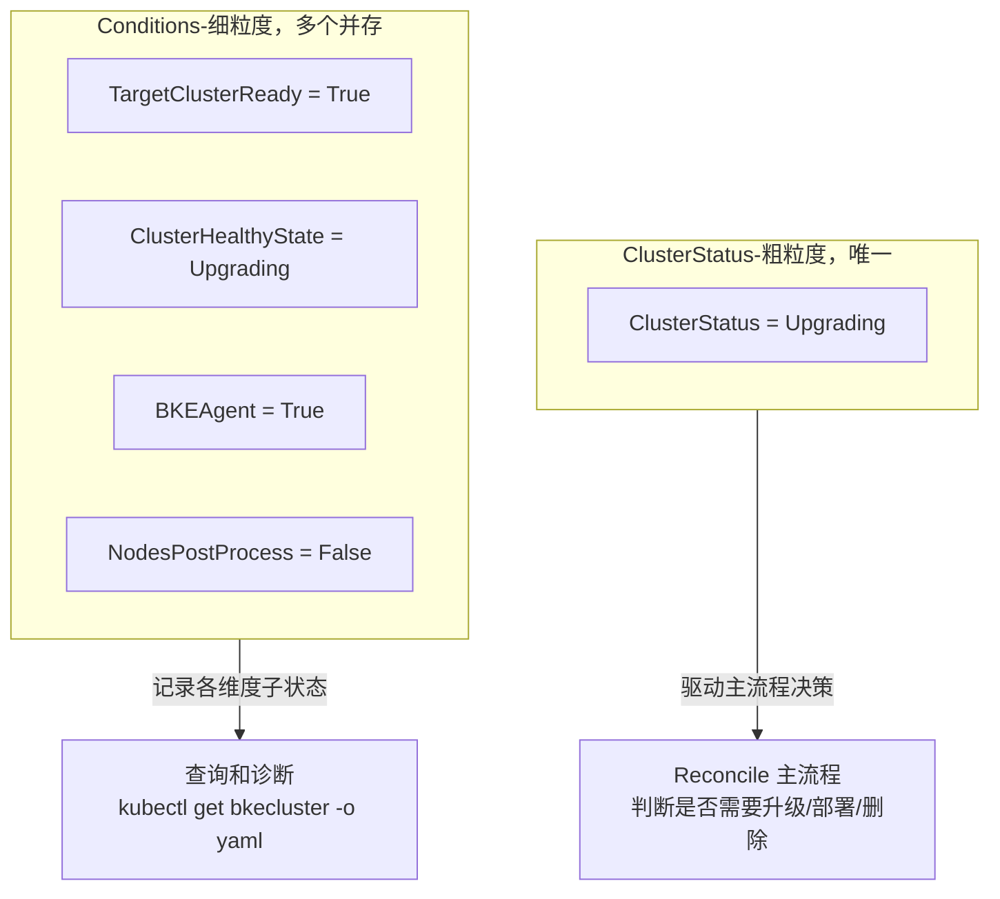

# 完整理解 `ClusterConditionType` 的定义、常量和使用方式

## `ClusterConditionType` 的作用

### 一、定义

**位置**：[bkecluster_status.go:81](file:///cluster-api-provider-bke/api/bkecommon/v1beta1/bkecluster_status.go#L81)

```go
type ClusterConditionType string
```

`ClusterConditionType` 是 **BKECluster Conditions 机制的"类型字段"**，用于标识 `ClusterCondition` 的种类。它是 Kubernetes Conditions 模式的实现，遵循 `type/status/reason/message` 四元组标准结构。

### 二、Condition 的完整结构

**位置**：[bkecluster_status.go:309-329](file:///cluster-api-provider-bke/api/bkecommon/v1beta1/bkecluster_status.go#L309-L329)

```go
type ClusterCondition struct {
    Type               ClusterConditionType `json:"type"`       // ← Condition 类型
    AddonName          string               `json:"addonName,omitempty"`
    Status             ConditionStatus      `json:"status"`     // True/False/Unknown
    LastTransitionTime *metav1.Time         `json:"lastTransitionTime,omitempty"`
    Reason             string               `json:"reason,omitempty"`
    Message            string               `json:"message,omitempty"`
}
```

**存储位置**：`bkeCluster.Status.Conditions []ClusterCondition`

### 三、Condition vs ClusterStatus 的本质区别

这是理解 `ClusterConditionType` 的关键：

| 维度 | `ClusterStatus` | `ClusterConditionType` |
|------|----------------|------------------------|
| **数据结构** | 单个字符串字段 | 数组，可同时存在多个 Condition |
| **语义** | 集群**当前整体状态**（唯一） | 集群**各维度的子状态**（可多个并存） |
| **取值** | 互斥（如 `Upgrading` 或 `Ready`） | 并行（如同时 `BKEAgent=True` + `LoadBalancer=False`） |
| **粒度** | 粗粒度（一个集群一个状态） | 细粒度（每个组件/阶段一个 Condition） |
| **典型用途** | 驱动 Reconcile 主流程决策 | 记录各 phase/组件的就绪情况，供查询和诊断 |

**类比**：`ClusterStatus` 类似进程的"运行/停止"状态，`Conditions` 类似进程的各项资源检查结果。

### 四、所有 Condition 类型清单

**位置**：[bkecluster_consts.go:101-124](file:///cluster-api-provider-bke/api/capbke/v1beta1/bkecluster_consts.go#L101-L124)

按用途分 5 类：

#### 1. 初始化阶段 Condition（7 个）

| ConditionType | 含义 | 设置时机 |
|---------------|------|---------|
| `ControlPlaneEndPointSet` | 控制面端点已设置 | 初始化设置负载均衡端点后 |
| `ControlPlaneInitialized` | 控制面已初始化 | 首个 master 初始化完成 |
| `ClusterAPIObj` | CAPI 对象状态 | 创建 Cluster/Machine 等 CAPI 资源后 |
| `NodesEnv` | 节点环境状态 | 节点环境准备完成 |
| `BKEAgent` | BKEAgent 状态 | BKEAgent 安装/就绪 |
| `LoadBalancer` | 负载均衡状态 | 负载均衡配置完成 |
| `NodesInfo` | 节点信息状态 | 节点信息收集完成 |

#### 2. 切换/引导阶段 Condition（2 个）

| ConditionType | 含义 |
|---------------|------|
| `SwitchBKEAgent` | BKEAgent 切换状态 |
| `TargetClusterBoot` | 目标集群启动状态 |

#### 3. 运行时状态 Condition（3 个）

| ConditionType | 含义 | 设置位置 |
|---------------|------|---------|
| `TargetClusterReady` | 目标集群是否就绪 | `EnsureCluster` 健康检查后 |
| `ClusterHealthyState` | 集群健康状态 | `setClusterHealthStatus` |
| `NodesPostProcess` | 节点后置处理状态 | `EnsureCluster` 检测到待处理节点 |

#### 4. 纳管集群 Condition（5 个，bocloud 专用）

| ConditionType | 含义 |
|---------------|------|
| `BocloudClusterDataBackup` | 纳管集群数据备份 |
| `BocloudClusterMasterCertDistribution` | Master 证书分发 |
| `BocloudClusterWorkerCertDistribution` | Worker 证书分发 |
| `BocloudClusterEnvInit` | 纳管集群环境初始化 |
| `TypeOfManagementClusterGuess` | 管理集群类型推断 |

#### 5. 其他 Condition（3 个）

| ConditionType | 含义 |
|---------------|------|
| `Addon` | 插件部署状态（支持多 addon，通过 `AddonName` 区分） |
| `BKEConfig` | BKE 配置状态 |
| `InternalSpecChange` | 内部 Spec 变更标记 |

### 五、Condition 的三态语义

```go
type ConditionStatus string
```

`ConditionStatus` 取值遵循 Kubernetes 标准：

| Status | 语义 | 典型场景 |
|--------|------|---------|
| `True` | 条件满足 | `TargetClusterReady=True` 表示集群就绪 |
| `False` | 条件不满足 | `TargetClusterReady=False` 表示集群未就绪 |
| `Unknown` | 未知 | 通常未使用 |

**注意语义反转**：`ConditionStatus=False` **不一定代表错误**，仅代表"该条件未满足"。例如 `NodesPostProcess=False` 表示"有节点待后置处理"，是正常的中间状态。

### 六、Condition 的设置方式

通过 [condition.ConditionMark](file:///cluster-api-provider-bke/utils/capbke/condition/condition.go#L19-L21) 工具函数设置：

```go
func ConditionMark(bkeCluster *bkev1beta1.BKECluster, 
    conditionType confv1beta1.ClusterConditionType, 
    conditionStatus confv1beta1.ConditionStatus, 
    reason, message string)
```

**行为**：
- 若 Condition 已存在 → 更新 `Status`、`Reason`、`Message`、`LastTransitionTime`
- 若不存在 → 追加新 Condition

**示例**（[ensure_cluster.go](file:///cluster-api-provider-bke/pkg/phaseframe/phases/ensure_cluster.go)）：

```go
// 健康检查后设置 TargetClusterReady
if phaseutil.ClusterAllowTrackerWithBKENodes(trackerBkeNodes, e.Ctx.Cluster) {
    condition.ConditionMark(bkeCluster, bkev1beta1.TargetClusterReadyCondition, 
        confv1beta1.ConditionTrue, "", "")
} else {
    condition.ConditionMark(bkeCluster, bkev1beta1.TargetClusterReadyCondition, 
        confv1beta1.ConditionFalse, "", "")
}
```

### 七、与 ClusterStatus 的协作关系

`ClusterStatus` 和 `Conditions` **互补**，不是替代：



**协作示例**：
- `ClusterStatus = Upgrading` → 驱动 Reconcile 进入升级流程
- `ClusterHealthyState = Upgrading`（Condition） → 记录健康状态维度
- `TargetClusterReady = True`（Condition） → 记录集群就绪维度
- 两者并存，互不冲突

### 八、Condition 的典型使用场景

#### 场景 1：初始化进度跟踪

初始化过程中，每个 phase 完成后设置对应 Condition：

```
EnsureClusterAPIObj 完成 → ClusterAPIObjCondition = True
EnsureNodesEnv 完成     → NodesEnvCondition = True
EnsureBKEAgent 完成     → BKEAgentCondition = True
EnsureLoadBalance 完成  → LoadBalancerCondition = True
...
```

运维人员可通过 `kubectl get bkecluster -o yaml` 查看 Conditions，快速定位卡在哪个阶段。

#### 场景 2：健康检查结果记录

`EnsureCluster` 健康检查后设置：

```
TargetClusterReadyCondition = True/False    // 集群是否就绪
ClusterHealthyStateCondition = True/False   // 健康状态维度
NodesPostProcessCondition = False           // 有节点待处理
```

#### 场景 3：多 Addon 状态跟踪

`Addon` 类型通过 `AddonName` 字段区分多个插件：

```
{Type: "Addon", AddonName: "calico", Status: "True"}
{Type: "Addon", AddonName: "csi", Status: "False", Reason: "install failed"}
```

### 九、与 Kubernetes 标准 Conditions 的差异

| 维度 | K8s 标准 Conditions | BKECluster Conditions |
|------|--------------------|-----------------------|
| 类型字段 | `Type string` | `Type ClusterConditionType`（强类型别名） |
| 附加字段 | 无 | `AddonName`（支持多 addon 区分） |
| 设置方式 | 通过 `conditions.Mark` 等工具 | 通过 `condition.ConditionMark` |
| 与 Status 关系 | 与 `.status.phase` 互补 | 与 `ClusterStatus` 互补 |

### 十、总结

`ClusterConditionType` 的作用是**定义 BKECluster Conditions 的类型标识**，支撑 Conditions 机制：

1. **细粒度状态记录**：相比单一的 `ClusterStatus`，Conditions 可同时记录多个维度的子状态
2. **phase 进度跟踪**：每个 phase 完成后设置对应 Condition，形成初始化/升级进度视图
3. **诊断支持**：运维人员可通过 Conditions 快速定位问题所在维度
4. **K8s 标准模式**：遵循 `type/status/reason/message` 四元组，兼容 K8s Conditions 语义
5. **与 ClusterStatus 互补**：`ClusterStatus` 驱动主流程决策，`Conditions` 记录各维度细节
