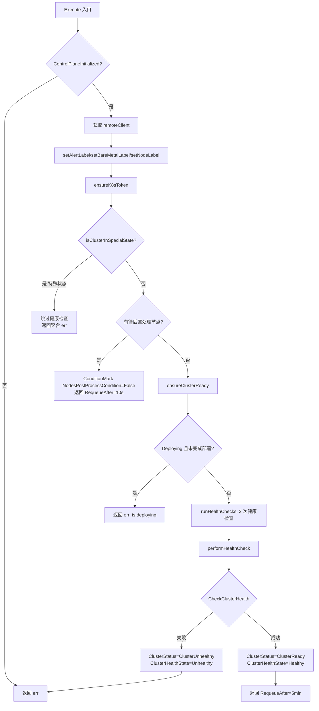

# 分析 `ensure_cluster.go` 中的状态转换

## `ensure_cluster.go` 中的状态转换逻辑与流程

**位置**：[ensure_cluster.go](file:///cluster-api-provider-bke/pkg/phaseframe/phases/ensure_cluster.go)

### 一、EnsureCluster 的特殊定位

`EnsureCluster` 是**集群健康检查 phase**，归属 [CustomSetStatusPhaseNames](file:///cluster-api-provider-bke/pkg/phaseframe/phases/list.go#L152-L154)（仅它一个），状态设置方式与其他 phase 不同：

| 维度 | 其他 phase | EnsureCluster |
|------|-----------|---------------|
| 状态设置方式 | 由 `calculateClusterStatusByPhase` 的 handler 设置 | 前置 Hook 直接设为 `ClusterChecking`，分发器 `return nil` 跳过 |
| 状态来源 | 基于 phase 执行结果（err） | 基于**集群健康检查结果**（`performHealthCheck`） |

### 二、状态转换全景

`EnsureCluster.Execute()` 中涉及的状态转换：



### 三、状态转换的四个阶段

#### 阶段 1：进入时（前置 Hook 设置）

由 [calculatingClusterPreStatusByPhase](file:///cluster-api-provider-bke/pkg/phaseframe/phases/phase_flow.go#L308-L314) 设置：

```go
if phase.Name() == EnsureClusterName {
    ctx.BKECluster.Status.ClusterStatus = bkev1beta1.ClusterChecking  // ← 进入时设为"检查中"
    return nil
}
```

**状态**：`ClusterStatus = ClusterChecking`

#### 阶段 2：健康检查中（performHealthCheck）

[performHealthCheck](file:///cluster-api-provider-bke/pkg/phaseframe/phases/ensure_cluster.go#L407-L446) 是状态转换的核心：

**成功路径**：
```go
bkeCluster.Status.ClusterStatus = bkev1beta1.ClusterReady
bkeCluster.Status.ClusterHealthState = bkev1beta1.Healthy
```

**失败路径**：
```go
bkeCluster.Status.ClusterStatus = bkev1beta1.ClusterUnhealthy
bkeCluster.Status.ClusterHealthState = bkev1beta1.Unhealthy
```

#### 阶段 3：健康检查后（handleClusterReadyPostCheck）

[handleClusterReadyPostCheck](file:///cluster-api-provider-bke/pkg/phaseframe/phases/ensure_cluster.go#L395-L419) 设置附加条件和注解清理：

```go
// 设置 TargetClusterReadyCondition
if phaseutil.ClusterAllowTrackerWithBKENodes(trackerBkeNodes, e.Ctx.Cluster) {
    condition.ConditionMark(bkeCluster, bkev1beta1.TargetClusterReadyCondition, confv1beta1.ConditionTrue, "", "")
} else {
    condition.ConditionMark(bkeCluster, bkev1beta1.TargetClusterReadyCondition, confv1beta1.ConditionFalse, "", "")
}

// 清理 tracker 的健康检查失败注解
if bkeCluster.Status.ClusterStatus == bkev1beta1.ClusterReady && ok {
    // 移除 ClusterTrackerHealthyCheckFailedAnnotationKey 注解
}
```

#### 阶段 4：退出时（后置 Hook 触发记录）

由 [calculatingClusterPostStatusByPhase](file:///cluster-api-provider-bke/pkg/phaseframe/phases/phase_flow.go#L311-L320) 处理：

```go
// EnsureCluster 属于 CustomSetStatusPhaseNames，分发器 return nil 不覆盖状态
// 但后置 Hook 的 defer 会设置注解（因为 ClusterStatus != ClusterUnknown）
if ctx.BKECluster.Status.ClusterStatus != bkev1beta1.ClusterUnknown {
    annotation.SetAnnotation(ctx.BKECluster, annotation.StatusRecordAnnotationKey, "")
}
```

**关键**：`EnsureCluster` 的状态由 `performHealthCheck` 设置，后置 Hook **不覆盖**，仅设置注解触发 StatusManager 记录。

### 四、状态转换矩阵

| 触发条件 | ClusterStatus | ClusterHealthState | 说明 |
|---------|---------------|-------------------|------|
| 进入 phase（前置 Hook） | `ClusterChecking` | 不变 | 标记"检查中" |
| 健康检查成功 | `ClusterReady` | `Healthy` | 集群健康 |
| 健康检查失败 | `ClusterUnhealthy` | `Unhealthy` | 集群不健康 |
| 集群处于特殊状态 | 不变（保持原状态） | 不变 | 跳过检查 |
| 首次部署未完成 | 不变（保持 Deploying） | 不变 | 跳过检查 |
| 有待后置处理节点 | 不变 | 不变 | 设置 Condition=False，10s 重试 |

### 五、特殊状态跳过逻辑

[isClusterInSpecialState](file:///cluster-api-provider-bke/pkg/phaseframe/phases/ensure_cluster.go#L155-L175) 列出了 7 种特殊状态，遇到时**跳过健康检查**：

```go
specialStates := []confv1beta1.ClusterStatus{
    bkev1beta1.ClusterMasterScalingUp,      // Master 扩容中
    bkev1beta1.ClusterMasterScalingDown,    // Master 缩容中
    bkev1beta1.ClusterWorkerScalingUp,      // Worker 扩容中
    bkev1beta1.ClusterWorkerScalingDown,    // Worker 缩容中
    bkev1beta1.ClusterInitializing,         // 初始化中
    bkev1beta1.ClusterPaused,               // 暂停
    bkev1beta1.ClusterUpgrading,            // 升级中
}
```

**设计目的**：避免在扩容/缩容/升级等操作期间误判集群状态。这些操作会临时改变节点或组件状态，健康检查可能产生误报。

### 六、与 StatusManager 的交互

`EnsureCluster` 的状态转换会触发 StatusManager 记录，但行为与其他 phase 不同：

| 场景 | ClusterStatus | StatusManager 行为 |
|------|---------------|-------------------|
| 健康检查成功 | `ClusterReady`（非 Failed） | 记录"正常状态"，重置失败计数 |
| 健康检查失败 | `ClusterUnhealthy`（非 Failed） | 记录"正常状态"（**不以 Failed 结尾**），重置失败计数 |
| 集群处于特殊状态 | 保持原状态 | 取决于原状态 |

**关键**：`ClusterUnhealthy` **不以 `Failed` 结尾**，因此 StatusManager 不会将其视为失败，不会触发失败计数和状态伪装。

这与升级失败的 `ClusterUpgradeFailed`（以 `Failed` 结尾）行为完全不同：

| 状态 | 是否以 Failed 结尾 | StatusManager 行为 |
|------|------------------|-------------------|
| `ClusterUnhealthy` | 否 | 重置计数，不伪装 |
| `ClusterUpgradeFailed` | 是 | 计数++，可能伪装 |

### 七、Requeue 行为

`EnsureCluster` 根据检查结果返回不同的 Requeue 策略：

| 场景 | 返回值 | 效果 |
|------|--------|------|
| 健康检查成功 | `RequeueAfter: 5min` | 5 分钟后再次检查 |
| 健康检查失败 | `RequeueAfter: 10s` | 10 秒后快速重试 |
| 有待后置处理节点 | `RequeueAfter: 10s` | 10 秒后重试 |
| 集群处于特殊状态 | 返回 err（无 RequeueAfter） | 由上层决定重试节奏 |
| 首次部署未完成 | 返回 err（无 RequeueAfter） | 由上层决定重试节奏 |

### 八、Condition 设置汇总

`EnsureCluster` 设置的 Condition：

| Condition | 设置时机 | 值 |
|-----------|---------|-----|
| `k8sTokenCreated` | ensureK8sToken 成功 | `ConditionTrue` |
| `NodesPostProcessCondition` | 有待后置处理节点 | `ConditionFalse`（reason: `NodesPostProcessNotReadyReason`） |
| `TargetClusterReadyCondition` | 健康检查后 | `ConditionTrue`/`ConditionFalse`（取决于 tracker 判定） |

### 九、总结

`EnsureCluster` 的状态转换逻辑是**健康检查驱动**的，与其他 phase 的"执行结果驱动"不同：

1. **进入时**：前置 Hook 设为 `ClusterChecking`（检查中）
2. **检查中**：`performHealthCheck` 根据远程集群健康状态设置 `ClusterReady`/`ClusterUnhealthy`
3. **跳过场景**：特殊状态、首次部署未完成、有待后置处理节点时跳过检查，保持原状态
4. **退出时**：后置 Hook 不覆盖状态（`CustomSetStatusPhaseNames` 短路），仅设置注解触发 StatusManager 记录
5. **与 StatusManager 的特殊关系**：`ClusterUnhealthy` 不以 `Failed` 结尾，不触发失败计数和状态伪装，与升级失败的 `ClusterUpgradeFailed` 行为完全不同
