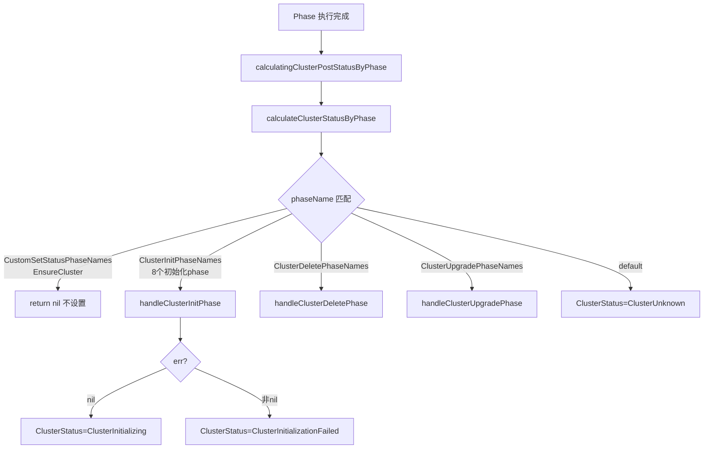

# 完整理解 `handleClusterInitPhase` 的实现和上下文

## `handleClusterInitPhase` 的作用

**位置**：[phase_flow.go:358-365](file:///cluster-api-provider-bke/pkg/phaseframe/phases/phase_flow.go#L358-L365)

```go
// handleClusterInitPhase 处理集群初始化阶段
func handleClusterInitPhase(ctx *phaseframe.PhaseContext, err error) {
	if err != nil {
		ctx.BKECluster.Status.ClusterStatus = bkev1beta1.ClusterInitializationFailed
	} else {
		ctx.BKECluster.Status.ClusterStatus = bkev1beta1.ClusterInitializing
	}
}
```

### 一、核心定位

`handleClusterInitPhase` 是 `calculateClusterStatusByPhase` 的一个分支 handler，**专门为集群初始化阶段的 phase 设置 `ClusterStatus`**。

### 二、处理的 Phase 范围

由 [ClusterInitPhaseNames](file:///cluster-api-provider-bke/pkg/phaseframe/phases/list.go#L88-L96) 定义，共 8 个 phase：

| Phase 名 | 职责 |
|---------|------|
| `EnsureFinalizer` | 设置 finalizer |
| `EnsureCerts` | 生成证书 |
| `EnsureClusterAPIObj` | 创建 CAPI 对象 |
| `EnsureMasterInit` | 初始化首个 master |
| `EnsureBKEAgent` | 安装 BKEAgent |
| `EnsureNodesEnv` | 节点环境准备 |
| `EnsureLoadBalance` | 负载均衡配置 |
| `EnsureAgentSwitch` | Agent 切换 |

**这 8 个 phase 共享同一个状态设置逻辑**：无论执行到哪个，成功都设为 `ClusterInitializing`，失败都设为 `ClusterInitializationFailed`。

### 三、状态决策规则

| err 值 | 设置的状态 | 含义 |
|--------|-----------|------|
| `nil` | `ClusterInitializing` | 初始化进行中（该 phase 成功） |
| 非 `nil` | `ClusterInitializationFailed` | 初始化失败 |

### 四、与其他 handler 的对比

所有 handler 的逻辑结构相同（按 err 设置"进行中/失败"状态），区别仅在状态常量：

| Handler | 进行中状态 | 失败状态 |
|---------|-----------|---------|
| **handleClusterInitPhase** | `ClusterInitializing` | `ClusterInitializationFailed` |
| handleClusterScaleMasterUpPhase | `ClusterMasterScalingUp` | `ClusterScaleFailed` |
| handleClusterScaleWorkerUpPhase | `ClusterWorkerScalingUp` | `ClusterScaleFailed` |
| handleClusterDeletePhase | `ClusterDeleting` | `ClusterDeleteFailed` |
| handleClusterUpgradePhase | `ClusterUpgrading` | `ClusterUpgradeFailed` |
| handleClusterManagePhase | `ClusterManaging` | `ClusterManageFailed` |

### 五、调用链



### 六、与 EnsureCluster 的特殊关系

注意 `ClusterInitPhaseNames` **不包含** `EnsureCluster`，`EnsureCluster` 属于 [CustomSetStatusPhaseNames](file:///cluster-api-provider-bke/pkg/phaseframe/phases/list.go#L152-L154)（仅它一个）。

| Phase | 归属 | 状态设置方式 |
|-------|------|-------------|
| `EnsureCluster` | `CustomSetStatusPhaseNames` | **不通过 handler 设置**，而是由前置 Hook 直接设为 `ClusterChecking`（[phase_flow.go:304-306](file:///cluster-api-provider-bke/pkg/phaseframe/phases/phase_flow.go#L304-L306)） |
| 8 个初始化 phase | `ClusterInitPhaseNames` | 通过 `handleClusterInitPhase` 设置 |

**设计原因**：`EnsureCluster` 是集群健康检查阶段，语义为"检查中"（`ClusterChecking`），与"初始化中"（`ClusterInitializing`）语义不同。它在 `calculateClusterStatusByPhase` 中直接 `return nil` 不设置状态，避免被 `handleClusterInitPhase` 覆盖为 `ClusterInitializing`。

### 七、总结

`handleClusterInitPhase` 的作用**非常单一**：为集群初始化阶段的 8 个 phase 设置 `ClusterStatus`，成功设为 `ClusterInitializing`，失败设为 `ClusterInitializationFailed`。

它是 `calculateClusterStatusByPhase` 分发体系中的一个分支 handler，与升级、删除、扩容等 handler 并列，各自负责对应场景的状态映射。所有 handler 的逻辑结构相同，差异仅在状态常量和适用的 phase 范围。
