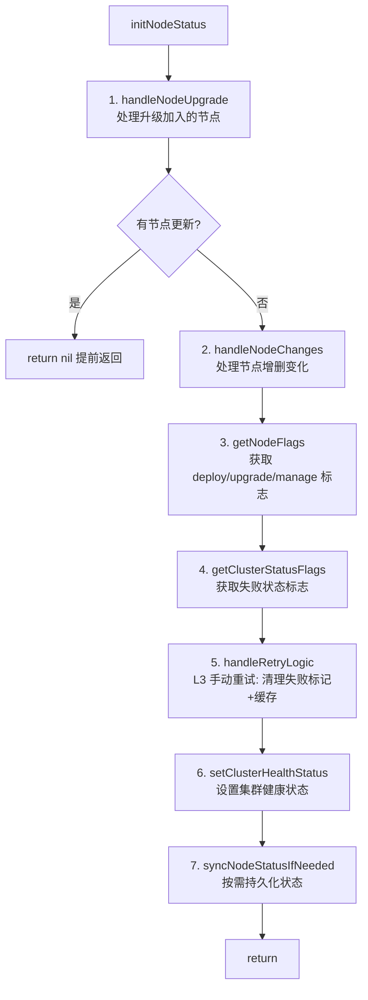
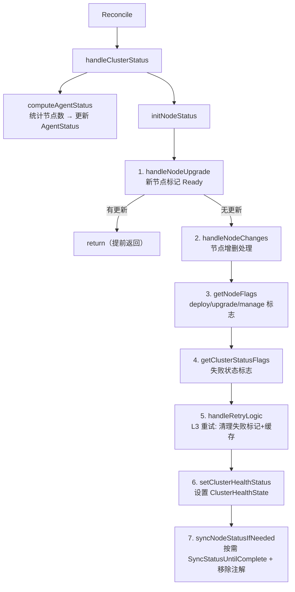

# 理解 `handleClusterStatus` 及其调用链。

## `handleClusterStatus` 的作用

**位置**：[bkecluster_controller.go:199-210](file:///cluster-api-provider-bke/controllers/capbke/bkecluster_controller.go#L199-L210)

```go
func (r *BKEClusterReconciler) handleClusterStatus(ctx context.Context, bkeCluster *bkev1beta1.BKECluster,
	bkeLogger *bkev1beta1.BKELogger) error {
	if err := r.computeAgentStatus(ctx, bkeCluster); err != nil {
		bkeLogger.Error(constant.InternalErrorReason, "failed set AgentStatus, err: %v", err)
		return err
	}
	if err := r.initNodeStatus(ctx, bkeCluster); err != nil {
		bkeLogger.Error(constant.InternalErrorReason, "failed set NodeStatus, err: %v", err)
		return err
	}
	return nil
}
```

### 一、核心定位

`handleClusterStatus` 是 **Reconcile 主流程的"状态预处理器"**，在 `executePhaseFlow` 之前执行（[bkecluster_controller.go:130](file:///cluster-api-provider-bke/controllers/capbke/bkecluster_controller.go#L130)），承担**两大职责**：

1. **计算 Agent 状态**：基于 BKENode CRD 统计节点数量，更新 `AgentStatus`
2. **初始化节点状态**：处理节点增删、L3 手动重试、集群健康状态判定、状态持久化

### 二、在 Reconcile 中的位置

```
Reconcile
├─ getAndValidateCluster          // 获取集群
├─ registerMetrics                // 指标注册
├─ getOldBKECluster               // 获取旧配置
├─ initializeLogger               // 初始化日志
├─ ensureClusterVersionOnInstall  // 安装阶段确保 ClusterVersion
├─ handleClusterStatus            ← 【本函数】状态预处理
│   ├─ computeAgentStatus         // 计算 Agent 状态
│   └─ initNodeStatus             // 初始化节点状态（含 L3 重试）
├─ executePhaseFlow               // 执行 Phase 流程
├─ completeClusterVersionInstall  // 安装收尾
├─ setupClusterWatching           // 设置集群监控
└─ getFinalResult                 // 返回最终结果
```

**关键**：`handleClusterStatus` 在 `executePhaseFlow` **之前**执行，确保进入 phase 流程前，节点状态和重试标记已就绪。

### 三、职责一：computeAgentStatus（Agent 状态计算）

**位置**：[bkecluster_controller.go:437-466](file:///cluster-api-provider-bke/controllers/capbke/bkecluster_controller.go#L437-L466)

**作用**：从 BKENode CRD 获取节点总数，更新 `AgentStatus` 的 `Replies`、`UnavailableReplies`、`Status` 字段。

**核心逻辑**：

| 场景 | 处理 |
|------|------|
| **首次初始化**（`Status == ""`） | `UnavailableReplies = nodeCount`，`Status = "0/N"` |
| **已有状态** | 解析现有 `availableNodesNum`，修正不超过 `nodeCount`，重算 `Status` |
| **状态有变化** | 调用 `SyncStatusUntilComplete` 持久化到 ETCD |

**示例**：集群有 3 个节点，首次初始化后 `AgentStatus.Status = "0/3"`。

### 四、职责二：initNodeStatus（节点状态初始化）

**位置**：[bkecluster_controller.go:472-505](file:///cluster-api-provider-bke/controllers/capbke/bkecluster_controller.go#L472-L505)

**作用**：这是 `handleClusterStatus` 的**核心逻辑**，按顺序执行 7 个步骤：



#### 步骤 1：handleNodeUpgrade（处理升级加入的节点）

**位置**：[bkecluster_controller.go:512-566](file:///cluster-api-provider-bke/controllers/capbke/bkecluster_controller.go#L512-L566)

**作用**：对比 BKENode CRD 与 BKEMachine 资源，将新加入的节点状态标记为 `NodeReady`。

**逻辑**：
1. 从 BKENode CRD 获取节点列表
2. 从 BKEMachine 资源的 label 获取节点 IP
3. 对比两者，将 BKEMachine 存在但状态未就绪的 BKENode 标记为 `NodeReady`

**提前返回**：若有节点被更新（`updated=true`），直接 `return nil`，跳过后续步骤。**设计意图**：新节点加入后优先处理就绪状态，避免触发不必要的升级流程。

#### 步骤 2：handleNodeChanges（处理节点增删变化）

**位置**：[bkecluster_controller.go:572-618](file:///cluster-api-provider-bke/controllers/capbke/bkecluster_controller.go#L572-L618)

**作用**：对比 BKENode CRD 中的 spec 节点与 status 节点，处理节点增删。

| 操作类型 | 处理 |
|---------|------|
| `CreateNode` | 记录日志（BKENode 已存在） |
| `RemoveNode` | 标记 `NodeDeleting` 状态 |
| `UpdateNode` | 记录日志 |

**返回值**：`nodeChangeFlag` 表示是否有节点变化，用于后续决定是否持久化状态。

#### 步骤 3-4：getNodeFlags + getClusterStatusFlags（获取标志）

**位置**：[bkecluster_controller.go:620-658](file:///cluster-api-provider-bke/controllers/capbke/bkecluster_controller.go#L620-L658)

获取 6 个布尔标志，用于判定集群健康状态：

| 标志组 | 标志 | 含义 |
|--------|------|------|
| **动作标志** | `DeployFlag` / `UpgradeFlag` / `ManageFlag` | 是否需要部署/升级/纳管 |
| **失败标志** | `DeployFailedFlag` / `UpgradeFailedFlag` / `ManageFailedFlag` | 集群健康状态是否为对应 Failed |

#### 步骤 5：handleRetryLogic（L3 手动重试）

**位置**：[bkecluster_controller.go:660-672](file:///cluster-api-provider-bke/controllers/capbke/bkecluster_controller.go#L660-L672)

**作用**：检查 `bke.bocloud.com/retry` 注解，执行 L3 手动重试的缓存清理。

| 注解值 | 调用方法 | 效果 |
|--------|----------|------|
| 空字符串 | `processAllNodesRetry` | 清理所有节点的 `NodeFailedFlag` + `RemoveClusterStatusManagerCache` |
| IP 列表 | `processSpecificNodesRetry` | 清理指定节点的 `NodeFailedFlag` + `RemoveSingleNodeStatusCache` |

**返回值**：`retryFlag` 表示是否触发了重试，`patchFunc` 用于后续移除注解。

#### 步骤 6：setClusterHealthStatus（设置集群健康状态）

**位置**：[bkecluster_controller.go:757-788](file:///cluster-api-provider-bke/controllers/capbke/bkecluster_controller.go#L757-L788)

**作用**：根据 6 个标志设置 `ClusterHealthState`：

| 条件 | 设置状态 |
|------|----------|
| `DeployFlag` 或 `DeployFailedFlag` | `Deploying` |
| `UpgradeFlag` 或 `UpgradeFailedFlag` | `Upgrading` |
| `ManageFlag` 或 `ManageFailedFlag` | `Managing` |
| 删除/重置场景 | `Deleting` |

同时通过 `condition.ConditionMark` 设置 `ClusterHealthyStateCondition` 条件。

#### 步骤 7：syncNodeStatusIfNeeded（按需持久化状态）

**位置**：[bkecluster_controller.go:790-800](file:///cluster-api-provider-bke/controllers/capbke/bkecluster_controller.go#L790-L800)

**作用**：根据触发条件决定是否持久化状态到 ETCD。

```go
deploymentRelated := params.DeployFlag || params.DeployFailedFlag
upgradeRelated := params.UpgradeFlag || params.UpgradeFailedFlag
managementAndOtherTriggers := params.ManageFailedFlag || params.RetryFlag || params.NodeChangeFlag

if deploymentRelated || upgradeRelated || managementAndOtherTriggers {
    mergecluster.SyncStatusUntilComplete(r.Client, bkeCluster, params.PatchFunc)
}
```

**关键**：传入 `params.PatchFunc`（移除 retry 注解的函数），在持久化时一并清理注解。

### 五、调用链总览



### 六、设计要点

1. **顺序保证**：Agent 状态先于节点状态计算，确保 `initNodeStatus` 能基于准确的节点数决策
2. **提前返回**：`handleNodeUpgrade` 有更新时提前返回，避免新节点就绪状态被后续逻辑干扰
3. **L3 重试的入口**：`handleRetryLogic` 是 L3 手动重试的**唯一入口**，在 phase 流程前清理失败标记，确保后续 phase 能重新执行
4. **按需持久化**：仅在部署/升级/纳管/重试/节点变化时才持久化状态，避免无意义的状态写入
5. **注解清理的时机**：retry 注解的移除通过 `patchFunc` 传入 `syncNodeStatusIfNeeded`，在状态持久化时一并完成，确保状态与注解的一致性
6. **与 StatusManager 的解耦**：`handleClusterStatus` 仅清理 StatusManager 缓存（L3 重试），不直接调用 `SetStatus`（由 phase 流程内的 `SyncStatusUntilComplete` 触发）

