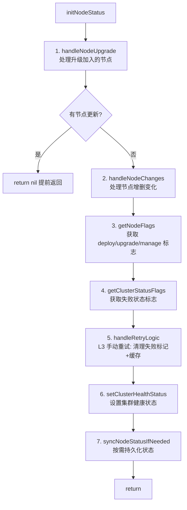
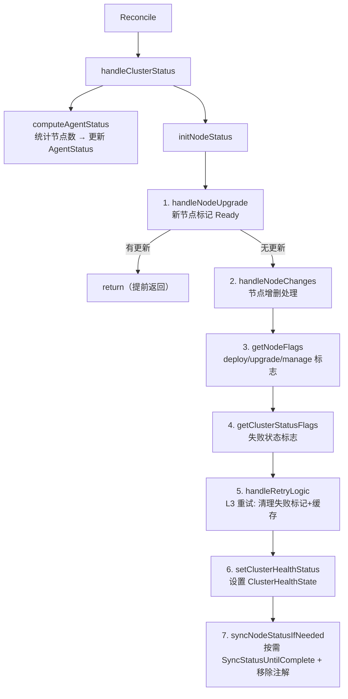

# 理解 `handleClusterStatus` 及其调用链。

## `handleClusterStatus` 的作用

**位置**：[bkecluster_controller.go:199-210](file:///cluster-api-provider-bke/controllers/capbke/bkecluster_controller.go#L199-L210)

```go
func (r *BKEClusterReconciler) handleClusterStatus(ctx context.Context, bkeCluster *bkev1beta1.BKECluster,
	bkeLogger *bkev1beta1.BKELogger) error {
	if err := r.computeAgentStatus(ctx, bkeCluster); err != nil {
		bkeLogger.Error(constant.InternalErrorReason, "failed set AgentStatus, err: %v", err)
		return err
	}
	if err := r.initNodeStatus(ctx, bkeCluster); err != nil {
		bkeLogger.Error(constant.InternalErrorReason, "failed set NodeStatus, err: %v", err)
		return err
	}
	return nil
}
```

### 一、核心定位

`handleClusterStatus` 是 **Reconcile 主流程的"状态预处理器"**，在 `executePhaseFlow` 之前执行（[bkecluster_controller.go:130](file:///cluster-api-provider-bke/controllers/capbke/bkecluster_controller.go#L130)），承担**两大职责**：

1. **计算 Agent 状态**：基于 BKENode CRD 统计节点数量，更新 `AgentStatus`
2. **初始化节点状态**：处理节点增删、L3 手动重试、集群健康状态判定、状态持久化

### 二、在 Reconcile 中的位置

```
Reconcile
├─ getAndValidateCluster          // 获取集群
├─ registerMetrics                // 指标注册
├─ getOldBKECluster               // 获取旧配置
├─ initializeLogger               // 初始化日志
├─ ensureClusterVersionOnInstall  // 安装阶段确保 ClusterVersion
├─ handleClusterStatus            ← 【本函数】状态预处理
│   ├─ computeAgentStatus         // 计算 Agent 状态
│   └─ initNodeStatus             // 初始化节点状态（含 L3 重试）
├─ executePhaseFlow               // 执行 Phase 流程
├─ completeClusterVersionInstall  // 安装收尾
├─ setupClusterWatching           // 设置集群监控
└─ getFinalResult                 // 返回最终结果
```

**关键**：`handleClusterStatus` 在 `executePhaseFlow` **之前**执行，确保进入 phase 流程前，节点状态和重试标记已就绪。

### 三、职责一：computeAgentStatus（Agent 状态计算）

**位置**：[bkecluster_controller.go:437-466](file:///cluster-api-provider-bke/controllers/capbke/bkecluster_controller.go#L437-L466)

**作用**：从 BKENode CRD 获取节点总数，更新 `AgentStatus` 的 `Replies`、`UnavailableReplies`、`Status` 字段。

**核心逻辑**：

| 场景 | 处理 |
|------|------|
| **首次初始化**（`Status == ""`） | `UnavailableReplies = nodeCount`，`Status = "0/N"` |
| **已有状态** | 解析现有 `availableNodesNum`，修正不超过 `nodeCount`，重算 `Status` |
| **状态有变化** | 调用 `SyncStatusUntilComplete` 持久化到 ETCD |

**示例**：集群有 3 个节点，首次初始化后 `AgentStatus.Status = "0/3"`。

### 四、职责二：initNodeStatus（节点状态初始化）

**位置**：[bkecluster_controller.go:472-505](file:///cluster-api-provider-bke/controllers/capbke/bkecluster_controller.go#L472-L505)

**作用**：这是 `handleClusterStatus` 的**核心逻辑**，按顺序执行 7 个步骤：



#### 步骤 1：handleNodeUpgrade（处理升级加入的节点）

**位置**：[bkecluster_controller.go:512-566](file:///cluster-api-provider-bke/controllers/capbke/bkecluster_controller.go#L512-L566)

**作用**：对比 BKENode CRD 与 BKEMachine 资源，将新加入的节点状态标记为 `NodeReady`。

**逻辑**：
1. 从 BKENode CRD 获取节点列表
2. 从 BKEMachine 资源的 label 获取节点 IP
3. 对比两者，将 BKEMachine 存在但状态未就绪的 BKENode 标记为 `NodeReady`

**提前返回**：若有节点被更新（`updated=true`），直接 `return nil`，跳过后续步骤。**设计意图**：新节点加入后优先处理就绪状态，避免触发不必要的升级流程。

#### 步骤 2：handleNodeChanges（处理节点增删变化）

**位置**：[bkecluster_controller.go:572-618](file:///cluster-api-provider-bke/controllers/capbke/bkecluster_controller.go#L572-L618)

**作用**：对比 BKENode CRD 中的 spec 节点与 status 节点，处理节点增删。

| 操作类型 | 处理 |
|---------|------|
| `CreateNode` | 记录日志（BKENode 已存在） |
| `RemoveNode` | 标记 `NodeDeleting` 状态 |
| `UpdateNode` | 记录日志 |

**返回值**：`nodeChangeFlag` 表示是否有节点变化，用于后续决定是否持久化状态。

#### 步骤 3-4：getNodeFlags + getClusterStatusFlags（获取标志）

**位置**：[bkecluster_controller.go:620-658](file:///cluster-api-provider-bke/controllers/capbke/bkecluster_controller.go#L620-L658)

获取 6 个布尔标志，用于判定集群健康状态：

| 标志组 | 标志 | 含义 |
|--------|------|------|
| **动作标志** | `DeployFlag` / `UpgradeFlag` / `ManageFlag` | 是否需要部署/升级/纳管 |
| **失败标志** | `DeployFailedFlag` / `UpgradeFailedFlag` / `ManageFailedFlag` | 集群健康状态是否为对应 Failed |

#### 步骤 5：handleRetryLogic（L3 手动重试）

**位置**：[bkecluster_controller.go:660-672](file:///cluster-api-provider-bke/controllers/capbke/bkecluster_controller.go#L660-L672)

**作用**：检查 `bke.bocloud.com/retry` 注解，执行 L3 手动重试的缓存清理。

| 注解值 | 调用方法 | 效果 |
|--------|----------|------|
| 空字符串 | `processAllNodesRetry` | 清理所有节点的 `NodeFailedFlag` + `RemoveClusterStatusManagerCache` |
| IP 列表 | `processSpecificNodesRetry` | 清理指定节点的 `NodeFailedFlag` + `RemoveSingleNodeStatusCache` |

**返回值**：`retryFlag` 表示是否触发了重试，`patchFunc` 用于后续移除注解。

#### 步骤 6：setClusterHealthStatus（设置集群健康状态）

**位置**：[bkecluster_controller.go:757-788](file:///cluster-api-provider-bke/controllers/capbke/bkecluster_controller.go#L757-L788)

**作用**：根据 6 个标志设置 `ClusterHealthState`：

| 条件 | 设置状态 |
|------|----------|
| `DeployFlag` 或 `DeployFailedFlag` | `Deploying` |
| `UpgradeFlag` 或 `UpgradeFailedFlag` | `Upgrading` |
| `ManageFlag` 或 `ManageFailedFlag` | `Managing` |
| 删除/重置场景 | `Deleting` |

同时通过 `condition.ConditionMark` 设置 `ClusterHealthyStateCondition` 条件。

#### 步骤 7：syncNodeStatusIfNeeded（按需持久化状态）

**位置**：[bkecluster_controller.go:790-800](file:///cluster-api-provider-bke/controllers/capbke/bkecluster_controller.go#L790-L800)

**作用**：根据触发条件决定是否持久化状态到 ETCD。

```go
deploymentRelated := params.DeployFlag || params.DeployFailedFlag
upgradeRelated := params.UpgradeFlag || params.UpgradeFailedFlag
managementAndOtherTriggers := params.ManageFailedFlag || params.RetryFlag || params.NodeChangeFlag

if deploymentRelated || upgradeRelated || managementAndOtherTriggers {
    mergecluster.SyncStatusUntilComplete(r.Client, bkeCluster, params.PatchFunc)
}
```

**关键**：传入 `params.PatchFunc`（移除 retry 注解的函数），在持久化时一并清理注解。

### 五、调用链总览



### 六、设计要点

1. **顺序保证**：Agent 状态先于节点状态计算，确保 `initNodeStatus` 能基于准确的节点数决策
2. **提前返回**：`handleNodeUpgrade` 有更新时提前返回，避免新节点就绪状态被后续逻辑干扰
3. **L3 重试的入口**：`handleRetryLogic` 是 L3 手动重试的**唯一入口**，在 phase 流程前清理失败标记，确保后续 phase 能重新执行
4. **按需持久化**：仅在部署/升级/纳管/重试/节点变化时才持久化状态，避免无意义的状态写入
5. **注解清理的时机**：retry 注解的移除通过 `patchFunc` 传入 `syncNodeStatusIfNeeded`，在状态持久化时一并完成，确保状态与注解的一致性
6. **与 StatusManager 的解耦**：`handleClusterStatus` 仅清理 StatusManager 缓存（L3 重试），不直接调用 `SetStatus`（由 phase 流程内的 `SyncStatusUntilComplete` 触发）

# 让我重新审视代码，验证"提前返回"的真正意图，避免凭空推测。
 
这是个好问题。我之前"避免新节点就绪状态被后续逻辑干扰"的表述过于笼统，让我基于代码给出更准确的解释。

## `handleNodeUpgrade` 有更新时提前返回，避免新节点就绪状态被后续逻辑干扰，重新理解"提前返回"的真正意图

### 一、handleNodeUpgrade 做了什么

[handleNodeUpgrade](file:///cluster-api-provider-bke/controllers/capbke/bkecluster_controller.go#L512-L566) 处理的是**扩容场景**：通过 BKEMachine 创建的新节点 bootstrap 完成后，将其 BKENode 状态推进为 Ready。

```go
bkeNode.Status.State = confv1beta1.NodeReady
bkeNode.Status.StateCode = bootstrapReadyStateCode
bkeNode.Status.Message = "node marked ready by bootstrap command"
r.NodeFetcher.UpdateNodeStatus(ctx, bkeNode)  // 已单独持久化到 ETCD
```

**关键**：它**只更新了 State/StateCode/Message，没有更新版本字段**（如 kubernetesVersion）。而且每个节点的状态是通过 `UpdateNodeStatus` 单独持久化的，**没有走集群级 Sync**。

### 二、如果不提前返回，后续步骤会怎样

假设 `handleNodeUpgrade` 返回 true 但不提前返回，继续执行 [initNodeStatus](file:///cluster-api-provider-bke/controllers/capbke/bkecluster_controller.go#L472-L505) 的后续步骤：

#### 步骤 3：getNodeFlags 的误判风险

[getNodeFlags](file:///cluster-api-provider-bke/controllers/capbke/bkecluster_controller.go#L620-L641) 会重新计算三个标志：

```go
deployFlag := nodeCount == 0                           // 节点数为 0 → 初次部署
upgradeFlag := phaseutil.GetNeedUpgradeNodesWithBKENodes(bkeCluster, bkeNodes).Length() > 0
manageFlag := clusterutil.IsBocloudCluster(bkeCluster) && !clusterutil.FullyControlled(bkeCluster)
```

**问题点在 `upgradeFlag`**：`GetNeedUpgradeNodesWithBKENodes` 基于版本对比判定节点是否需要升级。新节点虽然 State 已是 `NodeReady`，但**版本字段未更新**（仍为初始值或空），会被判定为"需要升级"。

→ `upgradeFlag = true` → 集群被误判为需要升级。

#### 步骤 6：setClusterHealthStatus 的错误标记

[setClusterHealthStatus](file:///cluster-api-provider-bke/controllers/capbke/bkecluster_controller.go#L757-L788) 基于上述标志设置 `ClusterHealthState`：

```go
if flags.UpgradeFlag || flags.UpgradeFailedFlag {
    markBKEClusterHealthyStatus(bkeCluster, bkev1beta1.Upgrading)  // ← 集群被标记为 Upgrading
}
```

→ 集群健康状态从正常变为 `Upgrading`，但实际上这只是新节点加入，不应触发升级。

#### 步骤 7：syncNodeStatusIfNeeded 的冗余持久化 + StatusManager 误触发

[syncNodeStatusIfNeeded](file:///cluster-api-provider-bke/controllers/capbke/bkecluster_controller.go#L790-L800) → `SyncStatusUntilComplete` → `SetStatus`。

此时 phase **尚未执行**，但集群状态已被改为 `Upgrading`，StatusManager 可能基于此错误状态记录失败计数或触发状态伪装。

### 三、提前返回的真正意图

综合以上分析，提前返回是为了**避免本次 Reconcile 基于不完整的节点状态（版本字段未更新）继续向下执行集群级状态判定**，具体防止：

| 后续步骤 | 不提前返回会导致的问题 |
|---------|---------------------|
| `getNodeFlags` | 新节点版本字段未更新 → `upgradeFlag` 误判为 true |
| `setClusterHealthStatus` | 集群被错误标记为 `Upgrading` |
| `syncNodeStatusIfNeeded` | 冗余持久化 + 可能误触发 StatusManager 记录 |
| `executePhaseFlow`（下游） | 集群被标记 Upgrading 后，可能触发对新节点的不必要升级 phase |

### 四、修正后的准确表述

我之前说的"避免新节点就绪状态被后续逻辑干扰"应该更准确地表述为：

> **handleNodeUpgrade 只更新了节点的 State（标记 Ready），但没有更新版本字段。如果继续执行 getNodeFlags，会因版本字段不匹配而误判新节点需要升级，导致集群被错误标记为 Upgrading，进而可能触发不必要的升级流程。提前返回让本次 Reconcile 专注于完成新节点状态就绪，下一次 Reconcile 会基于完整的节点状态（版本字段已通过其他途径填充）重新计算集群级状态。**

### 五、设计本质

这是一种**状态推进的隔离设计**：

- 新节点就绪（State: → Ready）是**节点级**状态推进
- 集群是否需要升级（upgradeFlag）是**集群级**状态判定
- 两者不应在同一次 Reconcile 中混合处理，尤其当节点级状态推进尚未完整（版本字段未更新）时

提前返回本质是**"让节点级状态推进先落盘，集群级状态判定延后到下一次 Reconcile"**，避免基于不完整数据做集群级决策。

# 让我重新审视代码，验证 Agent 状态和节点状态之间的实际依赖关系。
 
## 重新审视：Agent 状态与节点状态的顺序关系

### 一、代码事实

[handleClusterStatus](file:///cluster-api-provider-bke/controllers/capbke/bkecluster_controller.go#L199-L210) 中：

```go
if err := r.computeAgentStatus(ctx, bkeCluster); err != nil { ... }  // 先
if err := r.initNodeStatus(ctx, bkeCluster); err != nil { ... }      // 后
```

### 二、分析两者的实际数据依赖

| `computeAgentStatus` 读写的字段 | `initNodeStatus` 读写的字段 |
|----------------------------------|----------------------------|
| 读：`AgentStatus.Status`（旧值） | 读：BKENode CRD（节点列表、状态） |
| 写：`AgentStatus.Replies`、`UnavailableReplies`、`Status` | 写：BKENode.Status.State、`ClusterHealthState`、`condition` |

**关键观察**：
- `computeAgentStatus` 读写的是 **`bkeCluster.Status.AgentStatus`** 字段
- `initNodeStatus` 读写的是 **BKENode CRD 和 `bkeCluster.Status.ClusterHealthState`** 字段

两者操作的是**完全不同的字段**，不存在直接的数据依赖。

### 三、进一步验证：initNodeStatus 是否依赖 AgentStatus

遍历 `initNodeStatus` 调用的所有子函数：

| 子函数 | 是否读取 AgentStatus |
|--------|---------------------|
| `handleNodeUpgrade` | 否，读 BKENode + BKEMachine |
| `handleNodeChanges` | 否，读 BKENode |
| `getNodeFlags` | 否，读 BKENode count + 版本字段 |
| `getClusterStatusFlags` | 否，读 `condition` |
| `handleRetryLogic` | 否，读 retry annotation |
| `setClusterHealthStatus` | 否，写 `ClusterHealthState` |

**结论**：`initNodeStatus` **完全不读取** `AgentStatus` 字段。

### 四、那为什么还要先执行 computeAgentStatus？

既然不存在数据依赖，顺序的真正原因是**其他方面的考虑**：

#### 1. 错误中断的优先级

```go
if err := r.computeAgentStatus(ctx, bkeCluster); err != nil {
    return err  // ← Agent 状态计算失败，直接中断
}
if err := r.initNodeStatus(ctx, bkeCluster); err != nil { ... }
```

`computeAgentStatus` 失败会中断整个 `handleClusterStatus`。把更轻量、更不易失败的 Agent 状态计算放在前面，作为**前置健康检查**：
- Agent 状态计算仅依赖 BKENode CRD 的节点数量，逻辑简单
- 若连节点数都获取失败（`NodeFetcher.GetNodeCountForCluster` 出错），说明集群状态严重异常，无需继续处理节点级逻辑

#### 2. 状态持久化的顺序一致性

两者都会调用 `SyncStatusUntilComplete` 持久化状态：

| 函数 | 持久化触发条件 |
|------|---------------|
| `computeAgentStatus` | `!statusCopy.Equal(&bkeCluster.Status.AgentStatus)`（AgentStatus 有变化） |
| `initNodeStatus` → `syncNodeStatusIfNeeded` | `deployFlag || upgradeFlag || ...` |

**顺序意义**：先持久化 Agent 状态，确保 `AgentStatus` 字段先落盘。若后续 `initNodeStatus` 失败，Agent 状态已正确保存，下次 Reconcile 不需要重算。

#### 3. 语义上的"先整体后局部"

- `computeAgentStatus`：计算集群的**整体 Agent 概览**（总数、可用数）
- `initNodeStatus`：处理**单个节点的状态变化**

先算整体再处理局部，符合"先确定总量基线，再处理个体变化"的语义顺序。

### 五、修正之前的表述

我之前说的"确保 `initNodeStatus` 能基于准确的节点数决策"是**不准确的**，因为 `initNodeStatus` 根本不读取 `AgentStatus`。

**准确表述应为**：

> **`computeAgentStatus` 先于 `initNodeStatus` 执行，但两者不存在直接数据依赖**。顺序的真正原因有三点：
> 1. **错误中断优先级**：Agent 状态计算作为轻量前置检查，失败时提前中断，避免后续复杂逻辑白跑
> 2. **持久化顺序**：AgentStatus 先落盘，保证后续步骤失败时该字段已正确保存
> 3. **语义顺序**：先算整体（集群 Agent 概览），再处理局部（单个节点状态）

### 六、总结

| 维度 | 我之前的表述（不准确） | 实际情况 |
|------|---------------------|---------|
| 数据依赖 | `initNodeStatus` 依赖 AgentStatus 的节点数 | **无依赖**，两者操作不同字段 |
| 顺序原因 | "基于准确的节点数决策" | 错误中断优先级 + 持久化顺序 + 语义顺序 |
| 教训 | 凭函数名推测依赖关系 | 应该实际追踪字段读写，验证依赖关系 |

感谢指出，这是个很好的纠错案例——**不应基于函数名和顺序推测依赖关系，应通过字段读写实际验证**。
