# 升级过程异常分类处理清单

## 文档说明

**适用范围**: cluster-api-provider-bke 集群升级全流程  
**目标读者**: 设计人员、开发人员、测试人员、运维人员  
**版本**: v1.0  

## 一、升级流程概览

### 1.1 升级Phase顺序

```
┌─────────────────────────────────────────────────────────────┐
│  集群升级完整流程 (PostDeployPhases)                         │
└─────────────────────────────────────────────────────────────┘
         │
         ├── Phase 1: EnsureProviderSelfUpgrade
         │   └── 升级Provider自身（Deployment镜像更新）
         │
         ├── Phase 2: EnsureAgentUpgrade
         │   ├── 升级BKEAgent DaemonSet
         │   └── Agent健康检查
         │
         ├── Phase 3: EnsureContainerdUpgrade
         │   ├── 重置Containerd配置
         │   └── 重新部署Containerd
         │
         ├── Phase 4: EnsureEtcdUpgrade
         │   ├── Etcd数据备份
         │   ├── 滚动升级Etcd节点
         │   └── Etcd健康检查
         │
         ├── Phase 5: EnsureWorkerUpgrade
         │   ├── 滚动升级Worker节点
         │   ├── Kubeadm upgrade
         │   └── Worker健康检查
         │
         ├── Phase 6: EnsureMasterUpgrade
         │   ├── 滚动升级Master节点
         │   ├── Kubeadm upgrade
         │   └── Master健康检查
         │
         ├── Phase 7: EnsureWorkerDelete
         │   └── 滚动删除Worker节点
         │
         ├── Phase 8: EnsureMasterDelete
         │   └── 滚动删除Master节点
         │
         ├── Phase 9: EnsureComponentUpgrade
         │   ├── 升级CoreDNS、kube-proxy等组件
         │   └── 组件健康检查
         │
         └── Phase 10: EnsureCluster
             └── 集群健康检查
```

### 1.2 各Phase关键操作

| Phase | 关键操作 | 失败影响 | 重试策略 |
|-------|---------|---------|---------|
| **EnsureProviderSelfUpgrade** | Provider镜像更新 | Controller版本不一致 | 自动重试 |
| **EnsureAgentUpgrade** | DaemonSet升级 | Agent版本不一致 | 自动重试 |
| **EnsureContainerdUpgrade** | Containerd重置、重新部署 | 节点运行时异常 | 单节点重试 |
| **EnsureEtcdUpgrade** | Etcd备份、滚动升级、健康检查 | **阻断整个升级流程** | Fail-Fast，需人工介入 |
| **EnsureWorkerUpgrade** | Kubeadm upgrade、节点Drain | Worker不可用 | Best-Effort，继续其他节点 |
| **EnsureMasterUpgrade** | Kubeadm upgrade、组件升级 | **阻断整个升级流程** | Fail-Fast，需人工介入 |
| **EnsureWorkerDelete** | 滚动删除Worker节点 | Worker节点残留 | 单节点重试 |
| **EnsureMasterDelete** | 滚动删除Master节点 | Master节点残留 | 单节点重试 |
| **EnsureComponentUpgrade** | CoreDNS、kube-proxy升级 | 功能不完整 | 自动重试 |
| **EnsureCluster** | 集群健康检查 | 状态不准确 | 自动重试 |

### 1.3 升级全流程异常处理总览图

#### ASCII 版本

```
┌─────────────────────────────────────────────────────────────────────────────┐
│                    升级全流程异常处理总览图                                    │
└─────────────────────────────────────────────────────────────────────────────┘

  开始升级 (desiredVersion 变更)
     │
     ▼
  ┌─────────────────┐
  │ 升级前预检       │── 失败 ──▶ 阻断升级，输出预检报告
  │ 集群健康/版本兼容 │── 通过 ──▶ 继续
  └────────┬────────┘
           ▼
  ┌─────────────────┐
  │ EnsureProvider  │── 镜像更新失败 ──▶ Requeue重试
  │ SelfUpgrade     │── 未就绪 ──▶ 轮询等待，超时▶返回错误
  │ Provider自升级   │── 成功 ──▶ 继续（Controller将重启）
  └────────┬────────┘
           ▼
  ┌─────────────────┐
  │ EnsureAgent     │── DaemonSet更新失败 ──▶ Requeue重试
  │ Upgrade         │── DaemonSet未就绪 ──▶ 轮询等待，超时▶返回错误
  │ Agent升级        │── 版本不一致 ──▶ 记录日志，继续
  └────────┬────────┘
           ▼
  ┌─────────────────┐
  │ EnsureContainerd│── 重置/部署失败 ──▶ 重试3次
  │ Upgrade         │── 镜像拉取失败 ──▶ BackoffIgnore=true 跳过
  │ Containerd升级   │── 配置错误 ──▶ 需人工介入
  └────────┬────────┘
           ▼
  ┌─────────────────┐
  │ EnsureEtcd      │── 备份失败 ──▶ ❌ Fail-Fast，需人工介入
  │ Upgrade         │── 健康检查失败 ──▶ ❌ Fail-Fast，需人工介入
  │ Etcd滚动升级     │── 节点升级失败 ──▶ 重试3次，仍失败▶标记
  └────────┬────────┘
           ▼
  ┌─────────────────┐
  │ EnsureWorker    │── Drain失败 ──▶ 强制Drain，继续
  │ Upgrade         │── 节点升级失败 ──▶ 重试3次，仍失败▶Best-Effort继续
  │ Worker滚动升级   │── 部分失败 ──▶ 记录失败列表，返回错误触发Requeue
  └────────┬────────┘
           ▼
  ┌─────────────────┐
  │ EnsureMaster    │── Kubeadm upgrade失败 ──▶ ❌ Fail-Fast，人工介入
  │ Upgrade         │── API Server不可达 ──▶ ❌ Fail-Fast，人工介入
  │ Master滚动升级   │── 节点升级失败 ──▶ 重试3次，仍失败▶标记
  └────────┬────────┘
           ▼
  ┌─────────────────┐
  │ EnsureWorker    │── 节点删除失败 ──▶ 重试3次，仍失败▶标记
  │ Delete          │── 部分失败 ──▶ 记录失败列表，继续
  │ Worker删除       │── 成功 ──▶ 继续
  └────────┬────────┘
           ▼
  ┌─────────────────┐
  │ EnsureMaster    │── 节点删除失败 ──▶ 重试3次，仍失败▶标记
  │ Delete          │── 部分失败 ──▶ 记录失败列表，继续
  │ Master删除       │── 成功 ──▶ 继续
  └────────┬────────┘
           ▼
  ┌─────────────────┐
  │ EnsureComponent │── CoreDNS/kube-proxy失败 ──▶ Requeue重试
  │ Upgrade         │── 健康检查失败 ──▶ 轮询等待，超时▶返回错误
  │ 核心组件升级     │── 成功 ──▶ 继续
  └────────┬────────┘
           ▼
  ┌─────────────────┐
  │ EnsureCluster   │── 健康检查失败 ──▶ 记录状态
  │ 集群健康检查     │── 成功 ──▶ ClusterStatus = Ready
  └────────┬────────┘
           ▼
       升级完成
```

#### Mermaid 版本

```mermaid
graph TD
    Start[开始升级<br/>desiredVersion变更] --> PreCheck{升级前预检}
    PreCheck -->|失败| PreCheckFail[阻断升级<br/>输出预检报告]
    PreCheck -->|通过| Provider{EnsureProviderSelfUpgrade<br/>Provider自升级}
    
    Provider -->|镜像更新失败| ProviderRetry[Requeue重试]
    ProviderRetry --> Provider
    Provider -->|未就绪| ProviderWait[轮询等待]
    ProviderWait -->|超时| ProviderTimeout[return err]
    ProviderWait -->|就绪| Agent{EnsureAgentUpgrade<br/>Agent升级}
    
    Agent -->|DaemonSet更新失败| AgentRetry[Requeue重试]
    AgentRetry --> Agent
    Agent -->|DaemonSet未就绪| AgentWait[轮询等待]
    AgentWait -->|超时| AgentTimeout[return err]
    AgentWait -->|就绪| AgentCheck{版本一致性}
    AgentCheck -->|不一致| AgentLog[记录日志 继续]
    AgentCheck -->|一致| Containerd{EnsureContainerdUpgrade<br/>Containerd升级}
    AgentLog --> Containerd
    
    Containerd -->|重置/部署失败| ContainerdRetry[重试3次]
    ContainerdRetry -->|仍失败| ContainerdFail[需人工介入]
    ContainerdRetry -->|成功| Containerd
    Containerd -->|镜像拉取失败| ContainerdSkip[BackoffIgnore跳过]
    ContainerdSkip --> Etcd
    Containerd -->|成功| Etcd{EnsureEtcdUpgrade<br/>Etcd滚动升级}
    
    Etcd -->|备份失败| EtcdBackupFail[❌ Fail-Fast<br/>需人工介入]
    Etcd -->|健康检查失败| EtcdHealthFail[❌ Fail-Fast<br/>需人工介入]
    Etcd -->|节点升级失败| EtcdRetry[重试3次]
    EtcdRetry -->|仍失败| EtcdMarkFail[标记节点失败]
    EtcdRetry -->|成功| Etcd
    Etcd -->|全部成功| Worker{EnsureWorkerUpgrade<br/>Worker滚动升级}
    EtcdMarkFail --> Worker
    
    Worker -->|Drain失败| ForceDrain[强制Drain 继续]
    ForceDrain --> WorkerLoop
    Worker -->|节点升级失败| WorkerRetry[重试3次]
    WorkerRetry -->|仍失败| WorkerMarkFail[标记失败 Best-Effort继续]
    WorkerRetry -->|成功| WorkerLoop
    Worker -->|部分失败| WorkerPartial[记录失败列表<br/>return err<br/>触发Requeue]
    Worker -->|全部成功| Master{EnsureMasterUpgrade<br/>Master滚动升级}
    WorkerPartial --> Master
    WorkerMarkFail --> Master
    
    Master -->|Kubeadm失败| MasterKubeadmFail[❌ Fail-Fast<br/>需人工介入]
    Master -->|API不可达| MasterAPIFail[❌ Fail-Fast<br/>需人工介入]
    Master -->|节点升级失败| MasterRetry[重试3次]
    MasterRetry -->|仍失败| MasterMarkFail[标记节点失败]
    MasterRetry -->|成功| Master
    Master -->|全部成功| WorkerDel{EnsureWorkerDelete<br/>Worker删除}
    MasterMarkFail --> WorkerDel
    
    WorkerDel -->|删除失败| WorkerDelRetry[重试3次]
    WorkerDelRetry -->|仍失败| WorkerDelMark[标记节点失败]
    WorkerDelRetry -->|成功| WorkerDel
    WorkerDel -->|全部成功| MasterDel{EnsureMasterDelete<br/>Master删除}
    WorkerDelMark --> MasterDel
    
    MasterDel -->|删除失败| MasterDelRetry[重试3次]
    MasterDelRetry -->|仍失败| MasterDelMark[标记节点失败]
    MasterDelRetry -->|成功| MasterDel
    MasterDel -->|全部成功| Component{EnsureComponentUpgrade<br/>核心组件升级}
    MasterDelMark --> Component
    
    Component -->|CoreDNS/kube-proxy失败| ComponentRetry[Requeue重试]
    ComponentRetry --> Component
    Component -->|健康检查失败| ComponentWait[轮询等待]
    ComponentWait -->|超时| ComponentTimeout[return err]
    ComponentWait -->|恢复| Component
    Component -->|成功| Cluster{EnsureCluster<br/>集群健康检查}
    
    Cluster -->|健康检查失败| ClusterLog[记录状态]
    Cluster -->|成功| Done[升级完成<br/>ClusterStatus=Ready]
    ClusterLog --> Done
    
    style EtcdBackupFail fill:#ff6b6b
    style EtcdHealthFail fill:#ff6b6b
    style MasterKubeadmFail fill:#ff6b6b
    style MasterAPIFail fill:#ff6b6b
    style ContainerdFail fill:#ff6b6b
    style Done fill:#51cf66
```

---

## 二、异常分类与处理策略

### 2.1 Etcd升级异常

#### 2.1.1 异常场景清单

| 异常场景 | 严重程度 | 触发条件 | 处理策略 |
|---------|---------|---------|---------|
| **Etcd备份失败** | **Fatal** | Etcd数据备份失败 | **Fail-Fast，需人工介入** |
| **Etcd版本不兼容** | Error | 目标版本与当前版本不兼容 | 返回错误，需人工检查版本 |
| **Etcd节点NotReady** | Error | Etcd节点未就绪 | 等待轮询，超时后标记失败 |
| **Etcd健康检查失败** | **Fatal** | Etcd集群不健康 | **Fail-Fast，需人工介入** |
| **Etcd升级命令失败** | Error | Kubeadm upgrade etcd失败 | 标记节点失败，重试3次 |
| **Etcd member add失败** | Error | Etcd成员添加失败 | 标记节点失败，重试3次 |
| **Etcd数据损坏** | **Fatal** | Etcd数据文件损坏 | **Fail-Fast，需人工介入** |

#### 2.1.2 处理流程

```go
// 文件: pkg/phaseframe/phases/ensure_etcd_upgrade.go
func (e *EnsureEtcdUpgrade) Execute() (ctrl.Result, error) {
    // 1. 获取需要升级的Etcd节点
    nodes := e.getNeedUpgradeEtcdNodes()
    if nodes.Length() == 0 {
        return ctrl.Result{}, nil
    }
    
    // 2. Etcd数据备份（关键）
    if e.needBackupEtcd {
        if err := e.backupEtcdData(); err != nil {
            // ✅ 异常: Etcd备份失败
            // 处理: Fail-Fast，需人工介入
            log.Error("Etcd backup failed, aborting upgrade")
            return ctrl.Result{}, errors.Errorf("etcd backup failed: %v", err)
        }
    }
    
    // 3. 滚动升级Etcd节点
    for _, node := range nodes {
        // 3.1 创建升级命令
        upgradeCmd := e.createUpgradeCommand(node)
        if err := upgradeCmd.New(); err != nil {
            // ✅ 异常: 命令创建失败
            // 处理: 返回错误，触发Requeue
            return ctrl.Result{}, err
        }
        
        // 3.2 等待命令完成
        err, successNodes, failedNodes := upgradeCmd.Wait()
        if err != nil || len(failedNodes) > 0 {
            // ✅ 异常: 升级失败
            // 处理: 标记节点失败，继续其他节点
            log.Warn("Etcd upgrade failed for node %s", node.IP)
            continue
        }
        
        // 3.3 Etcd健康检查（关键）
        if err := e.checkEtcdHealth(node); err != nil {
            // ✅ 异常: Etcd不健康
            // 处理: Fail-Fast，需人工介入
            log.Error("Etcd health check failed after upgrade")
            return ctrl.Result{}, errors.Errorf("etcd health check failed: %v", err)
        }
        
        // 3.4 标记节点升级成功
        e.markNodeUpgradeSuccess(node)
    }
    
    // 4. 最终Etcd集群健康检查
    if err := e.checkEtcdClusterHealth(); err != nil {
        // ✅ 异常: Etcd集群不健康
        // 处理: Fail-Fast，需人工介入
        return ctrl.Result{}, errors.Errorf("etcd cluster health check failed: %v", err)
    }
    
    return ctrl.Result{}, nil
}
```

#### 2.1.3 重试机制

| 重试类型 | 配置 | 说明 |
|---------|------|------|
| **Etcd备份失败** | **不重试** | Fail-Fast，需人工介入 |
| **Etcd健康检查失败** | **不重试** | Fail-Fast，需人工介入 |
| **节点级重试** | 最多3次 | 每个Etcd节点独立重试 |
| **健康检查轮询** | 间隔2秒 | 持续检查Etcd健康状态 |
| **健康检查超时** | 5分钟 | 超时后标记失败 |

#### 2.1.4 异常处理流程图

**ASCII 版本**

```
┌─────────────────────────────────────────────────────────────┐
│  EnsureEtcdUpgrade 异常处理流程图 (Fail-Fast)                │
├─────────────────────────────────────────────────────────────┤
│                                                             │
│  开始                                                        │
│   │                                                         │
│   ▼                                                         │
│  ┌─────────────────────┐                                    │
│  │ 获取需要升级的Etcd   │                                    │
│  │ 节点列表             │                                    │
│  └──────────┬──────────┘                                    │
│             │                                               │
│      ┌──────┴──────┐                                        │
│      ▼             ▼                                        │
│   无节点         有节点                                      │
│      │             │                                        │
│      ▼             ▼                                        │
│  成功(跳过)   ┌──────────────┐                              │
│               │Etcd数据备份   │◄── 失败 ──▶ ❌ Fail-Fast    │
│               │(关键步骤)     │              需人工介入       │
│               └──────────────┘                              │
│                     │                                        │
│                     ▼                                        │
│               ┌──────────────────┐                          │
│               │ 遍历每个Etcd节点  │                          │
│               │                  │                          │
│               │ ┌──────────────┐│                          │
│               │ │创建升级命令   │── 失败 ──▶ return err    │
│               │ └──────────────┘│                          │
│               │ ┌──────────────┐│                          │
│               │ │等待命令完成   │── 失败 ──▶ 重试3次        │
│               │ │              │              仍失败▶标记   │
│               │ └──────────────┘│                          │
│               │ ┌──────────────┐│                          │
│               │ │Etcd健康检查   │── 失败 ──▶ ❌ Fail-Fast  │
│               │ │(单节点)       │              需人工介入    │
│               │ └──────────────┘│                          │
│               │ ┌──────────────┐│                          │
│               │ │标记升级成功   │                           │
│               │ └──────────────┘│                          │
│               └────────┬─────────┘                          │
│                        │                                     │
│                        ▼                                     │
│               ┌──────────────────┐                          │
│               │Etcd集群健康检查   │◄── 失败 ──▶ ❌ Fail-Fast│
│               │(最终检查)         │              需人工介入   │
│               └──────────────────┘                          │
│                        │                                     │
│                        ▼                                     │
│                   升级完成                                    │
│                                                             │
└─────────────────────────────────────────────────────────────┘
```

**Mermaid 版本**

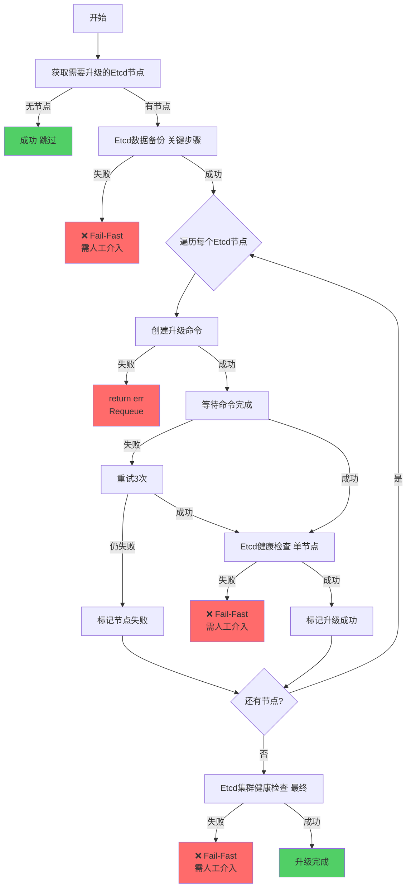

---

### 2.2 Master升级异常

#### 2.2.1 异常场景清单

| 异常场景 | 严重程度 | 触发条件 | 处理策略 |
|---------|---------|---------|---------|
| **版本不兼容** | Error | 目标版本与当前版本不兼容 | 返回错误，需人工检查版本 |
| **Master节点NotReady** | Error | Master节点未就绪 | 等待轮询，超时后标记失败 |
| **Kubeadm upgrade失败** | **Fatal** | Kubeadm upgrade control-plane失败 | **Fail-Fast，需人工介入** |
| **API Server不可达** | **Fatal** | API Server健康检查失败 | **Fail-Fast，需人工介入** |
| **组件升级失败** | Error | kube-apiserver等组件升级失败 | 标记节点失败，重试3次 |
| **证书更新失败** | Error | 证书更新失败 | 标记节点失败，重试3次 |
| **Addon升级失败** | Warning | Addon版本更新失败 | 记录错误，继续执行 |

#### 2.2.2 处理流程

```go
// 文件: pkg/phaseframe/phases/ensure_master_upgrade.go
func (e *EnsureMasterUpgrade) Execute() (ctrl.Result, error) {
    // 1. 检查版本是否需要升级
    if bkeCluster.Spec.ClusterConfig.Cluster.KubernetesVersion == bkeCluster.Status.KubernetesVersion {
        return ctrl.Result{}, nil
    }
    
    // 2. 检查Etcd配置并备份
    if e.needBackupEtcd {
        if err := e.backupEtcdData(); err != nil {
            // ✅ 异常: Etcd备份失败
            // 处理: Fail-Fast
            return ctrl.Result{}, err
        }
    }
    
    // 3. 滚动升级Master节点
    for _, node := range needUpgradeNodes {
        // 3.1 创建升级命令
        upgradeCmd := e.createUpgradeCommand(node)
        if err := upgradeCmd.New(); err != nil {
            // ✅ 异常: 命令创建失败
            // 处理: 返回错误，触发Requeue
            return ctrl.Result{}, err
        }
        
        // 3.2 等待命令完成
        err, successNodes, failedNodes := upgradeCmd.Wait()
        if err != nil || len(failedNodes) > 0 {
            // ✅ 异常: 升级失败
            // 处理: Fail-Fast，需人工介入
            log.Error("Master upgrade failed for node %s", node.IP)
            return ctrl.Result{}, errors.Errorf("master upgrade failed: %v", err)
        }
        
        // 3.3 Master健康检查（关键）
        if err := e.checkMasterHealth(node); err != nil {
            // ✅ 异常: Master不健康
            // 处理: Fail-Fast，需人工介入
            log.Error("Master health check failed after upgrade")
            return ctrl.Result{}, errors.Errorf("master health check failed: %v", err)
        }
        
        // 3.4 标记节点升级成功
        e.markNodeUpgradeSuccess(node)
    }
    
    // 4. 更新集群版本
    bkeCluster.Status.KubernetesVersion = bkeCluster.Spec.ClusterConfig.Cluster.KubernetesVersion
    
    // 5. 更新Addon版本
    if err := e.updateAddonVersions(); err != nil {
        // ✅ 异常: Addon升级失败
        // 处理: 记录错误，继续执行（非关键）
        log.Warn("Addon version update failed: %v", err)
    }
    
    return ctrl.Result{}, nil
}
```

#### 2.2.3 重试机制

| 重试类型 | 配置 | 说明 |
|---------|------|------|
| **Kubeadm upgrade失败** | **不重试** | Fail-Fast，需人工介入 |
| **API Server不可达** | **不重试** | Fail-Fast，需人工介入 |
| **节点级重试** | 最多3次 | 每个Master节点独立重试 |
| **健康检查轮询** | 间隔2秒 | 持续检查Master健康状态 |
| **健康检查超时** | 5分钟 | 超时后标记失败 |

#### 2.2.4 异常处理流程图

**ASCII 版本**

```
┌─────────────────────────────────────────────────────────────┐
│  EnsureMasterUpgrade 异常处理流程图 (Fail-Fast)               │
├─────────────────────────────────────────────────────────────┤
│                                                             │
│  开始                                                        │
│   │                                                         │
│   ▼                                                         │
│  ┌─────────────────────┐                                    │
│  │ 检查版本是否需要升级 │                                    │
│  └──────────┬──────────┘                                    │
│             │                                               │
│      ┌──────┴──────┐                                        │
│      ▼             ▼                                        │
│   不需要         需要                                        │
│      │             │                                        │
│      ▼             ▼                                        │
│  成功(跳过)   ┌──────────────┐                              │
│               │Etcd数据备份   │◄── 失败 ──▶ ❌ Fail-Fast    │
│               │              │              需人工介入       │
│               └──────────────┘                              │
│                     │                                        │
│                     ▼                                        │
│               ┌──────────────────┐                          │
│               │ 遍历每个Master节点│                          │
│               │                  │                          │
│               │ ┌──────────────┐│                          │
│               │ │创建升级命令   │── 失败 ──▶ return err    │
│               │ └──────────────┘│                          │
│               │ ┌──────────────┐│                          │
│               │ │等待命令完成   │── 失败 ──▶ ❌ Fail-Fast  │
│               │ │              │              需人工介入    │
│               │ └──────────────┘│                          │
│               │ ┌──────────────┐│                          │
│               │ │Master健康检查 │── 失败 ──▶ ❌ Fail-Fast  │
│               │ │              │              需人工介入    │
│               │ └──────────────┘│                          │
│               │ ┌──────────────┐│                          │
│               │ │标记升级成功   │                           │
│               │ └──────────────┘│                          │
│               └────────┬─────────┘                          │
│                        │                                     │
│                        ▼                                     │
│               ┌──────────────────┐                          │
│               │ 更新集群版本      │                          │
│               └────────┬─────────┘                          │
│                        │                                     │
│                        ▼                                     │
│               ┌──────────────────┐                          │
│               │ 更新Addon版本     │◄── 失败 ──▶ 记录日志    │
│               │ (非关键)          │              继续         │
│               └──────────────────┘                          │
│                        │                                     │
│                        ▼                                     │
│                   升级完成                                    │
│                                                             │
└─────────────────────────────────────────────────────────────┘
```

**Mermaid 版本**

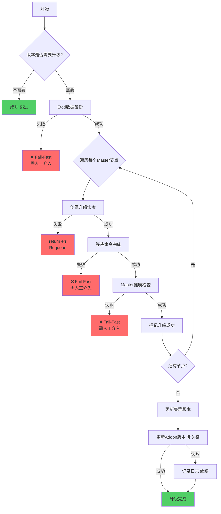

---

### 2.3 Worker升级异常

#### 2.3.1 异常场景清单

| 异常场景 | 严重程度 | 触发条件 | 处理策略 |
|---------|---------|---------|---------|
| **集群状态不健康** | Error | ClusterStatus=Unhealthy/Unknown | 跳过升级，等待集群恢复 |
| **版本不兼容** | Error | 目标版本与当前版本不兼容 | 返回错误，需人工检查版本 |
| **节点Drain失败** | Warning | 节点驱逐Pod失败 | 强制Drain，继续升级 |
| **Kubeadm upgrade失败** | Error | Kubeadm upgrade node失败 | 标记节点失败，重试3次 |
| **节点NotReady** | Warning | 节点升级后未就绪 | 等待轮询，超时后标记失败 |
| **部分Worker失败** | Warning | 部分节点升级失败 | 记录失败列表，继续其他节点 |
| **节点Uncordon失败** | Warning | 节点恢复调度失败 | 记录错误，手动恢复 |

#### 2.3.2 处理流程

```go
// 文件: pkg/phaseframe/phases/ensure_worker_upgrade.go
func (e *EnsureWorkerUpgrade) Execute() (ctrl.Result, error) {
    // 1. 检查集群状态是否健康
    if bkeCluster.Status.ClusterStatus == bkev1beta1.ClusterUnhealthy || 
        bkeCluster.Status.ClusterStatus == bkev1beta1.ClusterUnknown {
        // ✅ 异常: 集群状态不健康
        // 处理: 跳过升级，等待集群恢复
        log.Warn("Cluster is unhealthy, skip worker upgrade")
        return ctrl.Result{}, nil
    }
    
    // 2. 检查版本是否需要升级
    if bkeCluster.Spec.ClusterConfig.Cluster.KubernetesVersion == bkeCluster.Status.KubernetesVersion {
        return ctrl.Result{}, nil
    }
    
    // 3. 滚动升级Worker节点
    for _, node := range needUpgradeNodes {
        // 3.1 Drain节点（驱逐Pod）
        if err := e.drainNode(node); err != nil {
            // ✅ 异常: Drain失败
            // 处理: 强制Drain，继续升级
            log.Warn("Node drain failed, force drain: %v", err)
            e.forceDrainNode(node)
        }
        
        // 3.2 创建升级命令
        upgradeCmd := e.createUpgradeCommand(node)
        if err := upgradeCmd.New(); err != nil {
            // ✅ 异常: 命令创建失败
            // 处理: 返回错误，触发Requeue
            return ctrl.Result{}, err
        }
        
        // 3.3 等待命令完成
        err, successNodes, failedNodes := upgradeCmd.Wait()
        if err != nil || len(failedNodes) > 0 {
            // ✅ 异常: 升级失败
            // 处理: 标记节点失败，继续其他节点
            log.Warn("Worker upgrade failed for node %s", node.IP)
            e.markNodeUpgradeFailed(node)
            continue
        }
        
        // 3.4 Worker健康检查
        if err := e.checkWorkerHealth(node); err != nil {
            // ✅ 异常: Worker不健康
            // 处理: 等待轮询，超时后标记失败
            log.Warn("Worker health check failed: %v", err)
            e.markNodeUpgradeFailed(node)
            continue
        }
        
        // 3.5 Uncordon节点（恢复调度）
        if err := e.uncordonNode(node); err != nil {
            // ✅ 异常: Uncordon失败
            // 处理: 记录错误，手动恢复
            log.Warn("Node uncordon failed: %v", err)
        }
        
        // 3.6 标记节点升级成功
        e.markNodeUpgradeSuccess(node)
    }
    
    // 4. 处理失败节点
    if len(failedNodes) > 0 {
        // ✅ 异常: 部分节点失败
        // 处理: 记录失败列表，返回错误触发Requeue
        return ctrl.Result{}, errors.Errorf("some worker nodes failed to upgrade: %v", failedNodes)
    }
    
    return ctrl.Result{}, nil
}
```

#### 2.3.3 重试机制

| 重试类型 | 配置 | 说明 |
|---------|------|------|
| **节点级重试** | 最多3次 | 每个Worker节点独立重试 |
| **失败策略** | Best-Effort | 单节点失败不影响其他节点 |
| **健康检查轮询** | 间隔2秒 | 持续检查Worker健康状态 |
| **健康检查超时** | 5分钟 | 超时后标记失败 |
| **Drain重试** | 强制Drain | Drain失败后强制驱逐 |

#### 2.3.4 异常处理流程图

**ASCII 版本**

```
┌─────────────────────────────────────────────────────────────┐
│  EnsureWorkerUpgrade 异常处理流程图 (Best-Effort)             │
├─────────────────────────────────────────────────────────────┤
│                                                             │
│  开始                                                        │
│   │                                                         │
│   ▼                                                         │
│  ┌─────────────────────┐                                    │
│  │ 检查集群状态是否健康 │                                    │
│  └──────────┬──────────┘                                    │
│             │                                               │
│      ┌──────┴──────┐                                        │
│      ▼             ▼                                        │
│   不健康         健康                                        │
│      │             │                                        │
│      ▼             ▼                                        │
│  跳过升级     ┌──────────────┐                              │
│  等待恢复     │检查版本需升级 │                              │
│               └──────────────┘                              │
│                     │                                        │
│              ┌──────┴──────┐                                 │
│              ▼             ▼                                 │
│           不需要         需要                                │
│              │             │                                 │
│              ▼             ▼                                 │
│          成功(跳过)  ┌──────────────────┐                    │
│                      │ 遍历每个Worker节点│                    │
│                      │                  │                    │
│                      │ ┌──────────────┐│                    │
│                      │ │Drain节点     │── 失败 ──▶ 强制Drain│
│                      │ │(驱逐Pod)     │              继续    │
│                      │ └──────────────┘│                    │
│                      │ ┌──────────────┐│                    │
│                      │ │创建升级命令   │── 失败 ──▶ return  │
│                      │ └──────────────┘│                    │
│                      │ ┌──────────────┐│                    │
│                      │ │等待命令完成   │── 失败 ──▶ 重试3次 │
│                      │ │              │          仍失败▶标记 │
│                      │ └──────────────┘│                    │
│                      │ ┌──────────────┐│                    │
│                      │ │Worker健康检查 │── 失败 ──▶ 轮询    │
│                      │ │              │          超时▶标记   │
│                      │ └──────────────┘│                    │
│                      │ ┌──────────────┐│                    │
│                      │ │Uncordon节点  │── 失败 ──▶ 记录日志 │
│                      │ │(恢复调度)    │              继续    │
│                      │ └──────────────┘│                    │
│                      │ ┌──────────────┐│                    │
│                      │ │标记升级成功   │                    │
│                      │ └──────────────┘│                    │
│                      └────────┬─────────┘                   │
│                               │                              │
│                        ┌──────┴──────┐                      │
│                        ▼             ▼                      │
│                     有失败         无失败                    │
│                        │             │                      │
│                        ▼             ▼                      │
│                  记录失败列表     升级完成                    │
│                  return err                                 │
│                  触发Requeue                                │
│                                                             │
│  关键点: Best-Effort策略                                      │
│  • Drain失败强制继续                                         │
│  • 单节点失败不影响其他节点                                    │
│  • Uncordon失败仅记录日志                                     │
│                                                             │
└─────────────────────────────────────────────────────────────┘
```

**Mermaid 版本**

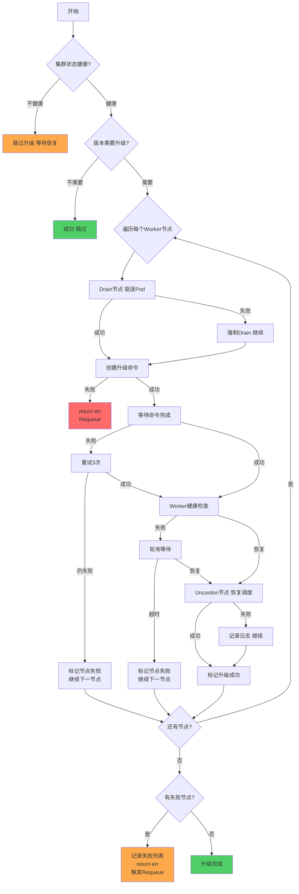

---

### 2.4 Containerd升级异常

#### 2.4.1 异常场景清单

| 异常场景 | 严重程度 | 触发条件 | 处理策略 |
|---------|---------|---------|---------|
| **Containerd重置失败** | Error | Reset命令执行失败 | 标记节点失败，重试3次 |
| **Containerd重新部署失败** | Error | Init命令执行失败 | 标记节点失败，重试3次 |
| **Containerd配置错误** | Error | 配置文件损坏 | 标记节点失败，需人工介入 |
| **镜像拉取失败** | Warning | Containerd镜像拉取失败 | 重试3次，失败后跳过 |
| **运行时不兼容** | Error | Containerd版本不兼容 | 返回错误，需人工检查版本 |

#### 2.4.2 处理流程

```go
// 文件: pkg/phaseframe/phases/ensure_containerd_upgrade.go
func (e *EnsureContainerdUpgrade) Execute() (ctrl.Result, error) {
    // 1. 获取需要升级的节点
    nodes := e.getNeedUpgradeNodes()
    if nodes.Length() == 0 {
        return ctrl.Result{}, nil
    }
    
    // 2. 重置Containerd配置
    if err := e.resetContainerd(); err != nil {
        // ✅ 异常: Containerd重置失败
        // 处理: 返回错误，触发Requeue
        return ctrl.Result{}, err
    }
    
    // 3. 重新部署Containerd
    if err := e.redeployContainerd(); err != nil {
        // ✅ 异常: Containerd重新部署失败
        // 处理: 返回错误，触发Requeue
        return ctrl.Result{}, err
    }
    
    // 4. Containerd健康检查
    if err := e.checkContainerdHealth(); err != nil {
        // ✅ 异常: Containerd不健康
        // 处理: 返回错误，触发Requeue
        return ctrl.Result{}, err
    }
    
    return ctrl.Result{}, nil
}
```

#### 2.4.3 重试机制

| 重试类型 | 配置 | 说明 |
|---------|------|------|
| **节点级重试** | 最多3次 | 每个节点独立重试 |
| **命令重试** | BackoffLimit=3 | 命令执行失败重试 |
| **命令超时** | 10分钟 | 命令执行超时 |
| **镜像拉取重试** | BackoffIgnore=true | 镜像拉取失败跳过 |

#### 2.4.4 异常处理流程图

**ASCII 版本**

```
┌─────────────────────────────────────────────────────────────┐
│  EnsureContainerdUpgrade 异常处理流程图                       │
├─────────────────────────────────────────────────────────────┤
│                                                             │
│  开始                                                        │
│   │                                                         │
│   ▼                                                         │
│  ┌─────────────────────┐                                    │
│  │ 获取需要升级的节点   │                                    │
│  └──────────┬──────────┘                                    │
│             │                                               │
│      ┌──────┴──────┐                                        │
│      ▼             ▼                                        │
│   无节点         有节点                                      │
│      │             │                                        │
│      ▼             ▼                                        │
│  成功(跳过)   ┌──────────────┐                              │
│               │重置Containerd │◄── 失败 ──▶ return err      │
│               │配置           │              Requeue重试     │
│               └──────────────┘                              │
│                     │                                        │
│                     ▼                                        │
│               ┌──────────────┐                              │
│               │重新部署       │◄── 失败 ──▶ return err      │
│               │Containerd     │              Requeue重试     │
│               └──────────────┘                              │
│                     │                                        │
│                     ▼                                        │
│               ┌──────────────┐                              │
│               │Containerd     │◄── 失败 ──▶ return err      │
│               │健康检查       │              Requeue重试     │
│               └──────────────┘                              │
│                     │                                        │
│                     ▼                                        │
│                   升级完成                                    │
│                                                             │
└─────────────────────────────────────────────────────────────┘
```

**Mermaid 版本**

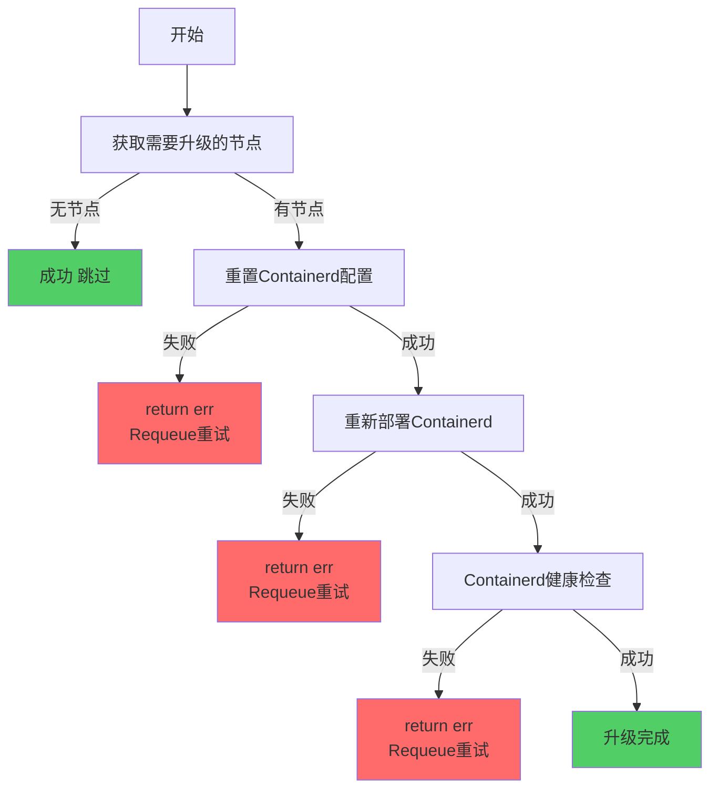

---

### 2.5 组件升级异常

#### 2.5.1 异常场景清单

| 异常场景 | 严重程度 | 触发条件 | 处理策略 |
|---------|---------|---------|---------|
| **CoreDNS升级失败** | Error | CoreDNS镜像更新失败 | 返回错误，Requeue重试 |
| **kube-proxy升级失败** | Error | kube-proxy镜像更新失败 | 返回错误，Requeue重试 |
| **组件镜像拉取失败** | Warning | 镜像拉取失败 | 重试3次，失败后记录错误 |
| **组件健康检查失败** | Error | Pod不健康 | 等待轮询，超时后返回错误 |
| **版本回退失败** | Warning | 镜像版本回退失败 | 记录错误，继续执行 |

#### 2.5.2 处理流程

```go
// 文件: pkg/phaseframe/phases/ensure_component_upgrade.go
func (e *EnsureComponentUpgrade) Execute() (ctrl.Result, error) {
    // 1. 获取远程集群客户端
    if err := e.getRemoteClient(); err != nil {
        // ✅ 异常: 客户端获取失败
        // 处理: 返回错误，触发Requeue
        return ctrl.Result{}, err
    }
    
    // 2. 加载本地kubeconfig
    if err := e.loadLocalKubeConfig(); err != nil {
        // ✅ 异常: kubeconfig加载失败
        // 处理: 返回错误，触发Requeue
        return ctrl.Result{}, err
    }
    
    // 3. 升级CoreDNS
    if err := e.upgradeCoreDNS(); err != nil {
        // ✅ 异常: CoreDNS升级失败
        // 处理: 返回错误，触发Requeue
        return ctrl.Result{}, err
    }
    
    // 4. 升级kube-proxy
    if err := e.upgradeKubeProxy(); err != nil {
        // ✅ 异常: kube-proxy升级失败
        // 处理: 返回错误，触发Requeue
        return ctrl.Result{}, err
    }
    
    // 5. 组件健康检查
    if err := e.checkComponentsHealth(); err != nil {
        // ✅ 异常: 组件不健康
        // 处理: 返回错误，触发Requeue
        return ctrl.Result{}, err
    }
    
    return ctrl.Result{}, nil
}
```

#### 2.5.3 重试机制

| 重试类型 | 配置 | 说明 |
|---------|------|------|
| **组件升级失败** | Requeue重试 | 返回错误触发Requeue |
| **镜像拉取重试** | 最多3次 | 镜像拉取失败重试 |
| **健康检查轮询** | 间隔10秒 | 持续检查组件健康状态 |
| **健康检查超时** | 5分钟 | 超时后返回错误 |

#### 2.5.4 异常处理流程图

**ASCII 版本**

```
┌─────────────────────────────────────────────────────────────┐
│  EnsureComponentUpgrade 异常处理流程图                        │
├─────────────────────────────────────────────────────────────┤
│                                                             │
│  开始                                                        │
│   │                                                         │
│   ▼                                                         │
│  ┌─────────────────────┐                                    │
│  │ 获取远程集群客户端   │◄── 失败 ──▶ return err             │
│  └──────────┬──────────┘              Requeue重试            │
│             │                                               │
│             ▼                                               │
│  ┌─────────────────────┐                                    │
│  │ 加载本地kubeconfig   │◄── 失败 ──▶ return err             │
│  └──────────┬──────────┘              Requeue重试            │
│             │                                               │
│             ▼                                               │
│  ┌─────────────────────┐                                    │
│  │ 升级CoreDNS         │◄── 失败 ──▶ return err             │
│  └──────────┬──────────┘              Requeue重试            │
│             │                                               │
│             ▼                                               │
│  ┌─────────────────────┐                                    │
│  │ 升级kube-proxy      │◄── 失败 ──▶ return err             │
│  └──────────┬──────────┘              Requeue重试            │
│             │                                               │
│             ▼                                               │
│  ┌─────────────────────┐                                    │
│  │ 组件健康检查         │◄── 失败 ──▶ 轮询等待               │
│  └──────────┬──────────┘              超时▶ return err       │
│             │                                               │
│             ▼                                               │
│                   升级完成                                    │
│                                                             │
└─────────────────────────────────────────────────────────────┘
```

**Mermaid 版本**

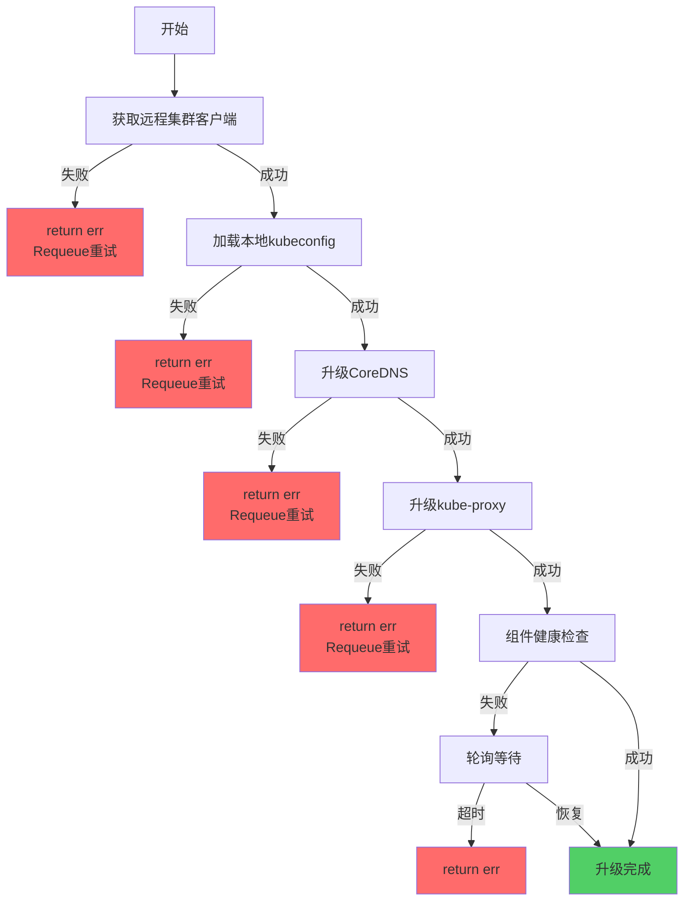

---

### 2.6 Agent升级异常

#### 2.6.1 异常场景清单

| 异常场景 | 严重程度 | 触发条件 | 处理策略 |
|---------|---------|---------|---------|
| **DaemonSet更新失败** | Error | DaemonSet镜像更新失败 | 返回错误，Requeue重试 |
| **DaemonSet未就绪** | Warning | DaemonSet Pod未就绪 | 等待轮询，超时后返回错误 |
| **Agent版本不一致** | Warning | 部分节点Agent版本不一致 | 等待轮询，超时后记录错误 |
| **镜像拉取失败** | Warning | Agent镜像拉取失败 | 重试3次，失败后记录错误 |
| **Pod启动失败** | Error | Agent Pod启动失败 | 等待轮询，超时后返回错误 |

#### 2.6.2 处理流程

```go
// 文件: pkg/phaseframe/phases/ensure_agent_upgrade.go
func (e *EnsureAgentUpgrade) Execute() (ctrl.Result, error) {
    // 1. 检查版本是否需要升级
    if new.Status.OpenFuyaoVersion == new.Spec.ClusterConfig.Cluster.OpenFuyaoVersion {
        return ctrl.Result{}, nil
    }
    
    // 2. 更新DaemonSet镜像
    if err := e.updateDaemonSetImage(); err != nil {
        // ✅ 异常: DaemonSet更新失败
        // 处理: 返回错误，触发Requeue
        return ctrl.Result{}, err
    }
    
    // 3. 等待DaemonSet就绪
    if err := e.waitForDaemonSetReady(); err != nil {
        // ✅ 异常: DaemonSet未就绪
        // 处理: 返回错误，触发Requeue
        return ctrl.Result{}, err
    }
    
    // 4. 检查Agent版本一致性
    if err := e.checkAgentVersionConsistency(); err != nil {
        // ✅ 异常: Agent版本不一致
        // 处理: 记录错误，继续执行
        log.Warn("Agent version inconsistency: %v", err)
    }
    
    // 5. 更新集群版本状态
    bkeCluster.Status.OpenFuyaoVersion = bkeCluster.Spec.ClusterConfig.Cluster.OpenFuyaoVersion
    
    return ctrl.Result{}, nil
}
```

#### 2.6.3 重试机制

| 重试类型 | 配置 | 说明 |
|---------|------|------|
| **DaemonSet更新失败** | Requeue重试 | 返回错误触发Requeue |
| **DaemonSet就绪等待** | 轮询间隔10秒 | 持续检查DaemonSet状态 |
| **DaemonSet就绪超时** | 5分钟 | 超时后返回错误 |
| **镜像拉取重试** | 最多3次 | 镜像拉取失败重试 |

#### 2.6.4 异常处理流程图

**ASCII 版本**

```
┌─────────────────────────────────────────────────────────────┐
│  EnsureAgentUpgrade 异常处理流程图                            │
├─────────────────────────────────────────────────────────────┤
│                                                             │
│  开始                                                        │
│   │                                                         │
│   ▼                                                         │
│  ┌─────────────────────┐                                    │
│  │ 检查版本是否需要升级 │                                    │
│  └──────────┬──────────┘                                    │
│             │                                               │
│      ┌──────┴──────┐                                        │
│      ▼             ▼                                        │
│   不需要         需要                                        │
│      │             │                                        │
│      ▼             ▼                                        │
│  成功(跳过)   ┌──────────────┐                              │
│               │更新DaemonSet  │◄── 失败 ──▶ return err      │
│               │镜像           │              Requeue重试     │
│               └──────────────┘                              │
│                     │                                        │
│                     ▼                                        │
│               ┌──────────────┐                              │
│               │等待DaemonSet  │◄── 未就绪 ──▶ 轮询等待       │
│               │就绪           │              超时▶ return err │
│               └──────────────┘                              │
│                     │                                        │
│                     ▼                                        │
│               ┌──────────────┐                              │
│               │检查Agent版本  │◄── 不一致 ──▶ 记录日志       │
│               │一致性         │              继续             │
│               └──────────────┘                              │
│                     │                                        │
│                     ▼                                        │
│               ┌──────────────┐                              │
│               │更新集群版本   │                              │
│               │状态           │                              │
│               └──────────────┘                              │
│                     │                                        │
│                     ▼                                        │
│                   升级完成                                    │
│                                                             │
└─────────────────────────────────────────────────────────────┘
```

**Mermaid 版本**

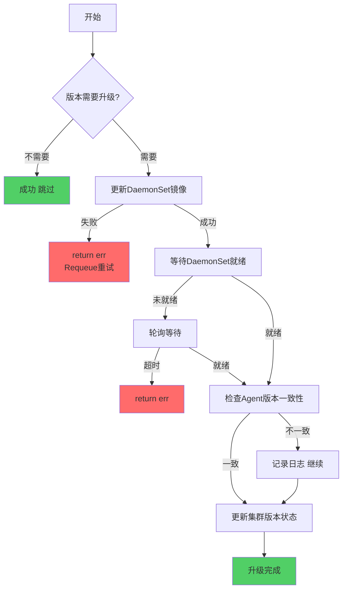

---

### 2.7 Provider自升级异常

#### 2.7.1 异常场景清单

| 异常场景 | 严重程度 | 触发条件 | 处理策略 |
|---------|---------|---------|---------|
| **Provider镜像更新失败** | Error | Deployment镜像更新失败 | 返回错误，Requeue重试 |
| **Provider未就绪** | Warning | Deployment Pod未就绪 | 等待轮询，超时后返回错误 |
| **镜像拉取失败** | Warning | Provider镜像拉取失败 | 重试3次，失败后记录错误 |
| **Pod启动失败** | Error | Provider Pod启动失败 | 等待轮询，超时后返回错误 |

#### 2.7.2 处理流程

```go
// 文件: pkg/phaseframe/phases/ensure_provider_self_upgrade.go
func (e *EnsureProviderSelfUpgrade) Execute() (ctrl.Result, error) {
    // 1. 检查版本是否需要升级
    if !e.needUpgrade() {
        return ctrl.Result{}, nil
    }
    
    // 2. 更新Provider Deployment镜像
    if err := e.updateProviderDeployment(); err != nil {
        // ✅ 异常: Provider镜像更新失败
        // 处理: 返回错误，触发Requeue
        return ctrl.Result{}, err
    }
    
    // 3. 等待Provider Deployment就绪
    if err := e.waitForProviderReady(); err != nil {
        // ✅ 异常: Provider未就绪
        // 处理: 返回错误，触发Requeue
        return ctrl.Result{}, err
    }
    
    return ctrl.Result{}, nil
}
```

#### 2.7.3 重试机制

| 重试类型 | 配置 | 说明 |
|---------|------|------|
| **Provider镜像更新失败** | Requeue重试 | 返回错误触发Requeue |
| **Provider就绪等待** | 轮询间隔10秒 | 持续检查Deployment状态 |
| **Provider就绪超时** | 5分钟 | 超时后返回错误 |
| **镜像拉取重试** | 最多3次 | 镜像拉取失败重试 |

#### 2.7.4 异常处理流程图

**ASCII 版本**

```
┌─────────────────────────────────────────────────────────────┐
│  EnsureProviderSelfUpgrade 异常处理流程图                     │
├─────────────────────────────────────────────────────────────┤
│                                                             │
│  开始                                                        │
│   │                                                         │
│   ▼                                                         │
│  ┌─────────────────────┐                                    │
│  │ 检查版本是否需要升级 │                                    │
│  │ needUpgrade()       │                                    │
│  └──────────┬──────────┘                                    │
│             │                                               │
│      ┌──────┴──────┐                                        │
│      ▼             ▼                                        │
│   不需要         需要                                        │
│      │             │                                        │
│      ▼             ▼                                        │
│  成功(跳过)   ┌──────────────┐                              │
│               │更新Provider   │◄── 失败 ──▶ return err      │
│               │Deployment镜像 │              Requeue重试     │
│               └──────────────┘                              │
│                     │                                        │
│                     ▼                                        │
│               ┌──────────────┐                              │
│               │等待Provider   │◄── 未就绪 ──▶ 轮询等待       │
│               │Deployment就绪 │              超时▶ return err │
│               └──────────────┘                              │
│                     │                                        │
│                     ▼                                        │
│                   升级完成                                    │
│                                                             │
│  注意: Provider自升级成功后，Controller会重启并重新调谐         │
│                                                             │
└─────────────────────────────────────────────────────────────┘
```

**Mermaid 版本**

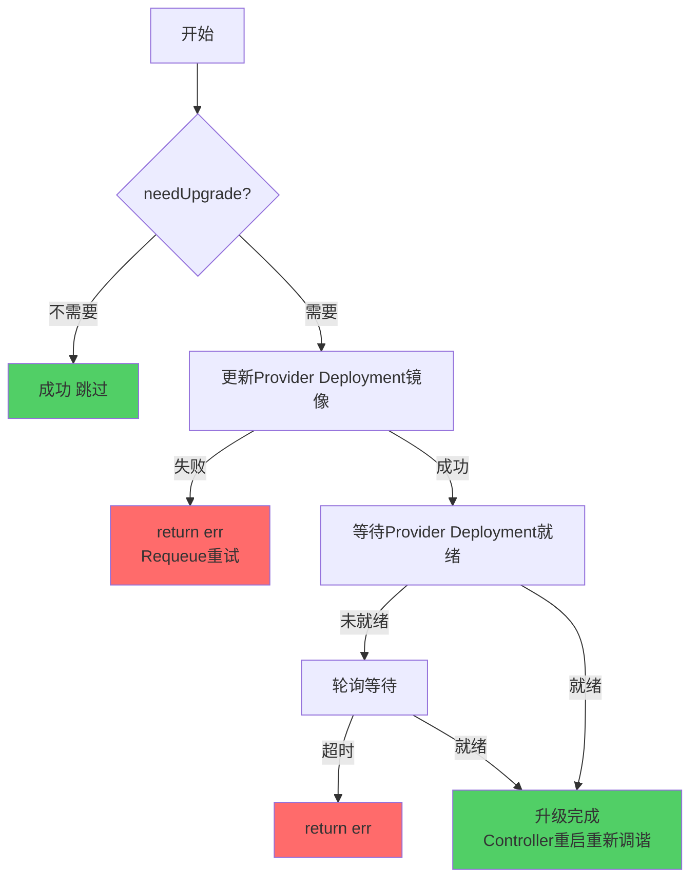

---

### 2.8 Worker删除异常

#### 2.8.1 异常场景清单

| 异常场景 | 严重程度 | 触发条件 | 处理策略 |
|---------|---------|---------|---------|
| **集群状态不健康** | Error | ClusterStatus=Unhealthy/Unknown | 跳过删除，等待集群恢复 |
| **节点Drain失败** | Warning | 节点驱逐Pod失败 | 强制Drain，继续删除 |
| **删除命令创建失败** | Error | Command CRD创建失败 | 返回错误，Requeue重试 |
| **删除命令执行失败** | Error | 节点删除操作失败 | 标记节点失败，重试3次 |
| **节点NotReady** | Warning | 节点删除后未消失 | 等待轮询，超时后标记失败 |
| **部分Worker删除失败** | Warning | 部分节点删除失败 | 记录失败列表，继续其他节点 |

#### 2.8.2 处理流程

```go
// 文件: pkg/phaseframe/phases/ensure_worker_delete.go
func (e *EnsureWorkerDelete) Execute() (ctrl.Result, error) {
    // 1. 检查集群状态是否健康
    if bkeCluster.Status.ClusterStatus == bkev1beta1.ClusterUnhealthy || 
        bkeCluster.Status.ClusterStatus == bkev1beta1.ClusterUnknown {
        log.Warn("Cluster is unhealthy, skip worker delete")
        return ctrl.Result{}, nil
    }
    
    // 2. 获取需要删除的Worker节点
    nodes := e.getNeedDeleteWorkerNodes()
    if len(nodes) == 0 {
        return ctrl.Result{}, nil
    }
    
    // 3. 滚动删除Worker节点
    var failedNodes []string
    for _, node := range nodes {
        // 3.1 Drain节点（驱逐Pod）
        if err := e.drainNode(node); err != nil {
            log.Warn("Node drain failed, force drain: %v", err)
            e.forceDrainNode(node)
        }
        
        // 3.2 创建删除命令
        deleteCmd := e.createDeleteCommand(node)
        if err := deleteCmd.New(); err != nil {
            return ctrl.Result{}, err
        }
        
        // 3.3 等待命令完成
        err, successNodes, failedNodes := deleteCmd.Wait()
        if err != nil || len(failedNodes) > 0 {
            log.Warn("Worker delete failed for node %s", node.IP)
            e.markNodeDeleteFailed(node)
            continue
        }
        
        // 3.4 标记节点删除成功
        e.markNodeDeleteSuccess(node)
    }
    
    // 4. 处理失败节点
    if len(failedNodes) > 0 {
        return ctrl.Result{}, errors.Errorf("some worker nodes failed to delete: %v", failedNodes)
    }
    
    return ctrl.Result{}, nil
}
```

#### 2.8.3 重试机制

| 重试类型 | 配置 | 说明 |
|---------|------|------|
| **节点级重试** | 最多3次 | 每个Worker节点独立重试 |
| **失败策略** | Best-Effort | 单节点失败不影响其他节点 |
| **Drain重试** | 强制Drain | Drain失败后强制驱逐 |
| **健康检查轮询** | 间隔2秒 | 持续检查节点删除状态 |
| **健康检查超时** | 5分钟 | 超时后标记失败 |

#### 2.8.4 异常处理流程图

**ASCII 版本**

```
┌─────────────────────────────────────────────────────────────┐
│  EnsureWorkerDelete 异常处理流程图 (Best-Effort)              │
├─────────────────────────────────────────────────────────────┤
│                                                             │
│  开始                                                        │
│   │                                                         │
│   ▼                                                         │
│  ┌─────────────────────┐                                    │
│  │ 检查集群状态是否健康 │                                    │
│  └──────────┬──────────┘                                    │
│             │                                               │
│      ┌──────┴──────┐                                        │
│      ▼             ▼                                        │
│   不健康         健康                                        │
│      │             │                                        │
│      ▼             ▼                                        │
│  跳过删除     ┌──────────────┐                              │
│  等待恢复     │获取需要删除的 │                              │
│               │Worker节点     │                              │
│               └──────────────┘                              │
│                     │                                        │
│              ┌──────┴──────┐                                 │
│              ▼             ▼                                 │
│           无节点         有节点                              │
│              │             │                                 │
│              ▼             ▼                                 │
│          成功(跳过)  ┌──────────────────┐                    │
│                      │ 遍历每个Worker节点│                    │
│                      │                  │                    │
│                      │ ┌──────────────┐│                    │
│                      │ │Drain节点     │── 失败 ──▶ 强制Drain│
│                      │ │(驱逐Pod)     │              继续    │
│                      │ └──────────────┘│                    │
│                      │ ┌──────────────┐│                    │
│                      │ │创建删除命令   │── 失败 ──▶ return  │
│                      │ └──────────────┘│                    │
│                      │ ┌──────────────┐│                    │
│                      │ │等待命令完成   │── 失败 ──▶ 重试3次 │
│                      │ │              │          仍失败▶标记 │
│                      │ └──────────────┘│                    │
│                      │ ┌──────────────┐│                    │
│                      │ │标记删除成功   │                    │
│                      │ └──────────────┘│                    │
│                      └────────┬─────────┘                   │
│                               │                              │
│                        ┌──────┴──────┐                      │
│                        ▼             ▼                      │
│                     有失败         无失败                    │
│                        │             │                      │
│                        ▼             ▼                      │
│                  记录失败列表     删除完成                    │
│                  return err                                 │
│                  触发Requeue                                │
│                                                             │
└─────────────────────────────────────────────────────────────┘
```

**Mermaid 版本**

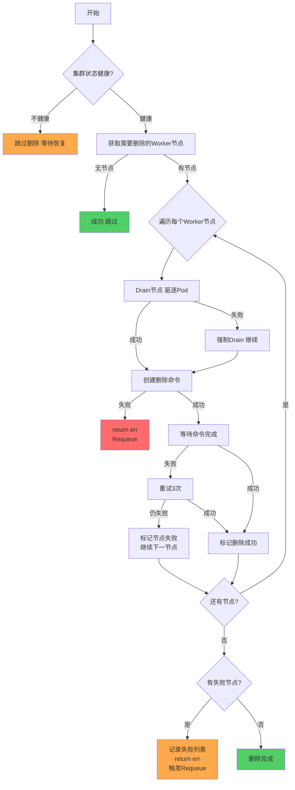

---

### 2.9 Master删除异常

#### 2.9.1 异常场景清单

| 异常场景 | 严重程度 | 触发条件 | 处理策略 |
|---------|---------|---------|---------|
| **集群状态不健康** | Error | ClusterStatus=Unhealthy/Unknown | 跳过删除，等待集群恢复 |
| **Etcd成员移除失败** | **Fatal** | Etcd member remove失败 | **Fail-Fast，需人工介入** |
| **删除命令创建失败** | Error | Command CRD创建失败 | 返回错误，Requeue重试 |
| **删除命令执行失败** | Error | 节点删除操作失败 | 标记节点失败，重试3次 |
| **API Server不可达** | **Fatal** | API Server健康检查失败 | **Fail-Fast，需人工介入** |
| **部分Master删除失败** | Error | 部分节点删除失败 | 记录失败列表，继续其他节点 |

#### 2.9.2 处理流程

```go
// 文件: pkg/phaseframe/phases/ensure_master_delete.go
func (e *EnsureMasterDelete) Execute() (ctrl.Result, error) {
    // 1. 检查集群状态是否健康
    if bkeCluster.Status.ClusterStatus == bkev1beta1.ClusterUnhealthy || 
        bkeCluster.Status.ClusterStatus == bkev1beta1.ClusterUnknown {
        log.Warn("Cluster is unhealthy, skip master delete")
        return ctrl.Result{}, nil
    }
    
    // 2. 获取需要删除的Master节点
    nodes := e.getNeedDeleteMasterNodes()
    if len(nodes) == 0 {
        return ctrl.Result{}, nil
    }
    
    // 3. 滚动删除Master节点
    var failedNodes []string
    for _, node := range nodes {
        // 3.1 从Etcd移除成员（关键）
        if err := e.removeEtcdMember(node); err != nil {
            // Etcd成员移除失败，Fail-Fast
            log.Error("Etcd member remove failed for node %s", node.IP)
            return ctrl.Result{}, errors.Errorf("etcd member remove failed: %v", err)
        }
        
        // 3.2 Drain节点
        if err := e.drainNode(node); err != nil {
            log.Warn("Node drain failed, force drain: %v", err)
            e.forceDrainNode(node)
        }
        
        // 3.3 创建删除命令
        deleteCmd := e.createDeleteCommand(node)
        if err := deleteCmd.New(); err != nil {
            return ctrl.Result{}, err
        }
        
        // 3.4 等待命令完成
        err, successNodes, failedNodes := deleteCmd.Wait()
        if err != nil || len(failedNodes) > 0 {
            log.Warn("Master delete failed for node %s", node.IP)
            e.markNodeDeleteFailed(node)
            continue
        }
        
        // 3.5 标记节点删除成功
        e.markNodeDeleteSuccess(node)
    }
    
    // 4. 处理失败节点
    if len(failedNodes) > 0 {
        return ctrl.Result{}, errors.Errorf("some master nodes failed to delete: %v", failedNodes)
    }
    
    return ctrl.Result{}, nil
}
```

#### 2.9.3 重试机制

| 重试类型 | 配置 | 说明 |
|---------|------|------|
| **Etcd成员移除失败** | **不重试** | Fail-Fast，需人工介入 |
| **节点级重试** | 最多3次 | 每个Master节点独立重试 |
| **健康检查轮询** | 间隔2秒 | 持续检查节点删除状态 |
| **健康检查超时** | 5分钟 | 超时后标记失败 |

#### 2.9.4 异常处理流程图

**ASCII 版本**

```
┌─────────────────────────────────────────────────────────────┐
│  EnsureMasterDelete 异常处理流程图                            │
├─────────────────────────────────────────────────────────────┤
│                                                             │
│  开始                                                        │
│   │                                                         │
│   ▼                                                         │
│  ┌─────────────────────┐                                    │
│  │ 检查集群状态是否健康 │                                    │
│  └──────────┬──────────┘                                    │
│             │                                               │
│      ┌──────┴──────┐                                        │
│      ▼             ▼                                        │
│   不健康         健康                                        │
│      │             │                                        │
│      ▼             ▼                                        │
│  跳过删除     ┌──────────────┐                              │
│  等待恢复     │获取需要删除的 │                              │
│               │Master节点     │                              │
│               └──────────────┘                              │
│                     │                                        │
│              ┌──────┴──────┐                                 │
│              ▼             ▼                                 │
│           无节点         有节点                              │
│              │             │                                 │
│              ▼             ▼                                 │
│          成功(跳过)  ┌──────────────────┐                    │
│                      │ 遍历每个Master节点│                    │
│                      │                  │                    │
│                      │ ┌──────────────┐│                    │
│                      │ │Etcd成员移除   │── 失败 ──▶ ❌ Fail │
│                      │ │(关键步骤)     │         -Fast       │
│                      │ └──────────────┘│                    │
│                      │ ┌──────────────┐│                    │
│                      │ │Drain节点     │── 失败 ──▶ 强制Drain│
│                      │ │(驱逐Pod)     │              继续    │
│                      │ └──────────────┘│                    │
│                      │ ┌──────────────┐│                    │
│                      │ │创建删除命令   │── 失败 ──▶ return  │
│                      │ └──────────────┘│                    │
│                      │ ┌──────────────┐│                    │
│                      │ │等待命令完成   │── 失败 ──▶ 重试3次 │
│                      │ │              │          仍失败▶标记 │
│                      │ └──────────────┘│                    │
│                      │ ┌──────────────┐│                    │
│                      │ │标记删除成功   │                    │
│                      │ └──────────────┘│                    │
│                      └────────┬─────────┘                   │
│                               │                              │
│                        ┌──────┴──────┐                      │
│                        ▼             ▼                      │
│                     有失败         无失败                    │
│                        │             │                      │
│                        ▼             ▼                      │
│                  记录失败列表     删除完成                    │
│                  return err                                 │
│                  触发Requeue                                │
│                                                             │
└─────────────────────────────────────────────────────────────┘
```

**Mermaid 版本**

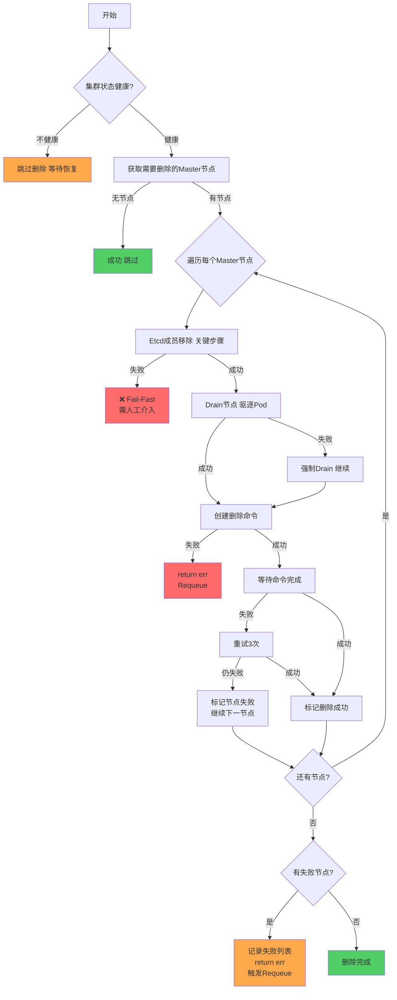

---

### 2.10 EnsureCluster 异常

#### 2.10.1 异常场景清单

| 异常场景 | 严重程度 | 触发条件 | 处理策略 |
|---------|---------|---------|---------|
| **集群健康检查失败** | Warning | 集群状态不满足健康条件 | 记录状态，返回错误 |
| **控制面不可达** | Error | API Server不可达 | 返回错误，Requeue重试 |
| **节点NotReady** | Warning | 部分节点NotReady | 记录失败节点列表 |
| **Etcd集群不健康** | Error | Etcd集群异常 | 返回错误，Requeue重试 |
| **核心组件异常** | Warning | CoreDNS/kube-proxy不健康 | 记录警告，继续执行 |

#### 2.10.2 处理流程

```go
// 文件: pkg/phaseframe/phases/ensure_cluster.go
func (e *EnsureCluster) Execute() (ctrl.Result, error) {
    // 1. 检查控制面是否可达
    if err := e.checkControlPlaneReachable(); err != nil {
        log.Error("Control plane not reachable: %v", err)
        return ctrl.Result{}, err
    }
    
    // 2. 检查Etcd集群健康
    if err := e.checkEtcdClusterHealth(); err != nil {
        log.Error("Etcd cluster unhealthy: %v", err)
        return ctrl.Result{}, err
    }
    
    // 3. 检查节点状态
    notReadyNodes := e.checkNodesReady()
    if len(notReadyNodes) > 0 {
        log.Warn("Some nodes not ready: %v", notReadyNodes)
    }
    
    // 4. 检查核心组件状态
    if err := e.checkCoreComponents(); err != nil {
        log.Warn("Core components unhealthy: %v", err)
    }
    
    // 5. 更新集群健康状态
    if len(notReadyNodes) == 0 {
        bkeCluster.Status.ClusterHealthState = bkev1beta1.Healthy
        bkeCluster.Status.ClusterStatus = bkev1beta1.ClusterReady
    } else {
        bkeCluster.Status.ClusterHealthState = bkev1beta1.Unhealthy
    }
    
    return ctrl.Result{}, nil
}
```

#### 2.10.3 重试机制

| 重试类型 | 配置 | 说明 |
|---------|------|------|
| **控制面不可达** | Requeue重试 | 返回错误触发Requeue |
| **Etcd不健康** | Requeue重试 | 返回错误触发Requeue |
| **节点NotReady** | 记录警告 | 不阻断流程，记录状态 |
| **组件不健康** | 记录警告 | 不阻断流程，记录状态 |

#### 2.10.4 异常处理流程图

**ASCII 版本**

```
┌─────────────────────────────────────────────────────────────┐
│  EnsureCluster 异常处理流程图                                 │
├─────────────────────────────────────────────────────────────┤
│                                                             │
│  开始                                                        │
│   │                                                         │
│   ▼                                                         │
│  ┌─────────────────────┐                                    │
│  │ 检查控制面是否可达   │◄── 不可达 ──▶ return err           │
│  └──────────┬──────────┘              Requeue重试            │
│             │                                               │
│             ▼                                               │
│  ┌─────────────────────┐                                    │
│  │ 检查Etcd集群健康     │◄── 不健康 ──▶ return err           │
│  └──────────┬──────────┘              Requeue重试            │
│             │                                               │
│             ▼                                               │
│  ┌─────────────────────┐                                    │
│  │ 检查节点状态         │◄── 部分NotReady ──▶ 记录警告       │
│  └──────────┬──────────┘                                    │
│             │                                               │
│             ▼                                               │
│  ┌─────────────────────┐                                    │
│  │ 检查核心组件状态     │◄── 不健康 ──▶ 记录警告             │
│  └──────────┬──────────┘                                    │
│             │                                               │
│             ▼                                               │
│  ┌─────────────────────┐                                    │
│  │ 更新集群健康状态     │                                    │
│  │ 全部OK → Ready      │                                    │
│  │ 有异常 → Unhealthy  │                                    │
│  └──────────┬──────────┘                                    │
│             │                                               │
│             ▼                                               │
│                   升级完成                                    │
│                                                             │
└─────────────────────────────────────────────────────────────┘
```

**Mermaid 版本**

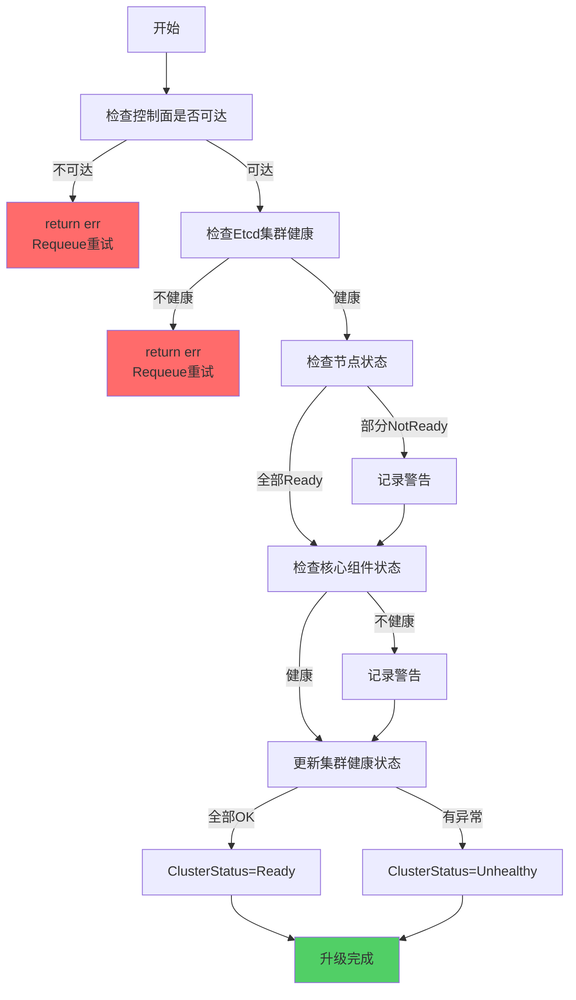

---

## 三、重试机制详细说明

### 3.1 重试配置参数

```go
// 全局重试配置常量
const (
    // Etcd/Master升级轮询间隔
    MasterUpgradePollIntervalSeconds = 2
    EtcdHealthCheckInterval          = 2 * time.Second
    
    // Etcd/Master升级超时时间
    MasterUpgradeTimeoutMinutes      = 5
    EtcdHealthCheckTimeout           = 5 * time.Minute
    
    // Worker升级健康检查
    WorkerNodeHealthCheckPollIntervalSeconds = 2
    WorkerNodeHealthCheckTimeoutMinutes      = 5
    
    // Agent升级超时时间
    DaemonsetReadyTimeout            = 5 * time.Minute
    
    // 命令重试配置（继承安装流程）
    DefaultBackoffLimit              = 3
    DefaultActiveDeadlineSecond      = 1000
    DefaultTTLSecondsAfterFinished   = 600
)
```

### 3.2 重试决策矩阵

```
┌─────────────────────────────────────────────────────────────┐
│  升级流程重试决策树                                          │
└─────────────────────────────────────────────────────────────┘
         │
         ├── 1. Provider自升级失败
         │   ├── Provider镜像更新失败 → ✅ Requeue重试
         │   ├── Provider未就绪 → ⏸️ 等待轮询，超时→返回错误
         │   └── 镜像拉取失败 → ⚠️ 重试3次，失败→记录错误
         │
         ├── 2. Agent升级失败
         │   ├── DaemonSet更新失败 → ✅ Requeue重试
         │   ├── DaemonSet未就绪 → ⏸️ 等待轮询，超时→返回错误
         │   └── Agent版本不一致 → ⚠️ 记录错误，继续执行
         │
         ├── 3. Containerd升级失败
         │   ├── Containerd重置失败 → ✅ 重试3次
         │   ├── Containerd部署失败 → ✅ 重试3次
         │   └── 镜像拉取失败 → ⚠️ BackoffIgnore=true，跳过
         │
         ├── 4. Etcd升级失败
         │   ├── Etcd备份失败 → ❌ Fail-Fast，需人工介入
         │   ├── Etcd健康检查失败 → ❌ Fail-Fast，需人工介入
         │   └── Etcd节点升级失败 → ✅ 重试3次，仍失败→标记失败
         │
         ├── 5. Worker升级失败
         │   ├── 集群状态不健康 → ⏸️ 跳过升级，等待集群恢复
         │   ├── 节点Drain失败 → ⚠️ 强制Drain，继续升级
         │   ├── Kubeadm upgrade失败 → ✅ 重试3次，仍失败→标记失败
         │   └── 部分节点失败 → ⚠️ Best-Effort，继续其他节点
         │
         ├── 6. Master升级失败
         │   ├── Kubeadm upgrade失败 → ❌ Fail-Fast，需人工介入
         │   ├── API Server不可达 → ❌ Fail-Fast，需人工介入
         │   └── Master节点升级失败 → ✅ 重试3次，仍失败→标记失败
         │
         ├── 7. Worker删除失败
         │   ├── 集群状态不健康 → ⏸️ 跳过删除，等待集群恢复
         │   ├── 节点Drain失败 → ⚠️ 强制Drain，继续删除
         │   ├── 删除命令失败 → ✅ 重试3次，仍失败→标记失败
         │   └── 部分节点失败 → ⚠️ Best-Effort，继续其他节点
         │
         ├── 8. Master删除失败
         │   ├── Etcd成员移除失败 → ❌ Fail-Fast，需人工介入
         │   ├── 删除命令失败 → ✅ 重试3次，仍失败→标记失败
         │   └── 部分节点失败 → ⚠️ 记录失败列表，继续其他节点
         │
         ├── 9. 组件升级失败
         │   ├── CoreDNS升级失败 → ✅ Requeue重试
         │   ├── kube-proxy升级失败 → ✅ Requeue重试
         │   └── 组件健康检查失败 → ⏸️ 等待轮询，超时→返回错误
         │
         └── 10. 集群健康检查失败
             ├── 控制面不可达 → ✅ Requeue重试
             ├── Etcd不健康 → ✅ Requeue重试
             └── 节点NotReady → ⚠️ 记录警告，继续执行
```
             ├── Provider未就绪 → ⏸️ 等待轮询，超时→返回错误
             └── 镜像拉取失败 → ⚠️ 重试3次，失败→记录错误
```

### 3.3 升级失败回滚机制

```
┌─────────────────────────────────────────────────────────────┐
│  升级失败回滚决策                                            │
└─────────────────────────────────────────────────────────────┘
         │
         ├── 1. Provider自升级失败
         │   ├── Provider镜像更新失败 → ✅ 可回滚到旧版本镜像
         │   ├── Provider未就绪 → ⏸️ 等待Pod恢复
         │   └── 镜像拉取失败 → ⚠️ 重试3次，失败→记录错误
         │
         ├── 2. Agent升级失败
         │   ├── DaemonSet更新失败 → ✅ 可回滚到旧版本镜像
         │   ├── DaemonSet未就绪 → ⏸️ 等待Pod恢复
         │   └── Agent版本不一致 → ⚠️ 记录错误，继续执行
         │
         ├── 3. Containerd升级失败
         │   ├── Containerd重置失败 → ✅ 可重新重置
         │   ├── Containerd部署失败 → ✅ 可重新部署
         │   └── 配置错误 → ❌ 需人工介入，修复配置
         │
         ├── 4. Etcd升级失败
         │   ├── Etcd备份成功 → ✅ 可回滚到备份版本
         │   ├── Etcd备份失败 → ❌ 无法回滚，需人工介入
         │   └── Etcd数据损坏 → ❌ 无法回滚，需人工介入
         │
         ├── 5. Worker升级失败
         │   ├── 单节点失败 → ✅ 可重新升级该节点
         │   ├── 多节点失败 → ⚠️ Best-Effort，逐个重试
         │   └── 全部失败 → ❌ 需人工介入，检查集群状态
         │
         ├── 6. Master升级失败
         │   ├── Kubeadm upgrade失败 → ❌ 需人工介入，手动回滚
         │   ├── API Server不可达 → ❌ 需人工介入，检查日志
         │   └── 证书更新失败 → ✅ 可重新生成证书
         │
         ├── 7. Worker删除失败
         │   ├── 单节点失败 → ✅ 可重新删除该节点
         │   ├── 多节点失败 → ⚠️ Best-Effort，逐个重试
         │   └── 全部失败 → ❌ 需人工介入，检查节点状态
         │
         ├── 8. Master删除失败
         │   ├── Etcd成员移除失败 → ❌ 需人工介入，手动移除
         │   ├── 单节点失败 → ✅ 可重新删除该节点
         │   └── 全部失败 → ❌ 需人工介入，检查Etcd状态
         │
         ├── 9. 组件升级失败
         │   ├── CoreDNS升级失败 → ✅ 可回滚到旧版本镜像
         │   ├── kube-proxy升级失败 → ✅ 可回滚到旧版本镜像
         │   └── 组件健康检查失败 → ⏸️ 等待组件恢复
         │
         └── 10. 集群健康检查失败
             ├── 控制面不可达 → ❌ 需人工介入，检查API Server
             ├── Etcd不健康 → ❌ 需人工介入，检查Etcd集群
             └── 节点NotReady → ⚠️ 记录警告，排查节点问题
```

## 四、异常处理最佳实践

### 4.1 升级前预检

```go
// 升级前预检清单
func (e *Phase) preUpgradeCheck() error {
    // 1. 检查集群状态是否健康
    if bkeCluster.Status.ClusterStatus != bkev1beta1.ClusterHealthy {
        return errors.Errorf("cluster is not healthy, status: %s", bkeCluster.Status.ClusterStatus)
    }
    
    // 2. 检查所有节点是否Ready
    nodes, err := e.getAllNodes()
    if err != nil {
        return err
    }
    for _, node := range nodes {
        if !e.isNodeReady(node) {
            return errors.Errorf("node %s is not ready", node.Name)
        }
    }
    
    // 3. 检查Etcd集群是否健康
    if err := e.checkEtcdClusterHealth(); err != nil {
        return errors.Errorf("etcd cluster is not healthy: %v", err)
    }
    
    // 4. 检查版本兼容性
    if err := e.checkVersionCompatibility(); err != nil {
        return errors.Errorf("version compatibility check failed: %v", err)
    }
    
    // 5. 检查资源是否充足（磁盘、内存）
    if err := e.checkResourceAvailability(); err != nil {
        return errors.Errorf("resource availability check failed: %v", err)
    }
    
    return nil
}
```

### 4.2 升级中监控

```go
// 升级中监控清单
func (e *Phase) monitorUpgradeProgress() {
    // 1. 监控节点升级进度
    for _, node := range upgradingNodes {
        log.Info("Node %s upgrade progress: %s", node.IP, node.Status)
    }
    
    // 2. 监控Etcd集群健康状态
    etcdHealth := e.getEtcdClusterHealth()
    log.Info("Etcd cluster health: %s", etcdHealth)
    
    // 3. 监控API Server可用性
    apiServerHealth := e.checkAPIServerHealth()
    log.Info("API Server health: %s", apiServerHealth)
    
    // 4. 监控组件升级进度
    componentHealth := e.checkComponentsHealth()
    log.Info("Components health: %s", componentHealth)
    
    // 5. 监控集群整体状态
    clusterStatus := e.getClusterStatus()
    log.Info("Cluster status: %s", clusterStatus)
}
```

### 4.3 升级后验证

```go
// 升级后验证清单
func (e *Phase) postUpgradeValidation() error {
    // 1. 验证所有节点版本
    nodes, err := e.getAllNodes()
    if err != nil {
        return err
    }
    for _, node := range nodes {
        if node.Status.NodeInfo.KubeletVersion != targetVersion {
            return errors.Errorf("node %s version mismatch: expected %s, got %s", 
                node.Name, targetVersion, node.Status.NodeInfo.KubeletVersion)
        }
    }
    
    // 2. 验证Etcd集群健康
    if err := e.checkEtcdClusterHealth(); err != nil {
        return errors.Errorf("etcd cluster health check failed: %v", err)
    }
    
    // 3. 验证API Server可用性
    if err := e.checkAPIServerHealth(); err != nil {
        return errors.Errorf("API Server health check failed: %v", err)
    }
    
    // 4. 验证组件版本
    if err := e.checkComponentVersions(); err != nil {
        return errors.Errorf("component version check failed: %v", err)
    }
    
    // 5. 验证集群功能
    if err := e.validateClusterFunctionality(); err != nil {
        return errors.Errorf("cluster functionality validation failed: %v", err)
    }
    
    return nil
}
```

## 五、异常场景快速参考表

### 5.1 按Phase分类

| Phase | 关键异常 | 处理策略 | 重试次数 | 人工介入 |
|-------|---------|---------|---------|---------|
| **EnsureProviderSelfUpgrade** | Provider镜像更新失败 | Requeue重试 | 无限制 | 否 |
| **EnsureAgentUpgrade** | DaemonSet更新失败 | Requeue重试 | 无限制 | 否 |
| **EnsureContainerdUpgrade** | Containerd重置/部署失败 | 单节点重试 | 3次 | 视情况 |
| **EnsureEtcdUpgrade** | Etcd备份失败、健康检查失败 | **Fail-Fast** | **0次** | **是** |
| **EnsureWorkerUpgrade** | Kubeadm upgrade失败 | Best-Effort | 3次 | 视情况 |
| **EnsureMasterUpgrade** | Kubeadm upgrade失败、API Server不可达 | **Fail-Fast** | **0次** | **是** |
| **EnsureWorkerDelete** | 节点删除失败 | Best-Effort | 3次 | 视情况 |
| **EnsureMasterDelete** | Etcd成员移除失败 | **Fail-Fast** | **0次** | **是** |
| **EnsureComponentUpgrade** | CoreDNS/kube-proxy升级失败 | Requeue重试 | 无限制 | 否 |
| **EnsureCluster** | 控制面不可达、Etcd不健康 | Requeue重试 | 无限制 | 否 |

### 5.2 按严重程度分类

| 严重程度 | 处理策略 | 示例场景 |
|---------|---------|---------|
| **Fatal** | Fail-Fast，需人工介入 | Etcd备份失败、Master升级失败、API Server不可达 |
| **Error** | Requeue重试或标记失败 | Kubeadm upgrade失败、组件升级失败 |
| **Warning** | 记录日志，继续执行 | Agent版本不一致、Addon升级失败 |
| **Info** | 正常流程记录 | 节点已升级、跳过处理 |

### 5.3 按重试策略分类

| 重试策略 | 适用场景 | 配置示例 |
|---------|---------|---------|
| **不重试** | Etcd/Master升级失败 | Fail-Fast策略 |
| **有限次重试** | Worker升级、Containerd升级 | BackoffLimit=3 |
| **无限次重试** | 组件升级、Agent升级 | Controller自动Requeue |
| **跳过失败** | 非关键操作、可降级 | BackoffIgnore=true |

## 六、故障排查指南

### 6.1 常见故障排查流程

```
升级失败
│
├── 1. 检查Phase状态
│   └── kubectl get bkecluster <name> -o yaml | grep phase
│
├── 2. 检查节点状态
│   └── kubectl get bkenodes -l cluster=<name>
│       ├── 检查节点版本
│       └── 检查节点健康状态
│
├── 3. 检查Etcd状态
│   ├── kubectl get pods -n kube-system -l component=etcd
│   └── etcdctl endpoint health
│   └── etcdctl endpoint status
│
├── 4. 检查API Server状态
│   ├── kubectl get pods -n kube-system -l component=kube-apiserver
│   └── kubectl cluster-info
│
├── 5. 检查组件状态
│   ├── kubectl get pods -n kube-system -l k8s-app=kube-dns
│   └── kubectl get pods -n kube-system -l k8s-app=kube-proxy
│
├── 6. 检查日志
│   ├── Controller日志: kubectl logs <controller-pod>
│   ├── Kubeadm日志: ssh node "cat /var/log/kubeadm.log"
│   └── Etcd日志: ssh node "journalctl -u etcd -f"
│
└── 7. 根据Phase定位问题
    ├── EnsureProviderSelfUpgrade失败 → 检查Deployment状态、镜像
    ├── EnsureAgentUpgrade失败 → 检查DaemonSet状态、镜像
    ├── EnsureContainerdUpgrade失败 → 检查containerd日志、配置
    ├── EnsureEtcdUpgrade失败 → 检查Etcd备份、健康状态
    ├── EnsureWorkerUpgrade失败 → 检查kubeadm、节点资源
    ├── EnsureMasterUpgrade失败 → 检查kubeadm日志、API Server
    ├── EnsureWorkerDelete失败 → 检查节点删除命令状态
    ├── EnsureMasterDelete失败 → 检查Etcd成员移除、节点删除
    ├── EnsureComponentUpgrade失败 → 检查组件Pod状态、镜像
    └── EnsureCluster失败 → 检查控制面、Etcd、节点状态
```

### 6.2 关键日志位置

| 组件 | 日志位置 | 查看命令 |
|------|---------|---------|
| **Controller** | Controller Pod标准输出 | `kubectl logs -n bke-system <controller-pod>` |
| **Etcd** | journalctl | `ssh node "journalctl -u etcd -f"` |
| **Kubelet** | journalctl | `ssh node "journalctl -u kubelet -f"` |
| **Kubeadm** | /var/log/kubeadm.log | `ssh node "cat /var/log/kubeadm.log"` |
| **Containerd** | journalctl | `ssh node "journalctl -u containerd -f"` |
| **CoreDNS** | Pod日志 | `kubectl logs -n kube-system <coredns-pod>` |

### 6.3 常见错误代码

| 错误代码 | 说明 | 解决方案 |
|---------|------|---------|
| **EtcdUpgradeFailedReason** | Etcd升级失败 | 检查Etcd备份、健康状态、日志 |
| **MasterUpgradeFailedReason** | Master升级失败 | 检查kubeadm日志、API Server状态 |
| **WorkerUpgradeFailedReason** | Worker升级失败 | 检查kubeadm日志、节点资源 |
| **ContainerdUpgradeFailedReason** | Containerd升级失败 | 检查containerd日志、配置 |
| **ComponentUpgradeFailed** | 组件升级失败 | 检查组件Pod状态、镜像版本 |
| **AgentUpgradeFailed** | Agent升级失败 | 检查DaemonSet状态、镜像版本 |
| **WorkerDeleteFailedReason** | Worker删除失败 | 检查节点删除命令状态、Drain日志 |
| **MasterDeleteFailedReason** | Master删除失败 | 检查Etcd成员移除、节点删除日志 |
| **ClusterHealthCheckFailed** | 集群健康检查失败 | 检查控制面、Etcd、节点状态 |

## 七、配置调优建议

### 7.1 升级超时配置建议

| 场景 | 推荐配置 | 说明 |
|------|---------|------|
| **小规模集群（<10节点）** | MasterUpgradeTimeoutMinutes=5 | 默认5分钟 |
| **中等规模集群（10-50节点）** | MasterUpgradeTimeoutMinutes=10 | 10分钟 |
| **大规模集群（>50节点）** | MasterUpgradeTimeoutMinutes=15 | 15分钟 |
| **网络较差环境** | MasterUpgradeTimeoutMinutes=20 | 20分钟 |

### 7.2 升级并发控制建议

| 场景 | 推荐配置 | 说明 |
|------|---------|------|
| **Provider自升级** | 串行执行 | 确保Controller重启后重新调谐 |
| **Agent升级** | DaemonSet滚动更新 | K8s自动滚动，无需手动控制 |
| **Containerd升级** | 逐个节点升级 | 确保运行时稳定 |
| **Etcd升级** | 逐个节点升级 | 确保Etcd集群稳定 |
| **Worker升级** | 并发升级（最多3个） | 提升升级效率 |
| **Master升级** | 逐个节点升级 | 确保API Server可用 |
| **Worker删除** | 并发删除（最多3个） | 提升删除效率 |
| **Master删除** | 逐个节点删除 | 确保Etcd成员安全移除 |
| **组件升级** | 串行执行 | 确保组件依赖顺序 |

### 7.3 升级前备份建议

| 备份类型 | 推荐频率 | 存储位置 |
|---------|---------|---------|
| **Etcd数据** | 每次升级前 | 本地磁盘 + 远程存储 |
| **证书文件** | 每次升级前 | Secret备份 |
| **配置文件** | 每次升级前 | ConfigMap备份 |
| **Addon配置** | 每次升级前 | ConfigMap备份 |

## 八、总结

### 8.1 升级流程关键点

1. **Provider自升级**：最先执行，升级后Controller重启重新调谐
2. **Agent升级**：DaemonSet滚动更新，确保所有节点Agent版本一致
3. **Containerd升级**：重置配置后重新部署，确保运行时稳定
4. **Etcd升级**：最关键环节，备份失败需人工介入
5. **Worker升级**：Best-Effort策略，单节点失败不影响整体
6. **Master升级**：核心环节，升级失败需人工介入
7. **Worker删除**：滚动删除Worker节点，Drain失败强制继续
8. **Master删除**：需先移除Etcd成员，失败需人工介入
9. **组件升级**：自动重试，失败后可回滚
10. **集群健康检查**：最终验证，确保升级后集群可用

### 8.2 升级失败处理原则

| 原则 | 说明 |
|------|------|
| **Fail-Fast原则** | Etcd/Master升级/删除失败立即停止，需人工介入 |
| **Best-Effort原则** | Worker升级/删除单节点失败继续其他节点 |
| **自动重试原则** | 组件/Agent/Provider升级失败自动Requeue重试 |
| **备份优先原则** | Etcd备份成功后才允许升级 |
| **健康检查原则** | 每个节点升级后必须健康检查 |
| **顺序执行原则** | 严格按PostDeployPhases顺序执行，不可跳过 |

### 8.3 升级成功率保障

| 保障措施 | 说明 |
|---------|------|
| **升级前预检** | 检查集群健康、节点状态、版本兼容性 |
| **升级中监控** | 实时监控节点进度、Etcd健康、API Server可用性 |
| **升级后验证** | 验证节点版本、组件版本、集群功能 |
| **备份机制** | Etcd数据备份，确保可回滚 |
| **回滚机制** | 组件镜像回滚，Agent版本回滚 |

---

**文档版本**: v1.0  
**维护者**: cluster-api-provider-bke 开发团队
        
