# 安装过程异常分类处理清单

## 文档说明

**适用范围**: cluster-api-provider-bke 集群安装全流程  
**目标读者**: 设计人员、开发人员、测试人员、运维人员  
**版本**: v1.0  

## 一、安装流程概览

### 1.1 安装Phase顺序

```
┌─────────────────────────────────────────────────────────────┐
│  集群安装完整流程                                            │
│  CommonPhases (5个) + DeployPhases (11个) = 共16个Phase      │
└─────────────────────────────────────────────────────────────┘

  第一阶段: CommonPhases (所有场景都执行)
  ─────────────────────────────────────────
         │
         ├── Phase 1: EnsureFinalizer
         │   └── 添加Finalizer保护集群不被误删
         │
         ├── Phase 2: EnsurePaused
         │   └── 检查集群是否被暂停管理
         │
         ├── Phase 3: EnsureClusterManage
         │   └── 判断是否纳管现有集群
         │
         ├── Phase 4: EnsureDeleteOrReset
         │   └── 判断是否删除或重置集群
         │
         └── Phase 5: EnsureDryRun
             └── DryRun试运行模式

  第二阶段: DeployPhases (集群部署时执行)
  ─────────────────────────────────────────
         │
         ├── Phase 6: EnsureBKEAgent
         │   └── 推送Agent到所有节点
         │
         ├── Phase 7: EnsureNodesEnv
         │   └── 初始化节点环境（依赖、工具、配置）
         │
         ├── Phase 8: EnsureClusterAPIObj
         │   └── 创建Cluster API对象（Cluster/Machine等）
         │
         ├── Phase 9: EnsureCerts
         │   └── 生成集群证书（CA、Etcd、Kubernetes）
         │
         ├── Phase 10: EnsureLoadBalance
         │   └── 配置集群入口负载均衡
         │
         ├── Phase 11: EnsureMasterInit
         │   └── 初始化第一个Master节点
         │
         ├── Phase 12: EnsureMasterJoin
         │   └── 其他Master节点加入集群
         │
         ├── Phase 13: EnsureWorkerJoin
         │   └── Worker节点加入集群
         │
         ├── Phase 14: EnsureAddonDeploy
         │   └── 部署集群Addon组件
         │
         ├── Phase 15: EnsureNodesPostProcess
         │   └── 节点后置处理（标签、污点等）
         │
         └── Phase 16: EnsureAgentSwitch
             └── 切换Agent监听模式
```

### 1.2 各Phase关键操作

| Phase | 关键操作 | 失败影响 | 重试策略 |
|-------|---------|---------|---------|
| **EnsureFinalizer** | 添加Finalizer | 集群可能被误删 | 自动重试 |
| **EnsurePaused** | 暂停状态检查 | 跳过后续Phase | 自动重试 |
| **EnsureClusterManage** | 纳管判断 | 跳过后续Phase | 自动重试 |
| **EnsureDeleteOrReset** | 删除/重置判断 | 跳过后续Phase | 自动重试 |
| **EnsureDryRun** | DryRun模式 | 跳过实际操作 | 自动重试 |
| **EnsureBKEAgent** | SSH连接、文件传输、服务启动 | 节点无法被管理 | 单节点重试3次 |
| **EnsureNodesEnv** | 环境初始化命令执行 | 节点环境不满足要求 | 命令级重试，节点级跳过 |
| **EnsureClusterAPIObj** | 创建CRD对象 | 阻断整个安装流程 | 自动重试 |
| **EnsureCerts** | 证书生成、存储到Secret | 阻断整个安装流程 | 自动重试，无需人工介入 |
| **EnsureLoadBalance** | 配置负载均衡 | 集群入口不可用 | 自动重试 |
| **EnsureMasterInit** | Kubeadm init、组件启动 | **阻断整个安装流程** | Fail-Fast，需人工介入 |
| **EnsureMasterJoin** | Kubeadm join、证书复制 | 集群不完整 | 单节点重试3次 |
| **EnsureWorkerJoin** | Kubeadm join | Worker不可用 | Best-Effort，继续其他节点 |
| **EnsureAddonDeploy** | 部署Addon组件 | 功能不完整 | 自动重试 |
| **EnsureNodesPostProcess** | 标签、污点设置 | 功能不完整 | 忽略错误，继续执行 |
| **EnsureAgentSwitch** | 切换Agent监听模式 | Agent无法正常工作 | 自动重试 |

### 1.3 安装全流程异常处理总览图

#### ASCII 版本

```
┌─────────────────────────────────────────────────────────────────────────────┐
│                    安装全流程异常处理总览图                                    │
│                    CommonPhases (5个) + DeployPhases (11个)                   │
└─────────────────────────────────────────────────────────────────────────────┘

  开始安装
     │
     ▼
  ┌─────────────────┐
  │ CommonPhases    │── Finalizer失败 ──▶ 自动重试
  │ (5个前置判断)    │── 暂停/纳管/删除 ──▶ 跳过后续Phase
  │                 │── DryRun ──▶ 仅模拟不执行
  └────────┬────────┘
           ▼ 通过
  ┌─────────────────┐
  │ EnsureBKEAgent  │── SSH连接失败 ──▶ 单节点重试3次
  │ Agent推送        │── 全部失败 ──▶ Requeue等待
  │                 │── 部分失败 ──▶ 标记失败节点，继续
  └────────┬────────┘
           ▼
  ┌─────────────────┐
  │ EnsureNodesEnv  │── 命令失败 ──▶ Command重试(BackoffLimit)
  │ 节点环境初始化    │── 部分失败 ──▶ 标记失败节点，返回错误
  │                 │── 成功 ──▶ 继续
  └────────┬────────┘
           ▼
  ┌─────────────────┐
  │ EnsureCluster   │── CRD创建失败 ──▶ 自动重试
  │ APIObj          │── 成功 ──▶ 继续
  └────────┬────────┘
           ▼
  ┌─────────────────┐
  │ EnsureCerts     │── 证书生成失败 ──▶ 自动重试
  │ 证书生成         │── 成功 ──▶ 继续
  └────────┬────────┘
           ▼
  ┌─────────────────┐
  │ EnsureLoad      │── 负载均衡配置失败 ──▶ 自动重试
  │ Balance         │── 成功 ──▶ 继续
  └────────┬────────┘
           ▼
  ┌─────────────────┐     ┌──────────────────┐
  │ EnsureMaster    │── 失败 ──▶ Fail-Fast ──▶ 标记 InitializationFailed
  │ Init            │         ❌ 不自动重试      需人工介入排查
  │ Master初始化     │── 超时 ──▶ Requeue等待    检查 kubeadm 日志
  │                 │── 成功 ──▶ 继续
  └────────┬────────┘
           ▼
  ┌─────────────────┐
  │ EnsureMaster    │── 失败 ──▶ 单节点重试3次 ──▶ 仍失败 ▶ 标记节点失败
  │ Join            │── 部分失败 ──▶ 记录失败列表，返回错误
  │ Master加入       │── 成功 ──▶ 继续
  └────────┬────────┘
           ▼
  ┌─────────────────┐
  │ EnsureWorker    │── 失败 ──▶ 单节点重试3次 ──▶ 仍失败 ▶ Best-Effort继续
  │ Join            │── 部分失败 ──▶ 记录失败列表，返回错误触发Requeue
  │ Worker加入       │── 成功 ──▶ 继续
  └────────┬────────┘
           ▼
  ┌─────────────────┐
  │ EnsureAddon     │── 部署失败 ──▶ 自动重试
  │ Deploy          │── 成功 ──▶ 继续
  └────────┬────────┘
           ▼
  ┌─────────────────┐
  │ EnsureNodes     │── 失败 ──▶ 忽略错误，继续执行
  │ PostProcess     │── 成功/失败 ──▶ 继续
  │ 后置处理         │
  └────────┬────────┘
           ▼
  ┌─────────────────┐
  │ EnsureAgent     │── 切换失败 ──▶ 自动重试
  │ Switch          │── 成功 ──▶ 安装完成
  │ Agent切换        │
  └────────┬────────┘
           ▼
       安装完成
       ClusterStatus = Ready
```

#### Mermaid 版本

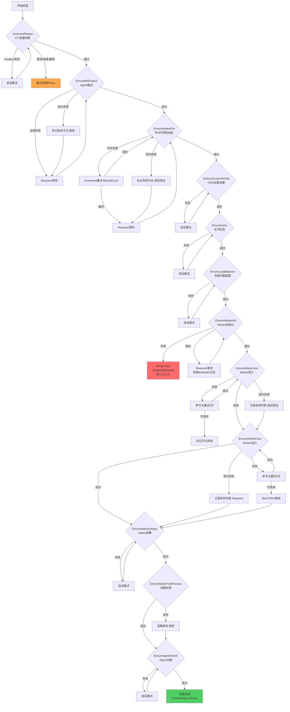

---

## 二、异常分类与处理策略

### 2.1 证书生成异常

#### 2.1.1 异常场景清单

| 异常场景 | 严重程度 | 触发条件 | 处理策略 |
|---------|---------|---------|---------|
| **证书已存在且有效** | Info | Secret已存在且未过期 | 跳过生成，直接使用 |
| **证书已存在但即将过期** | Warning | 证书有效期<30天 | 重新生成并更新 |
| **证书生成失败** | Error | CA生成失败、加密失败 | 返回错误，Requeue重试 |
| **证书存储失败** | Error | Secret创建/更新失败 | 返回错误，Requeue重试 |
| **证书校验失败** | Error | 证书链校验失败 | 重新生成 |
| **节点信息缺失** | Error | 无法获取节点列表 | Requeue等待节点信息 |

#### 2.1.2 处理流程

```go
// 文件: pkg/phaseframe/phases/ensure_certs.go
func (e *EnsureCerts) Execute() (ctrl.Result, error) {
    // 1. 查找或生成证书
    if err := e.certsGenerator.LookUpOrGenerate(); err != nil {
        // 异常: 证书生成失败
        // 处理: 返回错误，Controller自动Requeue
        return ctrl.Result{}, errors.Errorf("failed to generate certs, err: %v", err)
    }
    
    // 2. 检查是否需要重新生成
    need, err := e.certsGenerator.NeedGenerate()
    if err != nil {
        // 异常: 检查失败
        return ctrl.Result{}, err
    }
    if need {
        // 异常: 证书需要重新生成（可能生成过程中出错）
        // 处理: 返回错误，触发重新生成
        return ctrl.Result{}, errors.Errorf("certs need generate again, err: %v", err)
    }
    
    // 3. 成功
    return ctrl.Result{}, nil
}
```

#### 2.1.3 重试机制

| 重试类型 | 配置 | 说明 |
|---------|------|------|
| **Controller Requeue** | 自动 | Controller检测到错误后自动Requeue |
| **Requeue间隔** | 默认立即 | 无特殊配置，使用Controller默认行为 |
| **最大重试次数** | 无限制 | 持续重试直到成功或人工介入 |

#### 2.1.4 异常处理流程图

**ASCII 版本**

```
┌─────────────────────────────────────────────────────────────┐
│  EnsureCerts 异常处理流程图                                   │
├─────────────────────────────────────────────────────────────┤
│                                                             │
│  开始                                                        │
│   │                                                         │
│   ▼                                                         │
│  ┌─────────────────────┐                                    │
│  │ 检查Secret是否存在   │                                    │
│  └──────────┬──────────┘                                    │
│             │                                               │
│      ┌──────┴──────┐                                        │
│      ▼             ▼                                        │
│   存在           不存在                                      │
│      │             │                                        │
│      ▼             ▼                                        │
│  ┌──────────┐  ┌──────────────┐                             │
│  │检查有效期 │  │生成证书       │◄── 失败 ──▶ return err     │
│  └────┬─────┘  │LookUpOrGenerate│         Requeue重试        │
│       │        └──────────────┘                             │
│       │                                                     │
│  ┌────┴─────┐                                               │
│  │<30天?    │                                               │
│  └────┬─────┘                                               │
│       │                                                      │
│  ┌────┴─────┐                                               │
│  │是:重新生成│                                               │
│  │否:跳过    │                                               │
│  └────┬─────┘                                               │
│       │                                                      │
│       ▼                                                      │
│  ┌──────────────┐                                            │
│  │存储到Secret   │◄── 失败 ──▶ return err                    │
│  └──────────────┘         Requeue重试                        │
│       │                                                       │
│       ▼                                                       │
│  ┌──────────────┐                                            │
│  │证书校验       │◄── 失败 ──▶ 重新生成                       │
│  └──────────────┘                                            │
│       │                                                       │
│       ▼                                                       │
│  成功 (return nil)                                            │
│                                                             │
└─────────────────────────────────────────────────────────────┘
```

**Mermaid 版本**

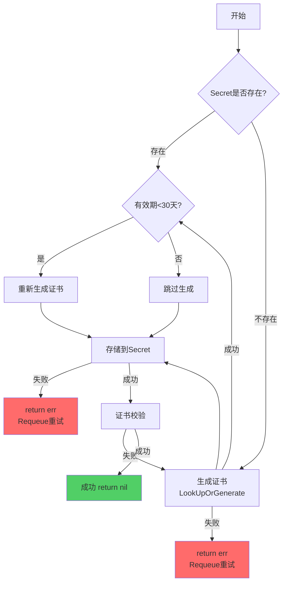

---

### 2.2 Agent推送异常

#### 2.2.1 异常场景清单

| 异常场景 | 严重程度 | 触发条件 | 处理策略 |
|---------|---------|---------|---------|
| **SSH连接失败** | Error | 网络不通、认证失败 | 标记节点失败，继续其他节点 |
| **文件传输失败** | Error | 磁盘满、权限不足 | 标记节点失败，重试3次 |
| **服务启动失败** | Error | 二进制损坏、端口占用 | 标记节点失败，重试3次 |
| **Agent未就绪** | Warning | Agent启动中 | 等待轮询，超时后标记失败 |
| **Hostname获取失败** | Warning | Agent响应异常 | 使用IP作为Hostname |
| **RBAC创建失败** | Warning | 权限不足 | 回退到local kubeconfig |
| **Kubeconfig获取失败** | Error | 配置文件不存在 | 返回错误，中断流程 |

#### 2.2.2 处理流程

```go
// 文件: pkg/phaseframe/phases/ensure_bke_agent.go
func (e *EnsureBKEAgent) Execute() (_ ctrl.Result, err error) {
    // 1. 加载kubeconfig
    if err := e.loadLocalKubeConfig(); err != nil {
        // 异常: kubeconfig加载失败
        // 处理: 记录错误日志，返回错误
        log.Error(constant.BKEAgentNotReadyReason, "Failed to load local kube config, err: %v", err)
        return ctrl.Result{}, err
    }
    
    // 2. 获取需要推送Agent的节点
    if err := e.getNeedPushNodes(); err != nil {
        // 异常: 获取节点列表失败
        // 处理: 记录错误日志，返回错误
        log.Error(constant.BKEAgentNotReadyReason, "Failed to get need push nodes, err: %v", err)
        return ctrl.Result{}, err
    }
    
    // 3. 推送Agent到各节点
    if err := e.pushAgent(); err != nil {
        // 异常: 推送失败
        // 处理: 记录警告日志，返回错误（会触发Requeue）
        log.Warn(constant.BKEAgentNotReadyReason, "Failed to push agent, err: %v", err)
        return ctrl.Result{}, err
    }
    
    // 4. Ping Agent确认就绪
    if err := e.pingAgent(); err != nil {
        // 异常: Agent未就绪
        // 处理: 记录警告日志，返回错误
        log.Warn(constant.BKEAgentNotReadyReason, "Failed to ping agent, err: %v", err)
        return ctrl.Result{}, err
    }
    
    return ctrl.Result{}, nil
}
```

#### 2.2.3 重试机制

| 重试类型 | 配置 | 说明 |
|---------|------|------|
| **节点级重试** | 最多3次 | 每个节点独立重试 |
| **重试间隔** | 5秒 | 每次重试间隔5秒 |
| **失败处理** | 标记NodeInitFailed | 失败节点不影响其他节点 |
| **超时时间** | 5分钟 | 单节点操作超时 |

#### 2.2.4 异常处理流程图

**ASCII 版本**

```
┌─────────────────────────────────────────────────────────────┐
│  EnsureBKEAgent 异常处理流程图                                │
├─────────────────────────────────────────────────────────────┤
│                                                             │
│  开始                                                        │
│   │                                                         │
│   ▼                                                         │
│  ┌─────────────────────┐                                    │
│  │ 加载本地kubeconfig   │◄── 失败 ──▶ return err (阻断)      │
│  └──────────┬──────────┘                                    │
│             │                                               │
│             ▼                                               │
│  ┌─────────────────────┐                                    │
│  │ 获取需要推送的节点   │◄── 失败 ──▶ return err (阻断)      │
│  └──────────┬──────────┘                                    │
│             │                                               │
│             ▼                                               │
│  ┌─────────────────────────────────────┐                    │
│  │ 遍历每个节点:                        │                    │
│  │  ┌─────────────┐                    │                    │
│  │  │ SSH连接     │── 失败 ──▶ 标记节点  │                    │
│  │  │             │          继续下一节点│                    │
│  │  └─────────────┘                    │                    │
│  │  ┌─────────────┐                    │                    │
│  │  │ 文件传输     │── 失败 ──▶ 重试3次  │                    │
│  │  │             │          仍失败▶标记 │                    │
│  │  └─────────────┘                    │                    │
│  │  ┌─────────────┐                    │                    │
│  │  │ 服务启动     │── 失败 ──▶ 重试3次  │                    │
│  │  │             │          仍失败▶标记 │                    │
│  │  └─────────────┘                    │                    │
│  └──────────┬──────────┘                                    │
│             │                                               │
│             ▼                                               │
│  ┌─────────────────────┐                                    │
│  │ Ping Agent确认就绪   │◄── 失败 ──▶ return err             │
│  └──────────┬──────────┘         Requeue等待                 │
│             │                                               │
│             ▼                                               │
│  ┌─────────────────────┐                                    │
│  │ 有失败节点?          │                                    │
│  └──────────┬──────────┘                                    │
│             │                                               │
│      ┌──────┴──────┐                                        │
│      ▼             ▼                                        │
│   有             无                                         │
│      │             │                                        │
│      ▼             ▼                                        │
│  return err     成功                                        │
│  Requeue重试                                                │
│                                                             │
└─────────────────────────────────────────────────────────────┘
```

**Mermaid 版本**

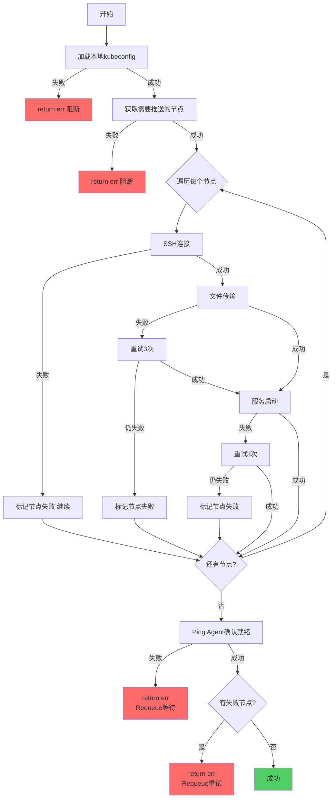

---

### 2.3 节点环境初始化异常

#### 2.3.1 异常场景清单

| 异常场景 | 严重程度 | 触发条件 | 处理策略 |
|---------|---------|---------|---------|
| **Agent未就绪** | Warning | NodeAgentReadyFlag未设置 | 跳过该节点，等待下次协调 |
| **节点已初始化** | Info | NodeEnvFlag已设置 | 跳过该节点 |
| **节点处于失败状态** | Warning | NodeFailedFlag已设置 | 跳过该节点 |
| **节点正在删除** | Info | NodeDeletingFlag已设置 | 跳过该节点 |
| **命令创建失败** | Error | Command CRD创建失败 | 返回错误，Requeue重试 |
| **命令执行超时** | Error | 超过ActiveDeadlineSecond | 标记节点失败，根据BackoffLimit重试 |
| **命令执行失败** | Error | 脚本执行返回非0 | 根据BackoffLimit重试 |
| **部分脚本失败** | Warning | BackoffIgnore=true | 跳过失败脚本，继续执行 |
| **依赖包下载失败** | Error | 网络问题、源不可用 | 重试3次，失败后标记节点失败 |
| **磁盘空间不足** | Error | 可用空间<需求 | 标记节点失败，需人工介入 |

#### 2.3.2 处理流程

```go
// 文件: pkg/phaseframe/phases/ensure_nodes_env.go
func (e *EnsureNodesEnv) CheckOrInitNodesEnv() (ctrl.Result, error) {
    // 1. 获取需要初始化环境的节点
    nodes := e.getNodesToInitEnv()
    if len(nodes) == 0 {
        return ctrl.Result{}, nil
    }
    
    // 2. 设置集群状态条件
    if err := e.setupClusterConditionAndSync(); err != nil {
        // 异常: 状态同步失败
        // 处理: 返回错误，触发Requeue
        return ctrl.Result{}, err
    }
    
    // 3. 构建环境初始化命令
    envCmd, err := e.buildEnvCommand(nodes)
    if err != nil {
        // 异常: 命令构建失败
        // 处理: 返回错误，触发Requeue
        return ctrl.Result{}, err
    }
    
    // 4. 创建命令
    if err := envCmd.Create(); err != nil {
        // 异常: 命令创建失败
        // 处理: 返回错误，触发Requeue
        return ctrl.Result{}, err
    }
    
    // 5. 等待命令完成（含重试逻辑）
    complete, successNodes, failedNodes := envCmd.Wait()
    
    // 6. 处理结果
    if !complete {
        // 异常: 命令未完成（超时）
        // 处理: RequeueAfter等待
        return ctrl.Result{RequeueAfter: 10 * time.Second}, nil
    }
    
    // 7. 标记成功节点
    for _, nodeIP := range successNodes {
        e.Ctx.SetNodeState(nodeIP, bkev1beta1.NodeEnvFlag)
    }
    
    // 8. 处理失败节点
    if len(failedNodes) > 0 {
        // 异常: 部分节点失败
        // 处理: 标记失败，返回错误触发Requeue
        return ctrl.Result{}, errors.Errorf("some nodes failed: %v", failedNodes)
    }
    
    return ctrl.Result{}, nil
}
```

#### 2.3.3 重试机制

```go
// Command CRD重试配置
type ExecCommand struct {
    ID            string   // 命令唯一ID
    Command       []string // 命令内容
    Type          CommandType // 命令类型
    
    // 重试配置
    BackoffIgnore bool     // 失败是否跳过（默认false）
    BackoffDelay  int      // 重试间隔（秒，默认0）
}

type CommandSpec struct {
    Commands              []ExecCommand // 命令列表
    BackoffLimit          int           // 最大重试次数（默认0）
    ActiveDeadlineSecond  int           // 执行超时（秒，默认600）
    TTLSecondsAfterFinished int         // 完成后保留时间
}
```

**重试流程**:

```
命令执行失败
│
├── 检查重试次数
│   ├── count < BackoffLimit → 等待BackoffDelay后重试
│   └── count >= BackoffLimit → 检查BackoffIgnore
│       ├── BackoffIgnore=true → 标记Skip，继续下一个命令
│       └── BackoffIgnore=false → 标记Failed，中断流程
│
└── 超时处理
    ├── 运行时间 < ActiveDeadlineSecond → 继续等待
    └── 运行时间 >= ActiveDeadlineSecond → 标记Timeout，触发重试逻辑
```

#### 2.3.4 异常处理流程图

**ASCII 版本**

```
┌─────────────────────────────────────────────────────────────┐
│  EnsureNodesEnv 异常处理流程图                                │
├─────────────────────────────────────────────────────────────┤
│                                                             │
│  开始                                                        │
│   │                                                         │
│   ▼                                                         │
│  ┌─────────────────────┐                                    │
│  │ 获取需要初始化的节点  │                                    │
│  └──────────┬──────────┘                                    │
│             │                                               │
│      ┌──────┴──────┐                                        │
│      ▼             ▼                                        │
│   无节点         有节点                                      │
│      │             │                                        │
│      ▼             ▼                                        │
│  成功(跳过)   ┌──────────────┐                              │
│               │设置集群状态条件│◄── 失败 ──▶ return err      │
│               └──────────────┘                              │
│                     │                                        │
│                     ▼                                        │
│               ┌──────────────┐                              │
│               │构建环境初始化命令│◄── 失败 ──▶ return err    │
│               └──────────────┘                              │
│                     │                                        │
│                     ▼                                        │
│               ┌──────────────┐                              │
│               │创建Command CRD│◄── 失败 ──▶ return err      │
│               └──────────────┘                              │
│                     │                                        │
│                     ▼                                        │
│               ┌──────────────────┐                          │
│               │Wait等待命令完成   │                          │
│               │含重试逻辑:        │                          │
│               │ count<BackoffLimit│──▶ 等待BackoffDelay重试  │
│               │ count>=BackoffLimit│                         │
│               │   BackoffIgnore=true ──▶ Skip继续           │
│               │   BackoffIgnore=false ──▶ Failed中断        │
│               └────────┬─────────┘                          │
│                        │                                     │
│                 ┌──────┴──────┐                              │
│                 ▼             ▼                              │
│              未完成         完成                              │
│                 │             │                              │
│                 ▼             ▼                              │
│         RequeueAfter     ┌──────────┐                        │
│         10s等待          │有失败节点?│                        │
│                         └────┬─────┘                        │
│                              │                               │
│                        ┌─────┴─────┐                         │
│                        ▼           ▼                         │
│                      有           无                         │
│                        │           │                         │
│                        ▼           ▼                         │
│                   return err    标记成功节点                  │
│                   触发Requeue    成功                         │
│                                                             │
└─────────────────────────────────────────────────────────────┘
```

**Mermaid 版本**

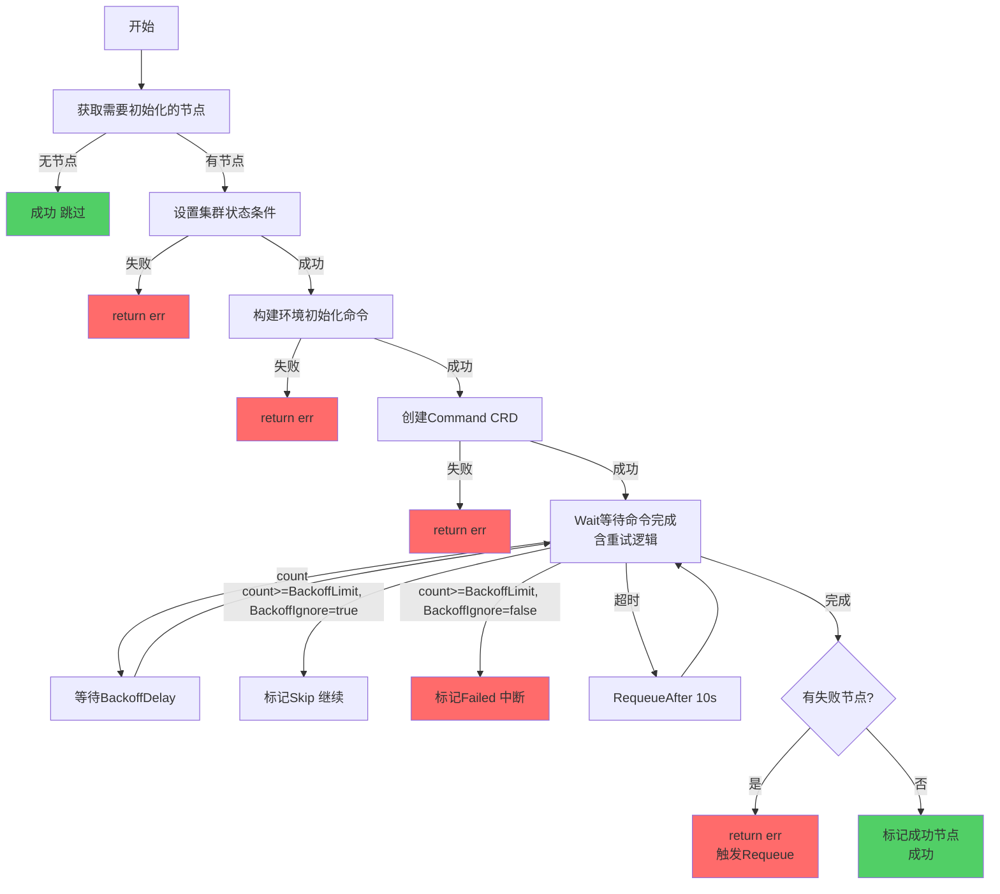

---

### 2.4 Master初始化异常

#### 2.4.1 异常场景清单

| 异常场景 | 严重程度 | 触发条件 | 处理策略 |
|---------|---------|---------|---------|
| **无Master节点** | Error | 节点列表为空 | 返回错误，需人工检查配置 |
| **所有Master Agent未就绪** | Error | 所有节点Agent不Ready | 返回错误，Requeue等待 |
| **Init命令未创建** | Warning | Command CRD不存在 | 等待轮询，每10次输出一次日志 |
| **Init命令执行失败** | **Fatal** | Kubeadm init失败 | **Fail-Fast，需人工介入** |
| **Machine未Bootstrap** | Warning | Machine.Status.Bootstrapped=false | 等待轮询 |
| **Cluster未初始化** | Warning | ControlPlaneInitializedCondition=false | 等待轮询 |
| **API Server不可达** | Error | 健康检查失败 | 等待轮询，超时后标记失败 |
| **Etcd不可用** | Error | Etcd健康检查失败 | 等待轮询，超时后标记失败 |
| **证书复制失败** | Error | 证书文件不存在 | 标记失败，需人工介入 |

#### 2.4.2 处理流程

```go
// 文件: pkg/phaseframe/phases/ensure_master_init.go
func (e *EnsureMasterInit) Execute() (ctrl.Result, error) {
    // 1. 验证Master节点
    nodes, readyCount, err := e.validateMasterNodes(params)
    if err != nil {
        // 异常: 无Master节点或全部未就绪
        // 处理: 返回错误，触发Requeue
        return ctrl.Result{}, err
    }
    
    // 2. 设置条件并刷新状态
    if err := e.setupConditionAndRefresh(params); err != nil {
        // 异常: 状态刷新失败
        // 处理: 返回错误
        return ctrl.Result{}, err
    }
    
    // 3. 轮询等待初始化完成
    err = wait.PollUntilContextTimeout(
        ctx,
        time.Duration(MasterInitPollIntervalSeconds)*time.Second,  // 轮询间隔: 1秒
        timeout,  // 超时时间: 从配置获取
        true,     // 立即返回
        func(ctx context.Context) (bool, error) {
            pollCount++
            
            // 3.1 检查集群是否已初始化
            done, success, err := e.checkClusterInitializedStep(params, pollCount)
            if done {
                return success, err
            }
            
            // 3.2 获取Init命令
            initCommand, done, err := e.getInitCommandStep(params, pollCount)
            if done {
                return true, err
            }
            
            // 3.3 等待命令完成
            done, success, err = e.waitForInitCommandCompleteStep(params, initCommand, pollCount)
            if done {
                return success, err
            }
            
            // 3.4 等待Machine Bootstrap
            done, err = e.waitForMachineBootstrapStep(params, pollCount)
            if done {
                // Bootstrap完成，继续等待Cluster初始化
                return false, nil
            }
            
            // 继续轮询
            return false, nil
        },
    )
    
    // 4. 处理轮询结果
    if err != nil {
        if errors.Is(err, context.DeadlineExceeded) {
            // 异常: 轮询超时
            // 处理: 记录错误，返回错误触发Requeue
            log.Error(constant.MasterNotInitReason, "Master init timeout after %v", timeout)
            return ctrl.Result{}, err
        }
        // 其他错误
        return ctrl.Result{}, err
    }
    
    // 5. 成功
    return ctrl.Result{}, nil
}
```

#### 2.4.3 重试机制

| 重试类型 | 配置 | 说明 |
|---------|------|------|
| **轮询等待** | 间隔1秒 | 持续检查初始化状态 |
| **轮询超时** | 从配置获取（默认15分钟） | 超时后返回错误 |
| **日志输出频率** | 每10次轮询 | 避免日志过多 |
| **命令重试** | BackoffLimit=0 | **不重试，失败需人工介入** |
| **状态刷新** | 每次轮询 | RefreshCtxCluster + RefreshCtxBKECluster |

**关键点**: Master初始化失败采用**Fail-Fast策略**，不自动重试，需要人工介入排查问题。

#### 2.4.4 异常处理流程图

**ASCII 版本**

```
┌─────────────────────────────────────────────────────────────┐
│  EnsureMasterInit 异常处理流程图 (Fail-Fast)                  │
├─────────────────────────────────────────────────────────────┤
│                                                             │
│  开始                                                        │
│   │                                                         │
│   ▼                                                         │
│  ┌─────────────────────┐                                    │
│  │ 验证Master节点       │                                    │
│  └──────────┬──────────┘                                    │
│             │                                               │
│      ┌──────┴──────────────┐                                │
│      ▼                      ▼                               │
│   无/全未就绪             有就绪节点                          │
│      │                      │                               │
│      ▼                      ▼                               │
│  return err           ┌──────────────┐                      │
│  Requeue等待          │设置条件并刷新状态│◄── 失败 ──▶ return  │
│                       └──────────────┘                      │
│                             │                                │
│                             ▼                                │
│                       ┌──────────────────┐                  │
│                       │ Poll轮询等待初始化 │                  │
│                       │ 间隔1s, 超时15min  │                  │
│                       │                  │                  │
│                       │ 3.1 检查集群初始化 │── 完成 ──▶ 成功  │
│                       │ 3.2 获取Init命令   │── 错误 ──▶ 记录  │
│                       │ 3.3 等待命令完成   │── 超时 ──▶ 返回  │
│                       │ 3.4 等待Bootstrap  │── 失败 ──▶ 返回  │
│                       └────────┬─────────┘                  │
│                                │                             │
│                         ┌──────┴──────┐                     │
│                         ▼             ▼                     │
│                      超时/失败       成功                    │
│                         │             │                     │
│                         ▼             ▼                     │
│                   ❌ Fail-Fast     成功                      │
│                   InitializationFailed                       │
│                   需人工介入                                  │
│                   检查:                                       │
│                   • kubeadm日志                              │
│                   • Init命令状态                              │
│                   • 网络/磁盘/资源                            │
│                                                             │
└─────────────────────────────────────────────────────────────┘
```

**Mermaid 版本**

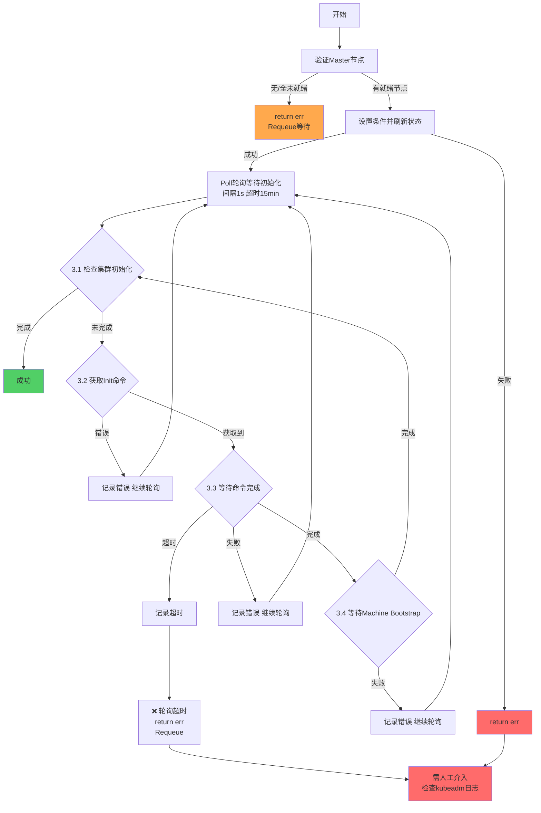

---

### 2.5 Master加入异常

#### 2.5.1 异常场景清单

| 异常场景 | 严重程度 | 触发条件 | 处理策略 |
|---------|---------|---------|---------|
| **Join命令创建失败** | Error | Command CRD创建失败 | 返回错误，Requeue重试 |
| **Join命令执行失败** | Error | Kubeadm join失败 | 标记节点失败，重试3次 |
| **证书复制失败** | Error | 从Init Master复制证书失败 | 标记节点失败，重试3次 |
| **节点NotReady** | Warning | 节点加入但未就绪 | 等待轮询，超时后标记失败 |
| **组件不健康** | Error | kube-apiserver等组件异常 | 等待轮询，超时后标记失败 |
| **Etcd加入失败** | Error | Etcd member add失败 | 标记节点失败，重试3次 |

#### 2.5.2 重试机制

| 重试类型 | 配置 | 说明 |
|---------|------|------|
| **节点级重试** | 最多3次 | 每个Master节点独立重试 |
| **重试间隔** | 10秒 | 每次重试间隔10秒 |
| **命令超时** | 10分钟 | Join命令执行超时 |
| **健康检查超时** | 5分钟 | 节点就绪检查超时 |

#### 2.5.3 异常处理流程图

**ASCII 版本**

```
┌─────────────────────────────────────────────────────────────┐
│  EnsureMasterJoin 异常处理流程图                              │
├─────────────────────────────────────────────────────────────┤
│                                                             │
│  开始                                                        │
│   │                                                         │
│   ▼                                                         │
│  ┌─────────────────────┐                                    │
│  │ 获取待Join的Master   │                                    │
│  │ 节点列表             │                                    │
│  └──────────┬──────────┘                                    │
│             │                                               │
│      ┌──────┴──────┐                                        │
│      ▼             ▼                                        │
│   无节点         有节点                                      │
│      │             │                                        │
│      ▼             ▼                                        │
│  成功(跳过)   ┌──────────────────┐                          │
│               │ 遍历每个Master节点│                          │
│               │                  │                          │
│               │ ┌──────────────┐│                          │
│               │ │创建Join命令   │── 失败 ──▶ return err    │
│               │ └──────────────┘│                          │
│               │ ┌──────────────┐│                          │
│               │ │等待命令完成   │── 失败 ──▶ 重试3次(10s)  │
│               │ │              │              仍失败▶标记   │
│               │ └──────────────┘│                          │
│               │ ┌──────────────┐│                          │
│               │ │证书复制      │── 失败 ──▶ 重试3次         │
│               │ └──────────────┘│                          │
│               │ ┌──────────────┐│                          │
│               │ │节点就绪检查   │── NotReady ──▶ 轮询等待   │
│               │ │              │              超时▶标记     │
│               │ └──────────────┘│                          │
│               │ ┌──────────────┐│                          │
│               │ │组件健康检查   │── 不健康 ──▶ 轮询等待     │
│               │ │              │              超时▶标记     │
│               │ └──────────────┘│                          │
│               │ ┌──────────────┐│                          │
│               │ │Etcd加入检查   │── 失败 ──▶ 重试3次         │
│               │ └──────────────┘│                          │
│               └────────┬─────────┘                          │
│                        │                                     │
│                 ┌──────┴──────┐                              │
│                 ▼             ▼                              │
│              有失败         无失败                            │
│                 │             │                              │
│                 ▼             ▼                              │
│           记录失败列表     成功                               │
│           return err                                         │
│           触发Requeue                                        │
│                                                             │
└─────────────────────────────────────────────────────────────┘
```

**Mermaid 版本**

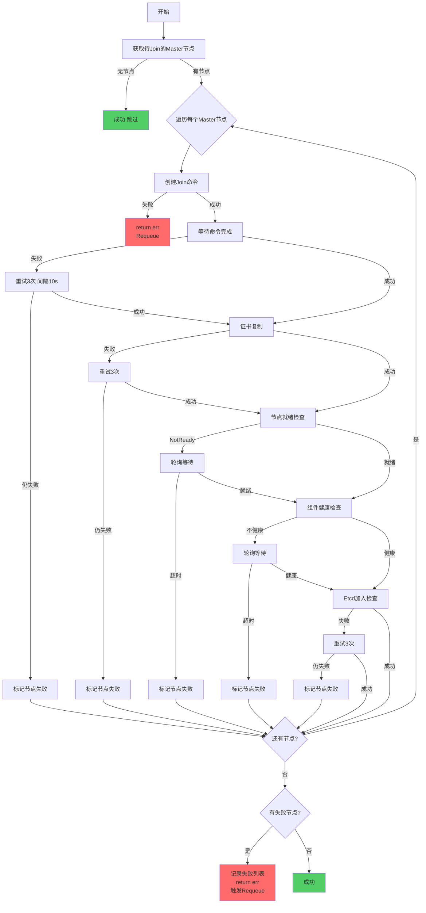

---

### 2.6 Worker加入异常

#### 2.6.1 异常场景清单

| 异常场景 | 严重程度 | 触发条件 | 处理策略 |
|---------|---------|---------|---------|
| **Join命令创建失败** | Error | Command CRD创建失败 | 返回错误，Requeue重试 |
| **Join命令执行失败** | Error | Kubeadm join失败 | 标记节点失败，**继续其他节点** |
| **节点NotReady** | Warning | 节点加入但未就绪 | 等待轮询，超时后标记失败 |
| **部分Worker失败** | Warning | 部分节点加入失败 | 记录失败列表，返回错误触发Requeue |

#### 2.6.2 重试机制

| 重试类型 | 配置 | 说明 |
|---------|------|------|
| **节点级重试** | 最多3次 | 每个Worker节点独立重试 |
| **失败策略** | Best-Effort | 单节点失败不影响其他节点 |
| **重试间隔** | 10秒 | 每次重试间隔10秒 |
| **命令超时** | 10分钟 | Join命令执行超时 |
| **健康检查超时** | 5分钟 | 节点就绪检查超时 |

**关键点**: Worker加入采用**Best-Effort策略**，单节点失败继续处理其他节点，最后统一返回错误。

#### 2.6.3 异常处理流程图

**ASCII 版本**

```
┌─────────────────────────────────────────────────────────────┐
│  EnsureWorkerJoin 异常处理流程图 (Best-Effort)                │
├─────────────────────────────────────────────────────────────┤
│                                                             │
│  开始                                                        │
│   │                                                         │
│   ▼                                                         │
│  ┌─────────────────────┐                                    │
│  │ 获取待Join的Worker   │                                    │
│  │ 节点列表             │                                    │
│  └──────────┬──────────┘                                    │
│             │                                               │
│      ┌──────┴──────┐                                        │
│      ▼             ▼                                        │
│   无节点         有节点                                      │
│      │             │                                        │
│      ▼             ▼                                        │
│  成功(跳过)   ┌──────────────────┐                          │
│               │ 遍历每个Worker节点│                          │
│               │                  │                          │
│               │ ┌──────────────┐│                          │
│               │ │创建Join命令   │── 失败 ──▶ return err    │
│               │ └──────────────┘│                          │
│               │ ┌──────────────┐│                          │
│               │ │等待命令完成   │── 失败 ──▶ 重试3次(10s)  │
│               │ │              │              仍失败▶标记   │
│               │ │              │              继续下一节点   │
│               │ └──────────────┘│                          │
│               │ ┌──────────────┐│                          │
│               │ │节点就绪检查   │── NotReady ──▶ 轮询等待   │
│               │ │              │              超时▶标记     │
│               │ │              │              继续下一节点   │
│               │ └──────────────┘│                          │
│               └────────┬─────────┘                          │
│                        │                                     │
│                 ┌──────┴──────┐                              │
│                 ▼             ▼                              │
│              有失败         无失败                            │
│                 │             │                              │
│                 ▼             ▼                              │
│           记录失败列表     成功                               │
│           return err                                         │
│           触发Requeue                                        │
│                                                             │
│  关键点: Best-Effort策略                                      │
│  • 单节点失败不影响其他节点                                    │
│  • 全部完成后统一返回错误                                     │
│  • 下次协调时重试失败节点                                     │
│                                                             │
└─────────────────────────────────────────────────────────────┘
```

**Mermaid 版本**

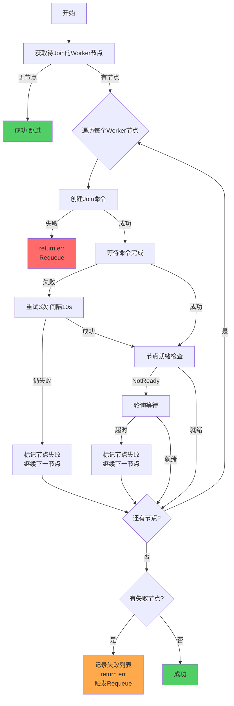

---

### 2.7 EnsureClusterAPIObj 异常

#### 2.7.1 异常场景清单

| 异常场景 | 严重程度 | 触发条件 | 处理策略 |
|---------|---------|---------|---------|
| **CRD对象已存在** | Info | Cluster/ Machine 等对象已创建 | 跳过创建，检查状态 |
| **CRD对象状态就绪** | Info | 对象已存在且状态为Ready | 跳过，继续下一Phase |
| **CRD创建失败** | Error | API Server不可达、权限不足 | 返回错误，Requeue重试 |
| **CRD状态未就绪** | Warning | 对象已创建但条件未满足 | 等待下次协调 |
| **关联资源缺失** | Error | 依赖的Secret/ConfigMap不存在 | Requeue等待依赖就绪 |

#### 2.7.2 处理流程

```go
// 文件: pkg/phaseframe/phases/ensure_cluster_api_obj.go
func (e *EnsureClusterAPIObj) Execute() (ctrl.Result, error) {
    // 1. 检查Cluster API对象是否存在
    cluster, err := e.getCluster()
    if err != nil {
        if apierrors.IsNotFound(err) {
            // 对象不存在，创建
            if err := e.createCluster(); err != nil {
                return ctrl.Result{}, err
            }
            return ctrl.Result{Requeue: true}, nil
        }
        return ctrl.Result{}, err
    }
    
    // 2. 检查对象状态
    if !e.isClusterReady(cluster) {
        // 对象未就绪，等待
        return ctrl.Result{RequeueAfter: quickRequeueInterval}, nil
    }
    
    // 3. 就绪，继续
    return ctrl.Result{}, nil
}
```

#### 2.7.3 重试机制

| 重试类型 | 配置 | 说明 |
|---------|------|------|
| **Controller Requeue** | 自动 | 创建失败时返回错误触发Requeue |
| **状态轮询** | 10秒 | 对象未就绪时 RequeueAfter 10s |
| **最大重试次数** | 无限制 | 持续重试直到成功 |

#### 2.7.4 异常处理流程图

**ASCII 版本**

```
┌─────────────────────────────────────────────────────────────┐
│  EnsureClusterAPIObj 异常处理流程图                           │
├─────────────────────────────────────────────────────────────┤
│                                                             │
│  开始                                                        │
│   │                                                         │
│   ▼                                                         │
│  ┌─────────────────────┐                                    │
│  │ 检查CRD对象是否存在  │                                    │
│  └──────────┬──────────┘                                    │
│             │                                               │
│      ┌──────┴──────┐                                        │
│      ▼             ▼                                        │
│   存在           不存在                                      │
│      │             │                                        │
│      ▼             ▼                                        │
│  ┌──────────┐  ┌──────────────┐                             │
│  │检查状态   │  │创建CRD对象    │◄── 失败 ──▶ return err     │
│  │是否就绪   │  │              │         Requeue重试         │
│  └────┬─────┘  └──────────────┘                             │
│       │                                                      │
│  ┌────┴─────┐                                               │
│  │已就绪?    │                                               │
│  └────┬─────┘                                               │
│       │                                                      │
│  ┌────┴─────┐                                               │
│  │是:成功    │                                               │
│  │否:等待    │                                               │
│  └──────────┘                                               │
│                                                             │
└─────────────────────────────────────────────────────────────┘
```

**Mermaid 版本**

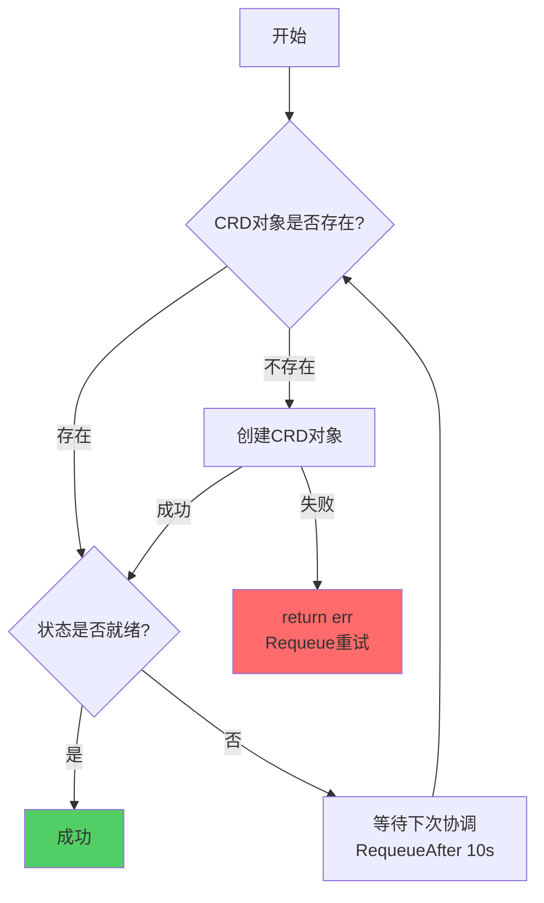

---

### 2.8 EnsureNodesPostProcess 异常

#### 2.8.1 异常场景清单

| 异常场景 | 严重程度 | 触发条件 | 处理策略 |
|---------|---------|---------|---------|
| **节点标签设置失败** | Warning | API Server不可达、节点不存在 | 记录日志，继续下一节点 |
| **节点污点设置失败** | Warning | 权限不足、节点NotReady | 记录日志，继续下一节点 |
| **节点注解设置失败** | Warning | 并发冲突 | 记录日志，继续下一节点 |
| **部分节点处理失败** | Warning | 部分节点操作异常 | 记录失败列表，不影响安装完成 |
| **所有节点处理失败** | Error | API Server完全不可达 | 返回错误，Requeue重试 |

#### 2.8.2 处理流程

```go
// 文件: pkg/phaseframe/phases/ensure_nodes_postprocess.go
func (e *EnsureNodesPostProcess) Execute() (ctrl.Result, error) {
    nodes := e.getNodesToProcess()
    if len(nodes) == 0 {
        return ctrl.Result{}, nil
    }
    
    var failedNodes []string
    for _, node := range nodes {
        // 设置标签
        if err := e.setNodeLabels(node); err != nil {
            log.Warn("failed to set labels for node %s: %v", node.Name, err)
            failedNodes = append(failedNodes, node.Name)
            // 不返回错误，继续处理
        }
        
        // 设置污点
        if err := e.setNodeTaints(node); err != nil {
            log.Warn("failed to set taints for node %s: %v", node.Name, err)
            failedNodes = append(failedNodes, node.Name)
        }
    }
    
    // 全部节点失败时才返回错误
    if len(failedNodes) == len(nodes) {
        return ctrl.Result{}, errors.Errorf("all nodes failed: %v", failedNodes)
    }
    
    // 部分失败不影响安装完成
    if len(failedNodes) > 0 {
        log.Warn("some nodes post-process failed: %v", failedNodes)
    }
    
    return ctrl.Result{}, nil
}
```

#### 2.8.3 重试机制

| 重试类型 | 配置 | 说明 |
|---------|------|------|
| **忽略错误** | 默认 | 单节点失败不影响整体流程 |
| **全部失败重试** | Requeue | 所有节点失败时返回错误触发Requeue |
| **下次协调重试** | 自动 | 失败节点在下次协调时重新处理 |

#### 2.8.4 异常处理流程图

**ASCII 版本**

```
┌─────────────────────────────────────────────────────────────┐
│  EnsureNodesPostProcess 异常处理流程图                        │
├─────────────────────────────────────────────────────────────┤
│                                                             │
│  开始                                                        │
│   │                                                         │
│   ▼                                                         │
│  ┌─────────────────────┐                                    │
│  │ 获取需要后置处理的   │                                    │
│  │ 节点列表             │                                    │
│  └──────────┬──────────┘                                    │
│             │                                               │
│      ┌──────┴──────┐                                        │
│      ▼             ▼                                        │
│   无节点         有节点                                      │
│      │             │                                        │
│      ▼             ▼                                        │
│  成功(跳过)   ┌──────────────────┐                          │
│               │ 遍历每个节点      │                          │
│               │                  │                          │
│               │ ┌──────────────┐│                          │
│               │ │设置节点标签   │── 失败 ──▶ 记录日志       │
│               │ │              │              继续下一节点   │
│               │ └──────────────┘│                          │
│               │ ┌──────────────┐│                          │
│               │ │设置节点污点   │── 失败 ──▶ 记录日志       │
│               │ │              │              继续下一节点   │
│               │ └──────────────┘│                          │
│               │ ┌──────────────┐│                          │
│               │ │其他后置操作   │── 失败 ──▶ 记录日志       │
│               │ │              │              继续下一节点   │
│               │ └──────────────┘│                          │
│               └────────┬─────────┘                          │
│                        │                                     │
│                        ▼                                     │
│                 ┌──────────────┐                             │
│                 │全部节点失败?  │                             │
│                 └──────┬───────┘                             │
│                        │                                     │
│                 ┌──────┴──────┐                              │
│                 ▼             ▼                              │
│              是             否                                │
│                 │             │                              │
│                 ▼             ▼                              │
│           return err     安装完成                            │
│           Requeue重试    ClusterStatus = Ready               │
│                                                             │
│  关键点: 忽略错误策略                                          │
│  • 后置操作失败不影响安装完成                                  │
│  • 记录日志供后续排查                                         │
│  • 下次协调时可重试                                           │
│                                                             │
└─────────────────────────────────────────────────────────────┘
```

**Mermaid 版本**

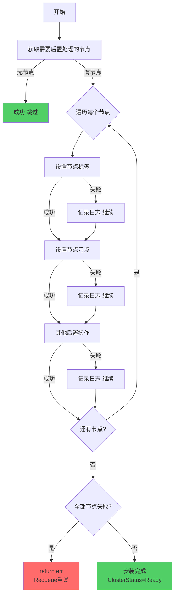

---

### 2.7 EnsureLoadBalance 异常

#### 2.7.1 异常场景清单

| 异常场景 | 严重程度 | 触发条件 | 处理策略 |
|---------|---------|---------|---------|
| **负载均衡配置已存在** | Info | LB资源已创建 | 跳过创建，检查状态 |
| **负载均衡配置失败** | Error | API Server不可达、权限不足 | 返回错误，Requeue重试 |
| **负载均衡状态未就绪** | Warning | LB资源已创建但未Ready | 等待下次协调 |
| **关联资源缺失** | Error | 依赖的Secret/ConfigMap不存在 | Requeue等待依赖就绪 |
| **健康检查失败** | Error | 后端节点不可达 | 等待轮询，超时后返回错误 |

#### 2.7.2 处理流程

```go
// 文件: pkg/phaseframe/phases/ensure_load_balance.go
func (e *EnsureLoadBalance) Execute() (ctrl.Result, error) {
    // 1. 检查负载均衡资源是否存在
    lb, err := e.getLoadBalancer()
    if err != nil {
        if apierrors.IsNotFound(err) {
            // 资源不存在，创建
            if err := e.createLoadBalancer(); err != nil {
                return ctrl.Result{}, err
            }
            return ctrl.Result{Requeue: true}, nil
        }
        return ctrl.Result{}, err
    }
    
    // 2. 检查负载均衡状态
    if !e.isLoadBalancerReady(lb) {
        // 未就绪，等待
        return ctrl.Result{RequeueAfter: quickRequeueInterval}, nil
    }
    
    // 3. 健康检查
    if err := e.checkBackendHealth(); err != nil {
        log.Warn("LoadBalancer backend unhealthy: %v", err)
        return ctrl.Result{RequeueAfter: quickRequeueInterval}, nil
    }
    
    // 4. 就绪，继续
    return ctrl.Result{}, nil
}
```

#### 2.7.3 重试机制

| 重试类型 | 配置 | 说明 |
|---------|------|------|
| **Controller Requeue** | 自动 | 创建失败时返回错误触发Requeue |
| **状态轮询** | 10秒 | 资源未就绪时 RequeueAfter 10s |
| **最大重试次数** | 无限制 | 持续重试直到成功 |

#### 2.7.4 异常处理流程图

**ASCII 版本**

```
┌─────────────────────────────────────────────────────────────┐
│  EnsureLoadBalance 异常处理流程图                             │
├─────────────────────────────────────────────────────────────┤
│                                                             │
│  开始                                                        │
│   │                                                         │
│   ▼                                                         │
│  ┌─────────────────────┐                                    │
│  │ 检查LB资源是否存在   │                                    │
│  └──────────┬──────────┘                                    │
│             │                                               │
│      ┌──────┴──────┐                                        │
│      ▼             ▼                                        │
│   存在           不存在                                      │
│      │             │                                        │
│      ▼             ▼                                        │
│  ┌──────────┐  ┌──────────────┐                             │
│  │检查状态   │  │创建LB资源     │◄── 失败 ──▶ return err     │
│  │是否就绪   │  │              │         Requeue重试         │
│  └────┬─────┘  └──────────────┘                             │
│       │                                                      │
│  ┌────┴─────┐                                               │
│  │已就绪?    │                                               │
│  └────┬─────┘                                               │
│       │                                                      │
│  ┌────┴─────┐                                               │
│  │是:健康检查│                                               │
│  │否:等待    │                                               │
│  └────┬─────┘                                               │
│       │                                                      │
│       ▼                                                      │
│  ┌──────────────┐                                            │
│  │后端健康检查   │◄── 不健康 ──▶ RequeueAfter 10s            │
│  └──────────────┘                                            │
│       │                                                       │
│       ▼                                                       │
│  成功 (return nil)                                            │
│                                                             │
└─────────────────────────────────────────────────────────────┘
```

**Mermaid 版本**

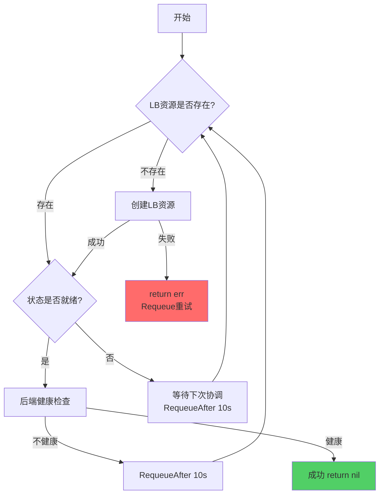

---

### 2.8 EnsureAddonDeploy 异常

#### 2.8.1 异常场景清单

| 异常场景 | 严重程度 | 触发条件 | 处理策略 |
|---------|---------|---------|---------|
| **Addon已部署** | Info | Addon资源已存在且版本匹配 | 跳过部署，检查状态 |
| **Addon部署失败** | Error | 镜像拉取失败、权限不足 | 返回错误，Requeue重试 |
| **Addon状态未就绪** | Warning | Pod未就绪 | 等待轮询，超时后返回错误 |
| **Addon版本不匹配** | Warning | 已部署版本与目标版本不一致 | 重新部署 |
| **依赖资源缺失** | Error | 依赖的ConfigMap/Secret不存在 | Requeue等待依赖就绪 |

#### 2.8.2 处理流程

```go
// 文件: pkg/phaseframe/phases/ensure_addon_deploy.go
func (e *EnsureAddonDeploy) Execute() (ctrl.Result, error) {
    // 1. 获取需要部署的Addon列表
    addons := e.getNeedDeployAddons()
    if len(addons) == 0 {
        return ctrl.Result{}, nil
    }
    
    // 2. 遍历部署每个Addon
    for _, addon := range addons {
        // 2.1 检查Addon是否存在
        existing, err := e.getAddon(addon.Name)
        if err != nil {
            if apierrors.IsNotFound(err) {
                // 创建Addon
                if err := e.createAddon(addon); err != nil {
                    return ctrl.Result{}, err
                }
                return ctrl.Result{Requeue: true}, nil
            }
            return ctrl.Result{}, err
        }
        
        // 2.2 检查版本是否匹配
        if !e.isVersionMatch(existing, addon) {
            // 版本不匹配，更新
            if err := e.updateAddon(addon); err != nil {
                return ctrl.Result{}, err
            }
            return ctrl.Result{Requeue: true}, nil
        }
        
        // 2.3 检查Addon状态
        if !e.isAddonReady(existing) {
            return ctrl.Result{RequeueAfter: quickRequeueInterval}, nil
        }
    }
    
    return ctrl.Result{}, nil
}
```

#### 2.8.3 重试机制

| 重试类型 | 配置 | 说明 |
|---------|------|------|
| **Controller Requeue** | 自动 | 部署失败时返回错误触发Requeue |
| **状态轮询** | 10秒 | Addon未就绪时 RequeueAfter 10s |
| **最大重试次数** | 无限制 | 持续重试直到成功 |
| **镜像拉取重试** | 最多3次 | 镜像拉取失败重试 |

#### 2.8.4 异常处理流程图

**ASCII 版本**

```
┌─────────────────────────────────────────────────────────────┐
│  EnsureAddonDeploy 异常处理流程图                             │
├─────────────────────────────────────────────────────────────┤
│                                                             │
│  开始                                                        │
│   │                                                         │
│   ▼                                                         │
│  ┌─────────────────────┐                                    │
│  │ 获取需要部署的Addon  │                                    │
│  │ 列表                │                                    │
│  └──────────┬──────────┘                                    │
│             │                                               │
│      ┌──────┴──────┐                                        │
│      ▼             ▼                                        │
│   无Addon       有Addon                                      │
│      │             │                                        │
│      ▼             ▼                                        │
│  成功(跳过)   ┌──────────────────┐                          │
│               │ 遍历每个Addon     │                          │
│               │                  │                          │
│               │ ┌──────────────┐│                          │
│               │ │检查Addon存在  │── 不存在 ──▶ 创建Addon    │
│               │ │              │              失败▶ return  │
│               │ └──────────────┘│                          │
│               │ ┌──────────────┐│                          │
│               │ │检查版本匹配   │── 不匹配 ──▶ 更新Addon    │
│               │ │              │              失败▶ return  │
│               │ └──────────────┘│                          │
│               │ ┌──────────────┐│                          │
│               │ │检查Addon就绪  │── 未就绪 ──▶ RequeueAfter │
│               │ │              │              10s等待       │
│               │ └──────────────┘│                          │
│               └────────┬─────────┘                          │
│                        │                                     │
│                        ▼                                     │
│                   部署完成                                    │
│                                                             │
└─────────────────────────────────────────────────────────────┘
```

**Mermaid 版本**

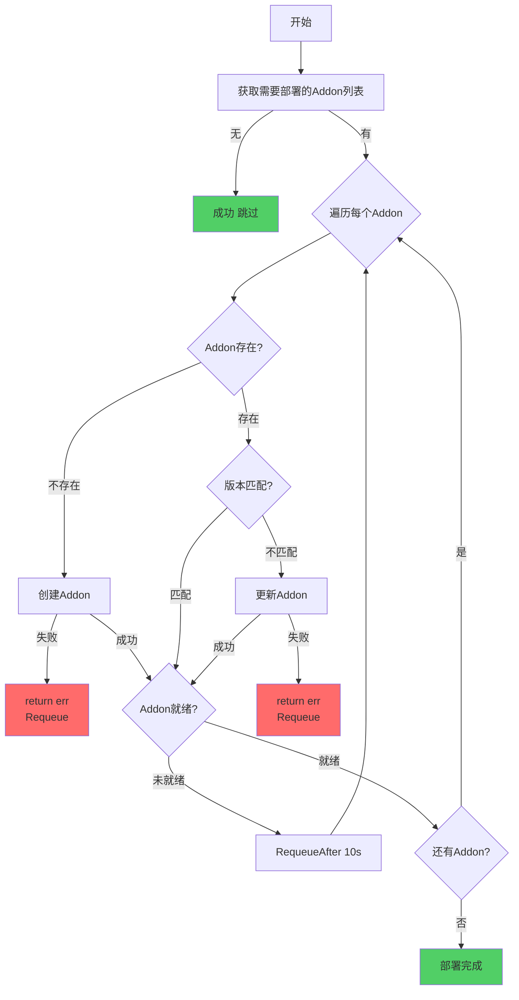

---

### 2.9 EnsureAgentSwitch 异常

#### 2.9.1 异常场景清单

| 异常场景 | 严重程度 | 触发条件 | 处理策略 |
|---------|---------|---------|---------|
| **Agent已切换** | Info | Agent监听模式已正确配置 | 跳过切换 |
| **Agent切换失败** | Error | API Server不可达、配置更新失败 | 返回错误，Requeue重试 |
| **Agent状态异常** | Warning | Agent切换后未就绪 | 等待轮询，超时后返回错误 |
| **配置冲突** | Error | 新旧监听模式冲突 | 返回错误，需人工介入 |
| **网络不可达** | Error | Agent无法连接API Server | 等待轮询，超时后返回错误 |

#### 2.9.2 处理流程

```go
// 文件: pkg/phaseframe/phases/ensure_agent_switch.go
func (e *EnsureAgentSwitch) Execute() (ctrl.Result, error) {
    // 1. 检查Agent是否已正确切换
    if e.isAgentSwitched() {
        return ctrl.Result{}, nil
    }
    
    // 2. 执行Agent切换
    if err := e.switchAgent(); err != nil {
        // 切换失败
        log.Error("Agent switch failed: %v", err)
        return ctrl.Result{}, err
    }
    
    // 3. 等待Agent就绪
    if err := e.waitForAgentReady(); err != nil {
        log.Warn("Agent not ready after switch: %v", err)
        return ctrl.Result{RequeueAfter: quickRequeueInterval}, nil
    }
    
    return ctrl.Result{}, nil
}
```

#### 2.9.3 重试机制

| 重试类型 | 配置 | 说明 |
|---------|------|------|
| **Controller Requeue** | 自动 | 切换失败时返回错误触发Requeue |
| **状态轮询** | 10秒 | Agent未就绪时 RequeueAfter 10s |
| **最大重试次数** | 无限制 | 持续重试直到成功 |

#### 2.9.4 异常处理流程图

**ASCII 版本**

```
┌─────────────────────────────────────────────────────────────┐
│  EnsureAgentSwitch 异常处理流程图                             │
├─────────────────────────────────────────────────────────────┤
│                                                             │
│  开始                                                        │
│   │                                                         │
│   ▼                                                         │
│  ┌─────────────────────┐                                    │
│  │ 检查Agent是否已切换  │                                    │
│  └──────────┬──────────┘                                    │
│             │                                               │
│      ┌──────┴──────┐                                        │
│      ▼             ▼                                        │
│   已切换         未切换                                      │
│      │             │                                        │
│      ▼             ▼                                        │
│  成功(跳过)   ┌──────────────┐                              │
│               │ 执行Agent切换 │◄── 失败 ──▶ return err      │
│               │              │              Requeue重试     │
│               └──────────────┘                              │
│                     │                                        │
│                     ▼                                        │
│               ┌──────────────┐                              │
│               │ 等待Agent就绪 │◄── 未就绪 ──▶ RequeueAfter   │
│               │              │              10s等待          │
│               └──────────────┘                              │
│                     │                                        │
│                     ▼                                        │
│                   切换完成                                    │
│                                                             │
└─────────────────────────────────────────────────────────────┘
```

**Mermaid 版本**

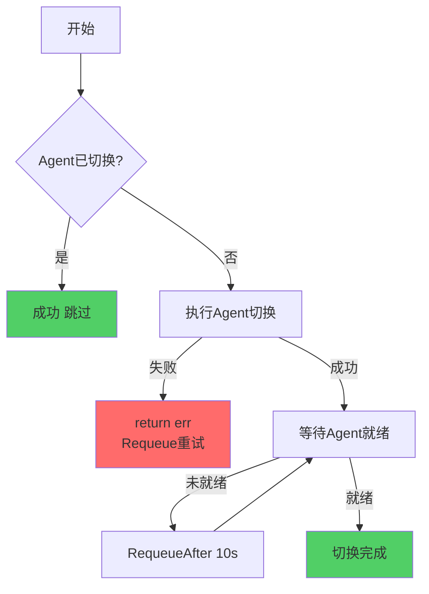

---

## 三、重试机制详细说明

### 3.1 重试配置参数

```go
// 全局重试配置常量
const (
    // 默认命令重试次数
    DefaultBackoffLimit = 3
    
    // 默认命令等待超时
    DefaultWaitTimeout = 5 * time.Minute
    
    // 默认命令执行超时
    DefaultActiveDeadlineSecond = 600  // 10分钟
    
    // 轮询间隔
    MasterInitPollIntervalSeconds = 1  // Master初始化轮询间隔
    logInterval = 10                   // 日志输出间隔（每10次轮询输出一次）
    
    // Requeue间隔
    quickRequeueInterval  = 10 * time.Second   // 快速重试
    periodicCheckInterval = 5 * time.Minute    // 定期检查
)
```

### 3.2 重试决策矩阵

```
┌─────────────────────────────────────────────────────────────┐
│  安装流程重试决策树                                          │
└─────────────────────────────────────────────────────────────┘
         │
         ├── 1. CommonPhases (前置判断)
         │   ├── Finalizer添加失败 → ✅ 自动重试
         │   ├── 暂停状态 → ⏸️ 跳过后续Phase
         │   ├── 纳管模式 → ⏸️ 跳过后续Phase
         │   ├── 删除/重置模式 → ⏸️ 跳过后续Phase
         │   └── DryRun模式 → ⏸️ 仅模拟不执行
         │
         ├── 2. Agent推送失败
         │   ├── SSH连接失败 → ✅ 单节点重试3次，继续其他节点
         │   ├── 文件传输失败 → ✅ 重试3次，仍失败→标记节点
         │   └── 全部节点失败 → ✅ Requeue等待
         │
         ├── 3. 节点环境初始化失败
         │   ├── 命令创建失败 → ✅ Requeue重试
         │   ├── 命令执行失败 → ✅ BackoffLimit重试
         │   ├── 命令超时 → ⏸️ RequeueAfter等待
         │   └── 部分节点失败 → ✅ 标记失败，返回错误触发Requeue
         │
         ├── 4. ClusterAPIObj创建失败
         │   ├── CRD创建失败 → ✅ 自动重试
         │   └── 状态未就绪 → ⏸️ RequeueAfter等待
         │
         ├── 5. 证书生成失败
         │   ├── 证书生成失败 → ✅ 自动重试
         │   ├── 证书存储失败 → ✅ 自动重试
         │   └── 证书校验失败 → ✅ 重新生成
         │
         ├── 6. 负载均衡配置失败
         │   ├── LB创建失败 → ✅ 自动重试
         │   ├── LB状态未就绪 → ⏸️ RequeueAfter等待
         │   └── 后端不健康 → ⏸️ RequeueAfter等待
         │
         ├── 7. Master初始化失败
         │   ├── 无Master节点 → ✅ Requeue等待
         │   ├── Init命令失败 → ❌ Fail-Fast，需人工介入
         │   └── 轮询超时 → ⏸️ Requeue等待，检查kubeadm日志
         │
         ├── 8. Master加入失败
         │   ├── Join命令失败 → ✅ 重试3次
         │   ├── 证书复制失败 → ✅ 重试3次
         │   └── 部分节点失败 → ✅ 记录失败列表，返回错误
         │
         ├── 9. Worker加入失败
         │   ├── Join命令失败 → ✅ 重试3次，继续其他节点
         │   ├── 节点NotReady → ⏸️ 轮询等待，超时→标记
         │   └── 部分节点失败 → ⚠️ Best-Effort，继续其他节点
         │
         ├── 10. Addon部署失败
         │   ├── Addon创建失败 → ✅ Requeue重试
         │   ├── Addon更新失败 → ✅ Requeue重试
         │   └── Addon未就绪 → ⏸️ RequeueAfter等待
         │
         ├── 11. 节点后置处理失败
         │   ├── 标签设置失败 → ⚠️ 记录日志，继续
         │   └── 污点设置失败 → ⚠️ 记录日志，继续
         │
         └── 12. Agent切换失败
             ├── 切换失败 → ✅ Requeue重试
             └── Agent未就绪 → ⏸️ RequeueAfter等待
```

### 3.3 重试时间计算

**Controller Runtime指数退避**:
```
第1次重试: 1秒后
第2次重试: 2秒后
第3次重试: 4秒后
第4次重试: 8秒后
...
最大间隔: 10分钟
```

**自定义重试间隔**:
```go
// 固定间隔重试
return ctrl.Result{RequeueAfter: 10 * time.Second}, nil

// 根据错误类型动态调整
if isTemporaryError(err) {
    return ctrl.Result{RequeueAfter: quickRequeueInterval}, nil  // 10秒
} else {
    return ctrl.Result{RequeueAfter: periodicCheckInterval}, nil  // 5分钟
}
```

## 四、异常处理最佳实践

### 4.1 标准异常处理模板

```go
func (e *Phase) Execute() (ctrl.Result, error) {
    ctx, c, bkeCluster, _, log := e.Ctx.Untie()
    
    // ========== Step 1: 前置检查 ==========
    if !e.preCheck() {
        log.Info("precondition not met, waiting...")
        return ctrl.Result{RequeueAfter: quickRequeueInterval}, nil
    }
    
    // ========== Step 2: 获取资源 ==========
    resource, err := e.getResource()
    if err != nil {
        if apierrors.IsNotFound(err) {
            // 资源不存在，正常结束
            return ctrl.Result{}, nil
        }
        // 其他错误，记录并返回
        log.Error("failed to get resource: %v", err)
        return ctrl.Result{}, err
    }
    
    // ========== Step 3: 执行操作 ==========
    // 3.1 标记开始状态
    e.markStart(resource)
    if err := mergecluster.SyncStatusUntilComplete(c, bkeCluster); err != nil {
        return ctrl.Result{}, err
    }
    
    // 3.2 执行核心逻辑
    err = e.doOperation(resource)
    
    // 3.3 处理结果
    if err != nil {
        // 标记失败状态
        e.markFailed(resource, err)
        if syncErr := mergecluster.SyncStatusUntilComplete(c, bkeCluster); syncErr != nil {
            return ctrl.Result{}, syncErr
        }
        
        // 根据策略决定是否继续
        if e.shouldFailFast() {
            // Fail-Fast: 立即返回错误
            return ctrl.Result{}, err
        }
        // Best-Effort: 记录失败，继续下一个
        continue
    }
    
    // 3.4 标记成功状态
    e.markSuccess(resource)
    if err := mergecluster.SyncStatusUntilComplete(c, bkeCluster); err != nil {
        return ctrl.Result{}, err
    }
    
    // ========== Step 4: 后置处理 ==========
    if err := e.postProcess(); err != nil {
        log.Warn("post process failed: %v", err)
        // 后置处理失败不影响主流程
    }
    
    return ctrl.Result{}, nil
}
```

### 4.2 命令执行重试模板

```go
func (e *Phase) executeCommandWithRetry(node Node) error {
    // 1. 创建命令
    cmd := &command.BaseCommand{
        Ctx:             ctx,
        NodeName:        node.IP,
        Commands:        commands,
        BackoffLimit:    3,              // 最多重试3次
        WaitTimeout:     10 * time.Minute, // 等待超时10分钟
        BackoffDelay:    5,              // 重试间隔5秒
    }
    
    // 2. 创建Command CRD
    if err := cmd.Create(); err != nil {
        return errors.Wrap(err, "failed to create command")
    }
    
    // 3. 等待命令完成（含重试逻辑）
    complete, successNodes, failedNodes := cmd.Wait()
    
    // 4. 处理结果
    if !complete {
        // 超时
        return errors.Errorf("command timeout after %v", cmd.WaitTimeout)
    }
    
    if len(failedNodes) > 0 {
        // 失败（已达到最大重试次数）
        return errors.Errorf("command failed after %d retries", cmd.BackoffLimit)
    }
    
    // 成功
    return nil
}
```

### 4.3 轮询等待模板

```go
func (e *Phase) waitForCondition() error {
    timeout := time.Duration(bootTimeout) * time.Minute
    pollInterval := 2 * time.Second
    logInterval := 10  // 每10次轮询输出一次日志
    
    err := wait.PollUntilContextTimeout(
        ctx,
        pollInterval,
        timeout,
        true,  // 立即返回
        func(ctx context.Context) (bool, error) {
            pollCount++
            
            // 检查条件
            satisfied, err := e.checkCondition()
            if err != nil {
                // 错误时输出日志（控制频率）
                if pollCount % logInterval == 0 {
                    log.Warn("check condition failed: %v", err)
                }
                return false, nil  // 继续轮询
            }
            
            if satisfied {
                // 条件满足，退出轮询
                return true, nil
            }
            
            // 条件不满足，继续轮询
            if pollCount % logInterval == 0 {
                log.Info("condition not satisfied, waiting...")
            }
            return false, nil
        },
    )
    
    if err != nil {
        if errors.Is(err, context.DeadlineExceeded) {
            return errors.Errorf("timeout after %v", timeout)
        }
        return err
    }
    
    return nil
}
```

## 五、异常场景快速参考表

### 5.1 按Phase分类

| Phase | 关键异常 | 处理策略 | 重试次数 | 人工介入 |
|-------|---------|---------|---------|---------|
| **EnsureFinalizer** | Finalizer添加失败 | 自动重试 | 无限制 | 否 |
| **EnsurePaused** | 暂停状态检查 | 跳过后续Phase | - | 否 |
| **EnsureClusterManage** | 纳管判断 | 跳过后续Phase | - | 否 |
| **EnsureDeleteOrReset** | 删除/重置判断 | 跳过后续Phase | - | 否 |
| **EnsureDryRun** | DryRun模式 | 跳过实际操作 | - | 否 |
| **EnsureBKEAgent** | SSH连接失败 | 单节点重试 | 3次 | 否 |
| **EnsureNodesEnv** | 命令执行失败 | 命令级重试 | BackoffLimit | 视情况 |
| **EnsureClusterAPIObj** | CRD创建失败 | 自动重试 | 无限制 | 否 |
| **EnsureCerts** | 证书生成失败 | 自动重试 | 无限制 | 否 |
| **EnsureLoadBalance** | LB配置失败 | 自动重试 | 无限制 | 否 |
| **EnsureMasterInit** | Init失败 | **Fail-Fast** | **0次** | **是** |
| **EnsureMasterJoin** | Join失败 | 单节点重试 | 3次 | 视情况 |
| **EnsureWorkerJoin** | Join失败 | Best-Effort | 3次 | 否 |
| **EnsureAddonDeploy** | Addon部署失败 | 自动重试 | 无限制 | 否 |
| **EnsureNodesPostProcess** | 标签设置失败 | 忽略继续 | 0次 | 否 |
| **EnsureAgentSwitch** | Agent切换失败 | 自动重试 | 无限制 | 否 |

### 5.2 按严重程度分类

| 严重程度 | 处理策略 | 示例场景 |
|---------|---------|---------|
| **Fatal** | Fail-Fast，需人工介入 | Master初始化失败、Etcd不可用 |
| **Error** | Requeue重试或标记失败 | 命令执行失败、SSH连接失败 |
| **Warning** | 记录日志，继续执行 | Agent未就绪、部分节点跳过 |
| **Info** | 正常流程记录 | 节点已初始化、跳过处理 |

### 5.3 按重试策略分类

| 重试策略 | 适用场景 | 配置示例 |
|---------|---------|---------|
| **无限制重试** | 临时性错误、资源暂时不可用 | Controller自动Requeue |
| **有限次重试** | 命令执行、节点操作 | BackoffLimit=3 |
| **不重试** | Master初始化、致命错误 | BackoffLimit=0 |
| **跳过失败** | 非关键操作、可降级 | BackoffIgnore=true |

## 六、故障排查指南

### 6.1 常见故障排查流程

```
安装失败
│
├── 1. 检查Phase状态
│   └── kubectl get bkecluster <name> -o yaml | grep phase
│
├── 2. 检查节点状态
│   └── kubectl get bkenodes -l cluster=<name>
│
├── 3. 检查命令执行状态
│   └── kubectl get commands -l cluster=<name>
│       ├── Phase=Failed → 查看Conditions
│       └── Phase=Running → 检查超时时间
│
├── 4. 检查日志
│   ├── Controller日志: kubectl logs <controller-pod>
│   └── Agent日志: SSH到节点查看 /var/log/bkeagent.log
│
└── 5. 根据Phase定位问题
    ├── EnsureFinalizer失败 → 检查Finalizer、权限
    ├── EnsureBKEAgent失败 → 检查SSH、网络、磁盘
    ├── EnsureNodesEnv失败 → 检查命令日志、依赖
    ├── EnsureClusterAPIObj失败 → 检查CRD对象状态、API Server
    ├── EnsureCerts失败 → 检查Secret、权限
    ├── EnsureLoadBalance失败 → 检查LB资源、后端节点
    ├── EnsureMasterInit失败 → **需人工介入**，检查kubeadm日志
    ├── EnsureMasterJoin失败 → 检查证书、网络、kubeadm
    ├── EnsureWorkerJoin失败 → 检查kubeadm、节点资源
    ├── EnsureAddonDeploy失败 → 检查Addon Pod状态、镜像
    ├── EnsureNodesPostProcess失败 → 检查日志，通常不影响安装
    └── EnsureAgentSwitch失败 → 检查Agent状态、网络连接
```

### 6.2 关键日志位置

| 组件 | 日志位置 | 查看命令 |
|------|---------|---------|
| **Controller** | Controller Pod标准输出 | `kubectl logs -n bke-system <controller-pod>` |
| **Agent** | /var/log/bkeagent.log | `ssh node "tail -f /var/log/bkeagent.log"` |
| **Kubeadm** | /var/log/kubeadm.log | `ssh node "cat /var/log/kubeadm.log"` |
| **Kubelet** | journalctl | `ssh node "journalctl -u kubelet -f"` |
| **Docker/Containerd** | journalctl | `ssh node "journalctl -u docker -f"` |

### 6.3 常见错误代码

| 错误代码 | 说明 | 解决方案 |
|---------|------|---------|
| **MasterNotInitReason** | Master未初始化 | 检查Init命令状态、kubeadm日志 |
| **BKEAgentNotReadyReason** | Agent未就绪 | 检查Agent服务状态、网络连通性 |
| **NodesEnvNotReadyReason** | 节点环境未就绪 | 检查Env命令状态、依赖安装日志 |
| **CommandFailed** | 命令执行失败 | 查看Command Conditions、Agent日志 |
| **TimeoutError** | 操作超时 | 检查网络、资源使用率、增大超时配置 |
| **LoadBalanceNotReadyReason** | 负载均衡未就绪 | 检查LB资源状态、后端节点健康 |
| **AddonDeployFailedReason** | Addon部署失败 | 检查Addon Pod状态、镜像版本 |
| **AgentSwitchFailedReason** | Agent切换失败 | 检查Agent配置、网络连接 |

## 七、配置调优建议

### 7.1 超时配置建议

| 场景 | 推荐配置 | 说明 |
|------|---------|------|
| **小规模集群（<10节点）** | ActiveDeadlineSecond=600 | 默认10分钟 |
| **中等规模集群（10-50节点）** | ActiveDeadlineSecond=900 | 15分钟 |
| **大规模集群（>50节点）** | ActiveDeadlineSecond=1200 | 20分钟 |
| **网络较差环境** | ActiveDeadlineSecond=1800 | 30分钟 |
| **离线环境** | ActiveDeadlineSecond=2400 | 40分钟（镜像拉取慢） |

### 7.2 重试配置建议

| 场景 | BackoffLimit | BackoffDelay | 说明 |
|------|-------------|-------------|------|
| **生产环境** | 3 | 5 | 平衡可靠性和速度 |
| **测试环境** | 1 | 2 | 快速失败，便于调试 |
| **网络不稳定** | 5 | 10 | 增加重试次数和间隔 |
| **关键操作** | 0 | 0 | 不重试，Fail-Fast |

### 7.3 轮询配置建议

| 场景 | PollInterval | Timeout | LogInterval | 说明 |
|------|-------------|---------|------------|------|
| **默认** | 1s | 15min | 10 | 平衡响应速度和日志量 |
| **快速响应** | 500ms | 10min | 20 | 更快检测状态变化 |
| **减少负载** | 2s | 20min | 20 | 降低API Server压力 |

## 八、附录

### 8.1 Command CRD完整示例

```yaml
apiVersion: bkeagent.bocloud.com/v1beta1
kind: Command
metadata:
  name: node-env-init
  namespace: default
spec:
  nodeName: "192.168.1.10"
  backoffLimit: 3                    # 最大重试3次
  activeDeadlineSecond: 600          # 执行超时10分钟
  ttlSecondsAfterFinished: 3600      # 完成后保留1小时
  commands:
    - id: "install-docker"
      type: "Shell"
      command: ["sh", "-c", "yum install -y docker"]
      backoffIgnore: false           # 失败不跳过
      backoffDelay: 5                # 重试间隔5秒
      
    - id: "start-docker"
      type: "Shell"
      command: ["systemctl", "start", "docker"]
      backoffIgnore: false
      backoffDelay: 3
      
    - id: "install-kubelet"
      type: "Shell"
      command: ["sh", "-c", "yum install -y kubelet"]
      backoffIgnore: false
      backoffDelay: 5
      
    - id: "config-sysctl"
      type: "BuiltIn"
      command: ["sysctl-config"]
      backoffIgnore: true            # 失败可跳过（非关键）
      backoffDelay: 0
```

### 8.2 状态码定义

```go
const (
    // 节点状态标志位
    NodeUnknownFlag        NodeStateCode = 0
    NodeInitFlag           NodeStateCode = 1 << iota  // 1
    NodeBootStrapFlag      NodeStateCode = 1 << iota  // 2
    NodeReadyFlag          NodeStateCode = 1 << iota  // 4
    NodeNotReadyFlag       NodeStateCode = 1 << iota  // 8
    NodeUpgradingFlag      NodeStateCode = 1 << iota  // 16
    NodeUpgradeFailedFlag  NodeStateCode = 1 << iota  // 32
    NodeDeletingFlag       NodeStateCode = 1 << iota  // 64
    NodeDeleteFailedFlag   NodeStateCode = 1 << iota  // 128
    NodeFailedFlag         NodeStateCode = 1 << iota  // 256
    NodeEnvFlag            NodeStateCode = 1 << iota  // 512
    NodeAgentPushedFlag    NodeStateCode = 1 << iota  // 1024
    NodeAgentReadyFlag     NodeStateCode = 1 << iota  // 2048
)
```

---

**文档维护者**: cluster-api-provider-bke 开发团队  
**反馈渠道**: 项目Issue或内部Code Review流程  
**更新频率**: 每季度或重大功能变更时更新  
**相关文档**: 《异常场景规格设计模版》、《升级流程异常处理清单》
        
