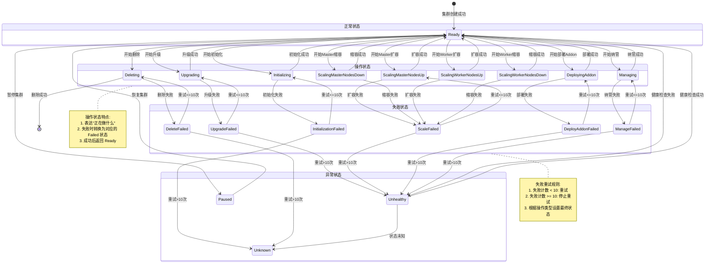

# 状态机问题分析与优化重构方案

## 1. 存在的问题分析

### 1.1 状态转换逻辑分散问题

**问题描述**:
- 状态转换逻辑分散在`phase_flow.go`的多个`handleCluster*Phase`函数中
- 缺乏统一的状态转换表和转换规则定义
- 状态转换条件隐含在代码逻辑中，难以理解和维护

**代码示例**:
```go
// 当前实现：分散的状态转换函数
func handleClusterInitPhase(ctx *PhaseContext, err error) {
    if err != nil {
        ctx.BKECluster.Status.ClusterStatus = ClusterInitializationFailed
    } else {
        ctx.BKECluster.Status.ClusterStatus = ClusterInitializing
    }
}

func handleClusterScaleMasterUpPhase(ctx *PhaseContext, err error) {
    if err != nil {
        ctx.BKECluster.Status.ClusterStatus = ClusterScaleFailed
    } else {
        ctx.BKECluster.Status.ClusterStatus = ClusterMasterScalingUp
    }
}
// ... 11个类似的函数
```

**问题影响**:
- 新增状态需要修改多处代码
- 状态转换规则难以验证
- 缺乏状态转换的可视化支持

#### 1.1.1 状态转换逻辑位置清单

通过对代码库的全面搜索，梳理出所有状态转换逻辑的分布位置：

##### 1. 核心状态转换函数（phase_flow.go）

**文件**: `pkg/phaseframe/phases/phase_flow.go`

| 行号 | 函数名 | 状态转换 | 说明 |
|------|--------|---------|------|
| 301-309 | `calculatingClusterPreStatusByPhase` | → ClusterChecking | Phase执行前的状态计算 |
| 311-320 | `calculatingClusterPostStatusByPhase` | 根据Phase结果 | Phase执行后的状态计算 |
| 322-356 | `calculateClusterStatusByPhase` | 分发到各handle函数 | 核心调度函数 |
| 359-365 | `handleClusterInitPhase` | → Initializing/InitializationFailed | 初始化阶段 |
| 368-374 | `handleClusterScaleMasterUpPhase` | → MasterScalingUp/ScaleFailed | Master扩容 |
| 377-383 | `handleClusterScaleWorkerUpPhase` | → WorkerScalingUp/ScaleFailed | Worker扩容 |
| 386-392 | `handleClusterDeletePhase` | → Deleting/DeleteFailed | 删除阶段 |
| 395-401 | `handleClusterPausedPhase` | → Paused/PauseFailed | 暂停阶段 |
| 404-410 | `handleClusterDryRunPhase` | → DryRun/DryRunFailed | DryRun阶段 |
| 413-419 | `handleClusterAddonsPhase` | → DeployingAddon/DeployAddonFailed | Addon部署 |
| 422-428 | `handleClusterUpgradePhase` | → Upgrading/UpgradeFailed | 升级阶段 |
| 431-437 | `handleClusterScaleMasterDownPhase` | → MasterScalingDown/ScaleFailed | Master缩容 |
| 440-446 | `handleClusterScaleWorkerDownPhase` | → WorkerScalingDown/ScaleFailed | Worker缩容 |
| 449-455 | `handleClusterManagePhase` | → Managing/ManageFailed | 纳管阶段 |

**总计**: 11个状态转换处理函数

##### 2. 状态管理器（statusmanager.go）

**文件**: `pkg/statusmanage/statusmanager.go`

| 行号 | 函数/逻辑 | 状态转换 | 说明 |
|------|----------|---------|------|
| 121-228 | `recordBKEClusterStatus` | 状态记录和恢复 | 核心状态管理逻辑 |
| 169 | `SetLatestNormalState` | 记录正常状态 | 保存最后一次正常状态 |
| 183 | `SetLatestFailedState` | 记录失败状态 | 保存最后一次失败状态 |
| 196 | 状态恢复 | Failed → LatestNormalState | 失败重试时恢复到正常状态 |
| 206-213 | ClusterHealthState转换 | Deploying → DeployFailed等 | 超过重试次数后的状态转换 |

**关键逻辑**:
- 失败计数和重试机制（默认10次）
- 状态恢复：失败时恢复到 LatestNormalState
- 超过重试次数后设置 ClusterHealthState

##### 3. 集群健康状态转换（ensure_cluster.go）

**文件**: `pkg/phaseframe/phases/ensure_cluster.go`

| 行号 | 位置 | 状态转换 | 说明 |
|------|------|---------|------|
| 319 | 条件检查 | ClusterHealthState == Deploying | 检查部署状态 |
| 373 | 健康检查失败 | → Unhealthy | 集群不健康 |
| 399 | 健康检查成功 | → Healthy | 集群健康 |

##### 4. 其他控制器中的状态转换

###### 4.1 bkecluster_controller.go
**文件**: `controllers/capbke/bkecluster_controller.go`

| 行号 | 函数 | 状态转换 | 说明 |
|------|------|---------|------|
| 199-220 | `handleClusterStatus` | 状态更新 | 控制器状态处理 |
| 807 | 直接赋值 | ClusterHealthState | 设置健康状态 |

###### 4.2 bkecluster_upgrade_dag.go
**文件**: `controllers/capbke/bkecluster_upgrade_dag.go`

| 行号 | 位置 | 状态转换 | 说明 |
|------|------|---------|------|
| 310 | 升级流程 | ClusterStatus = status | 升级状态设置 |

###### 4.3 ensure_delete_or_reset.go
**文件**: `pkg/phaseframe/phases/ensure_delete_or_reset.go`

| 行号 | 位置 | 状态转换 | 说明 |
|------|------|---------|------|
| 179 | 删除流程 | → ClusterDeleting | 删除状态设置 |

###### 4.4 context.go
**文件**: `pkg/phaseframe/context.go`

| 行号 | 位置 | 状态转换 | 说明 |
|------|------|---------|------|
| 252 | 上下文处理 | → ClusterDeleting | 删除状态设置 |

##### 5. 状态定义（bkecluster_consts.go）

**文件**: `api/capbke/v1beta1/bkecluster_consts.go`

###### 5.1 ClusterStatus 定义（152-182行）
```go
ClusterReady, ClusterUnhealthy, ClusterUnknown, ClusterChecking
ClusterPaused, ClusterPauseFailed
ClusterDryRun, ClusterDryRunFailed
ClusterInitializing, ClusterInitializationFailed
ClusterUpgrading, ClusterUpgradeFailed
ClusterMasterScalingUp, ClusterMasterScalingDown
ClusterWorkerScalingUp, ClusterWorkerScalingDown
ClusterScaleFailed
ClusterDeployingAddon, ClusterDeployAddonFailed
ClusterManaging, ClusterManageFailed
ClusterDeleting, ClusterDeleteFailed
```

###### 5.2 ClusterHealthState 定义（222-230行）
```go
Deploying, DeployFailed
Upgrading, UpgradeFailed
Managing, ManageFailed
Unhealthy, Healthy
Deleting
```

##### 6. 状态转换逻辑分布统计

| 文件 | 状态转换点数量 | 主要职责 |
|------|--------------|---------|
| phase_flow.go | 14个 | Phase级别的状态转换 |
| statusmanager.go | 5个 | 状态记录、恢复、重试 |
| ensure_cluster.go | 3个 | 健康状态转换 |
| bkecluster_controller.go | 2个 | 控制器状态处理 |
| 其他文件 | 4个 | 特定场景状态设置 |
| **总计** | **28个** | - |

##### 7. 问题总结

**状态转换逻辑分散的具体表现**:

1. **11个独立的 handleCluster*Phase 函数**（phase_flow.go:359-455）
   - 每个函数独立处理一种Phase的状态转换
   - 缺乏统一的状态转换规则定义

2. **状态恢复逻辑隐藏在 statusmanager.go**（196-226行）
   - LatestNormalState 恢复逻辑
   - 失败计数和重试逻辑
   - ClusterHealthState 转换逻辑

3. **直接状态赋值分散在多个文件**
   - ensure_cluster.go: 3处
   - ensure_delete_or_reset.go: 1处
   - context.go: 1处
   - bkecluster_controller.go: 2处

4. **缺乏统一的状态转换表**
    - 没有集中定义所有合法的状态转换
    - 状态转换条件隐含在代码逻辑中
    - 难以验证状态转换的合法性

#### 1.1.2 ClusterStatus、ClusterHealthState 和 Phase 职责重叠问题

**问题描述**：

`ClusterStatus`、`ClusterHealthState` 和 `Phase` 三个状态字段存在严重的语义重叠和职责不清问题，导致状态管理混乱、维护成本高。

**字段定义**（[bkecluster_status.go:281-287](file:///cluster-api-provider-bke/api/bkecommon/v1beta1/bkecluster_status.go#L281-L287)）：

```go
type BKEClusterStatus struct {
    // Phase is the current phase of the cluster.
    Phase BKEClusterPhase `json:"phase,omitempty"`
    
    // ClusterStatus is the current operate status of the cluster.
    ClusterStatus ClusterStatus `json:"clusterStatus,omitempty"`
    
    // ClusterHealthState
    ClusterHealthState ClusterHealthState `json:"clusterHealthState,omitempty"`
}
```

**三个字段概览**：

| 字段 | 枚举值数量 | 职责 | 问题 |
|------|----------|------|------|
| **Phase** | 12 个 | 表达"正在执行哪个 Phase" | 与 ClusterStatus 重叠 50% |
| **ClusterStatus** | 22 个 | 表达"集群当前处于什么操作状态" | 与 ClusterHealthState 重叠 56% |
| **ClusterHealthState** | 9 个 | 表达"集群健康状态" | 与 ClusterStatus 重叠 56% |

##### 1.1.2.1 ClusterStatus 与 ClusterHealthState 重叠分析

**枚举值对比**：

| ClusterStatus（22个值） | ClusterHealthState（9个值） | 重叠情况 |
|------------------------|---------------------------|---------|
| `ClusterUpgrading` | `Upgrading` | ❌ **完全重复** |
| `ClusterUpgradeFailed` | `UpgradeFailed` | ❌ **完全重复** |
| `ClusterManaging` | `Managing` | ❌ **完全重复** |
| `ClusterManageFailed` | `ManageFailed` | ❌ **完全重复** |
| `ClusterUnhealthy` | `Unhealthy` | ❌ **完全重复** |
| `ClusterDeployingAddon` | `Deploying` | ⚠️ 语义相近 |
| `ClusterDeployAddonFailed` | `DeployFailed` | ⚠️ 语义相近 |

**重叠率**：9个值中有5个完全重复，重叠率 **56%**

**问题分析**：

1. **语义重叠**：两个字段都包含 `Upgrading/UpgradeFailed`、`Managing/ManageFailed`、`Unhealthy`
2. **职责不清**：`ClusterStatus` 注释为 "current operate status"，`ClusterHealthState` 无注释
3. **使用场景混乱**：
   - `ClusterStatus` 用于 phase_flow.go 的状态转换
   - `ClusterHealthState` 用于 statusmanager.go 的失败处理
   - 但两者都表达相同的操作状态

**代码示例 - 职责混乱**：

```go
// phase_flow.go - 使用 ClusterStatus
func handleClusterUpgradePhase(ctx *phaseframe.PhaseContext, err error) {
    if err != nil {
        ctx.BKECluster.Status.ClusterStatus = bkev1beta1.ClusterUpgradeFailed
    } else {
        ctx.BKECluster.Status.ClusterStatus = bkev1beta1.ClusterUpgrading
    }
}

// statusmanager.go - 使用 ClusterHealthState
switch sr.CurrentClusterState {
case bkev1beta1.Upgrading:
    bkeCluster.Status.ClusterHealthState = bkev1beta1.UpgradeFailed
case bkev1beta1.Managing:
    bkeCluster.Status.ClusterHealthState = bkev1beta1.ManageFailed
}
```

##### 1.1.2.2 Phase 与 ClusterStatus 重叠分析

**Phase 枚举值**（12个）：

```go
InitControlPlane, JoinControlPlane, JoinWorker
FakeInitControlPlane, FakeJoinControlPlane, FakeJoinWorker
FailedBootstrapNode
UpgradeControlPlane, UpgradeWorker, UpgradeEtcd
ClusterReadyOld
Scale
```

**映射关系**：

| Phase | ClusterStatus | 重叠程度 |
|-------|---------------|---------|
| `InitControlPlane` | `Initializing` | ❌ **完全重叠** |
| `JoinControlPlane` | `Initializing` | ❌ **完全重叠** |
| `JoinWorker` | `Initializing` | ❌ **完全重叠** |
| `UpgradeControlPlane` | `Upgrading` | ❌ **完全重叠** |
| `UpgradeWorker` | `Upgrading` | ❌ **完全重叠** |
| `UpgradeEtcd` | `Upgrading` | ❌ **完全重叠** |
| `Scale` | `ScalingMasterNodesUp/Down` 或 `ScalingWorkerNodesUp/Down` | ⚠️ **部分重叠** |
| `FailedBootstrapNode` | `InitializationFailed` | ⚠️ **语义相近** |

**重叠率**：12 个 Phase 中有 6 个与 ClusterStatus 完全重叠，重叠率 **50%**

**问题分析**：

1. **职责重叠**：Phase 和 ClusterStatus 都在表达"当前正在做什么"
2. **映射关系隐式且分散**：Phase → ClusterStatus 的映射关系没有明确定义，而是分散在多个 `handleCluster*Phase` 函数中
3. **状态不一致风险**：Phase 和 ClusterStatus 可能被独立设置，导致状态不一致

**代码示例 - 职责重叠**：

```go
// phaseframe/base.go:318 - 设置 Phase
func (b *BasePhase) handleRunningStatus(...) {
    bkeCluster.Status.Phase = phaseName
}

// phase_flow.go:359-455 - 设置 ClusterStatus
func handleClusterInitPhase(ctx *phaseframe.PhaseContext, err error) {
    if err != nil {
        ctx.BKECluster.Status.ClusterStatus = bkev1beta1.ClusterInitializationFailed
    } else {
        ctx.BKECluster.Status.ClusterStatus = bkev1beta1.ClusterInitializing
    }
}
```

##### 1.1.2.3 综合问题分析

**核心问题**：

1. **三个字段职责重叠**：Phase、ClusterStatus、ClusterHealthState 都在表达集群状态，导致开发者难以理解应该使用哪个字段
2. **状态转换逻辑分散**：状态转换逻辑分散在多个文件和函数中，增加维护成本
3. **状态不一致风险**：三个字段可能被独立设置，容易出现状态不一致
4. **与 v3 设计的映射复杂**：三个字段都需要映射到 v3 的 `LifecyclePhase`，增加了迁移的复杂性

**影响**：
- 开发者难以理解应该使用哪个字段
- 状态转换逻辑分散在多个字段中，增加维护成本
- 容易出现状态不一致（Phase=InitControlPlane 但 ClusterStatus=Ready）
- 迁移到 v3 架构时成本高昂

##### 重构方案：三字段整合方案（保持 ClusterStatus 兼容性）

**设计原则**：
- **保持 ClusterStatus 兼容性**：保留 `ClusterStatus` 字段及其现有枚举值，不做大的改动
- **删除冗余字段**：删除 `Phase` 和 `ClusterHealthState` 字段
- **统一状态表达**：`ClusterStatus` 统一表达集群状态（操作状态 + 健康状态 + Phase 信息）
- **与 v3 对齐**：提供映射函数到 v3 `LifecyclePhase`，为未来迁移做准备
- **成本最优**：避免双写过渡，一次性解决问题

**方案对比**：

| 方案 | 描述 | 工作量 | 推荐度 |
|------|------|--------|--------|
| 方案 A | 保留旧字段 + 新增 ClusterState（双写过渡） | 10-14 天 | ❌ 成本高 |
| 方案 B | 直接替换旧字段为 ClusterState | 9-13 天 | ⚠️ 破坏兼容性 |
| **方案 C** | **三字段整合（推荐）** | **7-11 天** | **✅ 成本最优** |

**字段变更**：

```go
type BKEClusterStatus struct {
    // ... 其他字段 ...
    
    // 删除 Phase 字段
    // Phase BKEClusterPhase `json:"phase,omitempty"`
    
    // 保留 ClusterStatus 字段（保持现有枚举值，不做改动）
    ClusterStatus ClusterStatus `json:"clusterStatus,omitempty"`
    
    // 删除 ClusterHealthState 字段
    // ClusterHealthState ClusterHealthState `json:"clusterHealthState,omitempty"`
}
```

**ClusterStatus 枚举值（保持现有）**：

```go
type ClusterStatus string

const (
    // 正常状态
    ClusterReady     ClusterStatus = "Ready"
    ClusterUnhealthy ClusterStatus = "Unhealthy"
    ClusterUnknown   ClusterStatus = "Unknown"
    ClusterChecking  ClusterStatus = "Checking"
    
    // 暂停状态
    ClusterPaused      ClusterStatus = "Paused"
    ClusterPauseFailed ClusterStatus = "PauseFailed"
    
    // DryRun 状态
    ClusterDryRun       ClusterStatus = "DryRun"
    ClusterDryRunFailed ClusterStatus = "DryRunFailed"
    
    // 初始化状态
    ClusterInitializing         ClusterStatus = "Initializing"
    ClusterInitializationFailed ClusterStatus = "InitializationFailed"
    
    // 升级状态
    ClusterUpgrading     ClusterStatus = "Upgrading"
    ClusterUpgradeFailed ClusterStatus = "UpgradeFailed"
    
    // 扩缩容状态
    ClusterMasterScalingUp   ClusterStatus = "ScalingMasterNodesUp"
    ClusterMasterScalingDown ClusterStatus = "ScalingMasterNodesDown"
    ClusterWorkerScalingUp   ClusterStatus = "ScalingWorkerNodesUp"
    ClusterWorkerScalingDown ClusterStatus = "ScalingWorkerNodesDown"
    ClusterScaleFailed       ClusterStatus = "ScaleFailed"
    
    // Addon 部署状态
    ClusterDeployingAddon    ClusterStatus = "DeployingAddon"
    ClusterDeployAddonFailed ClusterStatus = "DeployAddonFailed"
    
    // 纳管状态
    ClusterManaging     ClusterStatus = "Managing"
    ClusterManageFailed ClusterStatus = "ManageFailed"
    
    // 删除状态
    ClusterDeleting     ClusterStatus = "Deleting"
    ClusterDeleteFailed ClusterStatus = "DeleteFailed"
)
```

**Phase 到 ClusterStatus 的映射函数**：

```go
// MapPhaseToClusterStatus 将 Phase 映射到 ClusterStatus
// 用于替代原有的 Phase 字段
func MapPhaseToClusterStatus(phase BKEClusterPhase, err error) ClusterStatus {
    switch phase {
    case InitControlPlane, JoinControlPlane, JoinWorker:
        if err != nil {
            return ClusterInitializationFailed
        }
        return ClusterInitializing
    
    case UpgradeControlPlane, UpgradeWorker, UpgradeEtcd:
        if err != nil {
            return ClusterUpgradeFailed
        }
        return ClusterUpgrading
    
    case Scale:
        if err != nil {
            return ClusterScaleFailed
        }
        return ClusterMasterScalingUp  // 默认返回扩容
    
    case FailedBootstrapNode:
        return ClusterInitializationFailed
    
    case ClusterReadyOld:
        return ClusterReady
    
    default:
        return ClusterUnknown
    }
}
```

**ClusterStatus 到 v3 LifecyclePhase 的映射函数**：

```go
// MapToV3LifecyclePhase 将 ClusterStatus 映射到 v3 LifecyclePhase
func (s ClusterStatus) MapToV3LifecyclePhase() LifecyclePhase {
    switch s {
    case ClusterReady, ClusterManaging:
        return LifecyclePhaseRunning
    
    case ClusterInitializing, ClusterDeployingAddon:
        return LifecyclePhaseCreating
    
    case ClusterUpgrading:
        return LifecyclePhaseUpgrading
    
    case ClusterMasterScalingUp, ClusterMasterScalingDown,
         ClusterWorkerScalingUp, ClusterWorkerScalingDown,
         ClusterDeleting:
        return LifecyclePhaseScaling
    
    case ClusterInitializationFailed, ClusterUpgradeFailed,
         ClusterScaleFailed, ClusterDeleteFailed,
         ClusterDeployAddonFailed, ClusterManageFailed,
         ClusterUnhealthy, ClusterUnknown:
        return LifecyclePhaseFailed
    
    case ClusterPaused:
        return LifecyclePhaseRunning  // v3 无暂停状态
    
    default:
        return LifecyclePhaseFailed
    }
}
```

**PhaseFlow 框架的改动**：

```go
// 原有逻辑（phaseframe/base.go:318）
func (b *BasePhase) handleRunningStatus(...) {
    bkeCluster.Status.Phase = phaseName
    // ... 其他逻辑 ...
}

// 改动后
func (b *BasePhase) handleRunningStatus(...) {
    // 删除 Phase 字段的设置
    // bkeCluster.Status.Phase = phaseName
    
    // 使用 ClusterStatus 替代
    bkeCluster.Status.ClusterStatus = MapPhaseToClusterStatus(phaseName, nil)
    
    // ... 其他逻辑 ...
}
```

**状态机图**（保持现有 ClusterStatus 枚举值）：



**实施计划**：

**第一阶段：准备（1-2 天）**
1. 添加映射函数 `MapPhaseToClusterStatus`
2. 添加映射函数 `MapToV3LifecyclePhase`
3. 更新文档

**第二阶段：删除 Phase 字段（3-4 天）**
1. 修改 `phaseframe/base.go`：删除 Phase 字段的设置
2. 修改所有使用 `Phase` 字段的代码（约 32 处）
3. 使用 `MapPhaseToClusterStatus` 替代
4. 测试验证

**第三阶段：删除 ClusterHealthState 字段（2-3 天）**
1. 修改 22 处 `ClusterHealthState` 代码
2. 使用迁移函数转换到 `ClusterStatus`
3. 测试验证

**第四阶段：清理（1-2 天）**
1. 删除 `Phase` 字段定义
2. 删除 `ClusterHealthState` 字段定义
3. 删除迁移函数
4. 更新测试用例
5. 更新文档

**总工时：7-11 天**

**需要更新的文件清单**：

| 文件 | 修改类型 | 预计修改量 |
|------|---------|-----------|
| `api/capbke/v1beta1/bkecluster_consts.go` | 删除 ClusterHealthState 枚举 | 约 10 行 |
| `api/bkecommon/v1beta1/bkecluster_status.go` | 删除 Phase 和 ClusterHealthState 字段 | 约 10 行 |
| `pkg/phaseframe/base.go` | 删除 Phase 字段的设置 | 约 5 行 |
| `pkg/phaseframe/phases/phase_flow.go` | 保持 ClusterStatus 逻辑不变 | 约 0 行 |
| `pkg/phaseframe/phases/ensure_*.go` | 修改使用 Phase 字段的代码（约 32 处） | 约 30 行 |
| `pkg/statusmanage/statusmanager.go` | 修改 ClusterHealthState 代码（约 5 处） | 约 10 行 |
| `controllers/capbke/bkecluster_controller.go` | 修改使用 Phase 字段的代码（约 2 处） | 约 5 行 |
| `*_test.go` | 更新测试用例 | 约 50 行 |
| `code/specification/升级规格.md` | 更新规格文档 | 约 30 行 |

**风险控制**：

| 风险 | 概率 | 影响 | 缓解措施 |
|------|------|------|---------|
| 状态转换逻辑错误 | 中 | 高 | 充分的单元测试和集成测试 |
| 外部消费者影响 | 低 | 中 | ClusterStatus 保持兼容性，影响有限 |
| PhaseFlow 框架改动 | 中 | 中 | 保持最小改动，只做必要的修改 |

**与 v3 设计的关系**：

- **当前方案定位**：针对 PhaseFlow 的改进，解决 Phase、ClusterStatus、ClusterHealthState 三个字段的职责重叠问题
- **v3 方案定位**：未来的目标架构，三层状态机设计
- **对齐关系**：当前方案的 ClusterStatus 通过 `MapToV3LifecyclePhase` 函数映射到 v3 状态
- **过渡策略**：当前方案作为过渡，最终被 v3 方案替代

**方案优势**：

1. **保持兼容性**：ClusterStatus 保持现有枚举值，不做大的改动
2. **消除冗余**：删除 Phase 和 ClusterHealthState 字段
3. **成本最优**：总工时 7-11 天，比原方案节省 1-4 天
4. **与 v3 对齐**：提供映射函数，为未来迁移做准备

### 1.2 状态管理器设计问题

**问题描述**:

#### 1.2.1 全局单例导致内存泄漏风险

```go
var BKEClusterStatusManager = NewStatusManager()  // 全局单例

type StatusManager struct {
    BKEClusterStatusMap map[string]*StatusRecord  // 无限增长
    BKENodesStatusMap   map[string]map[string]*StatusRecord
}
```

**问题**:
- 集群删除后，状态记录可能未被清理
- 长期运行的管理集群会积累大量无用状态记录
- 缺乏状态记录的自动过期机制

#### 1.2.2 失败重试机制不够灵活

```go
const DefaultAllowedFailedCount = 10  // 固定值

func (sr *StatusRecord) AllowFailed() bool {
    return sr.StatusCount < ReconcileAllowedFailedCount
}
```

**问题**:
- 所有Phase使用相同的失败次数限制
- 无法针对不同Phase设置不同的重试策略
- 缺乏指数退避机制

#### 1.2.3 状态恢复逻辑复杂

```go
// 复杂的状态恢复逻辑
if sr.AllowFailed() {
    bkeCluster.Status.ClusterStatus = confv1beta1.ClusterStatus(sr.LatestNormalState)
    sr.NeedRequeue = true
} else {
    // 超过限制后的处理逻辑
    if sr.CurrentClusterState != bkev1beta1.Unhealthy && 
       sr.CurrentClusterState != bkev1beta1.Healthy {
        // 根据ClusterHealthState设置不同的Failed状态
        switch sr.CurrentClusterState {
        case bkev1beta1.Deploying:
            bkeCluster.Status.ClusterHealthState = bkev1beta1.DeployFailed
        case bkev1beta1.Upgrading:
            bkeCluster.Status.ClusterHealthState = bkev1beta1.UpgradeFailed
        // ...
        }
    }
}
```

**问题**:
- 状态恢复逻辑与业务逻辑高度耦合
- 难以理解状态恢复的完整流程
- 缺乏状态恢复失败的兜底机制

### 1.3 Phase状态管理问题

**问题描述**:

#### 1.3.1 Phase历史记录限制

```go
const MaxPhaseStatusHistory = 20  // 最多保留20个

// 移除成功后除了失败的phase
if len(p.ctx.BKECluster.Status.PhaseStatus) > MaxPhaseStatusHistory {
    p.ctx.BKECluster.Status.PhaseStatus = 
        p.ctx.BKECluster.Status.PhaseStatus[len-MaxPhaseStatusHistory:]
}
```

**问题**:
- 可能丢失重要的Phase执行历史
- 无法追溯长时间运行集群的完整历史
- 调试和问题排查困难

#### 1.3.2 Phase执行顺序硬编码

```go
var FullPhasesRegisFunc = append(append(
    CommonPhases,
    DeployPhases...,
), PostDeployPhases...)
```

**问题**:
- Phase执行顺序固定，缺乏灵活性
- 无法动态调整Phase执行顺序
- 难以支持条件性的Phase跳过

### 1.4 并发安全问题

**问题描述**:

#### 1.4.1 潜在的死锁风险

```go
func (b *StatusManager) recordBKEClusterStatus(bkeCluster *BKECluster) {
    b.cmux.Lock()  // 获取锁
    defer b.cmux.Unlock()
    
    // 在持有锁的情况下调用其他函数
    sr := b.BKEClusterStatusMap[key]
    if sr.AllowFailed() {  // 可能触发其他操作
        bkeCluster.Status.ClusterStatus = ...
    }
}
```

**问题**:
- 在持有锁的情况下修改外部对象状态
- 可能与其他锁产生死锁
- 锁的粒度过大

#### 1.4.2 竞态条件

```go
// 状态记录和状态恢复之间存在竞态
if sr.AllowFailed() {
    bkeCluster.Status.ClusterStatus = sr.LatestNormalState  // 读取LatestNormalState
    sr.NeedRequeue = true
}
```

**问题**:
- LatestNormalState可能在读取后被修改
- 缺乏原子性保证
- 可能导致状态不一致

### 1.5 状态可观测性问题

**问题描述**:
- 缺乏状态转换事件记录
- 难以追踪状态转换历史
- 缺乏状态机可视化支持
- 无法导出状态转换日志用于分析

---

### 1.6 代码可维护性问题

**问题描述**:
- 状态转换逻辑与业务逻辑耦合
- 缺乏状态机测试工具
- 状态定义分散在多个文件
- 缺乏状态机的文档生成工具

### 1.7 状态定义合理性问题

**问题描述**: 当前 `ClusterStatus`（`bkecluster_consts.go:152-182`，20 个值）与 `ClusterHealthState`（`bkecluster_consts.go:222-230`，9 个值）两个状态枚举存在语义重叠、职责边界模糊、粒度不对称等 7 个合理性问题。

#### 1.7.1 问题 1：两个状态类型语义严重重叠

`ClusterStatus` 和 `ClusterHealthState` 存在大面积语义重叠，本质上是同一信息的不同粒度副本：

| 操作 | ClusterStatus 值 | ClusterHealthState 值 | 关系 |
|------|-------------------|----------------------|------|
| 部署 | `ClusterInitializing` / `ClusterInitializationFailed` | `Deploying` / `DeployFailed` | 重叠 |
| 升级 | `ClusterUpgrading` / `ClusterUpgradeFailed` | `Upgrading` / `UpgradeFailed` | 重叠 |
| 纳管 | `ClusterManaging` / `ClusterManageFailed` | `Managing` / `ManageFailed` | 重叠 |
| 删除 | `ClusterDeleting` / `ClusterDeleteFailed` | `Deleting`（无 DeleteFailed） | 部分重叠 |
| 健康 | `ClusterReady` / `ClusterUnhealthy` | `Healthy` / `Unhealthy` | 重叠 |

`statusmanager.go:202-216` 直接用 `switch sr.CurrentClusterState` 将 `ClusterHealthState` 映射回自身——这证明两者描述的是同一信息：

```go
// statusmanager.go:204-216 — 用 ClusterHealthState 映射设置 ClusterHealthState
switch sr.CurrentClusterState {
case bkev1beta1.Deploying:
    bkeCluster.Status.ClusterHealthState = bkev1beta1.DeployFailed
case bkev1beta1.Upgrading:
    bkeCluster.Status.ClusterHealthState = bkev1beta1.UpgradeFailed
case bkev1beta1.Managing:
    bkeCluster.Status.ClusterHealthState = bkev1beta1.ManageFailed
}
```

#### 1.7.2 问题 2：ClusterHealthState 不是"纯健康状态"

字段名为 `ClusterHealthState`，但实际混入了**操作状态**：

```go
// bkecluster_consts.go:222-230
Deploying, DeployFailed      // ← 操作状态，不是健康状态
Upgrading, UpgradeFailed     // ← 操作状态
Managing, ManageFailed       // ← 操作状态
Unhealthy, Healthy           // ← 真正的健康状态
Deleting                     // ← 操作状态
```

真正的"健康状态"应仅有 `Healthy` / `Unhealthy` / `Unknown`。`Deploying`/`Upgrading` 等是"正在做什么"（操作），不是"健康状况如何"（健康）。

`setClusterHealthStatus`（`bkecluster_controller.go:757-774`）在 Reconcile 入口根据操作类型设置 `ClusterHealthState`，进一步证明它实际是操作状态而非健康状态：

```go
// bkecluster_controller.go:757-774
func (r *BKEClusterReconciler) setClusterHealthStatus(...) {
    if flags.DeployFlag || flags.DeployFailedFlag {
        markBKEClusterHealthyStatus(bkeCluster, bkev1beta1.Deploying)  // ← 操作类型设置"健康状态"
    }
    if flags.UpgradeFlag || flags.UpgradeFailedFlag {
        markBKEClusterHealthyStatus(bkeCluster, bkev1beta1.Upgrading)
    }
    // ...
}
```

#### 1.7.3 问题 3：ClusterHealthState 缺失关键状态

`ClusterStatus` 有但 `ClusterHealthState` 无对应的状态：

| 缺失状态 | ClusterStatus 中的对应 | 影响 |
|----------|----------------------|------|
| `Scaling` / `ScaleFailed` | `ClusterMasterScalingUp/Down`、`ClusterWorkerScalingUp/Down`、`ClusterScaleFailed` | 扩缩容时 `ClusterHealthState` 不变，用户无法从健康状态判断正在扩缩容 |
| `DeleteFailed` | `ClusterDeleteFailed` | 删除失败后 `ClusterHealthState` 仍为 `Deleting`，无法表达删除失败 |
| `Unknown` | `ClusterUnknown` | 无"未知健康"状态，新集群或状态丢失时无法表达 |
| `Paused` / `DryRun` | `ClusterPaused` / `ClusterDryRun` | 暂停/DryRun 时健康状态无变化 |

#### 1.7.4 问题 4：ClusterStatus 混合了三种不同维度的状态

`ClusterStatus` 的 20 个值实际混合了三个维度：

| 维度 | 值 | 说明 |
|------|-----|------|
| **健康状态** | `ClusterReady`, `ClusterUnhealthy`, `ClusterUnknown`, `ClusterChecking` | 描述集群"是否健康" |
| **操作进行中** | `ClusterInitializing`, `ClusterUpgrading`, `ClusterMasterScalingUp`, `ClusterWorkerScalingUp`, `ClusterMasterScalingDown`, `ClusterWorkerScalingDown`, `ClusterDeployingAddon`, `ClusterManaging`, `ClusterDeleting`, `ClusterDryRun`, `ClusterPaused` | 描述集群"正在做什么" |
| **操作失败** | `ClusterInitializationFailed`, `ClusterUpgradeFailed`, `ClusterScaleFailed`, `ClusterDeployAddonFailed`, `ClusterManageFailed`, `ClusterDeleteFailed`, `ClusterPauseFailed`, `ClusterDryRunFailed` | 描述操作"失败了吗" |

三个维度塞进一个枚举导致：`ClusterReady`（健康）和 `ClusterInitializing`（操作中）是互斥的，但它们在同一层级——从 `ClusterInitializing` 到 `ClusterReady` 的转换隐含了"操作完成"和"健康检查通过"两个语义。

#### 1.7.5 问题 5：两个状态机边界不清，通过 statusmanager 桥接导致耦合

两个状态机各自独立转换，通过 `statusmanager.go:121-228` 桥接：

```go
// statusmanager.go:163 — 用 ClusterHealthState 作为 CurrentClusterState
sr.SetCurrentClusterState(bkeCluster.Status.ClusterHealthState)

// statusmanager.go:195-196 — 失败时恢复 ClusterStatus 到 LatestNormalState
bkeCluster.Status.ClusterStatus = confv1beta1.ClusterStatus(sr.LatestNormalState)

// statusmanager.go:204-216 — 超过重试次数后，用 CurrentClusterState 映射设置 ClusterHealthState
switch sr.CurrentClusterState {
case bkev1beta1.Deploying:
    bkeCluster.Status.ClusterHealthState = bkev1beta1.DeployFailed
case bkev1beta1.Upgrading:
    bkeCluster.Status.ClusterHealthState = bkev1beta1.UpgradeFailed
}
```

**问题**：
- `ClusterStatus` 由 `phase_flow.go` 的 11 个 `handle*Phase` 函数设置
- `ClusterHealthState` 由 `setClusterHealthStatus`（controller:757）和 `ensure_cluster.go:373,399` 设置
- `statusmanager.go` 在失败重试逻辑中同时修改两者
- 三处代码各自维护各自的状态转换，没有统一的状态转换表

#### 1.7.6 问题 6：Failed 状态粒度不对称

`ClusterStatus` 有 8 个 `*Failed` 状态，`ClusterHealthState` 只有 3 个 `*Failed` 状态。`statusmanager.go:165` 用 `strings.HasSuffix(state, "Failed")` 判断失败状态——这个逻辑能正确识别所有 8 个 `ClusterStatus` 的 Failed 状态，但 `ClusterHealthState` 的映射只能覆盖 3 种（Deploy/Upgrade/Manage），其余 5 种 Failed 状态（Scale/Delete/Pause/DryRun/Addon）在超过重试次数后不会更新 `ClusterHealthState`：

```go
// statusmanager.go:204-216 — default 分支为空，5 种失败状态无法映射
switch sr.CurrentClusterState {
case bkev1beta1.Deploying:
    bkeCluster.Status.ClusterHealthState = bkev1beta1.DeployFailed
case bkev1beta1.Upgrading:
    bkeCluster.Status.ClusterHealthState = bkev1beta1.UpgradeFailed
case bkev1beta1.Managing:
    bkeCluster.Status.ClusterHealthState = bkev1beta1.ManageFailed
default:
    // ← 空分支: Scaling/Deleting/Paused/DryRun/Addon 失败时 ClusterHealthState 不更新
}
```

#### 1.7.7 问题 7：与 kep6-state-machine-v3 的方向冲突

`kep6-state-machine-v3.md:36-38` 已提出统一的三层状态机架构，将集群状态合并为单一 `BKEClusterLifecycle`：

```
Creating → Running → Upgrading → Scaling → RollingBack → Failed
```

这与当前 `ClusterStatus` + `ClusterHealthState` 双状态设计直接冲突。v3 设计意图是用一个状态机替代两个，将"操作进行中"、"操作失败"、"健康状态"分离为独立维度（如 `BKEClusterLifecycle` + `HealthCondition`），而非维护两个重叠的枚举。当前代码仍维护两个并行状态，与 v3 演进方向不一致。

#### 1.7.8 状态定义合理性问题总结

| 问题 | 严重程度 | 根因 |
|------|---------|------|
| 两个状态类型语义严重重叠 | 高 | 两个类型描述同一信息的不同粒度 |
| ClusterHealthState 非纯健康状态 | 高 | 命名与内容不符，混入操作状态 |
| ClusterHealthState 缺失关键状态 | 中 | 扩缩容/删除失败无健康状态表达 |
| ClusterStatus 三维度混合 | 中 | 操作/健康/失败塞进一个枚举 |
| 状态机边界不清 | 高 | 三处独立转换 + statusmanager 桥接 |
| Failed 粒度不对称 | 中 | 8 vs 3，5 种失败无法映射 |
| 与 v3 方向冲突 | 中 | 双状态设计将被 v3 单状态机替代 |

**核心结论**：`ClusterStatus` 和 `ClusterHealthState` 的根本问题是**职责边界模糊**——两者都在描述"集群当前在做什么 + 是否健康 + 是否失败"，但粒度不同、覆盖面不同、转换逻辑分散在三处。合理的做法是按 `kep6-state-machine-v3` 的方向统一为单一生命周期状态机，将"操作进行中"、"操作失败"、"健康状态"分离为独立维度，而非维护两个重叠的枚举。

## 2. 优化重构方案

### 2.1 方案一：引入状态转换表

**设计思路**: 使用状态转换表统一定义所有状态转换规则

**重构设计**:

```go
// 状态转换规则定义
type StateTransition struct {
    FromState   ClusterStatus
    ToState     ClusterStatus
    Trigger     string  // 触发条件（Phase名称或事件）
    Condition   func(*BKECluster) bool  // 转换条件
    Action      func(*BKECluster) error  // 转换动作
}

// 状态转换表
var ClusterStateTransitionTable = []StateTransition{
    // 初始化阶段
    {ClusterUnknown, ClusterInitializing, "EnsureFinalizer", nil, nil},
    {ClusterInitializing, ClusterReady, "EnsureCluster", isClusterReady, nil},
    {ClusterInitializing, ClusterInitializationFailed, "Error", nil, nil},
    
    // 扩容阶段
    {ClusterReady, ClusterMasterScalingUp, "EnsureMasterJoin", needMasterScaleUp, nil},
    {ClusterMasterScalingUp, ClusterReady, "EnsureMasterJoin", isScaleComplete, nil},
    {ClusterMasterScalingUp, ClusterScaleFailed, "Error", nil, nil},
    
    // 升级阶段
    {ClusterReady, ClusterUpgrading, "EnsureAgentUpgrade", needUpgrade, nil},
    {ClusterUpgrading, ClusterReady, "EnsureCluster", isUpgradeComplete, nil},
    {ClusterUpgrading, ClusterUpgradeFailed, "Error", nil, nil},
    
    // ... 其他转换规则
}

// 状态机引擎
type StateMachineEngine struct {
    transitions []StateTransition
    history     []StateTransitionEvent
}

func (e *StateMachineEngine) Transition(cluster *BKECluster, trigger string, err error) error {
    currentState := cluster.Status.ClusterStatus
    
    // 查找匹配的转换规则
    for _, trans := range e.transitions {
        if trans.FromState == currentState && trans.Trigger == trigger {
            // 检查转换条件
            if trans.Condition != nil && !trans.Condition(cluster) {
                continue
            }
            
            // 执行转换动作
            if trans.Action != nil {
                if err := trans.Action(cluster); err != nil {
                    return err
                }
            }
            
            // 应用新状态
            cluster.Status.ClusterStatus = trans.ToState
            
            // 记录转换事件
            e.recordTransition(trans, cluster)
            
            return nil
        }
    }
    
    return fmt.Errorf("no valid transition from %s with trigger %s", currentState, trigger)
}
```

**优势**:
- 状态转换规则集中定义，易于理解和维护
- 支持状态转换条件验证
- 易于生成状态机文档和可视化图表
- 便于单元测试

### 2.2 方案二：改进状态管理器

**设计思路**: 解决内存泄漏、灵活重试、并发安全等问题

**重构设计**:

```go
// 改进的状态记录
type StatusRecordV2 struct {
    LatestFailedState    string
    LatestNormalState    string
    StatusCount          int32  // 使用int32支持原子操作
    NeedRequeue          bool
    CurrentClusterState  ClusterHealthState
    
    // 新增字段
    LastUpdateTime       time.Time  // 最后更新时间
    ExpireTime           time.Time  // 过期时间
    PhaseName            string     // 关联的Phase名称
    RetryPolicy          RetryPolicy  // 重试策略
}

// 重试策略
type RetryPolicy struct {
    MaxRetryCount    int           // 最大重试次数
    BackoffStrategy  BackoffType   // 退避策略
    InitialDelay     time.Duration // 初始延迟
    MaxDelay         time.Duration // 最大延迟
}

// 退避策略类型
type BackoffType string

const (
    BackoffNone       BackoffType = "None"       // 无退避
    BackoffLinear     BackoffType = "Linear"     // 线性退避
    BackoffExponential BackoffType = "Exponential" // 指数退避
)

// Phase级别的重试策略配置
var PhaseRetryPolicies = map[string]RetryPolicy{
    "EnsureMasterInit": {
        MaxRetryCount:    5,
        BackoffStrategy:  BackoffExponential,
        InitialDelay:     10 * time.Second,
        MaxDelay:         5 * time.Minute,
    },
    "EnsureWorkerJoin": {
        MaxRetryCount:    10,
        BackoffStrategy:  BackoffLinear,
        InitialDelay:     5 * time.Second,
        MaxDelay:         2 * time.Minute,
    },
    // ... 其他Phase的策略
}

// 改进的状态管理器
type StatusManagerV2 struct {
    cmux sync.RWMutex
    nmux sync.RWMutex
    
    BKEClusterStatusMap map[string]*StatusRecordV2
    BKENodesStatusMap   map[string]map[string]*StatusRecordV2
    
    // 新增：状态清理器
    cleaner *StatusCleaner
}

// 状态清理器
type StatusCleaner struct {
    cleanupInterval time.Duration
    expireDuration  time.Duration
    stopCh          chan struct{}
}

func (c *StatusCleaner) Start() {
    ticker := time.NewTicker(c.cleanupInterval)
    go func() {
        for {
            select {
            case <-ticker.C:
                c.cleanupExpiredRecords()
            case <-c.stopCh:
                ticker.Stop()
                return
            }
        }
    }()
}

func (c *StatusCleaner) cleanupExpiredRecords() {
    // 清理过期的状态记录
    now := time.Now()
    for key, record := range BKEClusterStatusMap {
        if now.After(record.ExpireTime) {
            delete(BKEClusterStatusMap, key)
        }
    }
}

// 改进的失败处理逻辑
func (b *StatusManagerV2) handleFailure(cluster *BKECluster, phaseName string) error {
    key := utils.ClientObjNS(cluster)
    
    b.cmux.Lock()
    defer b.cmux.Unlock()
    
    sr := b.BKEClusterStatusMap[key]
    if sr == nil {
        sr = &StatusRecordV2{
            RetryPolicy: PhaseRetryPolicies[phaseName],
            ExpireTime:  time.Now().Add(24 * time.Hour),
        }
        b.BKEClusterStatusMap[key] = sr
    }
    
    // 原子递增计数器
    newCount := atomic.AddInt32(&sr.StatusCount, 1)
    
    // 检查是否允许重试
    if int(newCount) <= sr.RetryPolicy.MaxRetryCount {
        // 计算退避时间
        delay := b.calculateBackoff(sr.RetryPolicy, int(newCount))
        
        // 恢复到正常状态
        cluster.Status.ClusterStatus = ClusterStatus(sr.LatestNormalState)
        sr.NeedRequeue = true
        
        // 返回RequeueAfter而不是立即Requeue
        return &RequeueAfterError{Delay: delay}
    }
    
    // 超过重试次数，设置最终失败状态
    b.setFinalFailedState(cluster, sr)
    sr.NeedRequeue = false
    
    return nil
}

// 计算退避时间
func (b *StatusManagerV2) calculateBackoff(policy RetryPolicy, count int) time.Duration {
    switch policy.BackoffStrategy {
    case BackoffNone:
        return 0
    case BackoffLinear:
        delay := policy.InitialDelay * time.Duration(count)
        if delay > policy.MaxDelay {
            return policy.MaxDelay
        }
        return delay
    case BackoffExponential:
        delay := policy.InitialDelay * time.Duration(1<<uint(count-1))
        if delay > policy.MaxDelay {
            return policy.MaxDelay
        }
        return delay
    default:
        return 0
    }
}
```

**优势**:
- 解决内存泄漏问题（自动清理过期记录）
- 支持Phase级别的重试策略
- 支持多种退避策略（线性、指数）
- 改进并发安全（原子操作）
- 更灵活的状态恢复机制

### 2.3 方案三：引入状态转换事件系统

**设计思路**: 记录所有状态转换事件，提供可观测性支持

**重构设计**:

```go
// 状态转换事件
type StateTransitionEvent struct {
    Timestamp       time.Time
    ClusterName     string
    FromState       ClusterStatus
    ToState         ClusterStatus
    Trigger         string  // Phase名称或事件
    Success         bool
    ErrorMessage    string
    Duration        time.Duration
    Metadata        map[string]interface{}  // 附加信息
}

// 事件存储接口
type EventStore interface {
    Record(event StateTransitionEvent) error
    Query(filter EventFilter) ([]StateTransitionEvent, error)
    Export(format string) ([]byte, error)
}

// 内存事件存储（用于短期存储）
type InMemoryEventStore struct {
    events []StateTransitionEvent
    maxSize int
    mux    sync.RWMutex
}

// 持久化事件存储（用于长期存储）
type PersistentEventStore struct {
    client client.Client
    namespace string
}

func (s *PersistentEventStore) Record(event StateTransitionEvent) error {
    // 将事件保存为Kubernetes Event资源
    kubeEvent := &corev1.Event{
        ObjectMeta: metav1.ObjectMeta{
            Name:      fmt.Sprintf("%s-%s-%d", event.ClusterName, event.Trigger, event.Timestamp.Unix()),
            Namespace: s.namespace,
        },
        InvolvedObject: corev1.ObjectReference{
            Name: event.ClusterName,
        },
        Reason:  fmt.Sprintf("StateTransition:%s->%s", event.FromState, event.ToState),
        Message: fmt.Sprintf("Trigger: %s, Success: %v", event.Trigger, event.Success),
        Type:    map[bool]string{true: "Normal", false: "Warning"}[event.Success],
    }
    return s.client.Create(context.Background(), kubeEvent)
}

// 事件查询过滤器
type EventFilter struct {
    ClusterName string
    StartTime   time.Time
    EndTime     time.Time
    FromState   ClusterStatus
    ToState     ClusterStatus
    Trigger     string
    Success     *bool
}

// 状态机事件记录器
type StateMachineEventRecorder struct {
    store EventStore
}

func (r *StateMachineEventRecorder) RecordTransition(
    cluster *BKECluster,
    fromState, toState ClusterStatus,
    trigger string,
    err error,
    duration time.Duration,
) {
    event := StateTransitionEvent{
        Timestamp:    time.Now(),
        ClusterName:  utils.ClientObjNS(cluster),
        FromState:    fromState,
        ToState:      toState,
        Trigger:      trigger,
        Success:      err == nil,
        ErrorMessage: getErrorMessage(err),
        Duration:     duration,
        Metadata: map[string]interface{}{
            "ClusterHealthState": cluster.Status.ClusterHealthState,
            "PhaseStatus":        cluster.Status.PhaseStatus,
        },
    }
    
    _ = r.store.Record(event)
}

// 导出状态转换历史（用于分析和可视化）
func (r *StateMachineEventRecorder) ExportHistory(clusterName string, format string) ([]byte, error) {
    filter := EventFilter{
        ClusterName: clusterName,
    }
    
    events, err := r.store.Query(filter)
    if err != nil {
        return nil, err
    }
    
    switch format {
    case "json":
        return json.Marshal(events)
    case "csv":
        return r.exportCSV(events)
    case "dot":
        return r.exportDotGraph(events)  // 生成Graphviz DOT格式
    default:
        return nil, fmt.Errorf("unsupported format: %s", format)
    }
}

// 生成状态机可视化图
func (r *StateMachineEventRecorder) exportDotGraph(events []StateTransitionEvent) ([]byte, error) {
    var buf bytes.Buffer
    buf.WriteString("digraph StateMachine {\n")
    buf.WriteString("  rankdir=LR;\n")
    
    // 统计状态转换
    transitions := make(map[string]int)
    for _, event := range events {
        key := fmt.Sprintf("%s->%s", event.FromState, event.ToState)
        transitions[key]++
    }
    
    // 生成边
    for trans, count := range transitions {
        parts := strings.Split(trans, "->")
        buf.WriteString(fmt.Sprintf("  \"%s\" -> \"%s\" [label=\"%d\"];\n", 
            parts[0], parts[1], count))
    }
    
    buf.WriteString("}\n")
    return buf.Bytes(), nil
}
```

**优势**:
- 完整的状态转换历史记录
- 支持多种存储后端（内存、持久化）
- 支持事件查询和过滤
- 支持导出多种格式（JSON、CSV、Graphviz）
- 便于调试和问题排查
- 支持状态机可视化

### 2.4 方案四：改进Phase状态管理

**设计思路**: 改进Phase历史记录和执行流程

**重构设计**:

```go
// 改进的Phase状态
type PhaseStatusV2 struct {
    Name       BKEClusterPhase
    Status     BKEClusterPhaseStatus
    StartTime  metav1.Time
    EndTime    metav1.Time
    Duration   time.Duration
    Message    string
    RetryCount int
    
    // 新增字段
    Dependencies []BKEClusterPhase  // 依赖的Phase
    Metadata     map[string]interface{}  // 附加信息
}

// Phase执行计划
type PhaseExecutionPlan struct {
    Phases       []PhaseExecutionStep
    currentIndex int
}

type PhaseExecutionStep struct {
    Phase       Phase
    Priority    int  // 执行优先级
    Required    bool // 是否必须执行
    SkipReason  string
}

// Phase执行器
type PhaseExecutor struct {
    plan       *PhaseExecutionPlan
    recorder   *StateMachineEventRecorder
    retryCache map[string]int  // Phase重试次数缓存
}

// 动态计算Phase执行顺序
func (e *PhaseExecutor) CalculateExecutionOrder(cluster *BKECluster) error {
    var steps []PhaseExecutionStep
    
    // 根据集群状态动态确定Phase执行顺序
    switch {
    case IsDeleteOrReset(cluster):
        steps = e.buildDeletePhases()
        
    case cluster.Status.ClusterStatus == ClusterUnknown:
        steps = e.buildInitPhases()
        
    case needUpgrade(cluster):
        steps = e.buildUpgradePhases()
        
    case needScale(cluster):
        steps = e.buildScalePhases()
        
    default:
        steps = e.buildMaintenancePhases()
    }
    
    // 排序（按优先级）
    sort.Slice(steps, func(i, j int) bool {
        return steps[i].Priority < steps[j].Priority
    })
    
    e.plan = &PhaseExecutionPlan{
        Phases: steps,
    }
    
    return nil
}

// 改进的Phase历史记录管理
type PhaseHistoryManager struct {
    maxHistorySize int
    archiveStore   EventStore  // 归档存储
}

func (m *PhaseHistoryManager) AddPhaseStatus(
    cluster *BKECluster,
    phaseStatus PhaseStatusV2,
) error {
    // 添加新记录
    cluster.Status.PhaseStatus = append(cluster.Status.PhaseStatus, phaseStatus)
    
    // 检查是否超过限制
    if len(cluster.Status.PhaseStatus) > m.maxHistorySize {
        // 归档旧记录而不是直接删除
        oldRecords := cluster.Status.PhaseStatus[:len(cluster.Status.PhaseStatus)-m.maxHistorySize]
        if err := m.archiveOldRecords(cluster, oldRecords); err != nil {
            return err
        }
        
        // 保留最近的记录
        cluster.Status.PhaseStatus = cluster.Status.PhaseStatus[len(cluster.Status.PhaseStatus)-m.maxHistorySize:]
    }
    
    return nil
}

func (m *PhaseHistoryManager) archiveOldRecords(
    cluster *BKECluster,
    records []PhaseStatusV2,
) error {
    // 将旧记录转换为事件并存储
    for _, record := range records {
        event := StateTransitionEvent{
            Timestamp:   record.StartTime.Time,
            ClusterName: utils.ClientObjNS(cluster),
            Trigger:     string(record.Name),
            Success:     record.Status == PhaseSucceeded,
            Duration:    record.Duration,
        }
        if err := m.archiveStore.Record(event); err != nil {
            return err
        }
    }
    return nil
}
```

**优势**:
- 支持动态Phase执行顺序
- Phase历史记录归档而不是删除
- 支持Phase依赖关系定义
- 支持Phase优先级排序
- 更灵活的Phase跳过机制

### 2.5 方案五：引入状态验证机制

**设计思路**: 在状态转换时验证状态合法性

**重构设计**:

```go
// 状态验证器接口
type StateValidator interface {
    Validate(fromState, toState ClusterStatus, cluster *BKECluster) error
}

// 状态验证规则
type StateValidationRule struct {
    FromState  ClusterStatus
    ToState    ClusterStatus
    Validators []func(*BKECluster) error
}

// 状态验证规则表
var StateValidationRules = []StateValidationRule{
    {
        FromState: ClusterInitializing,
        ToState:   ClusterReady,
        Validators: []func(*BKECluster) error{
            validateControlPlaneReady,
            validateAllNodesReady,
            validateAddonDeployed,
        },
    },
    {
        FromState: ClusterUpgrading,
        ToState:   ClusterReady,
        Validators: []func(*BKECluster) error{
            validateVersionUpgraded,
            validateAllNodesUpgraded,
        },
    },
    // ... 其他验证规则
}

// 状态验证器实现
type ClusterStateValidator struct {
    rules []StateValidationRule
}

func (v *ClusterStateValidator) Validate(
    fromState, toState ClusterStatus,
    cluster *BKECluster,
) error {
    // 查找匹配的验证规则
    for _, rule := range v.rules {
        if rule.FromState == fromState && rule.ToState == toState {
            // 执行所有验证器
            for _, validator := range rule.Validators {
                if err := validator(cluster); err != nil {
                    return fmt.Errorf("state validation failed: %v", err)
                }
            }
            return nil
        }
    }
    
    // 未找到验证规则，允许转换（向后兼容）
    return nil
}

// 具体的验证函数
func validateControlPlaneReady(cluster *BKECluster) error {
    if !conditions.IsTrue(cluster, ControlPlaneInitializedCondition) {
        return fmt.Errorf("control plane not initialized")
    }
    return nil
}

func validateAllNodesReady(cluster *BKECluster) error {
    nodes := cluster.Status.Nodes
    for _, node := range nodes {
        if node.State != NodeReady {
            return fmt.Errorf("node %s not ready: %s", node.IP, node.State)
        }
    }
    return nil
}

func validateVersionUpgraded(cluster *BKECluster) error {
    if cluster.Status.KubernetesVersion != cluster.Spec.ClusterConfig.Cluster.KubernetesVersion {
        return fmt.Errorf("version not upgraded: expected %s, got %s",
            cluster.Spec.ClusterConfig.Cluster.KubernetesVersion,
            cluster.Status.KubernetesVersion)
    }
    return nil
}

// 在状态转换时应用验证
func (e *StateMachineEngine) Transition(
    cluster *BKECluster,
    trigger string,
    err error,
) error {
    currentState := cluster.Status.ClusterStatus
    newState := e.determineNewState(currentState, trigger, err)
    
    // 验证状态转换
    if e.validator != nil {
        if validateErr := e.validator.Validate(currentState, newState, cluster); validateErr != nil {
            // 验证失败，记录事件
            e.recorder.RecordTransition(cluster, currentState, newState, trigger, validateErr, 0)
            return validateErr
        }
    }
    
    // 应用新状态
    cluster.Status.ClusterStatus = newState
    
    // 记录成功转换
    e.recorder.RecordTransition(cluster, currentState, newState, trigger, nil, 0)
    
    return nil
}
```

**优势**:
- 确保状态转换的合法性
- 防止非法状态转换
- 提供状态转换的前置条件检查
- 便于发现状态不一致问题

## 3. 综合重构方案

### 3.1 架构设计

```
┌─────────────────────────────────────────────────────────┐
│                   State Machine System                   │
├─────────────────────────────────────────────────────────┤
│                                                           │
│  ┌─────────────────┐      ┌──────────────────┐          │
│  │ State Machine   │      │  Event Recorder  │          │
│  │    Engine       │─────▶│                  │          │
│  └────────┬────────┘      └──────────────────┘          │
│           │                                               │
│           ▼                                               │
│  ┌─────────────────┐      ┌──────────────────┐          │
│  │ State Transition│      │  State Validator │          │
│  │     Table       │─────▶│                  │          │
│  └─────────────────┘      └──────────────────┘          │
│                                                           │
│  ┌─────────────────┐      ┌──────────────────┐          │
│  │ Status Manager  │      │  Retry Policy    │          │
│  │      V2         │─────▶│    Manager       │          │
│  └────────┬────────┘      └──────────────────┘          │
│           │                                               │
│           ▼                                               │
│  ┌─────────────────┐      ┌──────────────────┐          │
│  │ Status Cleaner  │      │  Event Store     │          │
│  │                 │─────▶│                  │          │
│  └─────────────────┘      └──────────────────┘          │
│                                                           │
└─────────────────────────────────────────────────────────┘
```

### 3.2 核心组件

1. **StateMachineEngine**: 状态机引擎，负责状态转换
2. **StateTransitionTable**: 状态转换表，定义转换规则
3. **StateValidator**: 状态验证器，验证转换合法性
4. **EventRecorder**: 事件记录器，记录转换事件
5. **StatusManagerV2**: 改进的状态管理器
6. **RetryPolicyManager**: 重试策略管理器
7. **StatusCleaner**: 状态清理器，防止内存泄漏
8. **EventStore**: 事件存储，支持多种后端

### 3.3 实施步骤

#### 阶段一：基础重构（低风险）

1. **引入状态转换表**
   - 定义所有状态转换规则
   - 实现StateMachineEngine
   - 保持向后兼容

2. **改进状态管理器**
   - 添加状态清理器
   - 支持Phase级别重试策略
   - 添加过期时间机制

#### 阶段二：增强可观测性（中风险）

3. **引入事件系统**
   - 实现EventRecorder
   - 实现InMemoryEventStore
   - 添加事件查询接口

4. **改进Phase管理**
   - 实现PhaseHistoryManager
   - 支持历史记录归档
   - 添加Phase依赖关系

#### 阶段三：高级特性（高风险）

5. **引入状态验证**
   - 实现StateValidator
   - 定义验证规则
   - 添加验证失败处理

6. **持久化支持**
   - 实现PersistentEventStore
   - 支持事件导出
   - 支持状态机可视化

## 4. 迁移策略

### 4.1 向后兼容策略

```go
// 兼容层：同时支持新旧两种方式
func (e *StateMachineEngine) Transition(cluster *BKECluster, trigger string, err error) error {
    // 新方式：使用状态转换表
    if e.useTransitionTable {
        return e.transitionByTable(cluster, trigger, err)
    }
    
    // 旧方式：使用分散的处理函数（向后兼容）
    return e.transitionByLegacy(cluster, trigger, err)
}

// 配置开关
type StateMachineConfig struct {
    UseTransitionTable    bool  // 是否使用状态转换表
    UseEventRecorder      bool  // 是否使用事件记录器
    UseStateValidator     bool  // 是否使用状态验证器
    UseStatusCleaner      bool  // 是否使用状态清理器
    MaxHistorySize        int   // 最大历史记录数
    DefaultExpireDuration time.Duration  // 默认过期时间
}
```

### 4.2 渐进式迁移

**步骤1**: 引入新组件，默认关闭
```go
config := StateMachineConfig{
    UseTransitionTable: false,  // 初始关闭
    UseEventRecorder:   false,
    UseStateValidator:  false,
    UseStatusCleaner:   true,   // 立即启用，解决内存泄漏
}
```

**步骤2**: 在测试环境启用新特性
```go
config := StateMachineConfig{
    UseTransitionTable: true,   // 测试启用
    UseEventRecorder:   true,
    UseStateValidator:  true,
    UseStatusCleaner:   true,
}
```

**步骤3**: 生产环境逐步启用
```go
// 通过Feature Gate控制
featureGates := map[string]bool{
    "StateTransitionTable": true,
    "EventRecorder":        false,  // 稍后启用
    "StateValidator":       false,  // 稍后启用
}
```

## 5. 测试策略

### 5.1 单元测试

```go
// 状态转换表测试
func TestStateTransitionTable(t *testing.T) {
    tests := []struct {
        name      string
        fromState ClusterStatus
        trigger   string
        err       error
        wantState ClusterStatus
    }{
        {
            name:      "init success",
            fromState: ClusterInitializing,
            trigger:   "EnsureCluster",
            err:       nil,
            wantState: ClusterReady,
        },
        {
            name:      "init failed",
            fromState: ClusterInitializing,
            trigger:   "EnsureMasterInit",
            err:       errors.New("init failed"),
            wantState: ClusterInitializationFailed,
        },
        // ... 更多测试用例
    }
    
    for _, tt := range tests {
        t.Run(tt.name, func(t *testing.T) {
            engine := NewStateMachineEngine()
            cluster := &BKECluster{
                Status: BKEClusterStatus{
                    ClusterStatus: tt.fromState,
                },
            }
            
            err := engine.Transition(cluster, tt.trigger, tt.err)
            assert.NoError(t, err)
            assert.Equal(t, tt.wantState, cluster.Status.ClusterStatus)
        })
    }
}

// 状态验证测试
func TestStateValidator(t *testing.T) {
    validator := &ClusterStateValidator{}
    
    t.Run("validate cluster ready", func(t *testing.T) {
        cluster := &BKECluster{
            Status: BKEClusterStatus{
                Conditions: []Condition{
                    {Type: ControlPlaneInitializedCondition, Status: "True"},
                },
            },
        }
        
        err := validator.Validate(ClusterInitializing, ClusterReady, cluster)
        assert.NoError(t, err)
    })
}
```

### 5.2 集成测试

```go
// 端到端状态转换测试
func TestE2EStateTransition(t *testing.T) {
    // 创建测试集群
    cluster := createTestCluster()
    
    // 启动状态机引擎
    engine := NewStateMachineEngine()
    
    // 模拟完整的生命周期
    phases := []string{
        "EnsureFinalizer",
        "EnsureBKEAgent",
        "EnsureNodesEnv",
        "EnsureClusterAPIObj",
        "EnsureCerts",
        "EnsureMasterInit",
        "EnsureCluster",
    }
    
    for _, phase := range phases {
        err := engine.Transition(cluster, phase, nil)
        assert.NoError(t, err)
    }
    
    // 验证最终状态
    assert.Equal(t, ClusterReady, cluster.Status.ClusterStatus)
}
```

## 6. 性能优化建议

### 6.1 减少锁竞争

```go
// 使用分段锁减少竞争
type ShardedStatusManager struct {
    shards []*StatusManagerShard
    shardCount int
}

type StatusManagerShard struct {
    mux    sync.RWMutex
    records map[string]*StatusRecordV2
}

func (m *ShardedStatusManager) getShard(key string) *StatusManagerShard {
    hash := fnv.New32a()
    hash.Write([]byte(key))
    return m.shards[int(hash.Sum32())%m.shardCount]
}
```

### 6.2 异步事件记录

```go
// 异步事件记录器
type AsyncEventRecorder struct {
    eventCh chan StateTransitionEvent
    store   EventStore
}

func (r *AsyncEventRecorder) Start() {
    go func() {
        for event := range r.eventCh {
            _ = r.store.Record(event)
        }
    }()
}

func (r *AsyncEventRecorder) Record(event StateTransitionEvent) {
    select {
    case r.eventCh <- event:
        // 成功发送
    default:
        // channel满，丢弃事件（或记录警告）
    }
}
```

## 7. 总结

### 7.1 问题总结

| 问题类型 | 具体问题 | 影响程度 |
|---------|---------|---------|
| 设计问题 | 状态转换逻辑分散 | 高 |
| 设计问题 | 状态管理器内存泄漏 | 高 |
| 设计问题 | 失败重试机制不灵活 | 中 |
| 实现问题 | 并发安全隐患 | 高 |
| 实现问题 | Phase历史记录丢失 | 中 |
| 可观测性问题 | 缺乏状态转换事件 | 中 |
| 可维护性问题 | 代码耦合度高 | 中 |

### 7.2 优化方案总结

| 方案 | 解决的问题 | 实施难度 | 优先级 |
|-----|-----------|---------|--------|
| 状态转换表 | 状态转换逻辑分散 | 中 | 高 |
| 改进状态管理器 | 内存泄漏、重试机制 | 中 | 高 |
| 事件系统 | 可观测性不足 | 中 | 中 |
| Phase管理改进 | 历史记录丢失 | 低 | 中 |
| 状态验证机制 | 状态不一致 | 高 | 低 |

### 7.3 实施建议

1. **优先解决高风险问题**：内存泄漏、并发安全
2. **渐进式重构**：保持向后兼容，逐步迁移
3. **充分测试**：单元测试、集成测试、性能测试
4. **文档完善**：更新状态机文档，提供可视化支持
5. **监控告警**：添加状态转换异常告警

---

**文档完成**: 本方案完整分析了状态机存在的问题，并给出了详细的优化重构方案，包括状态转换表、改进的状态管理器、事件系统、状态验证机制等，所有设计均基于实际代码问题，并考虑了向后兼容和渐进式迁移。
        
