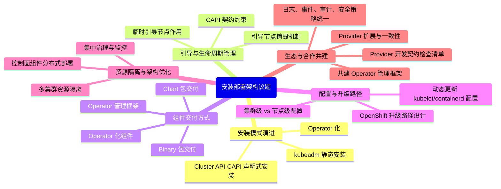
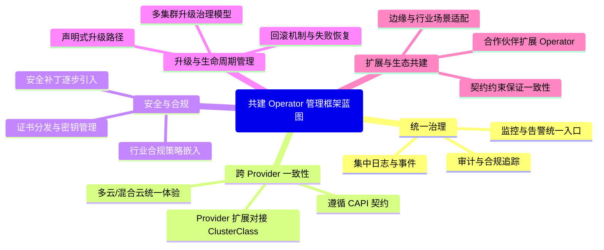
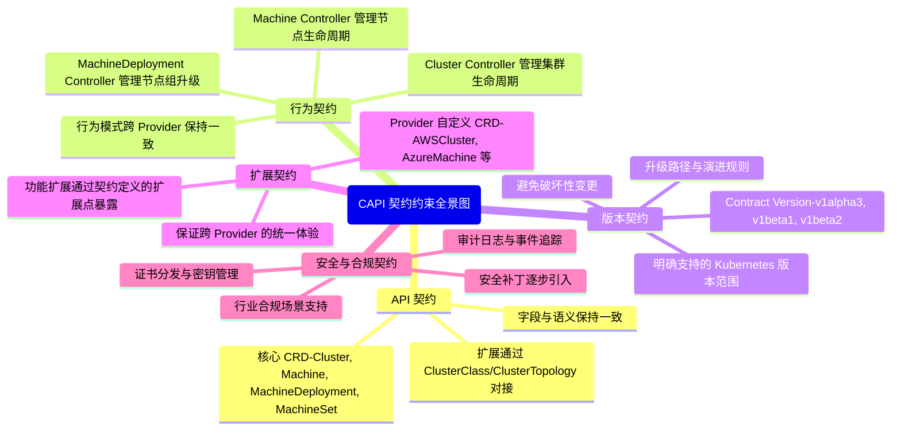

# sig-installation目标
在大会上明确 **openFuyao 社区 sig-installation 的目标**，可以帮助合作伙伴和社区成员在安装与部署架构领域形成统一方向。下面是一个完整的目标框架：  
## 🧩 sig-installation 的目标框架
- **安装模式演进**  
  - 推动从 kubeadm → Operator → Cluster API (CAPI) 的演进。  
  - 提供跨场景的安装模式参考（开发测试、生产、边缘、多云）。  
- **自动化与 GitOps**  
  - 避免手动部署，全面采用 GitOps 自动化。  
  - 推动 ArgoCD、Flux 等工具在安装与配置同步中的标准化应用。  
- **版本升级与兼容性**  
  - 制定升级路径与版本 skew 检查清单。  
  - 保证核心组件（API Server、kubelet、kube-proxy、kubectl）的兼容性。  
  - 提供回滚机制与安全补丁引入策略。  
- **Provider 扩展与一致性**  
  - 明确 Provider 扩展的契约约束（API、行为、版本、扩展、安全）。  
  - 保证跨 Provider 的一致性，避免语义差异。  
- **共建 Operator 管理框架**  
  - 建立统一的 Operator 管理框架，集中治理日志、事件、审计与监控。  
  - 支持多集群、多环境的统一升级与生命周期管理。  
- **安全与合规**  
  - 在安装与升级过程中嵌入安全策略（证书分发、密钥管理、审计日志）。  
  - 满足金融、医疗、政府等行业的合规要求。  
- **生态与社区共建**  
  - 提供契约检查清单，指导合作伙伴扩展 Provider 与 Operator。  
  - 推动跨云、边缘、行业场景的联合适配。  
  - 形成长期可持续的安装部署生态。  
## 🔄 总结
**openFuyao 社区 sig-installation 的目标**可以概括为：  
1. **技术演进** → 安装模式、自动化、升级路径。  
2. **一致性保障** → Provider 契约、Operator 框架。  
3. **安全合规** → 证书、密钥、审计与行业合规。  
4. **生态共建** → 合作伙伴扩展与社区治理。  

👉 换句话说，sig-installation 的使命就是：**推动安装部署架构从分散工具链走向统一治理平台**，同时保证 **一致性、安全性与生态可持续性**。  

# sig-installation 行动路线图
下面是一份 **openFuyao 社区 sig-installation 行动路线图**，将目标分为短期、中期、长期三个阶段，帮助在 KADC 大会上明确推进节奏。  
## 🧩 sig-installation 行动路线图
### **短期目标**
- 制定安装模式演进的参考架构（kubeadm → Operator → CAPI）。  
- 建立 **版本升级与兼容性检查清单**（version skew、组件兼容性）。  
- 推动 **GitOps 自动化** 在安装与配置同步中的落地（ArgoCD、Flux）。  
- 明确 Provider 扩展的基本契约约束（API、行为、版本）。  
- 在安装与升级过程中嵌入基础安全策略（证书分发、密钥管理）。  
### **中期目标**
- 共建 **Operator 管理框架**，集中治理日志、事件、审计与监控。  
- 推动 **多集群、多环境统一治理**（ApplicationSet、ClusterClass）。  
- 制定 **升级路径与回滚机制**，保证生产环境稳定性。  
- 推动 Provider 扩展的一致性检查清单，避免跨 Provider 语义差异。  
- 在 GitOps 流程中嵌入 **安全合规策略**（OPA/Gatekeeper）。  
### **长期目标**
- 建立跨云/混合云环境的统一安装与升级框架。  
- 推动边缘计算场景的轻量化安装与升级机制。  
- 满足金融、医疗、政府等行业的合规要求，形成 **行业适配标准**。  
- 共建 **生态合作伙伴扩展体系**，支持 Provider 与 Operator 的长期演进。  
- 形成 **sig-installation 社区治理模型**，推动长期可持续发展。  
## 🔄 总结
这份路线图明确了 **sig-installation 的行动节奏**：  
- **短期** → 聚焦安装模式、GitOps 自动化、版本兼容性、安全基础。  
- **中期** → 推动 Operator 框架、多集群治理、升级路径与合规策略。  
- **长期** → 构建跨云、边缘、行业合规的统一生态，共建社区治理模型。  

👉 换句话说，sig-installation 的路线图就是从 **技术落地 → 框架治理 → 生态共建** 的逐步演进过程。  

# sig-installation 技术目标优先级表
下面是一份 **openFuyao 社区 sig-installation 技术目标优先级表**，将目标按 **短期 → 中期 → 长期** 的递进关系梳理，并结合 KADC 大会的讨论重点，帮助形成统一的技术共识。  
## 🧩 sig-installation 技术目标优先级表
| 优先级层次 | 具体目标 | 说明 |
|------------|----------|------|
| **短期目标** | - 安装模式演进（kubeadm → Operator → CAPI） - 全面采用 GitOps 自动化（ArgoCD、Flux） - 制定版本升级与兼容性检查清单（version skew） - 嵌入基础安全策略（证书分发、密钥管理） | 聚焦生产环境的直接痛点，确保安装与升级过程安全、可控、可追溯。 |
| **中期目标** | - 共建 Operator 管理框架，集中治理日志、事件、审计与监控 - 推动多集群、多环境统一治理（ClusterClass、ApplicationSet） - 制定声明式升级路径与回滚机制 - 明确 Provider 契约约束（API、行为、版本、扩展、安全） - 在 GitOps 流程中嵌入安全合规策略（OPA/Gatekeeper） | 关注生态一致性和跨 Provider 的契约治理，推动统一的安全与合规策略。 |
| **长期目标** | - 建立跨云/混合云环境的统一安装与升级框架 - 推动边缘计算场景的轻量化安装与升级机制 - 满足金融、医疗、政府等行业的合规要求，形成行业适配标准 - 共建生态合作伙伴扩展体系，支持 Provider 与 Operator 的长期演进 - 形成 sig-installation 社区治理模型，推动长期可持续发展 | 面向未来的战略方向，强调生态共建、合规治理和跨场景适配。 |
## 🔄 总结
这份优先级表明确了 **sig-installation 的技术演进路径**：  
1. **短期** → 技术落地：安装模式、GitOps 自动化、版本兼容、安全基础。  
2. **中期** → 框架治理：Operator 框架、多集群治理、契约一致性、安全策略。  
3. **长期** → 生态共建：跨云、边缘、行业合规、社区治理。  

👉 换句话说，sig-installation 的目标就是从 **技术落地 → 框架治理 → 生态共建** 逐步递进，确保安装部署架构在 KADC 大会上形成统一共识并具备长期可持续性。  

# K8s 集群安装部署架构演进
围绕 **K8s 集群安装部署架构演进**，与合作伙伴共建时可以展开的讨论点主要集中在 **架构模式、生态兼容、治理与运维** 等几个维度。  
## 🧩 讨论点整理
- **安装模式演进**  
  - 从最初的 kubeadm 静态安装 → 到 Operator 化 → 再到 Cluster API (CAPI) 的声明式安装。  
  - 讨论如何在不同规模（小型集群 vs 大型企业集群）中选择合适的安装模式。  
- **引导与生命周期管理**  
  - 临时引导节点（Bootstrap Cluster）的作用与销毁机制。  
  - 生命周期契约（CAPI Contract）的约束如何保证跨 Provider 的一致性。  
- **组件交付方式**  
  - Chart 与 Binary 双模式支持的价值。  
  - Operator 化组件的好处，以及如何通过 Operator 管理框架统一治理。  
- **配置与升级路径**  
  - 动态更新 kubelet/containerd 配置（区分集群级与节点级）的灵活性。  
  - OpenShift 升级路径设计的稳定性、安全性与合规性。  
- **资源隔离与架构优化**  
  - 将 controller-manager、scheduler、api-server 分布在不同标签节点的好处。  
  - 如何在多集群环境下实现资源隔离与集中治理。  
- **生态与合作共建**  
  - Provider 开发的契约检查清单，如何保证跨云一致性。  
  - 合作伙伴如何在 CAPI 契约框架下扩展自己的 Provider。  
  - 共建 Operator 管理框架，统一日志、事件、审计与安全策略。  
## 🔄 总结
在 KADC 大会上，**安装部署架构演进的讨论点**可以围绕：  
1. **安装模式** → kubeadm → Operator → CAPI。  
2. **生命周期管理** → 引导节点与契约约束。  
3. **交付方式** → Chart 与 Binary 双模式。  
4. **配置与升级** → 动态更新与路径设计。  
5. **资源隔离** → 控制面组件分布式部署。  
6. **生态共建** → Provider 契约与 Operator 框架。  

👉 换句话说，这些讨论点既涵盖了 **技术演进**，也体现了 **合作伙伴共建的价值**，能帮助形成一个 **统一、可扩展、合规的安装部署生态**。  

# 安装部署架构议题地图
用分层结构直观展示各个讨论点，方便在大会上组织议题。  

## 🧩 图解说明
- **安装模式演进**：从 kubeadm → Operator → CAPI 的路径，讨论不同规模场景下的适配。  
- **引导与生命周期管理**：临时引导节点的作用、销毁机制，以及 CAPI 契约如何保证一致性。  
- **组件交付方式**：Chart 与 Binary 双模式的价值，Operator 化与统一管理框架的好处。  
- **配置与升级路径**：动态配置更新与 OpenShift 升级路径的稳定性、安全性。  
- **资源隔离与架构优化**：控制面组件分布式部署、多集群治理。  
- **生态与合作共建**：Provider 契约、扩展一致性，以及共建 Operator 管理框架。  

# 版本升级路径与版本、组件兼容性议题

## 🧩 讨论点整理
- **版本升级路径设计**  
  - 短跳升级 vs 长跳升级的风险与收益。  
  - 如何保证升级路径的稳定性与可预测性。  
  - 回滚机制与失败恢复策略。  
- **核心组件兼容性**  
  - etcd、API Server、Controller Manager、Scheduler 等核心组件的版本匹配要求。  
  - kubelet 与 container runtime（如 containerd、CRI-O）的兼容性。  
  - Operator 与 CRD 的版本演进契约。  
- **CAPI 契约约束**  
  - Provider 必须遵循的 API 契约、行为契约和版本契约。  
  - 如何保证跨 Provider 的一致性和升级路径的可行性。  
  - 契约版本（v1alpha → v1beta → v1）的演进规则。  
- **安全与合规**  
  - 升级过程中证书、密钥的安全分发。  
  - 安全补丁的逐步引入与验证。  
  - 审计日志与事件追踪，保证升级过程可追溯。  
- **合作伙伴共建价值**  
  - 不同合作伙伴在 Provider 开发、Operator 框架、升级工具链上的分工与协作。  
  - 共建统一的升级治理模型，避免碎片化。  
  - 在多云、边缘、行业合规场景下的联合适配。  
## 🔄 总结
在 KADC 大会上，关于 **版本升级路径与组件兼容性** 的讨论点可以概括为：  
1. **升级路径** → 稳定性、回滚机制、短跳 vs 长跳。  
2. **组件兼容性** → 核心组件、运行时、Operator 与 CRD。  
3. **契约约束** → CAPI 的 API/行为/版本契约。  
4. **安全合规** → 证书、补丁、审计与追溯。  
5. **合作伙伴共建** → Provider、Operator 框架、治理模型。  

👉 换句话说，这些议题能帮助合作伙伴在 **技术演进、生态协作、安全合规** 三个维度形成共识，推动安装部署架构的长期可持续发展。  

## 🧩 版本升级与兼容性议题优先级表
| 层次 | 重点议题 | 说明 |
|------|----------|------|
| **短期可落地** | - 升级路径稳定性与回滚机制 - etcd 与 API Server 版本匹配 - kubelet 与 container runtime（containerd/CRI-O）兼容性 - 安装过程中的证书分发与密钥管理 | 聚焦生产环境的直接痛点，确保升级过程安全、可控、可恢复。 |
| **中期演进** | - Operator 与 CRD 的版本演进契约 - Cluster API (CAPI) 契约版本演进（v1alpha → v1beta → v1） - 多集群升级治理模型 - 安全补丁的逐步引入与验证 | 关注生态一致性和跨 Provider 的兼容性，推动统一治理与安全策略。 |
| **长期战略** | - 跨云/多云环境下的统一升级路径 - 边缘计算场景的轻量化升级机制 - 行业合规场景下的审计与安全策略嵌入 - 合作伙伴共建统一的升级工具链与框架 | 面向未来的战略方向，强调生态共建、合规治理和跨场景适配。 |
### 🔄 总结
这份优先级表帮助合作伙伴：  
1. **短期** → 聚焦生产环境的稳定性与安全。  
2. **中期** → 推动生态一致性与跨 Provider 契约。  
3. **长期** → 共建跨云、边缘、合规的统一升级框架。  

👉 换句话说，这份表既能指导 **近期落地行动**，也能为 **长期战略共建**提供方向。  

# Provider 扩展与一致性
在 **Cluster API (CAPI)** 的生态中，**Provider 扩展与一致性** 是合作伙伴共建时必须重点讨论的议题。它既涉及技术契约，也关系到生态的长期可持续性。  
## 🧩 Provider 扩展的核心点
- **扩展 CRD**  
  每个 Provider 可以定义自己的 CRD（如 AWSCluster、AzureMachine、BareMetalMachine），以支持特定平台的功能。  
  但这些扩展必须通过 **ClusterClass / ClusterTopology** 与核心契约对接，避免破坏一致性。  

- **控制器扩展**  
  Provider 可以实现自己的控制器逻辑（如云资源创建、网络配置），但必须遵循 CAPI 的行为契约：  
  - Cluster Controller → 管理集群生命周期。  
  - Machine Controller → 管理节点生命周期。  
  - MachineDeployment Controller → 管理节点组升级。  
- **功能扩展**  
  Provider 可以增加特定功能（如云安全组、负载均衡、存储卷），但必须通过契约定义的扩展点暴露，保证跨 Provider 的一致性。  
## 🧩 一致性保障
- **API 契约一致性**  
  所有 Provider 必须实现核心 CRD 的字段和语义，保证用户在不同 Provider 间迁移时不会遇到语义差异。  

- **版本契约一致性**  
  Provider 必须声明支持的 Contract Version（如 v1beta1、v1beta2），并保证在契约范围内兼容。升级路径必须遵循契约演进规则。  

- **行为契约一致性**  
  不同 Provider 的控制器行为必须一致，避免出现“同样的 API 在不同 Provider 下表现不同”的情况。  

- **安全与合规一致性**  
  Provider 必须支持统一的安全策略（证书分发、密钥管理、审计日志），保证跨云环境下的合规性。  
## 🔄 总结
**Provider 扩展与一致性** 的核心在于：  
1. **扩展** → Provider 可以增加平台特定功能。  
2. **一致性** → 必须遵循 CAPI 契约，保证跨 Provider 的统一体验。  
3. **安全合规** → 扩展必须嵌入统一的安全与治理框架。  

👉 换句话说，**扩展是自由的，但一致性是必须的**。这也是合作伙伴在 KADC 大会上共建时的关键共识。  

# 共建 Operator 管理框架
**共建 Operator 管理框架** 是一个非常有价值的议题。它不仅能提升 Kubernetes 集群的安装与运维效率，还能在生态层面实现 **一致性、安全性与可扩展性**。  
## 🧩 共建 Operator 管理框架的核心讨论点
- **统一治理**  
  - 将不同组件的 Operator 纳入统一框架，避免碎片化。  
  - 提供集中化的日志、事件、审计与监控能力。  
- **跨 Provider 一致性**  
  - 不同云 Provider 的 Operator 必须遵循统一的契约。  
  - 保证在多云/混合云场景下，用户体验一致。  
- **安全与合规**  
  - Operator 框架统一接入证书分发、密钥管理。  
  - 支持行业合规场景下的审计与安全策略嵌入。  
- **升级与生命周期管理**  
  - Operator 负责组件的声明式升级，保证路径稳定。  
  - 提供回滚机制，避免升级失败导致集群不可用。  
- **扩展与生态共建**  
  - 合作伙伴可以在框架内扩展自己的 Operator。  
  - 通过契约保证扩展不会破坏整体一致性。  
  - 形成一个可持续的生态，支持边缘、行业合规等场景。  
## ⚙️ 好处总结
1. **一致性** → 不同 Provider 与组件在统一框架下治理。  
2. **安全性** → 统一证书、密钥、审计策略。  
3. **可扩展性** → 合作伙伴可扩展 Operator，但不破坏契约。  
4. **可治理性** → 集中化日志、事件、监控，提升运维效率。  
5. **可升级性** → Operator 驱动的声明式升级与回滚机制。  
## 🔄 总结
**共建 Operator 管理框架** 是合作伙伴在大会上的关键议题，它能让安装部署架构从“分散的工具链”演进为“统一的治理平台”。这不仅解决了 **一致性与安全问题**，还为未来的 **多云、边缘、合规场景** 打下基础。  
## **共建 Operator 管理框架蓝图**
它将治理、安全、升级、扩展四大维度整合在一起，形成一个可供合作伙伴在大会上共建的整体架构思路。  

### 🧩 蓝图说明
- **统一治理**：集中化日志、事件、审计与监控，避免 Operator 碎片化。  
- **跨 Provider 一致性**：所有 Provider 的 Operator 遵循 CAPI 契约，保证多云场景下的统一体验。  
- **安全与合规**：框架内置证书分发、密钥管理、审计追踪，满足金融、医疗、政府等行业合规要求。  
- **升级与生命周期管理**：Operator 驱动声明式升级，支持回滚与多集群治理。  
- **扩展与生态共建**：合作伙伴可扩展 Operator，但必须通过契约保持一致性，支持边缘与行业场景。  
### 🔄 总结
这份蓝图展示了一个 **统一、可扩展、安全合规的 Operator 管理框架**，它能让合作伙伴在 KADC 大会上形成共识：  
1. **技术层面** → Operator 驱动的治理、升级、扩展。  
2. **安全层面** → 证书、密钥、审计与合规策略统一。  
3. **生态层面** → Provider 扩展与契约一致性，共建跨云与边缘场景。  

👉 换句话说，这份蓝图就是 **K8s 安装部署架构演进的治理核心**，能帮助合作伙伴共建一个长期可持续的生态。  

# 契约约束（Contract Constraints
在 **Cluster API (CAPI)** 的设计中，所谓的 **契约约束（Contract Constraints）** 是保证跨版本、跨 Provider 一致性和可升级性的核心机制。它规定了 API、行为和版本的边界，确保生态的长期稳定。  
## 🧩 CAPI 契约约束的核心内容
- **API 契约**  
  - 定义核心 CRD（Cluster、Machine、MachineDeployment、MachineSet）的结构和语义。  
  - 保证这些 API 在不同 Provider 和版本之间保持兼容。  
  - 禁止随意修改核心字段，扩展必须通过 ClusterClass/ClusterTopology 对接。  
- **行为契约**  
  - 规定控制器的职责和行为模式：  
    - Cluster Controller → 管理集群生命周期。  
    - Machine Controller → 管理节点生命周期。  
    - MachineDeployment Controller → 管理节点组升级。  
  - 保证不同 Provider 的控制器行为一致，避免语义差异。  
- **版本契约**  
  - 使用 Contract Version（如 v1alpha3、v1beta1、v1beta2）定义 API 和行为的稳定性。  
  - 每个契约版本明确支持的 Kubernetes 版本范围和升级路径。  
  - 升级必须遵循契约演进规则，避免破坏性变更。  
- **扩展契约**  
  - Provider 可以扩展自己的 CRD（如 AWSCluster、AzureMachine），但必须与核心契约保持一致。  
  - 扩展功能必须通过契约定义的扩展点暴露，保证跨 Provider 的统一体验。  
- **安全与合规契约**  
  - 契约要求 Provider 在安装和升级过程中支持统一的安全策略：  
    - 证书分发与密钥管理。  
    - 审计日志与事件追踪。  
    - 安全补丁的逐步引入。  
  - 保证跨云环境下的合规性和可追溯性。  
## ⚙️ 契约约束的好处
1. **一致性** → 不同 Provider 遵循相同契约，用户体验统一。  
2. **可升级性** → 契约定义演进规则，避免升级断层。  
3. **可扩展性** → Provider 可扩展功能，但不破坏核心生态。  
4. **安全合规** → 契约嵌入统一的安全策略，满足行业要求。  
5. **可预测性** → 用户清楚知道某个契约版本支持哪些功能和 Kubernetes 版本。  
## 🔄 总结
**CAPI 契约约束是整个生态的“游戏规则”**：它规定了 API、行为、版本、扩展和安全的边界，保证跨 Provider 的一致性和跨版本的可升级性。  
## CAPI 契约约束全景图
用分层结构直观展示 API、行为、版本、扩展、安全五大维度的关系，帮助在合作伙伴共建时形成统一理解。  

### 🧩 图解说明
- **API 契约**：定义核心 CRD 的结构与语义，扩展必须通过标准接口对接。  
- **行为契约**：规定控制器的职责，保证跨 Provider 行为一致。  
- **版本契约**：通过 Contract Version 管理 API 与行为的演进，确保升级路径稳定。  
- **扩展契约**：允许 Provider 增加特定功能，但必须保持与核心契约一致。  
- **安全与合规契约**：嵌入统一的安全策略，满足跨云与行业合规要求。  
### 🔄 总结
这份全景图展示了 **CAPI 契约约束的五大维度**，它们共同构成了跨 Provider、跨版本的统一规则体系。  
👉 换句话说，**扩展是自由的，但一致性与安全是必须的**，这是合作伙伴在 KADC 大会上共建时的关键共识。  

