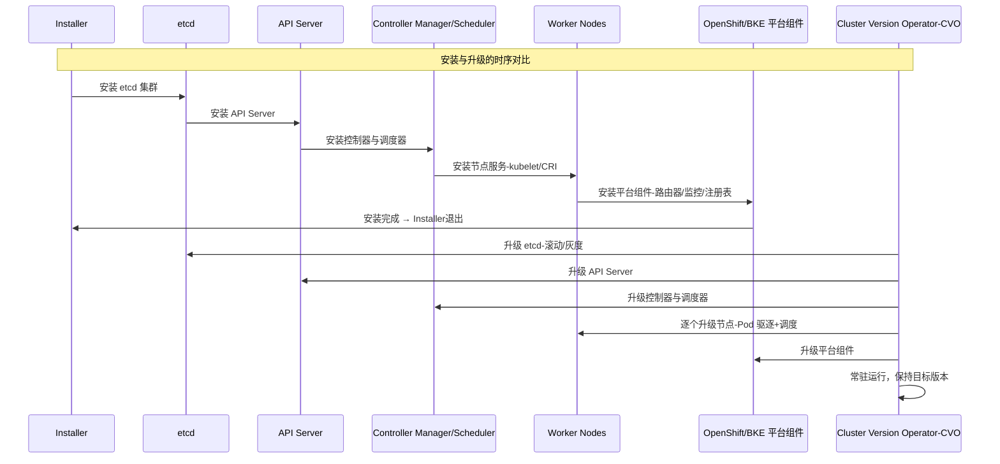

# KEPU-2: 基于 ClusterVersion/ReleaseImage/ComponentVersion/NodeConfig 的声明式集群版本管理
| 字段 | 值 |
|------|-----|
| **KEPU编号** | KEPU-2 |
| **标题** | 声明式集群版本管理：YAML 配置驱动的安装、升级与扩缩容 |
| **状态** | Provisional |
| **类型** | Enhancement |
| **作者** | openFuyao Team |
| **创建日期** | 2026-04-22 |
| **依赖** | KEPU-1（整体架构重构） |
## 1. 摘要
本提案设计基于六个 CRD（ClusterVersion、ReleaseImage、ComponentVersion、ComponentVersionBinding、UpgradePath、NodeConfig）的声明式集群版本管理方案。

**核心变化**：各 Phase 的安装、升级、卸载逻辑全部通过 YAML 配置声明，由通用 ActionEngine 解释执行，**不再为每个组件编写 Go 代码实现**。

**设计原则**：
- **配置即代码**：组件生命周期（安装/升级/卸载/健康检查）全部声明在 ComponentVersion YAML 中
- **通用引擎**：ActionEngine 是唯一的执行器，解释 YAML 中的 Action 定义并执行
- **零组件代码**：不编写组件特定的 Go Executor，所有行为由 YAML 驱动
- **模板化**：脚本和 manifest 支持模板变量（`{{.Version}}`、`{{.NodeIP}}` 等），运行时渲染
- **关注点分离**：ComponentVersion 定义"能力"（能做什么），ComponentVersionBinding 表达"意图"（要做什么）
## 2. 动机
### 2.1 现有架构问题
| 问题 | 现状 | 影响 |
|------|------|------|
| **版本概念缺失** | BKECluster 仅记录 KubernetesVersion/EtcdVersion/ContainerdVersion/OpenFuyaoVersion | 无整体版本概念，无法回答"集群当前是什么版本" |
| **发布清单缺失** | 组件版本散落在 BKECluster Spec 各字段 | 无法追溯某个版本包含哪些组件及版本 |
| **命令式编排** | 各 Phase 通过 `NeedExecute` + 固定顺序执行 | 无法并行、无法跳过、无法回滚 |
| **组件独立演进受限** | Phase 之间硬编码依赖，升级路径固定 | 无法独立升级单个组件，无法 A/B 测试 |
| **安装逻辑与编排耦合** | Phase 代码既包含编排逻辑又包含安装逻辑 | 无法复用安装逻辑，无法独立测试 |
| **扩缩容与升级耦合** | EnsureWorkerDelete/EnsureMasterDelete 与升级 Phase 混在一起 | 缩容逻辑无法独立演进 |
| **升级卸载旧组件缺失** | 升级时直接覆盖安装，无旧版本卸载流程 | 旧版本残留文件/配置可能导致冲突 |
### 2.2 OpenShift CVO 的启发
OpenShift 的 Cluster Version Operator（CVO）采用以下架构：
```
ClusterVersion (集群版本)
    └── desiredUpdate.release (Release Image 引用)
            └── Release Payload (容器镜像)
                    └── release-manifests/ (组件manifest清单)
```
**借鉴点**：
1. ClusterVersion 作为集群版本的全局入口
2. ReleaseImage 作为版本清单的载体（不可变）
3. 组件 manifest 声明式定义，CVO 自动编排
4. 升级路径显式声明，支持兼容性检查

**差异点**：
1. OpenShift 使用容器镜像作为 Release Payload，我们使用 ReleaseImage CRD
2. OpenShift 的 manifest 是原生 Kubernetes 资源，我们需要支持 Script/Manifest/Helm/Controller 四种执行方式
3. OpenShift 的组件是 Operator，我们的组件包括节点级和集群级两种
4. 我们需要支持升级时先卸载旧组件再安装新组件的流程
## 3. 目标
### 3.1 主要目标
1. 定义 ClusterVersion、ReleaseImage、ComponentVersion、ComponentVersionBinding、UpgradePath、NodeConfig 六个 CRD 及其关联关系
2. 实现 ClusterVersion 控制器：管理集群版本生命周期（安装→升级→回滚），编排 ComponentVersionBinding，集成 UpgradePath 验证
3. 实现 ReleaseImage 控制器：验证发布清单，生成 ComponentVersion 列表
4. 实现 ComponentVersion 控制器：定义组件能力目录（installAction/upgradeAction/uninstallAction）
5. 实现 ComponentVersionBinding 控制器：执行组件生命周期操作（安装/升级/卸载/健康检查）
6. 实现 UpgradePath 控制器：管理升级路径的生命周期（验证/阻止/废弃/发现）
7. 实现 NodeConfig 控制器：管理节点组件的安装/升级/卸载，触发 ComponentVersionBinding 节点级操作
8. 将现有 PhaseFrame 各 Phase 重构为 ComponentVersion 声明式架构
9. 实现升级时先卸载旧组件再安装新组件的完整流程
### 3.2 非目标
1. 不实现 OpenShift 式的 Release Image 容器镜像载体（使用 CRD 替代）
2. 不实现多集群版本管理（仅单集群）
3. 不实现 OS 级别的版本管理（由 OSProvider 独立负责）
4. 不实现版本包的构建与发布流程（由 CI/CD 独立负责）
5. 不修改现有 BKECluster CRD 的 Spec 定义
## 4. 范围
### 4.1 在范围内
| 范围 | 说明 |
|------|------|
| CRD 定义与注册 | 六个核心 CRD 的 API 定义 |
| 控制器实现 | 六个控制器的 Reconcile 逻辑 |
| ActionEngine | 通用执行引擎，解释执行 YAML 中的 Action 定义 |
| Phase→ComponentVersion 迁移 | 20+ 个 Phase 到 ComponentVersion 的映射与迁移 |
| DAG 调度 | 组件依赖图与调度算法 |
| 版本升级流程 | PreCheck→UninstallOld→Upgrade→PostCheck→Rollback |
| 扩缩容流程 | NodeConfig 增删触发组件安装/卸载 |
| 关注点分离 | ComponentVersion（能力定义）与 ComponentVersionBinding（运行时意图）分离 |
### 4.2 不在范围内
| 范围 | 原因 |
|------|------|
| 版本包构建 | CI/CD 流程独立 |
| 多集群管理 | 超出单集群版本管理范围 |
| OS 版本管理 | 由 OSProvider 独立负责 |
| UI/CLI 交互 | 仅定义 API，不涉及前端 |
## 5. 约束
| 约束 | 说明 |
|------|------|
| **向后兼容** | 必须支持从现有 PhaseFrame 平滑迁移，不能破坏现有集群 |
| **Feature Gate** | 新架构通过 Feature Gate 开关控制，默认关闭 |
| **单集群单 ClusterVersion** | 每个集群仅允许一个 ClusterVersion 实例 |
| **1:1 ReleaseImage** | 每个 ClusterVersion 仅关联一个 ReleaseImage |
| **ReleaseImage 不可变** | 创建后不可修改，确保版本清单一致性 |
| **组件不可降级** | 默认不允许组件版本降级，除非显式设置 allowDowngrade |
| **离线环境** | 必须支持离线环境，所有资源通过 CRD 定义 |
| **性能** | 控制器 Reconcile 周期不超过 30s，升级单节点不超过 10min |
| **ActionEngine 唯一执行路径** | 不绕过引擎直接操作 |
## 6. 场景
### 6.1 场景一：全新集群安装
```txt
用户创建 BKECluster
    → BKEClusterReconciler 创建 ClusterVersion（引用 ReleaseImage）
        → ClusterVersion 控制器解析 ReleaseImage
            → 为每个组件创建 ComponentVersionBinding（spec.desiredVersion = 组件版本）
            → DAGScheduler 计算安装顺序，按序更新 Binding
                → ComponentVersionBinding 控制器检测 desiredVersion != installedVersion
                    → 通过 componentVersionRef 找到 ComponentVersion
                    → 从 ComponentVersion.versions[] 中查找对应版本的 installAction
                    → 执行 installAction（YAML 声明）
                    → 健康检查（YAML 声明）
                → Node 级组件：NodeConfig 控制器在对应节点上触发安装
                → 全部组件完成 → ClusterVersion 更新 currentVersion
```
### 6.2 场景二：集群版本升级（含旧组件卸载）
```txt
用户修改 ClusterVersion.spec.desiredVersion = "v2.6.0"
    │
    ├── ClusterVersion Controller
    │   ├── 查找新 ReleaseImage → 解析新组件版本列表
    │   └── 按升级 DAG 逐步更新 ComponentVersionBinding.spec.desiredVersion
    │       （仅修改 desiredVersion 字段，不触碰 ComponentVersion）
    │
    ├── ComponentVersionBinding Controller（监听 desiredVersion 变化）
    │   ├── 检测 spec.desiredVersion != status.installedVersion
    │   ├── 通过 spec.componentVersionRef 找到 ComponentVersion
    │   ├── 从 ComponentVersion.spec.versions[] 中查找对应版本的 upgradeAction
    │   ├── 查找旧版本：
    │   │   └── ClusterVersion.status.currentReleaseRef
    │   │       → 旧 ReleaseImage
    │   │         → 旧 ComponentVersion
    │   │           → 旧版本 uninstallAction
    │   ├── 执行旧版本 uninstallAction（YAML 声明）
    │   ├── 执行新版本 upgradeAction（YAML 声明）
    │   └── 健康检查（YAML 声明）
    │
    └── 全部组件完成 → ClusterVersion 更新 currentVersion
```
### 6.3 场景三：单组件独立升级
```txt
用户修改 ComponentVersionBinding.spec.desiredVersion
    → ComponentVersionBinding 控制器检测 desiredVersion != installedVersion
        → 通过 componentVersionRef 找到 ComponentVersion
        → 从 ComponentVersion.spec.versions[] 中查找目标版本的 upgradeAction
        → 执行 PreCheck（YAML 声明）
        → 查找旧版本 uninstallAction（通过 ClusterVersion.currentReleaseRef → 旧 ReleaseImage → 旧 ComponentVersion）
        → 执行旧版本 uninstallAction（YAML 声明）
        → 执行新版本 upgradeAction（YAML 声明）
        → 执行 PostCheck / 健康检查（YAML 声明）
        → 更新 ComponentVersionBinding.status.installedVersion
            → ClusterVersion 控制器检测到 Binding 状态变更，更新 ClusterVersion.Status 中的组件版本
```
### 6.4 场景四：节点扩容
```txt
用户在 BKECluster.Spec 中添加新节点
    → BKEClusterReconciler 创建最小化 NodeConfig（不含 Components）
        → BKEClusterReconciler 触发 cluster-api 创建 Machine 资源
            ├── Master 节点：增加 KubeadmControlPlane replicas
            └── Worker 节点：增加 MachineDeployment replicas
                → NodeConfig 控制器检测到新节点（Components 为空）
                    → 从 ReleaseImage 按 Role 填充 NodeConfig.Spec.Components
                        → NodeConfig 控制器更新各 ComponentVersionBinding.nodeStatuses[新节点] = Pending
                            → ComponentVersionBinding 控制器检测到新节点状态
                                → 通过 componentVersionRef 找到 ComponentVersion
                                → 执行 installAction（YAML 声明）
                                    → 所有组件安装完成 → NodeConfig Phase=Ready
```
### 6.5 场景五：节点缩容
```txt
用户从 BKECluster.Spec 中删除节点
    → BKEClusterReconciler 标记 NodeConfig Phase=Deleting
        → NodeConfig 控制器按依赖逆序更新各 ComponentVersionBinding.nodeStatuses[节点] = Uninstalling
            → ComponentVersionBinding 控制器检测到节点卸载状态
                → 通过 componentVersionRef 找到 ComponentVersion
                → 执行 uninstallAction（YAML 声明）
                    → 所有组件卸载完成后
                        → NodeConfig 控制器触发 cluster-api 清理 Machine 资源
                            ├── Master 节点：减少 KubeadmControlPlane replicas
                            ├── Worker 节点：减少 MachineDeployment replicas
                            └── 删除 Machine 对象
                                → 移除 NodeConfig Finalizer
                                    → NodeConfig CR 被垃圾回收
```
**扩缩容对称性**：
```
扩容：创建 NodeConfig → 创建 Machine → 填充 Components → 安装组件 → Ready
缩容：标记 Deleting → 卸载组件 → 删除 Machine → 移除 Finalizer → 回收
```
两者都包含 cluster-api Machine 资源的操作，且顺序正确：扩容先创建 Machine 再安装组件，缩容先卸载组件再删除 Machine。
### 6.6 场景六：升级回滚
```txt
ComponentVersionBinding 升级失败
    → ComponentVersionBinding 控制器标记 Phase=UpgradeFailed
        → ClusterVersion 控制器检测到失败
            → 根据 UpgradeStrategy.AutoRollback 决定是否自动回滚
                → ClusterVersion 控制器将 ComponentVersionBinding.spec.desiredVersion 回退到旧版本
                    → ComponentVersionBinding 控制器检测 desiredVersion 变化
                        → 通过 componentVersionRef 找到 ComponentVersion
                        → 从 ComponentVersion.spec.versions[] 中查找 rollbackAction
                        → 执行 rollbackAction（YAML 声明）
                            → 回滚到上一个已知良好版本
```
### 6.7 场景七：纳管现有集群
```txt
用户创建 BKECluster（spec.manageMode=Import）
    → ClusterVersion 控制器创建 clusterManage ComponentVersionBinding
        → ComponentVersionBinding 控制器检测 desiredVersion != installedVersion
            → 通过 componentVersionRef 找到 ComponentVersion
            → 从 ComponentVersion.spec.versions[] 中查找 installAction
            → 执行 installAction（YAML 声明）
                → 收集集群信息 → 推送 Agent → 伪引导 → 兼容性补丁
```
## 7. 提案
### 7.1 资源关联关系
```txt
┌─────────────────────────────────────────────────────────────────┐
│                        BKECluster                               │
│  (集群实例，1:1 对应 ClusterVersion)                             │
└──────────────────────────┬──────────────────────────────────────┘
                           │ 1:1
                           ▼
┌──────────────────────────────────────────────────────────────────┐
│                      ClusterVersion                              │
│  (集群版本，记录当前版本/目标版本/升级历史)                         │
│                                                                  │
│  spec.releaseRef ──────────┐                                     │
│  spec.desiredVersion       │                                     │
│  status.currentVersion     │                                     │
│  status.currentReleaseRef ─┼─────┐                               │
└────────────────────────────┼─────┼───────────────────────────────┘
                             │ 1:1 │
                             ▼     │
┌────────────────────────────────────────────────────────────────┐
│                       ReleaseImage                             │
│  (发布版本清单，不可变，定义该版本包含哪些组件及版本)              │
│                                                                │
│  spec.components:                                              │
│    - name: etcd        ────────┐                               │
│      version: v3.5.12          │                               │
│      componentVersionRef:      │                               │
│        name: etcd-v3.5.12      │                               │
│    - name: containerd  ────┐   │                               │
│      version: v1.7.2       │   │                               │
│    - name: kubernetes  ─┐  │   │                               │
│      version: v1.29.0   │  │   │                               │
└─────────────────────────┼──┼───┼───────────────────────────────┘
                          │  │   │
                          │  │   │  引用组件版本
                          ▼  ▼   ▼
┌──────────────────────────────────────────────────────────────────┐
│                    ComponentVersion                              │
│  (组件能力目录，相对不可变，定义安装/升级/回滚/卸载动作)             │
│  (可被多个集群共享)                                               │
│                                                                  │
│  spec.componentName: etcd                                        │
│  spec.scope: Node                                                │
│  spec.dependencies: [nodesEnv]                                   │
│  spec.versions:                                                  │
│    - version: v3.5.11                                            │
│      installAction: {...}                                        │
│      uninstallAction: {...}                                      │
│    - version: v3.5.12                                            │
│      installAction: {...}                                        │
│      upgradeFrom:                                                │
│        - fromVersion: v3.5.11                                    │
│          upgradeAction: {...}                                    │
│      rollbackAction: {...}                                       │
│      uninstallAction: {...}                                      │
│      compatibility: {...}                                        │
│  spec.healthCheck: {...}                                         │
└──────────────────────────┬───────────────────────────────────────┘
                           │ 被引用
                           ▼
┌──────────────────────────────────────────────────────────────────┐
│               ComponentVersionBinding                            │
│  (运行时绑定，频繁可变，定义集群中组件的目标版本和运行状态)           │
│  (每集群独立)                                                     │
│                                                                  │
│  spec.componentVersionRef:                                       │
│    name: etcd-v3.5.12                                            │
│  spec.desiredVersion: v3.5.12     ← 仅修改此字段触发升级           │
│  spec.clusterRef:                                                │
│    name: my-cluster                                              │
│  spec.nodeSelector:                                              │
│    roles: [master]                                               │
│                                                                  │
│  status.installedVersion: v3.5.11                                │
│  status.phase: Upgrading                                         │
│  status.nodeStatuses: {...}                                      │
│  status.lastOperation: {...}                                     │
│  status.conditions: [...]                                        │
└──────────────────────────┬───────────────────────────────────────┘
                           │ nodeSelector 匹配
                           ▼
┌──────────────────────────────────────────────────────────────────┐
│                       NodeConfig                                 │
│  (节点组件清单及配置，定义节点上应安装哪些组件)                  │
│                                                                  │
│  spec.nodeName: node-1                                           │
│  spec.roles: [master, etcd]                                      │
│  spec.components:                                                │
│    - componentName: etcd                                         │
│      version: v3.5.12                                            │
│      config:                                                     │
│        dataDir: /var/lib/etcd                                    │
│    - componentName: containerd                                   │
│      version: v1.7.2                                             │
│      config:                                                     │
│        dataDir: /var/lib/containerd                              │
└──────────────────────────────────────────────────────────────────┘
┌──────────────────────────────────────────────────────────────────┐
│                       UpgradePath                                │
│  (升级路径，独立于 ReleaseImage，可随发现问题而更新)               │
│                                                                  │
│  spec.fromRelease:                                               │
│    name: openfuyao-v2.5.0                                        │
│    version: v2.5.0                                               │
│  spec.toRelease:                                                 │
│    name: openfuyao-v2.6.0                                        │
│    version: v2.6.0                                               │
│  spec.preCheck: {...}                                            │
│  spec.postCheck: {...}                                           │
│  spec.blocked: false                                             │
│  spec.deprecated: false                                          │
│                                                                  │
│  status.phase: Active                                            │
│  status.usedCount: 5                                             │
│  status.lastUsedAt: 2026-04-20                                   │
└──────────────────────────────────────────────────────────────────┘
         ↑ 被引用
         │
┌──────────────────────────────────────────────────────────────────┐
│                    ClusterVersion                                │
│  (升级时通过 UpgradePathHelper 查找并验证升级路径)                  │
└──────────────────────────────────────────────────────────────────┘
```
**关联关系总结**：
- **BKECluster → ClusterVersion**：1:1，一个集群对应一个版本资源
- **ClusterVersion → ReleaseImage**：1:1（当前版本）+ 1:1（目标版本），通过 `status.currentReleaseRef` 和 `spec.releaseRef` 引用
- **ReleaseImage → ComponentVersion**：1:N，一个发布清单包含多个组件引用
- **ClusterVersion → ComponentVersionBinding**：1:N，ClusterVersion 为每个组件创建 Binding
- **ComponentVersionBinding → ComponentVersion**：N:1，多个 Binding 可引用同一个 ComponentVersion（支持多集群共享）
- **ComponentVersionBinding → NodeConfig**：1:N，Binding 的 nodeSelector 匹配多个 NodeConfig
- **ClusterVersion → UpgradePath**：N:1，升级时通过 UpgradePathHelper 查找并验证升级路径
- **UpgradePath → ReleaseImage**：1:1（fromRelease）+ 1:1（toRelease），引用源版本和目标版本的 ReleaseImage

**关键设计原则**：
| CRD | 职责 | 生命周期 | 修改频率 |
|-----|------|---------|---------|
| **ComponentVersion** | 组件能力目录（"能做什么"） | 随版本发布创建，相对不可变 | 低（新增版本时修改） |
| **ComponentVersionBinding** | 运行时绑定（"要做什么"） | 随集群创建，频繁可变 | 高（升级/扩缩容时修改） |

### 7.2 ClusterVersion CRD
借鉴 OpenShift `config.openshift.io/v1.ClusterVersion`，使用 ReleaseImage CRD 引用替代 Release Image 容器镜像。
```go
// api/cvo/v1beta1/clusterversion_types.go

type ClusterVersionSpec struct {
    DesiredVersion string           `json:"desiredVersion"`
    ReleaseRef     ReleaseReference `json:"releaseRef"`
    ClusterRef     *ClusterReference `json:"clusterRef,omitempty"`
    UpgradeStrategy UpgradeStrategy `json:"upgradeStrategy,omitempty"`
    Pause          bool             `json:"pause,omitempty"`
    AllowDowngrade bool             `json:"allowDowngrade,omitempty"`
}

type ReleaseReference struct {
    Name    string `json:"name"`
    Version string `json:"version,omitempty"`
}

type ClusterReference struct {
    Name      string `json:"name"`
    Namespace string `json:"namespace"`
}

type UpgradeStrategy struct {
    Type            UpgradeStrategyType  `json:"type,omitempty"`
    MaxUnavailable  *intstr.IntOrString  `json:"maxUnavailable,omitempty"`
    PreCheck        *PreCheckSpec        `json:"preCheck,omitempty"`
    PostCheck       *PostCheckSpec       `json:"postCheck,omitempty"`
    AutoRollback    bool                 `json:"autoRollback,omitempty"`
    RollbackTimeout *metav1.Duration     `json:"rollbackTimeout,omitempty"`
}

type UpgradeStrategyType string

const (
    RollingUpdateStrategy UpgradeStrategyType = "RollingUpdate"
    InPlaceStrategy       UpgradeStrategyType = "InPlace"
    RecreateStrategy      UpgradeStrategyType = "Recreate"
)

type ClusterVersionStatus struct {
    CurrentVersion    string              `json:"currentVersion,omitempty"`
    CurrentReleaseRef *ReleaseReference   `json:"currentReleaseRef,omitempty"`
    CurrentComponents ComponentVersionRefs `json:"currentComponents,omitempty"`
    Phase             ClusterVersionPhase `json:"phase,omitempty"`
    UpgradeSteps      []UpgradeStep       `json:"upgradeSteps,omitempty"`
    CurrentStepIndex  int                 `json:"currentStepIndex,omitempty"`
    History           []UpgradeHistory    `json:"history,omitempty"`
    Conditions        []metav1.Condition  `json:"conditions,omitempty"`
}

type ClusterVersionPhase string

const (
    ClusterVersionInstalling    ClusterVersionPhase = "Installing"
    ClusterVersionInstalled     ClusterVersionPhase = "Installed"
    ClusterVersionUpgrading     ClusterVersionPhase = "Upgrading"
    ClusterVersionUpgradeFailed ClusterVersionPhase = "UpgradeFailed"
    ClusterVersionRollingBack   ClusterVersionPhase = "RollingBack"
    ClusterVersionRolledBack    ClusterVersionPhase = "RolledBack"
    ClusterVersionHealthy       ClusterVersionPhase = "Healthy"
    ClusterVersionDegraded      ClusterVersionPhase = "Degraded"
)

type UpgradeStep struct {
    ComponentName ComponentName    `json:"componentName"`
    Version       string           `json:"version"`
    Phase         UpgradeStepPhase `json:"phase,omitempty"`
    Message       string           `json:"message,omitempty"`
    StartedAt     *metav1.Time     `json:"startedAt,omitempty"`
    CompletedAt   *metav1.Time     `json:"completedAt,omitempty"`
}

type UpgradeHistory struct {
    FromVersion   string        `json:"fromVersion"`
    ToVersion     string        `json:"toVersion"`
    StartedAt     *metav1.Time  `json:"startedAt,omitempty"`
    CompletedAt   *metav1.Time  `json:"completedAt,omitempty"`
    Result        UpgradeResult `json:"result,omitempty"`
    FailedStep    *UpgradeStep  `json:"failedStep,omitempty"`
    RollbackTo    string        `json:"rollbackTo,omitempty"`
}
```
### 7.3 ReleaseImage CRD
ReleaseImage 定义发布版本清单，包含该版本的所有组件及其版本信息。**ReleaseImage 创建后不可修改**，确保版本清单一致性。

**设计原则**：ReleaseImage 是纯粹的发布清单，不包含兼容性规则和升级路径，这些信息由 ComponentVersion 和 UpgradePath CRD 独立管理，可独立演进。
```go
// api/cvo/v1beta1/releaseimage_types.go

// ReleaseImage 仅定义该版本包含哪些组件及版本，不包含兼容性规则和升级路径
type ReleaseImageSpec struct {
    Version       string               `json:"version"`
    DisplayName   string               `json:"displayName,omitempty"`
    Description   string               `json:"description,omitempty"`
    ReleaseTime   *metav1.Time         `json:"releaseTime,omitempty"`
    Components    []ReleaseComponent   `json:"components"`
    Images        []ImageManifest      `json:"images,omitempty"`
}

type ReleaseComponent struct {
    ComponentName ComponentName `json:"componentName"`
    Version       string        `json:"version"`
    Mandatory     bool          `json:"mandatory,omitempty"`
    Scope         ComponentScope `json:"scope,omitempty"`
    Dependencies  []ComponentName `json:"dependencies,omitempty"`
    NodeSelector  *NodeSelector `json:"nodeSelector,omitempty"`
    ComponentVersionRef *ComponentVersionReference `json:"componentVersionRef,omitempty"`
}

type ImageManifest struct {
    Name    string   `json:"name"`
    Image   string   `json:"image"`
    Digest  string   `json:"digest,omitempty"`
    Arch    []string `json:"arch,omitempty"`
}

type ReleaseImageStatus struct {
    Phase              ReleaseImagePhase `json:"phase,omitempty"`
    ValidatedComponents []ComponentValidation `json:"validatedComponents,omitempty"`
    Conditions         []metav1.Condition `json:"conditions,omitempty"`
}

type ReleaseImagePhase string

const (
    ReleaseImageValid   ReleaseImagePhase = "Valid"
    ReleaseImageInvalid ReleaseImagePhase = "Invalid"
)

type ComponentValidation struct {
    ComponentName ComponentName `json:"componentName"`
    Version       string        `json:"version"`
    Valid         bool          `json:"valid"`
    Message       string        `json:"message,omitempty"`
}
```
| 类型 | 含义 |
|------|------|
| `ComponentVersionReference` | 一个**引用结构体**，用于指向 ComponentVersion CR（类似 k8s 的 ObjectReference） |
| `ComponentVersionBinding` | 一个**独立的 CRD**，包含完整的 spec/status，表达运行时意图 |
### 7.4 ComponentVersion CRD
ComponentVersion 定义组件能力目录，包含多个版本及其安装/升级/回滚/卸载动作。

**核心设计**：ComponentVersion 只定义"能做什么"，不包含运行时状态，可被多个集群共享。
```go
// api/cvo/v1beta1/componentversion_types.go

type ComponentVersionSpec struct {
    ComponentName ComponentName    `json:"componentName"`
    Scope         ComponentScope   `json:"scope,omitempty"`
    Dependencies  []DependencySpec `json:"dependencies,omitempty"`
    NodeSelector  *NodeSelector    `json:"nodeSelector,omitempty"`
    Versions      []ComponentVersionEntry `json:"versions"`
}

type ComponentScope string

const (
    ScopeCluster ComponentScope = "Cluster"
    ScopeNode    ComponentScope = "Node"
)

type DependencySpec struct {
    ComponentName     ComponentName     `json:"componentName"`
    Phase             DependencyPhase   `json:"phase,omitempty"`
    VersionConstraint string           `json:"versionConstraint,omitempty"`
}

type DependencyPhase string

const (
    DependencyInstall DependencyPhase = "Install"
    DependencyUpgrade DependencyPhase = "Upgrade"
    DependencyAll     DependencyPhase = "All"
)

type ComponentVersionEntry struct {
    Version         string       `json:"version"`
    InstallAction   *ActionSpec  `json:"installAction,omitempty"`
    UpgradeFrom     []UpgradeFromSpec `json:"upgradeFrom,omitempty"`
    RollbackAction  *ActionSpec  `json:"rollbackAction,omitempty"`
    UninstallAction *ActionSpec  `json:"uninstallAction,omitempty"`
    HealthCheck     *HealthCheckSpec `json:"healthCheck,omitempty"`
    // 兼容性约束：该版本对其他组件的版本要求
    // 由组件自身声明，无需外部资源定义，可随组件独立演进
    Compatibility *VersionCompatibility `json:"compatibility,omitempty"`
}

// VersionCompatibility 定义该组件版本对其他组件的版本兼容要求
type VersionCompatibility struct {
    // Requires 声明该版本运行所依赖的其他组件版本约束
    Requires []ComponentVersionConstraint `json:"requires,omitempty"`
    // SupportedOS 声明该版本支持的操作系统
    SupportedOS []OSCompatibility `json:"supportedOS,omitempty"`
    // SupportedArchitectures 声明该版本支持的 CPU 架构
    SupportedArchitectures []string `json:"supportedArchitectures,omitempty"`
}

type ComponentVersionConstraint struct {
    Component   ComponentName `json:"component"`
    MinVersion  string        `json:"minVersion,omitempty"`
    MaxVersion  string        `json:"maxVersion,omitempty"`
    Versions    []string      `json:"versions,omitempty"`
}

type OSCompatibility struct {
    Type     string   `json:"type"`
    Versions []string `json:"versions"`
}

type UpgradeFromSpec struct {
    FromVersion   string      `json:"fromVersion"`
    UpgradeAction *ActionSpec `json:"upgradeAction"`
}

type ActionSpec struct {
    Steps       []ActionStep     `json:"steps,omitempty"`
    PreCheck    *ActionStep      `json:"preCheck,omitempty"`
    PostCheck   *ActionStep      `json:"postCheck,omitempty"`
    Timeout     *metav1.Duration `json:"timeout,omitempty"`
    Strategy    ActionStrategy   `json:"strategy,omitempty"`
}

type ActionStep struct {
    Name          string            `json:"name"`
    Type          ActionType        `json:"type"`
    Script        string            `json:"script,omitempty"`
    ScriptSource  *SourceSpec       `json:"scriptSource,omitempty"`
    Manifest      string            `json:"manifest,omitempty"`
    ManifestSource *SourceSpec      `json:"manifestSource,omitempty"`
    Chart         *ChartAction      `json:"chart,omitempty"`
    Kubectl       *KubectlAction    `json:"kubectl,omitempty"`
    Condition     string            `json:"condition,omitempty"`
    OnFailure     FailurePolicy     `json:"onFailure,omitempty"`
    Retries       int               `json:"retries,omitempty"`
    NodeSelector  *NodeSelector     `json:"nodeSelector,omitempty"`
}

type ActionType string

const (
    ActionScript   ActionType = "Script"
    ActionManifest ActionType = "Manifest"
    ActionChart    ActionType = "Chart"
    ActionKubectl  ActionType = "Kubectl"
)

type SourceSpec struct {
    Type     SourceType `json:"type"`
    URL      string     `json:"url,omitempty"`
    Path     string     `json:"path,omitempty"`
    Checksum string     `json:"checksum,omitempty"`
    Content  string     `json:"content,omitempty"`
}

type SourceType string

const (
    SourceInline SourceType = "Inline"
    SourceRemote SourceType = "Remote"
    SourceLocal  SourceType = "Local"
)

type ActionStrategy struct {
    ExecutionMode    ExecutionMode    `json:"executionMode,omitempty"`
    BatchSize        int              `json:"batchSize,omitempty"`
    BatchInterval    *metav1.Duration `json:"batchInterval,omitempty"`
    WaitForCompletion bool            `json:"waitForCompletion,omitempty"`
    FailurePolicy    FailurePolicy    `json:"failurePolicy,omitempty"`
}

type ExecutionMode string

const (
    ExecutionParallel ExecutionMode = "Parallel"
    ExecutionSerial   ExecutionMode = "Serial"
    ExecutionRolling  ExecutionMode = "Rolling"
)

type FailurePolicy string

const (
    FailFast FailurePolicy = "FailFast"
    Continue FailurePolicy = "Continue"
)

type ChartAction struct {
    RepoURL      string             `json:"repoURL,omitempty"`
    ChartName    string             `json:"chartName,omitempty"`
    Version      string             `json:"version,omitempty"`
    ChartSource  *ChartSourceSpec   `json:"chartSource,omitempty"`
    ReleaseName  string             `json:"releaseName"`
    Namespace    string             `json:"namespace"`
    Values       string             `json:"values,omitempty"`
    ValuesFrom   []ValuesFromSource `json:"valuesFrom,omitempty"`
}

type ChartSourceSpec struct {
    Type     ChartSourceType `json:"type"`
    HTTPRepo *HTTPRepoSource `json:"httpRepo,omitempty"`
    OCI      *OCISource      `json:"oci,omitempty"`
    Local    *LocalChartSource `json:"local,omitempty"`
}

type ChartSourceType string

const (
    ChartSourceHTTPRepo ChartSourceType = "HTTPRepo"
    ChartSourceOCI      ChartSourceType = "OCI"
    ChartSourceLocal    ChartSourceType = "Local"
)

type KubectlAction struct {
    Operation  KubectlOperation `json:"operation"`
    Resource   string           `json:"resource,omitempty"`
    Namespace  string           `json:"namespace,omitempty"`
    Manifest   string           `json:"manifest,omitempty"`
    FieldPatch string           `json:"fieldPatch,omitempty"`
    Timeout    *metav1.Duration `json:"timeout,omitempty"`
}

type KubectlOperation string

const (
    KubectlApply  KubectlOperation = "Apply"
    KubectlDelete KubectlOperation = "Delete"
    KubectlPatch  KubectlOperation = "Patch"
    KubectlWait   KubectlOperation = "Wait"
    KubectlDrain  KubectlOperation = "Drain"
)

type HealthCheckSpec struct {
    Steps []HealthCheckStep `json:"steps,omitempty"`
}

type HealthCheckStep struct {
    Name           string            `json:"name"`
    Type           ActionType        `json:"type"`
    Script         string            `json:"script,omitempty"`
    Kubectl        *KubectlAction    `json:"kubectl,omitempty"`
    ExpectedOutput string            `json:"expectedOutput,omitempty"`
    Timeout        *metav1.Duration  `json:"timeout,omitempty"`
    Interval       *metav1.Duration  `json:"interval,omitempty"`
}

// ComponentVersionStatus 仅保留验证状态，运行时状态移到 ComponentVersionBinding
type ComponentVersionStatus struct {
    Phase      ComponentVersionPhase `json:"phase,omitempty"`
    Conditions []metav1.Condition    `json:"conditions,omitempty"`
}

type ComponentVersionPhase string

const (
    ComponentVersionActive     ComponentVersionPhase = "Active"
    ComponentVersionDeprecated ComponentVersionPhase = "Deprecated"
)
```
### 7.5 ComponentVersionBinding CRD
ComponentVersionBinding 定义运行时绑定，表达"要做什么"。

**核心设计**：仅修改 `spec.desiredVersion` 触发升级，不触碰 ComponentVersion。
```go
// api/cvo/v1beta1/componentversionbinding_types.go

type ComponentVersionBindingSpec struct {
    ComponentVersionRef ComponentVersionReference `json:"componentVersionRef"`
    DesiredVersion      string                    `json:"desiredVersion"`
    ClusterRef          *ClusterReference         `json:"clusterRef,omitempty"`
    NodeSelector        *NodeSelector             `json:"nodeSelector,omitempty"`
    Pause               bool                      `json:"pause,omitempty"`
}

type ComponentVersionReference struct {
    Name string `json:"name"`
}

type ClusterReference struct {
    Name      string `json:"name"`
    Namespace string `json:"namespace"`
}

type NodeSelector struct {
    Roles []NodeRole `json:"roles,omitempty"`
}

type ComponentVersionBindingStatus struct {
    InstalledVersion string                        `json:"installedVersion,omitempty"`
    Phase            ComponentPhase                `json:"phase,omitempty"`
    NodeStatuses     map[string]NodeComponentStatus `json:"nodeStatuses,omitempty"`
    LastOperation    *LastOperation                `json:"lastOperation,omitempty"`
    Conditions       []metav1.Condition            `json:"conditions,omitempty"`
}

type ComponentPhase string

const (
    ComponentPending       ComponentPhase = "Pending"
    ComponentInstalling    ComponentPhase = "Installing"
    ComponentInstalled     ComponentPhase = "Installed"
    ComponentUpgrading     ComponentPhase = "Upgrading"
    ComponentUpgradeFailed ComponentPhase = "UpgradeFailed"
    ComponentRollingBack   ComponentPhase = "RollingBack"
    ComponentUninstalling  ComponentPhase = "Uninstalling"
    ComponentUninstalled   ComponentPhase = "Uninstalled"
    ComponentHealthy       ComponentPhase = "Healthy"
    ComponentDegraded      ComponentPhase = "Degraded"
)

type NodeComponentStatus struct {
    Phase     ComponentPhase `json:"phase,omitempty"`
    Version   string         `json:"version,omitempty"`
    Message   string         `json:"message,omitempty"`
    UpdatedAt *metav1.Time   `json:"updatedAt,omitempty"`
}

type LastOperation struct {
    Type        OperationType   `json:"type"`
    Version     string          `json:"version"`
    StartedAt   *metav1.Time    `json:"startedAt,omitempty"`
    CompletedAt *metav1.Time    `json:"completedAt,omitempty"`
    Result      OperationResult `json:"result,omitempty"`
    Message     string          `json:"message,omitempty"`
}

type OperationType string

const (
    OperationInstall   OperationType = "Install"
    OperationUpgrade   OperationType = "Upgrade"
    OperationRollback  OperationType = "Rollback"
    OperationUninstall OperationType = "Uninstall"
)

type OperationResult string

 const (
    OperationSuccess OperationResult = "Success"
    OperationFailed  OperationResult = "Failed"
)
```
### 7.6 UpgradePath CRD
UpgradePath 定义版本间的升级路径，包含前置检查和升级策略。

**核心设计**：升级路径独立于 ReleaseImage，可随发现新问题而更新，无需重新发布 ReleaseImage。
```go
// api/cvo/v1beta1/upgradepath_types.go

// UpgradePath 定义从一个版本到另一个版本的升级路径
type UpgradePathSpec struct {
    // FromRelease 源版本 ReleaseImage 引用
    FromRelease ReleaseReference `json:"fromRelease"`
    // ToRelease 目标版本 ReleaseImage 引用
    ToRelease ReleaseReference `json:"toRelease"`
    // PreCheck 升级前置检查（可选）
    PreCheck *ActionSpec `json:"preCheck,omitempty"`
    // PostCheck 升级后置检查（可选）
    PostCheck *ActionSpec `json:"postCheck,omitempty"`
    // Blocked 是否阻止此升级路径
    Blocked bool `json:"blocked,omitempty"`
    // BlockReason 阻止原因
    BlockReason string `json:"blockReason,omitempty"`
    // Deprecated 是否已废弃此升级路径
    Deprecated bool `json:"deprecated,omitempty"`
    // DeprecationMessage 废弃提示信息
    DeprecationMessage string `json:"deprecationMessage,omitempty"`
}

type ReleaseReference struct {
    Name    string `json:"name"`
    Version string `json:"version,omitempty"`
}

type UpgradePathStatus struct {
    Phase       UpgradePathPhase `json:"phase,omitempty"`
    UsedCount   int              `json:"usedCount,omitempty"`
    LastUsedAt  *metav1.Time     `json:"lastUsedAt,omitempty"`
    Conditions  []metav1.Condition `json:"conditions,omitempty"`
}

type UpgradePathPhase string

const (
    UpgradePathActive     UpgradePathPhase = "Active"
    UpgradePathBlocked    UpgradePathPhase = "Blocked"
    UpgradePathDeprecated UpgradePathPhase = "Deprecated"
)
```
**UpgradePath 独立演进示例**：
```yaml
# 原始升级路径：v2.5.0 → v2.6.0
apiVersion: cvo.openfuyao.cn/v1beta1
kind: UpgradePath
metadata:
  name: v2.5.0-to-v2.6.0
spec:
  fromRelease:
    name: openfuyao-v2.5.0
    version: v2.5.0
  toRelease:
    name: openfuyao-v2.6.0
    version: v2.6.0
---
# 发现问题后添加前置检查（无需重新发布 ReleaseImage）
apiVersion: cvo.openfuyao.cn/v1beta1
kind: UpgradePath
metadata:
  name: v2.5.0-to-v2.6.0
spec:
  fromRelease:
    name: openfuyao-v2.5.0
  toRelease:
    name: openfuyao-v2.6.0
  preCheck:
    steps:
      - name: check-etcd-health
        type: Script
        script: |
          # 检查 etcd 健康状态
          etcdctl endpoint health --cluster
      - name: check-disk-space
        type: Script
        script: |
          # 检查磁盘空间
          df -h /var/lib/etcd
---
# 发现严重问题后阻止升级路径
apiVersion: cvo.openfuyao.cn/v1beta1
kind: UpgradePath
metadata:
  name: v2.4.0-to-v2.6.0
spec:
  fromRelease:
    name: openfuyao-v2.4.0
  toRelease:
    name: openfuyao-v2.6.0
  blocked: true
  blockReason: "发现 etcd 数据迁移问题，请先升级到 v2.5.0"
```
**兼容性检查和升级路径的职责分离**：

| 职责 | 归属 | 演进频率 | 修改方式 |
|------|------|---------|---------|
| **组件版本兼容性** | ComponentVersion.spec.versions[].compatibility | 低（随组件版本发布） | 更新 ComponentVersion CR |
| **版本间升级路径** | UpgradePath CRD | 中（发现问题后更新） | 创建/更新 UpgradePath CR |
| **发布清单** | ReleaseImage CRD | 低（随版本发布） | 创建新 ReleaseImage CR（不可变） |
### 7.7 NodeConfig CRD
NodeConfig 定义节点组件清单及配置，描述节点上应安装哪些组件及其配置。
```go
// api/cvo/v1beta1/nodeconfig_types.go

type NodeConfigSpec struct {
    NodeName    string          `json:"nodeName"`
    NodeIP      string          `json:"nodeIP,omitempty"`
    ClusterRef  *ClusterReference `json:"clusterRef,omitempty"`
    Roles       []NodeRole      `json:"roles"`
    Connection  NodeConnection  `json:"connection,omitempty"`
    OS          NodeOSInfo      `json:"os,omitempty"`
    Components   []NodeComponent `json:"components,omitempty"`
}

type NodeRole string

const (
    NodeRoleMaster NodeRole = "master"
    NodeRoleWorker NodeRole = "worker"
    NodeRoleEtcd   NodeRole = "etcd"
)

type NodeConnection struct {
    SSHKeyRef *SecretReference `json:"sshKeyRef,omitempty"`
    Port      int              `json:"port,omitempty"`
}

type NodeOSInfo struct {
    Type    string `json:"type,omitempty"`
    Version string `json:"version,omitempty"`
    Arch    string `json:"arch,omitempty"`
}

type NodeComponent struct {
    ComponentName       ComponentName          `json:"componentName"`
    Version             string                 `json:"version"`
    Config              *runtime.RawExtension  `json:"config,omitempty"`
    ComponentVersionRef *ComponentVersionReference `json:"componentVersionRef,omitempty"`
}

type NodeConfigStatus struct {
    Phase           NodeConfigPhase                     `json:"phase,omitempty"`
    ComponentStatus map[string]NodeComponentDetailStatus `json:"componentStatus,omitempty"`
    OSInfo          *NodeOSDetailInfo                   `json:"osInfo,omitempty"`
    LastOperation   *LastOperation                      `json:"lastOperation,omitempty"`
    Conditions      []metav1.Condition                  `json:"conditions,omitempty"`
}

type NodeConfigPhase string

const (
    NodeConfigPending      NodeConfigPhase = "Pending"
    NodeConfigInstalling   NodeConfigPhase = "Installing"
    NodeConfigInstalled    NodeConfigPhase = "Installed"
    NodeConfigUpgrading    NodeConfigPhase = "Upgrading"
    NodeConfigUninstalling NodeConfigPhase = "Uninstalling"
    NodeConfigDeleting     NodeConfigPhase = "Deleting"
    NodeConfigDeleted      NodeConfigPhase = "Deleted"
    NodeConfigReady        NodeConfigPhase = "Ready"
    NodeConfigNotReady     NodeConfigPhase = "NotReady"
)

type NodeComponentDetailStatus struct {
    Phase       ComponentPhase `json:"phase,omitempty"`
    Version     string         `json:"version,omitempty"`
    InstalledAt *metav1.Time   `json:"installedAt,omitempty"`
    Message     string         `json:"message,omitempty"`
}

type NodeOSDetailInfo struct {
    Type     string `json:"type,omitempty"`
    Version  string `json:"version,omitempty"`
    Arch     string `json:"arch,omitempty"`
    Kernel   string `json:"kernel,omitempty"`
    Hostname string `json:"hostname,omitempty"`
}
```
### 7.7 模板变量系统
ActionSpec 中的 Script、Manifest、Chart.Values 支持模板变量，运行时由 ActionEngine 渲染。

**设计原则**：

| 原则 | 说明 |
|------|------|
| **上下文隔离** | 不同作用域的变量相互隔离，避免命名冲突 |
| **来源可追溯** | 每个变量的来源明确，便于调试和排错 |
| **类型安全** | 变量有明确的类型定义，渲染时进行类型检查 |
| **默认值机制** | 支持变量默认值，避免因变量缺失导致渲染失败 |
| **延迟计算** | 部分变量在执行时动态计算，而非预渲染 |

**变量分类**：

| 分类 | 变量示例 | 来源 | 作用域 |
|------|---------|------|--------|
| **组件级** | ComponentName, Version | ComponentVersionBinding | 当前组件 |
| **节点级** | NodeIP, NodeHostname, NodeRoles, NodeOS | NodeConfig | 当前节点 |
| **集群级** | ClusterName, ClusterNamespace, CurrentVersion | ClusterVersion | 整个集群 |
| **版本级** | EtcdVersion, KubernetesVersion, ContainerdVersion, OpenFuyaoVersion | ReleaseImage | 整个集群 |
| **配置级** | ImageRepo, HTTPRepo, CertificatesDir, ControlPlaneEndpoint | BKECluster.Spec | 整个集群 |
| **组件配置级** | ContainerdConfig, KubeletConfig, EtcdConfig, BKEAgentConfig | ComponentVersionBinding.Spec.Config | 当前组件 |

**变量来源映射**：
```
┌─────────────────────────────────────────────────────────────────────────────┐
│                    TemplateContext 构建流程                                  │
├─────────────────────────────────────────────────────────────────────────────┤
│                                                                             │
│  1. 集群级变量（从 ClusterVersion 和 BKECluster 获取）                        │
│     ├── ClusterName      ← ClusterVersion.Spec.ClusterRef.Name              │
│     ├── ClusterNamespace ← ClusterVersion.Spec.ClusterRef.NS                │
│     ├── CurrentVersion   ← ClusterVersion.Status.CurrentVersion             │
│     ├── ImageRepo        ← BKECluster.Spec.ClusterConfig.ImageRepo          │
│     ├── HTTPRepo         ← BKECluster.Spec.ClusterConfig.HTTPRepo           │
│     ├── CertificatesDir  ← BKECluster.Spec.ClusterConfig.CertificatesDir    │
│     └── ControlPlaneEndpoint ← BKECluster.Spec.ControlPlaneEndpoint         │
│                                                                             │
│  2. 版本级变量（从 ReleaseImage 获取）                                        │
│     ├── EtcdVersion        ← ReleaseImage.getComponentVersion("etcd")       │
│     ├── KubernetesVersion  ← ReleaseImage.getComponentVersion("kubernetes") │
│     ├── ContainerdVersion  ← ReleaseImage.getComponentVersion("containerd") │
│     └── OpenFuyaoVersion   ← ReleaseImage.getComponentVersion("openFuyao")  │
│                                                                             │
│  3. 组件级变量（从 ComponentVersionBinding 获取）                             │
│     ├── ComponentName ← ComponentVersionBinding.Spec.ComponentVersionRef    │
│     ├── Version       ← ComponentVersionBinding.Spec.DesiredVersion         │
│     └── Config        ← ComponentVersionBinding.Spec.Config (组件特定配置)   │
│                                                                             │
│  4. 节点级变量（从 NodeConfig 获取，Scope=Node 时）                           │
│     ├── NodeIP       ← NodeConfig.Spec.NodeIP                               │
│     ├── NodeHostname ← NodeConfig.Status.OSInfo.Hostname                    │
│     ├── NodeRoles    ← NodeConfig.Spec.Roles                                │
│     └── NodeOS       ← NodeConfig.Spec.OS                                   │
│                                                                             │
└─────────────────────────────────────────────────────────────────────────────┘
```
**TemplateContext 结构定义**：
```go
type TemplateContext struct {
    // 组件级变量
    ComponentName string
    Version       string
    // 节点级变量（Scope=Node 时填充）
    NodeIP        string
    NodeHostname  string
    NodeRoles     []string
    NodeOS        NodeOSInfo
    // 集群级变量
    ClusterName      string
    ClusterNamespace string
    CurrentVersion   string
    // 版本级变量
    EtcdVersion        string
    KubernetesVersion  string
    ContainerdVersion  string
    OpenFuyaoVersion   string
    // 配置级变量
    ImageRepo            string
    HTTPRepo             string
    CertificatesDir      string
    ControlPlaneEndpoint string
    // 组件配置级变量（按需填充）
    ContainerdConfig  *ContainerdComponentConfig
    KubeletConfig     *KubeletComponentConfig
    EtcdConfig        *EtcdComponentConfig
    BKEAgentConfig    *BKEAgentComponentConfig
}
```
**渲染流程**：
```
ActionEngine.Renderer.Render(actionStep, templateContext)
    │
    ├── 1. 变量校验
    │   ├── 检查必填变量是否存在
    │   ├── 检查变量类型是否正确
    │   └── 检查变量值是否合法（如 IP 格式）
    │
    ├── 2. 模板解析
    │   ├── 使用 Go text/template 解析模板字符串
    │   ├── 支持条件判断：{{if .Version}}...{{end}}
    │   ├── 支持循环遍历：{{range .NodeRoles}}...{{end}}
    │   └── 支持管道操作：{{.NodeIP | printf "https://%s:6443"}}
    │
    ├── 3. 变量替换
    │   ├── 替换 {{.Version}} 为实际版本号
    │   ├── 替换 {{.NodeIP}} 为节点 IP
    │   └── 替换 {{.ImageRepo}} 为镜像仓库地址
    │
    └── 4. 返回渲染结果
        └── 渲染后的可执行内容
```
**模板语法**：采用 Go 标准 `text/template`

| 语法 | 示例 | 渲染结果 |
|------|------|---------|
| 变量替换 | `{{.Version}}` | v1.7.2 |
| 条件判断 | `{{if .EtcdConfig.TLSEnabled}}--tls{{end}}` | --tls |
| 循环遍历 | `{{range .NodeRoles}}{{.}},{{end}}` | master,etcd, |
| 管道操作 | `{{.NodeIP | printf "https://%s:6443"}}` | https://192.168.1.10:6443 |
| 默认值 | `{{.EtcdDataDir | default "/var/lib/etcd"}}` | /var/lib/etcd |
| 嵌套字段 | `{{.EtcdConfig.DataDir}}` | /var/lib/etcd |

**变量校验规则**：

| 变量 | 校验规则 | 失败处理 |
|------|---------|---------|
| NodeIP | 必须是有效 IP 地址 | 返回错误，中止渲染 |
| Version | 必须符合语义化版本格式 | 返回错误，中止渲染 |
| ImageRepo | 必须是有效的仓库地址（域名或 IP:Port） | 返回错误，中止渲染 |
| ControlPlaneEndpoint | 必须是 host:port 格式 | 返回错误，中止渲染 |
| CertificatesDir | 必须是有效的绝对路径 | 返回警告，使用默认值 |

**扩展机制**：

| 扩展方式 | 说明 | 示例 |
|---------|------|------|
| **组件配置扩展** | 通过 ComponentVersionBinding.Spec.Config 传递组件特定配置 | EtcdConfig.DataDir |
| **自定义函数** | 在模板中注册自定义函数 | `{{.NodeIP | toCIDR "24"}}` |
| **步骤间输出引用** | 前序步骤的输出可作为后续步骤的变量 | `{{.Steps.check-version.stdout}}` |
| **环境变量注入** | 从节点环境变量获取值 | `{{.Env.HTTP_PROXY}}` |

**组件配置级变量示例**：
```yaml
# ComponentVersionBinding 示例
apiVersion: cvo.openfuyao.cn/v1beta1
kind: ComponentVersionBinding
metadata:
  name: etcd-my-cluster
spec:
  componentVersionRef:
    name: etcd-v3.5.12
  desiredVersion: v3.5.12
  config:
    dataDir: /data/etcd
    quotaBackendBytes: "8589934592"
    autoCompactionRetention: "1h"
    tlsEnabled: true
```
在 Action 中引用：
```yaml
# ComponentVersion 示例
spec:
  versions:
    - version: v3.5.12
      installAction:
        steps:
          - name: install-etcd
            type: Script
            script: |
              # 使用模板变量
              ETCD_DATA_DIR={{.EtcdConfig.DataDir}}
              QUOTA={{.EtcdConfig.QuotaBackendBytes}}
              
              # 条件判断
              {{if .EtcdConfig.TLSEnabled}}
              ETCD_TLS_ENABLED=true
              {{end}}
```
**步骤间输出引用**：
```yaml
installAction:
  steps:
    - name: check-current-version
      type: Script
      script: |
        CURRENT=$(etcdctl version | head -1 | awk '{print $2}')
        echo "RESULT=$CURRENT"
      # 输出保存到 .Steps.check-current-version.stdout
    
    - name: conditional-upgrade
      type: Script
      script: |
        # 引用前序步骤的输出
        if [ "{{.Steps.check-current-version.stdout}}" == "v3.5.11" ]; then
          echo "Upgrading from v3.5.11"
        fi
      condition: "{{.Steps.check-current-version.stdout}} != v3.5.12"
```
### 7.8 组件依赖 DAG
```go
var InstallDependencyGraph = map[ComponentName][]ComponentName{
    ComponentBKEAgent:      {},
    ComponentNodesEnv:      {ComponentBKEAgent},
    ComponentClusterAPI:    {ComponentBKEAgent},
    ComponentCerts:         {ComponentClusterAPI},
    ComponentLoadBalancer:  {ComponentCerts},
    ComponentContainerd:    {ComponentNodesEnv},
    ComponentEtcd:          {ComponentCerts, ComponentNodesEnv},
    ComponentKubernetes:    {ComponentContainerd, ComponentEtcd, ComponentLoadBalancer},
    ComponentAddon:         {ComponentKubernetes},
    ComponentNodesPostProc: {ComponentAddon},
    ComponentAgentSwitch:   {ComponentNodesPostProc},
    ComponentBKEProvider:   {ComponentNodesPostProc},
    ComponentOpenFuyao:     {ComponentKubernetes},
}

var UpgradeDependencyGraph = map[ComponentName][]ComponentName{
    ComponentBKEProvider:   {},
    ComponentBKEAgent:      {ComponentBKEProvider},
    ComponentContainerd:    {ComponentBKEAgent},
    ComponentEtcd:          {ComponentBKEAgent},
    ComponentKubernetes:    {ComponentContainerd, ComponentEtcd},
    ComponentOpenFuyao:     {ComponentKubernetes},
    ComponentAddon:         {ComponentKubernetes},
    ComponentNodesPostProc: {ComponentAddon},
}
```
### 7.9 Phase→ComponentVersion 迁移映射表
| Phase | ComponentName | Scope | ActionType | installAction | upgradeAction |
|-------|---------------|-------|------------|---------------|---------------|
| EnsureBKEAgent | bkeAgent | Node | Script | 推送 Agent 二进制 + 配置 kubeconfig + 启动服务 | 更新 Agent 二进制 + 重启服务 |
| EnsureNodesEnv | nodesEnv | Node | Script | 安装 lxcfs/nfs-utils/etcdctl/helm/calicoctl/runc | 更新工具版本 |
| EnsureContainerdUpgrade | containerd | Node | Script | 安装 containerd + 配置 config.toml | 停止→备份→替换→启动→验证 |
| EnsureEtcdUpgrade | etcd | Node | Script | （随 Kubernetes Init 安装） | 逐节点停止→备份→替换→启动→健康检查 |
| EnsureMasterInit | kubernetes | Node | Script | kubeadm init | （升级路径） |
| EnsureMasterJoin | kubernetes | Node | Script | kubeadm join --control-plane | （升级路径） |
| EnsureWorkerJoin | kubernetes | Node | Script | kubeadm join | （升级路径） |
| EnsureMasterUpgrade | kubernetes | Node | Script | （安装路径） | 逐节点 kubeadm upgrade |
| EnsureWorkerUpgrade | kubernetes | Node | Script | （安装路径） | 逐节点 kubeadm upgrade |
| EnsureLoadBalance | loadBalancer | Node | Manifest | haproxy + keepalived static pod | 更新 ConfigMap |
| EnsureClusterAPIObj | clusterAPI | Cluster | Kubectl | 创建 Cluster/Machine 对象 | 更新 Machine replicas |
| EnsureCerts | certs | Cluster | Script | 生成 CA/etcd/front-proxy CA/SA 密钥对 | kubeadm certs renew |
| EnsureAddonDeploy | addon | Cluster | Chart | 安装 calico/coredns/kube-proxy | 升级 Chart |
| EnsureAgentSwitch | agentSwitch | Cluster | Kubectl | 切换 Agent kubeconfig | - |
| EnsureProviderSelfUpgrade | bkeProvider | Cluster | Kubectl | 部署 cluster-api-provider-bke | Patch Deployment image |
| EnsureComponentUpgrade | openFuyao | Cluster | Kubectl | 部署 openfuyao-controller | Patch Deployment image |
| EnsureNodesPostProcess | nodesPostProcess | Node | Script | 执行后处理脚本 | 重新执行后处理脚本 |
| EnsureClusterManage | clusterManage | Cluster | Script | 收集信息→推送Agent→伪引导→兼容性补丁 | 重新收集信息 |
| EnsureWorkerDelete | nodeDelete | Node | Kubectl | - | drain→删除Machine→清理残留 |
| EnsureMasterDelete | nodeDelete | Node | Kubectl | - | drain→删除Machine→移除etcd成员→清理残留 |
| EnsureCluster | clusterHealth | Cluster | Kubectl | - | 检查所有Node Ready→组件健康→更新状态 |

**不映射为 ComponentVersion 的 Phase（5 个）**：

| Phase | 归属 | 原因 |
|-------|------|------|
| EnsureFinalizer | ClusterVersion Controller | 框架级 Finalizer 管理，非组件行为 |
| EnsurePaused | ClusterVersion Controller | 框架级暂停控制，非组件行为 |
| EnsureDeleteOrReset | ClusterVersion Controller | 框架级删除/重置，触发各组件 uninstallAction |
| EnsureDryRun | ClusterVersion Controller | 框架级预检模式，不执行实际操作 |
## 8. 控制器设计思路
### 8.1 ClusterVersion Controller
**核心职责**：
1. **框架级逻辑**：处理 EnsureFinalizer、EnsurePaused、EnsureDeleteOrReset、EnsureDryRun
2. **版本编排**：管理集群版本升级流程，**仅修改 ComponentVersionBinding.spec.desiredVersion**
3. **DAG 调度**：按依赖关系调度 ComponentVersionBinding 升级
4. **历史管理**：维护版本历史，支持回滚
5. **创建 Binding**：为 ReleaseImage 中的每个组件创建 ComponentVersionBinding

**设计思路**：

| 阶段 | 处理逻辑 |
|------|---------|
| **Finalizer 管理** | 在 Reconcile 开始时添加 Finalizer，删除时触发各 ComponentVersionBinding 卸载 |
| **Pause 控制** | 暂停时停止所有 ComponentVersionBinding 的调谐 |
| **Delete/Reset 编排** | 删除时按逆序调用各 ComponentVersionBinding 的 uninstallAction |
| **升级编排** | 检测 desiredVersion 变化 → 解析 ReleaseImage → DAG 调度 → **仅修改 Binding.spec.desiredVersion** |
| **版本历史** | 记录每次升级的 fromVersion/toVersion/result，支持回滚 |

**Reconcile 流程**：
```
Reconcile(ctx, req):
    1. 获取 ClusterVersion 实例
    2. 如果 spec.pause == true，返回
    3. 获取关联的 ReleaseImage
    4. 为每个组件创建/更新 ComponentVersionBinding（如果不存在）
    5. 对比 spec.desiredVersion 与 status.currentVersion
    6. 如果版本相同且 phase=Healthy，返回
    7. 如果版本不同：
       a. 验证升级路径（从 UpgradePath CRD 查找并验证）
       b. 执行升级路径前置检查（如有）
       c. 计算需要变更的组件列表
       d. 按 DAG 顺序更新 ComponentVersionBinding.spec.desiredVersion
       e. 更新 status.upgradeSteps
       f. 监控各 ComponentVersionBinding 状态
    8. 如果所有 ComponentVersionBinding 完成：
       a. 更新 status.currentVersion = spec.desiredVersion
       b. 更新 status.phase = Healthy
       c. 记录 upgradeHistory
    9. 如果有 ComponentVersionBinding 失败：
       a. 根据 upgradeStrategy.autoRollback 决定是否回滚
       b. 更新 status.phase = UpgradeFailed/RollingBack
```
#### 时序图
直观展示两者的执行顺序与依赖关系。这样可以清晰体现：安装与升级虽然依赖链一致，但执行策略不同。

##### 🔑 图解说明
- **安装流程**：严格依赖顺序，从 etcd → API Server → 控制器 → 节点 → 平台组件，完成后 Installer 退出。  
- **升级流程**：依赖顺序相同，但执行策略不同，采用滚动升级、灰度替换，CVO 常驻运行，持续保持集群版本。  
##### 📊 价值
- **统一依赖链**：安装与升级都遵循相同的组件依赖关系。  
- **策略差异**：安装是一次性拉起，升级是持续替换并保证不中断。  
- **提案可视化**：时序图能帮助 KEPU-2 提案更直观地说明安装与升级的执行逻辑。  
### 8.2 ReleaseImage Controller
**核心职责**：
1. 验证所有引用的 ComponentVersion 是否存在
2. 验证组件版本兼容性（三层检查）
3. 验证升级路径合法性
4. 更新 status.phase = Valid/Invalid

**兼容性检查三层模型**：

| 层次 | 检查内容 | 失败影响 | 检查时机 |
|------|---------|---------|---------|
| **第一层：核心基础设施** | Kubernetes ↔ Etcd ↔ Containerd 版本兼容 | 集群无法运行 | 安装 + 升级 |
| **第二层：生态系统组件** | Kubernetes ↔ Calico/CoreDNS/kube-proxy 版本兼容 | 功能异常 | 安装 + 升级 |
| **第三层：平台组件** | openFuyao ↔ BKEProvider ↔ BKEAgent 版本兼容 | 管理功能受限 | 安装 + 升级 |

**兼容性范围界定原则**：

| 原则 | 说明 |
|------|------|
| **核心组件必须检查** | Kubernetes/Etcd/Containerd 三者版本不兼容会导致集群无法运行 |
| **生态组件应该检查** | Calico/CoreDNS/kube-proxy 与 Kubernetes 版本不兼容会导致网络/DNS/代理异常 |
| **平台组件应该检查** | openFuyao/BKEProvider/BKEAgent 版本不兼容会导致管理面功能受限 |
| **工具组件不检查** | nodesEnv/nodesPostProcess 等工具类组件与核心组件无强依赖，无需兼容性检查 |
| **OS/架构可选检查** | 操作系统和 CPU 架构兼容性由部署前检查完成，ReleaseImage 仅声明支持范围 |

**Reconcile 流程**：
```
Reconcile(ctx, req):
    1. 获取 ReleaseImage 实例
    2. 验证所有引用的 ComponentVersion 是否存在
    3. 验证组件版本兼容性：
       a. 第一层：检查 Kubernetes/Etcd/Containerd 版本兼容性
          - Etcd 版本是否满足 Kubernetes 要求（如 K8s 1.29 要求 Etcd >= 3.5.10）
          - Containerd 版本是否满足 Kubernetes 要求（如 K8s 1.29 要求 Containerd >= 1.7.0）
       b. 第二层：检查 Calico/CoreDNS/kube-proxy 与 Kubernetes 版本兼容性
          - Calico 版本是否支持当前 Kubernetes 版本
          - CoreDNS 版本是否与 Kubernetes 版本匹配
       c. 第三层：检查 openFuyao/BKEProvider/BKEAgent 版本兼容性
          - openFuyao 版本是否与 Kubernetes 版本兼容
          - BKEProvider 版本是否与 openFuyao 版本兼容
     4. 验证升级路径合法性（从 UpgradePath CRD 读取）：
       a. 查找 fromRelease → toRelease 的 UpgradePath CR
       b. 如果 UpgradePath.spec.blocked == true，标记为 Invalid
       c. 如果 UpgradePath.spec.preCheck 存在，验证 ActionSpec 合法性
    5. 更新 status.phase = Valid/Invalid
    6. 更新 status.validatedComponents
```
#### 兼容性范围界定总结
##### 完整组件兼容性矩阵
| 组件 | 是否需要兼容性检查 | 检查层次 | 原因 |
|------|:--:|:--:|------|
| **Kubernetes** | ✅ | 第一层 | 核心基础设施，版本不兼容集群无法运行 |
| **Etcd** | ✅ | 第一层 | Kubernetes 强依赖，版本不兼容数据丢失风险 |
| **Containerd** | ✅ | 第一层 | Kubernetes 强依赖，版本不兼容容器运行异常 |
| **Calico** (addon) | ✅ | 第二层 | 网络插件，与 K8s CRI 版本强相关 |
| **CoreDNS** (addon) | ✅ | 第二层 | DNS 服务，与 K8s API 版本相关 |
| **kube-proxy** (addon) | ✅ | 第二层 | 网络代理，与 K8s iptables/IPVS 版本相关 |
| **openFuyao** | ✅ | 第三层 | 平台控制器，与 K8s API 兼容性相关 |
| **BKEProvider** | ✅ | 第三层 | cluster-api provider，与 K8s API 兼容性相关 |
| **BKEAgent** | ✅ | 第三层 | 节点代理，与 openFuyao 管理面版本相关 |
| **loadBalancer** | ❌ | - | haproxy+keepalived，独立运行，无强依赖 |
| **certs** | ❌ | - | 证书管理，kubeadm 内部处理 |
| **clusterAPI** | ❌ | - | cluster-api 对象创建，与 K8s 版本无关 |
| **nodesEnv** | ❌ | - | 工具安装（lxcfs/nfs-utils/etcdctl/helm），无强依赖 |
| **nodesPostProcess** | ❌ | - | 后处理脚本，无版本依赖 |
| **agentSwitch** | ❌ | - | kubeconfig 切换，无版本依赖 |
| **clusterManage** | ❌ | - | 纳管流程，无版本依赖 |
| **nodeDelete** | ❌ | - | 节点删除流程，无版本依赖 |
| **clusterHealth** | ❌ | - | 健康检查，无版本依赖 |
##### 范围界定原则
```
需要兼容性检查的组件特征：
  1. 与 Kubernetes 有强版本依赖（API 变更、CRI 变更、etcd API 变更）
  2. 组件间有版本约束关系（如 openFuyao 要求 BKEProvider >= 某版本）
  3. 版本不兼容会导致集群不可用或功能严重异常

不需要兼容性检查的组件特征：
  1. 独立运行，无强版本依赖（如 haproxy、工具类组件）
  2. 仅执行一次性操作（如证书生成、对象创建）
  3. 版本不兼容仅影响非核心功能（如后处理脚本）
```
### 8.3 ComponentVersion Controller
**核心职责**：组件能力目录的验证控制器，不执行运行时操作。

**设计思路**：

| 要点 | 设计 |
|------|------|
| **能力验证** | 验证 spec.versions[] 中各版本的 action 定义是否合法 |
| **依赖验证** | 验证 spec.dependencies 中引用的组件是否存在 |
| **健康检查模板验证** | 验证 healthCheck 中的模板变量是否有效 |
| **状态** | 仅维护验证状态（Active/Deprecated），运行时状态由 ComponentVersionBinding 维护 |

**Reconcile 流程**：
```
Reconcile(ctx, req):
    1. 获取 ComponentVersion 实例
    2. 验证所有版本的 action 定义
    3. 验证依赖组件是否存在
    4. 验证模板变量
    5. 更新 status.phase = Active/Deprecated
    6. 更新 status.conditions
```
### 8.4 ComponentVersionBinding Controller
**核心职责**：组件生命周期的核心执行控制器，是最复杂的控制器。

**设计思路**：

| 要点 | 设计 |
|------|------|
| **版本变更检测** | 对比 spec.desiredVersion 与 status.installedVersion |
| **依赖检查** | checkDependencies() 检查依赖组件 phase + 版本约束 |
| **旧版本卸载** | findOldComponentVersion() 通过 ClusterVersion.currentReleaseRef → 旧 ReleaseImage → 旧 ComponentVersion → uninstallAction |
| **安装/升级/回滚** | 状态机驱动：Pending→Installing→Healthy→Upgrading→Healthy/UpgradeFailed→RollingBack |
| **健康检查** | handleHealthy() 周期性执行 healthCheck，更新 conditions |
| **Finalizer** | handleDeletion() 删除时执行 uninstallAction 后移除 Finalizer |
| **节点级状态** | updateNodeStatuses() / updateSingleNodeStatus() 跟踪每个节点的组件状态 |

**状态机**：
```
Pending → Installing → Healthy ⇄ Upgrading → Healthy/UpgradeFailed → RollingBack → Healthy/Degraded
                         ↓
                      Degraded
```
**Reconcile 流程**：
```
Reconcile(ctx, req):
    1. 获取 ComponentVersionBinding 实例
    2. 通过 spec.componentVersionRef 找到 ComponentVersion
    3. 对比 status.installedVersion 与 spec.desiredVersion
    4. 如果需要安装：
       a. 执行 PreCheck Action
       b. 执行 InstallAction
       c. 执行 PostCheck Action
       d. 更新 status.phase 和 status.nodeStatuses
    5. 如果需要升级：
       a. 查找匹配的 UpgradeAction（从 ComponentVersion.spec.versions[].upgradeFrom 列表）
       b. 查找旧版本 uninstallAction（通过 ClusterVersion.currentReleaseRef）
       c. 执行旧版本 UninstallAction
       d. 执行 PreCheck Action
       e. 执行 UpgradeAction
       f. 执行 PostCheck Action
       g. 更新 status.phase 和 status.nodeStatuses
    6. 如果需要回滚：
       a. 执行 RollbackAction
       b. 更新 status.phase
    7. 如果需要卸载：
       a. 执行 UninstallAction
       b. 更新 status.phase
    8. 执行健康检查
    9. 更新 status.conditions
```
### 8.5 NodeConfig Controller
**核心职责**：节点级组件生命周期管理控制器，承担五大核心职责。

**设计思路**：

| 要点 | 设计 |
|------|------|
| **监听节点增删** | Watch NodeConfig CR 增删事件，新增时触发安装，删除时触发卸载 |
| **触发组件安装** | triggerComponentInstallForNode() 更新 ComponentVersionBinding.nodeStatuses[新节点]=Pending，委托 ComponentVersionBinding Controller 执行 |
| **触发组件卸载** | triggerComponentUninstallForNode() 按依赖逆序更新 nodeStatuses[节点]=Uninstalling，委托 ComponentVersionBinding Controller 执行 |
| **更新节点组件状态** | 从 ComponentVersionBinding.nodeStatuses[本节点] 聚合到 NodeConfig.status.componentStatus |
| **触发 cluster-api 扩缩容** | triggerMachineCreation() 增加 replicas；triggerMachineDeletion() 减少 replicas + 删除 Machine |
| **依赖逆序卸载** | sortComponentsByReverseDependency() 使用拓扑排序逆序，确保被依赖组件最后卸载 |
| **Finalizer 保护** | 添加 Finalizer，删除时先卸载组件再删除 Machine，最后移除 Finalizer |
| **组件自动填充** | populateComponentsFromRelease() 根据 ReleaseImage + 节点角色自动填充组件列表 |

**Reconcile 流程**：
```
Reconcile(ctx, req):
    1. 获取 NodeConfig 实例
    2. 如果 Components 为空且 Phase=""：
       a. 从 ReleaseImage 按 Role 填充 Components
    3. 如果 phase=Deleting：
       a. 通知所有关联的 ComponentVersionBinding 卸载该节点组件
       b. 等待所有组件卸载完成
       c. 触发 cluster-api 删除 Machine
       d. 移除 Finalizer
    4. 遍历 spec.components：
       a. 查找关联的 ComponentVersionBinding
       b. 更新 ComponentVersionBinding 的 nodeStatuses
       c. 如果组件版本不匹配，触发安装/升级
    5. 更新 status.componentStatus
    6. 更新 status.phase
```
### 8.6 UpgradePath Controller
**核心职责**：升级路径的生命周期管理控制器，负责升级路径的验证、发现和状态维护。

**设计原则**：

| 原则 | 说明 |
|------|------|
| **默认允许** | 未定义 UpgradePath CR 的升级路径默认允许，不强制要求为每个版本对创建 UpgradePath |
| **显式阻止** | 仅当 UpgradePath.spec.blocked=true 时阻止升级，阻止时必须提供 blockReason |
| **废弃不阻止** | UpgradePath.spec.deprecated=true 仅产生警告，不阻止升级，提供 deprecationMessage 引导用户 |
| **独立演进** | UpgradePath 独立于 ReleaseImage，发现问题后可随时添加/修改升级路径，无需重新发布 ReleaseImage |
| **使用可观测** | 记录 usedCount 和 lastUsedAt，供运维分析升级频率和路径使用情况 |

**设计思路**：

| 要点 | 设计 |
|------|------|
| **路径验证** | 验证 fromRelease/toRelease 对应的 ReleaseImage 是否存在，不存在则标记 phase=Blocked |
| **阻止检测** | 检查 spec.blocked，阻止时更新 status.phase=Blocked，ClusterVersion Controller 据此拒绝升级 |
| **废弃检测** | 检查 spec.deprecated，废弃时更新 status.phase=Deprecated，ClusterVersion Controller 仅记录警告 |
| **前置检查验证** | 验证 preCheck 中的 ActionSpec 是否合法（步骤类型、必填字段） |
| **后置检查验证** | 验证 postCheck 中的 ActionSpec 是否合法 |
| **使用统计** | 更新 status.usedCount 和 status.lastUsedAt，供运维分析升级频率 |
| **路径发现** | 为 ClusterVersion Controller 提供 FindUpgradePath() 方法，支持命名约定和标签选择器两种查找策略 |
| **Finalizer 保护** | 删除时检查是否有 ClusterVersion 正在使用此路径，防止删除正在使用的升级路径 |

**升级路径状态机**：
```
                    创建 UpgradePath
                         │
                         ▼
                   ┌──────────┐
                   │Validating│ ← 验证 fromRelease/toRelease 是否存在
                   └────┬─────┘
                        │
              ┌─────────┼──────────┐
              │         │          │
              ▼         ▼          ▼
        ┌─────────┐ ┌────────┐ ┌──────────┐
        │ Active  │ │Blocked │ │Deprecated│
        │ (可用)  │ │(被阻止) │ │(已废弃)  │
        └────┬────┘ └────────┘ └──────────┘
             │
             │ spec.blocked=true
             ├──────────────────────▶ Blocked
             │
             │ spec.deprecated=true
             ├──────────────────────▶ Deprecated
             │
             │ spec.blocked=false && spec.deprecated=false
             └──────────────────────▶ Active
```
**状态转换规则**：

| 当前状态 | 触发条件 | 目标状态 | 说明 |
|---------|---------|---------|------|
| Validating | fromRelease/toRelease 均存在 | Active/Blocked/Deprecated | 根据 spec 字段决定 |
| Validating | fromRelease 或 toRelease 不存在 | Blocked | 缺少版本引用，阻止升级 |
| Active | spec.blocked=true | Blocked | 运维手动阻止 |
| Active | spec.deprecated=true | Deprecated | 运维标记废弃 |
| Blocked | spec.blocked=false | Active/Deprecated | 解除阻止 |
| Deprecated | spec.deprecated=false | Active/Blocked | 解除废弃 |

**Reconcile 流程**：
```
Reconcile(ctx, req):
    1. 获取 UpgradePath 实例
    2. 处理 Finalizer：
       a. 如果 DeletionTimestamp != nil：
          - 检查是否有 ClusterVersion 正在使用此路径
          - 如果有，拒绝删除，RequeueAfter=30s
          - 如果没有，移除 Finalizer
    3. 确保 Finalizer 存在
    4. 验证 fromRelease 对应的 ReleaseImage 是否存在
       - 不存在：更新 condition UpgradePathFromReleaseExists=False，phase=Blocked
       - 存在：更新 condition UpgradePathFromReleaseExists=True
    5. 验证 toRelease 对应的 ReleaseImage 是否存在
       - 不存在：更新 condition UpgradePathToReleaseExists=False，phase=Blocked
       - 存在：更新 condition UpgradePathToReleaseExists=True
    6. 验证 preCheck/postCheck 的 ActionSpec 是否合法
       - 验证步骤类型是否合法（Script/Manifest/Chart/Kubectl）
       - 验证必填字段（如 Script 类型必须有 script 或 scriptSource）
       - 更新 condition UpgradePathPreCheckValid / UpgradePathPostCheckValid
    7. 根据 spec.blocked/spec.deprecated 更新 status.phase
    8. 更新 status.conditions
```
**路径发现策略**：

ClusterVersion Controller 在升级时通过 UpgradePathHelper 查找升级路径，采用两级查找策略：

| 策略 | 查找方式 | 优先级 | 说明 |
|------|---------|:------:|------|
| 命名约定 | `Get("{fromVersion}-to-{toVersion}")` | 1 | 按约定命名直接查找，最高效 |
| 标签选择器 | `List(MatchingLabels{from-version, to-version})` | 2 | 按标签查找，支持非约定命名 |
| 默认允许 | 未找到 UpgradePath CR | - | 无显式路径定义时允许升级 |

**路径发现决策流程**：
```
FindUpgradePath(fromVersion, toVersion)
    │
    ├── 1. 命名约定查找：Get("{from}-to-{to}")
    │   └── 找到 → 进入步骤 3
    │
    ├── 2. 标签选择器查找：List(from-version + to-version labels)
    │   └── 找到 → 进入步骤 3
    │       └── 未找到 → 返回 (nil, true, "")，默认允许
    │
    └── 3. 检查路径状态
        ├── spec.blocked=true → 返回 (path, false, blockReason)，阻止升级
        ├── spec.deprecated=true → 记录警告，返回 (path, true, "")，允许升级
        └── 其他 → 返回 (path, true, "")，允许升级
```
**与 ClusterVersion Controller 的集成**：
ClusterVersion Controller 在 reconcileVersion 中集成 UpgradePath 验证，作为升级编排的第一步：
```
ClusterVersion.reconcileVersion():
    │
    ├── 1. 检查是否需要升级
    │   └── currentVersion == desiredVersion && phase=Ready → 返回
    │
    ├── 2. 验证升级路径（UpgradePathHelper.FindUpgradePath）
    │   ├── 找到 UpgradePath CR → 检查 blocked/deprecated
    │   │   ├── blocked=true → phase=UpgradeBlocked，拒绝升级
    │   │   └── blocked=false → 继续
    │   └── 未找到 → 默认允许
    │
    ├── 3. 执行升级路径前置检查（UpgradePath.Spec.PreCheck）
    │   ├── preCheck 存在 → ActionEngine.Execute(preCheck)
    │   │   ├── 成功 → 继续
    │   │   └── 失败 → phase=PreCheckFailed，中止升级
    │   └── preCheck 不存在 → 跳过
    │
    ├── 4. 解析 ReleaseImage → 构建 DAG → 更新 Binding.desiredVersion
    │
    ├── 5. 等待所有 ComponentVersionBinding 完成
    │
    ├── 6. 执行升级路径后置检查（UpgradePath.Spec.PostCheck）
    │   ├── postCheck 存在 → ActionEngine.Execute(postCheck)
    │   │   ├── 成功 → 继续
    │   │   └── 失败 → 仅记录警告，不回滚（升级已完成）
    │   └── postCheck 不存在 → 跳过
    │
    └── 7. 更新 UpgradePath 使用统计（UpgradePathHelper.RecordUsage）
        └── usedCount++，lastUsedAt=now
```

**升级路径与组件兼容性检查的协作**：
```
用户修改 ClusterVersion.spec.desiredVersion
    │
    ├── 1. UpgradePath 检查（ClusterVersion Controller 调用）
    │   ├── 查找 UpgradePath CR
    │   ├── 检查是否 blocked
    │   └── 执行 preCheck（如有）
    │
    ├── 2. ComponentVersion 兼容性检查（ReleaseImage Controller 调用）
    │   ├── 遍历 ReleaseImage.spec.components
    │   ├── 从 ComponentVersion.spec.versions[].compatibility 读取约束
    │   └── 检查 compatibility.requires 是否满足
    │
    ├── 3. DAG 调度（ClusterVersion Controller 调用）
    │   ├── 计算组件升级顺序
    │   └── 按 DAG 顺序更新 ComponentVersionBinding.spec.desiredVersion
    │
    └── 4. 组件升级执行（ComponentVersionBinding Controller 调用）
        ├── 执行旧版本 uninstallAction
        ├── 执行新版本 upgradeAction
        └── 执行健康检查
```
**两者职责对比**：

| 维度 | UpgradePath | ComponentVersion.compatibility |
|------|-------------|-------------------------------|
| **检查对象** | 版本间升级路径（fromVersion → toVersion） | 组件间版本兼容性（A 组件要求 B 组件版本） |
| **检查粒度** | 集群级（整体升级路径） | 组件级（单个组件对其他组件的约束） |
| **检查时机** | ClusterVersion Controller 升级编排前 | ReleaseImage Controller 验证清单时 |
| **失败行为** | 阻止整个升级 | 标记 ReleaseImage Invalid |
| **演进频率** | 中（发现问题后更新） | 低（随组件版本发布） |
| **修改方式** | 创建/更新 UpgradePath CR | 更新 ComponentVersion CR |

**UpgradePath 独立演进能力**：

| 场景 | 操作 | 是否需要重新发布 ReleaseImage |
|------|------|:--:|
| 添加升级前置检查 | 更新 UpgradePath.spec.preCheck | ❌ |
| 阻止有问题的升级路径 | 设置 UpgradePath.spec.blocked=true | ❌ |
| 废弃旧升级路径 | 设置 UpgradePath.spec.deprecated=true | ❌ |
| 添加新升级路径 | 创建新 UpgradePath CR | ❌ |
| 添加升级后置检查 | 更新 UpgradePath.spec.postCheck | ❌ |
| 修改升级路径的前置检查脚本 | 更新 UpgradePath.spec.preCheck.steps | ❌ |

**UpgradePath YAML 示例**：
```yaml
# 场景1：简单升级路径（无特殊检查）
apiVersion: cvo.openfuyao.cn/v1beta1
kind: UpgradePath
metadata:
  name: v2.5.0-to-v2.6.0
  labels:
    cvo.openfuyao.cn/from-version: v2.5.0
    cvo.openfuyao.cn/to-version: v2.6.0
spec:
  fromRelease:
    name: openfuyao-v2.5.0
    version: v2.5.0
  toRelease:
    name: openfuyao-v2.6.0
    version: v2.6.0
---
# 场景2：带前置检查的升级路径
apiVersion: cvo.openfuyao.cn/v1beta1
kind: UpgradePath
metadata:
  name: v2.5.0-to-v2.7.0
  labels:
    cvo.openfuyao.cn/from-version: v2.5.0
    cvo.openfuyao.cn/to-version: v2.7.0
spec:
  fromRelease:
    name: openfuyao-v2.5.0
    version: v2.5.0
  toRelease:
    name: openfuyao-v2.7.0
    version: v2.7.0
  preCheck:
    steps:
      - name: check-etcd-health
        type: Script
        script: |
          ETCDCTL_API=3 etcdctl endpoint health --cluster \
            --cacert=/etc/kubernetes/pki/etcd/ca.crt \
            --cert=/etc/kubernetes/pki/etcd/healthcheck-client.crt \
            --key=/etc/kubernetes/pki/etcd/healthcheck-client.key
      - name: check-disk-space
        type: Script
        script: |
          # 检查 /var/lib/etcd 磁盘空间
          AVAILABLE=$(df /var/lib/etcd --output=avail -BG | tail -1 | tr -d ' G')
          if [ "$AVAILABLE" -lt 10 ]; then
            echo "Insufficient disk space: ${AVAILABLE}GB < 10GB"
            exit 1
          fi
      - name: check-node-ready
        type: Kubectl
        kubectl:
          operation: Wait
          resource: nodes
          condition: Ready
          timeout: 300s
  postCheck:
    steps:
      - name: verify-all-nodes-ready
        type: Kubectl
        kubectl:
          operation: Wait
          resource: nodes
          condition: Ready
          timeout: 600s
---
# 场景3：被阻止的升级路径
apiVersion: cvo.openfuyao.cn/v1beta1
kind: UpgradePath
metadata:
  name: v2.4.0-to-v2.7.0
  labels:
    cvo.openfuyao.cn/from-version: v2.4.0
    cvo.openfuyao.cn/to-version: v2.7.0
spec:
  fromRelease:
    name: openfuyao-v2.4.0
    version: v2.4.0
  toRelease:
    name: openfuyao-v2.7.0
    version: v2.7.0
  blocked: true
  blockReason: "跨大版本升级存在 etcd 数据迁移问题，请先升级到 v2.5.0 或 v2.6.0"
---
# 场景4：已废弃的升级路径
apiVersion: cvo.openfuyao.cn/v1beta1
kind: UpgradePath
metadata:
  name: v2.3.0-to-v2.5.0
  labels:
    cvo.openfuyao.cn/from-version: v2.3.0
    cvo.openfuyao.cn/to-version: v2.5.0
spec:
  fromRelease:
    name: openfuyao-v2.3.0
    version: v2.3.0
  toRelease:
    name: openfuyao-v2.5.0
    version: v2.5.0
  deprecated: true
  deprecationMessage: "此升级路径已废弃，建议先升级到 v2.4.0 再升级到 v2.5.0"
```

**升级路径与各控制器的交互时序**：
```
┌────────────────────────────────────────────────────────────────────────────┐
│                     ClusterVersion Controller                              │
│                                                                            │
│  reconcileVersion():                                                       │
│    1. UpgradePathHelper.FindUpgradePath(current, desired)                  │
│       ├── 找到 UpgradePath CR → 检查 blocked/deprecated                    │
│       └── 未找到 → 默认允许                                                 │
│    2. 执行 UpgradePath.Spec.PreCheck（如有）                                │
│    3. 解析 ReleaseImage → 构建 DAG → 更新 Binding.desiredVersion            │
│    4. 等待所有 ComponentVersionBinding 完成                                 │
│    5. 执行 UpgradePath.Spec.PostCheck（如有）                               │
│    6. UpgradePathHelper.RecordUsage()                                      │
└────────────────────────────────────────────────────────────────────────────┘
        │                    │                         │
        ▼                    ▼                         ▼
┌──────────────┐  ┌──────────────────┐  ┌──────────────────────────────┐
│ UpgradePath  │  │  ReleaseImage    │  │ ComponentVersionBinding      │
│ Controller   │  │  Controller      │  │ Controller                   │
│              │  │                  │  │                              │
│ 验证路径      │  │ 验证兼容性        │  │ 执行组件升级                  │
│ 更新状态      │  │ (从 CV 读取)      │ │ (从 CV 读取 action)           │
└──────────────┘  └──────────────────┘  └──────────────────────────────┘
```
## 9. ActionEngine 设计思路
### 9.1 核心定位
ActionEngine 是声明式集群管理的**唯一执行器**，其核心职责是：**解释 ComponentVersion YAML 中的 Action 定义，并按策略在目标节点上执行**。
```
┌─────────────────────┐     ┌─────────────────────┐     ┌──────────────────────┐
│  ComponentVersion   │     │    ActionEngine     │     │   Target Nodes       │
│  (YAML 声明)        │────▶│                     │───▶│                      │
│  installAction      │     │  1. 模板渲染         │     │  Agent / kubelet    │
│  upgradeAction      │     │  2. 来源解析         │     │  执行脚本/应用清单    │
│  uninstallAction    │     │  3. 条件求值         │     │  安装 Chart          │
│  healthCheck        │     │  4. 策略调度         │     │  kubectl 操作        │
└─────────────────────┘     │  5. 步骤执行         │     └──────────────────────┘
                            │  6. 结果收集         │
                            └─────────────────────┘
```
### 9.2 设计原则
| 原则 | 说明 |
|------|------|
| **YAML 即全部** | 所有组件行为由 YAML 声明，引擎不包含任何组件特定逻辑 |
| **单一职责** | ActionEngine 只负责"解释执行"，不负责"编排调度"（编排由 ComponentVersion Controller 负责） |
| **幂等执行** | 同一 Action 多次执行结果一致，支持安全重试 |
| **可观测** | 每个步骤的执行状态、输出、耗时均记录到 ComponentVersion Status |
| **来源无关** | 内容来源对执行逻辑透明，解析后统一为可执行内容 |
### 9.3 架构分层
```
┌─────────────────────────────────────────────────────────┐
│                  ComponentVersion Controller            │
│  (编排层：决定何时执行哪个 Action，管理 DAG 依赖)          │
└──────────────────────────┬──────────────────────────────┘
                           │ 调用
                           ▼
┌─────────────────────────────────────────────────────────┐
│                      ActionEngine                       │
│  ┌───────────┐  ┌───────────┐  ┌───────────────────┐    │
│  │ Renderer  │  │ Resolver  │  │   Executor        │    │
│  │ 模板渲染   │  │ 来源解析  │  │   步骤执行         │    │
│  └───────────┘  └───────────┘  └───────────────────┘    │
│  ┌───────────┐  ┌───────────┐  ┌───────────────────┐    │
│  │ Evaluator │  │ Scheduler │  │   Collector       │    │
│  │ 条件求值   │  │ 策略调度  │  │   结果收集         │    │
│  └───────────┘  └───────────┘  └───────────────────┘    │
└─────────────────────────────────────────────────────────┘
                           │ 下发
                           ▼
┌─────────────────────────────────────────────────────────┐
│                    Node Agent / API Server              │
│  Script → Agent Command                                 │
│  Manifest → kubelet static pod / kubectl apply          │
│  Chart → helm install                                   │
│  Kubectl → API Server                                   │
└─────────────────────────────────────────────────────────┘
```
### 9.4 五大子模块职责
| 子模块 | 职责 | 输入 | 输出 |
|--------|------|------|------|
| **Renderer** | 模板变量渲染 | ActionStep + TemplateContext | 渲染后的内容 |
| **Resolver** | 来源解析与内容获取 | SourceSpec | 可执行内容（字符串） |
| **Evaluator** | 条件表达式求值 | condition 字符串 + TemplateContext | bool |
| **Scheduler** | 按策略调度节点执行 | ActionStrategy + NodeConfig 列表 | 执行计划 |
| **Executor** | 实际执行步骤并收集结果 | 渲染后的 ActionStep + 目标节点 | 执行结果 |
### 9.5 完整执行流程
```
ComponentVersion Controller
    │
    │ 检测到 spec 变化（版本变更/状态驱动）
    ▼
Step 1: 确定待执行 Action
    │
    ▼
Step 2: 匹配目标节点
    │ 根据 ComponentVersion.nodeSelector 筛选 NodeConfig 列表
    │ Scope=Cluster 时无需节点匹配，在控制面执行
    ▼
Step 3: 执行 preCheck
    │ 渲染模板 → 解析来源 → 执行 → 等待结果
    │ preCheck 失败则中止，更新 Status
    ▼
Step 4: 按策略执行 steps
    │ Scheduler 根据 ActionStrategy 生成执行计划：
    │   Parallel: 所有节点同时执行
    │   Serial:   逐节点执行，完成一个再执行下一个
    │   Rolling:  按批次执行，每批 batchSize 个节点
    │             waitForCompletion=true 时，每节点执行 steps+postCheck 后再处理下一个
    │
    │ 对每个节点的每个 step：
    │   4a. Renderer: 渲染模板变量
    │   4b. Resolver: 解析来源
    │   4c. Evaluator: 求值 condition，跳过或执行
    │   4d. Executor: 下发执行
    │   4e. Collector: 收集执行结果，存入步骤上下文
    ▼
Step 5: 执行 postCheck
    │ 渲染模板 → 解析来源 → 执行 → 等待结果（含重试）
    │ postCheck 失败根据 failurePolicy 决定是否中止
    ▼
Step 6: 更新 ComponentVersion Status
    │ 记录每个步骤的状态、输出、耗时
    │ 记录成功/失败节点列表
    │ 更新组件整体状态
```
### 9.6 Rolling 策略的核心逻辑
**关键设计点**：etcd 逐节点升级的本质不是"脚本复杂度"问题，而是"编排语义"问题——需要 ActionEngine 理解"对每个节点执行完整步骤序列并等待确认"这一语义。通过增强 Rolling 策略的 `waitForCompletion` 字段，可以在不引入新 ActionType 的前提下完整支持 etcd 逐节点升级。

| 问题 | 结论 |
|------|------|
| 纯脚本能否实现 etcd 逐节点升级？ | **能**，但需要 ActionEngine 的 Rolling 执行器正确编排 |
| 是否需要新增 ActionType？ | **不需要**，现有 Script + Manifest + Kubectl 类型足够 |
| 需要增强什么？ | `ActionStrategy` 增加 `waitForCompletion` 和 `failurePolicy` 字段 |
| 核心机制 | Rolling 策略 + `batchSize:1` + `waitForCompletion:true` = 逐节点执行 steps → postCheck → 下一节点 |
| 步骤间输出引用 | `condition: "{{.Steps.check-need-upgrade.stdout}} == NEED_UPGRADE"` 实现条件跳过 |
## 10. 迁移策略
| 阶段 | Feature Gate | 行为 |
|------|-------------|------|
| Phase 1 | `DeclarativeOrchestration=false` | CRD + YAML 可创建，ActionEngine 可启动，不影响 PhaseFlow |
| Phase 2 | `DeclarativeOrchestration=true`（可选） | ActionEngine 执行 YAML，对比验证 |
| Phase 3 | `DeclarativeOrchestration=true`（默认） | 全量切换 |
| Phase 4 | 不可逆 | 移除旧 Phase 代码 |
## 11. 目录结构
```
cluster-api-provider-bke/
├── api/
│   └── cvo/v1beta1/
│       ├── clusterversion_types.go
│       ├── releaseimage_types.go
│       ├── componentversion_types.go
│       ├── componentversionbinding_types.go
│       ├── nodeconfig_types.go
│       ├── upgradepath_types.go
│       ├── action_types.go
│       └── zz_generated.deepcopy.go
├── controllers/
│   └── cvo/
│       ├── clusterversion_controller.go
│       ├── releaseimage_controller.go
│       ├── componentversion_controller.go
│       ├── componentversionbinding_controller.go
│       ├── nodeconfig_controller.go
│       ├── upgradepath_controller.go
│       └── suite_test.go
├── pkg/
│   ├── actionengine/
│   │   ├── engine.go
│   │   ├── template.go
│   │   ├── condition.go
│   │   └── executor/
│   │       ├── script_executor.go
│   │       ├── manifest_executor.go
│   │       ├── chart_executor.go
│   │       └── kubectl_executor.go
│   ├── cvo/
│   │   ├── orchestrator.go
│   │   ├── validator.go
│   │   ├── rollback.go
│   │   ├── dag_scheduler.go
│   │   ├── binding_helper.go
│   │   └── upgradepath_helper.go
│   └── phaseframe/
├── config/
│   └── components/
│       ├── containerd-v1.7.2.yaml
│       ├── etcd-v3.5.12.yaml
│       ├── kubernetes-v1.29.0.yaml
│       ├── bkeagent-v1.0.0.yaml
│       ├── addon-v1.2.0.yaml
│       ├── certs-v1.0.0.yaml
│       ├── loadbalancer-v1.0.0.yaml
│       ├── clusterapi-v1.0.0.yaml
│       ├── nodesenv-v1.0.0.yaml
│       ├── nodespostprocess-v1.0.0.yaml
│       ├── agentswitch-v1.0.0.yaml
│       ├── openfuyao-v2.6.0.yaml
│       ├── bkeprovider-v1.1.0.yaml
│       ├── clustermanage-v1.0.0.yaml
│       ├── nodedelete-v1.0.0.yaml
│       └── clusterhealth-v1.0.0.yaml
```
## 11. Phase 整改为 ClusterAPI 规范方案

### 11.1 现状与 ClusterAPI 规范的差距

| 维度 | 当前 PhaseFrame 实现 | ClusterAPI 规范 | 差距影响 |
|------|---------------------|----------------|---------|
| **架构模式** | 单一 BKEClusterReconciler 顺序执行 26 个 Phase | 多个独立控制器（Cluster/KCP/MD/Machine）并行 Reconcile | 无法并行、无法独立演进 |
| **状态机** | 显式 PhaseWaiting→Running→Succeeded/Failed | 隐式通过 Conditions 表达状态 | 状态硬编码、扩展困难 |
| **控制面管理** | EnsureMasterInit/Join/Upgrade 手动编排 | KubeadmControlPlane 控制器声明式管理 | 升级/扩缩容逻辑与业务耦合 |
| **Worker 管理** | EnsureWorkerJoin/Delete 直接操作 MachineDeployment replicas | MachineDeployment 控制器声明式收敛 | 无法利用 CAPI 内置滚动更新 |
| **Bootstrap** | SSH 推送二进制 + Command CRD | KubeadmBootstrap 生成 cloud-init/user-data | 依赖 SSH 连通性、无法离线 |
| **节点发现** | 自定义 BKENode CRD + NodeFetcher | Machine.Status.NodeRef | 与 CAPI 生态不兼容 |
| **错误恢复** | 手动重试注解 + Phase 状态重置 | 自动 Requeue + 条件驱动重试 | 恢复逻辑不透明 |
| **并行性** | 严格顺序执行 | 独立控制器并行 Reconcile | 安装耗时长 |

### 11.2 整改目标

将现有 PhaseFrame 的 26 个 Phase 整改为符合 ClusterAPI 规范的架构，实现以下目标：

1. **控制器拆分**：将单体 BKEClusterReconciler 拆分为多个独立控制器
2. **声明式收敛**：用 Conditions 替代 PhaseStatus，用 Reconcile 循环替代顺序执行
3. **CAPI 集成**：复用 KubeadmControlPlane/MachineDeployment 的标准能力
4. **Bootstrap 标准化**：用 Bootstrap Provider 替代 SSH 推送
5. **节点发现标准化**：用 Machine.Status.NodeRef 替代 BKENode CRD

### 11.3 整改方案

#### 11.3.1 控制器拆分映射表

| 原 Phase | 目标控制器 | 整改方式 |
|----------|-----------|---------|
| EnsureFinalizer | BKECluster Controller | 保留，整合到标准 Controller Finalizer 模式 |
| EnsurePaused | BKECluster Controller | 保留，使用 paused annotation 标准模式 |
| EnsureClusterManage | BKECluster Controller（Import 模式） | 重构为独立 Reconcile 分支 |
| EnsureDeleteOrReset | BKECluster Controller | 保留，使用 Finalizer 级联删除 |
| EnsureDryRun | BKECluster Controller | 保留，使用 dry-run annotation |
| EnsureBKEAgent | BKEBootstrap Provider | **重写**：从 SSH 推送改为 Bootstrap Provider 生成 user-data |
| EnsureNodesEnv | BKEBootstrap Provider | **合并**：与 EnsureBKEAgent 合并为单一 Bootstrap 流程 |
| EnsureClusterAPIObj | BKECluster Controller | **删除**：由 CAPI 标准控制器自动创建 Cluster/KCP/MD |
| EnsureCerts | BKECluster Controller | **重构**：使用 CAPI 内置证书管理 + Secret 共享 |
| EnsureLoadBalance | LoadBalancer Controller | **拆分**：独立控制器，监听 Cluster 对象创建 LB 资源 |
| EnsureMasterInit | KubeadmControlPlane | **删除**：由 KCP 控制器自动处理 |
| EnsureMasterJoin | KubeadmControlPlane | **删除**：由 KCP 控制器自动处理 |
| EnsureWorkerJoin | MachineDeployment | **删除**：由 MD 控制器通过 replicas 自动处理 |
| EnsureAddonDeploy | Addon Controller | **拆分**：独立控制器，使用 Cluster API Add-on Provider 模式 |
| EnsureNodesPostProcess | NodePostProcess Controller | **拆分**：独立控制器，监听 Machine Ready 事件 |
| EnsureAgentSwitch | BKECluster Controller | **合并**：整合到 BKECluster Controller 的 Post-Reconcile 逻辑 |
| EnsureProviderSelfUpgrade | Provider Controller | **拆分**：独立控制器，监听 Provider Deployment 版本 |
| EnsureAgentUpgrade | BKEAgent Controller | **拆分**：独立控制器，滚动更新节点 Agent |
| EnsureContainerdUpgrade | NodeConfig Controller | **合并**：整合到 KEPU-2 的 NodeConfig 声明式升级 |
| EnsureEtcdUpgrade | KubeadmControlPlane | **删除**：由 KCP 控制器自动处理 etcd 升级 |
| EnsureWorkerUpgrade | MachineDeployment | **删除**：由 MD RollingUpdate 策略自动处理 |
| EnsureMasterUpgrade | KubeadmControlPlane | **删除**：由 KCP RollingUpdate 策略自动处理 |
| EnsureWorkerDelete | MachineDeployment | **删除**：由 MD 控制器自动处理 |
| EnsureMasterDelete | KubeadmControlPlane | **删除**：由 KCP 控制器自动处理 |
| EnsureComponentUpgrade | OpenFuyao Controller | **拆分**：独立控制器，管理 openFuyao 组件生命周期 |
| EnsureCluster | BKECluster Controller | **合并**：整合为标准 Conditions 健康检查 |

#### 11.3.2 整改后控制器架构
```txt
┌─────────────────────────────────────────────────────────────────┐
│                     BKECluster Controller                       │
│  - Finalizer / Pause / Delete / Reset / DryRun                  │
│  - Import 模式（纳管现有集群）                                  │
│  - 证书管理（CAPI Secret 共享）                                 │
│  - Agent 切换（Post-Reconcile）                                 │
│  - 健康检查（标准 Conditions）                                  │
└─────────────────────────────────────────────────────────────────┘
                              │
         ┌────────────────────┼────────────────────┐
         ▼                    ▼                    ▼
┌─────────────────┐  ┌─────────────────┐  ┌─────────────────┐
│ BKEBootstrap    │  │ LoadBalancer    │  │ Addon           │
│ Provider        │  │ Controller      │  │ Controller      │
│                 │  │                 │  │                 │
│ - user-data生成 │  │ - haproxy/      │  │ - Calico        │
│ - cloud-init    │  │   keepalived    │  │ - CoreDNS       │
│ - 节点初始化    │  │ - VIP 管理      │  │ - kube-proxy    │
└─────────────────┘  └─────────────────┘  └─────────────────┘
         │                    │                    │
         ▼                    ▼                    ▼
┌─────────────────────────────────────────────────────────────────┐
│                  ClusterAPI 标准控制器                          │
│  - Cluster Controller（集群元数据）                             │
│  - KubeadmControlPlane（控制面 init/join/upgrade/delete）       │
│  - MachineDeployment（Worker 扩缩容/升级）                      │
│  - Machine Controller（节点生命周期）                           │
└─────────────────────────────────────────────────────────────────┘
                              │
         ┌────────────────────┼────────────────────┐
         ▼                    ▼                    ▼
┌─────────────────┐  ┌─────────────────┐  ┌─────────────────┐
│ BKEAgent        │  │ NodePostProcess │  │ OpenFuyao       │
│ Controller      │  │ Controller      │  │ Controller      │
│                 │  │                 │  │                 │
│ - Agent滚动升级 │  │ - 后置脚本      │  │ - 组件部署      │
│ - 版本管理      │  │ - 节点配置      │  │ - 版本升级      │
└─────────────────┘  └─────────────────┘  └─────────────────┘
```

#### 11.3.3 关键整改点详解

**（1）BKEBootstrap Provider 替代 SSH 推送**

当前 `EnsureBKEAgent` 和 `EnsureNodesEnv` 通过 SSH 推送二进制和配置，整改为：

```go
// pkg/bootstrap/bke/bootstrap.go
type BKEBootstrap struct {
    client.Client
}

func (b *BKEBootstrap) GenerateBootstrapData(ctx context.Context, obj metav1.Object, cluster *clusterv1.Cluster, machine *clusterv1.Machine) ([]byte, error) {
    // 生成 cloud-init user-data
    // 包含：bkeagent 安装脚本 + 节点环境配置 + kubeconfig
    template := &CloudInitTemplate{
        AgentBinaryURL:    bkeCluster.Spec.AgentBinaryURL,
        NodeEnvPackages:   []string{"lxcfs", "nfs-utils", "etcdctl", "helm"},
        KubeConfig:        kubeconfigData,
        ControlPlaneEndpoint: cluster.Spec.ControlPlaneEndpoint.Host,
    }
    return renderCloudInit(template)
}
```

**（2）LoadBalancer 独立控制器**

当前 `EnsureLoadBalance` 在 Phase 流程中同步执行，整改为：

```go
// controllers/loadbalancer/loadbalancer_controller.go
func (r *LoadBalancerReconciler) Reconcile(ctx context.Context, req ctrl.Request) (ctrl.Result, error) {
    // 1. 监听 Cluster 对象
    // 2. 当 Cluster 创建时，创建 haproxy/keepalived Static Pod 或 Deployment
    // 3. 当 ControlPlaneEndpoint 变化时，更新 LB 配置
    // 4. 设置 LoadBalancerReady Condition
}
```

**（3）Addon 独立控制器（CAPI Add-on Provider 模式）**

当前 `EnsureAddonDeploy` 在 Phase 流程中部署，整改为：

```go
// controllers/addon/addon_controller.go
func (r *AddonReconciler) Reconcile(ctx context.Context, req ctrl.Request) (ctrl.Result, error) {
    // 1. 监听 Cluster 对象 + Cluster 的 ControlPlaneInitialized Condition
    // 2. 使用 Helm 或 Manifest 部署 Calico/CoreDNS/kube-proxy
    // 3. 设置 AddonsReady Condition
}
```

**（4）控制面/Worker 管理交给 CAPI 标准控制器**

当前 `EnsureMasterInit/Join/Upgrade/Delete` 和 `EnsureWorkerJoin/Upgrade/Delete` 共 8 个 Phase，整改后全部由 CAPI 标准控制器接管：

| 原 Phase | CAPI 替代方案 |
|----------|-------------|
| EnsureMasterInit | KCP 控制器检测 `ControlPlaneInitializedCondition` |
| EnsureMasterJoin | KCP 控制器通过 `replicas` 自动 Join |
| EnsureMasterUpgrade | KCP RollingUpdate 策略（`spec.rolloutStrategy`） |
| EnsureMasterDelete | KCP 控制器减少 `replicas` + etcd 成员移除 |
| EnsureWorkerJoin | MD 控制器通过 `replicas` 自动创建 Machine |
| EnsureWorkerUpgrade | MD RollingUpdate 策略（`spec.strategy.rollingUpdate`） |
| EnsureWorkerDelete | MD 控制器减少 `replicas` |
| EnsureEtcdUpgrade | KCP 控制器自动处理 etcd 版本升级 |

**（5）标准 Conditions 替代 PhaseStatus**

当前使用自定义 `PhaseStatus []PhaseState`，整改为使用 CAPI 标准 Conditions：

```go
// 整改前
BKECluster.Status.PhaseStatus = []PhaseState{
    {Name: "EnsureBKEAgent", Status: "PhaseSucceeded"},
    {Name: "EnsureMasterInit", Status: "PhaseRunning"},
}

// 整改后
BKECluster.Status.Conditions = []clusterv1.Condition{
    {Type: "InfrastructureReady", Status: "True"},
    {Type: "ControlPlaneInitialized", Status: "True"},
    {Type: "ControlPlaneReady", Status: "True"},
    {Type: "WorkersReady", Status: "True"},
    {Type: "AddonsReady", Status: "True"},
    {Type: "Ready", Status: "True"},
}
```

#### 11.3.4 Phase 整改分类汇总

| 整改类别 | 涉及 Phase 数量 | 处理方式 |
|---------|:-------------:|---------|
| **删除**（由 CAPI 标准控制器替代） | 8 | EnsureMasterInit/Join/Upgrade/Delete, EnsureWorkerJoin/Upgrade/Delete, EnsureEtcdUpgrade |
| **拆分**（独立控制器） | 4 | EnsureLoadBalance, EnsureAddonDeploy, EnsureNodesPostProcess, EnsureProviderSelfUpgrade |
| **合并**（整合到现有/新控制器） | 5 | EnsureBKEAgent+EnsureNodesEnv→BKEBootstrap, EnsureAgentSwitch→BKECluster, EnsureContainerdUpgrade→NodeConfig, EnsureCluster→BKECluster, EnsureComponentUpgrade→OpenFuyao |
| **保留**（框架级逻辑） | 5 | EnsureFinalizer, EnsurePaused, EnsureDeleteOrReset, EnsureDryRun, EnsureClusterManage |
| **重写**（Bootstrap Provider） | 2 | EnsureBKEAgent, EnsureNodesEnv |
| **拆分**（独立控制器） | 2 | EnsureAgentUpgrade, EnsureComponentUpgrade |

### 11.4 Phase 整改工作量评估

> **注**：因对旧有 Phase 实现细节不熟悉，需额外投入时间理解现有逻辑、梳理依赖关系、验证整改后行为一致性

#### 11.4.1 删除类 Phase（由 CAPI 替代）

| 原 Phase | 工作量 | 说明 |
|----------|:------:|------|
| EnsureMasterInit | 1 人天 | 验证 KCP 控制器可替代，删除 Phase 代码，更新测试 |
| EnsureMasterJoin | 1 人天 | 验证 KCP 控制器可替代，删除 Phase 代码 |
| EnsureMasterUpgrade | 1 人天 | 验证 KCP RollingUpdate 可替代，删除 Phase 代码 |
| EnsureMasterDelete | 1 人天 | 验证 KCP 控制器可替代，删除 Phase 代码 |
| EnsureWorkerJoin | 1 人天 | 验证 MD 控制器可替代，删除 Phase 代码 |
| EnsureWorkerUpgrade | 1 人天 | 验证 MD RollingUpdate 可替代，删除 Phase 代码 |
| EnsureWorkerDelete | 1 人天 | 验证 MD 控制器可替代，删除 Phase 代码 |
| EnsureEtcdUpgrade | 1 人天 | 验证 KCP 控制器可替代，删除 Phase 代码 |
| **小计** | **8 人天** | 主要为验证 + 删除 + 测试更新 |

#### 11.4.2 拆分类 Phase（独立控制器）

| 原 Phase | 目标控制器 | 工作量 | 说明 |
|----------|-----------|:------:|------|
| EnsureLoadBalance | LoadBalancer Controller | 4 人天 | 理解现有 LB 逻辑 → 创建独立控制器 → 监听 Cluster 事件 → 管理 haproxy/keepalived |
| EnsureAddonDeploy | Addon Controller | 5 人天 | 理解现有 Addon 部署逻辑 → 创建独立控制器 → CAPI Add-on Provider 模式 → Helm/Manifest 支持 |
| EnsureNodesPostProcess | NodePostProcess Controller | 3 人天 | 理解后处理脚本逻辑 → 创建独立控制器 → 监听 Machine Ready 事件 |
| EnsureProviderSelfUpgrade | Provider Controller | 3 人天 | 理解 Provider 自升级逻辑 → 创建独立控制器 → 监听 Deployment 版本变化 |
| EnsureAgentUpgrade | BKEAgent Controller | 4 人天 | 理解 Agent 升级逻辑 → 创建独立控制器 → 滚动更新策略 |
| EnsureComponentUpgrade | OpenFuyao Controller | 4 人天 | 理解 openFuyao 组件升级逻辑 → 创建独立控制器 |
| **小计** | | **23 人天** | 每个控制器需完整 Reconcile 循环 + Conditions + 测试 |

#### 11.4.3 合并类 Phase（整合到其他控制器）

| 原 Phase | 整合目标 | 工作量 | 说明 |
|----------|---------|:------:|------|
| EnsureBKEAgent + EnsureNodesEnv | BKEBootstrap Provider | 8 人天 | **核心整改**：从 SSH 推送改为 Bootstrap Provider → 生成 cloud-init → 测试各 OS 兼容性 |
| EnsureAgentSwitch | BKECluster Controller | 2 人天 | 整合到 Post-Reconcile 逻辑 |
| EnsureContainerdUpgrade | NodeConfig Controller（KEPU-2） | 3 人天 | 整合到声明式 NodeConfig 架构 |
| EnsureCluster | BKECluster Controller | 3 人天 | 从 Phase 健康检查改为标准 Conditions |
| EnsureComponentUpgrade | OpenFuyao Controller | 2 人天 | 与拆分类合并处理 |
| **小计** | | **18 人天** | BKEBootstrap Provider 是最大工作量 |

#### 11.4.4 保留类 Phase（框架级逻辑）

| 原 Phase | 工作量 | 说明 |
|----------|:------:|------|
| EnsureFinalizer | 1 人天 | 从 Phase 模式改为标准 Controller Finalizer 模式 |
| EnsurePaused | 1 人天 | 从 Phase 模式改为 annotation 监听模式 |
| EnsureDeleteOrReset | 2 人天 | 从 Phase 模式改为 Finalizer 级联删除 |
| EnsureDryRun | 1 人天 | 从 Phase 模式改为 dry-run annotation 模式 |
| EnsureClusterManage | 3 人天 | 重构为 BKECluster Controller 的 Import 模式分支 |
| EnsureCerts | 2 人天 | 从 Phase 模式改为 CAPI Secret 共享模式 |
| EnsureClusterAPIObj | 2 人天 | 删除 Phase，验证 CAPI 自动创建 Cluster/KCP/MD |
| **小计** | | **12 人天** | 框架级改造，需确保向后兼容 |

#### 11.4.5 基础设施整改

| 项目 | 工作量 | 说明 |
|------|:------:|------|
| PhaseFrame 框架重构 | 5 人天 | 简化 PhaseFrame 或替换为 Conditions 驱动模式 |
| PhaseContext 重构 | 2 人天 | 从 PhaseContext 改为标准 Controller Context |
| PhaseStatus → Conditions 迁移 | 3 人天 | 所有 Phase 状态迁移为 CAPI Conditions |
| BKECluster Controller 重构 | 5 人天 | 从 PhaseFlow 执行改为多控制器协调 |
| 集成测试框架更新 | 3 人天 | 更新测试以适配新控制器架构 |
| 文档更新 | 2 人天 | 架构文档 + 迁移指南 |
| **小计** | | **20 人天** | |

#### 11.4.6 Phase 整改总计

| 整改类别 | 工作量 |
|---------|--------|
| 删除类 Phase（CAPI 替代） | 8 人天 |
| 拆分类 Phase（独立控制器） | 23 人天 |
| 合并类 Phase（整合） | 18 人天 |
| 保留类 Phase（框架级改造） | 12 人天 |
| 基础设施整改 | 20 人天 |
| **Phase 整改总计** | **81 人天** |

### 11.5 Phase 整改风险评估

| 风险 | 影响 | 缓解措施 |
|------|------|---------|
| CAPI 版本兼容性 | 高 | 锁定 CAPI 版本，在测试环境充分验证 KCP/MD 行为 |
| Bootstrap Provider 兼容性 | 高 | 支持多种 OS 的 cloud-init 格式，提供回退机制 |
| 删除 Phase 后行为不一致 | 中 | 保留 Phase 代码作为 fallback，Feature Gate 控制切换 |
| 多控制器协调复杂度 | 中 | 使用 CAPI 标准 Conditions 作为协调信号，避免自定义状态 |
| 迁移期数据一致性 | 高 | 提供迁移工具，将 PhaseStatus 转换为 Conditions |

## 12. 工作量评估

### 12.1 基础设施开发
| 步骤 | 内容 | 工作量 | 说明 |
|------|------|--------|------|
| 1.1 | CRD 定义（6 个）+ deepcopy 生成 | 5 人天 | ClusterVersion/ReleaseImage/ComponentVersion/ComponentVersionBinding/NodeConfig/UpgradePath |
| 1.2 | ActionEngine 核心框架 | 10 人天 | 引擎主流程 + 模板渲染 + 条件求值 + 策略调度 + 结果收集 |
| 1.3 | 4 种 Executor 实现 | 15 人天 | Script/Manifest/Chart/Kubectl 执行器 |
| 1.4 | 模板变量系统 | 5 人天 | TemplateContext 构建 + 变量校验 + 默认值机制 |
| **小计** | | **35 人天** | |

### 12.2 控制器开发
| 步骤 | 内容 | 工作量 | 说明 |
|------|------|--------|------|
| 2.1 | ClusterVersion Controller | 10 人天 | 版本编排 + DAG 调度 + 历史管理 + Finalizer/Pause 框架逻辑 |
| 2.2 | ComponentVersionBinding Controller | 6 人天 | 状态机驱动 + 版本变更检测 + 旧版本卸载 + 健康检查 + 节点状态跟踪 |
| 2.3 | NodeConfig Controller | 4 人天 | 节点组件管理 + 自动填充 + 依赖逆序卸载 + cluster-api 扩缩容触发 |
| 2.4 | ReleaseImage Controller | 2 人天 | 组件验证 + 三层兼容性检查 + 升级路径验证 |
| 2.5 | ComponentVersion Controller | 1 人天 | 能力目录验证（相对简单） |
| 2.6 | UpgradePath Controller | 2 人天 | 路径验证 + 阻止/废弃检测 + 使用统计 + 路径发现 |
| **小计** | | **35 人天** | |

### 12.3 Phase 迁移至 ComponentVersion（旧 Phase 整改）
> **注**：因对旧有 Phase 实现细节不熟悉，需额外投入时间理解现有逻辑、提取行为、编写 YAML 声明

| Phase 分类 | 涉及 Phase | 工作量 | 说明 |
|------------|-----------|--------|------|
| **节点级组件（安装）** | EnsureBKEAgent, EnsureNodesEnv, EnsureContainerdUpgrade | 10 人天 | 理解现有脚本逻辑 → 提取为 Action YAML → 模板化变量 |
| **节点级组件（Kubernetes）** | EnsureMasterInit, EnsureMasterJoin, EnsureWorkerJoin, EnsureEtcdUpgrade | 10 人天 | kubeadm 流程复杂，需理解 init/join/upgrade 差异，逐节点升级逻辑 |
| **集群级组件** | EnsureClusterAPIObj, EnsureCerts, EnsureAddonDeploy, EnsureAgentSwitch | 5 人天 | 证书生成/Addon 部署逻辑梳理，Chart 值模板化 |
| **平台组件** | EnsureProviderSelfUpgrade, EnsureComponentUpgrade, EnsureClusterManage | 5 人天 | Provider 自升级/纳管流程理解，兼容性补丁逻辑 |
| **节点后处理** | EnsureNodesPostProcess | 2 人天 | 后处理脚本提取，条件判断模板化 |
| **负载均衡** | EnsureLoadBalance | 2 人天 | Static Pod Manifest 声明，ConfigMap 更新逻辑 |
| **删除/健康检查** | EnsureWorkerDelete, EnsureMasterDelete, EnsureCluster | 4 人天 | Drain/清理残留/etcd 成员移除逻辑提取 |
| **DAGScheduler 实现** | 依赖图构建 + 拓扑排序 + 并行调度 | 5 人天 | 安装/升级双依赖图，循环依赖检测 |
| **Phase 对比验证** | 新旧路径输出对比 | 3 人天 | 确保 YAML 声明与原有 Go 代码行为一致 |
| **小计** | | **46 人天** | 旧 Phase 理解成本高，YAML 化需反复验证 |

### 12.4 升级/扩缩容/回滚全链路
| 步骤 | 内容 | 工作量 | 说明 |
|------|------|--------|------|
| 4.1 | 升级全链路（含旧组件卸载） | 8 人天 | PreCheck→UninstallOld→Upgrade→PostCheck 完整流程 |
| 4.2 | 扩缩容流程 | 5 人天 | NodeConfig 增删 → 组件安装/卸载 → Machine 资源操作 |
| 4.3 | 回滚机制 | 3 人天 | 自动回滚决策 + rollbackAction 执行 + 状态恢复 |
| 4.4 | 单组件独立升级 | 2 人天 | 绕过 ClusterVersion 直接修改 Binding 的场景 |
| **小计** | | **18 人天** | |

### 12.5 测试
| 类型 | 内容 | 工作量 | 说明 |
|------|------|--------|------|
| 单元测试 | ActionEngine 各子模块 + 控制器 Reconcile 逻辑 | 10 人天 | 模板渲染/条件求值/状态机/DAG 调度 |
| 集成测试 | 控制器间协作 + UpgradePath 验证 | 10 人天 | ClusterVersion→Binding→NodeConfig 联动 |
| E2E 测试 | 安装/升级/扩缩容/回滚完整流程 | 6 人天 | 真实集群验证，新旧路径对比 |
| 兼容性测试 | Feature Gate 开关 + 旧 PhaseFlow 共存 | 2 人天 | 迁移期平滑过渡验证 |
| **小计** | | **26 人天** | |

### 12.6 总计（KEPU-2 声明式版本管理）
| 阶段 | 工作量 |
|------|--------|
| 基础设施开发 | 35 人天 |
| 控制器开发 | 35 人天 |
| Phase 迁移（旧 Phase 整改） | 46 人天 |
| 升级/扩缩容/回滚全链路 | 18 人天 |
| 测试 | 26 人天 |
| **KEPU-2 总计** | **160 人天** |

### 12.7 总计（含 Phase 整改为 ClusterAPI 规范）
| 阶段 | 工作量 |
|------|--------|
| KEPU-2 声明式版本管理 | 160 人天 |
| Phase 整改为 ClusterAPI 规范（第 11 章） | 81 人天 |
| **整体总计** | **241 人天** |
## 13. 风险评估
| 风险 | 影响 | 缓解措施 |
|------|------|---------|
| YAML 脚本调试困难 | 中 | 提供 dry-run 模式 + 模板渲染预览 + 日志输出 |
| 模板变量缺失/错误 | 中 | 模板校验 + 缺失变量报错 + 默认值机制 |
| 复杂条件逻辑难以 YAML 表达 | 低 | 支持基本条件表达式 + 必要时拆分为多个步骤 |
| 旧版本 ComponentVersion 找不到 | 中 | ReleaseImage 保留历史版本；降级为直接执行 uninstallAction |
| DAG 调度死锁 | 高 | 超时 + 循环依赖检测 + 手动跳过 |
## 14. 验收标准
1. **YAML 声明验收**：16 个组件全部通过 YAML 声明安装/升级/卸载，无组件特定 Go 代码
2. **安装验收**：从零创建集群，ActionEngine 解释 YAML 完成安装
3. **升级验收**：修改 ClusterVersion 版本，触发旧版本卸载 + 新版本安装
4. **单组件升级验收**：修改 ComponentVersion 版本，仅升级该组件
5. **扩缩容验收**：添加/移除节点，NodeConfig 自动创建/删除
6. **回滚验收**：升级失败后自动执行 rollbackAction
7. **模板验收**：模板变量正确渲染，条件表达式正确评估
8. **兼容性验收**：Feature Gate 关闭时旧 PhaseFlow 正常运行

