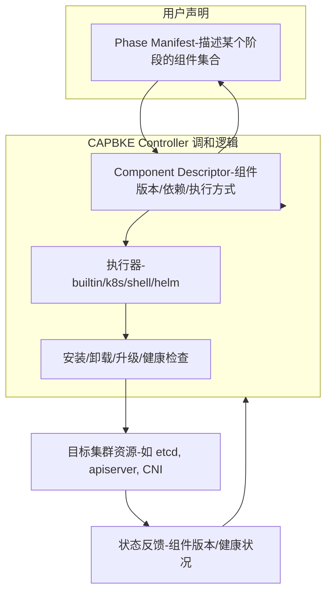

# 各 phase 支持不同版本升级的整改方案
逐步分析 **cluster-api-provider-bke** 在各 phase 支持不同版本升级的整改方案，并给出完整的设计思路、样例和工作量评估。  
## 📌 1. 各 phase 的组件信息与版本管理
- **目标**：每个 phase（如 bootstrap、control-plane、addons）里的组件要能支持 **安装、卸载、升级、健康检查、兼容性检查**。  
- **方案**：
  - 将组件信息抽象为 **版本安装包**（Component Package），包含：
    - 安装脚本/manifest
    - 卸载逻辑
    - 升级策略（先卸载旧版本，再安装新版本，或原地升级）
    - 健康检查（探针、API 可用性）
    - 兼容性检查（与 Kubernetes 版本、其它组件版本的匹配度）
## 📌 2. 声明式安装方式
- **封装形式**：
  - **builtin**：内置逻辑（Go 代码调用 API）
  - **k8s**：Kubernetes manifest（YAML）
  - **shell**：脚本执行（bash/sh）
- **扩展考虑**：
  - 是否需要支持 **Helm、Kustomize、Operator** 等执行方式。  
  - 建议定义 **Phase Manifest** 与 **Component Descriptor** 规范：
    - Phase Manifest：描述某个 phase 的组件集合及执行顺序。  
    - Component Descriptor：描述单个组件的安装包、版本、依赖、执行方式。  
## 📊 3. 各 phase 整改样例
**示例：Control Plane Phase**
```yaml
apiVersion: capbke.io/v1alpha1
kind: PhaseManifest
metadata:
  name: control-plane-phase
spec:
  components:
    - name: kube-apiserver
      version: v1.29.3
      descriptorRef: kube-apiserver-v1.29.3
    - name: kube-controller-manager
      version: v1.29.3
      descriptorRef: kube-controller-manager-v1.29.3
```
**示例：Component Descriptor**
```yaml
apiVersion: capbke.io/v1alpha1
kind: ComponentDescriptor
metadata:
  name: kube-apiserver-v1.29.3
spec:
  install:
    type: k8s
    manifest: |
      apiVersion: v1
      kind: Pod
      ...
  uninstall:
    type: shell
    script: "kubectl delete pod kube-apiserver"
  upgrade:
    strategy: replace
  healthCheck:
    type: builtin
    probe: "https://127.0.0.1:6443/healthz"
  compatibility:
    kubernetesVersion: ">=1.29.0"
```
## 📌 4. 有状态 phase 的整改样例（如 etcd）
**Etcd Phase Manifest**
```yaml
apiVersion: capbke.io/v1alpha1
kind: PhaseManifest
metadata:
  name: etcd-phase
spec:
  components:
    - name: etcd
      version: 3.5.12
      descriptorRef: etcd-v3.5.12
```

**Etcd Component Descriptor**
```yaml
apiVersion: capbke.io/v1alpha1
kind: ComponentDescriptor
metadata:
  name: etcd-v3.5.12
spec:
  install:
    type: k8s
    manifest: |
      apiVersion: apps/v1
      kind: StatefulSet
      ...
  upgrade:
    strategy: rolling
    preUpgradeHook: "etcdctl snapshot save /backup/etcd.bak"
    postUpgradeHook: "etcdctl endpoint health"
  healthCheck:
    type: builtin
    probe: "etcdctl endpoint health"
  compatibility:
    kubernetesVersion: ">=1.28.0"
    dependency:
      - kube-apiserver
```
## 📌 5. 整个工程整改的工作量
- **定义规范**：Phase Manifest + Component Descriptor → 中等工作量（约 2-3 周）。  
- **封装执行器**：builtin/k8s/shell/helm → 较大工作量（约 4-6 周）。  
- **组件库改造**：为每个组件编写安装/卸载/升级逻辑 → 较大工作量（约 6-8 周）。  
- **有状态组件支持**：如 etcd 的快照、滚动升级 → 较大工作量（约 4 周）。  
- **测试与验证**：兼容性测试、回滚测试 → 较大工作量（约 4-6 周）。  

👉 总体工作量：**约 4-6 个月**，取决于团队规模与组件数量。  
## 📌 6. 整体设计思路
1. **抽象层次化**：  
   - Phase → Component → Descriptor → 执行器。  
2. **声明式驱动**：  
   - 所有安装/卸载/升级逻辑都声明在 YAML 中，控制器只负责调和。  
3. **可扩展执行器**：  
   - 内置支持 k8s manifest、shell、builtin，未来可扩展 Helm/Kustomize。  
4. **版本与兼容性管理**：  
   - 每个 Component Descriptor 包含版本、依赖、兼容性信息。  
5. **有状态组件特殊处理**：  
   - 提供 pre/post hook，支持快照、滚动升级、健康检查。  
6. **统一控制器调和**：  
   - Cluster API Provider BKE 的控制器读取 Phase Manifest，按顺序执行组件安装/升级，并更新状态。  

✅ **总结**：  
整改方案的核心是 **声明式 + 分层抽象 + 可扩展执行器 + 有状态组件特殊处理**。通过 **Phase Manifest + Component Descriptor** 规范，可以让各 phase 的组件支持版本升级、卸载、健康检查和兼容性验证，最终形成一个可维护、可扩展的集群生命周期管理体系。  

## 架构图
直观展示 **Phase Manifest、Component Descriptor、执行器、控制器** 之间的关系：  

## 📌 图解说明
1. **Phase Manifest**  
   - 用户声明某个 phase 的组件集合及版本。  
2. **Component Descriptor**  
   - 描述单个组件的安装包、版本、依赖、兼容性信息。  
3. **执行器 (Executor)**  
   - 支持多种执行方式：builtin（Go 内置逻辑）、k8s（YAML manifest）、shell（脚本）、helm。  
4. **控制器 (Controller)**  
   - 读取 Phase Manifest → 解析 Component Descriptor → 调用执行器 → 执行安装/卸载/升级/健康检查。  
5. **目标集群资源**  
   - 实际安装的组件，如 etcd、apiserver、CNI 插件。  
6. **状态反馈**  
   - 将安装结果、版本号、健康状态写回 Descriptor/Phase Manifest，形成闭环。  

✅ **总结**：  
这个架构图展示了一个完整的声明式执行链路：  
**Phase Manifest → Component Descriptor → 执行器 → 控制器 → 集群资源 → 状态反馈 → Phase Manifest**。  
