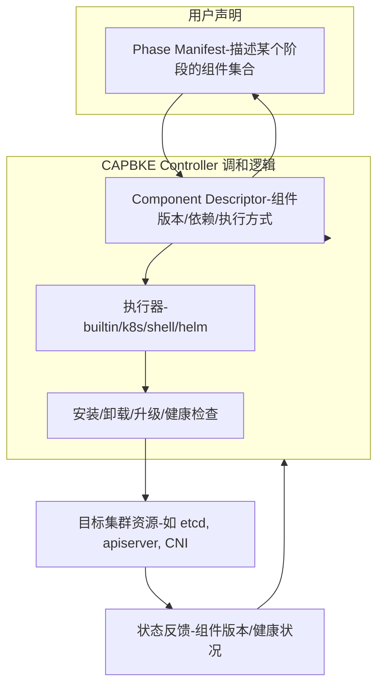

# KEP: 引入声明式组件模型（PhaseManifest + ComponentDescriptor）并实现生产级执行器与有状态处理器到 cluster-api-provider-bke
- **KEP 名称**：Component Model for cluster-api-provider-bke（PhaseManifest + ComponentDescriptor）  
- **KEP 作者**：Paul（示例）及 cluster-api-provider-bke 维护团队  
- **状态**：提案（Proposed）  
- **审阅者**：TBD  
- **创建日期**：2026-04-30  
- **更新记录**：见文末
## 摘要（Summary）
提出在 `cluster-api-provider-bke` 中引入声明式组件模型，由两个 CRD 驱动：**PhaseManifest**（阶段集合）与 **ComponentDescriptor**（组件描述）。控制器负责调和（reconcile）PhaseManifest，按顺序读取 ComponentDescriptor 并通过可插拔的 **Executor**（k8s/Helm/Shell/Builtin）或 **StatefulHandler**（etcd 等）执行安装、升级、卸载、健康检查与回滚。该 KEP 还定义了生产级实现要点：server-side apply + prune、Helm SDK 集成、etcd snapshot 上传/恢复（Job + S3/MinIO）、分布式锁（Lease）、版本包（component package）规范、以及旧 phase 到新架构的桥接与迁移策略。
## 动机（Motivation）
当前 `cluster-api-provider-bke` 的 phase 执行逻辑存在以下问题：
- **实现分散且耦合**：组件安装/升级逻辑散落在控制器代码中，新增组件或版本需修改控制器，降低扩展性与可维护性。  
- **有状态组件风险高**：etcd 等有状态组件缺乏统一的快照、滚动升级与恢复机制，升级失败风险高且恢复流程不一致。  
- **多执行方式支持不足**：需要同时支持 manifest、Helm、脚本、内置逻辑等多种执行方式，并支持离线/在线组件包分发与签名校验。  
- **可观测性与回滚不足**：缺乏统一的状态模型、事件与指标，回滚路径不明确。

**目标**：构建声明式、可扩展、可回滚的组件管理体系，提升升级安全性、可测试性与运维效率，并支持平滑迁移现有旧 phase 实现到新架构。
## 目标（Goals）
- 定义并实现 `PhaseManifest` 与 `ComponentDescriptor` CRD（含 status）。  
- 实现可插拔 Executor 框架（k8s/Helm/Shell/Builtin），并在生产中使用 server-side apply、Helm SDK、Job 执行脚本等。  
- 实现 StatefulHandler（以 etcd 为首要示例），支持 pre-upgrade snapshot（上传到 S3/MinIO）、rolling upgrade、post-check、以及 snapshot-based restore。  
- 定义版本包（component package）规范，支持离线仓库与 OCI/对象存储分发，并要求校验/签名。  
- 提供旧 phase 到新架构的桥接方案与逐步迁移路径，保证向后兼容并可回滚。  
- 提供 RBAC、安全、测试与演练建议，确保生产可用性。
## 非目标（Non-Goals）
- 在本 KEP 中不包含具体的实现代码细节（实现留在实现计划与 PR 中）。  
- 不强制所有组件立即迁移到新模型；允许混合运行旧逻辑与新模型。  
- 不指定具体的对象存储厂商（S3/GCS/MinIO 等均可），但定义抽象接口与运行时约定。
## 设计概览（Proposal）
### 核心概念
- **PhaseManifest**：声明某个 phase（例如 control-plane、addons）包含的组件集合与执行顺序。  
- **ComponentDescriptor**：声明单个组件的元数据：版本、安装方式（manifest/chart/script）、升级策略、pre/post hooks、健康探针、兼容性约束、snapshotPolicy。  
- **Executor**：可插拔执行器接口，负责具体的 `Install/Uninstall/Upgrade/HealthCheck`。实现包括 `K8sExecutor`（server-side apply + prune）、`HelmExecutor`（Helm SDK）、`ShellExecutor`（Job 执行脚本）、`BuiltinExecutor`（provider 特定逻辑）。  
- **StatefulHandler**：专门处理有状态组件（如 etcd），接口包含 `PreUpgrade`（snapshot）、`RollingUpgrade`、`PostUpgrade`、`RestoreFromSnapshot`。  
- **Component Package（版本包）**：每个组件版本以目录或包形式发布，包含 manifest/chart、脚本、校验与元数据，支持仓库或对象存储分发与签名校验。
### 高层工作流
1. 用户 apply `PhaseManifest`（引用若干 `ComponentDescriptor`）。  
2. `PhaseController` Reconcile：按 `order` 遍历组件，加载 `ComponentDescriptor`，做兼容性检查与依赖解析。  
3. 根据组件类型与 `install.type` 选择 Executor 或 StatefulHandler 执行操作（Install/Upgrade/Uninstall）。  
4. 执行器返回 `ExecResult`（包含 revision），控制器更新 `ComponentDescriptor.status` 与 `PhaseManifest.status`，并记录 Event 与指标。  
5. 对于有状态组件，控制器在升级前调用 `PreUpgrade`（创建 snapshot Job 并上传 snapshot），升级失败时调用 `RestoreFromSnapshot` 恢复。  
6. 每次 apply 带上 `component` 与 `component-revision` label，K8sExecutor 在成功后执行 `pruneOldRevisions`（best-effort）清理旧 revision 资源。
## API 设计（CRD 定义片段）
> 以下为精简示例，实际 CRD 请使用 controller-tools（kubebuilder markers）生成完整 schema、validation 与 defaulting。
### PhaseManifest（示例片段）
```yaml
apiVersion: apiextensions.k8s.io/v1
kind: CustomResourceDefinition
metadata:
  name: phasemanifests.capbke.io
spec:
  group: capbke.io
  names:
    kind: PhaseManifest
    plural: phasemanifests
  scope: Namespaced
  versions:
    - name: v1alpha1
      served: true
      storage: true
      schema:
        openAPIV3Schema:
          type: object
          properties:
            spec:
              type: object
              properties:
                phaseName: { type: string }
                components:
                  type: array
                  items:
                    type: object
                    properties:
                      name: { type: string }
                      descriptorRef:
                        type: object
                        properties:
                          name: { type: string }
                          namespace: { type: string }
                      order: { type: integer }
            status:
              type: object
              properties:
                phase: { type: string }
                componentsStatus:
                  type: array
                  items:
                    type: object
                    properties:
                      name: { type: string }
                      phase: { type: string }
                      installedVersion: { type: string }
                      lastAppliedRevision: { type: string }
      subresources:
        status: {}
```
### ComponentDescriptor（示例片段）
```yaml
apiVersion: apiextensions.k8s.io/v1
kind: CustomResourceDefinition
metadata:
  name: componentdescriptors.capbke.io
spec:
  group: capbke.io
  names:
    kind: ComponentDescriptor
    plural: componentdescriptors
  scope: Namespaced
  versions:
    - name: v1alpha1
      served: true
      storage: true
      schema:
        openAPIV3Schema:
          type: object
          properties:
            spec:
              type: object
              properties:
                name: { type: string }
                version: { type: string }
                type: { type: string } # stateless|stateful
                install:
                  type: object
                  properties:
                    type: { type: string } # k8s|helm|shell|builtin
                    manifest: { type: string }
                    chart: { type: string }
                upgrade:
                  type: object
                  properties:
                    strategy: { type: string } # replace|rolling|inplace
                    preHook: { type: object }
                    postHook: { type: object }
                    snapshotPolicy: { type: object }
                health:
                  type: object
                  properties:
                    type: { type: string }
                    probe: { type: string }
                compatibility:
                  type: object
                  properties:
                    kubernetesVersion: { type: string }
            status:
              type: object
              properties:
                phase: { type: string }
                installedVersion: { type: string }
                lastAppliedRevision: { type: string }
                snapshotRef: { type: string }
                lastError: { type: string }
      subresources:
        status: {}
```
## 设计细节（要点说明）
### K8sExecutor（server-side apply + prune）
- 使用 server-side apply（fieldManager）保证幂等性。  
- 在每次 apply 时为资源添加标签：`capbke.io/component=<name>` 与 `capbke.io/component-revision=<revision>`。  
- `pruneOldRevisions`：列出受管理资源类型（Deployment/StatefulSet/Service/ConfigMap/Secret/Job/CRs 等），按 component label 筛选并删除 revision 不等于当前 revision 的资源（best-effort）。  
- RESTMapper 从 manager 注入，支持 CRD 自动发现与正确的 RESTMapping。
### HelmExecutor（Helm SDK）
- 使用 Helm SDK（`helm.sh/helm/v3/pkg/action`）管理 release（install/upgrade/uninstall/rollback/status）。  
- 注入 `HelmActionFactory` 抽象 `action.Configuration` 的创建，便于单元测试与多集群场景。  
- 支持 chart archive、本地 chart、chart repo、values、dry-run。
### ShellExecutor（Job 执行脚本）
- 在目标集群以 Kubernetes Job 执行脚本（pre/post hooks 或自定义脚本）。  
- Job 使用专用 ServiceAccount（最小权限），挂载凭证 Secret（S3/MinIO、kubeconfig、证书等）。  
- Controller 等待 Job 完成并读取 Pod 日志或 Job 写入的结果 Secret 作为执行结果。
### StatefulHandler（etcd）
- **PreUpgrade**：创建 snapshot Job（Job 镜像包含 `etcdctl` 与 S3 客户端），Job 执行 `etcdctl snapshot save` 并上传到 S3/MinIO；Job 将 snapshot URL 写入结果 Secret，Controller 读取并写入 `ComponentDescriptor.status.snapshotRef`。  
- **RollingUpgrade**：逐 Pod 升级（StatefulSet partition 或 cordon/drain），每步等待健康与 quorum。  
- **PostUpgrade**：执行健康与一致性校验（`etcdctl endpoint health`、一致性检查）。  
- **RestoreFromSnapshot**：创建 restore Job（下载 snapshot 并执行 `etcdctl snapshot restore`、恢复数据目录、重建集群）；恢复流程需在 staging 环境演练并完善脚本。
## 版本包（Component Package）设计与样例
### 版本包目录结构（建议）
```
components/
  <component>/
    <version>/
      manifest.yaml         # k8s manifests 或 StatefulSet/Deployment
      descriptor.yaml       # ComponentDescriptor 示例
      chart/                # 可选：helm chart 或 chart reference
      scripts/
        pre-snapshot.sh
        post-check.sh
      checksums.yaml        # sha256 校验
      metadata.yaml         # name, version, author, compatibility, signature
```
### 版本包字段与要求
- **manifest.yaml**：支持 multi-doc YAML 或 Helm chart reference。  
- **descriptor.yaml**：ComponentDescriptor 的示例或模板（可直接 apply）。  
- **scripts/**：pre/post hook 脚本，必须幂等并可在 Job 中执行。  
- **checksums.yaml**：每个文件的校验值（sha256），用于完整性校验。  
- **metadata.yaml**：包含 `name`、`version`、`signing`（可选 cosign 指纹）、`compatibility`（K8s 版本约束、依赖）。  
- **分发方式**：支持仓库内托管（离线场景）或 OCI/对象存储（在线场景），建议对包进行签名与校验。
### 版本包样例（etcd v3.5.12）
`components/etcd/3.5.12/descriptor.yaml`（示例）
```yaml
apiVersion: capbke.io/v1alpha1
kind: ComponentDescriptor
metadata:
  name: etcd-v3-5-12
spec:
  name: etcd
  version: "3.5.12"
  type: stateful
  install:
    type: k8s
    manifest: |
      apiVersion: apps/v1
      kind: StatefulSet
      metadata:
        name: etcd
      spec:
        replicas: 3
        template:
          spec:
            containers:
            - name: etcd
              image: quay.io/coreos/etcd:v3.5.12
  upgrade:
    strategy: rolling
    preHook:
      type: shell
      script: |
        etcdctl snapshot save /backup/etcd-{{ .Version }}.db
        aws s3 cp /backup/etcd-{{ .Version }}.db s3://my-bucket/etcd/
  health:
    type: builtin
    probe: "etcdctl endpoint health"
  compatibility:
    kubernetesVersion: ">=1.28.0"
```
## 旧 phase 桥接到新架构（兼容与迁移策略）
### 设计原则
- **最小侵入、渐进迁移**：允许旧逻辑与新模型并存，逐步迁移每个 phase 与组件。  
- **兼容层（BuiltinExecutor）**：把现有硬编码逻辑封装为 `BuiltinExecutor`，在短期内作为兼容实现，便于平滑切换。  
- **双写/双控（可选）**：在迁移期间，PhaseManifest 可同时触发旧逻辑与新逻辑（仅在非冲突场景），以便对比与验证。  
- **回滚与回退**：在迁移失败或回归时，能够快速回退到旧逻辑（通过切换 PhaseManifest 或将 ComponentDescriptor 指向 BuiltinExecutor）。
### 桥接实现要点
1. **封装旧逻辑**：把现有 phase 的安装/升级/卸载逻辑封装为 `BuiltinExecutor`，并实现 `Install/Upgrade/Uninstall/HealthCheck` 接口。  
2. **生成 ComponentDescriptor**：为每个旧 phase 生成对应的 `ComponentDescriptor`（指向 BuiltinExecutor），并创建 `PhaseManifest` 引用这些 descriptor。  
3. **并行验证**：在 dev/staging 环境中同时运行旧 controller 与新 controller（leader election 不冲突），对比状态与结果，验证新模型行为一致。  
4. **逐步切换**：先迁移无状态组件（CNI、Ingress），验证稳定后迁移有状态组件（etcd）。  
5. **移除旧逻辑**：当所有组件稳定运行在新模型后，逐步移除旧硬编码逻辑或把其实现迁移为 BuiltinExecutor 的可选实现。
## 旧版本升级到新架构（版本迁移策略）
### 场景：已有集群使用旧 phase（硬编码逻辑），希望迁移到 ComponentDescriptor 驱动的新模型
1. **准备阶段**
   - 在 dev/staging 部署新 controller（开启 leader election），并保留旧 controller（不同时对同一集群执行冲突操作）。  
   - 在仓库中为每个旧 phase 生成 `ComponentDescriptor`（初期指向 `BuiltinExecutor`，内容与旧逻辑一致），并创建 `PhaseManifest`。  
2. **验证阶段**
   - 在测试集群 apply 新 `PhaseManifest`，观察 `PhaseController` 的行为（应调用 BuiltinExecutor 并产生与旧逻辑相同的结果）。  
   - 对比状态、事件与指标，确保一致性。  
3. **迁移阶段**
   - 将 `ComponentDescriptor` 的 `install.type` 从 `builtin` 替换为 `k8s`/`helm`/`shell`（指向真实 manifest/chart/script），并在 dev/staging 验证。  
   - 对无状态组件先行替换并验证（CNI、Ingress、metrics）。  
   - 对有状态组件（etcd）先实现并验证 `StatefulHandler`（snapshot/upload/restore），在 staging 多次演练后迁移生产。  
4. **切换阶段**
   - 在生产环境按小批量切换（灰度）：先在单个集群或少量节点上切换并观察，确认稳定后扩大范围。  
5. **清理阶段**
   - 当所有组件稳定运行在新模型后，移除旧 controller 的相关代码或把其实现作为 `BuiltinExecutor` 的备选实现保留一段时间以便回退。
## 安全、RBAC 与凭证管理
- **Controller RBAC**：需要对 `phasemanifests`、`componentdescriptors`、`leases`、`jobs`、`pods`、`secrets`、`statefulsets`、`deployments` 等资源具备必要权限（get/list/watch/create/update/patch/delete）。  
- **Job ServiceAccount**：例如 `capbke-etcd-job-runner`，仅允许读取 S3/MinIO 凭证 Secret、写入结果 Secret、访问 Pod 日志等最小权限。  
- **凭证管理**：S3/MinIO 凭证存 Secret，Job 挂载 Secret；建议使用短期凭证与审计。  
- **镜像与脚本签名**：组件包与 Job 镜像建议使用签名（cosign）与校验，脚本需审计并尽量避免内联不受信任脚本。
## 测试策略
- **单元测试**：mock Executor、HelmActionFactory、StatefulHandler；覆盖 Reconcile 分支、错误路径、状态 patch。  
- **集成测试**：使用 `envtest` 注册 CRDs 并测试 controller-runtime 行为。  
- **E2E 测试**：CAPD/kind 上运行完整场景：install → upgrade → 故障注入 → restore（使用 MinIO 作为 S3 替代）。  
- **演练**：在 staging 环境多次演练 etcd snapshot/restore，记录 RTO/RPO 并完善 Runbook。
## 回滚与恢复 Runbook（概要）
- **检测失败**：controller 将组件标记为 `Failed` 并记录 `snapshotRef` 与 `lastError`。  
- **自动恢复尝试**：若 snapshot 可用，controller 自动或按策略触发 `RestoreFromSnapshot`。  
- **人工干预**：若自动恢复失败，通知运维并提供 snapshot URL、恢复脚本与手动步骤（停止 etcd、restore、启动、验证）。  
- **stateless 回滚**：使用 `lastAppliedRevision` 或 Helm rollback 恢复到上一个稳定版本。
## 风险与替代方案
- **风险**：实现复杂度上升、etcd 恢复风险、凭证泄露风险、迁移期间可能出现不一致。  
- **缓解**：分阶段迁移、充分测试与演练、最小权限、签名校验、详细 Runbook。  
- **替代方案**：为每个组件实现独立 Operator（优点隔离性强，缺点运维复杂）；仅使用 Helm（简化但无法覆盖 provider 特定逻辑）。
## 实施计划与时间估算（建议）
- **阶段 0**：设计与 CRD 定义（1–2 周）  
- **阶段 1**：Executor 框架（K8sExecutor、HelmExecutor、ShellExecutor）实现（3–4 周）  
- **阶段 2**：StatefulHandler（etcd）实现与演练（3–4 周）  
- **阶段 3**：PhaseController 集成、Lease 锁、状态机、事件与指标（3–4 周）  
- **阶段 4**：迁移、e2e 测试与文档（2–3 周）  
- **总计**：约 12–16 周（2–3 人团队）
## 交付清单
- CRD YAML（PhaseManifest、ComponentDescriptor）与 Go types（controller-tools markers）。  
- PhaseController（声明式调和、状态更新、Lease 锁、事件、指标）。  
- Executor：K8sExecutor（server-side apply + prune）、HelmExecutor（Helm SDK）、ShellExecutor（Job）。  
- StatefulHandler（etcd：snapshot/upload/restore、rolling upgrade）。  
- 版本包规范与示例（etcd、CNI 等）。  
- RBAC manifests、ServiceAccount 模板、Kustomize 部署示例。  
- 单元/集成/e2e 测试用例与 Runbook（恢复手册）。
## 附录：端到端样例（简要）
1. **发布版本包**：将 `components/etcd/3.5.12` 上传到内部仓库或对象存储，并签名。  
2. **创建 ComponentDescriptor**：在管理集群创建 `ComponentDescriptor`（指向 manifest 或 chart，包含 upgrade.strategy=rolling 与 preHook）。  
3. **创建 PhaseManifest**：创建 `PhaseManifest` 引用该 descriptor。  
4. **Controller 执行**：PhaseController 调用 EtcdHandler.PreUpgrade（snapshot Job 上传到 S3），然后 RollingUpgrade（逐 Pod 升级），PostUpgrade（健康检查）。若失败，调用 RestoreFromSnapshot（restore Job）。  
5. **状态与事件**：ComponentDescriptor.status 与 PhaseManifest.status 更新，Prometheus 指标与 Events 记录全过程。

如果你同意该方向，我可以把本 KEP 转为正式 KEP Markdown（包含 KEP 模板头、SIG/OWNERS 建议、详细 CRD schema markers），并生成：  
- 完整 CRD YAML（controller-tools markers）草案；  
- 迁移 runbook（含示例脚本与 MinIO-based e2e 测试计划）；  
- 或把生产实现代码打包为 `git patch` 便于直接合入 `javadoors/cluster-api-provider-bke` 仓库。

# 兼容层（BuiltinExecutor）的设计及详细实现
### 概览
**BuiltinExecutor** 是为平滑迁移旧版、硬编码 phase 实现到新声明式组件模型而设计的兼容层。它把现有控制器中散落的“组件特定”逻辑封装为一个标准 Executor，实现与新框架（PhaseManifest + ComponentDescriptor + ExecutorFactory）无缝对接。目标是**零停机、最小改动、可回退**：在短期内保留旧实现的行为，同时逐步把逻辑迁移到声明式 manifest/helm/script 或专用 StatefulHandler。
### 接口与 API
**目标**：BuiltinExecutor 必须实现与其他 Executor 相同的接口，便于在 ExecutorFactory 中互换。

**Go 接口示例**
```go
package executor

import "context"

type ExecResult struct {
    Revision string
    Message  string
}

type Executor interface {
    Install(ctx context.Context, cd *ComponentDescriptor) (ExecResult, error)
    Uninstall(ctx context.Context, cd *ComponentDescriptor) (ExecResult, error)
    Upgrade(ctx context.Context, cd *ComponentDescriptor, fromVersion, toVersion string) (ExecResult, error)
    HealthCheck(ctx context.Context, cd *ComponentDescriptor) (bool, string, error)
}
```
**BuiltinExecutor 具体签名**
```go
type BuiltinExecutor struct {
    // 注入旧控制器的依赖或适配器
    legacyAdapter LegacyAdapter
    logger        logr.Logger
}

type LegacyAdapter interface {
    // 将旧逻辑暴露为可调用方法
    RunInstall(ctx context.Context, params LegacyParams) (LegacyResult, error)
    RunUpgrade(ctx context.Context, params LegacyParams) (LegacyResult, error)
    RunUninstall(ctx context.Context, params LegacyParams) (LegacyResult, error)
    RunHealthCheck(ctx context.Context, params LegacyParams) (bool, string, error)
}
```
### 实现模式与文件映射
**总体思路**
- **适配器化**：把旧代码中与组件相关的函数/方法封装到 `LegacyAdapter`，只暴露最小、幂等的调用点。  
- **幂等封装**：在 BuiltinExecutor 层实现幂等检查（基于 `ComponentDescriptor.status.installedVersion`、`lastAppliedRevision`、资源存在性检测），避免重复执行破坏性操作。  
- **状态驱动**：BuiltinExecutor 在每次操作后返回 `ExecResult.Revision`（例如 `builtin/<component>-<version>`），控制器把该 revision 写入 status，作为回滚依据。  
- **事件与日志**：每次调用记录 Kubernetes Event 与结构化日志，便于审计与回溯。  
- **渐进替换**：先把旧逻辑封装为 BuiltinExecutor 并在 ComponentDescriptor 中使用 `install.type: builtin`，随后逐步替换为 `k8s`/`helm`/`shell`。

**建议文件路径**
- `pkg/executor/builtin_executor.go` ← BuiltinExecutor 实现  
- `pkg/legacy/adapter.go` ← LegacyAdapter 抽象与实现（封装旧逻辑）  
- `controllers/phase/bridge_helpers.go` ← 生成 descriptor/PhaseManifest 的桥接工具  
- `hack/generate-descriptors.sh` ← 自动从旧 phase 生成 ComponentDescriptor（初始为 builtin）

**实现要点示例（伪代码）**
```go
func (b *BuiltinExecutor) Install(ctx context.Context, cd *ComponentDescriptor) (ExecResult, error) {
    // 1. 幂等检查
    if alreadyInstalled(cd) { return ExecResult{Revision: currentRevision}, nil }

    // 2. Prepare legacy params
    params := mapFromDescriptor(cd)

    // 3. Call legacy adapter
    res, err := b.legacyAdapter.RunInstall(ctx, params)
    if err != nil {
        recordEvent("InstallFailed", err.Error())
        return ExecResult{}, err
    }

    // 4. Update status via returned revision/message
    return ExecResult{Revision: fmt.Sprintf("builtin/%s-%s", cd.Name, cd.Version), Message: res.Message}, nil
}
```
### 错误处理、回滚与幂等性
**幂等性策略**
- **预检查**：在执行前检查 `ComponentDescriptor.status.installedVersion`、资源存在性（Deployment/StatefulSet 等）以决定是否执行。  
- **操作幂等化**：在 adapter 层尽量使用 idempotent 操作（例如 `kubectl apply`、helm upgrade --install、脚本先检测再执行）。  
- **事务边界**：对复杂升级（尤其有状态）在 BuiltinExecutor 中只触发高层流程（例如调用 StatefulHandler），不要在 BuiltinExecutor 内实现细粒度节点操作。

**回滚策略**
- **记录 revision**：每次成功操作返回 `ExecResult.Revision` 并写入 `lastAppliedRevision`。  
- **自动回滚**：若升级失败且 `lastAppliedRevision` 可用，控制器可调用 BuiltinExecutor 或相应 Executor 重新应用 `lastAppliedRevision`。  
- **有状态恢复**：对于 etcd 等有状态组件，BuiltinExecutor 应委托 StatefulHandler 的 `RestoreFromSnapshot`（如果 snapshotRef 可用），而不是尝试自行恢复。

**错误分类**
- **可重试错误**：网络、API 超时 → 返回可重试错误，控制器按 backoff 重试。  
- **不可恢复错误**：配置不兼容、manifest 语法错误 → 标记为 Failed 并记录详细原因，等待人工干预。
### 旧 phase 桥接与迁移流程（详细步骤）
**目标**：在不影响现有集群运行的前提下，把旧 phase 行为迁移到新模型。

**步骤**
1. **封装旧逻辑为 LegacyAdapter**  
   - 把旧 controller 中的安装/升级/卸载/健康检查函数抽象为 `LegacyAdapter` 接口实现。  
   - 保持原有行为与参数兼容，尽量不改动旧函数内部实现。  
2. **实现 BuiltinExecutor 并注入 LegacyAdapter**  
   - 在 ExecutorFactory 中注册 `builtin` 类型返回 `BuiltinExecutor`。  
3. **生成 ComponentDescriptor（自动化脚本）**  
   - 使用 `hack/generate-descriptors.sh` 从旧 phase 配置生成 `ComponentDescriptor`，`install.type: builtin`，并把旧 phase 的元数据（name/version/order）填入。  
4. **创建 PhaseManifest 引用这些 descriptor**  
   - 在管理集群 apply 新生成的 `PhaseManifest`，PhaseController 会调用 BuiltinExecutor 执行旧逻辑。  
5. **并行验证**  
   - 在 dev/staging 环境同时运行旧 controller 与新 controller（leader election 不冲突），对比状态与事件，确保行为一致。  
6. **逐组件替换**  
   - 对某个组件，先把 descriptor 从 `builtin` 改为 `k8s`/`helm`/`shell`（指向 manifest/chart/script），在 dev/staging 验证后在生产切换。  
7. **回退机制**  
   - 若新实现出现问题，把 descriptor 恢复为 `builtin`（快速回退）。  
8. **最终清理**  
   - 当所有组件稳定运行在新模型后，移除旧 controller 的实现或把其代码作为 `BuiltinExecutor` 的可选实现保留一段时间。

**示例桥接脚本输出（descriptor snippet）**
```yaml
apiVersion: capbke.io/v1alpha1
kind: ComponentDescriptor
metadata:
  name: kube-apiserver-v1-29-3
spec:
  name: kube-apiserver
  version: "1.29.3"
  type: stateless
  install:
    type: builtin
  upgrade:
    strategy: replace
```
### 测试、验证与 CI
**单元测试**
- Mock `LegacyAdapter`，验证 BuiltinExecutor 在成功、失败、幂等场景下的行为与返回值。  
- 覆盖状态更新路径：确保 `ExecResult.Revision` 被正确写入 `ComponentDescriptor.status` 与 `PhaseManifest.status`（通过 controller 的 status patch 测试）。

**集成测试**
- 使用 `envtest` 或 CAPD：部署 BuiltinExecutor 与 LegacyAdapter，apply 自动生成的 `PhaseManifest`，验证旧逻辑在新控制器下能正确执行并产生相同资源。  
- 对于 etcd 等有状态组件，使用 MinIO 模拟 S3，演练 snapshot/upload/restore 流程。

**E2E 验证**
- 在 staging 集群执行完整迁移流程：旧逻辑封装 → descriptor 生成 → apply PhaseManifest → 切换单个组件到新实现 → 故障注入 → 验证回退。

**CI 建议**
- 在 PR pipeline 中运行：`go test`（单元）、`envtest`（集成）、nightly e2e（CAPD/kind）包含迁移场景。
### 可观测性与运维注意
- **Events**：BuiltinExecutor 在每个关键步骤发出 Kubernetes Event（Normal/Warning），包含 component、action、revision、message。  
- **Metrics**：暴露 Prometheus 指标：`builtin_executor_operation_duration_seconds{component,action}`、`builtin_executor_operation_total{component,action,status}`。  
- **日志**：结构化日志包含 `component`, `action`, `revision`, `duration`, `error`。  
- **Runbook**：为每个 BuiltinExecutor 封装的旧逻辑准备恢复手册，包含如何手动执行旧脚本、如何读取 snapshot、如何回滚。
### 小结与交付项
**BuiltinExecutor 交付清单**
- `pkg/executor/builtin_executor.go`：实现 Executor 接口并注入 `LegacyAdapter`。  
- `pkg/legacy/adapter.go`：LegacyAdapter 抽象与旧逻辑封装实现（逐个旧 phase 对应一个 adapter 实现）。  
- `hack/generate-descriptors.sh`：从旧 phase 自动生成 ComponentDescriptor（初始 `install.type: builtin`）。  
- 单元测试与集成测试用例（mock adapter、envtest 场景）。  
- Runbook：迁移步骤、回滚流程、演练计划。  
- RBAC：确保 BuiltinExecutor 调用旧逻辑所需权限（例如访问特定 Secrets/ConfigMaps）。

**价值**
- **平滑迁移**：在不影响现有集群的前提下，把旧逻辑纳入新框架，便于逐步替换与回退。  
- **统一运维**：所有组件（旧/新）通过同一 PhaseController 管理，统一状态、事件与指标。  
- **可测试与可审计**：通过 adapter 抽象与事件/metrics，便于回溯与自动化测试。

如果你愿意，我可以接着：
- 生成 `pkg/executor/builtin_executor.go` 与 `pkg/legacy/adapter.go` 的**可编译模板**（含示例 adapter 实现封装一个旧 phase），  
- 或者把 `hack/generate-descriptors.sh` 脚本与一个示例旧 phase 的自动化迁移演示（包括生成 descriptor、apply、验证）打包成 `git patch`，便于直接合入你的仓库。
# 提案概述
本文为 **Cluster API Provider BKE（javadoors/cluster-api-provider-bke）重构 KEP 提案（中文）**，提出将组件管理从控制器硬编码迁移为 **声明式 Component Model（PhaseManifest + ComponentDescriptor）**，并引入 **可插拔 Executor 与 StatefulHandler** 框架，支持组件的 **安装、卸载、升级、健康检查、兼容性校验、pre/post hook、快照与回滚**。文档覆盖 KEP 必要章节、CRD 设计、控制器实现细节、版本包设计、打穿（端到端）流程样例、迁移步骤、测试策略、RBAC、运维与风险缓解、工作量估算与时间表。
## 背景与动机
**现状问题**  
- `cluster-api-provider-bke` 中各 phase 的组件安装/升级逻辑分散且常包含组件特定实现，导致扩展性差、测试困难、升级风险高。  
- 有状态组件（如 etcd）缺乏统一的快照、滚动升级与回滚机制。  
- 新组件或版本引入通常需要修改控制器代码，降低维护效率。

**目标**  
- 将组件元数据与操作声明化，控制器只负责协调与状态机。  
- 提供统一 Executor 接口支持多种执行方式（k8s manifest、Helm、shell、builtin）。  
- 提供 StatefulHandler 专门处理有状态组件（etcd）安全升级与恢复。  
- 支持组件包化（版本包），便于离线/在线分发与回滚。
## 设计概览
### 核心概念
- **PhaseManifest**：描述某个 phase（例如 control-plane、bootstrap、addons）包含的组件集合与执行顺序。  
- **ComponentDescriptor**：描述单个组件的版本、安装包、升级策略、hooks、健康与兼容性信息。  
- **Executor**：可插拔执行器接口，负责具体的 install/uninstall/upgrade/health 操作。  
- **StatefulHandler**：专门处理有状态组件（如 etcd）的 pre-upgrade snapshot、rolling upgrade、restore。  
- **组件版本包（Component Package）**：每个组件版本以目录或包形式存放，包含 manifest、脚本、元数据与校验信息。
## API 设计（CRD）
### PhaseManifest CRD 关键字段
- **spec.phaseName**：阶段名称。  
- **spec.components[]**：组件列表，元素包含 `name`、`descriptorRef{name,namespace}`、`order`。  
- **status.phase**：阶段当前状态（Pending/Running/Completed/Failed）。  
- **status.componentsStatus[]**：每个组件的状态（installedVersion、phase、lastAppliedRevision、conditions）。
### ComponentDescriptor CRD 关键字段
- **spec.name**：组件逻辑名（例如 etcd、cilium）。  
- **spec.version**：组件版本（语义化）。  
- **spec.type**：`stateless` 或 `stateful`。  
- **spec.install**：`type`（k8s|helm|shell|builtin）、`manifest`（内嵌或引用）、`chart`（helm 信息）。  
- **spec.upgrade**：`strategy`（replace|rolling|inplace）、`preHook`、`postHook`、`snapshotPolicy`。  
- **spec.health**：`type`（builtin|http|kubectl）、`probe`。  
- **spec.compatibility**：`kubernetesVersion`、`dependencies[]`。  
- **status**：`phase`、`installedVersion`、`lastAppliedRevision`、`conditions[]`。
## 具体 CRD YAML（示例）
**文件路径建议**  
- `config/crd/bases/capbke.io_phasemanifests.yaml`  
- `config/crd/bases/capbke.io_componentdescriptors.yaml`

> 下面为简化示例片段（实际 CRD 请使用 controller-tools 生成完整 schema）
```yaml
# config/crd/bases/capbke.io_componentdescriptors.yaml (片段)
apiVersion: apiextensions.k8s.io/v1
kind: CustomResourceDefinition
metadata:
  name: componentdescriptors.capbke.io
spec:
  group: capbke.io
  names:
    kind: ComponentDescriptor
    plural: componentdescriptors
  scope: Namespaced
  versions:
  - name: v1alpha1
    served: true
    storage: true
    schema:
      openAPIV3Schema:
        type: object
        properties:
          spec:
            type: object
            properties:
              name: { type: string }
              version: { type: string }
              type: { type: string }
              install:
                type: object
                properties:
                  type: { type: string }
                  manifest: { type: string }
              upgrade:
                type: object
                properties:
                  strategy: { type: string }
                  preHook: { type: object }
                  postHook: { type: object }
              health:
                type: object
                properties:
                  type: { type: string }
                  probe: { type: string }
          status:
            type: object
            properties:
              phase: { type: string }
              installedVersion: { type: string }
              lastAppliedRevision: { type: string }
```
## 控制器实现细节
### PhaseController 职责
- 监听 `PhaseManifest`（主资源）与 `ComponentDescriptor`（被引用资源）变化。  
- 按 `PhaseManifest.spec.components.order` 顺序处理组件：兼容性校验 → 选择 Executor/StatefulHandler → 执行 Install/Upgrade/Uninstall → HealthCheck → 更新 status。  
- 管理并发、锁与回滚策略。  
- 记录 Kubernetes Events 与 Prometheus 指标。
### Reconcile 流程（伪代码步骤）
1. 获取 `PhaseManifest`。  
2. 遍历组件列表（按 order）：  
   - 加载 `ComponentDescriptor`。  
   - 兼容性检查（K8s 版本、依赖）。  
   - 读取当前 `componentsStatus`（installedVersion）。  
   - 决策：Install / Upgrade / Uninstall / HealthCheck。  
   - 若 `spec.type == stateful` 且 版本不一致，调用 `StatefulHandler`（PreUpgrade → RollingUpgrade → PostUpgrade）。  
   - 否则调用 `Executor.Upgrade` 或 `Executor.Install`。  
   - 执行后调用 `Executor.HealthCheck` 并更新 status。  
3. 处理错误：区分可重试与不可恢复错误，必要时触发回滚（使用 lastAppliedRevision 或 snapshot restore）。  
4. 返回 Requeue（带 backoff）或完成。
### 并发与锁
- **同一集群/同一组件串行化**：使用内存锁或 ConfigMap/Lease 实现分布式锁。  
- **不同组件并行**：若无依赖关系，可并行执行以加速。  
- **Leader Election**：使用 controller-runtime 的 leader election 保证单活控制器执行敏感操作。
## Executor 框架设计
### Executor 接口（Go 模板）
```go
package executor

import "context"

type ExecResult struct {
  Revision string
  Message  string
}

type ComponentDescriptor struct {
  Name    string
  Version string
  Spec    interface{}
}

type Executor interface {
  Install(ctx context.Context, cd *ComponentDescriptor) (ExecResult, error)
  Uninstall(ctx context.Context, cd *ComponentDescriptor) (ExecResult, error)
  Upgrade(ctx context.Context, cd *ComponentDescriptor, from, to string) (ExecResult, error)
  HealthCheck(ctx context.Context, cd *ComponentDescriptor) (bool, string, error)
}
```
### 默认实现
- **K8sExecutor**：使用 server-side apply，支持 manifest 内嵌或引用。  
- **HelmExecutor**：使用 Helm SDK 或 CLI，支持 chart repo、values。  
- **ShellExecutor**：在目标集群以 Job 方式执行脚本（需 kubeconfig 与凭证）。  
- **BuiltinExecutor**：保留 provider 特定逻辑（可逐步迁移到 descriptor）。
### ExecutorFactory
- 根据 `ComponentDescriptor.spec.install.type` 返回对应 Executor 实例（注入 kube client、logger）。
## StatefulHandler 设计（etcd 示例）
### 接口
```go
type StatefulHandler interface {
  PreUpgrade(ctx context.Context, cd *ComponentDescriptor) (snapshotRef string, err error)
  RollingUpgrade(ctx context.Context, cd *ComponentDescriptor, from, to string) error
  PostUpgrade(ctx context.Context, cd *ComponentDescriptor) error
  RestoreFromSnapshot(ctx context.Context, snapshotRef string) error
}
```
### Etcd Handler 行为要点
- **PreUpgrade**：在每个 etcd 成员上执行 `etcdctl snapshot save`，上传到对象存储或 Secret，返回 `snapshotRef`。  
- **RollingUpgrade**：逐节点 cordon → drain → 更新 StatefulSet 镜像/manifest → 等待健康 → uncordon，确保 quorum 始终可用。  
- **PostUpgrade**：执行 `etcdctl endpoint health`、一致性校验。  
- **RestoreFromSnapshot**：在升级失败或灾难恢复时使用 snapshot 恢复集群。
### Hooks 支持
- `preHook` / `postHook` 可为 `shell` 或 `k8s` 类型，由 Executor 执行（例如在目标集群创建 Job）。
## 版本包设计（Component Package）
### 包结构建议
```
config/components/<component>/<version>/
  ├─ manifest.yaml        # k8s manifests 或 StatefulSet/Deployment
  ├─ descriptor.yaml      # 可选：ComponentDescriptor 示例
  ├─ helm/                # 可选：helm chart 或 chart reference
  ├─ scripts/             # 可选：pre/post hook 脚本
  └─ checksums.yaml       # 校验信息（sha256）
```
### 分发方式
- **仓库内托管**：适合离线或受限环境。  
- **OCI/对象存储**：适合动态拉取与版本管理（支持签名与校验）。  
- **Descriptor 引用**：`ComponentDescriptor.spec.install.manifest` 可内嵌或引用 URL/OCI 地址。
## 打穿流程样例（端到端示例）
### 场景：在 demo-cluster 上将 etcd 从 3.5.11 升级到 3.5.12
#### 1. 资源示例
**ComponentDescriptor etcd-v3.5.12**
```yaml
apiVersion: capbke.io/v1alpha1
kind: ComponentDescriptor
metadata:
  name: etcd-v3-5-12
spec:
  name: etcd
  version: "3.5.12"
  type: stateful
  install:
    type: k8s
    manifest: |
      apiVersion: apps/v1
      kind: StatefulSet
      metadata:
        name: etcd
      spec:
        template:
          spec:
            containers:
            - name: etcd
              image: quay.io/coreos/etcd:v3.5.12
  upgrade:
    strategy: rolling
    preHook:
      type: shell
      script: |
        etcdctl snapshot save /backup/etcd-{{ .Version }}.db
        # upload to s3
    postHook:
      type: shell
      script: |
        etcdctl endpoint health
  health:
    type: builtin
    probe: "etcdctl endpoint health"
  compatibility:
    kubernetesVersion: ">=1.28.0"
```

**PhaseManifest control-plane**
```yaml
apiVersion: capbke.io/v1alpha1
kind: PhaseManifest
metadata:
  name: control-plane-phase
spec:
  phaseName: control-plane
  components:
    - name: etcd
      descriptorRef:
        name: etcd-v3-5-12
        namespace: default
      order: 10
```
#### 2. 执行链路（打穿步骤）
1. **用户 apply PhaseManifest** 到管理集群。  
2. **PhaseController Reconcile**：读取 PhaseManifest，按 order 解析 etcd 的 ComponentDescriptor。  
3. **兼容性检查**：检查集群 Kubernetes 版本满足 `>=1.28.0`。  
4. **读取当前状态**：从 PhaseManifest.status 获取 `installedVersion`（3.5.11）。发现版本不一致。  
5. **选择 StatefulHandler**：通过 StatefulHandlerFactory 获取 `EtcdHandler`。  
6. **PreUpgrade**：调用 `EtcdHandler.PreUpgrade`，在每个 etcd 成员上执行 snapshot 并上传，返回 `snapshotRef`。PhaseController 将 `snapshotRef` 写入 status。  
7. **RollingUpgrade**：调用 `EtcdHandler.RollingUpgrade`：对每个 member 执行 cordon/drain → patch StatefulSet image → wait health → uncordon。每步成功后更新组件状态与事件。  
8. **PostUpgrade**：调用 `EtcdHandler.PostUpgrade`，执行健康与一致性校验。  
9. **状态更新**：若成功，更新 `ComponentDescriptor.status.installedVersion=3.5.12`、`lastAppliedRevision=k8s/etcd-3.5.12`，PhaseManifest.status 标记组件 Ready。  
10. **监控与告警**：Prometheus 指标与 Events 记录整个过程，若失败触发恢复流程（RestoreFromSnapshot）。
## 回滚与恢复策略
### 回滚触发条件
- RollingUpgrade 中任一节点升级后导致集群不可用或健康检查失败。  
- PostUpgrade 校验失败或一致性异常。
### 回滚流程
1. **立即停止后续升级**。  
2. **调用 StatefulHandler.RestoreFromSnapshot(snapshotRef)**：使用 pre-upgrade snapshot 恢复 etcd。  
3. **将 ComponentDescriptor.status.phase 标记为 Failed，并写入详细错误信息**。  
4. **人工或自动触发回滚到 lastAppliedRevision（若 snapshot 不可用）**。  
5. **记录事件与告警，进入人工干预流程**。
## 迁移计划与步骤（对 javadoors 仓库的具体改动映射）
### 新增/修改文件路径（建议）
- **CRD 与 API types**
  - `config/crd/bases/capbke.io_phasemanifests.yaml`  
  - `config/crd/bases/capbke.io_componentdescriptors.yaml`  
  - `api/v1alpha1/phasemanifest_types.go`  
  - `api/v1alpha1/componentdescriptor_types.go`
- **Executor 框架**
  - `pkg/executor/executor.go`  
  - `pkg/executor/factory.go`  
  - `pkg/executor/k8s_executor.go`  
  - `pkg/executor/helm_executor.go`  
  - `pkg/executor/shell_executor.go`
- **Stateful Handler**
  - `pkg/stateful/stateful.go`  
  - `pkg/stateful/etcd_handler.go`
- **控制器改造**
  - `controllers/phase/phase_controller.go`（替换或扩展现有实现）  
  - `controllers/phase/handlers.go`（状态更新、锁管理、事件记录）
- **组件包**
  - `config/components/<component>/<version>/manifest.yaml`  
  - `config/components/<component>/<version>/descriptor.yaml`
- **迁移脚本与模板**
  - `hack/migrate-to-component-model.sh`  
  - `hack/templates/*`（CRD 模板、示例 manifest、descriptor）
- **部署与 RBAC**
  - `config/manager/manager.yaml`（controller Deployment）  
  - `config/rbac/role.yaml`（新增 CRD 权限）
### 迁移步骤（增量）
1. **阶段 0：准备**  
   - 在 dev 环境（CAPD）部署新 CRD。  
   - 在仓库新增 `pkg/executor` 与 `pkg/stateful` 的最小实现。  
2. **阶段 1：实现并部署 PhaseController skeleton**  
   - Controller 读取 PhaseManifest 并能调用 K8sExecutor 执行简单 manifest。  
3. **阶段 2：迁移无状态组件**  
   - 将 CNI、Ingress、RBAC 等迁移为 ComponentDescriptor + manifest。  
   - 验证安装/升级/回滚。  
4. **阶段 3：实现 StatefulHandler（etcd）并测试**  
   - 在 CAPD 上演练 etcd snapshot、rolling upgrade、restore。  
5. **阶段 4：切换生产**  
   - 在预生产逐步切换，监控指标与事件，最终替换旧逻辑。  
6. **阶段 5：清理与文档**  
   - 将旧硬编码逻辑封装为 BuiltinExecutor 或移除，完善文档与 runbook。
## 测试策略
### 单元测试
- Mock `client.Client`、`Executor`、`StatefulHandler`，覆盖 Reconcile 分支（install/upgrade/health/failure/rollback）。
### 集成测试
- 使用 `envtest` 注册 CRD 并测试 controller-runtime 行为。  
- 使用 CAPD/kind 在 CI 中运行真实的 manifest apply、helm install、etcd 升级流程。
### E2E 测试
- 全链路测试：创建 cluster → 安装组件 → 升级组件 → 故障注入 → 验证回滚/恢复。  
- etcd 专项：在多节点环境下测试 snapshot/restore、网络分区场景。
### 可观测性
- Prometheus 指标：`component_install_duration_seconds`、`component_upgrade_duration_seconds`、`component_health_status`。  
- Kubernetes Events：记录每次 install/upgrade/rollback 的关键步骤与失败原因。  
- 日志：结构化日志包含 component、cluster、revision、step。
## RBAC 与安全
### 必要权限（示例）
```yaml
rules:
- apiGroups: ["capbke.io"]
  resources: ["phasemanifests","phasemanifests/status","componentdescriptors","componentdescriptors/status"]
  verbs: ["get","list","watch","update","patch"]
- apiGroups: [""]
  resources: ["secrets","configmaps","pods","services"]
  verbs: ["get","list","watch","create","update","patch","delete"]
- apiGroups: ["apps"]
  resources: ["deployments","statefulsets"]
  verbs: ["get","list","watch","create","update","patch","delete"]
```
### 安全注意
- **最小权限**：执行脚本的 ServiceAccount 仅授予必要权限。  
- **凭证管理**：snapshot 存储凭证、kubeconfig 使用 Secret 管理并限制访问。  
- **脚本安全**：shell 脚本需审计并保证幂等性，避免任意命令注入。
## 回滚与故障恢复 Runbook（概要）
1. **检测失败**：controller 将组件标记为 `Failed` 并记录 `lastError`。  
2. **自动恢复尝试**：若 snapshot 可用，自动调用 `RestoreFromSnapshot`。  
3. **人工干预**：若自动恢复失败，通知运维并提供恢复步骤（snapshot 下载、手动 restore）。  
4. **回滚到 lastAppliedRevision**：若 snapshot 不可用，尝试回滚到 `lastAppliedRevision`（k8s manifests 或 helm release）。  
5. **验证**：恢复后执行健康检查与一致性校验。
## 风险、替代方案与缓解
### 风险
- **复杂度上升**：引入 CRD、Executor、StatefulHandler 增加代码与运维复杂度。  
- **迁移风险**：etcd 升级失败可能导致集群不可用。  
- **组件包管理**：需要维护组件包与签名校验。
### 缓解
- **分阶段迁移**：先迁移无状态组件，再迁移有状态组件。  
- **充分测试**：CAPD/kind 上大量 e2e 与故障注入测试。  
- **回滚与快照**：升级前强制 snapshot 并验证可恢复性。  
- **审计与签名**：组件包使用校验与签名机制。
### 替代方案
- **每个组件独立 Operator**：优点是隔离性强，缺点是运维复杂度高。  
- **仅使用 Helm**：简化执行模型但无法覆盖 provider 特定逻辑与有状态复杂操作。
## 工作量估算与时间表
**假设团队**：2–3 人并行开发  
**估算（周）**

| 阶段 | 周数 |
|------|------|
| 规范与 CRD 定义 | 2 |
| Executor 框架实现 | 3–4 |
| PhaseController 集成（stateless） | 3–4 |
| StatefulHandler（etcd）实现与测试 | 3–4 |
| CI/e2e 测试与文档 | 2–3 |
| 总计 | 13–17 周 |
## 交付清单
- CRD YAML 与 Go types（`api/v1alpha1`）。  
- Executor 接口与实现（k8s/helm/shell/builtin）。  
- StatefulHandler 接口与 etcd 实现。  
- 重构后的 PhaseController（使用 ExecutorFactory/StatefulHandlerFactory）。  
- 组件包示例（etcd、cilium 等）。  
- 迁移脚本 `hack/migrate-to-component-model.sh`。  
- RBAC、Deployment 与 CI e2e 测试用例。  
- 运维 Runbook 与回滚手册。
## 示例清单（快速参考）
**ComponentDescriptor 示例**（见上文 etcd 示例）  
**PhaseManifest 示例**（见上文 control-plane 示例）  
**文件映射**（见上文“迁移计划”章节）
## 结论与下一步
**结论**：将 `cluster-api-provider-bke` 的组件管理迁移为声明式 Component Model，并引入可插拔 Executor 与 StatefulHandler，是提升可维护性、可测试性与升级安全性的合理方案。建议按阶段实施：先实现 CRD 与 Executor 框架，迁移无状态组件，再实现并验证 etcd 等有状态组件的安全升级与回滚流程。

**下一步建议**：  
1. 在仓库创建 `feature/component-model` 分支并提交 CRD 与 API types草案。  
2. 实现最小可用的 K8sExecutor 与 PhaseController skeleton，部署到 CAPD 进行验证。  
3. 并行实现 etcd StatefulHandler 并在 dev 环境演练 snapshot/restore。  


# etcd升级方案
### 要点概述
- **什么时候调用 upgradeEtcd**  
  在 Reconcile 流程检测到目标组件需要升级时触发。具体触发条件是组件已安装且 `installedVersion` 与 `descriptor.version` 不一致并且升级策略需要有状态处理。对于 etcd 这类有状态组件，控制器在决定执行升级前应先做兼容性检查、快照与锁定，然后调用专门的有状态升级处理器执行滚动升级流程。
- **组件特定代码放在哪里**  
  **不要把大量有状态升级实现硬编码到主控制器里。** 建议把策略和可执行逻辑放到 ComponentDescriptor 中作为声明式钩子或交给专门的模块执行。控制器负责决策、协调、状态管理与错误处理；具体的 etcd 升级步骤由可插拔的 StatefulHandler 或由 descriptor 中的 pre/post hooks 执行。
### 触发时机 详细规则
1. **版本差异触发**  
   - 当 `ComponentDescriptor.spec.version` 与 `ComponentStatus.installedVersion` 不一致时，进入升级流程。  
2. **兼容性校验先行**  
   - 在任何升级动作前执行兼容性检查。若不通过，标记为 Failed 并停止。  
3. **是否为有状态组件**  
   - 通过 `ComponentDescriptor.spec.type` 或 `componentName` 判断是否为有状态组件。若是，走有状态升级分支。  
4. **升级策略判断**  
   - 根据 `spec.upgrade.strategy` 决定调用哪种处理器。若为 `rolling` 或 `stateful-rolling`，调用 `upgradeEtcd` 风格的有状态处理器。  
5. **并发与锁**  
   - 对同一集群/同一组件串行化升级，使用分布式锁或 leader election 保证单实例执行。  
### 控制器中职责与边界
**控制器职责**
- 读取 PhaseManifest 和 ComponentDescriptor。  
- 做兼容性检查、依赖检查、状态机推进与状态更新。  
- 选择合适的执行器或 handler 并调用。  
- 处理错误、回滚策略与事件记录。
**组件特定逻辑放置**
- **声明式部分放在 ComponentDescriptor**：版本、strategy、preHook、postHook、snapshotPolicy、compatibility。  
- **可执行实现放在 Executor/Handler 模块**：K8sExecutor、HelmExecutor、ShellExecutor、StatefulHandler（etcd 专用）。  
- **控制器只调用接口**：例如 `StatefulHandler.Upgrade(ctx, descriptor, from, to)`，不实现具体步骤细节。
### 推荐的实现结构与接口示例
#### ComponentDescriptor 示例 YAML
```yaml
apiVersion: capbke.io/v1alpha1
kind: ComponentDescriptor
metadata:
  name: etcd-v3.5.12
spec:
  name: etcd
  version: "3.5.12"
  type: stateful
  install:
    type: k8s
    manifest: |
      # StatefulSet manifest...
  upgrade:
    strategy: rolling
    preHook:
      type: shell
      script: |
        etcdctl snapshot save /backup/etcd-{{ .Version }}.db
        # upload to object storage
    postHook:
      type: shell
      script: |
        etcdctl endpoint health
    snapshotPolicy:
      storageSecretRef:
        name: etcd-snapshot-credentials
        namespace: kube-system
      retention: 7d
  health:
    probe: "etcdctl endpoint health"
  compatibility:
    kubernetesVersion: ">=1.28.0"
```
#### StatefulHandler 接口示例 Go
```go
type StatefulHandler interface {
    PreUpgrade(ctx context.Context, cd *ComponentDescriptor) error
    RollingUpgrade(ctx context.Context, cd *ComponentDescriptor, from, to string) error
    PostUpgrade(ctx context.Context, cd *ComponentDescriptor) error
    RestoreFromSnapshot(ctx context.Context, snapshotRef string) error
}
```
#### 控制器中调用点伪代码
```go
// 在 Reconcile 的组件处理循环中
if compStatus.InstalledVersion != cd.Spec.Version {
    if cd.Spec.Type == "stateful" {
        // 选择 stateful handler
        handler := r.StatefulHandlerFactory.GetHandler(cd.Spec.Name)
        // pre-upgrade
        if err := handler.PreUpgrade(ctx, cd); err != nil {
            updateStatusFailed(...)
            return ctrl.Result{RequeueAfter: backoff}, nil
        }
        // rolling upgrade
        if err := handler.RollingUpgrade(ctx, cd, compStatus.InstalledVersion, cd.Spec.Version); err != nil {
            // 尝试恢复或回滚
            _ = handler.RestoreFromSnapshot(ctx, lastSnapshotRef)
            updateStatusFailed(...)
            return ctrl.Result{}, err
        }
        // post-upgrade
        if err := handler.PostUpgrade(ctx, cd); err != nil {
            updateStatusDegraded(...)
            return ctrl.Result{}, err
        }
        updateStatusInstalled(...)
    } else {
        // 非有状态组件走普通 executor.Upgrade
    }
}
```
### 把 etcd 具体步骤放在 descriptor 的两种方式
1. **把可执行脚本放在 descriptor 的 preHook/postHook 字段**  
   - 优点：控制器无需知道细节，执行器负责在目标集群运行脚本。  
   - 要求：脚本必须幂等并能安全执行，控制器负责传入 kubeconfig 和凭证。
2. **把高阶策略放在 descriptor，具体实现由 StatefulHandler 模块实现**  
   - descriptor 定义策略和参数，StatefulHandler 实现快照、滚动升级、健康校验与恢复。  
   - 优点：实现可复用、测试性好，控制器保持简洁。

推荐采用第二种方式并同时支持第一种脚本式钩子以便扩展。
### 安全性、幂等性与回滚策略
- **快照先行**：升级前必须创建快照并验证可用性。快照位置与凭证由 descriptor 指定。  
- **幂等操作**：所有脚本与 API 操作必须可重复执行而不破坏集群。  
- **回滚路径**：在升级失败时自动触发恢复流程或回滚到 `lastAppliedRevision`。  
- **并发控制**：对同一 etcd 集群使用分布式锁或 leader election，避免并发升级。  
- **权限最小化**：执行快照或恢复的 ServiceAccount 只授予必要权限。
### 测试与验证建议
- **单元测试**：Mock StatefulHandler，验证控制器在不同错误路径的状态更新与回滚调用。  
- **集成测试**：在 CAPD 或 kind 上模拟多节点 etcd，执行真实 rolling upgrade、故障注入与恢复。  
- **演练**：在预生产环境演练 snapshot restore 流程，确保恢复时间与数据一致性满足要求。
### 小结与建议清单
- **何时调用**：在 Reconcile 检测到版本不一致并且组件为有状态时调用 `upgradeEtcd` 风格的处理器。  
- **代码放置**：把具体有状态升级实现放在专门的 StatefulHandler 模块或以脚本形式放入 ComponentDescriptor。控制器只负责决策与协调。  
- **设计原则**：声明式描述在 descriptor，执行逻辑在可插拔执行器或 handler，控制器保持轻量与可测试。  
- **必须实现**：快照策略、兼容性检查、幂等脚本、回滚机制、并发锁、充分的测试。

如果你愿意，我可以把上面的伪代码扩展为**可编译的控制器片段**，并给出一个完整的 `ComponentDescriptor` CRD schema 和 `StatefulHandler` 的参考实现模板。

# 方案
### 概览
下面给出 **Controller（CAPBKE 中负责 Phase/Component 调和的控制器）** 的实现思路与详细代码设计。目标是实现：读取 `PhaseManifest` → 解析 `ComponentDescriptor` → 调用多种执行器（builtin/k8s/shell/helm）执行 **install/uninstall/upgrade/health/compatibility**，并对有状态组件（如 etcd）提供专门的 pre/post hook、快照与滚动升级支持。设计包含接口定义、核心 Reconcile 流程、关键函数示例、状态更新与错误处理、以及有状态组件的特殊流程示例。
### 架构与关键组件
- **CRDs**
  - `PhaseManifest`：描述某个 phase 的组件集合与顺序。
  - `ComponentDescriptor`：单个组件的安装包、卸载、升级策略、健康检查、兼容性信息、hooks。
- **Controller**
  - 负责读取 `PhaseManifest`，按顺序处理每个 `ComponentDescriptor`。
  - 维护并更新 `PhaseManifest.status` / `ComponentDescriptor.status`。
- **Executor 层（插件化）**
  - `Executor` 接口：`Install`, `Uninstall`, `Upgrade`, `HealthCheck`。
  - 实现：`K8sExecutor`（apply YAML），`ShellExecutor`（执行脚本），`BuiltinExecutor`（内置 Go 逻辑），`HelmExecutor`。
- **Component Manager**
  - 负责解析 descriptor、选择 executor、执行策略（replace/rolling/in-place）、并处理回滚。
- **Stateful Handler**
  - 针对 etcd 等有状态组件，提供 `preUpgradeHook`（快照）、`rollingUpgrade`、`postUpgradeHook`（健康校验）。
### Controller Reconcile 流程（高层）
1. **获取 PhaseManifest**（按 namespace/name）  
2. **读取并校验 ComponentDescriptor 引用**（兼容性检查：K8s 版本、依赖）  
3. **按顺序处理组件**：
   - 若组件未安装 → `Install`
   - 若组件版本不一致 → 根据 `upgrade.strategy` 执行 `Upgrade`
   - 若组件标记为删除 → `Uninstall`
   - 周期性执行 `HealthCheck`
4. **状态更新**：将每个组件的 `phase/conditions/installedVersion/lastAppliedRevision` 写回 `ComponentDescriptor.status` 与 `PhaseManifest.status`  
5. **错误与回滚**：若关键组件失败，执行回滚策略（回滚到 `lastAppliedRevision` 或触发 operator 指定的回滚 hook）  
6. **并发与幂等**：对不同组件可并行处理（若无依赖），但同一组件操作需串行并保证幂等性
### 代码设计（接口与核心结构）  
下面给出关键类型与核心 `Reconcile` 的伪实现/骨架，便于直接落地。
#### 1) 关键接口与类型
```go
// executor.go
package executor

import "context"

type ExecResult struct {
    Revision string
    Message  string
}

type Executor interface {
    Install(ctx context.Context, descriptor *ComponentDescriptor) (ExecResult, error)
    Uninstall(ctx context.Context, descriptor *ComponentDescriptor) (ExecResult, error)
    Upgrade(ctx context.Context, descriptor *ComponentDescriptor, fromVersion, toVersion string) (ExecResult, error)
    HealthCheck(ctx context.Context, descriptor *ComponentDescriptor) (bool, string, error)
}
```

```go
// types.go (CRD helper types)
type ComponentDescriptor struct {
    Name       string
    Version    string
    Install    InstallSpec
    Uninstall  UninstallSpec
    Upgrade    UpgradeSpec
    Health     HealthSpec
    Compatibility CompatibilitySpec
    // raw manifests or script content
}

type InstallSpec struct {
    Type     string // "k8s"|"shell"|"builtin"|"helm"
    Manifest string // YAML or script
    Chart    *HelmChartSpec
}

type UpgradeSpec struct {
    Strategy      string // "replace"|"rolling"|"inplace"
    PreHook       string // script or command
    PostHook      string
    AllowDowngrade bool
}

type HealthSpec struct {
    Type  string // "builtin"|"http"|"kubectl"
    Probe string
}

type CompatibilitySpec struct {
    KubernetesVersion string // semver constraint
    Dependencies      []Dependency
}
```
#### 2) Controller 结构与 Reconcile（骨架）
```go
// controller.go
package controller

import (
    "context"
    "fmt"
    "time"

    ctrl "sigs.k8s.io/controller-runtime"
    "sigs.k8s.io/controller-runtime/pkg/client"
)

type PhaseController struct {
    client.Client
    ExecutorFactory ExecutorFactory // 根据 descriptor 返回合适的 executor
    Log             logr.Logger
}

func (c *PhaseController) Reconcile(ctx context.Context, req ctrl.Request) (ctrl.Result, error) {
    ctx, cancel := context.WithTimeout(ctx, 2*time.Minute)
    defer cancel()

    var pm PhaseManifest
    if err := c.Get(ctx, req.NamespacedName, &pm); err != nil {
        return ctrl.Result{}, client.IgnoreNotFound(err)
    }

    // iterate components in order
    for _, compRef := range pm.Spec.Components {
        // load ComponentDescriptor (could be embedded or referenced)
        cd, err := c.loadComponentDescriptor(ctx, compRef)
        if err != nil {
            c.updateComponentStatus(ctx, &pm, compRef.Name, "Failed", err.Error())
            return ctrl.Result{}, err
        }

        // compatibility check
        if ok, reason := c.checkCompatibility(ctx, &pm, cd); !ok {
            c.updateComponentStatus(ctx, &pm, cd.Name, "Failed", reason)
            continue
        }

        // choose executor
        exec := c.ExecutorFactory.GetExecutor(cd.Install.Type)

        // decide action
        compStatus := pm.Status.GetComponent(cd.Name)
        if compStatus == nil || compStatus.InstalledVersion == "" {
            // install
            res, err := exec.Install(ctx, cd)
            if err != nil {
                c.updateComponentStatus(ctx, &pm, cd.Name, "Failed", err.Error())
                return ctrl.Result{}, err
            }
            c.updateComponentStatusWithRevision(ctx, &pm, cd.Name, "Installed", cd.Version, res.Revision, res.Message)
            continue
        }

        if compStatus.InstalledVersion != cd.Version {
            // upgrade
            res, err := exec.Upgrade(ctx, cd, compStatus.InstalledVersion, cd.Version)
            if err != nil {
                // attempt rollback if possible
                c.handleUpgradeFailure(ctx, exec, cd, compStatus.InstalledVersion)
                c.updateComponentStatus(ctx, &pm, cd.Name, "Failed", err.Error())
                return ctrl.Result{}, err
            }
            c.updateComponentStatusWithRevision(ctx, &pm, cd.Name, "Installed", cd.Version, res.Revision, res.Message)
            continue
        }

        // periodic health check
        healthy, msg, err := exec.HealthCheck(ctx, cd)
        if err != nil || !healthy {
            c.updateComponentStatus(ctx, &pm, cd.Name, "Degraded", msg)
            // optionally try remediation
        } else {
            c.updateComponentStatus(ctx, &pm, cd.Name, "Ready", msg)
        }
    }

    return ctrl.Result{RequeueAfter: 30 * time.Second}, nil
}
```
#### 3) ExecutorFactory 与 示例 Executor（K8sExecutor）
```go
// factory.go
type ExecutorFactory interface {
    GetExecutor(kind string) Executor
}

type defaultFactory struct {
    kubeClient client.Client
}

func (f *defaultFactory) GetExecutor(kind string) Executor {
    switch kind {
    case "k8s":
        return NewK8sExecutor(f.kubeClient)
    case "shell":
        return NewShellExecutor()
    case "helm":
        return NewHelmExecutor()
    default:
        return NewBuiltinExecutor()
    }
}
```
```go
// k8s_executor.go (核心方法示例)
type K8sExecutor struct {
    kube client.Client
}

func NewK8sExecutor(k client.Client) *K8sExecutor { return &K8sExecutor{kube: k} }

func (e *K8sExecutor) Install(ctx context.Context, cd *ComponentDescriptor) (ExecResult, error) {
    // parse YAML manifests and apply via client or kubectl apply
    // ensure idempotency: use server-side apply with fieldManager
    revision := fmt.Sprintf("k8s/%s-%s", cd.Name, cd.Version)
    if err := applyManifests(ctx, e.kube, cd.Install.Manifest); err != nil {
        return ExecResult{}, err
    }
    return ExecResult{Revision: revision, Message: "applied"}, nil
}

func (e *K8sExecutor) Uninstall(ctx context.Context, cd *ComponentDescriptor) (ExecResult, error) {
    if err := deleteManifests(ctx, e.kube, cd.Install.Manifest); err != nil {
        return ExecResult{}, err
    }
    return ExecResult{Revision: "", Message: "deleted"}, nil
}

func (e *K8sExecutor) Upgrade(ctx context.Context, cd *ComponentDescriptor, from, to string) (ExecResult, error) {
    // default: replace strategy -> uninstall old manifests then install new
    if cd.Upgrade.Strategy == "replace" {
        if err := e.Uninstall(ctx, cd); err != nil {
            return ExecResult{}, err
        }
        return e.Install(ctx, cd)
    }
    // implement rolling/inplace as needed
    return ExecResult{}, fmt.Errorf("unsupported upgrade strategy")
}

func (e *K8sExecutor) HealthCheck(ctx context.Context, cd *ComponentDescriptor) (bool, string, error) {
    // run probe defined in cd.Health
    return probeHealth(ctx, e.kube, cd.Health)
}
```
### 有状态组件（etcd）处理示例
有状态组件需要额外的 pre/post hooks、快照与滚动升级策略。下面给出 etcd 的升级流程与代码片段。
#### etcd 升级策略（示意）
1. **preUpgradeHook**：在每个节点上执行 `etcdctl snapshot save` 并上传到安全存储。  
2. **rollingUpgrade**：逐个节点 cordon -> drain etcd pod -> 升级 pod 镜像 -> 等待健康 -> uncordon。  
3. **postUpgradeHook**：运行 `etcdctl endpoint health` 并验证集群一致性。  
4. **回滚**：若任一步骤失败，使用 snapshot 恢复或回滚到旧 StatefulSet revision。
#### etcd 处理伪代码
```go
func (c *PhaseController) upgradeEtcd(ctx context.Context, cd *ComponentDescriptor, from, to string) error {
    // 1. pre-upgrade snapshot
    if cd.Upgrade.PreHook != "" {
        if err := c.runHookOnEtcdMembers(ctx, cd.Upgrade.PreHook); err != nil {
            return fmt.Errorf("pre-upgrade hook failed: %w", err)
        }
    }

    // 2. rolling upgrade
    members, err := c.listEtcdMembers(ctx)
    if err != nil { return err }
    for _, m := range members {
        if err := c.cordonAndDrainNode(ctx, m.NodeName); err != nil { return err }
        if err := c.upgradeEtcdPod(ctx, m, cd); err != nil {
            // attempt rollback using snapshot
            _ = c.restoreEtcdFromSnapshot(ctx)
            return err
        }
        if ok, _ := c.waitEtcdHealthy(ctx); !ok {
            _ = c.restoreEtcdFromSnapshot(ctx)
            return fmt.Errorf("etcd unhealthy after upgrading member %s", m.Name)
        }
        _ = c.uncordonNode(ctx, m.NodeName)
    }

    // 3. post-upgrade hook
    if cd.Upgrade.PostHook != "" {
        if err := c.runHookOnEtcdMembers(ctx, cd.Upgrade.PostHook); err != nil {
            return fmt.Errorf("post-upgrade hook failed: %w", err)
        }
    }
    return nil
}
```
### 状态更新、错误处理与幂等性
- **状态模型**：每个 `ComponentDescriptor.status` 包含 `phase`（Pending/Installing/Installed/Degraded/Failed）、`conditions`、`installedVersion`、`lastAppliedRevision`、`lastError`。  
- **幂等性**：所有 executor 必须实现幂等操作（k8s 使用 server-side apply，helm 使用 release idempotency，shell 脚本需检查存在性）。  
- **回滚策略**：在 `Upgrade` 失败时，优先尝试 `post-failure` 回滚（如重新应用 `lastAppliedRevision`），并把错误写入 status。  
- **重试与限流**：对外部操作（网络、API）使用指数退避重试；对并发操作使用队列与锁（同一组件串行化）。
### 测试、可观测性与部署注意
- **单元测试**：对 Executor 接口使用 mock，覆盖 Install/Upgrade/HealthCheck 的成功/失败路径。  
- **集成测试**：在 CI 中使用 CAPD/kind 创建测试集群，执行真实的 k8s apply、helm install、etcd 升级流程。  
- **e2e 测试**：覆盖有状态组件升级（快照、恢复）、并发升级场景、回滚场景。  
- **日志与指标**：每次组件操作记录事件（K8s Event），暴露 Prometheus 指标（component_install_duration, component_health_status）。  
- **安全**：脚本执行需在受控容器中运行，避免任意 shell 注入；敏感信息（kubeconfig、snapshot 存储凭证）使用 Secret 管理。
### 交付清单（可直接落地）
1. **CRD 定义**：`PhaseManifest`、`ComponentDescriptor`（含 status）。  
2. **Executor 框架**：接口 + k8s/shell/helm/builtin 实现。  
3. **Controller 实现**：`PhaseController`（Reconcile）、状态更新 helpers、兼容性检查。  
4. **Stateful Handler**：etcd 专用模块（snapshot、rolling upgrade、restore）。  
5. **测试套件**：单元、集成、e2e。  
6. **文档**：ComponentDescriptor 规范、PhaseManifest 使用说明、升级/回滚 操作手册。  

如果你愿意，我可以接着：
- 给出 **完整的 CRD YAML**（PhaseManifest、ComponentDescriptor）示例；  
- 提供 **更完整的 Go 实现模板**（包含 status 更新 helpers、事件记录、metrics）；  
- 或者把上面的 `PhaseController` 代码扩展为可编译的最小实现（含 imports、类型定义与简单 executor）。
- 
# 各 phase 支持不同版本升级的整改方案
逐步分析 **cluster-api-provider-bke** 在各 phase 支持不同版本升级的整改方案，并给出完整的设计思路、样例和工作量评估。  
## 📌 1. 各 phase 的组件信息与版本管理
- **目标**：每个 phase（如 bootstrap、control-plane、addons）里的组件要能支持 **安装、卸载、升级、健康检查、兼容性检查**。  
- **方案**：
  - 将组件信息抽象为 **版本安装包**（Component Package），包含：
    - 安装脚本/manifest
    - 卸载逻辑
    - 升级策略（先卸载旧版本，再安装新版本，或原地升级）
    - 健康检查（探针、API 可用性）
    - 兼容性检查（与 Kubernetes 版本、其它组件版本的匹配度）
## 📌 2. 声明式安装方式
- **封装形式**：
  - **builtin**：内置逻辑（Go 代码调用 API）
  - **k8s**：Kubernetes manifest（YAML）
  - **shell**：脚本执行（bash/sh）
- **扩展考虑**：
  - 是否需要支持 **Helm、Kustomize、Operator** 等执行方式。  
  - 建议定义 **Phase Manifest** 与 **Component Descriptor** 规范：
    - Phase Manifest：描述某个 phase 的组件集合及执行顺序。  
    - Component Descriptor：描述单个组件的安装包、版本、依赖、执行方式。  
## 📊 3. 各 phase 整改样例
**示例：Control Plane Phase**
```yaml
apiVersion: capbke.io/v1alpha1
kind: PhaseManifest
metadata:
  name: control-plane-phase
spec:
  components:
    - name: kube-apiserver
      version: v1.29.3
      descriptorRef: kube-apiserver-v1.29.3
    - name: kube-controller-manager
      version: v1.29.3
      descriptorRef: kube-controller-manager-v1.29.3
```
**示例：Component Descriptor**
```yaml
apiVersion: capbke.io/v1alpha1
kind: ComponentDescriptor
metadata:
  name: kube-apiserver-v1.29.3
spec:
  install:
    type: k8s
    manifest: |
      apiVersion: v1
      kind: Pod
      ...
  uninstall:
    type: shell
    script: "kubectl delete pod kube-apiserver"
  upgrade:
    strategy: replace
  healthCheck:
    type: builtin
    probe: "https://127.0.0.1:6443/healthz"
  compatibility:
    kubernetesVersion: ">=1.29.0"
```
## 📌 4. 有状态 phase 的整改样例（如 etcd）
**Etcd Phase Manifest**
```yaml
apiVersion: capbke.io/v1alpha1
kind: PhaseManifest
metadata:
  name: etcd-phase
spec:
  components:
    - name: etcd
      version: 3.5.12
      descriptorRef: etcd-v3.5.12
```

**Etcd Component Descriptor**
```yaml
apiVersion: capbke.io/v1alpha1
kind: ComponentDescriptor
metadata:
  name: etcd-v3.5.12
spec:
  install:
    type: k8s
    manifest: |
      apiVersion: apps/v1
      kind: StatefulSet
      ...
  upgrade:
    strategy: rolling
    preUpgradeHook: "etcdctl snapshot save /backup/etcd.bak"
    postUpgradeHook: "etcdctl endpoint health"
  healthCheck:
    type: builtin
    probe: "etcdctl endpoint health"
  compatibility:
    kubernetesVersion: ">=1.28.0"
    dependency:
      - kube-apiserver
```
## 📌 5. 整个工程整改的工作量
- **定义规范**：Phase Manifest + Component Descriptor → 中等工作量（约 2-3 周）。  
- **封装执行器**：builtin/k8s/shell/helm → 较大工作量（约 4-6 周）。  
- **组件库改造**：为每个组件编写安装/卸载/升级逻辑 → 较大工作量（约 6-8 周）。  
- **有状态组件支持**：如 etcd 的快照、滚动升级 → 较大工作量（约 4 周）。  
- **测试与验证**：兼容性测试、回滚测试 → 较大工作量（约 4-6 周）。  

👉 总体工作量：**约 4-6 个月**，取决于团队规模与组件数量。  
## 📌 6. 整体设计思路
1. **抽象层次化**：  
   - Phase → Component → Descriptor → 执行器。  
2. **声明式驱动**：  
   - 所有安装/卸载/升级逻辑都声明在 YAML 中，控制器只负责调和。  
3. **可扩展执行器**：  
   - 内置支持 k8s manifest、shell、builtin，未来可扩展 Helm/Kustomize。  
4. **版本与兼容性管理**：  
   - 每个 Component Descriptor 包含版本、依赖、兼容性信息。  
5. **有状态组件特殊处理**：  
   - 提供 pre/post hook，支持快照、滚动升级、健康检查。  
6. **统一控制器调和**：  
   - Cluster API Provider BKE 的控制器读取 Phase Manifest，按顺序执行组件安装/升级，并更新状态。  

✅ **总结**：  
整改方案的核心是 **声明式 + 分层抽象 + 可扩展执行器 + 有状态组件特殊处理**。通过 **Phase Manifest + Component Descriptor** 规范，可以让各 phase 的组件支持版本升级、卸载、健康检查和兼容性验证，最终形成一个可维护、可扩展的集群生命周期管理体系。  

## 架构图
直观展示 **Phase Manifest、Component Descriptor、执行器、控制器** 之间的关系：  

## 📌 图解说明
1. **Phase Manifest**  
   - 用户声明某个 phase 的组件集合及版本。  
2. **Component Descriptor**  
   - 描述单个组件的安装包、版本、依赖、兼容性信息。  
3. **执行器 (Executor)**  
   - 支持多种执行方式：builtin（Go 内置逻辑）、k8s（YAML manifest）、shell（脚本）、helm。  
4. **控制器 (Controller)**  
   - 读取 Phase Manifest → 解析 Component Descriptor → 调用执行器 → 执行安装/卸载/升级/健康检查。  
5. **目标集群资源**  
   - 实际安装的组件，如 etcd、apiserver、CNI 插件。  
6. **状态反馈**  
   - 将安装结果、版本号、健康状态写回 Descriptor/Phase Manifest，形成闭环。  

✅ **总结**：  
这个架构图展示了一个完整的声明式执行链路：  
**Phase Manifest → Component Descriptor → 执行器 → 控制器 → 集群资源 → 状态反馈 → Phase Manifest**。  
