# KEP-5: 基于 ClusterVersion/ReleaseImage/UpgradePath 的声明式集群版本升级

| 字段 | 值 |
|------|-----|
| **KEP 编号** | KEP-5 |
| **标题** | 声明式集群版本管理：基于 ClusterVersion/ReleaseImage/UpgradePath 的 DAG 驱动升级方案 |
| **状态** | `provisional` |
| **类型** | Feature |
| **作者** | openFuyao Team |
| **创建日期** | 2026-05-09 |
| **依赖** | 现有 PhaseFrame 架构、bke-manifests 镜像构建流程、CAPI v1beta1 |

## 1. 摘要

本提案引入 `ClusterVersion`、`ReleaseImage` 与 `UpgradePath` 三个核心 CRD，借鉴 OpenShift CVO 声明式版本管理理念，结合 OCI 镜像分发版本清单，实现 openFuyao 集群的版本升级。方案保持 `BKEClusterReconciler` 为主调度器，通过解析 `ReleaseImage` 构建独立的 **安装 DAG** 与 **升级 DAG**，按拓扑顺序调用 Phase。Phase 升级决策完全复用现有 `NeedExecute()` 、`Execute()`接口，通过注入版本上下文比对当前与目标版本。`bke-manifests` 提供 `ComponentVersion` 清单，支持叶子/组合组件、兼容性约束、依赖拓扑、升级策略及 `inline` 代码引用。架构彻底解耦，支持组件独立演进、平滑迁移与商业化生产级高可用。

## 2. 动机

### 2.1 现状痛点

| 问题 | 现状 | 影响 |
| ------ | ------ | ------ |
| **版本概念缺失** | 版本信息散落在 `BKECluster.Spec` 各字段 | 无法回答"集群当前是什么版本"，升级缺乏统一声明入口 |
| **命令式编排** | Phase 执行顺序硬编码，依赖手动状态判断 | 无法并行、失败难定位、回滚成本高、升级路径固定 |
| **清单分散** | 组件版本与部署文件未集中管理 | 升级时难以追溯版本包含的组件及对应配置 |
| **兼容性盲区** | 组件间版本依赖无集中校验 | 易出现 K8s 与 Etcd/Containerd 版本不兼容导致集群不可用 |
| **耦合度高** | 版本管理与集群生命周期强绑定 | 新增组件或修改升级策略需侵入核心控制器 |

### 2.2 目标

1. 定义 `ClusterVersion`、`ReleaseImage`、`UpgradePath` CRD 及 1:1 关联关系。
2. 设计 `ComponentVersion` 数据结构，支持叶子/组合组件、`inline` 模式、兼容性/依赖约束、升级策略。
3. 实现基于 OCI 的 `ReleaseImage` 与 `UpgradePath` 动态拉取、解析与校验。
4. 在 `BKEClusterReconciler` 中实现独立的安装/升级 DAG 构建与调度引擎。
5. 改造核心 Phase 为 YAML 清单或注册至 `ComponentFactory`，复用 `NeedExecute()` 实现版本比对。
6. 提供从旧版本（无新 CRD）到新版本的平滑迁移方案。

### 2.3 非目标

1. 不替换 CAPI 核心控制器（KCP/MD）的节点生命周期管理。
2. 不修改 `bke-manifests` 现有构建与分发流程。
3. 不在此阶段实现 UI/CLI 交互层或多集群版本同步。
4. 不重写现有 Phase 核心执行逻辑，仅增强触发决策层与上下文注入。

## 3. 范围与约束

### 3.1 范围

| 范围 | 说明 |
| ------ | ------ |
| CRD 定义与注册 | `ClusterVersion`、`ReleaseImage`、`UpgradePath` API 定义 |
| `bke-manifests` 扩展 | 新增 `ComponentVersion` 元数据规范与目录结构 |
| 控制器实现 | 版本声明器、清单验证器、DAG 调度器 |
| 升级路径与兼容性 | 规则引擎、拦截机制、约束求解算法 |
| Phase 适配 | `NeedExecute` 上下文注入、`inline` 映射、`Version()` 接口、ComponentFactory 注册 |

### 3.2 约束

| 约束 | 说明 |
| ------ | ------ |
| **1:1 映射** | 单集群活跃状态下，1 个 `ClusterVersion` 严格对应 1 个 `ReleaseImage` |
| **清单不可变** | `ReleaseImage.Spec` 创建后不可修改 |
| **向后兼容** | 必须支持从现有 `BKECluster` 平滑迁移，Feature Gate 控制开关 |
| **离线环境** | 所有资源通过 OCI/本地缓存提供，支持断网降级 |
| **接口复用** | **严禁新增 `ShouldUpgrade()` 接口**，必须复用 `NeedExecute()` |

## 4. 提案设计

### 4.1 资源属性与关联关系

```txt
┌─────────────────────────────────────────────────────────────────┐
│                        BKECluster                               │
│  (集群实例，生命周期管理)                                         │
└──────────────────────────┬──────────────────────────────────────┘
                           │ 1:1 (OwnerReference)
                           ▼
┌──────────────────────────────────────────────────────────────────┐
│                      ClusterVersion                              │
│  spec.desiredVersion: v2.6.0                                     │
│  status.currentVersion: v2.5.0                                   │
│  status.currentReleaseImageRef: ri-v2.5.0                        │
└──────────────────────────┬───────────────────────────────────────┘
                           │ 1:1 引用
                           ▼
┌──────────────────────────────────────────────────────────────────┐
│                       ReleaseImage                               │
│  spec.version: v2.6.0                                            │
│  spec.ociRef: registry/openfuyao-release:v2.6.0                  │
│  spec.install.components: [{name: k8s, ver: v1.29.0}, ...]       │
│  spec.upgrade.components: [{name: provider, ver: v1.2.0}, ...]   │
└──────────────────────────┬───────────────────────────────────────┘
                           │ 按 (name,version) 定位
                           ▼
┌──────────────────────────────────────────────────────────────────┐
│              bke-manifests (ComponentVersion 定义)               │
│  bke-manifests/kubernetes/v1.29.0/component.yaml                 │
│  bke-manifests/provider-upgrade/v1.0.0/component.yaml            │
└──────────────────────────────────────────────────────────────────┘

┌──────────────────────────────────────────────────────────────────┐
│                       UpgradePath                                │
│  spec.ociRef: registry/openfuyao-upgradepath:latest              │
│  paths: [{from: v2.5.0, to: v2.6.0, blocked: false}]             │
└──────────────────────────────────────────────────────────────────┘
```

### 4.2 ComponentVersion 数据结构设计

```yaml
apiVersion: cvo.openfuyao.cn/v1beta1
kind: ComponentVersion
metadata:
  name: kubernetes-v1.29.0
spec:
  name: kubernetes
  type: composite
  version: v1.29.0
  inline:
    handler: EnsureKubernetesUpgrade
    version: v1.0
  subComponents:
    - name: kube-apiserver
      version: v1.29.0
  compatibility:
    constraints:
      - component: etcd
        rule: ">=3.5.10"
  dependencies:
    - name: etcd
      phase: Upgrade
  upgradeStrategy:
    mode: Batch
    batchSize: 1
    timeout: "30m"
    failurePolicy: FailFast  # FailFast | Continue | Rollback
```

FailurePolicy 设计说明：

- FailFast（默认）：当前组件升级失败，立即终止整个 DAG 执行，标记 UpgradeFailed。
- Continue：跳过失败组件，记录 Warning，继续执行后续无依赖组件。适用于非核心组件。
- Rollback：触发该组件的降级/卸载逻辑，恢复至上一稳定版本后继续 DAG。适用于核心组件。

**Go 结构体定义**：

```go
type ComponentVersionSpec struct {
    Name            string              `json:"name"`
    Type            ComponentType       `json:"type"`
    Version         string              `json:"version"`
    Inline          *InlineSpec         `json:"inline,omitempty"`
    SubComponents   []SubComponent      `json:"subComponents,omitempty"`
    Compatibility   CompatibilitySpec   `json:"compatibility,omitempty"`
    Dependencies    []Dependency        `json:"dependencies,omitempty"`
    UpgradeStrategy UpgradeStrategySpec `json:"upgradeStrategy,omitempty"`
}

type InlineSpec struct {
    Handler string `json:"handler"`
    Version string `json:"version"`
}
```

### 4.3 ComponentFactory 与 Phase 重构设计

**ComponentFactory 设计**：

```go
type ComponentFactory struct {
    mu       sync.RWMutex
    registry map[string]ComponentInstance // key: "{name}@{version}"
}

type ComponentInstance struct {
    Name    string
    Version string
    Handler PhaseExecutor // 注册的即为 inline 模式，无需 ExecutionMode
}

func (f *ComponentFactory) Register(name, version string, handler PhaseExecutor) {
    f.mu.Lock()
    defer f.mu.Unlock()
    key := fmt.Sprintf("%s@%s", name, version)
    f.registry[key] = ComponentInstance{Name: name, Version: version, Handler: handler}
}

func (f *ComponentFactory) Resolve(name, version string, inline *InlineSpec) (*ComponentInstance, error) {
    if inline != nil {
        key := fmt.Sprintf("%s@%s", inline.Handler, inline.Version)
        if inst, ok := f.registry[key]; ok {
            return &inst, nil
        }
    }
    return nil, fmt.Errorf("component %s@%s not found", name, version)
}
```

**Phase 重构清单**：

| Phase 名称 | 重构方式 | bke-manifests 映射 | 接口增强 |
| --------- | ------- | ------------- | ----- |
| `EnsureProviderSelfUpgrade` | 转为 YAML 清单 | `provider-upgrade/v1.0.0/component.yaml` | 无 |
| `EnsureAgentUpgrade` | 转为 YAML 清单 | `bkeagent-upgrade/v1.0.0/component.yaml` | 无 |
| `EnsureComponentUpgrade` | 转为 YAML 清单 | `component-upgrade/v1.0.0/component.yaml` | 无 |
| `EnsureEtcdUpgrade` | 转为 YAML 清单 | `etcd-upgrade/v1.0.0/component.yaml` | 无 |
| 其他代码 Phase | 增加 `Version()` 接口，注册至 Factory | 不生成 YAML | `Version() string`, `NeedExecute()` 增强 |

### 4.4 bke-manifests 目录与 OCI 镜像设计

#### 4.4.1 bke-manifests 目录规范

```txt
bke-manifests/
├── kubernetes/
│   ├── v1.28.0/
│   │   └── component.yaml
│   └── v1.29.0/
│       └── component.yaml
├── etcd/
│   └── v3.5.12/
│       └── component.yaml
└── provider-upgrade/
    └── v1.0.0/
        └── component.yaml
```

#### 4.4.2 ReleaseImage OCI 样例 (YAML)

```yaml
version: "v2.6.0"
ociRef: "registry/openfuyao-release:v2.6.0"
install:
  components:
    - name: kubernetes
      version: v1.29.0
    - name: etcd
      version: v3.5.12
upgrade:
  components:
    - name: pre-upgrade-resources
      version: v1.0.0
    - name: provider-upgrade
      version: v1.2.0
```

#### 4.4.3 UpgradePath OCI 样例与单 CR 映射设计

**设计原则**：UpgradePath OCI 镜像对应**单个 CR**，而非多个 CR。所有升级路径定义聚合在一个 `UpgradePath` 资源中，方便用户通过 `kubectl get upgradepath` 统一查看与管理。

**OCI 镜像结构**：

```yaml
# OCI 镜像内的 paths.yaml (对应单个 UpgradePath CR)
apiVersion: cvo.openfuyao.cn/v1beta1
kind: UpgradePath
metadata:
  name: openfuyao-upgrade-paths
  annotations:
    cvo.openfuyao.cn/oci-digest: "sha256:abc123..."
spec:
  paths:
    - from: "v2.4.0"
      to: "v2.5.0"
      blocked: false
      deprecated: false
    - from: "v2.5.0"
      to: "v2.6.0"
      blocked: false
      deprecated: false
    - from: "v2.4.0"
      to: "v2.6.0"
      blocked: true
      deprecated: false
      notes: "Direct upgrade blocked, please upgrade via v2.5.0"
```

**Latest 镜像 Digest 监控设计**：

由于 UpgradePath 使用 `:latest` 标签，需要持续监控镜像 digest 变更以获取最新路径定义。

**监控机制**：

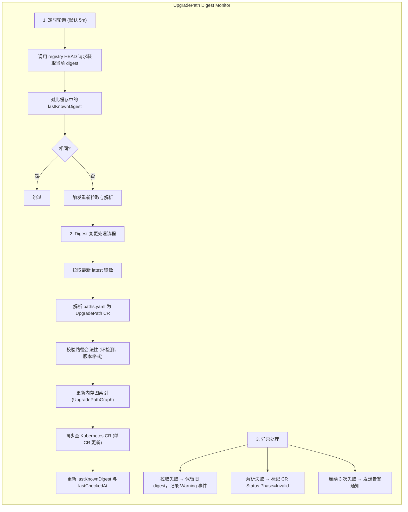

**代码实现**：

```go
// pkg/upgrade/digest_monitor.go
type DigestMonitor struct {
    mu              sync.RWMutex
    ociRef          string
    lastKnownDigest  string
    lastCheckedAt    time.Time
    ociClient       *oci.Client
    checkInterval   time.Duration
    stopCh          chan struct{}
    onDigestChange  func(newDigest string, paths []UpgradePathEdge) error
}

func (m *DigestMonitor) Start(ctx context.Context) error {
    // 首次检查
    if err := m.checkDigest(ctx); err != nil {
        return err
    }
    
    ticker := time.NewTicker(m.checkInterval)
    go func() {
        for {
            select {
            case <-ticker.C:
                _ = m.checkDigest(ctx)
            case <-m.stopCh:
                ticker.Stop()
                return
            }
        }
    }()
    return nil
}

func (m *DigestMonitor) checkDigest(ctx context.Context) error {
    currentDigest, err := m.ociClient.GetDigest(m.ociRef)
    if err != nil {
        return fmt.Errorf("failed to get digest: %w", err)
    }
    
    m.mu.RLock()
    if currentDigest == m.lastKnownDigest {
        m.mu.RUnlock()
        return nil // digest 未变更
    }
    m.mu.RUnlock()
    
    // Digest 变更，拉取最新镜像
    img, err := m.ociClient.Pull(m.ociRef)
    if err != nil {
        return err
    }
    
    layer, err := img.GetLayerByPath("paths.yaml")
    if err != nil {
        return err
    }
    
    var up cvoapi.UpgradePath
    if err := yaml.Unmarshal(layer.Content, &up); err != nil {
        return err
    }
    
    // 解析路径边
    edges := make([]UpgradePathEdge, len(up.Spec.Paths))
    for i, p := range up.Spec.Paths {
        edges[i] = UpgradePathEdge{From: p.From, To: p.To, Blocked: p.Blocked}
    }
    
    // 触发回调更新图
    if m.onDigestChange != nil {
        if err := m.onDigestChange(currentDigest, edges); err != nil {
            return err
        }
    }
    
    m.mu.Lock()
    m.lastKnownDigest = currentDigest
    m.lastCheckedAt = time.Now()
    m.mu.Unlock()
    
    return nil
}
```

#### 4.4.4 UpgradePath 数据结构设计

**单 CR 聚合设计**：所有升级路径定义在单个 `UpgradePath` CR 中，通过 `spec.paths` 数组存储多条路径边。

**CRD 定义**：

```yaml
apiVersion: cvo.openfuyao.cn/v1beta1
kind: UpgradePath
metadata:
  name: openfuyao-upgrade-paths
spec:
  ociRef: "registry/openfuyao-upgradepath:latest"
  paths:
    - from: "v2.4.0"
      to: "v2.5.0"
      blocked: false
      deprecated: false
    - from: "v2.5.0"
      to: "v2.6.0"
      blocked: false
      deprecated: false
      preCheck:
        - name: "etcd-backup"
          required: true
      postCheck:
        - name: "cluster-health"
          required: true
    - from: "v2.4.0"
      to: "v2.6.0"
      blocked: true
      notes: "Direct upgrade blocked, please upgrade via v2.5.0"
status:
  phase: Active
  lastDigest: "sha256:abc123..."
  lastCheckedAt: "2026-05-09T10:00:00Z"
  pathCount: 3
```

**Go 结构体定义**：

```go
type UpgradePathSpec struct {
    OCIRef string              `json:"ociRef"`
    Paths  []UpgradePathEdge   `json:"paths"`
}

// UpgradePathEdge 表示图中的一条边（单条升级路径）
type UpgradePathEdge struct {
    From        string        `json:"from"`
    To          string        `json:"to"`
    Blocked     bool          `json:"blocked,omitempty"`
    Deprecated  bool          `json:"deprecated,omitempty"`
    PreCheck    []CheckStep   `json:"preCheck,omitempty"`
    PostCheck   []CheckStep   `json:"postCheck,omitempty"`
    Notes       string        `json:"notes,omitempty"`
}

type CheckStep struct {
    Name     string `json:"name"`
    Required bool   `json:"required,omitempty"`
}

type UpgradePathStatus struct {
    Phase         UpgradePathPhase `json:"phase"`
    LastDigest    string           `json:"lastDigest,omitempty"`
    LastCheckedAt *metav1.Time     `json:"lastCheckedAt,omitempty"`
    PathCount     int              `json:"pathCount,omitempty"`
    Conditions    []metav1.Condition `json:"conditions,omitempty"`
}

type UpgradePathPhase string

const (
    PhaseActive     UpgradePathPhase = "Active"
    PhaseBlocked    UpgradePathPhase = "Blocked"
    PhaseInvalid    UpgradePathPhase = "Invalid"
)
```

**UpgradePathEdge 设计说明**：

- 每条 `UpgradePathEdge` 代表升级图中的一条有向边
- `From` 和 `To` 定义边的起点和终点（版本节点）
- `Blocked` 标记该边是否被拦截
- `Deprecated` 标记该路径是否已废弃（仍可用但不推荐）
- `PreCheck/PostCheck` 定义升级前后的检查步骤

### 4.5 升级路径与兼容性算法设计

**组件扁平化与兼容性检查算法**：

1. **收集与扁平化**：遍历 `ReleaseImage` 中所有组件，若为 `composite` 类型，递归展开 `subComponents` 至叶子组件列表 `FlatList`。
2. **构建约束图**：为 `FlatList` 中每个组件解析 `compatibility.constraints`，构建有向约束图 `G=(V,E)`。
3. **SAT 求解具体过程**：
   - **变量转换**：将每个组件版本转换为语义化版本约束集合。例如 `etcd: ">=3.5.10"` 转换为区间 `[3.5.10, ∞)`。
   - **区间求交**：对同一组件的多个约束进行区间交集运算。若交集为空，则直接判定冲突。
   - **依赖图遍历**：按拓扑顺序遍历组件，将已解析的版本代入后续组件的约束中。若出现 `A requires B>=x` 但 `B` 已锁定为 `<x` 的版本，则触发回溯或报错。
   - **最终赋值**：若所有约束均满足且无环，返回 `Valid`；否则返回冲突组件对与具体规则。
4. **预检拦截**：在 `ReleaseImageReconciler` 中执行静态校验；在 `BKEClusterReconciler` DAG 执行前执行运行时校验。

**兼容性算法流程图**：

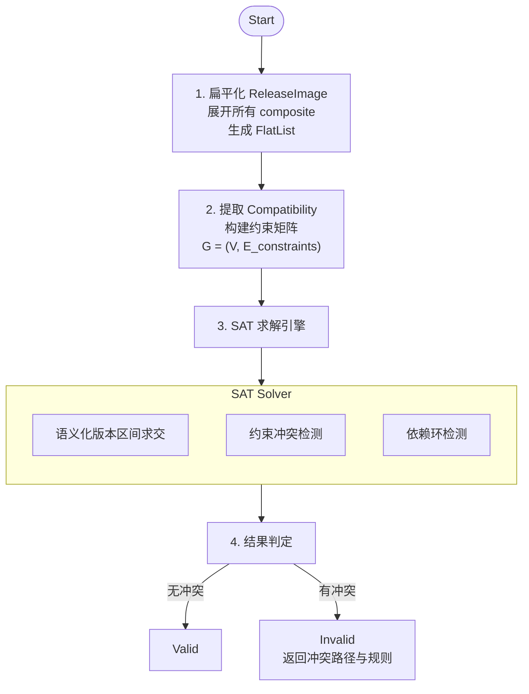

#### 4.5.1 SAT/CSP 兼容性求解设计

**选型**：采用 `github.com/Masterminds/semver/v3` 进行语义化版本解析与约束匹配，结合轻量级 **CSP（约束满足问题）回溯算法**。K8s 生态中版本依赖本质是 CSP 而非布尔 SAT，回溯求解更贴合实际。

**规则语法**：
支持语义化版本约束：`>=`, `<=`, `>`, `<`, `=`, `!=`, 区间 `>=1.0.0 <2.0.0`。

**使用方法**：

1. **变量定义**：每个组件为一个变量，定义域为其可用版本列表。
2. **约束转换**：将 `rule: ">=3.5.10"` 转换为 `semver.Constraints` 对象。
3. **拓扑排序**：按 `dependencies` 构建有向无环图，确定变量赋值顺序。
4. **约束传播与回溯**：
   - 按拓扑序依次为组件分配版本。
   - 每次分配后，检查该组件的 `constraints` 是否与已分配的其他组件版本冲突。
   - 若冲突，回溯至上一个组件尝试其他版本；若所有版本均冲突，返回 `Invalid` 并输出冲突路径。

**代码实现**：

```go
func CheckCompatibility(components []ComponentRef, manifestStore *ManifestStore) error {
    // 1. 解析所有组件的 constraints
    constraints := make(map[string][]*semver.Constraints)
    for _, comp := range components {
        cv := manifestStore.Get(comp.Name, comp.Version)
        for _, c := range cv.Spec.Compatibility.Constraints {
            constraint, err := semver.NewConstraint(c.Rule)
            if err != nil { return err }
            constraints[c.Component] = append(constraints[c.Component], constraint)
        }
    }
    // 2. 校验实际版本是否满足约束
    for compName, consList := range constraints {
        actualVer := getComponentVersion(compName) // 从集群状态获取
        ver, err := semver.NewVersion(actualVer)
        if err != nil { return err }
        for _, c := range consList {
            if !c.Check(ver) {
                return fmt.Errorf("component %s version %s violates constraint %s", compName, actualVer, c.Original())
            }
        }
    }
    return nil
}
```

#### 4.5.2 manifestStore 实现

**设计思路**：`ManifestStore` 作为版本清单的统一访问层，承担以下职责

1. **抽象存储后端**：屏蔽本地文件系统与 OCI 远程仓库的差异，提供统一的 `Get(name, version)` 接口
2. **多级缓存策略**：采用 `sync.Map` 实现内存缓存，避免重复解析 YAML 和拉取 OCI 镜像
3. **降级机制**：优先从本地 `/etc/bke/manifests` 加载，失败后降级至 OCI 拉取，支持离线环境运行
4. **线程安全**：所有缓存操作使用原子操作，支持高并发 Reconcile 循环访问

**架构设计**：

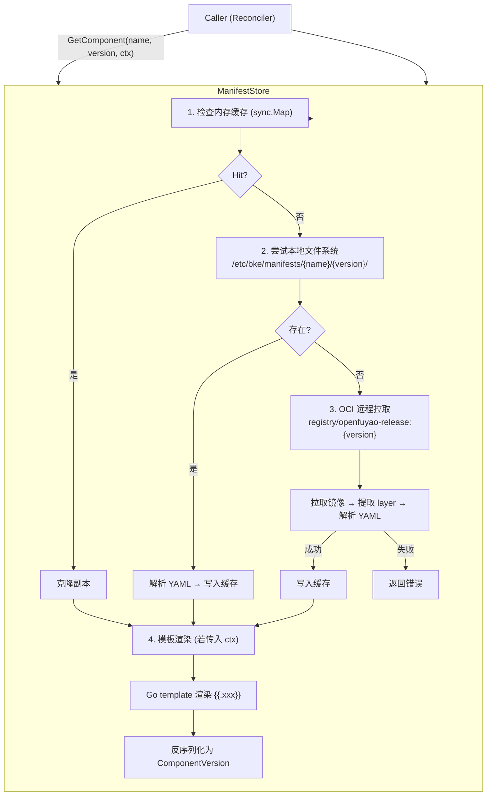

**代码实现**：

```go
// pkg/manifest/store.go
type ManifestStore struct {
    cache     *sync.Map // key: "{name}@{version}" -> *ComponentVersion
    ociClient *oci.Client
    localPath string    // 本地 manifest 根目录，默认 /etc/bke/manifests
}

func (s *ManifestStore) Get(name, version string) (*ComponentVersion, error) {
    key := fmt.Sprintf("%s@%s", name, version)
    if val, ok := s.cache.Load(key); ok {
        return val.(*ComponentVersion), nil
    }
    
    // 1. 尝试从本地 bke-manifests 目录加载
    localPath := fmt.Sprintf("%s/%s/%s/component.yaml", s.localPath, name, version)
    if data, err := os.ReadFile(localPath); err == nil {
        cv := &ComponentVersion{}
        if yaml.Unmarshal(data, cv) == nil {
            s.cache.Store(key, cv)
            return cv, nil
        }
    }
    
    // 2. 降级：从 OCI 拉取对应层的 component.yaml
    img, err := s.ociClient.Pull(fmt.Sprintf("registry/openfuyao-release:%s", version))
    if err != nil { return nil, err }
    
    layer, err := img.GetLayerByPath(fmt.Sprintf("%s/%s/component.yaml", name, version))
    if err != nil { return nil, err }
    
    cv := &ComponentVersion{}
    if err := yaml.Unmarshal(layer.Content, cv); err != nil { return nil, err }
    
    s.cache.Store(key, cv)
    return cv, nil
}

// GetComponentPath 返回组件在镜像或本地文件系统中的路径
func (s *ManifestStore) GetComponentPath(name, version string) string {
    return fmt.Sprintf("%s/%s/component.yaml", name, version)
}

// GetComponent 带模板渲染的组件获取接口
func (s *ManifestStore) GetComponent(name, version string, ctx *TemplateContext) (*ComponentVersion, error) {
    key := fmt.Sprintf("%s@%s", name, version)
    
    // 1. 尝试从缓存加载
    if val, ok := s.cache.Load(key); ok {
        cv := val.(*ComponentVersion)
        if ctx != nil {
            return s.renderTemplate(cv, ctx)
        }
        return cv, nil
    }
    
    // 2. 尝试从本地 bke-manifests 目录加载
    localPath := fmt.Sprintf("%s/%s/%s/component.yaml", s.localPath, name, version)
    if data, err := os.ReadFile(localPath); err == nil {
        cv := &ComponentVersion{}
        if yaml.Unmarshal(data, cv) == nil {
            s.cache.Store(key, cv)
            if ctx != nil {
                return s.renderTemplate(cv, ctx)
            }
            return cv, nil
        }
    }
    
    // 3. 降级：从 OCI 拉取对应层的 component.yaml
    img, err := s.ociClient.Pull(fmt.Sprintf("registry/openfuyao-release:%s", version))
    if err != nil { return nil, err }
    
    layer, err := img.GetLayerByPath(fmt.Sprintf("%s/%s/component.yaml", name, version))
    if err != nil { return nil, err }
    
    cv := &ComponentVersion{}
    if err := yaml.Unmarshal(layer.Content, cv); err != nil { return nil, err }
    
    s.cache.Store(key, cv)
    if ctx != nil {
        return s.renderTemplate(cv, ctx)
    }
    return cv, nil
}

func (s *ManifestStore) GetReleaseImage(version string) (*ReleaseImage, error) {
    key := fmt.Sprintf("release-image@%s", version)
    if val, ok := s.cache.Load(key); ok {
        return val.(*ReleaseImage), nil
    }
    
    // 1. 尝试从本地加载 release.yaml
    localPath := fmt.Sprintf("%s/release-%s.yaml", s.localPath, version)
    if data, err := os.ReadFile(localPath); err == nil {
        ri := &ReleaseImage{}
        if err := yaml.Unmarshal(data, ri); err == nil {
            s.cache.Store(key, ri)
            return ri, nil
        }
    }
    
    // 2. 降级：从 OCI 拉取
    img, err := s.ociClient.Pull(fmt.Sprintf("registry/openfuyao-release:%s", version))
    if err != nil { return nil, err }
    
    // 优先读取 release.yaml layer，否则解析 config
    layer, err := img.GetLayerByPath("release.yaml")
    if err != nil {
        // fallback: 解析 OCI config 为 ReleaseImage
        cfg, err := img.ConfigFile()
        if err != nil { return nil, err }
        ri := &ReleaseImage{}
        if err := json.Unmarshal(cfg.Config.Labels["release-spec"], ri); err != nil {
            return nil, err
        }
        s.cache.Store(key, ri)
        return ri, nil
    }
    
    ri := &ReleaseImage{}
    if err := yaml.Unmarshal(layer.Content, ri); err != nil { return nil, err }
    
    s.cache.Store(key, ri)
    return ri, nil
}
```

#### 4.5.2.1 TemplateContext 模板渲染模块

**设计思路**：组件 YAML 文件中可使用 Go template 语法声明变量占位符，在加载时由 `TemplateContext` 注入实际值。支持集群上下文、网络配置、节点信息等动态渲染。

**支持的变量类别**：

| 变量类别 | 示例变量 | 说明 |
| -------- | -------- | ---- |
| **集群上下文** | `{{.ClusterName}}`、`{{.Namespace}}`、`{{.ClusterUID}}` | 集群标识信息 |
| **版本信息** | `{{.KubernetesVersion}}`、`{{.EtcdVersion}}`、`{{.ProviderVersion}}` | 目标组件版本 |
| **网络配置** | `{{.PodCIDR}}`、`{{.ServiceCIDR}}`、`{{.DNSDomain}}` | 集群网络参数 |
| **节点信息** | `{{.ControlPlaneReplicas}}`、`{{.WorkerNodeCount}}`、`{{.NodeArch}}` | 节点规模与架构 |
| **环境配置** | `{{.Region}}`、`{{.AvailabilityZone}}`、`{{.Environment}}` | 部署环境信息 |
| **自定义变量** | `{{.Custom.*}}` | 用户通过 Annotation 传入的自定义变量 |

**ComponentVersion YAML 模板示例**：

```yaml
apiVersion: cvo.openfuyao.cn/v1beta1
kind: ComponentVersion
metadata:
  name: kubernetes-{{.KubernetesVersion}}
spec:
  name: kubernetes
  version: {{.KubernetesVersion}}
  inline:
    handler: EnsureKubernetesUpgrade
    version: v1.0
  resources:
    - kind: ConfigMap
      apiVersion: v1
      namespace: {{.Namespace}}
      name: k8s-config-{{.ClusterName}}
      data:
        cluster-uid: "{{.ClusterUID}}"
        region: "{{.Region}}"
        pod-cidr: "{{.PodCIDR}}"
        service-cidr: "{{.ServiceCIDR}}"
```

**TemplateContext 数据结构**：

```go
// pkg/manifest/template.go
type TemplateContext struct {
    ClusterName          string            `json:"clusterName"`
    Namespace            string            `json:"namespace"`
    ClusterUID           string            `json:"clusterUID"`
    KubernetesVersion    string            `json:"kubernetesVersion"`
    EtcdVersion          string            `json:"etcdVersion"`
    ProviderVersion      string            `json:"providerVersion"`
    PodCIDR              string            `json:"podCIDR"`
    ServiceCIDR          string            `json:"serviceCIDR"`
    DNSDomain            string            `json:"dnsDomain"`
    ControlPlaneReplicas int               `json:"controlPlaneReplicas"`
    WorkerNodeCount      int               `json:"workerNodeCount"`
    NodeArch             string            `json:"nodeArch"`
    Region               string            `json:"region"`
    AvailabilityZone     string            `json:"availabilityZone"`
    Environment          string            `json:"environment"`
    Custom               map[string]string `json:"custom,omitempty"`
}

// BuildFromBKECluster 从 BKECluster 实例构建 TemplateContext
func BuildTemplateContext(bc *bkev1beta1.BKECluster) *TemplateContext {
    return &TemplateContext{
        ClusterName:          bc.Name,
        Namespace:            bc.Namespace,
        ClusterUID:           string(bc.UID),
        KubernetesVersion:    bc.Spec.KubernetesVersion,
        EtcdVersion:          bc.Spec.EtcdVersion,
        ProviderVersion:      bc.Status.ProviderVersion,
        PodCIDR:              bc.Spec.Networking.PodCIDR,
        ServiceCIDR:          bc.Spec.Networking.ServiceCIDR,
        DNSDomain:            bc.Spec.Networking.DNSDomain,
        ControlPlaneReplicas: bc.Spec.ControlPlane.Replicas,
        WorkerNodeCount:      bc.Spec.WorkerNodeCount,
        NodeArch:             bc.Spec.NodeArchitecture,
        Region:               bc.Spec.Region,
        AvailabilityZone:     bc.Spec.AvailabilityZone,
        Environment:          bc.Labels["environment"],
        Custom:               extractCustomAnnotations(bc),
    }
}

// renderTemplate 渲染组件模板
func (s *ManifestStore) renderTemplate(cv *ComponentVersion, ctx *TemplateContext) (*ComponentVersion, error) {
    data, err := yaml.Marshal(cv)
    if err != nil {
        return nil, err
    }
    
    tmpl, err := template.New("component").Funcs(template.FuncMap{
        "default": func(val, def string) string {
            if val == "" { return def }
            return val
        },
    }).Parse(string(data))
    if err != nil {
        return nil, fmt.Errorf("failed to parse template: %w", err)
    }
    
    var buf bytes.Buffer
    if err := tmpl.Execute(&buf, ctx); err != nil {
        return nil, fmt.Errorf("failed to render template: %w", err)
    }
    
    rendered := &ComponentVersion{}
    if err := yaml.Unmarshal(buf.Bytes(), rendered); err != nil {
        return nil, fmt.Errorf("failed to unmarshal rendered template: %w", err)
    }
    
    return rendered, nil
}
```

**模板渲染在整体流程中的位置**：

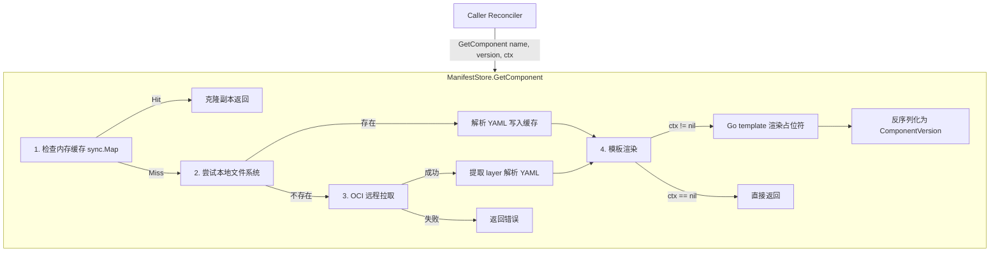

#### 4.5.3 UpgradePath 图模型与路径查找算法

**设计思路**：UpgradePath 本质是一个**有向图 (Directed Graph)**，其中：

- **节点 (Vertex)**：版本号（如 v2.4.0, v2.5.0, v2.6.0）
- **边 (Edge)**：升级路径 `UpgradePathEdge`，携带 blocked/deprecated/preCheck 等属性
- **路径查找**：在图中寻找从 `from` 到 `to` 的可达路径，优先选择最短路径

**图模型设计**：

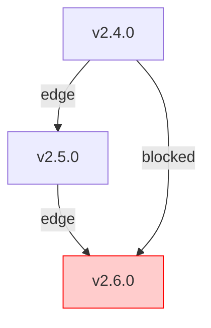

**路径查找算法 (BFS 最短路径)**：

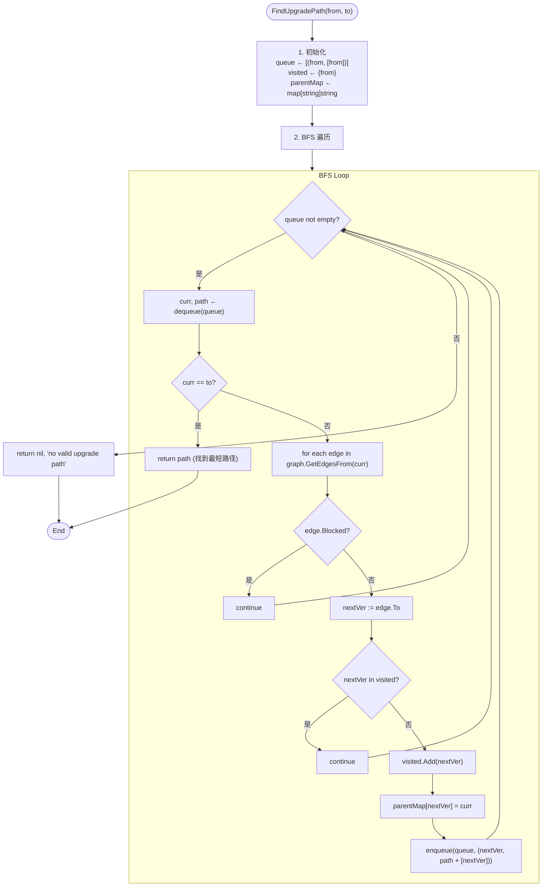

**代码实现**：

```go
// pkg/upgrade/graph.go

// UpgradePathGraph 升级路径图
type UpgradePathGraph struct {
    mu      sync.RWMutex
    adj     map[string][]UpgradePathEdge // 邻接表: version -> edges
    digest  string                       // 当前 OCI digest
}

func NewUpgradePathGraph() *UpgradePathGraph {
    return &UpgradePathGraph{
        adj: make(map[string][]UpgradePathEdge),
    }
}

// LoadFromEdges 从边列表构建图
func (g *UpgradePathGraph) LoadFromEdges(edges []UpgradePathEdge, digest string) {
    g.mu.Lock()
    defer g.mu.Unlock()
    
    g.adj = make(map[string][]UpgradePathEdge)
    for _, edge := range edges {
        g.adj[edge.From] = append(g.adj[edge.From], edge)
        // 确保目标节点也存在
        if _, ok := g.adj[edge.To]; !ok {
            g.adj[edge.To] = []UpgradePathEdge{}
        }
    }
    g.digest = digest
}

// FindPath BFS 查找最短升级路径
func (g *UpgradePathGraph) FindPath(from, to string) ([]UpgradePathEdge, error) {
    g.mu.RLock()
    defer g.mu.RUnlock()
    
    if from == to {
        return nil, nil
    }
    
    // BFS
    type queueItem struct {
        version string
        path    []UpgradePathEdge
    }
    
    queue := []queueItem{{version: from, path: []UpgradePathEdge{}}}
    visited := map[string]bool{from: true}
    
    for len(queue) > 0 {
        curr := queue[0]
        queue = queue[1:]
        
        if curr.version == to {
            return curr.path, nil
        }
        
        for _, edge := range g.adj[curr.version] {
            if edge.Blocked || edge.Deprecated {
                continue
            }
            if visited[edge.To] {
                continue
            }
            visited[edge.To] = true
            newPath := append(append([]UpgradePathEdge{}, curr.path...), edge)
            queue = append(queue, queueItem{version: edge.To, path: newPath})
        }
    }
    
    return nil, fmt.Errorf("no valid upgrade path from %s to %s", from, to)
}

// GetAllVersions 获取图中所有版本节点
func (g *UpgradePathGraph) GetAllVersions() []string {
    g.mu.RLock()
    defer g.mu.RUnlock()
    
    versions := make([]string, 0, len(g.adj))
    for v := range g.adj {
        versions = append(versions, v)
    }
    return versions
}

// HasVersion 检查版本是否存在于图中
func (g *UpgradePathGraph) HasVersion(ver string) bool {
    g.mu.RLock()
    defer g.mu.RUnlock()
    _, ok := g.adj[ver]
    return ok
}

// DetectCycle 检测图中是否存在环 (DFS)
func (g *UpgradePathGraph) DetectCycle() error {
    g.mu.RLock()
    defer g.mu.RUnlock()
    
    visited := make(map[string]bool)
    recStack := make(map[string]bool)
    
    var dfs func(node string) bool
    dfs = func(node string) bool {
        visited[node] = true
        recStack[node] = true
        
        for _, edge := range g.adj[node] {
            if !visited[edge.To] {
                if dfs(edge.To) {
                    return true
                }
            } else if recStack[edge.To] {
                return true
            }
        }
        
        recStack[node] = false
        return false
    }
    
    for node := range g.adj {
        if !visited[node] {
            if dfs(node) {
                return fmt.Errorf("cycle detected in upgrade path graph")
            }
        }
    }
    return nil
}
```

### 4.6 控制器架构与逻辑

#### 4.6.1 控制器概览

| 控制器 | 核心职责 | 协同方式 |
| ---- | ---- | ------ |
| **ClusterVersionReconciler** | 版本声明管理、ReleaseImage/UpgradePath OCI 拉取与解析、触发 BKECluster 调谐 | 更新 BKECluster Annotation `cvo.openfuyao.cn/upgrade-ready` |
| **ReleaseImageReconciler** | 清单校验、兼容性矩阵验证、bke-manifests 路径验证、状态标记 | 独立调谐，更新 `Status.Phase` |
| **UpgradePathReconciler** | 路径图构建、Digest 监控、环检测、提供 `FindPath()` 接口 | 维护 UpgradePathGraph，供 CV 调用 |
| **BKEClusterReconciler** (增强) | 监听版本变更、构建 VersionContext、预创建资源、DAG 调度、Phase 桥接、状态回写 | 直接 Watch CV；从 ComponentFactory 获取 Phase；更新 CV Status |

#### 4.6.2 ClusterVersionReconciler 详细设计

**职责**：

- 监听 `ClusterVersion` 资源变更
- 根据 `Spec.DesiredVersion` 拉取并解析对应的 `ReleaseImage` 和 `UpgradePath`
- 执行升级路径合法性校验
- 触发 `BKECluster` 调谐流程

**调谐流程**：

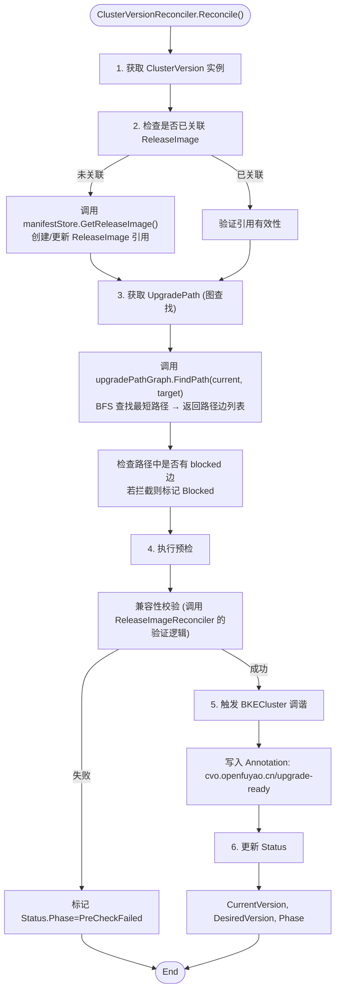

**核心代码**：

```go
func (r *ClusterVersionReconciler) Reconcile(ctx context.Context, req ctrl.Request) (ctrl.Result, error) {
    cv := &cvoapi.ClusterVersion{}
    if err := r.Get(ctx, req.NamespacedName, cv); err != nil {
        return ctrl.Result{}, client.IgnoreNotFound(err)
    }

    // 1. 解析 ReleaseImage
    if cv.Spec.ReleaseImageRef == "" {
        ri, err := r.manifestStore.GetReleaseImage(cv.Spec.DesiredVersion)
        if err != nil {
            return r.updateStatus(ctx, cv, cvoapi.PhaseFailed, err.Error())
        }
        cv.Spec.ReleaseImageRef = ri.Name
    }

    // 2. 验证升级路径 (图查找)
    pathEdges, err := r.upgradePathStore.FindPath(cv.Status.CurrentVersion, cv.Spec.DesiredVersion)
    if err != nil {
        return r.updateStatus(ctx, cv, cvoapi.PhaseBlocked, "no valid upgrade path")
    }
    
    // 检查路径中是否有被拦截的边
    for _, edge := range pathEdges {
        if edge.Blocked {
            return r.updateStatus(ctx, cv, cvoapi.PhaseBlocked, fmt.Sprintf("upgrade path blocked at %s", edge.From))
        }
    }

    // 3. 触发 BKECluster 调谐
    bc := &bkev1beta1.BKECluster{}
    if err := r.Get(ctx, cv.OwnerRef, bc); err != nil {
        return ctrl.Result{}, err
    }
    if bc.Annotations == nil {
        bc.Annotations = make(map[string]string)
    }
    bc.Annotations["cvo.openfuyao.cn/upgrade-ready"] = cv.Spec.DesiredVersion
    r.Update(ctx, bc)

    return r.updateStatus(ctx, cv, cvoapi.PhaseReady, "")
}
```

#### 4.6.3 ReleaseImageReconciler 详细设计

**职责**：

- 监听 `ReleaseImage` 资源变更
- 验证 OCI 镜像完整性与签名
- 解析并校验 `bke-manifests` 中所有组件清单
- 执行兼容性矩阵验证
- 更新 `Status.Phase` 标记校验结果

**调谐流程**：

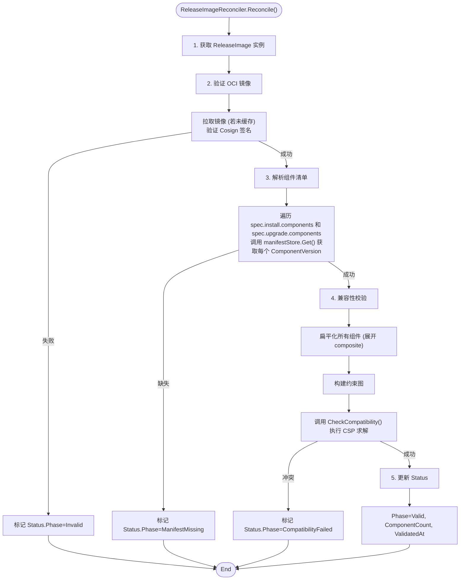

**核心代码**：

```go
func (r *ReleaseImageReconciler) Reconcile(ctx context.Context, req ctrl.Request) (ctrl.Result, error) {
    ri := &cvoapi.ReleaseImage{}
    if err := r.Get(ctx, req.NamespacedName, ri); err != nil {
        return ctrl.Result{}, client.IgnoreNotFound(err)
    }

    // 1. 验证 OCI 签名
    if err := r.verifyOCISignature(ctx, ri); err != nil {
        return r.updateStatus(ctx, ri, cvoapi.PhaseInvalid, err.Error())
    }

    // 2. 解析并验证所有组件
    var components []ComponentRef
    for _, comp := range ri.Spec.Install.Components {
        components = append(components, ComponentRef{Name: comp.Name, Version: comp.Version})
    }
    for _, comp := range ri.Spec.Upgrade.Components {
        components = append(components, ComponentRef{Name: comp.Name, Version: comp.Version})
    }

    // 3. 扁平化 composite 组件
    flatList, err := r.flattenComponents(components)
    if err != nil {
        return r.updateStatus(ctx, ri, cvoapi.PhaseInvalid, err.Error())
    }

    // 4. 兼容性校验
    if err := CheckCompatibility(flatList, r.manifestStore); err != nil {
        return r.updateStatus(ctx, ri, cvoapi.PhaseCompatibilityFailed, err.Error())
    }

    return r.updateStatus(ctx, ri, cvoapi.PhaseValid, "")
}
```

#### 4.6.4 UpgradePathReconciler 详细设计

**职责**：

- 监听 `UpgradePath` 资源变更（单 CR 包含所有路径）
- 解析 OCI 镜像并监控 digest 变更
- 构建并维护升级路径图 (UpgradePathGraph)
- 提供路径查询接口供其他控制器调用

**调谐流程**：

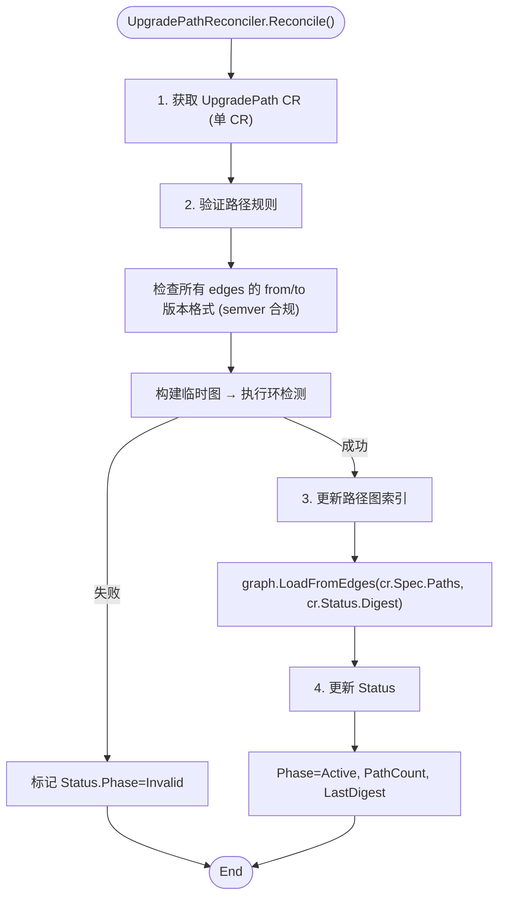

**核心代码**：

```go
func (r *UpgradePathReconciler) Reconcile(ctx context.Context, req ctrl.Request) (ctrl.Result, error) {
    up := &cvoapi.UpgradePath{}
    if err := r.Get(ctx, req.NamespacedName, up); err != nil {
        return ctrl.Result{}, client.IgnoreNotFound(err)
    }

    // 1. 验证所有路径边
    for _, edge := range up.Spec.Paths {
        if _, err := semver.NewVersion(edge.From); err != nil {
            return r.updateStatus(ctx, up, cvoapi.PhaseInvalid, "invalid from version")
        }
        if _, err := semver.NewVersion(edge.To); err != nil {
            return r.updateStatus(ctx, up, cvoapi.PhaseInvalid, "invalid to version")
        }
    }

    // 2. 构建图并检测环
    tempGraph := NewUpgradePathGraph()
    tempGraph.LoadFromEdges(up.Spec.Paths, "")
    if err := tempGraph.DetectCycle(); err != nil {
        return r.updateStatus(ctx, up, cvoapi.PhaseInvalid, err.Error())
    }

    // 3. 更新全局图索引
    r.graph.LoadFromEdges(up.Spec.Paths, up.Status.LastDigest)

    return r.updateStatus(ctx, up, cvoapi.PhaseActive, "")
}

func (r *UpgradePathReconciler) FindPath(from, to string) ([]cvoapi.UpgradePathEdge, error) {
    return r.graph.FindPath(from, to)
}
```

#### 4.6.5 BKEClusterReconciler 增强设计

**核心代码片段 (DAG 调度与 Factory 调用)**：

```go
func (r *BKEClusterReconciler) executeDAG(ctx context.Context, bc *bkev1beta1.BKECluster, dag *topology.DAG, scenario string) error {
    vCtx := r.buildVersionContext(bc)
    tmplCtx := manifest.BuildTemplateContext(bc)
    
    for _, batch := range dag.TopologicalSort() {
        var errs []error
        for _, compName := range batch {
            compRef := dag.GetComponent(compName)
            
            // 从 ManifestStore 获取渲染后的组件定义
            cv, err := r.manifestStore.GetComponent(compName, compRef.Version, tmplCtx)
            if err != nil {
                errs = append(errs, err)
                continue
            }
            
            // 从 ComponentFactory 获取 Phase 实例
            inst, err := r.componentFactory.Resolve(compName, compRef.Version, compRef.Inline)
            if err != nil {
                errs = append(errs, err)
                continue
            }
            
            inst.Handler.SetVersionContext(vCtx)
            inst.Handler.SetComponentVersion(cv)
            if !inst.Handler.NeedExecute(nil, bc) {
                continue
            }
            if err := inst.Handler.Execute(); err != nil {
                errs = append(errs, fmt.Errorf("%s: %w", compName, err))
                if compRef.Strategy.FailurePolicy == "FailFast" { return kerrors.NewAggregate(errs) }
            }
        }
        if len(errs) > 0 { return kerrors.NewAggregate(errs) }
    }
    return nil
}
```

### 4.7 升级流程与 NeedExecute 复用设计

**严格不新增 `ShouldUpgrade()` 接口**。改造现有 Phase 的 `NeedExecute(old, new)`：

```go
func (p *EnsureEtcdUpgrade) NeedExecute(old, new *bkev1beta1.BKECluster) bool {
    if !p.BasePhase.DefaultNeedExecute(old, new) { return false }

    if featuregate.DeclarativeUpgradeEnabled(new) {
        ctx := p.GetVersionContext()
        if ctx == nil { return false }

        cur := ctx.Current["etcd"]
        tgt := ctx.Target["etcd"]
        if cur == tgt || tgt == "" {
            p.Log.V(4).Info("Component version unchanged, skipping")
            return false
        }
        p.Log.Info("Declarative Upgrade triggered: %s -> %s", cur, tgt)
        return true
    }
    return p.isEtcdNeedUpgrade(old, new)
}

// Version：返回组件版本
func (p *EnsureEtcdUpgrade) Version() string {
    return p.Ctx.BKECluster.Status.EtcdVersion
}
```

#### 4.7.1 **Feature Gate 与 Context 实现**

```go
// pkg/featuregate/features.go
var featureGate = featuregate.NewFeatureGate()

func init() {
    featureGate.Add(map[featuregate.Feature]featuregate.FeatureSpec{
        "DeclarativeUpgrade": {Default: false, PreRelease: featuregate.Alpha},
    })
}

func DeclarativeUpgradeEnabled(obj metav1.Object) bool {
    // 支持通过 Annotation 覆盖全局 FeatureGate
    if obj != nil {
        if v, ok := obj.GetAnnotations()["cvo.openfuyao.cn/declarative-upgrade"]; ok {
            return v == "true"
        }
    }
    return featureGate.Enabled("DeclarativeUpgrade")
}

// pkg/phaseframe/context.go
func (p *BasePhase) GetVersionContext() *VersionContext {
    // 从 PhaseContext 中获取注入的版本上下文
    if p.Ctx == nil { return nil }
    return p.Ctx.VersionContext
}
```

#### 4.7.2  VersionContext 数据结构与构建过程

```go
// pkg/upgrade/context.go
type VersionContext struct {
    mu      sync.RWMutex
    Current map[string]string // 组件名 -> 当前运行版本
    Target  map[string]string // 组件名 -> 目标期望版本
}

func NewVersionContext() *VersionContext {
    return &VersionContext{
        Current: make(map[string]string),
        Target:  make(map[string]string),
    }
}

func (vc *VersionContext) SetCurrent(name, ver string) {
    vc.mu.Lock(); defer vc.mu.Unlock()
    vc.Current[name] = ver
}
func (vc *VersionContext) SetTarget(name, ver string) {
    vc.mu.Lock(); defer vc.mu.Unlock()
    vc.Target[name] = ver
}
func (vc *VersionContext) GetTarget(name string) string {
    vc.mu.RLock(); defer vc.mu.RUnlock()
    return vc.Target[name]
}
```

**构建过程**：

```txt
┌─────────────────────────────────────────────────────────────┐
│ BKEClusterReconciler.buildVersionContext(bc)                │
├─────────────────────────────────────────────────────────────┤
│ 1. 获取 ClusterVersion                                      │
│    └─ cv := GetClusterVersionForBKECluster(bc)              │
│                                                             │
│ 2. 构建 Target 版本映射                                      │
│    ├─ desiredVer := cv.Spec.DesiredVersion                  │
│    ├─ targetRI := manifestStore.GetReleaseImage(desiredVer) │
│    ├─ for each component in targetRI.Spec.Upgrade:          │
│    │   vCtx.SetTarget(component.Name, component.Version)    │
│    └─ for each component in targetRI.Spec.Install:          │
│        vCtx.SetTarget(component.Name, component.Version)    │
│                                                             │
│ 3. 构建 Current 版本映射                                     │
│    ├─ currentVer := cv.Status.CurrentVersion                │
│    ├─ currentRI := manifestStore.GetReleaseImage(currentVer)│
│    ├─ for each component in currentRI.Spec.Upgrade:         │
│    │   vCtx.SetCurrent(component.Name, component.Version)   │
│    └─ for each component in currentRI.Spec.Install:         │
│        vCtx.SetCurrent(component.Name, component.Version)   │
│                                                             │
│ 4. 注入到 PhaseContext                                       │
│    └─ bc.PhaseContext.VersionContext = vCtx                 │
│                                                             │
│ 5. 返回 VersionContext                                       │
└─────────────────────────────────────────────────────────────┘
```

**流程图**：

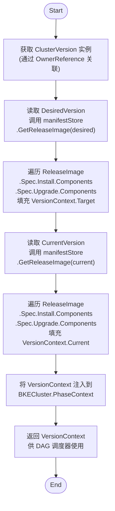

#### 4.7.3 升级前资源预创建扩展机制

**场景描述**：新版本引入的资源（如 ConfigMap、Secret、CRD 等）在旧版本中不存在，需要在升级过程中预先创建，否则后续 Phase 可能因依赖缺失而失败。

**设计思路**：将资源预创建设计为标准的 **inline Phase 组件**，在 `ReleaseImage` 的 `upgrade.components` 中声明，通过 DAG 依赖关系确保在其他组件之前执行。完全复用现有 `ComponentFactory` 和 `NeedExecute()` 机制，无需额外调度逻辑。

**架构设计**：

```txt
┌─────────────────────────────────────────────────────────┐
│              ReleaseImage 升级组件声明                    │
├─────────────────────────────────────────────────────────┤
│ upgrade:                                                 │
│   components:                                            │
│     - name: pre-upgrade-resources  ◀──── 新增组件        │
│       version: v1.0.0                                    │
│     - name: provider-upgrade                             │
│       version: v1.2.0                                    │
│     - name: etcd-upgrade                                 │
│       version: v3.5.12                                   │
│                                                          │
│  DAG 执行顺序:                                           │
│  pre-upgrade-resources → provider-upgrade → etcd-upgrade │
└─────────────────────────────────────────────────────────┘
```

**ComponentVersion 定义**：

```yaml
# bke-manifests/pre-upgrade-resources/v1.0.0/component.yaml
apiVersion: cvo.openfuyao.cn/v1beta1
kind: ComponentVersion
metadata:
  name: pre-upgrade-resources-v1.0.0
spec:
  name: pre-upgrade-resources
  type: leaf
  version: v1.0.0
  inline:
    handler: EnsurePreUpgradeResources
    version: v1.0
  dependencies: []  # 无依赖，确保最先执行
  upgradeStrategy:
    mode: Batch
    batchSize: 1
    timeout: "10m"
    failurePolicy: FailFast
  resources:
    - kind: ConfigMap
      apiVersion: v1
      namespace: kube-system
      name: bke-new-feature-config
      data:
        feature-flag: "enabled"
    - kind: Secret
      apiVersion: v1
      namespace: kube-system
      name: bke-new-cert
      stringData:
        tls.crt: "..."
        tls.key: "..."
```

**Go 结构体扩展**：

```go
// ComponentVersionSpec 扩展
type ComponentVersionSpec struct {
    Name            string              `json:"name"`
    Type            ComponentType       `json:"type"`
    Version         string              `json:"version"`
    Inline          *InlineSpec         `json:"inline,omitempty"`
    SubComponents   []SubComponent      `json:"subComponents,omitempty"`
    Compatibility   CompatibilitySpec   `json:"compatibility,omitempty"`
    Dependencies    []Dependency        `json:"dependencies,omitempty"`
    UpgradeStrategy UpgradeStrategySpec `json:"upgradeStrategy,omitempty"`
    Resources       []ResourceSpec      `json:"resources,omitempty"`  // 新增
}

// ResourceSpec 定义需要创建的资源
type ResourceSpec struct {
    Kind       string            `json:"kind"`
    APIVersion string            `json:"apiVersion"`
    Namespace  string            `json:"namespace,omitempty"`
    Name       string            `json:"name"`
    Labels     map[string]string `json:"labels,omitempty"`
    Data       map[string]string `json:"data,omitempty"`
    StringData map[string]string `json:"stringData,omitempty"`
    Manifest   string            `json:"manifest,omitempty"`
}
```

**Inline Handler 实现**：

```go
// pkg/phase/preupgraderesources/ensure.go
type EnsurePreUpgradeResources struct {
    *phaseframe.BasePhase
    client client.Client
}

func (p *EnsurePreUpgradeResources) Name() string {
    return "EnsurePreUpgradeResources"
}

func (p *EnsurePreUpgradeResources) Version() string {
    return "v1.0"
}

func (p *EnsurePreUpgradeResources) NeedExecute(old, new *bkev1beta1.BKECluster) bool {
    if !p.BasePhase.DefaultNeedExecute(old, new) {
        return false
    }
    
    vCtx := p.GetVersionContext()
    if vCtx == nil {
        return false
    }
    
    // 仅当目标版本包含此组件时执行
    return vCtx.Target["pre-upgrade-resources"] != ""
}

func (p *EnsurePreUpgradeResources) Execute(ctx context.Context) error {
    // 从 ComponentVersion 获取资源清单
    resources := p.GetComponentVersion().Spec.Resources
    if len(resources) == 0 {
        p.Log.V(4).Info("No pre-upgrade resources defined, skipping")
        return nil
    }
    
    // 按依赖顺序排序 (CRD → ConfigMap → Secret → ...)
    sorted := p.sortResourcesByKind(resources)
    
    for _, res := range sorted {
        if err := p.provisionResource(ctx, res); err != nil {
            return fmt.Errorf("failed to provision %s/%s: %w", res.Kind, res.Name, err)
        }
        p.Log.Info("Provisioned pre-upgrade resource", "kind", res.Kind, "name", res.Name)
    }
    
    return nil
}

func (p *EnsurePreUpgradeResources) provisionResource(ctx context.Context, spec ResourceSpec) error {
    switch spec.Kind {
    case "ConfigMap":
        return p.provisionConfigMap(ctx, spec)
    case "Secret":
        return p.provisionSecret(ctx, spec)
    case "CustomResourceDefinition":
        return p.provisionCRD(ctx, spec)
    default:
        return p.provisionFromManifest(ctx, spec)
    }
}

func (p *EnsurePreUpgradeResources) provisionConfigMap(ctx context.Context, spec ResourceSpec) error {
    cm := &corev1.ConfigMap{
        ObjectMeta: metav1.ObjectMeta{
            Name:      spec.Name,
            Namespace: spec.Namespace,
            Labels:    spec.Labels,
        },
        Data: spec.Data,
    }
    
    err := p.client.Create(ctx, cm)
    if apierrors.IsAlreadyExists(err) {
        return nil // 幂等：已存在则跳过
    }
    return err
}

func (p *EnsurePreUpgradeResources) provisionSecret(ctx context.Context, spec ResourceSpec) error {
    secret := &corev1.Secret{
        ObjectMeta: metav1.ObjectMeta{
            Name:      spec.Name,
            Namespace: spec.Namespace,
            Labels:    spec.Labels,
        },
        StringData: spec.StringData,
    }
    
    err := p.client.Create(ctx, secret)
    if apierrors.IsAlreadyExists(err) {
        return nil
    }
    return err
}

func (p *EnsurePreUpgradeResources) sortResourcesByKind(resources []ResourceSpec) []ResourceSpec {
    // 按依赖优先级排序：CRD > ConfigMap > Secret > 其他
    kindPriority := map[string]int{
        "CustomResourceDefinition": 0,
        "ConfigMap":                1,
        "Secret":                   2,
    }
    
    sort.Slice(resources, func(i, j int) bool {
        pi := kindPriority[resources[i].Kind]
        pj := kindPriority[resources[j].Kind]
        return pi < pj
    })
    
    return resources
}
```

**注册到 ComponentFactory**：

```go
// cmd/manager/main.go
func main() {
    // ... 初始化控制器
    
    // 注册预创建资源 Phase
    componentFactory.Register(
        "EnsurePreUpgradeResources",
        "v1.0",
        &preupgraderesources.EnsurePreUpgradeResources{
            BasePhase: basePhase,
            Client:    mgr.GetClient(),
        },
    )
}
```

**ReleaseImage 中的引用**：

```yaml
# ReleaseImage OCI 定义
version: "v2.6.0"
ociRef: "registry/openfuyao-release:v2.6.0"
install:
  components:
    - name: kubernetes
      version: v1.29.0
    - name: etcd
      version: v3.5.12
upgrade:
  components:
    - name: pre-upgrade-resources  # 最先执行
      version: v1.0.0
    - name: provider-upgrade
      version: v1.2.0
    - name: etcd-upgrade
      version: v3.5.12
```

**在 DAG 中的执行流程**：

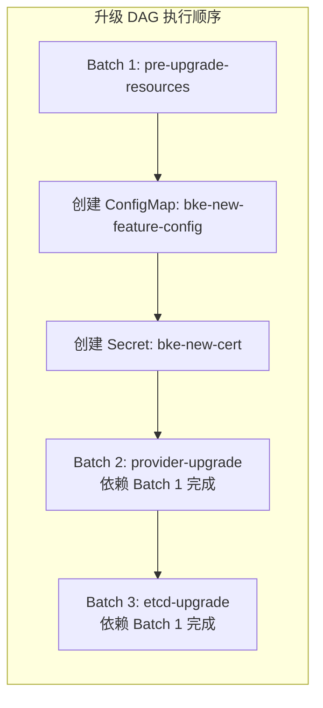

**NeedExecute 触发逻辑**：

```go
func (p *EnsurePreUpgradeResources) NeedExecute(old, new *bkev1beta1.BKECluster) bool {
    // 1. 基础检查：集群状态是否允许升级
    if !p.BasePhase.DefaultNeedExecute(old, new) {
        return false
    }
    
    // 2. 版本上下文检查：目标版本是否包含此组件
    vCtx := p.GetVersionContext()
    if vCtx == nil {
        return false
    }
    
    currentVer := vCtx.Current["pre-upgrade-resources"]
    targetVer := vCtx.Target["pre-upgrade-resources"]
    
    // 3. 版本不同或首次安装时执行
    if currentVer != targetVer {
        p.Log.Info("Pre-upgrade resources triggered", 
            "current", currentVer, "target", targetVer)
        return true
    }
    
    return false
}
```

**扩展新资源类型**：

如需支持新的资源类型，只需在 `provisionResource` 中添加 case 分支：

```go
func (p *EnsurePreUpgradeResources) provisionResource(ctx context.Context, spec ResourceSpec) error {
    switch spec.Kind {
    case "ConfigMap":
        return p.provisionConfigMap(ctx, spec)
    case "Secret":
        return p.provisionSecret(ctx, spec)
    case "CustomResourceDefinition":
        return p.provisionCRD(ctx, spec)
    case "ServiceAccount":  // 新增类型
        return p.provisionServiceAccount(ctx, spec)
    default:
        return p.provisionFromManifest(ctx, spec)
    }
}
```

## 5. 平滑升级方案（旧版到新版）

### 5.1 自动迁移方案

1. **部署新 CRD 与控制器（FeatureGate 关闭）**：部署 API 与控制器，`DeclarativeUpgrade=false`，保持原有逻辑。
2. **自动创建 ClusterVersion**：`BKEClusterReconciler` 检测到无 CV 关联时，自动创建 CV 实例，`DesiredVersion` 与 `CurrentVersion` 填充为当前 `BKECluster.Spec.OpenFuyaoVersion`。
3. **开启 FeatureGate 切换**：运维开启开关，后续变更由新流程接管。

### 5.2 手工提前构建方案

为支持更可控的灰度与预检，支持手工提前构建 `ReleaseImage` 与 `UpgradePath`：

1. **手工构建 ReleaseImage** oci镜像，并上传到仓库。
   - 内容包含目标版本的所有组件清单。控制器解析后标记 `Status.Phase=Valid`。
2. **手工构建 UpgradePath**
   - 定义从旧版本到新版本的升级路径，支持从旧版本往新版本升级。

## 6. 异常场景、性能、安全与可扩展性设计

### 6.1 异常场景处理

| 异常 | 处理机制 |
| -- | ------ |
| OCI 镜像拉取失败 | 指数退避重试（3次）；本地 ConfigMap fallback；`ReleaseImage` 标记 `Invalid` 并阻断升级 |
| DAG 存在环路 | 拓扑排序前执行 Tarjan 环检测；超时强制中断并记录 `CycleDetected` 事件 |
| Phase 执行失败 | 记录详细 `History`；支持 `AllowDowngrade=true` 自动回滚；提供 `--skip-failed-component` 紧急开关 |
| 上下文注入丢失 | `NeedExecute` 增加 nil 保护；单元测试覆盖上下文生命周期；Feature Gate 灰度 |

### 6.2 性能设计

- **缓存层**：OCI 镜像 Config、`UpgradePath` 规则、`ComponentVersion` 元数据均使用 LRU 缓存（TTL 5m）。
- **异步解析**：OCI 拉取与 DAG 构建采用 goroutine 池，避免阻塞 Reconcile 循环。
- **批量调度**：`Batch` 模式支持并发执行非依赖组件，利用 `errgroup` 控制最大并发数（默认 10）。
- **超时控制**：单 Phase 执行超时默认 30m，可配置；DAG 全局超时 4h。

### 6.3 安全设计

- **镜像签名**：OCI 镜像强制使用 Cosign 签名验证，未通过校验拒绝加载。
- **RBAC 最小权限**：控制器仅授予 `get/list/watch` 自身 CRD 与 `patch` BKECluster 的权限。
- **敏感数据**：证书、kubeconfig 等通过 K8s Secrets 存储，传输全程 mTLS。
- **审计日志**：全链路操作记录至 K8s AuditLog。

### 6.4 可扩展性设计

- **水平扩展**：控制器支持 Leader Election ，支持多实例部署。
- **插件化 Phase**：通过 `ComponentFactory` 注册机制，第三方组件可动态注入 YAML 或 Go 插件。
- **多架构支持**：OCI 镜像支持 `linux/amd64`, `linux/arm64` 多架构清单，自动匹配节点架构。

## 7. 工作量评估

| 阶段 | 任务内容 | 工作量 (人天) | 说明 |
| ----- | ------ | --------- | ------ |
| **1. CRD 与 API** | CV/RI/UP/ComponentVersion 定义、Webhook、DeepCopy | 10 | 新手需学习 kubebuilder 脚手架、CRD 验证规则、不可变字段约束 |
| **2. OCI 解析层** | `go-containerregistry` 集成、Config 解析、缓存机制 | 15 | 镜像分层拉取、鉴权配置、离线 fallback 调试耗时较长 |
| **3. 控制器开发** | CV/RI/UP 控制器逻辑、状态机、Annotation 协同机制 | 18 | controller-runtime 调谐循环、Watch 过滤、Reconcile 幂等性设计 |
| **4. DAG 引擎** | 依赖图构建、拓扑排序、FailurePolicy 分支、并发调度 | 14 | 图算法实现、环检测、并发安全与超时控制易出 Bug |
| **5. Phase 适配** | 4 个 Phase YAML 化、`Version()` 接口、`NeedExecute` 改造、Factory 注册 | 10 | 上下文注入调试、旧逻辑兼容、单元测试覆盖 |
| **6. CSP/SAT 求解** | 约束解析、回溯算法实现、兼容性校验集成 | 8 | 语义化版本库使用、约束冲突路径追踪、边界条件处理 |
| **7. 迁移与测试** | 旧版平滑迁移、OCI 预构建流水线、E2E、压测、安全扫描 | 12 | 新手编写集成测试与 Mock 较慢，需反复联调 |
| **总计** | | **87 人天** | 含代码评审、联调缓冲、文档编写 |

## 8. 架构图与流程图

### 8.1 控制器协同架构图

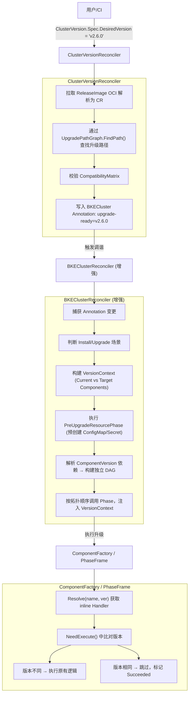

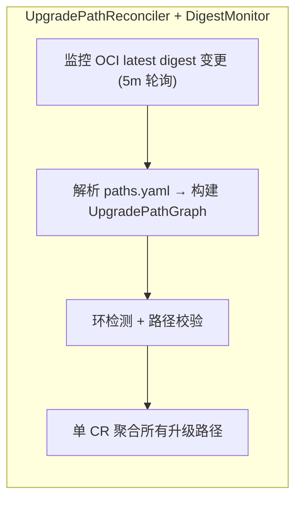

## 9. 测试计划与验收标准

| 测试类型 | 覆盖场景 |
| ------ | ----- |
| **单元测试** | DAG 拓扑排序、兼容性矩阵校验、`NeedExecute` 分支逻辑、OCI 解析 |
| **集成测试** | CV ↔ RI ↔ BKECluster 状态联动、Annotation 触发机制、Phase 注册表映射 |
| **E2E 测试** | 补丁升级、跨版本升级、单组件独立升级、失败中断与回滚、OCI 缺失降级 |
| **兼容性测试** | Feature Gate 关闭时旧流程正常运行；新旧版本混合状态平滑过渡 |
| **压测** | 万级节点并发升级、DAG 构建耗时 <2s、内存泄漏检测 |

**毕业标准**：

- **Alpha**: CRD 注册，控制器可启动，日志验证清单解析与路径查找正确。
- **Beta**: 接管升级流程，与旧 Phase 并行运行，结果对比验证，E2E 通过率 >95%。
- **GA**: 全量切换，移除旧版本硬编码调度逻辑，支持生产环境灰度发布。

## 10. 风险与缓解

| 风险 | 影响 | 缓解措施 |
| ------ | ------ | ------- |
| OCI 镜像拉取失败或解析错误 | 升级阻塞 | 指数退避重试；本地 ConfigMap fallback；`ReleaseImage` 提前标记 `Invalid` |
| 依赖图存在环路 | DAG 构建死锁 | 拓扑排序前执行环检测算法；超时强制中断并记录 `CycleDetected` 事件 |
| 兼容性校验误报/漏报 | 升级中断或集群不稳定 | 提供 `--skip-compatibility-check` 紧急开关；规则支持热更新；记录详细审计日志 |
| Phase 上下文注入丢失 | 升级决策错误 | `NeedExecute` 增加 nil 保护；单元测试覆盖上下文生命周期；Feature Gate 灰度 |
