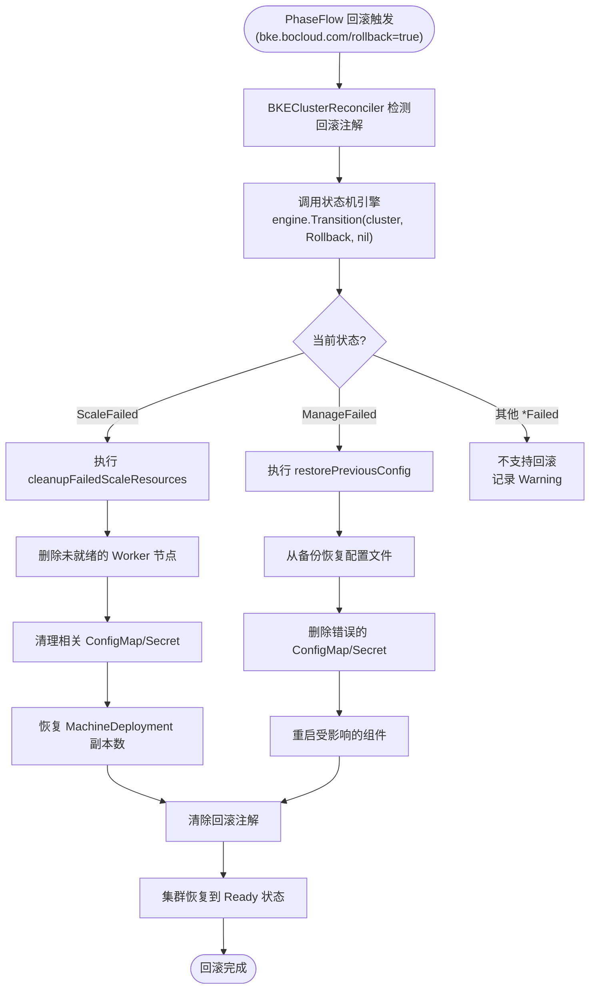
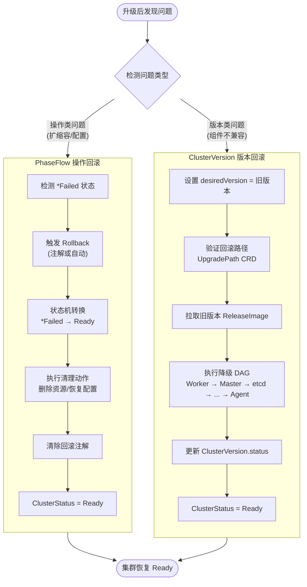

# KEP-11: 集群回滚能力设计方案

| 字段 | 值 |
|------|-----|
| **KEP 编号** | KEP-11 |
| **标题** | 集群回滚能力设计：PhaseFlow 操作回滚 + ClusterVersion 版本回滚 + 双机制协同 |
| **状态** | `provisional` |
| **类型** | Feature |
| **作者** | openFuyao Team |
| **创建日期** | 2026-08-26 |
| **依赖** | KEP-5 (ClusterVersion/ReleaseImage/UpgradePath)、KEP-6 (声明式 DAG/三层状态机)、声明式集群版本回滚方案设计.md、声明式集群备份与恢复方案设计.md |
| **来源** | code/rollback/BKE回滚与备份能力规划.md |

---

## 目录

1. [概述](#1-概述)
2. [现状分析](#2-现状分析)
3. [设计目标与约束](#3-设计目标与约束)
4. [重试与回滚的边界](#4-重试与回滚的边界)
5. [PhaseFlow 操作回滚设计](#5-phaseflow-操作回滚设计)
6. [ClusterVersion 版本回滚设计](#6-clusterversion-版本回滚设计)
7. [双机制协同设计](#7-双机制协同设计)
8. [安装失败处理](#8-安装失败处理)
9. [回滚触发机制](#9-回滚触发机制)
10. [回滚状态转换规则](#10-回滚状态转换规则)
11. [回滚场景详细说明](#11-回滚场景详细说明)
12. [与备份恢复的协同](#12-与备份恢复的协同)
13. [工作量评估](#13-工作量评估)
14. [风险与缓解](#14-风险与缓解)
15. [毕业标准](#15-毕业标准)

---

## 1. 概述

### 1.1 设计背景

BKE 采用**双机制架构**管理集群生命周期，但当前**没有任何自动化回滚能力**。本提案基于 BKE 回滚与备份能力规划文档，设计完整的回滚能力，覆盖升级失败、扩缩容失败、配置变更失败等场景。

### 1.2 回滚能力总览

| 场景 | 优先级 | 回滚策略 | 负责机制 |
|------|--------|---------|---------|
| **升级失败** | P0 | 版本回滚（降级） | ClusterVersion（验证路径）+ 声明式 DAG（执行降级） |
| **扩缩容失败** | P1 | 状态回滚 + 资源清理 | PhaseFlow（状态机回滚 + 资源清理） |
| **配置变更失败** | P1 | 配置回滚 | PhaseFlow（状态机回滚 + 配置恢复） |
| **删除失败** | P1 | 不支持回滚（不可逆操作） | 重试删除 / 强制删除 / 手动清理 |
| **安装失败** | P0 | 清理重建（状态不可逆） | 不支持自动回滚，需人工清理重建 |

### 1.3 与现有 KEP 的关系

| 文档 | 覆盖范围 | 与本 KEP 的关系 |
|------|----------|---------------|
| **声明式集群版本回滚方案设计.md** | DAG 级声明式回滚（组件级/节点级/集群级） | 本 KEP 引用其 DAG 回滚细节，聚焦双机制协同 |
| **声明式集群备份与恢复方案设计.md** | 备份/恢复（etcd/配置/应用） | 本 KEP 引用其 etcd 快照恢复作为回滚兜底 |
| **本 KEP** | PhaseFlow 操作回滚 + ClusterVersion 版本回滚 + 双机制协同 | 总体回滚框架设计 |

---

## 2. 现状分析

### 2.1 当前回滚能力现状

**关键发现：BKE 当前没有任何自动化回滚能力**

| 机制 | 回滚能力 | 失败处理方式 |
|------|---------|-------------|
| **PhaseFlow** | ❌ 无 | 设置 `*Failed` 状态，需人工介入 |
| **ClusterVersion** | ❌ 无 | 设置 `Failed` 状态，需人工介入 |
| **声明式 DAG** | ❌ 无 | 记录错误到 `DeclarativeUpgrade.LastError`，需人工介入 |

### 2.2 BKE 双机制架构

```
┌─────────────────────────────────────────────────────────────┐
│  机制一：PhaseFlow（阶段流）                                  │
│  ├─ 职责：操作类任务（安装、扩缩容、删除、纳管、Addon部署）     │
│  ├─ 核心组件：PhaseFlow、Phase、PhaseContext                  │
│  ├─ 状态管理：ClusterStatus 字段（状态机）                    │
│  ├─ 执行逻辑：NeedExecute() → Execute() → ReportStatus()    │
│  └─ 失败处理：设置 *Failed 状态，需人工介入                   │
└─────────────────────────────────────────────────────────────┘

┌─────────────────────────────────────────────────────────────┐
│  机制二：ClusterVersion（版本管理）                           │
│  ├─ 职责：版本生命周期管理（路径验证、镜像管理）               │
│  ├─ 核心组件：ClusterVersion CRD、UpgradePath CRD           │
│  ├─ 状态管理：ClusterVersion.status.phase                   │
│  ├─ 执行逻辑：验证路径 → 拉取镜像 → 设置 upgrade-ready 注解 │
│  └─ 失败处理：设置 PreCheckFailed，需人工介入               │
└─────────────────────────────────────────────────────────────┘

┌─────────────────────────────────────────────────────────────┐
│  执行器：声明式 DAG（升级执行）                               │
│  ├─ 职责：执行升级/降级操作                                   │
│  ├─ 触发条件：检测到 upgrade-ready 注解                       │
│  ├─ 执行逻辑：构建 DAG → 拓扑排序 → 逐组件执行              │
│  └─ 失败处理：记录错误，需人工介入                           │
└─────────────────────────────────────────────────────────────┘
```

### 2.3 BKE 三层重试架构

BKE 当前已实现三层重试机制，回滚是**重试失败后的最后手段**：

```
┌─────────────────────────────────────────────────────────────────────┐
│  L1: controller-runtime workqueue rate limiter                      │
│  ├─ 范围：单次 reconcile 错误                                       │
│  ├─ 触发：自动（错误返回时）                                        │
│  ├─ 次数：无限（FastSlowRateLimiter 退避）                          │
│  └─ 目的：处理瞬时错误（网络抖动、API Server 短暂不可用）            │
├─────────────────────────────────────────────────────────────────────┤
│  L2: StatusManager 失败计数器                                       │
│  ├─ 范围：BKECluster/BKENode 状态级别                               │
│  ├─ 触发：自动（*Failed 状态）                                      │
│  ├─ 次数：默认 10 次（ReconcileAllowedFailedCount）                 │
│  ├─ 行为：状态伪装（显示正常状态）+ 自动重新入队                    │
│  └─ 超限：设置 NodeFailedFlag，停止自动协调                         │
├─────────────────────────────────────────────────────────────────────┤
│  L3: Retry 注解（手动）                                             │
│  ├─ 范围：失败节点级别                                              │
│  ├─ 触发：手动（kubectl annotate bke.bocloud.com/retry=...）        │
│  ├─ 动作：清除 NodeFailedFlag + 重置 StatusManager 缓存             │
│  └─ 结果：Phase 重新评估 NeedExecute()，从检查点恢复                │
└─────────────────────────────────────────────────────────────────────┘
```

---

## 3. 设计目标与约束

### 3.1 设计目标

1. **PhaseFlow 操作回滚**：为扩缩容、配置变更等操作类任务提供自动/手动回滚能力
2. **ClusterVersion 版本回滚**：为升级失败提供版本降级能力（BKE 差异化能力，OpenShift 不支持）
3. **双机制协同**：PhaseFlow 和 ClusterVersion 各司其职，协同提供完整回滚能力
4. **安装失败处理**：提供自动化清理脚本，支持快速清理重建

### 3.2 设计约束

| 约束 | 说明 |
|------|------|
| **幂等性** | 回滚操作必须幂等，可安全重复执行 |
| **清理副作用** | 回滚必须清理操作过程中创建的所有资源 |
| **恢复一致状态** | 回滚后集群必须处于一致状态，不能有残留中间状态 |
| **可观测性** | 回滚过程必须有清晰的日志和事件记录 |
| **数据保全** | 回滚不删除用户数据（etcd 数据、PV 等） |
| **版本可追溯** | 记录回滚历史，支持回溯 |

### 3.3 不可回滚场景

| 场景 | 原因 | 处理方式 |
|------|------|----------|
| **删除操作** | 删除是不可逆操作，已删除的资源无法恢复 | 重试删除 / 强制删除 / 手动清理 |
| **安装操作** | 安装创建的基础设施（etcd、证书、网络）状态不可逆 | 清理重建 |

---

## 4. 重试与回滚的边界

### 4.1 本质区别

| 维度 | 重试（Retry） | 回滚（Rollback） |
|------|--------------|-----------------|
| **目标** | 重新尝试**同一个失败的操作** | **撤销**操作，返回到之前的稳定状态 |
| **方向** | **向前** - 继续朝原始目标前进 | **向后** - 撤销变更，返回安全状态 |
| **状态转换** | `*Failed → InProgress` | `*Failed → Ready` |
| **数据/资源影响** | 保留部分进度 | 丢弃部分进度，清理已创建资源 |
| **适用场景** | 瞬时故障、外部依赖问题 | 根本性失败、状态不一致 |
| **当前状态** | ✅ 已实现（三层重试架构） | ❌ 未实现（本提案设计） |

### 4.2 决策流程

```
操作失败
  ↓
L1 自动重试（瞬时故障）
  ↓ 仍失败
L2 自动重试（最多 10 次）
  ↓ 仍失败
L3 手动重试（修复根因后）
  ↓ 仍失败
回滚（放弃操作，返回安全状态）
```

### 4.3 什么时候重试？

- 失败是**瞬时的**（网络超时、临时资源短缺）
- 失败是**外部的**（SSH 连接失败、包下载错误）
- 部分进度**有效且可复用**（etcd 已初始化、证书已生成）
- 已经**修复了根本原因**（修复网络、释放磁盘空间、纠正配置）
- 操作处于**早中期**，重新执行是安全的

### 4.4 什么时候回滚？

- 失败是**根本性的**（版本不兼容、配置错误）
- 部分状态**不一致或损坏**（组件升级一半）
- 需要**快速返回已知良好状态**
- 重试多次仍然失败
- 操作处于**后期**，部分进度不可用

---

## 5. PhaseFlow 操作回滚设计

### 5.1 设计思路

PhaseFlow 回滚针对**操作类任务**（扩缩容、配置变更），通过状态机引擎实现状态转换和资源清理。

**核心原则**：

1. **清理副作用**：回滚必须清理操作过程中创建的所有资源（节点、ConfigMap、Secret 等）
2. **恢复一致状态**：回滚后集群必须处于一致状态
3. **幂等性**：回滚操作本身必须是幂等的
4. **可观测性**：回滚过程必须有清晰的日志和事件记录

### 5.2 支持的回滚场景

| 场景 | 失败状态 | 回滚目标状态 | 回滚策略 | 预计时间 |
|------|---------|-------------|---------|---------|
| 扩容失败 | ClusterScaleFailed | ClusterReady | 清理失败资源，恢复节点池 | 5-15 分钟 |
| 缩容失败 | ClusterScaleFailed | ClusterReady | 恢复节点，重新加入集群 | 5-15 分钟 |
| 配置变更失败 | ClusterManageFailed | ClusterReady | 恢复配置文件，重启组件 | 3-10 分钟 |
| 删除失败 | ClusterDeleteFailed | - | ❌ 不支持回滚 | - |
| 安装失败 | ClusterInitializationFailed | - | ❌ 不支持回滚 | - |

**回滚决策树**：

```
操作失败
  ↓
判断操作类型
  ├─ 扩容/缩容 → 重试 → 仍失败 → 回滚到 Ready
  ├─ 配置变更 → 重试 → 仍失败 → 回滚到 Ready
  ├─ 删除 → 重试/强制删除/手动清理 → 完成删除
  └─ 安装 → 清理重建
```

### 5.3 回滚状态转换规则

基于现有状态机引擎设计回滚规则，新增 `TriggerRollback` 触发器：

```go
// pkg/statemachine/rollback_transitions.go

func RegisterRollbackTransitions(e *statemachine.Engine) {
    // ScaleFailed → Ready（扩缩容回滚）
    e.AddTransition(statemachine.Transition{
        FromState: bkev1beta1.ClusterScaleFailed,
        ToState:   bkev1beta1.ClusterReady,
        Trigger:   "Rollback",
        Condition: isScaleRollbackComplete,
        Action:    cleanupFailedScaleResources,
    })

    // ManageFailed → Ready（配置变更回滚）
    e.AddTransition(statemachine.Transition{
        FromState: bkev1beta1.ClusterManageFailed,
        ToState:   bkev1beta1.ClusterReady,
        Trigger:   "Rollback",
        Condition: isManageRollbackComplete,
        Action:    restorePreviousConfig,
    })

    // 注意：删除操作不支持回滚
    // DeleteFailed 状态只能通过重试删除或手动清理来处理
    // 最终状态是 Deleted，而不是 Ready
}
```

### 5.4 回滚执行流程



### 5.5 回滚 Action 实现

```go
// pkg/statemachine/rollback_actions.go

// cleanupFailedScaleResources 扩缩容失败资源清理
func cleanupFailedScaleResources(ctx context.Context, cluster *bkev1beta1.BKECluster) error {
    // 1. 删除未就绪的 Worker 节点
    if err := deleteUnreadyNodes(ctx, cluster); err != nil {
        return fmt.Errorf("delete unready nodes: %w", err)
    }

    // 2. 清理相关 ConfigMap/Secret
    if err := cleanupScaleResources(ctx, cluster); err != nil {
        return fmt.Errorf("cleanup scale resources: %w", err)
    }

    // 3. 恢复 MachineDeployment 副本数
    if err := restoreMachineDeploymentReplicas(ctx, cluster); err != nil {
        return fmt.Errorf("restore machine deployment replicas: %w", err)
    }

    return nil
}

// restorePreviousConfig 配置变更失败后恢复配置
func restorePreviousConfig(ctx context.Context, cluster *bkev1beta1.BKECluster) error {
    // 1. 从备份恢复配置文件
    if err := restoreConfigFromBackup(ctx, cluster); err != nil {
        return fmt.Errorf("restore config from backup: %w", err)
    }

    // 2. 删除错误的 ConfigMap/Secret
    if err := deleteInvalidConfigs(ctx, cluster); err != nil {
        return fmt.Errorf("delete invalid configs: %w", err)
    }

    // 3. 重启受影响的组件
    if err := restartAffectedComponents(ctx, cluster); err != nil {
        return fmt.Errorf("restart affected components: %w", err)
    }

    return nil
}
```

---

## 6. ClusterVersion 版本回滚设计

### 6.1 设计思路

ClusterVersion 回滚是**版本回滚**（降级），与 PhaseFlow 的**操作回滚**有本质区别：

| 维度 | PhaseFlow 操作回滚 | ClusterVersion 版本回滚 |
|------|-------------------|------------------------|
| **回滚对象** | 操作结果（节点、配置等） | 组件版本（Agent、etcd、Master 等） |
| **回滚方向** | 撤销操作，返回 Ready 状态 | 降级组件，返回旧版本 |
| **复杂度** | 中等（清理资源） | 高（组件降级、数据格式兼容） |
| **组件顺序** | 无特定顺序 | 必须按相反顺序降级 |
| **数据影响** | 清理创建的资源 | 可能需要数据格式降级 |
| **风险** | 资源残留 | 版本不兼容、数据丢失 |

### 6.2 ClusterVersion 的职责边界

ClusterVersion **只负责验证和准备**，不直接执行降级：

1. **验证回滚路径**：通过 `UpgradePath` CRD 验证回滚路径是否合法
2. **拉取旧版本镜像**：拉取目标版本的 ReleaseImage（OCI 镜像）
3. **触发降级 DAG**：由 BKECluster 控制器检测到 `desiredVersion` 变化后执行降级 DAG

### 6.3 回滚方案选择

BKE 提供两种版本回滚方案：

#### 方案一：降级 DAG（推荐用于复杂场景）

**设计思路**：
- 参考升级 DAG 的设计，实现专门的降级 DAG
- 为每个组件实现特定的降级逻辑（数据迁移、配置回滚等）
- 按相反顺序执行降级（Worker → Master → etcd → Containerd → Agent）

**降级 DAG 节点顺序**：

```
升级 DAG 顺序：
  Agent → Containerd → etcd → Master → Worker

降级 DAG 顺序（相反）：
  Worker → Master → etcd → Containerd → Agent
```

**核心代码**：

```go
// controllers/capbke/bkecluster_rollback_dag.go

func (r *BKEClusterReconciler) executeRollbackDAG(
    ctx context.Context,
    bkeCluster *bkev1beta1.BKECluster,
    targetVersion string,
) (ctrl.Result, error) {
    // 1. 解析 ReleaseImage
    releaseBundle, err := r.resolveReleaseBundle(ctx, targetVersion)
    if err != nil {
        return ctrl.Result{}, err
    }

    // 2. 构建降级 DAG（与升级 DAG 顺序相反）
    dag := r.buildRollbackDAG(releaseBundle)
    // DAG 节点顺序：Worker → Master → etcd → Containerd → Agent

    // 3. 执行降级 DAG
    if err := r.executeDAG(ctx, bkeCluster, dag); err != nil {
        bkeCluster.Status.DeclarativeUpgrade.LastError = err.Error()
        return ctrl.Result{}, err
    }

    // 4. 完成降级
    return r.completeDeclarativeRollback(ctx, bkeCluster, targetVersion)
}
```

**优点**：
- ✅ 精确控制每个组件的降级过程
- ✅ 可以针对每个组件实现特定的降级逻辑
- ✅ 可以处理组件间的依赖关系
- ✅ 可以实现部分降级

**缺点**：
- ❌ 实现复杂，需要为每个组件编写降级代码
- ❌ 需要维护降级 DAG 的拓扑关系
- ❌ 测试工作量大

**适用场景**：组件版本间有数据格式变更，需要精确控制降级过程

#### 方案二：复用升级流程执行降级（推荐用于快速交付）

**设计思路**：
- BKE 降级机制设计：回滚本质是"降级"，复用现有升级流程
- 设置目标版本为旧版本，按正常升级流程执行
- 不需要为每个组件编写专门的降级代码
- 通过重新应用旧版本的 manifest 和配置来实现降级
- **注意**：OpenShift 不支持版本回滚，这是 BKE 的差异化能力

**核心代码**：

```go
// controllers/capbke/bkecluster_controller.go

func (r *BKEClusterReconciler) executeRollback(
    ctx context.Context,
    bkeCluster *bkev1beta1.BKECluster,
    targetVersion string,
) (ctrl.Result, error) {
    // 1. 解析旧版本 ReleaseImage
    releaseBundle, err := r.resolveReleaseBundle(ctx, targetVersion)
    if err != nil {
        return ctrl.Result{}, err
    }

    // 2. 复用升级流程执行降级（复用部署逻辑）
    if err := r.applyReleaseBundle(ctx, bkeCluster, releaseBundle); err != nil {
        return ctrl.Result{}, err
    }

    // 3. 等待所有组件就绪
    if err := r.waitForComponentsReady(ctx, bkeCluster); err != nil {
        return ctrl.Result{}, err
    }

    // 4. 完成回滚
    return r.completeRollback(ctx, bkeCluster, targetVersion)
}

// applyReleaseBundle 复用部署逻辑
func (r *BKEClusterReconciler) applyReleaseBundle(
    ctx context.Context,
    bkeCluster *bkev1beta1.BKECluster,
    releaseBundle *ReleaseBundle,
) error {
    // 1. 部署 Agent
    if err := r.deployAgent(ctx, bkeCluster, releaseBundle.Agent); err != nil {
        return err
    }

    // 2. 部署 Containerd
    if err := r.deployContainerd(ctx, bkeCluster, releaseBundle.Containerd); err != nil {
        return err
    }

    // 3. 部署 etcd
    if err := r.deployEtcd(ctx, bkeCluster, releaseBundle.Etcd); err != nil {
        return err
    }

    // 4. 部署 Master 组件
    if err := r.deployMaster(ctx, bkeCluster, releaseBundle.Master); err != nil {
        return err
    }

    // 5. 部署 Worker 组件
    if err := r.deployWorker(ctx, bkeCluster, releaseBundle.Worker); err != nil {
        return err
    }

    return nil
}
```

**优点**：
- ✅ 实现简单，复用现有部署逻辑
- ✅ 不需要为每个组件编写降级代码
- ✅ 与升级流程对称，易于理解和维护
- ✅ 实现工作量小，测试工作量小

**缺点**：
- ❌ 可能需要更长时间（需要重新部署所有组件）
- ❌ 某些状态可能无法完全回滚（如 etcd 数据格式变更不可逆）

**适用场景**：组件版本间没有数据格式变更，希望快速实现回滚能力

#### 方案对比与建议

| 维度 | 方案一：降级 DAG | 方案二：重新部署 |
|------|----------------|----------------|
| **实现复杂度** | 高 | 低 |
| **实现工作量** | 大（预计 2-3 周） | 小（预计 1 周） |
| **回滚时间** | 快（只降级需要降级的组件） | 慢（需要重新部署所有组件） |
| **精确度** | 高 | 中 |
| **可靠性** | 中（降级逻辑需充分测试） | 高（复用已验证的部署逻辑） |
| **适用场景** | 数据格式变更 | 无数据格式变更 |
| **维护成本** | 高 | 低 |

**推荐实施策略**：

- **阶段一（P0）**：实现方案二（重新部署）— 快速交付回滚能力
- **阶段二（P1）**：按需实现方案一 — 处理特殊场景

### 6.4 组件降级顺序与策略

```
升级顺序：
  pre-upgrade-resources → bkeagent + containerd → etcd → master → worker → kube-proxy + coredns

回滚顺序（反向）：
  kube-proxy + coredns → worker → master → etcd → bkeagent + containerd → pre-upgrade-resources
```

**为什么顺序相反？**

- **升级时**：先升级基础组件（Agent、Containerd），再升级依赖组件（etcd、Master、Worker）
- **降级时**：先降级依赖组件（Worker、Master），再降级基础组件（etcd、Containerd、Agent）
- **原因**：确保降级过程中组件之间的兼容性

### 6.5 各组件降级方案

| 组件 | 回滚方案 | 复杂度 | 工作量(人月) | 关键挑战 |
|------|---------|--------|-------------|---------|
| **BKE Agent** | SSH 重新推送旧版本二进制 + 重启服务 | 简单 | 0.2 | SSH 连通性；服务状态清理 |
| **证书和密钥** | 从备份恢复 PKI 目录 | 简单 | 0.1 | 证书链验证；信任存储更新 |
| **Containerd** | 重置 + 降级到旧版本（复用现有逻辑） | 中等 | 0.3 | 需要驱逐容器；镜像缓存失效 |
| **Master 组件** | 停止静态 Pod → 替换二进制/清单 → 重启 | 中等 | 0.5 | API Server 可用性；证书兼容性 |
| **Worker 组件** | 驱逐 Pod → 停止 kubelet → 替换二进制 → 重启 | 中等 | 0.3 | Pod 驱逐；节点可用性 |
| **etcd** | 恢复快照 + 降级二进制 | **复杂** | 0.6 | 数据格式兼容性；集群仲裁 |
| **配置** | 从备份恢复 ConfigMap/Secret + 重新应用本地配置 | 中等 | 0.3 | 配置漂移；Schema 兼容性 |
| **DAG 编排器** | 反向拓扑排序执行 | **复杂** | 0.5 | 反向执行逻辑；错误处理 |

### 6.6 兼容性约束

| 约束 | 说明 |
|------|------|
| **Kubernetes 版本倾斜** | kubelet 可以与 API Server 相差 ±1 个小版本 |
| **etcd 兼容性** | etcd 数据格式可能在不同版本间变化；回滚需要快照 |
| **Containerd CRI** | CRI API 在 containerd 和 kubelet 之间需要兼容 |
| **证书有效性** | 证书必须对所有组件有效 |
| **Agent 版本** | Agent 应该与管理集群 API 兼容 |

---

## 7. 双机制协同设计

### 7.1 职责划分

| 场景 | PhaseFlow 职责 | ClusterVersion 职责 | DAG 职责 |
|------|---------------|---------------------|---------|
| **升级失败** | 保持当前状态 | 验证回滚路径，设置注解 | 执行降级 DAG |
| **扩缩容失败** | 执行回滚，清理资源 | 不参与 | 不参与 |
| **配置变更失败** | 执行回滚，恢复配置 | 不参与 | 不参与 |
| **安装失败** | 清理重建 | 不参与 | 不参与 |

### 7.2 协同回滚场景

**场景 1：升级后扩缩容失败**

```
1. 升级到 v26.06 成功
   └─ ClusterVersion.status.currentVersion: v26.06
   └─ ClusterStatus: Ready

2. 扩容 Worker 节点失败
   └─ ClusterStatus: Ready → WorkerScalingUp → ScaleFailed

3. 用户决定回滚扩缩容（不回滚版本）
   └─ bkectl rollback cluster my-cluster --phase-only
   └─ 仅触发 PhaseFlow 回滚

4. PhaseFlow 执行回滚
   └─ ScaleFailed → Ready
   └─ 清理失败的 Worker 节点
   └─ ClusterVersion 保持不变（v26.06）

5. 集群恢复到 Ready 状态
   └─ ClusterStatus: Ready
   └─ ClusterVersion.status.currentVersion: v26.06
```

**场景 2：升级失败需要回滚版本**

```
1. 升级到 v26.06 失败
   └─ ClusterVersion.status.phase: Failed
   └─ ClusterStatus: ClusterUpgradeFailed

2. 用户决定回滚到 v26.05
   └─ kubectl patch clusterversion --type merge \
       -p '{"spec":{"desiredVersion":"v26.05"}}'

3. ClusterVersion 验证回滚路径
   └─ 验证 v26.06 → v26.05 路径

4. BKECluster 执行降级 DAG
   └─ 降级所有组件到 v26.05
   └─ 更新 ClusterVersion.status

5. 集群恢复到 v26.05
   └─ ClusterVersion.status.currentVersion: v26.05
   └─ ClusterStatus: Ready
```

### 7.3 协同回滚流程图



---

## 8. 安装失败处理

### 8.1 设计原则

**安装过程不支持自动回滚，与 OpenShift 一致**

| 因素 | 说明 |
|------|------|
| **状态不可逆** | etcd 数据、证书、网络配置一旦创建无法简单回滚 |
| **基础设施耦合** | 云资源（VM、网络、存储）已创建 |
| **时间窗口** | 安装失败通常在早期阶段，重建比回滚更快 |

### 8.2 安装失败处理策略

```yaml
installFailureHandling:
  # 策略 1: 清理并重建（推荐）
  cleanupAndRebuild:
    trigger: "安装失败（任何阶段）"
    actions:
      - "执行清理脚本：删除已创建的资源"
      - "验证资源完全删除"
      - "重新执行安装流程"
    estimatedTime: "10-30 分钟"

  # 策略 2: 部分恢复（特定场景）
  partialRecovery:
    trigger: "安装后期阶段失败（如 Addon 部署失败）"
    conditions:
      - "控制面已就绪"
      - "etcd 集群健康"
      - "节点已加入集群"
    actions:
      - "诊断失败原因"
      - "修复问题"
      - "重试失败的步骤"
    estimatedTime: "5-15 分钟"
```

### 8.3 清理脚本设计

```bash
#!/bin/bash
# bke-install-cleanup.sh

CLUSTER_NAME=$1
REGION=$2

echo "Starting cleanup for cluster: ${CLUSTER_NAME}"

# 1. 预检查
echo "Confirming cluster name and region..."
echo "Cluster: ${CLUSTER_NAME}, Region: ${REGION}"
read -p "Continue? (y/N): " confirm
if [ "$confirm" != "y" ]; then
    echo "Cleanup cancelled."
    exit 1
fi

# 2. 停止集群组件
echo "Stopping cluster components..."
for node in $(kubectl get bkenodes -n bke-system -l cluster=${CLUSTER_NAME} -o jsonpath='{.items[*].metadata.name}'); do
    node_ip=$(kubectl get bkenode $node -n bke-system -o jsonpath='{.spec.ip}')
    ssh root@${node_ip} "systemctl stop kubelet containerd bkeagent 2>/dev/null || true"
done

# 3. 删除 BKECluster 资源（触发级联删除）
echo "Deleting BKECluster resource..."
kubectl delete bkecluster ${CLUSTER_NAME} -n bke-system --wait=true --timeout=300s

# 4. 删除节点资源
echo "Deleting BKENode resources..."
kubectl delete bkenode -n bke-system -l cluster=${CLUSTER_NAME} --wait=true

# 5. 删除云资源（可选，根据实际环境）
# - 删除 VM/实例
# - 删除负载均衡器
# - 删除存储卷
# - 删除网络资源

# 6. 删除证书和配置
echo "Cleaning up certificates and configs..."
for node in $(cat /etc/bke/${CLUSTER_NAME}/nodes.txt); do
    ssh root@${node} "rm -rf /etc/bke/${CLUSTER_NAME} /var/lib/etcd/* /var/log/bke/*"
done

# 7. 验证清理完成
echo "Verifying cleanup..."
kubectl get bkecluster ${CLUSTER_NAME} -n bke-system 2>/dev/null
if [ $? -eq 0 ]; then
    echo "ERROR: Cluster still exists"
    exit 1
fi

echo "Cleanup completed successfully"
```

### 8.4 清理范围

| 资源类型 | 清理范围 | 清理方式 |
|---------|---------|---------|
| **Kubernetes 资源** | BKECluster CR | `kubectl delete bkecluster` |
| | BKENode CR | `kubectl delete bkenode` |
| | 相关 ConfigMap/Secret | 自动级联删除 |
| | 相关 Service | 自动级联删除 |
| **云资源（可选）** | VM/实例 | 通过云 API 删除 |
| | 负载均衡器 | 通过云 API 删除 |
| | 存储卷 | 通过云 API 删除 |
| | 网络资源 | 通过云 API 删除 |
| **本地资源** | 证书文件 | `rm -rf /etc/bke/${CLUSTER_NAME}/pki/` |
| | 配置文件 | `rm -rf /etc/bke/${CLUSTER_NAME}/config/` |
| | etcd 数据 | `rm -rf /var/lib/etcd/*` |
| | 日志文件 | `rm -rf /var/log/bke/*` |

---

## 9. 回滚触发机制

### 9.1 PhaseFlow 回滚触发

**方案一：手动触发（推荐）**

```bash
# 用户通过 CLI 触发回滚
bkectl rollback cluster my-cluster

# 实现：设置 BKECluster 注解
kubectl annotate bkecluster my-cluster bke.bocloud.com/rollback=true
```

**方案二：自动触发**

```go
// 在 StatusManager 中检测重试次数超限
if sr.StatusCount >= maxRetryCount {
    // 自动触发回滚
    setRollbackAnnotation(cluster)
}
```

### 9.2 ClusterVersion 回滚触发

```bash
# 用户通过 kubectl 触发版本回滚
kubectl patch clusterversion --type merge \
    -p '{"spec":{"desiredVersion":"v26.05"}}'

# ClusterVersion Controller 检测到 desiredVersion < currentVersion
# 执行降级流程
```

### 9.3 触发方式对比

| 触发方式 | 适用场景 | 操作方式 | 说明 |
|----------|----------|----------|------|
| **CLI 触发** | 操作回滚 | `bkectl rollback cluster` | 设置 rollback 注解 |
| **kubectl 触发** | 版本回滚 | `kubectl patch clusterversion` | 修改 desiredVersion |
| **自动触发** | 重试超限 | StatusManager 检测 | 重试次数超限自动触发 |
| **Annotation 触发** | 紧急回滚 | `kubectl annotate` | 紧急操作 |

---

## 10. 回滚状态转换规则

### 10.1 PhaseFlow 回滚状态转换

```go
// 需要新增的回滚转换规则
ScaleFailed → Ready      // 扩缩容回滚
  Trigger: "Rollback"
  Condition: isScaleRollbackComplete
  Action: cleanupFailedScaleResources

ManageFailed → Ready      // 配置变更回滚
  Trigger: "Rollback"
  Condition: isManageRollbackComplete
  Action: restorePreviousConfig

// 注意：删除操作不支持回滚
// DeleteFailed 状态只能通过重试删除或手动清理来处理
// 最终状态是 Deleted，而不是 Ready
```

### 10.2 ClusterVersion 回滚状态转换

```go
// ClusterVersion 降级状态转换规则（BKE 差异化能力）
ClusterVersionPhaseUpgrading → ClusterVersionPhaseReady    // 回滚完成
ClusterVersionPhaseFailed → ClusterVersionPhaseUpgrading   // 升级失败后触发回滚
ClusterVersionPhaseReady → ClusterVersionPhaseUpgrading    // 升级后发现问题，触发回滚
ClusterVersionPhaseUpgrading → ClusterVersionPhaseFailed   // 回滚失败
```

| FromState | ToState | 触发条件 | 说明 |
|-----------|---------|---------|------|
| Ready | Upgrading | 用户设置 desiredVersion < currentVersion | 触发降级 |
| Failed | Upgrading | 升级失败后用户设置 desiredVersion | 升级失败后触发回滚 |
| Upgrading | Ready | 降级 DAG 执行成功 | 回滚完成 |
| Upgrading | Failed | 降级 DAG 执行失败 | 回滚失败 |

---

## 11. 回滚场景详细说明

### 11.1 扩缩容失败回滚

**失败原因**：
- 云资源创建失败（VM、网络、存储）
- 节点初始化失败（kubelet 启动失败、证书签发失败）
- 节点加入集群失败（CSR 审批失败、网络不通）
- MachineDeployment 更新失败（副本数不一致）

**回滚策略**：

1. 触发回滚（`bke.bocloud.com/rollback=true` 注解）
2. 状态机执行回滚转换：`ScaleFailed → Ready`
3. 执行清理动作：
   - **扩容失败**：删除未就绪的节点、清理相关 ConfigMap/Secret、恢复 MachineDeployment 副本数
   - **缩容失败**：恢复 MachineDeployment 副本数、重新加入节点
4. 清除回滚注解
5. 集群恢复到 Ready 状态

**状态转换**：

```
ClusterScaleFailed → ClusterReady
  Trigger: "Rollback"
  Condition: isScaleRollbackComplete
  Action: cleanupFailedScaleResources
```

**预计恢复时间**：5-15 分钟

### 11.2 配置变更失败回滚

**失败原因**：
- 配置验证失败（参数不合法、冲突的配置）
- 配置应用失败（ConfigMap/Secret 创建失败）
- 组件重启失败（配置变更后组件无法启动）
- 网络配置失败（Service、Ingress 配置错误）

**回滚策略**：

1. 触发回滚（`bke.bocloud.com/rollback=true` 注解）
2. 状态机执行回滚转换：`ManageFailed → Ready`
3. 执行配置恢复动作：
   - 从备份恢复配置文件
   - 删除错误的 ConfigMap/Secret
   - 重启受影响的组件
4. 清除回滚注解
5. 集群恢复到 Ready 状态

**状态转换**：

```
ClusterManageFailed → ClusterReady
  Trigger: "Rollback"
  Condition: isManageRollbackComplete
  Action: restorePreviousConfig
```

**预计恢复时间**：3-10 分钟

### 11.3 删除失败处理

**重要说明**：删除操作是**不可逆操作**，删除失败后**不支持回滚**。

**处理策略**：

| 策略 | 操作 | 最终状态 |
|------|------|---------|
| **重试删除（推荐）** | 修复问题后使用 retry 注解触发重试 | Deleted |
| **强制删除** | 跳过阻塞资源，强制删除 | Deleted（可能有残留） |
| **手动清理** | 人工清理残留资源 | Deleted |

**状态转换**：

```
DeleteFailed → (重试删除) → Deleting → (删除完成) → Deleted
```

**预计处理时间**：5-30 分钟

### 11.4 升级失败回滚

**回滚策略**：

1. 用户设置回滚目标版本：
   ```bash
   kubectl patch clusterversion --type merge \
       -p '{"spec":{"desiredVersion":"v26.05"}}'
   ```
2. ClusterVersion Controller 检测到 desiredVersion < currentVersion
3. 验证回滚路径（UpgradePath CRD）
4. 拉取旧版本 ReleaseImage
5. BKECluster Controller 执行降级 DAG
6. 按相反顺序降级所有组件
7. 更新 ClusterVersion.status.currentVersion
8. ClusterStatus = `Ready`

**状态转换**：

```
ClusterVersionPhaseFailed → ClusterVersionPhaseUpgrading → ClusterVersionPhaseReady
```

**预计恢复时间**：15-30 分钟

### 11.5 跨版本回滚

**场景**：需要从 v26.07 回滚到 v26.05，但 UpgradePath 只支持逐跳回滚

**回滚策略**：

1. 第一跳：v26.07 → v26.06
   - 验证回滚路径
   - 拉取 v26.06 ReleaseImage
   - 执行降级 DAG
   - 验证集群健康
2. 第二跳：v26.06 → v26.05
   - 验证回滚路径
   - 拉取 v26.05 ReleaseImage
   - 执行降级 DAG
   - 验证集群健康

**状态转换**：

```
ClusterVersionPhaseReady (v26.07)
  → Upgrading → Ready (v26.06)
  → Upgrading → Ready (v26.05)
```

**预计恢复时间**：30-60 分钟（每跳 15-30 分钟）

---

## 12. 与备份恢复的协同

### 12.1 备份作为回滚兜底

备份是回滚的**兜底方案**。当声明式回滚无法满足时（如 etcd 数据格式不兼容），通过恢复 etcd 快照实现回滚：

```
升级失败
  │
  ├─ 优先: 声明式回滚 (本 KEP + 声明式集群版本回滚方案设计.md)
  │   └─ PhaseFlow 操作回滚 / ClusterVersion 版本回滚
  │
  └─ 兜底: etcd 快照恢复 (声明式集群备份与恢复方案设计.md)
      └─ 恢复升级前 etcd 快照
```

### 12.2 升级前强制备份

升级流程中强制执行 etcd 备份，作为回滚兜底：

```go
// 在 ClusterVersion 升级流程中注册升级前备份钩子
func (r *ClusterVersionReconciler) Reconcile(ctx context.Context, req ctrl.Request) (ctrl.Result, error) {
    cv := &cvoapi.ClusterVersion{}
    // ...

    // 检测到版本变更
    if cv.Spec.DesiredVersion != cv.Status.CurrentVersion {
        // 1. 验证升级路径
        // 2. 强制执行升级前备份 (PreUpgradeBackup)
        if err := r.preUpgradeBackupHook.Execute(ctx, r.getBKECluster(ctx, cv)); err != nil {
            return r.updateStatus(ctx, cv, cvoapi.PhasePreCheckFailed,
                fmt.Sprintf("pre-upgrade backup failed: %v", err))
        }
        // 3. 设置 upgrade-ready 注解
        // ...
    }
    return ctrl.Result{}, nil
}
```

### 12.3 回滚失败后的降级路径

```
声明式回滚失败
  │
  ├─ 检查是否有 PreUpgradeBackup
  │   └─ 有: 提示使用 etcd 快照恢复
  │       └─ 创建 ClusterRestore CR
  │
  └─ 无: 标记 RollbackFailed
      └─ 发送告警，等待人工介入
```

---

## 13. 工作量评估

### 13.1 PhaseFlow 操作回滚

| 任务 | 工作量(人月) | 优先级 | 说明 |
|------|-------------|--------|------|
| 回滚流程设计与评审 | 0.5 | P0 | 需求分析、方案设计、技术评审 |
| 回滚触发机制开发 | 0.8 | P0 | 实现手动/自动触发回滚、CLI 命令 |
| 回滚状态转换规则开发 | 1.2 | P0 | 状态机扩展、转换规则、兼容性验证 |
| 资源清理逻辑开发 | 1.0 | P0 | 扩缩容/配置变更的清理逻辑 |
| 回滚验证与测试 | 0.8 | P0 | 单元测试、集成测试、端到端测试 |
| **小计** | **4.3** | | |

### 13.2 ClusterVersion 版本回滚

| 任务 | 工作量(人月) | 优先级 | 说明 |
|------|-------------|--------|------|
| 版本回滚方案设计 | 0.5 | P1 | 方案二设计、兼容性分析 |
| 版本回滚逻辑开发 | 1.0 | P1 | 复用升级流程执行降级、版本验证 |
| 回滚路径验证开发 | 0.8 | P1 | UpgradePath CRD 扩展、路径验证 |
| 降级 DAG 设计 | 0.8 | P1 | 反向拓扑排序、组件依赖分析 |
| 降级 DAG 开发 | 3.5 | P1 | DAG 编排器、反向执行逻辑 |
| 组件降级逻辑开发 | 1.5 | P1 | etcd/Agent/Containerd/Master/Worker 降级 |
| 回滚历史管理 | 0.5 | P1 | UpgradeHistory 扩展、查询接口 |
| **小计** | **8.6** | | |

### 13.3 安装失败处理

| 任务 | 工作量(人月) | 优先级 | 说明 |
|------|-------------|--------|------|
| 安装失败清理脚本 | 0.8 | P0 | 脚本开发、多环境测试 |
| **小计** | **0.8** | | |

### 13.4 工作量汇总

| 类别 | 工作量(人月) | 优先级 |
|------|-------------|--------|
| PhaseFlow 操作回滚 | 4.3 | P0 |
| ClusterVersion 版本回滚 | 8.6 | P1 |
| 安装失败处理 | 0.8 | P0 |
| **总计** | **13.7** | |

### 13.5 里程碑规划

| 里程碑 | 季度 | 工作量 | 核心交付 |
|--------|------|--------|---------|
| **M1: PhaseFlow 回滚 + 安装清理** | 2027Q1 | 5.1 人月 | 回滚触发、状态转换、资源清理、安装清理脚本 |
| **M2: 版本回滚（方案二）** | 2027Q2 | 2.3 人月 | 复用升级流程执行降级、版本验证 |
| **M3: 降级 DAG（方案一）** | 2027Q3 | 6.3 人月 | 降级 DAG、逐组件降级逻辑 |

---

## 14. 风险与缓解

| 风险 | 影响 | 概率 | 缓解措施 |
|------|------|------|---------|
| **回滚清理不彻底** | 资源残留，集群不一致 | 中 | 幂等性设计；回滚后验证集群健康 |
| **版本不兼容** | 降级后组件无法启动 | 中 | UpgradePath PreCheck 兼容性校验；etcd 快照恢复兜底 |
| **etcd 数据格式不兼容** | 数据丢失或集群不可用 | 低 | 升级前强制 etcd 快照备份；不支持时阻断回滚 |
| **回滚也失败** | 集群处于不一致状态 | 低 | 标记 RollbackFailed；发送告警；保留备份；等待人工介入 |
| **降级 DAG 逻辑错误** | 组件间版本不兼容 | 中 | 充分测试；先在测试环境验证 |
| **状态机转换冲突** | 回滚与重试冲突 | 低 | 互斥设计；回滚优先级高于重试 |
| **安装清理不完整** | 残留资源影响重新安装 | 中 | 清理脚本验证；多环境测试 |

---

## 15. 毕业标准

| 阶段 | 标准 |
|------|------|
| **Alpha** | PhaseFlow 回滚状态转换规则完成；扩缩容/配置变更回滚可用；安装清理脚本可用；单元测试覆盖 |
| **Beta** | 版本回滚（方案二）可用；UpgradePath 回滚路径验证通过；E2E 回滚场景通过率 >90% |
| **GA** | 降级 DAG（方案一）可用；双机制协同完备；所有回滚场景生产环境验证通过 |

---

## 附录

### A. 参考文档

1. [BKE 回滚与备份能力规划](../../rollback/BKE回滚与备份能力规划.md)
2. [声明式集群版本回滚方案设计](声明式集群版本回滚方案设计.md) — DAG 级声明式回滚
3. [声明式集群备份与恢复方案设计](声明式集群备份与恢复方案设计.md) — 备份恢复兜底
4. [KEP-5 声明式升级框架](../kep5/kep5.md)
5. [KEP-6 三层状态机设计](kep6-state-machine-v5.md)
6. [OpenShift 集群安装与扩容回滚能力洞察报告](../../rollback/OpenShift集群安装与扩容回滚能力洞察报告.md)

### B. 术语表

| 术语 | 定义 |
|------|------|
| **操作回滚** | PhaseFlow 负责的回滚，撤销操作结果（扩缩容/配置变更） |
| **版本回滚** | ClusterVersion 负责的回滚，降级组件版本 |
| **降级 DAG** | 与升级 DAG 顺序相反的降级执行图 |
| **TriggerRollback** | 状态机新增的回滚触发器 |
| **PreUpgradeBackup** | 升级前强制备份，作为回滚兜底 |
| **双机制** | PhaseFlow（操作类任务）+ ClusterVersion（版本管理）协同架构 |
