# 声明式集群备份与恢复方案设计

| 字段 | 值 |
|------|-----|
| **KEP 编号** | KEP-6 (扩展) |
| **标题** | 声明式集群备份与恢复方案：基于 ClusterBackup/ClusterRestore CRD 的分层备份恢复设计 |
| **状态** | `provisional` |
| **类型** | Feature |
| **作者** | openFuyao Team |
| **创建日期** | 2026-08-26 |
| **依赖** | KEP-5 (ClusterVersion/ReleaseImage/UpgradePath)、KEP-6 (BinaryInstaller/HelmInstaller/YamlInstaller/声明式集群版本回滚方案设计) |

---

## 目录

1. [概述](#1-概述)
2. [设计思路与总体架构](#2-设计思路与总体架构)
3. [ClusterBackup CRD 详细设计](#3-clusterbackup-crd-详细设计)
4. [etcd 备份设计](#4-etcd-备份设计)
5. [集群配置备份设计](#5-集群配置备份设计)
6. [应用数据备份设计](#6-应用数据备份设计)
7. [备份存储设计](#7-备份存储设计)
8. [ClusterRestore CRD 详细设计](#9-clusterrestore-crd-详细设计)
9. [etcd 恢复设计](#10-etcd-恢复设计)
10. [配置恢复设计](#11-配置恢复设计)
11. [应用数据恢复设计](#12-应用数据恢复设计)
12. [灾难恢复设计](#13-灾难恢复设计)
13. [备份与恢复验证](#14-备份与恢复验证)
14. [备份与回滚协同设计](#15-备份与回滚协同设计)
15. [监控与告警](#16-监控与告警)
16. [工作量评估与里程碑](#17-工作量评估与里程碑)
17. [风险与缓解](#18-风险与缓解)
18. [毕业标准](#19-毕业标准)

---

## 1. 概述

### 1.1 设计目标

基于 KEP-5 的 `ClusterVersion`/`ReleaseImage`/`ComponentVersion` 体系和 KEP-6 的声明式升级/回滚框架，为 BKE 集群提供完整的备份与恢复能力：

| 能力 | 目标 | RTO | RPO |
|------|------|-----|-----|
| **etcd 数据备份与恢复** | 集群状态、配置、Secret 的完整保护 | < 1 小时 | < 5 分钟 |
| **集群配置备份与恢复** | BKECluster/BKENode CRD、证书、系统配置 | < 30 分钟 | 0（变更时备份） |
| **应用数据备份与恢复** | 用户应用、PVC 数据 | < 2 小时 | < 1 小时 |
| **灾难恢复** | 整集群故障后恢复 | < 4 小时 | < 1 小时 |

### 1.2 设计约束

| 约束 | 说明 |
|------|------|
| **数据完整性** | 备份必须保证数据一致性（etcd 快照为一致性快照） |
| **异地存储** | 备份必须存储到异地，防止单点故障 |
| **加密存储** | 敏感数据（Secret、证书）必须加密备份 |
| **幂等性** | 恢复操作必须幂等，重复执行不产生副作用 |
| **向后兼容** | 备份格式需向后兼容，旧版本备份可在新版本恢复 |
| **升级前必须备份** | 升级流程中强制执行 etcd 备份，作为回滚兜底 |

### 1.3 术语表

| 术语 | 定义 |
|------|------|
| **ClusterBackup** | 集群备份 CRD，声明式定义备份策略和按需备份 |
| **ClusterRestore** | 集群恢复 CRD，声明式定义恢复操作 |
| **etcd 快照** | etcd 数据库的一致性快照，包含所有集群资源对象 |
| **配置快照** | BKECluster/BKENode CRD + ConfigMap/Secret + 证书文件的导出 |
| **PreUpgradeBackup** | 升级前自动备份，作为回滚兜底方案 |
| **RTO** | Recovery Time Objective，恢复时间目标 |
| **RPO** | Recovery Point Objective，恢复点目标 |

### 1.4 与 OpenShift 的对比

| 能力 | OpenShift 4.14 | BKE 设计目标 |
|------|---------------|-------------|
| **etcd 备份** | ✅ `etcdctl snapshot save` | ✅ 自动/手动 etcd 快照 |
| **etcd 恢复** | ✅ `etcdctl snapshot restore` | ✅ 声明式恢复 |
| **应用数据备份** | ✅ OADP (Velero) | ✅ Velero 集成 |
| **版本降级** | ❌ 不支持，只能恢复 etcd 快照 | ✅ 支持声明式降级（差异化能力） |
| **升级前自动备份** | ✅ 推荐 | ✅ 强制执行 |
| **备份验证** | ✅ 手动 | ✅ 自动定期验证 |

---

## 2. 设计思路与总体架构

### 2.1 设计思路

#### 2.1.1 声明式备份与恢复

遵循 Kubernetes 声明式范式，通过 CRD 定义备份和恢复的期望状态：

- **ClusterBackup CRD**：用户声明备份策略（定时/按需/升级前），控制器自动执行
- **ClusterRestore CRD**：用户声明恢复目标（指定备份版本和范围），控制器自动执行
- **状态驱动**：备份/恢复过程通过 `Status` 字段实时反映进度

#### 2.1.2 分层备份策略

```
┌─────────────────────────────────────────────────────────────────────────────────┐
│                           分层备份架构                                           │
└─────────────────────────────────────────────────────────────────────────────────┘

  层级 1: 控制平面备份 (P0)         层级 2: 集群配置备份 (P0)       层级 3: 应用数据备份 (P1)
  ┌──────────────────────┐        ┌──────────────────────┐        ┌──────────────────────┐
  │  etcd 快照备份        │        │  BKECluster CRD      │        │  Velero 备份         │
  │  ├─ 集群状态          │        │  BKENode CRD         │        │  ├─ 命名空间资源     │
  │  ├─ 配置 (ConfigMap)  │        │  ConfigMap/Secret    │        │  ├─ PVC 快照         │
  │  ├─ Secret            │        │  证书和密钥          │        │  ├─ Deployment       │
  │  └─ Service Account   │        │  系统配置文件        │        │  └─ Service/Ingress  │
  │                      │        │                      │        │                      │
  │  频率: 每日自动       │        │  频率: 变更时手动     │        │  频率: 每日自动       │
  │  保留: 7 天           │        │  保留: 7 天           │        │  保留: 7 天           │
  │  工具: etcdctl       │        │  工具: 自定义脚本     │        │  工具: Velero        │
  └──────────────────────┘        └──────────────────────┘        └──────────────────────┘
```

#### 2.1.3 备份与回滚的协同

备份是回滚的**兜底方案**。当声明式回滚（KEP-6 回滚方案）无法满足时（如 etcd 数据格式不兼容），通过恢复 etcd 快照实现回滚：

```
升级失败
  │
  ├─ 优先: 声明式回滚 (KEP-6 回滚方案)
  │   └─ 组件级/DAG 级/集群级回滚
  │
  └─ 兜底: etcd 快照恢复 (本方案)
      └─ 恢复升级前 etcd 快照
```

### 2.2 总体架构图

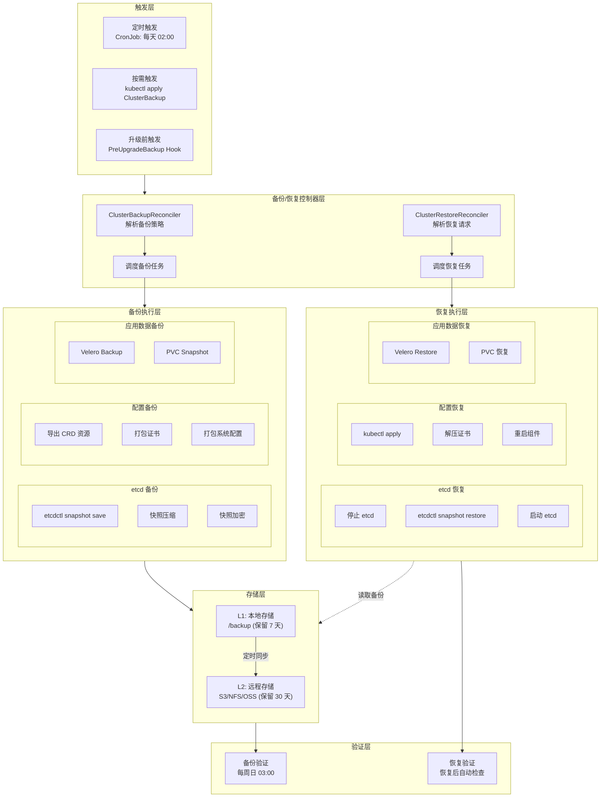

### 2.3 组件交互关系

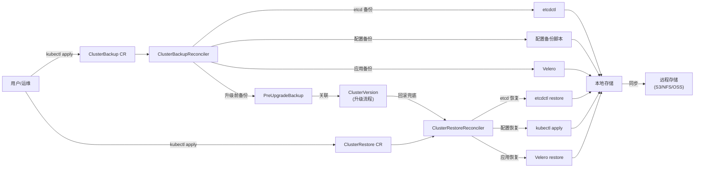

---

## 3. ClusterBackup CRD 详细设计

### 3.1 设计思路

`ClusterBackup` CRD 是声明式备份的入口。用户通过创建 `ClusterBackup` 资源声明备份策略，控制器自动执行备份并更新状态。

### 3.2 类型定义

```go
// api/v1alpha1/clusterbackup_types.go

type ClusterBackupSpec struct {
    // 备份类型: full / etcd-only / config-only / app-only
    // +kubebuilder:validation:Enum=full;etcd-only;config-only;app-only
    Type BackupType `json:"type"`

    // 目标集群名称
    ClusterName string `json:"clusterName"`

    // 备份触发策略
    Schedule *BackupSchedule `json:"schedule,omitempty"`

    // 存储配置
    Storage BackupStorageSpec `json:"storage"`

    // 加密配置
    Encryption *BackupEncryptionSpec `json:"encryption,omitempty"`

    // 保留策略
    RetentionPolicy RetentionPolicySpec `json:"retentionPolicy,omitempty"`

    // 备份范围配置
    Scope *BackupScopeSpec `json:"scope,omitempty"`

    // 备份前钩子
    PreBackupHooks []HookSpec `json:"preBackupHooks,omitempty"`

    // 备份后钩子
    PostBackupHooks []HookSpec `json:"postBackupHooks,omitempty"`
}

type BackupType string

const (
    BackupTypeFull       BackupType = "full"        // etcd + 配置 + 应用
    BackupTypeEtcdOnly   BackupType = "etcd-only"   // 仅 etcd
    BackupTypeConfigOnly BackupType = "config-only" // 仅配置
    BackupTypeAppOnly    BackupType = "app-only"    // 仅应用数据
)

type BackupSchedule struct {
    // 定时备份的 Cron 表达式 (如 "0 2 * * *" = 每天 02:00)
    Cron string `json:"cron,omitempty"`

    // 是否为一次性备份 (true=立即执行一次, false=按 cron 定时执行)
    OneTime bool `json:"oneTime,omitempty"`

    // 是否为升级前备份 (由升级流程自动触发)
    PreUpgrade bool `json:"preUpgrade,omitempty"`
}

type BackupStorageSpec struct {
    // 本地存储路径 (L1)
    LocalPath string `json:"localPath,omitempty"`

    // 远程存储配置 (L2)
    Remote *RemoteStorageSpec `json:"remote,omitempty"`
}

type RemoteStorageSpec struct {
    // 存储类型: s3 / nfs / oss / minio
    // +kubebuilder:validation:Enum=s3;nfs;oss;minio
    Type string `json:"type"`

    // S3/OSS/MinIO 配置
    S3 *S3StorageSpec `json:"s3,omitempty"`

    // NFS 配置
    NFS *NFSStorageSpec `json:"nfs,omitempty"`
}

type S3StorageSpec struct {
    Endpoint  string `json:"endpoint"`
    Bucket    string `json:"bucket"`
    Region    string `json:"region,omitempty"`
    AccessKey string `json:"accessKey,omitempty"`
    SecretKey string `json:"secretKey,omitempty"`
    SecretRef *SecretKeyRef `json:"secretRef,omitempty"`
}

type NFSStorageSpec struct {
    Server string `json:"server"`
    Path   string `json:"path"`
}

type BackupEncryptionSpec struct {
    // 是否启用加密
    Enabled bool `json:"enabled"`

    // 加密算法: AES-256-CBC
    Algorithm string `json:"algorithm,omitempty"`

    // 加密密钥引用 (K8s Secret)
    KeySecretRef *SecretKeyRef `json:"keySecretRef,omitempty"`
}

type RetentionPolicySpec struct {
    // 本地保留天数
    LocalRetentionDays int `json:"localRetentionDays,omitempty"`

    // 远程保留天数
    RemoteRetentionDays int `json:"remoteRetentionDays,omitempty"`

    // 最大备份数量
    MaxBackups int `json:"maxBackups,omitempty"`

    // 特殊备份保留 (升级前备份)
    UpgradeBackupRetentionDays int `json:"upgradeBackupRetentionDays,omitempty"`
}

type BackupScopeSpec struct {
    // etcd 备份配置
    Etcd *EtcdBackupScope `json:"etcd,omitempty"`

    // 配置备份范围
    Config *ConfigBackupScope `json:"config,omitempty"`

    // 应用数据备份范围
    Application *AppBackupScope `json:"application,omitempty"`
}

type EtcdBackupScope struct {
    // etcd 端点 (默认从集群配置读取)
    Endpoints []string `json:"endpoints,omitempty"`

    // 证书路径
    CACert   string `json:"caCert,omitempty"`
    Cert     string `json:"cert,omitempty"`
    Key      string `json:"key,omitempty"`

    // 是否压缩
    Compress bool `json:"compress,omitempty"`
}

type ConfigBackupScope struct {
    // 需要备份的命名空间 (空=所有)
    Namespaces []string `json:"namespaces,omitempty"`

    // 需要备份的资源类型
    Resources []string `json:"resources,omitempty"`

    // 是否备份证书
    IncludeCertificates bool `json:"includeCertificates,omitempty"`

    // 是否备份系统配置
    IncludeSystemConfig bool `json:"includeSystemConfig,omitempty"`
}

type AppBackupScope struct {
    // 需要备份的命名空间
    IncludedNamespaces []string `json:"includedNamespaces,omitempty"`

    // 排除的资源类型
    ExcludedResources []string `json:"excludedResources,omitempty"`

    // 是否备份 PVC
    IncludePVC bool `json:"includePVC,omitempty"`

    // VolumeSnapshotClass
    SnapshotClass string `json:"snapshotClass,omitempty"`
}

type ClusterBackupStatus struct {
    // 备份阶段: Pending / Running / Completed / Failed
    Phase BackupPhase `json:"phase"`

    // 备份开始时间
    StartTime *metav1.Time `json:"startTime,omitempty"`

    // 备份完成时间
    CompletionTime *metav1.Time `json:"completionTime,omitempty"`

    // 备份产物列表
    Artifacts []BackupArtifact `json:"artifacts,omitempty"`

    // 备份大小 (字节)
    TotalSize int64 `json:"totalSize,omitempty"`

    // 错误信息
    Error string `json:"error,omitempty"`

    // 下次备份时间 (定时备份)
    NextBackupTime *metav1.Time `json:"nextBackupTime,omitempty"`

    // 最后一次成功备份时间
    LastSuccessfulBackupTime *metav1.Time `json:"lastSuccessfulBackupTime,omitempty"`
}

type BackupPhase string

const (
    BackupPhasePending   BackupPhase = "Pending"
    BackupPhaseRunning   BackupPhase = "Running"
    BackupPhaseCompleted BackupPhase = "Completed"
    BackupPhaseFailed    BackupPhase = "Failed"
)

type BackupArtifact struct {
    // 备份产物类型: etcd-snapshot / config / velero-backup
    Type string `json:"type"`

    // 文件名
    Filename string `json:"filename"`

    // 存储路径 (本地)
    LocalPath string `json:"localPath,omitempty"`

    // 存储路径 (远程)
    RemotePath string `json:"remotePath,omitempty"`

    // 文件大小 (字节)
    Size int64 `json:"size,omitempty"`

    // 校验和
    Checksum string `json:"checksum,omitempty"`

    // 是否已加密
    Encrypted bool `json:"encrypted,omitempty"`
}
```

### 3.3 CRD YAML 示例

```yaml
apiVersion: config.openfuyao.cn/v1alpha1
kind: ClusterBackup
metadata:
  name: daily-backup-my-cluster
  namespace: bke-system
spec:
  type: full
  clusterName: my-cluster

  schedule:
    cron: "0 2 * * *"  # 每天凌晨 2 点
    oneTime: false

  storage:
    localPath: /backup
    remote:
      type: s3
      s3:
        endpoint: https://s3.example.com
        bucket: bke-backups
        region: us-east-1
        secretRef:
          name: s3-credentials
          namespace: bke-system

  encryption:
    enabled: true
    algorithm: AES-256-CBC
    keySecretRef:
      name: backup-encryption-key
      namespace: bke-system

  retentionPolicy:
    localRetentionDays: 7
    remoteRetentionDays: 30
    maxBackups: 100
    upgradeBackupRetentionDays: 90

  scope:
    etcd:
      compress: true
    config:
      includeCertificates: true
      includeSystemConfig: true
    application:
      includedNamespaces:
        - default
        - production
      excludedResources:
        - events
      includePVC: true
      snapshotClass: bke-snapshot-class

  preBackupHooks:
    - name: check-cluster-health
      type: Job
      manifest: |
        apiVersion: batch/v1
        kind: Job
        spec:
          template:
            spec:
              containers:
              - name: health-check
                image: bitnami/kubectl:latest
                command: ["kubectl", "get", "nodes", "--no-headers"]
              restartPolicy: OnFailure
```

### 3.4 ClusterBackupReconciler 设计

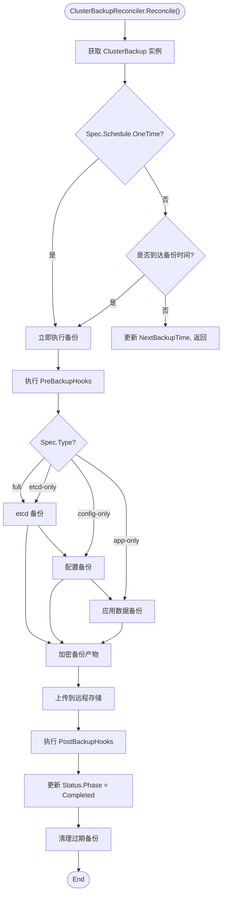

---

## 4. etcd 备份设计

### 4.1 备份策略

```yaml
etcdBackupStrategy:
  # 自动定时备份
  automaticBackup:
    enabled: true
    schedule: "0 2 * * *"  # 每天凌晨 2 点
    retentionDays: 7       # 本地保留 7 天
    remoteRetentionDays: 30 # 远程保留 30 天
    storageLocation: "/backup/etcd"

  # 升级前强制备份
  preUpgradeBackup:
    enabled: true         # 升级前必须备份
    retentionDays: 90     # 升级前备份保留 90 天
    trigger: "ClusterVersion.Spec.DesiredVersion 变更"

  # 备份验证
  backupVerification:
    enabled: true
    schedule: "0 3 * * 0"  # 每周日凌晨 3 点
    actions:
      - "恢复备份到测试环境"
      - "验证 etcd 集群健康"
      - "验证关键数据存在"
      - "清理测试环境"
```

### 4.2 备份执行流程

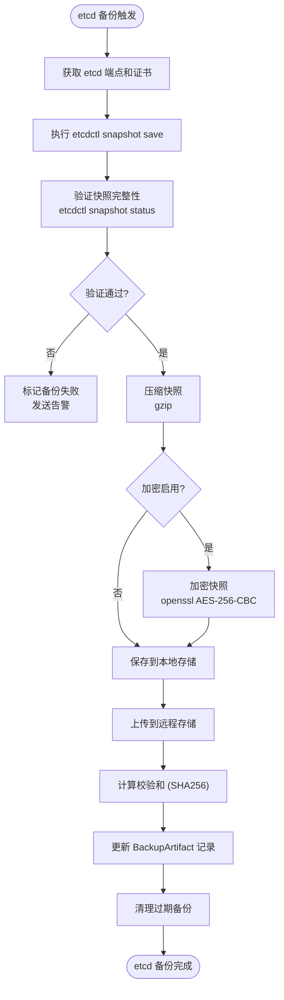

### 4.3 核心代码实现

```go
// pkg/backup/etcd_backup.go

type EtcdBackupManager struct {
    client    client.Client
    sshExec   SSHExecutor
    logger    *bkev1beta1.BKELogger
}

type EtcdBackupResult struct {
    FilePath  string
    FileSize  int64
    Checksum  string
    Encrypted bool
}

// Backup 执行 etcd 快照备份
func (m *EtcdBackupManager) Backup(
    ctx context.Context,
    cluster *bkev1beta1.BKECluster,
    scope *EtcdBackupScope,
    storagePath string,
    encryption *BackupEncryptionSpec,
) (*EtcdBackupResult, error) {
    timestamp := time.Now().Format("20060102_150405")
    backupFile := fmt.Sprintf("%s/etcd_snapshot_%s.db", storagePath, timestamp)

    // 1. 构建 etcdctl 命令
    cmd := m.buildSnapshotCommand(cluster, scope, backupFile)

    // 2. 通过 SSH 在 master 节点执行 etcdctl snapshot save
    result, err := m.sshExec.Execute(ctx, m.getMasterNodeIP(cluster), cmd)
    if err != nil {
        return nil, fmt.Errorf("etcd snapshot save failed: %w\nstderr: %s", err, result.Stderr)
    }

    // 3. 验证快照完整性
    if err := m.verifySnapshot(ctx, cluster, backupFile); err != nil {
        return nil, fmt.Errorf("snapshot verification failed: %w", err)
    }

    // 4. 压缩快照
    if scope != nil && scope.Compress {
        if err := m.compressFile(ctx, cluster, backupFile); err != nil {
            return nil, fmt.Errorf("compression failed: %w", err)
        }
        backupFile += ".gz"
    }

    // 5. 加密快照
    encrypted := false
    if encryption != nil && encryption.Enabled {
        encFile, err := m.encryptFile(ctx, cluster, backupFile, encryption)
        if err != nil {
            return nil, fmt.Errorf("encryption failed: %w", err)
        }
        backupFile = encFile
        encrypted = true
    }

    // 6. 获取文件信息
    fileSize, checksum, err := m.getFileInfo(ctx, cluster, backupFile)
    if err != nil {
        return nil, fmt.Errorf("failed to get file info: %w", err)
    }

    return &EtcdBackupResult{
        FilePath:  backupFile,
        FileSize:  fileSize,
        Checksum:  checksum,
        Encrypted: encrypted,
    }, nil
}

func (m *EtcdBackupManager) buildSnapshotCommand(
    cluster *bkev1beta1.BKECluster,
    scope *EtcdBackupScope,
    backupFile string,
) string {
    endpoints := "https://127.0.0.1:2379"
    cacert := "/etc/bke/pki/etcd/ca.crt"
    cert := "/etc/bke/pki/etcd/server.crt"
    key := "/etc/bke/pki/etcd/server.key"

    if scope != nil {
        if len(scope.Endpoints) > 0 {
            endpoints = strings.Join(scope.Endpoints, ",")
        }
        if scope.CACert != "" {
            cacert = scope.CACert
        }
        if scope.Cert != "" {
            cert = scope.Cert
        }
        if scope.Key != "" {
            key = scope.Key
        }
    }

    return fmt.Sprintf(
        "ETCDCTL_API=3 etcdctl snapshot save %s --endpoints=%s --cacert=%s --cert=%s --key=%s",
        backupFile, endpoints, cacert, cert, key,
    )
}

func (m *EtcdBackupManager) verifySnapshot(
    ctx context.Context,
    cluster *bkev1beta1.BKECluster,
    backupFile string,
) error {
    cmd := fmt.Sprintf("ETCDCTL_API=3 etcdctl snapshot status %s --write-out=json", backupFile)
    result, err := m.sshExec.Execute(ctx, m.getMasterNodeIP(cluster), cmd)
    if err != nil {
        return fmt.Errorf("snapshot status check failed: %w", err)
    }
    if result.ExitCode != 0 {
        return fmt.Errorf("snapshot verification failed: %s", result.Stderr)
    }
    return nil
}
```

### 4.4 升级前自动备份

```go
// pkg/backup/pre_upgrade_hook.go

// PreUpgradeBackupHook 在 ClusterVersion 升级流程中注册的钩子
// 确保升级前强制执行 etcd 备份
type PreUpgradeBackupHook struct {
    backupManager *EtcdBackupManager
    cvStore       ComponentVersionStore
}

// Execute 升级前备份钩子
func (h *PreUpgradeBackupHook) Execute(ctx context.Context, cluster *bkev1beta1.BKECluster) error {
    // 1. 检查是否已有升级前备份
    if h.hasRecentPreUpgradeBackup(cluster) {
        h.logger.Info("recent pre-upgrade backup exists, skipping")
        return nil
    }

    // 2. 执行 etcd 备份
    result, err := h.backupManager.Backup(ctx, cluster, nil, "/backup/etcd/pre-upgrade", nil)
    if err != nil {
        return fmt.Errorf("pre-upgrade etcd backup failed: %w", err)
    }

    // 3. 记录备份信息到 ClusterVersion.Status
    h.recordPreUpgradeBackup(cluster, result)

    h.logger.Info("pre-upgrade etcd backup completed",
        "file", result.FilePath, "size", result.FileSize)

    return nil
}

// hasRecentPreUpgradeBackup 检查是否已有近期的升级前备份 (1小时内)
func (h *PreUpgradeBackupHook) hasRecentPreUpgradeBackup(cluster *bkev1beta1.BKECluster) bool {
    // 从 ClusterVersion.Status.History 中查找最近的 PreUpgradeBackup 记录
    // 如果备份时间在 1 小时内，则跳过
    // ...
    return false
}
```

### 4.5 备份产物

| 文件名 | 格式 | 内容 | 大小（典型值） |
|--------|------|------|----------------|
| `etcd_snapshot_<timestamp>.db.gz` | 压缩快照 | etcd 完整数据 | 50-200 MB |
| `etcd_snapshot_<timestamp>.db.gz.enc` | 加密压缩快照 | 加密后的 etcd 数据 | 50-200 MB |
| `bke_config_<timestamp>.yaml` | YAML | BKE 集群配置 | < 1 MB |
| `certificates_<timestamp>.tar.gz` | 压缩归档 | 证书和密钥 | 1-5 MB |

---

## 5. 集群配置备份设计

### 5.1 备份内容

```yaml
configBackup:
  # BKE 集群配置
  bkeClusterConfig:
    - "BKECluster CRD"
    - "BKENode CRD"
    - "ClusterVersion CRD"
    - "UpgradePath CRD"
    - "相关 ConfigMap"
    - "相关 Secret"

  # 证书和密钥
  certificates:
    - "CA 证书 (ca.crt, ca.key)"
    - "API Server 证书 (apiserver.crt, apiserver.key)"
    - "etcd 证书 (etcd.crt, etcd.key)"
    - "Service Account 密钥 (sa.key, sa.pub)"
    - "BKE Agent 证书"

  # 系统配置
  systemConfig:
    - "kubelet 配置 (/var/lib/kubelet/config.yaml)"
    - "containerd 配置 (/etc/containerd/config.toml)"
    - "网络插件配置"
    - "BKE Agent 配置"
```

### 5.2 配置备份执行流程

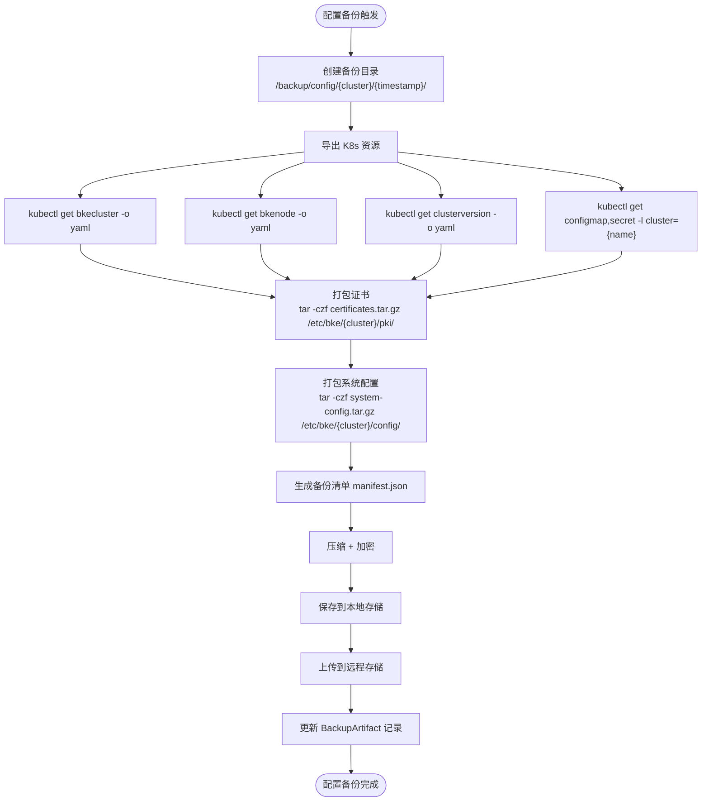

### 5.3 备份脚本实现

```go
// pkg/backup/config_backup.go

type ConfigBackupManager struct {
    client    client.Client
    sshExec   SSHExecutor
    logger    *bkev1beta1.BKELogger
}

// Backup 执行集群配置备份
func (m *ConfigBackupManager) Backup(
    ctx context.Context,
    cluster *bkev1beta1.BKECluster,
    scope *ConfigBackupScope,
    storagePath string,
) ([]BackupArtifact, error) {
    timestamp := time.Now().Format("20060102_150405")
    backupDir := fmt.Sprintf("%s/config/%s/%s", storagePath, cluster.Name, timestamp)

    // 1. 创建远程备份目录
    if _, err := m.sshExec.Execute(ctx, m.getMasterNodeIP(cluster),
        fmt.Sprintf("mkdir -p %s", backupDir)); err != nil {
        return nil, fmt.Errorf("failed to create backup directory: %w", err)
    }

    var artifacts []BackupArtifact

    // 2. 导出 K8s 资源
    if err := m.exportK8sResources(ctx, cluster, scope, backupDir); err != nil {
        return nil, fmt.Errorf("failed to export k8s resources: %w", err)
    }
    artifacts = append(artifacts, BackupArtifact{
        Type:     "config",
        Filename: "bkecluster.yaml",
        LocalPath: fmt.Sprintf("%s/bkecluster.yaml", backupDir),
    })

    // 3. 备份证书
    if scope == nil || scope.IncludeCertificates {
        if err := m.backupCertificates(ctx, cluster, backupDir); err != nil {
            return nil, fmt.Errorf("failed to backup certificates: %w", err)
        }
        artifacts = append(artifacts, BackupArtifact{
            Type:     "certificates",
            Filename: "certificates.tar.gz",
            LocalPath: fmt.Sprintf("%s/certificates.tar.gz", backupDir),
        })
    }

    // 4. 备份系统配置
    if scope == nil || scope.IncludeSystemConfig {
        if err := m.backupSystemConfig(ctx, cluster, backupDir); err != nil {
            return nil, fmt.Errorf("failed to backup system config: %w", err)
        }
        artifacts = append(artifacts, BackupArtifact{
            Type:     "system-config",
            Filename: "system-config.tar.gz",
            LocalPath: fmt.Sprintf("%s/system-config.tar.gz", backupDir),
        })
    }

    // 5. 生成备份清单
    if err := m.generateManifest(ctx, cluster, backupDir, timestamp, artifacts); err != nil {
        return nil, fmt.Errorf("failed to generate manifest: %w", err)
    }

    return artifacts, nil
}

func (m *ConfigBackupManager) exportK8sResources(
    ctx context.Context,
    cluster *bkev1beta1.BKECluster,
    scope *ConfigBackupScope,
    backupDir string,
) error {
    // 直接通过 controller-runtime client 导出 CRD 资源
    // 比 kubectl get -o yaml 更可靠，且不依赖 kubectl
    resources := map[string]string{
        "bkecluster.yaml":     "BKECluster",
        "bkenodes.yaml":       "BKENode",
        "clusterversion.yaml": "ClusterVersion",
        "upgradepath.yaml":    "UpgradePath",
    }

    for filename, kind := range resources {
        objList, err := m.exportResourceByKind(ctx, kind, cluster.Namespace)
        if err != nil {
            m.logger.Warn("failed to export %s: %v", kind, err)
            continue
        }
        data, _ := yaml.Marshal(objList)
        path := fmt.Sprintf("%s/%s", backupDir, filename)
        if err := m.writeRemoteFile(ctx, cluster, path, data); err != nil {
            return fmt.Errorf("failed to write %s: %w", filename, err)
        }
    }
    return nil
}

func (m *ConfigBackupManager) backupCertificates(
    ctx context.Context,
    cluster *bkev1beta1.BKECluster,
    backupDir string,
) error {
    certPath := fmt.Sprintf("/etc/bke/%s/pki/", cluster.Name)
    cmd := fmt.Sprintf("tar -czf %s/certificates.tar.gz -C %s .", backupDir, certPath)
    _, err := m.sshExec.Execute(ctx, m.getMasterNodeIP(cluster), cmd)
    return err
}

func (m *ConfigBackupManager) backupSystemConfig(
    ctx context.Context,
    cluster *bkev1beta1.BKECluster,
    backupDir string,
) error {
    configPath := fmt.Sprintf("/etc/bke/%s/config/", cluster.Name)
    cmd := fmt.Sprintf("tar -czf %s/system-config.tar.gz -C %s .", backupDir, configPath)
    _, err := m.sshExec.Execute(ctx, m.getMasterNodeIP(cluster), cmd)
    return err
}
```

---

## 6. 应用数据备份设计

### 6.1 设计思路

应用数据备份通过集成 Velero 实现。Velero 是 Kubernetes 原生的备份恢复工具，支持命名空间级别的选择性备份和 PVC 快照。

### 6.2 Velero 集成架构

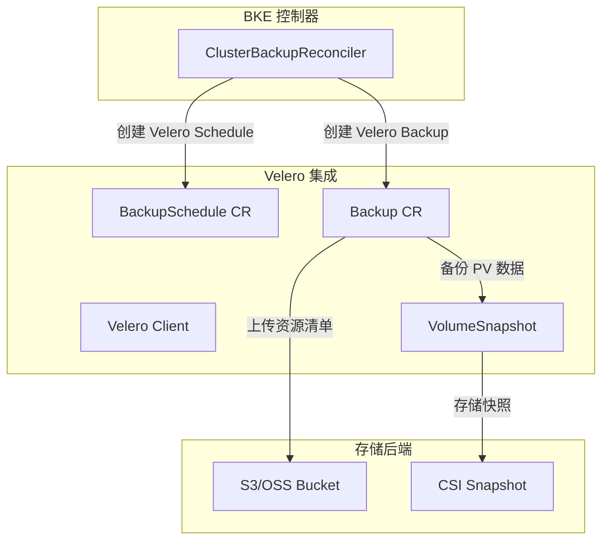

### 6.3 备份策略

```yaml
applicationDataBackup:
  # Velero 备份配置
  veleroBackup:
    enabled: true
    schedule: "0 1 * * *"  # 每天凌晨 1 点
    includedNamespaces:
      - default
      - production
    excludedResources:
      - events
      - jobs.batch
    storageLocation: bke-backup-location
    ttl: 168h  # 7 天 TTL

  # PVC 快照配置
  pvcBackup:
    enabled: true
    snapshotClass: bke-snapshot-class
    retentionDays: 7
```

### 6.4 Velero Backup 集成代码

```go
// pkg/backup/app_backup.go

type AppBackupManager struct {
    veleroClient dynamic.Interface
    logger       *bkev1beta1.BKELogger
}

// Backup 通过 Velero 执行应用数据备份
func (m *AppBackupManager) Backup(
    ctx context.Context,
    cluster *bkev1beta1.BKECluster,
    scope *AppBackupScope,
    backupName string,
) (*BackupArtifact, error) {
    // 1. 构建 Velero Backup CR
    veleroBackup := m.buildVeleroBackupCR(backupName, scope)

    // 2. 创建 Velero Backup
    if err := m.createVeleroBackup(ctx, veleroBackup); err != nil {
        return nil, fmt.Errorf("failed to create velero backup: %w", err)
    }

    // 3. 等待备份完成
    if err := m.waitForBackupCompletion(ctx, backupName); err != nil {
        return nil, fmt.Errorf("velero backup failed: %w", err)
    }

    // 4. 获取备份结果
    result, err := m.getBackupResult(ctx, backupName)
    if err != nil {
        return nil, fmt.Errorf("failed to get backup result: %w", err)
    }

    return &BackupArtifact{
        Type:     "velero-backup",
        Filename: backupName,
        Size:     result.TotalSize,
    }, nil
}

func (m *AppBackupManager) buildVeleroBackupCR(
    name string,
    scope *AppBackupScope,
) *unstructured.Unstructured {
    backup := map[string]interface{}{
        "apiVersion": "velero.io/v1",
        "kind":       "Backup",
        "metadata": map[string]interface{}{
            "name":      name,
            "namespace": "velero",
        },
        "spec": map[string]interface{}{
            "includedNamespaces":  scope.IncludedNamespaces,
            "excludedResources":   scope.ExcludedResources,
            "storageLocation":     "bke-backup-location",
            "ttl":                "168h0m0s",
        },
    }

    if scope.IncludePVC {
        backup["spec"].(map[string]interface{})["volumeSnapshotLocations"] = []string{"bke-vsl"}
        backup["spec"].(map[string]interface{})["snapshotVolumes"] = true
    }

    return &unstructured.Unstructured{Object: backup}
}
```

---

## 7. 备份存储设计

### 7.1 存储架构

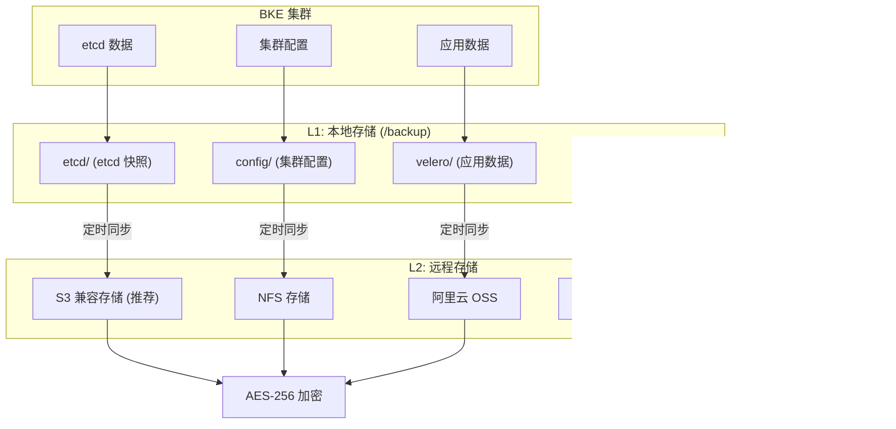

### 7.2 存储后端对比

| 存储类型 | 适用场景 | 优点 | 缺点 | 推荐度 |
|---------|---------|------|------|--------|
| **本地存储** | 开发测试 | 简单、快速、零成本 | 单点故障、容量受限 | ⭐⭐ |
| **S3 兼容存储** | 生产环境（推荐） | 高可用、可扩展、成本低 | 需要网络带宽 | ⭐⭐⭐⭐⭐ |
| **NFS** | 企业内网 | 成熟稳定、易管理 | 需 NFS 服务器、性能受限 | ⭐⭐⭐ |
| **阿里云 OSS** | 阿里云环境 | 成本低、易管理、高可用 | 仅限阿里云 | ⭐⭐⭐⭐ |
| **MinIO** | 私有化部署 | 开源、S3 兼容、自主可控 | 需维护 MinIO 集群 | ⭐⭐⭐⭐ |

### 7.3 存储容量规划

```
总容量 = (etcd 备份 + 配置备份 + 应用数据备份) × 保留天数 × 副本数

示例计算（100 节点集群）:
- etcd 备份: 200 MB/天
- 配置备份: 10 MB/天
- 应用数据备份: 10 GB/天
- 本地保留: 7 天
- 远程保留: 30 天

本地存储: (200MB + 10MB + 10GB) × 7 ≈ 71.5 GB
远程存储: (200MB + 10MB + 10GB) × 30 ≈ 306.6 GB
总容量: 71.5 GB + 306.6 GB ≈ 378.1 GB
```

| 集群规模 | etcd | 配置 | 应用数据 | 本地(7天) | 远程(30天) | 总容量 |
|---------|------|------|---------|----------|-----------|--------|
| 小型(10节点) | 50MB | 5MB | 1GB | 7.4GB | 31.7GB | 39.1GB |
| 中型(50节点) | 100MB | 10MB | 5GB | 36GB | 154GB | 190GB |
| 大型(100节点) | 200MB | 10MB | 10GB | 71.5GB | 306.6GB | 378GB |
| 超大型(500节点) | 500MB | 20MB | 50GB | 355GB | 1517GB | 1872GB |

### 7.4 加密设计

| 加密项 | 加密算法 | 密钥管理 | 说明 |
|--------|---------|---------|------|
| etcd 备份 | AES-256-CBC | K8s Secret | 敏感数据（Secret、ConfigMap） |
| 配置备份 | AES-256-CBC | K8s Secret | 证书、密钥等敏感配置 |
| 应用数据 | Velero 内置 | Velero 密钥 | Velero 自带加密功能 |

```go
// pkg/backup/encryption.go

type EncryptionManager struct {
    keySecretRef *SecretKeyRef
    client       client.Client
}

func (e *EncryptionManager) Encrypt(ctx context.Context, filePath string) (string, error) {
    // 1. 从 K8s Secret 获取加密密钥
    key, err := e.getEncryptionKey(ctx)
    if err != nil {
        return "", fmt.Errorf("failed to get encryption key: %w", err)
    }

    // 2. 使用 openssl AES-256-CBC 加密
    encFile := filePath + ".enc"
    cmd := fmt.Sprintf("openssl enc -aes-256-cbc -salt -in %s -out %s -pass pass:%s",
        filePath, encFile, key)

    // 3. 通过 SSH 执行加密命令
    result, err := e.sshExec.Execute(ctx, nodeIP, cmd)
    if err != nil {
        return "", fmt.Errorf("encryption failed: %w\nstderr: %s", err, result.Stderr)
    }

    // 4. 删除未加密文件
    e.sshExec.Execute(ctx, nodeIP, fmt.Sprintf("rm -f %s", filePath))

    return encFile, nil
}
```

### 7.5 保留策略

```yaml
retentionPolicy:
  # 本地存储保留
  local:
    retentionDays: 7          # 保留 7 天
    maxBackups: 100           # 最多 100 个备份
    cleanupSchedule: "0 3 * * *"  # 每天清理

  # 远程存储保留
  remote:
    retentionDays: 30         # 保留 30 天
    maxBackups: 500           # 最多 500 个备份
    cleanupSchedule: "0 4 * * *"

  # 升级前备份特殊保留
  special:
    upgradeBackup: 90         # 升级前备份保留 90 天
    disasterRecovery: 365     # 灾难恢复备份保留 1 年
```

---

## 8. ClusterRestore CRD 详细设计

### 8.1 类型定义

```go
// api/v1alpha1/clusterrestore_types.go

type ClusterRestoreSpec struct {
    // 恢复类型: full / etcd-only / config-only / app-only
    // +kubebuilder:validation:Enum=full;etcd-only;config-only;app-only
    Type RestoreType `json:"type"`

    // 目标集群名称
    ClusterName string `json:"clusterName"`

    // 备份来源
    Source RestoreSourceSpec `json:"source"`

    // 恢复范围
    Scope *RestoreScopeSpec `json:"scope,omitempty"`

    // 恢复前钩子
    PreRestoreHooks []HookSpec `json:"preRestoreHooks,omitempty"`

    // 恢复后钩子
    PostRestoreHooks []HookSpec `json:"postRestoreHooks,omitempty"`

    // 是否强制恢复 (跳过兼容性检查)
    Force bool `json:"force,omitempty"`
}

type RestoreType string

const (
    RestoreTypeFull       RestoreType = "full"
    RestoreTypeEtcdOnly   RestoreType = "etcd-only"
    RestoreTypeConfigOnly RestoreType = "config-only"
    RestoreTypeAppOnly    RestoreType = "app-only"
)

type RestoreSourceSpec struct {
    // 备份名称 (引用 ClusterBackup)
    BackupName string `json:"backupName,omitempty"`

    // 直接指定备份文件路径
    BackupPath string `json:"backupPath,omitempty"`

    // 远程备份路径
    RemotePath string `json:"remotePath,omitempty"`

    // 加密密钥引用
    DecryptionKeyRef *SecretKeyRef `json:"decryptionKeyRef,omitempty"`
}

type RestoreScopeSpec struct {
    // etcd 恢复配置
    Etcd *EtcdRestoreScope `json:"etcd,omitempty"`

    // 配置恢复范围
    Config *ConfigRestoreScope `json:"config,omitempty"`

    // 应用数据恢复范围
    Application *AppRestoreScope `json:"application,omitempty"`
}

type EtcdRestoreScope struct {
    // etcd 数据目录
    DataDir string `json:"dataDir,omitempty"`

    // 初始集群配置
    InitialCluster string `json:"initialCluster,omitempty"`

    // 是否跳过 etcd 数据兼容性检查
    SkipCompatCheck bool `json:"skipCompatCheck,omitempty"`
}

type ConfigRestoreScope struct {
    // 需要恢复的命名空间
    Namespaces []string `json:"namespaces,omitempty"`

    // 是否恢复证书
    IncludeCertificates bool `json:"includeCertificates,omitempty"`

    // 是否恢复系统配置
    IncludeSystemConfig bool `json:"includeSystemConfig,omitempty"`

    // 是否覆盖现有配置
    Overwrite bool `json:"overwrite,omitempty"`
}

type AppRestoreScope struct {
    // 需要恢复的命名空间
    IncludedNamespaces []string `json:"includedNamespaces,omitempty"`

    // 是否恢复 PVC 数据
    IncludePVC bool `json:"includePVC,omitempty"`
}

type ClusterRestoreStatus struct {
    // 恢复阶段: Pending / Running / Completed / Failed
    Phase RestorePhase `json:"phase"`

    // 恢复开始时间
    StartTime *metav1.Time `json:"startTime,omitempty"`

    // 恢复完成时间
    CompletionTime *metav1.Time `json:"completionTime,omitempty"`

    // 恢复进度
    Progress RestoreProgress `json:"progress,omitempty"`

    // 错误信息
    Error string `json:"error,omitempty"`

    // 恢复验证结果
    Verification *RestoreVerification `json:"verification,omitempty"`
}

type RestorePhase string

const (
    RestorePhasePending   RestorePhase = "Pending"
    RestorePhaseRunning   RestorePhase = "Running"
    RestorePhaseCompleted RestorePhase = "Completed"
    RestorePhaseFailed    RestorePhase = "Failed"
)

type RestoreProgress struct {
    // 总步骤数
    TotalSteps int `json:"totalSteps,omitempty"`

    // 已完成步骤数
    CompletedSteps int `json:"completedSteps,omitempty"`

    // 当前步骤描述
    CurrentStep string `json:"currentStep,omitempty"`

    // 进度百分比
    Percentage int `json:"percentage,omitempty"`
}

type RestoreVerification struct {
    // etcd 健康状态
    EtcdHealthy bool `json:"etcdHealthy,omitempty"`

    // 控制面健康状态
    ControlPlaneHealthy bool `json:"controlPlaneHealthy,omitempty"`

    // 节点健康状态
    NodesHealthy bool `json:"nodesHealthy,omitempty"`

    // 应用健康状态
    AppsHealthy bool `json:"appsHealthy,omitempty"`

    // 验证详情
    Details string `json:"details,omitempty"`
}
```

### 8.2 CRD YAML 示例

```yaml
apiVersion: config.openfuyao.cn/v1alpha1
kind: ClusterRestore
metadata:
  name: restore-my-cluster-20260826
  namespace: bke-system
spec:
  type: full
  clusterName: my-cluster

  source:
    backupName: daily-backup-my-cluster  # 引用 ClusterBackup
    # 或直接指定路径:
    # backupPath: /backup/etcd/etcd_snapshot_20260826_020000.db.gz.enc
    # remotePath: s3://bke-backups/etcd/etcd_snapshot_20260826_020000.db.gz.enc
    decryptionKeyRef:
      name: backup-encryption-key
      namespace: bke-system

  scope:
    etcd:
      dataDir: /var/lib/etcd
      initialCluster: "master-0=https://127.0.0.1:2380"
    config:
      includeCertificates: true
      includeSystemConfig: true
      overwrite: false  # 不覆盖现有配置
    application:
      includedNamespaces:
        - default
        - production
      includePVC: true

  preRestoreHooks:
    - name: stop-non-essential-services
      type: Job
      manifest: |
        apiVersion: batch/v1
        kind: Job
        spec:
          template:
            spec:
              containers:
              - name: stop
                image: bitnami/kubectl:latest
                command: ["kubectl", "scale", "deployment", "--all", "--replicas=0", "-n", "production"]
              restartPolicy: OnFailure

  postRestoreHooks:
    - name: verify-business-recovery
      type: Job
      manifest: |
        apiVersion: batch/v1
        kind: Job
        spec:
          template:
            spec:
              containers:
              - name: verify
                image: bitnami/kubectl:latest
                command: ["kubectl", "get", "pods", "--all-namespaces"]
              restartPolicy: OnFailure
```

---

## 9. etcd 恢复设计

### 9.1 恢复流程

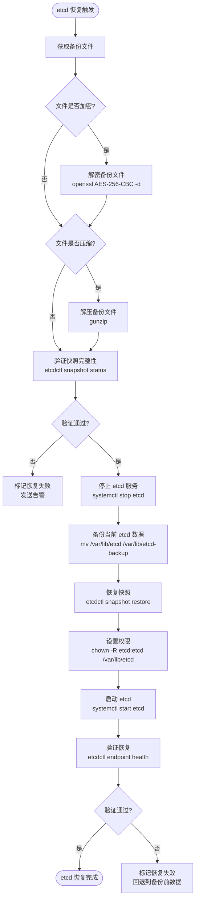

### 9.2 核心代码实现

```go
// pkg/backup/etcd_restore.go

type EtcdRestoreManager struct {
    sshExec SSHExecutor
    logger  *bkev1beta1.BKELogger
}

// Restore 执行 etcd 快照恢复
func (m *EtcdRestoreManager) Restore(
    ctx context.Context,
    cluster *bkev1beta1.BKECluster,
    scope *EtcdRestoreScope,
    backupFile string,
    encryption *BackupEncryptionSpec,
) error {
    nodeIP := m.getMasterNodeIP(cluster)
    dataDir := "/var/lib/etcd"
    if scope != nil && scope.DataDir != "" {
        dataDir = scope.DataDir
    }

    // 1. 解密备份文件
    if encryption != nil && encryption.Enabled {
        decFile, err := m.decryptFile(ctx, nodeIP, backupFile, encryption)
        if err != nil {
            return fmt.Errorf("decryption failed: %w", err)
        }
        backupFile = decFile
    }

    // 2. 解压备份文件
    if strings.HasSuffix(backupFile, ".gz") {
        decFile, err := m.decompressFile(ctx, nodeIP, backupFile)
        if err != nil {
            return fmt.Errorf("decompression failed: %w", err)
        }
        backupFile = decFile
    }

    // 3. 验证快照
    if err := m.verifySnapshot(ctx, nodeIP, backupFile); err != nil {
        return fmt.Errorf("snapshot verification failed: %w", err)
    }

    // 4. 停止 etcd
    if _, err := m.sshExec.Execute(ctx, nodeIP, "systemctl stop etcd"); err != nil {
        return fmt.Errorf("failed to stop etcd: %w", err)
    }

    // 5. 备份当前 etcd 数据
    backupDir := fmt.Sprintf("/var/lib/etcd-backup-%s", time.Now().Format("20060102_150405"))
    moveCmd := fmt.Sprintf("mv %s %s", dataDir, backupDir)
    if _, err := m.sshExec.Execute(ctx, nodeIP, moveCmd); err != nil {
        return fmt.Errorf("failed to backup current etcd data: %w", err)
    }

    // 6. 恢复快照
    restoreCmd := m.buildRestoreCommand(backupFile, dataDir, scope)
    if result, err := m.sshExec.Execute(ctx, nodeIP, restoreCmd); err != nil {
        // 恢复失败，回退到备份前数据
        m.rollbackEtcd(ctx, nodeIP, dataDir, backupDir)
        return fmt.Errorf("etcd restore failed: %w\nstderr: %s", err, result.Stderr)
    }

    // 7. 设置权限
    chownCmd := fmt.Sprintf("chown -R etcd:etcd %s && chmod 700 %s", dataDir, dataDir)
    if _, err := m.sshExec.Execute(ctx, nodeIP, chownCmd); err != nil {
        return fmt.Errorf("failed to set permissions: %w", err)
    }

    // 8. 启动 etcd
    if _, err := m.sshExec.Execute(ctx, nodeIP, "systemctl start etcd"); err != nil {
        return fmt.Errorf("failed to start etcd: %w", err)
    }

    // 9. 验证恢复
    if err := m.verifyRestore(ctx, nodeIP); err != nil {
        return fmt.Errorf("restore verification failed: %w", err)
    }

    return nil
}

func (m *EtcdRestoreManager) buildRestoreCommand(
    backupFile string,
    dataDir string,
    scope *EtcdRestoreScope,
) string {
    initialCluster := "master-0=https://127.0.0.1:2380"
    if scope != nil && scope.InitialCluster != "" {
        initialCluster = scope.InitialCluster
    }

    return fmt.Sprintf(
        "ETCDCTL_API=3 etcdctl snapshot restore %s --data-dir=%s --name=master-0 --initial-cluster=%s --initial-advertise-peer-urls=https://127.0.0.1:2380",
        backupFile, dataDir, initialCluster,
    )
}

func (m *EtcdRestoreManager) verifyRestore(ctx context.Context, nodeIP string) error {
    cmd := "ETCDCTL_API=3 etcdctl endpoint health --cluster"
    result, err := m.sshExec.Execute(ctx, nodeIP, cmd)
    if err != nil || result.ExitCode != 0 {
        return fmt.Errorf("etcd health check failed: %s", result.Stderr)
    }
    return nil
}

// rollbackEtcd 恢复失败时回退到备份前数据
func (m *EtcdRestoreManager) rollbackEtcd(
    ctx context.Context,
    nodeIP, dataDir, backupDir string,
) {
    m.logger.Warn("etcd restore failed, rolling back to previous data")
    // 1. 删除恢复失败的数据
    m.sshExec.Execute(ctx, nodeIP, fmt.Sprintf("rm -rf %s", dataDir))
    // 2. 恢复备份前数据
    m.sshExec.Execute(ctx, nodeIP, fmt.Sprintf("mv %s %s", backupDir, dataDir))
    // 3. 启动 etcd
    m.sshExec.Execute(ctx, nodeIP, "systemctl start etcd")
}
```

---

## 10. 配置恢复设计

### 10.1 恢复流程

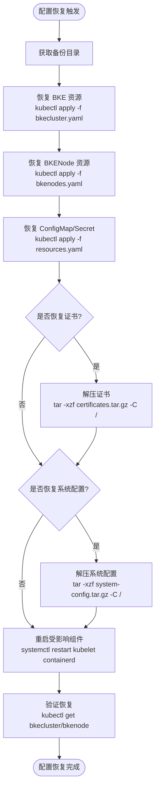

### 10.2 核心代码实现

```go
// pkg/backup/config_restore.go

type ConfigRestoreManager struct {
    client  client.Client
    sshExec SSHExecutor
    logger  *bkev1beta1.BKELogger
}

func (m *ConfigRestoreManager) Restore(
    ctx context.Context,
    cluster *bkev1beta1.BKECluster,
    scope *ConfigRestoreScope,
    backupDir string,
) error {
    nodeIP := m.getMasterNodeIP(cluster)

    // 1. 恢复 BKE 资源 (通过 K8s API 直接创建)
    if err := m.restoreBKEResources(ctx, cluster, backupDir); err != nil {
        return fmt.Errorf("failed to restore BKE resources: %w", err)
    }

    // 2. 恢复证书
    if scope == nil || scope.IncludeCertificates {
        if err := m.restoreCertificates(ctx, nodeIP, backupDir); err != nil {
            return fmt.Errorf("failed to restore certificates: %w", err)
        }
    }

    // 3. 恢复系统配置
    if scope == nil || scope.IncludeSystemConfig {
        if err := m.restoreSystemConfig(ctx, nodeIP, backupDir); err != nil {
            return fmt.Errorf("failed to restore system config: %w", err)
        }
    }

    // 4. 重启受影响组件
    if err := m.restartComponents(ctx, nodeIP); err != nil {
        return fmt.Errorf("failed to restart components: %w", err)
    }

    return nil
}

func (m *ConfigRestoreManager) restoreCertificates(
    ctx context.Context,
    nodeIP, backupDir string,
) error {
    cmd := fmt.Sprintf("tar -xzf %s/certificates.tar.gz -C /", backupDir)
    _, err := m.sshExec.Execute(ctx, nodeIP, cmd)
    return err
}

func (m *ConfigRestoreManager) restoreSystemConfig(
    ctx context.Context,
    nodeIP, backupDir string,
) error {
    cmd := fmt.Sprintf("tar -xzf %s/system-config.tar.gz -C /", backupDir)
    _, err := m.sshExec.Execute(ctx, nodeIP, cmd)
    return err
}

func (m *ConfigRestoreManager) restartComponents(
    ctx context.Context,
    nodeIP string,
) error {
    commands := []string{
        "systemctl restart kubelet",
        "systemctl restart containerd",
    }
    for _, cmd := range commands {
        if _, err := m.sshExec.Execute(ctx, nodeIP, cmd); err != nil {
            m.logger.Warn("failed to restart component: %s: %v", cmd, err)
        }
    }
    return nil
}
```

---

## 11. 应用数据恢复设计

### 11.1 Velero 恢复流程

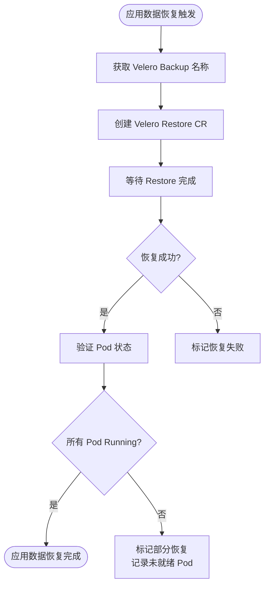

### 11.2 核心代码实现

```go
// pkg/backup/app_restore.go

type AppRestoreManager struct {
    veleroClient dynamic.Interface
    logger       *bkev1beta1.BKELogger
}

func (m *AppRestoreManager) Restore(
    ctx context.Context,
    cluster *bkev1beta1.BKECluster,
    scope *AppRestoreScope,
    backupName string,
) error {
    // 1. 构建 Velero Restore CR
    restoreName := fmt.Sprintf("restore-%s-%d", backupName, time.Now().Unix())
    veleroRestore := m.buildVeleroRestoreCR(restoreName, backupName, scope)

    // 2. 创建 Velero Restore
    if err := m.createVeleroRestore(ctx, veleroRestore); err != nil {
        return fmt.Errorf("failed to create velero restore: %w", err)
    }

    // 3. 等待恢复完成
    if err := m.waitForRestoreCompletion(ctx, restoreName); err != nil {
        return fmt.Errorf("velero restore failed: %w", err)
    }

    // 4. 验证 Pod 状态
    if err := m.verifyPods(ctx, scope.IncludedNamespaces); err != nil {
        m.logger.Warn("some pods not ready after restore: %v", err)
    }

    return nil
}
```

---

## 12. 灾难恢复设计

### 12.1 灾难恢复策略

| 故障类型 | 恢复策略 | 自动化程度 | 恢复时间 |
|---------|---------|-----------|---------|
| **单节点故障** | 自动替换节点 | 全自动 | 10-30 分钟 |
| **控制面单节点故障** | etcd 自动恢复 | 半自动 | 30-60 分钟 |
| **控制面多节点故障** | etcd 备份恢复 | 手动 | 1-2 小时 |
| **整个集群故障** | 重建集群 + 恢复数据 | 手动 | 2-4 小时 |
| **数据丢失** | 从备份恢复数据 | 手动 | 1-2 小时 |

### 12.2 灾难恢复流程

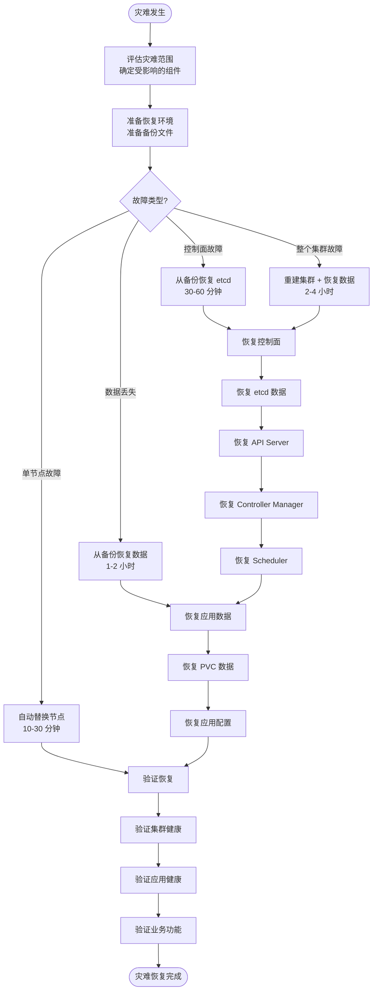

### 12.3 恢复优先级

1. **P0 - 控制面**：etcd、API Server、Controller Manager、Scheduler
2. **P1 - 工作节点**：kubelet、containerd、BKE Agent
3. **P2 - 应用数据**：PVC 数据、应用配置
4. **P3 - 辅助服务**：监控、日志、告警

---

## 13. 备份与恢复验证

### 13.1 备份验证

```yaml
backupVerification:
  # 自动验证 (每周日凌晨 3 点)
  automaticVerification:
    enabled: true
    schedule: "0 3 * * 0"
    actions:
      - "恢复 etcd 备份到测试环境"
      - "验证 etcd 集群健康"
      - "验证关键数据存在 (BKECluster, BKENode)"
      - "验证 ConfigMap/Secret 完整性"
      - "清理测试环境"

  # 手动验证 (升级前)
  manualVerification:
    trigger: "升级前手动执行"
    actions:
      - "验证 etcd 备份可恢复"
      - "验证配置备份完整"
      - "验证证书备份有效"
```

### 13.2 恢复验证

```go
// pkg/backup/restore_verify.go

type RestoreVerifier struct {
    client    client.Client
    sshExec   SSHExecutor
    logger    *bkev1beta1.BKELogger
}

type RestoreVerificationResult struct {
    EtcdHealthy        bool
    ControlPlaneHealthy bool
    NodesHealthy        bool
    AppsHealthy        bool
    Details            string
}

func (v *RestoreVerifier) Verify(
    ctx context.Context,
    cluster *bkev1beta1.BKECluster,
) (*RestoreVerificationResult, error) {
    result := &RestoreVerificationResult{}

    // 1. 验证 etcd 健康
    result.EtcdHealthy = v.verifyEtcd(ctx, cluster)

    // 2. 验证控制面健康
    result.ControlPlaneHealthy = v.verifyControlPlane(ctx, cluster)

    // 3. 验证节点健康
    result.NodesHealthy = v.verifyNodes(ctx, cluster)

    // 4. 验证应用健康
    result.AppsHealthy = v.verifyApps(ctx, cluster)

    // 5. 生成验证报告
    result.Details = v.generateReport(result)

    return result, nil
}

func (v *RestoreVerifier) verifyEtcd(ctx context.Context, cluster *bkev1beta1.BKECluster) bool {
    nodeIP := v.getMasterNodeIP(cluster)
    cmd := "ETCDCTL_API=3 etcdctl endpoint health --cluster"
    result, err := v.sshExec.Execute(ctx, nodeIP, cmd)
    return err == nil && result.ExitCode == 0
}

func (v *RestoreVerifier) verifyControlPlane(ctx context.Context, cluster *bkev1beta1.BKECluster) bool {
    checks := []string{
        "kubectl get --raw='/readyz'",
        "kubectl get componentstatuses",
    }
    for _, cmd := range checks {
        result, err := v.sshExec.Execute(ctx, v.getMasterNodeIP(cluster), cmd)
        if err != nil || result.ExitCode != 0 {
            return false
        }
    }
    return true
}

func (v *RestoreVerifier) verifyNodes(ctx context.Context, cluster *bkev1beta1.BKECluster) bool {
    result, err := v.sshExec.Execute(ctx, v.getMasterNodeIP(cluster),
        "kubectl get nodes --no-headers | grep -v Ready | wc -l")
    if err != nil {
        return false
    }
    return strings.TrimSpace(result.Stdout) == "0"
}

func (v *RestoreVerifier) verifyApps(ctx context.Context, cluster *bkev1beta1.BKECluster) bool {
    result, err := v.sshExec.Execute(ctx, v.getMasterNodeIP(cluster),
        "kubectl get pods --all-namespaces --field-selector=status.phase!=Running,status.phase!=Succeeded --no-headers | wc -l")
    if err != nil {
        return false
    }
    return strings.TrimSpace(result.Stdout) == "0"
}
```

---

## 14. 备份与回滚协同设计

### 14.1 协同架构

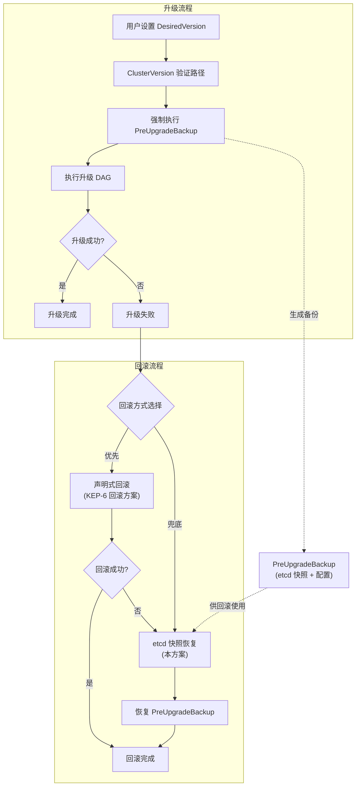

### 14.2 PreUpgradeBackup 集成

在 `ClusterVersionReconciler` 中注册升级前备份钩子：

```go
// controllers/capbke/clusterversion_controller.go

func (r *ClusterVersionReconciler) Reconcile(ctx context.Context, req ctrl.Request) (ctrl.Result, error) {
    cv := &cvoapi.ClusterVersion{}
    if err := r.Get(ctx, req.NamespacedName, cv); err != nil {
        return ctrl.Result{}, client.IgnoreNotFound(err)
    }

    // 检测到版本变更
    if cv.Spec.DesiredVersion != cv.Status.CurrentVersion {
        // 1. 验证升级路径
        pathEdges, err := r.upgradePathStore.FindPath(cv.Status.CurrentVersion, cv.Spec.DesiredVersion)
        if err != nil {
            return r.updateStatus(ctx, cv, cvoapi.PhaseBlocked, "no valid upgrade path")
        }

        // 2. 强制执行升级前备份 (PreUpgradeBackup)
        if err := r.preUpgradeBackupHook.Execute(ctx, r.getBKECluster(ctx, cv)); err != nil {
            return r.updateStatus(ctx, cv, cvoapi.PhasePreCheckFailed,
                fmt.Sprintf("pre-upgrade backup failed: %v", err))
        }

        // 3. 设置 upgrade-ready 注解
        bc := r.getBKECluster(ctx, cv)
        bc.Annotations["cvo.openfuyao.cn/upgrade-ready"] = cv.Spec.DesiredVersion
        r.Update(ctx, bc)

        return r.updateStatus(ctx, cv, cvoapi.PhaseUpgrading, "")
    }

    return ctrl.Result{}, nil
}
```

### 14.3 回滚兜底机制

当声明式回滚失败时，自动提示使用 etcd 恢复：

```go
// 当声明式回滚失败时
if rollbackErr != nil {
    // 查找最近的 PreUpgradeBackup
    preUpgradeBackup := r.findRecentPreUpgradeBackup(cluster)
    if preUpgradeBackup != nil {
        r.logger.Warn("declarative rollback failed, etcd snapshot restore recommended",
            "backupFile", preUpgradeBackup.FilePath,
            "backupTime", preUpgradeBackup.Timestamp)

        // 创建 ClusterRestore CR (需要用户确认)
        // 或在 Force 模式下自动触发
        if forceRestore {
            return r.triggerEtcdRestore(ctx, cluster, preUpgradeBackup)
        }
    }
}
```

---

## 15. 监控与告警

### 15.1 监控指标

| 指标 | 说明 | 告警阈值 |
|------|------|---------|
| `backup_last_success_timestamp` | 最后成功备份时间 | > 25 小时 |
| `backup_duration_seconds` | 备份耗时 | > 1 小时 |
| `backup_failed_total` | 失败备份次数 | > 0 |
| `backup_storage_used_bytes` | 已用存储 | > 80% |
| `backup_storage_available_bytes` | 可用存储 | < 20GB |
| `backup_count` | 备份文件数量 | > 1000 |
| `restore_duration_seconds` | 恢复耗时 | > 2 小时 |
| `restore_failed_total` | 恢复失败次数 | > 0 |

### 15.2 Prometheus 监控配置

```yaml
groups:
  - name: backup_restore
    rules:
      - alert: BackupNotRunRecently
        expr: time() - backup_last_success_timestamp > 86400
        for: 5m
        labels:
          severity: warning
        annotations:
          summary: "集群 {{ $labels.cluster }} 超过 24 小时未成功备份"

      - alert: BackupFailed
        expr: backup_failed_total > 0
        for: 1m
        labels:
          severity: critical
        annotations:
          summary: "集群 {{ $labels.cluster }} 备份失败"

      - alert: BackupStorageHighUsage
        expr: backup_storage_used_bytes / backup_storage_total_bytes > 0.8
        for: 5m
        labels:
          severity: warning
        annotations:
          summary: "备份存储使用率超过 80%"

      - alert: BackupStorageLowSpace
        expr: backup_storage_available_bytes < 10 * 1024 * 1024 * 1024
        for: 5m
        labels:
          severity: critical
        annotations:
          summary: "备份存储可用空间不足 10GB"

      - alert: RestoreFailed
        expr: restore_failed_total > 0
        for: 1m
        labels:
          severity: critical
        annotations:
          summary: "集群恢复失败"
```

---

## 16. 工作量评估与里程碑

### 16.1 工作量分解

| 阶段 | 任务 | 人月 | 优先级 | 说明 |
|------|------|------|--------|------|
| **M1: 基础备份恢复** | ClusterBackup/ClusterRestore CRD 定义 | 1.0 | P0 | CRD + DeepCopy + Webhook |
| | etcd 备份管理器 | 0.5 | P0 | etcdctl 集成、压缩、加密 |
| | etcd 恢复管理器 | 0.5 | P0 | 恢复、验证、回退 |
| | 配置备份/恢复 | 0.6 | P0 | CRD 导出、证书/系统配置备份恢复 |
| | 备份存储管理 | 0.5 | P0 | 本地+S3 双副本、加密、保留策略 |
| | ClusterBackupReconciler | 1.0 | P0 | 控制器逻辑、定时调度、状态管理 |
| | ClusterRestoreReconciler | 1.0 | P0 | 控制器逻辑、恢复调度、验证 |
| | 集成测试与文档 | 0.9 | P0 | E2E 测试、用户手册 |
| **M1 小计** | | **6.0** | | |
| **M2: 应用备份 + 灾难恢复** | Velero 集成 | 0.8 | P1 | Velero Backup/Restore CR 管理 |
| | PVC 快照备份 | 0.5 | P1 | VolumeSnapshot 集成 |
| | 灾难恢复流程 | 1.2 | P1 | 完整灾难恢复自动化 |
| | 恢复验证自动化 | 0.8 | P1 | 自动验证恢复结果 |
| | 备份验证自动化 | 0.5 | P1 | 定期备份验证 |
| | 灾难恢复演练 | 0.4 | P1 | 演练脚本、执行、问题修复 |
| | 集成测试与文档 | 0.3 | P1 | 测试报告、最佳实践 |
| **M2 小计** | | **4.5** | | |
| **总计** | | **10.5** | | |

### 16.2 里程碑规划

| 里程碑 | 季度 | 工作量 | 核心交付 |
|--------|------|--------|---------|
| **M1: 基础备份恢复** | 2026Q4 | 6.0 人月 | ClusterBackup/Restore CRD、etcd 备份恢复、配置备份恢复、存储管理 |
| **M2: 应用备份 + 灾难恢复** | 2027Q1 | 4.5 人月 | Velero 集成、PVC 快照、灾难恢复、验证自动化 |

### 16.3 依赖关系

```
M1: 基础备份恢复 (2026Q4)
  ├─ ClusterBackup/Restore CRD
  ├─ etcd 备份/恢复
  ├─ 配置备份/恢复
  ├─ 存储管理
  └─ 输出: 备份恢复基础能力 ──────→ M2: 应用备份 + 灾难恢复 (2027Q1)
                                      ├─ Velero 集成 (依赖 M1 存储管理)
                                      ├─ PVC 快照 (依赖 M1 存储管理)
                                      ├─ 灾难恢复 (依赖 M1 etcd 恢复)
                                      └─ 验证自动化 (依赖 M1 备份恢复)
```

---

## 17. 风险与缓解

| 风险 | 影响 | 缓解措施 |
|------|------|----------|
| **etcd 快照不一致** | 恢复后数据丢失 | etcdctl snapshot 保证一致性快照；恢复后验证关键数据 |
| **备份存储故障** | 备份不可用 | 双副本存储（本地+远程）；定期验证备份可恢复性 |
| **加密密钥丢失** | 无法解密备份 | 密钥存储在 K8s Secret 中；定期备份密钥到安全位置 |
| **恢复后数据不兼容** | 集群无法启动 | 恢复前执行兼容性检查；保留恢复前数据用于回退 |
| **备份窗口过长** | 影响集群性能 | 凌晨执行备份；etcd 在线快照不影响集群运行 |
| **Velero 未部署** | 应用数据无法备份 | 检查 Velero 可用性；提供备选方案（手动导出） |
| **证书过期** | 恢复后集群不可用 | 备份时检查证书有效期；恢复前验证证书 |

---

## 18. 毕业标准

| 阶段 | 标准 |
|------|------|
| **Alpha** | ClusterBackup/Restore CRD 定义完成；etcd 备份/恢复可用；配置备份/恢复可用；单元测试覆盖 |
| **Beta** | 定时自动备份可用；S3 远程存储可用；加密备份可用；升级前自动备份集成；E2E 备份恢复场景通过率 >90% |
| **GA** | Velero 集成可用；PVC 快照备份可用；灾难恢复流程完备；备份验证自动化；生产环境验证通过 |
