# KEP-6 状态机设计文档 v1

**文档版本**: v1.0  
**状态**: Draft  
**依赖**: 现有代码实现（api/, controllers/, pkg/）

## 目录

1. [概述](#1-概述)
2. [涉及的资源清单](#2-涉及的资源清单)
3. [状态字段总览](#3-状态字段总览)
   - 3.1 集群层状态
   - 3.2 节点层状态
   - 3.3 命令层状态
4. [状态分层模型](#4-状态分层模型)
   - 4.1 集群层（BKECluster）
   - 4.2 节点层（BKENode / BKEMachine）
   - 4.3 命令层（Command）
5. [状态转换图](#5-状态转换图)
   - 5.1 集群状态机
   - 5.2 节点状态机
   - 5.3 BKEMachine 状态机
   - 5.4 节点 StateCode 生命周期
   - 5.5 命令状态机
   - 5.6 声明式升级状态机
6. [重试与幂等机制](#6-重试与幂等机制)
   - 6.1 Command 级别重试
   - 6.2 BKECluster 级别重试（人工介入）
   - 6.3 声明式升级幂等
7. [场景用例](#7-场景用例)
   - 7.1 全新安装
   - 7.2 扩容（Scale-Out）
   - 7.3 缩容（Scale-In）
   - 7.4 升级
   - 7.5 安装/升级失败 → 重试
   - 7.6 删除
8. [单图完整性评估](#8-单图完整性评估)
9. [状态更新机制](#9-状态更新机制)
   - 9.1 状态更新责任矩阵
   - 9.2 集群状态更新流程
   - 9.3 节点状态更新流程
   - 9.4 命令状态更新流程
   - 9.5 持久化机制
   - 9.6 状态更新触发条件
10. [状态间关系](#10-状态间关系)
   - 10.1 状态依赖关系图
   - 10.2 状态聚合规则
   - 10.3 状态因果关系
   - 10.4 状态冲突处理
   - 10.5 Command 状态与 Node 状态的关系与设计思路
11. [设计思路分析](#11-设计思路分析)
   - 11.1 核心发现：状态维度爆炸
   - 11.2 各资源状态设计思路
   - 11.3 v1 → v2 → v3 的演进逻辑
   - 11.4 v1 的核心设计问题（驱动 v2/v3 演进）
- [附录](#附录)（A. 关键常量定义 / B. 关键文件位置 / C. 术语表）

---

## 1. 概述

本文档基于现有代码实现，梳理 BKE 集群生命周期中的完整状态机，覆盖**安装、升级、扩容、缩容、回滚**五个核心场景。

**设计目标**：
- 明确各资源的状态字段和转换规则
- 提供可视化的状态转换图
- 说明重试与幂等机制
- 给出实际场景用例

**核心发现**：
- 状态维度多（集群3个状态字段 + 节点2个状态字段 + 命令1个状态字段）
- **无法在单张图中完整展现**，采用分层图 + 资源关联图
- 重试机制分三层：Command 自动重试、BKECluster 人工重试、声明式升级幂等

---

## 2. 涉及的资源清单

| 资源名称 | API Group | 版本 | 作用 | 状态字段 |
|---------|-----------|------|------|---------|
| **BKECluster** | bke.bocloud.com | v1beta1 | 集群主资源，管理整个集群生命周期 | Phase, ClusterStatus, ClusterHealthState, Conditions, PhaseStatus, DeclarativeUpgrade |
| **BKENode** | bke.bocloud.com | v1beta1 | 节点资源，记录节点状态和配置 | State, StateCode, Message, NeedSkip |
| **BKEMachine** | infrastructure.cluster.x-k8s.io | v1beta1 | Cluster API 机器资源，管理节点引导 | Ready, Bootstrapped, Addresses, Conditions, Node |
| **Command** | bkeagent.bocloud.com | v1beta1 | 命令资源，在节点上执行具体操作 | Phase, Status, Conditions, LastStartTime, CompletionTime, Succeeded, Failed |
| **ClusterVersion** | config.openfuyao.cn | v1alpha1 | 集群版本资源，声明期望版本 | DesiredVersion, CurrentVersion, Conditions |
| **ReleaseImage** | config.openfuyao.cn | v1alpha1 | 发布镜像资源，定义组件版本 | Components, Version |
| **ComponentVersion** | config.openfuyao.cn | v1alpha1 | 组件版本资源，定义组件配置 | Type, Version, Binary/Helm/YAML/Inline Spec |

---

## 3. 状态字段总览

### 3.1 集群层状态

#### 3.1.1 ClusterStatus（20 个值）

**定义位置**: `api/capbke/v1beta1/bkecluster_consts.go:151-183`

**业务说明**：`ClusterStatus` 描述集群**当前操作状态**——集群正在执行什么操作、操作是否成功。由 `phase_flow.go` 的 11 个 `handleCluster*Phase` 函数在 Phase 执行前后设置。

```go
const (
    // 基础状态
    ClusterReady     ClusterStatus = "Ready"
    ClusterUnhealthy ClusterStatus = "Unhealthy"
    ClusterUnknown   ClusterStatus = "Unknown"
    ClusterChecking  ClusterStatus = "Checking"

    // 暂停状态
    ClusterPaused      ClusterStatus = "Paused"
    ClusterPauseFailed ClusterStatus = "PauseFailed"

    // DryRun 状态
    ClusterDryRun       ClusterStatus = "DryRun"
    ClusterDryRunFailed ClusterStatus = "DryRunFailed"

    // 初始化状态
    ClusterInitializing         ClusterStatus = "Initializing"
    ClusterInitializationFailed ClusterStatus = "InitializationFailed"

    // 升级状态
    ClusterUpgrading     ClusterStatus = "Upgrading"
    ClusterUpgradeFailed ClusterStatus = "UpgradeFailed"

    // 扩容状态
    ClusterMasterScalingUp   ClusterStatus = "ScalingMasterNodesUp"
    ClusterMasterScalingDown ClusterStatus = "ScalingMasterNodesDown"
    ClusterWorkerScalingUp   ClusterStatus = "ScalingWorkerNodesUp"
    ClusterWorkerScalingDown ClusterStatus = "ScalingWorkerNodesDown"
    ClusterScaleFailed       ClusterStatus = "ScaleFailed"

    // Addon 部署状态
    ClusterDeployingAddon    ClusterStatus = "DeployingAddon"
    ClusterDeployAddonFailed ClusterStatus = "DeployAddonFailed"

    // 管理状态
    ClusterManaging     ClusterStatus = "Managing"
    ClusterManageFailed ClusterStatus = "ManageFailed"

    // 删除状态
    ClusterDeleting     ClusterStatus = "Deleting"
    ClusterDeleteFailed ClusterStatus = "DeleteFailed"
)
```

| 常量 | 值 | 分类 | 业务说明 |
|------|-----|------|---------|
| `ClusterReady` | `"Ready"` | 基础 | 集群所有节点就绪、健康检查通过，处于稳定运行态。安装/升级/扩缩容完成后最终目标状态 |
| `ClusterUnhealthy` | `"Unhealthy"` | 基础 | 集群健康检查失败（`EnsureCluster` 阶段检测到节点不可达或组件异常）。此状态不触发 StatusManager 失败计数，集群持续重试调谐 |
| `ClusterUnknown` | `"Unknown"` | 基础 | 集群状态无法判定。当 Phase 不属于任何已知 `ClusterXxxPhaseNames` 集合时由 default 分支设置，通常是未纳入状态映射的 Phase 执行后 |
| `ClusterChecking` | `"Checking"` | 基础 | `EnsureCluster` 阶段前置 Hook 专门设置的中间状态，表示正在进行集群健康检查，检查完成后转为 `Ready` 或 `Unhealthy` |
| `ClusterPaused` | `"Paused"` | 暂停 | `EnsurePaused` 阶段成功执行后设置。集群暂停调谐，不执行任何 Phase，用于维护窗口。StatusManager 不记录此状态 |
| `ClusterPauseFailed` | `"PauseFailed"` | 暂停 | `EnsurePaused` 阶段执行失败。触发 StatusManager 失败计数，重试次数内恢复为 `Paused`，超限后设为 `ClusterHealthState.DeployFailed` 等 |
| `ClusterDryRun` | `"DryRun"` | DryRun | `EnsureDryRun` 阶段成功执行后设置。DryRun 模式下仅验证配置不实际部署 |
| `ClusterDryRunFailed` | `"DryRunFailed"` | DryRun | `EnsureDryRun` 阶段执行失败，配置验证未通过 |
| `ClusterInitializing` | `"Initializing"` | 初始化 | `ClusterInitPhaseNames`（8 个 Phase）执行中设置。涵盖 Finalizer/Certs/ClusterAPIObj/MasterInit/BKEAgent/NodesEnv/LoadBalance/AgentSwitch 阶段，表示集群首次安装进行中 |
| `ClusterInitializationFailed` | `"InitializationFailed"` | 初始化 | `ClusterInitPhaseNames` 中任意 Phase 执行失败。触发 StatusManager 失败计数与状态伪装机制 |
| `ClusterUpgrading` | `"Upgrading"` | 升级 | `ClusterUpgradePhaseNames`（5 个旧路径）或 `DeclarativeClusterUpgradePhaseNames`（6 个 DAG 路径）中的 Phase 执行中设置。表示集群升级进行中 |
| `ClusterUpgradeFailed` | `"UpgradeFailed"` | 升级 | 升级 Phase 执行失败。触发 StatusManager 失败计数，超限后设为 `ClusterHealthState.UpgradeFailed` |
| `ClusterMasterScalingUp` | `"ScalingMasterNodesUp"` | 扩缩容 | `EnsureMasterJoin` Phase 执行中设置，表示正在向集群添加 Master 节点 |
| `ClusterMasterScalingDown` | `"ScalingMasterNodesDown"` | 扩缩容 | `EnsureMasterDelete` Phase 执行中设置，表示正在从集群移除 Master 节点 |
| `ClusterWorkerScalingUp` | `"ScalingWorkerNodesUp"` | 扩缩容 | `EnsureWorkerJoin` Phase 执行中设置，表示正在向集群添加 Worker 节点 |
| `ClusterWorkerScalingDown` | `"ScalingWorkerNodesDown"` | 扩缩容 | `EnsureWorkerDelete` Phase 执行中设置，表示正在从集群移除 Worker 节点 |
| `ClusterScaleFailed` | `"ScaleFailed"` | 扩缩容 | 4 种扩缩容 Phase 中任意一种失败时**共用**此状态。与进行中状态不同（4 种各自独立），失败状态统一为一个 |
| `ClusterDeployingAddon` | `"DeployingAddon"` | Addon | `EnsureAddonDeploy` Phase 执行中设置，表示正在部署集群组件（coredns/metrics-server 等） |
| `ClusterDeployAddonFailed` | `"DeployAddonFailed"` | Addon | `EnsureAddonDeploy` Phase 执行失败 |
| `ClusterManaging` | `"Managing"` | 纳管 | `EnsureClusterManage` Phase 执行中设置，表示正在纳管已有集群（将外部集群纳入 BKE 管理） |
| `ClusterManageFailed` | `"ManageFailed"` | 纳管 | `EnsureClusterManage` Phase 执行失败 |
| `ClusterDeleting` | `"Deleting"` | 删除 | `EnsureDeleteOrReset` Phase 执行中设置，表示集群正在被删除 |
| `ClusterDeleteFailed` | `"DeleteFailed"` | 删除 | `EnsureDeleteOrReset` Phase 执行失败，集群删除未完成 |

#### 3.1.2 ClusterHealthState（9 个值）

**定义位置**: `api/capbke/v1beta1/bkecluster_consts.go:221-231`

**业务说明**：`ClusterHealthState` 描述集群**操作维度健康状态**——集群处于哪个操作生命周期阶段以及该阶段是否失败。由 `setClusterHealthStatus`（`bkecluster_controller.go:757`）在 Reconcile 入口根据操作类型设置，由 `ensure_cluster.go` 健康检查设置 `Healthy`/`Unhealthy`，由 `StatusManager` 在重试超限时设置 `*Failed` 状态。

> **注意**：此字段名为"HealthState"但实际混入了操作状态（Deploying/Upgrading/Managing/Deleting），真正的健康状态仅 `Healthy`/`Unhealthy`。详见 `code/exception/状态机重构.md` 1.7.2 节分析。

```go
const (
    Deploying     ClusterHealthState = "Deploying"
    DeployFailed  ClusterHealthState = "DeployFailed"
    Upgrading     ClusterHealthState = "Upgrading"
    UpgradeFailed ClusterHealthState = "UpgradeFailed"
    Managing      ClusterHealthState = "Managing"
    ManageFailed  ClusterHealthState = "ManageFailed"
    Unhealthy     ClusterHealthState = "Unhealthy"
    Healthy       ClusterHealthState = "Healthy"
    Deleting      ClusterHealthState = "Deleting"
)
```

| 常量 | 值 | 分类 | 业务说明 |
|------|-----|------|---------|
| `Deploying` | `"Deploying"` | 操作中 | 首次部署进行中。`setClusterHealthStatus` 在 `DeployFlag==true` 或 `DeployFailedFlag==true` 时设置 |
| `DeployFailed` | `"DeployFailed"` | 操作失败 | 部署失败且重试次数超限。`StatusManager` 在 `CurrentClusterState==Deploying` 且 `!AllowFailed()` 时设置。缺失 `ScalingFailed`/`DeleteFailed`/`DryRunFailed` 等，这些失败无法通过本字段表达 |
| `Upgrading` | `"Upgrading"` | 操作中 | 升级进行中。`setClusterHealthStatus` 在 `UpgradeFlag==true` 或 `UpgradeFailedFlag==true` 时设置 |
| `UpgradeFailed` | `"UpgradeFailed"` | 操作失败 | 升级失败且重试次数超限。`StatusManager` 在 `CurrentClusterState==Upgrading` 且 `!AllowFailed()` 时设置 |
| `Managing` | `"Managing"` | 操作中 | 纳管进行中。`setClusterHealthStatus` 在 `ManageFlag==true` 时设置 |
| `ManageFailed` | `"ManageFailed"` | 操作失败 | 纳管失败且重试次数超限。`StatusManager` 在 `CurrentClusterState==Managing` 且 `!AllowFailed()` 时设置 |
| `Unhealthy` | `"Unhealthy"` | 健康 | 集群健康检查失败（`ensure_cluster.go:373`）。此状态不触发 StatusManager 失败计数，集群持续重试调谐 |
| `Healthy` | `"Healthy"` | 健康 | 集群健康检查通过（`ensure_cluster.go:399`），所有节点就绪、组件正常。此为集群稳定运行的健康标记 |
| `Deleting` | `"Deleting"` | 操作中 | 集群删除进行中。`setClusterHealthStatus` 在 `IsDeleteOrReset(bkeCluster)` 为 true 时设置。注意：无 `DeleteFailed` 对应值 |

#### 3.1.3 BKEClusterPhaseStatus（6 个值）

**定义位置**: `api/capbke/v1beta1/bkecluster_consts.go:185-192`

**业务说明**：`BKEClusterPhaseStatus` 描述单个 Phase 的**执行结果状态**。由 PhaseFlow 的 `DefaultPreHook`/`DefaultPostHook` 在 Phase 执行前后设置，记录到 `BKECluster.Status.PhaseStatus` 中。

```go
const (
    PhaseSucceeded BKEClusterPhaseStatus = "Succeeded"
    PhaseFailed    BKEClusterPhaseStatus = "Failed"
    PhaseUnknown   BKEClusterPhaseStatus = "Unknown"
    PhaseWaiting   BKEClusterPhaseStatus = "Waiting"
    PhaseRunning   BKEClusterPhaseStatus = "Running"
    PhaseSkipped   BKEClusterPhaseStatus = "Skipped"
)
```

| 常量 | 值 | 业务说明 |
|------|-----|---------|
| `PhaseSucceeded` | `"Succeeded"` | Phase 执行成功（`Execute()` 返回 nil）。后置 Hook 设置此状态并记录 EndTime |
| `PhaseFailed` | `"Failed"` | Phase 执行失败（`Execute()` 返回 error）。后置 Hook 设置此状态，记录 EndTime 和错误信息 |
| `PhaseUnknown` | `"Unknown"` | Phase 执行结果未知，通常是执行过程中控制器异常退出或超时，无法判定成功/失败 |
| `PhaseWaiting` | `"Waiting"` | Phase 尚未开始执行，在前序 Phase 链中排队等待。初始状态 |
| `PhaseRunning` | `"Running"` | Phase 正在执行中。前置 Hook (`ExecutePreHook`) 设置此状态并记录 StartTime |
| `PhaseSkipped` | `"Skipped"` | Phase 的 `NeedExecute()` 返回 false，无需执行直接跳过。不消耗执行时间 |

#### 3.1.4 ClusterConditionType（21 个值）

**定义位置**: `api/capbke/v1beta1/bkecluster_consts.go:108-134`

**业务说明**：`ClusterConditionType` 定义集群级**细粒度条件类型**。每个条件记录某个特定方面的就绪/失败状态（True/False/Unknown），由对应 Phase 在执行后通过 `condition.ConditionMark()` 设置。

```go
const (
    ControlPlaneEndPointSetCondition ClusterConditionType = "ControlPlaneEndPointSet"
    TargetClusterReadyCondition      ClusterConditionType = "TargetClusterReady"
    TargetClusterBootCondition       ClusterConditionType = "TargetClusterBoot"
    ClusterAddonCondition            ClusterConditionType = "Addon"
    NodesInfoCondition               ClusterConditionType = "NodesInfo"
    BKEAgentCondition                ClusterConditionType = "BKEAgent"
    LoadBalancerCondition            ClusterConditionType = "LoadBalancer"
    NodesEnvCondition                ClusterConditionType = "NodesEnv"
    ClusterAPIObjCondition           ClusterConditionType = "ClusterAPIObj"
    SwitchBKEAgentCondition          ClusterConditionType = "SwitchBKEAgent"
    ControlPlaneInitializedCondition ClusterConditionType = "ControlPlaneInitialized"
    BKEConfigCondition               ClusterConditionType = "BKEConfig"
    ClusterHealthyStateCondition     ClusterConditionType = "ClusterHealthyState"
    NodesPostProcessCondition        ClusterConditionType = "NodesPostProcess"
    BootstrapSucceededCondition      ClusterConditionType = "BootstrapSucceeded"

    // Bocloud 集群专用
    BocloudClusterDataBackupCondition             ClusterConditionType = "BocloudClusterDataBackup"
    BocloudClusterMasterCertDistributionCondition ClusterConditionType = "BocloudClusterMasterCertDistribution"
    BocloudClusterWorkerCertDistributionCondition ClusterConditionType = "BocloudClusterWorkerCertDistribution"
    BocloudClusterEnvInitCondition                ClusterConditionType = "BocloudClusterEnvInit"
    TypeOfManagementClusterGuessCondition         ClusterConditionType = "TypeOfManagementClusterGuess"
    InternalSpecChangeCondition                   ClusterConditionType = "InternalSpecChange"
)
```

| 常量 | 值 | 分类 | 业务说明 |
|------|-----|------|---------|
| `ControlPlaneEndPointSetCondition` | `"ControlPlaneEndPointSet"` | 安装 | 控制面访问入口（负载均衡/API Server 地址）已配置完成。由 `EnsureLoadBalance` 阶段设置 |
| `TargetClusterReadyCondition` | `"TargetClusterReady"` | 安装 | 目标集群（被管理的 K8s 集群）就绪，API Server 可达且节点已注册 |
| `TargetClusterBootCondition` | `"TargetClusterBoot"` | 安装 | 目标集群引导完成。由 `reconcileBKEMachine` 聚合所有 BKEMachine.Bootstrapped 后设置（`phases.go:861`） |
| `ClusterAddonCondition` | `"Addon"` | 安装 | 集群 Addon 部署完成。由 `EnsureAddonDeploy` 阶段设置 |
| `NodesInfoCondition` | `"NodesInfo"` | 安装 | 节点信息已收集并同步到 BKECluster.Status |
| `BKEAgentCondition` | `"BKEAgent"` | 安装 | BKEAgent 已推送到所有节点且健康检查通过。由 `EnsureBKEAgent` 阶段设置 |
| `LoadBalancerCondition` | `"LoadBalancer"` | 安装 | 负载均衡器配置完成，控制面入口可用。由 `EnsureLoadBalance` 阶段设置 |
| `NodesEnvCondition` | `"NodesEnv"` | 安装 | 所有节点环境初始化完成（容器运行时、内核参数等）。由 `EnsureNodesEnv` 阶段设置 |
| `ClusterAPIObjCondition` | `"ClusterAPIObj"` | 安装 | Cluster API 对象（Machine/MachineDeployment/KubeadmControlPlane）已创建。由 `EnsureClusterAPIObj` 阶段设置 |
| `SwitchBKEAgentCondition` | `"SwitchBKEAgent"` | 安装 | Agent 监听切换完成，从安装模式切换到运行模式。由 `EnsureAgentSwitch` 阶段设置 |
| `ControlPlaneInitializedCondition` | `"ControlPlaneInitialized"` | 安装 | 控制面已初始化（首个 Master 的 `kubeadm init` 完成）。Worker 节点 bootstrap 前会检查此条件 |
| `BKEConfigCondition` | `"BKEConfig"` | 配置 | BKECluster 配置已同步到目标集群（ConfigMap/Secret 等） |
| `ClusterHealthyStateCondition` | `"ClusterHealthyState"` | 健康 | 集群健康状态条件。由 `markBKEClusterHealthyStatus`（`controller.go:805`）在设置 ClusterHealthState 时同步标记 |
| `NodesPostProcessCondition` | `"NodesPostProcess"` | 安装 | 节点后置脚本处理完成。由 `EnsureNodesPostProcess` 阶段设置 |
| `BootstrapSucceededCondition` | `"BootstrapSucceeded"` | 引导 | **BKEMachine 专用**：节点引导成功。这是 BKEMachine 上唯一的 Condition，三态：True（成功）/ False+WaitingForControlPlaneAvailableReason（Worker 等待 CP）/ False+NodeBootStrapFailedReason（引导失败） |
| `BocloudClusterDataBackupCondition` | `"BocloudClusterDataBackup"` | 纳管 | **Bocloud 集群专用**：纳管前数据备份完成 |
| `BocloudClusterMasterCertDistributionCondition` | `"BocloudClusterMasterCertDistribution"` | 纳管 | **Bocloud 集群专用**：Master 节点证书分发完成 |
| `BocloudClusterWorkerCertDistributionCondition` | `"BocloudClusterWorkerCertDistribution"` | 纳管 | **Bocloud 集群专用**：Worker 节点证书分发完成 |
| `BocloudClusterEnvInitCondition` | `"BocloudClusterEnvInit"` | 纳管 | **Bocloud 集群专用**：纳管集群环境初始化完成 |
| `TypeOfManagementClusterGuessCondition` | `"TypeOfManagementClusterGuess"` | 纳管 | 管理集群类型推断完成（推断目标集群由哪种管理平台管理） |
| `InternalSpecChangeCondition` | `"InternalSpecChange"` | 内部 | 内部 Spec 变更标记，用于触发特定调谐逻辑。非用户可见条件 |

### 3.2 节点层状态

#### 3.2.1 NodeState（BKENode，7 个值）

**定义位置**: `api/bkecommon/v1beta1/bkenode_types.go:34-43`

**业务说明**：`NodeState` 是 BKENode 的**对外语义状态**，从 `StateCode` 位标记推导而来。由 `NodeFetcher.SetNodeState()` 和各 Phase 直接设置。

```go
const (
    NodeNotReady    NodeState = "NotReady"
    NodeReady       NodeState = "Ready"
    NodePending     NodeState = "Pending"
    NodeFailed      NodeState = "Failed"
    NodeDeleting    NodeState = "Deleting"
    NodeUpgrading   NodeState = "Upgrading"
    NodeProvisioned NodeState = "Provisioned"
)
```

| 常量 | 值 | 业务说明 | StateCode 推导条件 |
|------|-----|---------|-------------------|
| `NodePending` | `"Pending"` | 节点初始状态，尚未开始任何操作。新加入集群的节点默认此状态 | `StateCode == 0` |
| `NodeProvisioned` | `"Provisioned"` | 节点已部分配置（Agent 推送/环境初始化等），但尚未完成 bootstrap。处于安装中间态 | `StateCode > 0 && StateCode != 527 && !Failed && !Deleting` |
| `NodeBootStrapping` | `"BootStrapping"` | 节点正在执行 bootstrap 命令（`kubeadm init/join`）。由 BKEMachine 控制器设置 | BKEMachine 控制器设置，非 StateCode 推导 |
| `NodeReady` | `"Ready"` | 节点完全就绪：Agent 推送+就绪、环境配置、bootstrap、MasterInit、后处理全部完成。集群 Ready 的前置条件 | `StateCode & 527 == 527`（bits 0,1,2,3,5,9） |
| `NodeNotReady` | `"NotReady"` | 节点 bootstrap 成功但尚未完全配置（缺少部分 StateCode 位标记），或运行中检测到不可达。BKEMachine 引导成功后设置此状态 | 部分位标记置位但未达 527 |
| `NodeFailed` | `"Failed"` | 节点操作失败且重试超限。`StatusManager` 设置 `NodeFailedFlag`（bit 7），后续所有调谐跳过此节点，需人工清除标志位才能恢复 | `StateCode & NodeFailedFlag != 0` |
| `NodeDeleting` | `"Deleting"` | 节点正在被删除。由 `BKEMachineController` 在删除流程中设置，后续 Phase 跳过此节点 | `SetNodeState(NodeDeleting)` 设置，非 StateCode 推导 |
| `NodeUpgrading` | `"Upgrading"` | 节点正在升级（容器运行时/etcd/k8s 组件等）。升级 Phase 执行中设置 | 升级 Phase 设置，非 StateCode 推导 |
| `NodeManaging` | `"Managing"` | 节点正在被纳管（将已有节点纳入 BKE 管理）。纳管 Phase 执行中设置 | 纳管 Phase 设置 |

> **注意**：`NodeState` 共 14 个值（含 BKEMachine/Bootstrap 侧定义的 `NodeUnknown`/`NodeInitFailed`/`NodeBootStrapFailed` 等），但 BKENode 实际使用 9 个值，其余由 BKEMachine 控制器设置到 BKENode 上。

#### 3.2.2 NodeState（BKEMachine/Bootstrap，14 个值）

**定义位置**: `api/capbke/v1beta1/bkecluster_consts.go:196-219`

**业务说明**：这些 `NodeState` 值定义在 `capbke/v1beta1` 包中，主要由 **BKEMachine 控制器**在引导流程中设置到 BKENode 上（通过 `NodeFetcher.SetNodeStateWithMessageForCluster`）。与 3.2.1 中的值有部分重叠（`NodeReady`/`NodeNotReady`/`NodeDeleting`/`NodeUpgrading` 值相同），但额外包含引导和升级阶段的细化状态。

```go
const (
    NodeUnknown         NodeState = "Unknown"
    NodeInitializing    NodeState = "Initializing"
    NodeInitFailed      NodeState = "InitFailed"
    NodeBootStrapping   NodeState = "BootStrapping"
    NodeBootStrapFailed NodeState = "BootStrapFailed"
    NodeDeleting        NodeState = "Deleting"
    NodeDeleteFailed    NodeState = "DeleteFailed"
    NodeUpgrading       NodeState = "Upgrading"
    NodeUpgradeFailed   NodeState = "UpgradeFailed"
    NodeReady           NodeState = "Ready"
    NodeNotReady        NodeState = "NotReady"
    NodeManaging        NodeState = "Managing"
    NodeManageFailed    NodeState = "ManageFailed"
    EtcdUpgrading       NodeState = "Upgrading"
    EtcdUpgradeFailed   NodeState = "UpgradeFailed"
)
```

| 常量 | 值 | 分类 | 业务说明 | 设置位置 |
|------|-----|------|---------|---------|
| `NodeUnknown` | `"Unknown"` | 初始 | 节点状态未知，通常为新建节点尚未开始任何操作 | 初始默认值 |
| `NodeInitializing` | `"Initializing"` | 安装 | 节点正在初始化（Agent 推送/环境配置阶段）。由 `EnsureLoadBalance` 等阶段设置 | `ensure_load_balance.go:207` |
| `NodeInitFailed` | `"InitFailed"` | 安装 | 节点初始化失败（如负载均衡配置失败） | `ensure_load_balance.go:203` |
| `NodeBootStrapping` | `"BootStrapping"` | 引导 | 节点正在执行 bootstrap 命令（`kubeadm init/join`）。由 BKEMachine 控制器在创建 Bootstrap Command 后设置 | `bkemachine_controller_phases.go:247` |
| `NodeBootStrapFailed` | `"BootStrapFailed"` | 引导 | 节点 bootstrap 命令执行失败。由 BKEMachine 控制器在 Command 失败后设置，移除标签允许重新绑定 | `bkemachine_controller_phases.go:687,775` |
| `NodeDeleting` | `"Deleting"` | 删除 | 节点正在被删除。由 BKEMachine 控制器在删除流程中设置 | `bkemachine_controller.go:307` |
| `NodeDeleteFailed` | `"DeleteFailed"` | 删除 | 节点删除失败（Reset Command 执行失败或超时） | 删除 Phase 失败路径 |
| `NodeUpgrading` | `"Upgrading"` | 升级 | 节点正在升级（containerd/etcd/k8s 组件）。由升级 Phase 设置 | 升级 Phase |
| `NodeUpgradeFailed` | `"UpgradeFailed"` | 升级 | 节点升级失败。触发 StatusManager 节点级失败计数 | 升级 Phase 失败路径 |
| `NodeReady` | `"Ready"` | 就绪 | 节点完全就绪（StateCode == 527）。所有必要 Phase 已完成 | StateCode 推导 |
| `NodeNotReady` | `"NotReady"` | 就绪 | 节点 bootstrap 成功但未完全配置，或运行中检测到不可达。BKEMachine 引导成功后设置此状态 | `bkemachine_controller_phases.go:1302` |
| `NodeManaging` | `"Managing"` | 纳管 | 节点正在被纳管 | 纳管 Phase |
| `NodeManageFailed` | `"ManageFailed"` | 纳管 | 节点纳管失败 | 纳管 Phase 失败路径 |
| `EtcdUpgrading` | `"Upgrading"` | 升级 | Etcd 正在升级（值与 `NodeUpgrading` 相同，语义上区分 etcd 组件升级） | `EnsureEtcdUpgrade` Phase |
| `EtcdUpgradeFailed` | `"UpgradeFailed"` | 升级 | Etcd 升级失败（值与 `NodeUpgradeFailed` 相同） | `EnsureEtcdUpgrade` Phase 失败 |

> **注意**：`EtcdUpgrading`/`EtcdUpgradeFailed` 的字符串值与 `NodeUpgrading`/`NodeUpgradeFailed` 完全相同，无法通过值区分——代码中通过上下文（哪个 Phase 设置）来区分语义。

#### 3.2.3 StateCode（位标记，10 位）

**定义位置**: `api/capbke/v1beta1/bkecluster_consts.go:233-246`

**业务说明**：`StateCode` 是 BKENode 的**事实来源**（source of truth），每个 Phase 执行成功后通过 `MarkNodeStateFlag` 设置对应的位标记。`NodeState` 从 `StateCode` 推导：`StateCode == 527` → `NodeReady`。详见 11.2.2 节的 Phase 对应关系。

```go
const (
    NodeAgentPushedFlag   = 1 << iota  // bit 0 = 1    (EnsureBKEAgent 阶段)
    NodeAgentReadyFlag                 // bit 1 = 2    (bkeagent 健康检查通过)
    NodeEnvFlag                        // bit 2 = 4    (EnsureNodesEnv 阶段)
    NodeBootFlag                       // bit 3 = 8    (bootstrap 命令成功)
    NodeHAFlag                         // bit 4 = 16   (高可用标记)
    MasterInitFlag                     // bit 5 = 32   (master init 完成)
    NodeDeletingFlag                   // bit 6 = 64   (节点删除中)
    NodeFailedFlag                     // bit 7 = 128  (节点失败)
    NodeStateNeedRecord                // bit 8 = 256  (状态需要记录)
    NodePostProcessFlag                // bit 9 = 512  (后处理完成)
)
```

| Bit | 常量 | 值 | 业务说明 | 设置 Phase / 机制 |
|-----|------|-----|---------|-------------------|
| 0 | `NodeAgentPushedFlag` | 1 | BKEAgent 已推送到节点（二进制/配置已传输），但尚未确认就绪 | `EnsureBKEAgent` / `EnsureClusterManage` |
| 1 | `NodeAgentReadyFlag` | 2 | BKEAgent 健康检查通过，Agent 可接收并执行命令。与 bit 0 同时设置 | `EnsureBKEAgent` / `EnsureClusterManage` |
| 2 | `NodeEnvFlag` | 4 | 节点环境初始化完成（容器运行时安装、内核参数配置、系统依赖准备等） | `EnsureNodesEnv` / `EnsureClusterManage` |
| 3 | `NodeBootFlag` | 8 | 节点 bootstrap 成功（`kubeadm init/join` 执行完成，目标集群 Node 可达验证通过） | `BKEMachineController`（bootstrap 成功）/ `EnsureMasterJoin` / `EnsureWorkerJoin` |
| 4 | `NodeHAFlag` | 16 | 负载均衡器已配置，节点加入 HA 集群入口。**不参与 Ready 判定**（HA 为可选配置） | `EnsureLoadBalance` |
| 5 | `MasterInitFlag` | 32 | 首个 Master 节点 `kubeadm init` 完成（仅 Master 节点设置，Worker 不设置） | `BKEMachineController`（`phase == InitControlPlane`） |
| 6 | `NodeDeletingFlag` | 64 | 节点标记为删除中。⚠️ **代码中仅检查从未设置**——`SetNodeState(NodeDeleting)` 不设置此 flag，是实现缺口 | **无**（仅被 `ensure_nodes_env.go:115` 和 `phaseutil/util.go:1153` 读取） |
| 7 | `NodeFailedFlag` | 128 | 节点操作失败且重试超限。设置后后续所有调谐跳过此节点，需人工清除标志位才能恢复 | `StatusManager`（`statusmanager.go:346`，非 Phase） |
| 8 | `NodeStateNeedRecord` | 256 | 持久化触发器：内存中修改节点状态后自动设置此标记，批量持久化后清除。非业务状态，纯实现机制 | `SetNodeState` / `SetNodeStateWithMessage`（自动设置） |
| 9 | `NodePostProcessFlag` | 512 | 节点后置脚本处理完成（如内核调优、安全加固等后置配置） | `EnsureNodesPostProcess` |

**关键常量**:
```go
bootstrapReadyStateCode = 527  // = 1+2+4+8+32+512 = bits 0,1,2,3,5,9
```

> **注意**：`527 = NodeAgentPushed(1) + NodeAgentReady(2) + NodeEnv(4) + NodeBoot(8) + MasterInit(32) + NodePostProcess(512)`。当 `StateCode & 527 == 527` 时，节点状态推导为 `NodeReady`。`NodeHAFlag`(bit 4) 不在此掩码中——HA 是可选配置，不影响 Ready 判定。

### 3.3 命令层状态

#### 3.3.1 CommandPhase（7 个值）

**定义位置**: `api/bkeagent/v1beta1/command_types.go:34-42`

**业务说明**：`CommandPhase` 描述 Command（远程命令执行任务）的**生命周期阶段**。由 `CommandReconciler` 在命令执行过程中设置，支持自动重试（`BackoffLimit`）和超时（`ActiveDeadlineSecond`）。

```go
const (
    CommandPending  CommandPhase = "Pending"
    CommandRunning  CommandPhase = "Running"
    CommandComplete CommandPhase = "Completed"
    CommandSuspend  CommandPhase = "Suspend"
    CommandSkip     CommandPhase = "Skip"
    CommandFailed   CommandPhase = "Failed"
    CommandUnKnown  CommandPhase = "unKnown"
)
```

| 常量 | 值 | 业务说明 |
|------|-----|---------|
| `CommandPending` | `"Pending"` | 命令已创建但尚未开始执行，等待 BKEAgent 拉取。初始状态 |
| `CommandRunning` | `"Running"` | 命令正在 BKEAgent 上执行中，至少一条子命令已启动 |
| `CommandComplete` | `"Completed"` | 所有子命令执行成功，命令整体完成。终态 |
| `CommandSuspend` | `"Suspend"` | 命令被暂停（`Spec.Suspend = true`），暂停期间不执行新子命令，恢复后继续 |
| `CommandSkip` | `"Skip"` | 子命令被跳过。当 `BackoffIgnore=true` 且子命令失败时，该子命令标记为 Skip 而非 Failed，不影响整体完成 |
| `CommandFailed` | `"Failed"` | 命令执行失败：有子命令失败且不可跳过，或重试次数耗尽。终态 |
| `CommandUnKnown` | `"unKnown"` | 命令状态未知，通常为 BKEAgent 不可达或响应超时，无法判定执行结果 |

> **聚合规则**：Command.Phase 由各子命令 Condition.Phase 聚合——任意子命令 Failed → `CommandFailed`；所有子命令 Complete → `CommandComplete`；部分 Running/Pending → `CommandRunning`。详见 10.2.3 节。

#### 3.3.2 CommandType（3 个值）

**定义位置**: `api/bkeagent/v1beta1/command_types.go:23-29`

**业务说明**：`CommandType` 描述 Command 中子命令的**执行类型**，决定 BKEAgent 如何执行该命令。

```go
const (
    CommandBuiltIn    CommandType = "BuiltIn"
    CommandShell      CommandType = "Shell"
    CommandKubernetes CommandType = "Kubernetes"
)
```

| 常量 | 值 | 业务说明 |
|------|-----|---------|
| `CommandBuiltIn` | `"BuiltIn"` | 内置命令类型，BKEAgent 直接调用内置 Go 函数执行（如文件传输、配置渲染），不依赖外部 shell。性能最高，无需目标节点安装额外工具 |
| `CommandShell` | `"Shell"` | Shell 命令类型，BKEAgent 通过 `/bin/sh -c` 执行命令字符串。最通用，支持任意 shell 命令、脚本和管道操作 |
| `CommandKubernetes` | `"Kubernetes"` | Kubernetes 命令类型，BKEAgent 通过 `kubectl`/client-go 执行 K8s 操作（如 `kubectl apply`/`kubectl drain`）。需要在目标节点上安装 kubectl 并配置 kubeconfig |

---

## 4. 状态分层模型

### 4.1 集群层（BKECluster）

```
┌─────────────────────────────────────────────────────────────────┐
│                        BKECluster                                │
├─────────────────────────────────────────────────────────────────┤
│  Status:                                                         │
│    ├── Phase: BKEClusterPhase (当前阶段名称)                     │
│    ├── ClusterStatus: ClusterStatus (操作状态)                   │
│    ├── ClusterHealthState: ClusterHealthState (健康状态)         │
│    ├── PhaseStatus: []PhaseState (各阶段状态)                    │
│    │     └── PhaseState:                                         │
│    │           ├── Name: BKEClusterPhase                         │
│    │           ├── Status: BKEClusterPhaseStatus                 │
│    │           ├── StartTime: *metav1.Time                       │
│    │           ├── EndTime: *metav1.Time                         │
│    │           └── Message: string                               │
│    ├── Conditions: []ClusterCondition                            │
│    │     └── ClusterCondition:                                   │
│    │           ├── Type: ClusterConditionType                    │
│    │           ├── Status: ConditionStatus (True/False/Unknown)  │
│    │           ├── LastTransitionTime: *metav1.Time              │
│    │           ├── Reason: string                                │
│    │           └── Message: string                               │
│    └── DeclarativeUpgrade: *DeclarativeUpgradeStatus             │
│          ├── TargetVersion: string                               │
│          ├── StartedAt: *metav1.Time                             │
│          ├── FinishedAt: *metav1.Time                            │
│          ├── LastError: string                                   │
│          ├── LastFailure: *DeclarativeUpgradeFailureRecord       │
│          └── Completed: []DeclarativeUpgradeComponentRecord      │
└─────────────────────────────────────────────────────────────────┘
```

### 4.2 节点层（BKENode / BKEMachine）

```
┌─────────────────────────────────────────────────────────────────┐
│                         BKENode                                  │
├─────────────────────────────────────────────────────────────────┤
│  Status:                                                         │
│    ├── State: NodeState (节点状态)                               │
│    ├── StateCode: int (位标记，10 位)                            │
│    ├── Message: string (状态消息)                                │
│    └── NeedSkip: bool (是否跳过)                                 │
└─────────────────────────────────────────────────────────────────┘

┌─────────────────────────────────────────────────────────────────┐
│                        BKEMachine                                │
├─────────────────────────────────────────────────────────────────┤
│  Spec:                                                           │
│    └── ProviderID: *string (Provider ID, 引导完成后设置)          │
│  Status:                                                         │
│    ├── Ready: bool (是否就绪)                                    │
│    ├── Bootstrapped: bool (是否已引导)                           │
│    ├── Addresses: []MachineAddress (节点地址)                    │
│    ├── Conditions: clusterv1.Conditions (仅 BootstrapSucceeded)  │
│    └── Node: *confv1beta1.Node (节点配置快照, 供删除时使用)       │
│  Labels:                                                         │
│    ├── WorkerNodeHost / MasterNodeHost: string (节点 IP, 绑定)   │
│  Annotations:                                                    │
│    └── BKEMachineProviderIDAnnotationKey: string                 │
└─────────────────────────────────────────────────────────────────┘
```

**BKEMachine 架构特点**：

- **无 Phase 字段**：与 BKECluster（`Phase`/`ClusterStatus`/`ClusterHealthState`）和 BKENode（`State`/`StateCode`）不同，BKEMachine **没有独立的 lifecycle phase 字段**。其状态完全由布尔元组 `(Ready, Bootstrapped)` + 单个 Condition `BootstrapSucceededCondition` 表达。
- **ProviderID 位于 Spec**：`ProviderID` 在 `BKEMachineSpec`（`bkemachine_types.go:45`）而非 Status，由 `setProviderID`（`bkemachine_controller_phases.go:1372`）在引导完成时设置。Cluster API 核心控制器通过读取 `BKEMachine.Status.Ready` 推断基础设施就绪，再将 ProviderID 拷贝到 `clusterv1.Machine.Spec.ProviderID`。
- **标签绑定 BKENode**：BKEMachine 通过 `WorkerNodeHost`/`MasterNodeHost` 标签携带节点 IP（`utils/capbke/label/helper.go:31-62`），与 BKENode 通过 IP 匹配关联——两者之间**无 OwnerReference**，无直接字段引用。
- **Status.Node 为删除快照**：`Status.Node` 存储节点配置快照（IP/hostname/role），注释明确标注"for use during deletion"（`bkemachine_controller_phases.go:385,468`），删除节点时用于定位和清理。
- **状态不可逆**：`Ready` 和 `Bootstrapped` 一旦设为 `true`（`markBKEMachineBootstrapReady`, phases.go:1292-1293），**永远不会被设回 `false`**。节点删除时 BKEMachine 对象直接被删除，不翻转布尔值。

### 4.3 命令层（Command）

```
┌─────────────────────────────────────────────────────────────────┐
│                          Command                                 │
├─────────────────────────────────────────────────────────────────┤
│  Spec:                                                           │
│    ├── NodeName: string (目标节点)                               │
│    ├── Suspend: bool (是否暂停)                                  │
│    ├── Commands: []ExecCommand (命令列表)                        │
│    ├── BackoffLimit: int (重试次数)                              │
│    ├── ActiveDeadlineSecond: int (超时时间)                      │
│    ├── TTLSecondsAfterFinished: int (完成后清理时间)             │
│    └── NodeSelector: *metav1.LabelSelector (节点选择器)          │
│                                                                  │
│  Status: map[string]*CommandStatus (按节点分组的状态)            │
│    └── CommandStatus:                                            │
│          ├── Phase: CommandPhase (命令阶段)                      │
│          ├── Status: metav1.ConditionStatus (执行状态)           │
│          ├── Conditions: []*Condition (各命令条件)               │
│          │     └── Condition:                                    │
│          │           ├── ID: string (命令 ID)                    │
│          │           ├── Status: metav1.ConditionStatus          │
│          │           ├── Phase: CommandPhase                     │
│          │           ├── LastStartTime: *metav1.Time             │
│          │           ├── StdOut: []string                        │
│          │           ├── StdErr: []string                        │
│          │           └── Count: int (执行次数)                   │
│          ├── LastStartTime: *metav1.Time                         │
│          ├── CompletionTime: *metav1.Time                        │
│          ├── Succeeded: int (成功数)                             │
│          └── Failed: int (失败数)                                │
└─────────────────────────────────────────────────────────────────┘
```

---

## 5. 状态转换图

### 5.1 集群状态机

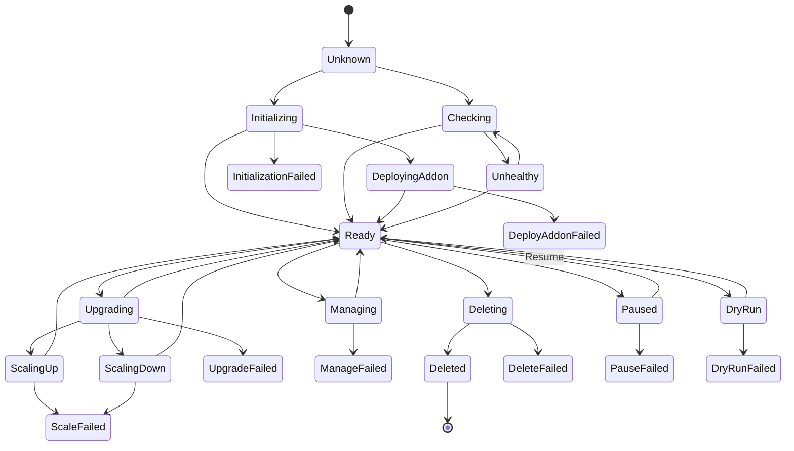
> - note right of Unknown: 集群状态无法判定
> - note right of Ready: 所有节点就绪 + 健康检查通过
> - note right of Unhealthy: 健康检查失败, 不触发失败计数
> - note right of Failed: 统一表示各种 *Failed 状态
    
**图中各状态的业务含义**：

| 状态 | 分类 | 业务说明 | 进入条件 | 可转换到 |
|------|------|---------|---------|---------|
| `Unknown` | 初始 | 集群状态无法判定，通常为新建集群尚未开始任何操作 | 集群创建后的默认状态 | `Initializing` / `Checking` |
| `Initializing` | 安装中 | 集群首次安装进行中，涵盖 Finalizer/Certs/MasterInit/BKEAgent/NodesEnv 等 8 个 Phase 的执行 | `ClusterInitPhaseNames` 中任意 Phase 开始执行 | `DeployingAddon` / `Ready` / `InitializationFailed` |
| `Checking` | 检查中 | `EnsureCluster` 阶段前置 Hook 设置的中间状态，正在进行集群健康检查 | `EnsureCluster` Phase 前置 Hook | `Ready` / `Unhealthy` |
| `DeployingAddon` | 安装中 | `EnsureAddonDeploy` Phase 执行中，正在部署集群组件（coredns/metrics-server 等） | `EnsureAddonDeploy` Phase 开始 | `Ready` / `DeployAddonFailed` |
| `Ready` | 稳态 | 集群所有节点就绪、健康检查通过，处于稳定运行态。安装/升级/扩缩容的最终目标状态 | 所有节点 Ready + 健康检查通过 | `Upgrading` / `Managing` / `Deleting` / `Paused` / `ScalingUp` / `ScalingDown` |
| `Unhealthy` | 异常 | 集群健康检查失败（节点不可达或组件异常）。不触发 StatusManager 失败计数，持续重试 | `EnsureCluster` 健康检查失败 | `Ready`（恢复后）/ `Checking` |
| `Upgrading` | 升级中 | 升级 Phase 执行中（旧路径 5 个或 DAG 路径 6 个 Phase） | 升级 Phase 开始执行 | `ScalingUp` / `ScalingDown` / `Ready` / `UpgradeFailed` |
| `ScalingUp` | 扩容中 | 正在向集群添加节点（Master 或 Worker），合并显示 MasterScalingUp / WorkerScalingUp | `EnsureMasterJoin` / `EnsureWorkerJoin` Phase 执行中 | `Ready` / `ScaleFailed` |
| `ScalingDown` | 缩容中 | 正在从集群移除节点（Master 或 Worker），合并显示 MasterScalingDown / WorkerScalingDown | `EnsureMasterDelete` / `EnsureWorkerDelete` Phase 执行中 | `Ready` / `ScaleFailed` |
| `Managing` | 纳管中 | `EnsureClusterManage` Phase 执行中，正在纳管已有集群 | 纳管操作触发 | `Ready` / `ManageFailed` |
| `Deleting` | 删除中 | `EnsureDeleteOrReset` Phase 执行中，集群正在被删除 | 删除操作触发 | `Deleted` / `DeleteFailed` |
| `Deleted` | 终态 | 集群删除完成，资源被垃圾回收 | 删除流程完成 | （终态，无后续转换） |
| `Paused` | 暂停 | 集群暂停调谐，不执行任何 Phase，用于维护窗口 | `EnsurePaused` Phase 成功 | `Resume` → `Ready` / `PauseFailed` |
| `Failed` | 失败 | 图中统一表示各种 `*Failed` 状态（`InitializationFailed`/`UpgradeFailed`/`ScaleFailed`/`DeployAddonFailed` 等） | 对应 Phase 执行失败 | `Retry`（StatusManager 重试恢复）/ 保持 `Failed`（超限后） |
| `DryRun` | 验证 | DryRun 模式，仅验证配置不实际部署 | `EnsureDryRun` Phase 执行 | `DryRunFailed` / `Ready` |

> 完整的 ClusterStatus 20 个值定义及详细业务说明见 [3.1.1 节](#311-clusterstatus20-个值)。上图中的 `ScalingUp`/`ScalingDown`/`Failed` 为合并展示，实际代码中分别对应 `ClusterMasterScalingUp`/`ClusterWorkerScalingUp`/`ClusterMasterScalingDown`/`ClusterWorkerScalingDown` 和 8 个独立的 `*Failed` 状态。

### 5.2 节点状态机

节点层包含 BKENode 和 BKEMachine 两个资源，各自有独立的状态模型。本节分别给出两者的状态转换概览；BKEMachine 的详细设计见 5.3 节。

#### 5.2.1 BKENode 状态转换图

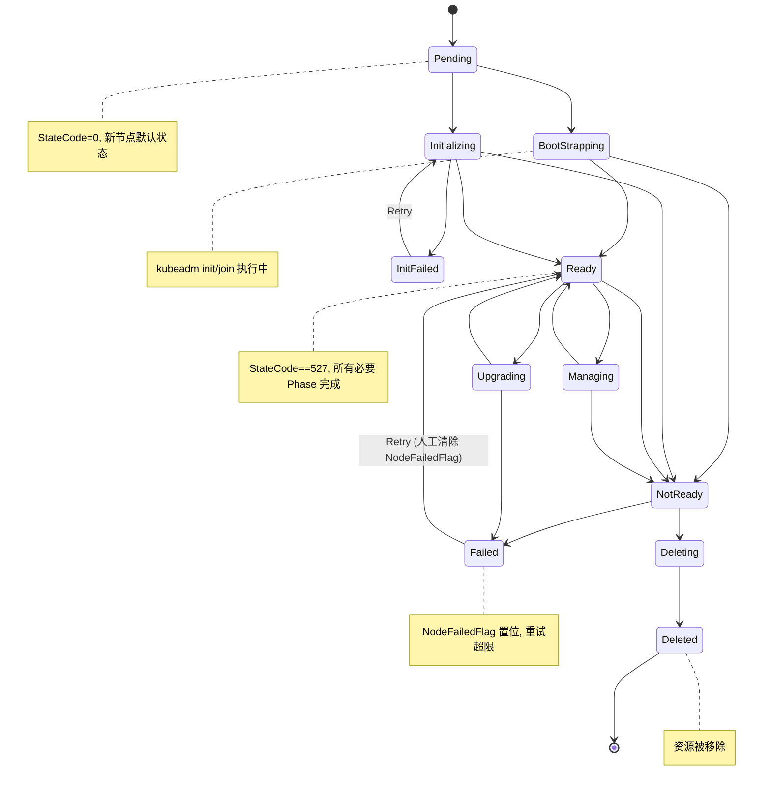

**图中各状态的业务含义**：

| 状态 | 业务说明 | 进入条件 | 可转换到 |
|------|---------|---------|---------|
| `Pending` | 节点初始状态，`StateCode=0`，尚未开始任何操作 | 新节点加入集群 | `BootStrapping` / `Initializing` |
| `BootStrapping` | 正在执行 `kubeadm init/join` 引导命令 | BKEMachine 控制器创建 Bootstrap Command | `Ready` / `NotReady` |
| `Initializing` | 正在初始化（Agent 推送 / 环境配置 / 负载均衡配置） | `EnsureBKEAgent` / `EnsureNodesEnv` / `EnsureLoadBalance` 执行中 | `Ready` / `NotReady` / `InitFailed` |
| `Ready` | 节点完全就绪，`StateCode==527`，所有必要 Phase 完成 | 6 个必要位标记全部置位 | `Upgrading` / `Deleting` / `NotReady` / `Managing` |
| `NotReady` | Bootstrap 成功但未完全配置，或运行中检测到不可达 | BKEMachine 引导成功 / 健康检查失败 | `Ready` / `Failed` / `Deleting` / `Managing` |
| `InitFailed` | 初始化失败（Agent 推送 / 环境配置 / 负载均衡失败） | 初始化 Phase 执行失败 | `Retry` → `Initializing` |
| `Upgrading` | 节点正在升级（containerd / etcd / k8s 组件） | 升级 Phase 执行中 | `Ready` / `Failed` |
| `Failed` | 节点失败且重试超限，`NodeFailedFlag`(bit 7) 置位，后续调谐跳过此节点 | StatusManager 重试超限 | `Ready`（人工清除标志位） |
| `Deleting` | 节点正在被删除 | BKEMachine 控制器删除流程 | `Deleted` |
| `Deleted` | 节点已删除，BKENode 资源被移除 | 删除完成 | （终态） |
| `Retry` | 失败后重试——StatusManager 将 State 恢复为 `LatestNormalState` 并设 `NeedRequeue` | 重试次数内（默认 10 次） | → 对应操作状态 |
| `Managing` | 节点正在被纳管（将已有节点纳入 BKE 管理） | `EnsureClusterManage` 执行中 | `Ready` / `NotReady` |

> 完整的 NodeState 定义见 [3.2.1 节](#321-nodestatebkenode7-个值)。

#### 5.2.2 BKEMachine 状态概览

BKEMachine **没有 Phase 字段**，状态由布尔元组 `(Ready, Bootstrapped)` + 单个 Condition `BootstrapSucceededCondition` 表达。BKEMachine 控制器在引导过程中会**直接修改关联 BKENode 的 State 和 StateCode**，两者的状态变化交织进行：

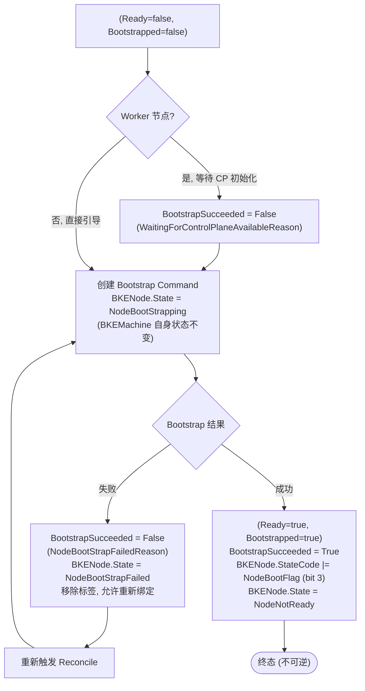

> **与 5.3 节的关系**：本节为 BKEMachine 状态的**概览**，以流程线展示布尔元组转换与 BKENode 副作用的交互关系。5.3 节为**详细设计**，包含状态定义表（5.3.1）、Condition 三态表（5.3.2）、BKENode 副作用表（5.3.3）、BKECluster 聚合（5.3.4）、删除流程（5.3.5）、状态转换框图（5.3.6）。

### 5.3 BKEMachine 状态机

**设计特点**：BKEMachine **没有 Phase 字段**，与 BKECluster（3 套状态）和 BKENode（State + StateCode 双轨）不同。其状态完全由布尔元组 `(Ready, Bootstrapped)` + 单个 Condition `BootstrapSucceededCondition` 表达。

#### 5.3.1 状态定义

| 状态字段 | 类型 | 定义位置 | 说明 |
|---------|------|---------|------|
| `Ready` | `bool` | `bkemachine_types.go:62` | 引导完成且目标集群 Node 可达时设为 true，**不可逆** |
| `Bootstrapped` | `bool` | `bkemachine_types.go:66` | 引导命令执行成功时设为 true，**不可逆** |
| `BootstrapSucceededCondition` | `clusterv1.Condition` | `bkecluster_consts.go:124` | 唯一的 Condition，三态（见下表） |

> `Ready` 和 `Bootstrapped` 始终同时设置（`markBKEMachineBootstrapReady`, `bkemachine_controller_phases.go:1292-1293`），不存在 `Bootstrapped=true` 但 `Ready=false` 的中间状态。

#### 5.3.2 BootstrapSucceededCondition 三态

| Condition 状态 | Reason | 设置位置 | 触发场景 |
|---------------|--------|---------|---------|
| **True** | — | `phases.go:1294` | Bootstrap 成功 + 目标集群 Node 可达验证通过 |
| **False** (Info) | `WaitingForControlPlaneAvailableReason` | `phases.go:212-213` | Worker 节点等待 ControlPlane 初始化完成 |
| **False** (Warning) | `NodeBootStrapFailedReason` | `phases.go:693-695` | Bootstrap Command 执行失败 |

> **读取**：`phases.go:928` 通过 `conditions.GetReason(&bm, BootstrapSucceededCondition) == NodeBootStrapFailedReason` 检测失败节点，驱动集群级聚合。

#### 5.3.3 BKEMachine → BKENode 副作用

**为什么称为"副作用"**：

BKEMachine 和 BKENode 是两个**独立的 CRD 资源**，没有 OwnerReference 关联，仅通过 `WorkerNodeHost`/`MasterNodeHost` 标签按 IP 匹配。按职责划分，BKEMachine 控制器应该只管 BKEMachine 自己的状态（`Ready`/`Bootstrapped`/`BootstrapSucceededCondition`）。但实际上，BKEMachine 控制器在引导流程中通过 `NodeFetcher.SetNodeStateWithMessageForCluster` 和 `MarkNodeStateFlagForCluster` **跨资源直接改写了 BKENode 的 `State` 和 `StateCode`**——这不是 BKEMachine 自身的状态变更，而是对另一个资源的"副作用"操作。

BKEMachine 控制器在引导过程中**直接修改 BKENode 的 State 和 StateCode**（通过 `NodeFetcher` 按 IP 匹配）：

| BKEMachine 阶段 | BKENode.State | BKENode.StateCode | 设置位置 |
|----------------|---------------|-------------------|---------|
| Bootstrap 开始 | `NodeBootStrapping` | — | `phases.go:247` |
| InitControlPlane 选中 | — | `MasterInitFlag` (bit 5) | `phases.go:242` |
| Bootstrap 失败 | `NodeBootStrapFailed` | — | `phases.go:687,775` |
| Bootstrap 成功 | `NodeNotReady` | `NodeBootFlag` (bit 3) | `phases.go:1299-1302` |
| 节点删除 | `NodeDeleting` | — | `controller.go:307` |

> **关键**：上表中 `NodeBootStrapping`/`NodeBootStrapFailed`/`NodeNotReady` 是 **BKENode.NodeState 值**，由 BKEMachine 控制器设置，**不是 BKEMachine 自身的状态**。BKEMachine 自身仅有 `Ready`/`Bootstrapped`/`BootstrapSucceededCondition`。这也是 5.2 节拆分为 BKENode 与 BKEMachine 独立子节的原因——旧文档把 BKEMachine 控制器设置到 BKENode 上的状态误标为"BKEMachine 引导状态"，混淆了两个资源的状态归属。

#### 5.3.4 BKEMachine → BKECluster 聚合

`reconcileBKEMachine`（`phases.go:861-892`）聚合所有 BKEMachine 的引导状态，驱动 BKECluster 条件：

```
所有 BKEMachine.Bootstrapped == true
  → BKECluster.Status.KubernetesVersion = Spec.ClusterConfig.Cluster.KubernetesVersion
  → BKECluster TargetClusterBootCondition = True (集群引导完成)

任意 BKEMachine BootstrapSucceededCondition.reason == NodeBootStrapFailedReason
  → bootstrapNodeFailed = true (阻塞集群就绪)
```

#### 5.3.5 BKEMachine 删除流程

BKEMachine 删除时**不翻转 `Ready`/`Bootstrapped`**，而是通过注解 + finalizer 机制：

```
1. 设置 clusterv1.DeleteMachineAnnotation (controller.go:706-714)
2. 设置 BKENode.State = NodeDeleting (controller.go:307)
3. 创建 Reset Command, 等待执行完成
4. 移除 BKEMachineFinalizer (controller.go:319,487,503,528,850)
5. BKEMachine 对象被 Kubernetes 垃圾回收删除
   → Ready/Bootstrapped 保持 true, 不翻转
```

#### 5.3.6 状态转换图

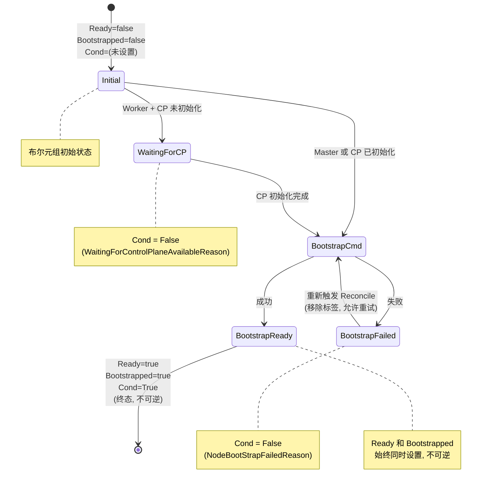

### 5.4 节点 StateCode 生命周期

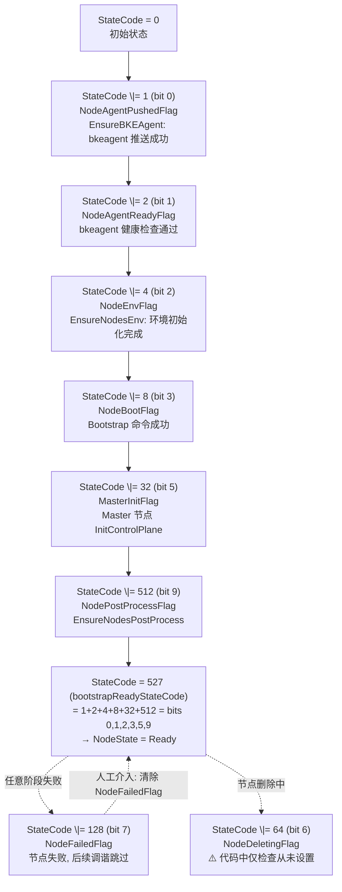

### 5.5 命令状态机

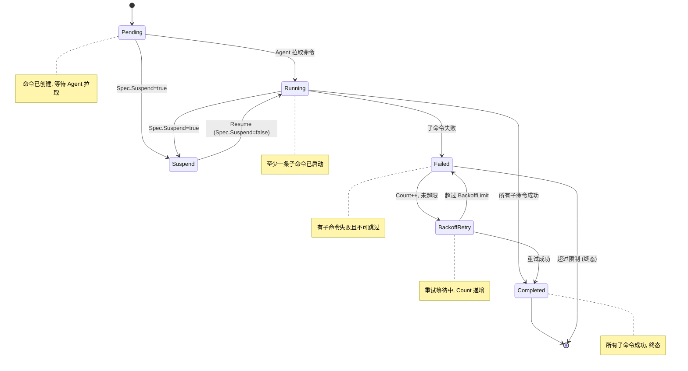

**重试逻辑**：

```go
for backoffLimit >= 0 && condition.Count <= backoffLimit:
    condition.Count++
    executeByType()
    if error:
        condition.Status = ConditionFalse
        condition.Phase = CommandFailed
        continue
    else:
        condition.Status = ConditionTrue
        condition.Phase = CommandComplete
        break

if failed && BackoffIgnore:
    Phase = CommandSkip
```

**图中各状态的业务含义**：

| 状态 | 业务说明 | 进入条件 | 可转换到 |
|------|---------|---------|---------|
| `Pending` | 命令已创建但尚未开始执行，等待 BKEAgent 拉取。初始状态 | Command CRD 创建 | `Running` / `Suspend` |
| `Running` | 命令正在 BKEAgent 上执行中，至少一条子命令已启动 | Agent 拉取命令并开始执行 | `Completed` / `Failed` / `Suspend` |
| `Suspend` | 命令被暂停（`Spec.Suspend=true`），暂停期间不执行新子命令 | 用户设置 `Spec.Suspend=true` | `Running`（Resume） |
| `Completed` | 所有子命令执行成功，命令整体完成。终态 | 全部子命令 `Condition.Phase == CommandComplete` | （终态） |
| `Failed` | 有子命令失败且不可跳过，或重试次数耗尽 | 子命令失败且 `BackoffIgnore=false` | `BackoffRetry`（未超限）/ 终态（超限） |
| `BackoffRetry` | 重试等待中，`Condition.Count` 递增 | 失败且 `Count <= BackoffLimit` | `Completed`（重试成功）/ `Failed`（超限） |
| `Skip` | 子命令被跳过。当 `BackoffIgnore=true` 且子命令失败时标记为 Skip 而非 Failed | 子命令失败 + `BackoffIgnore=true` | 不影响整体完成 |

> 完整的 CommandPhase 定义见 [3.3.1 节](#331-commandphase7-个值)。

### 5.6 声明式升级状态机

**DeclarativeUpgradeStatus 字段**：

| 字段 | 类型 | 说明 |
|------|------|------|
| `TargetVersion` | `string` | 目标版本，变更时重置所有进度 |
| `StartedAt` | `*metav1.Time` | 开始时间 |
| `FinishedAt` | `*metav1.Time` | 完成时间 |
| `LastError` | `string` | 最后错误信息 |
| `LastFailure` | `*FailureRecord` | 最后失败记录（Name/Version/FailedAt/Error/Attempt） |
| `Completed` | `[]ComponentRecord` | 已完成组件列表（Name/Version/CompletedAt） |

```mermaid
flowchart TD
    Init["1. 初始化<br/>EnsureInitialized{targetVersion, now}"] --> CheckTarget{TargetVersion<br/>变更?}
    CheckTarget -->|是| Reset["ResetForTarget:<br/>清除 Completed/LastError/LastFailure<br/>FinishedAt = nil"]
    Reset --> Exec
    CheckTarget -->|否| Exec["2. 组件执行<br/>for each component in DAG"]
    Exec --> IsDone{IsCompleted<br/>{name, version}?}
    IsDone -->|是| Skip["跳过 (幂等)"]
    IsDone -->|否| Run["executeComponent"]
    Run -->|成功| MarkDone["MarkCompleted:<br/>追加到 Completed<br/>清除 LastError/LastFailure"]
    Run -->|失败| MarkFail["MarkFailure:<br/>LastFailure.Attempt++<br/>LastError = errMsg"]
    Skip --> Next[下一个组件]
    MarkDone --> Next
    MarkFail --> Next
    Next --> AllDone{所有组件完成?}
    AllDone -->|否| Exec
    AllDone -->|是| Complete["3. 完成<br/>completeDeclarativeUpgrade:<br/>FinishedAt = now<br/>移除 upgrade-ready 注解"]
    Complete --> VersionChange{TargetVersion<br/>再次变更?}
    VersionChange -->|是| Reset
    VersionChange -->|否| Done([升级完成])
```

## 6. 重试与幂等机制

### 6.1 Command 级别重试

**定义位置**: `controllers/bkeagent/command_controller.go:464-493`

```go
func (r *CommandReconciler) executeWithRetry(
    execCommand agentv1beta1.ExecCommand,
    condition *agentv1beta1.Condition,
    stopTime time.Time,
    backoffLimit int,
) commandExecutionResult {
    for backoffLimit >= 0 && condition.Count <= backoffLimit {
        // 检查超时
        if stopTime.Before(time.Now()) {
            return commandExecutionResult{timedOut: true}
        }
        
        // 延迟重试
        if execCommand.BackoffDelay != 0 && condition.Count > 0 {
            time.Sleep(time.Duration(execCommand.BackoffDelay) * time.Second)
        }
        
        // 执行命令
        condition.LastStartTime = &metav1.Time{Time: time.Now()}
        condition.Count++
        result, err := r.executeByType(execCommand.Type, execCommand.Command)
        
        if err != nil {
            condition.Status = metav1.ConditionFalse
            condition.Phase = agentv1beta1.CommandFailed
            condition.StdErr = append(condition.StdErr, err.Error())
            continue  // 继续重试
        }
        
        // 成功
        condition.Status = metav1.ConditionTrue
        condition.Phase = agentv1beta1.CommandComplete
        condition.StdOut = append(condition.StdOut, result...)
        break  // 跳出循环
    }
    
    return commandExecutionResult{timedOut: false}
}
```

**默认配置**:
```go
const (
    DefaultBackoffLimit            = 3      // 默认重试 3 次
    DefaultActiveDeadlineSecond    = 1000   // 默认超时 1000 秒
    DefaultTTLSecondsAfterFinished = 600    // 完成后 600 秒清理
)
```

**Rate Limiter**:
```go
const (
    defaultFastDelay       = 10 * time.Second   // 快速重试间隔
    defaultSlowDelay       = 60 * time.Second   // 慢速重试间隔
    defaultMaxFastAttempts = 5                  // 最大快速重试次数
)
```

### 6.2 BKECluster 级别重试（人工介入）

**定义位置**: `controllers/capbke/bkecluster_controller.go:660-744`

**触发方式**:
```bash
# 重试所有失败节点
kubectl annotate bkecluster my-cluster bke.bocloud.com/retry=""

# 重试特定节点
kubectl annotate bkecluster my-cluster bke.bocloud.com/retry="10.0.0.1,10.0.0.2"
```

**处理逻辑**:
```go
func (r *BKEClusterReconciler) handleRetryLogic(bkeCluster *bkev1beta1.BKECluster) {
    // 检查 retry 注解
    if retryNodeIPs, ok := annotation.HasAnnotation(bkeCluster, annotation.RetryAnnotationKey); ok {
        if retryNodeIPs == "" {
            // 重试所有节点
            r.processAllNodesRetry(bkeCluster)
        } else {
            // 重试特定节点
            r.processSpecificNodesRetry(bkeCluster, retryNodeIPs)
        }
        
        // 移除 retry 注解
        annotation.RemoveAnnotation(bkeCluster, annotation.RetryAnnotationKey)
    }
}

func (r *BKEClusterReconciler) processAllNodesRetry(bkeCluster *bkev1beta1.BKECluster) {
    // 清除所有节点的 NodeFailedFlag
    for _, node := range bkeCluster.Status.Nodes {
        node.StateCode &= ^bkev1beta1.NodeFailedFlag
    }
    
    // 重置 status manager 缓存
    r.StatusManager.ResetCache()
}

func (r *BKEClusterReconciler) processSpecificNodesRetry(bkeCluster *bkev1beta1.BKECluster, nodeIPs string) {
    // 清除特定节点的 NodeFailedFlag
    ips := strings.Split(nodeIPs, ",")
    for _, node := range bkeCluster.Status.Nodes {
        if utils.ContainsString(ips, node.IP) {
            node.StateCode &= ^bkev1beta1.NodeFailedFlag
        }
    }
    
    // 重置 status manager 缓存
    r.StatusManager.ResetCache()
}
```

**幂等性保证**:
- StateCode 位标记清除是幂等操作
- StatusManager 缓存重置确保重新计算
- Phase 状态重新评估，从 Waiting 阶段开始

### 6.3 声明式升级幂等

**定义位置**: `pkg/dagexec/scheduler.go:276-324`

**跳过已完成组件**:
```go
func (s *Scheduler) shouldSkipComponent(
    ctx context.Context,
    execCtx *ExecutionContext,
    node *topology.ComponentNode,
) bool {
    bc := execCtx.Cluster
    
    // 检查 DeclarativeUpgrade 状态
    if bc.Status.DeclarativeUpgrade != nil {
        st := bc.Status.DeclarativeUpgrade
        
        // 检查组件是否已完成
        if st.IsCompleted(node.Name, s.nodeVersionKey(node)) {
            execCtx.Log.Info("skipping completed component",
                "component", node.Name,
                "version", s.nodeVersionKey(node),
            )
            return true
        }
    }
    
    return false
}
```

**标记组件完成**:
```go
func (s *Scheduler) markComponentCompleted(
    ctx context.Context,
    execCtx *ExecutionContext,
    node *topology.ComponentNode,
) error {
    bc := execCtx.Cluster
    
    if bc.Status.DeclarativeUpgrade != nil {
        st := bc.Status.DeclarativeUpgrade
        
        // 标记完成
        st.MarkCompleted(node.Name, s.nodeVersionKey(node), metav1.Now())
        
        // 清除错误
        st.LastError = ""
        st.ClearFailure()
        
        // 持久化
        return s.client.Status().Update(ctx, bc)
    }
    
    return nil
}
```

**标记组件失败**:
```go
func (s *Scheduler) markComponentFailed(
    ctx context.Context,
    execCtx *ExecutionContext,
    node *topology.ComponentNode,
    err error,
) error {
    bc := execCtx.Cluster
    
    if bc.Status.DeclarativeUpgrade != nil {
        st := bc.Status.DeclarativeUpgrade
        
        // 标记失败
        st.MarkFailure(node.Name, s.nodeVersionKey(node), err.Error(), metav1.Now())
        
        // 持久化
        return s.client.Status().Update(ctx, bc)
    }
    
    return nil
}
```

**幂等性保证**:
- `IsCompleted()` 检查组件+版本是否已完成
- 相同组件+版本不会重复执行
- 目标版本变更时自动重置进度

---

## 7. 场景用例

### 7.1 全新安装

**场景描述**: 创建新的 BKE 集群，从 0 到 Ready 状态

**Phase 执行顺序**:
```
CommonPhases:
  1. EnsureFinalizer
  2. EnsurePaused
  3. EnsureClusterManage
  4. EnsureDeleteOrReset
  5. EnsureDryRun

DeployPhases:
  6. EnsureBKEAgent          → 推送 bkeagent 到所有节点
  7. EnsureNodesEnv          → 初始化节点环境（containerd, 系统配置）
  8. EnsureClusterAPIObj     → 创建 Cluster API 对象
  9. EnsureCerts             → 生成证书
  10. EnsureLoadBalance      → 配置负载均衡
  11. EnsureMasterInit       → 初始化第一个 master 节点
  12. EnsureMasterJoin       → 其他 master 节点加入
  13. EnsureWorkerJoin       → worker 节点加入
  14. EnsureAddonDeploy      → 部署 addon（coredns, kube-proxy）
  15. EnsureNodesPostProcess → 节点后处理
  16. EnsureAgentSwitch      → 切换 bkeagent 监听目标

PostDeployPhases:
  17. EnsureProviderSelfUpgrade
  18. EnsureAgentUpgrade
  19. EnsureContainerdUpgrade
  20. EnsureEtcdUpgrade
  21. EnsureWorkerUpgrade
  22. EnsureMasterUpgrade
  23. EnsureWorkerDelete
  24. EnsureMasterDelete
  25. EnsureComponentUpgrade
  26. EnsureClusterAPIManagerManifest
  27. EnsureCluster
```

**状态转换**:
```
BKECluster:
  Unknown → Initializing → DeployingAddon → Ready

BKENode (每个节点):
  StateCode: 0 → 1 → 3 → 7 → 15 → 47 → 527
  State: Pending → BootStrapping → NotReady → Ready

BKEMachine (每个节点):
  Ready: false → true
  Bootstrapped: false → true

Command (每个节点):
  Phase: Pending → Running → Completed
```

**关键检查点**:
- EnsureBKEAgent: 检查 `NodeAgentPushedFlag`
- EnsureNodesEnv: 检查 `NodeEnvFlag`
- EnsureMasterInit: 检查 `MasterInitFlag`
- 最终: `StateCode == 527`

### 7.2 扩容（Scale-Out）

**场景描述**: 向现有集群添加新节点

**触发方式**:
```bash
# 方式 1: 添加 BKENode 资源
kubectl apply -f new-node.yaml

# 方式 2: 使用预约注解
kubectl annotate bkecluster my-cluster \
  bke.bocloud.com/appointment-add-nodes="10.0.0.10,10.0.0.11"
```

**Phase 执行顺序**:
```
ClusterScaleWorkerUpPhaseNames:
  1. EnsureWorkerJoin  → 新 worker 节点加入

ClusterScaleMasterUpPhaseNames:
  1. EnsureMasterJoin  → 新 master 节点加入
```

**节点过滤逻辑**:
```go
// 获取需要加入的节点
func GetNeedJoinNodesWithBKENodes(bkeCluster, bkeNodes) bkenode.Nodes {
    return filterNodes(bkeCluster,
        func(ip string, bn *confv1beta1.BKENode) bool {
            // 未引导且未初始化
            return !GetNodeStateFlag(bn, ip, bkev1beta1.NodeBootFlag) &&
                !GetNodeStateFlag(bn, ip, bkev1beta1.MasterInitFlag)
        },
        WithExcludeAppointmentNodes(),  // 排除预约节点
    )
}

// 获取预约添加的节点
func GetAppointmentAddNodes(bkeCluster *bkev1beta1.BKECluster) bkenode.Nodes {
    v, found := annotation.HasAnnotation(bkeCluster, annotation.AppointmentAddNodesAnnotationKey)
    if !found {
        return nil
    }
    nodesIP := strings.Split(v, ",")
    // 过滤出预约节点
    // ...
}
```

**状态转换**:
```
BKECluster:
  Ready → ScalingWorkerNodesUp → Ready

BKENode (新节点):
  StateCode: 0 → 527 (完整生命周期)
  State: Pending → BootStrapping → NotReady → Ready

Command (新节点):
  Phase: Pending → Running → Completed
```

**关键检查点**:
- 新节点 `StateCode == 0`
- 预约节点通过注解识别
- 扩容完成后 `StateCode == 527`

### 7.3 缩容（Scale-In）

**场景描述**: 从集群中移除节点

**触发方式**:
```bash
# 删除 BKENode 资源
kubectl delete bkenode node-to-remove
```

**Phase 执行顺序**:
```
ClusterScaleWorkerDownPhaseNames:
  1. EnsureWorkerDelete  → 删除 worker 节点

ClusterScaleMasterDownPhaseNames:
  1. EnsureMasterDelete  → 删除 master 节点
```

**节点删除流程**:
```go
// 标记节点删除
case bkenode.RemoveNode:
    if err := r.NodeFetcher.UpdateBKENodeState(ctx, bkeCluster.Namespace, bkeCluster.Name,
        t.Node.IP, confv1beta1.NodeDeleting, "Node marked for deletion"); err != nil {
        // ...
    }
    
    // 设置 StateCode
    bkeNode.Status.StateCode |= bkev1beta1.NodeDeletingFlag
```

**状态转换**:
```
BKECluster:
  Ready → ScalingWorkerNodesDown → Ready

BKENode (被删除节点):
  State: Ready → Deleting → (removed)

BKEMachine (被删除节点):
  Ready/Bootstrapped: 保持 true (不翻转, 对象直接删除)
  设置 clusterv1.DeleteMachineAnnotation
  创建 Reset Command → 等待完成
  移除 BKEMachineFinalizer → 对象被垃圾回收
```

**关键检查点**:
- `DeleteMachineAnnotation` 设置（`controller.go:706-714`）
- Reset Command 执行完成
- `BKEMachineFinalizer` 移除（`controller.go:319,487,503,528,850`）
- BKENode 资源删除

> **注意**：BKEMachine 的 `Ready`/`Bootstrapped` 一旦设为 `true` 后**永远不会被设回 `false`**（`markBKEMachineBootstrapReady`, `phases.go:1292-1293`）。节点删除通过注解 + finalizer 机制完成，不翻转布尔值。详见 5.3.5 节。

### 7.4 升级

**场景描述**: 升级集群版本（如 v2.5.0 → v2.6.0）

**触发方式**:
```bash
# 方式 1: 修改 ClusterVersion
kubectl patch clusterversion my-cluster --type merge \
  -p '{"spec":{"desiredVersion":"v2.6.0"}}'

# 方式 2: 设置 upgrade-ready 注解
kubectl annotate bkecluster my-cluster \
  cvo.openfuyao.cn/upgrade-ready="v2.6.0"
```

**声明式升级流程**:
```
1. ClusterVersion 控制器检测到 desiredVersion 变更
   └─ 设置 upgrade-ready 注解

2. BKECluster 控制器检测到 upgrade-ready 注解
   └─ shouldUseDeclarativeUpgrade() = true
   └─ executeUpgradeDAG()

3. 初始化 DeclarativeUpgrade 状态
   └─ EnsureInitialized(targetVersion, now)
   └─ TargetVersion = "v2.6.0"
   └─ StartedAt = now

4. 构建升级 DAG
   └─ 从 ReleaseImage 获取组件列表
   └─ 构建 DAG 依赖关系

5. 执行 DAG
   └─ for each batch in TopologicalBatches():
        └─ for each component in batch:
             ├─ if IsCompleted(name, version): skip
             └─ executeComponent()
                  ├─ if success: MarkCompleted()
                  └─ if failed: MarkFailure()

6. 完成升级
   └─ FinishedAt = now
   └─ LastError = ""
   └─ ClearFailure()
   └─ remove upgrade-ready annotation
```

**状态转换**:
```
BKECluster:
  Ready → Upgrading → Ready
  ClusterStatus: Ready → Upgrading → Ready
  DeclarativeUpgrade:
    TargetVersion: "v2.5.0" → "v2.6.0"
    StartedAt: nil → now
    FinishedAt: nil → now
    Completed: [] → [component1, component2, ...]

BKENode (每个节点):
  State: Ready → Upgrading → Ready

Command (每个节点):
  Phase: Pending → Running → Completed
```

**幂等性保证**:
- `IsCompleted()` 检查组件+版本
- 相同组件不会重复执行
- 目标版本变更时自动重置

### 7.5 安装/升级失败 → 重试

**场景描述**: 安装或升级过程中某个节点失败，人工介入后重试

**失败检测**:
```go
// 节点失败时设置标志
bkeNode.Status.StateCode |= bkev1beta1.NodeFailedFlag
bkeNode.Status.State = confv1beta1.NodeFailed
bkeNode.Status.Message = "Bootstrap failed: xxx"
```

**人工介入**:
```bash
# 1. 分析问题
kubectl get bkecluster my-cluster -o yaml
kubectl get bkenode -o yaml
kubectl logs -n bke-system deployment/bke-controller-manager

# 2. 解决问题（如修复配置、增加资源）

# 3. 触发重试
kubectl annotate bkecluster my-cluster bke.bocloud.com/retry=""
# 或重试特定节点
kubectl annotate bkecluster my-cluster bke.bocloud.com/retry="10.0.0.1"
```

**重试流程**:
```
1. BKECluster 控制器检测到 retry 注解
   └─ handleRetryLogic()

2. 清除失败标志
   └─ processAllNodesRetry() 或 processSpecificNodesRetry()
   └─ StateCode &= ^NodeFailedFlag

3. 重置缓存
   └─ StatusManager.ResetCache()

4. 移除注解
   └─ annotation.RemoveAnnotation(bkeCluster, RetryAnnotationKey)

5. 重新执行失败阶段
   └─ executePhaseFlow()
   └─ 从 Waiting 阶段开始
```

**状态转换**:
```
BKECluster:
  InitializationFailed → Initializing → Ready
  UpgradeFailed → Upgrading → Ready

BKENode (失败节点):
  StateCode: 527|128 → 527 (清除 NodeFailedFlag)
  State: Failed → BootStrapping → Ready

Command (失败节点):
  Phase: Failed → Running → Completed
```

**幂等性保证**:
- StateCode 位标记清除是幂等操作
- StatusManager 缓存重置确保重新计算
- Phase 状态重新评估

### 7.6 删除

**场景描述**: 删除整个集群

**触发方式**:
```bash
kubectl delete bkecluster my-cluster
```

**Phase 执行顺序**:
```
ClusterDeletePhaseNames:
  1. EnsureDeleteOrReset  → 删除集群资源
```

**删除流程**:
```
1. 检测到 DeletionTimestamp
   └─ shouldDelete() = true

2. 执行删除阶段
   └─ EnsureDeleteOrReset.Execute()
   └─ 删除 Cluster API 对象
   └─ 删除节点资源
   └─ 清理证书

3. 移除 Finalizer
   └─ removeFinalizer()
   └─ 允许资源删除
```

**状态转换**:
```
BKECluster:
  Ready → Deleting → (deleted)
  ClusterHealthState: Healthy → Deleting

BKENode (所有节点):
  State: Ready → Deleting → (removed)

BKEMachine (所有节点):
  Ready/Bootstrapped: 保持 true (不翻转, 对象直接删除)
  设置 clusterv1.DeleteMachineAnnotation → 移除 Finalizer → 对象删除
```

---

## 8. 单图完整性评估

### 8.1 维度分析

| 维度 | 状态字段数量 | 状态值数量 | 复杂度 |
|------|-------------|-----------|--------|
| 集群层 | 6 (Phase, ClusterStatus, ClusterHealthState, PhaseStatus, Conditions, DeclarativeUpgrade) | 20 + 9 + 6 + 21 = 56+ | 高 |
| 节点层 | 4 (State, StateCode, Message, NeedSkip) | 9 + 14 + 10位 = 33+ | 高 |
| 命令层 | 1 (Phase) | 7 | 中 |
| 升级层 | 5 (TargetVersion, StartedAt, FinishedAt, LastError, Completed) | N/A | 高 |

**总计**: 12 个状态字段，96+ 个状态值

### 8.2 单图可行性

**结论**: **无法在单张图中完整展现**

**原因**:
1. **维度太多**: 11 个状态字段，无法在 2D 图中清晰展示
2. **状态值太多**: 73+ 个状态值，图表会过于复杂
3. **层次复杂**: 集群、节点、命令、升级四层状态相互关联
4. **转换规则复杂**: 每个状态字段有独立的转换规则

### 8.3 推荐方案

**采用分层图 + 资源关联图**:

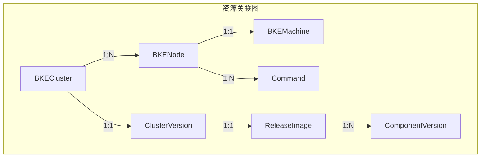

分层图引用：
- 集群状态机 → [第 5.1 节](#51-集群状态机)
- 节点状态机 → [第 5.2 节](#52-节点状态机)
- StateCode 生命周期 → [第 5.4 节](#54-节点-statecode-生命周期)
- 命令状态机 → [第 5.5 节](#55-命令状态机)
- 声明式升级状态机 → [第 5.6 节](#56-声明式升级状态机)

### 8.4 替代方案

如果需要单图展示，可以采用**简化版状态机**:

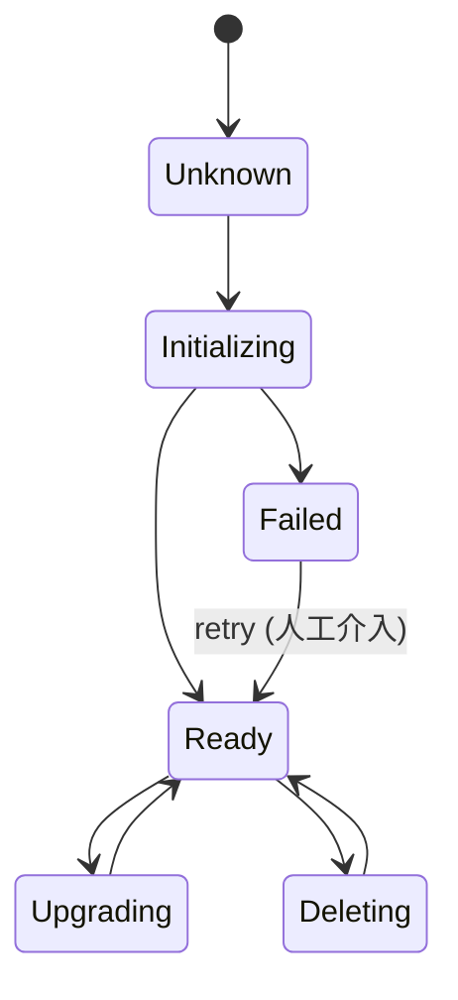

**简化说明**:
- 合并 ClusterStatus 和 ClusterHealthState
- 隐藏 PhaseStatus 和 Conditions
- 只展示主要状态转换
- 隐藏节点和命令层细节

---

## 9. 状态更新机制

> **本章目标**：说明各状态字段由谁更新、何时更新、如何持久化，以及状态更新的触发条件和原子性保证。

### 9.1 状态更新责任矩阵

下表明确每个状态字段的**更新责任方**、**更新时机**和**更新方式**：

| 资源 | 状态字段 | 更新责任方 | 更新时机 | 更新方式 | 代码位置 |
|------|---------|-----------|---------|---------|---------|
| **BKECluster** | `Phase` | PhaseFlow | 每个 Phase 开始/结束 | `PhaseStatus.SetStatus()` → `SyncStatusUntilComplete()` | `pkg/phaseframe/phaseflow.go` |
| **BKECluster** | `ClusterStatus` | Phase 钩子 + StatusManager | Phase 执行后（pre/post hook） | `calculatingClusterPostStatusByPhase()` → `SyncStatusUntilComplete()` | `pkg/phaseframe/phases/phase_flow.go` |
| **BKECluster** | `ClusterHealthState` | BKEClusterReconciler + StatusManager | Reconcile 开始时 + 失败升级时 | `setClusterHealthStatus()` → `recordBKEClusterStatus()` | `controllers/capbke/bkecluster_controller.go` + `pkg/statusmanage/statusmanager.go` |
| **BKECluster** | `PhaseStatus` | PhaseFlow | 每个 Phase 开始/结束 | `DefaultPreHook()`/`DefaultPostHook()` → `Report()` | `pkg/phaseframe/phaseflow.go` |
| **BKECluster** | `Conditions` | 各 Phase / StatusManager | 条件满足时 | `condition.ConditionMark()` / `condition.ConditionRemove()` | `utils/capbke/condition/` |
| **BKECluster** | `DeclarativeUpgrade` | Scheduler (DAG) | 组件执行成功/失败后 | `markComponentCompleted()` / `markComponentFailed()` → `client.Status().Update()` | `pkg/dagexec/scheduler.go` |
| **BKECluster** | `Ready` / `*Version` | EnsureCluster Phase | 健康检查通过后 | 直接赋值 → `SyncStatusUntilComplete()` | `pkg/phaseframe/phases/ensure_cluster.go` |
| **BKENode** | `State` | NodeFetcher + Phase | 节点操作后（删除/引导完成） | `UpdateBKENodeState()` → `client.Status().Update()` | `utils/capbke/nodeutil/fetcher.go` |
| **BKENode** | `StateCode` | Phase（内存操作）+ NodeFetcher（持久化） | Phase 内位标记操作 → Phase 结束后批量持久化 | 内存：`StateCode \|= flag`；持久化：`UpdateModifiedBKENodes()` | `pkg/mergecluster/bkecluster.go` |
| **BKENode** | `Message` | NodeFetcher + Phase | 状态变化时 | 与 State 一起更新 | `utils/capbke/nodeutil/fetcher.go` |
| **BKEMachine** | `Ready` / `Bootstrapped` | BKEMachineController | 引导完成后（`markBKEMachineBootstrapReady`） | `markBKEMachineBootstrapReady()` → `patchBKEMachine()` → `client.Status().Update()`；**不可逆**，删除时对象直接删除不翻转 | `controllers/capbke/bkemachine_controller_phases.go:1284-1311` |
| **BKEMachine** | `BootstrapSucceededCondition` | BKEMachineController | 引导前/失败/成功 | `conditions.MarkFalse()`（WaitingForCP / BootstrapFailed）/ `conditions.MarkTrue()` | `controllers/capbke/bkemachine_controller_phases.go:212,693,1294` |
| **BKEMachine** | `Spec.ProviderID` | BKEMachineController | 引导完成后 | `setProviderID()` → `client.Update()`（Spec 字段, 非 Status） | `controllers/capbke/bkemachine_controller_phases.go:1372` |
| **Command** | `Phase` / `Status` | CommandReconciler | 命令执行时 | `executeWithRetry()` → `syncStatusUntilComplete()` | `controllers/bkeagent/command_controller.go` |
| **Command** | `Conditions[]` | CommandReconciler | 每条子命令执行后 | 直接赋值 → `syncStatusUntilComplete()` | `controllers/bkeagent/command_controller.go` |

### 9.2 集群状态更新流程

#### 9.2.1 ClusterStatus 更新流程

ClusterStatus 的更新分两条路径：**Phase 执行路径**（正常安装/升级）和 **DAG 执行路径**（声明式升级）。

**路径 1：Phase 执行路径**

```
BKEClusterReconciler.Reconcile()
  │
  ├─ executePhaseFlow()
  │     │
  │     ├─ for each phase:
  │     │     │
  │     │     ├─ ExecutePreHook()
  │     │     │     ├─ SetStatus(PhaseRunning)
  │     │     │     ├─ Report() → SyncStatusUntilComplete()    ← 持久化 Phase
  │     │     │     └─ calculatingClusterPreStatusByPhase()
  │     │     │           └─ ClusterStatus = 过渡状态            ← 如 ClusterChecking
  │     │     │
  │     │     ├─ Execute()                                      ← 实际 Phase 逻辑
  │     │     │
  │     │     └─ ExecutePostHook()
  │     │           ├─ SetStatus(PhaseSucceeded / PhaseFailed)
  │     │           ├─ Report() → SyncStatusUntilComplete()     ← 持久化 PhaseStatus
  │     │           └─ calculatingClusterPostStatusByPhase()
  │     │                 ├─ 根据 Phase 分组路由到对应 handler
  │     │                 ├─ err != nil → ClusterStatus = *Failed
  │     │                 └─ err == nil → ClusterStatus = 活跃状态
  │     │
  │     └─ getFinalResult()
  │           └─ StatusManager.GetCtrlResult()
  │                 ├─ 失败次数 ≤ 限制 → 保持当前状态，requeue 重试
  │                 └─ 失败次数 > 限制 → ClusterHealthState 升级为 *Failed
  │
  └─ SyncStatusUntilComplete()                                  ← 最终持久化
```

**ClusterStatus 路由规则**（`calculateClusterStatusByPhase`）：

| Phase 分组 | 成功时 ClusterStatus | 失败时 ClusterStatus |
|-----------|---------------------|---------------------|
| `ClusterInitPhaseNames` | `ClusterInitializing` | `ClusterInitializationFailed` |
| `ClusterScaleMasterUpPhaseNames` | `ClusterMasterScalingUp` | `ClusterScaleFailed` |
| `ClusterScaleWorkerUpPhaseNames` | `ClusterWorkerScalingUp` | `ClusterScaleFailed` |
| `ClusterScaleMasterDownPhaseNames` | `ClusterMasterScalingDown` | `ClusterScaleFailed` |
| `ClusterScaleWorkerDownPhaseNames` | `ClusterWorkerScalingDown` | `ClusterScaleFailed` |
| `ClusterUpgradePhaseNames` | `ClusterUpgrading` | `ClusterUpgradeFailed` |
| `ClusterAddonsPhaseNames` | `ClusterDeployingAddon` | `ClusterDeployAddonFailed` |
| `ClusterManagePhaseNames` | `ClusterManaging` | `ClusterManageFailed` |
| `ClusterDeletePhaseNames` | `ClusterDeleting` | `ClusterDeleteFailed` |

**路径 2：DAG 执行路径**

```
BKEClusterReconciler.executeUpgradeDAG()
  │
  ├─ patchClusterStatus(ClusterUpgrading)     ← 显式 patch
  │
  ├─ Scheduler.ExecuteDAG()
  │     └─ 执行组件...
  │
  ├─ 成功 → patchClusterStatus(ClusterReady)
  │
  └─ 失败 → patchClusterStatus(ClusterUpgradeFailed)
```

#### 9.2.2 ClusterHealthState 更新流程

ClusterHealthState 的更新分三个阶段：

```
阶段 1：初始设置（Reconcile 开始时）
  │
  ├─ handleClusterStatus()
  │     └─ initNodeStatus()
  │           └─ setClusterHealthStatus(flags)
  │                 ├─ DeployFlag → ClusterHealthState = Deploying
  │                 ├─ UpgradeFlag → ClusterHealthState = Upgrading
  │                 ├─ ManageFlag → ClusterHealthState = Managing
  │                 └─ DeleteFlag → ClusterHealthState = Deleting
  │
  ▼
阶段 2：Phase 执行中（健康检查 Phase）
  │
  ├─ EnsureCluster.performHealthCheck()
  │     ├─ 检查通过 → ClusterHealthState = Healthy
  │     └─ 检查失败 → ClusterHealthState = Unhealthy
  │
  ▼
阶段 3：失败升级（StatusManager）
  │
  └─ recordBKEClusterStatus()
        ├─ 失败次数 ≤ ReconcileAllowedFailedCount (默认 10)
        │     └─ 保持上一个正常状态（掩盖失败，继续重试）
        │
        └─ 失败次数 > ReconcileAllowedFailedCount
              ├─ Deploying → ClusterHealthState = DeployFailed
              ├─ Upgrading → ClusterHealthState = UpgradeFailed
              └─ Managing → ClusterHealthState = ManageFailed
```

### 9.3 节点状态更新流程

#### 9.3.1 State 更新

BKENode.State 由 `NodeFetcher.UpdateBKENodeState()` 统一更新：

```
更新触发场景：
  │
  ├─ 节点标记删除
  │     └─ handleNodeChanges() → UpdateBKENodeState(NodeDeleting, "Node marked for deletion")
  │
  ├─ 引导完成
  │     └─ BKEClusterReconciler → State = NodeReady, StateCode = 527
  │
  └─ Phase 内操作
        └─ 各 Phase 直接操作 BKENodes 内存对象 → 最终由 UpdateModifiedBKENodes() 持久化
```

#### 9.3.2 StateCode 更新

StateCode 采用**内存操作 + 批量持久化**模式：

```
Phase 执行中（内存操作）：
  │
  ├─ EnsureBKEAgent:
  │     StateCode &= ^NodeAgentPushedFlag     ← 清除旧标记
  │     StateCode |= NodeAgentPushedFlag      ← 设置新标记
  │     StateCode |= NodeAgentReadyFlag       ← 健康检查通过
  │
  ├─ EnsureNodesEnv:
  │     StateCode |= NodeEnvFlag
  │
  ├─ EnsureClusterManage (bootstrap):
  │     StateCode |= NodeBootFlag
  │
  ├─ EnsureMasterInit:
  │     StateCode |= MasterInitFlag
  │
  ├─ EnsureNodesPostProcess:
  │     StateCode |= NodePostProcessFlag
  │
  └─ 任意阶段失败:
        StateCode |= NodeFailedFlag
        StateCode |= NodeStateNeedRecord      ← 标记需要持久化

Phase 结束后（批量持久化）：
  │
  └─ mergecluster.UpdateModifiedBKENodes()
        ├─ 遍历所有 BKENode
        ├─ 检查 NodeStateNeedRecord 标记
        ├─ StateCode &= ^NodeStateNeedRecord  ← 清除记录标记
        └─ client.Status().Update(node)       ← 持久化到 API Server
```

**关键设计**：`NodeStateNeedRecord` 标记（bit 8）是持久化的触发器。Phase 在内存中修改 StateCode 后，设置此标记；Phase 结束后，`UpdateModifiedBKENodes()` 只持久化带此标记的节点，避免不必要的 API 调用。

### 9.4 命令状态更新流程

Command 状态更新由 `CommandReconciler` 驱动，采用**逐条子命令更新 + 最终聚合**模式：

```
CommandReconciler.Reconcile()
  │
  ├─ 1. ensureStatusInitialized()
  │     └─ Phase = CommandRunning, Status = ConditionUnknown
  │     └─ syncStatusUntilComplete()                    ← 持久化
  │
  ├─ 2. handleSuspend() (如果 Spec.Suspend=true)
  │     └─ Phase = CommandSuspend
  │     └─ syncStatusUntilComplete()                    ← 持久化
  │
  ├─ 3. executeWithRetry() (逐条子命令)
  │     │
  │     └─ for each execCommand:
  │           │
  │           ├─ condition.LastStartTime = now
  │           ├─ condition.Count++
  │           │
  │           ├─ executeByType(type, command)
  │           │     ├─ BuiltIn → 内置命令执行
  │           │     ├─ Shell → SSH 远程执行
  │           │     └─ Kubernetes → K8s API 操作
  │           │
  │           ├─ 成功:
  │           │     condition.Status = ConditionTrue
  │           │     condition.Phase = CommandComplete
  │           │     break (跳出重试循环)
  │           │
  │           └─ 失败:
  │                 condition.Status = ConditionFalse
  │                 condition.Phase = CommandFailed
  │                 continue (继续重试，直到 BackoffLimit)
  │
  ├─ 4. BackoffIgnore 处理
  │     └─ 如果 condition.Status == False && BackoffIgnore == true
  │           condition.Phase = CommandSkip              ← 跳过失败
  │
  └─ 5. finalizeTaskStatus() (聚合)
        │
        ├─ ConditionCount(conditions, commandCount)
        │     ├─ 任意 Failed → Phase = CommandFailed
        │     ├─ 未完成 → Phase = CommandRunning
        │     └─ 全部完成 → Phase = CommandComplete
        │
        ├─ Succeeded = 成功数
        ├─ Failed = 失败数
        ├─ CompletionTime = now
        │
        └─ syncStatusUntilComplete()                    ← 持久化
```

### 9.5 持久化机制

#### 9.5.1 SyncStatusUntilComplete（BKECluster 持久化）

所有 BKECluster 状态持久化最终通过 `SyncStatusUntilComplete()` 完成：

```go
// pkg/mergecluster/bkecluster.go
func SyncStatusUntilComplete(c client.Client, bkeCluster *v1beta1.BKECluster, patchs ...PatchFunc) (err error) {
    ctx, cancel := context.WithTimeout(context.Background(), 2*time.Minute)
    defer cancel()
    for {
        err = UpdateCombinedBKECluster(ctx, c, bkeCluster, []string{}, patchs...)
        if err != nil {
            if apierrors.IsConflict(err) { continue }   // 冲突重试
            if apierrors.IsNotFound(err) { break }       // 已删除则放弃
            continue
        }
        break
    }
}
```

**内部流程**：

```
SyncStatusUntilComplete()
  │
  ├─ UpdateCombinedBKECluster()
  │     │
  │     ├─ 1. 从 API Server 获取最新 BKECluster（避免冲突）
  │     │
  │     ├─ 2. 应用 patchs（状态修改函数）
  │     │
  │     ├─ 3. StatusManager.SetStatus()
  │     │     ├─ recordBKEClusterStatus()    ← 失败计数 + 状态升级
  │     │     └─ recordBKENodesStatus()      ← 节点级失败计数
  │     │
  │     ├─ 4. UpdateModifiedBKENodes()       ← 持久化修改过的 BKENode
  │     │
  │     └─ 5. PatchHelper.Patch()            ← 持久化 BKECluster
  │
  └─ 冲突/失败 → 重试（2 分钟超时）
```

#### 9.5.2 syncStatusUntilComplete（Command 持久化）

Command 使用独立的持久化机制，采用**读取-修改-Patch**循环：

```go
// controllers/bkeagent/command_controller.go
func (r *CommandReconciler) syncStatusUntilComplete(cmd *agentv1beta1.Command) (err error) {
    for {
        obj := &agentv1beta1.Command{}
        err = r.APIReader.Get(r.Ctx, client.ObjectKey{...}, obj)  // 从 API Server 读取最新
        objCopy := obj.DeepCopy()
        objCopy.Status[r.commandStatusKey()] = cmd.Status[r.commandStatusKey()]
        err = r.Client.Status().Patch(r.Ctx, objCopy, client.MergeFrom(obj))  // merge-patch
        if err != nil { continue }  // 冲突重试
        break
    }
}
```

#### 9.5.3 持久化方式对比

| 资源 | 持久化方式 | 冲突处理 | 超时 | 代码位置 |
|------|-----------|---------|------|---------|
| BKECluster | `PatchHelper.Patch()` (merge-patch) | 自动重试 | 2 分钟 | `pkg/mergecluster/bkecluster.go` |
| BKENode | `client.Status().Update()` | `retry.RetryOnConflict()` | 默认重试策略 | `utils/capbke/nodeutil/fetcher.go` |
| Command | `client.Status().Patch()` (merge-patch) | 循环重试 | 5 分钟 | `controllers/bkeagent/command_controller.go` |

### 9.6 状态更新触发条件

#### 9.6.1 触发源

| 触发源 | 触发条件 | 影响的状态 |
|--------|---------|-----------|
| **BKECluster Spec 变更** | 用户修改 `spec.nodes` / `spec.clusterConfig` | Phase, ClusterStatus, ClusterHealthState |
| **BKECluster 注解变更** | `bke.bocloud.com/retry` / `cvo.openfuyao.cn/upgrade-ready` | DeclarativeUpgrade, ClusterStatus |
| **BKENode 创建/删除** | 节点加入/离开集群 | BKENode.State, StateCode, ClusterStatus |
| **Command 创建** | Phase 创建命令在节点上执行 | Command.Phase, Command.Status |
| **Command 完成** | bkeagent 执行命令完毕 | BKENode.StateCode, ClusterStatus |
| **Reconcile 循环** | 控制器定期调谐（默认 10 分钟） | 所有状态字段（重新评估） |
| **Watch 事件** | 关联资源变更触发（BKENode/Command/BKEMachine） | 聚合状态 |

#### 9.6.2 节流与去重

| 机制 | 说明 | 代码位置 |
|------|------|---------|
| **Rate Limiter** | 快速重试 10s × 5 次 → 慢速重试 60s | `controllers/capbke/bkecluster_controller.go` |
| **StatusRecord 注解** | 避免重复记录相同状态 | `pkg/statusmanage/statusmanager.go` |
| **NodeStateNeedRecord** | 只持久化修改过的节点 | `pkg/mergecluster/bkecluster.go` |
| **冲突重试** | API Server 冲突时自动重试 | `SyncStatusUntilComplete()` |

#### 9.6.3 原子性保证

| 场景 | 保证方式 |
|------|---------|
| BKECluster + BKENode 同时更新 | `UpdateCombinedBKECluster()` 在同一事务中先更新 BKENode 再 Patch BKECluster |
| 状态 + 注解同时更新 | 在同一个 Patch 请求中完成 |
| 多节点并发更新 | 每个节点独立 `Status().Update()`，带 `retry.RetryOnConflict()` |
| Phase 执行中途崩溃 | 下次 Reconcile 重新评估，Phase 幂等执行 |

---

## 10. 状态间关系

> **本章目标**：说明各状态字段之间的依赖关系、聚合规则、因果传播路径和冲突处理策略。

### 10.1 状态依赖关系图

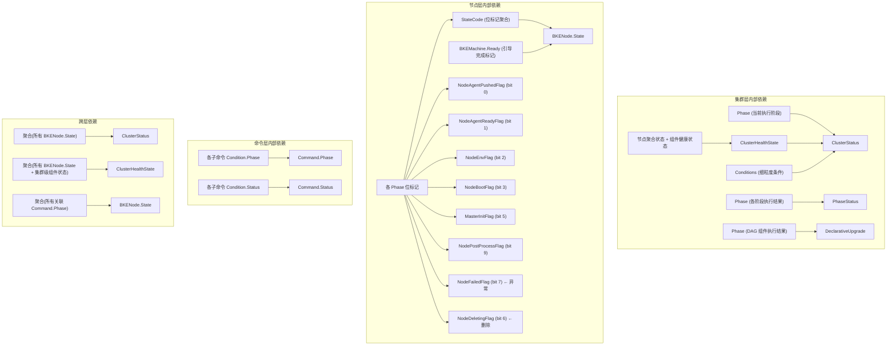

### 10.2 状态聚合规则

#### 10.2.1 节点状态聚合 → 集群状态

```
规则 1：所有节点 Ready → 集群 Ready
  if all(node.State == NodeReady for node in nodes):
      ClusterStatus = ClusterReady

规则 2：任意节点 Upgrading → 集群 Upgrading
  if any(node.State == NodeUpgrading for node in nodes):
      ClusterStatus = ClusterUpgrading

规则 3：任意节点 Failed → 集群 Failed
  if any(node.State == NodeFailed for node in nodes):
      ClusterStatus = ClusterScaleFailed  // 或 ClusterInitializationFailed 等

规则 4：任意节点 Deleting → 集群 Scaling
  if any(node.State == NodeDeleting for node in nodes):
      ClusterStatus = ClusterWorkerScalingDown  // 或 ClusterMasterScalingDown

规则 5：任意节点 Pending/Provisioned → 集群 Creating
  if any(node.State in [NodePending, NodeProvisioned] for node in nodes):
      ClusterStatus = ClusterInitializing
```

#### 10.2.2 StateCode 位标记聚合 → 节点状态

```
规则 1：StateCode == 527 (bootstrapReadyStateCode) → NodeReady
  // 527 = bits 0,1,2,3,5,9 = AgentPushed + AgentReady + Env + Boot + MasterInit + PostProcess
  if node.StateCode & 527 == 527:
      node.State = NodeReady

规则 2：NodeFailedFlag (bit 7) 置位 → NodeFailed
  if node.StateCode & NodeFailedFlag != 0:
      node.State = NodeFailed

规则 3：NodeDeletingFlag (bit 6) 置位 → NodeDeleting
  if node.StateCode & NodeDeletingFlag != 0:
      node.State = NodeDeleting

规则 4：StateCode == 0 → NodePending
  if node.StateCode == 0:
      node.State = NodePending

规则 5：部分位标记置位 → NodeProvisioned / NodeNotReady
  if node.StateCode > 0 && node.StateCode != 527:
      node.State = NodeProvisioned  // 或 NodeNotReady，取决于具体位标记
```

#### 10.2.3 命令状态聚合 → Command.Phase

```
规则 1：任意子命令 Failed → Command.Phase = CommandFailed
  if any(condition.Phase == CommandFailed for condition in conditions):
      command.Phase = CommandFailed

规则 2：所有子命令 Complete → Command.Phase = CommandComplete
  if all(condition.Phase == CommandComplete for condition in conditions):
      command.Phase = CommandComplete

规则 3：部分子命令完成中 → Command.Phase = CommandRunning
  if any(condition.Phase in [CommandRunning, CommandPending] for condition in conditions):
      command.Phase = CommandRunning

规则 4：BackoffIgnore + Failed → Command.Phase = CommandSkip
  if condition.Phase == CommandFailed && execCommand.BackoffIgnore:
      condition.Phase = CommandSkip
```

#### 10.2.4 ClusterHealthState 聚合规则

```
规则 1：DeployFlag (首次部署) → ClusterHealthState = Deploying
规则 2：UpgradeFlag (升级中) → ClusterHealthState = Upgrading
规则 3：ManageFlag (管理中) → ClusterHealthState = Managing
规则 4：DeleteFlag (删除中) → ClusterHealthState = Deleting
规则 5：健康检查通过 → ClusterHealthState = Healthy
规则 6：健康检查失败 → ClusterHealthState = Unhealthy

失败升级规则（StatusManager）：
规则 7：Deploying + 失败次数 > 10 → ClusterHealthState = DeployFailed
规则 8：Upgrading + 失败次数 > 10 → ClusterHealthState = UpgradeFailed
规则 9：Managing + 失败次数 > 10 → ClusterHealthState = ManageFailed
```

### 10.3 状态因果关系

#### 10.3.1 因果传播路径

**路径 1：命令执行 → 节点状态 → 集群状态**

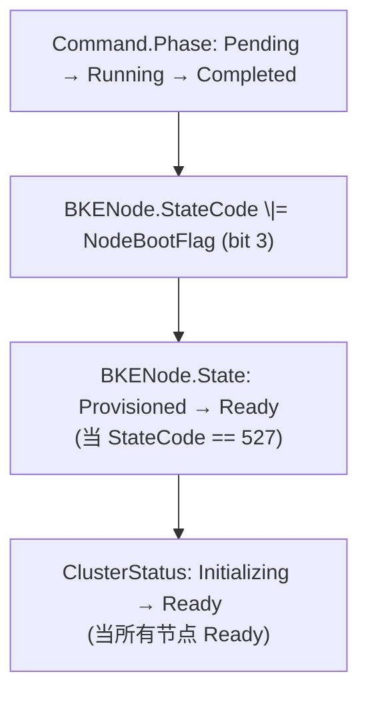

**路径 2：Phase 执行 → 集群状态**

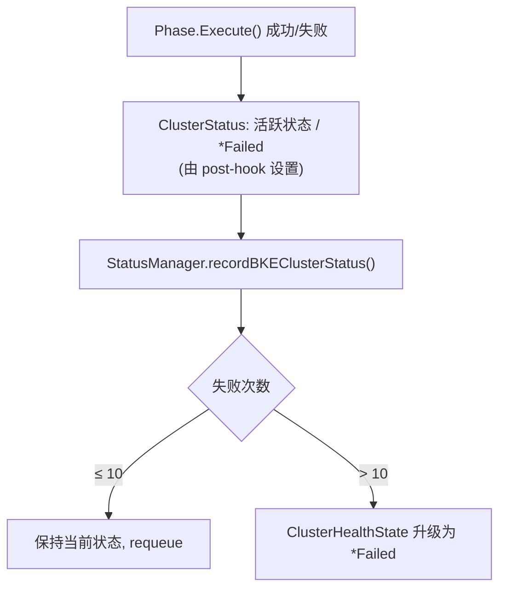

**路径 3：节点变化 → 集群状态**

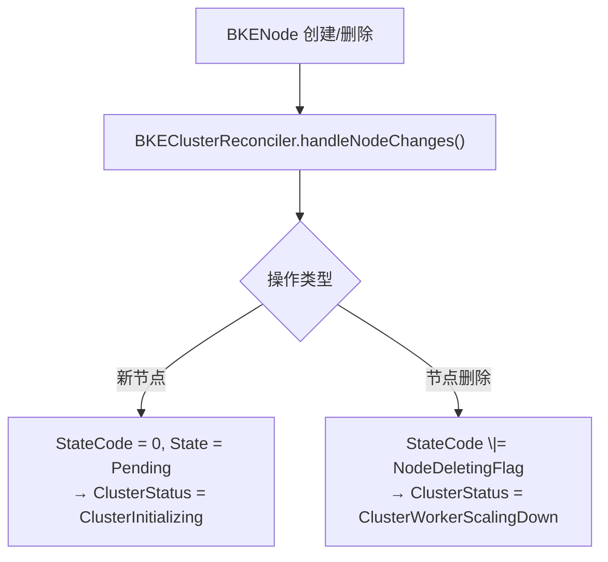

**路径 4：版本变更 → 声明式升级 → 组件状态**

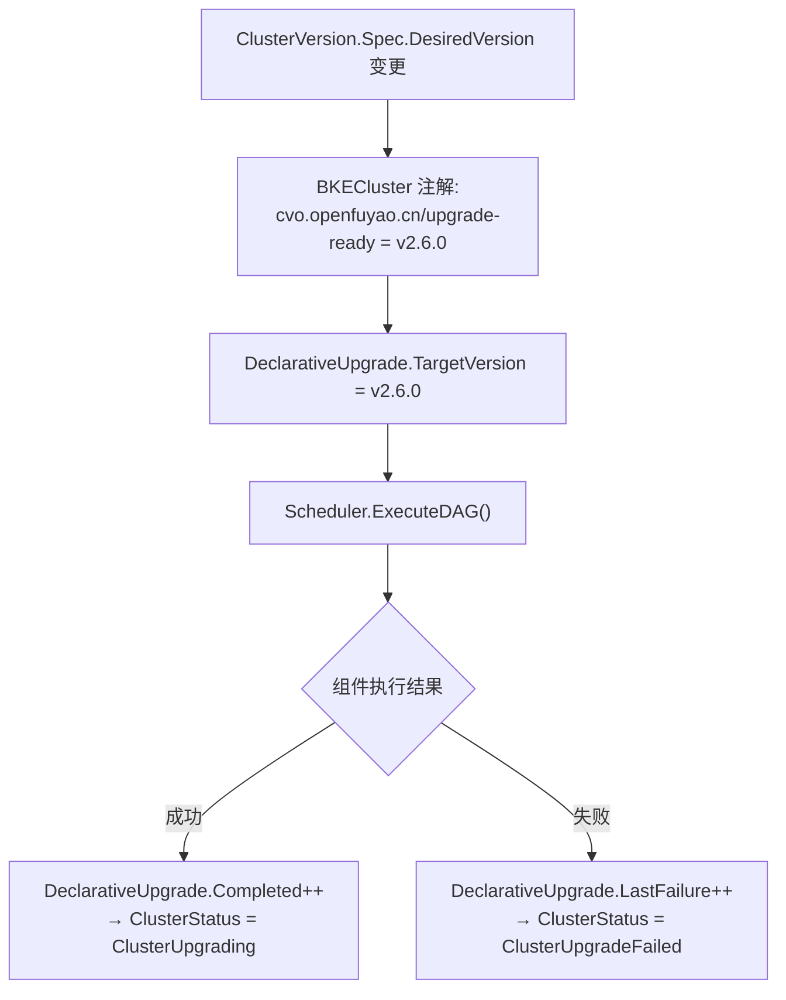

#### 10.3.2 因果传播延迟

| 传播路径 | 延迟 | 原因 |
|---------|------|------|
| Command → BKENode | 秒级 | Command 完成后立即更新 StateCode |
| BKENode → BKECluster | 秒级 | Reconcile 循环中聚合 |
| Phase → ClusterStatus | 秒级 | Phase post-hook 立即设置 |
| ClusterHealthState 升级 | 分钟级 | 需要累积 10 次失败（默认） |
| DeclarativeUpgrade 进度 | 秒级 | 每个组件执行后立即更新 |

### 10.4 状态冲突处理

#### 10.4.1 多状态同时变化

**场景**：Phase 执行同时修改 ClusterStatus 和 BKENode.StateCode

**处理策略**：

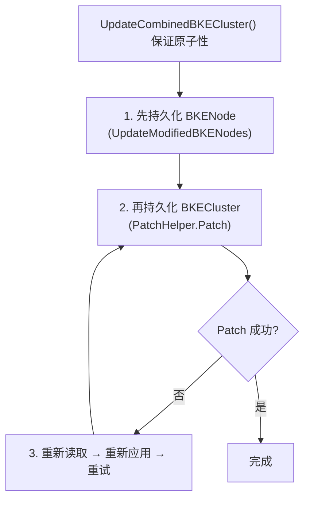

#### 10.4.2 状态回滚级联

**场景**：升级失败后回滚

```mermaid
flowchart TD
    subgraph 回滚触发
        T["DeclarativeUpgrade.LastFailure.Attempt > 阈值"]
    end
    subgraph 回滚传播
        T --> R1["1. DeclarativeUpgrade.LastError = 升级失败"]
        R1 --> R2["2. ClusterStatus = ClusterUpgradeFailed"]
        R2 --> R3["3. ClusterHealthState = UpgradeFailed"]
        R3 --> R4["4. BKENode.StateCode \|= NodeFailedFlag (失败节点)"]
        R4 --> R5["5. BKENode.State = NodeFailed (失败节点)"]
    end
    subgraph 回滚恢复（人工介入）
        S1["1. 用户添加注解: bke.bocloud.com/retry=''"] --> S2["2. BKEClusterReconciler.handleRetryLogic()<br/>BKENode.StateCode &= ^NodeFailedFlag"]
        S2 --> S3["3. StatusManager.ResetCache()<br/>(重置失败计数)"]
        S3 --> S4["4. 重新执行失败阶段<br/>Phase 幂等执行, 跳过已完成组件"]
    end
```

#### 10.4.3 状态不一致修复

**场景**：BKENode.State 与 StateCode 不一致（如 State=Ready 但 StateCode 缺少位标记）

**修复机制**：

```mermaid
flowchart TD
    subgraph 自动修复（Reconcile 循环）
        A1["1. StatusManager.SetStatus() 重新评估节点状态<br/>根据 StateCode 重新计算 State"] --> A2{"State 与 StateCode<br/>一致?"}
        A2 -->|否| A3["2. 以 StateCode 为准<br/>(StateCode 是事实来源)"]
        A3 --> A4["3. 更新 BKENode.State 并持久化"]
        A2 -->|是| A5["无需修复"]
    end
    subgraph 人工修复
        B1["1. 查看 StateCode:<br/>kubectl get bkenode &lt;name&gt; -o jsonpath='{.status.stateCode}'"] --> B2["2. 手动修正:<br/>kubectl patch bkenode &lt;name&gt; --type merge --subresource status -p '{...}'"]
        B2 --> B3["3. 触发 Reconcile:<br/>kubectl annotate bkecluster &lt;name&gt; bke.bocloud.com/retry=''"]
    end
```

#### 10.4.4 状态冲突优先级

当多个状态源产生冲突时，按以下优先级处理：

| 优先级 | 状态源 | 说明 |
|--------|--------|------|
| **最高** | StateCode 位标记 | 事实来源，不可覆盖 |
| **高** | Phase 执行结果 | Phase post-hook 设置的状态 |
| **中** | StatusManager 聚合 | 基于失败计数的状态升级 |
| **低** | 用户手动设置 | 可能被 Reconcile 覆盖 |

### 10.5 Command 状态与 Node 状态的关系与设计思路

#### 10.5.1 核心关系：执行单元 ↔ 聚合结果

Command 是**执行单元**（做什么操作），BKENode.State + StateCode 是**聚合结果**（节点当前处于什么状态）。两者之间**没有自动映射**，不存在 `CommandPhase → NodeState` 的查找表，关系是间接的、事件驱动的：

```
Command.Status[nodeKey].Phase = CommandComplete / CommandFailed
       │  (BKEMachine 控制器通过 Watch 被唤醒)
       ▼
reconcileCommand → processBootstrapSuccess / processBootstrapFailure
       │  (调用 NodeFetcher.SetNodeState / MarkNodeStateFlag)
       ▼
BKENode.Status.State / StateCode 更新
```

> **关键**：`CommandReconciler`（`controllers/bkeagent/command_controller.go`）本身**不触碰 BKENode 状态**——它仅在目标节点上执行命令并写回 `Command.Status`。翻译为 BKENode 状态的工作由 BKEMachine 控制器（`reconcileCommand`，`bkemachine_controller_phases.go:480-618`）和 Phase 框架完成。

#### 10.5.2 三种执行模式

Command 与 Node 状态的交互存在三种不同的执行模式，按操作特性选择：

| 模式 | Command 归属 | 等待方式 | 示例 | Node 状态驱动者 |
|------|-------------|---------|------|----------------|
| **A. 异步代理驱动** | BKEMachine | 创建后返回，Watch 等 Agent 回写 | `bootstrap-` / `reset-node-` | BKEMachine 控制器（`reconcileCommand` 翻译结果） |
| **B. 同步控制器驱动** | BKECluster | `Wait()` 轮询直到完成 | `k8s-env-init` / `preprocess-all-nodes` | Phase 直接读取结果设置 Node 状态 |
| **C. 无 Command** | — | 直接 SSH 或 Cluster API 操作 | Agent 推送 / Master/Worker Join / Delete | Phase 直接设置 Node 状态 |

**模式 A 数据流**（异步，bootstrap 为例）：

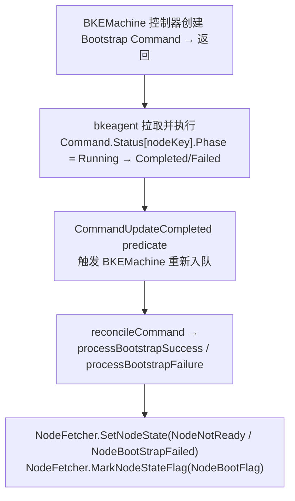

**模式 B 数据流**（同步，env 为例）：

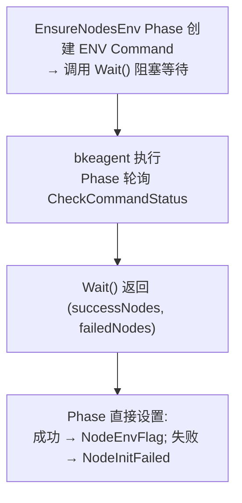

#### 10.5.3 双向数据流：StateCode 既是输入也是输出

StateCode 位标记在 Command 生命周期中扮演**双重角色**：

**作为输入（门控 Command 创建）**——Phase 的 `NeedExecute()` 检查 StateCode 标记，决定是否需要执行：

| Phase | 检查的 StateCode 标记 | 判断逻辑 | 代码位置 |
|-------|---------------------|---------|---------|
| `EnsureBKEAgent` | `NodeAgentPushedFlag` (bit 0) | 未设置才推送 Agent | `ensure_bke_agent.go:110` |
| `EnsureNodesEnv` | `NodeEnvFlag` (bit 2) | 未设置才初始化环境 | `ensure_nodes_env.go:94` |
| `EnsureMasterJoin` / `EnsureWorkerJoin` | `!NodeBootFlag && !MasterInitFlag` | 未引导才加入 | `phaseutil/util.go:330-348` |
| `EnsureNodesPostProcess` | `NodeBootFlag && !NodePostProcessFlag` | 已引导但未后处理 | `phaseutil/util.go:304-324` |
| `BKEMachine.reconcileNormal` | `NodeFailedFlag` (bit 7) | 已设置则跳过该节点 | `bkemachine_controller.go:238-244` |

**作为输出（Command 结果写回）**——Command 执行完成后，控制器/Phase 将结果写入 StateCode：

| Command 类型 | 成功时设置的标记 | 失败时设置的 Node.State | 设置位置 |
|-------------|----------------|----------------------|---------|
| Bootstrap Command | `NodeBootFlag` (bit 3) + `MasterInitFlag` (bit 5) | `NodeBootStrapFailed` | `bkemachine_controller_phases.go:1299,242` |
| ENV Command | `NodeEnvFlag` (bit 2) | `NodeInitFailed` | `ensure_nodes_env.go:268,296` |
| Agent 推送（无 Command） | `NodeAgentPushedFlag` (bit 0) + `NodeAgentReadyFlag` (bit 1) | `NodeInitFailed` | `ensure_bke_agent.go:295,624-625` |
| Reset Command | （BKENode 被删除，无标记） | `NodeDeleting`（执行前设置） | `bkemachine_controller_phases.go:841` |

**循环设计**：

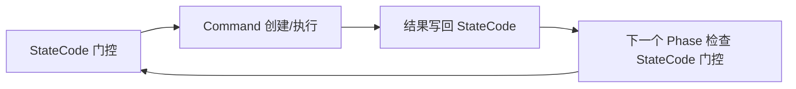

此循环实现了**幂等性**（已完成的操作不重复执行）和**断点续装**（控制器重启后从 StateCode 恢复进度）。

#### 10.5.4 StatusManager：Node 状态的重试缓冲层

StatusManager **不读取 Command 结果**，它消费的是已被控制器设置好的 `BKENode.Status.State`，在 Node 状态层面提供容错：

```mermaid
flowchart TD
    A["Command 失败"] --> B["BKEMachine 控制器设置<br/>BKENode.State = BootStrapFailed"]
    B --> C["StatusManager.recordSingleNodeState<br/>检测到 Failed 后缀"]
    C --> D{"重试次数"}
    D -->|"≤ 10 (默认)"| E["将 State 恢复为 LatestNormalState + NeedRequeue<br/>(状态伪装)<br/>集群表现正常, 控制器自动重试"]
    D -->|"> 10"| F["保持 Failed 状态<br/>+ 设置 NodeFailedFlag (bit 7)<br/>后续所有调谐跳过该节点<br/>需人工清除标志位"]
```

> **设计意图**：Command 是一次性的执行单元（失败后由 StatusManager 触发重试），Node 状态是持久的聚合结果（带重试缓冲）。StatusManager 在 Node 状态层面而非 Command 层面提供容错，因为 Node 状态持久化在 CRD 中，可跨控制器重启存活。

#### 10.5.5 Command.Status 与 BKENode 的关联机制

两者通过**节点 IP** 关联，无直接字段引用：

```
Command.Status map key = "NodeName/NodeIP" 或 "NodeName"  (command_controller.go:591-596)
BKENode.Spec.IP = "10.0.0.1"
```

| Command 类型 | Status 条目数 | BKENode 关联 | 关联方式 |
|-------------|--------------|-------------|---------|
| 单节点 Command（bootstrap/reset） | 1 | 1:1 | `NodeSelector` 含单个 IP 标签 |
| 多节点 Command（env/preprocess） | N | 1:N | `NodeSelector` 含 N 个 IP 标签 |

`CheckCommandStatus`（`command.go:477-518`）返回 `(successNodes, failedNodes)` 为 Status map key 列表，通过 `GetNodeIPFromCommandWaitResult`（`phaseutil/command.go:174-181`）解析出 IP，再用 `NodeFetcher.SetNodeStateWithMessageForCluster(ip, ...)` 定位 BKENode。

> **注意**：BKENode.Status 没有反向引用特定 Command 的字段。BKENode 的状态是所有影响过它的 Command 的累积结果，关联仅通过时间和 IP 定位。

#### 10.5.6 设计思路总结

```mermaid
flowchart TD
    subgraph Command层["Command 层 (执行单元)"]
        C1["CommandPhase: Pending → Running → Completed/Failed"]
        C2["一次性资源, 执行完可清理<br/>(RemoveAfterWait / TTL)"]
        C3["不持久化节点状态, 仅记录命令执行结果"]
    end

    Command层 -->|"↕ 翻译者: BKEMachine 控制器 / Phase 框架"| BKENode层

    subgraph BKENode层["BKENode 层 (聚合状态)"]
        N1["State: 语义状态 (Ready/Failed/BootStrapping/...)"]
        N2["StateCode: 位标记累积 (10 位, 事实来源)"]
        N3["持久化在 CRD Status 中, 跨重启存活"]
        N4["StateCode 双向: 门控 Command 创建 ← → Command 结果写回"]
    end

    BKENode层 -->|"↕ 缓冲层: StatusManager"| StatusManager层

    subgraph StatusManager层["StatusManager 层 (重试/升级)"]
        S1["不读 Command, 只读 BKENode.State"]
        S2["失败重试: 恢复 LatestNormalState + NeedRequeue (状态伪装)"]
        S3["超限升级: 保持 Failed + NodeFailedFlag (永久跳过)"]
    end
```

**核心设计决策**：

1. **Command 与 Node 状态解耦**——Command 不直接设 Node 状态，由控制器翻译，避免执行层与状态层耦合。CommandReconciler 只管执行命令和写回 Command.Status，BKEMachine 控制器/Phase 框架负责翻译结果为 Node 状态。

2. **StateCode 作为门控+累积双重机制**——既防止重复执行（幂等性：`NeedExecute` 检查标记跳过已完成操作），又记录执行进度（可断点续装：控制器重启后从 StateCode 恢复进度）。

3. **StatusManager 在 Node 层而非 Command 层重试**——Command 是一次性的（失败后不重试同一 Command），Node 状态是持久的。在持久层重试才能跨控制器重启存活，通过"状态伪装"（恢复 LatestNormalState）触发 Phase 重新执行。

4. **三种执行模式并存**——异步（bootstrap，适合长时间操作）、同步（env，适合需要立即获取结果的操作）、无 Command（SSH/Cluster API，适合轻量或非命令式操作），按操作特性选择。

---

## 11. 设计思路分析

> **本章目标**：梳理 v1 状态机的核心设计思路，分析各资源状态的设计意图和存在的问题，为 v2/v3 演进提供依据。

### 11.1 核心发现：状态维度爆炸

v1 文档的核心结论是**"无法在单张图中完整展现"**。原因如下：

| 层级 | 状态字段数 | 状态值数 | 复杂度来源 |
|------|-----------|---------|-----------|
| 集群层 | 6 个（Phase, ClusterStatus, ClusterHealthState, PhaseStatus, Conditions, DeclarativeUpgrade） | 56+（20+9+6+21） | Phase 和 ClusterStatus 语义重叠；ClusterHealthState 是 ClusterStatus 的子集；Conditions 细粒度条件多 |
| 节点层 | 4 个（State, StateCode, Message, NeedSkip） | 33+（9+14+10位） | State 和 StateCode 两套并行，StateCode 是事实来源但 State 是对外接口 |
| 命令层 | 2 个（Phase, Status/Conditions） | 7+3 | Phase 是聚合结果，Conditions 是明细 |

**总计 12 个状态字段，96+ 个状态值**。

### 11.2 各资源状态设计思路

#### 11.2.1 集群层：三套状态体系并存

```
Phase (12个值)            → "当前在执行哪个阶段"（执行视角）
ClusterStatus (20个值)    → "集群正在做什么"（操作视角）
ClusterHealthState (9个值) → "集群是否健康"（健康视角）
```

**设计意图**：
- `Phase` 是给开发者/运维看的执行进度
- `ClusterStatus` 是给 UI/API 消费者看的操作状态
- `ClusterHealthState` 是给监控系统看的健康指标

**问题**：
- `Phase` 和 `ClusterStatus` 高度重叠：`Phase=InitControlPlane` 对应 `ClusterStatus=Initializing`，`Phase=UpgradeControlPlane` 对应 `ClusterStatus=Upgrading`
- `ClusterHealthState` 本质是 `ClusterStatus` 的子集+失败升级版：`Deploying` vs `Initializing`，`Upgrading` vs `Upgrading`，`DeployFailed` vs `InitializationFailed`
- 三套状态由不同组件在不同时机更新，存在不一致风险

#### 11.2.2 节点层：State + StateCode 双轨制

```
State (9个值)     → 对外暴露的节点状态（语义化）
StateCode (10位)  → 内部实现细节（位标记累积）
```

**关键设计**：
- `StateCode` 是**事实来源**（source of truth），每个 Phase 执行成功后设置对应的位标记
- `State` 是从 `StateCode` **推导**出来的：`StateCode == 527` → `State = Ready`
- `NodeStateNeedRecord`（bit 8）是持久化触发器：内存修改 → 标记 → 批量持久化

> **StateCode 位标记 → Phase 对应关系**：详见 [3.2.3 节](#323-statecode位标记10-位) 的完整表格和 `bootstrapReadyStateCode = 527` 验证。此处仅列出关键发现。

##### 关键发现

1. **NodeDeletingFlag（bit 6）从未被设置**：代码中仅 `ensure_nodes_env.go:115` 和 `phaseutil/util.go:1153` 检查此标记，但无任何代码通过 `MarkNodeStateFlag` 设置它。节点删除时调用的是 `SetNodeState(NodeDeleting)`（`bkemachine_controller.go:307`），但 `SetNodeState` 只设置 `NodeStateNeedRecord`（bit 8），不设置 `NodeDeletingFlag`（bit 6）。这是一个**实现缺口**。

2. **EnsureClusterManage 复用安装 Phase 的标记**：纳管场景下 `EnsureClusterManage` 会重新执行 Agent 推送和环境配置，设置 bit 0/1/2（与 EnsureBKEAgent/EnsureNodesEnv 相同的标记）。

3. **NodeBootFlag 设置来源多样**：由 BKEMachineController（bootstrap 成功）、EnsureMasterJoin、EnsureWorkerJoin 三处设置，因为 bootstrap 可能发生在不同阶段。

4. **NodeFailedFlag 不由 Phase 设置**：由 StatusManager 在重试超限时设置（`statusmanager.go:346`），不属于 PhaseFlow 的任何 Phase。

**问题**：
- `State` 和 `StateCode` 可能不一致（文档 10.4.3 专门描述了修复机制）
- 两套状态增加了理解和维护成本
- `bootstrapReadyStateCode = 527` 是魔法数字
- `NodeDeletingFlag`（bit 6）定义但从未设置，是实现缺口

#### 11.2.3 命令层：最清晰的状态机

```
CommandPhase (7个值) → Pending → Running → Completed/Failed/Skip
```

**设计特点**：
- 单字段状态机，语义清晰
- 内置重试机制（`BackoffLimit`）
- 聚合逻辑简单：所有子命令成功 → 整体成功

#### 11.2.4 状态聚合：自底向上

```
Command.Phase → BKENode.StateCode → BKENode.State → ClusterStatus
```

**聚合规则**（文档 10.2）：
- 所有节点 Ready → 集群 Ready
- 任意节点 Upgrading → 集群 Upgrading
- 任意节点 Failed → 集群 Failed

**问题**：
- 聚合规则在代码中分散实现（PhaseFlow post-hook、StatusManager、setClusterHealthStatus）
- 没有统一的聚合入口

### 11.3 v1 → v2 → v3 的演进逻辑

| 维度 | v1（现状） | v2（分层状态机） | v3（生命周期） |
|------|-----------|----------------|--------------|
| 集群状态 | 3 套并存（Phase/ClusterStatus/ClusterHealthState） | 保留但明确职责 | 统一为 `LifecyclePhase`（6 个值） |
| 节点状态 | State + StateCode 双轨 | 保留但明确 StateCode 为内部 | 新增 `LifecyclePhase`，StateCode 降级为实现细节 |
| 组件状态 | 无独立状态（隐含在 Command/Phase 中） | 引入 ComponentPhase | 引入 `ComponentLifecycleStatus`（8 个值） |
| 状态聚合 | 分散在 PhaseFlow/StatusManager | 引入 Aggregator | 统一 `Aggregator` + 优先级矩阵 |
| 重试机制 | Command 级 + 人工注解 | 增加自动重试 + 人工介入 | 完善自动重试 + 注解触发 |
| 兼容性 | N/A | N/A | 双写过渡 + Feature Gate |

### 11.4 v1 的核心设计问题（驱动 v2/v3 演进）

1. **状态维度太多**：12 个字段 96+ 个值，无法单图展现
2. **语义重叠**：Phase 和 ClusterStatus 表达相同信息，ClusterHealthState 是 ClusterStatus 的子集
3. **聚合分散**：状态聚合逻辑散落在 PhaseFlow、StatusManager、setClusterHealthStatus 等多处
4. **双轨不一致**：State 和 StateCode 可能不一致，需要额外修复机制
5. **缺少组件层状态**：组件（containerd、coredns 等）没有独立状态追踪，只能通过 Command 间接推断
6. **重试机制不完整**：只有 Command 级自动重试和人工注解重试，缺少中间的自动重试+人工介入机制

v3 的设计目标就是解决这些问题：统一生命周期、明确聚合规则、补充组件层状态、完善重试机制。

---

## 附录

### A. 关键常量定义

```go
// bootstrapReadyStateCode
bootstrapReadyStateCode = 527  // = 1+2+4+8+32+512

// 默认重试配置
DefaultBackoffLimit            = 3
DefaultActiveDeadlineSecond    = 1000
DefaultTTLSecondsAfterFinished = 600

// Rate Limiter
defaultFastDelay       = 10 * time.Second
defaultSlowDelay       = 60 * time.Second
defaultMaxFastAttempts = 5

// 注解键
RetryAnnotationKey              = "bke.bocloud.com/retry"
AppointmentAddNodesAnnotationKey = "bke.bocloud.com/appointment-add-nodes"
UpgradeReadyAnnotationKey       = "cvo.openfuyao.cn/upgrade-ready"
DeclarativeUpgradeAnnotationKey = "cvo.openfuyao.cn/declarative-upgrade"
```

### B. 关键文件位置

| 文件 | 作用 |
|------|------|
| `api/capbke/v1beta1/bkecluster_consts.go` | 集群状态常量定义 |
| `api/bkecommon/v1beta1/bkenode_types.go` | 节点类型定义 |
| `api/bkeagent/v1beta1/command_types.go` | 命令类型定义 |
| `controllers/capbke/bkecluster_controller.go` | BKECluster 控制器 |
| `controllers/capbke/bkemachine_controller_phases.go` | BKEMachine 引导逻辑 |
| `controllers/bkeagent/command_controller.go` | Command 控制器 |
| `pkg/dagexec/scheduler.go` | DAG 调度器 |
| `pkg/phaseframe/phases/list.go` | Phase 注册 |
| `pkg/phaseframe/phaseutil/util.go` | 节点过滤工具 |

### C. 术语表

| 术语 | 定义 |
|------|------|
| **StateCode** | 节点位标记，10 位整数，记录节点生命周期各阶段完成状态 |
| **Phase** | 集群当前执行阶段名称（如 EnsureBKEAgent, EnsureNodesEnv） |
| **ClusterStatus** | 集群操作状态（如 Initializing, Ready, Upgrading） |
| **ClusterHealthState** | 集群健康状态（如 Deploying, Healthy, Unhealthy） |
| **DeclarativeUpgrade** | 声明式升级状态，记录升级进度和已完成组件 |
| **BackoffLimit** | 命令重试次数限制 |
| **ActiveDeadlineSecond** | 命令执行超时时间 |
| **bootstrapReadyStateCode** | 节点引导完成的 StateCode 值（527） |

---

**文档版本**: v1.2  
**最后更新**: 2026-07-17  
**维护者**: BKE Team
