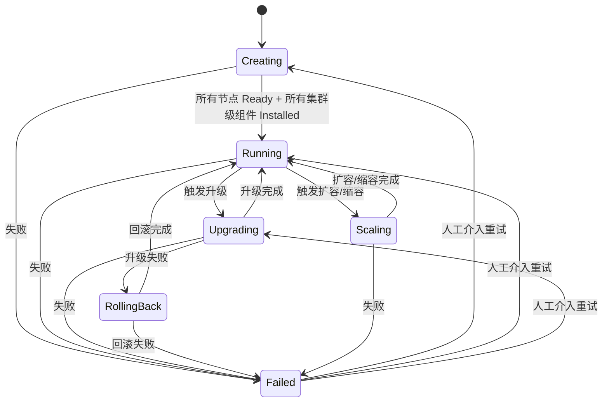
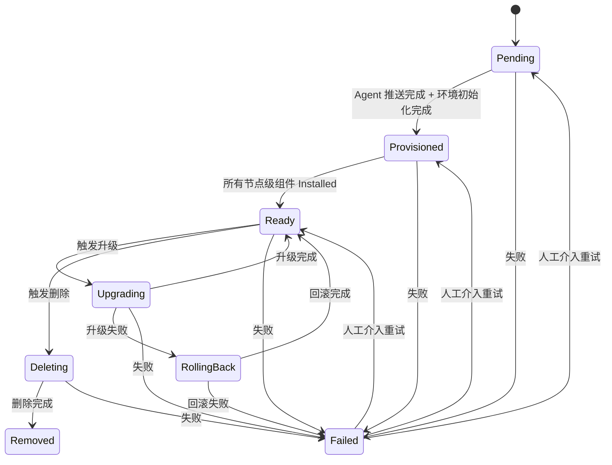
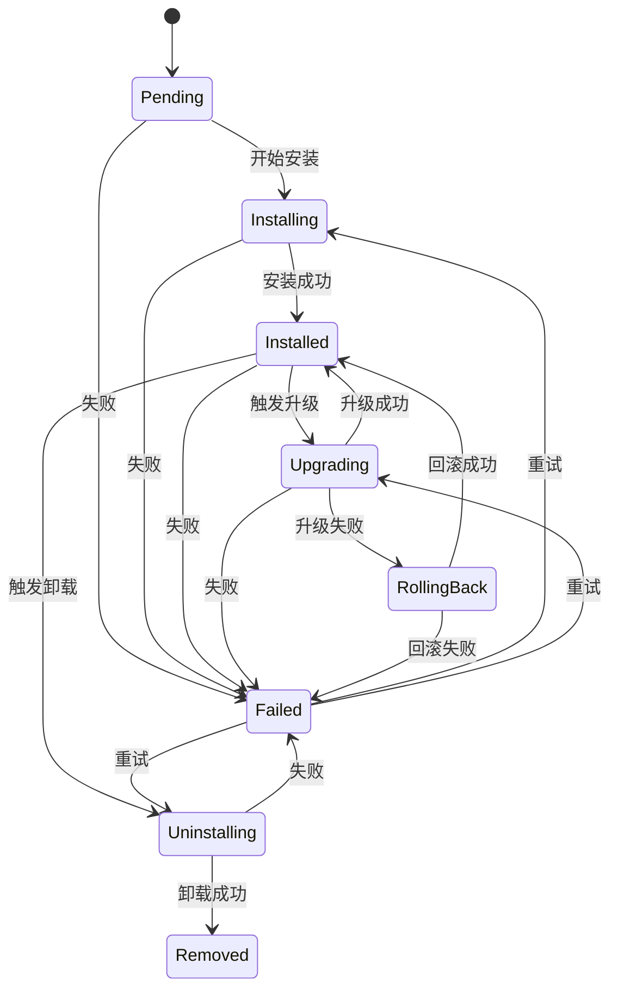
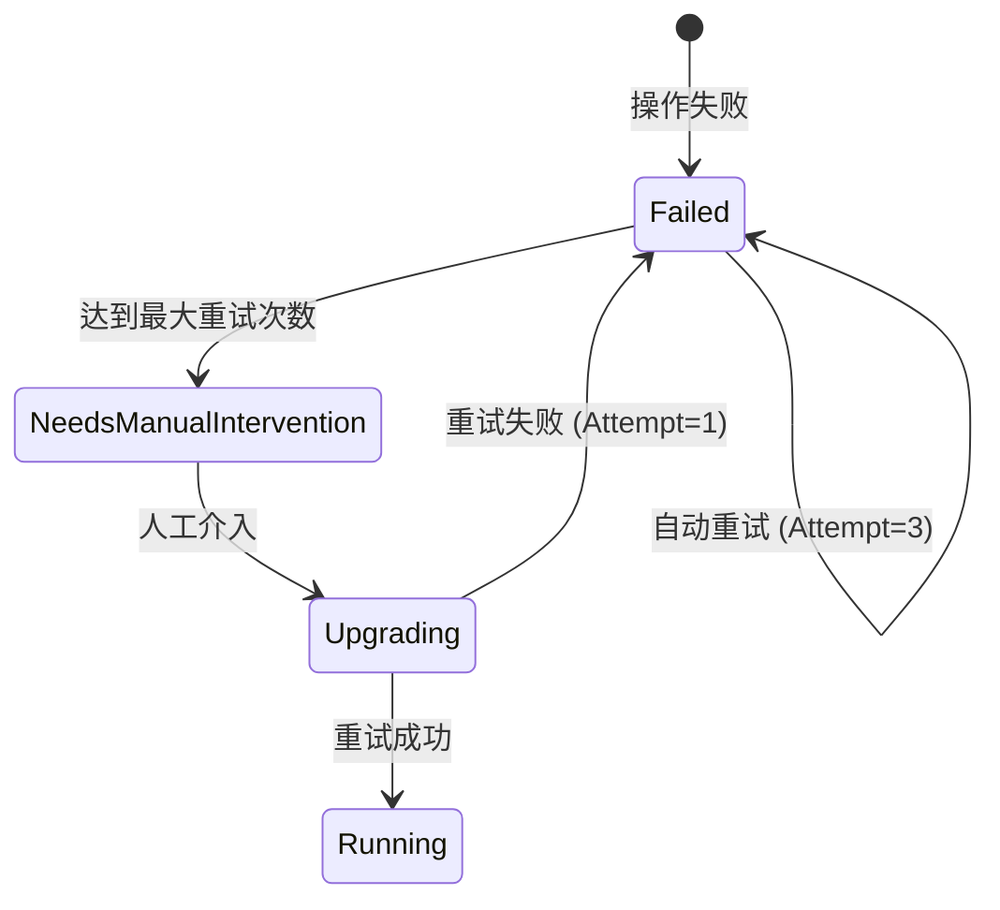
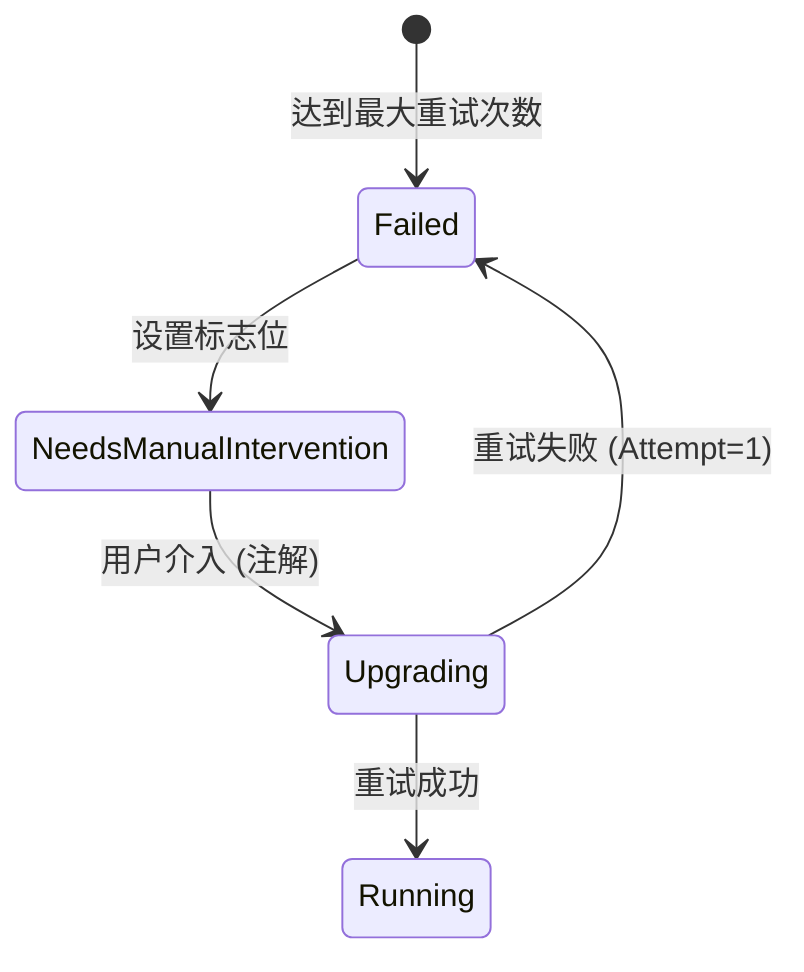
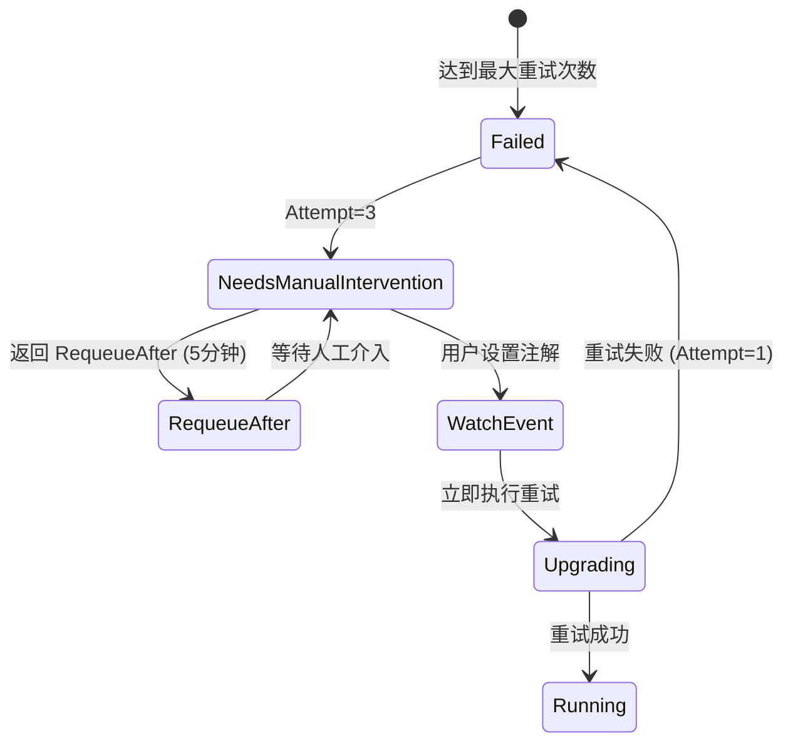
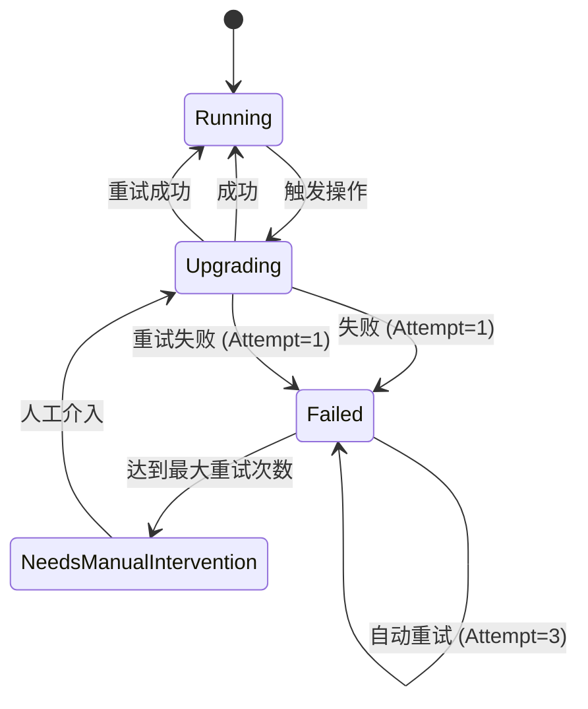

# KEP-6 状态机演进设计（v3）

> **文档说明**：本文档是 KEP-6 状态机的演进设计，基于 v2 版本的反馈进行了重构。
> - **v2 文档**：[kep6-state-machine-v2.md](./kep6-state-machine-v2.md) - 已有实现的参考
> - **v3 文档**：本文档 - 演进的设计方案

## 目录

1. [状态模型概览](#1-状态模型概览)
2. [集群层状态机：BKEClusterLifecycle](#2-集群层状态机bkeclusterlifecycle)
3. [节点层状态机：BKENodeLifecycle](#3-节点层状态机bkenodelifecycle)
4. [组件层状态机：ComponentLifecycle](#4-组件层状态机componentlifecycle)
5. [场景驱动的状态转换](#5-场景驱动的状态转换)
6. [重试与幂等性](#6-重试与幂等性)
7. [详细设计](#7-详细设计)
   - 7.1 [兼容性分析](#71-兼容性分析)
   - 7.2 [API 类型扩展设计](#72-api-类型扩展设计)
   - 7.3 [状态机引擎设计](#73-状态机引擎设计)
   - 7.4 [状态聚合器设计](#74-状态聚合器设计)
   - 7.5 [兼容性映射设计](#75-兼容性映射设计)
   - 7.6 [与现有系统集成设计](#76-与现有系统集成设计)
   - 7.7 [Feature Gate 设计](#77-feature-gate-设计)
   - 7.8 [迁移策略](#78-迁移策略)
   - 7.9 [实现文件清单](#79-实现文件清单)
   - 7.10 [测试设计](#710-测试设计)

---

## 1. 状态模型概览

### 1.1 三层状态机架构

```
┌─────────────────────────────────────────────────────────────────────────────┐
│                    集群层 (BKEClusterLifecycle)                              │
│  Creating → Running → Upgrading → Scaling → RollingBack → Failed           │
└─────────────────────────────────────────────────────────────────────────────┘
                                    │
                                    │ 聚合
                                    ▼
┌─────────────────────────────────────────────────────────────────────────────┐
│                    节点层 (BKENodeLifecycle)                                 │
│  Pending → Provisioned → Ready → Upgrading → RollingBack → Deleting        │
└─────────────────────────────────────────────────────────────────────────────┘
                                    │
                                    │ 聚合
                                    ▼
┌─────────────────────────────────────────────────────────────────────────────┐
│                    组件层 (ComponentLifecycle)                               │
│  Pending → Installing → Installed → Upgrading → RollingBack → Uninstalling │
└─────────────────────────────────────────────────────────────────────────────┘
```

### 1.2 组件类型区分

组件分为**节点级组件**和**集群级组件**两类：

| 组件类型 | 示例 | 聚合目标 | 说明 |
|---------|------|---------|------|
| **节点级组件** | containerd, bkeagent | 节点状态 | 运行在特定节点上 |
| **集群级组件** | coredns, kube-proxy | 集群状态 | 运行在集群中 |

```go
type ComponentType string

const (
    ComponentTypeNode    ComponentType = "node"    // 节点级组件
    ComponentTypeCluster ComponentType = "cluster" // 集群级组件
)
```

### 1.3 状态聚合关系

#### 1.3.1 节点级组件 → 节点状态

```
节点状态 = 聚合(所有节点级组件状态)

规则：
- 所有节点级组件 Installed → 节点 Ready
- 任意节点级组件 Upgrading → 节点 Upgrading
- 任意节点级组件 RollingBack → 节点 RollingBack
- 任意节点级组件 Failed → 节点 Failed
- 所有节点级组件 Removed → 节点 Removed
```

#### 1.3.2 节点状态 + 集群级组件 → 集群状态

```
集群状态 = 聚合(所有节点状态 + 所有集群级组件状态)

规则：
- 所有节点 Ready + 所有集群级组件 Installed → 集群 Running
- 任意节点 Upgrading 或 任意集群级组件 Upgrading → 集群 Upgrading
- 任意节点 RollingBack 或 任意集群级组件 RollingBack → 集群 RollingBack
- 任意节点 Failed 或 任意集群级组件 Failed → 集群 Failed
- 任意节点 Deleting → 集群 Scaling
- 任意节点 Pending/Provisioned → 集群 Creating
```

### 1.4 状态驱动关系

```
Reconciler (调谐器)
  │
  ├─ Watch BKECluster 变更
  │   └─ 触发集群层状态转换
  │
  ├─ Watch BKENode 变更
  │   └─ 触发节点层状态转换
  │
  ├─ Watch ComponentVersion 变更
  │   └─ 触发组件层状态转换
  │
  └─ 执行 DAG
      └─ 按依赖顺序执行组件安装/升级
```

---

## 2. 集群层状态机：BKEClusterLifecycle

### 2.1 状态定义

| 状态 | 说明 |
|------|------|
| `Creating` | 集群正在创建（节点加入、Agent 推送、组件安装） |
| `Running` | 集群正在运行（所有组件就绪，服务可用） |
| `Upgrading` | 集群正在升级（版本变更中） |
| `Scaling` | 集群正在扩容或缩容（节点增减） |
| `RollingBack` | 集群正在回滚（升级失败后恢复） |
| `Failed` | 集群失败（需要人工介入） |

### 2.2 状态转换规则

**正常转换**：
- `Creating → Running`：所有节点 Ready + 所有集群级组件 Installed
- `Running → Upgrading`：用户触发版本升级
- `Upgrading → Running`：升级完成，所有组件更新到目标版本
- `Running → Scaling`：触发扩容或缩容
- `Scaling → Running`：扩容或缩容完成

**失败转换**：
- `任意状态 → Failed`：关键组件失败或超时
- `Failed → Creating/Running/Upgrading`：人工介入后重试

**回滚转换**：
- `Upgrading → RollingBack`：升级失败，触发回滚
- `RollingBack → Running`：回滚完成

### 2.3 状态转换图



### 2.4 操作进度追踪

所有操作（安装、升级、扩容、缩容、回滚）的进度通过 `OperationProgress` 统一追踪：

```go
type OperationType string

const (
    OperationInstall  OperationType = "Install"
    OperationUpgrade  OperationType = "Upgrade"
    OperationScale    OperationType = "Scale"
    OperationRollback OperationType = "Rollback"
)

type OperationProgress struct {
    // 操作类型
    OperationType OperationType `json:"operationType"`
    
    // 目标版本
    TargetVersion string `json:"targetVersion,omitempty"`
    
    // 开始时间
    StartedAt *metav1.Time `json:"startedAt,omitempty"`
    
    // 完成时间
    FinishedAt *metav1.Time `json:"finishedAt,omitempty"`
    
    // 最后错误
    LastError string `json:"lastError,omitempty"`
    
    // 已完成组件列表
    Completed []ComponentRecord `json:"completed,omitempty"`
}
```

**使用场景**：

| 场景 | OperationType |
|------|---------------|
| 集群安装 | `Install` |
| 集群升级 | `Upgrade` |
| 集群扩容 | `Scale` |
| 集群缩容 | `Scale` |
| 集群回滚 | `Rollback` |

---

## 3. 节点层状态机：BKENodeLifecycle

### 3.1 状态定义

| 状态 | 说明 |
|------|------|
| `Pending` | 节点等待配置（Agent 推送） |
| `Provisioned` | 节点已配置（Agent 就绪，环境初始化完成） |
| `Ready` | 节点就绪（所有组件安装完成） |
| `Upgrading` | 节点正在升级（组件升级中） |
| `RollingBack` | 节点正在回滚（升级失败后恢复） |
| `Deleting` | 节点正在删除（组件卸载中） |
| `Removed` | 节点已删除 |
| `Failed` | 节点失败 |

### 3.2 状态转换图



### 3.3 节点状态聚合规则

节点状态由所有节点级组件状态聚合：

```go
func AggregateNodeState(nodeComponents []ComponentStatus) NodeState {
    // 所有组件 Installed → Ready
    if allInstalled(nodeComponents) {
        return NodeReady
    }
    
    // 任意组件 Upgrading → Upgrading
    if anyUpgrading(nodeComponents) {
        return NodeUpgrading
    }
    
    // 任意组件 RollingBack → RollingBack
    if anyRollingBack(nodeComponents) {
        return NodeRollingBack
    }
    
    // 任意组件 Failed → Failed
    if anyFailed(nodeComponents) {
        return NodeFailed
    }
    
    // 所有组件 Removed → Removed
    if allRemoved(nodeComponents) {
        return NodeRemoved
    }
    
    // 其他情况 → Pending/Provisioned
    return determineProvisionState(nodeComponents)
}
```

---

## 4. 组件层状态机：ComponentLifecycle

### 4.1 状态定义

| 状态 | 说明 |
|------|------|
| `Pending` | 组件等待安装 |
| `Installing` | 组件正在安装 |
| `Installed` | 组件已安装（运行中） |
| `Upgrading` | 组件正在升级 |
| `RollingBack` | 组件正在回滚（升级失败后恢复） |
| `Uninstalling` | 组件正在卸载 |
| `Removed` | 组件已卸载 |
| `Failed` | 组件安装/升级/卸载失败 |

### 4.2 组件类型区分

组件分为节点级和集群级两类：

**节点级组件**：
- 运行在特定节点上
- 聚合到节点状态
- 示例：containerd, bkeagent

**集群级组件**：
- 运行在集群中
- 聚合到集群状态
- 示例：coredns, kube-proxy

### 4.3 状态转换图



### 4.4 聚合规则

#### 4.4.1 节点级组件聚合到节点状态

```go
func AggregateNodeStateFromComponents(nodeComponents []ComponentStatus) NodeState {
    // 实现见 3.4 节
}
```

#### 4.4.2 集群级组件聚合到集群状态

```go
func AggregateClusterStateFromComponents(
    nodes []NodeState,
    clusterComponents []ComponentStatus,
) ClusterState {
    // 所有节点 Ready + 所有集群级组件 Installed → Running
    if allNodesReady(nodes) && allClusterComponentsInstalled(clusterComponents) {
        return ClusterRunning
    }
    
    // 任意节点或集群级组件 Upgrading → Upgrading
    if anyNodeUpgrading(nodes) || anyClusterComponentUpgrading(clusterComponents) {
        return ClusterUpgrading
    }
    
    // 任意节点或集群级组件 RollingBack → RollingBack
    if anyNodeRollingBack(nodes) || anyClusterComponentRollingBack(clusterComponents) {
        return ClusterRollingBack
    }
    
    // 任意节点或集群级组件 Failed → Failed
    if anyNodeFailed(nodes) || anyClusterComponentFailed(clusterComponents) {
        return ClusterFailed
    }
    
    // 任意节点 Deleting → Scaling
    if anyNodeDeleting(nodes) {
        return ClusterScaling
    }
    
    // 任意节点 Pending/Provisioned → Creating
    if anyNodePendingOrProvisioned(nodes) {
        return ClusterCreating
    }
    
    return ClusterUnknown
}
```

#### 4.4.3 集群状态同时聚合节点状态和集群级组件状态

**关键规则**：
- 集群状态 = 聚合(所有节点状态 + 所有集群级组件状态)
- 必须同时满足两个条件才能进入 Running 状态
- 任意一个失败都会导致集群失败

---

## 5. 场景驱动的状态转换

### 5.1 安装场景

**状态字段说明**：

| 字段 | 作用 | 示例值 |
|------|------|--------|
| `BKECluster.Status.Phase` | 集群生命周期阶段，反映集群整体状态 | Creating/Running/Upgrading/Scaling/RollingBack/Failed |
| `BKECluster.Status.ClusterHealthState` | 集群健康状态，反映集群的健康程度 | Healthy/Unhealthy/Degraded |

**Phase 与 ClusterHealthState 的关系**：

| 字段 | 类型 | 作用 | 聚合规则 |
|------|------|------|---------|
| `Phase` | 生命周期状态 | 反映集群当前处于什么阶段 | 由节点状态和组件状态聚合 |
| `ClusterHealthState` | 健康状态 | 反映集群的健康程度 | 基于 Phase 和其他健康指标评估 |

**聚合关系**：
- `Phase` 是基础状态，由节点状态和组件状态聚合而来
- `ClusterHealthState` 是衍生状态，基于 Phase 和其他健康指标评估
- 例如：`Phase=Running` + `ClusterHealthState=Healthy` 表示集群正在运行且健康

**依赖关系**：
- `ClusterHealthState` 依赖于 `Phase`
- 只有当 `Phase=Running` 时，`ClusterHealthState` 才有意义
- 当 `Phase=Failed` 时，`ClusterHealthState` 通常为 `Unhealthy`

**状态转换时序说明**：

| 时序 | 状态转换 | 触发条件 | 前置条件 | 结果 |
|------|---------|---------|---------|------|
| T0 | BKEClusterLifecycle: [*] → Creating | 创建 BKECluster | 无 | 集群进入创建阶段 |
| T1 | BKENodeLifecycle: [*] → Pending | 新节点加入集群 | T0 完成 | 节点等待配置 |
| T2 | ComponentLifecycle: Pending → Installing | 开始安装节点级组件 | T1 完成 | 组件开始安装 |
| T3 | ComponentLifecycle: Installing → Installed | 节点级组件安装成功 | T2 完成 | 节点进入 Provisioned 状态 |
| T4 | BKENodeLifecycle: Provisioned → Ready | 环境初始化完成 | T3 完成 | 节点就绪 |
| T5 | ComponentLifecycle: Pending → Installing | 开始安装集群级组件 | T4 完成 | 组件开始安装 |
| T6 | ComponentLifecycle: Installing → Installed | 集群级组件安装成功 | T5 完成 | 所有组件安装完成 |
| T7 | BKEClusterLifecycle: Creating → Running | 所有节点 Ready + 所有集群级组件 Installed | T6 完成 | 集群进入运行状态 |

**状态转换时序**：

```
T0: BKEClusterLifecycle = Creating
    BKECluster.Status.Phase = Creating
    OperationProgress.OperationType = Install

T1: BKENodeLifecycle = Pending (新节点加入)
    BKENode.State = Pending

T2: 节点级组件 Installing (containerd, bkeagent)
    ComponentLifecycle = Installing

T3: 节点级组件 Installed
    ComponentLifecycle = Installed
    BKENode.State = Provisioned

T4: 环境初始化完成
    BKENode.State = Ready

T5: 集群级组件 Installing (coredns, kube-proxy)
    ComponentLifecycle = Installing

T6: 集群级组件 Installed
    ComponentLifecycle = Installed

T7: BKEClusterLifecycle = Running
    所有节点 Ready + 所有集群级组件 Installed
    BKECluster.Status.Phase = Running
    BKECluster.Status.ClusterHealthState = Healthy
    OperationProgress.FinishedAt = now
```

### 5.2 升级场景

**状态转换时序说明**：

| 时序 | 状态转换 | 触发条件 | 前置条件 | 结果 |
|------|---------|---------|---------|------|
| T0 | BKEClusterLifecycle: Running → Upgrading | 用户触发版本升级 | 集群处于 Running 状态 | 集群进入升级阶段 |
| T1 | ComponentLifecycle: Installed → Upgrading | 开始升级节点级组件 | T0 完成 | 组件开始升级 |
| T2 | ComponentLifecycle: Upgrading → Installed | 节点级组件升级成功 | T1 完成 | 节点回到 Ready 状态 |
| T3 | ComponentLifecycle: Installed → Upgrading | 开始升级集群级组件 | T2 完成 | 组件开始升级 |
| T4 | ComponentLifecycle: Upgrading → Installed | 集群级组件升级成功 | T3 完成 | 所有组件升级完成 |
| T5 | BKEClusterLifecycle: Upgrading → Running | 所有节点 Ready + 所有集群级组件 Installed | T4 完成 | 集群回到运行状态 |

**状态转换时序**：

```
T0: BKEClusterLifecycle = Running → Upgrading
    BKECluster.Status.Phase = Upgrading
    OperationProgress.OperationType = Upgrade
    OperationProgress.StartedAt = now

T1: 节点级组件 Upgrading (containerd, bkeagent)
    ComponentLifecycle = Upgrading
    BKENode.State = Upgrading

T2: 节点级组件 Installed
    ComponentLifecycle = Installed
    BKENode.State = Ready
    OperationProgress.Completed = append(...)

T3: 集群级组件 Upgrading (coredns, kube-proxy)
    ComponentLifecycle = Upgrading

T4: 集群级组件 Installed
    ComponentLifecycle = Installed
    OperationProgress.Completed = append(...)

T5: BKEClusterLifecycle = Upgrading → Running
    所有节点 Ready + 所有集群级组件 Installed
    BKECluster.Status.Phase = Running
    OperationProgress.FinishedAt = now
```

### 5.3 回滚场景

**状态转换时序说明**：

| 时序 | 状态转换 | 触发条件 | 前置条件 | 结果 |
|------|---------|---------|---------|------|
| T0 | ComponentLifecycle: Upgrading → Failed | 升级过程中出现错误 | 升级操作进行中 | 组件进入失败状态 |
| T1 | BKEClusterLifecycle: Upgrading → RollingBack | 升级失败，触发回滚 | T0 完成 | 集群进入回滚阶段 |
| T2 | ComponentLifecycle: Failed → RollingBack | 开始回滚节点级组件 | T1 完成 | 组件开始回滚 |
| T3 | ComponentLifecycle: RollingBack → Installed | 节点级组件回滚成功 | T2 完成 | 节点回到 Ready 状态 |
| T4 | ComponentLifecycle: Installed → RollingBack | 开始回滚集群级组件 | T3 完成 | 组件开始回滚 |
| T5 | ComponentLifecycle: RollingBack → Installed | 集群级组件回滚成功 | T4 完成 | 所有组件回滚完成 |
| T6 | BKEClusterLifecycle: RollingBack → Running | 所有节点 Ready + 所有集群级组件 Installed | T5 完成 | 集群回到运行状态 |

**状态转换时序**：

```
T0: 升级失败
    ComponentLifecycle = Failed
    OperationProgress.LastError = "upgrade failed"

T1: BKEClusterLifecycle = Upgrading → RollingBack
    BKECluster.Status.Phase = RollingBack
    OperationProgress.OperationType = Rollback

T2: 节点级组件 RollingBack (containerd, bkeagent)
    ComponentLifecycle = RollingBack
    BKENode.State = RollingBack

T3: 节点级组件 Installed
    ComponentLifecycle = Installed
    BKENode.State = Ready

T4: 集群级组件 RollingBack (coredns, kube-proxy)
    ComponentLifecycle = RollingBack

T5: 集群级组件 Installed
    ComponentLifecycle = Installed

T6: BKEClusterLifecycle = RollingBack → Running
    所有节点 Ready + 所有集群级组件 Installed
    BKECluster.Status.Phase = Running
    OperationProgress.FinishedAt = now
```

### 5.4 扩容场景

**状态转换时序说明**：

| 时序 | 状态转换 | 触发条件 | 前置条件 | 结果 |
|------|---------|---------|---------|------|
| T0 | BKEClusterLifecycle: Running → Scaling | 用户触发扩容 | 集群处于 Running 状态 | 集群进入扩容阶段 |
| T1 | BKENodeLifecycle: [*] → Pending | 新节点加入集群 | T0 完成 | 节点等待配置 |
| T2 | ComponentLifecycle: Pending → Installing | 开始安装节点级组件 | T1 完成 | 组件开始安装 |
| T3 | ComponentLifecycle: Installing → Installed | 节点级组件安装成功 | T2 完成 | 节点就绪 |
| T4 | BKEClusterLifecycle: Scaling → Running | 所有节点 Ready + 所有集群级组件 Installed | T3 完成 | 集群回到运行状态 |

**状态转换时序**：

```
T0: BKEClusterLifecycle = Running → Scaling
    BKECluster.Status.Phase = Scaling
    OperationProgress.OperationType = Scale

T1: 新节点加入
    BKENodeLifecycle = Pending
    BKENode.State = Pending

T2: 节点级组件 Installing (containerd, bkeagent)
    ComponentLifecycle = Installing

T3: 节点级组件 Installed
    ComponentLifecycle = Installed
    BKENode.State = Ready

T4: BKEClusterLifecycle = Scaling → Running
    所有节点 Ready + 所有集群级组件 Installed
    BKECluster.Status.Phase = Running
    OperationProgress.FinishedAt = now
```

### 5.5 缩容场景

**状态转换时序说明**：

| 时序 | 状态转换 | 触发条件 | 前置条件 | 结果 |
|------|---------|---------|---------|------|
| T0 | BKEClusterLifecycle: Running → Scaling | 用户触发缩容 | 集群处于 Running 状态 | 集群进入缩容阶段 |
| T1 | BKENodeLifecycle: Ready → Deleting | 节点标记删除 | T0 完成 | 节点开始删除 |
| T2 | ComponentLifecycle: Installed → Uninstalling | 开始卸载节点级组件 | T1 完成 | 组件开始卸载 |
| T3 | ComponentLifecycle: Uninstalling → Removed | 节点级组件卸载成功 | T2 完成 | 组件已卸载 |
| T4 | BKENodeLifecycle: Deleting → Removed | 节点删除完成 | T3 完成 | 节点已删除 |
| T5 | BKEClusterLifecycle: Scaling → Running | 所有节点 Ready + 所有集群级组件 Installed | T4 完成 | 集群回到运行状态 |

**状态转换时序**：

```
T0: BKEClusterLifecycle = Running → Scaling
    BKECluster.Status.Phase = Scaling
    OperationProgress.OperationType = Scale

T1: 节点标记删除
    BKENodeLifecycle = Ready → Deleting
    BKENode.State = Deleting

T2: 节点级组件 Uninstalling (containerd, bkeagent)
    ComponentLifecycle = Uninstalling

T3: 节点级组件 Removed
    ComponentLifecycle = Removed

T4: BKENodeLifecycle = Deleting → Removed
    BKENode.State = Removed

T5: BKEClusterLifecycle = Scaling → Running
    所有节点 Ready + 所有集群级组件 Installed
    BKECluster.Status.Phase = Running
    OperationProgress.FinishedAt = now
```

---

## 6. 重试与幂等性

### 6.1 重试机制

#### 6.1.1 自动重试

**重试计数器存储位置**

自动重试计数器存储在 `BKECluster.Status.OperationProgress.LastFailure.Attempt` 字段中：

```go
type OperationProgress struct {
    // 操作类型
    OperationType OperationType `json:"operationType"`
    
    // 目标版本
    TargetVersion string `json:"targetVersion,omitempty"`
    
    // 开始时间
    StartedAt *metav1.Time `json:"startedAt,omitempty"`
    
    // 完成时间
    FinishedAt *metav1.Time `json:"finishedAt,omitempty"`
    
    // 最后错误
    LastError string `json:"lastError,omitempty"`
    
    // 是否需要人工介入
    NeedsManualIntervention bool `json:"needsManualIntervention,omitempty"`
    
    // 已完成组件列表
    Completed []ComponentRecord `json:"completed,omitempty"`
    
    // 最后失败记录（包含重试计数器）
    LastFailure *OperationFailureRecord `json:"lastFailure,omitempty"`
}

type OperationFailureRecord struct {
    Name     string      `json:"name"`
    Version  string      `json:"version,omitempty"`
    NodeIP   string      `json:"nodeIP,omitempty"` // 节点级组件必填，集群级组件留空
    FailedAt metav1.Time `json:"failedAt"`
    Error    string      `json:"error,omitempty"`
    Attempt  int32       `json:"attempt,omitempty"`
}
```

**Attempt 增加逻辑**

Attempt 在每次执行失败后增加 1，在 `MarkFailure` 方法中实现：

```go
// MarkFailure 更新失败记录，Attempt 增加
func (p *OperationProgress) MarkFailure(name, version, nodeIP, errMsg string, now metav1.Time) {
    var attempt int32 = 1
    
    // 如果是同一个组件在同一节点连续失败，Attempt 增加
    if p.LastFailure != nil && p.LastFailure.Name == name && p.LastFailure.NodeIP == nodeIP {
        attempt = p.LastFailure.Attempt + 1
    }
    
    p.LastFailure = &OperationFailureRecord{
        Name:     name,
        Version:  version,
        NodeIP:   nodeIP,
        FailedAt: now,
        Error:    errMsg,
        Attempt:  attempt,
    }
    p.LastError = errMsg
}
```

**Attempt 增加的场景**

| 场景 | Attempt 值 | 说明 |
|------|-----------|------|
| 首次执行失败 | 1 | 第一次失败 |
| 第一次自动重试失败 | 2 | 第二次失败 |
| 第二次自动重试失败 | 3 | 第三次失败（达到最大重试次数） |
| 达到最大重试次数 | 3 | 停止自动重试，等待人工介入 |
| 人工介入后重试失败 | 1 | 重置计数器 |

**自动重试处理逻辑**

```go
const maxAutoRetries = 3

func (r *Reconciler) executeDAGWithRetry(ctx context.Context, cluster *bkev1beta1.BKECluster) (ctrl.Result, error) {
    // 执行 DAG
    result, err := r.executeDAG(ctx, cluster)
    
    if err != nil {
        // 更新失败记录
        cluster.Status.OperationProgress.MarkFailure(
            componentName, version, nodeIP, err.Error(), metav1.Now())
        
        // 检查是否达到最大自动重试次数
        if cluster.Status.OperationProgress.LastFailure.Attempt >= maxAutoRetries {
            // 达到最大重试次数，设置人工介入标志
            cluster.Status.OperationProgress.NeedsManualIntervention = true
            r.Status().Update(ctx, cluster)
            
            // 返回 RequeueAfter，等待人工介入
            return ctrl.Result{RequeueAfter: 5 * time.Minute}, nil
        }
        
        r.Status().Update(ctx, cluster)
        
        // 指数退避
        attempt := cluster.Status.OperationProgress.LastFailure.Attempt
        backoff := calculateBackoff(attempt)
        return ctrl.Result{RequeueAfter: backoff}, nil
    }
    
    // 执行成功
    cluster.Status.OperationProgress.FinishedAt = &metav1.Time{Time: time.Now()}
    cluster.Status.Phase = "Running"
    cluster.Status.OperationProgress.LastError = ""
    cluster.Status.OperationProgress.LastFailure = nil
    
    return ctrl.Result{}, r.Status().Update(ctx, cluster)
}

// calculateBackoff 计算指数退避时间
func calculateBackoff(attempt int32) time.Duration {
    baseDelay := 5 * time.Second
    maxDelay := 5 * time.Minute
    
    backoff := time.Duration(math.Pow(2, float64(attempt-1))) * baseDelay
    if backoff > maxDelay {
        backoff = maxDelay
    }
    
    return backoff
}
```

**自动重试状态转换**



#### 6.1.2 重试触发条件

| 场景 | 触发条件 | 重试策略 |
|------|---------|---------|
| 组件安装失败 | `ComponentLifecycle = Failed` | 指数退避，最多 3 次 |
| 节点升级失败 | `BKENodeLifecycle = Failed` | 固定间隔 5 分钟，最多 5 次 |
| 集群操作失败 | `OperationProgress.LastError != ""` | 指数退避，最多 3 次 |

### 6.2 幂等性保证

```go
func (r *Reconciler) isIdempotent(ctx context.Context, cluster *confv1beta1.BKECluster) bool {
    // 检查组件是否已完成
    if cluster.Status.OperationProgress != nil {
        for _, component := range cluster.Status.OperationProgress.Completed {
            if component.Name == componentName && component.Version == version {
                // 已完成，跳过
                return true
            }
        }
    }
    
    // 检查节点组件状态
    if cluster.Status.NodeComponentStatuses != nil {
        if compStatuses, ok := cluster.Status.NodeComponentStatuses[componentName]; ok {
            if status, ok := compStatuses[nodeIP]; ok {
                if status.Phase == "Installed" && status.Version == version {
                    // 已安装到目标版本，跳过
                    return true
                }
            }
        }
    }
    
    return false
}
```

### 6.3 人工介入

#### 6.3.1 介入前诊断

**需要查看的字段**：

| 字段 | 作用 | 诊断方法 |
|------|------|---------|
| `BKECluster.Status.Phase` | 集群当前阶段 | 判断集群是否处于 Failed 状态 |
| `BKECluster.Status.OperationProgress` | 操作进度和错误信息 | 查看 LastError 和 LastFailure |
| `BKECluster.Status.NodeComponentStatuses` | 节点级组件状态 | 判断哪些组件安装失败 |
| `BKECluster.Status.ComponentStatuses` | 集群级组件状态 | 判断哪些组件安装失败 |
| `BKENode.Status.State` | 节点状态 | 判断哪些节点处于 Failed 状态 |
| `ComponentVersion.Status.Phase` | 组件状态 | 判断组件是否处于 Failed 状态 |

**诊断流程**：

1. **查看集群状态**：
   - 检查 `BKECluster.Status.Phase` 是否为 `Failed`
   - 检查 `BKECluster.Status.OperationProgress.LastError` 获取错误信息

2. **查看节点状态**：
   - 检查 `BKECluster.Status.NodeComponentStatuses` 判断哪些节点失败
   - 检查 `BKENode.Status.State` 判断节点状态

3. **查看组件状态**：
   - 检查 `BKECluster.Status.ComponentStatuses` 判断哪些组件失败
   - 检查 `ComponentVersion.Status.Phase` 判断组件状态

4. **判断介入策略**：
   - 如果是临时错误（网络超时等），清除 OperationProgress 后重试
   - 如果是配置错误，修复配置后重试
   - 如果是资源不足，增加资源后重试

#### 6.3.2 介入方式

**方式 1: 清除错误状态，触发重试**

```yaml
apiVersion: bke.bocloud.com/v1beta1
kind: BKECluster
metadata:
  name: my-cluster
status:
  operationProgress:
    operationType: Upgrade
    targetVersion: v2.6.0
    lastError: ""  # 清除错误
    lastFailure: null  # 清除失败记录
```

**方式 2: 通过注解触发立即重试**

```yaml
apiVersion: bke.bocloud.com/v1beta1
kind: BKECluster
metadata:
  name: my-cluster
  annotations:
    bke.bocloud.com/retry-upgrade: "true"
```

#### 6.3.3 调谐器处理逻辑

**完整 Reconcile 流程**

```go
func (r *Reconciler) Reconcile(ctx context.Context, req ctrl.Request) (ctrl.Result, error) {
    cluster := &bkev1beta1.BKECluster{}
    if err := r.Get(ctx, req.NamespacedName, cluster); err != nil {
        return ctrl.Result{}, err
    }
    
    // 1. 检查是否是人工介入触发的重试（通过注解）
    if r.isManualInterventionRetry(cluster) {
        // 清除注解
        delete(cluster.Annotations, "bke.bocloud.com/retry-upgrade")
        if err := r.Update(ctx, cluster); err != nil {
            return ctrl.Result{}, err
        }
        
        // 立即执行重试
        return r.handleManualIntervention(ctx, cluster)
    }
    
    // 2. 检查是否需要人工介入（达到最大自动重试次数）
    if r.needsManualIntervention(cluster) {
        // 设置标志位
        if !cluster.Status.OperationProgress.NeedsManualIntervention {
            cluster.Status.OperationProgress.NeedsManualIntervention = true
            r.Status().Update(ctx, cluster)
        }
        
        // 返回 RequeueAfter，等待人工介入
        return ctrl.Result{RequeueAfter: 5 * time.Minute}, nil
    }
    
    // 3. 正常执行或自动重试
    return r.executeDAGWithRetry(ctx, cluster)
}

func (r *Reconciler) isManualInterventionRetry(cluster *bkev1beta1.BKECluster) bool {
    // 检查是否有重试注解
    if annotations.Has(cluster, "bke.bocloud.com/retry-upgrade") {
        return true
    }
    
    return false
}

func (r *Reconciler) needsManualIntervention(cluster *bkev1beta1.BKECluster) bool {
    // 检查是否达到最大自动重试次数
    if cluster.Status.OperationProgress != nil &&
       cluster.Status.OperationProgress.LastFailure != nil &&
       cluster.Status.OperationProgress.LastFailure.Attempt >= maxAutoRetries {
        return true
    }
    
    return false
}
```

**人工介入处理逻辑**

```go
func (r *Reconciler) handleManualIntervention(ctx context.Context, cluster *bkev1beta1.BKECluster) (ctrl.Result, error) {
    // 1. 状态验证
    if err := r.validateRetryState(cluster); err != nil {
        return ctrl.Result{}, err
    }
    
    // 2. 依赖检查
    if err := r.validateDependencies(ctx, cluster); err != nil {
        return ctrl.Result{}, err
    }
    
    // 3. 状态恢复
    if err := r.restoreState(ctx, cluster); err != nil {
        return ctrl.Result{}, err
    }
    
    // 4. 重试决策
    strategy := r.decideRetryStrategy(cluster)
    
    // 5. 执行重试
    var result ctrl.Result
    var err error
    
    switch strategy {
    case RetryStrategyFull:
        // 从头开始
        result, err = r.executeDAG(ctx, cluster)
    
    case RetryStrategyFromFailure:
        // 从失败点继续
        result, err = r.resumeDAG(ctx, cluster, cluster.Status.OperationProgress.LastFailure)
    }
    
    // 6. 结果处理
    if err != nil {
        // 重试失败，重置 Attempt 计数器
        cluster.Status.OperationProgress.MarkFailure(
            componentName, version, nodeIP, err.Error(), metav1.Now())
        r.Status().Update(ctx, cluster)
        
        return ctrl.Result{RequeueAfter: 5 * time.Minute}, nil
    }
    
    // 重试成功
    cluster.Status.OperationProgress.FinishedAt = &metav1.Time{Time: time.Now()}
    cluster.Status.Phase = "Running"
    cluster.Status.OperationProgress.LastError = ""
    cluster.Status.OperationProgress.LastFailure = nil
    cluster.Status.OperationProgress.NeedsManualIntervention = false
    
    return ctrl.Result{}, r.Status().Update(ctx, cluster)
}
```

#### 6.3.4 resumeDAG 实现

**从失败点继续执行**

```go
func (r *Reconciler) resumeDAG(
    ctx context.Context,
    cluster *bkev1beta1.BKECluster,
    lastFailure *OperationFailureRecord,
) (ctrl.Result, error) {
    // 1. 获取 DAG 定义
    dag, err := r.getDAG(ctx, cluster)
    if err != nil {
        return ctrl.Result{}, err
    }
    
    // 2. 获取已完成的组件列表
    completed := make(map[string]bool)
    for _, record := range cluster.Status.OperationProgress.Completed {
        completed[record.Name] = true
    }
    
    // 3. 构建执行计划
    executionPlan := r.buildExecutionPlan(dag, completed, lastFailure)
    
    // 4. 执行 DAG
    return r.executeExecutionPlan(ctx, cluster, executionPlan)
}

func (r *Reconciler) buildExecutionPlan(
    dag *topology.UpgradeDAG,
    completed map[string]bool,
    lastFailure *OperationFailureRecord,
) []topology.ComponentNode {
    var executionPlan []topology.ComponentNode
    
    // 遍历 DAG 的所有节点
    for _, node := range dag.Nodes {
        // 跳过已完成的组件
        if completed[node.Name] {
            continue
        }
        
        // 如果是失败的组件，标记为需要重试
        if lastFailure != nil && lastFailure.Name == node.Name {
            executionPlan = append(executionPlan, node)
            continue
        }
        
        // 检查依赖是否满足
        if r.checkDependencies(node, completed) {
            executionPlan = append(executionPlan, node)
        }
    }
    
    return executionPlan
}

func (r *Reconciler) checkDependencies(
    node topology.ComponentNode,
    completed map[string]bool,
) bool {
    for _, dep := range node.Dependencies {
        if !completed[dep] {
            return false
        }
    }
    return true
}

func (r *Reconciler) executeExecutionPlan(
    ctx context.Context,
    cluster *bkev1beta1.BKECluster,
    executionPlan []topology.ComponentNode,
) (ctrl.Result, error) {
    // 创建 DAG 调度器
    scheduler := dagexec.NewScheduler(dagexec.Config{
        Client: r.Client,
        // ... 其他配置
    })
    
    // 执行 DAG
    for _, node := range executionPlan {
        result, err := scheduler.ExecuteComponent(ctx, &node, cluster)
        if err != nil {
            return result, err
        }
        
        // 更新完成状态
        cluster.Status.OperationProgress.MarkCompleted(
            node.Name, node.Version, nodeIP, metav1.Now())
        
        if err := r.Status().Update(ctx, cluster); err != nil {
            return ctrl.Result{}, err
        }
    }
    
    return ctrl.Result{}, nil
}
```

#### 6.3.5 介入后重试流程



#### 6.3.6 立即触发重试机制

**为什么注解可以绕过 RequeueAfter？**

controller-runtime 的队列机制：

1. **RequeueAfter**：在指定时间后将请求加入队列
2. **Watch 事件**：立即将请求加入队列（优先级更高）

当用户修改注解时：
- 触发 Watch 事件
- controller-runtime 立即将请求加入队列
- 不受之前 RequeueAfter 的限制

**立即触发重试的完整流程**



**使用示例**

```bash
# 1. 查看集群状态
kubectl get bkecluster my-cluster -o yaml

# 2. 查看失败信息
kubectl get bkecluster my-cluster -o jsonpath='{.status.operationProgress.lastError}'

# 3. 修复问题
# ... 修复配置错误 / 增加资源 / 其他修复操作 ...

# 4. 触发立即重试
kubectl annotate bkecluster my-cluster bke.bocloud.com/retry-upgrade=true

# 5. 查看重试结果
kubectl get bkecluster my-cluster -w
```

---

## 自动重试与人工介入对比

| 维度 | 自动重试 | 人工介入重试 |
|------|---------|-------------|
| **触发条件** | 调谐器返回 RequeueAfter | 用户设置注解 |
| **触发时机** | 立即触发（指数退避） | 用户手动触发 |
| **重试次数** | 有限次数（3 次） | 无限次数（每次都需要用户介入） |
| **状态转换** | 保持 Failed 状态 | 从 Failed 恢复到操作前状态 |
| **执行策略** | 从失败点继续 | 可以重新选择执行策略 |
| **适用场景** | 临时错误（网络超时等） | 配置错误、资源不足等需要人工修复的场景 |
| **Attempt 计数器** | 每次失败增加 1 | 重置为 1 |

---

## 完整状态转换图



---

## 附录：状态转换矩阵

### A.1 集群层状态转换矩阵

| 当前状态 | 事件 | 新状态 | 触发者 |
|---------|------|--------|--------|
| (初始) | 创建 BKECluster | `Creating` | Reconciler |
| `Creating` | 所有节点 Ready + 所有集群级组件 Installed | `Running` | Reconciler |
| `Creating` | 失败 | `Failed` | Reconciler |
| `Running` | 触发升级 | `Upgrading` | Reconciler |
| `Running` | 触发扩容/缩容 | `Scaling` | Reconciler |
| `Upgrading` | 升级完成 | `Running` | Reconciler |
| `Upgrading` | 升级失败 | `RollingBack` | Reconciler |
| `Upgrading` | 失败 | `Failed` | Reconciler |
| `Scaling` | 扩容/缩容完成 | `Running` | Reconciler |
| `Scaling` | 失败 | `Failed` | Reconciler |
| `RollingBack` | 回滚完成 | `Running` | Reconciler |
| `RollingBack` | 失败 | `Failed` | Reconciler |
| `Failed` | 重试 | `Creating/Running/Upgrading` | 人工介入 |

### A.2 节点层状态转换矩阵

| 当前状态 | 事件 | 新状态 | 触发者 |
|---------|------|--------|--------|
| (初始) | 节点加入 | `Pending` | Reconciler |
| `Pending` | Agent 推送完成 + 环境初始化完成 | `Provisioned` | Reconciler |
| `Pending` | 失败 | `Failed` | Reconciler |
| `Provisioned` | 所有节点级组件 Installed | `Ready` | Reconciler |
| `Provisioned` | 失败 | `Failed` | Reconciler |
| `Ready` | 触发升级 | `Upgrading` | Reconciler |
| `Ready` | 触发删除 | `Deleting` | Reconciler |
| `Upgrading` | 升级完成 | `Ready` | Reconciler |
| `Upgrading` | 升级失败 | `RollingBack` | Reconciler |
| `Upgrading` | 失败 | `Failed` | Reconciler |
| `RollingBack` | 回滚完成 | `Ready` | Reconciler |
| `RollingBack` | 失败 | `Failed` | Reconciler |
| `Deleting` | 删除完成 | `Removed` | Reconciler |
| `Deleting` | 失败 | `Failed` | Reconciler |
| `Failed` | 重试 | `Pending/Provisioned/Ready` | 人工介入 |

### A.3 组件层状态转换矩阵

| 当前状态 | 事件 | 新状态 | 触发者 |
|---------|------|--------|--------|
| `Pending` | 开始安装 | `Installing` | Executor |
| `Pending` | 失败 | `Failed` | Executor |
| `Installing` | 安装成功 | `Installed` | Executor |
| `Installing` | 失败 | `Failed` | Executor |
| `Installed` | 触发升级 | `Upgrading` | Executor |
| `Installed` | 触发卸载 | `Uninstalling` | Executor |
| `Upgrading` | 升级成功 | `Installed` | Executor |
| `Upgrading` | 升级失败 | `RollingBack` | Executor |
| `Upgrading` | 失败 | `Failed` | Executor |
| `RollingBack` | 回滚成功 | `Installed` | Executor |
| `RollingBack` | 失败 | `Failed` | Executor |
| `Uninstalling` | 卸载成功 | `Removed` | Executor |
| `Uninstalling` | 失败 | `Failed` | Executor |
| `Failed` | 重试 | `Installing/Upgrading/Uninstalling` | Reconciler |

---

## 7. 详细设计

### 7.1 兼容性分析

#### 7.1.1 现有状态字段与 v3 生命周期的映射

当前代码中存在多个重叠的状态追踪机制，v3 设计必须与它们共存并逐步替代。以下是现有字段与 v3 生命周期的映射关系：

**集群层映射**：

| 现有字段 | 现有值示例 | v3 生命周期状态 | 映射策略 |
|---------|-----------|---------------|---------|
| `BKEClusterPhase` | `InitControlPlane`, `JoinControlPlane`, `JoinWorker` | `Creating` | 多对一聚合 |
| `BKEClusterPhase` | `UpgradeControlPlane`, `UpgradeWorker`, `UpgradeEtcd` | `Upgrading` | 多对一聚合 |
| `BKEClusterPhase` | `Scale` | `Scaling` | 直接映射 |
| `BKEClusterPhase` | `FailedBootstrapNode` | `Failed` | 直接映射 |
| `ClusterStatus` | `Initializing`, `ClusterReady` | 由 `Phase` + 健康状态推导 | 废弃，保留只读兼容 |
| `ClusterStatus` | `Upgrading`, `UpgradeFailed` | `Upgrading` / `Failed` | 废弃，保留只读兼容 |
| `ClusterStatus` | `ScalingMasterNodesUp/Down`, `ScalingWorkerNodesUp/Down` | `Scaling` | 废弃，保留只读兼容 |
| `ClusterStatus` | `Deleting`, `DeleteFailed` | `Scaling` (缩容) / `Failed` | 废弃，保留只读兼容 |
| `ClusterHealthState` | `Deploying`, `Upgrading`, `Managing`, `Healthy` | 保留，作为 `Phase` 的衍生健康评估 | 保留并增强 |

**节点层映射**：

| 现有字段 | 现有值示例 | v3 生命周期状态 | 映射策略 |
|---------|-----------|---------------|---------|
| `NodeState` | `NotReady` | `Pending` | 重新映射 |
| `NodeState` | `Initializing`, `BootStrapping` | `Pending` → `Provisioned` | 合并到 Provisioned |
| `NodeState` | `Ready` | `Ready` | 直接保留 |
| `NodeState` | `Upgrading`, `UpgradeFailed` | `Upgrading` / `Failed` | 保留 Upgrading，新增 RollingBack |
| `NodeState` | `Deleting`, `DeleteFailed` | `Deleting` / `Failed` | 保留 Deleting |
| `NodeState` | `Managing`, `ManageFailed` | `Ready` / `Failed` | 合并 |
| `StateCode` (位标记) | 各 Flag | 保留作为底层实现细节 | 不暴露到生命周期层 |

**组件层映射**：

| 现有字段 | 现有值示例 | v3 生命周期状态 | 映射策略 |
|---------|-----------|---------------|---------|
| `ComponentVersion.Status.Phase` | `""` (空) | `Pending` | 默认值映射 |
| `DeclarativeUpgradeStatus` | `Completed[]`, `LastFailure` | 组件级状态追踪 | 扩展为通用组件状态 |
| `NodeComponentStatuses` (PhaseFlow 内部) | `Installing`, `Installed` | `Installing` → `Installed` | 提升为正式 API |

#### 7.1.2 兼容性原则

1. **新增不修改**：新增 `LifecyclePhase` 类型，不修改现有 `BKEClusterPhase`、`ClusterStatus`、`NodeState` 的枚举值
2. **双写过渡**：在过渡期同时写入旧字段和新字段，读取时优先使用新字段
3. **旧字段只读**：旧字段在过渡期后标记为 `deprecated`，仅保留写入逻辑供外部消费者读取
4. **Feature Gate 控制**：通过 Feature Gate 控制是否启用新状态机，默认关闭

### 7.2 API 类型扩展设计

#### 7.2.1 新增生命周期类型

**文件**：`api/bkecommon/v1beta1/lifecycle_types.go`

```go
package v1beta1

// LifecyclePhase 表示资源的生命周期阶段（v3 状态机）
type LifecyclePhase string

// 集群生命周期阶段
const (
    LifecyclePhaseCreating    LifecyclePhase = "Creating"
    LifecyclePhaseRunning     LifecyclePhase = "Running"
    LifecyclePhaseUpgrading   LifecyclePhase = "Upgrading"
    LifecyclePhaseScaling     LifecyclePhase = "Scaling"
    LifecyclePhaseRollingBack LifecyclePhase = "RollingBack"
    LifecyclePhaseFailed      LifecyclePhase = "Failed"
)

// 节点生命周期阶段
const (
    LifecyclePhasePending      LifecyclePhase = "Pending"
    LifecyclePhaseProvisioned  LifecyclePhase = "Provisioned"
    LifecyclePhaseReady        LifecyclePhase = "Ready"
    LifecyclePhaseUpgrading    LifecyclePhase = "Upgrading"
    LifecyclePhaseRollingBack  LifecyclePhase = "RollingBack"
    LifecyclePhaseDeleting     LifecyclePhase = "Deleting"
    LifecyclePhaseRemoved      LifecyclePhase = "Removed"
    LifecyclePhaseFailed       LifecyclePhase = "Failed"
)

// 组件生命周期阶段
const (
    LifecyclePhasePending      LifecyclePhase = "Pending"
    LifecyclePhaseInstalling   LifecyclePhase = "Installing"
    LifecyclePhaseInstalled    LifecyclePhase = "Installed"
    LifecyclePhaseUpgrading    LifecyclePhase = "Upgrading"
    LifecyclePhaseRollingBack  LifecyclePhase = "RollingBack"
    LifecyclePhaseUninstalling LifecyclePhase = "Uninstalling"
    LifecyclePhaseRemoved      LifecyclePhase = "Removed"
    LifecyclePhaseFailed       LifecyclePhase = "Failed"
)
```

> **注意**：由于 Go 不允许在不同 `const` 块中重复使用相同的 `const` 名称，实际实现中需要使用带前缀的常量名，例如 `ClusterLifecycleCreating`、`NodeLifecyclePending`、`ComponentLifecyclePending`，或者使用不同的类型名来区分。推荐使用带层级前缀的方式：

```go
// 集群生命周期
const (
    ClusterLifecycleCreating    LifecyclePhase = "Creating"
    ClusterLifecycleRunning     LifecyclePhase = "Running"
    ClusterLifecycleUpgrading   LifecyclePhase = "Upgrading"
    ClusterLifecycleScaling     LifecyclePhase = "Scaling"
    ClusterLifecycleRollingBack LifecyclePhase = "RollingBack"
    ClusterLifecycleFailed      LifecyclePhase = "Failed"
)

// 节点生命周期
const (
    NodeLifecyclePending      LifecyclePhase = "Pending"
    NodeLifecycleProvisioned  LifecyclePhase = "Provisioned"
    NodeLifecycleReady        LifecyclePhase = "Ready"
    NodeLifecycleUpgrading    LifecyclePhase = "Upgrading"
    NodeLifecycleRollingBack  LifecyclePhase = "RollingBack"
    NodeLifecycleDeleting     LifecyclePhase = "Deleting"
    NodeLifecycleRemoved      LifecyclePhase = "Removed"
    NodeLifecycleFailed       LifecyclePhase = "Failed"
)

// 组件生命周期
const (
    ComponentLifecyclePending      LifecyclePhase = "Pending"
    ComponentLifecycleInstalling   LifecyclePhase = "Installing"
    ComponentLifecycleInstalled    LifecyclePhase = "Installed"
    ComponentLifecycleUpgrading    LifecyclePhase = "Upgrading"
    ComponentLifecycleRollingBack  LifecyclePhase = "RollingBack"
    ComponentLifecycleUninstalling LifecyclePhase = "Uninstalling"
    ComponentLifecycleRemoved      LifecyclePhase = "Removed"
    ComponentLifecycleFailed       LifecyclePhase = "Failed"
)
```

#### 7.2.2 BKEClusterStatus 扩展

**文件**：`api/bkecommon/v1beta1/bkecluster_status.go`

在现有 `BKEClusterStatus` 中新增字段，不修改现有字段：

```go
type BKEClusterStatus struct {
    // === 现有字段（保留，过渡期双写） ===
    Ready              bool                  `json:"ready"`
    OpenFuyaoVersion   string                `json:"openFuyaoVersion,omitempty"`
    KubernetesVersion  string                `json:"kubernetesVersion,omitempty"`
    EtcdVersion        string                `json:"etcdVersion,omitempty"`
    ContainerdVersion  string                `json:"containerdVersion,omitempty"`
    AgentStatus        BKEAgentStatus        `json:"agentStatus"`
    Phase              BKEClusterPhase       `json:"phase,omitempty"`
    ClusterStatus      ClusterStatus         `json:"clusterStatus,omitempty"`
    ClusterHealthState ClusterHealthState    `json:"clusterHealthState,omitempty"`
    AddonStatus        []Product             `json:"addonStatus,omitempty"`
    PhaseStatus        PhaseStatus           `json:"phaseStatus,omitempty"`
    Conditions         ClusterConditions     `json:"conditions,omitempty"`
    DeclarativeUpgrade *DeclarativeUpgradeStatus `json:"declarativeUpgrade,omitempty"`

    // === v3 新增字段 ===

    // LifecyclePhase 是集群的生命周期阶段（v3 状态机）
    // +optional
    LifecyclePhase LifecyclePhase `json:"lifecyclePhase,omitempty"`

    // OperationProgress 追踪当前操作的进度
    // +optional
    OperationProgress *OperationProgress `json:"operationProgress,omitempty"`

    // NodeComponentStatuses 记录每个节点上每个组件的状态
    // key: componentName -> nodeIP -> ComponentLifecycleStatus
    // +optional
    NodeComponentStatuses map[string]map[string]ComponentLifecycleStatus `json:"nodeComponentStatuses,omitempty"`

    // ClusterComponentStatuses 记录集群级组件的状态
    // key: componentName -> ComponentLifecycleStatus
    // +optional
    ClusterComponentStatuses map[string]ComponentLifecycleStatus `json:"clusterComponentStatuses,omitempty"`
}
```

#### 7.2.3 OperationProgress 类型定义

**文件**：`api/bkecommon/v1beta1/operation_progress.go`

```go
type OperationType string

const (
    OperationTypeInstall  OperationType = "Install"
    OperationTypeUpgrade  OperationType = "Upgrade"
    OperationTypeScale    OperationType = "Scale"
    OperationTypeRollback OperationType = "Rollback"
)

type OperationProgress struct {
    // 操作类型
    OperationType OperationType `json:"operationType"`

    // 目标版本
    TargetVersion string `json:"targetVersion,omitempty"`

    // 开始时间
    StartedAt *metav1.Time `json:"startedAt,omitempty"`

    // 完成时间
    FinishedAt *metav1.Time `json:"finishedAt,omitempty"`

    // 最后错误
    LastError string `json:"lastError,omitempty"`

    // 是否需要人工介入
    NeedsManualIntervention bool `json:"needsManualIntervention,omitempty"`

    // 已完成组件列表
    Completed []ComponentRecord `json:"completed,omitempty"`

    // 最后失败记录（包含重试计数器）
    LastFailure *OperationFailureRecord `json:"lastFailure,omitempty"`
}

type ComponentRecord struct {
    Name        string      `json:"name"`
    Version     string      `json:"version,omitempty"`
    NodeIP      string      `json:"nodeIP,omitempty"` // 节点级组件必填，集群级组件留空
    CompletedAt metav1.Time `json:"completedAt"`
}
```

#### 7.2.4 ComponentLifecycleStatus 类型定义

**文件**：`api/bkecommon/v1beta1/component_lifecycle.go`

```go
type ComponentLifecycleStatus struct {
    // 组件名称
    Name string `json:"name"`

    // 组件类型（node/cluster）
    ComponentType ComponentType `json:"componentType"`

    // 生命周期阶段
    Phase LifecyclePhase `json:"phase"`

    // 当前版本
    CurrentVersion string `json:"currentVersion,omitempty"`

    // 目标版本
    TargetVersion string `json:"targetVersion,omitempty"`

    // 最后更新时间
    LastTransitionTime *metav1.Time `json:"lastTransitionTime,omitempty"`

    // 错误信息
    Message string `json:"message,omitempty"`
}

type ComponentType string

const (
    ComponentTypeNode    ComponentType = "node"
    ComponentTypeCluster ComponentType = "cluster"
)
```

#### 7.2.5 BKENodeStatus 扩展

**文件**：`api/bkecommon/v1beta1/bkenode_types.go`

在现有 `BKENodeStatus` 中新增字段：

```go
type BKENodeStatus struct {
    // === 现有字段（保留） ===
    State     NodeState `json:"state,omitempty"`
    StateCode int       `json:"stateCode,omitempty"`
    Message   string    `json:"message,omitempty"`
    NeedSkip  bool      `json:"needSkip,omitempty"`

    // === v3 新增字段 ===

    // LifecyclePhase 是节点的生命周期阶段（v3 状态机）
    // +optional
    LifecyclePhase LifecyclePhase `json:"lifecyclePhase,omitempty"`
}
```

### 7.3 状态机引擎设计

#### 7.3.1 包结构

```
pkg/statemachine/
├── engine.go              # 状态机引擎核心
├── cluster_machine.go     # 集群层状态机
├── node_machine.go        # 节点层状态机
├── component_machine.go   # 组件层状态机
├── aggregator.go          # 状态聚合器
├── transition.go          # 状态转换规则
├── compatibility.go       # 兼容性映射（旧字段 ↔ 新字段）
└── types.go               # 内部类型定义
```

#### 7.3.2 状态机引擎核心

**文件**：`pkg/statemachine/engine.go`

```go
package statemachine

// TransitionRule 定义一条状态转换规则
type TransitionRule struct {
    // 源状态
    From LifecyclePhase
    // 目标状态
    To LifecyclePhase
    // 触发条件
    Condition func(ctx *TransitionContext) bool
    // 转换动作（可选）
    Action func(ctx *TransitionContext) error
}

// TransitionContext 提供状态转换所需的上下文
type TransitionContext struct {
    // 集群对象
    Cluster *confv1beta1.BKECluster
    // 节点列表
    Nodes []confv1beta1.BKENode
    // 节点组件状态
    NodeComponentStatuses map[string]map[string]confv1beta1.ComponentLifecycleStatus
    // 集群组件状态
    ClusterComponentStatuses map[string]confv1beta1.ComponentLifecycleStatus
}

// StateMachine 通用状态机接口
type StateMachine interface {
    // CurrentPhase 返回当前生命周期阶段
    CurrentPhase() LifecyclePhase
    // Evaluate 评估是否需要进行状态转换，返回目标状态
    Evaluate(ctx *TransitionContext) (LifecyclePhase, bool)
    // Transition 执行状态转换
    Transition(ctx *TransitionContext, target LifecyclePhase) error
}
```

#### 7.3.3 集群层状态机实现

**文件**：`pkg/statemachine/cluster_machine.go`

```go
package statemachine

type ClusterLifecycleMachine struct {
    currentPhase LifecyclePhase
    rules        []TransitionRule
}

func NewClusterLifecycleMachine() *ClusterLifecycleMachine {
    m := &ClusterLifecycleMachine{
        currentPhase: ClusterLifecycleCreating,
    }
    m.rules = m.buildRules()
    return m
}

func (m *ClusterLifecycleMachine) buildRules() []TransitionRule {
    return []TransitionRule{
        // Creating → Running: 所有节点 Ready + 所有集群级组件 Installed
        {
            From: ClusterLifecycleCreating,
            To:   ClusterLifecycleRunning,
            Condition: func(ctx *TransitionContext) bool {
                return allNodesReady(ctx.Nodes) &&
                    allClusterComponentsInstalled(ctx.ClusterComponentStatuses)
            },
        },
        // Running → Upgrading: 用户触发版本升级
        {
            From: ClusterLifecycleRunning,
            To:   ClusterLifecycleUpgrading,
            Condition: func(ctx *TransitionContext) bool {
                return ctx.Cluster.Status.DeclarativeUpgrade != nil &&
                    ctx.Cluster.Status.DeclarativeUpgrade.TargetVersion != "" &&
                    ctx.Cluster.Status.DeclarativeUpgrade.FinishedAt == nil
            },
        },
        // Upgrading → Running: 升级完成
        {
            From: ClusterLifecycleUpgrading,
            To:   ClusterLifecycleRunning,
            Condition: func(ctx *TransitionContext) bool {
                return allNodesReady(ctx.Nodes) &&
                    allClusterComponentsInstalled(ctx.ClusterComponentStatuses) &&
                    ctx.Cluster.Status.DeclarativeUpgrade != nil &&
                    ctx.Cluster.Status.DeclarativeUpgrade.FinishedAt != nil
            },
        },
        // Upgrading → RollingBack: 升级失败
        {
            From: ClusterLifecycleUpgrading,
            To:   ClusterLifecycleRollingBack,
            Condition: func(ctx *TransitionContext) bool {
                return ctx.Cluster.Status.DeclarativeUpgrade != nil &&
                    ctx.Cluster.Status.DeclarativeUpgrade.LastFailure != nil &&
                    ctx.Cluster.Status.DeclarativeUpgrade.LastFailure.Attempt >= maxAutoRetries
            },
        },
        // RollingBack → Running: 回滚完成
        {
            From: ClusterLifecycleRollingBack,
            To:   ClusterLifecycleRunning,
            Condition: func(ctx *TransitionContext) bool {
                return allNodesReady(ctx.Nodes) &&
                    allClusterComponentsInstalled(ctx.ClusterComponentStatuses)
            },
        },
        // Running → Scaling: 触发扩容或缩容
        {
            From: ClusterLifecycleRunning,
            To:   ClusterLifecycleScaling,
            Condition: func(ctx *TransitionContext) bool {
                return anyNodePending(ctx.Nodes) || anyNodeDeleting(ctx.Nodes)
            },
        },
        // Scaling → Running: 扩容或缩容完成
        {
            From: ClusterLifecycleScaling,
            To:   ClusterLifecycleRunning,
            Condition: func(ctx *TransitionContext) bool {
                return allNodesReady(ctx.Nodes) &&
                    !anyNodePending(ctx.Nodes) &&
                    !anyNodeDeleting(ctx.Nodes)
            },
        },
        // 任意状态 → Failed: 关键失败
        {
            From: "", // 匹配任意状态
            To:   ClusterLifecycleFailed,
            Condition: func(ctx *TransitionContext) bool {
                return anyCriticalComponentFailed(ctx)
            },
        },
    }
}

func (m *ClusterLifecycleMachine) CurrentPhase() LifecyclePhase {
    return m.currentPhase
}

func (m *ClusterLifecycleMachine) Evaluate(ctx *TransitionContext) (LifecyclePhase, bool) {
    for _, rule := range m.rules {
        if rule.From != "" && rule.From != m.currentPhase {
            continue
        }
        if rule.Condition(ctx) {
            return rule.To, true
        }
    }
    return m.currentPhase, false
}

func (m *ClusterLifecycleMachine) defaultActions() map[LifecyclePhase]func(ctx *TransitionContext) error {
    return map[LifecyclePhase]func(ctx *TransitionContext) error{
        ClusterLifecycleRunning: func(ctx *TransitionContext) error {
            now := metav1.Now()
            if ctx.Cluster.Status.OperationProgress != nil {
                ctx.Cluster.Status.OperationProgress.FinishedAt = &now
                ctx.Cluster.Status.OperationProgress.LastError = ""
                ctx.Cluster.Status.OperationProgress.LastFailure = nil
                ctx.Cluster.Status.OperationProgress.NeedsManualIntervention = false
            }
            ctx.Cluster.Status.Ready = true
            return nil
        },
        ClusterLifecycleUpgrading: func(ctx *TransitionContext) error {
            now := metav1.Now()
            targetVersion := ""
            if ctx.Cluster.Status.DeclarativeUpgrade != nil {
                targetVersion = ctx.Cluster.Status.DeclarativeUpgrade.TargetVersion
            }
            ctx.Cluster.Status.OperationProgress = &OperationProgress{
                OperationType: OperationTypeUpgrade,
                TargetVersion: targetVersion,
                StartedAt:     &now,
            }
            ctx.Cluster.Status.Ready = false
            return nil
        },
        ClusterLifecycleRollingBack: func(ctx *TransitionContext) error {
            if ctx.Cluster.Status.OperationProgress != nil {
                ctx.Cluster.Status.OperationProgress.OperationType = OperationTypeRollback
            }
            return nil
        },
        ClusterLifecycleScaling: func(ctx *TransitionContext) error {
            now := metav1.Now()
            ctx.Cluster.Status.OperationProgress = &OperationProgress{
                OperationType: OperationTypeScale,
                StartedAt:     &now,
            }
            return nil
        },
        ClusterLifecycleFailed: func(ctx *TransitionContext) error {
            if ctx.Cluster.Status.OperationProgress != nil &&
                ctx.Cluster.Status.OperationProgress.LastFailure != nil &&
                ctx.Cluster.Status.OperationProgress.LastFailure.Attempt >= maxAutoRetries {
                ctx.Cluster.Status.OperationProgress.NeedsManualIntervention = true
            }
            return nil
        },
    }
}

func (m *ClusterLifecycleMachine) Transition(ctx *TransitionContext, target LifecyclePhase) error {
    if m.currentPhase == target {
        return nil
    }
    // 1. 执行目标状态的默认动作
    if action, ok := m.defaultActions()[target]; ok {
        if err := action(ctx); err != nil {
            return err
        }
    }
    // 2. 执行规则自定义动作（如果有）
    for _, rule := range m.rules {
        if (rule.From == m.currentPhase || rule.From == "") && rule.To == target {
            if rule.Action != nil {
                if err := rule.Action(ctx); err != nil {
                    return err
                }
            }
            break
        }
    }
    // 3. 更新状态并同步到旧字段
    m.currentPhase = target
    ctx.Cluster.Status.LifecyclePhase = target
    SyncClusterPhaseToLegacyFields(ctx.Cluster, target)
    return nil
}
```

#### 7.3.4 节点层状态机实现

**文件**：`pkg/statemachine/node_machine.go`

```go
package statemachine

type NodeLifecycleMachine struct {
    node  *confv1beta1.BKENode
    rules []TransitionRule
}

func NewNodeLifecycleMachine(node *confv1beta1.BKENode) *NodeLifecycleMachine {
    m := &NodeLifecycleMachine{
        node: node,
    }
    m.rules = m.buildRules()
    return m
}

func (m *NodeLifecycleMachine) buildRules() []TransitionRule {
    return []TransitionRule{
        // Pending → Provisioned: Agent 推送完成 + 环境初始化完成
        {
            From: NodeLifecyclePending,
            To:   NodeLifecycleProvisioned,
            Condition: func(ctx *TransitionContext) bool {
                return m.node.Status.StateCode&NodeAgentReadyFlag != 0 &&
                    m.node.Status.StateCode&NodeEnvFlag != 0
            },
        },
        // Provisioned → Ready: 所有节点级组件 Installed
        {
            From: NodeLifecycleProvisioned,
            To:   NodeLifecycleReady,
            Condition: func(ctx *TransitionContext) bool {
                return allNodeComponentsInstalled(ctx, m.node.Spec.IP)
            },
        },
        // Ready → Upgrading: 触发升级
        {
            From: NodeLifecycleReady,
            To:   NodeLifecycleUpgrading,
            Condition: func(ctx *TransitionContext) bool {
                return anyNodeComponentUpgrading(ctx, m.node.Spec.IP)
            },
        },
        // Upgrading → Ready: 升级完成
        {
            From: NodeLifecycleUpgrading,
            To:   NodeLifecycleReady,
            Condition: func(ctx *TransitionContext) bool {
                return allNodeComponentsInstalled(ctx, m.node.Spec.IP)
            },
        },
        // Upgrading → RollingBack: 升级失败
        {
            From: NodeLifecycleUpgrading,
            To:   NodeLifecycleRollingBack,
            Condition: func(ctx *TransitionContext) bool {
                return anyNodeComponentFailed(ctx, m.node.Spec.IP)
            },
        },
        // RollingBack → Ready: 回滚完成
        {
            From: NodeLifecycleRollingBack,
            To:   NodeLifecycleReady,
            Condition: func(ctx *TransitionContext) bool {
                return allNodeComponentsInstalled(ctx, m.node.Spec.IP)
            },
        },
        // Ready → Deleting: 触发删除
        {
            From: NodeLifecycleReady,
            To:   NodeLifecycleDeleting,
            Condition: func(ctx *TransitionContext) bool {
                return m.node.DeletionTimestamp != nil
            },
        },
        // Deleting → Removed: 删除完成
        {
            From: NodeLifecycleDeleting,
            To:   NodeLifecycleRemoved,
            Condition: func(ctx *TransitionContext) bool {
                return allNodeComponentsRemoved(ctx, m.node.Spec.IP)
            },
        },
    }
}

func (m *NodeLifecycleMachine) CurrentPhase() LifecyclePhase {
    return LifecyclePhase(m.node.Status.LifecyclePhase)
}

func (m *NodeLifecycleMachine) Evaluate(ctx *TransitionContext) (LifecyclePhase, bool) {
    current := m.CurrentPhase()
    for _, rule := range m.rules {
        if rule.From != current {
            continue
        }
        if rule.Condition(ctx) {
            return rule.To, true
        }
    }
    return current, false
}

func (m *NodeLifecycleMachine) defaultActions() map[LifecyclePhase]func(ctx *TransitionContext) error {
    return map[LifecyclePhase]func(ctx *TransitionContext) error{
        NodeLifecycleProvisioned: func(ctx *TransitionContext) error {
            m.node.Status.Message = "Agent ready and environment initialized"
            return nil
        },
        NodeLifecycleReady: func(ctx *TransitionContext) error {
            m.node.Status.Message = "All node components installed"
            return nil
        },
        NodeLifecycleUpgrading: func(ctx *TransitionContext) error {
            m.node.Status.Message = "Node upgrade in progress"
            return nil
        },
        NodeLifecycleRollingBack: func(ctx *TransitionContext) error {
            m.node.Status.Message = "Node rollback in progress"
            return nil
        },
        NodeLifecycleDeleting: func(ctx *TransitionContext) error {
            m.node.Status.Message = "Node deletion in progress"
            return nil
        },
        NodeLifecycleRemoved: func(ctx *TransitionContext) error {
            m.node.Status.Message = "Node removed"
            return nil
        },
        NodeLifecycleFailed: func(ctx *TransitionContext) error {
            m.node.Status.Message = "Node operation failed"
            return nil
        },
    }
}

func (m *NodeLifecycleMachine) Transition(ctx *TransitionContext, target LifecyclePhase) error {
    current := m.CurrentPhase()
    if current == target {
        return nil
    }
    // 1. 执行目标状态的默认动作
    if action, ok := m.defaultActions()[target]; ok {
        if err := action(ctx); err != nil {
            return err
        }
    }
    // 2. 执行规则自定义动作（如果有）
    for _, rule := range m.rules {
        if rule.From == current && rule.To == target {
            if rule.Action != nil {
                if err := rule.Action(ctx); err != nil {
                    return err
                }
            }
            break
        }
    }
    // 3. 更新状态并同步到旧字段
    m.node.Status.LifecyclePhase = target
    SyncNodeStateToLegacyFields(m.node, target)
    return nil
}
```

#### 7.3.5 组件层状态机实现

**文件**：`pkg/statemachine/component_machine.go`

```go
package statemachine

type ComponentLifecycleMachine struct {
    componentName string
    nodeIP        string // 空表示集群级组件
    rules         []TransitionRule
}

func NewComponentLifecycleMachine(componentName, nodeIP string) *ComponentLifecycleMachine {
    m := &ComponentLifecycleMachine{
        componentName: componentName,
        nodeIP:        nodeIP,
    }
    m.rules = m.buildRules()
    return m
}

func (m *ComponentLifecycleMachine) buildRules() []TransitionRule {
    return []TransitionRule{
        // Pending → Installing: 开始安装
        {
            From: ComponentLifecyclePending,
            To:   ComponentLifecycleInstalling,
            Condition: func(ctx *TransitionContext) bool {
                return m.shouldStartInstall(ctx)
            },
        },
        // Installing → Installed: 安装成功
        {
            From: ComponentLifecycleInstalling,
            To:   ComponentLifecycleInstalled,
            Condition: func(ctx *TransitionContext) bool {
                return m.isInstallCompleted(ctx)
            },
        },
        // Installed → Upgrading: 触发升级
        {
            From: ComponentLifecycleInstalled,
            To:   ComponentLifecycleUpgrading,
            Condition: func(ctx *TransitionContext) bool {
                return m.shouldStartUpgrade(ctx)
            },
        },
        // Upgrading → Installed: 升级成功
        {
            From: ComponentLifecycleUpgrading,
            To:   ComponentLifecycleInstalled,
            Condition: func(ctx *TransitionContext) bool {
                return m.isUpgradeCompleted(ctx)
            },
        },
        // Upgrading → RollingBack: 升级失败
        {
            From: ComponentLifecycleUpgrading,
            To:   ComponentLifecycleRollingBack,
            Condition: func(ctx *TransitionContext) bool {
                return m.isUpgradeFailed(ctx)
            },
        },
        // RollingBack → Installed: 回滚成功
        {
            From: ComponentLifecycleRollingBack,
            To:   ComponentLifecycleInstalled,
            Condition: func(ctx *TransitionContext) bool {
                return m.isRollbackCompleted(ctx)
            },
        },
        // Installed → Uninstalling: 触发卸载
        {
            From: ComponentLifecycleInstalled,
            To:   ComponentLifecycleUninstalling,
            Condition: func(ctx *TransitionContext) bool {
                return m.shouldStartUninstall(ctx)
            },
        },
        // Uninstalling → Removed: 卸载成功
        {
            From: ComponentLifecycleUninstalling,
            To:   ComponentLifecycleRemoved,
            Condition: func(ctx *TransitionContext) bool {
                return m.isUninstallCompleted(ctx)
            },
        },
    }
}

func (m *ComponentLifecycleMachine) getStatus(ctx *TransitionContext) *confv1beta1.ComponentLifecycleStatus {
    if m.nodeIP != "" {
        // 节点级组件
        if nodeComps, ok := ctx.NodeComponentStatuses[m.componentName]; ok {
            if status, ok := nodeComps[m.nodeIP]; ok {
                return &status
            }
        }
    } else {
        // 集群级组件
        if status, ok := ctx.ClusterComponentStatuses[m.componentName]; ok {
            return &status
        }
    }
    return nil
}

func (m *ComponentLifecycleMachine) CurrentPhase() LifecyclePhase {
    status := m.getStatus(nil)
    if status == nil {
        return ComponentLifecyclePending
    }
    return status.Phase
}

func (m *ComponentLifecycleMachine) Evaluate(ctx *TransitionContext) (LifecyclePhase, bool) {
    current := m.CurrentPhase()
    for _, rule := range m.rules {
        if rule.From != current {
            continue
        }
        if rule.Condition(ctx) {
            return rule.To, true
        }
    }
    return current, false
}

func (m *ComponentLifecycleMachine) defaultActions() map[LifecyclePhase]func(ctx *TransitionContext) error {
    return map[LifecyclePhase]func(ctx *TransitionContext) error{
        ComponentLifecycleInstalling: func(ctx *TransitionContext) error {
            return m.updateComponentStatus(ctx, ComponentLifecycleInstalling, "Component installation in progress")
        },
        ComponentLifecycleInstalled: func(ctx *TransitionContext) error {
            return m.updateComponentStatus(ctx, ComponentLifecycleInstalled, "Component installed successfully")
        },
        ComponentLifecycleUpgrading: func(ctx *TransitionContext) error {
            return m.updateComponentStatus(ctx, ComponentLifecycleUpgrading, "Component upgrade in progress")
        },
        ComponentLifecycleRollingBack: func(ctx *TransitionContext) error {
            return m.updateComponentStatus(ctx, ComponentLifecycleRollingBack, "Component rollback in progress")
        },
        ComponentLifecycleUninstalling: func(ctx *TransitionContext) error {
            return m.updateComponentStatus(ctx, ComponentLifecycleUninstalling, "Component uninstallation in progress")
        },
        ComponentLifecycleRemoved: func(ctx *TransitionContext) error {
            return m.updateComponentStatus(ctx, ComponentLifecycleRemoved, "Component removed")
        },
        ComponentLifecycleFailed: func(ctx *TransitionContext) error {
            return m.updateComponentStatus(ctx, ComponentLifecycleFailed, "Component operation failed")
        },
    }
}

func (m *ComponentLifecycleMachine) updateComponentStatus(ctx *TransitionContext, phase LifecyclePhase, message string) error {
    now := metav1.Now()
    status := ComponentLifecycleStatus{
        Name:               m.componentName,
        Phase:              phase,
        LastTransitionTime: &now,
        Message:            message,
    }
    if m.nodeIP != "" {
        // 节点级组件
        if ctx.Cluster.Status.NodeComponentStatuses == nil {
            ctx.Cluster.Status.NodeComponentStatuses = make(map[string]map[string]ComponentLifecycleStatus)
        }
        if ctx.Cluster.Status.NodeComponentStatuses[m.componentName] == nil {
            ctx.Cluster.Status.NodeComponentStatuses[m.componentName] = make(map[string]ComponentLifecycleStatus)
        }
        ctx.Cluster.Status.NodeComponentStatuses[m.componentName][m.nodeIP] = status
    } else {
        // 集群级组件
        if ctx.Cluster.Status.ClusterComponentStatuses == nil {
            ctx.Cluster.Status.ClusterComponentStatuses = make(map[string]ComponentLifecycleStatus)
        }
        ctx.Cluster.Status.ClusterComponentStatuses[m.componentName] = status
    }
    return nil
}

func (m *ComponentLifecycleMachine) Transition(ctx *TransitionContext, target LifecyclePhase) error {
    current := m.CurrentPhase()
    if current == target {
        return nil
    }
    // 1. 执行目标状态的默认动作
    if action, ok := m.defaultActions()[target]; ok {
        if err := action(ctx); err != nil {
            return err
        }
    }
    // 2. 执行规则自定义动作（如果有）
    for _, rule := range m.rules {
        if rule.From == current && rule.To == target {
            if rule.Action != nil {
                if err := rule.Action(ctx); err != nil {
                    return err
                }
            }
            break
        }
    }
    return nil
}
```

### 7.4 状态聚合器设计

#### 7.4.1 聚合器接口

**文件**：`pkg/statemachine/aggregator.go`

```go
package statemachine

// Aggregator 负责从下层状态聚合出上层状态
type Aggregator struct{}

// AggregateNodeLifecycle 从节点级组件状态聚合节点生命周期
func (a *Aggregator) AggregateNodeLifecycle(
    nodeIP string,
    nodeComponentStatuses map[string]map[string]confv1beta1.ComponentLifecycleStatus,
) LifecyclePhase {
    components := collectNodeComponents(nodeIP, nodeComponentStatuses)
    if len(components) == 0 {
        return NodeLifecyclePending
    }

    // 优先级：Failed > RollingBack > Upgrading > Removing > Installing > Installed > Pending
    if anyMatch(components, ComponentLifecycleFailed) {
        return NodeLifecycleFailed
    }
    if anyMatch(components, ComponentLifecycleRollingBack) {
        return NodeLifecycleRollingBack
    }
    if anyMatch(components, ComponentLifecycleUpgrading) {
        return NodeLifecycleUpgrading
    }
    if anyMatch(components, ComponentLifecycleUninstalling) {
        return NodeLifecycleDeleting
    }
    if allMatch(components, ComponentLifecycleRemoved) {
        return NodeLifecycleRemoved
    }
    if allMatch(components, ComponentLifecycleInstalled) {
        return NodeLifecycleReady
    }
    if anyMatch(components, ComponentLifecycleInstalling) {
        return NodeLifecyclePending
    }
    return NodeLifecycleProvisioned
}

// AggregateClusterLifecycle 从节点状态 + 集群级组件状态聚合集群生命周期
func (a *Aggregator) AggregateClusterLifecycle(
    nodePhases []LifecyclePhase,
    clusterComponentStatuses map[string]confv1beta1.ComponentLifecycleStatus,
) LifecyclePhase {
    // 优先级规则（按重要性排序）：
    // 1. Failed: 任意节点或集群级组件 Failed
    // 2. RollingBack: 任意节点或集群级组件 RollingBack
    // 3. Upgrading: 任意节点或集群级组件 Upgrading
    // 4. Scaling: 任意节点 Deleting 或 Pending
    // 5. Creating: 任意节点 Pending/Provisioned
    // 6. Running: 所有节点 Ready + 所有集群级组件 Installed

    if anySliceMatch(nodePhases, NodeLifecycleFailed) ||
        anyMapMatch(clusterComponentStatuses, ComponentLifecycleFailed) {
        return ClusterLifecycleFailed
    }
    if anySliceMatch(nodePhases, NodeLifecycleRollingBack) ||
        anyMapMatch(clusterComponentStatuses, ComponentLifecycleRollingBack) {
        return ClusterLifecycleRollingBack
    }
    if anySliceMatch(nodePhases, NodeLifecycleUpgrading) ||
        anyMapMatch(clusterComponentStatuses, ComponentLifecycleUpgrading) {
        return ClusterLifecycleUpgrading
    }
    if anySliceMatch(nodePhases, NodeLifecycleDeleting) {
        return ClusterLifecycleScaling
    }
    if anySliceMatch(nodePhases, NodeLifecyclePending, NodeLifecycleProvisioned) {
        return ClusterLifecycleCreating
    }
    if allSliceMatch(nodePhases, NodeLifecycleReady) &&
        allMapMatch(clusterComponentStatuses, ComponentLifecycleInstalled) {
        return ClusterLifecycleRunning
    }
    return ClusterLifecycleCreating
}
```

#### 7.4.2 聚合优先级矩阵

```
                    Failed  RollingBack  Upgrading  Deleting  Pending/Provisioned  Ready
Failed              ✓
RollingBack         -         ✓
Upgrading           -         -            ✓
Scaling             -         -            -           ✓
Creating            -         -            -           -              ✓
Running             -         -            -           -              -              ✓

规则：从上到下扫描，第一个匹配的规则决定集群状态
```

### 7.5 兼容性映射设计

#### 7.5.1 集群层兼容性映射

**文件**：`pkg/statemachine/compatibility.go`

```go
package statemachine

// SyncClusterPhaseToLegacyFields 将 v3 生命周期状态同步到旧字段
func SyncClusterPhaseToLegacyFields(cluster *confv1beta1.BKECluster, phase LifecyclePhase) {
    switch phase {
    case ClusterLifecycleCreating:
        cluster.Status.ClusterStatus = bkev1beta1.ClusterInitializing
        cluster.Status.ClusterHealthState = bkev1beta1.Deploying
    case ClusterLifecycleRunning:
        cluster.Status.ClusterStatus = bkev1beta1.ClusterReady
        cluster.Status.ClusterHealthState = bkev1beta1.Healthy
        cluster.Status.Ready = true
    case ClusterLifecycleUpgrading:
        cluster.Status.ClusterStatus = bkev1beta1.ClusterUpgrading
        cluster.Status.ClusterHealthState = bkev1beta1.Upgrading
    case ClusterLifecycleScaling:
        // 根据扩缩容方向设置不同的旧状态
        if hasScalingUp(cluster) {
            cluster.Status.ClusterStatus = bkev1beta1.ClusterWorkerScalingUp
        } else {
            cluster.Status.ClusterStatus = bkev1beta1.ClusterWorkerScalingDown
        }
    case ClusterLifecycleRollingBack:
        cluster.Status.ClusterStatus = bkev1beta1.ClusterUpgrading
        cluster.Status.ClusterHealthState = bkev1beta1.UpgradeFailed
    case ClusterLifecycleFailed:
        cluster.Status.ClusterStatus = bkev1beta1.ClusterUpgradeFailed
        cluster.Status.ClusterHealthState = bkev1beta1.Unhealthy
    }
}

// SyncNodeStateToLegacyFields 将 v3 节点生命周期同步到旧字段
func SyncNodeStateToLegacyFields(node *confv1beta1.BKENode, phase LifecyclePhase) {
    switch phase {
    case NodeLifecyclePending:
        node.Status.State = confv1beta1.NodePending
    case NodeLifecycleProvisioned:
        node.Status.State = confv1beta1.NodeProvisioned
    case NodeLifecycleReady:
        node.Status.State = confv1beta1.NodeReady
    case NodeLifecycleUpgrading:
        node.Status.State = confv1beta1.NodeUpgrading
    case NodeLifecycleRollingBack:
        node.Status.State = confv1beta1.NodeUpgrading // 旧版本无 RollingBack，映射到 Upgrading
    case NodeLifecycleDeleting:
        node.Status.State = confv1beta1.NodeDeleting
    case NodeLifecycleRemoved:
        node.Status.State = confv1beta1.NodeNotReady
    case NodeLifecycleFailed:
        node.Status.State = confv1beta1.NodeFailed
    }
}
```

#### 7.5.2 旧状态到 v3 状态的反向映射

```go
// LegacyPhaseToLifecycle 将旧的 BKEClusterPhase 映射到 v3 生命周期
func LegacyPhaseToLegacyPhaseToLifecycle(oldPhase confv1beta1.BKEClusterPhase) LifecyclePhase {
    switch oldPhase {
    case bkev1beta1.InitControlPlane, bkev1beta1.JoinControlPlane, bkev1beta1.JoinWorker,
        bkev1beta1.FakeInitControlPlane, bkev1beta1.FakeJoinControlPlane, bkev1beta1.FakeJoinWorker:
        return ClusterLifecycleCreating
    case bkev1beta1.UpgradeControlPlane, bkev1beta1.UpgradeWorker, bkev1beta1.UpgradeEtcd:
        return ClusterLifecycleUpgrading
    case bkev1beta1.Scale:
        return ClusterLifecycleScaling
    case bkev1beta1.FailedBootstrapNode:
        return ClusterLifecycleFailed
    case bkev1beta1.ClusterReadyOld:
        return ClusterLifecycleRunning
    default:
        return ClusterLifecycleCreating
    }
}

// LegacyClusterStatusToLifecycle 将旧的 ClusterStatus 映射到 v3 生命周期
func LegacyClusterStatusToLifecycle(oldStatus confv1beta1.ClusterStatus) LifecyclePhase {
    switch oldStatus {
    case bkev1beta1.ClusterReady:
        return ClusterLifecycleRunning
    case bkev1beta1.ClusterInitializing:
        return ClusterLifecycleCreating
    case bkev1beta1.ClusterUpgrading:
        return ClusterLifecycleUpgrading
    case bkev1beta1.ClusterMasterScalingUp, bkev1beta1.ClusterMasterScalingDown,
        bkev1beta1.ClusterWorkerScalingUp, bkev1beta1.ClusterWorkerScalingDown:
        return ClusterLifecycleScaling
    case bkev1beta1.ClusterDeleting:
        return ClusterLifecycleScaling
    case bkev1beta1.ClusterUpgradeFailed, bkev1beta1.ClusterScaleFailed,
        bkev1beta1.ClusterInitializationFailed, bkev1beta1.ClusterDeleteFailed,
        bkev1beta1.ClusterManageFailed, bkev1beta1.ClusterDeployAddonFailed:
        return ClusterLifecycleFailed
    default:
        return ClusterLifecycleCreating
    }
}
```

### 7.6 与现有系统集成设计

#### 7.6.1 与 PhaseFlow 集成

v3 状态机不替换现有 PhaseFlow，而是在 PhaseFlow 执行后更新生命周期状态：

```
BKEClusterReconciler.Reconcile()
  │
  ├─ 1. getAndValidateCluster()
  ├─ 2. handleClusterStatus()
  ├─ 3. executePhaseFlow()           ← 现有逻辑不变
  │     └─ PhaseFlow.Execute()       ← 现有 Phase 执行
  ├─ 4. ★ evaluateLifecycle()        ← 新增：v3 状态机评估
  │     ├─ 构建 TransitionContext
  │     ├─ ClusterLifecycleMachine.Evaluate()
  │     ├─ NodeLifecycleMachine.Evaluate() (每个节点)
  │     └─ 更新 LifecyclePhase 字段
  ├─ 5. ★ syncLegacyFields()         ← 新增：兼容性双写
  └─ 6. getFinalResult()
```

**集成点代码**：

```go
// 在 bkecluster_controller.go 的 Reconcile 方法中新增
func (r *BKEClusterReconciler) evaluateLifecycle(
    ctx context.Context,
    cluster *bkev1beta1.BKECluster,
    nodes []confv1beta1.BKENode,
) error {
    if !featuregate.Enabled(featuregate.StateMachineV3) {
        return nil // Feature Gate 未开启，跳过
    }

    smCtx := &statemachine.TransitionContext{
        Cluster:                  cluster,
        Nodes:                    nodes,
        NodeComponentStatuses:    cluster.Status.NodeComponentStatuses,
        ClusterComponentStatuses: cluster.Status.ClusterComponentStatuses,
    }

    // 评估集群层状态
    clusterMachine := statemachine.NewClusterLifecycleMachine()
    clusterMachine.SetCurrentPhase(LifecyclePhase(cluster.Status.LifecyclePhase))
    if target, changed := clusterMachine.Evaluate(smCtx); changed {
        clusterMachine.Transition(smCtx, target)
    }

    // 评估节点层状态
    for i := range nodes {
        nodeMachine := statemachine.NewNodeLifecycleMachine(&nodes[i])
        if target, changed := nodeMachine.Evaluate(smCtx); changed {
            nodeMachine.Transition(smCtx, target)
        }
    }

    return nil
}
```

#### 7.6.2 与 DAG 调度器集成

DAG 调度器在执行组件时同步更新组件生命周期状态：

```
Scheduler.ExecuteDAG()
  │
  ├─ 对于每个组件执行：
  │   ├─ 1. 设置 ComponentLifecycleStatus.Phase = Upgrading/Installing
  │   ├─ 2. 写入 BKECluster.Status.NodeComponentStatuses 或 ClusterComponentStatuses
  │   ├─ 3. 执行组件（inline 或 manifest）
  │   ├─ 4. 成功：设置 Phase = Installed
  │   └─ 5. 失败：设置 Phase = Failed
  │
  └─ DAG 完成后：
      ├─ 更新 OperationProgress
      └─ 触发集群层状态重新评估
```

**集成点代码**：

```go
// 在 dagexec/scheduler.go 中新增
func (s *Scheduler) updateComponentLifecycle(
    cluster *confv1beta1.BKECluster,
    componentName string,
    nodeIP string,
    phase LifecyclePhase,
    version string,
) {
    status := confv1beta1.ComponentLifecycleStatus{
        Name:               componentName,
        Phase:              phase,
        CurrentVersion:     version,
        LastTransitionTime: &metav1.Time{Time: time.Now()},
    }

    if nodeIP != "" {
        // 节点级组件
        if cluster.Status.NodeComponentStatuses == nil {
            cluster.Status.NodeComponentStatuses = make(map[string]map[string]confv1beta1.ComponentLifecycleStatus)
        }
        if cluster.Status.NodeComponentStatuses[componentName] == nil {
            cluster.Status.NodeComponentStatuses[componentName] = make(map[string]confv1beta1.ComponentLifecycleStatus)
        }
        cluster.Status.NodeComponentStatuses[componentName][nodeIP] = status
    } else {
        // 集群级组件
        if cluster.Status.ClusterComponentStatuses == nil {
            cluster.Status.ClusterComponentStatuses = make(map[string]confv1beta1.ComponentLifecycleStatus)
        }
        cluster.Status.ClusterComponentStatuses[componentName] = status
    }
}
```

#### 7.6.3 与 StatusManager 集成

现有 `StatusManager` 的 retry-with-mask 模式保持不变，v3 状态机在其之后运行：

```
BKEClusterReconciler.Reconcile()
  │
  ├─ ... 执行 PhaseFlow ...
  │
  ├─ StatusManager.SetStatus()      ← 现有逻辑（retry mask）
  ├─ StatusManager.GetCtrlResult()  ← 现有逻辑（决定是否 requeue）
  │
  └─ ★ evaluateLifecycle()          ← 新增：在 StatusManager 之后运行
```

### 7.7 Feature Gate 设计

#### 7.7.1 Feature Gate 定义

```go
// 文件：utils/capbke/featuregate/gates.go
const (
    // StateMachineV3 启用 v3 状态机
    StateMachineV3 = "StateMachineV3"
)

var defaultFeatureGates = map[string]bool{
    StateMachineV3: false, // 默认关闭
}
```

#### 7.7.2 Feature Gate 行为矩阵

| Feature Gate | PhaseFlow | DAG 调度 | 生命周期评估 | 旧字段写入 | 新字段写入 |
|-------------|-----------|---------|-------------|-----------|-----------|
| `StateMachineV3=false` | ✅ 执行 | ✅ 执行 | ❌ 跳过 | ✅ 写入 | ❌ 不写入 |
| `StateMachineV3=true` | ✅ 执行 | ✅ 执行 | ✅ 执行 | ✅ 双写 | ✅ 写入 |

### 7.8 迁移策略

#### 7.8.1 阶段规划

```
Phase 1: 基础设施（v3.0-alpha）
  ├─ 新增 LifecyclePhase 类型和常量
  ├─ 新增 BKEClusterStatus.LifecyclePhase 字段
  ├─ 新增 BKENodeStatus.LifecyclePhase 字段
  ├─ 新增 OperationProgress 类型
  ├─ 新增 ComponentLifecycleStatus 类型
  ├─ 实现 pkg/statemachine 包
  └─ 添加 Feature Gate（默认关闭）

Phase 2: 双写模式（v3.0-beta）
  ├─ 在 Reconciler 中集成生命周期评估
  ├─ 实现兼容性映射（新 → 旧）
  ├─ DAG 调度器集成组件生命周期
  ├─ 开启 Feature Gate 进行内部测试
  └─ 验证旧字段写入正确性

Phase 3: 默认启用（v3.0）
  ├─ Feature Gate 默认开启
  ├─ 外部消费者可以读取新字段
  ├─ 旧字段保持写入（deprecated）
  └─ 文档更新

Phase 4: 清理（v4.0）
  ├─ 移除 Feature Gate
  ├─ 移除旧字段写入逻辑
  ├─ 标记旧字段为 deprecated
  └─ 最终移除旧字段
```

#### 7.8.2 CRD 版本兼容

新增字段均为 `+optional`，不影响现有 CRD 的 backward compatibility：

```yaml
# BKEClusterStatus 新增字段（均为 optional）
status:
  lifecyclePhase: ""                    # 新增
  operationProgress: null               # 新增
  nodeComponentStatuses: {}             # 新增
  clusterComponentStatuses: {}          # 新增

# BKENodeStatus 新增字段（均为 optional）
status:
  lifecyclePhase: ""                    # 新增
```

### 7.9 实现文件清单

| 文件路径 | 操作 | 说明 |
|---------|------|------|
| `api/bkecommon/v1beta1/lifecycle_types.go` | 新增 | LifecyclePhase 类型和常量 |
| `api/bkecommon/v1beta1/operation_progress.go` | 新增 | OperationProgress 类型 |
| `api/bkecommon/v1beta1/component_lifecycle.go` | 新增 | ComponentLifecycleStatus 类型 |
| `api/bkecommon/v1beta1/bkecluster_status.go` | 修改 | 新增 LifecyclePhase、OperationProgress 等字段 |
| `api/bkecommon/v1beta1/bkenode_types.go` | 修改 | 新增 LifecyclePhase 字段 |
| `pkg/statemachine/engine.go` | 新增 | 状态机引擎核心 |
| `pkg/statemachine/cluster_machine.go` | 新增 | 集群层状态机 |
| `pkg/statemachine/node_machine.go` | 新增 | 节点层状态机 |
| `pkg/statemachine/component_machine.go` | 新增 | 组件层状态机 |
| `pkg/statemachine/aggregator.go` | 新增 | 状态聚合器 |
| `pkg/statemachine/transition.go` | 新增 | 状态转换规则 |
| `pkg/statemachine/compatibility.go` | 新增 | 兼容性映射 |
| `pkg/statemachine/types.go` | 新增 | 内部类型 |
| `controllers/capbke/bkecluster_controller.go` | 修改 | 集成生命周期评估 |
| `pkg/dagexec/scheduler.go` | 修改 | 集成组件生命周期更新 |
| `utils/capbke/featuregate/gates.go` | 修改 | 新增 StateMachineV3 Feature Gate |

### 7.10 测试设计

#### 7.10.1 单元测试

| 测试目标 | 测试文件 | 覆盖范围 |
|---------|---------|---------|
| 集群层状态机 | `pkg/statemachine/cluster_machine_test.go` | 所有状态转换路径 |
| 节点层状态机 | `pkg/statemachine/node_machine_test.go` | 所有状态转换路径 |
| 组件层状态机 | `pkg/statemachine/component_machine_test.go` | 所有状态转换路径 |
| 状态聚合器 | `pkg/statemachine/aggregator_test.go` | 聚合优先级矩阵 |
| 兼容性映射 | `pkg/statemachine/compatibility_test.go` | 旧 ↔ 新映射正确性 |

#### 7.10.2 集成测试

| 测试场景 | 验证内容 |
|---------|---------|
| 安装流程 | Creating → Running 全路径，旧字段同步正确 |
| 升级流程 | Running → Upgrading → Running，DAG 组件状态同步 |
| 升级失败回滚 | Upgrading → RollingBack → Running |
| 扩容流程 | Running → Scaling → Running |
| 缩容流程 | Running → Scaling → Running |
| Feature Gate 关闭 | 旧字段正常写入，新字段为空 |
| Feature Gate 开启 | 新旧字段同时写入，值一致 |
| Controller 重启恢复 | 从 Status 字段恢复状态机状态 |

---

**文档版本**: v3.1  
**维护者**: openFuyao Team
