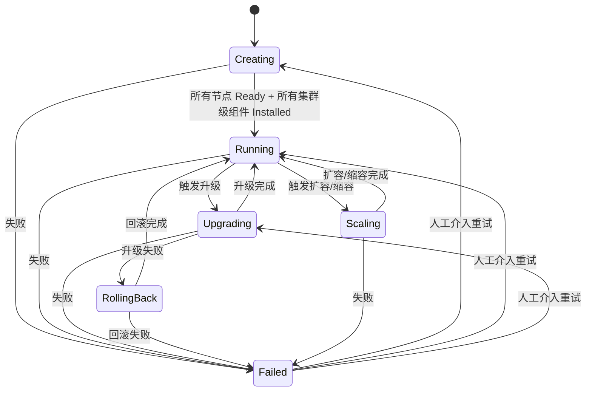
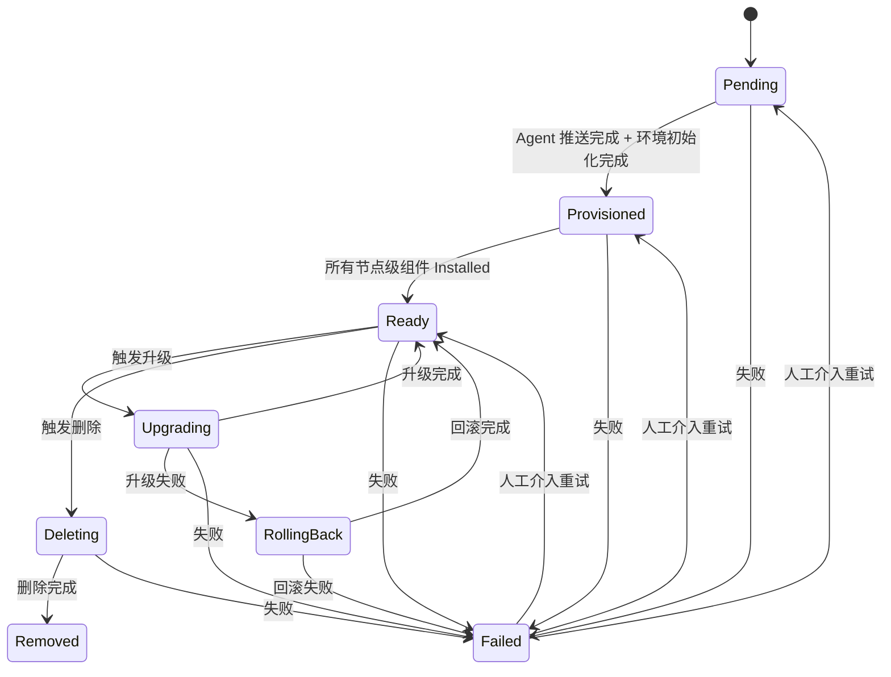
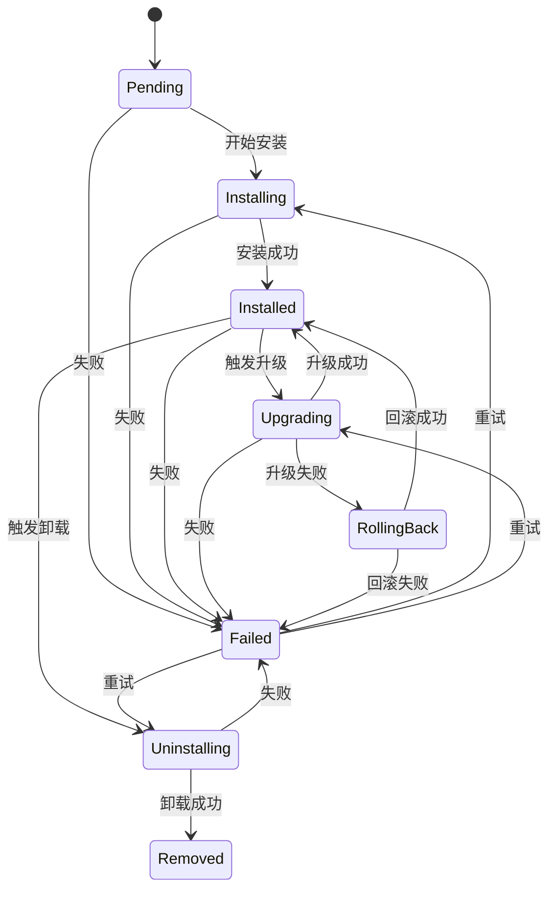
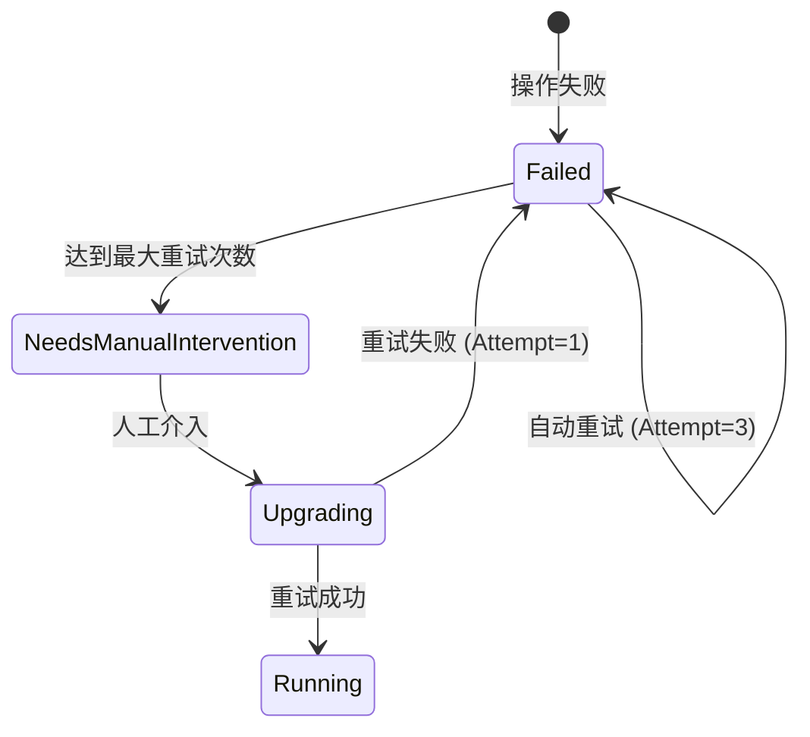
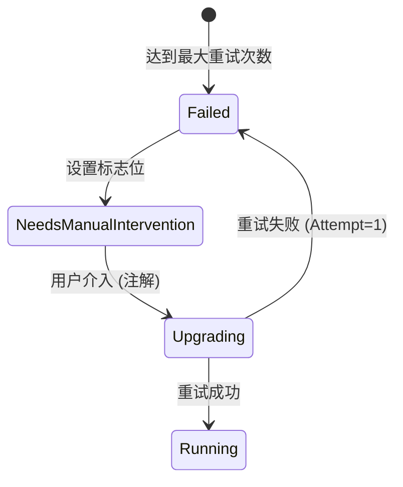
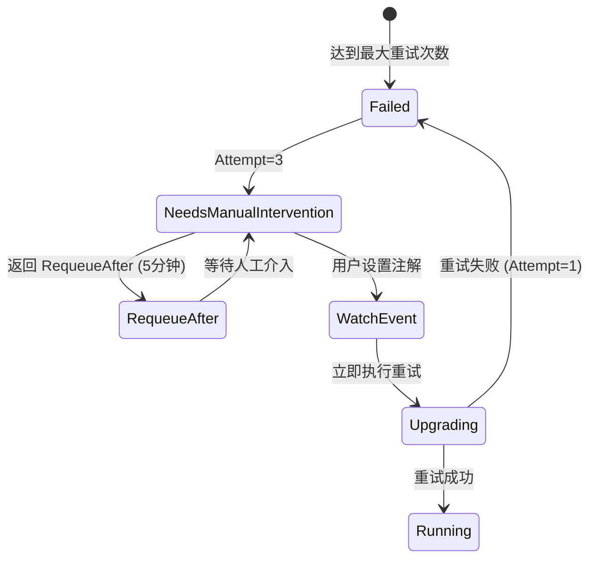
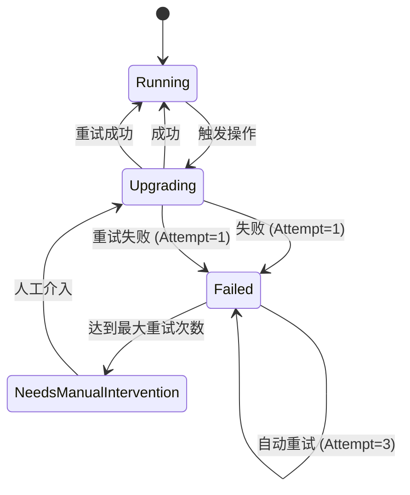

# KEP-6 状态机演进设计（v3）

> **文档说明**：本文档是 KEP-6 状态机的演进设计，基于 v2 版本的反馈进行了重构。
> - **v2 文档**：[kep6-state-machine-v2.md](./kep6-state-machine-v2.md) - 已有实现的参考
> - **v3 文档**：本文档 - 演进的设计方案

## 目录

1. [状态模型概览](#1-状态模型概览)
2. [集群层状态机：BKEClusterLifecycle](#2-集群层状态机bkeclusterlifecycle)
3. [节点层状态机：BKENodeLifecycle](#3-节点层状态机bkenodelifecycle)
4. [组件层状态机：ComponentLifecycle](#4-组件层状态机componentlifecycle)
5. [场景驱动的状态转换](#5-场景驱动的状态转换)
6. [重试与幂等性](#6-重试与幂等性)

---

## 1. 状态模型概览

### 1.1 三层状态机架构

```
┌─────────────────────────────────────────────────────────────────────────────┐
│                    集群层 (BKEClusterLifecycle)                              │
│  Creating → Running → Upgrading → Scaling → RollingBack → Failed           │
└─────────────────────────────────────────────────────────────────────────────┘
                                    │
                                    │ 聚合
                                    ▼
┌─────────────────────────────────────────────────────────────────────────────┐
│                    节点层 (BKENodeLifecycle)                                 │
│  Pending → Provisioned → Ready → Upgrading → RollingBack → Deleting        │
└─────────────────────────────────────────────────────────────────────────────┘
                                    │
                                    │ 聚合
                                    ▼
┌─────────────────────────────────────────────────────────────────────────────┐
│                    组件层 (ComponentLifecycle)                               │
│  Pending → Installing → Installed → Upgrading → RollingBack → Uninstalling │
└─────────────────────────────────────────────────────────────────────────────┘
```

### 1.2 组件类型区分

组件分为**节点级组件**和**集群级组件**两类：

| 组件类型 | 示例 | 聚合目标 | 说明 |
|---------|------|---------|------|
| **节点级组件** | containerd, bkeagent | 节点状态 | 运行在特定节点上 |
| **集群级组件** | coredns, kube-proxy | 集群状态 | 运行在集群中 |

```go
type ComponentType string

const (
    ComponentTypeNode    ComponentType = "node"    // 节点级组件
    ComponentTypeCluster ComponentType = "cluster" // 集群级组件
)
```

### 1.3 状态聚合关系

#### 1.3.1 节点级组件 → 节点状态

```
节点状态 = 聚合(所有节点级组件状态)

规则：
- 所有节点级组件 Installed → 节点 Ready
- 任意节点级组件 Upgrading → 节点 Upgrading
- 任意节点级组件 RollingBack → 节点 RollingBack
- 任意节点级组件 Failed → 节点 Failed
- 所有节点级组件 Removed → 节点 Removed
```

#### 1.3.2 节点状态 + 集群级组件 → 集群状态

```
集群状态 = 聚合(所有节点状态 + 所有集群级组件状态)

规则：
- 所有节点 Ready + 所有集群级组件 Installed → 集群 Running
- 任意节点 Upgrading 或 任意集群级组件 Upgrading → 集群 Upgrading
- 任意节点 RollingBack 或 任意集群级组件 RollingBack → 集群 RollingBack
- 任意节点 Failed 或 任意集群级组件 Failed → 集群 Failed
- 任意节点 Deleting → 集群 Scaling
- 任意节点 Pending/Provisioned → 集群 Creating
```

### 1.4 状态驱动关系

```
Reconciler (调谐器)
  │
  ├─ Watch BKECluster 变更
  │   └─ 触发集群层状态转换
  │
  ├─ Watch BKENode 变更
  │   └─ 触发节点层状态转换
  │
  ├─ Watch ComponentVersion 变更
  │   └─ 触发组件层状态转换
  │
  └─ 执行 DAG
      └─ 按依赖顺序执行组件安装/升级
```

---

## 2. 集群层状态机：BKEClusterLifecycle

### 2.1 状态定义

| 状态 | 说明 |
|------|------|
| `Creating` | 集群正在创建（节点加入、Agent 推送、组件安装） |
| `Running` | 集群正在运行（所有组件就绪，服务可用） |
| `Upgrading` | 集群正在升级（版本变更中） |
| `Scaling` | 集群正在扩容或缩容（节点增减） |
| `RollingBack` | 集群正在回滚（升级失败后恢复） |
| `Failed` | 集群失败（需要人工介入） |

**Scaling 状态设计说明**：

`Scaling` 使用单一状态同时覆盖扩容和缩容场景，而非拆分为 `ScalingUp` 和 `ScalingDown`。原因如下：

1. **节点状态自然区分方向**：
   - 扩容：新节点进入 `Pending → Provisioned → Ready` 流程
   - 缩容：节点进入 `Ready → Deleting → Removed` 流程
   - 通过节点的 `LifecyclePhase` 即可判断扩容还是缩容

2. **组件状态自然区分方向**：
   - 扩容：组件 `Pending → Installing → Installed`
   - 缩容：组件 `Installed → Uninstalling → Removed`
   - 通过组件的 `LifecyclePhase` 即可判断操作方向

3. **OperationProgress 提供精确信息**：
   - `OperationProgress.Phase` 字段可扩展为 `ScalingUp` / `ScalingDown`
   - 保持状态机简洁，同时不丢失方向信息

4. **聚合规则简化**：
   - 单一 `Scaling` 状态使聚合逻辑更简单
   - 无需在集群层区分扩容/缩容，节点和组件层已足够表达

### 2.2 状态转换规则

**正常转换**：
- `Creating → Running`：所有节点 Ready + 所有集群级组件 Installed
- `Running → Upgrading`：用户触发版本升级
- `Upgrading → Running`：升级完成，所有组件更新到目标版本
- `Running → Scaling`：触发扩容或缩容
- `Scaling → Running`：扩容或缩容完成

**失败转换**：
- `任意状态 → Failed`：关键组件失败或超时
- `Failed → Creating/Running/Upgrading`：人工介入后重试

**回滚转换**：
- `Upgrading → RollingBack`：升级失败，触发回滚
- `RollingBack → Running`：回滚完成

### 2.3 状态转换图



### 2.4 操作进度追踪

所有操作（安装、升级、扩容、缩容、回滚）的进度通过 `OperationProgress` 统一追踪：

```go
type OperationType string

const (
    OperationInstall  OperationType = "Install"
    OperationUpgrade  OperationType = "Upgrade"
    OperationScale    OperationType = "Scale"
    OperationRollback OperationType = "Rollback"
)

type OperationProgress struct {
    // 操作类型
    OperationType OperationType `json:"operationType"`
    
    // 目标版本
    TargetVersion string `json:"targetVersion,omitempty"`
    
    // 开始时间
    StartedAt *metav1.Time `json:"startedAt,omitempty"`
    
    // 完成时间
    FinishedAt *metav1.Time `json:"finishedAt,omitempty"`
    
    // 最后错误
    LastError string `json:"lastError,omitempty"`
    
    // 已完成组件列表
    Completed []ComponentRecord `json:"completed,omitempty"`
    
    // 当前操作阶段
    Phase string `json:"phase,omitempty"` // Installing/Upgrading/Scaling/RollingBack
}
```

**使用场景**：

| 场景 | OperationType | Phase |
|------|---------------|-------|
| 集群安装 | `Install` | `Installing` |
| 集群升级 | `Upgrade` | `Upgrading` |
| 集群扩容 | `Scale` | `Scaling` |
| 集群缩容 | `Scale` | `Scaling` |
| 集群回滚 | `Rollback` | `RollingBack` |

---

## 3. 节点层状态机：BKENodeLifecycle

### 3.1 状态定义

| 状态 | 说明 |
|------|------|
| `Pending` | 节点等待配置（Agent 推送） |
| `Provisioned` | 节点已配置（Agent 就绪，环境初始化完成） |
| `Ready` | 节点就绪（所有组件安装完成） |
| `Upgrading` | 节点正在升级（组件升级中） |
| `RollingBack` | 节点正在回滚（升级失败后恢复） |
| `Deleting` | 节点正在删除（组件卸载中） |
| `Removed` | 节点已删除 |
| `Failed` | 节点失败 |

### 3.2 状态转换图



### 3.3 节点状态聚合规则

节点状态由所有节点级组件状态聚合：

```go
func AggregateNodeState(nodeComponents []ComponentStatus) NodeState {
    // 所有组件 Installed → Ready
    if allInstalled(nodeComponents) {
        return NodeReady
    }
    
    // 任意组件 Upgrading → Upgrading
    if anyUpgrading(nodeComponents) {
        return NodeUpgrading
    }
    
    // 任意组件 RollingBack → RollingBack
    if anyRollingBack(nodeComponents) {
        return NodeRollingBack
    }
    
    // 任意组件 Failed → Failed
    if anyFailed(nodeComponents) {
        return NodeFailed
    }
    
    // 所有组件 Removed → Removed
    if allRemoved(nodeComponents) {
        return NodeRemoved
    }
    
    // 其他情况 → Pending/Provisioned
    return determineProvisionState(nodeComponents)
}
```

---

## 4. 组件层状态机：ComponentLifecycle

### 4.1 状态定义

| 状态 | 说明 |
|------|------|
| `Pending` | 组件等待安装 |
| `Installing` | 组件正在安装 |
| `Installed` | 组件已安装（运行中） |
| `Upgrading` | 组件正在升级 |
| `RollingBack` | 组件正在回滚（升级失败后恢复） |
| `Uninstalling` | 组件正在卸载 |
| `Removed` | 组件已卸载 |
| `Failed` | 组件安装/升级/卸载失败 |

### 4.2 组件类型区分

组件分为节点级和集群级两类：

**节点级组件**：
- 运行在特定节点上
- 聚合到节点状态
- 示例：containerd, bkeagent

**集群级组件**：
- 运行在集群中
- 聚合到集群状态
- 示例：coredns, kube-proxy

### 4.3 状态转换图



### 4.4 聚合规则

#### 4.4.1 节点级组件聚合到节点状态

```go
func AggregateNodeStateFromComponents(nodeComponents []ComponentStatus) NodeState {
    // 实现见 3.4 节
}
```

#### 4.4.2 集群级组件聚合到集群状态

```go
func AggregateClusterStateFromComponents(
    nodes []NodeState,
    clusterComponents []ComponentStatus,
) ClusterState {
    // 所有节点 Ready + 所有集群级组件 Installed → Running
    if allNodesReady(nodes) && allClusterComponentsInstalled(clusterComponents) {
        return ClusterRunning
    }
    
    // 任意节点或集群级组件 Upgrading → Upgrading
    if anyNodeUpgrading(nodes) || anyClusterComponentUpgrading(clusterComponents) {
        return ClusterUpgrading
    }
    
    // 任意节点或集群级组件 RollingBack → RollingBack
    if anyNodeRollingBack(nodes) || anyClusterComponentRollingBack(clusterComponents) {
        return ClusterRollingBack
    }
    
    // 任意节点或集群级组件 Failed → Failed
    if anyNodeFailed(nodes) || anyClusterComponentFailed(clusterComponents) {
        return ClusterFailed
    }
    
    // 任意节点 Deleting → Scaling
    if anyNodeDeleting(nodes) {
        return ClusterScaling
    }
    
    // 任意节点 Pending/Provisioned → Creating
    if anyNodePendingOrProvisioned(nodes) {
        return ClusterCreating
    }
    
    return ClusterUnknown
}
```

#### 4.4.3 集群状态同时聚合节点状态和集群级组件状态

**关键规则**：
- 集群状态 = 聚合(所有节点状态 + 所有集群级组件状态)
- 必须同时满足两个条件才能进入 Running 状态
- 任意一个失败都会导致集群失败

---

## 5. 场景驱动的状态转换

### 5.1 安装场景

**状态字段说明**：

| 字段 | 作用 | 示例值 |
|------|------|--------|
| `BKECluster.Status.Phase` | 集群生命周期阶段，反映集群整体状态 | Creating/Running/Upgrading/Scaling/RollingBack/Failed |
| `BKECluster.Status.ClusterHealthState` | 集群健康状态，反映集群的健康程度 | Healthy/Unhealthy/Degraded |

**Phase 与 ClusterHealthState 的关系**：

| 字段 | 类型 | 作用 | 聚合规则 |
|------|------|------|---------|
| `Phase` | 生命周期状态 | 反映集群当前处于什么阶段 | 由节点状态和组件状态聚合 |
| `ClusterHealthState` | 健康状态 | 反映集群的健康程度 | 基于 Phase 和其他健康指标评估 |

**聚合关系**：
- `Phase` 是基础状态，由节点状态和组件状态聚合而来
- `ClusterHealthState` 是衍生状态，基于 Phase 和其他健康指标评估
- 例如：`Phase=Running` + `ClusterHealthState=Healthy` 表示集群正在运行且健康

**依赖关系**：
- `ClusterHealthState` 依赖于 `Phase`
- 只有当 `Phase=Running` 时，`ClusterHealthState` 才有意义
- 当 `Phase=Failed` 时，`ClusterHealthState` 通常为 `Unhealthy`

**状态转换时序说明**：

| 时序 | 状态转换 | 触发条件 | 前置条件 | 结果 |
|------|---------|---------|---------|------|
| T0 | BKEClusterLifecycle: [*] → Creating | 创建 BKECluster | 无 | 集群进入创建阶段 |
| T1 | BKENodeLifecycle: [*] → Pending | 新节点加入集群 | T0 完成 | 节点等待配置 |
| T2 | ComponentLifecycle: Pending → Installing | 开始安装节点级组件 | T1 完成 | 组件开始安装 |
| T3 | ComponentLifecycle: Installing → Installed | 节点级组件安装成功 | T2 完成 | 节点进入 Provisioned 状态 |
| T4 | BKENodeLifecycle: Provisioned → Ready | 环境初始化完成 | T3 完成 | 节点就绪 |
| T5 | ComponentLifecycle: Pending → Installing | 开始安装集群级组件 | T4 完成 | 组件开始安装 |
| T6 | ComponentLifecycle: Installing → Installed | 集群级组件安装成功 | T5 完成 | 所有组件安装完成 |
| T7 | BKEClusterLifecycle: Creating → Running | 所有节点 Ready + 所有集群级组件 Installed | T6 完成 | 集群进入运行状态 |

**状态转换时序**：

```
T0: BKEClusterLifecycle = Creating
    BKECluster.Status.Phase = Creating
    OperationProgress.OperationType = Install
    OperationProgress.Phase = Installing

T1: BKENodeLifecycle = Pending (新节点加入)
    BKENode.State = Pending

T2: 节点级组件 Installing (containerd, bkeagent)
    ComponentLifecycle = Installing

T3: 节点级组件 Installed
    ComponentLifecycle = Installed
    BKENode.State = Provisioned

T4: 环境初始化完成
    BKENode.State = Ready

T5: 集群级组件 Installing (coredns, kube-proxy)
    ComponentLifecycle = Installing

T6: 集群级组件 Installed
    ComponentLifecycle = Installed

T7: BKEClusterLifecycle = Running
    所有节点 Ready + 所有集群级组件 Installed
    BKECluster.Status.Phase = Running
    BKECluster.Status.ClusterHealthState = Healthy
    OperationProgress.FinishedAt = now
```

### 5.2 升级场景

**状态转换时序说明**：

| 时序 | 状态转换 | 触发条件 | 前置条件 | 结果 |
|------|---------|---------|---------|------|
| T0 | BKEClusterLifecycle: Running → Upgrading | 用户触发版本升级 | 集群处于 Running 状态 | 集群进入升级阶段 |
| T1 | ComponentLifecycle: Installed → Upgrading | 开始升级节点级组件 | T0 完成 | 组件开始升级 |
| T2 | ComponentLifecycle: Upgrading → Installed | 节点级组件升级成功 | T1 完成 | 节点回到 Ready 状态 |
| T3 | ComponentLifecycle: Installed → Upgrading | 开始升级集群级组件 | T2 完成 | 组件开始升级 |
| T4 | ComponentLifecycle: Upgrading → Installed | 集群级组件升级成功 | T3 完成 | 所有组件升级完成 |
| T5 | BKEClusterLifecycle: Upgrading → Running | 所有节点 Ready + 所有集群级组件 Installed | T4 完成 | 集群回到运行状态 |

**状态转换时序**：

```
T0: BKEClusterLifecycle = Running → Upgrading
    BKECluster.Status.Phase = Upgrading
    OperationProgress.OperationType = Upgrade
    OperationProgress.Phase = Upgrading
    OperationProgress.StartedAt = now

T1: 节点级组件 Upgrading (containerd, bkeagent)
    ComponentLifecycle = Upgrading
    BKENode.State = Upgrading

T2: 节点级组件 Installed
    ComponentLifecycle = Installed
    BKENode.State = Ready
    OperationProgress.Completed = append(...)

T3: 集群级组件 Upgrading (coredns, kube-proxy)
    ComponentLifecycle = Upgrading

T4: 集群级组件 Installed
    ComponentLifecycle = Installed
    OperationProgress.Completed = append(...)

T5: BKEClusterLifecycle = Upgrading → Running
    所有节点 Ready + 所有集群级组件 Installed
    BKECluster.Status.Phase = Running
    OperationProgress.FinishedAt = now
```

### 5.3 回滚场景

**状态转换时序说明**：

| 时序 | 状态转换 | 触发条件 | 前置条件 | 结果 |
|------|---------|---------|---------|------|
| T0 | ComponentLifecycle: Upgrading → Failed | 升级过程中出现错误 | 升级操作进行中 | 组件进入失败状态 |
| T1 | BKEClusterLifecycle: Upgrading → RollingBack | 升级失败，触发回滚 | T0 完成 | 集群进入回滚阶段 |
| T2 | ComponentLifecycle: Failed → RollingBack | 开始回滚节点级组件 | T1 完成 | 组件开始回滚 |
| T3 | ComponentLifecycle: RollingBack → Installed | 节点级组件回滚成功 | T2 完成 | 节点回到 Ready 状态 |
| T4 | ComponentLifecycle: Installed → RollingBack | 开始回滚集群级组件 | T3 完成 | 组件开始回滚 |
| T5 | ComponentLifecycle: RollingBack → Installed | 集群级组件回滚成功 | T4 完成 | 所有组件回滚完成 |
| T6 | BKEClusterLifecycle: RollingBack → Running | 所有节点 Ready + 所有集群级组件 Installed | T5 完成 | 集群回到运行状态 |

**状态转换时序**：

```
T0: 升级失败
    ComponentLifecycle = Failed
    OperationProgress.LastError = "upgrade failed"

T1: BKEClusterLifecycle = Upgrading → RollingBack
    BKECluster.Status.Phase = RollingBack
    OperationProgress.OperationType = Rollback
    OperationProgress.Phase = RollingBack

T2: 节点级组件 RollingBack (containerd, bkeagent)
    ComponentLifecycle = RollingBack
    BKENode.State = RollingBack

T3: 节点级组件 Installed
    ComponentLifecycle = Installed
    BKENode.State = Ready

T4: 集群级组件 RollingBack (coredns, kube-proxy)
    ComponentLifecycle = RollingBack

T5: 集群级组件 Installed
    ComponentLifecycle = Installed

T6: BKEClusterLifecycle = RollingBack → Running
    所有节点 Ready + 所有集群级组件 Installed
    BKECluster.Status.Phase = Running
    OperationProgress.FinishedAt = now
```

### 5.4 扩容场景

**状态转换时序说明**：

| 时序 | 状态转换 | 触发条件 | 前置条件 | 结果 |
|------|---------|---------|---------|------|
| T0 | BKEClusterLifecycle: Running → Scaling | 用户触发扩容 | 集群处于 Running 状态 | 集群进入扩容阶段 |
| T1 | BKENodeLifecycle: [*] → Pending | 新节点加入集群 | T0 完成 | 节点等待配置 |
| T2 | ComponentLifecycle: Pending → Installing | 开始安装节点级组件 | T1 完成 | 组件开始安装 |
| T3 | ComponentLifecycle: Installing → Installed | 节点级组件安装成功 | T2 完成 | 节点就绪 |
| T4 | BKEClusterLifecycle: Scaling → Running | 所有节点 Ready + 所有集群级组件 Installed | T3 完成 | 集群回到运行状态 |

**状态转换时序**：

```
T0: BKEClusterLifecycle = Running → Scaling
    BKECluster.Status.Phase = Scaling
    OperationProgress.OperationType = Scale
    OperationProgress.Phase = Scaling

T1: 新节点加入
    BKENodeLifecycle = Pending
    BKENode.State = Pending

T2: 节点级组件 Installing (containerd, bkeagent)
    ComponentLifecycle = Installing

T3: 节点级组件 Installed
    ComponentLifecycle = Installed
    BKENode.State = Ready

T4: BKEClusterLifecycle = Scaling → Running
    所有节点 Ready + 所有集群级组件 Installed
    BKECluster.Status.Phase = Running
    OperationProgress.FinishedAt = now
```

### 5.5 缩容场景

**状态转换时序说明**：

| 时序 | 状态转换 | 触发条件 | 前置条件 | 结果 |
|------|---------|---------|---------|------|
| T0 | BKEClusterLifecycle: Running → Scaling | 用户触发缩容 | 集群处于 Running 状态 | 集群进入缩容阶段 |
| T1 | BKENodeLifecycle: Ready → Deleting | 节点标记删除 | T0 完成 | 节点开始删除 |
| T2 | ComponentLifecycle: Installed → Uninstalling | 开始卸载节点级组件 | T1 完成 | 组件开始卸载 |
| T3 | ComponentLifecycle: Uninstalling → Removed | 节点级组件卸载成功 | T2 完成 | 组件已卸载 |
| T4 | BKENodeLifecycle: Deleting → Removed | 节点删除完成 | T3 完成 | 节点已删除 |
| T5 | BKEClusterLifecycle: Scaling → Running | 所有节点 Ready + 所有集群级组件 Installed | T4 完成 | 集群回到运行状态 |

**状态转换时序**：

```
T0: BKEClusterLifecycle = Running → Scaling
    BKECluster.Status.Phase = Scaling
    OperationProgress.OperationType = Scale
    OperationProgress.Phase = Scaling

T1: 节点标记删除
    BKENodeLifecycle = Ready → Deleting
    BKENode.State = Deleting

T2: 节点级组件 Uninstalling (containerd, bkeagent)
    ComponentLifecycle = Uninstalling

T3: 节点级组件 Removed
    ComponentLifecycle = Removed

T4: BKENodeLifecycle = Deleting → Removed
    BKENode.State = Removed

T5: BKEClusterLifecycle = Scaling → Running
    所有节点 Ready + 所有集群级组件 Installed
    BKECluster.Status.Phase = Running
    OperationProgress.FinishedAt = now
```

---

## 6. 重试与幂等性

### 6.1 重试机制

#### 6.1.1 自动重试

**重试计数器存储位置**

自动重试计数器存储在 `BKECluster.Status.OperationProgress.LastFailure.Attempt` 字段中：

```go
type OperationProgress struct {
    // 操作类型
    OperationType OperationType `json:"operationType"`
    
    // 目标版本
    TargetVersion string `json:"targetVersion,omitempty"`
    
    // 开始时间
    StartedAt *metav1.Time `json:"startedAt,omitempty"`
    
    // 完成时间
    FinishedAt *metav1.Time `json:"finishedAt,omitempty"`
    
    // 最后错误
    LastError string `json:"lastError,omitempty"`
    
    // 是否需要人工介入
    NeedsManualIntervention bool `json:"needsManualIntervention,omitempty"`
    
    // 已完成组件列表
    Completed []ComponentRecord `json:"completed,omitempty"`
    
    // 最后失败记录（包含重试计数器）
    LastFailure *DeclarativeUpgradeFailureRecord `json:"lastFailure,omitempty"`
}

type DeclarativeUpgradeFailureRecord struct {
    Name     string      `json:"name"`
    Version  string      `json:"version,omitempty"`
    FailedAt metav1.Time `json:"failedAt"`
    Error    string      `json:"error,omitempty"`
    Attempt  int32       `json:"attempt,omitempty"` // ← 自动重试计数器
}
```

**Attempt 增加逻辑**

Attempt 在每次执行失败后增加 1，在 `MarkFailure` 方法中实现：

```go
// MarkFailure 更新失败记录，Attempt 增加
func (p *OperationProgress) MarkFailure(name, version, errMsg string, now metav1.Time) {
    var attempt int32 = 1
    
    // 如果是同一个组件连续失败，Attempt 增加
    if p.LastFailure != nil && p.LastFailure.Name == name {
        attempt = p.LastFailure.Attempt + 1
    }
    
    p.LastFailure = &DeclarativeUpgradeFailureRecord{
        Name:     name,
        Version:  version,
        FailedAt: now,
        Error:    errMsg,
        Attempt:  attempt,
    }
    p.LastError = errMsg
}
```

**Attempt 增加的场景**

| 场景 | Attempt 值 | 说明 |
|------|-----------|------|
| 首次执行失败 | 1 | 第一次失败 |
| 第一次自动重试失败 | 2 | 第二次失败 |
| 第二次自动重试失败 | 3 | 第三次失败（达到最大重试次数） |
| 达到最大重试次数 | 3 | 停止自动重试，等待人工介入 |
| 人工介入后重试失败 | 1 | 重置计数器 |

**自动重试处理逻辑**

```go
const maxAutoRetries = 3

func (r *Reconciler) executeDAGWithRetry(ctx context.Context, cluster *bkev1beta1.BKECluster) (ctrl.Result, error) {
    // 执行 DAG
    result, err := r.executeDAG(ctx, cluster)
    
    if err != nil {
        // 更新失败记录
        cluster.Status.OperationProgress.MarkFailure(
            componentName, version, err.Error(), metav1.Now())
        
        // 检查是否达到最大自动重试次数
        if cluster.Status.OperationProgress.LastFailure.Attempt >= maxAutoRetries {
            // 达到最大重试次数，设置人工介入标志
            cluster.Status.OperationProgress.NeedsManualIntervention = true
            r.Status().Update(ctx, cluster)
            
            // 返回 RequeueAfter，等待人工介入
            return ctrl.Result{RequeueAfter: 5 * time.Minute}, nil
        }
        
        r.Status().Update(ctx, cluster)
        
        // 指数退避
        attempt := cluster.Status.OperationProgress.LastFailure.Attempt
        backoff := calculateBackoff(attempt)
        return ctrl.Result{RequeueAfter: backoff}, nil
    }
    
    // 执行成功
    cluster.Status.OperationProgress.FinishedAt = &metav1.Time{Time: time.Now()}
    cluster.Status.Phase = "Running"
    cluster.Status.OperationProgress.LastError = ""
    cluster.Status.OperationProgress.LastFailure = nil
    
    return ctrl.Result{}, r.Status().Update(ctx, cluster)
}

// calculateBackoff 计算指数退避时间
func calculateBackoff(attempt int32) time.Duration {
    baseDelay := 5 * time.Second
    maxDelay := 5 * time.Minute
    
    backoff := time.Duration(math.Pow(2, float64(attempt-1))) * baseDelay
    if backoff > maxDelay {
        backoff = maxDelay
    }
    
    return backoff
}
```

**自动重试状态转换**



#### 6.1.2 重试触发条件

| 场景 | 触发条件 | 重试策略 |
|------|---------|---------|
| 组件安装失败 | `ComponentLifecycle = Failed` | 指数退避，最多 3 次 |
| 节点升级失败 | `BKENodeLifecycle = Failed` | 固定间隔 5 分钟，最多 5 次 |
| 集群操作失败 | `OperationProgress.LastError != ""` | 指数退避，最多 3 次 |

### 6.2 幂等性保证

```go
func (r *Reconciler) isIdempotent(ctx context.Context, cluster *confv1beta1.BKECluster) bool {
    // 检查组件是否已完成
    if cluster.Status.OperationProgress != nil {
        for _, component := range cluster.Status.OperationProgress.Completed {
            if component.Name == componentName && component.Version == version {
                // 已完成，跳过
                return true
            }
        }
    }
    
    // 检查节点组件状态
    if cluster.Status.NodeComponentStatuses != nil {
        if compStatuses, ok := cluster.Status.NodeComponentStatuses[componentName]; ok {
            if status, ok := compStatuses[nodeIP]; ok {
                if status.Phase == "Installed" && status.Version == version {
                    // 已安装到目标版本，跳过
                    return true
                }
            }
        }
    }
    
    return false
}
```

### 6.3 人工介入

#### 6.3.1 介入前诊断

**需要查看的字段**：

| 字段 | 作用 | 诊断方法 |
|------|------|---------|
| `BKECluster.Status.Phase` | 集群当前阶段 | 判断集群是否处于 Failed 状态 |
| `BKECluster.Status.OperationProgress` | 操作进度和错误信息 | 查看 LastError 和 LastFailure |
| `BKECluster.Status.NodeComponentStatuses` | 节点级组件状态 | 判断哪些组件安装失败 |
| `BKECluster.Status.ComponentStatuses` | 集群级组件状态 | 判断哪些组件安装失败 |
| `BKENode.Status.State` | 节点状态 | 判断哪些节点处于 Failed 状态 |
| `ComponentVersion.Status.Phase` | 组件状态 | 判断组件是否处于 Failed 状态 |

**诊断流程**：

1. **查看集群状态**：
   - 检查 `BKECluster.Status.Phase` 是否为 `Failed`
   - 检查 `BKECluster.Status.OperationProgress.LastError` 获取错误信息

2. **查看节点状态**：
   - 检查 `BKECluster.Status.NodeComponentStatuses` 判断哪些节点失败
   - 检查 `BKENode.Status.State` 判断节点状态

3. **查看组件状态**：
   - 检查 `BKECluster.Status.ComponentStatuses` 判断哪些组件失败
   - 检查 `ComponentVersion.Status.Phase` 判断组件状态

4. **判断介入策略**：
   - 如果是临时错误（网络超时等），清除 OperationProgress 后重试
   - 如果是配置错误，修复配置后重试
   - 如果是资源不足，增加资源后重试

#### 6.3.2 介入方式

**方式 1: 清除错误状态，触发重试**

```yaml
apiVersion: bke.bocloud.com/v1beta1
kind: BKECluster
metadata:
  name: my-cluster
status:
  operationProgress:
    operationType: Upgrade
    targetVersion: v2.6.0
    lastError: ""  # 清除错误
    lastFailure: null  # 清除失败记录
```

**方式 2: 通过注解触发立即重试**

```yaml
apiVersion: bke.bocloud.com/v1beta1
kind: BKECluster
metadata:
  name: my-cluster
  annotations:
    cvo.openfuyao.cn/retry-operation: "true"
```

> **注解命名说明**：使用 `cvo.openfuyao.cn/retry-operation` 而非 `bke.bocloud.com/retry-upgrade`，原因：
> 1. **域名一致性**：与现有 CVO 注解（`cvo.openfuyao.cn/upgrade-ready`、`cvo.openfuyao.cn/cluster-version`）保持一致
> 2. **通用性**：重试操作适用于所有操作类型（Install/Upgrade/Scale/Rollback），不应局限于 "upgrade"

#### 6.3.3 调谐器处理逻辑

**完整 Reconcile 流程**

```go
func (r *Reconciler) Reconcile(ctx context.Context, req ctrl.Request) (ctrl.Result, error) {
    cluster := &bkev1beta1.BKECluster{}
    if err := r.Get(ctx, req.NamespacedName, cluster); err != nil {
        return ctrl.Result{}, err
    }
    
    // 1. 检查是否是人工介入触发的重试（通过注解）
    if r.isManualInterventionRetry(cluster) {
        // 清除注解
        delete(cluster.Annotations, "cvo.openfuyao.cn/retry-operation")
        if err := r.Update(ctx, cluster); err != nil {
            return ctrl.Result{}, err
        }
        
        // 立即执行重试
        return r.handleManualIntervention(ctx, cluster)
    }
    
    // 2. 检查是否需要人工介入（达到最大自动重试次数）
    if r.needsManualIntervention(cluster) {
        // 设置标志位
        if !cluster.Status.OperationProgress.NeedsManualIntervention {
            cluster.Status.OperationProgress.NeedsManualIntervention = true
            r.Status().Update(ctx, cluster)
        }
        
        // 返回 RequeueAfter，等待人工介入
        return ctrl.Result{RequeueAfter: 5 * time.Minute}, nil
    }
    
    // 3. 正常执行或自动重试
    return r.executeDAGWithRetry(ctx, cluster)
}

func (r *Reconciler) isManualInterventionRetry(cluster *bkev1beta1.BKECluster) bool {
    // 检查是否有重试注解
    if annotations.Has(cluster, "cvo.openfuyao.cn/retry-operation") {
        return true
    }
    
    return false
}

func (r *Reconciler) needsManualIntervention(cluster *bkev1beta1.BKECluster) bool {
    // 检查是否达到最大自动重试次数
    if cluster.Status.OperationProgress != nil &&
       cluster.Status.OperationProgress.LastFailure != nil &&
       cluster.Status.OperationProgress.LastFailure.Attempt >= maxAutoRetries {
        return true
    }
    
    return false
}
```

**人工介入处理逻辑**

```go
func (r *Reconciler) handleManualIntervention(ctx context.Context, cluster *bkev1beta1.BKECluster) (ctrl.Result, error) {
    // 1. 状态验证
    if err := r.validateRetryState(cluster); err != nil {
        return ctrl.Result{}, err
    }
    
    // 2. 依赖检查
    if err := r.validateDependencies(ctx, cluster); err != nil {
        return ctrl.Result{}, err
    }
    
    // 3. 状态恢复
    if err := r.restoreState(ctx, cluster); err != nil {
        return ctrl.Result{}, err
    }
    
    // 4. 重试决策
    strategy := r.decideRetryStrategy(cluster)
    
    // 5. 执行重试
    var result ctrl.Result
    var err error
    
    switch strategy {
    case RetryStrategyFull:
        // 从头开始
        result, err = r.executeDAG(ctx, cluster)
    
    case RetryStrategyFromFailure:
        // 从失败点继续
        result, err = r.resumeDAG(ctx, cluster, cluster.Status.OperationProgress.LastFailure)
    }
    
    // 6. 结果处理
    if err != nil {
        // 重试失败，重置 Attempt 计数器
        cluster.Status.OperationProgress.MarkFailure(
            componentName, version, err.Error(), metav1.Now())
        r.Status().Update(ctx, cluster)
        
        return ctrl.Result{RequeueAfter: 5 * time.Minute}, nil
    }
    
    // 重试成功
    cluster.Status.OperationProgress.FinishedAt = &metav1.Time{Time: time.Now()}
    cluster.Status.Phase = "Running"
    cluster.Status.OperationProgress.LastError = ""
    cluster.Status.OperationProgress.LastFailure = nil
    cluster.Status.OperationProgress.NeedsManualIntervention = false
    
    return ctrl.Result{}, r.Status().Update(ctx, cluster)
}
```

#### 6.3.4 resumeDAG 实现

**从失败点继续执行**

```go
func (r *Reconciler) resumeDAG(
    ctx context.Context,
    cluster *bkev1beta1.BKECluster,
    lastFailure *DeclarativeUpgradeFailureRecord,
) (ctrl.Result, error) {
    // 1. 获取 DAG 定义
    dag, err := r.getDAG(ctx, cluster)
    if err != nil {
        return ctrl.Result{}, err
    }
    
    // 2. 获取已完成的组件列表
    completed := make(map[string]bool)
    for _, record := range cluster.Status.OperationProgress.Completed {
        completed[record.Name] = true
    }
    
    // 3. 构建执行计划
    executionPlan := r.buildExecutionPlan(dag, completed, lastFailure)
    
    // 4. 执行 DAG
    return r.executeExecutionPlan(ctx, cluster, executionPlan)
}

func (r *Reconciler) buildExecutionPlan(
    dag *topology.UpgradeDAG,
    completed map[string]bool,
    lastFailure *DeclarativeUpgradeFailureRecord,
) []topology.ComponentNode {
    var executionPlan []topology.ComponentNode
    
    // 遍历 DAG 的所有节点
    for _, node := range dag.Nodes {
        // 跳过已完成的组件
        if completed[node.Name] {
            continue
        }
        
        // 如果是失败的组件，标记为需要重试
        if lastFailure != nil && lastFailure.Name == node.Name {
            executionPlan = append(executionPlan, node)
            continue
        }
        
        // 检查依赖是否满足
        if r.checkDependencies(node, completed) {
            executionPlan = append(executionPlan, node)
        }
    }
    
    return executionPlan
}

func (r *Reconciler) checkDependencies(
    node topology.ComponentNode,
    completed map[string]bool,
) bool {
    for _, dep := range node.Dependencies {
        if !completed[dep] {
            return false
        }
    }
    return true
}

func (r *Reconciler) executeExecutionPlan(
    ctx context.Context,
    cluster *bkev1beta1.BKECluster,
    executionPlan []topology.ComponentNode,
) (ctrl.Result, error) {
    // 创建 DAG 调度器
    scheduler := dagexec.NewScheduler(dagexec.Config{
        Client: r.Client,
        // ... 其他配置
    })
    
    // 执行 DAG
    for _, node := range executionPlan {
        result, err := scheduler.ExecuteComponent(ctx, &node, cluster)
        if err != nil {
            return result, err
        }
        
        // 更新完成状态
        cluster.Status.OperationProgress.MarkCompleted(
            node.Name, node.Version, metav1.Now())
        
        if err := r.Status().Update(ctx, cluster); err != nil {
            return ctrl.Result{}, err
        }
    }
    
    return ctrl.Result{}, nil
}
```

#### 6.3.5 介入后重试流程



#### 6.3.6 立即触发重试机制

**为什么注解可以绕过 RequeueAfter？**

controller-runtime 的队列机制：

1. **RequeueAfter**：在指定时间后将请求加入队列
2. **Watch 事件**：立即将请求加入队列（优先级更高）

当用户修改注解时：
- 触发 Watch 事件
- controller-runtime 立即将请求加入队列
- 不受之前 RequeueAfter 的限制

**立即触发重试的完整流程**



**使用示例**

```bash
# 1. 查看集群状态
kubectl get bkecluster my-cluster -o yaml

# 2. 查看失败信息
kubectl get bkecluster my-cluster -o jsonpath='{.status.operationProgress.lastError}'

# 3. 修复问题
# ... 修复配置错误 / 增加资源 / 其他修复操作 ...

# 4. 触发立即重试
kubectl annotate bkecluster my-cluster cvo.openfuyao.cn/retry-operation=true

# 5. 查看重试结果
kubectl get bkecluster my-cluster -w
```

---

## 自动重试与人工介入对比

| 维度 | 自动重试 | 人工介入重试 |
|------|---------|-------------|
| **触发条件** | 调谐器返回 RequeueAfter | 用户设置注解 `cvo.openfuyao.cn/retry-operation` |
| **触发时机** | 立即触发（指数退避） | 用户手动触发 |
| **重试次数** | 有限次数（3 次） | 无限次数（每次都需要用户介入） |
| **状态转换** | 保持 Failed 状态 | 从 Failed 恢复到操作前状态 |
| **执行策略** | 从失败点继续 | 可以重新选择执行策略 |
| **适用场景** | 临时错误（网络超时等） | 配置错误、资源不足等需要人工修复的场景 |
| **Attempt 计数器** | 每次失败增加 1 | 重置为 1 |
| **适用操作** | Install/Upgrade/Scale/Rollback | Install/Upgrade/Scale/Rollback |

---

## 完整状态转换图



---

## 附录：状态转换矩阵

### A.1 集群层状态转换矩阵

| 当前状态 | 事件 | 新状态 | 触发者 |
|---------|------|--------|--------|
| (初始) | 创建 BKECluster | `Creating` | Reconciler |
| `Creating` | 所有节点 Ready + 所有集群级组件 Installed | `Running` | Reconciler |
| `Creating` | 失败 | `Failed` | Reconciler |
| `Running` | 触发升级 | `Upgrading` | Reconciler |
| `Running` | 触发扩容/缩容 | `Scaling` | Reconciler |
| `Upgrading` | 升级完成 | `Running` | Reconciler |
| `Upgrading` | 升级失败 | `RollingBack` | Reconciler |
| `Upgrading` | 失败 | `Failed` | Reconciler |
| `Scaling` | 扩容/缩容完成 | `Running` | Reconciler |
| `Scaling` | 失败 | `Failed` | Reconciler |
| `RollingBack` | 回滚完成 | `Running` | Reconciler |
| `RollingBack` | 失败 | `Failed` | Reconciler |
| `Failed` | 重试 | `Creating/Running/Upgrading` | 人工介入 |

### A.2 节点层状态转换矩阵

| 当前状态 | 事件 | 新状态 | 触发者 |
|---------|------|--------|--------|
| (初始) | 节点加入 | `Pending` | Reconciler |
| `Pending` | Agent 推送完成 + 环境初始化完成 | `Provisioned` | Reconciler |
| `Pending` | 失败 | `Failed` | Reconciler |
| `Provisioned` | 所有节点级组件 Installed | `Ready` | Reconciler |
| `Provisioned` | 失败 | `Failed` | Reconciler |
| `Ready` | 触发升级 | `Upgrading` | Reconciler |
| `Ready` | 触发删除 | `Deleting` | Reconciler |
| `Upgrading` | 升级完成 | `Ready` | Reconciler |
| `Upgrading` | 升级失败 | `RollingBack` | Reconciler |
| `Upgrading` | 失败 | `Failed` | Reconciler |
| `RollingBack` | 回滚完成 | `Ready` | Reconciler |
| `RollingBack` | 失败 | `Failed` | Reconciler |
| `Deleting` | 删除完成 | `Removed` | Reconciler |
| `Deleting` | 失败 | `Failed` | Reconciler |
| `Failed` | 重试 | `Pending/Provisioned/Ready` | 人工介入 |

### A.3 组件层状态转换矩阵

| 当前状态 | 事件 | 新状态 | 触发者 |
|---------|------|--------|--------|
| `Pending` | 开始安装 | `Installing` | Executor |
| `Pending` | 失败 | `Failed` | Executor |
| `Installing` | 安装成功 | `Installed` | Executor |
| `Installing` | 失败 | `Failed` | Executor |
| `Installed` | 触发升级 | `Upgrading` | Executor |
| `Installed` | 触发卸载 | `Uninstalling` | Executor |
| `Upgrading` | 升级成功 | `Installed` | Executor |
| `Upgrading` | 升级失败 | `RollingBack` | Executor |
| `Upgrading` | 失败 | `Failed` | Executor |
| `RollingBack` | 回滚成功 | `Installed` | Executor |
| `RollingBack` | 失败 | `Failed` | Executor |
| `Uninstalling` | 卸载成功 | `Removed` | Executor |
| `Uninstalling` | 失败 | `Failed` | Executor |
| `Failed` | 重试 | `Installing/Upgrading/Uninstalling` | Reconciler |

---

**文档版本**: v3.0  
**维护者**: openFuyao Team
