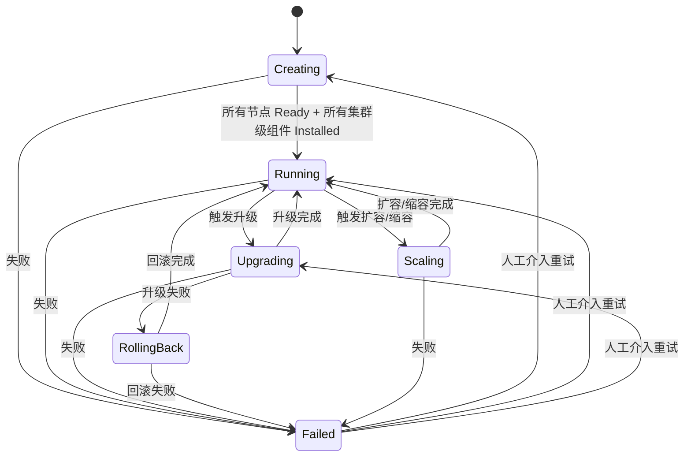
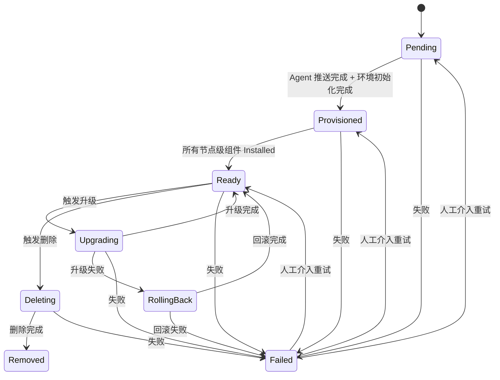
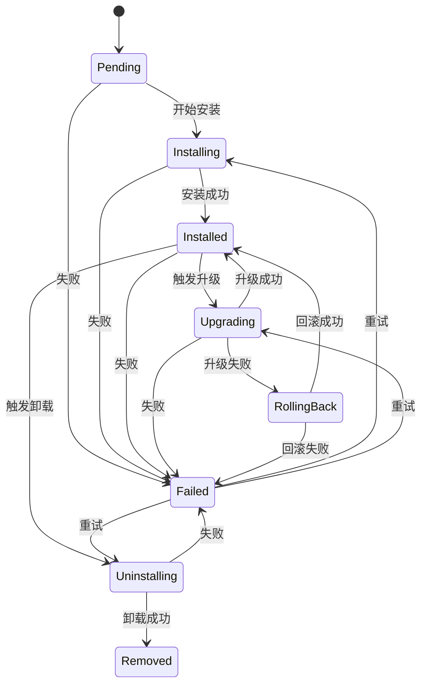

# KEP-6 状态机演进设计（v3）

> **文档说明**：本文档是 KEP-6 状态机的演进设计，基于 v2 版本的反馈进行了重构。
> - **v2 文档**：[kep6-state-machine-v2.md](./kep6-state-machine-v2.md) - 已有实现的参考
> - **v3 文档**：本文档 - 演进的设计方案

## 目录

1. [状态模型概览](#1-状态模型概览)
2. [集群层状态机：BKEClusterLifecycle](#2-集群层状态机bkeclusterlifecycle)
3. [节点层状态机：BKENodeLifecycle](#3-节点层状态机bkenodelifecycle)
4. [组件层状态机：ComponentLifecycle](#4-组件层状态机componentlifecycle)
5. [场景驱动的状态转换](#5-场景驱动的状态转换)
6. [重试与幂等性](#6-重试与幂等性)

---

## 1. 状态模型概览

### 1.1 三层状态机架构

```
┌─────────────────────────────────────────────────────────────────────────────┐
│                    集群层 (BKEClusterLifecycle)                              │
│  Creating → Running → Upgrading → Scaling → RollingBack → Failed           │
└─────────────────────────────────────────────────────────────────────────────┘
                                    │
                                    │ 聚合
                                    ▼
┌─────────────────────────────────────────────────────────────────────────────┐
│                    节点层 (BKENodeLifecycle)                                 │
│  Pending → Provisioned → Ready → Upgrading → RollingBack → Deleting        │
└─────────────────────────────────────────────────────────────────────────────┘
                                    │
                                    │ 聚合
                                    ▼
┌─────────────────────────────────────────────────────────────────────────────┐
│                    组件层 (ComponentLifecycle)                               │
│  Pending → Installing → Installed → Upgrading → RollingBack → Uninstalling │
└─────────────────────────────────────────────────────────────────────────────┘
```

### 1.2 组件类型区分

组件分为**节点级组件**和**集群级组件**两类：

| 组件类型 | 示例 | 聚合目标 | 说明 |
|---------|------|---------|------|
| **节点级组件** | containerd, bkeagent | 节点状态 | 运行在特定节点上 |
| **集群级组件** | coredns, kube-proxy | 集群状态 | 运行在集群中 |

```go
type ComponentType string

const (
    ComponentTypeNode    ComponentType = "node"    // 节点级组件
    ComponentTypeCluster ComponentType = "cluster" // 集群级组件
)
```

### 1.3 状态聚合关系

#### 1.3.1 节点级组件 → 节点状态

```
节点状态 = 聚合(所有节点级组件状态)

规则：
- 所有节点级组件 Installed → 节点 Ready
- 任意节点级组件 Upgrading → 节点 Upgrading
- 任意节点级组件 RollingBack → 节点 RollingBack
- 任意节点级组件 Failed → 节点 Failed
- 所有节点级组件 Removed → 节点 Removed
```

#### 1.3.2 节点状态 + 集群级组件 → 集群状态

```
集群状态 = 聚合(所有节点状态 + 所有集群级组件状态)

规则：
- 所有节点 Ready + 所有集群级组件 Installed → 集群 Running
- 任意节点 Upgrading 或 任意集群级组件 Upgrading → 集群 Upgrading
- 任意节点 RollingBack 或 任意集群级组件 RollingBack → 集群 RollingBack
- 任意节点 Failed 或 任意集群级组件 Failed → 集群 Failed
- 任意节点 Deleting → 集群 Scaling
- 任意节点 Pending/Provisioned → 集群 Creating
```

### 1.4 状态驱动关系

```
Reconciler (调谐器)
  │
  ├─ Watch BKECluster 变更
  │   └─ 触发集群层状态转换
  │
  ├─ Watch BKENode 变更
  │   └─ 触发节点层状态转换
  │
  ├─ Watch ComponentVersion 变更
  │   └─ 触发组件层状态转换
  │
  └─ 执行 DAG
      └─ 按依赖顺序执行组件安装/升级
```

---

## 2. 集群层状态机：BKEClusterLifecycle

### 2.1 状态定义

| 状态 | 说明 |
|------|------|
| `Creating` | 集群正在创建（节点加入、Agent 推送、组件安装） |
| `Running` | 集群正在运行（所有组件就绪，服务可用） |
| `Upgrading` | 集群正在升级（版本变更中） |
| `Scaling` | 集群正在扩容或缩容（节点增减） |
| `RollingBack` | 集群正在回滚（升级失败后恢复） |
| `Failed` | 集群失败（需要人工介入） |

### 2.2 状态转换规则

**正常转换**：
- `Creating → Running`：所有节点 Ready + 所有集群级组件 Installed
- `Running → Upgrading`：用户触发版本升级
- `Upgrading → Running`：升级完成，所有组件更新到目标版本
- `Running → Scaling`：触发扩容或缩容
- `Scaling → Running`：扩容或缩容完成

**失败转换**：
- `任意状态 → Failed`：关键组件失败或超时
- `Failed → Creating/Running/Upgrading`：人工介入后重试

**回滚转换**：
- `Upgrading → RollingBack`：升级失败，触发回滚
- `RollingBack → Running`：回滚完成

### 2.3 状态转换图



### 2.4 操作进度追踪

所有操作（安装、升级、扩容、缩容、回滚）的进度通过 `OperationProgress` 统一追踪：

```go
type OperationType string

const (
    OperationInstall  OperationType = "Install"
    OperationUpgrade  OperationType = "Upgrade"
    OperationScale    OperationType = "Scale"
    OperationRollback OperationType = "Rollback"
)

type OperationProgress struct {
    // 操作类型
    OperationType OperationType `json:"operationType"`
    
    // 目标版本
    TargetVersion string `json:"targetVersion,omitempty"`
    
    // 开始时间
    StartedAt *metav1.Time `json:"startedAt,omitempty"`
    
    // 完成时间
    FinishedAt *metav1.Time `json:"finishedAt,omitempty"`
    
    // 最后错误
    LastError string `json:"lastError,omitempty"`
    
    // 已完成组件列表
    Completed []ComponentRecord `json:"completed,omitempty"`
    
    // 当前操作阶段
    Phase string `json:"phase,omitempty"` // Installing/Upgrading/Scaling/RollingBack
}
```

**使用场景**：

| 场景 | OperationType | Phase |
|------|---------------|-------|
| 集群安装 | `Install` | `Installing` |
| 集群升级 | `Upgrade` | `Upgrading` |
| 集群扩容 | `Scale` | `Scaling` |
| 集群缩容 | `Scale` | `Scaling` |
| 集群回滚 | `Rollback` | `RollingBack` |

---

## 3. 节点层状态机：BKENodeLifecycle

### 3.1 状态定义

| 状态 | 说明 |
|------|------|
| `Pending` | 节点等待配置（Agent 推送） |
| `Provisioned` | 节点已配置（Agent 就绪，环境初始化完成） |
| `Ready` | 节点就绪（所有组件安装完成） |
| `Upgrading` | 节点正在升级（组件升级中） |
| `RollingBack` | 节点正在回滚（升级失败后恢复） |
| `Deleting` | 节点正在删除（组件卸载中） |
| `Removed` | 节点已删除 |
| `Failed` | 节点失败 |

### 3.2 状态转换图



### 3.3 节点状态聚合规则

节点状态由所有节点级组件状态聚合：

```go
func AggregateNodeState(nodeComponents []ComponentStatus) NodeState {
    // 所有组件 Installed → Ready
    if allInstalled(nodeComponents) {
        return NodeReady
    }
    
    // 任意组件 Upgrading → Upgrading
    if anyUpgrading(nodeComponents) {
        return NodeUpgrading
    }
    
    // 任意组件 RollingBack → RollingBack
    if anyRollingBack(nodeComponents) {
        return NodeRollingBack
    }
    
    // 任意组件 Failed → Failed
    if anyFailed(nodeComponents) {
        return NodeFailed
    }
    
    // 所有组件 Removed → Removed
    if allRemoved(nodeComponents) {
        return NodeRemoved
    }
    
    // 其他情况 → Pending/Provisioned
    return determineProvisionState(nodeComponents)
}
```

---

## 4. 组件层状态机：ComponentLifecycle

### 4.1 状态定义

| 状态 | 说明 |
|------|------|
| `Pending` | 组件等待安装 |
| `Installing` | 组件正在安装 |
| `Installed` | 组件已安装（运行中） |
| `Upgrading` | 组件正在升级 |
| `RollingBack` | 组件正在回滚（升级失败后恢复） |
| `Uninstalling` | 组件正在卸载 |
| `Removed` | 组件已卸载 |
| `Failed` | 组件安装/升级/卸载失败 |

### 4.2 组件类型区分

组件分为节点级和集群级两类：

**节点级组件**：
- 运行在特定节点上
- 聚合到节点状态
- 示例：containerd, bkeagent

**集群级组件**：
- 运行在集群中
- 聚合到集群状态
- 示例：coredns, kube-proxy

### 4.3 状态转换图



### 4.4 聚合规则

#### 4.4.1 节点级组件聚合到节点状态

```go
func AggregateNodeStateFromComponents(nodeComponents []ComponentStatus) NodeState {
    // 实现见 3.4 节
}
```

#### 4.4.2 集群级组件聚合到集群状态

```go
func AggregateClusterStateFromComponents(
    nodes []NodeState,
    clusterComponents []ComponentStatus,
) ClusterState {
    // 所有节点 Ready + 所有集群级组件 Installed → Running
    if allNodesReady(nodes) && allClusterComponentsInstalled(clusterComponents) {
        return ClusterRunning
    }
    
    // 任意节点或集群级组件 Upgrading → Upgrading
    if anyNodeUpgrading(nodes) || anyClusterComponentUpgrading(clusterComponents) {
        return ClusterUpgrading
    }
    
    // 任意节点或集群级组件 RollingBack → RollingBack
    if anyNodeRollingBack(nodes) || anyClusterComponentRollingBack(clusterComponents) {
        return ClusterRollingBack
    }
    
    // 任意节点或集群级组件 Failed → Failed
    if anyNodeFailed(nodes) || anyClusterComponentFailed(clusterComponents) {
        return ClusterFailed
    }
    
    // 任意节点 Deleting → Scaling
    if anyNodeDeleting(nodes) {
        return ClusterScaling
    }
    
    // 任意节点 Pending/Provisioned → Creating
    if anyNodePendingOrProvisioned(nodes) {
        return ClusterCreating
    }
    
    return ClusterUnknown
}
```

#### 4.4.3 集群状态同时聚合节点状态和集群级组件状态

**关键规则**：
- 集群状态 = 聚合(所有节点状态 + 所有集群级组件状态)
- 必须同时满足两个条件才能进入 Running 状态
- 任意一个失败都会导致集群失败

---

## 5. 场景驱动的状态转换

### 5.1 安装场景

**状态字段说明**：

| 字段 | 作用 | 示例值 |
|------|------|--------|
| `BKECluster.Status.Phase` | 集群生命周期阶段，反映集群整体状态 | Creating/Running/Upgrading/Scaling/RollingBack/Failed |
| `BKECluster.Status.ClusterHealthState` | 集群健康状态，反映集群的健康程度 | Healthy/Unhealthy/Degraded |

**状态转换时序**：

```
T0: BKEClusterLifecycle = Creating
    BKECluster.Status.Phase = Creating
    OperationProgress.OperationType = Install
    OperationProgress.Phase = Installing

T1: BKENodeLifecycle = Pending (新节点加入)
    BKENode.State = Pending

T2: 节点级组件 Installing (containerd, bkeagent)
    ComponentLifecycle = Installing

T3: 节点级组件 Installed
    ComponentLifecycle = Installed
    BKENode.State = Provisioned

T4: 环境初始化完成
    BKENode.State = Ready

T5: 集群级组件 Installing (coredns, kube-proxy)
    ComponentLifecycle = Installing

T6: 集群级组件 Installed
    ComponentLifecycle = Installed

T7: BKEClusterLifecycle = Running
    所有节点 Ready + 所有集群级组件 Installed
    BKECluster.Status.Phase = Running
    BKECluster.Status.ClusterHealthState = Healthy
    OperationProgress.FinishedAt = now
```

### 5.2 升级场景

```
T0: BKEClusterLifecycle = Running → Upgrading
    BKECluster.Status.Phase = Upgrading
    OperationProgress.OperationType = Upgrade
    OperationProgress.Phase = Upgrading
    OperationProgress.StartedAt = now

T1: 节点级组件 Upgrading (containerd, bkeagent)
    ComponentLifecycle = Upgrading
    BKENode.State = Upgrading

T2: 节点级组件 Installed
    ComponentLifecycle = Installed
    BKENode.State = Ready
    OperationProgress.Completed = append(...)

T3: 集群级组件 Upgrading (coredns, kube-proxy)
    ComponentLifecycle = Upgrading

T4: 集群级组件 Installed
    ComponentLifecycle = Installed
    OperationProgress.Completed = append(...)

T5: BKEClusterLifecycle = Upgrading → Running
    所有节点 Ready + 所有集群级组件 Installed
    BKECluster.Status.Phase = Running
    OperationProgress.FinishedAt = now
```

### 5.3 回滚场景

```
T0: 升级失败
    ComponentLifecycle = Failed
    OperationProgress.LastError = "upgrade failed"

T1: BKEClusterLifecycle = Upgrading → RollingBack
    BKECluster.Status.Phase = RollingBack
    OperationProgress.OperationType = Rollback
    OperationProgress.Phase = RollingBack

T2: 节点级组件 RollingBack (containerd, bkeagent)
    ComponentLifecycle = RollingBack
    BKENode.State = RollingBack

T3: 节点级组件 Installed
    ComponentLifecycle = Installed
    BKENode.State = Ready

T4: 集群级组件 RollingBack (coredns, kube-proxy)
    ComponentLifecycle = RollingBack

T5: 集群级组件 Installed
    ComponentLifecycle = Installed

T6: BKEClusterLifecycle = RollingBack → Running
    所有节点 Ready + 所有集群级组件 Installed
    BKECluster.Status.Phase = Running
    OperationProgress.FinishedAt = now
```

### 5.4 扩容场景

```
T0: BKEClusterLifecycle = Running → Scaling
    BKECluster.Status.Phase = Scaling
    OperationProgress.OperationType = Scale
    OperationProgress.Phase = Scaling

T1: 新节点加入
    BKENodeLifecycle = Pending
    BKENode.State = Pending

T2: 节点级组件 Installing (containerd, bkeagent)
    ComponentLifecycle = Installing

T3: 节点级组件 Installed
    ComponentLifecycle = Installed
    BKENode.State = Ready

T4: BKEClusterLifecycle = Scaling → Running
    所有节点 Ready + 所有集群级组件 Installed
    BKECluster.Status.Phase = Running
    OperationProgress.FinishedAt = now
```

### 5.5 缩容场景

```
T0: BKEClusterLifecycle = Running → Scaling
    BKECluster.Status.Phase = Scaling
    OperationProgress.OperationType = Scale
    OperationProgress.Phase = Scaling

T1: 节点标记删除
    BKENodeLifecycle = Ready → Deleting
    BKENode.State = Deleting

T2: 节点级组件 Uninstalling (containerd, bkeagent)
    ComponentLifecycle = Uninstalling

T3: 节点级组件 Removed
    ComponentLifecycle = Removed

T4: BKENodeLifecycle = Deleting → Removed
    BKENode.State = Removed

T5: BKEClusterLifecycle = Scaling → Running
    所有节点 Ready + 所有集群级组件 Installed
    BKECluster.Status.Phase = Running
    OperationProgress.FinishedAt = now
```

---

## 6. 重试与幂等性

### 6.1 重试机制

#### 6.1.1 自动重试

```go
type RetryConfig struct {
    MaxRetries     int           // 最大重试次数
    BackoffDelay   time.Duration // 重试间隔
    BackoffFactor  float64       // 退避因子
    MaxBackoff     time.Duration // 最大退避时间
}

func (r *Reconciler) reconcileWithRetry(ctx context.Context, req ctrl.Request) (ctrl.Result, error) {
    cluster := &confv1beta1.BKECluster{}
    if err := r.Get(ctx, req.NamespacedName, cluster); err != nil {
        return ctrl.Result{}, err
    }
    
    // 检查是否需要重试
    if cluster.Status.OperationProgress != nil && 
       cluster.Status.OperationProgress.LastError != "" {
        // 已失败，检查重试次数
        if cluster.Status.OperationProgress.LastFailure != nil &&
           cluster.Status.OperationProgress.LastFailure.Attempt >= maxRetries {
            // 达到最大重试次数，等待人工介入
            return ctrl.Result{RequeueAfter: 5 * time.Minute}, nil
        }
        
        // 执行重试
        result, err := r.executeDAG(ctx, cluster)
        if err != nil {
            // 更新失败记录
            cluster.Status.OperationProgress.MarkFailure(
                componentName, version, err.Error(), metav1.Now())
            r.Status().Update(ctx, cluster)
            
            // 指数退避
            backoff := calculateBackoff(attempt)
            return ctrl.Result{RequeueAfter: backoff}, nil
        }
        
        return result, nil
    }
    
    // 首次执行
    return r.executeDAG(ctx, cluster)
}
```

#### 6.1.2 重试触发条件

| 场景 | 触发条件 | 重试策略 |
|------|---------|---------|
| 组件安装失败 | `ComponentLifecycle = Failed` | 指数退避，最多 3 次 |
| 节点升级失败 | `BKENodeLifecycle = Failed` | 固定间隔 5 分钟，最多 5 次 |
| 集群操作失败 | `OperationProgress.LastError != ""` | 指数退避，最多 3 次 |

### 6.2 幂等性保证

```go
func (r *Reconciler) isIdempotent(ctx context.Context, cluster *confv1beta1.BKECluster) bool {
    // 检查组件是否已完成
    if cluster.Status.OperationProgress != nil {
        for _, component := range cluster.Status.OperationProgress.Completed {
            if component.Name == componentName && component.Version == version {
                // 已完成，跳过
                return true
            }
        }
    }
    
    // 检查节点组件状态
    if cluster.Status.NodeComponentStatuses != nil {
        if compStatuses, ok := cluster.Status.NodeComponentStatuses[componentName]; ok {
            if status, ok := compStatuses[nodeIP]; ok {
                if status.Phase == "Installed" && status.Version == version {
                    // 已安装到目标版本，跳过
                    return true
                }
            }
        }
    }
    
    return false
}
```

### 6.3 人工介入

#### 6.3.1 介入方式

```yaml
# 方式 1: 清除错误状态，触发重试
apiVersion: bke.bocloud.com/v1beta1
kind: BKECluster
metadata:
  name: my-cluster
status:
  operationProgress:
    operationType: Upgrade
    targetVersion: v2.6.0
    lastError: ""  # 清除错误
    lastFailure: null  # 清除失败记录
```

```yaml
# 方式 2: 通过注解触发重试
apiVersion: bke.bocloud.com/v1beta1
kind: BKECluster
metadata:
  name: my-cluster
  annotations:
    bke.bocloud.com/retry-upgrade: "true"
```

#### 6.3.2 介入后重试流程

```
T0: 人工介入
    清除 OperationProgress.LastError
    清除 OperationProgress.LastFailure

T1: Reconciler 检测到状态变更
    检查 OperationProgress.TargetVersion
    检查 OperationProgress.Completed

T2: 重新执行 DAG
    跳过已完成的组件
    从失败的组件继续执行

T3: 操作完成
    OperationProgress.FinishedAt = now
    BKEClusterLifecycle = Running
```

---

## 附录：状态转换矩阵

### A.1 集群层状态转换矩阵

| 当前状态 | 事件 | 新状态 | 触发者 |
|---------|------|--------|--------|
| (初始) | 创建 BKECluster | `Creating` | Reconciler |
| `Creating` | 所有节点 Ready + 所有集群级组件 Installed | `Running` | Reconciler |
| `Creating` | 失败 | `Failed` | Reconciler |
| `Running` | 触发升级 | `Upgrading` | Reconciler |
| `Running` | 触发扩容/缩容 | `Scaling` | Reconciler |
| `Upgrading` | 升级完成 | `Running` | Reconciler |
| `Upgrading` | 升级失败 | `RollingBack` | Reconciler |
| `Upgrading` | 失败 | `Failed` | Reconciler |
| `Scaling` | 扩容/缩容完成 | `Running` | Reconciler |
| `Scaling` | 失败 | `Failed` | Reconciler |
| `RollingBack` | 回滚完成 | `Running` | Reconciler |
| `RollingBack` | 失败 | `Failed` | Reconciler |
| `Failed` | 重试 | `Creating/Running/Upgrading` | 人工介入 |

### A.2 节点层状态转换矩阵

| 当前状态 | 事件 | 新状态 | 触发者 |
|---------|------|--------|--------|
| (初始) | 节点加入 | `Pending` | Reconciler |
| `Pending` | Agent 推送完成 + 环境初始化完成 | `Provisioned` | Reconciler |
| `Pending` | 失败 | `Failed` | Reconciler |
| `Provisioned` | 所有节点级组件 Installed | `Ready` | Reconciler |
| `Provisioned` | 失败 | `Failed` | Reconciler |
| `Ready` | 触发升级 | `Upgrading` | Reconciler |
| `Ready` | 触发删除 | `Deleting` | Reconciler |
| `Upgrading` | 升级完成 | `Ready` | Reconciler |
| `Upgrading` | 升级失败 | `RollingBack` | Reconciler |
| `Upgrading` | 失败 | `Failed` | Reconciler |
| `RollingBack` | 回滚完成 | `Ready` | Reconciler |
| `RollingBack` | 失败 | `Failed` | Reconciler |
| `Deleting` | 删除完成 | `Removed` | Reconciler |
| `Deleting` | 失败 | `Failed` | Reconciler |
| `Failed` | 重试 | `Pending/Provisioned/Ready` | 人工介入 |

### A.3 组件层状态转换矩阵

| 当前状态 | 事件 | 新状态 | 触发者 |
|---------|------|--------|--------|
| `Pending` | 开始安装 | `Installing` | Executor |
| `Pending` | 失败 | `Failed` | Executor |
| `Installing` | 安装成功 | `Installed` | Executor |
| `Installing` | 失败 | `Failed` | Executor |
| `Installed` | 触发升级 | `Upgrading` | Executor |
| `Installed` | 触发卸载 | `Uninstalling` | Executor |
| `Upgrading` | 升级成功 | `Installed` | Executor |
| `Upgrading` | 升级失败 | `RollingBack` | Executor |
| `Upgrading` | 失败 | `Failed` | Executor |
| `RollingBack` | 回滚成功 | `Installed` | Executor |
| `RollingBack` | 失败 | `Failed` | Executor |
| `Uninstalling` | 卸载成功 | `Removed` | Executor |
| `Uninstalling` | 失败 | `Failed` | Executor |
| `Failed` | 重试 | `Installing/Upgrading/Uninstalling` | Reconciler |

---

**文档版本**: v3.0  
**维护者**: openFuyao Team
