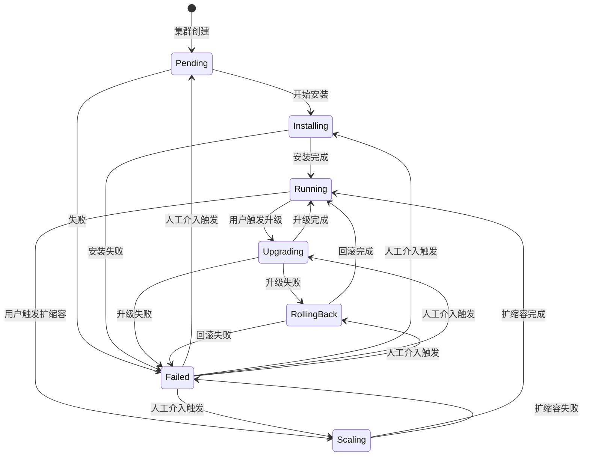
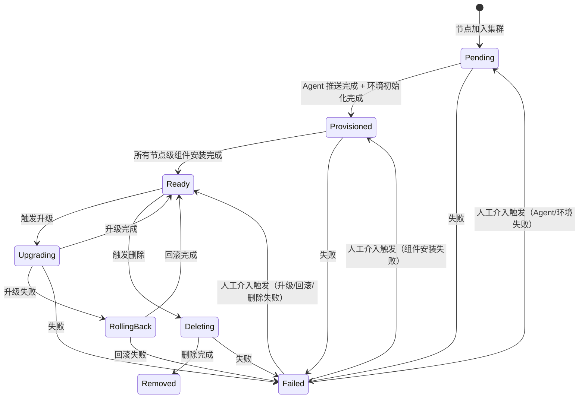
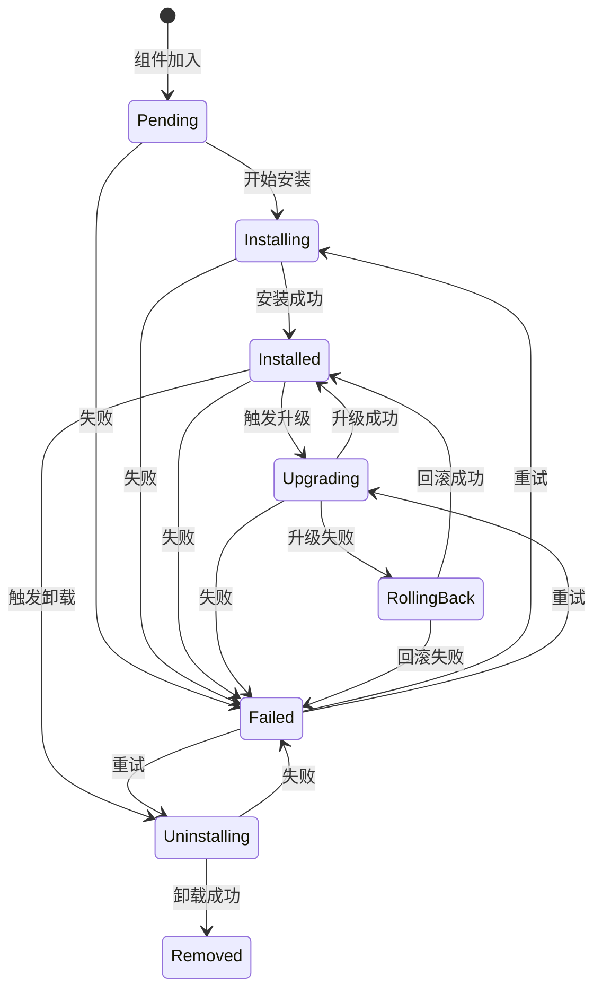

# KEP-6 状态机演进设计（v3 - 混合模型）

> **文档说明**：本文档是 KEP-6 状态机的演进设计，采用**混合模型**（驱动模型 + 聚合模型）。
> - **v2 文档**：[kep6-state-machine-v2.md](./kep6-state-machine-v2.md) - 已有实现的参考
> - **v3 文档**：本文档 - 混合模型设计方案

## 目录

1. [状态模型概览](#1-状态模型概览)
   - [1.1 混合模型架构](#11-混合模型架构)
   - [1.2 驱动模型](#12-驱动模型)
   - [1.3 聚合模型](#13-聚合模型)
   - [1.4 组件类型区分](#14-组件类型区分)
2. [集群层状态机：BKEClusterLifecycle](#2-集群层状态机bkeclusterlifecycle)
   - [2.1 状态定义](#21-状态定义)
   - [2.2 驱动规则](#22-驱动规则)
   - [2.3 状态转换图](#23-状态转换图)
   - [2.4 操作进度追踪](#24-操作进度追踪)
3. [节点层状态机：BKENodeLifecycle](#3-节点层状态机bkenodelifecycle)
   - [3.1 状态定义](#31-状态定义)
   - [3.2 驱动规则](#32-驱动规则)
   - [3.3 状态转换图](#33-状态转换图)
4. [组件层状态机：ComponentLifecycle](#4-组件层状态机componentlifecycle)
   - [4.1 状态定义](#41-状态定义)
   - [4.2 驱动规则](#42-驱动规则)
   - [4.3 状态转换图](#43-状态转换图)
5. [健康状态聚合](#5-健康状态聚合)
   - [5.1 健康状态定义](#51-健康状态定义)
   - [5.2 聚合规则](#52-聚合规则)
   - [5.3 健康检查机制](#53-健康检查机制)
6. [场景驱动的状态转换](#6-场景驱动的状态转换)
   - [6.1 安装场景](#61-安装场景)
   - [6.2 升级场景](#62-升级场景)
   - [6.3 回滚场景](#63-回滚场景)
   - [6.4 扩容场景](#64-扩容场景)
   - [6.5 缩容场景](#65-缩容场景)
7. [重试与幂等性](#7-重试与幂等性)
8. [详细设计](#8-详细设计)
   - [8.1 兼容性分析](#81-兼容性分析)
   - [8.2 API 类型扩展设计](#82-api-类型扩展设计)
   - [8.3 状态机引擎设计](#83-状态机引擎设计)
   - [8.4 健康状态聚合器设计](#84-健康状态聚合器设计)
   - [8.5 兼容性映射设计](#85-兼容性映射设计)
   - [8.6 与现有系统集成设计](#86-与现有系统集成设计)
   - [8.7 人工介入详细设计](#87-人工介入详细设计)
   - [8.8 Feature Gate 设计](#88-feature-gate-设计)
   - [8.9 迁移策略](#89-迁移策略)
   - [8.10 实现文件清单](#810-实现文件清单)
   - [8.11 测试设计](#811-测试设计)

---

## 1. 状态模型概览

### 1.1 混合模型架构

v3 采用**混合模型**，将状态管理分为两个独立的模型：

```
┌─────────────────────────────────────────────────────────────────────────────┐
│                         混合模型架构                                         │
├─────────────────────────────────────────────────────────────────────────────┤
│                                                                              │
│  ┌─────────────────────────────────────────────────────────────────────┐   │
│  │                    驱动模型（自上而下）                               │   │
│  │                                                                     │   │
│  │  用户操作 → 集群状态 → 节点状态 → 组件状态                           │   │
│  │                                                                     │   │
│  │  决定：LifecyclePhase（生命周期阶段）                                │   │
│  │  - Pending, Installing, Running, Upgrading, Scaling, RollingBack, Failed │   │
│  └─────────────────────────────────────────────────────────────────────┘   │
│                                                                              │
│  ┌─────────────────────────────────────────────────────────────────────┐   │
│  │                    聚合模型（自底向上）                               │   │
│  │                                                                     │   │
│  │  组件状态 → 节点状态 → 集群状态                                      │   │
│  │                                                                     │   │
│  │  决定：HealthStatus（健康状态）                                      │   │
│  │  - Healthy, Degraded, Unhealthy, Unknown                           │   │
│  └─────────────────────────────────────────────────────────────────────┘   │
│                                                                              │
└─────────────────────────────────────────────────────────────────────────────┘
```

**核心原则**：
- **驱动模型**：决定集群"正在做什么"（生命周期阶段）
- **聚合模型**：决定集群"健康状况如何"（健康状态）
- **两个模型各司其职，互不干扰**

### 1.2 驱动模型

驱动模型采用**自上而下**的方式，由用户操作驱动状态转换：

```
用户操作（自上而下）：
  用户触发升级 → 集群进入 Upgrading → 节点逐个升级 → 组件逐个升级

状态转换规则：
  集群 LifecyclePhase = 由 OperationProgress 决定
  节点 LifecyclePhase = 由节点操作决定
  组件 LifecyclePhase = 由组件操作决定
```

**优势**：
- ✅ 因果关系清晰：用户操作是原因，状态转换是结果
- ✅ 状态转换规则简单：直接由操作类型决定
- ✅ 进度追踪容易：通过 OperationProgress 追踪操作进度
- ✅ 故障诊断容易：快速定位失败的组件

### 1.3 聚合模型

聚合模型采用**自底向上**的方式，由下层状态聚合出上层健康状态：

```
健康状态聚合（自底向上）：
  组件健康状态 → 节点健康状态 → 集群健康状态

聚合规则：
  集群 HealthStatus = 聚合(所有节点健康状态 + 所有集群级组件健康状态)
  节点 HealthStatus = 聚合(所有节点级组件健康状态)
```

**优势**：
- ✅ 健康状态准确：基于实际组件状态
- ✅ 故障检测及时：快速发现不健康的组件
- ✅ 健康检查灵活：可以自定义健康检查规则

### 1.4 组件类型区分

组件分为**节点级组件**和**集群级组件**两类：

| 组件类型 | 示例 | 聚合目标 | 说明 |
|---------|------|---------|------|
| **节点级组件** | containerd, bkeagent | 节点健康状态 | 运行在特定节点上 |
| **集群级组件** | coredns, kube-proxy | 集群健康状态 | 运行在集群中 |

```go
type ComponentType string

const (
    ComponentTypeNode    ComponentType = "node"    // 节点级组件
    ComponentTypeCluster ComponentType = "cluster" // 集群级组件
)
```

---

## 2. 集群层状态机：BKEClusterLifecycle

### 2.1 状态定义

| 状态 | 说明 | 驱动来源 |
|------|------|---------|
| `Pending` | 集群等待安装 | 集群创建 |
| `Installing` | 集群正在安装（节点加入、Agent 推送、组件安装） | 开始安装 |
| `Running` | 集群正在运行（所有组件就绪，服务可用） | 安装完成 |
| `Upgrading` | 集群正在升级（版本变更中） | 用户触发升级 |
| `Scaling` | 集群正在扩容或缩容（节点增减） | 用户触发扩缩容 |
| `RollingBack` | 集群正在回滚（升级失败后恢复） | 升级失败自动触发 |
| `Failed` | 集群失败（需要人工介入） | 操作失败 |

### 2.2 驱动规则

集群层状态由**驱动模型**决定，基于 `OperationProgress` 字段：

```go
// determineLifecyclePhase 由驱动模型决定集群生命周期阶段
func (r *Reconciler) determineLifecyclePhase(cluster *BKECluster) LifecyclePhase {
    // 检查是否有进行中的操作
    if cluster.Status.OperationProgress != nil && 
       cluster.Status.OperationProgress.FinishedAt == nil {
        switch cluster.Status.OperationProgress.OperationType {
        case OperationTypeInstall:
            return ClusterLifecycleInstalling
        case OperationTypeUpgrade:
            return ClusterLifecycleUpgrading
        case OperationTypeScale:
            return ClusterLifecycleScaling
        case OperationTypeRollback:
            return ClusterLifecycleRollingBack
        }
    }
    
    // 检查是否失败
    if cluster.Status.OperationProgress != nil &&
       cluster.Status.OperationProgress.LastFailure != nil {
        return ClusterLifecycleFailed
    }
    
    // 检查是否已安装
    if allComponentsInstalled(cluster) {
        return ClusterLifecycleRunning
    }
    
    // 默认等待状态
    return ClusterLifecyclePending
}
```

**驱动规则说明**：
- `Pending`：当集群刚创建且未开始安装时
- `Installing`：当 `OperationProgress.OperationType = Install` 且未完成时
- `Running`：当所有组件已安装且没有进行中的操作时
- `Upgrading`：当 `OperationProgress.OperationType = Upgrade` 且未完成时
- `Scaling`：当 `OperationProgress.OperationType = Scale` 且未完成时
- `RollingBack`：当 `OperationProgress.OperationType = Rollback` 且未完成时
- `Failed`：当 `OperationProgress.LastFailure != nil` 时

**恢复决策逻辑**：

当集群处于 `Failed` 状态时，系统通过以下逻辑决定恢复到哪个状态：

1. 读取 `OperationProgress.OperationType`，获取失败的操作类型
2. 根据操作类型映射到对应的生命周期阶段
3. 自动恢复到对应的状态，无需用户手动指定

```go
// determineRecoveryPhase 决定从 Failed 恢复到哪个状态
func (r *Reconciler) determineRecoveryPhase(cluster *BKECluster) LifecyclePhase {
    if cluster.Status.OperationProgress == nil {
        return ClusterLifecyclePending
    }
    
    switch cluster.Status.OperationProgress.OperationType {
    case OperationTypeInstall:
        return ClusterLifecycleInstalling
    case OperationTypeUpgrade:
        return ClusterLifecycleUpgrading
    case OperationTypeScale:
        return ClusterLifecycleScaling
    case OperationTypeRollback:
        return ClusterLifecycleRollingBack
    default:
        return ClusterLifecyclePending
    }
}
```

**恢复决策映射表**：

| OperationType | 恢复目标 | 说明 |
|--------------|---------|------|
| `Install` | `Installing` | 重新执行安装操作 |
| `Upgrade` | `Upgrading` | 重新执行升级操作 |
| `Scale` | `Scaling` | 重新执行扩缩容操作 |
| `Rollback` | `RollingBack` | 重新执行回滚操作 |

### 2.3 状态转换图


```mermaid
stateDiagram-v2
    [*] --> Pending : 集群创建
    
    Pending --> Installing : 开始安装
    Pending --> Failed : 失败
    
    Installing --> Running : 安装完成
    Installing --> Failed : 安装失败
    
    Running --> Upgrading : 用户触发升级
    Running --> Scaling : 用户触发扩缩容
    
    Upgrading --> Running : 升级完成
    Upgrading --> RollingBack : 升级失败
    Upgrading --> Failed : 升级失败
    
    RollingBack --> Running : 回滚完成
    RollingBack --> Failed : 回滚失败
    
    Scaling --> Running : 扩缩容完成
    Scaling --> Failed : 扩缩容失败
    
    Failed --> Pending : 人工介入触发
    Failed --> Installing : 人工介入触发
    Failed --> Upgrading : 人工介入触发
    Failed --> Scaling : 人工介入触发
    Failed --> RollingBack : 人工介入触发
```

**状态转换说明**：

**为什么没有 `Failed --> Running`？**

在驱动模型中，`LifecyclePhase` 由操作决定。`Failed` 状态意味着某个操作失败，应该重新执行该操作，而不是直接恢复到 `Running` 状态。

**为什么没有 `Running --> Failed`？**

在驱动模型中，`LifecyclePhase` 由**操作**驱动。`Running` 是稳定状态，表示集群正在运行，没有进行中的操作。运行中故障（如 etcd 崩溃、API Server 故障）不是由操作驱动的，应该通过 `HealthStatus` 表达，而不是改变 `LifecyclePhase`。

**运行中故障处理**：

运行中故障通过 `HealthStatus` 表达，`LifecyclePhase` 保持 `Running`：

```
T0: 集群运行中
    LifecyclePhase = Running
    HealthStatus.Overall = Healthy

T1: etcd 崩溃
    LifecyclePhase = Running（不变）
    HealthStatus.Overall = Unhealthy
    HealthStatus.Message = "etcd crashed"

T2: 重启 etcd
    LifecyclePhase = Running（不变）
    HealthStatus.Overall = Healthy
```

**恢复机制**：

从 `Failed` 状态恢复需要**人工介入触发**，系统根据 `OperationProgress.OperationType` **自动决定恢复目标**：

1. 用户诊断问题并修复
2. 用户触发恢复（清除 LastFailure 或设置注解）
3. 系统自动决定恢复目标
4. 重新执行操作

**为什么需要人工介入？**

- 操作失败通常需要诊断和修复（如网络问题、配置错误）
- 自动恢复可能掩盖问题
- 人工介入确保问题得到正确解决

**系统自动决定恢复目标**：

系统根据 `OperationProgress.OperationType` 自动决定恢复到哪个状态，无需用户手动指定：

| OperationType | 恢复目标 | 说明 |
|--------------|---------|------|
| `Install` | `Installing` | 重新执行安装操作 |
| `Upgrade` | `Upgrading` | 重新执行升级操作 |
| `Scale` | `Scaling` | 重新执行扩缩容操作 |
| `Rollback` | `RollingBack` | 重新执行回滚操作 |

**恢复流程**：

```
T0: 操作失败，进入 Failed 状态
    LifecyclePhase = Failed
    OperationProgress.OperationType = Upgrade
    OperationProgress.LastFailure = {...}

T1: 用户诊断问题并修复

T2: 用户触发恢复（清除 LastFailure 或设置注解）
    OperationProgress.LastFailure = nil

T3: 系统自动决定恢复目标
    读取 OperationProgress.OperationType = Upgrade
    → LifecyclePhase = Upgrading

T4: 重新执行操作
```

**恢复触发方式**：

1. **清除 LastFailure**（推荐）
   ```bash
   kubectl patch bkecluster my-cluster --type merge \
     -p '{"status":{"operationProgress":{"lastFailure":null}}}'
   ```

2. **通过注解触发**
   ```bash
   kubectl annotate bkecluster my-cluster bke.bocloud.com/retry-operation=true
   ```

**恢复策略**：

| 失败场景 | 恢复路径 | 说明 |
|---------|---------|------|
| Installing 失败 | `Failed --> Installing` | 重新执行安装操作 |
| Upgrading 失败 | `Failed --> Upgrading` | 重新执行升级操作 |
| Scaling 失败 | `Failed --> Scaling` | 重新执行扩缩容操作 |
| RollingBack 失败 | `Failed --> RollingBack` | 重新执行回滚操作 |

**示例场景**：

**场景 1：升级失败恢复**
```
T0: 升级失败
    LifecyclePhase = Failed
    OperationProgress.OperationType = Upgrade
    OperationProgress.LastFailure = {Name: "etcd", Error: "upgrade failed"}

T1: 用户诊断问题并修复
    修复 etcd 升级脚本

T2: 用户触发恢复
    kubectl patch bkecluster my-cluster --type merge \
      -p '{"status":{"operationProgress":{"lastFailure":null}}}'

T3: 系统自动决定
    OperationProgress.OperationType = Upgrade
    → LifecyclePhase = Upgrading

T4: 重新执行升级操作
    从失败的组件继续升级
```

**特殊场景**：

如果操作已经部分完成，管理员可以选择：
1. **重新执行操作**：通过状态机恢复（推荐）
2. **手动完成操作**：通过 API 直接修改状态（不推荐，可能导致状态不一致）

### 2.4 操作进度追踪

所有操作（安装、升级、扩容、缩容、回滚）的进度通过 `OperationProgress` 统一追踪：

```go
type OperationProgress struct {
    // 操作类型
    OperationType OperationType `json:"operationType"`
    
    // 目标版本
    TargetVersion string `json:"targetVersion,omitempty"`
    
    // 开始时间
    StartedAt *metav1.Time `json:"startedAt,omitempty"`
    
    // 完成时间
    FinishedAt *metav1.Time `json:"finishedAt,omitempty"`
    
    // 当前阶段
    CurrentStage string `json:"currentStage,omitempty"`
    
    // 总组件数
    TotalComponents int `json:"totalComponents,omitempty"`
    
    // 已完成组件数
    CompletedComponents int `json:"completedComponents,omitempty"`
    
    // 失败的组件列表
    FailedComponents []string `json:"failedComponents,omitempty"`
    
    // 已完成组件列表
    Completed []ComponentRecord `json:"completed,omitempty"`
    
    // 最后失败记录
    LastFailure *OperationFailureRecord `json:"lastFailure,omitempty"`
    
    // 是否需要人工介入
    NeedsManualIntervention bool `json:"needsManualIntervention,omitempty"`
}

type OperationType string

const (
    OperationTypeInstall  OperationType = "Install"
    OperationTypeUpgrade  OperationType = "Upgrade"
    OperationTypeScale    OperationType = "Scale"
    OperationTypeRollback OperationType = "Rollback"
)
```

**使用场景**：

| 场景 | OperationType | CurrentStage |
|------|---------------|--------------|
| 集群安装 | `Install` | `InstallingNodeComponents` / `InstallingClusterComponents` |
| 集群升级 | `Upgrade` | `UpgradingNodeComponents` / `UpgradingClusterComponents` |
| 集群扩容 | `Scale` | `ScalingUp` |
| 集群缩容 | `Scale` | `ScalingDown` |
| 集群回滚 | `Rollback` | `RollingBackNodeComponents` / `RollingBackClusterComponents` |

---

## 3. 节点层状态机：BKENodeLifecycle

### 3.1 状态定义

| 状态 | 说明 | 驱动来源 |
|------|------|---------|
| `Pending` | 节点等待配置（Agent 推送） | 节点加入集群 |
| `Provisioned` | 节点已配置（Agent 就绪，环境初始化完成） | Agent 推送完成 |
| `Ready` | 节点就绪（所有组件安装完成） | 组件安装完成 |
| `Upgrading` | 节点正在升级（组件升级中） | 用户触发升级 |
| `RollingBack` | 节点正在回滚（升级失败后恢复） | 升级失败自动触发 |
| `Deleting` | 节点正在删除（组件卸载中） | 用户触发删除 |
| `Removed` | 节点已删除 | 删除完成 |
| `Failed` | 节点失败 | 操作失败 |

#### 3.1.1 Provisioned 与 Ready 状态的区别

**Provisioned** 和 **Ready** 是节点生命周期的两个不同阶段，主要区别如下：

| 状态 | 说明 | 驱动来源 | 完成条件 |
|------|------|---------|---------|
| **Provisioned** | 节点已配置 | Agent 推送完成 | Agent 就绪 + 环境初始化完成 |
| **Ready** | 节点就绪 | 组件安装完成 | 所有节点级组件安装完成 |

**核心区别**：

- **Provisioned 状态**：
  - Agent 已就绪：bkeagent 已推送到节点并正常运行
  - 环境已初始化：节点环境配置完成（如网络、存储等）
  - 组件未就绪：节点级组件（containerd、kubelet 等）还未安装或未完成

- **Ready 状态**：
  - 所有组件就绪：节点级组件（containerd、bkeagent、kubelet 等）全部安装完成
  - 节点可用：节点可以正常加入集群并承担工作负载

**状态转换流程**：

```
Pending（等待）
    ↓ Agent 推送 + 环境初始化
Provisioned（Agent 就绪）
    ↓ 安装节点级组件
Ready（组件就绪）
```

**实际场景示例**：

**场景 1：新节点加入集群**
```
T0: 节点加入集群
    LifecyclePhase = Pending
    状态：节点等待配置

T1: Agent 推送完成
    LifecyclePhase = Provisioned
    状态：bkeagent 已运行，环境已初始化
    但：containerd、kubelet 还未安装

T2: 节点级组件安装完成
    LifecyclePhase = Ready
    状态：containerd、kubelet 等组件已安装
    节点可以加入集群
```

**设计意义**：

这两个状态的分离提供了更细粒度的状态追踪：
1. **Provisioned**：表示基础设施层面已就绪
2. **Ready**：表示 Kubernetes 层面已就绪

这种设计有助于：
- 快速定位故障点（是 Agent 问题还是组件问题）
- 支持部分就绪场景（Agent 就绪但组件未就绪）
- 提供更精确的健康检查

### 3.2 驱动规则

节点层状态由**驱动模型**决定，基于节点操作：

```go
// determineNodeLifecyclePhase 由驱动模型决定节点生命周期阶段
func (r *Reconciler) determineNodeLifecyclePhase(node *BKENode) LifecyclePhase {
    // 检查是否有进行中的操作
    if node.Status.OperationProgress != nil && 
       node.Status.OperationProgress.FinishedAt == nil {
        switch node.Status.OperationProgress.OperationType {
        case OperationTypeInstall:
            if node.Status.StateCode&NodeAgentReadyFlag != 0 {
                return NodeLifecycleProvisioned
            }
            return NodeLifecyclePending
        case OperationTypeUpgrade:
            return NodeLifecycleUpgrading
        case OperationTypeRollback:
            return NodeLifecycleRollingBack
        case OperationTypeDelete:
            return NodeLifecycleDeleting
        }
    }
    
    // 检查是否失败
    if node.Status.OperationProgress != nil &&
       node.Status.OperationProgress.LastFailure != nil {
        return NodeLifecycleFailed
    }
    
    // 检查是否已删除
    if node.DeletionTimestamp != nil {
        return NodeLifecycleRemoved
    }
    
    // 检查是否就绪
    if allNodeComponentsInstalled(node) {
        return NodeLifecycleReady
    }
    
    return NodeLifecyclePending
}
```

**恢复决策逻辑**：

当节点处于 `Failed` 状态时，系统通过以下逻辑决定恢复到哪个状态：

1. 读取 `OperationProgress.OperationType`，获取失败的操作类型
2. 根据操作类型和 `StateCode` 映射到对应的生命周期阶段
3. 自动恢复到对应的状态，无需用户手动指定

```go
// determineNodeRecoveryPhase 决定从 Failed 恢复到哪个状态
func (r *Reconciler) determineNodeRecoveryPhase(node *BKENode) LifecyclePhase {
    if node.Status.OperationProgress == nil {
        return NodeLifecyclePending
    }
    
    switch node.Status.OperationProgress.OperationType {
    case OperationTypeInstall:
        // 根据 StateCode 判断恢复到哪个状态
        if node.Status.StateCode&NodeAgentReadyFlag != 0 {
            return NodeLifecycleProvisioned
        }
        return NodeLifecyclePending
    case OperationTypeUpgrade:
        return NodeLifecycleReady
    case OperationTypeRollback:
        return NodeLifecycleReady
    case OperationTypeDelete:
        return NodeLifecycleReady
    default:
        return NodeLifecyclePending
    }
}
```

**恢复决策映射表**：

| 失败操作 | OperationType | StateCode | 恢复目标 | 说明 |
|---------|--------------|-----------|---------|------|
| Agent 推送失败 | Install | 无 AgentReadyFlag | Pending | 重新推送 Agent |
| 环境初始化失败 | Install | 无 EnvFlag | Pending | 重新初始化环境 |
| 组件安装失败 | Install | 有 AgentReadyFlag | Provisioned | 重新安装组件 |
| 升级失败 | Upgrade | - | Ready | 回滚到 Ready |
| 回滚失败 | Rollback | - | Ready | 重新回滚 |
| 删除失败 | Delete | - | Ready | 取消删除 |

**为什么没有"运行中失败"？**

运行中故障（如 kubelet 崩溃、容器运行时故障）不是由操作驱动的，不应该改变 `LifecyclePhase`。这类故障应该通过 `HealthStatus` 表达，`LifecyclePhase` 保持 `Ready`。

### 3.3 状态转换图


```mermaid
stateDiagram-v2
    [*] --> Pending : 节点加入集群
    
    Pending --> Provisioned : Agent 推送完成 + 环境初始化完成
    Pending --> Failed : 失败
    
    Provisioned --> Ready : 所有节点级组件安装完成
    Provisioned --> Failed : 失败
    
    Ready --> Upgrading : 触发升级
    Ready --> Deleting : 触发删除
    
    Upgrading --> Ready : 升级完成
    Upgrading --> RollingBack : 升级失败
    Upgrading --> Failed : 失败
    
    RollingBack --> Ready : 回滚完成
    RollingBack --> Failed : 回滚失败
    
    Deleting --> Removed : 删除完成
    Deleting --> Failed : 失败
    
    Failed --> Pending : 人工介入触发（Agent/环境失败）
    Failed --> Provisioned : 人工介入触发（组件安装失败）
    Failed --> Ready : 人工介入触发（升级/回滚/删除失败）
```

**为什么没有 `Ready --> Failed`？**

在驱动模型中，`LifecyclePhase` 由**操作**驱动。`Ready` 是稳定状态，表示节点已就绪，没有进行中的操作。运行中故障（如 kubelet 崩溃、容器运行时故障）不是由操作驱动的，应该通过 `HealthStatus` 表达，而不是改变 `LifecyclePhase`。

**运行中故障处理**：

运行中故障通过 `HealthStatus` 表达，`LifecyclePhase` 保持 `Ready`：

```
T0: 节点就绪
    LifecyclePhase = Ready
    HealthStatus.Overall = Healthy

T1: kubelet 崩溃
    LifecyclePhase = Ready（不变）
    HealthStatus.Overall = Unhealthy
    HealthStatus.Message = "kubelet crashed"

T2: 重启 kubelet
    LifecyclePhase = Ready（不变）
    HealthStatus.Overall = Healthy
```

**恢复机制**：

从 `Failed` 状态恢复需要**人工介入触发**，系统根据 `OperationProgress.OperationType` 和 `StateCode` **自动决定恢复目标**：

1. 用户诊断问题并修复
2. 用户触发恢复（清除 LastFailure 或设置注解）
3. 系统自动决定恢复目标
4. 重新执行操作

**为什么需要人工介入？**

- 操作失败通常需要诊断和修复（如网络问题、配置错误）
- 自动恢复可能掩盖问题
- 人工介入确保问题得到正确解决

**系统自动决定恢复目标**：

系统根据 `OperationProgress.OperationType` 和 `StateCode` 自动决定恢复到哪个状态，无需用户手动指定：

| 失败操作 | OperationType | StateCode | 恢复目标 | 说明 |
|---------|--------------|-----------|---------|------|
| Agent 推送失败 | Install | 无 AgentReadyFlag | Pending | 重新推送 Agent |
| 环境初始化失败 | Install | 无 EnvFlag | Pending | 重新初始化环境 |
| 组件安装失败 | Install | 有 AgentReadyFlag | Provisioned | 重新安装组件 |
| 升级失败 | Upgrade | - | Ready | 回滚到 Ready |
| 回滚失败 | Rollback | - | Ready | 重新回滚 |
| 删除失败 | Delete | - | Ready | 取消删除 |

**恢复流程**：

```
T0: 操作失败，进入 Failed 状态
    LifecyclePhase = Failed
    OperationProgress.OperationType = Install
    StateCode = 0（无 AgentReadyFlag）

T1: 用户诊断问题并修复

T2: 用户触发恢复（清除 LastFailure 或设置注解）
    OperationProgress.LastFailure = nil

T3: 系统自动决定恢复目标
    读取 OperationProgress.OperationType = Install
    检查 StateCode = 0（无 AgentReadyFlag）
    → LifecyclePhase = Pending

T4: 重新执行操作
```

**恢复触发方式**：

1. **清除 LastFailure**（推荐）
   ```bash
   kubectl patch bkenode node-1 --type merge \
     -p '{"status":{"operationProgress":{"lastFailure":null}}}'
   ```

2. **通过注解触发**
   ```bash
   kubectl annotate bkenode node-1 bke.bocloud.com/retry-operation=true
   ```

### 3.4 操作进度追踪

节点层所有操作（安装、升级、回滚、删除）的进度通过 `OperationProgress` 统一追踪：

```go
type NodeOperationProgress struct {
    // 操作类型
    OperationType NodeOperationType `json:"operationType"`
    
    // 开始时间
    StartedAt *metav1.Time `json:"startedAt,omitempty"`
    
    // 完成时间
    FinishedAt *metav1.Time `json:"finishedAt,omitempty"`
    
    // 当前阶段
    CurrentStage string `json:"currentStage,omitempty"`
    
    // 总任务数
    TotalTasks int `json:"totalTasks,omitempty"`
    
    // 已完成任务数
    CompletedTasks int `json:"completedTasks,omitempty"`
    
    // 失败的任务列表
    FailedTasks []string `json:"failedTasks,omitempty"`
    
    // 已完成任务列表
    Completed []NodeTaskRecord `json:"completed,omitempty"`
    
    // 最后失败记录
    LastFailure *NodeOperationFailureRecord `json:"lastFailure,omitempty"`
    
    // 是否需要人工介入
    NeedsManualIntervention bool `json:"needsManualIntervention,omitempty"`
    
    // StateCode 变化记录
    StateCodeChanges []StateCodeChange `json:"stateCodeChanges,omitempty"`
}

type NodeOperationType string

const (
    NodeOperationTypeInstall  NodeOperationType = "Install"
    NodeOperationTypeUpgrade  NodeOperationType = "Upgrade"
    NodeOperationTypeRollback NodeOperationType = "Rollback"
    NodeOperationTypeDelete   NodeOperationType = "Delete"
)

type NodeTaskRecord struct {
    Name        string      `json:"name"`
    CompletedAt metav1.Time `json:"completedAt"`
}

type NodeOperationFailureRecord struct {
    TaskName string      `json:"taskName"`
    FailedAt metav1.Time `json:"failedAt"`
    Error    string      `json:"error,omitempty"`
    Attempt  int32       `json:"attempt,omitempty"`
}

type StateCodeChange struct {
    Timestamp metav1.Time `json:"timestamp"`
    OldValue  int         `json:"oldValue"`
    NewValue  int         `json:"newValue"`
    Reason    string      `json:"reason"`
}
```

**使用场景**：

| 场景 | OperationType | CurrentStage |
|------|---------------|--------------|
| 节点安装 | `Install` | `PushingAgent` / `InitializingEnvironment` / `InstallingContainerd` / `InstallingKubelet` / `InstallingOtherComponents` |
| 节点升级 | `Upgrade` | `UpgradingContainerd` / `UpgradingKubelet` / `UpgradingOtherComponents` |
| 节点回滚 | `Rollback` | `RollingBackContainerd` / `RollingBackKubelet` / `RollingBackOtherComponents` |
| 节点删除 | `Delete` | `UninstallingComponents` / `CleaningEnvironment` / `RemovingAgent` |

**示例场景**：

**场景 7：节点安装进度追踪**
```
T0: 开始安装节点
    OperationProgress.OperationType = Install
    OperationProgress.CurrentStage = "PushingAgent"
    OperationProgress.TotalTasks = 5
    OperationProgress.CompletedTasks = 0

T1: Agent 推送完成
    OperationProgress.CurrentStage = "InitializingEnvironment"
    OperationProgress.CompletedTasks = 1
    OperationProgress.Completed = [{Name: "PushAgent", CompletedAt: now}]
    StateCode |= NodeAgentReadyFlag
    StateCodeChanges = [{Timestamp: now, OldValue: 0, NewValue: 2, Reason: "AgentReady"}]

T2: 环境初始化完成
    OperationProgress.CurrentStage = "InstallingContainerd"
    OperationProgress.CompletedTasks = 2
    OperationProgress.Completed = [{Name: "PushAgent"}, {Name: "InitEnvironment"}]
    StateCode |= NodeEnvFlag
    StateCodeChanges = [..., {Timestamp: now, OldValue: 2, NewValue: 6, Reason: "EnvInitialized"}]

T3: containerd 安装完成
    OperationProgress.CurrentStage = "InstallingKubelet"
    OperationProgress.CompletedTasks = 3

T4: kubelet 安装完成
    OperationProgress.CurrentStage = "InstallingOtherComponents"
    OperationProgress.CompletedTasks = 4

T5: 所有组件安装完成
    OperationProgress.FinishedAt = now
    OperationProgress.CompletedTasks = 5
    LifecyclePhase = Ready
```

**场景 8：节点升级失败恢复**
```
T0: 升级失败
    OperationProgress.OperationType = Upgrade
    OperationProgress.CurrentStage = "UpgradingKubelet"
    OperationProgress.CompletedTasks = 1
    OperationProgress.FailedTasks = ["UpgradeKubelet"]
    OperationProgress.LastFailure = {TaskName: "UpgradeKubelet", Error: "upgrade failed"}
    LifecyclePhase = Failed

T1: 用户诊断问题并修复
    修复 kubelet 升级脚本

T2: 用户触发恢复
    kubectl patch bkenode node-1 --type merge \
      -p '{"status":{"operationProgress":{"lastFailure":null}}}'

T3: 系统自动决定恢复目标
    OperationProgress.OperationType = Upgrade
    → LifecyclePhase = Upgrading

T4: 从失败点继续升级
    OperationProgress.CurrentStage = "UpgradingKubelet"
    跳过已完成的任务（UpgradeContainerd）
```

---

## 4. 组件层状态机：ComponentLifecycle

### 4.1 状态定义

| 状态 | 说明 | 驱动来源 |
|------|------|---------|
| `Pending` | 组件等待安装 | 组件加入 |
| `Installing` | 组件正在安装 | 开始安装 |
| `Installed` | 组件已安装（运行中） | 安装成功 |
| `Upgrading` | 组件正在升级 | 触发升级 |
| `RollingBack` | 组件正在回滚（升级失败后恢复） | 升级失败自动触发 |
| `Uninstalling` | 组件正在卸载 | 触发卸载 |
| `Removed` | 组件已卸载 | 卸载成功 |
| `Failed` | 组件安装/升级/卸载失败 | 操作失败 |

### 4.2 驱动规则

组件层状态由**驱动模型**决定，基于组件操作：

```go
// determineComponentLifecyclePhase 由驱动模型决定组件生命周期阶段
func (r *Reconciler) determineComponentLifecyclePhase(
    component *ComponentLifecycleStatus,
) LifecyclePhase {
    // 检查是否有进行中的操作
    if component.OperationProgress != nil && 
       component.OperationProgress.FinishedAt == nil {
        switch component.OperationProgress.OperationType {
        case OperationTypeInstall:
            return ComponentLifecycleInstalling
        case OperationTypeUpgrade:
            return ComponentLifecycleUpgrading
        case OperationTypeRollback:
            return ComponentLifecycleRollingBack
        case OperationTypeUninstall:
            return ComponentLifecycleUninstalling
        }
    }
    
    // 检查是否失败
    if component.OperationProgress != nil &&
       component.OperationProgress.LastFailure != nil {
        return ComponentLifecycleFailed
    }
    
    // 检查是否已卸载
    if component.Uninstalled {
        return ComponentLifecycleRemoved
    }
    
    // 检查是否已安装
    if component.Installed {
        return ComponentLifecycleInstalled
    }
    
    return ComponentLifecyclePending
}
```

### 4.3 状态转换图


```mermaid
stateDiagram-v2
    [*] --> Pending : 组件加入
    
    Pending --> Installing : 开始安装
    Pending --> Failed : 失败
    
    Installing --> Installed : 安装成功
    Installing --> Failed : 失败
    
    Installed --> Upgrading : 触发升级
    Installed --> Uninstalling : 触发卸载
    Installed --> Failed : 失败
    
    Upgrading --> Installed : 升级成功
    Upgrading --> RollingBack : 升级失败
    Upgrading --> Failed : 失败
    
    RollingBack --> Installed : 回滚成功
    RollingBack --> Failed : 回滚失败
    
    Uninstalling --> Removed : 卸载成功
    Uninstalling --> Failed : 失败
    
    Failed --> Installing : 重试
    Failed --> Upgrading : 重试
    Failed --> Uninstalling : 重试
```

---

## 5. 健康状态聚合

### 5.1 健康状态定义

```go
type HealthStatus struct {
    // 整体健康状态
    Overall HealthLevel `json:"overall"`
    
    // 健康消息
    Message string `json:"message,omitempty"`
    
    // 节点健康状态
    NodeHealth []NodeHealthStatus `json:"nodeHealth,omitempty"`
    
    // 组件健康状态
    ComponentHealth []ComponentHealthStatus `json:"componentHealth,omitempty"`
    
    // 最后检查时间
    LastCheckTime *metav1.Time `json:"lastCheckTime,omitempty"`
}

type HealthLevel string

const (
    HealthLevelHealthy   HealthLevel = "Healthy"
    HealthLevelDegraded  HealthLevel = "Degraded"
    HealthLevelUnhealthy HealthLevel = "Unhealthy"
    HealthLevelUnknown   HealthLevel = "Unknown"
)

type NodeHealthStatus struct {
    NodeIP  string      `json:"nodeIP"`
    Health  HealthLevel `json:"health"`
    Message string      `json:"message,omitempty"`
}

type ComponentHealthStatus struct {
    Name    string      `json:"name"`
    NodeIP  string      `json:"nodeIP,omitempty"`
    Health  HealthLevel `json:"health"`
    Message string      `json:"message,omitempty"`
}
```

**健康级别说明**：
- `Healthy`：所有组件正常运行
- `Degraded`：部分组件异常，但集群仍可运行
- `Unhealthy`：关键组件异常，集群无法正常运行
- `Unknown`：无法确定健康状态

### 5.2 聚合规则

健康状态由**聚合模型**决定，采用自底向上的方式：

```go
// determineHealthStatus 由聚合模型决定健康状态
func (r *Reconciler) determineHealthStatus(
    nodes []BKENode,
    clusterComponents map[string]ComponentLifecycleStatus,
) *HealthStatus {
    health := &HealthStatus{
        Overall:       HealthLevelHealthy,
        LastCheckTime: &metav1.Time{Time: time.Now()},
    }
    
    // 聚合节点健康状态
    for _, node := range nodes {
        nodeHealth := determineNodeHealth(node)
        health.NodeHealth = append(health.NodeHealth, nodeHealth)
        
        if nodeHealth.Health != HealthLevelHealthy {
            health.Overall = HealthLevelDegraded
        }
    }
    
    // 聚合组件健康状态
    for name, status := range clusterComponents {
        compHealth := determineComponentHealth(status)
        health.ComponentHealth = append(health.ComponentHealth, compHealth)
        
        if compHealth.Health != HealthLevelHealthy {
            health.Overall = HealthLevelDegraded
        }
    }
    
    // 检查是否有 Unhealthy 状态
    if hasUnhealthyNode(nodes) || hasUnhealthyComponent(clusterComponents) {
        health.Overall = HealthLevelUnhealthy
    }
    
    return health
}

// determineNodeHealth 确定节点健康状态
func determineNodeHealth(node BKENode) NodeHealthStatus {
    health := NodeHealthStatus{
        NodeIP: node.Spec.IP,
        Health: HealthLevelHealthy,
    }
    
    // 检查节点级组件健康状态
    for _, comp := range node.Status.Components {
        if comp.Phase == ComponentLifecycleFailed {
            health.Health = HealthLevelUnhealthy
            health.Message = fmt.Sprintf("Component %s failed", comp.Name)
            break
        }
        if comp.Phase != ComponentLifecycleInstalled {
            health.Health = HealthLevelDegraded
        }
    }
    
    return health
}

// determineComponentHealth 确定组件健康状态
func determineComponentHealth(status ComponentLifecycleStatus) ComponentHealthStatus {
    health := ComponentHealthStatus{
        Name:   status.Name,
        NodeIP: status.NodeIP,
        Health: HealthLevelHealthy,
    }
    
    if status.Phase == ComponentLifecycleFailed {
        health.Health = HealthLevelUnhealthy
        health.Message = status.Message
    } else if status.Phase != ComponentLifecycleInstalled {
        health.Health = HealthLevelDegraded
    }
    
    return health
}
```

**聚合规则说明**：
- 所有组件 `Installed` → 集群 `Healthy`
- 任意组件 `Failed` → 集群 `Unhealthy`
- 任意组件非 `Installed` → 集群 `Degraded`

### 5.3 健康检查机制

健康检查由聚合模型定期执行：

```go
// HealthChecker 健康检查器
type HealthChecker struct {
    client.Client
}

// CheckClusterHealth 检查集群健康状态
func (c *HealthChecker) CheckClusterHealth(
    ctx context.Context,
    cluster *BKECluster,
) (*HealthStatus, error) {
    // 获取所有节点
    nodes := &BKENodeList{}
    if err := c.List(ctx, nodes, client.InNamespace(cluster.Namespace)); err != nil {
        return nil, err
    }
    
    // 获取集群级组件状态
    clusterComponents := cluster.Status.ClusterComponentStatuses
    
    // 聚合健康状态
    health := determineHealthStatus(nodes.Items, clusterComponents)
    
    return health, nil
}
```

---

## 6. 场景驱动的状态转换

### 6.1 安装场景

**状态转换时序**：

```
T0: 用户创建集群
    LifecyclePhase = Pending
    HealthStatus = Unknown

T1: 开始安装
    LifecyclePhase = Installing
    OperationProgress = {Type: Install, StartedAt: now}
    OperationProgress.CurrentStage = "InstallingNodeComponents"
    OperationProgress.TotalComponents = 10
    OperationProgress.CompletedComponents = 0
    HealthStatus = Unknown

T2: 节点级组件安装完成
    LifecyclePhase = Installing（不变）
    OperationProgress.CompletedComponents = 10
    HealthStatus = Degraded（部分组件安装中）

T3: 开始安装集群级组件
    LifecyclePhase = Installing（不变）
    OperationProgress.CurrentStage = "InstallingClusterComponents"
    OperationProgress.TotalComponents = 5
    OperationProgress.CompletedComponents = 0
    HealthStatus = Degraded

T4: 集群级组件安装完成
    LifecyclePhase = Running
    OperationProgress.FinishedAt = now
    HealthStatus = Healthy
```

### 6.2 升级场景

**状态转换时序**：

```
T0: 用户触发升级
    LifecyclePhase = Upgrading
    OperationProgress = {Type: Upgrade, TargetVersion: v2.6.0, StartedAt: now}
    HealthStatus = Healthy（升级前）

T1: 开始升级节点级组件
    LifecyclePhase = Upgrading（不变）
    OperationProgress.CurrentStage = "UpgradingNodeComponents"
    OperationProgress.TotalComponents = 10
    OperationProgress.CompletedComponents = 0
    HealthStatus = Degraded（部分组件升级中）

T2: 节点级组件升级完成
    LifecyclePhase = Upgrading（不变）
    OperationProgress.CompletedComponents = 10
    HealthStatus = Degraded

T3: 开始升级集群级组件
    LifecyclePhase = Upgrading（不变）
    OperationProgress.CurrentStage = "UpgradingClusterComponents"
    OperationProgress.TotalComponents = 5
    OperationProgress.CompletedComponents = 0
    HealthStatus = Degraded

T4: 集群级组件升级完成
    LifecyclePhase = Running
    OperationProgress.FinishedAt = now
    HealthStatus = Healthy（升级后）
```

### 6.3 回滚场景

**状态转换时序**：

```
T0: 升级失败，触发回滚
    LifecyclePhase = RollingBack
    OperationProgress = {Type: Rollback, StartedAt: now}
    HealthStatus = Unhealthy（升级失败）

T1: 开始回滚节点级组件
    LifecyclePhase = RollingBack（不变）
    OperationProgress.CurrentStage = "RollingBackNodeComponents"
    HealthStatus = Unhealthy

T2: 节点级组件回滚完成
    LifecyclePhase = RollingBack（不变）
    HealthStatus = Degraded

T3: 开始回滚集群级组件
    LifecyclePhase = RollingBack（不变）
    OperationProgress.CurrentStage = "RollingBackClusterComponents"
    HealthStatus = Degraded

T4: 集群级组件回滚完成
    LifecyclePhase = Running
    OperationProgress.FinishedAt = now
    HealthStatus = Healthy（回滚后）
```

### 6.4 扩容场景

**状态转换时序**：

```
T0: 用户触发扩容
    LifecyclePhase = Scaling
    OperationProgress = {Type: Scale, StartedAt: now}
    HealthStatus = Healthy（扩容前）

T1: 新节点加入
    LifecyclePhase = Scaling（不变）
    OperationProgress.CurrentStage = "ScalingUp"
    HealthStatus = Degraded（新节点未就绪）

T2: 新节点就绪
    LifecyclePhase = Running
    OperationProgress.FinishedAt = now
    HealthStatus = Healthy（扩容后）
```

### 6.5 缩容场景

**状态转换时序**：

```
T0: 用户触发缩容
    LifecyclePhase = Scaling
    OperationProgress = {Type: Scale, StartedAt: now}
    HealthStatus = Healthy（缩容前）

T1: 节点标记删除
    LifecyclePhase = Scaling（不变）
    OperationProgress.CurrentStage = "ScalingDown"
    HealthStatus = Degraded（节点删除中）

T2: 节点删除完成
    LifecyclePhase = Running
    OperationProgress.FinishedAt = now
    HealthStatus = Healthy（缩容后）
```

---

## 7. 重试与幂等性

（保留原有设计，详见 v3 文档）

---

## 8. 详细设计

### 8.1 兼容性分析

（保留原有设计，详见 v3 文档）

### 8.2 API 类型扩展设计

**新增类型**：

```go
// HealthStatus 健康状态
type HealthStatus struct {
    Overall         HealthLevel              `json:"overall"`
    Message         string                   `json:"message,omitempty"`
    NodeHealth      []NodeHealthStatus       `json:"nodeHealth,omitempty"`
    ComponentHealth []ComponentHealthStatus  `json:"componentHealth,omitempty"`
    LastCheckTime   *metav1.Time             `json:"lastCheckTime,omitempty"`
}

type HealthLevel string

const (
    HealthLevelHealthy   HealthLevel = "Healthy"
    HealthLevelDegraded  HealthLevel = "Degraded"
    HealthLevelUnhealthy HealthLevel = "Unhealthy"
    HealthLevelUnknown   HealthLevel = "Unknown"
)

type NodeHealthStatus struct {
    NodeIP  string      `json:"nodeIP"`
    Health  HealthLevel `json:"health"`
    Message string      `json:"message,omitempty"`
}

type ComponentHealthStatus struct {
    Name    string      `json:"name"`
    NodeIP  string      `json:"nodeIP,omitempty"`
    Health  HealthLevel `json:"health"`
    Message string      `json:"message,omitempty"`
}
```

**增强类型**：

```go
type OperationProgress struct {
    OperationType       OperationType           `json:"operationType"`
    TargetVersion       string                  `json:"targetVersion,omitempty"`
    StartedAt           *metav1.Time            `json:"startedAt,omitempty"`
    FinishedAt          *metav1.Time            `json:"finishedAt,omitempty"`
    
    // 新增字段
    CurrentStage        string                  `json:"currentStage,omitempty"`
    TotalComponents     int                     `json:"totalComponents,omitempty"`
    CompletedComponents int                     `json:"completedComponents,omitempty"`
    FailedComponents    []string                `json:"failedComponents,omitempty"`
    
    // 现有字段
    Completed           []ComponentRecord       `json:"completed,omitempty"`
    LastFailure         *OperationFailureRecord `json:"lastFailure,omitempty"`
    NeedsManualIntervention bool                `json:"needsManualIntervention,omitempty"`
}
```

**修改类型**：

```go
type BKEClusterStatus struct {
    // 现有字段
    Ready              bool                       `json:"ready"`
    OpenFuyaoVersion   string                     `json:"openFuyaoVersion,omitempty"`
    KubernetesVersion  string                     `json:"kubernetesVersion,omitempty"`
    EtcdVersion        string                     `json:"etcdVersion,omitempty"`
    ContainerdVersion  string                     `json:"containerdVersion,omitempty"`
    AgentStatus        BKEAgentStatus             `json:"agentStatus"`
    Phase              BKEClusterPhase            `json:"phase,omitempty"`
    ClusterStatus      ClusterStatus              `json:"clusterStatus,omitempty"`
    ClusterHealthState ClusterHealthState         `json:"clusterHealthState,omitempty"`
    AddonStatus        []Product                  `json:"addonStatus,omitempty"`
    PhaseStatus        PhaseStatus                `json:"phaseStatus,omitempty"`
    Conditions         ClusterConditions          `json:"conditions,omitempty"`
    DeclarativeUpgrade *DeclarativeUpgradeStatus  `json:"declarativeUpgrade,omitempty"`
    
    // v3 字段（更新）
    LifecyclePhase      LifecyclePhase            `json:"lifecyclePhase,omitempty"`
    HealthStatus        *HealthStatus             `json:"healthStatus,omitempty"` // 新增
    OperationProgress   *OperationProgress        `json:"operationProgress,omitempty"` // 增强
    NodeComponentStatuses map[string]map[string]ComponentLifecycleStatus `json:"nodeComponentStatuses,omitempty"`
    ClusterComponentStatuses map[string]ComponentLifecycleStatus `json:"clusterComponentStatuses,omitempty"`
}

type BKENodeStatus struct {
    // 现有字段
    State     NodeState `json:"state,omitempty"`
    StateCode int       `json:"stateCode,omitempty"`
    Message   string    `json:"message,omitempty"`
    NeedSkip  bool      `json:"needSkip,omitempty"`
    
    // v3 字段（新增）
    LifecyclePhase    LifecyclePhase         `json:"lifecyclePhase,omitempty"`
    HealthStatus      *HealthStatus          `json:"healthStatus,omitempty"`
    OperationProgress *NodeOperationProgress `json:"operationProgress,omitempty"`
}
```

### 8.3 状态机引擎设计

（保留原有设计，详见 v3 文档）

### 8.4 健康状态聚合器设计

**文件**：`pkg/statemachine/health_aggregator.go`

```go
package statemachine

// HealthAggregator 健康状态聚合器
type HealthAggregator struct{}

// AggregateClusterHealth 聚合集群健康状态
func (a *HealthAggregator) AggregateClusterHealth(
    nodes []confv1beta1.BKENode,
    clusterComponents map[string]confv1beta1.ComponentLifecycleStatus,
) *confv1beta1.HealthStatus {
    health := &confv1beta1.HealthStatus{
        Overall:       confv1beta1.HealthLevelHealthy,
        LastCheckTime: &metav1.Time{Time: time.Now()},
    }
    
    // 聚合节点健康状态
    for _, node := range nodes {
        nodeHealth := a.aggregateNodeHealth(node)
        health.NodeHealth = append(health.NodeHealth, nodeHealth)
        
        if nodeHealth.Health != confv1beta1.HealthLevelHealthy {
            health.Overall = confv1beta1.HealthLevelDegraded
        }
    }
    
    // 聚合组件健康状态
    for name, status := range clusterComponents {
        compHealth := a.aggregateComponentHealth(status)
        health.ComponentHealth = append(health.ComponentHealth, compHealth)
        
        if compHealth.Health != confv1beta1.HealthLevelHealthy {
            health.Overall = confv1beta1.HealthLevelDegraded
        }
    }
    
    // 检查是否有 Unhealthy 状态
    if a.hasUnhealthyNode(nodes) || a.hasUnhealthyComponent(clusterComponents) {
        health.Overall = confv1beta1.HealthLevelUnhealthy
    }
    
    return health
}

// aggregateNodeHealth 聚合节点健康状态
func (a *HealthAggregator) aggregateNodeHealth(node confv1beta1.BKENode) confv1beta1.NodeHealthStatus {
    health := confv1beta1.NodeHealthStatus{
        NodeIP: node.Spec.IP,
        Health: confv1beta1.HealthLevelHealthy,
    }
    
    // 检查节点级组件健康状态
    for _, comp := range node.Status.Components {
        if comp.Phase == confv1beta1.ComponentLifecycleFailed {
            health.Health = confv1beta1.HealthLevelUnhealthy
            health.Message = fmt.Sprintf("Component %s failed", comp.Name)
            break
        }
        if comp.Phase != confv1beta1.ComponentLifecycleInstalled {
            health.Health = confv1beta1.HealthLevelDegraded
        }
    }
    
    return health
}

// aggregateComponentHealth 聚合组件健康状态
func (a *HealthAggregator) aggregateComponentHealth(status confv1beta1.ComponentLifecycleStatus) confv1beta1.ComponentHealthStatus {
    health := confv1beta1.ComponentHealthStatus{
        Name:   status.Name,
        NodeIP: status.NodeIP,
        Health: confv1beta1.HealthLevelHealthy,
    }
    
    if status.Phase == confv1beta1.ComponentLifecycleFailed {
        health.Health = confv1beta1.HealthLevelUnhealthy
        health.Message = status.Message
    } else if status.Phase != confv1beta1.ComponentLifecycleInstalled {
        health.Health = confv1beta1.HealthLevelDegraded
    }
    
    return health
}

// hasUnhealthyNode 检查是否有不健康的节点
func (a *HealthAggregator) hasUnhealthyNode(nodes []confv1beta1.BKENode) bool {
    for _, node := range nodes {
        for _, comp := range node.Status.Components {
            if comp.Phase == confv1beta1.ComponentLifecycleFailed {
                return true
            }
        }
    }
    return false
}

// hasUnhealthyComponent 检查是否有不健康的组件
func (a *HealthAggregator) hasUnhealthyComponent(components map[string]confv1beta1.ComponentLifecycleStatus) bool {
    for _, status := range components {
        if status.Phase == confv1beta1.ComponentLifecycleFailed {
            return true
        }
    }
    return false
}
```

### 8.5 兼容性映射设计

（保留原有设计，详见 v3 文档）

### 8.6 与现有系统集成设计

**集成点**：

```go
// 在 bkecluster_controller.go 的 Reconcile 方法中集成
func (r *BKEClusterReconciler) Reconcile(ctx context.Context, req ctrl.Request) (ctrl.Result, error) {
    cluster := &bkev1beta1.BKECluster{}
    if err := r.Get(ctx, req.NamespacedName, cluster); err != nil {
        return ctrl.Result{}, err
    }
    
    // 1. 确定生命周期阶段（驱动模型）
    lifecyclePhase := r.determineLifecyclePhase(cluster)
    cluster.Status.LifecyclePhase = lifecyclePhase
    
    // 2. 确定健康状态（聚合模型）
    nodes := &bkev1beta1.BKENodeList{}
    if err := r.List(ctx, nodes, client.InNamespace(cluster.Namespace)); err != nil {
        return ctrl.Result{}, err
    }
    
    healthAggregator := &statemachine.HealthAggregator{}
    healthStatus := healthAggregator.AggregateClusterHealth(nodes.Items, cluster.Status.ClusterComponentStatuses)
    cluster.Status.HealthStatus = healthStatus
    
    // 3. 同步到旧字段（兼容性）
    statemachine.SyncClusterPhaseToLegacyFields(cluster, lifecyclePhase)
    
    // 4. 更新状态
    if err := r.Status().Update(ctx, cluster); err != nil {
        return ctrl.Result{}, err
    }
    
    return ctrl.Result{}, nil
}
```

### 8.7 人工介入详细设计

**自动恢复机制**：

当用户触发恢复时，系统自动决定恢复到哪个状态，无需用户手动指定。

**触发方式**：

1. **清除 LastFailure**（推荐）
   ```bash
   kubectl patch bkecluster my-cluster --type merge \
     -p '{"status":{"operationProgress":{"lastFailure":null}}}'
   ```

2. **通过注解触发**
   ```bash
   kubectl annotate bkecluster my-cluster bke.bocloud.com/retry-operation=true
   ```

**恢复流程**：

```go
func (r *Reconciler) handleRecovery(ctx context.Context, cluster *BKECluster) (ctrl.Result, error) {
    // 1. 清除失败状态
    cluster.Status.OperationProgress.LastFailure = nil
    cluster.Status.OperationProgress.NeedsManualIntervention = false
    
    // 2. 自动决定恢复目标
    recoveryPhase := r.determineRecoveryPhase(cluster)
    cluster.Status.LifecyclePhase = recoveryPhase
    
    // 3. 重置操作进度（保留已完成组件列表）
    cluster.Status.OperationProgress.StartedAt = &metav1.Time{Time: time.Now()}
    // 注意：Completed 列表保留，支持从失败点继续
    
    // 4. 更新状态
    if err := r.Status().Update(ctx, cluster); err != nil {
        return ctrl.Result{}, err
    }
    
    // 5. 重新执行操作
    return r.executeOperation(ctx, cluster, recoveryPhase)
}
```

**注解处理逻辑**：

```go
func (r *Reconciler) Reconcile(ctx context.Context, req ctrl.Request) (ctrl.Result, error) {
    cluster := &bkev1beta1.BKECluster{}
    if err := r.Get(ctx, req.NamespacedName, cluster); err != nil {
        return ctrl.Result{}, err
    }
    
    // 检查是否有重试注解
    if _, hasRetry := cluster.Annotations[annotation.RetryOperationAnnotation]; hasRetry {
        // 清除注解
        delete(cluster.Annotations, annotation.RetryOperationAnnotation)
        if err := r.Update(ctx, cluster); err != nil {
            return ctrl.Result{}, err
        }
        
        // 执行恢复
        return r.handleRecovery(ctx, cluster)
    }
    
    // 正常 Reconcile 流程
    return r.reconcile(ctx, cluster)
}
```

**示例场景**：

**场景 1：升级失败恢复**
```
T0: 升级失败
    LifecyclePhase = Failed
    OperationProgress.OperationType = Upgrade
    OperationProgress.LastFailure = {Name: "etcd", Error: "upgrade failed"}
    OperationProgress.Completed = [{Name: "containerd"}, {Name: "bkeagent"}]

T1: 用户诊断问题并修复
    修复 etcd 升级脚本

T2: 用户触发恢复
    kubectl patch bkecluster my-cluster --type merge \
      -p '{"status":{"operationProgress":{"lastFailure":null}}}'

T3: 系统自动决定
    OperationProgress.OperationType = Upgrade
    → LifecyclePhase = Upgrading

T4: 重新执行升级操作
    跳过已完成的组件（containerd, bkeagent）
    从失败的组件继续升级（etcd）
```

**场景 2：扩缩容失败恢复**
```
T0: 扩容失败
    LifecyclePhase = Failed
    OperationProgress.OperationType = Scale
    OperationProgress.LastFailure = {Name: "node-3", Error: "agent push failed"}
    OperationProgress.Completed = [{Name: "node-1"}, {Name: "node-2"}]

T1: 用户诊断问题并修复
    修复 node-3 的网络连接

T2: 用户触发恢复
    kubectl annotate bkecluster my-cluster bke.bocloud.com/retry-operation=true

T3: 系统自动决定
    OperationProgress.OperationType = Scale
    → LifecyclePhase = Scaling

T4: 重新执行扩缩容操作
    跳过已完成的节点（node-1, node-2）
    从失败的节点继续（node-3）
```

**错误处理**：

```go
func (r *Reconciler) handleRecovery(ctx context.Context, cluster *BKECluster) (ctrl.Result, error) {
    // 验证 OperationProgress 是否存在
    if cluster.Status.OperationProgress == nil {
        return ctrl.Result{}, fmt.Errorf("no operation progress found, cannot recover")
    }
    
    // 验证是否处于 Failed 状态
    if cluster.Status.LifecyclePhase != ClusterLifecycleFailed {
        return ctrl.Result{}, fmt.Errorf("cluster is not in Failed state, current phase: %s", 
            cluster.Status.LifecyclePhase)
    }
    
    // 执行恢复逻辑
    // ...
}
```

**节点层自动恢复机制**：

当节点触发恢复时，系统自动决定恢复到哪个状态，无需用户手动指定。

**节点层恢复流程**：

```go
func (r *Reconciler) handleNodeRecovery(ctx context.Context, node *BKENode) (ctrl.Result, error) {
    // 1. 清除失败状态
    node.Status.OperationProgress.LastFailure = nil
    node.Status.OperationProgress.NeedsManualIntervention = false
    
    // 2. 自动决定恢复目标
    recoveryPhase := r.determineNodeRecoveryPhase(node)
    node.Status.LifecyclePhase = recoveryPhase
    
    // 3. 重置操作进度
    node.Status.OperationProgress.StartedAt = &metav1.Time{Time: time.Now()}
    
    // 4. 更新状态
    if err := r.Status().Update(ctx, node); err != nil {
        return ctrl.Result{}, err
    }
    
    // 5. 重新执行操作
    return r.executeNodeOperation(ctx, node, recoveryPhase)
}
```

**节点层示例场景**：

**场景 3：Agent 推送失败恢复**
```
T0: Agent 推送失败
    LifecyclePhase = Failed
    OperationProgress.OperationType = Install
    StateCode = 0（无 AgentReadyFlag）
    OperationProgress.LastFailure = {Error: "agent push failed"}

T1: 用户诊断问题并修复
    修复网络连接

T2: 用户触发恢复
    kubectl patch bkenode node-1 --type merge \
      -p '{"status":{"operationProgress":{"lastFailure":null}}}'

T3: 系统自动决定
    OperationProgress.OperationType = Install
    StateCode = 0（无 AgentReadyFlag）
    → LifecyclePhase = Pending

T4: 重新推送 Agent
```

**场景 4：组件安装失败恢复**
```
T0: 组件安装失败
    LifecyclePhase = Failed
    OperationProgress.OperationType = Install
    StateCode = NodeAgentReadyFlag（有 AgentReadyFlag）
    OperationProgress.LastFailure = {Error: "containerd install failed"}

T1: 用户诊断问题并修复
    修复 containerd 安装脚本

T2: 用户触发恢复
    kubectl patch bkenode node-1 --type merge \
      -p '{"status":{"operationProgress":{"lastFailure":null}}}'

T3: 系统自动决定
    OperationProgress.OperationType = Install
    StateCode = NodeAgentReadyFlag（有 AgentReadyFlag）
    → LifecyclePhase = Provisioned

T4: 重新安装组件
```

**运行中故障处理**：

运行中故障（如 kubelet 崩溃、容器运行时故障）不是由操作驱动的，不应该改变 `LifecyclePhase`。这类故障通过 `HealthStatus` 表达，`LifecyclePhase` 保持 `Ready`。

**运行中故障处理流程**：

```go
func (r *Reconciler) handleRuntimeFailure(ctx context.Context, node *BKENode, failure RuntimeFailure) (ctrl.Result, error) {
    // 1. 更新健康状态
    node.Status.HealthStatus = &HealthStatus{
        Overall:       HealthLevelUnhealthy,
        Message:       failure.Message,
        LastCheckTime: &metav1.Time{Time: time.Now()},
    }
    
    // 2. LifecyclePhase 保持 Ready（不变）
    // node.Status.LifecyclePhase = NodeLifecycleReady
    
    // 3. 更新状态
    if err := r.Status().Update(ctx, node); err != nil {
        return ctrl.Result{}, err
    }
    
    // 4. 尝试自动恢复（如重启 kubelet）
    return r.attemptAutoRecovery(ctx, node, failure)
}
```

**场景 5：kubelet 崩溃恢复**
```
T0: 节点就绪
    LifecyclePhase = Ready
    HealthStatus.Overall = Healthy

T1: kubelet 崩溃
    LifecyclePhase = Ready（不变）
    HealthStatus.Overall = Unhealthy
    HealthStatus.Message = "kubelet crashed"

T2: 健康检查器检测到故障
    尝试自动恢复（重启 kubelet）

T3: kubelet 重启成功
    LifecyclePhase = Ready（不变）
    HealthStatus.Overall = Healthy
```

**运行中故障 vs 操作失败**：

| 维度 | 运行中故障 | 操作失败 |
|------|----------|---------|
| **触发原因** | 运行时异常（kubelet 崩溃、容器运行时故障） | 操作失败（安装失败、升级失败） |
| **影响范围** | 节点健康状态 | 节点生命周期阶段 |
| **状态变化** | `HealthStatus` 变化，`LifecyclePhase` 不变 | `LifecyclePhase` 变为 `Failed` |
| **恢复方式** | 自动恢复（重启组件）或手动修复 | 人工介入，重新执行操作 |
| **示例** | kubelet 崩溃、containerd 故障 | Agent 推送失败、组件安装失败 |

**集群层运行中故障处理**：

运行中故障（如 etcd 崩溃、API Server 故障、调度器故障）不是由操作驱动的，不应该改变 `LifecyclePhase`。这类故障通过 `HealthStatus` 表达，`LifecyclePhase` 保持 `Running`。

**集群层运行中故障处理流程**：

```go
func (r *Reconciler) handleClusterRuntimeFailure(ctx context.Context, cluster *BKECluster, failure RuntimeFailure) (ctrl.Result, error) {
    // 1. 更新健康状态
    cluster.Status.HealthStatus = &HealthStatus{
        Overall:       HealthLevelUnhealthy,
        Message:       failure.Message,
        LastCheckTime: &metav1.Time{Time: time.Now()},
    }
    
    // 2. LifecyclePhase 保持 Running（不变）
    // cluster.Status.LifecyclePhase = ClusterLifecycleRunning
    
    // 3. 更新状态
    if err := r.Status().Update(ctx, cluster); err != nil {
        return ctrl.Result{}, err
    }
    
    // 4. 尝试自动恢复（如重启 etcd）
    return r.attemptClusterAutoRecovery(ctx, cluster, failure)
}
```

**场景 6：etcd 崩溃恢复**
```
T0: 集群运行中
    LifecyclePhase = Running
    HealthStatus.Overall = Healthy

T1: etcd 崩溃
    LifecyclePhase = Running（不变）
    HealthStatus.Overall = Unhealthy
    HealthStatus.Message = "etcd crashed"

T2: 健康检查器检测到故障
    尝试自动恢复（重启 etcd）

T3: etcd 重启成功
    LifecyclePhase = Running（不变）
    HealthStatus.Overall = Healthy
```

**集群层运行中故障 vs 操作失败**：

| 维度 | 运行中故障 | 操作失败 |
|------|----------|---------|
| **触发原因** | 运行时异常（etcd 崩溃、API Server 故障） | 操作失败（安装失败、升级失败） |
| **影响范围** | 集群健康状态 | 集群生命周期阶段 |
| **状态变化** | `HealthStatus` 变化，`LifecyclePhase` 不变 | `LifecyclePhase` 变为 `Failed` |
| **恢复方式** | 自动恢复（重启组件）或手动修复 | 人工介入，重新执行操作 |
| **示例** | etcd 崩溃、API Server 故障 | 安装失败、升级失败 |

### 8.8 Feature Gate 设计

（保留原有设计，详见 v3 文档）

### 8.9 迁移策略

（保留原有设计，详见 v3 文档）

### 8.10 实现文件清单

**新增文件**：

```
pkg/statemachine/
├── health_aggregator.go  # 健康状态聚合器
└── health_checker.go     # 健康检查器

api/bkecommon/v1beta1/
└── health_status.go      # 健康状态类型定义
```

**修改文件**：

```
pkg/statemachine/
├── aggregator.go         # 移除集群状态聚合逻辑
├── cluster_machine.go    # 更新状态转换规则
└── engine.go             # 集成驱动模型

controllers/capbke/
└── bkecluster_controller.go  # 新增驱动模型逻辑

api/bkecommon/v1beta1/
├── lifecycle_types.go        # 新增 HealthStatus 类型
└── operation_progress.go     # 增强 OperationProgress 类型
```

### 8.11 测试设计

**新增测试**：

```
pkg/statemachine/
├── health_aggregator_test.go  # 健康状态聚合器测试
└── health_checker_test.go     # 健康检查器测试

controllers/capbke/
├── bkecluster_controller_lifecycle_test.go  # 生命周期阶段测试
└── bkecluster_controller_recovery_test.go   # 自动恢复机制测试
```

**自动恢复机制测试用例**：

**集群层测试用例**：

| 测试场景 | 测试内容 | 预期结果 |
|---------|---------|---------|
| 升级失败恢复 | 模拟升级失败，触发恢复 | 自动恢复到 Upgrading 状态 |
| 扩缩容失败恢复 | 模拟扩缩容失败，触发恢复 | 自动恢复到 Scaling 状态 |
| 安装失败恢复 | 模拟安装失败，触发恢复 | 自动恢复到 Installing 状态 |
| 回滚失败恢复 | 模拟回滚失败，触发恢复 | 自动恢复到 RollingBack 状态 |
| 清除 LastFailure 触发 | 通过 patch 清除 LastFailure | 触发自动恢复 |
| 注解触发恢复 | 通过注解触发恢复 | 触发自动恢复并清除注解 |
| 从失败点继续 | 恢复后从失败组件继续 | 跳过已完成组件 |
| 非 Failed 状态恢复 | 在非 Failed 状态触发恢复 | 返回错误 |
| 无 OperationProgress 恢复 | 无 OperationProgress 时触发恢复 | 返回错误 |
| 运行中故障处理 | 模拟 etcd 崩溃 | LifecyclePhase 保持 Running，HealthStatus 变为 Unhealthy |
| 运行中故障自动恢复 | 模拟 etcd 崩溃后自动恢复 | HealthStatus 恢复为 Healthy |

**节点层测试用例**：

| 测试场景 | 测试内容 | 预期结果 |
|---------|---------|---------|
| Agent 推送失败恢复 | 模拟 Agent 推送失败，触发恢复 | 自动恢复到 Pending 状态 |
| 组件安装失败恢复 | 模拟组件安装失败，触发恢复 | 自动恢复到 Provisioned 状态 |
| 升级失败恢复 | 模拟升级失败，触发恢复 | 自动恢复到 Ready 状态 |
| 删除失败恢复 | 模拟删除失败，触发恢复 | 自动恢复到 Ready 状态 |
| StateCode 判断 | 根据 StateCode 判断恢复目标 | 正确恢复到对应状态 |
| 运行中故障处理 | 模拟 kubelet 崩溃 | LifecyclePhase 保持 Ready，HealthStatus 变为 Unhealthy |
| 运行中故障自动恢复 | 模拟 kubelet 崩溃后自动恢复 | HealthStatus 恢复为 Healthy |
| 安装进度追踪 | 模拟节点安装过程 | 正确追踪任务进度和 StateCode 变化 |
| 升级进度追踪 | 模拟节点升级过程 | 正确追踪任务进度 |
| StateCode 变化记录 | 模拟 StateCode 变化 | 正确记录 StateCode 变化历史 |

**测试代码示例**：

```go
// 测试升级失败恢复
func TestRecoveryFromUpgradeFailed(t *testing.T) {
    // 1. 创建集群并模拟升级失败
    cluster := &bkev1beta1.BKECluster{
        Status: bkev1beta1.BKEClusterStatus{
            LifecyclePhase: bkev1beta1.ClusterLifecycleFailed,
            OperationProgress: &bkev1beta1.OperationProgress{
                OperationType: bkev1beta1.OperationTypeUpgrade,
                LastFailure: &bkev1beta1.OperationFailureRecord{
                    Name:  "etcd",
                    Error: "upgrade failed",
                },
                Completed: []bkev1beta1.ComponentRecord{
                    {Name: "containerd"},
                    {Name: "bkeagent"},
                },
            },
        },
    }
    
    // 2. 触发恢复（清除 LastFailure）
    cluster.Status.OperationProgress.LastFailure = nil
    
    // 3. 验证自动恢复到 Upgrading 状态
    recoveryPhase := r.determineRecoveryPhase(cluster)
    assert.Equal(t, bkev1beta1.ClusterLifecycleUpgrading, recoveryPhase)
    
    // 4. 验证已完成组件列表保留
    assert.Len(t, cluster.Status.OperationProgress.Completed, 2)
}

// 测试通过注解触发恢复
func TestRecoveryViaAnnotation(t *testing.T) {
    // 1. 创建集群并设置重试注解
    cluster := &bkev1beta1.BKECluster{
        ObjectMeta: metav1.ObjectMeta{
            Annotations: map[string]string{
                annotation.RetryOperationAnnotation: "true",
            },
        },
        Status: bkev1beta1.BKEClusterStatus{
            LifecyclePhase: bkev1beta1.ClusterLifecycleFailed,
            OperationProgress: &bkev1beta1.OperationProgress{
                OperationType: bkev1beta1.OperationTypeScale,
            },
        },
    }
    
    // 2. 执行 Reconcile
    result, err := r.Reconcile(ctx, req)
    
    // 3. 验证注解被清除
    _, hasRetry := cluster.Annotations[annotation.RetryOperationAnnotation]
    assert.False(t, hasRetry)
    
    // 4. 验证自动恢复到 Scaling 状态
    assert.Equal(t, bkev1beta1.ClusterLifecycleScaling, cluster.Status.LifecyclePhase)
}

// 测试从失败点继续
func TestRecoveryFromFailurePoint(t *testing.T) {
    // 1. 创建集群并模拟部分完成
    cluster := &bkev1beta1.BKECluster{
        Status: bkev1beta1.BKEClusterStatus{
            LifecyclePhase: bkev1beta1.ClusterLifecycleFailed,
            OperationProgress: &bkev1beta1.OperationProgress{
                OperationType: bkev1beta1.OperationTypeUpgrade,
                Completed: []bkev1beta1.ComponentRecord{
                    {Name: "containerd"},
                    {Name: "bkeagent"},
                },
                LastFailure: &bkev1beta1.OperationFailureRecord{
                    Name: "etcd",
                },
            },
        },
    }
    
    // 2. 触发恢复
    cluster.Status.OperationProgress.LastFailure = nil
    
    // 3. 执行操作
    r.executeOperation(ctx, cluster, bkev1beta1.ClusterLifecycleUpgrading)
    
    // 4. 验证跳过已完成组件
    // 应该从 etcd 开始升级，而不是从 containerd 开始
}

// 测试节点层 Agent 推送失败恢复
func TestNodeRecoveryFromAgentPushFailed(t *testing.T) {
    // 1. 创建节点并模拟 Agent 推送失败
    node := &bkev1beta1.BKENode{
        Status: bkev1beta1.BKENodeStatus{
            LifecyclePhase: bkev1beta1.NodeLifecycleFailed,
            StateCode:      0, // 无 AgentReadyFlag
            OperationProgress: &bkev1beta1.OperationProgress{
                OperationType: bkev1beta1.OperationTypeInstall,
                LastFailure: &bkev1beta1.OperationFailureRecord{
                    Error: "agent push failed",
                },
            },
        },
    }
    
    // 2. 触发恢复（清除 LastFailure）
    node.Status.OperationProgress.LastFailure = nil
    
    // 3. 验证自动恢复到 Pending 状态
    recoveryPhase := r.determineNodeRecoveryPhase(node)
    assert.Equal(t, bkev1beta1.NodeLifecyclePending, recoveryPhase)
}

// 测试节点层组件安装失败恢复
func TestNodeRecoveryFromComponentInstallFailed(t *testing.T) {
    // 1. 创建节点并模拟组件安装失败
    node := &bkev1beta1.BKENode{
        Status: bkev1beta1.BKENodeStatus{
            LifecyclePhase: bkev1beta1.NodeLifecycleFailed,
            StateCode:      bkev1beta1.NodeAgentReadyFlag, // 有 AgentReadyFlag
            OperationProgress: &bkev1beta1.OperationProgress{
                OperationType: bkev1beta1.OperationTypeInstall,
                LastFailure: &bkev1beta1.OperationFailureRecord{
                    Error: "containerd install failed",
                },
            },
        },
    }
    
    // 2. 触发恢复（清除 LastFailure）
    node.Status.OperationProgress.LastFailure = nil
    
    // 3. 验证自动恢复到 Provisioned 状态
    recoveryPhase := r.determineNodeRecoveryPhase(node)
    assert.Equal(t, bkev1beta1.NodeLifecycleProvisioned, recoveryPhase)
}
```

---

**文档版本**: v3.7 (混合模型 - 节点层操作进度追踪)  
**维护者**: openFuyao Team
