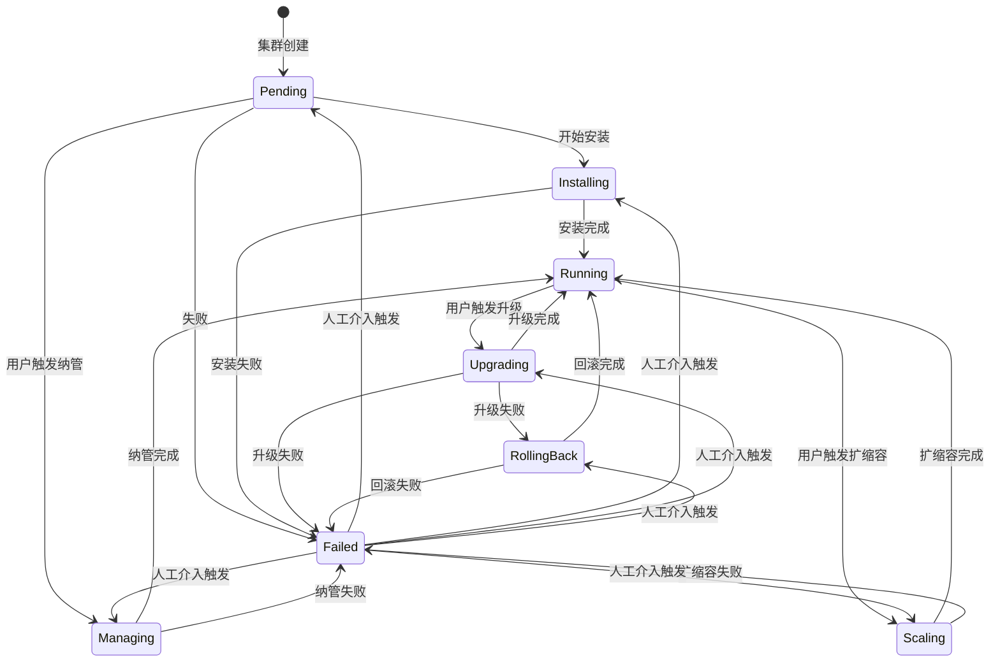
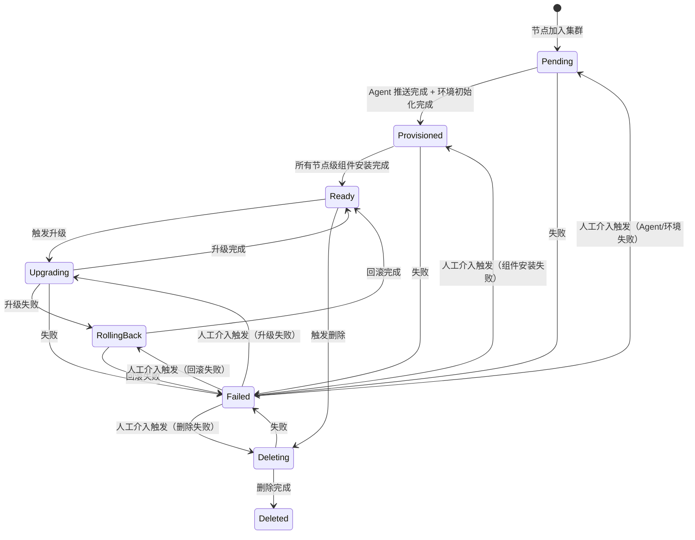
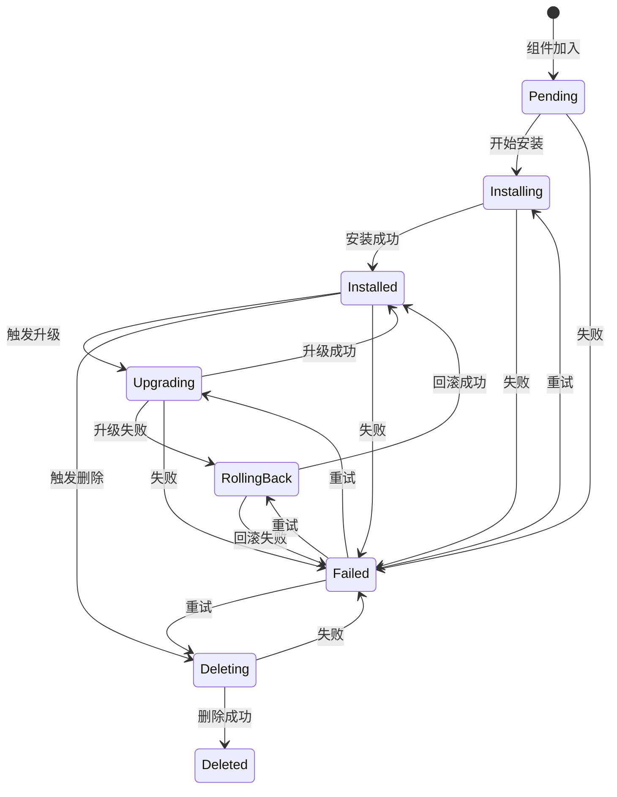

# KEP-6 状态机演进设计（v3 - 混合模型）

> **文档说明**：本文档是 KEP-6 状态机的演进设计，采用**混合模型**（驱动模型 + 聚合模型）。
> - **v2 文档**：[kep6-state-machine-v2.md](./kep6-state-machine-v2.md) - 已有实现的参考
> - **v3 文档**：本文档 - 混合模型设计方案

## 目录

1. [状态模型概览](#1-状态模型概览)
   - [1.1 混合模型架构](#11-混合模型架构)
   - [1.2 驱动模型](#12-驱动模型)
   - [1.3 聚合模型](#13-聚合模型)
   - [1.4 组件类型区分](#14-组件类型区分)
2. [集群层状态机：BKEClusterLifecycle](#2-集群层状态机bkeclusterlifecycle)
   - [2.1 状态定义](#21-状态定义)
     - [2.1.1 正常工作状态的语义说明](#211-正常工作状态的语义说明)
     - [2.1.2 Scaling 状态设计思路](#212-scaling-状态设计思路)
   - [2.2 驱动规则](#22-驱动规则)
   - [2.3 状态转换图](#23-状态转换图)
   - [2.4 操作进度追踪](#24-操作进度追踪)
3. [节点层状态机：BKENodeLifecycle](#3-节点层状态机bkenodelifecycle)
   - [3.1 状态定义](#31-状态定义)
   - [3.2 驱动规则](#32-驱动规则)
   - [3.3 状态转换图](#33-状态转换图)
4. [组件层状态机：ComponentLifecycle](#4-组件层状态机componentlifecycle)
   - [4.1 状态定义](#41-状态定义)
   - [4.2 驱动规则](#42-驱动规则)
   - [4.3 状态转换图](#43-状态转换图)
5. [健康状态聚合](#5-健康状态聚合)
   - [5.1 健康状态定义](#51-健康状态定义)
   - [5.2 聚合规则](#52-聚合规则)
   - [5.3 健康检查机制](#53-健康检查机制)
6. [场景驱动的状态转换](#6-场景驱动的状态转换)
   - [6.1 安装场景](#61-安装场景)
   - [6.2 纳管场景](#62-纳管场景)
   - [6.3 升级场景](#63-升级场景)
   - [6.4 回滚场景](#64-回滚场景)
   - [6.5 扩容场景](#65-扩容场景)
     - [6.5.1 Master 扩容场景](#651-master-扩容场景)
     - [6.5.2 Worker 扩容场景](#652-worker-扩容场景)
     - [6.5.3 同时扩容 Master 和 Worker](#653-同时扩容-master-和-worker)
   - [6.6 缩容场景](#66-缩容场景)
     - [6.6.1 Master 缩容场景](#661-master-缩容场景)
     - [6.6.2 Worker 缩容场景](#662-worker-缩容场景)
     - [6.6.3 同时缩容 Master 和 Worker](#663-同时缩容-master-和-worker)
7. [重试与幂等性](#7-重试与幂等性)
8. [详细设计](#8-详细设计)
   - [8.1 兼容性分析](#81-兼容性分析)
   - [8.2 API 类型扩展设计](#82-api-类型扩展设计)
   - [8.3 状态机引擎设计](#83-状态机引擎设计)
   - [8.4 健康状态聚合器设计](#84-健康状态聚合器设计)
   - [8.5 兼容性映射设计](#85-兼容性映射设计)
   - [8.6 与现有系统集成设计](#86-与现有系统集成设计)
   - [8.7 人工介入详细设计](#87-人工介入详细设计)
   - [8.8 Feature Gate 设计](#88-feature-gate-设计)
   - [8.9 迁移策略](#89-迁移策略)
   - [8.10 实现文件清单](#810-实现文件清单)
   - [8.11 测试设计](#811-测试设计)

---

## 1. 状态模型概览

### 1.1 混合模型架构

v3 采用**混合模型**，将状态管理分为两个独立的模型：

```
┌─────────────────────────────────────────────────────────────────────────────┐
│                         混合模型架构                                         │
├─────────────────────────────────────────────────────────────────────────────┤
│                                                                              │
│  ┌─────────────────────────────────────────────────────────────────────┐   │
│  │                    驱动模型（自上而下）                               │   │
│  │                                                                     │   │
│  │  用户操作 → 集群状态 → 节点状态 → 组件状态                           │   │
│  │                                                                     │   │
│  │  决定：LifecyclePhase（生命周期阶段）                                │   │
│  │  - Pending, Installing, Running, Upgrading, Scaling, RollingBack, Failed │   │
│  └─────────────────────────────────────────────────────────────────────┘   │
│                                                                              │
│  ┌─────────────────────────────────────────────────────────────────────┐   │
│  │                    聚合模型（自底向上）                               │   │
│  │                                                                     │   │
│  │  组件状态 → 节点状态 → 集群状态                                      │   │
│  │                                                                     │   │
│  │  决定：HealthStatus（健康状态）                                      │   │
│  │  - Healthy, Degraded, Unhealthy, Unknown                           │   │
│  └─────────────────────────────────────────────────────────────────────┘   │
│                                                                              │
└─────────────────────────────────────────────────────────────────────────────┘
```

**核心原则**：
- **驱动模型**：决定集群"正在做什么"（生命周期阶段）
- **聚合模型**：决定集群"健康状况如何"（健康状态）
- **两个模型各司其职，互不干扰**

### 1.2 驱动模型

驱动模型采用**自上而下**的方式，由用户操作驱动状态转换：

```
用户操作（自上而下）：
  用户触发升级 → 集群进入 Upgrading → 节点逐个升级 → 组件逐个升级

状态转换规则：
  集群 LifecyclePhase = 由 OperationProgress 决定
  节点 LifecyclePhase = 由节点操作决定
  组件 LifecyclePhase = 由组件操作决定
```

**优势**：
- ✅ 因果关系清晰：用户操作是原因，状态转换是结果
- ✅ 状态转换规则简单：直接由操作类型决定
- ✅ 进度追踪容易：通过 OperationProgress 追踪操作进度
- ✅ 故障诊断容易：快速定位失败的组件

### 1.3 聚合模型

聚合模型采用**自底向上**的方式，由下层状态聚合出上层健康状态：

```
健康状态聚合（自底向上）：
  组件健康状态 → 节点健康状态 → 集群健康状态

聚合规则：
  集群 HealthStatus = 聚合(所有节点健康状态 + 所有集群级组件健康状态)
  节点 HealthStatus = 聚合(所有节点级组件健康状态)
```

**优势**：
- ✅ 健康状态准确：基于实际组件状态
- ✅ 故障检测及时：快速发现不健康的组件
- ✅ 健康检查灵活：可以自定义健康检查规则

### 1.4 组件类型区分

组件分为**节点级组件**和**集群级组件**两类：

| 组件类型 | 示例 | 聚合目标 | 说明 |
|---------|------|---------|------|
| **节点级组件** | containerd, bkeagent | 节点健康状态 | 运行在特定节点上 |
| **集群级组件** | coredns, kube-proxy | 集群健康状态 | 运行在集群中 |

```go
type ComponentType string

const (
    ComponentTypeNode    ComponentType = "node"    // 节点级组件
    ComponentTypeCluster ComponentType = "cluster" // 集群级组件
)
```

---

## 2. 集群层状态机：BKEClusterLifecycle

### 2.1 状态定义

| 状态 | 说明 | 驱动来源 |
|------|------|---------|
| `Pending` | 集群等待安装 | 集群创建 |
| `Installing` | 集群正在安装（节点加入、Agent 推送、组件安装） | 开始安装 |
| `Running` | 集群正在运行（所有组件就绪，服务可用） | 安装完成 |
| `Upgrading` | 集群正在升级（版本变更中） | 用户触发升级 |
| `Scaling` | 集群正在扩容或缩容（节点增减） | 用户触发扩缩容 |
| `Managing` | 集群正在被纳管（验证连接、安装组件、健康检查） | 用户触发纳管 |
| `RollingBack` | 集群正在回滚（升级失败后恢复） | 升级失败自动触发 |
| `Deleting` | 集群正在删除（节点删除、组件卸载） | 用户触发删除 |
| `Deleted` | 集群已删除 | 删除完成 |
| `Failed` | 集群失败（需要人工介入） | 操作失败 |

#### 2.1.1 正常工作状态的语义说明

集群层使用 `Running` 状态表示集群的正常工作状态，强调集群作为一个运行中的系统。这与节点层的 `Ready` 和组件层的 `Installed` 形成语义上的区分：

- **集群层（Running）**：强调集群作为一个整体系统正在运行，提供服务
- **节点层（Ready）**：强调节点已就绪，可以接受工作负载
- **组件层（Installed）**：强调组件已安装完成，处于运行状态

这种命名差异反映了不同层级的语义特点：
- 集群是一个**运行的系统**，使用 Running
- 节点是一个**就绪的资源**，使用 Ready
- 组件是一个**安装的单元**，使用 Installed

#### 2.1.2 Scaling 状态设计思路

**设计决策**：`Scaling` 状态保持单一状态，不细分为 `MasterScaling` 和 `WorkerScaling`。

**设计理由**：

1. **符合 v3 状态机设计理念**：
   - v3 状态机强调"状态表示正在做什么"（生命周期阶段），细节通过 `OperationProgress` 等字段表达
   - 这与 v2 的细分状态设计理念不同，v2 倾向于将每个操作类型都映射为独立状态
   - v3 通过单一状态 + 详细字段的方式，保持状态机的简洁性

2. **状态机简洁性**：
   - 避免过多的状态，降低状态机的复杂度
   - 减少状态转换的数量，降低状态转换规则的复杂性
   - 使状态机更易于理解和维护

3. **灵活性和扩展性**：
   - 通过 `OperationProgress.CurrentStage` 可以灵活表达扩容/缩容的方向
   - 通过 `ScaleDetails` 字段可以提供更详细的扩缩容信息（Master 节点数、Worker 节点数等）
   - 如果未来需要支持更多类型的扩缩容（如 GPU 节点扩缩容），单一 Scaling 状态更容易扩展

4. **与现有系统的兼容性**：
   - 现有系统有 4 个细分状态：`ClusterMasterScalingUp`、`ClusterMasterScalingDown`、`ClusterWorkerScalingUp`、`ClusterWorkerScalingDown`
   - 在兼容性映射设计中，将这 4 个状态统一映射到 v3 的 `Scaling` 状态
   - 通过 `ScaleDetails` 字段保留详细信息，确保迁移过程中不丢失信息

**扩缩容详情字段设计**：

```go
type ScaleDetails struct {
    // Master 节点变更数量（正数表示扩容，负数表示缩容）
    MasterNodesDelta int `json:"masterNodesDelta,omitempty"`
    
    // Worker 节点变更数量（正数表示扩容，负数表示缩容）
    WorkerNodesDelta int `json:"workerNodesDelta,omitempty"`
    
    // 扩缩容方向（"Up" 或 "Down"）
    Direction string `json:"direction"`
    
    // 当前阶段（"ScalingMasterNodes" / "ScalingWorkerNodes" / "ScalingBoth"）
    CurrentStage string `json:"currentStage,omitempty"`
}
```

**使用场景示例**：

| 场景 | Scaling 状态 | ScaleDetails |
|------|-------------|--------------|
| Master 扩容 3 个节点 | `Scaling` | `{MasterNodesDelta: 3, Direction: "Up", CurrentStage: "ScalingMasterNodes"}` |
| Worker 缩容 2 个节点 | `Scaling` | `{WorkerNodesDelta: -2, Direction: "Down", CurrentStage: "ScalingWorkerNodes"}` |
| 同时扩容 Master 和 Worker | `Scaling` | `{MasterNodesDelta: 1, WorkerNodesDelta: 5, Direction: "Up", CurrentStage: "ScalingBoth"}` |

**兼容性映射**：

```go
func mapToV3LifecyclePhase(oldStatus confv1beta1.ClusterStatus) string {
    switch oldStatus {
    case confv1beta1.ClusterMasterScalingUp,
         confv1beta1.ClusterMasterScalingDown,
         confv1beta1.ClusterWorkerScalingUp,
         confv1beta1.ClusterWorkerScalingDown:
        return confv1beta1.ClusterLifecycleScaling
    // ...
    }
}
```

**查询扩缩容详情**：

```bash
# 查询当前扩缩容状态
kubectl get bkecluster my-cluster -o jsonpath='{.status.lifecyclePhase}'
# 输出: Scaling

# 查询扩缩容详情
kubectl get bkecluster my-cluster -o jsonpath='{.status.operationProgress.scaleDetails}'
# 输出: {"masterNodesDelta": 3, "direction": "Up", "currentStage": "ScalingMasterNodes"}
```

#### 2.1.3 Paused 和 DryRun 的设计决策

**设计决策**：`Paused` 和 `DryRun` **不作为独立的生命周期阶段**，而是通过 `Condition` 表达。

**设计理由**：

1. **符合 Kubernetes 最佳实践**：
   - Cluster API 等主流项目使用 `Condition` 表达操作模式（如 Paused）
   - `Phase` 应该只表示主要的生命周期阶段，保持简洁
   - `Condition` 可以精确表达各种操作模式和状态

2. **Paused 是操作模式，不是生命周期阶段**：
   - 暂停不会改变集群的生命周期阶段（如 Running、Upgrading）
   - 暂停是一个临时的操作模式，可以随时恢复
   - 通过 `spec.paused` 字段控制，通过 `status.conditions` 表达状态

3. **DryRun 是测试模式，不是生命周期阶段**：
   - DryRun 用于测试 API 调用，不会实际执行操作
   - 不需要在状态机中表达
   - 通过 `spec.dryRun` 字段控制

**实现方式**：

```go
// Spec 字段控制
type BKEClusterSpec struct {
    // Paused 用于阻止控制器处理 Cluster
    Paused bool `json:"paused,omitempty"`
    
    // DryRun 用于测试 API 调用
    DryRun bool `json:"dryRun,omitempty"`
}

// Status Condition 表达状态
type ConditionType string

const (
    ConditionPaused  ConditionType = "Paused"
    ConditionDryRun  ConditionType = "DryRun"
)

// Condition 示例
type Condition struct {
    Type               ConditionType          `json:"type"`
    Status             metav1.ConditionStatus `json:"status"`
    Reason             string                 `json:"reason,omitempty"`
    Message            string                 `json:"message,omitempty"`
    LastTransitionTime metav1.Time            `json:"lastTransitionTime"`
}
```

**使用场景示例**：

**场景 1：集群暂停**
```yaml
spec:
  paused: true

status:
  phase: Running  # Phase 保持不变
  conditions:
  - type: Paused
    status: "True"
    reason: UserRequested
    message: "Cluster is paused by user"
    lastTransitionTime: "2024-01-01T00:00:00Z"
```

**场景 2：DryRun 测试**
```yaml
spec:
  dryRun: true

status:
  phase: Running  # Phase 保持不变
  conditions:
  - type: DryRun
    status: "True"
    reason: TestingUpgrade
    message: "Testing upgrade without actual execution"
    lastTransitionTime: "2024-01-01T00:00:00Z"
```

**场景 3：升级中暂停**
```yaml
spec:
  paused: true

status:
  phase: Upgrading  # Phase 表示主要阶段
  conditions:
  - type: Upgrading
    status: "True"
    reason: VersionUpgrade
    message: "Upgrading from v1.28 to v1.29"
  - type: Paused
    status: "True"
    reason: UserRequested
    message: "Cluster is paused during upgrade"
```

**兼容性映射**：

```go
// 旧状态 → 新设计
func mapOldStatusToNewDesign(oldStatus confv1beta1.ClusterStatus) (LifecyclePhase, []Condition) {
    switch oldStatus {
    case confv1beta1.ClusterPaused:
        return ClusterLifecycleRunning, []Condition{
            {
                Type:    ConditionPaused,
                Status:  metav1.ConditionTrue,
                Reason:  "Paused",
                Message: "Cluster is paused",
            },
        }
    case confv1beta1.ClusterDryRun:
        return ClusterLifecycleRunning, []Condition{
            {
                Type:    ConditionDryRun,
                Status:  metav1.ConditionTrue,
                Reason:  "DryRun",
                Message: "Cluster is in dry-run mode",
            },
        }
    // ...
    }
}
```

**查询暂停状态**：

```bash
# 查询集群是否暂停
kubectl get bkecluster my-cluster -o jsonpath='{.status.conditions[?(@.type=="Paused")].status}'
# 输出: True

# 查询暂停原因
kubectl get bkecluster my-cluster -o jsonpath='{.status.conditions[?(@.type=="Paused")].message}'
# 输出: Cluster is paused by user

# 恢复集群
kubectl patch bkecluster my-cluster --type merge -p '{"spec":{"paused":false}}'
```

**优势**：

1. **符合 Kubernetes 最佳实践**：使用标准的 Condition 模式
2. **与 Cluster API 保持一致**：便于用户理解和迁移
3. **保持状态机简洁**：Phase 只表示主要生命周期阶段
4. **灵活表达复杂状态**：通过 Condition 可以精确表达各种操作模式
5. **向后兼容**：通过映射函数可以兼容旧状态

### 2.2 驱动规则

集群层状态由**驱动模型**决定，基于 `OperationProgress` 字段：

```go
// determineLifecyclePhase 由驱动模型决定集群生命周期阶段
func (r *Reconciler) determineLifecyclePhase(cluster *BKECluster) LifecyclePhase {
    // 检查是否有进行中的操作
    if cluster.Status.OperationProgress != nil && 
       cluster.Status.OperationProgress.FinishedAt == nil {
        switch cluster.Status.OperationProgress.OperationType {
        case OperationTypeInstall:
            return ClusterLifecycleInstalling
        case OperationTypeUpgrade:
            return ClusterLifecycleUpgrading
        case OperationTypeScale:
            return ClusterLifecycleScaling
        case OperationTypeManage:
            return ClusterLifecycleManaging
        case OperationTypeRollback:
            return ClusterLifecycleRollingBack
        }
    }
    
    // 检查是否失败
    if cluster.Status.OperationProgress != nil &&
       cluster.Status.OperationProgress.LastFailure != nil {
        return ClusterLifecycleFailed
    }
    
    // 检查是否已安装
    if allComponentsInstalled(cluster) {
        return ClusterLifecycleRunning
    }
    
    // 默认等待状态
    return ClusterLifecyclePending
}
```

**驱动规则说明**：
- `Pending`：当集群刚创建且未开始安装时
- `Installing`：当 `OperationProgress.OperationType = Install` 且未完成时
- `Running`：当所有组件已安装且没有进行中的操作时
- `Upgrading`：当 `OperationProgress.OperationType = Upgrade` 且未完成时
- `Scaling`：当 `OperationProgress.OperationType = Scale` 且未完成时
- `Managing`：当 `OperationProgress.OperationType = Manage` 且未完成时
- `RollingBack`：当 `OperationProgress.OperationType = Rollback` 且未完成时
- `Failed`：当 `OperationProgress.LastFailure != nil` 时

**恢复决策逻辑**：

当集群处于 `Failed` 状态时，系统通过以下逻辑决定恢复到哪个状态：

1. 读取 `OperationProgress.OperationType`，获取失败的操作类型
2. 根据操作类型映射到对应的生命周期阶段
3. 自动恢复到对应的状态，无需用户手动指定

```go
// determineRecoveryPhase 决定从 Failed 恢复到哪个状态
func (r *Reconciler) determineRecoveryPhase(cluster *BKECluster) LifecyclePhase {
    if cluster.Status.OperationProgress == nil {
        return ClusterLifecyclePending
    }
    
    switch cluster.Status.OperationProgress.OperationType {
    case OperationTypeInstall:
        return ClusterLifecycleInstalling
    case OperationTypeUpgrade:
        return ClusterLifecycleUpgrading
    case OperationTypeScale:
        return ClusterLifecycleScaling
    case OperationTypeManage:
        return ClusterLifecycleManaging
    case OperationTypeRollback:
        return ClusterLifecycleRollingBack
    default:
        return ClusterLifecyclePending
    }
}
```

**恢复决策映射表**：

| OperationType | 恢复目标 | 说明 |
|--------------|---------|------|
| `Install` | `Installing` | 重新执行安装操作 |
| `Upgrade` | `Upgrading` | 重新执行升级操作 |
| `Scale` | `Scaling` | 重新执行扩缩容操作 |
| `Manage` | `Managing` | 重新执行纳管操作 |
| `Rollback` | `RollingBack` | 重新执行回滚操作 |

### 2.3 状态转换图


```mermaid
stateDiagram-v2
    [*] --> Pending : 集群创建
    
    Pending --> Installing : 开始安装
    Pending --> Managing : 用户触发纳管
    Pending --> Failed : 失败
    
    Installing --> Running : 安装完成
    Installing --> Failed : 安装失败
    
    Managing --> Running : 纳管完成
    Managing --> Failed : 纳管失败
    
    Running --> Upgrading : 用户触发升级
    Running --> Scaling : 用户触发扩缩容
    
    Upgrading --> Running : 升级完成
    Upgrading --> RollingBack : 升级失败
    Upgrading --> Failed : 升级失败
    
    RollingBack --> Running : 回滚完成
    RollingBack --> Failed : 回滚失败
    
    Scaling --> Running : 扩缩容完成
    Scaling --> Failed : 扩缩容失败
    
    Failed --> Pending : 人工介入触发
    Failed --> Installing : 人工介入触发
    Failed --> Managing : 人工介入触发
    Failed --> Upgrading : 人工介入触发
    Failed --> Scaling : 人工介入触发
    Failed --> RollingBack : 人工介入触发
```

**状态转换说明**：

**为什么没有 `Failed --> Running`？**

在驱动模型中，`LifecyclePhase` 由操作决定。`Failed` 状态意味着某个操作失败，应该重新执行该操作，而不是直接恢复到 `Running` 状态。

**为什么没有 `Running --> Failed`？**

在驱动模型中，`LifecyclePhase` 由**操作**驱动。`Running` 是稳定状态，表示集群正在运行，没有进行中的操作。运行中故障（如 etcd 崩溃、API Server 故障）不是由操作驱动的，应该通过 `HealthStatus` 表达，而不是改变 `LifecyclePhase`。

**运行中故障处理**：

运行中故障通过 `HealthStatus` 表达，`LifecyclePhase` 保持 `Running`：

```
T0: 集群运行中
    LifecyclePhase = Running
    HealthStatus.Overall = Healthy

T1: etcd 崩溃
    LifecyclePhase = Running（不变）
    HealthStatus.Overall = Unhealthy
    HealthStatus.Message = "etcd crashed"

T2: 重启 etcd
    LifecyclePhase = Running（不变）
    HealthStatus.Overall = Healthy
```

**恢复机制**：

从 `Failed` 状态恢复需要**人工介入触发**，系统根据 `OperationProgress.OperationType` **自动决定恢复目标**：

1. 用户诊断问题并修复
2. 用户触发恢复（清除 LastFailure 或设置注解）
3. 系统自动决定恢复目标
4. 重新执行操作

**为什么需要人工介入？**

- 操作失败通常需要诊断和修复（如网络问题、配置错误）
- 自动恢复可能掩盖问题
- 人工介入确保问题得到正确解决

**系统自动决定恢复目标**：

系统根据 `OperationProgress.OperationType` 自动决定恢复到哪个状态，无需用户手动指定：

| OperationType | 恢复目标 | 说明 |
|--------------|---------|------|
| `Install` | `Installing` | 重新执行安装操作 |
| `Manage` | `Managing` | 重新执行纳管操作 |
| `Upgrade` | `Upgrading` | 重新执行升级操作 |
| `Scale` | `Scaling` | 重新执行扩缩容操作 |
| `Rollback` | `RollingBack` | 重新执行回滚操作 |

**恢复流程**：

```
T0: 操作失败，进入 Failed 状态
    LifecyclePhase = Failed
    OperationProgress.OperationType = Upgrade
    OperationProgress.LastFailure = {...}

T1: 用户诊断问题并修复

T2: 用户触发恢复（清除 LastFailure 或设置注解）
    OperationProgress.LastFailure = nil

T3: 系统自动决定恢复目标
    读取 OperationProgress.OperationType = Upgrade
    → LifecyclePhase = Upgrading

T4: 重新执行操作
```

**恢复触发方式**：

1. **清除 LastFailure**（推荐）
   ```bash
   kubectl patch bkecluster my-cluster --type merge \
     -p '{"status":{"operationProgress":{"lastFailure":null}}}'
   ```

2. **通过注解触发**
   ```bash
   kubectl annotate bkecluster my-cluster bke.bocloud.com/retry-operation=true
   ```

**恢复策略**：

| 失败场景 | 恢复路径 | 说明 |
|---------|---------|------|
| Installing 失败 | `Failed --> Installing` | 重新执行安装操作 |
| Managing 失败 | `Failed --> Managing` | 重新执行纳管操作 |
| Upgrading 失败 | `Failed --> Upgrading` | 重新执行升级操作 |
| Scaling 失败 | `Failed --> Scaling` | 重新执行扩缩容操作 |
| RollingBack 失败 | `Failed --> RollingBack` | 重新执行回滚操作 |

**示例场景**：

**场景 1：升级失败恢复**
```
T0: 升级失败
    LifecyclePhase = Failed
    OperationProgress.OperationType = Upgrade
    OperationProgress.LastFailure = {Name: "etcd", Error: "upgrade failed"}

T1: 用户诊断问题并修复
    修复 etcd 升级脚本

T2: 用户触发恢复
    kubectl patch bkecluster my-cluster --type merge \
      -p '{"status":{"operationProgress":{"lastFailure":null}}}'

T3: 系统自动决定
    OperationProgress.OperationType = Upgrade
    → LifecyclePhase = Upgrading

T4: 重新执行升级操作
    从失败的组件继续升级
```

**特殊场景**：

如果操作已经部分完成，管理员可以选择：
1. **重新执行操作**：通过状态机恢复（推荐）
2. **手动完成操作**：通过 API 直接修改状态（不推荐，可能导致状态不一致）

### 2.4 操作进度追踪

所有操作（安装、升级、扩容、缩容、回滚）的进度通过 `OperationProgress` 统一追踪：

```go
type OperationProgress struct {
    // 操作类型
    OperationType OperationType `json:"operationType"`
    
    // 目标版本
    TargetVersion string `json:"targetVersion,omitempty"`
    
    // 开始时间
    StartedAt *metav1.Time `json:"startedAt,omitempty"`
    
    // 完成时间
    FinishedAt *metav1.Time `json:"finishedAt,omitempty"`
    
    // 当前阶段
    CurrentStage string `json:"currentStage,omitempty"`
    
    // 总组件数
    TotalComponents int `json:"totalComponents,omitempty"`
    
    // 已完成组件数
    CompletedComponents int `json:"completedComponents,omitempty"`
    
    // 失败的组件列表
    FailedComponents []string `json:"failedComponents,omitempty"`
    
    // 已完成组件列表
    Completed []ComponentRecord `json:"completed,omitempty"`
    
    // 最后失败记录
    LastFailure *OperationFailureRecord `json:"lastFailure,omitempty"`
    
    // 是否需要人工介入
    NeedsManualIntervention bool `json:"needsManualIntervention,omitempty"`
    
    // 扩缩容详情（仅当 OperationType = Scale 时使用）
    ScaleDetails *ScaleDetails `json:"scaleDetails,omitempty"`
}

// ScaleDetails 扩缩容详情
type ScaleDetails struct {
    // Master 节点变更数量（正数表示扩容，负数表示缩容）
    MasterNodesDelta int `json:"masterNodesDelta,omitempty"`
    
    // Worker 节点变更数量（正数表示扩容，负数表示缩容）
    WorkerNodesDelta int `json:"workerNodesDelta,omitempty"`
    
    // 扩缩容方向（"Up" 或 "Down"）
    Direction string `json:"direction"`
    
    // 当前阶段（"ScalingMasterNodes" / "ScalingWorkerNodes" / "ScalingBoth"）
    CurrentStage string `json:"currentStage,omitempty"`
}

type OperationType string

const (
    OperationTypeInstall  OperationType = "Install"
    OperationTypeUpgrade  OperationType = "Upgrade"
    OperationTypeScale    OperationType = "Scale"
    OperationTypeManage   OperationType = "Manage"
    OperationTypeRollback OperationType = "Rollback"
)
```

**使用场景**：

| 场景 | OperationType | CurrentStage | ScaleDetails |
|------|---------------|--------------|--------------|
| 集群安装 | `Install` | `InstallingNodeComponents` / `InstallingClusterComponents` | - |
| 集群纳管 | `Manage` | `ValidatingConnection` / `InstallingComponents` / `RunningHealthCheck` | - |
| 集群升级 | `Upgrade` | `UpgradingNodeComponents` / `UpgradingClusterComponents` | - |
| Master 扩容 | `Scale` | `ScalingUp` | `{MasterNodesDelta: 3, Direction: "Up", CurrentStage: "ScalingMasterNodes"}` |
| Worker 扩容 | `Scale` | `ScalingUp` | `{WorkerNodesDelta: 5, Direction: "Up", CurrentStage: "ScalingWorkerNodes"}` |
| Master 缩容 | `Scale` | `ScalingDown` | `{MasterNodesDelta: -2, Direction: "Down", CurrentStage: "ScalingMasterNodes"}` |
| Worker 缩容 | `Scale` | `ScalingDown` | `{WorkerNodesDelta: -3, Direction: "Down", CurrentStage: "ScalingWorkerNodes"}` |
| 同时扩容 | `Scale` | `ScalingUp` | `{MasterNodesDelta: 1, WorkerNodesDelta: 5, Direction: "Up", CurrentStage: "ScalingBoth"}` |
| 集群回滚 | `Rollback` | `RollingBackNodeComponents` / `RollingBackClusterComponents` | - |

---

## 3. 节点层状态机：BKENodeLifecycle

### 3.1 状态定义

| 状态 | 说明 | 驱动来源 |
|------|------|---------|
| `Pending` | 节点等待配置（Agent 推送） | 节点加入集群 |
| `Provisioned` | 节点已配置（Agent 就绪，环境初始化完成） | Agent 推送完成 |
| `Ready` | 节点就绪（所有组件安装完成） | 组件安装完成 |
| `Upgrading` | 节点正在升级（组件升级中） | 用户触发升级 |
| `RollingBack` | 节点正在回滚（升级失败后恢复） | 升级失败自动触发 |
| `Deleting` | 节点正在删除（组件卸载中） | 用户触发删除 |
| `Deleted` | 节点已删除 | 删除完成 |
| `Failed` | 节点失败 | 操作失败 |

#### 3.1.1 正常工作状态的语义说明

节点层使用 `Ready` 状态表示节点的正常工作状态，强调节点已就绪，可以接受工作负载。这与集群层的 `Running` 和组件层的 `Installed` 形成语义上的区分：

- **集群层（Running）**：强调集群作为一个整体系统正在运行，提供服务
- **节点层（Ready）**：强调节点已就绪，可以接受工作负载
- **组件层（Installed）**：强调组件已安装完成，处于运行状态

`Ready` 状态表示节点已完成所有配置和组件安装，可以正常接受 Kubernetes 调度的工作负载。这与 Kubernetes 的 Node Ready 状态保持一致，符合 Kubernetes 的命名习惯：
- Kubernetes 使用 `Node Ready` 表示节点就绪
- 节点就绪是一个**里程碑状态**（从 NotReady 到 Ready）
- 使用 `Ready` 更符合 Kubernetes 生态的命名规范

#### 3.1.2 Provisioned 与 Ready 状态的区别

**Provisioned** 和 **Ready** 是节点生命周期的两个不同阶段，主要区别如下：

| 状态 | 说明 | 驱动来源 | 完成条件 |
|------|------|---------|---------|
| **Provisioned** | 节点已配置 | Agent 推送完成 | Agent 就绪 + 环境初始化完成 |
| **Ready** | 节点就绪 | 组件安装完成 | 所有节点级组件安装完成 |

**核心区别**：

- **Provisioned 状态**：
  - Agent 已就绪：bkeagent 已推送到节点并正常运行
  - 环境已初始化：节点环境配置完成（如网络、存储等）
  - 组件未就绪：节点级组件（containerd、kubelet 等）还未安装或未完成

- **Ready 状态**：
  - 所有组件就绪：节点级组件（containerd、bkeagent、kubelet 等）全部安装完成
  - 节点可用：节点可以正常加入集群并承担工作负载

**状态转换流程**：

```
Pending（等待）
    ↓ Agent 推送 + 环境初始化
Provisioned（Agent 就绪）
    ↓ 安装节点级组件
Ready（组件就绪）
```

**实际场景示例**：

**场景 1：新节点加入集群**
```
T0: 节点加入集群
    LifecyclePhase = Pending
    状态：节点等待配置

T1: Agent 推送完成
    LifecyclePhase = Provisioned
    状态：bkeagent 已运行，环境已初始化
    但：containerd、kubelet 还未安装

T2: 节点级组件安装完成
    LifecyclePhase = Ready
    状态：containerd、kubelet 等组件已安装
    节点可以加入集群
```

**设计意义**：

这两个状态的分离提供了更细粒度的状态追踪：
1. **Provisioned**：表示基础设施层面已就绪
2. **Ready**：表示 Kubernetes 层面已就绪

这种设计有助于：
- 快速定位故障点（是 Agent 问题还是组件问题）
- 支持部分就绪场景（Agent 就绪但组件未就绪）
- 提供更精确的健康检查

### 3.2 驱动规则

节点层状态由**驱动模型**决定，基于节点操作：

```go
// determineNodeLifecyclePhase 由驱动模型决定节点生命周期阶段
func (r *Reconciler) determineNodeLifecyclePhase(node *BKENode) LifecyclePhase {
    // 检查是否有进行中的操作
    if node.Status.OperationProgress != nil && 
       node.Status.OperationProgress.FinishedAt == nil {
        switch node.Status.OperationProgress.OperationType {
        case OperationTypeInstall:
            if node.Status.StateCode&NodeAgentReadyFlag != 0 {
                return NodeLifecycleProvisioned
            }
            return NodeLifecyclePending
        case OperationTypeUpgrade:
            return NodeLifecycleUpgrading
        case OperationTypeRollback:
            return NodeLifecycleRollingBack
        case OperationTypeDelete:
            return NodeLifecycleDeleting
        }
    }
    
    // 检查是否失败
    if node.Status.OperationProgress != nil &&
       node.Status.OperationProgress.LastFailure != nil {
        return NodeLifecycleFailed
    }
    
    // 检查是否已删除
    if node.DeletionTimestamp != nil {
        return NodeLifecycleDeleted
    }
    
    // 检查是否就绪
    if allNodeComponentsInstalled(node) {
        return NodeLifecycleReady
    }
    
    return NodeLifecyclePending
}
```

**恢复决策逻辑**：

当节点处于 `Failed` 状态时，系统通过以下逻辑决定恢复到哪个状态：

1. 读取 `OperationProgress.OperationType`，获取失败的操作类型
2. 根据操作类型和 `StateCode` 映射到对应的生命周期阶段
3. 自动恢复到对应的状态，无需用户手动指定

```go
// determineNodeRecoveryPhase 决定从 Failed 恢复到哪个状态
func (r *Reconciler) determineNodeRecoveryPhase(node *BKENode) LifecyclePhase {
    if node.Status.OperationProgress == nil {
        return NodeLifecyclePending
    }
    
    switch node.Status.OperationProgress.OperationType {
    case OperationTypeInstall:
        // 根据 StateCode 判断恢复到哪个状态
        if node.Status.StateCode&NodeAgentReadyFlag != 0 {
            return NodeLifecycleProvisioned
        }
        return NodeLifecyclePending
    case OperationTypeUpgrade:
        return NodeLifecycleReady
    case OperationTypeRollback:
        return NodeLifecycleReady
    case OperationTypeDelete:
        return NodeLifecycleReady
    default:
        return NodeLifecyclePending
    }
}
```

**恢复决策映射表**：

| 失败操作 | OperationType | StateCode | 恢复目标 | 说明 |
|---------|--------------|-----------|---------|------|
| Agent 推送失败 | Install | 无 AgentReadyFlag | Pending | 重新推送 Agent |
| 环境初始化失败 | Install | 无 EnvFlag | Pending | 重新初始化环境 |
| 组件安装失败 | Install | 有 AgentReadyFlag | Provisioned | 重新安装组件 |
| 升级失败 | Upgrade | - | Ready | 回滚到 Ready |
| 回滚失败 | Rollback | - | Ready | 重新回滚 |
| 删除失败 | Delete | - | Ready | 取消删除 |

**为什么没有"运行中失败"？**

运行中故障（如 kubelet 崩溃、容器运行时故障）不是由操作驱动的，不应该改变 `LifecyclePhase`。这类故障应该通过 `HealthStatus` 表达，`LifecyclePhase` 保持 `Ready`。

### 3.3 状态转换图


```mermaid
stateDiagram-v2
    [*] --> Pending : 节点加入集群
    
    Pending --> Provisioned : Agent 推送完成 + 环境初始化完成
    Pending --> Failed : 失败
    
    Provisioned --> Ready : 所有节点级组件安装完成
    Provisioned --> Failed : 失败
    
    Ready --> Upgrading : 触发升级
    Ready --> Deleting : 触发删除
    
    Upgrading --> Ready : 升级完成
    Upgrading --> RollingBack : 升级失败
    Upgrading --> Failed : 失败
    
    RollingBack --> Ready : 回滚完成
    RollingBack --> Failed : 回滚失败
    
    Deleting --> Deleted : 删除完成
    Deleting --> Failed : 失败
    
    Failed --> Pending : 人工介入触发（Agent/环境失败）
    Failed --> Provisioned : 人工介入触发（组件安装失败）
    Failed --> Upgrading : 人工介入触发（升级失败）
    Failed --> RollingBack : 人工介入触发（回滚失败）
    Failed --> Deleting : 人工介入触发（删除失败）
```

**为什么没有 `Ready --> Failed`？**

在驱动模型中，`LifecyclePhase` 由**操作**驱动。`Ready` 是稳定状态，表示节点已就绪，没有进行中的操作。运行中故障（如 kubelet 崩溃、容器运行时故障）不是由操作驱动的，应该通过 `HealthStatus` 表达，而不是改变 `LifecyclePhase`。

**为什么没有 `Failed --> Ready`？**

在驱动模型中，`LifecyclePhase` 由**操作**驱动。`Failed` 状态意味着某个操作失败，应该重新执行该操作，而不是直接恢复到 `Ready` 稳定状态。

**设计原则**：
- `Failed` 后恢复到**操作状态**（Upgrading/RollingBack/Deleting），而不是**稳定状态**（Ready）
- 重新执行失败的操作，而不是放弃操作
- 与集群层设计保持一致（集群层没有 `Failed --> Running`）

**运行中故障处理**：

运行中故障通过 `HealthStatus` 表达，`LifecyclePhase` 保持 `Ready`：

```
T0: 节点就绪
    LifecyclePhase = Ready
    HealthStatus.Overall = Healthy

T1: kubelet 崩溃
    LifecyclePhase = Ready（不变）
    HealthStatus.Overall = Unhealthy
    HealthStatus.Message = "kubelet crashed"

T2: 重启 kubelet
    LifecyclePhase = Ready（不变）
    HealthStatus.Overall = Healthy
```

**恢复机制**：

从 `Failed` 状态恢复需要**人工介入触发**，系统根据 `OperationProgress.OperationType` 和 `StateCode` **自动决定恢复目标**：

1. 用户诊断问题并修复
2. 用户触发恢复（清除 LastFailure 或设置注解）
3. 系统自动决定恢复目标
4. 重新执行操作

**为什么需要人工介入？**

- 操作失败通常需要诊断和修复（如网络问题、配置错误）
- 自动恢复可能掩盖问题
- 人工介入确保问题得到正确解决

**系统自动决定恢复目标**：

系统根据 `OperationProgress.OperationType` 和 `StateCode` 自动决定恢复到哪个状态，无需用户手动指定：

| 失败操作 | OperationType | StateCode | 恢复目标 | 说明 |
|---------|--------------|-----------|---------|------|
| Agent 推送失败 | Install | 无 AgentReadyFlag | Pending | 重新推送 Agent |
| 环境初始化失败 | Install | 无 EnvFlag | Pending | 重新初始化环境 |
| 组件安装失败 | Install | 有 AgentReadyFlag | Provisioned | 重新安装组件 |
| 升级失败 | Upgrade | - | Upgrading | 重新升级 |
| 回滚失败 | Rollback | - | RollingBack | 重新回滚 |
| 删除失败 | Delete | - | Deleting | 重新删除 |

**恢复流程**：

```
T0: 操作失败，进入 Failed 状态
    LifecyclePhase = Failed
    OperationProgress.OperationType = Install
    StateCode = 0（无 AgentReadyFlag）

T1: 用户诊断问题并修复

T2: 用户触发恢复（清除 LastFailure 或设置注解）
    OperationProgress.LastFailure = nil

T3: 系统自动决定恢复目标
    读取 OperationProgress.OperationType = Install
    检查 StateCode = 0（无 AgentReadyFlag）
    → LifecyclePhase = Pending

T4: 重新执行操作
```

**恢复触发方式**：

1. **清除 LastFailure**（推荐）
   ```bash
   kubectl patch bkenode node-1 --type merge \
     -p '{"status":{"operationProgress":{"lastFailure":null}}}'
   ```

2. **通过注解触发**
   ```bash
   kubectl annotate bkenode node-1 bke.bocloud.com/retry-operation=true
   ```

### 3.4 操作进度追踪

节点层所有操作（安装、升级、回滚、删除）的进度通过 `OperationProgress` 统一追踪：

```go
type NodeOperationProgress struct {
    // 操作类型
    OperationType NodeOperationType `json:"operationType"`
    
    // 开始时间
    StartedAt *metav1.Time `json:"startedAt,omitempty"`
    
    // 完成时间
    FinishedAt *metav1.Time `json:"finishedAt,omitempty"`
    
    // 当前阶段
    CurrentStage string `json:"currentStage,omitempty"`
    
    // 总组件数
    TotalComponents int `json:"totalComponents,omitempty"`
    
    // 已完成组件数
    CompletedComponents int `json:"completedComponents,omitempty"`
    
    // 失败的组件列表
    FailedComponents []string `json:"failedComponents,omitempty"`
    
    // 已完成组件列表
    Completed []NodeComponentRecord `json:"completed,omitempty"`
    
    // 最后失败记录
    LastFailure *NodeOperationFailureRecord `json:"lastFailure,omitempty"`
    
    // 是否需要人工介入
    NeedsManualIntervention bool `json:"needsManualIntervention,omitempty"`
    
    // StateCode 变化记录
    StateCodeChanges []StateCodeChange `json:"stateCodeChanges,omitempty"`
}

type NodeOperationType string

const (
    NodeOperationTypeInstall  NodeOperationType = "Install"
    NodeOperationTypeUpgrade  NodeOperationType = "Upgrade"
    NodeOperationTypeRollback NodeOperationType = "Rollback"
    NodeOperationTypeDelete   NodeOperationType = "Delete"
)

type NodeComponentRecord struct {
    Name        string      `json:"name"`
    CompletedAt metav1.Time `json:"completedAt"`
}

type NodeOperationFailureRecord struct {
    ComponentName string      `json:"componentName"`
    FailedAt      metav1.Time `json:"failedAt"`
    Error         string      `json:"error,omitempty"`
    Attempt       int32       `json:"attempt,omitempty"`
}

type StateCodeChange struct {
    Timestamp metav1.Time `json:"timestamp"`
    OldValue  int         `json:"oldValue"`
    NewValue  int         `json:"newValue"`
    Reason    string      `json:"reason"`
}
```

**使用场景**：

| 场景 | OperationType | CurrentStage |
|------|---------------|--------------|
| 节点安装 | `Install` | `PushingAgent` / `InitializingEnvironment` / `InstallingContainerd` / `InstallingKubelet` / `InstallingOtherComponents` |
| 节点升级 | `Upgrade` | `UpgradingContainerd` / `UpgradingKubelet` / `UpgradingOtherComponents` |
| 节点回滚 | `Rollback` | `RollingBackContainerd` / `RollingBackKubelet` / `RollingBackOtherComponents` |
| 节点删除 | `Delete` | `DeletingComponents` / `CleaningEnvironment` / `RemovingAgent` |

**示例场景**：

**场景 7：节点安装进度追踪**
```
T0: 开始安装节点
    OperationProgress.OperationType = Install
    OperationProgress.CurrentStage = "PushingAgent"
    OperationProgress.TotalComponents = 5
    OperationProgress.CompletedComponents = 0

T1: Agent 推送完成
    OperationProgress.CurrentStage = "InitializingEnvironment"
    OperationProgress.CompletedComponents = 1
    OperationProgress.Completed = [{Name: "PushAgent", CompletedAt: now}]
    StateCode |= NodeAgentReadyFlag
    StateCodeChanges = [{Timestamp: now, OldValue: 0, NewValue: 2, Reason: "AgentReady"}]

T2: 环境初始化完成
    OperationProgress.CurrentStage = "InstallingContainerd"
    OperationProgress.CompletedComponents = 2
    OperationProgress.Completed = [{Name: "PushAgent"}, {Name: "InitEnvironment"}]
    StateCode |= NodeEnvFlag
    StateCodeChanges = [..., {Timestamp: now, OldValue: 2, NewValue: 6, Reason: "EnvInitialized"}]

T3: containerd 安装完成
    OperationProgress.CurrentStage = "InstallingKubelet"
    OperationProgress.CompletedComponents = 3

T4: kubelet 安装完成
    OperationProgress.CurrentStage = "InstallingOtherComponents"
    OperationProgress.CompletedComponents = 4

T5: 所有组件安装完成
    OperationProgress.FinishedAt = now
    OperationProgress.CompletedComponents = 5
    LifecyclePhase = Ready
```

**场景 8：节点升级失败恢复**
```
T0: 升级失败
    OperationProgress.OperationType = Upgrade
    OperationProgress.CurrentStage = "UpgradingKubelet"
    OperationProgress.CompletedComponents = 1
    OperationProgress.FailedComponents = ["UpgradeKubelet"]
    OperationProgress.LastFailure = {ComponentName: "UpgradeKubelet", Error: "upgrade failed"}
    LifecyclePhase = Failed

T1: 用户诊断问题并修复
    修复 kubelet 升级脚本

T2: 用户触发恢复
    kubectl patch bkenode node-1 --type merge \
      -p '{"status":{"operationProgress":{"lastFailure":null}}}'

T3: 系统自动决定恢复目标
    OperationProgress.OperationType = Upgrade
    → LifecyclePhase = Upgrading

T4: 从失败点继续升级
    OperationProgress.CurrentStage = "UpgradingKubelet"
    跳过已完成的组件（UpgradeContainerd）
```

---

## 4. 组件层状态机：ComponentLifecycle

### 4.1 状态定义

| 状态 | 说明 | 驱动来源 |
|------|------|---------|
| `Pending` | 组件等待安装 | 组件加入 |
| `Installing` | 组件正在安装 | 开始安装 |
| `Installed` | 组件已安装（运行中） | 安装成功 |
| `Upgrading` | 组件正在升级 | 触发升级 |
| `RollingBack` | 组件正在回滚（升级失败后恢复） | 升级失败自动触发 |
| `Deleting` | 组件正在删除 | 触发删除 |
| `Deleted` | 组件已删除 | 删除成功 |
| `Failed` | 组件安装/升级/删除失败 | 操作失败 |

#### 4.1.1 正常工作状态的语义说明

组件层使用 `Installed` 状态表示组件的正常工作状态，强调组件已安装完成。这与集群层的 `Running` 和节点层的 `Ready` 形成语义上的区分：

- **集群层（Running）**：强调集群作为一个整体系统正在运行，提供服务
- **节点层（Ready）**：强调节点已就绪，可以接受工作负载
- **组件层（Installed）**：强调组件已安装完成，处于运行状态

`Installed` 状态表示组件已成功安装到目标节点或集群中，组件进程正在运行，可以正常提供服务。虽然组件在运行时也可以说是 "Running"，但我们使用 `Installed` 来强调安装完成的里程碑，因为：
- 组件安装是一个**离散的里程碑**（安装成功/失败）
- 组件运行是一个**持续的状态**（安装后一直在运行）
- 使用 `Installed` 更准确地描述组件的生命周期阶段

### 4.2 驱动规则

组件层状态由**驱动模型**决定，基于组件操作：

```go
// determineComponentLifecyclePhase 由驱动模型决定组件生命周期阶段
func (r *Reconciler) determineComponentLifecyclePhase(
    component *ComponentLifecycleStatus,
) LifecyclePhase {
    // 检查是否有进行中的操作
    if component.OperationProgress != nil && 
       component.OperationProgress.FinishedAt == nil {
        switch component.OperationProgress.OperationType {
        case OperationTypeInstall:
            return ComponentLifecycleInstalling
        case OperationTypeUpgrade:
            return ComponentLifecycleUpgrading
        case OperationTypeRollback:
            return ComponentLifecycleRollingBack
        case OperationTypeDelete:
            return ComponentLifecycleDeleting
        }
    }
    
    // 检查是否失败
    if component.OperationProgress != nil &&
       component.OperationProgress.LastFailure != nil {
        return ComponentLifecycleFailed
    }
    
    // 检查是否已删除
    if component.Deleted {
        return ComponentLifecycleDeleted
    }
    
    // 检查是否已安装
    if component.Installed {
        return ComponentLifecycleInstalled
    }
    
    return ComponentLifecyclePending
}
```

### 4.3 状态转换图


```mermaid
stateDiagram-v2
    [*] --> Pending : 组件加入
    
    Pending --> Installing : 开始安装
    Pending --> Failed : 失败
    
    Installing --> Installed : 安装成功
    Installing --> Failed : 失败
    
    Installed --> Upgrading : 触发升级
    Installed --> Deleting : 触发删除
    Installed --> Failed : 失败
    
    Upgrading --> Installed : 升级成功
    Upgrading --> RollingBack : 升级失败
    Upgrading --> Failed : 失败
    
    RollingBack --> Installed : 回滚成功
    RollingBack --> Failed : 回滚失败
    
    Deleting --> Deleted : 删除成功
    Deleting --> Failed : 失败
    
    Failed --> Installing : 重试
    Failed --> Upgrading : 重试
    Failed --> RollingBack : 重试
    Failed --> Deleting : 重试
```

### 4.4 操作进度追踪

组件层所有操作（安装、升级、回滚、删除）的进度通过 `OperationProgress` 统一追踪：

```go
type ComponentOperationProgress struct {
    // 操作类型
    OperationType ComponentOperationType `json:"operationType"`
    
    // 开始时间
    StartedAt *metav1.Time `json:"startedAt,omitempty"`
    
    // 完成时间
    FinishedAt *metav1.Time `json:"finishedAt,omitempty"`
    
    // 当前阶段
    CurrentStage string `json:"currentStage,omitempty"`
    
    // 总步骤数
    TotalSteps int `json:"totalSteps,omitempty"`
    
    // 已完成步骤数
    CompletedSteps int `json:"completedSteps,omitempty"`
    
    // 失败的步骤列表
    FailedSteps []string `json:"failedSteps,omitempty"`
    
    // 已完成步骤列表
    Completed []ComponentStepRecord `json:"completed,omitempty"`
    
    // 最后失败记录
    LastFailure *ComponentOperationFailureRecord `json:"lastFailure,omitempty"`
    
    // 是否需要人工介入
    NeedsManualIntervention bool `json:"needsManualIntervention,omitempty"`
}

type ComponentOperationType string

const (
    ComponentOperationTypeInstall  ComponentOperationType = "Install"
    ComponentOperationTypeUpgrade  ComponentOperationType = "Upgrade"
    ComponentOperationTypeRollback ComponentOperationType = "Rollback"
    ComponentOperationTypeDelete   ComponentOperationType = "Delete"
)

type ComponentStepRecord struct {
    Name        string      `json:"name"`
    CompletedAt metav1.Time `json:"completedAt"`
}

type ComponentOperationFailureRecord struct {
    StepName string      `json:"stepName"`
    FailedAt metav1.Time `json:"failedAt"`
    Error    string      `json:"error,omitempty"`
    Attempt  int32       `json:"attempt,omitempty"`
}
```

**使用场景**：

| 场景 | OperationType | CurrentStage |
|------|---------------|--------------|
| 组件安装 | `Install` | `Downloading` / `Installing` / `Configuring` / `Verifying` |
| 组件升级 | `Upgrade` | `BackingUp` / `Downloading` / `Stopping` / `Installing` / `Configuring` / `Verifying` |
| 组件回滚 | `Rollback` | `Stopping` / `Restoring` / `Configuring` / `Verifying` |
| 组件删除 | `Delete` | `Stopping` / `Uninstalling` / `Cleaning` |

**示例场景**：

**场景 9：组件安装进度追踪**
```
T0: 开始安装组件
    OperationProgress.OperationType = Install
    OperationProgress.CurrentStage = "Downloading"
    OperationProgress.TotalSteps = 4
    OperationProgress.CompletedSteps = 0

T1: 下载完成
    OperationProgress.CurrentStage = "Installing"
    OperationProgress.CompletedSteps = 1
    OperationProgress.Completed = [{Name: "Downloading", CompletedAt: now}]

T2: 安装完成
    OperationProgress.CurrentStage = "Configuring"
    OperationProgress.CompletedSteps = 2
    OperationProgress.Completed = [{Name: "Downloading"}, {Name: "Installing"}]

T3: 配置完成
    OperationProgress.CurrentStage = "Verifying"
    OperationProgress.CompletedSteps = 3

T4: 验证完成
    OperationProgress.FinishedAt = now
    OperationProgress.CompletedSteps = 4
    LifecyclePhase = Installed
```

**场景 10：组件升级失败恢复**
```
T0: 升级失败
    OperationProgress.OperationType = Upgrade
    OperationProgress.CurrentStage = "Verifying"
    OperationProgress.CompletedSteps = 5
    OperationProgress.FailedSteps = ["Verifying"]
    OperationProgress.LastFailure = {StepName: "Verifying", Error: "health check failed"}
    LifecyclePhase = Failed

T1: 用户诊断问题并修复
    修复组件配置

T2: 用户触发恢复
    kubectl patch component my-component --type merge \
      -p '{"status":{"operationProgress":{"lastFailure":null}}}'

T3: 系统自动决定恢复目标
    OperationProgress.OperationType = Upgrade
    → LifecyclePhase = Upgrading

T4: 从失败点继续升级
    OperationProgress.CurrentStage = "Verifying"
    跳过已完成的步骤（BackingUp, Downloading, Stopping, Installing, Configuring）
```

**恢复机制**：

从 `Failed` 状态恢复需要**人工介入触发**，系统根据 `OperationProgress.OperationType` **自动决定恢复目标**：

1. 用户诊断问题并修复
2. 用户触发恢复（清除 LastFailure）
3. 系统自动决定恢复目标
4. 重新执行操作或从失败点继续

**为什么需要人工介入？**

- 操作失败通常需要诊断和修复（如配置错误、资源不足）
- 自动恢复可能掩盖问题
- 人工介入确保问题得到正确解决

**恢复触发方式**：

1. **清除 LastFailure**（推荐）
   ```bash
   kubectl patch component my-component --type merge \
     -p '{"status":{"operationProgress":{"lastFailure":null}}}'
   ```

---

## 5. 健康状态聚合

### 5.1 健康状态定义

```go
type HealthStatus struct {
    // 整体健康状态
    Overall HealthLevel `json:"overall"`
    
    // 健康消息
    Message string `json:"message,omitempty"`
    
    // 节点健康状态
    NodeHealth []NodeHealthStatus `json:"nodeHealth,omitempty"`
    
    // 组件健康状态
    ComponentHealth []ComponentHealthStatus `json:"componentHealth,omitempty"`
    
    // 最后检查时间
    LastCheckTime *metav1.Time `json:"lastCheckTime,omitempty"`
}

type HealthLevel string

const (
    HealthLevelHealthy   HealthLevel = "Healthy"
    HealthLevelDegraded  HealthLevel = "Degraded"
    HealthLevelUnhealthy HealthLevel = "Unhealthy"
    HealthLevelUnknown   HealthLevel = "Unknown"
)

type NodeHealthStatus struct {
    NodeIP  string      `json:"nodeIP"`
    Health  HealthLevel `json:"health"`
    Message string      `json:"message,omitempty"`
}

type ComponentHealthStatus struct {
    Name    string      `json:"name"`
    NodeIP  string      `json:"nodeIP,omitempty"`
    Health  HealthLevel `json:"health"`
    Message string      `json:"message,omitempty"`
}
```

**健康级别说明**：
- `Healthy`：所有组件正常运行
- `Degraded`：部分组件异常，但集群仍可运行
- `Unhealthy`：关键组件异常，集群无法正常运行
- `Unknown`：无法确定健康状态

### 5.2 聚合规则

健康状态由**聚合模型**决定，采用自底向上的方式：

```go
// determineHealthStatus 由聚合模型决定健康状态
func (r *Reconciler) determineHealthStatus(
    nodes []BKENode,
    clusterComponents map[string]ComponentLifecycleStatus,
) *HealthStatus {
    health := &HealthStatus{
        Overall:       HealthLevelHealthy,
        LastCheckTime: &metav1.Time{Time: time.Now()},
    }
    
    // 聚合节点健康状态
    for _, node := range nodes {
        nodeHealth := determineNodeHealth(node)
        health.NodeHealth = append(health.NodeHealth, nodeHealth)
        
        if nodeHealth.Health != HealthLevelHealthy {
            health.Overall = HealthLevelDegraded
        }
        
        // 聚合节点级组件健康状态
        for _, comp := range node.Status.Components {
            compHealth := determineComponentHealthFromNode(comp, node.Spec.IP)
            health.ComponentHealth = append(health.ComponentHealth, compHealth)
            
            if compHealth.Health != HealthLevelHealthy {
                health.Overall = HealthLevelDegraded
            }
        }
    }
    
    // 聚合集群级组件健康状态
    for name, status := range clusterComponents {
        compHealth := determineComponentHealth(status)
        health.ComponentHealth = append(health.ComponentHealth, compHealth)
        
        if compHealth.Health != HealthLevelHealthy {
            health.Overall = HealthLevelDegraded
        }
    }
    
    // 检查是否有 Unhealthy 状态
    if hasUnhealthyNode(nodes) || hasUnhealthyComponent(clusterComponents) {
        health.Overall = HealthLevelUnhealthy
    }
    
    return health
}

// determineNodeHealth 确定节点健康状态
func determineNodeHealth(node BKENode) NodeHealthStatus {
    health := NodeHealthStatus{
        NodeIP: node.Spec.IP,
        Health: HealthLevelHealthy,
    }
    
    // 检查节点级组件健康状态
    for _, comp := range node.Status.Components {
        if comp.Phase == ComponentLifecycleFailed {
            health.Health = HealthLevelUnhealthy
            health.Message = fmt.Sprintf("Component %s failed", comp.Name)
            break
        }
        if comp.Phase != ComponentLifecycleInstalled {
            health.Health = HealthLevelDegraded
        }
    }
    
    return health
}

// determineComponentHealthFromNode 从节点组件确定健康状态
func determineComponentHealthFromNode(comp ComponentLifecycleStatus, nodeIP string) ComponentHealthStatus {
    health := ComponentHealthStatus{
        Name:   comp.Name,
        NodeIP: nodeIP,
        Health: HealthLevelHealthy,
    }
    
    if comp.Phase == ComponentLifecycleFailed {
        health.Health = HealthLevelUnhealthy
        health.Message = comp.Message
    } else if comp.Phase != ComponentLifecycleInstalled {
        health.Health = HealthLevelDegraded
    }
    
    return health
}

// determineComponentHealth 确定组件健康状态
func determineComponentHealth(status ComponentLifecycleStatus) ComponentHealthStatus {
    health := ComponentHealthStatus{
        Name:   status.Name,
        NodeIP: status.NodeIP,
        Health: HealthLevelHealthy,
    }
    
    if status.Phase == ComponentLifecycleFailed {
        health.Health = HealthLevelUnhealthy
        health.Message = status.Message
    } else if status.Phase != ComponentLifecycleInstalled {
        health.Health = HealthLevelDegraded
    }
    
    return health
}
```

**聚合规则说明**：
- 所有组件 `Installed` → 集群 `Healthy`
- 任意组件 `Failed` → 集群 `Unhealthy`
- 任意组件非 `Installed` → 集群 `Degraded`
- 节点级组件和集群级组件都会被追踪到 `ComponentHealth` 列表中

#### 5.2.1 健康状态聚合示例

**场景 11：集群健康状态聚合**
```
集群包含：
- 节点 node-1：containerd (Installed), kubelet (Installed)
- 节点 node-2：containerd (Installed), kubelet (Failed)
- 集群级组件：coredns (Installed), kube-proxy (Installed)

聚合结果：
  Overall: Unhealthy（因为 kubelet Failed）
  NodeHealth:
    - node-1: Healthy
    - node-2: Unhealthy (kubelet failed)
  ComponentHealth:
    - containerd@node-1: Healthy
    - kubelet@node-1: Healthy
    - containerd@node-2: Healthy
    - kubelet@node-2: Unhealthy (kubelet failed)
    - coredns: Healthy
    - kube-proxy: Healthy
```

**场景 12：集群降级状态**
```
集群包含：
- 节点 node-1：containerd (Installed), kubelet (Installed)
- 节点 node-2：containerd (Installing), kubelet (Pending)
- 集群级组件：coredns (Installed), kube-proxy (Installed)

聚合结果：
  Overall: Degraded（因为有组件正在安装）
  NodeHealth:
    - node-1: Healthy
    - node-2: Degraded (components installing)
  ComponentHealth:
    - containerd@node-1: Healthy
    - kubelet@node-1: Healthy
    - containerd@node-2: Degraded (installing)
    - kubelet@node-2: Degraded (pending)
    - coredns: Healthy
    - kube-proxy: Healthy
```

### 5.3 健康检查机制

健康检查由聚合模型定期执行：

```go
// HealthChecker 健康检查器
type HealthChecker struct {
    client.Client
}

// CheckClusterHealth 检查集群健康状态
func (c *HealthChecker) CheckClusterHealth(
    ctx context.Context,
    cluster *BKECluster,
) (*HealthStatus, error) {
    // 获取所有节点
    nodes := &BKENodeList{}
    if err := c.List(ctx, nodes, client.InNamespace(cluster.Namespace)); err != nil {
        return nil, err
    }
    
    // 获取集群级组件状态
    clusterComponents := cluster.Status.ClusterComponentStatuses
    
    // 聚合健康状态
    health := determineHealthStatus(nodes.Items, clusterComponents)
    
    return health, nil
}
```

---

## 6. 场景驱动的状态转换

### 6.1 安装场景

**状态转换时序**：

```
T0: 用户创建集群
    LifecyclePhase = Pending
    HealthStatus = Unknown

T1: 开始安装
    LifecyclePhase = Installing
    OperationProgress = {Type: Install, StartedAt: now}
    OperationProgress.CurrentStage = "InstallingNodeComponents"
    OperationProgress.TotalComponents = 10
    OperationProgress.CompletedComponents = 0
    HealthStatus = Unknown

T2: 节点级组件安装完成
    LifecyclePhase = Installing（不变）
    OperationProgress.CompletedComponents = 10
    HealthStatus = Degraded（部分组件安装中）

T3: 开始安装集群级组件
    LifecyclePhase = Installing（不变）
    OperationProgress.CurrentStage = "InstallingClusterComponents"
    OperationProgress.TotalComponents = 5
    OperationProgress.CompletedComponents = 0
    HealthStatus = Degraded

T4: 集群级组件安装完成
    LifecyclePhase = Running
    OperationProgress.FinishedAt = now
    HealthStatus = Healthy
```

### 6.2 纳管场景

**状态转换时序**：

```
T0: 用户触发纳管
    LifecyclePhase = Managing
    OperationProgress = {Type: Manage, StartedAt: now}
    OperationProgress.CurrentStage = "ValidatingConnection"
    HealthStatus = Unknown

T1: 连接验证完成
    LifecyclePhase = Managing（不变）
    OperationProgress.CurrentStage = "InstallingComponents"
    HealthStatus = Unknown

T2: 组件安装完成
    LifecyclePhase = Managing（不变）
    OperationProgress.CurrentStage = "RunningHealthCheck"
    HealthStatus = Degraded（组件刚安装）

T3: 健康检查通过
    LifecyclePhase = Running
    OperationProgress.FinishedAt = now
    HealthStatus = Healthy
```

**纳管失败场景**：

```
T0: 用户触发纳管
    LifecyclePhase = Managing
    OperationProgress = {Type: Manage, StartedAt: now}

T1: 连接验证失败
    LifecyclePhase = Failed
    OperationProgress.LastFailure = {Error: "connection refused"}

T2: 用户诊断问题并修复
    修复网络连接

T3: 用户触发恢复
    OperationProgress.LastFailure = nil

T4: 系统自动决定恢复目标
    OperationProgress.OperationType = Manage
    → LifecyclePhase = Managing

T5: 重新执行纳管操作
    从 ValidatingConnection 阶段开始
```

### 6.3 升级场景

**状态转换时序**：

```
T0: 用户触发升级
    LifecyclePhase = Upgrading
    OperationProgress = {Type: Upgrade, TargetVersion: v2.6.0, StartedAt: now}
    HealthStatus = Healthy（升级前）

T1: 开始升级节点级组件
    LifecyclePhase = Upgrading（不变）
    OperationProgress.CurrentStage = "UpgradingNodeComponents"
    OperationProgress.TotalComponents = 10
    OperationProgress.CompletedComponents = 0
    HealthStatus = Degraded（部分组件升级中）

T2: 节点级组件升级完成
    LifecyclePhase = Upgrading（不变）
    OperationProgress.CompletedComponents = 10
    HealthStatus = Degraded

T3: 开始升级集群级组件
    LifecyclePhase = Upgrading（不变）
    OperationProgress.CurrentStage = "UpgradingClusterComponents"
    OperationProgress.TotalComponents = 5
    OperationProgress.CompletedComponents = 0
    HealthStatus = Degraded

T4: 集群级组件升级完成
    LifecyclePhase = Running
    OperationProgress.FinishedAt = now
    HealthStatus = Healthy（升级后）
```

### 6.4 回滚场景

**状态转换时序**：

```
T0: 升级失败，触发回滚
    LifecyclePhase = RollingBack
    OperationProgress = {Type: Rollback, StartedAt: now}
    HealthStatus = Unhealthy（升级失败）

T1: 开始回滚节点级组件
    LifecyclePhase = RollingBack（不变）
    OperationProgress.CurrentStage = "RollingBackNodeComponents"
    HealthStatus = Unhealthy

T2: 节点级组件回滚完成
    LifecyclePhase = RollingBack（不变）
    HealthStatus = Degraded

T3: 开始回滚集群级组件
    LifecyclePhase = RollingBack（不变）
    OperationProgress.CurrentStage = "RollingBackClusterComponents"
    HealthStatus = Degraded

T4: 集群级组件回滚完成
    LifecyclePhase = Running
    OperationProgress.FinishedAt = now
    HealthStatus = Healthy（回滚后）
```

### 6.5 扩容场景

#### 6.5.1 Master 扩容场景

**状态转换时序**：

```
T0: 用户触发 Master 扩容（3 个节点）
    LifecyclePhase = Scaling
    OperationProgress = {Type: Scale, StartedAt: now}
    OperationProgress.ScaleDetails = {MasterNodesDelta: 3, Direction: "Up", CurrentStage: "ScalingMasterNodes"}
    HealthStatus = Healthy（扩容前）

T1: 新 Master 节点加入
    LifecyclePhase = Scaling（不变）
    OperationProgress.CurrentStage = "ScalingMasterNodes"
    OperationProgress.ScaleDetails.MasterNodesDelta = 3
    HealthStatus = Degraded（新节点未就绪）

T2: 新 Master 节点就绪
    LifecyclePhase = Running
    OperationProgress.FinishedAt = now
    HealthStatus = Healthy（扩容后）
```

#### 6.5.2 Worker 扩容场景

**状态转换时序**：

```
T0: 用户触发 Worker 扩容（5 个节点）
    LifecyclePhase = Scaling
    OperationProgress = {Type: Scale, StartedAt: now}
    OperationProgress.ScaleDetails = {WorkerNodesDelta: 5, Direction: "Up", CurrentStage: "ScalingWorkerNodes"}
    HealthStatus = Healthy（扩容前）

T1: 新 Worker 节点加入
    LifecyclePhase = Scaling（不变）
    OperationProgress.CurrentStage = "ScalingWorkerNodes"
    OperationProgress.ScaleDetails.WorkerNodesDelta = 5
    HealthStatus = Degraded（新节点未就绪）

T2: 新 Worker 节点就绪
    LifecyclePhase = Running
    OperationProgress.FinishedAt = now
    HealthStatus = Healthy（扩容后）
```

#### 6.5.3 同时扩容 Master 和 Worker

**状态转换时序**：

```
T0: 用户触发同时扩容（1 个 Master + 5 个 Worker）
    LifecyclePhase = Scaling
    OperationProgress = {Type: Scale, StartedAt: now}
    OperationProgress.ScaleDetails = {MasterNodesDelta: 1, WorkerNodesDelta: 5, Direction: "Up", CurrentStage: "ScalingBoth"}
    HealthStatus = Healthy（扩容前）

T1: 新节点加入
    LifecyclePhase = Scaling（不变）
    OperationProgress.CurrentStage = "ScalingBoth"
    HealthStatus = Degraded（新节点未就绪）

T2: 所有新节点就绪
    LifecyclePhase = Running
    OperationProgress.FinishedAt = now
    HealthStatus = Healthy（扩容后）
```

### 6.6 缩容场景

#### 6.6.1 Master 缩容场景

**状态转换时序**：

```
T0: 用户触发 Master 缩容（2 个节点）
    LifecyclePhase = Scaling
    OperationProgress = {Type: Scale, StartedAt: now}
    OperationProgress.ScaleDetails = {MasterNodesDelta: -2, Direction: "Down", CurrentStage: "ScalingMasterNodes"}
    HealthStatus = Healthy（缩容前）

T1: Master 节点标记删除
    LifecyclePhase = Scaling（不变）
    OperationProgress.CurrentStage = "ScalingMasterNodes"
    OperationProgress.ScaleDetails.MasterNodesDelta = -2
    HealthStatus = Degraded（节点删除中）

T2: Master 节点删除完成
    LifecyclePhase = Running
    OperationProgress.FinishedAt = now
    HealthStatus = Healthy（缩容后）
```

#### 6.6.2 Worker 缩容场景

**状态转换时序**：

```
T0: 用户触发 Worker 缩容（3 个节点）
    LifecyclePhase = Scaling
    OperationProgress = {Type: Scale, StartedAt: now}
    OperationProgress.ScaleDetails = {WorkerNodesDelta: -3, Direction: "Down", CurrentStage: "ScalingWorkerNodes"}
    HealthStatus = Healthy（缩容前）

T1: Worker 节点标记删除
    LifecyclePhase = Scaling（不变）
    OperationProgress.CurrentStage = "ScalingWorkerNodes"
    OperationProgress.ScaleDetails.WorkerNodesDelta = -3
    HealthStatus = Degraded（节点删除中）

T2: Worker 节点删除完成
    LifecyclePhase = Running
    OperationProgress.FinishedAt = now
    HealthStatus = Healthy（缩容后）
```

#### 6.6.3 同时缩容 Master 和 Worker

**状态转换时序**：

```
T0: 用户触发同时缩容（1 个 Master + 3 个 Worker）
    LifecyclePhase = Scaling
    OperationProgress = {Type: Scale, StartedAt: now}
    OperationProgress.ScaleDetails = {MasterNodesDelta: -1, WorkerNodesDelta: -3, Direction: "Down", CurrentStage: "ScalingBoth"}
    HealthStatus = Healthy（缩容前）

T1: 节点标记删除
    LifecyclePhase = Scaling（不变）
    OperationProgress.CurrentStage = "ScalingBoth"
    HealthStatus = Degraded（节点删除中）

T2: 所有节点删除完成
    LifecyclePhase = Running
    OperationProgress.FinishedAt = now
    HealthStatus = Healthy（缩容后）
```

---

## 7. 重试与幂等性

### 7.1 重试机制

#### 7.1.1 自动重试策略

系统采用指数退避策略进行自动重试：

```go
// RetryPolicy 重试策略配置
type RetryPolicy struct {
    // 最大重试次数
    MaxRetries int `json:"maxRetries"`
    
    // 初始延迟（秒）
    InitialDelay int `json:"initialDelay"`
    
    // 最大延迟（秒）
    MaxDelay int `json:"maxDelay"`
    
    // 退避倍数
    BackoffMultiplier float64 `json:"backoffMultiplier"`
}

// 默认重试策略
var DefaultRetryPolicy = RetryPolicy{
    MaxRetries:        3,
    InitialDelay:      5,
    MaxDelay:          60,
    BackoffMultiplier: 2.0,
}

// CalculateBackoff 计算退避时间
func CalculateBackoff(policy RetryPolicy, attempt int) time.Duration {
    delay := float64(policy.InitialDelay) * math.Pow(policy.BackoffMultiplier, float64(attempt-1))
    if delay > float64(policy.MaxDelay) {
        delay = float64(policy.MaxDelay)
    }
    return time.Duration(delay) * time.Second
}
```

**退避示例**：
- 第 1 次重试：等待 5 秒
- 第 2 次重试：等待 10 秒
- 第 3 次重试：等待 20 秒
- 第 4 次重试：等待 40 秒
- 第 5 次重试：等待 60 秒（达到上限）

#### 7.1.2 手动重试触发

当自动重试失败后，用户可以通过以下方式手动触发重试：

**方式 1：清除 LastFailure 字段**
```bash
kubectl patch bkecluster my-cluster --type merge \
  -p '{"status":{"operationProgress":{"lastFailure":null}}}'
```

**方式 2：设置重试注解**
```bash
kubectl annotate bkecluster my-cluster bke.bocloud.com/retry-operation=true
```

**方式 3：通过 API 触发**
```bash
curl -X POST https://api-server/apis/bke.bocloud.com/v1beta1/namespaces/default/bkeclusters/my-cluster/retry
```

#### 7.1.3 重试条件判断

```go
// ShouldRetry 判断是否应该重试
func ShouldRetry(cluster *BKECluster) bool {
    // 检查是否有失败记录
    if cluster.Status.OperationProgress.LastFailure == nil {
        return false
    }
    
    // 检查是否超过最大重试次数
    if cluster.Status.OperationProgress.LastFailure.Attempt >= DefaultRetryPolicy.MaxRetries {
        return false
    }
    
    // 检查是否需要人工介入
    if cluster.Status.OperationProgress.NeedsManualIntervention {
        return false
    }
    
    return true
}
```

### 7.2 幂等性保证

#### 7.2.1 操作幂等性设计

所有操作都必须保证幂等性，即重复执行相同操作不会产生副作用：

```go
// IdempotentOperation 幂等操作接口
type IdempotentOperation interface {
    // Execute 执行操作
    Execute(ctx context.Context) error
    
    // CheckProgress 检查操作进度
    CheckProgress(ctx context.Context) (*OperationProgress, error)
    
    // IsCompleted 检查操作是否完成
    IsCompleted(ctx context.Context) (bool, error)
}
```

**幂等性保证机制**：

1. **状态检查**：执行操作前检查当前状态
2. **检查点保存**：保存操作进度到 OperationProgress
3. **重复操作检测**：检测是否已经执行过相同操作
4. **断点续传**：从上次中断点继续执行

#### 7.2.2 状态检查机制

```go
// CheckOperationState 检查操作状态
func CheckOperationState(ctx context.Context, cluster *BKECluster, operationType string) (OperationState, error) {
    // 检查是否有进行中的操作
    if cluster.Status.OperationProgress != nil && 
       cluster.Status.OperationProgress.FinishedAt == nil {
        return OperationStateInProgress, nil
    }
    
    // 检查操作是否已完成
    if cluster.Status.OperationProgress != nil && 
       cluster.Status.OperationProgress.FinishedAt != nil {
        return OperationStateCompleted, nil
    }
    
    // 检查是否有失败记录
    if cluster.Status.OperationProgress != nil && 
       cluster.Status.OperationProgress.LastFailure != nil {
        return OperationStateFailed, nil
    }
    
    return OperationStateNotStarted, nil
}

type OperationState string

const (
    OperationStateNotStarted OperationState = "NotStarted"
    OperationStateInProgress OperationState = "InProgress"
    OperationStateCompleted  OperationState = "Completed"
    OperationStateFailed     OperationState = "Failed"
)
```

#### 7.2.3 检查点保存

```go
// SaveCheckpoint 保存检查点
func SaveCheckpoint(ctx context.Context, cluster *BKECluster, checkpoint *Checkpoint) error {
    // 更新 OperationProgress
    cluster.Status.OperationProgress.CurrentStage = checkpoint.Stage
    cluster.Status.OperationProgress.CompletedComponents = checkpoint.CompletedCount
    cluster.Status.OperationProgress.Completed = checkpoint.Completed
    
    // 持久化状态
    return r.Status().Update(ctx, cluster)
}

// Checkpoint 检查点
type Checkpoint struct {
    Stage          string              `json:"stage"`
    CompletedCount int                 `json:"completedCount"`
    Completed      []ComponentRecord   `json:"completed"`
    SavedAt        metav1.Time         `json:"savedAt"`
}
```

#### 7.2.4 断点续传

```go
// ResumeFromCheckpoint 从检查点恢复
func ResumeFromCheckpoint(ctx context.Context, cluster *BKECluster) error {
    // 获取上次保存的检查点
    checkpoint := cluster.Status.OperationProgress
    
    // 从上次中断点继续执行
    switch checkpoint.CurrentStage {
    case "InstallingNodeComponents":
        return resumeNodeComponentsInstallation(ctx, cluster, checkpoint.CompletedComponents)
    case "InstallingClusterComponents":
        return resumeClusterComponentsInstallation(ctx, cluster, checkpoint.CompletedComponents)
    default:
        return fmt.Errorf("unknown stage: %s", checkpoint.CurrentStage)
    }
}

// resumeNodeComponentsInstallation 恢复节点组件安装
func resumeNodeComponentsInstallation(ctx context.Context, cluster *BKECluster, completedCount int) error {
    // 获取所有节点组件
    components := getNodeComponents(cluster)
    
    // 跳过已完成的组件
    for i := completedCount; i < len(components); i++ {
        component := components[i]
        
        // 执行安装
        if err := installComponent(ctx, component); err != nil {
            // 保存检查点
            saveCheckpoint(ctx, cluster, i)
            return err
        }
        
        // 更新进度
        updateProgress(ctx, cluster, i+1)
    }
    
    return nil
}
```

### 7.3 三层重试机制

#### 7.3.1 组件级重试

组件级重试是最细粒度的重试，针对单个组件的安装/升级操作：

```go
// ComponentRetry 组件级重试
type ComponentRetry struct {
    ComponentName string
    NodeIP        string
    Attempt       int
    LastError     error
}

// RetryComponent 重试组件操作
func RetryComponent(ctx context.Context, retry *ComponentRetry) error {
    // 计算退避时间
    backoff := CalculateBackoff(DefaultRetryPolicy, retry.Attempt)
    
    // 等待退避时间
    time.Sleep(backoff)
    
    // 重新执行组件操作
    return executeComponentOperation(ctx, retry.ComponentName, retry.NodeIP)
}
```

**示例场景**：
```
T0: 安装 containerd@node-1 失败
    ComponentRetry = {Name: "containerd", NodeIP: "node-1", Attempt: 1}
    
T1: 等待 5 秒后重试
    Attempt = 2
    
T2: 安装成功
```

#### 7.3.2 节点级重试

节点级重试针对单个节点上的所有组件操作：

```go
// NodeRetry 节点级重试
type NodeRetry struct {
    NodeIP    string
    Attempt   int
    LastError error
}

// RetryNode 重试节点操作
func RetryNode(ctx context.Context, retry *NodeRetry) error {
    // 计算退避时间
    backoff := CalculateBackoff(DefaultRetryPolicy, retry.Attempt)
    
    // 等待退避时间
    time.Sleep(backoff)
    
    // 重新执行节点操作
    return executeNodeOperation(ctx, retry.NodeIP)
}
```

**示例场景**：
```
T0: node-1 上多个组件安装失败
    NodeRetry = {NodeIP: "node-1", Attempt: 1}
    
T1: 等待 5 秒后重试
    重新安装所有失败的组件
    
T2: 所有组件安装成功
```

#### 7.3.3 集群级重试

集群级重试针对整个集群的操作：

```go
// ClusterRetry 集群级重试
type ClusterRetry struct {
    Attempt   int
    LastError error
}

// RetryCluster 重试集群操作
func RetryCluster(ctx context.Context, cluster *BKECluster, retry *ClusterRetry) error {
    // 计算退避时间
    backoff := CalculateBackoff(DefaultRetryPolicy, retry.Attempt)
    
    // 等待退避时间
    time.Sleep(backoff)
    
    // 重新执行集群操作
    return executeClusterOperation(ctx, cluster)
}
```

**示例场景**：
```
T0: 集群升级失败（多个节点失败）
    ClusterRetry = {Attempt: 1}
    
T1: 等待 5 秒后重试
    重新执行整个升级流程
    
T2: 升级成功
```

### 7.4 恢复机制

#### 7.4.1 从失败点恢复

当操作失败后，系统支持从失败点恢复，而不是从头开始：

```go
// RecoverFromFailure 从失败点恢复
func RecoverFromFailure(ctx context.Context, cluster *BKECluster) error {
    // 获取失败记录
    failure := cluster.Status.OperationProgress.LastFailure
    
    // 根据失败类型选择恢复策略
    switch failure.Type {
    case "ComponentFailure":
        return recoverComponentFailure(ctx, cluster, failure)
    case "NodeFailure":
        return recoverNodeFailure(ctx, cluster, failure)
    case "ClusterFailure":
        return recoverClusterFailure(ctx, cluster, failure)
    default:
        return fmt.Errorf("unknown failure type: %s", failure.Type)
    }
}

// recoverComponentFailure 恢复组件失败
func recoverComponentFailure(ctx context.Context, cluster *BKECluster, failure *OperationFailureRecord) error {
    // 获取检查点
    checkpoint := cluster.Status.OperationProgress
    
    // 从失败的组件继续
    return resumeFromCheckpoint(ctx, cluster, checkpoint)
}
```

#### 7.4.2 状态回滚

当操作失败且无法恢复时，系统支持状态回滚到操作前的状态：

```go
// RollbackOperation 回滚操作
func RollbackOperation(ctx context.Context, cluster *BKECluster) error {
    // 获取操作类型
    operationType := cluster.Status.OperationProgress.OperationType
    
    // 根据操作类型执行回滚
    switch operationType {
    case OperationTypeInstall:
        return rollbackInstallation(ctx, cluster)
    case OperationTypeUpgrade:
        return rollbackUpgrade(ctx, cluster)
    case OperationTypeScale:
        return rollbackScaling(ctx, cluster)
    default:
        return fmt.Errorf("unsupported operation type: %s", operationType)
    }
}

// rollbackUpgrade 回滚升级操作
func rollbackUpgrade(ctx context.Context, cluster *BKECluster) error {
    // 获取升级前的版本
    previousVersion := cluster.Status.OperationProgress.PreviousVersion
    
    // 回滚所有组件到上一个版本
    for _, node := range cluster.Status.Nodes {
        for _, component := range node.Components {
            if err := rollbackComponent(ctx, component, previousVersion); err != nil {
                return err
            }
        }
    }
    
    // 更新状态
    cluster.Status.LifecyclePhase = ClusterLifecycleRunning
    cluster.Status.OperationProgress = nil
    
    return r.Status().Update(ctx, cluster)
}
```

### 7.5 重试与幂等性最佳实践

#### 7.5.1 重试策略选择

| 操作类型 | 推荐重试策略 | 最大重试次数 | 退避策略 |
|---------|-------------|-------------|---------|
| 组件安装 | 指数退避 | 3 | 5s, 10s, 20s |
| 组件升级 | 指数退避 | 3 | 5s, 10s, 20s |
| 节点操作 | 指数退避 | 3 | 10s, 20s, 40s |
| 集群操作 | 指数退避 | 3 | 30s, 60s, 120s |

#### 7.5.2 幂等性检查清单

执行操作前，必须检查以下条件：

1. ✅ 操作是否已经在进行中？
2. ✅ 操作是否已经完成？
3. ✅ 操作是否已经失败？
4. ✅ 是否有检查点可以恢复？
5. ✅ 是否需要人工介入？

#### 7.5.3 错误处理策略

| 错误类型 | 处理策略 | 是否重试 |
|---------|---------|---------|
| 临时错误（网络超时） | 自动重试 | ✅ |
| 配置错误 | 立即失败 | ❌ |
| 资源不足 | 等待后重试 | ✅ |
| 权限错误 | 立即失败 | ❌ |
| 组件冲突 | 回滚后重试 | ✅ |

---

## 8. 详细设计

### 8.1 兼容性分析

#### 8.1.1 与旧版本状态机的兼容性

v3 状态机设计与 v1/v2 版本的主要差异：

| 维度 | v1/v2 版本 | v3 版本 | 兼容性 |
|------|-----------|---------|--------|
| **状态模型** | 单一状态字段（Phase） | 三层状态模型（LifecyclePhase + HealthStatus + OperationProgress） | ✅ 向后兼容 |
| **状态数量** | 6 个状态 | 9 个状态（新增 Pending/Deleting/Deleted） | ✅ 向后兼容 |
| **健康状态** | 无 | 4 级健康状态（Healthy/Degraded/Unhealthy/Unknown） | ✅ 新增字段 |
| **操作进度** | 无 | 详细的操作进度追踪 | ✅ 新增字段 |
| **重试机制** | 简单重试 | 三层重试机制（组件/节点/集群） | ✅ 向后兼容 |

#### 8.1.2 API 字段变更兼容性

**新增字段（向后兼容）**：

```go
type BKEClusterStatus struct {
    // 现有字段（保持不变）
    Phase              BKEClusterPhase       `json:"phase,omitempty"`
    ClusterStatus      ClusterStatus         `json:"clusterStatus,omitempty"`
    ClusterHealthState ClusterHealthState    `json:"clusterHealthState,omitempty"`
    
    // 新增字段（可选）
    LifecyclePhase     LifecyclePhase        `json:"lifecyclePhase,omitempty"`
    HealthStatus       *HealthStatus         `json:"healthStatus,omitempty"`
    OperationProgress  *OperationProgress    `json:"operationProgress,omitempty"`
}
```

**兼容性保证**：
- ✅ 所有新增字段都是可选的（`omitempty`）
- ✅ 旧版本客户端可以忽略新字段
- ✅ 新版本客户端可以读取旧字段（向后兼容）

#### 8.1.3 数据迁移策略

**迁移场景 1：从 v1/v2 升级到 v3**

```go
// MigrateToV3 将 v1/v2 状态迁移到 v3
func MigrateToV3(ctx context.Context, cluster *BKECluster) error {
    // 1. 迁移 LifecyclePhase
    if cluster.Status.LifecyclePhase == "" {
        cluster.Status.LifecyclePhase = mapPhaseToLifecyclePhase(cluster.Status.Phase)
    }
    
    // 2. 初始化 HealthStatus
    if cluster.Status.HealthStatus == nil {
        cluster.Status.HealthStatus = &HealthStatus{
            Overall:       HealthLevelHealthy,
            LastCheckTime: &metav1.Time{Time: time.Now()},
        }
    }
    
    // 3. 初始化 OperationProgress
    if cluster.Status.OperationProgress == nil {
        cluster.Status.OperationProgress = &OperationProgress{}
    }
    
    // 4. 保留旧字段（向后兼容）
    // Phase, ClusterStatus, ClusterHealthState 保持不变
    
    return r.Status().Update(ctx, cluster)
}

// mapPhaseToLifecyclePhase 将旧 Phase 映射到新 LifecyclePhase
func mapPhaseToLifecyclePhase(phase BKEClusterPhase) LifecyclePhase {
    switch phase {
    case ClusterPhasePending:
        return ClusterLifecyclePending
    case ClusterPhaseInstalling:
        return ClusterLifecycleInstalling
    case ClusterPhaseRunning:
        return ClusterLifecycleRunning
    case ClusterPhaseUpgrading:
        return ClusterLifecycleUpgrading
    case ClusterPhaseScaling:
        return ClusterLifecycleScaling
    case ClusterPhaseRollingBack:
        return ClusterLifecycleRollingBack
    case ClusterPhaseFailed:
        return ClusterLifecycleFailed
    default:
        return ClusterLifecyclePending
    }
}
```

**迁移场景 2：从 v3 降级到 v1/v2**

```go
// MigrateToV1 将 v3 状态降级到 v1/v2
func MigrateToV1(ctx context.Context, cluster *BKECluster) error {
    // 1. 从 LifecyclePhase 映射回 Phase
    if cluster.Status.Phase == "" && cluster.Status.LifecyclePhase != "" {
        cluster.Status.Phase = mapLifecyclePhaseToPhase(cluster.Status.LifecyclePhase)
    }
    
    // 2. 从 HealthStatus 推导 ClusterHealthState
    if cluster.Status.ClusterHealthState == "" && cluster.Status.HealthStatus != nil {
        cluster.Status.ClusterHealthState = mapHealthStatusToClusterHealthState(cluster.Status.HealthStatus)
    }
    
    // 3. 保留新字段（可选）
    // LifecyclePhase, HealthStatus, OperationProgress 可以保留
    
    return r.Status().Update(ctx, cluster)
}
```

#### 8.1.4 向后兼容性保证

**兼容性测试矩阵**：

| 客户端版本 | 服务端版本 | 兼容性 | 说明 |
|-----------|-----------|--------|------|
| v1 客户端 | v1 服务端 | ✅ | 完全兼容 |
| v1 客户端 | v3 服务端 | ✅ | 新字段被忽略，旧字段正常读取 |
| v3 客户端 | v1 服务端 | ✅ | 新字段为空，旧字段正常读取 |
| v3 客户端 | v3 服务端 | ✅ | 完全兼容 |

**兼容性检查清单**：

```go
// CheckCompatibility 检查兼容性
func CheckCompatibility(ctx context.Context, cluster *BKECluster) error {
    // 1. 检查旧字段是否存在
    if cluster.Status.Phase == "" {
        return fmt.Errorf("Phase field is missing, incompatible with v1/v2")
    }
    
    // 2. 检查新字段是否存在
    if cluster.Status.LifecyclePhase == "" {
        return fmt.Errorf("LifecyclePhase field is missing, incompatible with v3")
    }
    
    // 3. 检查字段一致性
    if !isPhaseConsistent(cluster.Status.Phase, cluster.Status.LifecyclePhase) {
        return fmt.Errorf("Phase and LifecyclePhase are inconsistent")
    }
    
    return nil
}

// isPhaseConsistent 检查 Phase 和 LifecyclePhase 是否一致
func isPhaseConsistent(phase BKEClusterPhase, lifecyclePhase LifecyclePhase) bool {
    expectedLifecyclePhase := mapPhaseToLifecyclePhase(phase)
    return expectedLifecyclePhase == lifecyclePhase
}
```

#### 8.1.5 废弃策略

**废弃时间线**：

| 阶段 | 时间 | 操作 | 说明 |
|------|------|------|------|
| **Phase 1** | v3.0 发布 | 新增 LifecyclePhase 字段 | 向后兼容，旧字段保留 |
| **Phase 2** | v3.6（6 个月后） | 标记旧字段为 Deprecated | 添加 Deprecated 注释 |
| **Phase 3** | v3.12（12 个月后） | 停止写入旧字段 | 只读取旧字段，不写入 |
| **Phase 4** | v4.0（18 个月后） | 移除旧字段 | 完全移除旧字段 |

**废弃注释**：

```go
type BKEClusterStatus struct {
    // 旧字段（标记为 Deprecated）
    
    // Phase is the current phase of the cluster.
    //
    // Deprecated: This field is deprecated and will be removed in v4.0.
    // Use LifecyclePhase instead.
    Phase BKEClusterPhase `json:"phase,omitempty"`
    
    // ClusterStatus is the current operate status of the cluster.
    //
    // Deprecated: This field is deprecated and will be removed in v4.0.
    // Use LifecyclePhase instead.
    ClusterStatus ClusterStatus `json:"clusterStatus,omitempty"`
    
    // ClusterHealthState is the current health state of the cluster.
    //
    // Deprecated: This field is deprecated and will be removed in v4.0.
    // Use HealthStatus instead.
    ClusterHealthState ClusterHealthState `json:"clusterHealthState,omitempty"`
    
    // 新字段
    
    // LifecyclePhase is the current lifecycle phase of the cluster.
    LifecyclePhase LifecyclePhase `json:"lifecyclePhase,omitempty"`
    
    // HealthStatus is the current health status of the cluster.
    HealthStatus *HealthStatus `json:"healthStatus,omitempty"`
    
    // OperationProgress is the current operation progress.
    OperationProgress *OperationProgress `json:"operationProgress,omitempty"`
}
```

#### 8.1.6 兼容性测试

**测试场景 1：向后兼容性测试**

```go
// TestBackwardCompatibility 测试向后兼容性
func TestBackwardCompatibility(t *testing.T) {
    // 1. 创建 v1/v2 格式的集群
    cluster := &BKECluster{
        Status: BKEClusterStatus{
            Phase:              ClusterPhaseRunning,
            ClusterStatus:      ClusterStatusReady,
            ClusterHealthState: ClusterHealthStateHealthy,
        },
    }
    
    // 2. 使用 v3 客户端读取
    v3Cluster := readClusterWithV3Client(cluster)
    
    // 3. 验证旧字段正常读取
    assert.Equal(t, ClusterPhaseRunning, v3Cluster.Status.Phase)
    assert.Equal(t, ClusterStatusReady, v3Cluster.Status.ClusterStatus)
    assert.Equal(t, ClusterHealthStateHealthy, v3Cluster.Status.ClusterHealthState)
    
    // 4. 验证新字段为空
    assert.Equal(t, LifecyclePhase(""), v3Cluster.Status.LifecyclePhase)
    assert.Nil(t, v3Cluster.Status.HealthStatus)
}
```

**测试场景 2：向前兼容性测试**

```go
// TestForwardCompatibility 测试向前兼容性
func TestForwardCompatibility(t *testing.T) {
    // 1. 创建 v3 格式的集群
    cluster := &BKECluster{
        Status: BKEClusterStatus{
            LifecyclePhase: ClusterLifecycleRunning,
            HealthStatus: &HealthStatus{
                Overall: HealthLevelHealthy,
            },
            OperationProgress: &OperationProgress{},
        },
    }
    
    // 2. 使用 v1/v2 客户端读取
    v1Cluster := readClusterWithV1Client(cluster)
    
    // 3. 验证旧字段正常读取（从新字段推导）
    assert.Equal(t, ClusterPhaseRunning, v1Cluster.Status.Phase)
    assert.Equal(t, ClusterStatusReady, v1Cluster.Status.ClusterStatus)
    assert.Equal(t, ClusterHealthStateHealthy, v1Cluster.Status.ClusterHealthState)
}
```

**测试场景 3：数据迁移测试**

```go
// TestDataMigration 测试数据迁移
func TestDataMigration(t *testing.T) {
    // 1. 创建 v1/v2 格式的集群
    cluster := &BKECluster{
        Status: BKEClusterStatus{
            Phase:              ClusterPhaseRunning,
            ClusterStatus:      ClusterStatusReady,
            ClusterHealthState: ClusterHealthStateHealthy,
        },
    }
    
    // 2. 执行迁移
    err := MigrateToV3(ctx, cluster)
    assert.NoError(t, err)
    
    // 3. 验证新字段已初始化
    assert.Equal(t, ClusterLifecycleRunning, cluster.Status.LifecyclePhase)
    assert.NotNil(t, cluster.Status.HealthStatus)
    assert.Equal(t, HealthLevelHealthy, cluster.Status.HealthStatus.Overall)
    assert.NotNil(t, cluster.Status.OperationProgress)
    
    // 4. 验证旧字段保持不变
    assert.Equal(t, ClusterPhaseRunning, cluster.Status.Phase)
    assert.Equal(t, ClusterStatusReady, cluster.Status.ClusterStatus)
    assert.Equal(t, ClusterHealthStateHealthy, cluster.Status.ClusterHealthState)
}
```

#### 8.1.7 兼容性监控

**监控指标**：

```go
// CompatibilityMetrics 兼容性监控指标
var CompatibilityMetrics = struct {
    // 旧字段使用率
    LegacyFieldUsage *prometheus.CounterVec
    
    // 新字段使用率
    NewFieldUsage *prometheus.CounterVec
    
    // 迁移成功率
    MigrationSuccessRate *prometheus.GaugeVec
}{
    LegacyFieldUsage: prometheus.NewCounterVec(
        prometheus.CounterOpts{
            Name: "bke_legacy_field_usage_total",
            Help: "Total number of legacy field usage",
        },
        []string{"field", "version"},
    ),
    NewFieldUsage: prometheus.NewCounterVec(
        prometheus.CounterOpts{
            Name: "bke_new_field_usage_total",
            Help: "Total number of new field usage",
        },
        []string{"field", "version"},
    ),
    MigrationSuccessRate: prometheus.NewGaugeVec(
        prometheus.GaugeOpts{
            Name: "bke_migration_success_rate",
            Help: "Migration success rate",
        },
        []string{"from_version", "to_version"},
    ),
}
```

**告警规则**：

```yaml
# 兼容性告警
groups:
  - name: compatibility
    rules:
      - alert: LegacyFieldUsageHigh
        expr: rate(bke_legacy_field_usage_total[1h]) > 100
        for: 5m
        labels:
          severity: warning
        annotations:
          summary: "Legacy field usage is high"
          description: "Legacy field {{ $labels.field }} is used {{ $value }} times per hour"
      
      - alert: MigrationFailureRateHigh
        expr: bke_migration_success_rate < 0.95
        for: 5m
        labels:
          severity: critical
        annotations:
          summary: "Migration failure rate is high"
          description: "Migration from {{ $labels.from_version }} to {{ $labels.to_version }} has success rate {{ $value }}"
```

### 8.2 API 类型扩展设计

**新增类型**：

```go
// HealthStatus 健康状态
type HealthStatus struct {
    Overall         HealthLevel              `json:"overall"`
    Message         string                   `json:"message,omitempty"`
    NodeHealth      []NodeHealthStatus       `json:"nodeHealth,omitempty"`
    ComponentHealth []ComponentHealthStatus  `json:"componentHealth,omitempty"`
    LastCheckTime   *metav1.Time             `json:"lastCheckTime,omitempty"`
}

type HealthLevel string

const (
    HealthLevelHealthy   HealthLevel = "Healthy"
    HealthLevelDegraded  HealthLevel = "Degraded"
    HealthLevelUnhealthy HealthLevel = "Unhealthy"
    HealthLevelUnknown   HealthLevel = "Unknown"
)

type NodeHealthStatus struct {
    NodeIP  string      `json:"nodeIP"`
    Health  HealthLevel `json:"health"`
    Message string      `json:"message,omitempty"`
}

type ComponentHealthStatus struct {
    Name    string      `json:"name"`
    NodeIP  string      `json:"nodeIP,omitempty"`
    Health  HealthLevel `json:"health"`
    Message string      `json:"message,omitempty"`
}
```

**增强类型**：

```go
type OperationProgress struct {
    OperationType       OperationType           `json:"operationType"`
    TargetVersion       string                  `json:"targetVersion,omitempty"`
    StartedAt           *metav1.Time            `json:"startedAt,omitempty"`
    FinishedAt          *metav1.Time            `json:"finishedAt,omitempty"`
    
    // 新增字段
    CurrentStage        string                  `json:"currentStage,omitempty"`
    TotalComponents     int                     `json:"totalComponents,omitempty"`
    CompletedComponents int                     `json:"completedComponents,omitempty"`
    FailedComponents    []string                `json:"failedComponents,omitempty"`
    
    // 现有字段
    Completed           []ComponentRecord       `json:"completed,omitempty"`
    LastFailure         *OperationFailureRecord `json:"lastFailure,omitempty"`
    NeedsManualIntervention bool                `json:"needsManualIntervention,omitempty"`
}
```

**修改类型**：

```go
type BKEClusterStatus struct {
    // 现有字段
    Ready              bool                       `json:"ready"`
    OpenFuyaoVersion   string                     `json:"openFuyaoVersion,omitempty"`
    KubernetesVersion  string                     `json:"kubernetesVersion,omitempty"`
    EtcdVersion        string                     `json:"etcdVersion,omitempty"`
    ContainerdVersion  string                     `json:"containerdVersion,omitempty"`
    AgentStatus        BKEAgentStatus             `json:"agentStatus"`
    Phase              BKEClusterPhase            `json:"phase,omitempty"`
    ClusterStatus      ClusterStatus              `json:"clusterStatus,omitempty"`
    ClusterHealthState ClusterHealthState         `json:"clusterHealthState,omitempty"`
    AddonStatus        []Product                  `json:"addonStatus,omitempty"`
    PhaseStatus        PhaseStatus                `json:"phaseStatus,omitempty"`
    Conditions         ClusterConditions          `json:"conditions,omitempty"`
    DeclarativeUpgrade *DeclarativeUpgradeStatus  `json:"declarativeUpgrade,omitempty"`
    
    // v3 字段（更新）
    LifecyclePhase      LifecyclePhase            `json:"lifecyclePhase,omitempty"`
    HealthStatus        *HealthStatus             `json:"healthStatus,omitempty"` // 新增
    OperationProgress   *OperationProgress        `json:"operationProgress,omitempty"` // 增强
    NodeComponentStatuses map[string]map[string]ComponentLifecycleStatus `json:"nodeComponentStatuses,omitempty"`
    ClusterComponentStatuses map[string]ComponentLifecycleStatus `json:"clusterComponentStatuses,omitempty"`
}

type BKENodeStatus struct {
    // 现有字段
    State     NodeState `json:"state,omitempty"`
    StateCode int       `json:"stateCode,omitempty"`
    Message   string    `json:"message,omitempty"`
    NeedSkip  bool      `json:"needSkip,omitempty"`
    
    // v3 字段（新增）
    LifecyclePhase    LifecyclePhase         `json:"lifecyclePhase,omitempty"`
    HealthStatus      *HealthStatus          `json:"healthStatus,omitempty"`
    OperationProgress *NodeOperationProgress `json:"operationProgress,omitempty"`
}
```

### 8.3 状态机引擎设计

**文件**：`pkg/statemachine/engine.go`

#### 8.3.1 状态机引擎核心

```go
package statemachine

import (
    "context"
    "fmt"
    "sync"
    "time"

    "sigs.k8s.io/controller-runtime/pkg/client"

    confv1beta1 "gopkg.openfuyao.cn/cluster-api-provider-bke/api/bkecommon/v1beta1"
)

// StateMachineEngine 状态机引擎
type StateMachineEngine struct {
    client client.Client
    
    // 状态转换规则
    clusterTransitions  map[ClusterLifecyclePhase][]ClusterTransitionRule
    nodeTransitions     map[NodeLifecyclePhase][]NodeTransitionRule
    componentTransitions map[ComponentLifecyclePhase][]ComponentTransitionRule
    
    // 状态聚合器
    healthAggregator *HealthAggregator
    
    // 并发控制
    mux sync.RWMutex
}

// NewStateMachineEngine 创建状态机引擎
func NewStateMachineEngine(client client.Client) *StateMachineEngine {
    engine := &StateMachineEngine{
        client:               client,
        clusterTransitions:   make(map[ClusterLifecyclePhase][]ClusterTransitionRule),
        nodeTransitions:      make(map[NodeLifecyclePhase][]NodeTransitionRule),
        componentTransitions: make(map[ComponentLifecyclePhase][]ComponentTransitionRule),
        healthAggregator:     &HealthAggregator{},
    }
    
    // 初始化状态转换规则
    engine.initClusterTransitions()
    engine.initNodeTransitions()
    engine.initComponentTransitions()
    
    return engine
}
```

#### 8.3.2 集群层状态转换

```go
// ClusterTransitionRule 集群状态转换规则
type ClusterTransitionRule struct {
    From       ClusterLifecyclePhase
    To         ClusterLifecyclePhase
    Condition  func(ctx context.Context, cluster *confv1beta1.BKECluster) bool
    Action     func(ctx context.Context, cluster *confv1beta1.BKECluster) error
}

// initClusterTransitions 初始化集群状态转换规则
func (e *StateMachineEngine) initClusterTransitions() {
    // Pending -> Installing
    e.clusterTransitions[ClusterLifecyclePending] = append(
        e.clusterTransitions[ClusterLifecyclePending],
        ClusterTransitionRule{
            From: ClusterLifecyclePending,
            To:   ClusterLifecycleInstalling,
            Condition: func(ctx context.Context, cluster *confv1beta1.BKECluster) bool {
                // 当用户触发安装时
                return cluster.Spec.DesiredVersion != ""
            },
            Action: func(ctx context.Context, cluster *confv1beta1.BKECluster) error {
                // 初始化 OperationProgress
                now := metav1.Now()
                cluster.Status.OperationProgress = &confv1beta1.OperationProgress{
                    OperationType: confv1beta1.OperationTypeInstall,
                    StartedAt:     &now,
                    CurrentStage:  "InstallingNodeComponents",
                }
                return nil
            },
        },
    )
    
    // Installing -> Running
    e.clusterTransitions[ClusterLifecycleInstalling] = append(
        e.clusterTransitions[ClusterLifecycleInstalling],
        ClusterTransitionRule{
            From: ClusterLifecycleInstalling,
            To:   ClusterLifecycleRunning,
            Condition: func(ctx context.Context, cluster *confv1beta1.BKECluster) bool {
                // 当所有组件安装完成时
                return e.allComponentsInstalled(cluster)
            },
            Action: func(ctx context.Context, cluster *confv1beta1.BKECluster) error {
                // 更新 OperationProgress
                now := metav1.Now()
                cluster.Status.OperationProgress.FinishedAt = &now
                return nil
            },
        },
    )
    
    // Running -> Upgrading
    e.clusterTransitions[ClusterLifecycleRunning] = append(
        e.clusterTransitions[ClusterLifecycleRunning],
        ClusterTransitionRule{
            From: ClusterLifecycleRunning,
            To:   ClusterLifecycleUpgrading,
            Condition: func(ctx context.Context, cluster *confv1beta1.BKECluster) bool {
                // 当用户触发升级时
                return cluster.Spec.DesiredVersion != cluster.Status.CurrentVersion
            },
            Action: func(ctx context.Context, cluster *confv1beta1.BKECluster) error {
                // 初始化 OperationProgress
                now := metav1.Now()
                cluster.Status.OperationProgress = &confv1beta1.OperationProgress{
                    OperationType:   confv1beta1.OperationTypeUpgrade,
                    TargetVersion:   cluster.Spec.DesiredVersion,
                    StartedAt:       &now,
                    CurrentStage:    "UpgradingNodeComponents",
                }
                return nil
            },
        },
    )
    
    // Upgrading -> Running
    e.clusterTransitions[ClusterLifecycleUpgrading] = append(
        e.clusterTransitions[ClusterLifecycleUpgrading],
        ClusterTransitionRule{
            From: ClusterLifecycleUpgrading,
            To:   ClusterLifecycleRunning,
            Condition: func(ctx context.Context, cluster *confv1beta1.BKECluster) bool {
                // 当所有组件升级完成时
                return e.allComponentsUpgraded(cluster)
            },
            Action: func(ctx context.Context, cluster *confv1beta1.BKECluster) error {
                // 更新 OperationProgress
                now := metav1.Now()
                cluster.Status.OperationProgress.FinishedAt = &now
                cluster.Status.CurrentVersion = cluster.Spec.DesiredVersion
                return nil
            },
        },
    )
    
    // Running -> Scaling
    e.clusterTransitions[ClusterLifecycleRunning] = append(
        e.clusterTransitions[ClusterLifecycleRunning],
        ClusterTransitionRule{
            From: ClusterLifecycleRunning,
            To:   ClusterLifecycleScaling,
            Condition: func(ctx context.Context, cluster *confv1beta1.BKECluster) bool {
                // 当用户触发扩缩容时
                return e.hasScalingOperation(cluster)
            },
            Action: func(ctx context.Context, cluster *confv1beta1.BKECluster) error {
                // 初始化 OperationProgress
                now := metav1.Now()
                cluster.Status.OperationProgress = &confv1beta1.OperationProgress{
                    OperationType: confv1beta1.OperationTypeScale,
                    StartedAt:     &now,
                    CurrentStage:  e.getScalingStage(cluster),
                }
                return nil
            },
        },
    )
    
    // Scaling -> Running
    e.clusterTransitions[ClusterLifecycleScaling] = append(
        e.clusterTransitions[ClusterLifecycleScaling],
        ClusterTransitionRule{
            From: ClusterLifecycleScaling,
            To:   ClusterLifecycleRunning,
            Condition: func(ctx context.Context, cluster *confv1beta1.BKECluster) bool {
                // 当扩缩容完成时
                return e.scalingCompleted(cluster)
            },
            Action: func(ctx context.Context, cluster *confv1beta1.BKECluster) error {
                // 更新 OperationProgress
                now := metav1.Now()
                cluster.Status.OperationProgress.FinishedAt = &now
                return nil
            },
        },
    )
    
    // 任意状态 -> Failed
    for _, phase := range []ClusterLifecyclePhase{
        ClusterLifecycleInstalling,
        ClusterLifecycleUpgrading,
        ClusterLifecycleScaling,
        ClusterLifecycleRollingBack,
    } {
        e.clusterTransitions[phase] = append(
            e.clusterTransitions[phase],
            ClusterTransitionRule{
                From: phase,
                To:   ClusterLifecycleFailed,
                Condition: func(ctx context.Context, cluster *confv1beta1.BKECluster) bool {
                    // 当操作失败且超过最大重试次数时
                    return e.hasExceededMaxRetries(cluster)
                },
                Action: func(ctx context.Context, cluster *confv1beta1.BKECluster) error {
                    // 标记需要人工介入
                    cluster.Status.OperationProgress.NeedsManualIntervention = true
                    return nil
                },
            },
        )
    }
}
```

#### 8.3.3 节点层状态转换

```go
// NodeTransitionRule 节点状态转换规则
type NodeTransitionRule struct {
    From      NodeLifecyclePhase
    To        NodeLifecyclePhase
    Condition func(ctx context.Context, node *confv1beta1.BKENode) bool
    Action    func(ctx context.Context, node *confv1beta1.BKENode) error
}

// initNodeTransitions 初始化节点状态转换规则
func (e *StateMachineEngine) initNodeTransitions() {
    // Pending -> Provisioned
    e.nodeTransitions[NodeLifecyclePending] = append(
        e.nodeTransitions[NodeLifecyclePending],
        NodeTransitionRule{
            From: NodeLifecyclePending,
            To:   NodeLifecycleProvisioned,
            Condition: func(ctx context.Context, node *confv1beta1.BKENode) bool {
                // 当 Agent 推送完成且环境初始化完成时
                return node.Status.StateCode&confv1beta1.NodeAgentReadyFlag != 0 &&
                    node.Status.StateCode&confv1beta1.NodeEnvFlag != 0
            },
            Action: func(ctx context.Context, node *confv1beta1.BKENode) error {
                // 初始化 OperationProgress
                now := metav1.Now()
                node.Status.OperationProgress = &confv1beta1.NodeOperationProgress{
                    OperationType: confv1beta1.NodeOperationTypeInstall,
                    StartedAt:     &now,
                    CurrentStage:  "InstallingComponents",
                }
                return nil
            },
        },
    )
    
    // Provisioned -> Ready
    e.nodeTransitions[NodeLifecycleProvisioned] = append(
        e.nodeTransitions[NodeLifecycleProvisioned],
        NodeTransitionRule{
            From: NodeLifecycleProvisioned,
            To:   NodeLifecycleReady,
            Condition: func(ctx context.Context, node *confv1beta1.BKENode) bool {
                // 当所有节点级组件安装完成时
                return e.allNodeComponentsInstalled(node)
            },
            Action: func(ctx context.Context, node *confv1beta1.BKENode) error {
                // 更新 OperationProgress
                now := metav1.Now()
                node.Status.OperationProgress.FinishedAt = &now
                return nil
            },
        },
    )
    
    // Ready -> Upgrading
    e.nodeTransitions[NodeLifecycleReady] = append(
        e.nodeTransitions[NodeLifecycleReady],
        NodeTransitionRule{
            From: NodeLifecycleReady,
            To:   NodeLifecycleUpgrading,
            Condition: func(ctx context.Context, node *confv1beta1.BKENode) bool {
                // 当用户触发升级时
                return e.hasNodeUpgradeOperation(node)
            },
            Action: func(ctx context.Context, node *confv1beta1.BKENode) error {
                // 初始化 OperationProgress
                now := metav1.Now()
                node.Status.OperationProgress = &confv1beta1.NodeOperationProgress{
                    OperationType: confv1beta1.NodeOperationTypeUpgrade,
                    StartedAt:     &now,
                    CurrentStage:  "UpgradingComponents",
                }
                return nil
            },
        },
    )
    
    // Upgrading -> Ready
    e.nodeTransitions[NodeLifecycleUpgrading] = append(
        e.nodeTransitions[NodeLifecycleUpgrading],
        NodeTransitionRule{
            From: NodeLifecycleUpgrading,
            To:   NodeLifecycleReady,
            Condition: func(ctx context.Context, node *confv1beta1.BKENode) bool {
                // 当所有组件升级完成时
                return e.allNodeComponentsUpgraded(node)
            },
            Action: func(ctx context.Context, node *confv1beta1.BKENode) error {
                // 更新 OperationProgress
                now := metav1.Now()
                node.Status.OperationProgress.FinishedAt = &now
                return nil
            },
        },
    )
    
    // Ready -> Deleting
    e.nodeTransitions[NodeLifecycleReady] = append(
        e.nodeTransitions[NodeLifecycleReady],
        NodeTransitionRule{
            From: NodeLifecycleReady,
            To:   NodeLifecycleDeleting,
            Condition: func(ctx context.Context, node *confv1beta1.BKENode) bool {
                // 当用户触发删除时
                return node.DeletionTimestamp != nil
            },
            Action: func(ctx context.Context, node *confv1beta1.BKENode) error {
                // 初始化 OperationProgress
                now := metav1.Now()
                node.Status.OperationProgress = &confv1beta1.NodeOperationProgress{
                    OperationType: confv1beta1.NodeOperationTypeDelete,
                    StartedAt:     &now,
                    CurrentStage:  "DeletingComponents",
                }
                return nil
            },
        },
    )
    
    // Deleting -> Deleted
    e.nodeTransitions[NodeLifecycleDeleting] = append(
        e.nodeTransitions[NodeLifecycleDeleting],
        NodeTransitionRule{
            From: NodeLifecycleDeleting,
            To:   NodeLifecycleDeleted,
            Condition: func(ctx context.Context, node *confv1beta1.BKENode) bool {
                // 当所有组件删除完成时
                return e.allNodeComponentsDeleted(node)
            },
            Action: func(ctx context.Context, node *confv1beta1.BKENode) error {
                // 更新 OperationProgress
                now := metav1.Now()
                node.Status.OperationProgress.FinishedAt = &now
                return nil
            },
        },
    )
}
```

#### 8.3.4 组件层状态转换

```go
// ComponentTransitionRule 组件状态转换规则
type ComponentTransitionRule struct {
    From      ComponentLifecyclePhase
    To        ComponentLifecyclePhase
    Condition func(ctx context.Context, component *confv1beta1.ComponentLifecycleStatus) bool
    Action    func(ctx context.Context, component *confv1beta1.ComponentLifecycleStatus) error
}

// initComponentTransitions 初始化组件状态转换规则
func (e *StateMachineEngine) initComponentTransitions() {
    // Pending -> Installing
    e.componentTransitions[ComponentLifecyclePending] = append(
        e.componentTransitions[ComponentLifecyclePending],
        ComponentTransitionRule{
            From: ComponentLifecyclePending,
            To:   ComponentLifecycleInstalling,
            Condition: func(ctx context.Context, component *confv1beta1.ComponentLifecycleStatus) bool {
                // 当开始安装时
                return component.OperationProgress != nil &&
                    component.OperationProgress.OperationType == confv1beta1.ComponentOperationTypeInstall
            },
            Action: func(ctx context.Context, component *confv1beta1.ComponentLifecycleStatus) error {
                // 初始化 OperationProgress
                now := metav1.Now()
                component.OperationProgress.StartedAt = &now
                component.OperationProgress.CurrentStage = "Downloading"
                return nil
            },
        },
    )
    
    // Installing -> Installed
    e.componentTransitions[ComponentLifecycleInstalling] = append(
        e.componentTransitions[ComponentLifecycleInstalling],
        ComponentTransitionRule{
            From: ComponentLifecycleInstalling,
            To:   ComponentLifecycleInstalled,
            Condition: func(ctx context.Context, component *confv1beta1.ComponentLifecycleStatus) bool {
                // 当安装完成时
                return e.componentInstallationCompleted(component)
            },
            Action: func(ctx context.Context, component *confv1beta1.ComponentLifecycleStatus) error {
                // 更新 OperationProgress
                now := metav1.Now()
                component.OperationProgress.FinishedAt = &now
                return nil
            },
        },
    )
    
    // Installed -> Upgrading
    e.componentTransitions[ComponentLifecycleInstalled] = append(
        e.componentTransitions[ComponentLifecycleInstalled],
        ComponentTransitionRule{
            From: ComponentLifecycleInstalled,
            To:   ComponentLifecycleUpgrading,
            Condition: func(ctx context.Context, component *confv1beta1.ComponentLifecycleStatus) bool {
                // 当开始升级时
                return component.OperationProgress != nil &&
                    component.OperationProgress.OperationType == confv1beta1.ComponentOperationTypeUpgrade
            },
            Action: func(ctx context.Context, component *confv1beta1.ComponentLifecycleStatus) error {
                // 初始化 OperationProgress
                now := metav1.Now()
                component.OperationProgress.StartedAt = &now
                component.OperationProgress.CurrentStage = "BackingUp"
                return nil
            },
        },
    )
    
    // Upgrading -> Installed
    e.componentTransitions[ComponentLifecycleUpgrading] = append(
        e.componentTransitions[ComponentLifecycleUpgrading],
        ComponentTransitionRule{
            From: ComponentLifecycleUpgrading,
            To:   ComponentLifecycleInstalled,
            Condition: func(ctx context.Context, component *confv1beta1.ComponentLifecycleStatus) bool {
                // 当升级完成时
                return e.componentUpgradeCompleted(component)
            },
            Action: func(ctx context.Context, component *confv1beta1.ComponentLifecycleStatus) error {
                // 更新 OperationProgress
                now := metav1.Now()
                component.OperationProgress.FinishedAt = &now
                return nil
            },
        },
    )
    
    // Installed -> Deleting
    e.componentTransitions[ComponentLifecycleInstalled] = append(
        e.componentTransitions[ComponentLifecycleInstalled],
        ComponentTransitionRule{
            From: ComponentLifecycleInstalled,
            To:   ComponentLifecycleDeleting,
            Condition: func(ctx context.Context, component *confv1beta1.ComponentLifecycleStatus) bool {
                // 当开始删除时
                return component.OperationProgress != nil &&
                    component.OperationProgress.OperationType == confv1beta1.ComponentOperationTypeDelete
            },
            Action: func(ctx context.Context, component *confv1beta1.ComponentLifecycleStatus) error {
                // 初始化 OperationProgress
                now := metav1.Now()
                component.OperationProgress.StartedAt = &now
                component.OperationProgress.CurrentStage = "Stopping"
                return nil
            },
        },
    )
    
    // Deleting -> Deleted
    e.componentTransitions[ComponentLifecycleDeleting] = append(
        e.componentTransitions[ComponentLifecycleDeleting],
        ComponentTransitionRule{
            From: ComponentLifecycleDeleting,
            To:   ComponentLifecycleDeleted,
            Condition: func(ctx context.Context, component *confv1beta1.ComponentLifecycleStatus) bool {
                // 当删除完成时
                return e.componentDeletionCompleted(component)
            },
            Action: func(ctx context.Context, component *confv1beta1.ComponentLifecycleStatus) error {
                // 更新 OperationProgress
                now := metav1.Now()
                component.OperationProgress.FinishedAt = &now
                return nil
            },
        },
    )
}
```

#### 8.3.5 状态评估与转换

```go
// EvaluateClusterState 评估集群状态
func (e *StateMachineEngine) EvaluateClusterState(
    ctx context.Context,
    cluster *confv1beta1.BKECluster,
) error {
    e.mux.RLock()
    defer e.mux.RUnlock()
    
    currentPhase := cluster.Status.LifecyclePhase
    transitions := e.clusterTransitions[currentPhase]
    
    // 检查每个转换规则
    for _, rule := range transitions {
        if rule.Condition(ctx, cluster) {
            // 执行转换动作
            if err := rule.Action(ctx, cluster); err != nil {
                return fmt.Errorf("failed to execute transition action: %w", err)
            }
            
            // 更新状态
            cluster.Status.LifecyclePhase = rule.To
            
            // 记录状态转换事件
            e.recordClusterTransition(cluster, currentPhase, rule.To)
            
            return nil
        }
    }
    
    return nil
}

// EvaluateNodeState 评估节点状态
func (e *StateMachineEngine) EvaluateNodeState(
    ctx context.Context,
    node *confv1beta1.BKENode,
) error {
    e.mux.RLock()
    defer e.mux.RUnlock()
    
    currentPhase := node.Status.LifecyclePhase
    transitions := e.nodeTransitions[currentPhase]
    
    // 检查每个转换规则
    for _, rule := range transitions {
        if rule.Condition(ctx, node) {
            // 执行转换动作
            if err := rule.Action(ctx, node); err != nil {
                return fmt.Errorf("failed to execute transition action: %w", err)
            }
            
            // 更新状态
            node.Status.LifecyclePhase = rule.To
            
            // 记录状态转换事件
            e.recordNodeTransition(node, currentPhase, rule.To)
            
            return nil
        }
    }
    
    return nil
}

// EvaluateComponentState 评估组件状态
func (e *StateMachineEngine) EvaluateComponentState(
    ctx context.Context,
    component *confv1beta1.ComponentLifecycleStatus,
) error {
    e.mux.RLock()
    defer e.mux.RUnlock()
    
    currentPhase := component.Phase
    transitions := e.componentTransitions[currentPhase]
    
    // 检查每个转换规则
    for _, rule := range transitions {
        if rule.Condition(ctx, component) {
            // 执行转换动作
            if err := rule.Action(ctx, component); err != nil {
                return fmt.Errorf("failed to execute transition action: %w", err)
            }
            
            // 更新状态
            component.Phase = rule.To
            
            // 记录状态转换事件
            e.recordComponentTransition(component, currentPhase, rule.To)
            
            return nil
        }
    }
    
    return nil
}
```

#### 8.3.6 辅助函数

```go
// allComponentsInstalled 检查所有组件是否安装完成
func (e *StateMachineEngine) allComponentsInstalled(cluster *confv1beta1.BKECluster) bool {
    // 检查所有节点级组件
    for _, node := range cluster.Status.Nodes {
        for _, component := range node.Components {
            if component.Phase != ComponentLifecycleInstalled {
                return false
            }
        }
    }
    
    // 检查所有集群级组件
    for _, component := range cluster.Status.ClusterComponentStatuses {
        if component.Phase != ComponentLifecycleInstalled {
            return false
        }
    }
    
    return true
}

// allComponentsUpgraded 检查所有组件是否升级完成
func (e *StateMachineEngine) allComponentsUpgraded(cluster *confv1beta1.BKECluster) bool {
    // 检查所有节点级组件
    for _, node := range cluster.Status.Nodes {
        for _, component := range node.Components {
            if component.Phase != ComponentLifecycleInstalled {
                return false
            }
            if component.CurrentVersion != cluster.Spec.DesiredVersion {
                return false
            }
        }
    }
    
    // 检查所有集群级组件
    for _, component := range cluster.Status.ClusterComponentStatuses {
        if component.Phase != ComponentLifecycleInstalled {
            return false
        }
        if component.CurrentVersion != cluster.Spec.DesiredVersion {
            return false
        }
    }
    
    return true
}

// hasScalingOperation 检查是否有扩缩容操作
func (e *StateMachineEngine) hasScalingOperation(cluster *confv1beta1.BKECluster) bool {
    // 检查是否有节点需要添加或删除
    return len(cluster.Spec.NodesToAdd) > 0 || len(cluster.Spec.NodesToRemove) > 0
}

// getScalingStage 获取扩缩容阶段
func (e *StateMachineEngine) getScalingStage(cluster *confv1beta1.BKECluster) string {
    if len(cluster.Spec.NodesToAdd) > 0 {
        return "ScalingUp"
    }
    return "ScalingDown"
}

// scalingCompleted 检查扩缩容是否完成
func (e *StateMachineEngine) scalingCompleted(cluster *confv1beta1.BKECluster) bool {
    // 检查是否所有节点都已就绪
    for _, node := range cluster.Status.Nodes {
        if node.LifecyclePhase != NodeLifecycleReady {
            return false
        }
    }
    
    return true
}

// hasExceededMaxRetries 检查是否超过最大重试次数
func (e *StateMachineEngine) hasExceededMaxRetries(cluster *confv1beta1.BKECluster) bool {
    if cluster.Status.OperationProgress == nil {
        return false
    }
    
    if cluster.Status.OperationProgress.LastFailure == nil {
        return false
    }
    
    return cluster.Status.OperationProgress.LastFailure.Attempt >= DefaultRetryPolicy.MaxRetries
}

// allNodeComponentsInstalled 检查所有节点级组件是否安装完成
func (e *StateMachineEngine) allNodeComponentsInstalled(node *confv1beta1.BKENode) bool {
    for _, component := range node.Status.Components {
        if component.Phase != ComponentLifecycleInstalled {
            return false
        }
    }
    return true
}

// allNodeComponentsUpgraded 检查所有节点级组件是否升级完成
func (e *StateMachineEngine) allNodeComponentsUpgraded(node *confv1beta1.BKENode) bool {
    for _, component := range node.Status.Components {
        if component.Phase != ComponentLifecycleInstalled {
            return false
        }
        if component.CurrentVersion != node.Spec.DesiredVersion {
            return false
        }
    }
    return true
}

// allNodeComponentsDeleted 检查所有节点级组件是否删除完成
func (e *StateMachineEngine) allNodeComponentsDeleted(node *confv1beta1.BKENode) bool {
    for _, component := range node.Status.Components {
        if component.Phase != ComponentLifecycleDeleted {
            return false
        }
    }
    return true
}

// componentInstallationCompleted 检查组件安装是否完成
func (e *StateMachineEngine) componentInstallationCompleted(component *confv1beta1.ComponentLifecycleStatus) bool {
    return component.OperationProgress != nil &&
        component.OperationProgress.CompletedSteps == component.OperationProgress.TotalSteps
}

// componentUpgradeCompleted 检查组件升级是否完成
func (e *StateMachineEngine) componentUpgradeCompleted(component *confv1beta1.ComponentLifecycleStatus) bool {
    return component.OperationProgress != nil &&
        component.OperationProgress.CompletedSteps == component.OperationProgress.TotalSteps
}

// componentDeletionCompleted 检查组件删除是否完成
func (e *StateMachineEngine) componentDeletionCompleted(component *confv1beta1.ComponentLifecycleStatus) bool {
    return component.OperationProgress != nil &&
        component.OperationProgress.CompletedSteps == component.OperationProgress.TotalSteps
}
```

#### 8.3.7 状态转换事件记录

```go
// recordClusterTransition 记录集群状态转换事件
func (e *StateMachineEngine) recordClusterTransition(
    cluster *confv1beta1.BKECluster,
    from, to ClusterLifecyclePhase,
) {
    // 发送 Kubernetes Event
    e.client.Events("").Recordf(
        cluster,
        "Normal",
        "ClusterStateChanged",
        "Cluster lifecycle phase changed from %s to %s",
        from, to,
    )
    
    // 记录日志
    log.Info("Cluster lifecycle phase changed",
        "cluster", cluster.Name,
        "namespace", cluster.Namespace,
        "from", from,
        "to", to,
    )
}

// recordNodeTransition 记录节点状态转换事件
func (e *StateMachineEngine) recordNodeTransition(
    node *confv1beta1.BKENode,
    from, to NodeLifecyclePhase,
) {
    // 发送 Kubernetes Event
    e.client.Events("").Recordf(
        node,
        "Normal",
        "NodeStateChanged",
        "Node lifecycle phase changed from %s to %s",
        from, to,
    )
    
    // 记录日志
    log.Info("Node lifecycle phase changed",
        "node", node.Name,
        "namespace", node.Namespace,
        "from", from,
        "to", to,
    )
}

// recordComponentTransition 记录组件状态转换事件
func (e *StateMachineEngine) recordComponentTransition(
    component *confv1beta1.ComponentLifecycleStatus,
    from, to ComponentLifecyclePhase,
) {
    // 记录日志
    log.Info("Component lifecycle phase changed",
        "component", component.Name,
        "nodeIP", component.NodeIP,
        "from", from,
        "to", to,
    )
}
```

### 8.4 健康状态聚合器设计

**文件**：`pkg/statemachine/health_aggregator.go`

```go
package statemachine

// HealthAggregator 健康状态聚合器
type HealthAggregator struct{}

// AggregateClusterHealth 聚合集群健康状态
func (a *HealthAggregator) AggregateClusterHealth(
    nodes []confv1beta1.BKENode,
    clusterComponents map[string]confv1beta1.ComponentLifecycleStatus,
) *confv1beta1.HealthStatus {
    health := &confv1beta1.HealthStatus{
        Overall:       confv1beta1.HealthLevelHealthy,
        LastCheckTime: &metav1.Time{Time: time.Now()},
    }
    
    // 聚合节点健康状态
    for _, node := range nodes {
        nodeHealth := a.aggregateNodeHealth(node)
        health.NodeHealth = append(health.NodeHealth, nodeHealth)
        
        if nodeHealth.Health != confv1beta1.HealthLevelHealthy {
            health.Overall = confv1beta1.HealthLevelDegraded
        }
    }
    
    // 聚合组件健康状态
    for name, status := range clusterComponents {
        compHealth := a.aggregateComponentHealth(status)
        health.ComponentHealth = append(health.ComponentHealth, compHealth)
        
        if compHealth.Health != confv1beta1.HealthLevelHealthy {
            health.Overall = confv1beta1.HealthLevelDegraded
        }
    }
    
    // 检查是否有 Unhealthy 状态
    if a.hasUnhealthyNode(nodes) || a.hasUnhealthyComponent(clusterComponents) {
        health.Overall = confv1beta1.HealthLevelUnhealthy
    }
    
    return health
}

// aggregateNodeHealth 聚合节点健康状态
func (a *HealthAggregator) aggregateNodeHealth(node confv1beta1.BKENode) confv1beta1.NodeHealthStatus {
    health := confv1beta1.NodeHealthStatus{
        NodeIP: node.Spec.IP,
        Health: confv1beta1.HealthLevelHealthy,
    }
    
    // 检查节点级组件健康状态
    for _, comp := range node.Status.Components {
        if comp.Phase == confv1beta1.ComponentLifecycleFailed {
            health.Health = confv1beta1.HealthLevelUnhealthy
            health.Message = fmt.Sprintf("Component %s failed", comp.Name)
            break
        }
        if comp.Phase != confv1beta1.ComponentLifecycleInstalled {
            health.Health = confv1beta1.HealthLevelDegraded
        }
    }
    
    return health
}

// aggregateComponentHealth 聚合组件健康状态
func (a *HealthAggregator) aggregateComponentHealth(status confv1beta1.ComponentLifecycleStatus) confv1beta1.ComponentHealthStatus {
    health := confv1beta1.ComponentHealthStatus{
        Name:   status.Name,
        NodeIP: status.NodeIP,
        Health: confv1beta1.HealthLevelHealthy,
    }
    
    if status.Phase == confv1beta1.ComponentLifecycleFailed {
        health.Health = confv1beta1.HealthLevelUnhealthy
        health.Message = status.Message
    } else if status.Phase != confv1beta1.ComponentLifecycleInstalled {
        health.Health = confv1beta1.HealthLevelDegraded
    }
    
    return health
}

// hasUnhealthyNode 检查是否有不健康的节点
func (a *HealthAggregator) hasUnhealthyNode(nodes []confv1beta1.BKENode) bool {
    for _, node := range nodes {
        for _, comp := range node.Status.Components {
            if comp.Phase == confv1beta1.ComponentLifecycleFailed {
                return true
            }
        }
    }
    return false
}

// hasUnhealthyComponent 检查是否有不健康的组件
func (a *HealthAggregator) hasUnhealthyComponent(components map[string]confv1beta1.ComponentLifecycleStatus) bool {
    for _, status := range components {
        if status.Phase == confv1beta1.ComponentLifecycleFailed {
            return true
        }
    }
    return false
}
```

### 8.5 兼容性映射设计

**文件**：`pkg/statemachine/compatibility.go`

#### 8.5.1 集群层状态映射

```go
package statemachine

import (
    confv1beta1 "gopkg.openfuyao.cn/cluster-api-provider-bke/api/bkecommon/v1beta1"
)

// SyncClusterPhaseToLegacyFields 将 v3 LifecyclePhase 同步到旧字段
func SyncClusterPhaseToLegacyFields(
    cluster *confv1beta1.BKECluster,
    phase confv1beta1.ClusterLifecyclePhase,
) {
    // 同步 Phase 字段
    cluster.Status.Phase = mapLifecyclePhaseToPhase(phase)
    
    // 同步 ClusterStatus 字段
    cluster.Status.ClusterStatus = mapLifecyclePhaseToClusterStatus(phase)
    
    // 同步 ClusterHealthState 字段
    cluster.Status.ClusterHealthState = mapLifecyclePhaseToClusterHealthState(phase)
}

// mapLifecyclePhaseToPhase 将 LifecyclePhase 映射到 Phase
func mapLifecyclePhaseToPhase(phase confv1beta1.ClusterLifecyclePhase) confv1beta1.BKEClusterPhase {
    switch phase {
    case confv1beta1.ClusterLifecyclePending:
        return confv1beta1.ClusterPhasePending
    case confv1beta1.ClusterLifecycleInstalling:
        return confv1beta1.ClusterPhaseInstalling
    case confv1beta1.ClusterLifecycleRunning:
        return confv1beta1.ClusterPhaseRunning
    case confv1beta1.ClusterLifecycleUpgrading:
        return confv1beta1.ClusterPhaseUpgrading
    case confv1beta1.ClusterLifecycleScaling:
        return confv1beta1.ClusterPhaseScaling
    case confv1beta1.ClusterLifecycleRollingBack:
        return confv1beta1.ClusterPhaseRollingBack
    case confv1beta1.ClusterLifecycleFailed:
        return confv1beta1.ClusterPhaseFailed
    default:
        return confv1beta1.ClusterPhaseUnknown
    }
}

// mapLifecyclePhaseToClusterStatus 将 LifecyclePhase 映射到 ClusterStatus
func mapLifecyclePhaseToClusterStatus(phase confv1beta1.ClusterLifecyclePhase) confv1beta1.ClusterStatus {
    switch phase {
    case confv1beta1.ClusterLifecyclePending:
        return confv1beta1.ClusterStatusPending
    case confv1beta1.ClusterLifecycleInstalling:
        return confv1beta1.ClusterStatusInstalling
    case confv1beta1.ClusterLifecycleRunning:
        return confv1beta1.ClusterStatusReady
    case confv1beta1.ClusterLifecycleUpgrading:
        return confv1beta1.ClusterStatusUpgrading
    case confv1beta1.ClusterLifecycleScaling:
        return confv1beta1.ClusterStatusScaling
    case confv1beta1.ClusterLifecycleRollingBack:
        return confv1beta1.ClusterStatusRollingBack
    case confv1beta1.ClusterLifecycleFailed:
        return confv1beta1.ClusterStatusFailed
    default:
        return confv1beta1.ClusterStatusUnknown
    }
}

// mapLifecyclePhaseToClusterHealthState 将 LifecyclePhase 映射到 ClusterHealthState
func mapLifecyclePhaseToClusterHealthState(phase confv1beta1.ClusterLifecyclePhase) confv1beta1.ClusterHealthState {
    switch phase {
    case confv1beta1.ClusterLifecyclePending:
        return confv1beta1.ClusterHealthStateUnknown
    case confv1beta1.ClusterLifecycleInstalling:
        return confv1beta1.ClusterHealthStateInstalling
    case confv1beta1.ClusterLifecycleRunning:
        return confv1beta1.ClusterHealthStateHealthy
    case confv1beta1.ClusterLifecycleUpgrading:
        return confv1beta1.ClusterHealthStateUpgrading
    case confv1beta1.ClusterLifecycleScaling:
        return confv1beta1.ClusterHealthStateScaling
    case confv1beta1.ClusterLifecycleRollingBack:
        return confv1beta1.ClusterHealthStateRollingBack
    case confv1beta1.ClusterLifecycleFailed:
        return confv1beta1.ClusterHealthStateUnhealthy
    default:
        return confv1beta1.ClusterHealthStateUnknown
    }
}
```

#### 8.5.2 节点层状态映射

```go
// SyncNodePhaseToLegacyFields 将 v3 NodeLifecyclePhase 同步到旧字段
func SyncNodePhaseToLegacyFields(
    node *confv1beta1.BKENode,
    phase confv1beta1.NodeLifecyclePhase,
) {
    // 同步 State 字段
    node.Status.State = mapNodeLifecyclePhaseToState(phase)
    
    // 同步 StateCode 字段
    node.Status.StateCode = mapNodeLifecyclePhaseToStateCode(phase, node.Status.StateCode)
}

// mapNodeLifecyclePhaseToState 将 NodeLifecyclePhase 映射到 State
func mapNodeLifecyclePhaseToState(phase confv1beta1.NodeLifecyclePhase) confv1beta1.NodeState {
    switch phase {
    case confv1beta1.NodeLifecyclePending:
        return confv1beta1.NodeStatePending
    case confv1beta1.NodeLifecycleProvisioned:
        return confv1beta1.NodeStateProvisioned
    case confv1beta1.NodeLifecycleReady:
        return confv1beta1.NodeStateReady
    case confv1beta1.NodeLifecycleUpgrading:
        return confv1beta1.NodeStateUpgrading
    case confv1beta1.NodeLifecycleRollingBack:
        return confv1beta1.NodeStateRollingBack
    case confv1beta1.NodeLifecycleDeleting:
        return confv1beta1.NodeStateDeleting
    case confv1beta1.NodeLifecycleDeleted:
        return confv1beta1.NodeStateDeleted
    case confv1beta1.NodeLifecycleFailed:
        return confv1beta1.NodeStateFailed
    default:
        return confv1beta1.NodeStateUnknown
    }
}

// mapNodeLifecyclePhaseToStateCode 将 NodeLifecyclePhase 映射到 StateCode
func mapNodeLifecyclePhaseToStateCode(
    phase confv1beta1.NodeLifecyclePhase,
    currentStateCode int,
) int {
    // 保留现有的 StateCode，只更新与生命周期相关的位
    stateCode := currentStateCode
    
    // 清除旧的生命周期位
    stateCode &^= confv1beta1.NodeLifecycleMask
    
    // 设置新的生命周期位
    switch phase {
    case confv1beta1.NodeLifecyclePending:
        stateCode |= confv1beta1.NodeStatePendingFlag
    case confv1beta1.NodeLifecycleProvisioned:
        stateCode |= confv1beta1.NodeStateProvisionedFlag
    case confv1beta1.NodeLifecycleReady:
        stateCode |= confv1beta1.NodeStateReadyFlag
    case confv1beta1.NodeLifecycleUpgrading:
        stateCode |= confv1beta1.NodeStateUpgradingFlag
    case confv1beta1.NodeLifecycleRollingBack:
        stateCode |= confv1beta1.NodeStateRollingBackFlag
    case confv1beta1.NodeLifecycleDeleting:
        stateCode |= confv1beta1.NodeStateDeletingFlag
    case confv1beta1.NodeLifecycleDeleted:
        stateCode |= confv1beta1.NodeStateDeletedFlag
    case confv1beta1.NodeLifecycleFailed:
        stateCode |= confv1beta1.NodeStateFailedFlag
    }
    
    return stateCode
}
```

#### 8.5.3 组件层状态映射

```go
// SyncComponentPhaseToLegacyFields 将 v3 ComponentLifecyclePhase 同步到旧字段
func SyncComponentPhaseToLegacyFields(
    component *confv1beta1.ComponentLifecycleStatus,
    phase confv1beta1.ComponentLifecyclePhase,
) {
    // 同步 Phase 字段
    component.Phase = phase
    
    // 同步 LegacyPhase 字段（向后兼容）
    component.LegacyPhase = mapComponentLifecyclePhaseToLegacyPhase(phase)
}

// mapComponentLifecyclePhaseToLegacyPhase 将 ComponentLifecyclePhase 映射到 LegacyPhase
func mapComponentLifecyclePhaseToLegacyPhase(phase confv1beta1.ComponentLifecyclePhase) string {
    switch phase {
    case confv1beta1.ComponentLifecyclePending:
        return "Pending"
    case confv1beta1.ComponentLifecycleInstalling:
        return "Installing"
    case confv1beta1.ComponentLifecycleInstalled:
        return "Installed"
    case confv1beta1.ComponentLifecycleUpgrading:
        return "Upgrading"
    case confv1beta1.ComponentLifecycleRollingBack:
        return "RollingBack"
    case confv1beta1.ComponentLifecycleDeleting:
        return "Deleting"
    case confv1beta1.ComponentLifecycleDeleted:
        return "Deleted"
    case confv1beta1.ComponentLifecycleFailed:
        return "Failed"
    default:
        return "Unknown"
    }
}
```

#### 8.5.4 反向映射（从旧版本到新版本）

```go
// MapPhaseToLifecyclePhase 将旧 Phase 映射到 LifecyclePhase
func MapPhaseToLifecyclePhase(phase confv1beta1.BKEClusterPhase) confv1beta1.ClusterLifecyclePhase {
    switch phase {
    case confv1beta1.ClusterPhasePending:
        return confv1beta1.ClusterLifecyclePending
    case confv1beta1.ClusterPhaseInstalling:
        return confv1beta1.ClusterLifecycleInstalling
    case confv1beta1.ClusterPhaseRunning:
        return confv1beta1.ClusterLifecycleRunning
    case confv1beta1.ClusterPhaseUpgrading:
        return confv1beta1.ClusterLifecycleUpgrading
    case confv1beta1.ClusterPhaseScaling:
        return confv1beta1.ClusterLifecycleScaling
    case confv1beta1.ClusterPhaseRollingBack:
        return confv1beta1.ClusterLifecycleRollingBack
    case confv1beta1.ClusterPhaseFailed:
        return confv1beta1.ClusterLifecycleFailed
    default:
        return confv1beta1.ClusterLifecycleUnknown
    }
}

// MapClusterStatusToLifecyclePhase 将旧 ClusterStatus 映射到 LifecyclePhase
func MapClusterStatusToLifecyclePhase(status confv1beta1.ClusterStatus) confv1beta1.ClusterLifecyclePhase {
    switch status {
    case confv1beta1.ClusterStatusPending:
        return confv1beta1.ClusterLifecyclePending
    case confv1beta1.ClusterStatusInstalling:
        return confv1beta1.ClusterLifecycleInstalling
    case confv1beta1.ClusterStatusReady:
        return confv1beta1.ClusterLifecycleRunning
    case confv1beta1.ClusterStatusUpgrading:
        return confv1beta1.ClusterLifecycleUpgrading
    case confv1beta1.ClusterStatusScaling:
        return confv1beta1.ClusterLifecycleScaling
    case confv1beta1.ClusterStatusRollingBack:
        return confv1beta1.ClusterLifecycleRollingBack
    case confv1beta1.ClusterStatusFailed:
        return confv1beta1.ClusterLifecycleFailed
    default:
        return confv1beta1.ClusterLifecycleUnknown
    }
}

// MapStateToNodeLifecyclePhase 将旧 State 映射到 NodeLifecyclePhase
func MapStateToNodeLifecyclePhase(state confv1beta1.NodeState) confv1beta1.NodeLifecyclePhase {
    switch state {
    case confv1beta1.NodeStatePending:
        return confv1beta1.NodeLifecyclePending
    case confv1beta1.NodeStateProvisioned:
        return confv1beta1.NodeLifecycleProvisioned
    case confv1beta1.NodeStateReady:
        return confv1beta1.NodeLifecycleReady
    case confv1beta1.NodeStateUpgrading:
        return confv1beta1.NodeLifecycleUpgrading
    case confv1beta1.NodeStateRollingBack:
        return confv1beta1.NodeLifecycleRollingBack
    case confv1beta1.NodeStateDeleting:
        return confv1beta1.NodeLifecycleDeleting
    case confv1beta1.NodeStateDeleted:
        return confv1beta1.NodeLifecycleDeleted
    case confv1beta1.NodeStateFailed:
        return confv1beta1.NodeLifecycleFailed
    default:
        return confv1beta1.NodeLifecycleUnknown
    }
}
```

#### 8.5.5 数据迁移函数

```go
// MigrateClusterToV3 将 v1/v2 集群迁移到 v3
func MigrateClusterToV3(cluster *confv1beta1.BKECluster) error {
    // 1. 迁移 LifecyclePhase
    if cluster.Status.LifecyclePhase == "" {
        if cluster.Status.Phase != "" {
            cluster.Status.LifecyclePhase = MapPhaseToLifecyclePhase(cluster.Status.Phase)
        } else if cluster.Status.ClusterStatus != "" {
            cluster.Status.LifecyclePhase = MapClusterStatusToLifecyclePhase(cluster.Status.ClusterStatus)
        } else {
            cluster.Status.LifecyclePhase = confv1beta1.ClusterLifecycleUnknown
        }
    }
    
    // 2. 初始化 HealthStatus
    if cluster.Status.HealthStatus == nil {
        cluster.Status.HealthStatus = &confv1beta1.HealthStatus{
            Overall:       confv1beta1.HealthLevelUnknown,
            LastCheckTime: &metav1.Time{Time: time.Now()},
        }
    }
    
    // 3. 初始化 OperationProgress
    if cluster.Status.OperationProgress == nil {
        cluster.Status.OperationProgress = &confv1beta1.OperationProgress{}
    }
    
    // 4. 初始化节点和组件状态
    if cluster.Status.Nodes == nil {
        cluster.Status.Nodes = []confv1beta1.NodeStatus{}
    }
    
    if cluster.Status.ClusterComponentStatuses == nil {
        cluster.Status.ClusterComponentStatuses = map[string]confv1beta1.ComponentLifecycleStatus{}
    }
    
    return nil
}

// MigrateNodeToV3 将 v1/v2 节点迁移到 v3
func MigrateNodeToV3(node *confv1beta1.BKENode) error {
    // 1. 迁移 NodeLifecyclePhase
    if node.Status.LifecyclePhase == "" {
        if node.Status.State != "" {
            node.Status.LifecyclePhase = MapStateToNodeLifecyclePhase(node.Status.State)
        } else {
            node.Status.LifecyclePhase = confv1beta1.NodeLifecycleUnknown
        }
    }
    
    // 2. 初始化 HealthStatus
    if node.Status.HealthStatus == nil {
        node.Status.HealthStatus = &confv1beta1.HealthStatus{
            Overall:       confv1beta1.HealthLevelUnknown,
            LastCheckTime: &metav1.Time{Time: time.Now()},
        }
    }
    
    // 3. 初始化 OperationProgress
    if node.Status.OperationProgress == nil {
        node.Status.OperationProgress = &confv1beta1.NodeOperationProgress{}
    }
    
    // 4. 初始化组件状态
    if node.Status.Components == nil {
        node.Status.Components = []confv1beta1.ComponentLifecycleStatus{}
    }
    
    return nil
}

// MigrateClusterFromV3 将 v3 集群降级到 v1/v2
func MigrateClusterFromV3(cluster *confv1beta1.BKECluster) error {
    // 1. 从 LifecyclePhase 映射回 Phase
    if cluster.Status.Phase == "" && cluster.Status.LifecyclePhase != "" {
        cluster.Status.Phase = mapLifecyclePhaseToPhase(cluster.Status.LifecyclePhase)
    }
    
    // 2. 从 LifecyclePhase 映射回 ClusterStatus
    if cluster.Status.ClusterStatus == "" && cluster.Status.LifecyclePhase != "" {
        cluster.Status.ClusterStatus = mapLifecyclePhaseToClusterStatus(cluster.Status.LifecyclePhase)
    }
    
    // 3. 从 LifecyclePhase 映射回 ClusterHealthState
    if cluster.Status.ClusterHealthState == "" && cluster.Status.LifecyclePhase != "" {
        cluster.Status.ClusterHealthState = mapLifecyclePhaseToClusterHealthState(cluster.Status.LifecyclePhase)
    }
    
    // 4. 保留新字段（可选）
    // LifecyclePhase, HealthStatus, OperationProgress 可以保留
    
    return nil
}
```

#### 8.5.6 兼容性检查函数

```go
// CheckClusterCompatibility 检查集群兼容性
func CheckClusterCompatibility(cluster *confv1beta1.BKECluster) error {
    // 1. 检查旧字段是否存在
    if cluster.Status.Phase == "" && cluster.Status.ClusterStatus == "" {
        return fmt.Errorf("neither Phase nor ClusterStatus field exists, incompatible with v1/v2")
    }
    
    // 2. 检查新字段是否存在
    if cluster.Status.LifecyclePhase == "" {
        return fmt.Errorf("LifecyclePhase field is missing, incompatible with v3")
    }
    
    // 3. 检查字段一致性
    if !isClusterPhaseConsistent(cluster) {
        return fmt.Errorf("Phase/ClusterStatus and LifecyclePhase are inconsistent")
    }
    
    return nil
}

// isClusterPhaseConsistent 检查集群状态字段是否一致
func isClusterPhaseConsistent(cluster *confv1beta1.BKECluster) bool {
    // 从 Phase 推导 LifecyclePhase
    expectedLifecyclePhase := MapPhaseToLifecyclePhase(cluster.Status.Phase)
    
    // 检查是否与实际的 LifecyclePhase 一致
    return expectedLifecyclePhase == cluster.Status.LifecyclePhase
}

// CheckNodeCompatibility 检查节点兼容性
func CheckNodeCompatibility(node *confv1beta1.BKENode) error {
    // 1. 检查旧字段是否存在
    if node.Status.State == "" {
        return fmt.Errorf("State field is missing, incompatible with v1/v2")
    }
    
    // 2. 检查新字段是否存在
    if node.Status.LifecyclePhase == "" {
        return fmt.Errorf("LifecyclePhase field is missing, incompatible with v3")
    }
    
    // 3. 检查字段一致性
    if !isNodePhaseConsistent(node) {
        return fmt.Errorf("State and LifecyclePhase are inconsistent")
    }
    
    return nil
}

// isNodePhaseConsistent 检查节点状态字段是否一致
func isNodePhaseConsistent(node *confv1beta1.BKENode) bool {
    // 从 State 推导 LifecyclePhase
    expectedLifecyclePhase := MapStateToNodeLifecyclePhase(node.Status.State)
    
    // 检查是否与实际的 LifecyclePhase 一致
    return expectedLifecyclePhase == node.Status.LifecyclePhase
}
```

#### 8.5.7 兼容性监控函数

```go
// RecordLegacyFieldUsage 记录旧字段使用情况
func RecordLegacyFieldUsage(field string, version string) {
    // 发送 Prometheus 指标
    legacyFieldUsage.WithLabelValues(field, version).Inc()
}

// RecordNewFieldUsage 记录新字段使用情况
func RecordNewFieldUsage(field string, version string) {
    // 发送 Prometheus 指标
    newFieldUsage.WithLabelValues(field, version).Inc()
}

// RecordMigrationResult 记录迁移结果
func RecordMigrationResult(fromVersion, toVersion string, success bool) {
    // 发送 Prometheus 指标
    if success {
        migrationSuccess.WithLabelValues(fromVersion, toVersion).Inc()
    } else {
        migrationFailure.WithLabelValues(fromVersion, toVersion).Inc()
    }
}

// Prometheus 指标定义
var (
    legacyFieldUsage = prometheus.NewCounterVec(
        prometheus.CounterOpts{
            Name: "bke_legacy_field_usage_total",
            Help: "Total number of legacy field usage",
        },
        []string{"field", "version"},
    )
    
    newFieldUsage = prometheus.NewCounterVec(
        prometheus.CounterOpts{
            Name: "bke_new_field_usage_total",
            Help: "Total number of new field usage",
        },
        []string{"field", "version"},
    )
    
    migrationSuccess = prometheus.NewCounterVec(
        prometheus.CounterOpts{
            Name: "bke_migration_success_total",
            Help: "Total number of successful migrations",
        },
        []string{"from_version", "to_version"},
    )
    
    migrationFailure = prometheus.NewCounterVec(
        prometheus.CounterOpts{
            Name: "bke_migration_failure_total",
            Help: "Total number of failed migrations",
        },
        []string{"from_version", "to_version"},
    )
)

func init() {
    prometheus.MustRegister(legacyFieldUsage)
    prometheus.MustRegister(newFieldUsage)
    prometheus.MustRegister(migrationSuccess)
    prometheus.MustRegister(migrationFailure)
}
```

### 8.6 与现有系统集成设计

**集成点**：

```go
// 在 bkecluster_controller.go 的 Reconcile 方法中集成
func (r *BKEClusterReconciler) Reconcile(ctx context.Context, req ctrl.Request) (ctrl.Result, error) {
    cluster := &bkev1beta1.BKECluster{}
    if err := r.Get(ctx, req.NamespacedName, cluster); err != nil {
        return ctrl.Result{}, err
    }
    
    // 1. 确定生命周期阶段（驱动模型）
    lifecyclePhase := r.determineLifecyclePhase(cluster)
    cluster.Status.LifecyclePhase = lifecyclePhase
    
    // 2. 确定健康状态（聚合模型）
    nodes := &bkev1beta1.BKENodeList{}
    if err := r.List(ctx, nodes, client.InNamespace(cluster.Namespace)); err != nil {
        return ctrl.Result{}, err
    }
    
    healthAggregator := &statemachine.HealthAggregator{}
    healthStatus := healthAggregator.AggregateClusterHealth(nodes.Items, cluster.Status.ClusterComponentStatuses)
    cluster.Status.HealthStatus = healthStatus
    
    // 3. 同步到旧字段（兼容性）
    statemachine.SyncClusterPhaseToLegacyFields(cluster, lifecyclePhase)
    
    // 4. 更新状态
    if err := r.Status().Update(ctx, cluster); err != nil {
        return ctrl.Result{}, err
    }
    
    return ctrl.Result{}, nil
}
```

### 8.7 人工介入详细设计

**自动恢复机制**：

当用户触发恢复时，系统自动决定恢复到哪个状态，无需用户手动指定。

**触发方式**：

1. **清除 LastFailure**（推荐）
   ```bash
   kubectl patch bkecluster my-cluster --type merge \
     -p '{"status":{"operationProgress":{"lastFailure":null}}}'
   ```

2. **通过注解触发**
   ```bash
   kubectl annotate bkecluster my-cluster bke.bocloud.com/retry-operation=true
   ```

**恢复流程**：

```go
func (r *Reconciler) handleRecovery(ctx context.Context, cluster *BKECluster) (ctrl.Result, error) {
    // 1. 清除失败状态
    cluster.Status.OperationProgress.LastFailure = nil
    cluster.Status.OperationProgress.NeedsManualIntervention = false
    
    // 2. 自动决定恢复目标
    recoveryPhase := r.determineRecoveryPhase(cluster)
    cluster.Status.LifecyclePhase = recoveryPhase
    
    // 3. 重置操作进度（保留已完成组件列表）
    cluster.Status.OperationProgress.StartedAt = &metav1.Time{Time: time.Now()}
    // 注意：Completed 列表保留，支持从失败点继续
    
    // 4. 更新状态
    if err := r.Status().Update(ctx, cluster); err != nil {
        return ctrl.Result{}, err
    }
    
    // 5. 重新执行操作
    return r.executeOperation(ctx, cluster, recoveryPhase)
}
```

**注解处理逻辑**：

```go
func (r *Reconciler) Reconcile(ctx context.Context, req ctrl.Request) (ctrl.Result, error) {
    cluster := &bkev1beta1.BKECluster{}
    if err := r.Get(ctx, req.NamespacedName, cluster); err != nil {
        return ctrl.Result{}, err
    }
    
    // 检查是否有重试注解
    if _, hasRetry := cluster.Annotations[annotation.RetryOperationAnnotation]; hasRetry {
        // 清除注解
        delete(cluster.Annotations, annotation.RetryOperationAnnotation)
        if err := r.Update(ctx, cluster); err != nil {
            return ctrl.Result{}, err
        }
        
        // 执行恢复
        return r.handleRecovery(ctx, cluster)
    }
    
    // 正常 Reconcile 流程
    return r.reconcile(ctx, cluster)
}
```

**示例场景**：

**场景 1：升级失败恢复**
```
T0: 升级失败
    LifecyclePhase = Failed
    OperationProgress.OperationType = Upgrade
    OperationProgress.LastFailure = {Name: "etcd", Error: "upgrade failed"}
    OperationProgress.Completed = [{Name: "containerd"}, {Name: "bkeagent"}]

T1: 用户诊断问题并修复
    修复 etcd 升级脚本

T2: 用户触发恢复
    kubectl patch bkecluster my-cluster --type merge \
      -p '{"status":{"operationProgress":{"lastFailure":null}}}'

T3: 系统自动决定
    OperationProgress.OperationType = Upgrade
    → LifecyclePhase = Upgrading

T4: 重新执行升级操作
    跳过已完成的组件（containerd, bkeagent）
    从失败的组件继续升级（etcd）
```

**场景 2：扩缩容失败恢复**
```
T0: 扩容失败
    LifecyclePhase = Failed
    OperationProgress.OperationType = Scale
    OperationProgress.LastFailure = {Name: "node-3", Error: "agent push failed"}
    OperationProgress.Completed = [{Name: "node-1"}, {Name: "node-2"}]

T1: 用户诊断问题并修复
    修复 node-3 的网络连接

T2: 用户触发恢复
    kubectl annotate bkecluster my-cluster bke.bocloud.com/retry-operation=true

T3: 系统自动决定
    OperationProgress.OperationType = Scale
    → LifecyclePhase = Scaling

T4: 重新执行扩缩容操作
    跳过已完成的节点（node-1, node-2）
    从失败的节点继续（node-3）
```

**错误处理**：

```go
func (r *Reconciler) handleRecovery(ctx context.Context, cluster *BKECluster) (ctrl.Result, error) {
    // 验证 OperationProgress 是否存在
    if cluster.Status.OperationProgress == nil {
        return ctrl.Result{}, fmt.Errorf("no operation progress found, cannot recover")
    }
    
    // 验证是否处于 Failed 状态
    if cluster.Status.LifecyclePhase != ClusterLifecycleFailed {
        return ctrl.Result{}, fmt.Errorf("cluster is not in Failed state, current phase: %s", 
            cluster.Status.LifecyclePhase)
    }
    
    // 执行恢复逻辑
    // ...
}
```

**节点层自动恢复机制**：

当节点触发恢复时，系统自动决定恢复到哪个状态，无需用户手动指定。

**节点层恢复流程**：

```go
func (r *Reconciler) handleNodeRecovery(ctx context.Context, node *BKENode) (ctrl.Result, error) {
    // 1. 清除失败状态
    node.Status.OperationProgress.LastFailure = nil
    node.Status.OperationProgress.NeedsManualIntervention = false
    
    // 2. 自动决定恢复目标
    recoveryPhase := r.determineNodeRecoveryPhase(node)
    node.Status.LifecyclePhase = recoveryPhase
    
    // 3. 重置操作进度
    node.Status.OperationProgress.StartedAt = &metav1.Time{Time: time.Now()}
    
    // 4. 更新状态
    if err := r.Status().Update(ctx, node); err != nil {
        return ctrl.Result{}, err
    }
    
    // 5. 重新执行操作
    return r.executeNodeOperation(ctx, node, recoveryPhase)
}
```

**节点层示例场景**：

**场景 3：Agent 推送失败恢复**
```
T0: Agent 推送失败
    LifecyclePhase = Failed
    OperationProgress.OperationType = Install
    StateCode = 0（无 AgentReadyFlag）
    OperationProgress.LastFailure = {Error: "agent push failed"}

T1: 用户诊断问题并修复
    修复网络连接

T2: 用户触发恢复
    kubectl patch bkenode node-1 --type merge \
      -p '{"status":{"operationProgress":{"lastFailure":null}}}'

T3: 系统自动决定
    OperationProgress.OperationType = Install
    StateCode = 0（无 AgentReadyFlag）
    → LifecyclePhase = Pending

T4: 重新推送 Agent
```

**场景 4：组件安装失败恢复**
```
T0: 组件安装失败
    LifecyclePhase = Failed
    OperationProgress.OperationType = Install
    StateCode = NodeAgentReadyFlag（有 AgentReadyFlag）
    OperationProgress.LastFailure = {Error: "containerd install failed"}

T1: 用户诊断问题并修复
    修复 containerd 安装脚本

T2: 用户触发恢复
    kubectl patch bkenode node-1 --type merge \
      -p '{"status":{"operationProgress":{"lastFailure":null}}}'

T3: 系统自动决定
    OperationProgress.OperationType = Install
    StateCode = NodeAgentReadyFlag（有 AgentReadyFlag）
    → LifecyclePhase = Provisioned

T4: 重新安装组件
```

**运行中故障处理**：

运行中故障（如 kubelet 崩溃、容器运行时故障）不是由操作驱动的，不应该改变 `LifecyclePhase`。这类故障通过 `HealthStatus` 表达，`LifecyclePhase` 保持 `Ready`。

**运行中故障处理流程**：

```go
func (r *Reconciler) handleRuntimeFailure(ctx context.Context, node *BKENode, failure RuntimeFailure) (ctrl.Result, error) {
    // 1. 更新健康状态
    node.Status.HealthStatus = &HealthStatus{
        Overall:       HealthLevelUnhealthy,
        Message:       failure.Message,
        LastCheckTime: &metav1.Time{Time: time.Now()},
    }
    
    // 2. LifecyclePhase 保持 Ready（不变）
    // node.Status.LifecyclePhase = NodeLifecycleReady
    
    // 3. 更新状态
    if err := r.Status().Update(ctx, node); err != nil {
        return ctrl.Result{}, err
    }
    
    // 4. 尝试自动恢复（如重启 kubelet）
    return r.attemptAutoRecovery(ctx, node, failure)
}
```

**场景 5：kubelet 崩溃恢复**
```
T0: 节点就绪
    LifecyclePhase = Ready
    HealthStatus.Overall = Healthy

T1: kubelet 崩溃
    LifecyclePhase = Ready（不变）
    HealthStatus.Overall = Unhealthy
    HealthStatus.Message = "kubelet crashed"

T2: 健康检查器检测到故障
    尝试自动恢复（重启 kubelet）

T3: kubelet 重启成功
    LifecyclePhase = Ready（不变）
    HealthStatus.Overall = Healthy
```

**运行中故障 vs 操作失败**：

| 维度 | 运行中故障 | 操作失败 |
|------|----------|---------|
| **触发原因** | 运行时异常（kubelet 崩溃、容器运行时故障） | 操作失败（安装失败、升级失败） |
| **影响范围** | 节点健康状态 | 节点生命周期阶段 |
| **状态变化** | `HealthStatus` 变化，`LifecyclePhase` 不变 | `LifecyclePhase` 变为 `Failed` |
| **恢复方式** | 自动恢复（重启组件）或手动修复 | 人工介入，重新执行操作 |
| **示例** | kubelet 崩溃、containerd 故障 | Agent 推送失败、组件安装失败 |

**集群层运行中故障处理**：

运行中故障（如 etcd 崩溃、API Server 故障、调度器故障）不是由操作驱动的，不应该改变 `LifecyclePhase`。这类故障通过 `HealthStatus` 表达，`LifecyclePhase` 保持 `Running`。

**集群层运行中故障处理流程**：

```go
func (r *Reconciler) handleClusterRuntimeFailure(ctx context.Context, cluster *BKECluster, failure RuntimeFailure) (ctrl.Result, error) {
    // 1. 更新健康状态
    cluster.Status.HealthStatus = &HealthStatus{
        Overall:       HealthLevelUnhealthy,
        Message:       failure.Message,
        LastCheckTime: &metav1.Time{Time: time.Now()},
    }
    
    // 2. LifecyclePhase 保持 Running（不变）
    // cluster.Status.LifecyclePhase = ClusterLifecycleRunning
    
    // 3. 更新状态
    if err := r.Status().Update(ctx, cluster); err != nil {
        return ctrl.Result{}, err
    }
    
    // 4. 尝试自动恢复（如重启 etcd）
    return r.attemptClusterAutoRecovery(ctx, cluster, failure)
}
```

**场景 6：etcd 崩溃恢复**
```
T0: 集群运行中
    LifecyclePhase = Running
    HealthStatus.Overall = Healthy

T1: etcd 崩溃
    LifecyclePhase = Running（不变）
    HealthStatus.Overall = Unhealthy
    HealthStatus.Message = "etcd crashed"

T2: 健康检查器检测到故障
    尝试自动恢复（重启 etcd）

T3: etcd 重启成功
    LifecyclePhase = Running（不变）
    HealthStatus.Overall = Healthy
```

**集群层运行中故障 vs 操作失败**：

| 维度 | 运行中故障 | 操作失败 |
|------|----------|---------|
| **触发原因** | 运行时异常（etcd 崩溃、API Server 故障） | 操作失败（安装失败、升级失败） |
| **影响范围** | 集群健康状态 | 集群生命周期阶段 |
| **状态变化** | `HealthStatus` 变化，`LifecyclePhase` 不变 | `LifecyclePhase` 变为 `Failed` |
| **恢复方式** | 自动恢复（重启组件）或手动修复 | 人工介入，重新执行操作 |
| **示例** | etcd 崩溃、API Server 故障 | 安装失败、升级失败 |

### 8.8 Feature Gate 设计

（保留原有设计，详见 v3 文档）

### 8.9 迁移策略

（保留原有设计，详见 v3 文档）

### 8.10 实现文件清单

**新增文件**：

```
pkg/statemachine/
├── health_aggregator.go  # 健康状态聚合器
└── health_checker.go     # 健康检查器

api/bkecommon/v1beta1/
└── health_status.go      # 健康状态类型定义
```

**修改文件**：

```
pkg/statemachine/
├── aggregator.go         # 移除集群状态聚合逻辑
├── cluster_machine.go    # 更新状态转换规则
└── engine.go             # 集成驱动模型

controllers/capbke/
└── bkecluster_controller.go  # 新增驱动模型逻辑

api/bkecommon/v1beta1/
├── lifecycle_types.go        # 新增 HealthStatus 类型
└── operation_progress.go     # 增强 OperationProgress 类型
```

### 8.11 测试设计

**新增测试**：

```
pkg/statemachine/
├── health_aggregator_test.go  # 健康状态聚合器测试
└── health_checker_test.go     # 健康检查器测试

controllers/capbke/
├── bkecluster_controller_lifecycle_test.go  # 生命周期阶段测试
└── bkecluster_controller_recovery_test.go   # 自动恢复机制测试
```

**自动恢复机制测试用例**：

**集群层测试用例**：

| 测试场景 | 测试内容 | 预期结果 |
|---------|---------|---------|
| 升级失败恢复 | 模拟升级失败，触发恢复 | 自动恢复到 Upgrading 状态 |
| 扩缩容失败恢复 | 模拟扩缩容失败，触发恢复 | 自动恢复到 Scaling 状态 |
| 安装失败恢复 | 模拟安装失败，触发恢复 | 自动恢复到 Installing 状态 |
| 回滚失败恢复 | 模拟回滚失败，触发恢复 | 自动恢复到 RollingBack 状态 |
| 清除 LastFailure 触发 | 通过 patch 清除 LastFailure | 触发自动恢复 |
| 注解触发恢复 | 通过注解触发恢复 | 触发自动恢复并清除注解 |
| 从失败点继续 | 恢复后从失败组件继续 | 跳过已完成组件 |
| 非 Failed 状态恢复 | 在非 Failed 状态触发恢复 | 返回错误 |
| 无 OperationProgress 恢复 | 无 OperationProgress 时触发恢复 | 返回错误 |
| 运行中故障处理 | 模拟 etcd 崩溃 | LifecyclePhase 保持 Running，HealthStatus 变为 Unhealthy |
| 运行中故障自动恢复 | 模拟 etcd 崩溃后自动恢复 | HealthStatus 恢复为 Healthy |

**节点层测试用例**：

| 测试场景 | 测试内容 | 预期结果 |
|---------|---------|---------|
| Agent 推送失败恢复 | 模拟 Agent 推送失败，触发恢复 | 自动恢复到 Pending 状态 |
| 组件安装失败恢复 | 模拟组件安装失败，触发恢复 | 自动恢复到 Provisioned 状态 |
| 升级失败恢复 | 模拟升级失败，触发恢复 | 自动恢复到 Upgrading 状态 |
| 回滚失败恢复 | 模拟回滚失败，触发恢复 | 自动恢复到 RollingBack 状态 |
| 删除失败恢复 | 模拟删除失败，触发恢复 | 自动恢复到 Deleting 状态 |
| StateCode 判断 | 根据 StateCode 判断恢复目标 | 正确恢复到对应状态 |
| 运行中故障处理 | 模拟 kubelet 崩溃 | LifecyclePhase 保持 Ready，HealthStatus 变为 Unhealthy |
| 运行中故障自动恢复 | 模拟 kubelet 崩溃后自动恢复 | HealthStatus 恢复为 Healthy |
| 安装进度追踪 | 模拟节点安装过程 | 正确追踪任务进度和 StateCode 变化 |
| 升级进度追踪 | 模拟节点升级过程 | 正确追踪任务进度 |
| StateCode 变化记录 | 模拟 StateCode 变化 | 正确记录 StateCode 变化历史 |

**测试代码示例**：

```go
// 测试升级失败恢复
func TestRecoveryFromUpgradeFailed(t *testing.T) {
    // 1. 创建集群并模拟升级失败
    cluster := &bkev1beta1.BKECluster{
        Status: bkev1beta1.BKEClusterStatus{
            LifecyclePhase: bkev1beta1.ClusterLifecycleFailed,
            OperationProgress: &bkev1beta1.OperationProgress{
                OperationType: bkev1beta1.OperationTypeUpgrade,
                LastFailure: &bkev1beta1.OperationFailureRecord{
                    Name:  "etcd",
                    Error: "upgrade failed",
                },
                Completed: []bkev1beta1.ComponentRecord{
                    {Name: "containerd"},
                    {Name: "bkeagent"},
                },
            },
        },
    }
    
    // 2. 触发恢复（清除 LastFailure）
    cluster.Status.OperationProgress.LastFailure = nil
    
    // 3. 验证自动恢复到 Upgrading 状态
    recoveryPhase := r.determineRecoveryPhase(cluster)
    assert.Equal(t, bkev1beta1.ClusterLifecycleUpgrading, recoveryPhase)
    
    // 4. 验证已完成组件列表保留
    assert.Len(t, cluster.Status.OperationProgress.Completed, 2)
}

// 测试通过注解触发恢复
func TestRecoveryViaAnnotation(t *testing.T) {
    // 1. 创建集群并设置重试注解
    cluster := &bkev1beta1.BKECluster{
        ObjectMeta: metav1.ObjectMeta{
            Annotations: map[string]string{
                annotation.RetryOperationAnnotation: "true",
            },
        },
        Status: bkev1beta1.BKEClusterStatus{
            LifecyclePhase: bkev1beta1.ClusterLifecycleFailed,
            OperationProgress: &bkev1beta1.OperationProgress{
                OperationType: bkev1beta1.OperationTypeScale,
            },
        },
    }
    
    // 2. 执行 Reconcile
    result, err := r.Reconcile(ctx, req)
    
    // 3. 验证注解被清除
    _, hasRetry := cluster.Annotations[annotation.RetryOperationAnnotation]
    assert.False(t, hasRetry)
    
    // 4. 验证自动恢复到 Scaling 状态
    assert.Equal(t, bkev1beta1.ClusterLifecycleScaling, cluster.Status.LifecyclePhase)
}

// 测试从失败点继续
func TestRecoveryFromFailurePoint(t *testing.T) {
    // 1. 创建集群并模拟部分完成
    cluster := &bkev1beta1.BKECluster{
        Status: bkev1beta1.BKEClusterStatus{
            LifecyclePhase: bkev1beta1.ClusterLifecycleFailed,
            OperationProgress: &bkev1beta1.OperationProgress{
                OperationType: bkev1beta1.OperationTypeUpgrade,
                Completed: []bkev1beta1.ComponentRecord{
                    {Name: "containerd"},
                    {Name: "bkeagent"},
                },
                LastFailure: &bkev1beta1.OperationFailureRecord{
                    Name: "etcd",
                },
            },
        },
    }
    
    // 2. 触发恢复
    cluster.Status.OperationProgress.LastFailure = nil
    
    // 3. 执行操作
    r.executeOperation(ctx, cluster, bkev1beta1.ClusterLifecycleUpgrading)
    
    // 4. 验证跳过已完成组件
    // 应该从 etcd 开始升级，而不是从 containerd 开始
}

// 测试节点层 Agent 推送失败恢复
func TestNodeRecoveryFromAgentPushFailed(t *testing.T) {
    // 1. 创建节点并模拟 Agent 推送失败
    node := &bkev1beta1.BKENode{
        Status: bkev1beta1.BKENodeStatus{
            LifecyclePhase: bkev1beta1.NodeLifecycleFailed,
            StateCode:      0, // 无 AgentReadyFlag
            OperationProgress: &bkev1beta1.OperationProgress{
                OperationType: bkev1beta1.OperationTypeInstall,
                LastFailure: &bkev1beta1.OperationFailureRecord{
                    Error: "agent push failed",
                },
            },
        },
    }
    
    // 2. 触发恢复（清除 LastFailure）
    node.Status.OperationProgress.LastFailure = nil
    
    // 3. 验证自动恢复到 Pending 状态
    recoveryPhase := r.determineNodeRecoveryPhase(node)
    assert.Equal(t, bkev1beta1.NodeLifecyclePending, recoveryPhase)
}

// 测试节点层组件安装失败恢复
func TestNodeRecoveryFromComponentInstallFailed(t *testing.T) {
    // 1. 创建节点并模拟组件安装失败
    node := &bkev1beta1.BKENode{
        Status: bkev1beta1.BKENodeStatus{
            LifecyclePhase: bkev1beta1.NodeLifecycleFailed,
            StateCode:      bkev1beta1.NodeAgentReadyFlag, // 有 AgentReadyFlag
            OperationProgress: &bkev1beta1.OperationProgress{
                OperationType: bkev1beta1.OperationTypeInstall,
                LastFailure: &bkev1beta1.OperationFailureRecord{
                    Error: "containerd install failed",
                },
            },
        },
    }
    
    // 2. 触发恢复（清除 LastFailure）
    node.Status.OperationProgress.LastFailure = nil
    
    // 3. 验证自动恢复到 Provisioned 状态
    recoveryPhase := r.determineNodeRecoveryPhase(node)
    assert.Equal(t, bkev1beta1.NodeLifecycleProvisioned, recoveryPhase)
}
```

---

**文档版本**: v3.19 (混合模型 - 添加兼容性映射设计)  
**维护者**: openFuyao Team
