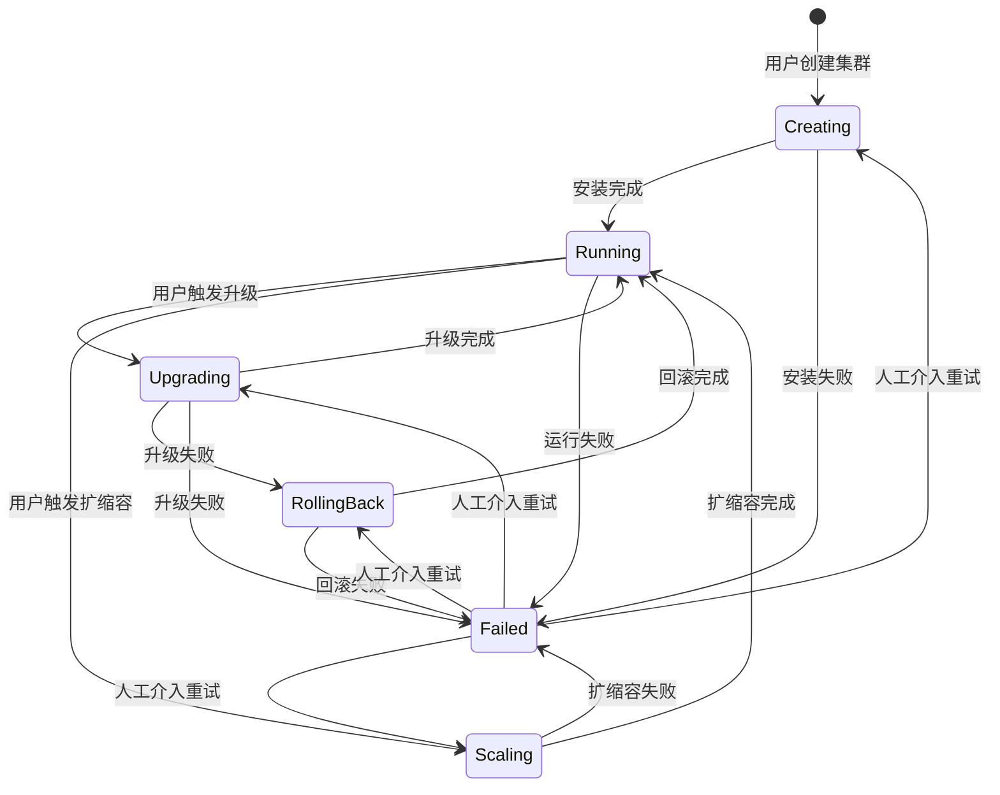
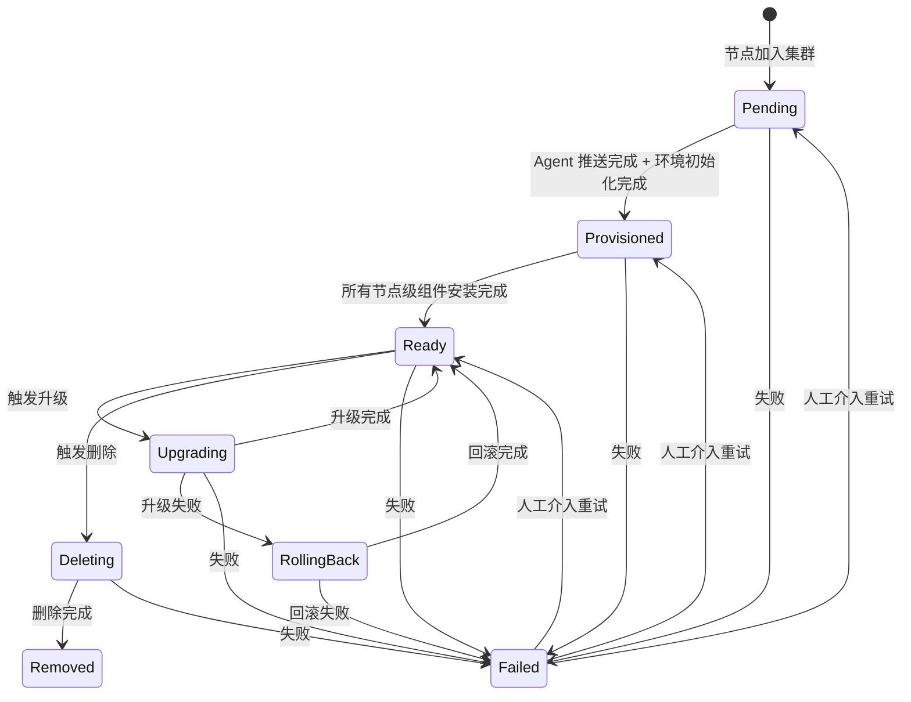
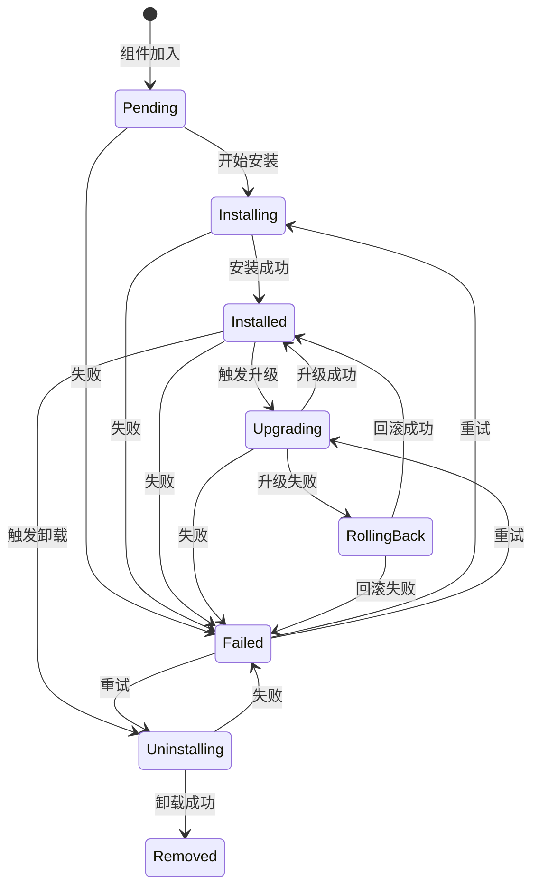

# KEP-6 状态机演进设计（v3 - 混合模型）

> **文档说明**：本文档是 KEP-6 状态机的演进设计，采用**混合模型**（驱动模型 + 聚合模型）。
> - **v2 文档**：[kep6-state-machine-v2.md](./kep6-state-machine-v2.md) - 已有实现的参考
> - **v3 文档**：本文档 - 混合模型设计方案

## 目录

1. [状态模型概览](#1-状态模型概览)
   - [1.1 混合模型架构](#11-混合模型架构)
   - [1.2 驱动模型](#12-驱动模型)
   - [1.3 聚合模型](#13-聚合模型)
   - [1.4 组件类型区分](#14-组件类型区分)
2. [集群层状态机：BKEClusterLifecycle](#2-集群层状态机bkeclusterlifecycle)
   - [2.1 状态定义](#21-状态定义)
   - [2.2 驱动规则](#22-驱动规则)
   - [2.3 状态转换图](#23-状态转换图)
   - [2.4 操作进度追踪](#24-操作进度追踪)
3. [节点层状态机：BKENodeLifecycle](#3-节点层状态机bkenodelifecycle)
   - [3.1 状态定义](#31-状态定义)
   - [3.2 驱动规则](#32-驱动规则)
   - [3.3 状态转换图](#33-状态转换图)
4. [组件层状态机：ComponentLifecycle](#4-组件层状态机componentlifecycle)
   - [4.1 状态定义](#41-状态定义)
   - [4.2 驱动规则](#42-驱动规则)
   - [4.3 状态转换图](#43-状态转换图)
5. [健康状态聚合](#5-健康状态聚合)
   - [5.1 健康状态定义](#51-健康状态定义)
   - [5.2 聚合规则](#52-聚合规则)
   - [5.3 健康检查机制](#53-健康检查机制)
6. [场景驱动的状态转换](#6-场景驱动的状态转换)
   - [6.1 安装场景](#61-安装场景)
   - [6.2 升级场景](#62-升级场景)
   - [6.3 回滚场景](#63-回滚场景)
   - [6.4 扩容场景](#64-扩容场景)
   - [6.5 缩容场景](#65-缩容场景)
7. [重试与幂等性](#7-重试与幂等性)
8. [详细设计](#8-详细设计)
   - [8.1 兼容性分析](#81-兼容性分析)
   - [8.2 API 类型扩展设计](#82-api-类型扩展设计)
   - [8.3 状态机引擎设计](#83-状态机引擎设计)
   - [8.4 健康状态聚合器设计](#84-健康状态聚合器设计)
   - [8.5 兼容性映射设计](#85-兼容性映射设计)
   - [8.6 与现有系统集成设计](#86-与现有系统集成设计)
   - [8.7 人工介入详细设计](#87-人工介入详细设计)
   - [8.8 Feature Gate 设计](#88-feature-gate-设计)
   - [8.9 迁移策略](#89-迁移策略)
   - [8.10 实现文件清单](#810-实现文件清单)
   - [8.11 测试设计](#811-测试设计)

---

## 1. 状态模型概览

### 1.1 混合模型架构

v3 采用**混合模型**，将状态管理分为两个独立的模型：

```
┌─────────────────────────────────────────────────────────────────────────────┐
│                         混合模型架构                                         │
├─────────────────────────────────────────────────────────────────────────────┤
│                                                                              │
│  ┌─────────────────────────────────────────────────────────────────────┐   │
│  │                    驱动模型（自上而下）                               │   │
│  │                                                                     │   │
│  │  用户操作 → 集群状态 → 节点状态 → 组件状态                           │   │
│  │                                                                     │   │
│  │  决定：LifecyclePhase（生命周期阶段）                                │   │
│  │  - Creating, Running, Upgrading, Scaling, RollingBack, Failed      │   │
│  └─────────────────────────────────────────────────────────────────────┘   │
│                                                                              │
│  ┌─────────────────────────────────────────────────────────────────────┐   │
│  │                    聚合模型（自底向上）                               │   │
│  │                                                                     │   │
│  │  组件状态 → 节点状态 → 集群状态                                      │   │
│  │                                                                     │   │
│  │  决定：HealthStatus（健康状态）                                      │   │
│  │  - Healthy, Degraded, Unhealthy, Unknown                           │   │
│  └─────────────────────────────────────────────────────────────────────┘   │
│                                                                              │
└─────────────────────────────────────────────────────────────────────────────┘
```

**核心原则**：
- **驱动模型**：决定集群"正在做什么"（生命周期阶段）
- **聚合模型**：决定集群"健康状况如何"（健康状态）
- **两个模型各司其职，互不干扰**

### 1.2 驱动模型

驱动模型采用**自上而下**的方式，由用户操作驱动状态转换：

```
用户操作（自上而下）：
  用户触发升级 → 集群进入 Upgrading → 节点逐个升级 → 组件逐个升级

状态转换规则：
  集群 LifecyclePhase = 由 OperationProgress 决定
  节点 LifecyclePhase = 由节点操作决定
  组件 LifecyclePhase = 由组件操作决定
```

**优势**：
- ✅ 因果关系清晰：用户操作是原因，状态转换是结果
- ✅ 状态转换规则简单：直接由操作类型决定
- ✅ 进度追踪容易：通过 OperationProgress 追踪操作进度
- ✅ 故障诊断容易：快速定位失败的组件

### 1.3 聚合模型

聚合模型采用**自底向上**的方式，由下层状态聚合出上层健康状态：

```
健康状态聚合（自底向上）：
  组件健康状态 → 节点健康状态 → 集群健康状态

聚合规则：
  集群 HealthStatus = 聚合(所有节点健康状态 + 所有集群级组件健康状态)
  节点 HealthStatus = 聚合(所有节点级组件健康状态)
```

**优势**：
- ✅ 健康状态准确：基于实际组件状态
- ✅ 故障检测及时：快速发现不健康的组件
- ✅ 健康检查灵活：可以自定义健康检查规则

### 1.4 组件类型区分

组件分为**节点级组件**和**集群级组件**两类：

| 组件类型 | 示例 | 聚合目标 | 说明 |
|---------|------|---------|------|
| **节点级组件** | containerd, bkeagent | 节点健康状态 | 运行在特定节点上 |
| **集群级组件** | coredns, kube-proxy | 集群健康状态 | 运行在集群中 |

```go
type ComponentType string

const (
    ComponentTypeNode    ComponentType = "node"    // 节点级组件
    ComponentTypeCluster ComponentType = "cluster" // 集群级组件
)
```

---

## 2. 集群层状态机：BKEClusterLifecycle

### 2.1 状态定义

| 状态 | 说明 | 驱动来源 |
|------|------|---------|
| `Creating` | 集群正在创建（节点加入、Agent 推送、组件安装） | 用户创建集群 |
| `Running` | 集群正在运行（所有组件就绪，服务可用） | 默认状态 |
| `Upgrading` | 集群正在升级（版本变更中） | 用户触发升级 |
| `Scaling` | 集群正在扩容或缩容（节点增减） | 用户触发扩缩容 |
| `RollingBack` | 集群正在回滚（升级失败后恢复） | 升级失败自动触发 |
| `Failed` | 集群失败（需要人工介入） | 操作失败 |

### 2.2 驱动规则

集群层状态由**驱动模型**决定，基于 `OperationProgress` 字段：

```go
// determineLifecyclePhase 由驱动模型决定集群生命周期阶段
func (r *Reconciler) determineLifecyclePhase(cluster *BKECluster) LifecyclePhase {
    // 检查是否有进行中的操作
    if cluster.Status.OperationProgress != nil && 
       cluster.Status.OperationProgress.FinishedAt == nil {
        switch cluster.Status.OperationProgress.OperationType {
        case OperationTypeInstall:
            return ClusterLifecycleCreating
        case OperationTypeUpgrade:
            return ClusterLifecycleUpgrading
        case OperationTypeScale:
            return ClusterLifecycleScaling
        case OperationTypeRollback:
            return ClusterLifecycleRollingBack
        }
    }
    
    // 检查是否失败
    if cluster.Status.OperationProgress != nil &&
       cluster.Status.OperationProgress.LastFailure != nil {
        return ClusterLifecycleFailed
    }
    
    // 默认运行状态
    return ClusterLifecycleRunning
}
```

**驱动规则说明**：
- `Creating`：当 `OperationProgress.OperationType = Install` 且未完成时
- `Running`：当没有进行中的操作且没有失败时
- `Upgrading`：当 `OperationProgress.OperationType = Upgrade` 且未完成时
- `Scaling`：当 `OperationProgress.OperationType = Scale` 且未完成时
- `RollingBack`：当 `OperationProgress.OperationType = Rollback` 且未完成时
- `Failed`：当 `OperationProgress.LastFailure != nil` 时

### 2.3 状态转换图


```mermaid
stateDiagram-v2
    [*] --> Creating : 用户创建集群
    
    Creating --> Running : 安装完成
    Creating --> Failed : 安装失败
    
    Running --> Upgrading : 用户触发升级
    Running --> Scaling : 用户触发扩缩容
    Running --> Failed : 运行失败
    
    Upgrading --> Running : 升级完成
    Upgrading --> RollingBack : 升级失败
    Upgrading --> Failed : 升级失败
    
    RollingBack --> Running : 回滚完成
    RollingBack --> Failed : 回滚失败
    
    Scaling --> Running : 扩缩容完成
    Scaling --> Failed : 扩缩容失败
    
    Failed --> Creating : 人工介入重试
    Failed --> Upgrading : 人工介入重试
    Failed --> Scaling : 人工介入重试
    Failed --> RollingBack : 人工介入重试
```

**状态转换说明**：

**为什么没有 `Failed --> Running`？**

在驱动模型中，`LifecyclePhase` 由操作决定。`Failed` 状态意味着某个操作失败，应该重新执行该操作，而不是直接恢复到 `Running` 状态。

**恢复策略**：

| 失败场景 | 恢复路径 | 说明 |
|---------|---------|------|
| Creating 失败 | `Failed --> Creating` | 重新执行安装操作 |
| Upgrading 失败 | `Failed --> Upgrading` | 重新执行升级操作 |
| Scaling 失败 | `Failed --> Scaling` | 重新执行扩缩容操作 |
| RollingBack 失败 | `Failed --> RollingBack` | 重新执行回滚操作 |

**特殊场景**：

如果操作已经部分完成，管理员可以选择：
1. **重新执行操作**：通过状态机恢复（推荐）
2. **手动完成操作**：通过 API 直接修改状态（不推荐，可能导致状态不一致）

### 2.4 操作进度追踪

所有操作（安装、升级、扩容、缩容、回滚）的进度通过 `OperationProgress` 统一追踪：

```go
type OperationProgress struct {
    // 操作类型
    OperationType OperationType `json:"operationType"`
    
    // 目标版本
    TargetVersion string `json:"targetVersion,omitempty"`
    
    // 开始时间
    StartedAt *metav1.Time `json:"startedAt,omitempty"`
    
    // 完成时间
    FinishedAt *metav1.Time `json:"finishedAt,omitempty"`
    
    // 当前阶段
    CurrentStage string `json:"currentStage,omitempty"`
    
    // 总组件数
    TotalComponents int `json:"totalComponents,omitempty"`
    
    // 已完成组件数
    CompletedComponents int `json:"completedComponents,omitempty"`
    
    // 失败的组件列表
    FailedComponents []string `json:"failedComponents,omitempty"`
    
    // 已完成组件列表
    Completed []ComponentRecord `json:"completed,omitempty"`
    
    // 最后失败记录
    LastFailure *OperationFailureRecord `json:"lastFailure,omitempty"`
    
    // 是否需要人工介入
    NeedsManualIntervention bool `json:"needsManualIntervention,omitempty"`
}

type OperationType string

const (
    OperationTypeInstall  OperationType = "Install"
    OperationTypeUpgrade  OperationType = "Upgrade"
    OperationTypeScale    OperationType = "Scale"
    OperationTypeRollback OperationType = "Rollback"
)
```

**使用场景**：

| 场景 | OperationType | CurrentStage |
|------|---------------|--------------|
| 集群安装 | `Install` | `InstallingNodeComponents` / `InstallingClusterComponents` |
| 集群升级 | `Upgrade` | `UpgradingNodeComponents` / `UpgradingClusterComponents` |
| 集群扩容 | `Scale` | `ScalingUp` |
| 集群缩容 | `Scale` | `ScalingDown` |
| 集群回滚 | `Rollback` | `RollingBackNodeComponents` / `RollingBackClusterComponents` |

---

## 3. 节点层状态机：BKENodeLifecycle

### 3.1 状态定义

| 状态 | 说明 | 驱动来源 |
|------|------|---------|
| `Pending` | 节点等待配置（Agent 推送） | 节点加入集群 |
| `Provisioned` | 节点已配置（Agent 就绪，环境初始化完成） | Agent 推送完成 |
| `Ready` | 节点就绪（所有组件安装完成） | 组件安装完成 |
| `Upgrading` | 节点正在升级（组件升级中） | 用户触发升级 |
| `RollingBack` | 节点正在回滚（升级失败后恢复） | 升级失败自动触发 |
| `Deleting` | 节点正在删除（组件卸载中） | 用户触发删除 |
| `Removed` | 节点已删除 | 删除完成 |
| `Failed` | 节点失败 | 操作失败 |

### 3.2 驱动规则

节点层状态由**驱动模型**决定，基于节点操作：

```go
// determineNodeLifecyclePhase 由驱动模型决定节点生命周期阶段
func (r *Reconciler) determineNodeLifecyclePhase(node *BKENode) LifecyclePhase {
    // 检查是否有进行中的操作
    if node.Status.OperationProgress != nil && 
       node.Status.OperationProgress.FinishedAt == nil {
        switch node.Status.OperationProgress.OperationType {
        case OperationTypeInstall:
            if node.Status.StateCode&NodeAgentReadyFlag != 0 {
                return NodeLifecycleProvisioned
            }
            return NodeLifecyclePending
        case OperationTypeUpgrade:
            return NodeLifecycleUpgrading
        case OperationTypeRollback:
            return NodeLifecycleRollingBack
        case OperationTypeDelete:
            return NodeLifecycleDeleting
        }
    }
    
    // 检查是否失败
    if node.Status.OperationProgress != nil &&
       node.Status.OperationProgress.LastFailure != nil {
        return NodeLifecycleFailed
    }
    
    // 检查是否已删除
    if node.DeletionTimestamp != nil {
        return NodeLifecycleRemoved
    }
    
    // 检查是否就绪
    if allNodeComponentsInstalled(node) {
        return NodeLifecycleReady
    }
    
    return NodeLifecyclePending
}
```

### 3.3 状态转换图


```mermaid
stateDiagram-v2
    [*] --> Pending : 节点加入集群
    
    Pending --> Provisioned : Agent 推送完成 + 环境初始化完成
    Pending --> Failed : 失败
    
    Provisioned --> Ready : 所有节点级组件安装完成
    Provisioned --> Failed : 失败
    
    Ready --> Upgrading : 触发升级
    Ready --> Deleting : 触发删除
    Ready --> Failed : 失败
    
    Upgrading --> Ready : 升级完成
    Upgrading --> RollingBack : 升级失败
    Upgrading --> Failed : 失败
    
    RollingBack --> Ready : 回滚完成
    RollingBack --> Failed : 回滚失败
    
    Deleting --> Removed : 删除完成
    Deleting --> Failed : 失败
    
    Failed --> Pending : 人工介入重试
    Failed --> Provisioned : 人工介入重试
    Failed --> Ready : 人工介入重试
```

---

## 4. 组件层状态机：ComponentLifecycle

### 4.1 状态定义

| 状态 | 说明 | 驱动来源 |
|------|------|---------|
| `Pending` | 组件等待安装 | 组件加入 |
| `Installing` | 组件正在安装 | 开始安装 |
| `Installed` | 组件已安装（运行中） | 安装成功 |
| `Upgrading` | 组件正在升级 | 触发升级 |
| `RollingBack` | 组件正在回滚（升级失败后恢复） | 升级失败自动触发 |
| `Uninstalling` | 组件正在卸载 | 触发卸载 |
| `Removed` | 组件已卸载 | 卸载成功 |
| `Failed` | 组件安装/升级/卸载失败 | 操作失败 |

### 4.2 驱动规则

组件层状态由**驱动模型**决定，基于组件操作：

```go
// determineComponentLifecyclePhase 由驱动模型决定组件生命周期阶段
func (r *Reconciler) determineComponentLifecyclePhase(
    component *ComponentLifecycleStatus,
) LifecyclePhase {
    // 检查是否有进行中的操作
    if component.OperationProgress != nil && 
       component.OperationProgress.FinishedAt == nil {
        switch component.OperationProgress.OperationType {
        case OperationTypeInstall:
            return ComponentLifecycleInstalling
        case OperationTypeUpgrade:
            return ComponentLifecycleUpgrading
        case OperationTypeRollback:
            return ComponentLifecycleRollingBack
        case OperationTypeUninstall:
            return ComponentLifecycleUninstalling
        }
    }
    
    // 检查是否失败
    if component.OperationProgress != nil &&
       component.OperationProgress.LastFailure != nil {
        return ComponentLifecycleFailed
    }
    
    // 检查是否已卸载
    if component.Uninstalled {
        return ComponentLifecycleRemoved
    }
    
    // 检查是否已安装
    if component.Installed {
        return ComponentLifecycleInstalled
    }
    
    return ComponentLifecyclePending
}
```

### 4.3 状态转换图


```mermaid
stateDiagram-v2
    [*] --> Pending : 组件加入
    
    Pending --> Installing : 开始安装
    Pending --> Failed : 失败
    
    Installing --> Installed : 安装成功
    Installing --> Failed : 失败
    
    Installed --> Upgrading : 触发升级
    Installed --> Uninstalling : 触发卸载
    Installed --> Failed : 失败
    
    Upgrading --> Installed : 升级成功
    Upgrading --> RollingBack : 升级失败
    Upgrading --> Failed : 失败
    
    RollingBack --> Installed : 回滚成功
    RollingBack --> Failed : 回滚失败
    
    Uninstalling --> Removed : 卸载成功
    Uninstalling --> Failed : 失败
    
    Failed --> Installing : 重试
    Failed --> Upgrading : 重试
    Failed --> Uninstalling : 重试
```

---

## 5. 健康状态聚合

### 5.1 健康状态定义

```go
type HealthStatus struct {
    // 整体健康状态
    Overall HealthLevel `json:"overall"`
    
    // 健康消息
    Message string `json:"message,omitempty"`
    
    // 节点健康状态
    NodeHealth []NodeHealthStatus `json:"nodeHealth,omitempty"`
    
    // 组件健康状态
    ComponentHealth []ComponentHealthStatus `json:"componentHealth,omitempty"`
    
    // 最后检查时间
    LastCheckTime *metav1.Time `json:"lastCheckTime,omitempty"`
}

type HealthLevel string

const (
    HealthLevelHealthy   HealthLevel = "Healthy"
    HealthLevelDegraded  HealthLevel = "Degraded"
    HealthLevelUnhealthy HealthLevel = "Unhealthy"
    HealthLevelUnknown   HealthLevel = "Unknown"
)

type NodeHealthStatus struct {
    NodeIP  string      `json:"nodeIP"`
    Health  HealthLevel `json:"health"`
    Message string      `json:"message,omitempty"`
}

type ComponentHealthStatus struct {
    Name    string      `json:"name"`
    NodeIP  string      `json:"nodeIP,omitempty"`
    Health  HealthLevel `json:"health"`
    Message string      `json:"message,omitempty"`
}
```

**健康级别说明**：
- `Healthy`：所有组件正常运行
- `Degraded`：部分组件异常，但集群仍可运行
- `Unhealthy`：关键组件异常，集群无法正常运行
- `Unknown`：无法确定健康状态

### 5.2 聚合规则

健康状态由**聚合模型**决定，采用自底向上的方式：

```go
// determineHealthStatus 由聚合模型决定健康状态
func (r *Reconciler) determineHealthStatus(
    nodes []BKENode,
    clusterComponents map[string]ComponentLifecycleStatus,
) *HealthStatus {
    health := &HealthStatus{
        Overall:       HealthLevelHealthy,
        LastCheckTime: &metav1.Time{Time: time.Now()},
    }
    
    // 聚合节点健康状态
    for _, node := range nodes {
        nodeHealth := determineNodeHealth(node)
        health.NodeHealth = append(health.NodeHealth, nodeHealth)
        
        if nodeHealth.Health != HealthLevelHealthy {
            health.Overall = HealthLevelDegraded
        }
    }
    
    // 聚合组件健康状态
    for name, status := range clusterComponents {
        compHealth := determineComponentHealth(status)
        health.ComponentHealth = append(health.ComponentHealth, compHealth)
        
        if compHealth.Health != HealthLevelHealthy {
            health.Overall = HealthLevelDegraded
        }
    }
    
    // 检查是否有 Unhealthy 状态
    if hasUnhealthyNode(nodes) || hasUnhealthyComponent(clusterComponents) {
        health.Overall = HealthLevelUnhealthy
    }
    
    return health
}

// determineNodeHealth 确定节点健康状态
func determineNodeHealth(node BKENode) NodeHealthStatus {
    health := NodeHealthStatus{
        NodeIP: node.Spec.IP,
        Health: HealthLevelHealthy,
    }
    
    // 检查节点级组件健康状态
    for _, comp := range node.Status.Components {
        if comp.Phase == ComponentLifecycleFailed {
            health.Health = HealthLevelUnhealthy
            health.Message = fmt.Sprintf("Component %s failed", comp.Name)
            break
        }
        if comp.Phase != ComponentLifecycleInstalled {
            health.Health = HealthLevelDegraded
        }
    }
    
    return health
}

// determineComponentHealth 确定组件健康状态
func determineComponentHealth(status ComponentLifecycleStatus) ComponentHealthStatus {
    health := ComponentHealthStatus{
        Name:   status.Name,
        NodeIP: status.NodeIP,
        Health: HealthLevelHealthy,
    }
    
    if status.Phase == ComponentLifecycleFailed {
        health.Health = HealthLevelUnhealthy
        health.Message = status.Message
    } else if status.Phase != ComponentLifecycleInstalled {
        health.Health = HealthLevelDegraded
    }
    
    return health
}
```

**聚合规则说明**：
- 所有组件 `Installed` → 集群 `Healthy`
- 任意组件 `Failed` → 集群 `Unhealthy`
- 任意组件非 `Installed` → 集群 `Degraded`

### 5.3 健康检查机制

健康检查由聚合模型定期执行：

```go
// HealthChecker 健康检查器
type HealthChecker struct {
    client.Client
}

// CheckClusterHealth 检查集群健康状态
func (c *HealthChecker) CheckClusterHealth(
    ctx context.Context,
    cluster *BKECluster,
) (*HealthStatus, error) {
    // 获取所有节点
    nodes := &BKENodeList{}
    if err := c.List(ctx, nodes, client.InNamespace(cluster.Namespace)); err != nil {
        return nil, err
    }
    
    // 获取集群级组件状态
    clusterComponents := cluster.Status.ClusterComponentStatuses
    
    // 聚合健康状态
    health := determineHealthStatus(nodes.Items, clusterComponents)
    
    return health, nil
}
```

---

## 6. 场景驱动的状态转换

### 6.1 安装场景

**状态转换时序**：

```
T0: 用户创建集群
    LifecyclePhase = Creating
    OperationProgress = {Type: Install, StartedAt: now}
    HealthStatus = Unknown

T1: 开始安装节点级组件
    LifecyclePhase = Creating（不变）
    OperationProgress.CurrentStage = "InstallingNodeComponents"
    OperationProgress.TotalComponents = 10
    OperationProgress.CompletedComponents = 0
    HealthStatus = Unknown

T2: 节点级组件安装完成
    LifecyclePhase = Creating（不变）
    OperationProgress.CompletedComponents = 10
    HealthStatus = Degraded（部分组件安装中）

T3: 开始安装集群级组件
    LifecyclePhase = Creating（不变）
    OperationProgress.CurrentStage = "InstallingClusterComponents"
    OperationProgress.TotalComponents = 5
    OperationProgress.CompletedComponents = 0
    HealthStatus = Degraded

T4: 集群级组件安装完成
    LifecyclePhase = Running
    OperationProgress.FinishedAt = now
    HealthStatus = Healthy
```

### 6.2 升级场景

**状态转换时序**：

```
T0: 用户触发升级
    LifecyclePhase = Upgrading
    OperationProgress = {Type: Upgrade, TargetVersion: v2.6.0, StartedAt: now}
    HealthStatus = Healthy（升级前）

T1: 开始升级节点级组件
    LifecyclePhase = Upgrading（不变）
    OperationProgress.CurrentStage = "UpgradingNodeComponents"
    OperationProgress.TotalComponents = 10
    OperationProgress.CompletedComponents = 0
    HealthStatus = Degraded（部分组件升级中）

T2: 节点级组件升级完成
    LifecyclePhase = Upgrading（不变）
    OperationProgress.CompletedComponents = 10
    HealthStatus = Degraded

T3: 开始升级集群级组件
    LifecyclePhase = Upgrading（不变）
    OperationProgress.CurrentStage = "UpgradingClusterComponents"
    OperationProgress.TotalComponents = 5
    OperationProgress.CompletedComponents = 0
    HealthStatus = Degraded

T4: 集群级组件升级完成
    LifecyclePhase = Running
    OperationProgress.FinishedAt = now
    HealthStatus = Healthy（升级后）
```

### 6.3 回滚场景

**状态转换时序**：

```
T0: 升级失败，触发回滚
    LifecyclePhase = RollingBack
    OperationProgress = {Type: Rollback, StartedAt: now}
    HealthStatus = Unhealthy（升级失败）

T1: 开始回滚节点级组件
    LifecyclePhase = RollingBack（不变）
    OperationProgress.CurrentStage = "RollingBackNodeComponents"
    HealthStatus = Unhealthy

T2: 节点级组件回滚完成
    LifecyclePhase = RollingBack（不变）
    HealthStatus = Degraded

T3: 开始回滚集群级组件
    LifecyclePhase = RollingBack（不变）
    OperationProgress.CurrentStage = "RollingBackClusterComponents"
    HealthStatus = Degraded

T4: 集群级组件回滚完成
    LifecyclePhase = Running
    OperationProgress.FinishedAt = now
    HealthStatus = Healthy（回滚后）
```

### 6.4 扩容场景

**状态转换时序**：

```
T0: 用户触发扩容
    LifecyclePhase = Scaling
    OperationProgress = {Type: Scale, StartedAt: now}
    HealthStatus = Healthy（扩容前）

T1: 新节点加入
    LifecyclePhase = Scaling（不变）
    OperationProgress.CurrentStage = "ScalingUp"
    HealthStatus = Degraded（新节点未就绪）

T2: 新节点就绪
    LifecyclePhase = Running
    OperationProgress.FinishedAt = now
    HealthStatus = Healthy（扩容后）
```

### 6.5 缩容场景

**状态转换时序**：

```
T0: 用户触发缩容
    LifecyclePhase = Scaling
    OperationProgress = {Type: Scale, StartedAt: now}
    HealthStatus = Healthy（缩容前）

T1: 节点标记删除
    LifecyclePhase = Scaling（不变）
    OperationProgress.CurrentStage = "ScalingDown"
    HealthStatus = Degraded（节点删除中）

T2: 节点删除完成
    LifecyclePhase = Running
    OperationProgress.FinishedAt = now
    HealthStatus = Healthy（缩容后）
```

---

## 7. 重试与幂等性

（保留原有设计，详见 v3 文档）

---

## 8. 详细设计

### 8.1 兼容性分析

（保留原有设计，详见 v3 文档）

### 8.2 API 类型扩展设计

**新增类型**：

```go
// HealthStatus 健康状态
type HealthStatus struct {
    Overall         HealthLevel              `json:"overall"`
    Message         string                   `json:"message,omitempty"`
    NodeHealth      []NodeHealthStatus       `json:"nodeHealth,omitempty"`
    ComponentHealth []ComponentHealthStatus  `json:"componentHealth,omitempty"`
    LastCheckTime   *metav1.Time             `json:"lastCheckTime,omitempty"`
}

type HealthLevel string

const (
    HealthLevelHealthy   HealthLevel = "Healthy"
    HealthLevelDegraded  HealthLevel = "Degraded"
    HealthLevelUnhealthy HealthLevel = "Unhealthy"
    HealthLevelUnknown   HealthLevel = "Unknown"
)

type NodeHealthStatus struct {
    NodeIP  string      `json:"nodeIP"`
    Health  HealthLevel `json:"health"`
    Message string      `json:"message,omitempty"`
}

type ComponentHealthStatus struct {
    Name    string      `json:"name"`
    NodeIP  string      `json:"nodeIP,omitempty"`
    Health  HealthLevel `json:"health"`
    Message string      `json:"message,omitempty"`
}
```

**增强类型**：

```go
type OperationProgress struct {
    OperationType       OperationType           `json:"operationType"`
    TargetVersion       string                  `json:"targetVersion,omitempty"`
    StartedAt           *metav1.Time            `json:"startedAt,omitempty"`
    FinishedAt          *metav1.Time            `json:"finishedAt,omitempty"`
    
    // 新增字段
    CurrentStage        string                  `json:"currentStage,omitempty"`
    TotalComponents     int                     `json:"totalComponents,omitempty"`
    CompletedComponents int                     `json:"completedComponents,omitempty"`
    FailedComponents    []string                `json:"failedComponents,omitempty"`
    
    // 现有字段
    Completed           []ComponentRecord       `json:"completed,omitempty"`
    LastFailure         *OperationFailureRecord `json:"lastFailure,omitempty"`
    NeedsManualIntervention bool                `json:"needsManualIntervention,omitempty"`
}
```

**修改类型**：

```go
type BKEClusterStatus struct {
    // 现有字段
    Ready              bool                       `json:"ready"`
    OpenFuyaoVersion   string                     `json:"openFuyaoVersion,omitempty"`
    KubernetesVersion  string                     `json:"kubernetesVersion,omitempty"`
    EtcdVersion        string                     `json:"etcdVersion,omitempty"`
    ContainerdVersion  string                     `json:"containerdVersion,omitempty"`
    AgentStatus        BKEAgentStatus             `json:"agentStatus"`
    Phase              BKEClusterPhase            `json:"phase,omitempty"`
    ClusterStatus      ClusterStatus              `json:"clusterStatus,omitempty"`
    ClusterHealthState ClusterHealthState         `json:"clusterHealthState,omitempty"`
    AddonStatus        []Product                  `json:"addonStatus,omitempty"`
    PhaseStatus        PhaseStatus                `json:"phaseStatus,omitempty"`
    Conditions         ClusterConditions          `json:"conditions,omitempty"`
    DeclarativeUpgrade *DeclarativeUpgradeStatus  `json:"declarativeUpgrade,omitempty"`
    
    // v3 字段（更新）
    LifecyclePhase      LifecyclePhase            `json:"lifecyclePhase,omitempty"`
    HealthStatus        *HealthStatus             `json:"healthStatus,omitempty"` // 新增
    OperationProgress   *OperationProgress        `json:"operationProgress,omitempty"` // 增强
    NodeComponentStatuses map[string]map[string]ComponentLifecycleStatus `json:"nodeComponentStatuses,omitempty"`
    ClusterComponentStatuses map[string]ComponentLifecycleStatus `json:"clusterComponentStatuses,omitempty"`
}
```

### 8.3 状态机引擎设计

（保留原有设计，详见 v3 文档）

### 8.4 健康状态聚合器设计

**文件**：`pkg/statemachine/health_aggregator.go`

```go
package statemachine

// HealthAggregator 健康状态聚合器
type HealthAggregator struct{}

// AggregateClusterHealth 聚合集群健康状态
func (a *HealthAggregator) AggregateClusterHealth(
    nodes []confv1beta1.BKENode,
    clusterComponents map[string]confv1beta1.ComponentLifecycleStatus,
) *confv1beta1.HealthStatus {
    health := &confv1beta1.HealthStatus{
        Overall:       confv1beta1.HealthLevelHealthy,
        LastCheckTime: &metav1.Time{Time: time.Now()},
    }
    
    // 聚合节点健康状态
    for _, node := range nodes {
        nodeHealth := a.aggregateNodeHealth(node)
        health.NodeHealth = append(health.NodeHealth, nodeHealth)
        
        if nodeHealth.Health != confv1beta1.HealthLevelHealthy {
            health.Overall = confv1beta1.HealthLevelDegraded
        }
    }
    
    // 聚合组件健康状态
    for name, status := range clusterComponents {
        compHealth := a.aggregateComponentHealth(status)
        health.ComponentHealth = append(health.ComponentHealth, compHealth)
        
        if compHealth.Health != confv1beta1.HealthLevelHealthy {
            health.Overall = confv1beta1.HealthLevelDegraded
        }
    }
    
    // 检查是否有 Unhealthy 状态
    if a.hasUnhealthyNode(nodes) || a.hasUnhealthyComponent(clusterComponents) {
        health.Overall = confv1beta1.HealthLevelUnhealthy
    }
    
    return health
}

// aggregateNodeHealth 聚合节点健康状态
func (a *HealthAggregator) aggregateNodeHealth(node confv1beta1.BKENode) confv1beta1.NodeHealthStatus {
    health := confv1beta1.NodeHealthStatus{
        NodeIP: node.Spec.IP,
        Health: confv1beta1.HealthLevelHealthy,
    }
    
    // 检查节点级组件健康状态
    for _, comp := range node.Status.Components {
        if comp.Phase == confv1beta1.ComponentLifecycleFailed {
            health.Health = confv1beta1.HealthLevelUnhealthy
            health.Message = fmt.Sprintf("Component %s failed", comp.Name)
            break
        }
        if comp.Phase != confv1beta1.ComponentLifecycleInstalled {
            health.Health = confv1beta1.HealthLevelDegraded
        }
    }
    
    return health
}

// aggregateComponentHealth 聚合组件健康状态
func (a *HealthAggregator) aggregateComponentHealth(status confv1beta1.ComponentLifecycleStatus) confv1beta1.ComponentHealthStatus {
    health := confv1beta1.ComponentHealthStatus{
        Name:   status.Name,
        NodeIP: status.NodeIP,
        Health: confv1beta1.HealthLevelHealthy,
    }
    
    if status.Phase == confv1beta1.ComponentLifecycleFailed {
        health.Health = confv1beta1.HealthLevelUnhealthy
        health.Message = status.Message
    } else if status.Phase != confv1beta1.ComponentLifecycleInstalled {
        health.Health = confv1beta1.HealthLevelDegraded
    }
    
    return health
}

// hasUnhealthyNode 检查是否有不健康的节点
func (a *HealthAggregator) hasUnhealthyNode(nodes []confv1beta1.BKENode) bool {
    for _, node := range nodes {
        for _, comp := range node.Status.Components {
            if comp.Phase == confv1beta1.ComponentLifecycleFailed {
                return true
            }
        }
    }
    return false
}

// hasUnhealthyComponent 检查是否有不健康的组件
func (a *HealthAggregator) hasUnhealthyComponent(components map[string]confv1beta1.ComponentLifecycleStatus) bool {
    for _, status := range components {
        if status.Phase == confv1beta1.ComponentLifecycleFailed {
            return true
        }
    }
    return false
}
```

### 8.5 兼容性映射设计

（保留原有设计，详见 v3 文档）

### 8.6 与现有系统集成设计

**集成点**：

```go
// 在 bkecluster_controller.go 的 Reconcile 方法中集成
func (r *BKEClusterReconciler) Reconcile(ctx context.Context, req ctrl.Request) (ctrl.Result, error) {
    cluster := &bkev1beta1.BKECluster{}
    if err := r.Get(ctx, req.NamespacedName, cluster); err != nil {
        return ctrl.Result{}, err
    }
    
    // 1. 确定生命周期阶段（驱动模型）
    lifecyclePhase := r.determineLifecyclePhase(cluster)
    cluster.Status.LifecyclePhase = lifecyclePhase
    
    // 2. 确定健康状态（聚合模型）
    nodes := &bkev1beta1.BKENodeList{}
    if err := r.List(ctx, nodes, client.InNamespace(cluster.Namespace)); err != nil {
        return ctrl.Result{}, err
    }
    
    healthAggregator := &statemachine.HealthAggregator{}
    healthStatus := healthAggregator.AggregateClusterHealth(nodes.Items, cluster.Status.ClusterComponentStatuses)
    cluster.Status.HealthStatus = healthStatus
    
    // 3. 同步到旧字段（兼容性）
    statemachine.SyncClusterPhaseToLegacyFields(cluster, lifecyclePhase)
    
    // 4. 更新状态
    if err := r.Status().Update(ctx, cluster); err != nil {
        return ctrl.Result{}, err
    }
    
    return ctrl.Result{}, nil
}
```

### 8.7 人工介入详细设计

（保留原有设计，详见 v3 文档）

### 8.8 Feature Gate 设计

（保留原有设计，详见 v3 文档）

### 8.9 迁移策略

（保留原有设计，详见 v3 文档）

### 8.10 实现文件清单

**新增文件**：

```
pkg/statemachine/
├── health_aggregator.go  # 健康状态聚合器
└── health_checker.go     # 健康检查器

api/bkecommon/v1beta1/
└── health_status.go      # 健康状态类型定义
```

**修改文件**：

```
pkg/statemachine/
├── aggregator.go         # 移除集群状态聚合逻辑
├── cluster_machine.go    # 更新状态转换规则
└── engine.go             # 集成驱动模型

controllers/capbke/
└── bkecluster_controller.go  # 新增驱动模型逻辑

api/bkecommon/v1beta1/
├── lifecycle_types.go        # 新增 HealthStatus 类型
└── operation_progress.go     # 增强 OperationProgress 类型
```

### 8.11 测试设计

**新增测试**：

```
pkg/statemachine/
├── health_aggregator_test.go  # 健康状态聚合器测试
└── health_checker_test.go     # 健康检查器测试

controllers/capbke/
└── bkecluster_controller_lifecycle_test.go  # 生命周期阶段测试
```

---

**文档版本**: v3.0 (混合模型)  
**维护者**: openFuyao Team
