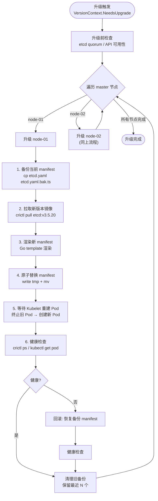
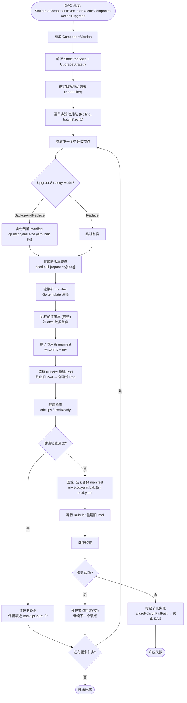
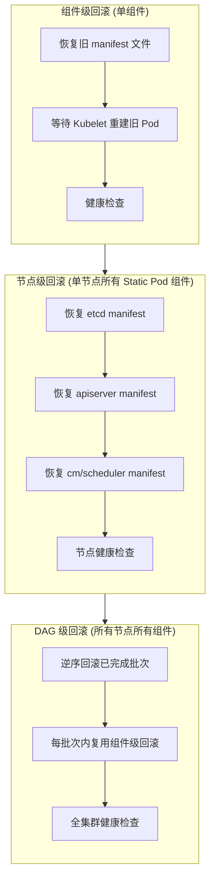
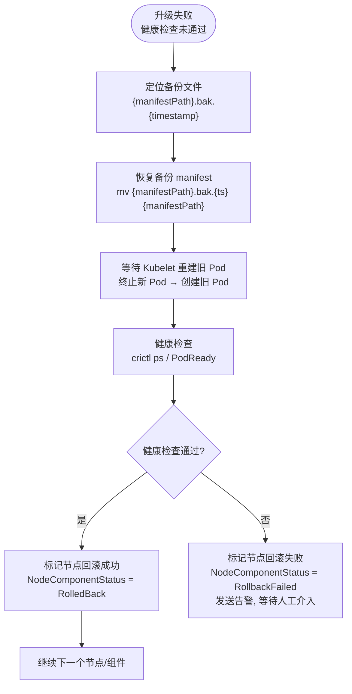
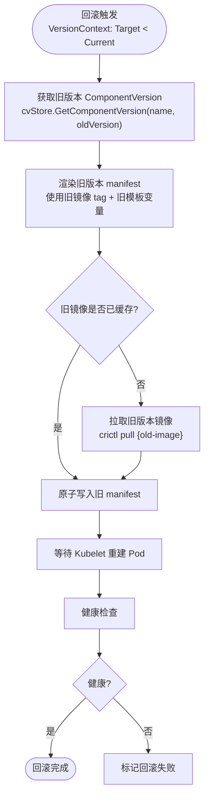
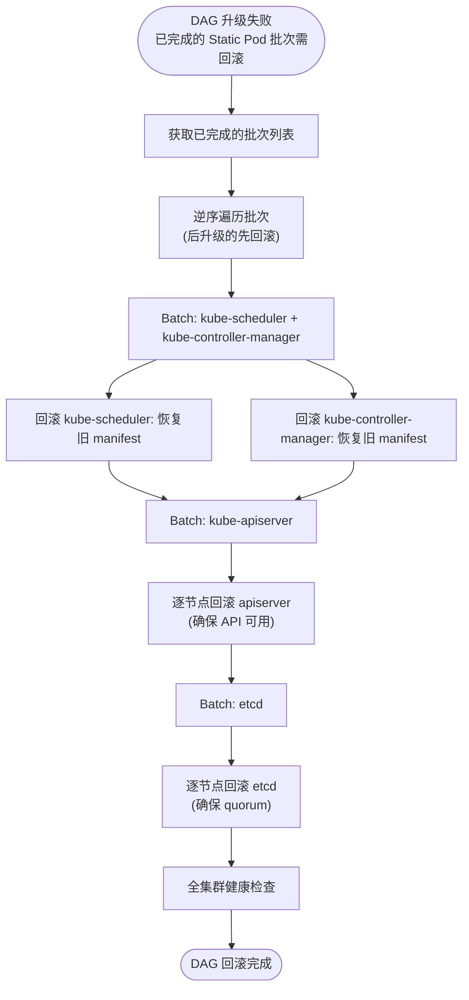
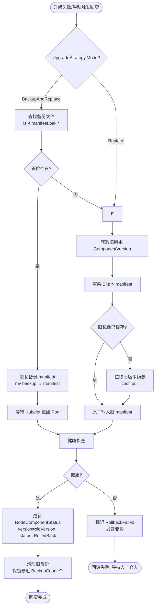

# KEP-9: Static Pod 类型组件升级框架支持设计

| 字段 | 值 |
|------|-----|
| **KEP 编号** | KEP-9 |
| **标题** | Static Pod 类型组件升级框架支持设计 |
| **状态** | `provisional` |
| **类型** | Feature |
| **作者** | openFuyao Team |
| **创建日期** | 2026-08-25 |
| **依赖** | KEP-5 声明式升级框架、KEP-6 三层状态机设计、staticpod-type-design.md |

---

## 1. 摘要

本提案在 openFuyao 声明式升级框架中新增 `staticpod` 组件类型，用于管理通过 Static Pod 方式部署的 Kubernetes 控制面组件和高可用组件。当前框架已支持 `inline`、`yaml`、`helm` 三种组件类型，但 etcd、kube-apiserver、kube-controller-manager、kube-scheduler、haproxy、keepalived 等 Static Pod 组件仍通过 `inline` Phase 硬编码在 BKECluster Controller 中执行，无法享受声明式组件管理的优势。本提案设计 `StaticPodInstaller` 和 `StaticPodComponentExecutor`，将 Static Pod 组件纳入 DAG 统一调度，实现镜像预拉取、manifest 渲染、原子写入、健康检查的声明式管理。

## 2. 动机

### 2.1 现状痛点

| 问题 | 现状 | 影响 |
|------|------|------|
| **硬编码执行** | etcd/apiserver 等通过 `EnsureEtcdUpgrade`/`EnsureMasterUpgrade` Inline Phase 执行 | 无法通过 ComponentVersion 声明式管理 |
| **升级逻辑分散** | Static Pod 升级逻辑散落在各 Phase 文件中 | 重复代码，维护困难 |
| **缺乏通用安装器** | 无统一的镜像拉取 + manifest 渲染 + 健康检查框架 | 新增 Static Pod 组件需侵入核心控制器 |
| **版本追踪缺失** | Static Pod 组件版本未纳入 `ClusterComponentStatuses` 追踪 | 无法统一查询组件状态 |

### 2.2 组件类型分类矩阵

```
┌─────────────────────────────────────────────────────────────────────────────────┐
│                          组件类型分类矩阵                                        │
└─────────────────────────────────────────────────────────────────────────────────┘

                    ┌─────────────────────────────────────────────────────────┐
                    │              部署目标                                     │
                    │   节点级 (SSH)          集群级 (K8s API)                  │
          ┌─────────┼─────────────────────┬───────────────────────────────────┤
          │ 二进制   │ binary              │ (不适用)                          │
  制品    │         │ containerd          │                                   │
  类型    │         │ bkeagent            │                                   │
          │         │ kubelet/kubectl     │                                   │
          ├─────────┼─────────────────────┼───────────────────────────────────┤
          │ OCI镜像  │ staticpod 🆕        │ helm / yaml                       │
          │         │ etcd                │ coredns                           │
          │         │ apiserver/cm/sched  │ calico                            │
          │         │ haproxy/keepalived  │ monitoring                        │
          └─────────┴─────────────────────┴───────────────────────────────────┘
```

### 2.3 为什么不用现有类型

| 维度 | binary 类型 | yaml 类型 | Static Pod 组件 | 结论 |
|------|------------|----------|----------------|------|
| **制品类型** | 二进制文件 | YAML 清单 | OCI 镜像 | ❌ 不匹配 binary |
| **部署目标** | 节点级 (SSH) | 集群级 (K8s API) | 节点级 (`/etc/kubernetes/manifests/`) | ❌ 不匹配 yaml |
| **服务管理** | systemd | K8s Controller | Kubelet 本地文件监控 | ❌ 不匹配 |
| **镜像预拉取** | 不涉及 | 不涉及 | 需要 crictl pull | ❌ 不匹配 |
| **升级方式** | 替换二进制 | Apply 清单 | 替换 manifest YAML → Kubelet 自动重建 | ❌ 不匹配 |

## 3. 范围与约束

### 3.1 范围

| 范围 | 说明 |
|------|------|
| **CRD 扩展** | ComponentVersion 新增 `staticpod` 类型字段定义 |
| **核心安装器** | StaticPodInstaller（镜像预拉取 + manifest 渲染 + SSH 写入 + 健康检查） |
| **DAG 集成** | StaticPodComponentExecutor 注册到 ExecutorRegistry |
| **组件迁移** | 从 Inline Phase 迁移到 staticpod 类型 ComponentVersion |

### 3.2 约束

| 约束 | 说明 |
|------|------|
| **SSH 执行** | Static Pod 组件通过 SSH 写入节点文件系统 |
| **Kubelet 管理** | Pod 生命周期由 Kubelet 本地文件监控管理，非 K8s API |
| **原子写入** | manifest 文件必须原子写入（write tmp + mv），避免半截文件 |
| **滚动升级** | 逐节点滚动，保持集群可用（etcd/apiserver 需保持多数派） |
| **幂等性** | 所有操作必须幂等，支持 Reconcile 重入 |

### 3.3 待改造组件清单

| 组件名称 | 当前 Phase | 镜像 | 适用角色 | 改造优先级 | 说明 |
|---------|-----------|------|---------|-----------|------|
| **etcd** | `EnsureEtcdUpgrade` | etcd 镜像 | master | P0 | 分布式 KV 存储 |
| **kube-apiserver** | `EnsureMasterUpgrade` | kube-apiserver 镜像 | master | P0 | K8s API Server |
| **kube-controller-manager** | `EnsureMasterUpgrade` | kube-controller-manager 镜像 | master | P0 | K8s 控制器管理器 |
| **kube-scheduler** | `EnsureMasterUpgrade` | kube-scheduler 镜像 | master | P0 | K8s 调度器 |
| **haproxy** | `EnsureLoadBalance` | haproxy 镜像 | master | P1 | 负载均衡器 |
| **keepalived** | `EnsureLoadBalance` | keepalived 镜像 | master | P1 | VIP 管理 |

---

## 4. StaticPodSpec 类型定义

### 4.1 Go 类型定义

```go
// api/v1alpha1/componentversion_types.go

// StaticPodSpec 定义 Static Pod 组件规格 🆕新增
type StaticPodSpec struct {
    // 自定义变量 (可覆盖默认值)
    Variables map[string]string `json:"variables,omitempty"`
    
    // OCI 镜像配置
    Image StaticPodImageSpec `json:"image"`
    
    // Static Pod YAML 模板 (Go template 语法)
    // 渲染后写入 ManifestPath 指定的路径
    ManifestTemplate string `json:"manifestTemplate"`
    
    // Manifest 文件目标路径 (节点上的绝对路径)
    // 默认: "/etc/kubernetes/manifests/<component-name>.yaml"
    ManifestPath string `json:"manifestPath,omitempty"`
    
    // 镜像预拉取配置
    ImagePull ImagePullSpec `json:"imagePull,omitempty"`
    
    // 前置安装脚本 (镜像拉取后、YAML 写入前执行)
    PreInstallScripts []string `json:"preInstallScripts,omitempty"`
    
    // 后置安装脚本 (YAML 写入后执行)
    PostInstallScripts []string `json:"postInstallScripts,omitempty"`
    
    // 卸载脚本 (删除 YAML 文件后执行)
    UninstallScript string `json:"uninstallScript,omitempty"`
    
    // 数据目录 (组件持久化数据路径)
    DataDir string `json:"dataDir,omitempty"`
    
    // 配置文件目录 (组件配置路径)
    ConfigDir string `json:"configDir,omitempty"`
    
    // 日志目录 (组件日志路径)
    LogDir string `json:"logDir,omitempty"`
    
    // 支持的架构列表
    SupportedArchitectures []string `json:"supportedArchitectures"`
    
    // 支持的操作系统列表
    SupportedOS []OSSpec `json:"supportedOS"`
    
    // 健康检查配置
    HealthCheck *StaticPodHealthCheckSpec `json:"healthCheck,omitempty"`
    
    // 升级策略 (Static Pod 特有)
    UpgradeStrategy *StaticPodUpgradeStrategySpec `json:"upgradeStrategy,omitempty"`
}

// StaticPodImageSpec 定义 Static Pod 镜像配置
type StaticPodImageSpec struct {
    // 镜像地址 (支持模板变量)
    Repository string `json:"repository"`
    
    // 镜像 Tag (支持模板变量)
    Tag string `json:"tag"`
    
    // 镜像拉取策略: Always / IfNotPresent / Never
    PullPolicy string `json:"pullPolicy,omitempty"`
    
    // 镜像校验和 (可选, 用于离线环境验证)
    Checksum string `json:"checksum,omitempty"`
}

// ImagePullSpec 定义镜像预拉取配置
type ImagePullSpec struct {
    // 是否启用镜像预拉取
    Enabled *bool `json:"enabled,omitempty"`
    
    // 拉取超时时间
    Timeout string `json:"timeout,omitempty"`
    
    // 拉取重试次数
    RetryCount int `json:"retryCount,omitempty"`
    
    // 容器运行时: containerd / docker
    Runtime string `json:"runtime,omitempty"`
}

// StaticPodHealthCheckSpec 定义 Static Pod 健康检查规格
type StaticPodHealthCheckSpec struct {
    // 是否启用健康检查
    Enabled bool `json:"enabled"`
    
    // 等待超时时间 (默认 3m)
    Timeout string `json:"timeout,omitempty"`
    
    // 重试间隔 (默认 5s)
    Interval string `json:"interval,omitempty"`
    
    // 健康检查脚本 (Go template, 通过 SSH 执行)
    // 退出码 0 = 健康, 非零 = 不健康
    Script string `json:"script,omitempty"`
    
    // Pod 就绪检查 (可选, 更精确的检查方式)
    PodReady *StaticPodReadyCheckSpec `json:"podReady,omitempty"`
}

// StaticPodReadyCheckSpec 定义 Pod 就绪检查
type StaticPodReadyCheckSpec struct {
    PodName       string `json:"podName"`
    Namespace     string `json:"namespace,omitempty"`
    ContainerName string `json:"containerName,omitempty"`
    MinReady      int    `json:"minReady,omitempty"`
}

// StaticPodUpgradeStrategySpec 定义 Static Pod 升级策略
type StaticPodUpgradeStrategySpec struct {
    // 升级模式: Replace / BackupAndReplace
    Mode string `json:"mode,omitempty"`
    
    // 备份保留数量 (BackupAndReplace 模式下)
    BackupCount int `json:"backupCount,omitempty"`
    
    // Pod 终止宽限期 (秒)
    TerminationGracePeriod int `json:"terminationGracePeriod,omitempty"`
}
```

### 4.2 ComponentVersionSpec 扩展

```go
// ComponentVersionSpec 扩展
type ComponentVersionSpec struct {
    // ... 现有字段 ...
    
    // StaticPod 类型配置 (type=staticpod 时必填) 🆕新增
    StaticPod *StaticPodSpec `json:"staticPod,omitempty"`
}

const (
    // ... 现有类型 ...
    ComponentTypeStaticPod ComponentType = "staticpod" // 🆕新增
)
```

### 4.3 ComponentVersion YAML 示例（etcd）

```yaml
# bke-manifests/etcd/v3.5.20/component.yaml
apiVersion: config.openfuyao.cn/v1alpha1
kind: ComponentVersion
metadata:
  name: etcd-v3.5.20
spec:
  name: etcd
  type: staticpod
  version: v3.5.20

  staticPod:
    variables:
      dataDir: "/var/lib/openFuyao/etcd"
      peerPort: "2380"
      clientPort: "2379"
      metricsPort: "2381"

    image:
      repository: "{{imageRegistry}}/kubernetes/etcd"
      tag: "{{etcdVersion}}"
      pullPolicy: IfNotPresent

    manifestPath: "/etc/kubernetes/manifests/etcd.yaml"
    
    manifestTemplate: |
      apiVersion: v1
      kind: Pod
      metadata:
        name: etcd
        namespace: kube-system
        labels:
          component: etcd
          tier: control-plane
      spec:
        hostNetwork: true
        priorityClassName: system-node-critical
        containers:
          - name: etcd
            image: {{.StaticPod.Image.Repository}}:{{.StaticPod.Image.Tag}}
            command:
              - etcd
              - --data-dir={{.Variables.dataDir}}
              - --advertise-client-urls=https://{{nodeIP}}:{{.Variables.clientPort}}
              - --cert-file=/etc/kubernetes/pki/etcd/server.crt
              - --client-cert-auth=true
              - --initial-cluster={{etcdInitialCluster}}
              - --listen-client-urls=https://{{nodeIP}}:{{.Variables.clientPort}},https://127.0.0.1:{{.Variables.clientPort}}
              - --listen-peer-urls=https://{{nodeIP}}:{{.Variables.peerPort}}
              - --name={{nodeName}}
              - --peer-cert-file=/etc/kubernetes/pki/etcd/peer.crt
              - --peer-client-cert-auth=true
              - --peer-key-file=/etc/kubernetes/pki/etcd/peer.key
              - --peer-trusted-ca-file=/etc/kubernetes/pki/etcd/ca.crt
              - --trusted-ca-file=/etc/kubernetes/pki/etcd/ca.crt
            volumeMounts:
              - name: etcd-data
                mountPath: {{.Variables.dataDir}}
              - name: etcd-certs
                mountPath: /etc/kubernetes/pki/etcd
                readOnly: true
            livenessProbe:
              httpGet:
                path: /health?serializable=true
                port: {{.Variables.metricsPort}}
                host: 127.0.0.1
              initialDelaySeconds: 10
              periodSeconds: 10
        volumes:
          - name: etcd-data
            hostPath:
              path: {{.Variables.dataDir}}
              type: DirectoryOrCreate
          - name: etcd-certs
            hostPath:
              path: /etc/kubernetes/pki/etcd
              type: DirectoryOrCreate

    preInstallScripts:
      - |
        useradd -r -s /sbin/nologin etcd 2>/dev/null || true
        mkdir -p {{.Variables.dataDir}}
        chown etcd:etcd {{.Variables.dataDir}}
        chmod 700 {{.Variables.dataDir}}

    dataDir: "/var/lib/openFuyao/etcd"
    configDir: "/etc/kubernetes/pki/etcd"

    supportedArchitectures: ["amd64", "arm64"]
    supportedOS:
      - name: centos
        versions: ["7", "8"]
      - name: ubuntu
        versions: ["20.04", "22.04"]

    healthCheck:
      enabled: true
      timeout: "3m"
      interval: "5s"
      podReady:
        podName: "etcd"
        namespace: "kube-system"
        minReady: 1

    upgradeStrategy:
      mode: BackupAndReplace
      backupCount: 3
      terminationGracePeriod: 30

  nodeFilter:
    roles: ["master"]

  dependencies:
    - name: certs
      phase: Install
    - name: kubelet
      phase: Install

  upgradeStrategy:
    mode: Rolling
    batchSize: 1
    timeout: "10m"
    failurePolicy: FailFast
```

---

## 5. StaticPodInstaller 详细设计

### 5.1 核心架构

```
┌─────────────────────────────────────────────────────────────────────────────────┐
│                          StaticPodInstaller 架构                                 │
└─────────────────────────────────────────────────────────────────────────────────┘

┌─────────────────────────────────────────────────────────────────────────────────┐
│  StaticPodInstaller                                                             │
│  ┌────────────────┐  ┌────────────────┐  ┌─────────────────┐                    │
│  │   Image        │  │   Manifest     │  │   SSH           │                    │
│  │   Puller       │  │   Renderer     │  │   Writer        │                    │
│  │                │  │                │  │                 │                    │
│  │  crictl pull   │  │  Go template   │  │  原子写入       │                    │
│  │  docker pull   │  │  渲染 YAML     │  │  manifest 文件  │                    │
│  └────────┬───────┘  └────────┬───────┘  └────────┬────────┘                    │
│           │                   │                   │                              │
│           └───────────────────┼───────────────────┘                              │
│                               ▼                                                │
│                      ┌────────────────┐                                         │
│                      │ HealthChecker  │                                         │
│                      │                │                                         │
│                      │ crictl ps      │                                         │
│                      │ kubectl get pod│                                         │
│                      └────────────────┘                                         │
└─────────────────────────────────────────────────────────────────────────────────┘
```

### 5.2 安装流程

```
    ┌──────────────────────────────┐
    │  1. 加载 ComponentVersion    │
    │  解析 StaticPodSpec          │
    └──────────────┬───────────────┘
                   │
                   ▼
    ┌──────────────────────────────┐
    │  2. 渲染模板变量              │
    │  - image.repository/tag      │
    │  - variables.*               │
    │  - TemplateContext.*         │
    └──────────────┬───────────────┘
                   │
                   ▼
    ┌──────────────────────────────┐
    │  3. 镜像预拉取 (可选)         │
    │  crictl pull / docker pull   │
    └──────────────┬───────────────┘
                   │
                   ▼
    ┌──────────────────────────────┐
    │  4. 执行前置脚本 (可选)       │
    │  创建用户/目录/权限           │
    └──────────────┬───────────────┘
                   │
                   ▼
    ┌──────────────────────────────┐
    │  5. 渲染 Manifest YAML       │
    │  Go template 渲染            │
    └──────────────┬───────────────┘
                   │
                   ▼
    ┌──────────────────────────────┐
    │  6. 原子写入 Manifest 文件   │
    │  write tmp + mv (原子操作)   │
    │  → /etc/kubernetes/manifests/│
    └──────────────┬───────────────┘
                   │
                   ▼
    ┌──────────────────────────────┐
    │  7. 等待 Kubelet 拉起 Pod    │
    │  Kubelet 检测文件变化         │
    │  自动创建 Pod                │
    └──────────────┬───────────────┘
                   │
                   ▼
    ┌──────────────────────────────┐
    │  8. 执行后置脚本 (可选)       │
    └──────────────┬───────────────┘
                   │
                   ▼
    ┌──────────────────────────────┐
    │  9. 健康检查                  │
    │  crictl ps --name <pod>      │
    │  验证 Running 状态            │
    └──────────────────────────────┘
```

### 5.3 升级设计

#### 5.3.1 升级模式概述

Static Pod 组件的升级本质是**替换 manifest YAML 文件**，由 Kubelet 检测文件变化后自动终止旧 Pod、创建新 Pod。根据是否备份旧 manifest，提供两种升级模式：

| 模式 | 机制 | 适用场景 | 回滚能力 |
|------|------|----------|----------|
| **Replace** | 直接覆盖 manifest 文件 | 无状态组件（haproxy、keepalived） | 仅通过重新写入旧 manifest 回滚 |
| **BackupAndReplace** | 先备份旧 manifest，再覆盖 | 有状态/核心组件（etcd、apiserver） | 自动回滚到备份版本 |

#### 5.3.2 滚动升级策略

Static Pod 组件均为控制面组件，**必须逐节点滚动升级**（`Rolling` 模式，`batchSize=1`），确保升级期间集群可用：



#### 5.3.3 etcd 升级特殊处理

etcd 是有状态分布式组件，升级时需保证 **quorum（多数派）不丢失**：

| 规则 | 说明 |
|------|------|
| **逐节点升级** | 一次只升级一个 etcd 成员，确保剩余成员构成多数派 |
| **升级前数据备份** | 每个节点升级前执行 `etcdctl snapshot save`（通过 preInstallScripts） |
| **quorum 检查** | 升级前检查 `etcdctl endpoint health --cluster`，确保所有成员健康 |
| **数据兼容性检查** | 跨大版本升级前检查数据格式兼容性（通过 UpgradePath PreCheck） |
| **失败阻塞** | `failurePolicy=FailFast`，任一节点失败立即终止整个 DAG |

```yaml
# etcd 升级前数据备份 (通过 preInstallScripts)
preInstallScripts:
  - |
    # etcd 数据快照备份 (升级前)
    BACKUP_DIR="/backup/etcd/pre-upgrade"
    TIMESTAMP=$(date +%Y%m%d_%H%M%S)
    mkdir -p ${BACKUP_DIR}
    ETCDCTL_API=3 etcdctl snapshot save ${BACKUP_DIR}/etcd_${TIMESTAMP}.db \
      --endpoints=https://127.0.0.1:2379 \
      --cacert=/etc/kubernetes/pki/etcd/ca.crt \
      --cert=/etc/kubernetes/pki/etcd/server.crt \
      --key=/etc/kubernetes/pki/etcd/server.key
    # 验证快照
    ETCDCTL_API=3 etcdctl snapshot status ${BACKUP_DIR}/etcd_${TIMESTAMP}.db --write-out=table
```

#### 5.3.4 kube-apiserver 升级策略

kube-apiserver 升级需保证 **API 持续可用**（多副本场景）：

| 规则 | 说明 |
|------|------|
| **逐节点升级** | 一次只升级一个 apiserver 实例 |
| **API 可用性检查** | 升级前检查 `kubectl get --raw='/readyz'` |
| **等待就绪** | 升级后等待新 Pod Ready 且 `/readyz` 返回 OK |
| **VIP 保持** | haproxy/keepalived 确保VIP始终指向健康的 apiserver |

#### 5.3.5 版本倾斜策略

Static Pod 控制面组件需遵守 Kubernetes 版本倾斜规则：

| 约束 | 规则 | 说明 |
|------|------|------|
| **kubelet vs apiserver** | kubelet ≤ apiserver ±1 minor | kubelet 可以比 apiserver 旧或新最多 1 个小版本 |
| **apiserver vs etcd** | 严格匹配兼容性矩阵 | 通过 ComponentVersion.compatibility.constraints 声明 |
| **apiserver 间** | 所有 apiserver 版本必须一致 | 逐节点升级期间允许短暂版本差异 |
| **cm/scheduler vs apiserver** | 必须与 apiserver 版本一致 | DAG 依赖确保 apiserver 先升级 |

#### 5.3.6 升级健康检查 Gate

每个节点升级后必须通过健康检查才能继续下一个节点：

```go
// pkg/installer/staticpod/health_checker.go

// Wait 等待 Static Pod 就绪，升级期间作为 gate
func (c *StaticPodHealthChecker) Wait(
    ctx context.Context,
    node Node,
    spec *StaticPodHealthCheckSpec,
    execCtx *ExecutionContext,
) error {
    timeout := parseDurationDefault(spec.Timeout, 3*time.Minute)
    interval := parseDurationDefault(spec.Interval, 5*time.Second)
    deadline := time.Now().Add(timeout)

    for time.Now().Before(deadline) {
        // 方式 1: 通过 SSH 执行健康检查脚本
        if spec.Script != "" {
            rendered, _ := c.renderer.Render(spec.Script, execCtx)
            result, err := c.sshClient.RunScript(node, rendered)
            if err == nil && result.ExitCode == 0 {
                return nil // 健康
            }
        }

        // 方式 2: 通过 crictl 检查 Pod 运行状态
        if spec.PodReady != nil {
            ready, _ := c.checkPodReady(ctx, node, spec.PodReady)
            if ready {
                return nil
            }
        }

        time.Sleep(interval)
    }

    return fmt.Errorf("static pod health check timed out after %s on node %s", timeout, node.IP)
}

// checkPodReady 通过 crictl 检查 Pod 状态 (SSH 执行)
func (c *StaticPodHealthChecker) checkPodReady(
    ctx context.Context,
    node Node,
    spec *StaticPodReadyCheckSpec,
) (bool, error) {
    cmd := fmt.Sprintf("crictl ps --name %s --state Running --namespace %s | grep -v NAME | wc -l",
        spec.PodName, spec.Namespace)
    result, err := c.sshClient.RunScript(node, cmd)
    if err != nil {
        return false, err
    }
    count := strings.TrimSpace(result.Stdout)
    return count != "0", nil
}
```

#### 5.3.7 升级流程图（完整）



### 5.4 卸载流程

```
    ┌──────────────────────────────┐
    │  1. 删除 Manifest 文件       │
    │  rm /etc/kubernetes/         │
    │  manifests/<name>.yaml       │
    └──────────────┬───────────────┘
                   │
                   ▼
    ┌──────────────────────────────┐
    │  2. 等待 Kubelet 终止 Pod    │
    │  Kubelet 检测文件删除         │
    │  自动终止 Pod                │
    └──────────────┬───────────────┘
                   │
                   ▼
    ┌──────────────────────────────┐
    │  3. 执行卸载脚本 (可选)       │
    │  清理数据目录/用户/证书       │
    └──────────────────────────────┘
```

### 5.5 回滚设计

#### 5.5.1 设计思路

Static Pod 组件的回滚本质是**恢复旧版本 manifest 文件**，由 Kubelet 检测文件变化后自动终止新 Pod、创建旧 Pod。与 Binary 组件回滚（Uninstall + Install）不同，Static Pod 回滚**不需要卸载**，只需将 manifest 文件恢复到旧版本即可。

| 维度 | Binary 组件回滚 | Static Pod 组件回滚 |
|------|----------------|-------------------|
| **回滚操作** | Uninstall(新) + Install(旧) | 恢复旧 manifest 文件 |
| **镜像处理** | 需重新下载旧版本制品 | 旧镜像通常已缓存（crictl 缓存） |
| **数据处理** | 可能需数据迁移 | etcd 可能需恢复快照 |
| **服务恢复** | SSH 重启服务 | Kubelet 自动重建 Pod |
| **回滚速度** | 分钟级 | 秒级（镜像已缓存时） |

#### 5.5.2 回滚层级



#### 5.5.3 BackupAndReplace 回滚（manifest 级）

`BackupAndReplace` 模式下，升级时已自动备份旧 manifest。回滚 = **恢复备份的 manifest 文件**：



```go
// pkg/installer/staticpod/rollback.go

// Rollback 回滚 Static Pod 组件 (恢复旧 manifest)
func (i *StaticPodInstaller) Rollback(ctx context.Context, execCtx *ExecutionContext) error {
    spec := execCtx.ComponentVersion.Spec.StaticPod
    manifestPath := spec.ManifestPath
    if manifestPath == "" {
        manifestPath = fmt.Sprintf("/etc/kubernetes/manifests/%s.yaml",
            execCtx.ComponentVersion.Spec.Name)
    }

    // 1. 查找最近的备份文件
    backupPath, err := i.findLatestBackup(execCtx.Node, manifestPath)
    if err != nil {
        return fmt.Errorf("no backup found for %s: %w", manifestPath, err)
    }

    // 2. 恢复备份 manifest (原子操作: cp + mv)
    restoreCmd := fmt.Sprintf("cp %s %s.tmp && mv %s.tmp %s",
        backupPath, manifestPath, manifestPath, manifestPath)
    if _, err := i.sshClient.RunScript(execCtx.Node, restoreCmd); err != nil {
        return fmt.Errorf("restore manifest failed: %w", err)
    }

    // 3. 等待 Kubelet 重建旧 Pod
    time.Sleep(5 * time.Second) // 等待 Kubelet 检测文件变化

    // 4. 健康检查
    if spec.HealthCheck != nil && spec.HealthCheck.Enabled {
        if err := i.healthChecker.Wait(ctx, execCtx.Node, spec.HealthCheck, execCtx); err != nil {
            return fmt.Errorf("health check after rollback failed: %w", err)
        }
    }

    return nil
}

// findLatestBackup 查找最近的 manifest 备份文件
func (i *StaticPodInstaller) findLatestBackup(node Node, manifestPath string) (string, error) {
    // 查找 {manifestPath}.bak.* 格式的备份文件，返回最新的
    cmd := fmt.Sprintf("ls -t %s.bak.* 2>/dev/null | head -1", manifestPath)
    result, err := i.sshClient.RunScript(node, cmd)
    if err != nil || result.Stdout == "" {
        return "", fmt.Errorf("no backup file found")
    }
    return strings.TrimSpace(result.Stdout), nil
}
```

#### 5.5.4 旧版本 manifest 渲染回滚（无备份时）

当未使用 `BackupAndReplace` 模式或备份已清理时，通过**渲染旧版本 manifest** 实现回滚：



```go
// RollbackByVersion 通过渲染旧版本 manifest 实现回滚
func (i *StaticPodInstaller) RollbackByVersion(
    ctx context.Context,
    execCtx *ExecutionContext,
    oldCV *ComponentVersion,
) error {
    spec := oldCV.Spec.StaticPod
    manifestPath := spec.ManifestPath
    if manifestPath == "" {
        manifestPath = fmt.Sprintf("/etc/kubernetes/manifests/%s.yaml", oldCV.Spec.Name)
    }

    // 1. 渲染旧版本镜像地址
    imageRef, err := i.renderer.RenderImageRef(spec.Image, execCtx)
    if err != nil {
        return fmt.Errorf("render old image ref: %w", err)
    }

    // 2. 检查旧镜像是否已缓存，未缓存则拉取
    if err := i.ensureImageCached(ctx, execCtx.Node, imageRef); err != nil {
        return fmt.Errorf("ensure old image: %w", err)
    }

    // 3. 渲染旧版本 manifest
    manifest, err := i.renderer.Render(spec.ManifestTemplate, execCtx)
    if err != nil {
        return fmt.Errorf("render old manifest: %w", err)
    }

    // 4. 原子写入旧 manifest
    if err := i.sshClient.AtomicWriteFile(execCtx.Node, manifestPath, manifest, 0644); err != nil {
        return fmt.Errorf("write old manifest: %w", err)
    }

    // 5. 等待 Kubelet 重建 Pod
    time.Sleep(5 * time.Second)

    // 6. 健康检查
    if spec.HealthCheck != nil && spec.HealthCheck.Enabled {
        if err := i.healthChecker.Wait(ctx, execCtx.Node, spec.HealthCheck, execCtx); err != nil {
            return fmt.Errorf("health check after rollback failed: %w", err)
        }
    }

    return nil
}

// ensureImageCached 检查镜像是否已缓存，未缓存则拉取
func (i *StaticPodInstaller) ensureImageCached(ctx context.Context, node Node, imageRef string) error {
    // 检查镜像是否已存在于 crictl 缓存
    checkCmd := fmt.Sprintf("crictl images | grep -q '%s' && echo 'cached' || echo 'missing'", imageRef)
    result, err := i.sshClient.RunScript(node, checkCmd)
    if err == nil && strings.TrimSpace(result.Stdout) == "cached" {
        return nil // 镜像已缓存
    }
    // 镜像未缓存，执行拉取
    return i.imagePuller.Pull(ctx, node, imageRef, &ImagePullSpec{RetryCount: 3, Timeout: "5m"})
}
```

#### 5.5.5 etcd 回滚特殊处理

etcd 是有状态组件，回滚需考虑**数据兼容性**：

| 场景 | 回滚方式 | 数据处理 |
|------|----------|----------|
| **同小版本回滚** (v3.5.20 → v3.5.19) | 恢复旧 manifest | 数据无需处理 |
| **跨小版本回滚** (v3.5.x → v3.5.y) | 恢复旧 manifest | 数据通常向后兼容 |
| **跨大版本回滚** (v3.6.x → v3.5.x) | 恢复旧 manifest + 数据恢复 | **需恢复升级前 etcd 快照** |
| **数据损坏** | 恢复旧 manifest + 数据恢复 | **需恢复升级前 etcd 快照** |

```yaml
# etcd ComponentVersion 中的回滚配置
staticPod:
  upgradeStrategy:
    mode: BackupAndReplace
    backupCount: 3
    # 回滚前自动恢复 etcd 快照 (跨大版本时)
    preRollbackScript: |
      # 检查是否需要恢复 etcd 数据
      CURRENT_VERSION=$(etcdctl --endpoints=https://127.0.0.1:2379 \
        --cacert=/etc/kubernetes/pki/etcd/ca.crt \
        --cert=/etc/kubernetes/pki/etcd/server.crt \
        --key=/etc/kubernetes/pki/etcd/server.key \
        version | head -1 | awk '{print $3}')
      
      # 如果当前版本比目标版本大一个 minor 版本，需要恢复数据
      if [ "${CURRENT_VERSION}" != "{{targetVersion}}" ]; then
        echo "Cross-minor rollback detected, restoring etcd snapshot..."
        systemctl stop etcd 2>/dev/null || true
        mv /var/lib/openFuyao/etcd /var/lib/openFuyao/etcd-failed-$(date +%s)
        ETCDCTL_API=3 etcdctl snapshot restore /backup/etcd/pre-upgrade/etcd_latest.db \
          --data-dir=/var/lib/openFuyao/etcd \
          --name={{nodeName}} \
          --initial-cluster={{etcdInitialCluster}} \
          --initial-advertise-peer-urls=https://{{nodeIP}}:2380
        chown -R etcd:etcd /var/lib/openFuyao/etcd
      fi
```

#### 5.5.6 DAG 级回滚

当 DAG 中多个 Static Pod 组件已升级，需要整体回滚时，按 **DAG 拓扑逆序** 逐组件回滚：



**回滚顺序（升级顺序的逆序）**：

```
升级顺序: etcd → kube-apiserver → kube-controller-manager + kube-scheduler → haproxy + keepalived
回滚顺序: haproxy + keepalived → kube-controller-manager + kube-scheduler → kube-apiserver → etcd
```

#### 5.5.7 与 KEP-6 回滚框架集成

StaticPodComponentExecutor 实现 `RollbackableExecutor` 接口，融入 KEP-6 三层回滚框架：

```go
// pkg/dagexec/executor/staticpod.go

// Rollback 实现 RollbackableExecutor 接口
func (e *StaticPodComponentExecutor) Rollback(
    ctx context.Context,
    node *topology.ComponentNode,
    execCtx *ExecutionContext,
) error {
    cv := execCtx.ComponentVersion
    spec := cv.Spec.StaticPod

    // 1. 优先尝试 BackupAndReplace 回滚 (恢复备份 manifest)
    if spec.UpgradeStrategy != nil && spec.UpgradeStrategy.Mode == "BackupAndReplace" {
        if err := e.installer.Rollback(ctx, execCtx); err == nil {
            execCtx.Log.Info("static pod rollback via backup succeeded: %s", cv.Spec.Name)
            return nil
        }
        execCtx.Log.Warn("static pod rollback via backup failed, trying version-based rollback")
    }

    // 2. 降级: 通过渲染旧版本 manifest 回滚
    oldVersion, ok := execCtx.VersionContext.CurrentVersion(cv.Spec.Name)
    if !ok {
        return fmt.Errorf("no current version for %s, cannot rollback", cv.Spec.Name)
    }
    oldCV, err := e.cvStore.GetComponentVersion(ctx, cv.Spec.Name, oldVersion)
    if err != nil {
        return fmt.Errorf("failed to get old CV %s@%s: %w", cv.Spec.Name, oldVersion, err)
    }

    return e.installer.RollbackByVersion(ctx, execCtx, oldCV)
}
```

#### 5.5.8 回滚幂等性保证

| 场景 | 幂等机制 |
|------|----------|
| **重复执行回滚** | manifest 文件已是旧版本 → Kubelet 不触发重建 → 健康检查直接通过 |
| **部分节点已回滚** | 检查 `NodeComponentStatuses[nodeIP].Version == oldVersion` → 跳过该节点 |
| **备份文件不存在** | 降级为渲染旧版本 manifest 回滚 |
| **etcd 数据已恢复** | 检查 etcd 版本号 → 版本匹配则跳过数据恢复 |

#### 5.5.9 回滚决策流程图



### 5.6 核心接口定义

```go
// pkg/installer/staticpod/installer.go

// StaticPodInstaller Static Pod 组件安装器
type StaticPodInstaller struct {
    sshClient      bkessh.Client
    renderer       *TemplateRenderer
    imagePuller    *ImagePuller
    healthChecker  *StaticPodHealthChecker
}

// Install 安装 Static Pod 组件
func (i *StaticPodInstaller) Install(ctx context.Context, execCtx *ExecutionContext) error {
    spec := execCtx.ComponentVersion.Spec.StaticPod
    
    // 1. 渲染镜像地址
    imageRef, err := i.renderer.RenderImageRef(spec.Image, execCtx)
    if err != nil {
        return fmt.Errorf("render image ref: %w", err)
    }
    
    // 2. 镜像预拉取
    if spec.ImagePull.Enabled == nil || *spec.ImagePull.Enabled {
        if err := i.imagePuller.Pull(ctx, execCtx.Node, imageRef, spec.ImagePull); err != nil {
            return fmt.Errorf("pull image: %w", err)
        }
    }
    
    // 3. 执行前置脚本
    for _, script := range spec.PreInstallScripts {
        rendered, err := i.renderer.Render(script, execCtx)
        if err != nil {
            return fmt.Errorf("render pre-install script: %w", err)
        }
        if err := i.sshClient.RunScript(execCtx.Node, rendered); err != nil {
            return fmt.Errorf("run pre-install script: %w", err)
        }
    }
    
    // 4. 渲染 Manifest
    manifest, err := i.renderer.Render(spec.ManifestTemplate, execCtx)
    if err != nil {
        return fmt.Errorf("render manifest: %w", err)
    }
    
    // 5. 原子写入 Manifest 文件
    manifestPath := spec.ManifestPath
    if manifestPath == "" {
        manifestPath = fmt.Sprintf("/etc/kubernetes/manifests/%s.yaml", execCtx.ComponentVersion.Spec.Name)
    }
    if err := i.sshClient.AtomicWriteFile(execCtx.Node, manifestPath, manifest, 0644); err != nil {
        return fmt.Errorf("write manifest: %w", err)
    }
    
    // 6. 执行后置脚本
    for _, script := range spec.PostInstallScripts {
        rendered, err := i.renderer.Render(script, execCtx)
        if err != nil {
            return fmt.Errorf("render post-install script: %w", err)
        }
        if err := i.sshClient.RunScript(execCtx.Node, rendered); err != nil {
            return fmt.Errorf("run post-install script: %w", err)
        }
    }
    
    // 7. 健康检查
    if spec.HealthCheck != nil && spec.HealthCheck.Enabled {
        if err := i.healthChecker.Wait(ctx, execCtx.Node, spec.HealthCheck, execCtx); err != nil {
            return fmt.Errorf("health check: %w", err)
        }
    }
    
    return nil
}

// Upgrade 升级 Static Pod 组件
func (i *StaticPodInstaller) Upgrade(ctx context.Context, execCtx *ExecutionContext) error {
    spec := execCtx.ComponentVersion.Spec.StaticPod
    
    strategy := spec.UpgradeStrategy
    if strategy == nil {
        strategy = &StaticPodUpgradeStrategySpec{Mode: "Replace"}
    }
    
    manifestPath := spec.ManifestPath
    if manifestPath == "" {
        manifestPath = fmt.Sprintf("/etc/kubernetes/manifests/%s.yaml", execCtx.ComponentVersion.Spec.Name)
    }
    
    // BackupAndReplace 模式: 先备份
    if strategy.Mode == "BackupAndReplace" {
        backupPath := fmt.Sprintf("%s.bak.%d", manifestPath, time.Now().Unix())
        if err := i.sshClient.RunScript(execCtx.Node, fmt.Sprintf("cp %s %s", manifestPath, backupPath)); err != nil {
            return fmt.Errorf("backup manifest: %w", err)
        }
        // 升级失败时回滚
        defer func() {
            if execCtx.UpgradeFailed {
                i.sshClient.RunScript(execCtx.Node, fmt.Sprintf("mv %s %s", backupPath, manifestPath))
            }
        }()
    }
    
    // 执行安装流程 (拉取新镜像 + 渲染新 YAML + 原子替换文件)
    return i.Install(ctx, execCtx)
}

// Uninstall 卸载 Static Pod 组件
func (i *StaticPodInstaller) Uninstall(ctx context.Context, execCtx *ExecutionContext) error {
    spec := execCtx.ComponentVersion.Spec.StaticPod
    
    manifestPath := spec.ManifestPath
    if manifestPath == "" {
        manifestPath = fmt.Sprintf("/etc/kubernetes/manifests/%s.yaml", execCtx.ComponentVersion.Spec.Name)
    }
    
    // 1. 删除 Manifest 文件
    if err := i.sshClient.RunScript(execCtx.Node, fmt.Sprintf("rm -f %s", manifestPath)); err != nil {
        return fmt.Errorf("remove manifest: %w", err)
    }
    
    // 2. 执行卸载脚本
    if spec.UninstallScript != "" {
        rendered, err := i.renderer.Render(spec.UninstallScript, execCtx)
        if err != nil {
            return fmt.Errorf("render uninstall script: %w", err)
        }
        if err := i.sshClient.RunScript(execCtx.Node, rendered); err != nil {
            return fmt.Errorf("run uninstall script: %w", err)
        }
    }
    
    return nil
}
```

---

## 6. DAG 集成设计

### 6.1 StaticPodComponentExecutor 注册

```go
// pkg/dagexec/executor/staticpod.go

// StaticPodComponentExecutor Static Pod 组件执行器
type StaticPodComponentExecutor struct {
    installer *staticpod.StaticPodInstaller
}

// ExecuteComponent 执行 Static Pod 组件安装/升级
func (e *StaticPodComponentExecutor) ExecuteComponent(
    ctx context.Context,
    node *topology.ComponentNode,
    execCtx *ExecutionContext,
) error {
    switch execCtx.Action {
    case ActionInstall:
        return e.installer.Install(ctx, execCtx)
    case ActionUpgrade:
        return e.installer.Upgrade(ctx, execCtx)
    case ActionUninstall:
        return e.installer.Uninstall(ctx, execCtx)
    default:
        return fmt.Errorf("unknown action: %s", execCtx.Action)
    }
}

// GetComponentType 返回组件类型
func (e *StaticPodComponentExecutor) GetComponentType() ComponentType {
    return ComponentTypeStaticPod
}

// Register 注册到 ExecutorRegistry
func init() {
    // 注册 staticpod 类型执行器
    // 在 Scheduler 初始化时调用
}
```

### 6.2 ExecutorRegistry 扩展

```go
// pkg/dagexec/registry.go

// Scheduler 初始化时注册 staticpod 执行器
func NewScheduler(config SchedulerConfig) *Scheduler {
    registry := NewExecutorRegistry()
    
    // 现有执行器
    registry.Register(ComponentTypeInline, NewInlineComponentExecutor(...))
    registry.Register(ComponentTypeYAML, NewYamlComponentExecutor(...))
    registry.Register(ComponentTypeHelm, NewHelmComponentExecutor(...))
    
    // 🆕 新增 staticpod 执行器
    registry.Register(ComponentTypeStaticPod, NewStaticPodComponentExecutor(...))
    
    return &Scheduler{
        Registry: registry,
        ...
    }
}
```

### 6.3 Scheduler 分发逻辑

```go
// pkg/dagexec/scheduler.go

func (s *Scheduler) executeComponent(ctx context.Context, node *ComponentNode, execCtx *ExecutionContext) error {
    // 获取 ComponentVersion
    cv, err := s.CVStore.GetComponentVersion(ctx, node.Name, node.Version)
    if err != nil {
        return err
    }
    
    // 按 type 分发
    executor, ok := s.Registry.Get(cv.Spec.Type)
    if ok {
        // 注册的执行器路径（inline/yaml/helm/staticpod）
        return executor.ExecuteComponent(ctx, node, execCtx)
    }
    
    // 降级到 legacy 路径
    return s.executeComponentLegacy(ctx, node, execCtx)
}
```

### 6.4 DAG 中的 Static Pod 组件节点

```
DAG 中的 Static Pod 组件作为独立节点参与 DAG 调度:

ReleaseImage v2.7.0 DAG:

Batch 1: [pre-upgrade-resources]
    └─ 创建升级所需的 CRD/RBAC 资源

Batch 2: [bkeagent, containerd]      ← 并行执行
    ├─ bkeagent: SSH 推送二进制
    └─ containerd: ENV 命令

Batch 3: [etcd]                      ← type=staticpod 🆕
    └─ StaticPodComponentExecutor:
       ├─ crictl pull etcd:v3.5.20
       ├─ 渲染 manifest YAML
       ├─ 原子写入 /etc/kubernetes/manifests/etcd.yaml
       ├─ 等待 Kubelet 重建 Pod
       └─ 健康检查 (crictl ps)

Batch 4: [kube-apiserver]            ← type=staticpod 🆕
    └─ StaticPodComponentExecutor:
       ├─ crictl pull kube-apiserver:v1.36.0
       ├─ 渲染 manifest YAML
       ├─ 原子写入 /etc/kubernetes/manifests/kube-apiserver.yaml
       ├─ 等待 Kubelet 重建 Pod
       └─ 健康检查

Batch 5: [kube-controller-manager, kube-scheduler]  ← type=staticpod 🆕 并行
    ├─ StaticPodComponentExecutor: cm
    └─ StaticPodComponentExecutor: scheduler

Batch 6: [kubernetes-worker]         ← type=inline (kubelet 二进制升级)
    └─ Upgrade CR → Kubeadm UpgradeWorker

Batch 7: [kube-proxy, coredns]       ← type=yaml
    ├─ YamlInstaller SSA Apply
    └─ YamlInstaller SSA Apply
```

---

## 7. 迁移策略

### 7.1 从 Inline Phase 迁移到 staticpod 类型

| 组件 | 当前实现 | 迁移目标 | 迁移步骤 |
|------|---------|---------|---------|
| **etcd** | `EnsureEtcdUpgrade` (Inline) | `type: staticpod` ComponentVersion | 编写 manifestTemplate + 健康检查 |
| **kube-apiserver** | `EnsureMasterUpgrade` (Inline) | `type: staticpod` ComponentVersion | 编写 manifestTemplate + 健康检查 |
| **kube-controller-manager** | `EnsureMasterUpgrade` (Inline) | `type: staticpod` ComponentVersion | 编写 manifestTemplate + 健康检查 |
| **kube-scheduler** | `EnsureMasterUpgrade` (Inline) | `type: staticpod` ComponentVersion | 编写 manifestTemplate + 健康检查 |
| **haproxy** | `EnsureLoadBalance` (Inline) | `type: staticpod` ComponentVersion | 编写 manifestTemplate + 健康检查 |
| **keepalived** | `EnsureLoadBalance` (Inline) | `type: staticpod` ComponentVersion | 编写 manifestTemplate + 健康检查 |

### 7.2 迁移阶段

| 阶段 | 目标 | 组件 | 说明 |
|------|------|------|------|
| **Phase 1** | 框架能力 | - | 实现 StaticPodSpec、StaticPodInstaller、StaticPodComponentExecutor |
| **Phase 2** | 核心组件迁移 | etcd, kube-apiserver, kube-controller-manager, kube-scheduler | 从 `EnsureMasterUpgrade`/`EnsureEtcdUpgrade` 迁移 |
| **Phase 3** | HA 组件迁移 | haproxy, keepalived | 从 `EnsureLoadBalance` 迁移 |

### 7.3 迁移原则

1. **渐进式迁移**：通过 Feature Gate 控制，新旧路径可并存
2. **向后兼容**：迁移期间 ReleaseImage 可同时包含 inline 和 staticpod 类型组件
3. **版本对齐**：迁移在 openFuyao 版本升级时进行，不在运行中切换

### 7.4 Feature Gate 设计

```go
// pkg/featuregate/features.go

var (
    // StaticPodComponentEnabled 控制 staticpod 类型组件执行器是否启用
    StaticPodComponentEnabled = featuregate.NewFeature()
    
    // EtcdStaticPodMigration 控制 etcd 从 inline 迁移到 staticpod
    EtcdStaticPodMigration = featuregate.NewFeature()
    
    // APIServerStaticPodMigration 控制 apiserver 从 inline 迁移到 staticpod
    APIServerStaticPodMigration = featuregate.NewFeature()
)
```

---

## 8. 组件 ComponentVersion YAML 定义

### 8.1 kube-apiserver ComponentVersion YAML

```yaml
# bke-manifests/kube-apiserver/v1.36.0/component.yaml
apiVersion: config.openfuyao.cn/v1alpha1
kind: ComponentVersion
metadata:
  name: kube-apiserver-v1.36.0
spec:
  name: kube-apiserver
  type: staticpod
  version: v1.36.0

  staticPod:
    variables:
      bindAddress: "0.0.0.0"
      securePort: "6443"
      serviceClusterIPRange: "{{serviceSubnet}}"
      etcdServers: "{{etcdEndpoints}}"

    image:
      repository: "{{imageRegistry}}/kubernetes/kube-apiserver"
      tag: "{{kubernetesVersion}}"
      pullPolicy: IfNotPresent

    manifestPath: "/etc/kubernetes/manifests/kube-apiserver.yaml"
    
    manifestTemplate: |
      apiVersion: v1
      kind: Pod
      metadata:
        name: kube-apiserver
        namespace: kube-system
        labels:
          component: kube-apiserver
          tier: control-plane
      spec:
        hostNetwork: true
        priorityClassName: system-node-critical
        containers:
          - name: kube-apiserver
            image: {{.StaticPod.Image.Repository}}:{{.StaticPod.Image.Tag}}
            command:
              - kube-apiserver
              - --advertise-address={{nodeIP}}
              - --allow-privileged=true
              - --authorization-mode=Node,RBAC
              - --bind-address={{.Variables.bindAddress}}
              - --client-ca-file=/etc/kubernetes/pki/ca.crt
              - --enable-admission-plugins=NodeRestriction
              - --enable-bootstrap-token-auth=true
              - --etcd-cafile=/etc/kubernetes/pki/etcd/ca.crt
              - --etcd-certfile=/etc/kubernetes/pki/apiserver-etcd-client.crt
              - --etcd-keyfile=/etc/kubernetes/pki/apiserver-etcd-client.key
              - --etcd-servers={{.Variables.etcdServers}}
              - --secure-port={{.Variables.securePort}}
              - --service-account-key-file=/etc/kubernetes/pki/sa.pub
              - --service-cluster-ip-range={{.Variables.serviceClusterIPRange}}
              - --tls-cert-file=/etc/kubernetes/pki/apiserver.crt
              - --tls-private-key-file=/etc/kubernetes/pki/apiserver.key
            volumeMounts:
              - name: k8s-certs
                mountPath: /etc/kubernetes/pki
                readOnly: true
              - name: ca-certs
                mountPath: /etc/ssl/certs
                readOnly: true
            livenessProbe:
              httpGet:
                path: /livez
                port: {{.Variables.securePort}}
                scheme: HTTPS
                host: 127.0.0.1
              initialDelaySeconds: 10
              periodSeconds: 10
        volumes:
          - name: k8s-certs
            hostPath:
              path: /etc/kubernetes/pki
              type: DirectoryOrCreate
          - name: ca-certs
            hostPath:
              path: /etc/ssl/certs
              type: DirectoryOrCreate

    healthCheck:
      enabled: true
      timeout: "3m"
      interval: "5s"
      podReady:
        podName: "kube-apiserver"
        namespace: "kube-system"
        minReady: 1

    upgradeStrategy:
      mode: BackupAndReplace
      backupCount: 3

  nodeFilter:
    roles: ["master"]

  dependencies:
    - name: etcd
      phase: Install
    - name: certs
      phase: Install
    - name: kubelet
      phase: Install

  upgradeStrategy:
    mode: Rolling
    batchSize: 1
    timeout: "10m"
    failurePolicy: FailFast
```

### 8.2 kube-controller-manager ComponentVersion YAML

```yaml
# bke-manifests/kube-controller-manager/v1.36.0/component.yaml
apiVersion: config.openfuyao.cn/v1alpha1
kind: ComponentVersion
metadata:
  name: kube-controller-manager-v1.36.0
spec:
  name: kube-controller-manager
  type: staticpod
  version: v1.36.0

  staticPod:
    variables:
      clusterCIDR: "{{podSubnet}}"
      serviceClusterIPRange: "{{serviceSubnet}}"
      clusterDNSIP: "{{dnsIP}}"

    image:
      repository: "{{imageRegistry}}/kubernetes/kube-controller-manager"
      tag: "{{kubernetesVersion}}"
      pullPolicy: IfNotPresent

    manifestPath: "/etc/kubernetes/manifests/kube-controller-manager.yaml"
    
    manifestTemplate: |
      apiVersion: v1
      kind: Pod
      metadata:
        name: kube-controller-manager
        namespace: kube-system
        labels:
          component: kube-controller-manager
          tier: control-plane
      spec:
        hostNetwork: true
        priorityClassName: system-node-critical
        containers:
          - name: kube-controller-manager
            image: {{.StaticPod.Image.Repository}}:{{.StaticPod.Image.Tag}}
            command:
              - kube-controller-manager
              - --allocate-node-cidrs=true
              - --client-ca-file=/etc/kubernetes/pki/ca.crt
              - --cluster-cidr={{.Variables.clusterCIDR}}
              - --controllers=*,bootstrapsigner,tokencleaner
              - --leader-elect=true
              - --service-cluster-ip-range={{.Variables.serviceClusterIPRange}}
            volumeMounts:
              - name: k8s-certs
                mountPath: /etc/kubernetes/pki
                readOnly: true
              - name: ca-certs
                mountPath: /etc/ssl/certs
                readOnly: true
            livenessProbe:
              httpGet:
                path: /healthz
                port: 10257
                scheme: HTTPS
                host: 127.0.0.1
              initialDelaySeconds: 10
              periodSeconds: 10
        volumes:
          - name: k8s-certs
            hostPath:
              path: /etc/kubernetes/pki
              type: DirectoryOrCreate
          - name: ca-certs
            hostPath:
              path: /etc/ssl/certs
              type: DirectoryOrCreate

    healthCheck:
      enabled: true
      timeout: "3m"
      interval: "5s"
      podReady:
        podName: "kube-controller-manager"
        namespace: "kube-system"
        minReady: 1

    upgradeStrategy:
      mode: BackupAndReplace
      backupCount: 3

  nodeFilter:
    roles: ["master"]

  dependencies:
    - name: kube-apiserver
      phase: Install
    - name: certs
      phase: Install
    - name: kubelet
      phase: Install

  upgradeStrategy:
    mode: Rolling
    batchSize: 1
    timeout: "10m"
    failurePolicy: FailFast
```

### 8.3 kube-scheduler ComponentVersion YAML

```yaml
# bke-manifests/kube-scheduler/v1.36.0/component.yaml
apiVersion: config.openfuyao.cn/v1alpha1
kind: ComponentVersion
metadata:
  name: kube-scheduler-v1.36.0
spec:
  name: kube-scheduler
  type: staticpod
  version: v1.36.0

  staticPod:
    variables: {}

    image:
      repository: "{{imageRegistry}}/kubernetes/kube-scheduler"
      tag: "{{kubernetesVersion}}"
      pullPolicy: IfNotPresent

    manifestPath: "/etc/kubernetes/manifests/kube-scheduler.yaml"
    
    manifestTemplate: |
      apiVersion: v1
      kind: Pod
      metadata:
        name: kube-scheduler
        namespace: kube-system
        labels:
          component: kube-scheduler
          tier: control-plane
      spec:
        hostNetwork: true
        priorityClassName: system-node-critical
        containers:
          - name: kube-scheduler
            image: {{.StaticPod.Image.Repository}}:{{.StaticPod.Image.Tag}}
            command:
              - kube-scheduler
              - --leader-elect=true
            livenessProbe:
              httpGet:
                path: /healthz
                port: 10259
                scheme: HTTPS
                host: 127.0.0.1
              initialDelaySeconds: 10
              periodSeconds: 10

    healthCheck:
      enabled: true
      timeout: "3m"
      interval: "5s"
      podReady:
        podName: "kube-scheduler"
        namespace: "kube-system"
        minReady: 1

    upgradeStrategy:
      mode: BackupAndReplace
      backupCount: 3

  nodeFilter:
    roles: ["master"]

  dependencies:
    - name: kube-apiserver
      phase: Install
    - name: certs
      phase: Install
    - name: kubelet
      phase: Install

  upgradeStrategy:
    mode: Rolling
    batchSize: 1
    timeout: "10m"
    failurePolicy: FailFast
```

### 8.4 haproxy ComponentVersion YAML

```yaml
# bke-manifests/haproxy/v2.1.4/component.yaml
apiVersion: config.openfuyao.cn/v1alpha1
kind: ComponentVersion
metadata:
  name: haproxy-v2.1.4
spec:
  name: haproxy
  type: staticpod
  version: v2.1.4

  staticPod:
    variables:
      controlPlanePort: "{{controlPlaneEndpointPort}}"
      statsPort: "9000"

    image:
      repository: "{{thirdImageRepo}}/haproxy"
      tag: "{{haproxyVersion}}"
      pullPolicy: IfNotPresent

    manifestPath: "/etc/kubernetes/manifests/haproxy.yaml"
    
    manifestTemplate: |
      apiVersion: v1
      kind: Pod
      metadata:
        name: haproxy
        namespace: kube-system
        labels:
          component: haproxy
          tier: control-plane
      spec:
        hostNetwork: true
        containers:
          - name: haproxy
            image: {{.StaticPod.Image.Repository}}:{{.StaticPod.Image.Tag}}
            volumeMounts:
              - name: haproxy-conf
                mountPath: /usr/local/etc/haproxy
                readOnly: true
            livenessProbe:
              httpGet:
                path: /healthz
                port: {{.Variables.statsPort}}
              initialDelaySeconds: 5
              periodSeconds: 5
        volumes:
          - name: haproxy-conf
            hostPath:
              path: /etc/openFuyao/haproxy
              type: DirectoryOrCreate

    preInstallScripts:
      - |
        mkdir -p /etc/openFuyao/haproxy

    configDir: "/etc/openFuyao/haproxy"

    healthCheck:
      enabled: true
      timeout: "2m"
      interval: "5s"
      script: |
        crictl ps --name haproxy | grep -q Running

    upgradeStrategy:
      mode: Replace

  nodeFilter:
    roles: ["master"]

  dependencies:
    - name: kubelet
      phase: Install

  upgradeStrategy:
    mode: Rolling
    batchSize: 1
    timeout: "5m"
    failurePolicy: Continue
```

### 8.5 keepalived ComponentVersion YAML

```yaml
# bke-manifests/keepalived/v1.3.5/component.yaml
apiVersion: config.openfuyao.cn/v1alpha1
kind: ComponentVersion
metadata:
  name: keepalived-v1.3.5
spec:
  name: keepalived
  type: staticpod
  version: v1.3.5

  staticPod:
    variables:
      virtualRouterId: "{{virtualRouterId}}"
      vip: "{{controlPlaneEndpointVIP}}"
      interface: "{{networkInterface}}"

    image:
      repository: "{{fuyaoImageRepo}}/keepalived/keepalived"
      tag: "{{keepalivedVersion}}"
      pullPolicy: IfNotPresent

    manifestPath: "/etc/kubernetes/manifests/keepalived.yaml"
    
    manifestTemplate: |
      apiVersion: v1
      kind: Pod
      metadata:
        name: keepalived
        namespace: kube-system
        labels:
          component: keepalived
          tier: control-plane
      spec:
        hostNetwork: true
        containers:
          - name: keepalived
            image: {{.StaticPod.Image.Repository}}:{{.StaticPod.Image.Tag}}
            securityContext:
              capabilities:
                add: ["NET_ADMIN", "NET_BROADCAST", "NET_RAW"]
            volumeMounts:
              - name: keepalived-conf
                mountPath: /etc/keepalived
                readOnly: true
              - name: keepalived-scripts
                mountPath: /etc/openFuyao/keepalived
                readOnly: true
        volumes:
          - name: keepalived-conf
            hostPath:
              path: /etc/openFuyao/keepalived
              type: DirectoryOrCreate
          - name: keepalived-scripts
            hostPath:
              path: /etc/openFuyao/keepalived
              type: DirectoryOrCreate

    preInstallScripts:
      - |
        mkdir -p /etc/openFuyao/keepalived

    configDir: "/etc/openFuyao/keepalived"

    healthCheck:
      enabled: true
      timeout: "2m"
      interval: "5s"
      script: |
        crictl ps --name keepalived | grep -q Running
        ip addr show | grep -q {{.Variables.vip}}

    upgradeStrategy:
      mode: Replace

  nodeFilter:
    roles: ["master"]

  dependencies:
    - name: kubelet
      phase: Install

  upgradeStrategy:
    mode: Rolling
    batchSize: 1
    timeout: "5m"
    failurePolicy: Continue
```

---

## 9. 工作量评估

### 9.1 开发工作量

| 模块 | 任务 | 工作量（人天） | 说明 |
|------|------|---------------|------|
| **StaticPodSpec 类型定义** | CRD 类型定义 + deepcopy + webhook | 2 | 含 UpgradeStrategySpec 扩展 |
| **StaticPodInstaller (安装)** | 镜像预拉取 + manifest 渲染 + SSH 原子写入 + 健康检查 | 4 | 安装/卸载基础流程 |
| **StaticPodInstaller (升级)** | BackupAndReplace 升级 + 滚动策略 + etcd quorum 检查 + 版本倾斜处理 | 4 | 升级设计核心 |
| **StaticPodInstaller (回滚)** | BackupAndReplace 回滚 + 版本渲染回滚 + 旧镜像缓存检查 + 回滚幂等 | 4 | 回滚设计核心 |
| **StaticPodHealthChecker** | 脚本式检查 + crictl Pod 状态检查 + 升级 gate | 2 | 升级/回滚健康检查 |
| **StaticPodComponentExecutor** | DAG 集成 + ExecutorRegistry 注册 + RollbackableExecutor 实现 | 3 | 含回滚接口实现 |
| **etcd ComponentVersion** | manifestTemplate + 健康检查 + 升级前备份 + 回滚数据恢复 | 4 | 含 etcd 数据兼容性处理 |
| **kube-apiserver ComponentVersion** | manifestTemplate + 健康检查 + API 可用性 gate | 3 | 含 API 持续可用策略 |
| **kube-controller-manager ComponentVersion** | manifestTemplate + 健康检查 + 迁移适配 | 2 | |
| **kube-scheduler ComponentVersion** | manifestTemplate + 健康检查 + 迁移适配 | 2 | |
| **haproxy ComponentVersion** | manifestTemplate + 健康检查 + 迁移适配 | 2 | |
| **keepalived ComponentVersion** | manifestTemplate + 健康检查 + 迁移适配 | 2 | |
| **Feature Gate** | 灰度发布控制 (升级/回滚路径切换) | 1 | |
| **DAG 回滚集成** | 回滚 DAG 构建 + 逆序执行 + RollbackableExecutor 集成 | 3 | DAG 级回滚 |
| **小计** | - | **38 人天** | |

### 9.2 测试工作量

| 测试类型 | 测试内容 | 工作量（人天） | 说明 |
|---------|---------|---------------|------|
| **单元测试** | Installer Install/Upgrade/Rollback/Uninstall | 3 | 含回滚逻辑单元测试 |
| **集成测试 - 安装** | 各组件安装 + 健康检查 | 2 | |
| **集成测试 - 升级** | 逐节点滚动升级 + quorum 保持 + 版本倾斜 | 5 | etcd/apiserver 升级重点 |
| **集成测试 - 回滚** | BackupAndReplace 回滚 + 版本渲染回滚 + DAG 逆序回滚 | 5 | 含 etcd 数据回滚 |
| **集成测试 - 回滚幂等** | 重复回滚 + 部分回滚 + 回滚失败恢复 | 2 | |
| **E2E 测试** | 完整升级→失败→回滚流程（含 staticpod 组件） | 5 | 端到端验证 |
| **小计** | - | **22 人天** | |

### 9.3 升级与回滚专项工作量分解

| 专项 | 任务 | 工作量（人天） | 说明 |
|------|------|---------------|------|
| **升级设计** | 升级模式设计 (Replace/BackupAndReplace) | 1 | 模式定义 + 决策流程 |
| | 滚动升级策略实现 | 1.5 | Rolling + batchSize=1 |
| | etcd 升级特殊处理 | 1.5 | quorum 检查 + 数据备份 + 失败阻塞 |
| | apiserver 升级策略 | 1 | API 可用性 gate + VIP 保持 |
| | 版本倾斜策略 | 0.5 | K8s 版本倾斜规则校验 |
| | 升级健康检查 gate | 1 | 每节点升级后 gate |
| **回滚设计** | BackupAndReplace 回滚 | 1.5 | 备份 manifest 恢复 |
| | 版本渲染回滚 (无备份降级) | 1.5 | 旧版本 manifest 渲染 + 旧镜像缓存 |
| | etcd 回滚特殊处理 | 1.5 | 数据兼容性检查 + 快照恢复 |
| | DAG 级回滚 | 1.5 | 逆序回滚 + 组件级回滚复用 |
| | 回滚幂等性保证 | 1 | 重复回滚/部分回滚处理 |
| | KEP-6 回滚框架集成 | 1 | RollbackableExecutor 实现 |
| **专项小计** | | **14 人天** | (含在 9.1 开发工作量中) |

### 9.4 总工作量汇总

| 类别 | 工作量（人天） |
|------|---------------|
| **开发** | 38 |
| **测试** | 22 |
| **总计** | **60** |

---

## 10. 风险与缓解措施

| 风险 | 影响 | 概率 | 缓解措施 |
|------|------|------|---------|
| **manifest 渲染错误** | Pod 无法启动 | 中 | 原子写入 + BackupAndReplace 回滚 |
| **镜像拉取失败** | 升级阻塞 | 中 | 镜像预拉取 + 重试机制 |
| **Kubelet 未检测到文件变化** | Pod 未重建 | 低 | 健康检查超时后告警 |
| **Inline 迁移兼容性** | 新旧路径冲突 | 中 | Feature Gate 控制 + 渐进式迁移 |
| **etcd 滚动升级失败** | 集群不可用 | 低 | 逐节点备份 + quorum 检查 + 阻塞式失败处理 |
| **etcd 跨大版本回滚数据不兼容** | 数据丢失/集群不可用 | 中 | 升级前强制 etcd 快照备份；回滚前检查数据兼容性；不支持时阻断并告警 |
| **apiserver 升级期间 API 不可用** | 集群操作中断 | 低 | 逐节点升级 + VIP 保持 + /readyz gate |
| **回滚时旧镜像已被清理** | 回滚失败 | 中 | 旧镜像缓存检查；未缓存时自动拉取；镜像保留策略 |
| **DAG 逆序回滚时依赖断裂** | 组件间版本不兼容 | 低 | 严格按拓扑逆序回滚；每步健康检查 gate |
| **回滚也失败（双重失败）** | 集群处于不一致状态 | 低 | 标记 RollbackFailed + 发送告警 + 保留备份 + 等待人工介入 |

---

## 附录

### A. 参考文档

1. [Static Pod 官方文档](https://kubernetes.io/docs/tasks/configure-pod-container/static-pod/)
2. [KEP-5 声明式升级框架](kep5/kep5.md)
3. [KEP-6 三层状态机设计](kep6-state-machine-v5.md)
4. [StaticPod 组件类型设计（原始）](staticpod-type-design.md)

### B. 术语表

| 术语 | 定义 |
|------|------|
| **Static Pod** | Kubernetes 中由 Kubelet 直接管理的 Pod，YAML 文件放置在 `/etc/kubernetes/manifests/` 目录下 |
| **StaticPodInstaller** | 负责 Static Pod 组件的镜像预拉取、YAML 渲染、manifest 写入的安装器 |
| **StaticPodComponentExecutor** | DAG 执行器，将 Static Pod 组件纳入 DAG 统一调度 |
| **manifestTemplate** | Static Pod YAML 模板，支持 Go template 语法 |
| **原子写入** | 先写入临时文件，再 mv 替换，避免半截文件导致 Pod 异常 |
| **BackupAndReplace** | 升级模式：先备份旧 manifest，再替换，失败时自动回滚 |
| **Replace** | 升级模式：直接覆盖 manifest 文件，不备份（适用于无状态组件） |
| **quorum 检查** | etcd 升级前验证集群多数派可用，防止升级导致 quorum 丢失 |
| **版本倾斜** | Kubernetes 组件间允许的版本差异（kubelet ≤ apiserver ±1 minor） |
| **BackupAndReplace 回滚** | 恢复升级时备份的旧 manifest 文件，由 Kubelet 自动重建旧 Pod |
| **版本渲染回滚** | 无备份时，通过渲染旧版本 ComponentVersion 的 manifest 实现回滚 |
| **RollbackableExecutor** | KEP-6 回滚框架接口，StaticPodComponentExecutor 实现该接口融入分层回滚 |
| **升级健康检查 gate** | 每个节点升级后必须通过健康检查才能继续下一个节点 |
| **DAG 逆序回滚** | 按 DAG 拓扑顺序的逆序回滚已升级的组件 |
