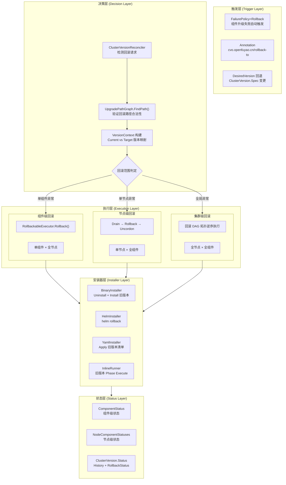
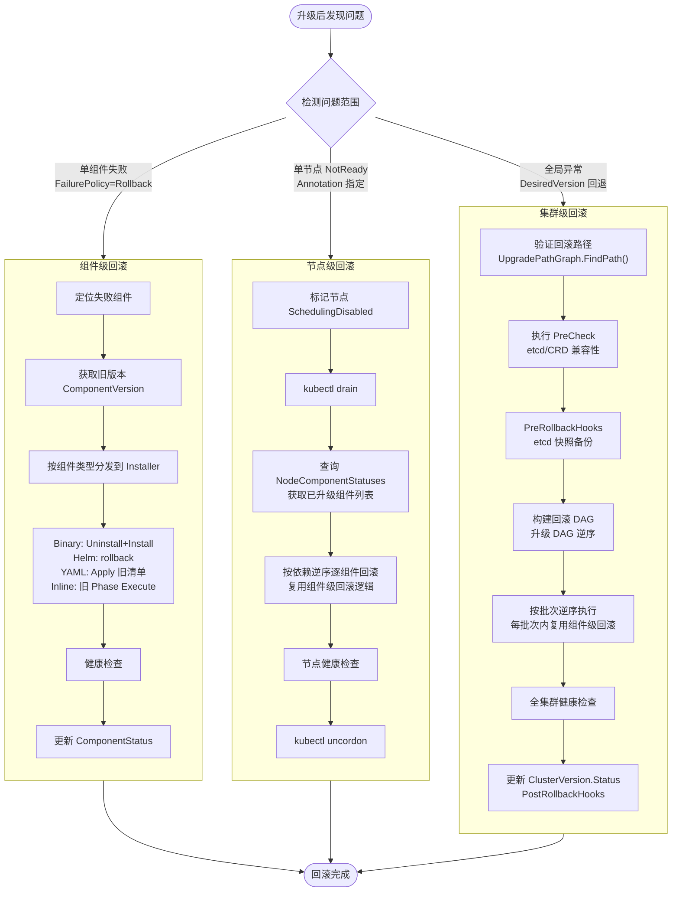
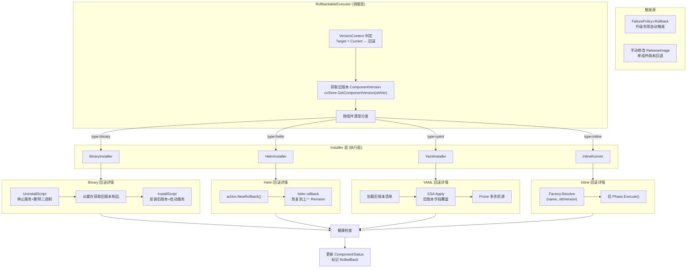
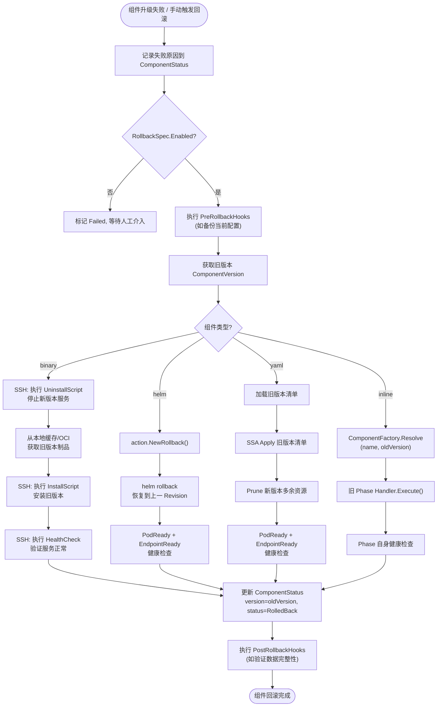
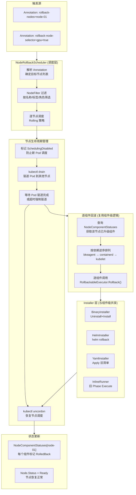
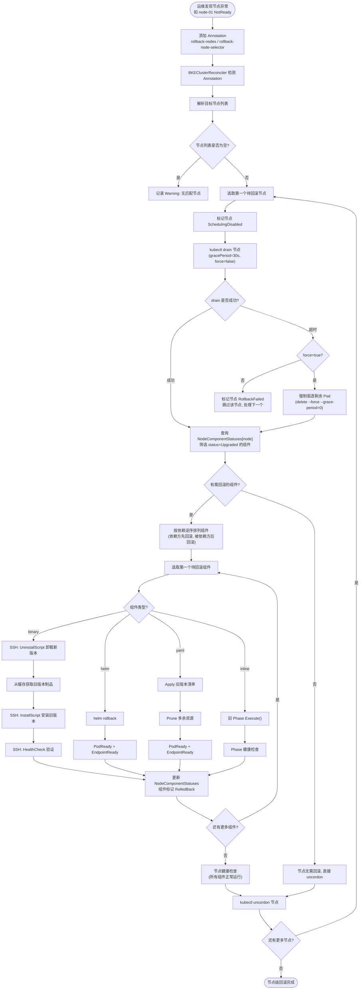
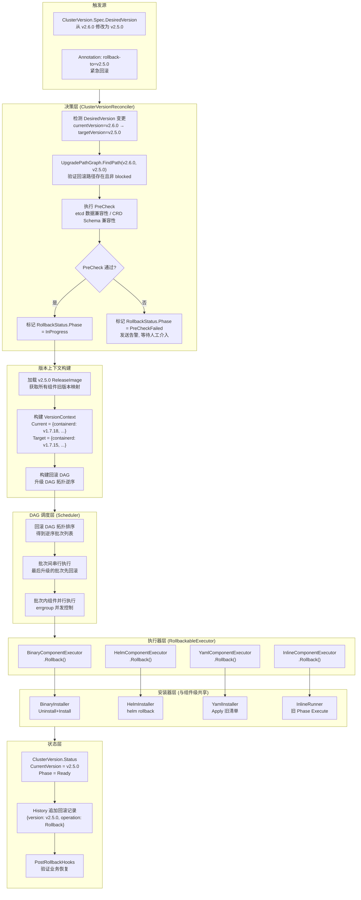
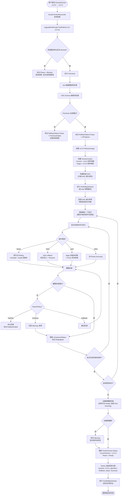

# 声明式集群版本回滚方案设计

| 字段 | 值 |
|------|-----|
| **KEP 编号** | KEP-6 (扩展) |
| **标题** | 声明式集群版本回滚方案：基于 ClusterVersion/ReleaseImage/ComponentVersion 的分层回滚设计 |
| **状态** | `provisional` |
| **类型** | Feature |
| **作者** | openFuyao Team |
| **创建日期** | 2026-08-21 |
| **依赖** | KEP-5 (ClusterVersion/ReleaseImage/UpgradePath)、KEP-6 (BinaryInstaller/HelmInstaller/YamlInstaller) |

---

## 目录

1. [概述](#1-概述)
2. [回滚场景设计思路与用例](#2-回滚场景设计思路与用例)
3. [回滚触发机制](#3-回滚触发机制)
4. [各类型组件回滚策略](#4-各类型组件回滚策略)
5. [DAG 级回滚](#5-dag-级回滚)
6. [集群级回滚（版本降级）](#6-集群级回滚版本降级)
7. [CRD 扩展](#7-crd-扩展)
8. [状态模型与幂等性](#8-状态模型与幂等性)
9. [错误处理](#9-错误处理)
10. [回滚安全机制](#10-回滚安全机制)
11. [工作量评估](#11-工作量评估)
12. [风险与缓解](#12-风险与缓解)
13. [毕业标准](#13-毕业标准)

---

## 1. 概述

### 1.1 设计目标

基于 KEP-5 的 `ClusterVersion`/`ReleaseImage`/`ComponentVersion` 体系和 KEP-6 的四类安装器（Binary/Helm/YAML/Inline），实现分层回滚能力：

| 层级 | 回滚粒度 | 触发方式 |
|------|----------|----------|
| **组件级** | 单个组件恢复到上一版本 | `FailurePolicy=Rollback` 自动触发 / 用户手动触发 |
| **DAG 级** | 回滚已执行的组件批次 | 升级失败后自动回滚已完成批次 |
| **集群级** | 整个集群恢复到上一稳定版本 | 用户修改 `ClusterVersion.Spec.DesiredVersion` 回退 |

### 1.2 设计约束

| 约束 | 说明 |
|------|------|
| **幂等性** | 回滚操作必须幂等，重复执行不产生副作用 |
| **数据保全** | 回滚不删除用户数据（etcd 数据、PV 等） |
| **向后兼容** | 回滚路径复用现有 `Uninstall`/`Rollback` 接口，不新增安装器 |
| **版本可追溯** | `ClusterVersion.Status.History` 记录版本变更历史，支持回溯 |

### 1.3 术语表

| 术语 | 定义 |
|------|------|
| **组件级回滚** | 单个组件从升级后的版本恢复到升级前版本 |
| **DAG 级回滚** | 升级 DAG 中已执行成功的批次整体回滚 |
| **集群级回滚** | 整个集群从目标版本回退到历史版本（版本降级） |
| **RollbackableExecutor** | 支持回滚操作的 ComponentExecutor 扩展接口 |
| **VersionHistory** | ClusterVersion 中记录的版本变更历史 |

---

## 2. 回滚场景设计思路与用例

本章从**组件**、**节点**、**集群**三个维度阐述回滚的设计思路，并给出典型用例说明。三个维度对应不同的故障影响范围和恢复策略，运维可根据故障严重程度选择合适的回滚层级。

### 2.1 设计总览

```
┌─────────────────────────────────────────────────────────────────────────────────┐
│                           回滚层级与影响范围                                       │
└─────────────────────────────────────────────────────────────────────────────────┘

  影响范围: 单组件          影响范围: 单节点          影响范围: 全集群
  ┌──────────────┐        ┌──────────────┐        ┌──────────────┐
  │  组件级回滚   │        │  节点级回滚   │        │  集群级回滚   │
  │              │        │              │        │              │
  │ containerd   │        │  node-01     │        │  v2.6.0      │
  │  v1.7.18     │        │  所有组件     │        │  → v2.5.0    │
  │  → v1.7.15   │        │  → 旧版本     │        │  所有组件     │
  │              │        │              │        │              │
  │ 触发:        │        │ 触发:        │        │ 触发:        │
  │ FailurePolicy│        │ 单节点升级失败│        │ DesiredVersion│
  │ =Rollback    │        │ 或手动指定   │        │ 回退         │
  └──────────────┘        └──────────────┘        └──────────────┘
       ▲                       ▲                       ▲
       │                       │                       │
  严重程度: 低             严重程度: 中             严重程度: 高
  恢复时间: 秒级           恢复时间: 分钟级          恢复时间: 十分钟级
  影响面:   单组件           影响面:   单节点           影响面:   全集群
```

**层级选择决策树**：

```
升级后发现问题
  │
  ├─ 单个组件异常（如 containerd 启动失败）
  │   └─ 组件级回滚：仅回滚该组件，其他组件不受影响
  │
  ├─ 单节点异常（如 node-01 升级后 NotReady）
  │   └─ 节点级回滚：回滚该节点上所有组件
  │
  └─ 集群整体异常（如 API Server 不可用、多节点 NotReady）
      └─ 集群级回滚：回滚所有组件到上一版本
```

#### 2.1.1 三层回滚框架图



**框架分层说明**：

| 层级 | 职责 | 核心组件 |
|------|------|----------|
| **触发层** | 接收并标准化回滚请求 | FailurePolicy / Annotation / DesiredVersion |
| **决策层** | 验证路径合法性，判定回滚范围，构建版本上下文 | ClusterVersionReconciler / UpgradePathGraph / VersionContext |
| **执行层** | 按回滚粒度组织执行顺序 | RollbackableExecutor / NodeRollbackScheduler / DAG Scheduler |
| **安装器层** | 执行单组件的实际回滚操作 | BinaryInstaller / HelmInstaller / YamlInstaller / InlineRunner |
| **状态层** | 记录回滚结果，保证幂等性 | ComponentStatus / NodeComponentStatuses / ClusterVersion.Status |

#### 2.1.2 三层回滚执行总流程图



> **关键设计**：三层回滚共享安装器层——节点级回滚和集群级回滚的每个组件回滚操作，最终都复用组件级回滚的 Installer 逻辑（BinaryInstaller/HelmInstaller/YamlInstaller/InlineRunner），避免重复实现。

### 2.2 组件级回滚

#### 2.2.1 设计思路

组件级回滚是最小粒度的回滚，针对**单个组件**从升级后的版本恢复到升级前版本。

**核心设计原则**：

1. **版本事实驱动**：通过 `VersionContext` 中的 `Current` 和 `Target` 版本映射判断是否需要回滚。当 `Target < Current`（语义化版本比较）时，Executor 自主判定为回滚操作，而非由调用方显式下达"回滚"指令。
2. **复用安装接口**：回滚不新增安装器接口，而是复用现有 `Install/Uninstall/Rollback` 接口。Binary 回滚 = `Uninstall(新)` + `Install(旧)`；Helm 回滚 = `helm rollback`；YAML 回滚 = `Apply(旧清单)`。
3. **制品缓存优先**：Binary 组件回滚时优先从本地缓存获取旧版本制品，避免网络不可达导致回滚失败。缓存策略采用 LRU，保留最近 N 个版本的制品。
4. **独立超时控制**：回滚操作有独立的超时时间（`RollbackSpec.Timeout`），与升级超时解耦。

**组件级回滚的两种触发路径**：

| 触发路径 | 触发条件 | 执行时机 |
|----------|----------|----------|
| **自动触发** | `FailurePolicy=Rollback` + 组件升级失败 | 升级过程中，单组件失败时立即触发 |
| **手动触发** | 用户修改 `ClusterVersion.Spec.DesiredVersion` 中仅回退某组件版本 | 升级完成后，发现某组件异常时触发 |

#### 2.2.2 组件级回滚框架图



#### 2.2.3 组件级回滚执行流程图



#### 2.2.4 用例说明

**用例 1：containerd 升级失败自动回滚**

```yaml
# 场景: containerd 从 v1.7.15 升级到 v1.7.18，新版本在节点上启动失败
# 前提: ComponentVersion 配置了 failurePolicy: Rollback

# ComponentVersion 定义
apiVersion: config.openfuyao.cn/v1alpha1
kind: ComponentVersion
metadata:
  name: containerd-v1.7.18
spec:
  name: containerd
  type: binary
  version: v1.7.18
  binary:
    installScript: |
      #!/bin/bash
      systemctl stop containerd || true
      tar -xzf {{artifact.containerd.path}} -C /usr/local
      systemctl start containerd
    uninstallScript: |
      #!/bin/bash
      systemctl stop containerd || true
      rm -f /usr/local/bin/containerd
      rm -f /usr/lib/systemd/system/containerd.service
      systemctl daemon-reload
    healthCheck:
      enabled: true
      script: |
        systemctl is-active containerd
  rollback:
    enabled: true
    timeout: "10m"
    preRollbackHooks:
      - name: backup-containerd-config
        type: Job
        manifest: |
          apiVersion: batch/v1
          kind: Job
          spec:
            template:
              spec:
                containers:
                - name: backup
                  image: bitnami/kubectl:latest
                  command: ["cp", "-r", "/etc/containerd", "/backup/"]
  upgradeStrategy:
    mode: Rolling
    batchSize: 1
    failurePolicy: Rollback  # 失败时自动回滚
```

**执行过程**：

```
时间线:
  T0: containerd v1.7.15 运行正常
  T1: 升级开始，下载 v1.7.18 制品
  T2: 卸载 v1.7.15，安装 v1.7.18
  T3: 健康检查失败 (containerd 无法启动)
  T4: FailurePolicy=Rollback 触发
  T5: 执行 PreRollbackHooks (备份配置)
  T6: 执行 UninstallScript 卸载 v1.7.18
  T7: 从本地缓存获取 v1.7.15 制品
  T8: 执行 InstallScript 安装 v1.7.15
  T9: 健康检查通过
  T10: 标记 ComponentStatus = RolledBack, version = v1.7.15
```

**用例 2：CoreDNS Helm 组件升级后功能异常，手动回滚**

```yaml
# 场景: CoreDNS 从 v1.11.1 升级到 v1.11.3 后，自定义 DNS 解析异常
# 运维决定回滚 CoreDNS 到 v1.11.1

# 操作步骤:
# 1. 修改 ReleaseImage，将 coredns 版本改回 v1.11.1
# 2. 重新应用 ReleaseImage

# ReleaseImage 修改
apiVersion: cvo.openfuyao.cn/v1beta1
kind: ReleaseImage
metadata:
  name: ri-v2.6.0-patch1
spec:
  version: "v2.6.0-patch1"
  upgrade:
    components:
      - name: coredns
        version: v1.11.1  # 从 v1.11.3 回退到 v1.11.1
      # 其他组件保持不变
```

**执行过程**：

```
时间线:
  T0: CoreDNS v1.11.3 运行中，DNS 解析异常
  T1: 运维修改 ReleaseImage 中 coredns 版本为 v1.11.1
  T2: ClusterVersionReconciler 检测到 ReleaseImage 变更
  T3: 构建 VersionContext: Current[coredns]=v1.11.3, Target[coredns]=v1.11.1
  T4: HelmComponentExecutor 检测到 Target < Current → 回滚模式
  T5: 执行 helm rollback coredns -n kube-system
  T6: CoreDNS 恢复到 v1.11.1 的 Release
  T7: 健康检查通过 (PodReady + EndpointReady)
  T8: 标记 ComponentStatus = RolledBack, version = v1.11.1
```

### 2.3 节点级回滚

#### 2.3.1 设计思路

节点级回滚针对**单个节点**上所有已升级的组件进行回滚。当某节点升级后出现异常（如 NotReady、OOM、内核 panic），需要将该节点上所有组件恢复到升级前版本。

**核心设计原则**：

1. **节点维度状态追踪**：通过 `NodeComponentStatuses` 追踪每个节点上每个组件的升级状态。节点级回滚时，仅回滚状态为 `Upgraded` 的组件，跳过已是旧版本的组件。
2. **排水（Drain）优先**：回滚前先执行节点排水（`kubectl drain`），将 Pod 迁移到其他节点，避免回滚过程中业务中断。
3. **逐组件回滚**：节点级回滚按组件依赖关系逆序执行（先回滚依赖组件，再回滚被依赖组件），确保依赖关系正确。
4. **节点隔离**：回滚期间节点标记为 `SchedulingDisabled`，防止新 Pod 调度到正在回滚的节点。

**节点级回滚与组件级回滚的区别**：

| 维度 | 组件级回滚 | 节点级回滚 |
|------|-----------|-----------|
| 回滚范围 | 所有节点上的单个组件 | 单个节点上的所有组件 |
| 典型场景 | 组件本身有 bug | 节点环境不兼容 |
| 影响面 | 所有节点短暂不可用 | 单节点不可用 |
| 执行顺序 | 按 DAG 拓扑顺序 | 按组件依赖逆序 |
| 是否需要 Drain | 否（逐节点 Rolling） | 是（回滚前先排水） |

**节点级回滚流程**：

```
节点升级后异常 (如 node-01 NotReady)
  │
  ├─ 1. 标记节点为 SchedulingDisabled (防止新 Pod 调度)
  │
  ├─ 2. 执行 kubectl drain node-01 (排水，迁移 Pod)
  │
  ├─ 3. 查询 NodeComponentStatuses[node-01]
  │   获取该节点上所有已升级的组件列表
  │
  ├─ 4. 按组件依赖逆序逐个回滚
  │   ├─ 回滚 bkeagent (依赖方先回滚)
  │   ├─ 回滚 containerd (被依赖方后回滚)
  │   └─ ... 其他组件
  │
  ├─ 5. 健康检查 (验证节点上所有组件正常)
  │
  ├─ 6. 取消节点 SchedulingDisabled
  │
  └─ 7. 执行 kubectl uncordon node-01 (恢复调度)
```

#### 2.3.2 节点级回滚框架图



**框架分层说明**：

| 层级 | 职责 | 与组件级回滚的关系 |
|------|------|-------------------|
| **NodeRollbackScheduler** | 解析 Annotation，筛选目标节点，逐节点调度 | 新增调度层，组件级无此层 |
| **节点生命周期管理** | Drain → 回滚 → Uncordon | 新增，组件级无此流程 |
| **逐组件回滚** | 按依赖逆序回滚每个组件 | 复用组件级回滚的 RollbackableExecutor |
| **Installer 层** | 执行单组件实际回滚 | 完全共享，无差异 |

#### 2.3.3 节点级回滚执行流程图



#### 2.3.4 用例说明

**用例 3：单节点升级后内核不兼容，节点级回滚**

```yaml
# 场景: 集群从 v2.5.0 升级到 v2.6.0，node-01 升级后内核参数不兼容，
# 导致 containerd 和 bkeagent 均无法启动，节点 NotReady。
# 其他节点 (node-02, node-03) 升级正常。

# 操作步骤:
# 1. 运维发现 node-01 NotReady
# 2. 通过 Annotation 触发节点级回滚

# 触发方式: 在 BKECluster 上添加 Annotation
apiVersion: config.openfuyao.cn/v1beta1
kind: BKECluster
metadata:
  name: my-cluster
  annotations:
    cvo.openfuyao.cn/rollback-nodes: "node-01"  # 指定回滚节点
    cvo.openfuyao.cn/rollback-to: "v2.5.0"       # 回滚到目标版本
```

**执行过程**：

```
时间线:
  T0:  node-01, node-02, node-03 均升级到 v2.6.0
  T1:  node-01 NotReady (内核参数不兼容)
  T2:  运维添加 Annotation: rollback-nodes=node-01, rollback-to=v2.5.0
  T3:  BKEClusterReconciler 检测到 Annotation
  T4:  标记 node-01 为 SchedulingDisabled
  T5:  执行 kubectl drain node-01 (Pod 迁移到 node-02, node-03)
  T6:  查询 NodeComponentStatuses[node-01]:
       - containerd: v1.7.15 → v1.7.18 (需回滚)
       - bkeagent: v2.5.0 → v2.6.0 (需回滚)
       - kubelet: v1.28.0 → v1.29.0 (需回滚)
  T7:  按依赖逆序回滚:
       T7.1: 回滚 bkeagent (SSH 执行 UninstallScript + InstallScript 旧版本)
       T7.2: 回滚 containerd (从缓存获取旧版本制品，SSH 执行)
       T7.3: 回滚 kubelet
  T8:  节点健康检查通过 (所有组件正常运行)
  T9:  取消 SchedulingDisabled，执行 kubectl uncordon node-01
  T10: node-01 恢复正常，Pod 可调度
```

**用例 4：GPU 节点驱动不兼容，仅回滚特定标签节点**

```yaml
# 场景: 集群中有 GPU 节点 (label: gpu=true) 和普通节点。
# 升级后 GPU 节点的 containerd 与 GPU 驱动不兼容。
# 运维需要仅回滚 gpu=true 的节点。

# 触发方式: 通过 NodeSelector 指定回滚范围
apiVersion: config.openfuyao.cn/v1beta1
kind: BKECluster
metadata:
  name: my-cluster
  annotations:
    cvo.openfuyao.cn/rollback-node-selector: "gpu=true"
    cvo.openfuyao.cn/rollback-to: "v2.5.0"
```

**执行过程**：

```
时间线:
  T0:  集群有 4 个节点: node-01(gpu), node-02(gpu), node-03(worker), node-04(worker)
  T1:  升级到 v2.6.0 后，node-01, node-02 的 containerd 无法识别 GPU
  T2:  运维添加 Annotation: rollback-node-selector=gpu=true
  T3:  BKEClusterReconciler 按 label 筛选节点: [node-01, node-02]
  T4:  逐节点回滚 (Rolling 策略):
       T4.1: drain node-01 → 回滚 containerd → 回滚 bkeagent → uncordon node-01
       T4.2: drain node-02 → 回滚 containerd → 回滚 bkeagent → uncordon node-02
  T5:  node-03, node-04 保持 v2.6.0 不受影响
```

### 2.4 集群级回滚

#### 2.4.1 设计思路

集群级回滚是最大粒度的回滚，将**整个集群**所有组件恢复到上一稳定版本。通常在升级后发现全局性问题（如 API Server 不兼容、etcd 数据格式变更、多组件交互异常）时使用。

**核心设计原则**：

1. **声明式版本回退**：用户通过修改 `ClusterVersion.Spec.DesiredVersion` 声明目标版本，系统自动计算差异并执行回滚。无需显式指定"回滚"操作，系统通过 `VersionContext` 中 `Target < Current` 自主推断。
2. **UpgradePath 显式声明**：回滚路径需要在 `UpgradePath` 中显式定义（反向边），而非自动反转升级路径。这确保运维可以控制哪些版本间允许回滚，防止不可逆升级被错误回滚。
3. **DAG 逆序执行**：集群级回滚按升级 DAG 的逆序执行——先回滚最后升级的组件，最后回滚最先升级的组件。这确保依赖关系正确（如先回滚 etcd 客户端，再回滚 etcd 服务端）。
4. **PreCheck 阻断机制**：回滚路径可配置 `preCheck`，在回滚前执行关键检查（如 etcd 数据兼容性、CRD Schema 兼容性），不通过则阻断回滚。
5. **数据备份前置**：集群级回滚前强烈建议执行 etcd 快照备份，通过 `PreRollbackHooks` 自动化。

**集群级回滚与节点级回滚的区别**：

| 维度 | 节点级回滚 | 集群级回滚 |
|------|-----------|-----------|
| 回滚范围 | 单节点上所有组件 | 所有节点上所有组件 |
| 触发方式 | Annotation 指定节点 | 修改 DesiredVersion |
| 是否需要 Drain | 是 | 否（按 DAG 拓扑顺序） |
| 执行顺序 | 按组件依赖逆序 | 按 DAG 拓扑逆序（批次间串行） |
| 对集群影响 | 单节点短暂不可用 | 集群整体短暂不可用 |
| 适用场景 | 单节点环境不兼容 | 全局性版本不兼容 |

**集群级回滚流程**：

```
集群升级后发现全局性问题
  │
  ├─ 1. 用户修改 ClusterVersion.Spec.DesiredVersion = "v2.5.0"
  │
  ├─ 2. ClusterVersionReconciler 检测变更
  │   ├─ 验证回滚路径: UpgradePathGraph.FindPath(v2.6.0, v2.5.0)
  │   ├─ 执行 PreCheck: etcd 兼容性、CRD 兼容性
  │   └─ 标记 RollbackStatus.Phase = InProgress
  │
  ├─ 3. 构建回滚 VersionContext
  │   Current = {containerd: v1.7.18, bkeagent: v2.6.0, coredns: v1.11.3, ...}
  │   Target  = {containerd: v1.7.15, bkeagent: v2.5.0, coredns: v1.11.1, ...}
  │
  ├─ 4. 加载 v2.5.0 的 ReleaseImage，构建回滚 DAG
  │
  ├─ 5. 执行 PreRollbackHooks (如 etcd 快照备份)
  │
  ├─ 6. 按回滚 DAG 拓扑逆序执行
  │   Batch N (最后升级的组件先回滚)
  │   ...
  │   Batch 2
  │   Batch 1 (最先升级的组件最后回滚)
  │
  ├─ 7. 全集群健康检查
  │
  ├─ 8. 更新 ClusterVersion.Status
  │   CurrentVersion = v2.5.0
  │   Phase = Ready
  │   History 追加回滚记录
  │
  └─ 9. 执行 PostRollbackHooks (如验证业务恢复)
```

#### 2.4.2 集群级回滚框架图



**框架分层说明**：

| 层级 | 职责 | 与组件级/节点级回滚的关系 |
|------|------|--------------------------|
| **决策层** | 验证回滚路径、执行 PreCheck、标记回滚状态 | 集群级独有，组件级/节点级无此层 |
| **版本上下文构建** | 加载旧版本 ReleaseImage、构建 VersionContext、构建回滚 DAG | 集群级独有 |
| **DAG 调度层** | 回滚 DAG 拓扑逆序执行，批次间串行、批次内并行 | 集群级独有，复用升级 DAG 调度逻辑 |
| **执行器层** | 各类型组件的回滚调度 | 与组件级共享 RollbackableExecutor 接口 |
| **安装器层** | 执行单组件实际回滚操作 | 三层完全共享 |
| **状态层** | 记录集群级回滚结果 | 集群级独有（ClusterVersion.Status） |

#### 2.4.3 集群级回滚执行流程图



#### 2.4.4 用例说明

**用例 5：K8s 小版本升级后 API 不兼容，集群级回滚**

```yaml
# 场景: 集群从 v2.5.0 (K8s v1.28) 升级到 v2.6.0 (K8s v1.29)，
# 升级后发现某些 CRD 使用了 v1.29 中已废弃的 API，
# 导致多个控制器异常。运维决定整体回滚到 v2.5.0。

# 前提: UpgradePath 中已定义回滚路径
apiVersion: cvo.openfuyao.cn/v1beta1
kind: UpgradePath
metadata:
  name: openfuyao-upgrade-paths
spec:
  paths:
    - from: "v2.5.0"
      to: "v2.6.0"
      blocked: false
    - from: "v2.6.0"
      to: "v2.5.0"
      blocked: false
      preCheck:
        - name: "etcd-data-compat"
          required: true
      notes: "Rollback requires etcd snapshot restore"

# 操作步骤:
# 1. 确认 etcd 快照可用 (升级前已自动备份)
# 2. 修改 ClusterVersion
apiVersion: cvo.openfuyao.cn/v1beta1
kind: ClusterVersion
metadata:
  name: my-cluster-cv
spec:
  desiredVersion: "v2.5.0"  # 从 v2.6.0 回退到 v2.5.0
```

**执行过程**：

```
时间线:
  T0:  集群运行 v2.6.0 (K8s v1.29)，多个控制器异常
  T1:  运维修改 ClusterVersion.Spec.DesiredVersion = "v2.5.0"
  T2:  ClusterVersionReconciler 检测变更
  T3:  验证回滚路径: FindPath(v2.6.0, v2.5.0) → 路径存在，非 blocked
  T4:  执行 PreCheck:
       - etcd-data-compat: 检查 etcd 数据格式是否兼容 v2.5.0 → 通过
  T5:  标记 RollbackStatus.Phase = InProgress
  T6:  构建回滚 VersionContext:
       Current = {k8s: v1.29.0, etcd: v3.5.12, containerd: v1.7.18, coredns: v1.11.3}
       Target  = {k8s: v1.28.0, etcd: v3.5.10, containerd: v1.7.15, coredns: v1.11.1}
  T7:  加载 v2.5.0 ReleaseImage，构建回滚 DAG
  T8:  执行 PreRollbackHooks: etcd 快照备份
  T9:  按回滚 DAG 拓扑逆序执行:
       Batch 3: 回滚 coredns (helm rollback) → 所有节点
       Batch 2: 回滚 containerd (binary rollback) → 逐节点 Rolling
       Batch 1: 回滚 etcd (binary rollback) → 逐节点 Rolling
       Batch 0: 回滚 kube-apiserver/kubelet → 逐节点 Rolling
  T10: 全集群健康检查:
       - 所有节点 Ready
       - 所有系统 Pod Running
       - API Server 响应正常
  T11: 更新 ClusterVersion.Status:
       CurrentVersion = v2.5.0
       Phase = Ready
       History += {version: v2.5.0, operation: Rollback, status: Success}
  T12: 执行 PostRollbackHooks: 验证业务 Pod 恢复
```

**用例 6：跨版本升级失败，回滚到隔代版本**

```yaml
# 场景: 集群从 v2.4.0 直接升级到 v2.6.0 (跳过了 v2.5.0)，
# 升级过程中 Batch 2 失败，需要回滚到 v2.4.0。
# UpgradePath 中 v2.4.0 → v2.6.0 被标记为 blocked，
# 但回滚路径 v2.6.0 → v2.4.0 允许 (因为实际已升级到一半)。

# UpgradePath 定义
apiVersion: cvo.openfuyao.cn/v1beta1
kind: UpgradePath
metadata:
  name: openfuyao-upgrade-paths
spec:
  paths:
    # 升级路径: v2.4.0 → v2.5.0 → v2.6.0
    - from: "v2.4.0"
      to: "v2.5.0"
      blocked: false
    - from: "v2.5.0"
      to: "v2.6.0"
      blocked: false
    # v2.4.0 直接升级到 v2.6.0 被禁止
    - from: "v2.4.0"
      to: "v2.6.0"
      blocked: true
      notes: "Please upgrade via v2.5.0"
    # 但回滚路径允许 (特殊场景)
    - from: "v2.6.0"
      to: "v2.4.0"
      blocked: false
      preCheck:
        - name: "etcd-snapshot-restore"
          required: true
      notes: "Rollback across versions requires etcd snapshot restore"

# 操作步骤:
# 1. 升级失败后，DAG 级回滚先自动执行 (回滚已成功的批次)
# 2. 若 DAG 级回滚后仍有问题，运维手动触发集群级回滚
apiVersion: cvo.openfuyao.cn/v1beta1
kind: ClusterVersion
metadata:
  name: my-cluster-cv
spec:
  desiredVersion: "v2.4.0"  # 回滚到隔代版本
```

### 2.5 三层回滚对比总结

| 维度 | 组件级回滚 | 节点级回滚 | 集群级回滚 |
|------|-----------|-----------|-----------|
| **回滚粒度** | 单个组件（所有节点） | 单个节点（所有组件） | 所有节点所有组件 |
| **触发方式** | `FailurePolicy=Rollback` 自动 / 修改 ReleaseImage | Annotation 指定节点 / NodeSelector | 修改 `DesiredVersion` |
| **执行策略** | 按组件类型选择回滚方式 | Drain → 逐组件回滚 → Uncordon | DAG 拓扑逆序，批次间串行 |
| **影响范围** | 该组件相关 Pod 短暂不可用 | 单节点 Pod 迁移，节点短暂不可用 | 集群整体短暂不可用 |
| **恢复时间** | 秒级 ~ 分钟级 | 分钟级 | 十分钟级 |
| **数据风险** | 低（单组件数据） | 中（单节点数据） | 高（需 etcd 快照） |
| **UpgradePath 要求** | 无需（组件内部回滚） | 无需（复用组件级回滚） | 需要显式声明回滚路径 |
| **典型用例** | containerd 启动失败 | 单节点内核不兼容 | K8s 版本不兼容 |
| **用例编号** | 用例 1, 2 | 用例 3, 4 | 用例 5, 6 |

---

## 3. 回滚触发机制

### 3.1 自动触发（FailurePolicy=Rollback）

复用 KEP-5 定义的 `UpgradeStrategySpec.FailurePolicy`：

```
组件升级失败 + FailurePolicy=Rollback
  → Binary: 执行 UninstallScript 卸载新版本 → 重新安装旧版本
  → Helm:   执行 helm rollback → 恢复到上一 Release 版本
  → YAML:   重新 Apply 旧版本清单（SSA 幂等）
  → Inline: 调用旧版本 Phase 的 Execute()（由 handler 自行实现回退逻辑）
```

### 3.2 手动触发（用户声明式回滚）

用户将 `ClusterVersion.Spec.DesiredVersion` 修改为目标旧版本（如 `v2.6.0` → `v2.5.0`），系统按正常升级流程执行，但 `VersionContext` 中 `Target < Current`，各 Executor 自主判定为回滚操作。

### 3.3 紧急触发（Annotation 触发）

```yaml
annotations:
  cvo.openfuyao.cn/rollback-to: "v2.5.0"
```

`ClusterVersionReconciler` 检测到此 Annotation 后，自动将 `DesiredVersion` 设为指定版本并清除 Annotation。

### 3.4 触发机制对比

| 触发方式 | 触发条件 | 回滚范围 | 适用场景 |
|----------|----------|----------|----------|
| **FailurePolicy=Rollback** | 组件升级失败 | 单个组件 | 组件级别升级失败自动恢复 |
| **DesiredVersion 回退** | 用户主动修改 | 所有差异组件 | 升级后发现整体问题 |
| **Annotation 触发** | 运维紧急操作 | 所有差异组件 | 紧急回滚，无需修改 Spec |

---

## 4. 各类型组件回滚策略

### 4.1 Binary 组件回滚

```
回滚流程:
┌─────────────────────────────────────────────────────────────┐
│ 1. 停止新版本服务                                             │
│    systemctl stop <service>                                  │
├─────────────────────────────────────────────────────────────┤
│ 2. 执行 UninstallScript 卸载新版本                            │
│    SSH 执行: 删除新版本二进制、配置、服务文件                     │
├─────────────────────────────────────────────────────────────┤
│ 3. 恢复旧版本制品（从本地缓存或 OCI 重新拉取）                  │
│    cache.Get(oldVersion) 或 downloadArtifacts(oldVersion)     │
├─────────────────────────────────────────────────────────────┤
│ 4. 渲染旧版本配置模板                                         │
│    renderConfigTemplates(oldVersion, tmplCtx)                │
├─────────────────────────────────────────────────────────────┤
│ 5. SSH 执行旧版本 InstallScript                               │
│    tmplCtx.IsUpgrade = false (全新安装旧版本)                  │
├─────────────────────────────────────────────────────────────┤
│ 6. 健康检查                                                   │
│    executeHealthCheck(oldVersion)                             │
└─────────────────────────────────────────────────────────────┘
```

**关键设计**：Binary 回滚 = `Uninstall(新版本)` + `Install(旧版本)`，复用现有 `BinaryInstaller.Install()` 的两个 Action（Uninstall + Install），无需新增接口。

#### 4.1.1 旧版本制品缓存策略

回滚时优先从本地缓存获取旧版本制品，避免网络不可达导致回滚失败：

```go
// 回滚时优先从本地缓存获取旧版本制品，避免网络不可达导致回滚失败
func (i *BinaryInstaller) getRollbackArtifacts(ctx context.Context, binary *BinarySpec, arch string) (map[string]*Artifact, error) {
    // 1. 优先从缓存加载旧版本制品
    for _, art := range binary.Artifacts {
        cacheKey := i.computeCacheKey(art.URL, art.Checksum)
        if cached := i.cache.Get(cacheKey); cached != nil {
            continue // 缓存命中
        }
        // 2. 缓存未命中，尝试下载
        data, err := i.downloadAndVerify(ctx, art.URL, art.Checksum)
        if err != nil {
            return nil, fmt.Errorf("rollback artifact %s unavailable: %w", art.Name, err)
        }
        i.cache.Save(cacheKey, data)
    }
    return i.downloadArtifacts(ctx, binary, arch)
}
```

#### 4.1.2 Binary 回滚代码实现

```go
// BinaryComponentExecutor 回滚实现
func (e *BinaryComponentExecutor) Rollback(ctx context.Context, node *topology.ComponentNode, execCtx *ExecutionContext) error {
    component := node.Component
    
    // 1. 获取旧版本
    oldVersion, ok := execCtx.VersionContext.CurrentVersion(component.Name)
    if !ok {
        return fmt.Errorf("no current version recorded for %s, cannot rollback", component.Name)
    }
    
    // 2. 获取旧版本 ComponentVersion
    oldCV, err := e.cvStore.GetComponentVersion(ctx, component.Name, oldVersion)
    if err != nil {
        return fmt.Errorf("failed to get old component version %s@%s: %w", component.Name, oldVersion, err)
    }
    
    // 3. 获取目标节点
    allNodes, err := execCtx.NodeProvider.GetNodes(ctx, execCtx.Cluster)
    if err != nil {
        return fmt.Errorf("failed to get nodes: %w", err)
    }
    
    // 4. 逐节点回滚 (Rolling 策略)
    for _, n := range allNodes {
        nodeTmpl := execCtx.TemplateContext
        nodeTmpl.NodeIP = n.IP
        nodeTmpl.NodeHostname = n.Hostname
        nodeTmpl.NodeRole = n.Role
        nodeTmpl.ComponentVersion = oldVersion
        nodeTmpl.ComponentPreviousVersion = component.Version
        
        // 4.1 卸载新版本
        uninstallOpts := binaryinstaller.InstallOptions{
            Component:   oldCV, // 使用旧版本 CV 的 UninstallScript
            TemplateCtx: nodeTmpl,
            Action:      binaryinstaller.BinaryActionUninstall,
        }
        if err := e.installer.Install(ctx, uninstallOpts); err != nil {
            execCtx.Log.Warn("uninstall failed on node %s during rollback: %v", n.IP, err)
            // 继续尝试安装旧版本
        }
        
        // 4.2 安装旧版本
        installOpts := binaryinstaller.InstallOptions{
            Component:   oldCV,
            TemplateCtx: nodeTmpl,
            Action:      binaryinstaller.BinaryActionInstall,
        }
        if err := e.installer.Install(ctx, installOpts); err != nil {
            return fmt.Errorf("rollback install failed on node %s: %w", n.IP, err)
        }
        
        // 4.3 更新节点状态
        if e.statusUpdater != nil {
            _ = e.statusUpdater.MarkSuccess(ctx, execCtx.Cluster, n.IP, component.Name, oldVersion)
        }
    }
    
    return nil
}
```

### 4.2 Helm 组件回滚

```
回滚流程:
┌─────────────────────────────────────────────────────────────┐
│ 1. 检查 Helm Release 历史版本                                 │
│    helm history <releaseName> -n <namespace>                 │
├─────────────────────────────────────────────────────────────┤
│ 2. 执行 helm rollback                                         │
│    action.NewRollback(actionConfig).Run(releaseName)         │
│    恢复到上一版本 (或指定 revision)                              │
├─────────────────────────────────────────────────────────────┤
│ 3. 健康检查                                                   │
│    healthcheck.Run(ctx, clientset, hc)                       │
└─────────────────────────────────────────────────────────────┘
```

**两种回滚场景**：

| 场景 | 触发条件 | 回滚方式 |
|------|----------|----------|
| **升级失败自动回滚** | `FailurePolicy=Rollback` + `helm upgrade` 失败 | `helm rollback`（若 `Atomic=true`，Helm SDK 已自动回滚） |
| **手动版本回退** | `DesiredVersion` 设为旧版本 | `helm upgrade` 到旧版本 Chart（非 rollback，是降级升级） |

#### 4.2.1 Helm 回滚代码实现

```go
func (i *HelmInstaller) Rollback(ctx context.Context, opts InstallOptions) error {
    helm := opts.Component.Spec.Helm
    actionConfig, err := i.getActionConfig(ctx, helm.Namespace)
    if err != nil {
        return err
    }
    client := action.NewRollback(actionConfig)
    client.Wait = helm.Strategy.Wait
    client.Timeout, _ = time.ParseDuration(helm.Strategy.WaitTimeout)
    return client.Run(helm.ReleaseName)
}

// HelmComponentExecutor 回滚实现
func (e *HelmComponentExecutor) Rollback(ctx context.Context, node *topology.ComponentNode, execCtx *ExecutionContext) error {
    component := node.Component
    
    // 获取旧版本 ComponentVersion
    oldVersion, ok := execCtx.VersionContext.CurrentVersion(component.Name)
    if !ok {
        return fmt.Errorf("no current version for %s", component.Name)
    }
    
    oldCV, err := e.cvStore.GetComponentVersion(ctx, component.Name, oldVersion)
    if err != nil {
        return fmt.Errorf("failed to get old CV %s@%s: %w", component.Name, oldVersion, err)
    }
    
    opts := helminstaller.InstallOptions{
        Component:   oldCV,
        TemplateCtx: execCtx.TemplateContext,
        Action:      helminstaller.HelmActionRollback,
    }
    
    if err := e.installer.Rollback(ctx, opts); err != nil {
        return fmt.Errorf("helm rollback failed for %s: %w", component.Name, err)
    }
    
    // 健康检查
    if oldCV.Spec.Helm != nil && oldCV.Spec.Helm.HealthCheck.Enabled {
        if err := healthcheck.Run(ctx, execCtx.TargetClient, oldCV.Spec.Helm.HealthCheck); err != nil {
            return fmt.Errorf("health check failed after rollback for %s: %w", component.Name, err)
        }
    }
    
    return nil
}
```

### 4.3 YAML 组件回滚

```
回滚流程:
┌─────────────────────────────────────────────────────────────┐
│ 1. 加载旧版本清单                                             │
│    store.GetComponentManifests(oldVersion)                    │
├─────────────────────────────────────────────────────────────┤
│ 2. 重新 Apply 旧版本清单 (SSA 幂等)                            │
│    applier.ApplyComponent(oldManifests)                       │
│    ServerSideApply: 旧版本字段覆盖新版本字段                     │
├─────────────────────────────────────────────────────────────┤
│ 3. 可选: Prune 裁剪新版本引入的多余资源                         │
│    applier.PruneResources(newManifests - oldManifests)        │
├─────────────────────────────────────────────────────────────┤
│ 4. 健康检查                                                   │
│    healthcheck.Run(ctx, clientset, hc)                       │
└─────────────────────────────────────────────────────────────┘
```

**关键设计**：YAML 组件回滚 = `Apply(旧版本清单)` + `Prune(新版本多余资源)`。SSA 天然支持幂等，旧版本字段自动覆盖新版本字段。Prune 通过对比新旧版本清单差异，删除新版本引入但旧版本不存在的资源。

#### 4.3.1 YAML 回滚代码实现

```go
// YamlComponentExecutor 回滚实现
func (e *YamlComponentExecutor) Rollback(ctx context.Context, node *topology.ComponentNode, execCtx *ExecutionContext) error {
    component := node.Component
    
    // 1. 获取旧版本
    oldVersion, ok := execCtx.VersionContext.CurrentVersion(component.Name)
    if !ok {
        return fmt.Errorf("no current version for %s", component.Name)
    }
    
    // 2. 加载旧版本清单
    oldCV, err := e.cvStore.GetComponentVersion(ctx, component.Name, oldVersion)
    if err != nil {
        return fmt.Errorf("failed to get old CV %s@%s: %w", component.Name, oldVersion, err)
    }
    
    // 3. Apply 旧版本清单 (SSA 幂等)
    if err := e.installer.Apply(ctx, oldCV, execCtx); err != nil {
        return fmt.Errorf("rollback apply failed for %s: %w", component.Name, err)
    }
    
    // 4. 可选: Prune 新版本引入的多余资源
    if oldCV.Spec.YAML != nil && oldCV.Spec.YAML.Prune {
        // 获取新版本清单用于对比
        newCV, _ := e.cvStore.GetComponentVersion(ctx, component.Name, component.Version)
        if newCV != nil {
            // Prune 在新版本清单中存在但旧版本清单中不存在的资源
            // 通过 PruneLabelSelector 限定范围
        }
    }
    
    // 5. 健康检查
    if oldCV.Spec.YAML != nil && oldCV.Spec.YAML.HealthCheck != nil && oldCV.Spec.YAML.HealthCheck.Enabled {
        if err := healthcheck.Run(ctx, execCtx.TargetClient, oldCV.Spec.YAML.HealthCheck); err != nil {
            return fmt.Errorf("health check failed after rollback for %s: %w", component.Name, err)
        }
    }
    
    return nil
}
```

### 4.4 Inline 组件回滚

Inline 组件回滚由注册的 Phase Handler 自行实现。`ComponentFactory.Resolve()` 解析到旧版本 handler 后调用其 `Execute()`，handler 内部实现回退逻辑。

```go
// Inline 回滚: 解析旧版本 handler 并执行
func (e *InlineComponentExecutor) rollback(ctx context.Context, execCtx *ExecutionContext, cv *ComponentVersion) error {
    oldVersion := execCtx.VersionContext.GetCurrent(cv.Spec.Name)
    inst, err := e.factory.Resolve(cv.Spec.Name, oldVersion, cv.Spec.Inline)
    if err != nil {
        return fmt.Errorf("no rollback handler for %s@%s: %w", cv.Spec.Name, oldVersion, err)
    }
    return inst.Handler.Execute(ctx)
}
```

### 4.5 各类型回滚策略对比

| 组件类型 | 回滚机制 | 是否需要卸载 | 是否支持 Prune | 缓存依赖 |
|----------|----------|-------------|---------------|----------|
| **Binary** | Uninstall + Install 旧版本 | ✅ 停止/卸载服务 | ❌ | ✅ 优先本地缓存 |
| **Helm** | `helm rollback` 或 `helm upgrade` 旧版本 | ❌ Helm 管理 | ❌ | ✅ Chart 缓存 |
| **YAML** | Apply 旧版本清单 + Prune | ❌ 无服务概念 | ✅ 按 label 裁剪 | ✅ 清单缓存 |
| **Inline** | 旧版本 Phase Handler 自行实现 | 取决于 Handler | ❌ | ❌ 代码内嵌 |

---

## 5. DAG 级回滚

### 5.1 回滚 DAG 构建

升级失败时，已执行的批次需要回滚。回滚 DAG 按以下规则构建：

```
原始升级 DAG 执行顺序:
  Batch 1: [pre-upgrade-resources] ✅ 成功
  Batch 2: [provider-upgrade]      ✅ 成功
  Batch 3: [etcd-upgrade]          ❌ 失败

回滚 DAG (逆序执行已完成的批次):
  Rollback Batch 1: [provider-upgrade]  → 回滚到旧版本
  Rollback Batch 2: [pre-upgrade-resources] → 删除预创建资源
```

**规则**：
1. 仅回滚已成功执行的批次，失败批次不回滚（已失败无需回滚）
2. 回滚顺序与升级顺序相反（先升级的后回滚）
3. 回滚批次内组件可并行执行
4. 回滚使用旧版本 `ReleaseImage` 中的组件定义

### 5.2 回滚执行流程

```
DAG 回滚流程:
┌─────────────────────────────────────────────────────────────┐
│ 1. 记录失败点                                                 │
│    failedBatch = 当前批次索引                                  │
│    completedBatches = batches[0:failedBatch]                  │
├─────────────────────────────────────────────────────────────┤
│ 2. 构建回滚 DAG                                               │
│    rollbackDAG = reverse(completedBatches)                    │
│    每个组件使用旧版本 ComponentVersion                          │
├─────────────────────────────────────────────────────────────┤
│ 3. 加载旧版本 ReleaseImage                                    │
│    oldRI = manifestStore.GetReleaseImage(currentVersion)      │
├─────────────────────────────────────────────────────────────┤
│ 4. 按回滚 DAG 拓扑顺序执行                                    │
│    for _, batch := range rollbackDAG.TopologicalBatches():   │
│      for _, comp := range batch:                             │
│        executor.Rollback(ctx, comp, oldRI, execCtx)          │
├─────────────────────────────────────────────────────────────┤
│ 5. 更新 ClusterVersion.Status                                │
│    Phase = RollbackCompleted / RollbackFailed                │
│    History 追加回滚记录                                        │
└─────────────────────────────────────────────────────────────┘
```

### 5.3 Scheduler 回滚集成

```go
// pkg/dagexec/scheduler.go

func (s *Scheduler) ExecuteDAGWithRollback(
    ctx context.Context,
    execCtx *ExecutionContext,
    dag *topology.UpgradeDAG,
) error {
    batches := dag.TopologicalBatches()
    var completedBatches []*topology.Batch

    for i, batch := range batches {
        if err := s.executeBatchParallel(ctx, execCtx, batch); err != nil {
            // 升级失败，检查是否有组件要求 Rollback
            if s.needsRollback(batch, dag) {
                execCtx.Log.Info("upgrade failed at batch %d, initiating rollback", i)
                if rbErr := s.executeRollback(ctx, execCtx, completedBatches, dag); rbErr != nil {
                    return fmt.Errorf("upgrade failed: %w; rollback also failed: %v", err, rbErr)
                }
                return fmt.Errorf("upgrade failed: %w; rollback completed", err)
            }
            return err
        }
        completedBatches = append(completedBatches, batch)
    }
    return nil
}

func (s *Scheduler) executeRollback(
    ctx context.Context,
    execCtx *ExecutionContext,
    completedBatches []*topology.Batch,
    dag *topology.UpgradeDAG,
) error {
    // 逆序回滚已完成批次
    for i := len(completedBatches) - 1; i >= 0; i-- {
        batch := completedBatches[i]
        for _, comp := range batch.Components {
            executor, err := s.registry.Get(comp.ComponentType)
            if err != nil {
                continue
            }
            if rbExecutor, ok := executor.(RollbackableExecutor); ok {
                if err := rbExecutor.Rollback(ctx, comp, execCtx); err != nil {
                    execCtx.Log.Warn("rollback failed for %s: %v", comp.Name, err)
                    // 继续回滚其他组件，不中断
                }
            }
        }
    }
    return nil
}

// RollbackableExecutor 支持回滚的执行器扩展接口
type RollbackableExecutor interface {
    ComponentExecutor
    Rollback(ctx context.Context, node *topology.ComponentNode, execCtx *ExecutionContext) error
}
```

### 5.4 回滚 DAG 与升级 DAG 的关系

```
升级 DAG:
  Batch 1 [A] → Batch 2 [B, C] → Batch 3 [D]
                  ✅        ✅          ❌
                  
回滚 DAG (逆序, 仅已完成批次):
  Batch 2' [C.rollback, B.rollback] → Batch 1' [A.rollback]
```

---

## 6. 集群级回滚（版本降级）

### 6.1 ClusterVersion 回滚流程

```
用户操作:
  kubectl patch clusterversion cv -p '{"spec":{"desiredVersion":"v2.5.0"}}'

系统流程:
┌─────────────────────────────────────────────────────────────┐
│ 1. ClusterVersionReconciler 检测 DesiredVersion 变更         │
│    desiredVersion = v2.5.0 (低于 currentVersion v2.6.0)      │
├─────────────────────────────────────────────────────────────┤
│ 2. 验证回滚路径合法性                                         │
│    UpgradePathGraph.FindPath(v2.6.0, v2.5.0)                │
│    检查: 路径存在 + 非 blocked + 兼容性校验通过                 │
├─────────────────────────────────────────────────────────────┤
│ 3. 构建回滚 VersionContext                                   │
│    Current = v2.6.0 的组件版本映射                             │
│    Target  = v2.5.0 的组件版本映射                             │
│    (Target < Current 的各组件自动触发回滚)                      │
├─────────────────────────────────────────────────────────────┤
│ 4. 加载 v2.5.0 的 ReleaseImage                               │
│    构建回滚 DAG (与升级 DAG 相同流程，仅版本不同)                │
├─────────────────────────────────────────────────────────────┤
│ 5. 执行回滚 DAG                                              │
│    各 Executor 检测到 Target < Current → 自主执行回滚          │
├─────────────────────────────────────────────────────────────┤
│ 6. 更新 ClusterVersion.Status                                │
│    CurrentVersion = v2.5.0                                   │
│    Phase = Ready                                             │
│    History 追加回滚记录                                        │
└─────────────────────────────────────────────────────────────┘
```

### 6.2 UpgradePath 回滚路径支持

需要在 `UpgradePath` 中定义回滚路径（反向边）：

```yaml
spec:
  paths:
    # 升级路径
    - from: "v2.5.0"
      to: "v2.6.0"
      blocked: false
    # 回滚路径 (显式声明，允许运维控制哪些版本间可回滚)
    - from: "v2.6.0"
      to: "v2.5.0"
      blocked: false
      notes: "Rollback path, etcd data migration required"
```

**设计决策**：回滚路径需要显式声明而非自动反转升级路径，因为：
1. 某些升级可能不可逆（如数据格式变更）
2. 回滚可能需要额外的前置检查（如 etcd 数据备份）
3. 运维需要明确控制哪些版本间允许回滚

### 6.3 集群级回滚时序图

```
User          ClusterVersion     ReleaseImage     BKECluster      DAG Scheduler    Executors
 │                │                   │               │                │               │
 │──patch CV────→│                   │               │                │               │
 │  desired=v2.5 │                   │               │                │               │
 │                │──get old RI──────→│               │                │               │
 │                │←─v2.5.0 RI───────│               │                │               │
 │                │──validate path───→│               │                │               │
 │                │                   │               │                │               │
 │                │──annotate BC─────→│               │                │               │
 │                │                   │──reconcile──→│                │               │
 │                │                   │               │──build DAG───→│               │
 │                │                   │               │               │──execute────→│
 │                │                   │               │               │              │──rollback A──→│
 │                │                   │               │               │              │←──success─────│
 │                │                   │               │               │              │──rollback B──→│
 │                │                   │               │               │              │←──success─────│
 │                │                   │               │←─done────────│               │
 │                │                   │               │──update CV──→│               │
 │                │←─status update────│               │                │               │
 │                │                   │               │                │               │
```

---

## 7. CRD 扩展

### 7.1 ClusterVersion Status 扩展

```go
type ClusterVersionStatus struct {
    CurrentVersion    string              `json:"currentVersion"`
    DesiredVersion    string              `json:"desiredVersion"`
    Phase             ClusterVersionPhase `json:"phase"`
    
    // 新增: 版本历史记录 (支持多版本回溯)
    History           []VersionHistoryEntry `json:"history,omitempty"`
    
    // 新增: 回滚状态
    Rollback          *RollbackStatus       `json:"rollback,omitempty"`
}

type VersionHistoryEntry struct {
    Version    string      `json:"version"`
    Image      string      `json:"image"`      // ReleaseImage OCI ref
    Timestamp  metav1.Time `json:"timestamp"`
    Operation  string      `json:"operation"`  // Install / Upgrade / Rollback
    Status     string      `json:"status"`     // Success / Failed / RolledBack
}

type RollbackStatus struct {
    FromVersion    string       `json:"fromVersion"`
    ToVersion      string       `json:"toVersion"`
    Phase          string       `json:"phase"`    // InProgress / Completed / Failed
    StartTime      metav1.Time  `json:"startTime"`
    CompletionTime *metav1.Time `json:"completionTime,omitempty"`
    Message        string       `json:"message,omitempty"`
}
```

### 7.2 ComponentVersion RollbackSpec 扩展

```go
// RollbackSpec 回滚配置 (各类型组件共用)
type RollbackSpec struct {
    // 是否启用自动回滚 (默认 false)
    Enabled bool `json:"enabled,omitempty"`
    
    // 回滚超时时间
    Timeout string `json:"timeout,omitempty"`
    
    // 保留历史版本数 (Helm: MaxHistory, Binary: 本地缓存版本数)
    MaxHistory int `json:"maxHistory,omitempty"`
    
    // 回滚前钩子 (可选, 如备份数据)
    PreRollbackHooks []HookSpec `json:"preRollbackHooks,omitempty"`
    
    // 回滚后钩子 (可选, 如验证数据完整性)
    PostRollbackHooks []HookSpec `json:"postRollbackHooks,omitempty"`
}
```

### 7.3 ComponentVersion YAML 示例

```yaml
apiVersion: config.openfuyao.cn/v1alpha1
kind: ComponentVersion
metadata:
  name: containerd-v1.7.18
spec:
  name: containerd
  type: binary
  version: v1.7.18
  
  binary:
    artifacts:
      - name: containerd
        url: "{{imageRegistry}}/containerd/{{version}}/containerd-{{version}}-linux-{{arch}}.tar.gz"
        checksum: "sha256:abc123..."
        installPath: "/usr/local"
    installScript: |
      #!/bin/bash
      # ... 安装脚本
    uninstallScript: |
      #!/bin/bash
      systemctl stop containerd || true
      rm -f /usr/local/bin/containerd
      # ... 卸载脚本
    healthCheck:
      enabled: true
      script: |
        systemctl is-active containerd
  
  # 回滚配置
  rollback:
    enabled: true
    timeout: "10m"
    maxHistory: 3
    preRollbackHooks:
      - name: backup-containerd-config
        type: Job
        manifest: |
          apiVersion: batch/v1
          kind: Job
          spec:
            template:
              spec:
                containers:
                - name: backup
                  image: bitnami/kubectl:latest
                  command: ["/bin/sh", "-c", "kubectl get cm containerd-config -o yaml > /backup/config.yaml"]
  
  upgradeStrategy:
    mode: Rolling
    batchSize: 1
    timeout: "20m"
    failurePolicy: Rollback
```

---

## 8. 状态模型与幂等性

### 8.1 组件状态流转

```
                   升级成功
  ┌─────────┐  ───────────→  ┌──────────┐
  │ Current  │               │ Upgraded │
  │ v2.5.0   │               │ v2.6.0   │
  └─────────┘                └────┬─────┘
       ↑                          │
       │ 回滚成功                  │ 升级失败 + Rollback
       │                          ↓
  ┌─────────┐                ┌──────────┐
  │RolledBack│  ←──────────── │ Rollback │
  │ v2.5.0   │   回滚完成     │InProgress│
  └─────────┘                └──────────┘
```

### 8.2 幂等性保证

| 组件类型 | 幂等机制 |
|----------|----------|
| **Binary** | `NodeFilter.SkipCompleted=true` 检查 `NodeComponentStatuses[nodeIP].Version == target` → 跳过 |
| **Helm** | `helm upgrade` 幂等：Release 已存在则升级，不存在则安装；`helm rollback` 幂等：目标 revision 已存在则跳过 |
| **YAML** | `ServerSideApply` 天然幂等：重复 Apply 同一清单不产生变化 |
| **Inline** | 各 Phase Handler 自行保证幂等（复用 `NeedExecute()` 版本比对） |

### 8.3 回滚幂等性保证

| 场景 | 幂等机制 |
|------|----------|
| **Binary 回滚重复执行** | `UninstallScript` 使用 `|| true` 防止服务不存在时报错；`InstallScript` 覆盖安装 |
| **Helm 回滚重复执行** | `helm rollback` 到相同 revision 时返回成功（no-op） |
| **YAML 回滚重复执行** | SSA Apply 幂等，重复 Apply 不产生变化 |
| **DAG 回滚重复执行** | 各组件回滚均幂等，DAG 调度器检查 `RollbackStatus.Phase` 避免重复触发 |

---

## 9. 错误处理

### 9.1 错误场景与处理策略

| 异常场景 | 处理机制 |
|----------|----------|
| **回滚时旧版本制品不可用** | 优先从本地缓存加载；缓存未命中则尝试 OCI 重新拉取；均失败则标记 `RollbackFailed` 并告警 |
| **回滚也失败** | 记录详细错误日志；标记 `ClusterVersion.Status.Phase=RollbackFailed`；发送告警通知；等待人工介入 |
| **部分节点回滚成功、部分失败** | Binary 组件支持 per-node 状态追踪；成功节点标记 `RolledBack`，失败节点标记 `RollbackFailed`；支持重试失败节点 |
| **Helm Release 历史被清理** | `helm rollback` 失败时降级为 `helm upgrade` 到旧版本 Chart |
| **etcd 数据格式不兼容** | 回滚路径的 `preCheck` 中声明 etcd 数据检查；不兼容时阻断回滚并告警 |
| **回滚超时** | 各组件回滚设置独立超时时间；超时后标记 `RollbackFailed` 并继续回滚其他组件 |

### 9.2 回滚失败恢复流程

```
回滚失败后:
┌─────────────────────────────────────────────────────────────┐
│ 1. 标记失败状态                                               │
│    ClusterVersion.Status.Phase = RollbackFailed              │
│    RollbackStatus.Phase = Failed                             │
│    RollbackStatus.Message = "具体错误信息"                     │
├─────────────────────────────────────────────────────────────┤
│ 2. 发送告警通知                                               │
│    K8s Event: Warning RollbackFailed "..."                   │
│    可选: Webhook 通知运维团队                                  │
├─────────────────────────────────────────────────────────────┤
│ 3. 保留现场                                                   │
│    不自动重试，等待人工介入                                     │
│    保留所有日志和状态信息                                       │
├─────────────────────────────────────────────────────────────┤
│ 4. 人工介入选项                                               │
│    a) 修复问题后重试回滚 (清除 RollbackStatus 重新触发)         │
│    b) 手动执行回滚操作 (SSH/helm/kubectl)                     │
│    c) 强制标记回滚完成 (设置 Annotation 跳过回滚检查)           │
└─────────────────────────────────────────────────────────────┘
```

---

## 10. 回滚安全机制

### 10.1 回滚保护

1. **回滚路径校验**：`UpgradePath` 显式声明回滚路径，未声明的回滚路径视为 blocked
2. **兼容性校验**：回滚前执行 `CheckCompatibility()` 确保旧版本组件间兼容
3. **数据备份钩子**：`PreRollbackHooks` 支持在回滚前执行数据备份 Job
4. **回滚窗口限制**：可配置最大回滚跨度（如仅允许回滚 1 个版本）

### 10.2 不可回滚场景

| 场景 | 原因 | 处理方式 |
|------|------|----------|
| etcd 数据格式升级 | 新版本 etcd 数据格式可能不兼容旧版本 | `UpgradePathEdge.PreCheck` 中声明检查，阻断回滚 |
| CRD Schema 变更 | 新版本 CRD 字段删除后旧版本无法识别 | `PreRollbackHooks` 中执行 CRD 兼容性检查 |
| 容器运行时切换 | containerd ↔ docker 切换不可逆 | selector 类型组件不支持回滚到不同 CRI |

### 10.3 回滚前检查清单

```
回滚前检查:
┌─────────────────────────────────────────────────────────────┐
│ 1. 路径合法性检查                                             │
│    □ UpgradePath 中存在回滚路径                                │
│    □ 回滚路径未被 blocked                                     │
│    □ 回滚跨度在允许范围内                                      │
├─────────────────────────────────────────────────────────────┤
│ 2. 兼容性检查                                                 │
│    □ 旧版本组件间兼容性校验通过                                 │
│    □ etcd 数据格式兼容                                        │
│    □ CRD Schema 兼容                                         │
├─────────────────────────────────────────────────────────────┤
│ 3. 制品可用性检查                                             │
│    □ 旧版本制品在本地缓存中可用                                 │
│    □ 或旧版本制品可从 OCI 仓库拉取                              │
├─────────────────────────────────────────────────────────────┤
│ 4. 数据备份检查                                               │
│    □ PreRollbackHooks 执行成功 (如 etcd 快照)                  │
│    □ 备份数据验证通过                                          │
└─────────────────────────────────────────────────────────────┘
```

### 10.4 回滚安全配置示例

```yaml
# UpgradePath 中定义回滚路径及前置检查
apiVersion: cvo.openfuyao.cn/v1beta1
kind: UpgradePath
metadata:
  name: openfuyao-upgrade-paths
spec:
  paths:
    # 升级路径
    - from: "v2.5.0"
      to: "v2.6.0"
      blocked: false
    
    # 回滚路径 (带前置检查)
    - from: "v2.6.0"
      to: "v2.5.0"
      blocked: false
      preCheck:
        - name: "etcd-data-compat"
          required: true
        - name: "crd-schema-compat"
          required: true
      postCheck:
        - name: "cluster-health"
          required: true
      notes: "Rollback requires etcd data compatibility check"
```

---

## 11. 工作量评估

| 阶段 | 任务 | 人天 | 说明 |
|------|------|------|------|
| **CRD 扩展** | History/RollbackStatus/RollbackSpec 定义 | 3 | 新增字段均为 omitempty，向后兼容 |
| **Binary 回滚** | Uninstall + Install 旧版本串联、缓存策略 | 5 | 复用现有 BinaryInstaller 接口 |
| **Helm 回滚** | rollback 接口集成、Release 历史管理 | 3 | 复用 Helm SDK Rollback Action |
| **YAML 回滚** | 旧版本清单 Apply + Prune 差异裁剪 | 4 | 复用 SSA Apply + PruneResources |
| **DAG 回滚** | 回滚 DAG 构建、逆序执行、RollbackableExecutor | 5 | 扩展 Scheduler 和 ExecutorRegistry |
| **集群级回滚** | UpgradePath 回滚路径、版本降级流程 | 4 | 扩展 UpgradePathGraph 和 CV Reconciler |
| **测试** | 各类型回滚单元测试、E2E 回滚场景 | 6 | 覆盖自动/手动/紧急触发场景 |
| **总计** | | **30** | 含代码评审、联调缓冲、文档编写 |

---

## 12. 风险与缓解

| 风险 | 影响 | 缓解措施 |
|------|------|----------|
| 旧版本制品不可用 | 回滚失败，集群处于不一致状态 | 本地缓存保留最近 N 个版本制品；回滚前预检查制品可用性 |
| 数据格式不兼容 | 回滚后数据丢失或损坏 | UpgradePath 显式声明不可逆升级；PreCheck 阻断不兼容回滚 |
| 回滚超时 | 集群长时间处于不稳定状态 | 各组件设置独立回滚超时；回滚失败后发送告警等待人工介入 |
| 部分节点回滚成功 | 集群版本不一致 | Binary 组件 per-node 状态追踪；支持重试失败节点 |
| Helm Release 历史被清理 | 无法 rollback 到旧版本 | 降级为 `helm upgrade` 到旧版本 Chart；配置 `maxHistory` 保留足够历史 |

---

## 13. 毕业标准

| 阶段 | 标准 |
|------|------|
| **Alpha** | CRD 扩展完成；Binary/Helm/YAML 各类型组件级回滚可用；单元测试覆盖 |
| **Beta** | DAG 级回滚可用；集群级回滚路径校验通过；E2E 回滚场景通过率 >90% |
| **GA** | 所有回滚触发方式可用；回滚安全机制完备；生产环境验证通过 |
