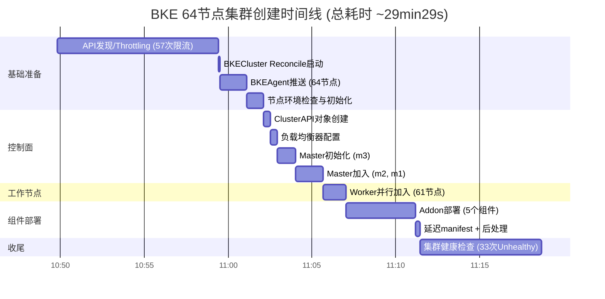

# BKE 64 节点集群创建时长统计与耗时分析报告

> **报告日期**: 2026-07-09
> **日志来源**: `bke-cluster-create.log`
> **集群名称**: `bke-cluster-128n`
> **集群规模**: 3 Master + 61 Worker = 64 节点
> **BKE 版本**: release-26.6.0 (GitCommitId: d59b2d85eee7b2c1e8770ff94c80b471e00d9710)
> **架构**: linux/arm64
> **管理节点 IP**: 192.168.200.95
> **Master 节点**: m1/192.168.200.115, m2/192.168.200.116, m3/192.168.200.117
> **控制面端点**: 192.168.200.253:36443

---

## 目录

1. [概述](#1-概述)
2. [各阶段时长统计](#2-各阶段时长统计)
3. [时间线可视化](#3-时间线可视化)
4. [耗时瓶颈深度分析](#4-耗时瓶颈深度分析)
5. [节点加入效率分析](#5-节点加入效率分析)
6. [Addon 组件部署分析](#6-addon-组件部署分析)
7. [异常事件记录](#7-异常事件记录)
8. [优化建议](#8-优化建议)
9. [结论](#9-结论)

---

## 1. 概述

本次集群创建部署了一个 64 节点的 BKE 集群（3 Master + 61 Worker），整体过程从 `2026-07-08 10:49:49` 开始，至 `11:19:18` 集群状态转为 `ClusterReady`，**总耗时约 29 分 29 秒**。

集群创建过程经历了 API 资源发现、BKEAgent 推送、节点环境初始化、控制面初始化与扩展、Worker 节点并行加入、Addon 组件部署、集群健康检查等主要阶段。全部 64 个节点最终成功加入集群，0 失败。

### 关键数据摘要

| 指标 | 数值 |
|------|------|
| 总耗时 | ~29 分 29 秒 (1769 秒) |
| 集群节点总数 | 64 (3 Master + 61 Worker) |
| Master 初始化方式 | 串行 (m3 -> m2 -> m1) |
| Worker 加入方式 | 并行 (61 节点同时 bootstrap) |
| Worker 加入成功/失败 | 61 / 0 |
| Addon 部署数量 | 5 个 (全部成功) |
| 健康检查失败次数 | 33 次 ClusterUnhealthy |
| API Throttling 次数 | 57 次 |
| 最终状态 | ClusterReady |

---

## 2. 各阶段时长统计

### 2.1 完整阶段明细表

| 序号 | 阶段名称 | 开始时间 | 结束时间 | 耗时 | 占总耗时比例 | 涉及节点数 |
|:----:|----------|----------|----------|------|:----------:|:--------:|
| 1 | 管理面 API 资源发现 (throttling) | 10:49:49 | 10:59:26 | ~9min 37s | 32.6% | - |
| 2 | BKECluster Reconcile 启动 | 10:59:26 | 10:59:32 | ~6s | 0.3% | - |
| 3 | BKEAgent 推送 (64 节点) | 10:59:32 | 11:01:06 | ~1min 34s | 5.3% | 64 |
| 4 | 节点环境检查与初始化 | 11:01:30 | 11:02:30 | ~1min 0s | 3.4% | 64 |
| 5 | ClusterAPI 对象创建 | 11:02:30 | 11:02:56 | ~26s | 1.5% | - |
| 6 | 负载均衡器配置 | 11:02:56 | 11:03:21 | ~25s | 1.4% | 3 (Master) |
| 7 | 首个 Master 初始化 (m3) | 11:03:15 | 11:04:20 | ~1min 5s | 3.7% | 1 |
| 8 | 其余 Master 加入 (m2 + m1) | 11:04:23 | 11:06:01 | ~1min 38s | 5.6% | 2 |
| 9 | Worker 节点并行加入 | 11:06:08 | 11:07:31 | ~1min 23s | 4.7% | 61 |
| 10 | Addon 部署 (5 个组件) | 11:07:32 | 11:11:40 | ~4min 8s | 14.0% | - |
| 11 | 延迟 manifest + 后处理 | 11:11:42 | 11:11:58 | ~16s | 0.9% | - |
| 12 | 集群健康检查 (-> Ready) | 11:12:04 | 11:19:18 | ~7min 14s | 24.5% | - |

### 2.2 阶段分类汇总

| 类别 | 包含阶段 | 总耗时 | 占比 |
|------|----------|--------|------|
| 基础设施准备 | 阶段 1-4 | ~12min 17s | 41.6% |
| 控制面构建 | 阶段 5-8 | ~3min 34s | 12.1% |
| 工作节点加入 | 阶段 9 | ~1min 23s | 4.7% |
| 组件部署与健康检查 | 阶段 10-12 | ~11min 38s | 39.4% |
| **合计** | **阶段 1-12** | **~29min 29s** | **100%** |

### 2.3 各阶段耗时占比图

```
管理面API发现  ################################  32.6%
健康检查收敛    ############################      24.5%
Addon部署      ##################                14.0%
Master加入     #########                          5.6%
BKEAgent推送   ########                           5.3%
Worker加入     #######                            4.7%
环境检查初始化  ####                               3.4%
Master初始化   ####                               3.7%
其余阶段        ###                                4.1%
```

---

## 3. 时间线可视化

### 3.1 整体时间线 (Gantt)



### 3.2 Worker 节点加入进度曲线

```
成功节点数
  61 |                                              *
     |                                         ****
  48 |                                    ****
     |                              ******
  32 |                        ******
     |                  ******
  16 |            ******
     |      ****
   1 |*
     +---------|---------|---------|---------|
     11:06:09  11:06:30  11:06:50  11:07:10  11:07:31
     开始bootstrap                 16节点完成 全部完成
```

61 个 Worker 节点从 `11:06:09` 开始并行 bootstrap，至 `11:07:31` 全部成功加入，耗时仅 **1 分 22 秒**。第一个节点成功在 `11:06:34` (n39)，最后一个在 `11:07:21` (n5, n31)，失败数 0。

---

## 4. 耗时瓶颈深度分析

### 4.1 瓶颈一：管理面 API 资源发现 throttling — 9min37s (32.6%)

**现象描述**

日志中有 **57 条** `client-side throttling` 警告消息，从 `10:49:50` 持续到 `10:59:23`，每次等待时间从 1.02 秒逐步递增到 9.20 秒。这些请求全部发往管理集群的 API Server (`192.168.200.95:6443`)。

**典型日志片段**

```
I0708 10:49:50.679394 ... Waited for 1.01982684s due to client-side throttling,
  request: GET:https://192.168.200.95:6443/apis/runtime.cluster.x-k8s.io/v1alpha1
I0708 10:50:00.877197 ... Waited for 2.39753992s due to client-side throttling,
  request: GET:https://192.168.200.95:6443/apis/resource.k8s.io/v1
...
I0708 10:59:23.643086 ... Waited for 6.5973529s due to client-side throttling,
  request: GET:https://192.168.200.95:6443/apis/node.k8s.io/v1
```

**根因分析**

BKE 控制器在初始化 Kubernetes client 时，需要对管理集群做全量 API 资源发现 (Discovery)，即遍历查询所有已注册的 APIGroup。管理集群上注册了大量 CRD/APIGroup（包括 cluster.x-k8s.io, bootstrap.cluster.x-k8s.io, controlplane.cluster.x-k8s.io, bke.bocloud.com, openfuyao.com, config.openfuyao.com 等数十个），发现请求触发了 Kubernetes client-go 默认的客户端限流 (QPS=5, Burst=10)。

每次 throttling 的等待时间递增模式符合 client-go 的限流退避算法：随着请求积压，等待时间从约 1 秒逐步增长到约 9 秒。

**影响评估**

- 直接消耗 9 分 37 秒，占总耗时的近三分之一
- 该阶段不涉及任何实际部署操作，纯粹是 API 客户端初始化开销
- 是所有阶段中投入产出比最高的优化点

**涉及的主要 APIGroup**

| APIGroup | 版本 |
|----------|------|
| runtime.cluster.x-k8s.io | v1alpha1 |
| resource.k8s.io | v1 |
| batch/v1 | - |
| bootstrap.cluster.x-k8s.io | v1alpha4 |
| rbac.authorization.k8s.io | v1 |
| apiextensions.k8s.io | v1 |
| cluster.x-k8s.io | v1alpha4, v1alpha3, v1beta1 |
| ipam.cluster.x-k8s.io | v1alpha1 |
| policy.networking.k8s.io | v1alpha1 |
| users.openfuyao.com | v1alpha1 |
| terminal.openfuyao.com | v1beta1 |
| scheduling.k8s.io | v1 |
| addons.cluster.x-k8s.io | v1alpha3, v1beta1 |
| bke.bocloud.com | v1beta1 |
| autoscaling | v1, v2 |
| controlplane.cluster.x-k8s.io | v1alpha3, v1beta1 |
| metrics.k8s.io | v1beta1 |
| apiregistration.k8s.io | v1 |
| flowcontrol.apiserver.k8s.io | v1 |
| admissionregistration.k8s.io | v1 |
| authentication.k8s.io | v1 |
| monitoring.coreos.com | v1 |
| bkeagent.bocloud.com | v1beta1 |
| config.openfuyao.com | v1alpha1 |
| storage.k8s.io | v1 |
| node.k8s.io | v1 |
| networking.k8s.io | v1 |
| crd.projectcalico.org | v1 |
| console.openfuyao.com | v1beta1 |

---

### 4.2 瓶颈二：集群健康检查收敛 — 7min14s (24.5%)

**现象描述**

`ClusterUnhealthy` 共出现 **33 次**，从 `11:12:04` 持续到 `11:18:51`，最终在 `11:19:18` 转为 `ClusterReady`。健康检查失败的组件经历了一个逐步收敛的过程。

**收敛过程详细记录**

| 时间段 | 主要异常组件 | 异常特征 |
|--------|------------|----------|
| 11:12:04 ~ 11:13:12 | monitoring 全套 | node-exporter x64 全部 Pending, alertmanager/prometheus 未创建, local-harbor 组件 Pending, openfuyao-system-controller Pending |
| 11:13:28 ~ 11:13:45 | monitoring + openfuyao-system | node-exporter 逐步减少, application-management-service/console-service/marketplace-service 开始创建但 Pending |
| 11:14:02 ~ 11:14:19 | monitoring 收窄 | node-exporter 数量减少至约 40 个, prometheus-k8s 开始创建, local-harbor-database/redis 仍 Pending |
| 11:14:36 ~ 11:14:53 | 组件大幅收敛 | 仅剩 local-harbor-jobservice, oauth-server/webhook/user-management/web-terminal 等未创建, openfuyao-system-controller 仍 Pending |
| **11:15:08** | **Master m1 NotReady** | calico-node-n2zqv, etcd-m1, kube-apiserver-m1, kube-controller-manager-m1, kube-proxy-tqnzm, kube-scheduler-m1 全部异常 |
| **11:16:11** | **Master m2 NotReady** | calico-node-4phm7, etcd-m2, kube-apiserver-m2 (Pending), kube-controller-manager-m2 等全部异常 |
| **11:17:19** | **Master m3 NotReady** | calico-node-wbxhf, etcd-m3, kube-apiserver-m3 (Pending), kube-controller-manager-m3 等全部异常 |
| 11:17:52 ~ 11:18:01 | openfuyao 组件 (of-controller 重建) | oauth-server, oauth-webhook, plugin-management-service, web-terminal-service 等逐步创建但 Pending; of-controller Pod 重建 (7pm8v -> zfkgv) 仍 Pending |
| 11:18:18 ~ 11:18:34 | 收敛到少数组件 | metrics-server, web-terminal-service 未就绪 |
| 11:18:51 | 仅剩 metrics-server | metrics-server Pod Ready 条件不满足 |
| **11:19:18** | **ClusterReady** | 全部就绪 |

**关键问题分析**

健康检查期间（11:15~11:17），**三个 Master 节点先后出现 NotReady**，且伴随 calico-node、etcd、kube-apiserver 等核心组件状态异常。这一现象的时序如下：

```
11:15:08  m1 NotReady  (calico-node, etcd, kube-apiserver 等异常)
11:16:11  m2 NotReady  (calico-node, etcd, kube-apiserver 等异常)
11:17:19  m3 NotReady  (calico-node, etcd, kube-apiserver 等异常)
```

三个 Master 依次异常的模式高度一致，每次间隔约 1 分钟。可能的原因：

1. **calico 网络配置变更**: Addon 部署阶段安装的 calico 可能触发了节点网络配置变更，导致 kube-apiserver 等组件短暂不可用
2. **组件重启**: Addon 部署可能触发了控制面组件的重启轮换
3. **资源竞争**: 64 节点同时拉取镜像和初始化，可能导致 Master 节点资源紧张

另外，`openfuyao-system-controller` Pod 从 11:12:04 到 ~11:19:00 持续处于 Pending 状态长达约 7 分钟，期间在 11:17:52 发生了一次重建（Pod 名称从 `7pm8v` 变为 `zfkgv`），但新 Pod 仍然 Pending。该 Pod 是健康检查迟迟无法通过的关键阻塞组件之一（与 metrics-server 并列最后才就绪的两个组件）。

---

### 4.3 瓶颈三：Addon 部署 — 4min8s (14.0%)

5 个 Addon 的部署存在严重的时间分布不均，详见第 6 节的分析。其中 calico 占了该阶段 79% 的时间。

---

## 5. 节点加入效率分析

### 5.1 Master 节点加入 (串行)

Master 节点采用串行加入方式，这是 kubeadm 的标准行为，因为 etcd 需要逐个加入以保证一致性。

| 节点 | 角色 | Bootstrap 开始 | Bootstrap 成功 | 耗时 | 说明 |
|------|------|---------------|---------------|------|------|
| m3 | master/node, etcd | 11:03:15 | 11:04:16 | ~1min 1s | 首个 Master (InitControlPlane) |
| m2 | master/node, etcd | 11:04:25 | 11:05:21 | ~56s | 第二个 Master (JoinControlPlane) |
| m1 | master/node, etcd | 11:05:27 | 11:05:58 | ~31s | 第三个 Master (JoinControlPlane) |

- **总耗时**: ~1min 38s (11:04:23 ~ 11:06:01)
- **平均每节点**: ~33s
- 趋势上逐节点加快（m3 最慢因为是首个 Master，需要初始化 etcd 集群；后续节点只需 join）

### 5.2 Worker 节点加入 (并行)

61 个 Worker 节点通过 `MachineDeployment` 一次性扩容 (replicas 0 -> 61)，并行 bootstrap。

**进度记录**

| 时间 | 成功节点数 | 说明 |
|------|-----------|------|
| 11:06:08 | 0 | 开始 Scale up MachineDeployment |
| 11:06:09 | 0 | 首批节点开始 bootstrap (n54, n47, n60, n39 ...) |
| 11:06:28 | 0 | 等待中 |
| 11:06:34 | 1 | 首个成功 (n39) |
| 11:06:39 | 1 | - |
| 11:06:49 | 7 | 快速增长 |
| 11:06:59 | 16 | - |
| 11:07:08 | ~25+ | 持续收敛 |
| 11:07:21 | ~59 | 接近完成 |
| 11:07:28 | 61 | **全部完成** |
| 11:07:31 | 61 | 确认成功 |

- **总耗时**: ~1min 22s (11:06:09 ~ 11:07:31)
- **成功率**: 61/61 = 100%
- **吞吐率**: ~44 节点/分钟
- 首个成功节点 (n39) 耗时约 25s
- 最后一批成功节点 (n5, n31) 在 11:07:21 完成

**效率评价**: Worker 并行加入效率非常高，61 个节点在不到 1.5 分钟内全部完成 bootstrap，无失败节点。这表明 BKE 的 MachineDeployment 并行扩容机制在大规模节点场景下表现良好。

---

## 6. Addon 组件部署分析

### 6.1 各 Addon 部署时长

| 序号 | Addon 名称 | 版本 | 开始时间 | 结束时间 | 耗时 | 状态 |
|:----:|-----------|------|----------|----------|------|------|
| 1 | kubeproxy | v1.34.3-of.1 | 11:07:32 | 11:07:33 | ~1s | 成功 |
| 2 | **calico** | **v3.31.3** | **11:07:33** | **11:10:48** | **~3min 15s** | 成功 |
| 3 | coredns | v1.12.2-of.1 | 11:10:48 | 11:10:48 | <1s | 成功 |
| 4 | cluster-api | v1.4.3 | 11:10:50 | 11:11:39 | ~49s | 成功 |
| 5 | openfuyao-system-controller | v26.6.0 | 11:11:40 | 11:11:40 | <1s (manifest apply) | 成功 (但 Pod 至 11:19 才 Ready) |

### 6.2 Addon 部署耗时占比

```
calico                ########################################  78.6%
cluster-api           ############                              19.8%
kubeproxy             #                                          0.4%
coredns               (瞬时)                                      0.0%
openfuyao-controller  (瞬时, 但Pod Pending约7min)                 0.0%
```

### 6.3 calico 部署慢的原因分析

calico 部署耗时 3 分 15 秒，是 Addon 阶段的主要瓶颈。原因可能包括：

1. **DaemonSet 部署规模大**: calico-node 以 DaemonSet 方式部署在全部 64 个节点上，每个节点都需要拉取镜像、启动 Pod、完成网络初始化
2. **网络初始化耗时**: calico 需要配置 BGP、IPIP/VXLAN 隧道、路由表等网络组件，节点间需要协商
3. **镜像拉取**: 如果 calico 镜像未预置在节点上，64 个节点同时拉取可能造成 registry 带宽瓶颈
4. **依赖就绪等待**: calico 可能需要等待 kube-apiserver 等组件就绪后才能完成注册

### 6.4 cluster-api Addon 说明

cluster-api addon 部署耗时 49 秒，在合理范围内。该 Addon 需要部署 CRD 和多个 controller（CAPM、CAPBPK、KCP 等），涉及大量资源创建。

值得注意的是，在 cluster-api addon 部署前（11:06:07），曾有一次延迟 manifest 部署失败（见第 7 节异常事件 1），该 manifest 在 cluster-api CRD 安装成功后于 11:11:58 第二次尝试时成功。

### 6.5 openfuyao-system-controller Pod 就绪分析

需要特别说明的是，上表中 openfuyao-system-controller 的部署耗时标注为 <1s，这仅指 **Addon manifest apply**（资源清单提交）的耗时。实际上该 Addon 的 Pod 经历了漫长的 Pending 过程，是健康检查阶段迟迟无法通过的关键组件之一。

**Pod 就绪时间线**:

| 时间 | 事件 | Pod 状态 |
|------|------|----------|
| 11:11:40 | AddonDeploySucceeded (manifest apply 完成) | Pod 尚未创建 |
| 11:12:04 | 首次健康检查 | Pending (Pod: ...7pm8v) |
| 11:12:04 ~ 11:17:12 | 连续 17 轮健康检查 | 持续 Pending |
| 11:17:52 | Pod 重建 | Pending (Pod: ...zfkgv, 旧 Pod 7pm8v 消失) |
| 11:18:18 | 最后一次报告 Pending | Pending (Pod: ...zfkgv) |
| ~11:19:18 | ClusterReady | 终于就绪 |

**总结**: openfuyao-system-controller 的 manifest apply 虽然瞬时完成，但 Pod 实际 Pending 了约 **7 分钟**（11:11:40 ~ ~11:19:00），期间还经历了一次 Pod 重建（7pm8v -> zfkgv）。该 Pod 是拖慢健康检查收敛的少数几个关键组件之一（另一个是 metrics-server）。

> **注意**: AddonDeploySucceeded 仅表示 Kubernetes 资源清单（Deployment/Service 等）已成功提交到 API Server，并不代表 Pod 已调度、拉取镜像并进入 Running/Ready 状态。Pod 的实际就绪过程发生在后续的健康检查阶段。

---

## 7. 异常事件记录

### 7.1 AddonDeployFailed — 延迟 manifest 首次部署失败

- **时间**: 11:06:07
- **级别**: Warning
- **详情**: `apply deferred cluster-api manage manifest failed: no matches for kind "BKECluster" in version "bke.bocloud.com/v1beta1"`
- **原因**: 在 cluster-api CRD 尚未安装时，尝试应用依赖 BKECluster CRD 的 manage manifest
- **影响**: 无实质影响。该 manifest 在 cluster-api addon 部署成功后（11:11:58）第二次尝试时成功
- **性质**: 属于设计上的延迟部署逻辑，非 bug

### 7.2 Master 节点健康检查期间反复 NotReady

- **时间**: 11:15:08 ~ 11:17:44
- **涉及节点**: m1 (11:15:08), m2 (11:16:11), m3 (11:17:19)
- **详情**: 三个 Master 节点先后出现 `node not ready`，伴随 calico-node、etcd、kube-apiserver、kube-controller-manager、kube-scheduler、kube-proxy 等 Pod 状态异常
- **模式**: 三节点依次异常，间隔约 1 分钟，高度一致
- **恢复**: 均在后续健康检查中逐步恢复
- **影响**: 延长了健康检查收敛时间约 2-3 分钟
- **可能原因**: calico 网络配置变更、控制面组件重启、或资源竞争

### 7.3 openfuyao-system-controller Pod 长时间 Pending + 重建

- **时间**: 11:12:04 ~ 11:18:18 (Pod 持续 Pending), 11:17:52 (Pod 重建)
- **详情**:
  - Addon manifest 于 11:11:40 瞬时部署成功，但 Pod `openfuyao-system-controller-749fcffc7c-7pm8v` 从 11:12:04 首次健康检查起一直处于 Pending 状态
  - 连续 17 轮健康检查（11:12:04 ~ 11:17:12）均报告该 Pod `unhealthy: status: Pending`
  - 11:17:52 Pod 发生重建，名称从 `7pm8v` 变为 `zfkgv`，但新 Pod 仍为 Pending
  - 直到 11:19:18 ClusterReady 时才最终就绪
- **Pending 总时长**: 约 7 分钟
- **影响**: 显著，该 Pod 是健康检查迟迟无法通过的关键阻塞组件之一
### 7.4 NotCreateDefaultUser — 默认用户创建跳过

- **时间**: 11:11:40
- **级别**: Warning
- **详情**: `the server could not find the requested resource`
- **影响**: 无，默认用户创建功能被跳过

### 7.5 EnvExtraExecScriptSkip — 两个自定义脚本跳过

- **时间**: 11:02:22, 11:02:29
- **脚本**: `install-nfsutils.sh`, `clean-docker-images.py`
- **原因**: `pipelineServer not configured in Spec.ClusterConfig.CustomExtra`
- **影响**: 无，属于配置未设置时的预期行为

### 7.6 EnvExtraExecScriptSkip — update-runc.sh 不适用

- **时间**: 11:02:29
- **原因**: `custom script "update-runc.sh" is not supported for containerd, skipping`
- **影响**: 无，使用 containerd 运行时时不适用

---

## 8. 优化建议

### 8.1 优先级 1 — 消除 API throttling (预计节省 ~8-9 分钟)

这是投入产出比最高的优化点。57 次 throttling 全部发生在管理集群 API 发现阶段，属于客户端限流导致的纯等待。

**方案选项**:

| 方案 | 描述 | 预期效果 | 实施难度 |
|------|------|----------|----------|
| A. 提高 QPS/Burst | 将 BKE 控制器的 client QPS 从默认 5 提升到 50，Burst 从 10 提升到 100 | 节省 ~8 分钟 | 低 |
| B. RESTMapper 缓存 | 缓存 API 资源发现结果，避免每次部署都做全量发现 | 节省 ~9 分钟 | 中 |
| C. 按需发现 | 只查询实际需要的 APIGroup，而非全量遍历 | 节省 ~8 分钟 | 中 |
| D. 组合方案 | A + B | 节省 ~9 分钟 | 中 |

**推荐**: 优先实施方案 A（提高 QPS/Burst），改动最小、见效最快。若仍有残留，再叠加方案 B。

### 8.2 优先级 2 — 缩短健康检查收敛时间 (预计节省 ~2-3 分钟)

健康检查期间 Master 反复 NotReady 是收敛慢的主要原因之一。

**方案选项**:

| 方案 | 描述 | 预期效果 | 实施难度 |
|------|------|----------|----------|
| A. 排查 Master NotReady 根因 | 分析 calico 部署与 Master 组件重启的关联，消除不必要的组件波动 | 节省 ~2 分钟 | 中 |
| B. 放宽非关键组件就绪判定 | 对 metrics-server 等非核心组件使用更宽松的就绪判定，避免单组件阻塞整体就绪 | 节省 ~30s | 低 |
| C. 优化健康检查轮询策略 | 调整轮询间隔和超时策略，减少不必要的等待 | 节省 ~30s | 低 |

**推荐**: 方案 A 为主（排查根因），方案 B + C 为辅（优化判定策略）。

### 8.3 优先级 3 — 加速 calico 部署 (预计节省 ~2 分钟)

calico 占了 Addon 阶段 79% 的时间。

**方案选项**:

| 方案 | 描述 | 预期效果 | 实施难度 |
|------|------|----------|----------|
| A. 预置 calico 镜像 | 将 calico 镜像预置到所有节点，减少拉取时间 | 节省 ~1 分钟 | 低 |
| B. 提前安装时机 | 将 calico 安装提前到节点 bootstrap 阶段 | 节省 ~1.5 分钟 | 中 |
| C. 优化 calico 初始化 | 检查 calico node 初始化是否有可优化的等待逻辑 | 节省 ~30s | 中 |

**推荐**: 方案 A 优先（预置镜像），若效果不足再考虑方案 B。

### 8.4 优化效果预估汇总

| 优化项 | 当前耗时 | 预期节省后 | 节省时间 |
|--------|----------|-----------|----------|
| API throttling | ~9min 37s | ~30s | ~9min |
| 健康检查收敛 | ~7min 14s | ~4min 30s | ~2min 30s |
| calico 部署 | ~3min 15s | ~1min 15s | ~2min |
| **合计** | - | - | **~13min 30s** |

**优化后预期总耗时**: ~29min 29s - ~13min 30s = **~16 分钟**

---

## 9. 结论

### 9.1 总体评价

本次 64 节点集群创建总体成功，全部 64 个节点零失败加入集群，5 个 Addon 全部部署成功。集群最终状态为 `ClusterReady`。

总耗时约 29 分 29 秒，其中约 71% 的时间消耗在三个可优化环节：API throttling (32.6%)、健康检查收敛 (24.5%)、Addon 部署 (14.0%)。

### 9.2 亮点

- **Worker 并行加入效率高**: 61 个节点在 1 分 22 秒内全部完成 bootstrap，吞吐率达 44 节点/分钟，零失败
- **Master 串行加入稳定**: 3 个 Master 节点在 1 分 38 秒内完成初始化和加入，符合 kubeadm 预期
- **Addon 部署成功率高**: 5 个 Addon 全部一次部署成功

### 9.3 主要问题

1. **API throttling 严重**: 57 次客户端限流消耗近 10 分钟，是最大瓶颈
2. **健康检查期间 Master 不稳定**: 三个 Master 节点在健康检查期间先后 NotReady，延长了收敛时间
3. **calico 部署慢**: 占 Addon 阶段 79% 的时间

### 9.4 改进方向

通过优化 API client QPS/Burst、排查 Master NotReady 根因、预置 calico 镜像等措施，预计可将 64 节点集群创建时间从 ~30 分钟压缩到 **~16 分钟**，效率提升约 46%。

---

*报告完*
