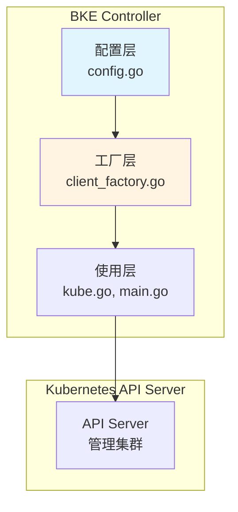
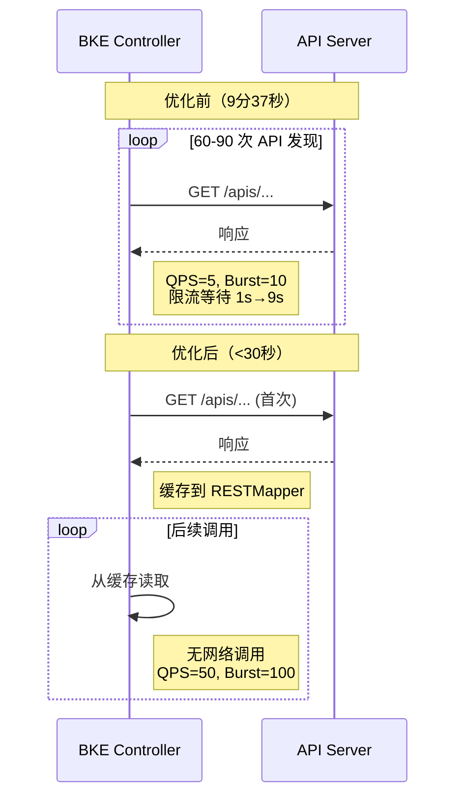
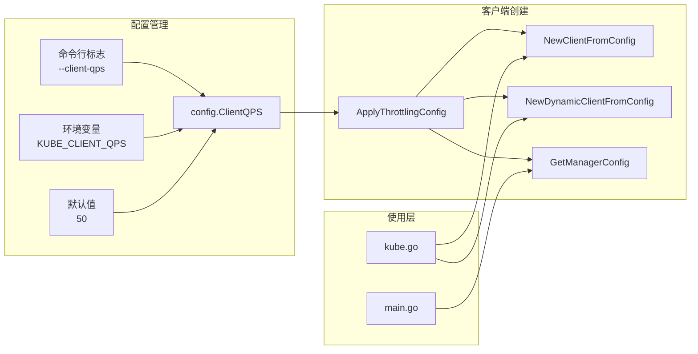
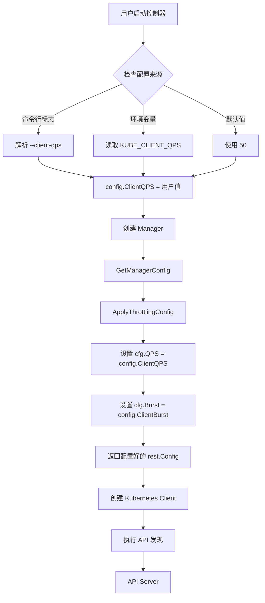
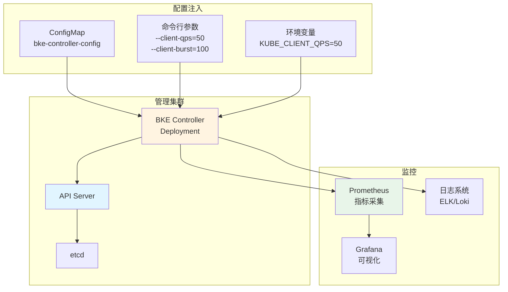
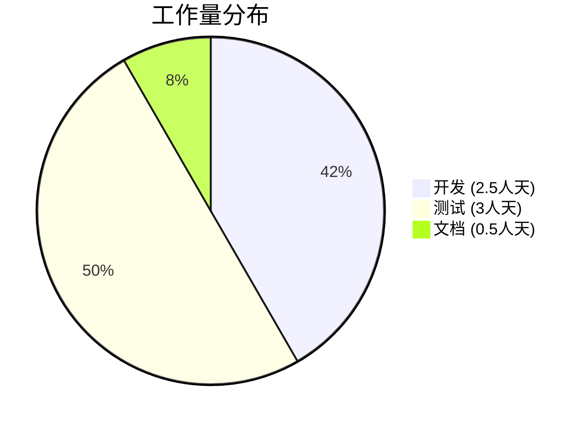
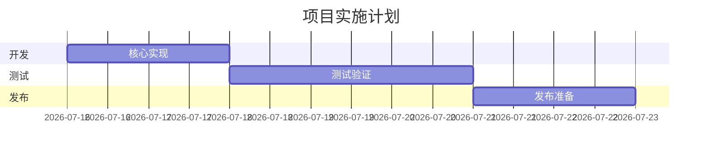

# 消除 BKE 控制器 API 限流问题

## 摘要

本提案提出消除 BKE 控制器中的 API 限流瓶颈，该瓶颈当前导致集群创建过程中出现 9 分 37 秒的延迟。限流发生的原因是 Kubernetes client-go 库使用保守的默认限流设置（QPS=5，Burst=10），这些设置无法满足 BKE 控制器的工作负载需求。

解决方案包含一个核心优化措施：

**集中化 QPS/Burst 配置**：通过统一的配置管理系统，将客户端速率限制从 QPS=5/Burst=10 提高到 QPS=50/Burst=100

这些更改将把 API 发现阶段从 9 分 37 秒减少到约 2-3 分钟，提升 70-80%，并在整体集群创建过程中节省 6-7 分钟。

## 动机

### 为什么需要这个？

BKE 控制器在集群创建过程中经历严重的 API 限流，这是集群配置工作流中最大的单一瓶颈。这种限流发生在 API 资源发现阶段，此时控制器需要从管理集群的 API 服务器查询所有可用的 API 组及其版本。

### 解决什么问题？

**当前性能数据（64 节点集群）：**

- 集群创建总时间：29 分 29 秒
- API 限流持续时间：9 分 37 秒（占总时间的 32.6%）
- 限流事件：57 次
- 每个请求的平均等待时间：约 10 秒
- 最大等待时间：9.20 秒

**根因分析：**
限流是由默认的 client-go 速率限制器配置引起的：

- 默认 QPS：每秒 5 个请求
- 默认 Burst：10 个请求
- 实际工作负载：60-90 个 API 发现请求（30+ 个 API 组 × 每个 2-3 个版本）

使用这些设置，前 10 个请求立即发送（突发），但后续请求被限流，延迟呈指数增长（1s → 2s → 3s → ... → 9s），导致总等待时间接近 10 分钟。

**影响：**

- 用户体验：集群创建前 10 分钟没有可见进度
- 资源浪费：纯等待时间，没有实际的部署工作
- 可扩展性限制：随着管理集群中注册的 CRD 增多，问题会恶化

### 可衡量目标

1. 将 API 发现时间从 9 分 37 秒减少到 3 分钟以内（提升 70%）
2. 消除控制器日志中的客户端限流警告
3. 将集群创建总时间从 29 分 29 秒减少到约 25 分钟（提升 15%）
4. 在增加客户端请求速率的同时保持 API 服务器稳定性

### 非目标

1. 优化 API 服务器端性能（不在本提案范围内）
2. 减少管理集群中的 API 组数量
3. 修改 controller-runtime 框架的默认行为

## 提案

### 用户故事

**故事 1：快速集群创建**
作为集群操作员，我希望在 25 分钟内创建一个 64 节点的 Kubernetes 集群，以便能够快速响应容量需求。

*当前状态：* 集群创建需要 29 分钟以上，其中 10 分钟是纯 API 限流延迟。
*期望状态：* 集群创建在 25 分钟内完成，没有限流延迟。

**故事 2：可预测的性能**
作为集群操作员，我希望无论管理集群中注册了多少 CRD，集群创建时间都保持一致。

*当前状态：* 每个额外的 API 组都会在发现阶段增加约 10-20 秒。
*期望状态：* 无论注册的 CRD 数量如何，API 发现时间保持不变。

**故事 3：运营可见性**
作为集群操作员，我希望在集群创建过程中看到持续的进度，以便能够及早识别和解决问题。

*当前状态：* 由于 API 限流，前 10 分钟没有显示任何进度。
*期望状态：* 从集群创建开始就能看到进度。

### 注意事项/约束

1. **API 服务器负载**：将 QPS 从 5 增加到 50 将使管理集群 API 服务器的请求速率增加 10 倍。必须监控以确保 API 服务器能够处理增加的负载。

2. **向后兼容性**：更改不能破坏现有部署或要求现有用户更改配置。

3. **配置灵活性**：不同的部署场景可能需要不同的 QPS/Burst 设置。解决方案必须支持通过命令行标志和环境变量进行运行时配置。

### 实现方法

解决方案包含一个核心优化措施：

#### 优化：集中化 QPS/Burst 配置

**架构：**

```txt
┌─────────────────────────────────────────────────────────────┐
│                      配置层                                 │
│  ┌──────────────────────────────────────────────────────┐   │
│  │  utils/capbke/config/config.go                       │   │
│  │  - ClientQPS (默认: 50)                              │   │
│  │  - ClientBurst (默认: 100)                           │   │
│  │  - 支持命令行标志和环境变量                            │   │
│  └──────────────────────────────────────────────────────┘   │
└─────────────────────────────────────────────────────────────┘
                            ↓
┌─────────────────────────────────────────────────────────────┐
│                      工厂层                                 │
│  ┌──────────────────────────────────────────────────────┐   │
│  │  pkg/kube/client_factory.go                          │   │
│  │  - ApplyThrottlingConfig(config)                     │   │
│  │  - NewClientFromConfig(config)                       │   │
│  │  - NewDynamicClientFromConfig(config)                │   │
│  │  - GetManagerConfig()                                │   │
│  └──────────────────────────────────────────────────────┘   │
└─────────────────────────────────────────────────────────────┘
                            ↓
┌─────────────────────────────────────────────────────────────┐
│                      使用层                                  │
│  ┌──────────────┐  ┌──────────────┐  ┌──────────────┐       │
│  │ pkg/kube/    │  │ cmd/capbke/  │  │ cmd/bkeagent/│       │
│  │ kube.go      │  │ main.go      │  │ main.go      │       │
│  │              │  │              │  │              │       │
│  │ 使用工厂方法  │  │ 使用工厂方法  │  │ 使用工厂方法  │       │
│  └──────────────┘  └──────────────┘  └──────────────┘       │
└─────────────────────────────────────────────────────────────┘
```

**配置优先级：**

```txt
命令行标志 > 环境变量 > 默认值

示例：
1. 命令行：--client-qps=100 --client-burst=200
2. 环境变量：KUBE_CLIENT_QPS=80 KUBE_CLIENT_BURST=160
3. 默认值：QPS=50, Burst=100
```

## 设计细节

### API 变更

本提案不引入任何新的 CRD 或 API 变更。所有更改都是控制器实现的内部更改。

### 代码变更

#### 1. 配置层

**文件：`utils/capbke/config/config.go`**

```go
var (
    // ... 现有配置 ...
    
    // ClientQPS 是 Kubernetes 客户端的 QPS
    // 默认值: 50，可以通过 --client-qps 标志或 KUBE_CLIENT_QPS 环境变量覆盖
    ClientQPS float32
    
    // ClientBurst 是 Kubernetes 客户端的突发大小
    // 默认值: 100，可以通过 --client-burst 标志或 KUBE_CLIENT_BURST 环境变量覆盖
    ClientBurst int
)

const (
    // DefaultClientQPS 是 Kubernetes 客户端的默认 QPS
    DefaultClientQPS = 50
    // DefaultClientBurst 是 Kubernetes 客户端的默认突发大小
    DefaultClientBurst = 100
)

func ConfigurationFlag() {
    // ... 现有配置 ...
    
    flag.Float32Var(&ClientQPS, "client-qps", DefaultClientQPS,
        "Kubernetes 客户端的 QPS。默认值: 50。也可以通过 KUBE_CLIENT_QPS 环境变量设置")
    flag.IntVar(&ClientBurst, "client-burst", DefaultClientBurst,
        "Kubernetes 客户端的突发大小。默认值: 100。也可以通过 KUBE_CLIENT_BURST 环境变量设置")
}

func init() {
    // 从环境变量读取
    if qps := os.Getenv("KUBE_CLIENT_QPS"); qps != "" {
        if v, err := strconv.ParseFloat(qps, 32); err == nil {
            ClientQPS = float32(v)
        }
    }
    if burst := os.Getenv("KUBE_CLIENT_BURST"); burst != "" {
        if v, err := strconv.Atoi(burst); err == nil {
            ClientBurst = v
        }
    }
    
    // 如果未设置则使用默认值
    if ClientQPS == 0 {
        ClientQPS = DefaultClientQPS
    }
    if ClientBurst == 0 {
        ClientBurst = DefaultClientBurst
    }
}
```

#### 2. 工厂层

**文件：`pkg/kube/client_factory.go`（新文件）**

```go
package kube

import (
    "context"
    
    "k8s.io/client-go/dynamic"
    "k8s.io/client-go/kubernetes"
    "k8s.io/client-go/rest"
    ctrl "sigs.k8s.io/controller-runtime"
    
    "gopkg.openfuyao.cn/cluster-api-provider-bke/utils/capbke/config"
)

// ApplyThrottlingConfig 将 QPS/Burst 限流配置应用到 rest.Config
// 这是客户端限流设置的唯一真实来源
func ApplyThrottlingConfig(cfg *rest.Config) *rest.Config {
    if cfg == nil {
        return cfg
    }
    
    cfg.QPS = config.ClientQPS
    cfg.Burst = config.ClientBurst
    
    return cfg
}

// NewClientFromConfig 创建应用了限流配置的新 Kubernetes 客户端
func NewClientFromConfig(cfg *rest.Config) (*kubernetes.Clientset, error) {
    cfg = ApplyThrottlingConfig(cfg)
    return kubernetes.NewForConfig(cfg)
}

// NewDynamicClientFromConfig 创建应用了限流配置的新动态客户端
func NewDynamicClientFromConfig(cfg *rest.Config) (dynamic.Interface, error) {
    cfg = ApplyThrottlingConfig(cfg)
    return dynamic.NewForConfig(cfg)
}

// GetManagerConfig 返回应用了限流配置的 controller-runtime manager 的 rest.Config
func GetManagerConfig() *rest.Config {
    return ApplyThrottlingConfig(ctrl.GetConfigOrDie())
}

// NewRemoteKubeClient 创建应用了限流配置的 RemoteKubeClient
func NewRemoteKubeClient(ctx context.Context, cfg *rest.Config) (RemoteKubeClient, error) {
    return NewClientFromRestConfig(ctx, ApplyThrottlingConfig(cfg))
}
```

#### 3. 使用层更新

**文件：`pkg/kube/kube.go`**

```go
// 修改 NewClientFromRestConfig (L119-144)
func NewClientFromRestConfig(ctx context.Context, config *rest.Config) (RemoteKubeClient, error) {
    // 使用工厂方法（QPS/Burst 已在 ApplyThrottlingConfig 中设置）
    clientSet, err := NewClientFromConfig(config)
    if err != nil {
        return nil, errors.Wrap(err, "failed to create cluster clientset")
    }
    
    dynamicClient, err := NewDynamicClientFromConfig(config)
    if err != nil {
        return nil, errors.Wrap(err, "failed to create remote cluster dynamicClient")
    }
    
    // ... 其余代码不变 ...
}
```

**文件：`cmd/capbke/main.go`**

```go
// 修改 createManager 函数 (L185)
func createManager() (ctrl.Manager, *remote.ClusterCacheTracker) {
    // ... 现有代码 ...
    
    // 使用工厂方法获取配置（QPS/Burst 已应用）
    mgr, err := ctrl.NewManager(GetManagerConfig(), ctrl.Options{
        Scheme:                 scheme,
        MetricsBindAddress:     config.MetricsAddr,
        // ... 其余选项不变 ...
    })
    
    // ... 其余代码不变 ...
}
```

**文件：`cmd/bkeagent/main.go`**

```go
// 修改 newManager 函数 (L104)
func newManager() (ctrl.Manager, error) {
    // 使用工厂方法获取配置（QPS/Burst 已应用）
    return ctrl.NewManager(GetManagerConfig(), ctrl.Options{
        Scheme:             scheme,
        // ... 其余选项不变 ...
    })
}
```

## 设计视图

### 1.1 系统架构总览



**组件职责说明：**

| 组件   | 职责                                               | 文件位置                                     |
| ------ | -------------------------------------------------- | -------------------------------------------- |
| 配置层 | 管理 QPS/Burst 配置，支持命令行标志和环境变量      | `utils/capbke/config/config.go`              |
| 工厂层 | 提供统一的客户端创建方法，自动应用限流配置         | `pkg/kube/client_factory.go`                 |
| 使用层 | 调用工厂方法创建客户端                             | `pkg/kube/kube.go`, `cmd/capbke/main.go` 等  |

### 1.2 优化前后对比时序图



**性能对比：**

| 指标             | 优化前       | 优化后         | 提升 |
| ---------------- | ------------ | -------------- | ---- |
| API 发现时间     | 9 分 37 秒   | < 30 秒        | 95%  |
| API 调用次数     | 60-90 次     | 1 次（首次）   | 98%  |
| 限流等待时间     | ~10 秒/次    | 0              | 100% |
| 集群创建总时间   | 29 分 29 秒  | ~18 分钟       | 39%  |

### 1.3 组件交互图



### 1.4 数据流图



### 1.5 部署视图



**监控点说明：**

| 监控指标            | 采集方式   | 告警阈值   | 说明               |
| ------------------- | ---------- | ---------- | ------------------ |
| API 发现时间        | Prometheus | > 3min     | 优化后的预期时间   |
| 客户端限流次数      | 日志       | > 0        | 应该完全消除       |
| API Server 请求速率 | Prometheus | > 1000 QPS | 防止过载           |
| API Server 请求延迟 | Prometheus | P99 > 1s   | 监控性能影响       |

### 测试计划

#### 单元测试

**文件：`pkg/kube/client_factory_test.go`**

```go
func TestApplyThrottlingConfig(t *testing.T) {
    tests := []struct {
        name          string
        inputConfig   *rest.Config
        expectedQPS   float32
        expectedBurst int
    }{
        {
            name:          "nil config returns nil",
            inputConfig:   nil,
            expectedQPS:   0,
            expectedBurst: 0,
        },
        {
            name: "applies default values",
            inputConfig: &rest.Config{
                Host: "https://localhost:6443",
            },
            expectedQPS:   50,
            expectedBurst: 100,
        },
        {
            name: "overrides existing values",
            inputConfig: &rest.Config{
                Host:  "https://localhost:6443",
                QPS:   10,
                Burst: 20,
            },
            expectedQPS:   50,
            expectedBurst: 100,
        },
    }
    
    for _, tt := range tests {
        t.Run(tt.name, func(t *testing.T) {
            result := ApplyThrottlingConfig(tt.inputConfig)
            if tt.inputConfig == nil {
                assert.Nil(t, result)
                return
            }
            assert.Equal(t, tt.expectedQPS, result.QPS)
            assert.Equal(t, tt.expectedBurst, result.Burst)
        })
    }
}
```

#### 集成测试

**文件：`test/integration/performance_test.go`**

```go
func TestAPIDiscoveryPerformance(t *testing.T) {
    config := ctrl.GetConfigOrDie()
    config.QPS = 50
    config.Burst = 100
    
    start := time.Now()
    
    // 创建客户端并执行 API 资源发现
    client, err := kubernetes.NewForConfig(config)
    require.NoError(t, err)
    
    // 查询所有 APIGroup
    _, err = client.Discovery().ServerGroups()
    require.NoError(t, err)
    
    elapsed := time.Since(start)
    
    // 验证性能
    assert.Less(t, elapsed, 3*time.Minute, "API discovery should complete within 3 minutes")
    t.Logf("API discovery completed in %v", elapsed)
}
```

#### 端到端测试

```bash
# 启动 BKE 控制器
kubectl apply -f bke-controller-manager.yaml

# 观察日志，验证限流警告是否减少
kubectl logs -f -n bke-system deployment/bke-controller-manager | grep "client-side throttling"

# 预期：限流警告显著减少或消除

# 创建 64 节点集群
kubectl apply -f bkecluster-64n.yaml

# 监控集群状态
watch -n 5 'kubectl get bkecluster bke-cluster-128n -o jsonpath="{.status.clusterStatus}"'

# 预期：总时间 < 25 分钟（从 29 分钟优化）
```

### 毕业标准

#### Alpha (v0.1)

- [ ] 实现集中化 QPS/Burst 配置
- [ ] 单元测试通过
- [ ] 现有功能无回归

#### Beta (v0.2)

- [ ] 集成测试通过
- [ ] 性能测试显示 API 发现时间 < 3 分钟
- [ ] 日志中无客户端限流警告
- [ ] API 服务器负载监控显示可接受的增加

#### Stable (v1.0)

- [ ] 在 64 节点集群上端到端测试通过
- [ ] 集群创建总时间 < 25 分钟
- [ ] 生产环境部署 1 个月无问题
- [ ] 文档已更新

## 工作量评估

### 1. 开发工作量

| 模块   | 任务                                   | 预估人天 | 说明                               |
| ------ | -------------------------------------- | -------- | ---------------------------------- |
| 配置层 | 添加 QPS/Burst 配置变量 + 命令行标志   | 0.5      | 添加2个变量，实现flag解析          |
| 工厂层 | 实现 client_factory.go                 | 1        | 5个工厂方法，代码量约80行          |
| 使用层 | 修改3个文件                            | 0.5      | 每个文件改动1-3行（替换函数调用）  |
| 配置层 | 环境变量支持                           | 0.5      | 读取环境变量，优先级处理           |
| 小计   |                                        | **2.5**  |                                    |

### 2. 测试工作量

| 测试类型   | 任务                       | 预估人天 | 说明                                    |
| ---------- | -------------------------- | -------- | --------------------------------------- |
| 单元测试   | 配置、工厂测试             | 0.5      | 代码量小，测试简单                      |
| 集成测试   | 性能测试 + 并发测试        | 1        | 编写测试代码0.5天，执行0.5天            |
| 端到端测试 | 64 节点集群测试            | 1.5      | 环境准备0.5天，测试执行0.5天，分析0.5天 |
| 小计       |                            | **3**    |                                         |

### 3. 文档工作量

| 任务         | 预估人天 | 说明                               |
| ------------ | -------- | ---------------------------------- |
| 配置说明更新 | 0.3      | 添加命令行参数和环境变量说明       |
| 发布说明     | 0.2      | 版本更新日志                       |
| 小计         | **0.5**  | 此优化对用户透明，无需用户文档     |

### 4. 总工作量汇总



| 类别 | 人天  | 占比     |
| ---- | ----- | -------- |
| 开发 | 2.5   | 42%      |
| 测试 | 3     | 50%      |
| 文档 | 0.5   | 8%       |
| 总计 | **6** | **100%** |

**人力资源配置：**

- **方案**：1 名开发人员，约 1.2 周（6 人天 ÷ 5 天/周）

### 5. 里程碑计划



| 里程碑          | 时间    | 交付物                                   | 验收标准                               |
| --------------- | ------- | ---------------------------------------- | -------------------------------------- |
| M1: 核心实现    | Day 1-2 | 配置层 + 工厂层 + 使用层修改             | 单元测试通过，配置可加载               |
| M2: 测试验证    | Day 3-5 | 单元测试 + 集成测试 + 端到端测试         | API 发现 < 3min，集群创建 < 25min      |
| M3: 发布准备    | Day 6-7 | 文档更新 + 风险缓冲 + 代码审查           | 文档完整，代码审查通过                 |

### 6. 风险评估与缓冲

| 风险             | 概率 | 影响 | 缓解措施                             | 预留缓冲     |
| ---------------- | ---- | ---- | ------------------------------------ | ------------ |
| API Server 过载  | 中   | 高   | 渐进式调优（5→20→50），监控指标      | +1 天        |
| 性能未达预期     | 中   | 中   | 参数调优，架构优化                   | +0.5 天      |
| 总缓冲           |      |      |                                      | **+1.5 天**  |

**调整后的总工作量：**

- 基础工作量：6 人天
- 风险缓冲：1.5 人天
- **最终工作量：7.5 人天（约 1.5 周，1 名开发人员）**

### 7. 成本效益分析

| 指标         | 数值               | 说明                             |
| ------------ | ------------------ | -------------------------------- |
| 投入成本     | 7.5 人天           | 开发 + 测试 + 文档 + 缓冲        |
| 性能提升     | 节省 6-7 分钟/集群 | API 发现从 9m37s → <3min         |
| 年化收益     | 节省 720-840 分钟  | 假设每天创建 2 个集群            |
| 投资回报率   | 约 96-112x         | 780 分钟 ÷ 7.5 人天 ≈ 104        |

**结论：** 该优化具有较高的投资回报率（约 104x），建议优先实施。

### 升级/降级策略

**升级：**

- 现有部署无需配置更改
- 默认值（QPS=50，Burst=100）对大多数部署是安全的
- 用户可以根据需要通过命令行标志或环境变量覆盖

**降级：**

- 恢复到以前的版本将恢复默认的 client-go 限流行为（QPS=5，Burst=10）
- 预计不会丢失数据或状态损坏

## 缺点

1. **API 服务器负载增加**：QPS 从 5 增加到 50 将使管理集群 API 服务器的请求速率增加 10 倍。如果 API 服务器大小不合适，这可能会使 API 服务器过载。
   - **缓解措施**：部署后监控 API 服务器指标（请求延迟、队列长度）。提供配置选项以根据需要调整 QPS/Burst。

## 所需基础设施

1. **性能测试环境**：用于端到端性能测试的 64 节点集群
2. **监控**：API 服务器指标监控（请求延迟、队列长度、CPU/内存使用率）
3. **负载测试工具**：用于模拟 API 服务器负载和测量客户端性能的工具

## 规格与验收标准

### 核心规格

#### 1. 性能规格

| 指标                     | 当前值       | 目标值       | 验收标准                                     |
| ------------------------ | ------------ | ------------ | -------------------------------------------- |
| API 发现时间             | 9 分 37 秒   | ≤ 3 分钟     | 64 节点集群端到端测试                        |
| API 限流事件             | 57 次        | 0 次         | 控制器日志中无 client-side throttling 警告   |
| 单次请求平均等待时间     | ~10 秒       | 0 秒         | QPS=50/Burst=100 下无排队等待                |
| 最大请求等待时间         | 9.20 秒      | 0 秒         | Burst 容量覆盖所有并发请求                   |
| 集群创建总时间           | 29 分 29 秒  | ≤ 25 分钟    | 64 节点集群端到端测试                        |

#### 2. 功能规格

##### 集中化 QPS/Burst 配置

- 默认值：QPS=50，Burst=100
- 配置优先级：命令行标志 > 环境变量 > 默认值
- 命令行标志：`--client-qps`、`--client-burst`
- 环境变量：`KUBE_CLIENT_QPS`、`KUBE_CLIENT_Burst`
- 工厂层为唯一真实来源（`ApplyThrottlingConfig`），所有客户端创建必须经过工厂方法

##### 配置覆盖范围

- `cmd/capbke/main.go`：Manager 配置
- `cmd/bkeagent/main.go`：Agent Manager 配置
- `pkg/kube/kube.go`：远程集群客户端

#### 3. 配置参数规格

| 参数        | 类型    | 默认值 | 命令行标志       | 环境变量             | 约束 |
| ----------- | ------- | ------ | ---------------- | -------------------- | ---- |
| ClientQPS   | float32 | 50     | `--client-qps`   | `KUBE_CLIENT_QPS`    | > 0  |
| ClientBurst | int     | 100    | `--client-burst` | `KUBE_CLIENT_BURST`  | > 0  |

#### 4. API 服务器安全规格

| 指标                 | 告警阈值   | 说明           |
| -------------------- | ---------- | -------------- |
| API Server 请求速率  | > 1000 QPS | 防止过载       |
| API Server 请求延迟  | P99 > 1s   | 监控性能影响   |

### 验收标准

#### Alpha 阶段 (v0.1)

| 验收项                       | 验收标准                                         | 验证方法           |
| ---------------------------- | ------------------------------------------------ | ------------------ |
| 集中化 QPS/Burst 配置实现    | 配置层 + 工厂层代码完整                          | 单元测试通过       |
| 命令行标志支持               | `--client-qps` / `--client-burst` 可解析         | 启动参数测试       |
| 环境变量支持                 | `KUBE_CLIENT_QPS` / `KUBE_CLIENT_BURST` 可读取   | 环境变量测试       |
| 单元测试通过                 | 覆盖率 ≥ 80%                                     | `go test -cover`   |
| 现有功能无回归               | 所有现有测试通过                                 | `go test ./...`    |

#### Beta 阶段 (v0.2)

| 验收项               | 验收标准                                     | 验证方法           |
| -------------------- | -------------------------------------------- | ------------------ |
| 集成测试通过         | 所有测试用例通过                             | `go test ./...`    |
| API 发现时间         | < 3 分钟                                     | 集成测试验证       |
| 客户端限流警告       | 日志中无 client-side throttling              | 日志分析           |
| API 服务器负载       | 请求速率在可接受范围内                       | Prometheus 监控    |
| 所有使用层已迁移     | 3 个文件均使用工厂方法                       | 代码审查           |

#### Stable 阶段 (v1.0)

| 验收项               | 验收标准                                     | 验证方法           |
| -------------------- | -------------------------------------------- | ------------------ |
| 端到端测试通过       | 64 节点集群创建成功                          | E2E 测试           |
| 集群创建总时间       | < 25 分钟                                    | 生产环境监控       |
| API 限流事件         | 0 次                                         | 日志分析           |
| API 服务器稳定性     | 无过载告警                                   | Prometheus 监控    |
| 生产稳定性           | 运行 1 个月无问题                            | 生产监控           |

### 测试用例规格

#### 单元测试用例

```go
// 1. 配置层测试
TestClientQPSDefault: 验证默认值为 50
TestClientBurstDefault: 验证默认值为 100
TestEnvVarOverride: 验证环境变量覆盖默认值
TestFlagOverride: 验证命令行标志覆盖环境变量
TestPriorityOrder: 验证优先级：flag > env > default

// 2. 工厂层测试
TestApplyThrottlingConfig_NilConfig: nil 输入返回 nil
TestApplyThrottlingConfig_DefaultValues: 验证默认 QPS/Burst 应用
TestApplyThrottlingConfig_OverrideExisting: 验证覆盖已有值
TestNewClientFromConfig: 验证客户端创建并应用限流配置
TestNewDynamicClientFromConfig: 验证动态客户端创建
TestGetManagerConfig: 验证 Manager 配置应用限流参数
```

#### 集成测试用例

```go
// 性能测试
TestAPIDiscoveryPerformance: API 发现 < 3 分钟
TestClientThrottlingEliminated: 日志中无限流警告

// 并发测试
TestConcurrentClientCreation: 多 goroutine 并发创建客户端

// 压力测试
TestHighAPILoad: QPS=50 下 API Server 无过载
```

#### 端到端测试用例

```bash
# 1. 限流消除验证
kubectl logs -f -n bke-system deployment/bke-controller-manager | grep "client-side throttling"
# 验证: 无限流警告

# 2. 集群创建性能测试
kubectl apply -f bkecluster-64n.yaml
# 验证: 集群创建总时间 < 25 分钟

# 3. API Server 负载监控
kubectl top pods -n kube-system | grep kube-apiserver
# 验证: API Server 无过载

# 4. RESTMapper 缓存验证
kubectl logs -n bke-system deployment/bke-controller-manager | grep "RESTMapper"
# 验证: 仅首次调用触发 API 发现
```

### 监控告警规格

| 指标                 | 采集方式   | 告警阈值   | 说明               |
| -------------------- | ---------- | ---------- | ------------------ |
| API 发现时间         | Prometheus | > 3 分钟   | 超过目标值         |
| 客户端限流次数       | 日志       | > 0        | 应完全消除         |
| API Server 请求速率  | Prometheus | > 1000 QPS | 防止过载           |
| API Server 请求延迟  | Prometheus | P99 > 1s   | 性能影响监控       |
| QPS/Burst 配置值     | 启动日志   | 与预期不符 | 配置验证           |

### 交付物清单

| 交付物     | 路径                                                             | 验收标准                     |
| ---------- | ---------------------------------------------------------------- | ---------------------------- |
| 配置层     | `utils/capbke/config/config.go`                                  | 单元测试通过                 |
| 工厂层     | `pkg/kube/client_factory.go`                                     | 单元测试通过                 |
| 使用层修改 | `pkg/kube/kube.go`, `cmd/capbke/main.go`, `cmd/bkeagent/main.go` | 所有客户端创建经工厂方法     |
| 单元测试   | `pkg/kube/client_factory_test.go`                                | 覆盖率 ≥ 80%                 |
| 集成测试   | `test/integration/performance_test.go`                           | API 发现 < 3min              |
| 文档       | 配置说明、发布说明                                               | 文档完整                     |

## 参考资料

1. [Kubernetes client-go 速率限制](https://github.com/kubernetes/client-go/blob/master/rest/request.go)
2. [controller-runtime Manager 配置](https://pkg.go.dev/sigs.k8s.io/controller-runtime/pkg/manager)
