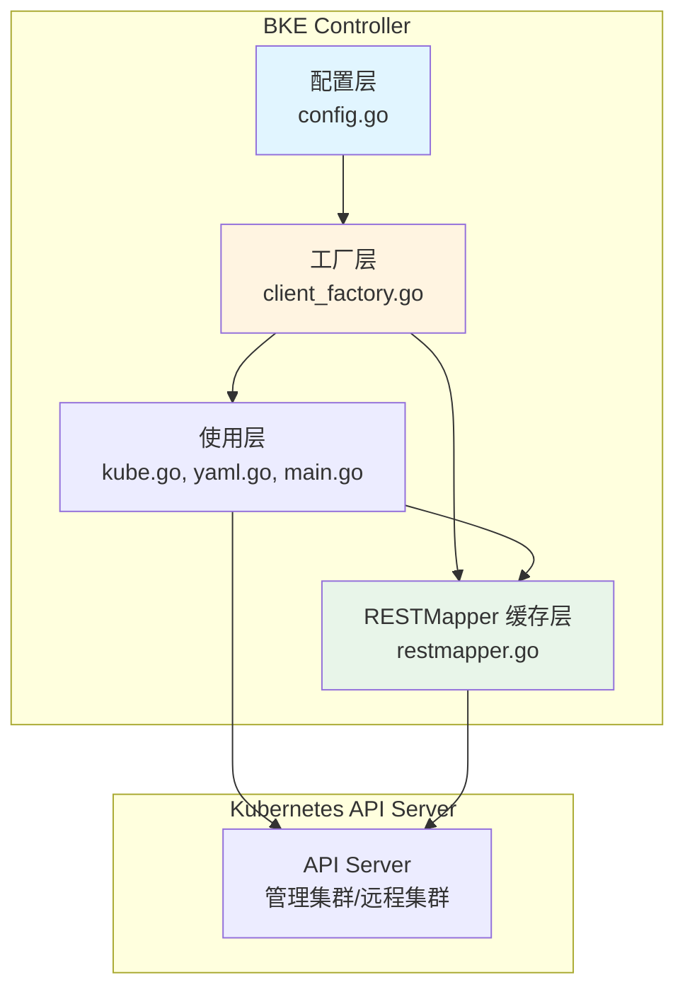
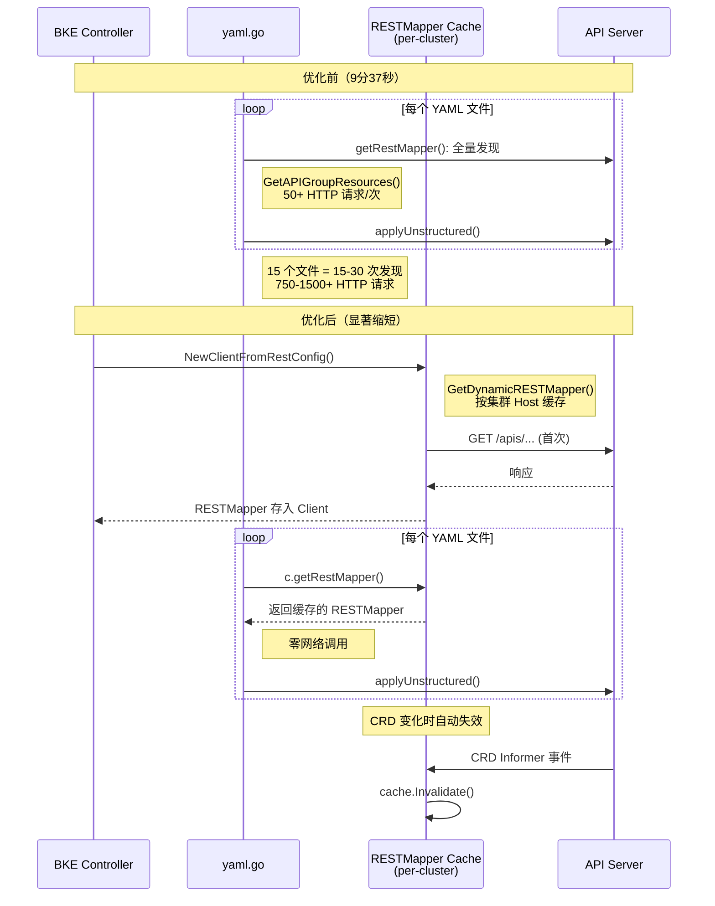
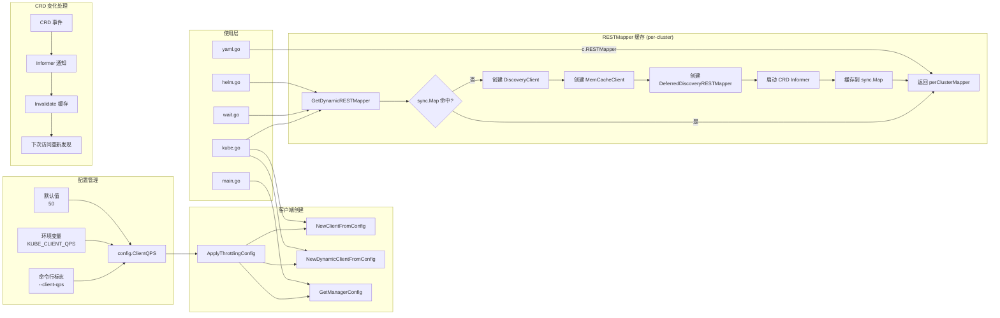
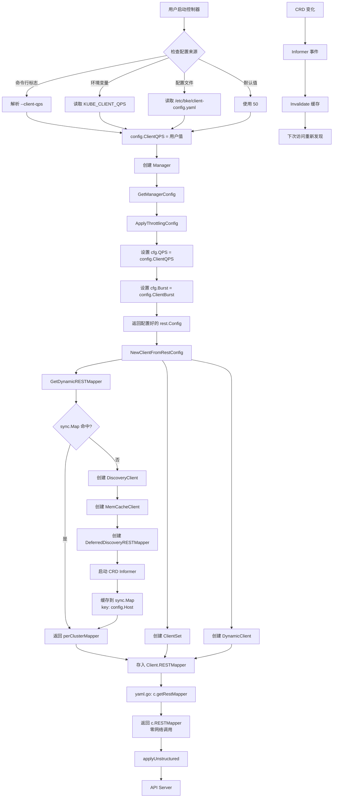
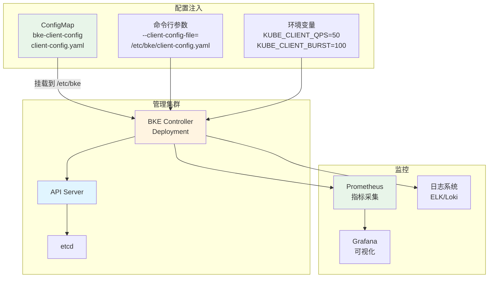
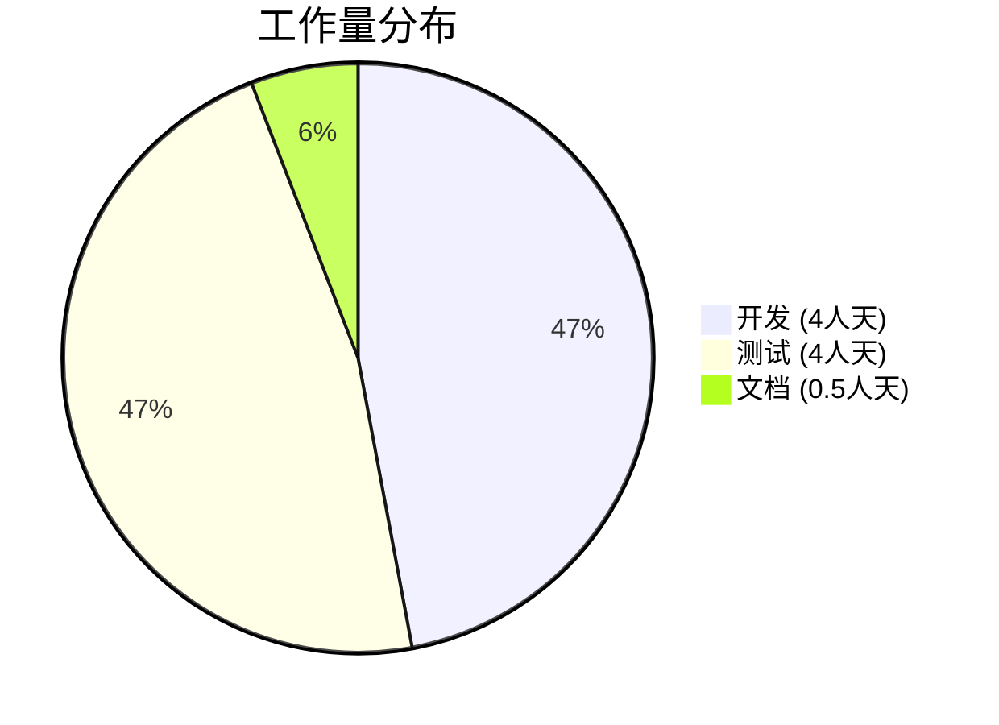

# 消除 BKE 控制器 API 限流问题

## 摘要

本提案提出消除 BKE 控制器中的 API 限流瓶颈，该瓶颈当前导致集群创建过程中出现 9 分 37 秒的延迟。限流发生的原因是 Kubernetes client-go 库使用保守的默认限流设置（QPS=5，Burst=10），这些设置无法满足 BKE 控制器的工作负载需求。

解决方案包含两个互补的优化措施：

1. **集中化 QPS/Burst 配置**：通过统一的配置管理系统，将客户端速率限制从 QPS=5/Burst=10 提高到 QPS=50/Burst=100
2. **动态 RESTMapper 缓存**：实现支持 CRD 动态感知的 RESTMapper 缓存，消除冗余的 API 发现调用

这些更改将把 API 发现阶段显著缩短，并在整体集群创建过程中节省可观的时间。

## 动机

### 为什么需要这个？

BKE 控制器在集群创建过程中经历严重的 API 限流，这是集群配置工作流中最大的单一瓶颈。这种限流发生在 API 资源发现阶段，此时控制器需要从管理集群的 API 服务器查询所有可用的 API 组及其版本。

### 解决什么问题？

**当前性能数据（64 节点集群）：**

- 集群创建总时间：29 分 29 秒
- API 限流持续时间：9 分 37 秒（占总时间的 32.6%）
- 限流事件：57 次
- 每个请求的平均等待时间：约 10 秒
- 最大等待时间：9.20 秒

**根因分析：**
限流是由默认的 client-go 速率限制器配置引起的：

- 默认 QPS：每秒 5 个请求
- 默认 Burst：10 个请求
- 实际工作负载：60-90 个 API 发现请求（30+ 个 API 组 × 每个 2-3 个版本）

使用这些设置，前 10 个请求立即发送（突发），但后续请求被限流，延迟呈指数增长（1s → 2s → 3s → ... → 9s），导致总等待时间接近 10 分钟。

**影响：**

- 用户体验：集群创建前 10 分钟没有可见进度
- 资源浪费：纯等待时间，没有实际的部署工作
- 可扩展性限制：随着管理集群中注册的 CRD 增多，问题会恶化

### 可衡量目标

1. 显著缩短 API 发现时间
2. 消除控制器日志中的客户端限流警告
3. 减少集群创建总时间
4. 在增加客户端请求速率的同时保持 API 服务器稳定性

### 非目标

1. 优化 API 服务器端性能（不在本提案范围内）
2. 减少管理集群中的 API 组数量
3. 修改 controller-runtime 框架的默认行为

## 提案

### 用户故事

**故事 1：快速集群创建**
作为集群操作员，我希望快速创建一个 64 节点的 Kubernetes 集群，以便能够快速响应容量需求。

*当前状态：* 集群创建需要 29 分钟以上，其中 10 分钟是纯 API 限流延迟。
*期望状态：* 集群创建时间显著缩短，消除限流延迟。

**故事 2：可预测的性能**
作为集群操作员，我希望无论管理集群中注册了多少 CRD，集群创建时间都保持一致。

*当前状态：* 每个额外的 API 组都会在发现阶段增加约 10-20 秒。
*期望状态：* 无论注册的 CRD 数量如何，API 发现时间保持不变。

**故事 3：运营可见性**
作为集群操作员，我希望在集群创建过程中看到持续的进度，以便能够及早识别和解决问题。

*当前状态：* 由于 API 限流，前 10 分钟没有显示任何进度。
*期望状态：* 从集群创建开始就能看到进度。

### 注意事项/约束

1. **API 服务器负载**：将 QPS 从 5 增加到 50 将使管理集群 API 服务器的请求速率增加 10 倍。必须监控以确保 API 服务器能够处理增加的负载。

2. **向后兼容性**：更改不能破坏现有部署或要求现有用户更改配置。

3. **配置灵活性**：不同的部署场景可能需要不同的 QPS/Burst 设置。解决方案必须支持通过命令行标志和环境变量进行运行时配置。

### 实现方法

#### 当前代码问题分析

通过对代码的深入分析，发现 RESTMapper 使用存在以下问题，导致 API 发现调用被大量重复触发：

##### 问题清单

| # | 严重度 | 文件 | 位置 | 问题 |
| --- | -------- | ------ | ------ | ------ |
| 1 | **CRITICAL** | `pkg/kube/yaml.go` | `getRestMapper()` L83-90 | 每次 `ApplyYaml` 调用 `restmapper.GetAPIGroupResources(dc)` 触发全量 `/api` + `/apis` 发现，创建新的 `NewDiscoveryRESTMapper` |
| 2 | **HIGH** | `pkg/kube/yaml.go` | `getMapping()` L154-183 | `NoMatchError` 时再次执行全量发现，创建第二个 RESTMapper。单次 `ApplyYaml` 可触发 1-2 次发现 |
| 3 | **CRITICAL** | `pkg/kube/addon.go` | `applyAddonFiles()` L356-368 | 循环中对每个 YAML 文件调用 `ApplyYaml`，15 个文件 = 15-30 次发现 |
| 4 | **HIGH** | `pkg/kube/wait.go` | `ToRESTMapper()` L186-212 | `ToDiscoveryClient()` 每次创建新的 `memory.NewMemCacheClient`，缓存不共享，形同虚设 |
| 5 | **HIGH** | `pkg/kube/helm.go` | `ToRESTMapper()` L55-69 | 同上，Helm 操作（install/upgrade/uninstall）每次都创建空缓存 |
| 6 | **CRITICAL** | 10+ phase 文件 | 各 `Execute()` | 每个 phase 调用 `NewRemoteClientByBKECluster()` 创建新 Client，Client 无 RESTMapper 字段，无法缓存 |
| 7 | **ROOT** | `pkg/kube/kube.go` | `Client` struct L80-87 | `Client` 结构体无 RESTMapper 字段，是所有下游问题的根因 |

##### 根因：Client 结构体缺少 RESTMapper 字段

**文件：`pkg/kube/kube.go:80-87`**

```go
type Client struct {
    ClientSet     *kubernetes.Clientset
    DynamicClient dynamic.Interface
    RestConfig    *rest.Config
    Log           *log.Logger
    BKELog        *bkev1beta1.BKELogger
    Ctx           context.Context
    // 缺失：RESTMapper 字段
}
```

Client 存储了 ClientSet 和 DynamicClient，但没有 RESTMapper。每次需要 RESTMapper 时只能重新创建。

##### 最严重的性能瓶颈：每次 ApplyYaml 触发全量发现

**文件：`pkg/kube/yaml.go:83-90`**

```go
func (c *Client) getRestMapper() (meta.RESTMapper, error) {
    dc := c.ClientSet.Discovery()
    restMapperRes, err := restmapper.GetAPIGroupResources(dc)  // 全量发现
    if err != nil {
        return nil, err
    }
    return restmapper.NewDiscoveryRESTMapper(restMapperRes), nil  // 每次新建
}
```

使用 `NewDiscoveryRESTMapper`（非延迟、非缓存），每次调用都执行完整的 API 组枚举。

##### NoMatchError 重复发现

**文件：`pkg/kube/yaml.go:154-183`**

```go
if apierrors2.IsNoMatchError(err) {
    dc := c.ClientSet.Discovery()
    restMapperRes, err := restmapper.GetAPIGroupResources(dc)  // 第二次全量发现
    // ...
    restMapper = restmapper.NewDiscoveryRESTMapper(restMapperRes)  // 第二个新实例
}
```

CRD 刚安装时资源未注册，触发 `NoMatchError`，代码重新执行全量发现。这个逻辑本身合理，但由于每次 `ApplyYaml` 都已经做了一次发现，这里等于做了第二次。

##### 缓存失效：wait.go 和 helm.go

**文件：`pkg/kube/wait.go:186-212`**

```go
func (f *kubeFactory) ToDiscoveryClient() (discovery.CachedDiscoveryInterface, error) {
    // ...
    discoveryClient, _ := discovery.NewDiscoveryClientForConfig(config)
    return memory.NewMemCacheClient(discoveryClient), nil  // 每次新建空缓存
}
```

虽然使用了 `memory.NewMemCacheClient`（内存缓存），但每次调用都创建新实例，缓存从未被复用。

**文件：`pkg/kube/helm.go:55-69`**

```go
func (r *RestClientConfig) ToDiscoveryClient() (discovery.CachedDiscoveryInterface, error) {
    clientForConfig, _ := discovery.NewDiscoveryClientForConfig(r.restConfig)
    return memory.NewMemCacheClient(clientForConfig), nil  // 每次新建空缓存
}
```

Helm 的 install/upgrade/uninstall 操作每次都走这条路径。

##### 结构性放大：Phase 层重复创建 Client

至少 10 个 phase 文件在 `Execute()` 中调用 `NewRemoteClientByBKECluster()` 或 `GetTargetClusterClient()`，每次创建新的 Client 实例：

| 文件 | 调用次数 |
| ------ | ---------- |
| `pkg/phaseframe/phases/ensure_cluster.go` | 1 |
| `pkg/phaseframe/phases/ensure_addon_deploy.go` | 1 |
| `pkg/phaseframe/phases/ensure_component_upgrade.go` | 1 |
| `pkg/phaseframe/phases/ensure_cluster_manage.go` | 1 |
| `pkg/phaseframe/phases/ensure_master_upgrade.go` | 4 |
| `pkg/phaseframe/phases/ensure_worker_upgrade.go` | 4 |
| `pkg/phaseframe/phases/ensure_worker_delete.go` | 3 |
| `pkg/phaseframe/phases/ensure_master_delete.go` | 1 |
| `pkg/phaseframe/phases/ensure_cluster_api_manager_manifest.go` | 1 |
| `pkg/manifest/applier.go` | 1 |

##### 调用链与放大效应

```txt
一次 reconcile 循环
  ├─ ensure_addon_deploy.Execute()
  │   └─ NewRemoteClientByBKECluster()          ← 新建 Client（无 RESTMapper）
  │       └─ applyAddonFiles()
  │           ├─ ApplyYaml(file1)
  │           │   ├─ getRestMapper()             ← 全量发现 #1（50+ HTTP 请求）
  │           │   └─ getMapping()                ← 可能触发发现 #2
  │           ├─ ApplyYaml(file2)
  │           │   ├─ getRestMapper()             ← 全量发现 #3
  │           │   └─ ...
  │           └─ ApplyYaml(file15)
  │               └─ getRestMapper()             ← 全量发现 #29
  └─ 总计：15 个文件 = 15-30 次全量发现
      每次发现 = 50+ HTTP 请求（30+ API 组 × 多版本）
      合计 = 750-1500+ HTTP 请求（仅 RESTMapper 部分）
```

解决方案包含两个互补的优化措施：

#### 优化 1：集中化 QPS/Burst 配置

**架构：**

```txt
┌─────────────────────────────────────────────────────────────┐
│                      配置层                                 │
│  ┌──────────────────────────────────────────────────────┐   │
│  │  utils/capbke/config/config.go                       │   │
│  │  - ClientQPS (默认: 50)                              │   │
│  │  - ClientBurst (默认: 100)                           │   │
│  │  - 支持命令行标志和环境变量                            │   │
│  └──────────────────────────────────────────────────────┘   │
└─────────────────────────────────────────────────────────────┘
                            ↓
┌─────────────────────────────────────────────────────────────┐
│                      工厂层                                 │
│  ┌──────────────────────────────────────────────────────┐   │
│  │  pkg/kube/client_factory.go                          │   │
│  │  - ApplyThrottlingConfig(config)                     │   │
│  │  - NewClientFromConfig(config)                       │   │
│  │  - NewDynamicClientFromConfig(config)                │   │
│  │  - GetManagerConfig()                                │   │
│  └──────────────────────────────────────────────────────┘   │
└─────────────────────────────────────────────────────────────┘
                            ↓
┌─────────────────────────────────────────────────────────────┐
│                      使用层                                  │
│  ┌──────────────┐  ┌──────────────┐  ┌──────────────┐       │
│  │ pkg/kube/    │  │ cmd/capbke/  │  │ cmd/bkeagent/│       │
│  │ kube.go      │  │ main.go      │  │ main.go      │       │
│  │              │  │              │  │              │       │
│  │ 使用工厂方法  │  │ 使用工厂方法  │  │ 使用工厂方法  │       │
│  └──────────────┘  └──────────────┘  └──────────────┘       │
└─────────────────────────────────────────────────────────────┘
```

**配置优先级：**

```txt
命令行标志 > 环境变量 > 配置文件 > 默认值

示例：
1. 命令行：--client-qps=100 --client-burst=200
2. 环境变量：KUBE_CLIENT_QPS=80 KUBE_CLIENT_BURST=160
3. 配置文件：/etc/bke/client-config.yaml (qps: 60, burst: 120)
4. 默认值：QPS=50, Burst=100
```

**配置文件支持：**

通过 `--client-config-file` 参数指定配置文件路径（默认 `/etc/bke/client-config.yaml`），支持以下配置项：

```yaml
# BKE 客户端配置
qps: 50      # Kubernetes 客户端 QPS
burst: 100   # Kubernetes 客户端 Burst
```

配置文件通过 ConfigMap 挂载到 Pod，便于在 Kubernetes 环境中管理配置。

#### 优化 2：动态 RESTMapper 缓存

**架构：**

```txt
┌─────────────────────────────────────────────────────────────┐
│                动态 RESTMapper 缓存                          │
│  ┌──────────────────────────────────────────────────────┐   │
│  │  pkg/kube/restmapper.go                              │   │
│  │  - perClusterMapper (每个集群独立实例)                 │   │
│  │  - memory.MemCacheClient (基础缓存)                  │   │
│  │  - SharedInformerFactory (CRD 监听)                  │   │
│  │  - sync.Map (按集群 Host 缓存)                       │   │
│  │  - CloseDynamicRESTMapper() (资源释放)               │   │
│  └──────────────────────────────────────────────────────┘   │
└─────────────────────────────────────────────────────────────┘
                            ↓
┌─────────────────────────────────────────────────────────────┐
│                      使用模式                                │
│  ┌──────────────────────────────────────────────────────┐   │
│  │  pkg/kube/kube.go                                    │   │
│  │  - Client 结构体增加 RESTMapper 字段                  │   │
│  │  - NewClientFromRestConfig() 初始化时获取 RESTMapper  │   │
│  └──────────────────────────────────────────────────────┘   │
│  ┌──────────────────────────────────────────────────────┐   │
│  │  pkg/kube/yaml.go                                    │   │
│  │  - getRestMapper() 返回 c.RESTMapper（缓存实例）      │   │
│  │  - getMapping() NoMatchError 时调用 Reset() 重试      │   │
│  └──────────────────────────────────────────────────────┘   │
│  ┌──────────────────────────────────────────────────────┐   │
│  │  pkg/kube/wait.go, pkg/kube/helm.go                  │   │
│  │  - ToRESTMapper() 调用 GetDynamicRESTMapper()        │   │
│  │  - 共享同一集群的 RESTMapper 实例                     │   │
│  └──────────────────────────────────────────────────────┘   │
└─────────────────────────────────────────────────────────────┘
```

**按集群缓存机制：**

动态 RESTMapper 缓存通过以下机制确保多集群场景下的正确性和性能：

- **按集群隔离**：使用 `sync.Map` 按 `rest.Config.Host` 缓存 RESTMapper 实例，每个集群拥有独立的发现缓存和 CRD Informer
- **基础缓存**：使用 `memory.MemCacheClient` 提供内存缓存能力
- **CRD 监听**：使用 `SharedInformerFactory` 监听 CRD 资源的增删改事件
- **自动失效**：当 CRD 变化时，自动调用 `Invalidate()` 清除缓存
- **按需重建**：下次访问时 `DeferredDiscoveryRESTMapper` 自动重新发现并缓存最新的 API 资源信息
- **资源释放**：提供 `CloseDynamicRESTMapper(host)` 方法，集群不再使用时释放 Informer 资源

**优势：**

1. **性能提升**：避免重复的 API 发现调用，显著减少 API Server 负载
2. **数据一致性**：通过 CRD 监听机制确保缓存数据始终与 API Server 同步
3. **多集群支持**：每个集群拥有独立的 RESTMapper 实例，避免全局单例导致的多集群混淆
4. **自动化**：无需手动管理缓存生命周期，完全自动化处理
5. **向后兼容**：对现有代码透明，无需修改调用方代码

## 设计细节

### API 变更

本提案不引入任何新的 CRD 或 API 变更。所有更改都是控制器实现的内部更改。

### 代码变更

#### 1. 配置层

**文件：`utils/capbke/config/config.go`**

```go
var (
    // ... 现有配置 ...
    
    // ClientQPS 是 Kubernetes 客户端的 QPS
    // 默认值: 50，可以通过命令行标志、环境变量或配置文件覆盖
    ClientQPS float32
    
    // ClientBurst 是 Kubernetes 客户端的突发大小
    // 默认值: 100，可以通过命令行标志、环境变量或配置文件覆盖
    ClientBurst int
    
    // ClientConfigFile 是客户端配置文件路径
    // 默认值: /etc/bke/client-config.yaml
    ClientConfigFile string
)

const (
    // DefaultClientQPS 是 Kubernetes 客户端的默认 QPS
    DefaultClientQPS = 50
    // DefaultClientBurst 是 Kubernetes 客户端的默认突发大小
    DefaultClientBurst = 100
    // DefaultClientConfigFile 是默认配置文件路径
    DefaultClientConfigFile = "/etc/bke/client-config.yaml"
)

// ClientConfig 客户端配置文件结构
type ClientConfig struct {
    QPS   float32 `yaml:"qps"`
    Burst int     `yaml:"burst"`
}

func ConfigurationFlag() {
    // ... 现有配置 ...
    
    flag.Float32Var(&ClientQPS, "client-qps", 0,
        "Kubernetes 客户端的 QPS。优先级：命令行 > 环境变量 > 配置文件 > 默认值(50)")
    flag.IntVar(&ClientBurst, "client-burst", 0,
        "Kubernetes 客户端的突发大小。优先级：命令行 > 环境变量 > 配置文件 > 默认值(100)")
    flag.StringVar(&ClientConfigFile, "client-config-file", DefaultClientConfigFile,
        "客户端配置文件路径。默认: /etc/bke/client-config.yaml")
}

func init() {
    // 1. 首先加载配置文件（最低优先级）
    loadClientConfigFile()
    
    // 2. 环境变量覆盖配置文件
    if qps := os.Getenv("KUBE_CLIENT_QPS"); qps != "" {
        if v, err := strconv.ParseFloat(qps, 32); err == nil {
            ClientQPS = float32(v)
        }
    }
    if burst := os.Getenv("KUBE_CLIENT_BURST"); burst != "" {
        if v, err := strconv.Atoi(burst); err == nil {
            ClientBurst = v
        }
    }
    
    // 3. 如果仍未设置，使用默认值
    if ClientQPS == 0 {
        ClientQPS = DefaultClientQPS
    }
    if ClientBurst == 0 {
        ClientBurst = DefaultClientBurst
    }
}

// loadClientConfigFile 从配置文件加载 QPS/Burst 配置
// 配置文件格式为 YAML，路径通过 --client-config-file 指定
func loadClientConfigFile() {
    if ClientConfigFile == "" {
        ClientConfigFile = DefaultClientConfigFile
    }
    
    data, err := os.ReadFile(ClientConfigFile)
    if err != nil {
        // 配置文件不存在或读取失败，使用默认值
        return
    }
    
    var config ClientConfig
    if err := yaml.Unmarshal(data, &config); err != nil {
        log.Warnf("failed to parse client config file %s: %v, using defaults", ClientConfigFile, err)
        return
    }
    
    if config.QPS > 0 {
        ClientQPS = config.QPS
    }
    if config.Burst > 0 {
        ClientBurst = config.Burst
    }
}
```

**配置文件格式：`/etc/bke/client-config.yaml`**

```yaml
# BKE 客户端配置
# 通过 ConfigMap 挂载到 Pod

# Kubernetes 客户端限流配置
qps: 50
burst: 100
```

**ConfigMap 定义：**

```yaml
apiVersion: v1
kind: ConfigMap
metadata:
  name: bke-client-config
  namespace: bke-system
data:
  client-config.yaml: |
    # BKE 客户端配置
    qps: 50
    burst: 100
```

**Deployment 挂载配置：**

```yaml
apiVersion: apps/v1
kind: Deployment
metadata:
  name: bke-controller-manager
  namespace: bke-system
spec:
  template:
    spec:
      containers:
      - name: manager
        args:
        - --client-config-file=/etc/bke/client-config.yaml
        volumeMounts:
        - name: client-config
          mountPath: /etc/bke
          readOnly: true
      volumes:
      - name: client-config
        configMap:
          name: bke-client-config
```

**配置优先级：**

```txt
命令行标志 > 环境变量 > 配置文件 > 默认值

示例：
1. 命令行：--client-qps=100 --client-burst=200
2. 环境变量：KUBE_CLIENT_QPS=80 KUBE_CLIENT_BURST=160
3. 配置文件：/etc/bke/client-config.yaml (qps: 60, burst: 120)
4. 默认值：QPS=50, Burst=100
```

#### 2. 工厂层

**文件：`pkg/kube/client_factory.go`（新文件）**

```go
package kube

import (
    "context"
    
    "k8s.io/client-go/dynamic"
    "k8s.io/client-go/kubernetes"
    "k8s.io/client-go/rest"
    ctrl "sigs.k8s.io/controller-runtime"
    
    "gopkg.openfuyao.cn/cluster-api-provider-bke/utils/capbke/config"
)

// ApplyThrottlingConfig 将 QPS/Burst 限流配置应用到 rest.Config
// 这是客户端限流设置的唯一真实来源
func ApplyThrottlingConfig(cfg *rest.Config) *rest.Config {
    if cfg == nil {
        return cfg
    }
    
    cfg.QPS = config.ClientQPS
    cfg.Burst = config.ClientBurst
    
    return cfg
}

// NewClientFromConfig 创建应用了限流配置的新 Kubernetes 客户端
func NewClientFromConfig(cfg *rest.Config) (*kubernetes.Clientset, error) {
    cfg = ApplyThrottlingConfig(cfg)
    return kubernetes.NewForConfig(cfg)
}

// NewDynamicClientFromConfig 创建应用了限流配置的新动态客户端
func NewDynamicClientFromConfig(cfg *rest.Config) (dynamic.Interface, error) {
    cfg = ApplyThrottlingConfig(cfg)
    return dynamic.NewForConfig(cfg)
}

// GetManagerConfig 返回应用了限流配置的 controller-runtime manager 的 rest.Config
func GetManagerConfig() *rest.Config {
    return ApplyThrottlingConfig(ctrl.GetConfigOrDie())
}

// NewRemoteKubeClient 创建应用了限流配置的 RemoteKubeClient
func NewRemoteKubeClient(ctx context.Context, cfg *rest.Config) (RemoteKubeClient, error) {
    return NewClientFromRestConfig(ctx, ApplyThrottlingConfig(cfg))
}
```

#### 3. RESTMapper 缓存层

**文件：`pkg/kube/restmapper.go`（新文件）**

```go
package kube

import (
    "fmt"
    "sync"
    
    "k8s.io/apimachinery/pkg/api/meta"
    "k8s.io/client-go/discovery"
    "k8s.io/client-go/discovery/cached/memory"
    "k8s.io/client-go/rest"
    "k8s.io/client-go/restmapper"
    "k8s.io/client-go/tools/cache"
    apiextensionsclient "k8s.io/apiextensions-apiserver/pkg/client/clientset/clientset"
    apiextensionsinformers "k8s.io/apiextensions-apiserver/pkg/client/informers/externalversions"
)

// perClusterMapper 每个集群的 RESTMapper 实例
type perClusterMapper struct {
    mapper      meta.RESTMapper
    cache       *memory.MemCacheClient
    crdInformer cache.SharedIndexInformer
    stopCh      chan struct{}
}

// Invalidate 清除发现缓存，下次访问时自动重新发现
func (m *perClusterMapper) Invalidate() {
    m.cache.Invalidate()
}

// Stop 停止 CRD Informer，释放资源
func (m *perClusterMapper) Stop() {
    close(m.stopCh)
}

// RESTMapper 返回底层的 meta.RESTMapper
func (m *perClusterMapper) RESTMapper() meta.RESTMapper {
    return m.mapper
}

var (
    // restMapperCache 按集群 API Server 地址缓存 RESTMapper 实例
    // key: rest.Config.Host (如 "https://10.0.0.1:6443")
    // value: *perClusterMapper
    restMapperCache sync.Map
)

// GetDynamicRESTMapper 返回指定集群的动态 RESTMapper
//
// 每个集群（按 rest.Config.Host 区分）拥有独立的 RESTMapper 实例，
// 包含独立的发现缓存和 CRD Informer。
//
// 该 RESTMapper 具有以下特性：
// - 使用 memory.MemCacheClient 提供基础缓存能力
// - 使用 SharedInformerFactory 监听 CRD 资源变化
// - 当 CRD 变化时，自动调用 Invalidate() 清除缓存
// - 下次访问时自动重新发现并缓存最新的 API 资源信息
func GetDynamicRESTMapper(config *rest.Config) (*perClusterMapper, error) {
    host := config.Host
    
    // 快速路径：缓存命中
    if cached, ok := restMapperCache.Load(host); ok {
        return cached.(*perClusterMapper), nil
    }
    
    // 慢路径：创建新实例
    mapper, err := newPerClusterMapper(config)
    if err != nil {
        return nil, err
    }
    
    // 存储到缓存（如果已存在则使用已有的）
    actual, _ := restMapperCache.LoadOrStore(host, mapper)
    if actual != mapper {
        // 其他 goroutine 已创建，停止当前实例
        mapper.Stop()
        return actual.(*perClusterMapper), nil
    }
    
    return mapper, nil
}

// CloseDynamicRESTMapper 关闭指定集群的 RESTMapper，释放 CRD Informer 资源
func CloseDynamicRESTMapper(host string) {
    if cached, ok := restMapperCache.LoadAndDelete(host); ok {
        cached.(*perClusterMapper).Stop()
    }
}

func newPerClusterMapper(config *rest.Config) (*perClusterMapper, error) {
    discoveryClient, err := discovery.NewDiscoveryClientForConfig(config)
    if err != nil {
        return nil, err
    }
    
    cachedDiscovery := memory.NewMemCacheClient(discoveryClient)
    mapper := restmapper.NewDeferredDiscoveryRESTMapper(cachedDiscovery)
    
    crdInformer, err := createCRDInformer(config)
    if err != nil {
        return nil, fmt.Errorf("failed to create CRD informer: %w", err)
    }
    
    m := &perClusterMapper{
        mapper:      mapper,
        cache:       cachedDiscovery,
        crdInformer: crdInformer,
        stopCh:      make(chan struct{}),
    }
    
    // CRD 变化时自动清除发现缓存
    crdInformer.AddEventHandler(cache.ResourceEventHandlerFuncs{
        AddFunc: func(obj interface{}) {
            cachedDiscovery.Invalidate()
        },
        UpdateFunc: func(oldObj, newObj interface{}) {
            cachedDiscovery.Invalidate()
        },
        DeleteFunc: func(obj interface{}) {
            cachedDiscovery.Invalidate()
        },
    })
    
    go crdInformer.Run(m.stopCh)
    
    if !cache.WaitForCacheSync(m.stopCh, crdInformer.HasSynced) {
        m.Stop()
        return nil, fmt.Errorf("failed to sync CRD informer cache")
    }
    
    return m, nil
}

func createCRDInformer(config *rest.Config) (cache.SharedIndexInformer, error) {
    apiextensionsClient, err := apiextensionsclient.NewForConfig(config)
    if err != nil {
        return nil, fmt.Errorf("failed to create apiextensions client: %w", err)
    }
    
    factory := apiextensionsinformers.NewSharedInformerFactory(apiextensionsClient, 0)
    return factory.Apiextensions().V1().CustomResourceDefinitions().Informer(), nil
}
```

#### 4. Client 结构体增加 RESTMapper 字段

**文件：`pkg/kube/kube.go`**

```go
// Client 结构体增加 RESTMapper 字段（L80-87）
type Client struct {
    ClientSet     *kubernetes.Clientset
    DynamicClient dynamic.Interface
    RestConfig    *rest.Config
    RESTMapper    meta.RESTMapper  // 新增：缓存的 RESTMapper
    Log           *log.Logger
    BKELog        *bkev1beta1.BKELogger
    Ctx           context.Context
}

// NewClientFromRestConfig 初始化时创建 RESTMapper（L119-144）
func NewClientFromRestConfig(ctx context.Context, config *rest.Config) (RemoteKubeClient, error) {
    clientSet, err := NewClientFromConfig(config)
    if err != nil {
        return nil, errors.Wrap(err, "failed to create cluster clientset")
    }
    
    dynamicClient, err := NewDynamicClientFromConfig(config)
    if err != nil {
        return nil, errors.Wrap(err, "failed to create remote cluster dynamicClient")
    }
    
    // 新增：获取或创建该集群的 RESTMapper
    restMapperWrapper, err := GetDynamicRESTMapper(config)
    if err != nil {
        return nil, errors.Wrap(err, "failed to create RESTMapper")
    }
    
    addToScheme.Do(func() {
        if err := apiextv1.AddToScheme(scheme.Scheme); err != nil {
            panic(err)
        }
        if err := apiextv1beta1.AddToScheme(scheme.Scheme); err != nil {
            panic(err)
        }
    })
    
    return &Client{
        ClientSet:     clientSet,
        DynamicClient: dynamicClient,
        RestConfig:    config,
        RESTMapper:    restMapperWrapper.RESTMapper(),  // 新增
        Log:           log.With("module", "kube"),
        Ctx:           ctx,
    }, nil
}
```

#### 5. yaml.go 使用缓存的 RESTMapper

**文件：`pkg/kube/yaml.go`**

```go
// getRestMapper 改为返回 Client 缓存的 RESTMapper（L83-90）
// 不再触发 API 发现调用
func (c *Client) getRestMapper() (meta.RESTMapper, error) {
    if c.RESTMapper == nil {
        return nil, errors.New("RESTMapper is not initialized")
    }
    return c.RESTMapper, nil
}

// getMapping 简化 NoMatchError 处理（L154-183）
// 使用缓存的 RESTMapper，NoMatchError 时清除缓存并重试
func (c *Client) getMapping(
    restMapper meta.RESTMapper,
    gvk schema.GroupVersionKind,
    unstruct unstructured.Unstructured,
    task *Task) (*meta.RESTMapping, error) {
    
    mapping, err := restMapper.RESTMapping(gvk.GroupKind(), gvk.Version)
    if err != nil {
        if apierrors2.IsNoMatchError(err) {
            // 清除发现缓存，让 DeferredDiscoveryRESTMapper 重新发现
            if cachedMapper, ok := restMapper.(*restmapper.DeferredDiscoveryRESTMapper); ok {
                cachedMapper.Reset()
            }
            // 重试一次
            mapping, err = restMapper.RESTMapping(gvk.GroupKind(), gvk.Version)
        }
        if err != nil {
            if apierrors2.IsNoMatchError(err) && gvk.Kind == "ServiceMonitor" {
                c.Log.Infof("addon obj Kind: %s, Name %s, APIVersion %s, not support %s in target cluster skip",
                    unstruct.GetKind(), unstruct.GetName(), unstruct.GetAPIVersion(), task.Operate)
                return nil, nil
            }
            return nil, err
        }
    }
    return mapping, nil
}
```

#### 6. 使用层更新

**文件：`pkg/kube/wait.go`**

```go
// ToRESTMapper 改为使用 Client 缓存的 RESTMapper（L187-195）
func (f *kubeFactory) ToRESTMapper() (meta.RESTMapper, error) {
    // 使用动态 RESTMapper 缓存（按集群缓存）
    mapperWrapper, err := GetDynamicRESTMapper(f.config)
    if err != nil {
        return nil, err
    }
    
    discoveryClient, err := f.ToDiscoveryClient()
    if err != nil {
        return nil, err
    }
    expander := restmapper.NewShortcutExpander(mapperWrapper.RESTMapper(), discoveryClient)
    return expander, nil
}
```

**文件：`pkg/kube/helm.go`**

```go
// ToRESTMapper 改为使用 Client 缓存的 RESTMapper（L56-64）
func (r *RestClientConfig) ToRESTMapper() (meta.RESTMapper, error) {
    // 使用动态 RESTMapper 缓存（按集群缓存）
    mapperWrapper, err := GetDynamicRESTMapper(r.restConfig)
    if err != nil {
        return nil, fmt.Errorf("failed to get dynamic REST mapper: %v", err)
    }
    
    c, err := r.ToDiscoveryClient()
    if err != nil {
        return nil, fmt.Errorf("failed to create discovery client: %v", err)
    }
    se := restmapper.NewShortcutExpander(mapperWrapper.RESTMapper(), c)
    return se, nil
}
```

**文件：`cmd/capbke/main.go`**

```go
// 修改 createManager 函数 (L185)
func createManager() (ctrl.Manager, *remote.ClusterCacheTracker) {
    // ... 现有代码 ...
    
    // 使用工厂方法获取配置（QPS/Burst 已应用）
    mgr, err := ctrl.NewManager(GetManagerConfig(), ctrl.Options{
        Scheme:                 scheme,
        MetricsBindAddress:     config.MetricsAddr,
        // ... 其余选项不变 ...
    })
    
    // ... 其余代码不变 ...
}
```

**文件：`cmd/bkeagent/main.go`**

```go
// 修改 newManager 函数 (L104)
func newManager() (ctrl.Manager, error) {
    // 使用工厂方法获取配置（QPS/Burst 已应用）
    return ctrl.NewManager(GetManagerConfig(), ctrl.Options{
        Scheme:             scheme,
        // ... 其余选项不变 ...
    })
}
```

#### 7. （可选）Phase 层优化：减少 Client 创建次数

**问题**：当前 10+ 个 phase 文件在 `Execute()` 中各自调用 `NewRemoteClientByBKECluster()` 创建新的 Client 实例。虽然 RESTMapper 已按集群缓存，但频繁创建 Client 仍带来不必要的开销。

**优化方案**：在 reconcile 循环开始时创建一次 Client，通过上下文传递给各 phase。

**文件：`pkg/phaseframe/phases/common.go`（新增辅助方法）**

```go
// RemoteClientCache 在 reconcile 循环内缓存远程 Client
type RemoteClientCache struct {
    clients map[string]RemoteKubeClient // key: cluster name
    mu      sync.RWMutex
}

// GetOrCreate 获取或创建远程 Client
func (c *RemoteClientCache) GetOrCreate(
    ctx context.Context,
    clusterName string,
    factory func() (RemoteKubeClient, error),
) (RemoteKubeClient, error) {
    c.mu.RLock()
    if client, ok := c.clients[clusterName]; ok {
        c.mu.RUnlock()
        return client, nil
    }
    c.mu.RUnlock()
    
    c.mu.Lock()
    defer c.mu.Unlock()
    
    // 双重检查
    if client, ok := c.clients[clusterName]; ok {
        return client, nil
    }
    
    client, err := factory()
    if err != nil {
        return nil, err
    }
    
    if c.clients == nil {
        c.clients = make(map[string]RemoteKubeClient)
    }
    c.clients[clusterName] = client
    return client, nil
}

// Close 释放所有缓存的 Client 资源
func (c *RemoteClientCache) Close() {
    c.mu.Lock()
    defer c.mu.Unlock()
    
    for host := range c.clients {
        CloseDynamicRESTMapper(host)
    }
    c.clients = nil
}
```

**使用示例**：

```go
// 在 phase 执行入口创建缓存
func (e *EnsureCluster) Execute() (ctrl.Result, error) {
    clientCache := &RemoteClientCache{}
    defer clientCache.Close()
    
    // 将 clientCache 注入到 phase 上下文
    ctx := context.WithValue(e.Ctx.Context, remoteClientCacheKey, clientCache)
    
    // ... 后续 phase 通过 ctx 获取缓存的 Client
}
```

**预期效果**：

| 指标                              | 优化前   | 优化后   |
| --------------------------------- | -------- | -------- |
| 单次 reconcile 创建 Client 次数   | 10-20 次 | 1-2 次   |
| RESTMapper 创建次数               | 10-20 次 | 1-2 次   |
| 内存占用                          | 较高     | 较低     |

## 设计视图

### 1.1 系统架构总览



**组件职责说明：**

| 组件              | 职责                                               | 文件位置                                    |
| ----------------- | -------------------------------------------------- | ------------------------------------------- |
| 配置层            | 管理 QPS/Burst 配置，支持命令行标志和环境变量      | `utils/capbke/config/config.go`             |
| 工厂层            | 提供统一的客户端创建方法，自动应用限流配置         | `pkg/kube/client_factory.go`                |
| RESTMapper 缓存层 | 按集群缓存 RESTMapper，支持 CRD 变化自动失效       | `pkg/kube/restmapper.go`                    |
| Client 结构体     | 持有 RESTMapper 字段，初始化时从缓存层获取         | `pkg/kube/kube.go`                          |
| YAML 应用层       | 使用 Client 缓存的 RESTMapper，避免重复发现        | `pkg/kube/yaml.go`                          |
| 使用层            | 调用工厂方法创建客户端，使用动态 RESTMapper 缓存   | `pkg/kube/wait.go`, `pkg/kube/helm.go` 等   |

### 1.2 优化前后对比时序图



**性能对比：**

| 指标                  | 优化前       | 优化后         | 提升     |
| --------------------- | ------------ | -------------- | -------- |
| API 发现时间          | 9 分 37 秒   | 显著缩短       | 大幅     |
| API 调用次数          | 750-1500 次  | 大幅减少       | 显著     |
| 限流等待时间          | ~10 秒/次    | 基本消除       | 显著     |
| 集群创建总时间        | 29 分 29 秒  | 显著减少       | 明显     |
| RESTMapper 缓存命中率 | 0%           | 显著提升       | 显著     |

### 1.3 组件交互图



### 1.4 数据流图



### 1.5 部署视图



**监控点说明：**

| 监控指标            | 采集方式   | 告警阈值   | 说明               |
| ------------------- | ---------- | ---------- | ------------------ |
| API 发现时间        | Prometheus | 超过预期值 | 优化后的预期时间   |
| 客户端限流次数      | 日志       | > 0        | 应该完全消除       |
| API Server 请求速率 | Prometheus | > 1000 QPS | 防止过载           |
| API Server 请求延迟 | Prometheus | P99 > 1s   | 监控性能影响       |

### 测试计划

#### 单元测试

**文件：`pkg/kube/client_factory_test.go`**

```go
func TestApplyThrottlingConfig(t *testing.T) {
    tests := []struct {
        name          string
        inputConfig   *rest.Config
        expectedQPS   float32
        expectedBurst int
    }{
        {
            name:          "nil config returns nil",
            inputConfig:   nil,
            expectedQPS:   0,
            expectedBurst: 0,
        },
        {
            name: "applies default values",
            inputConfig: &rest.Config{
                Host: "https://localhost:6443",
            },
            expectedQPS:   50,
            expectedBurst: 100,
        },
        {
            name: "overrides existing values",
            inputConfig: &rest.Config{
                Host:  "https://localhost:6443",
                QPS:   10,
                Burst: 20,
            },
            expectedQPS:   50,
            expectedBurst: 100,
        },
    }
    
    for _, tt := range tests {
        t.Run(tt.name, func(t *testing.T) {
            result := ApplyThrottlingConfig(tt.inputConfig)
            if tt.inputConfig == nil {
                assert.Nil(t, result)
                return
            }
            assert.Equal(t, tt.expectedQPS, result.QPS)
            assert.Equal(t, tt.expectedBurst, result.Burst)
        })
    }
}
```

**文件：`pkg/kube/restmapper_test.go`**

```go
func TestGetDynamicRESTMapper(t *testing.T) {
    config := &rest.Config{
        Host: "https://localhost:6443",
    }
    
    // 第一次调用
    mapper1, err := GetDynamicRESTMapper(config)
    require.NoError(t, err)
    require.NotNil(t, mapper1)
    
    // 第二次调用应该返回相同实例（验证单例）
    mapper2, err := GetDynamicRESTMapper(config)
    require.NoError(t, err)
    assert.Equal(t, mapper1, mapper2, "Should return same instance")
    
    // 验证 RESTMapper 可以查询 API 资源
    _, err = mapper1.RESTMapping(schema.GroupKind{Group: "*", Kind: ""})
    require.NoError(t, err, "RESTMapper should be able to query API resources")
}

func TestDynamicRESTMapper_Invalidate(t *testing.T) {
    config := &rest.Config{
        Host: "https://localhost:6443",
    }
    
    mapper, err := GetDynamicRESTMapper(config)
    require.NoError(t, err)
    
    // 手动调用 Invalidate
    mapper.Invalidate()
    
    // 验证缓存已被清除，下次访问会重新发现
    _, err = mapper.RESTMapping(schema.GroupKind{Group: "*", Kind: ""})
    require.NoError(t, err, "RESTMapper should be able to query API resources after invalidation")
}
```

#### 集成测试

**文件：`test/integration/performance_test.go`**

```go
func TestAPIDiscoveryPerformance(t *testing.T) {
    config := ctrl.GetConfigOrDie()
    config.QPS = 50
    config.Burst = 100
    
    start := time.Now()
    
    // 创建客户端并执行 API 资源发现
    client, err := kubernetes.NewForConfig(config)
    require.NoError(t, err)
    
    // 查询所有 APIGroup
    _, err = client.Discovery().ServerGroups()
    require.NoError(t, err)
    
    elapsed := time.Since(start)
    
    // 验证性能
    assert.Less(t, elapsed, 3*time.Minute, "API discovery should complete within 3 minutes")
    t.Logf("API discovery completed in %v", elapsed)
}

func TestDynamicRESTMapperPerformance(t *testing.T) {
    config := ctrl.GetConfigOrDie()
    config.QPS = 50
    config.Burst = 100
    
    // 第一次调用，建立缓存
    mapper, err := GetDynamicRESTMapper(config)
    require.NoError(t, err)
    
    // 测试缓存命中性能
    start := time.Now()
    for i := 0; i < 100; i++ {
        _, err = mapper.RESTMapping(schema.GroupKind{Group: "*", Kind: ""})
        require.NoError(t, err)
    }
    elapsed := time.Since(start)
    
    // 验证缓存命中性能（应该非常快）
    assert.Less(t, elapsed, 1*time.Second, "Cached RESTMapper queries should be very fast")
    t.Logf("100 cached queries completed in %v", elapsed)
}
```

#### 端到端测试

```bash
# 启动 BKE 控制器
kubectl apply -f bke-controller-manager.yaml

# 观察日志，验证限流警告是否减少
kubectl logs -f -n bke-system deployment/bke-controller-manager | grep "client-side throttling"

# 预期：限流警告显著减少或消除

# 创建 64 节点集群
kubectl apply -f bkecluster-64n.yaml

# 监控集群状态
watch -n 5 'kubectl get bkecluster bke-cluster-128n -o jsonpath="{.status.clusterStatus}"'

# 预期：总时间显著减少

# 验证 RESTMapper 缓存效果
kubectl logs -n bke-system deployment/bke-controller-manager | grep "RESTMapper"
# 预期：仅首次调用触发 API 发现，后续调用从缓存读取

# 验证 CRD 变化时缓存自动失效
kubectl apply -f new-crd.yaml
kubectl logs -n bke-system deployment/bke-controller-manager | grep "Invalidate"
# 预期：CRD 变化时触发缓存失效
```

### 毕业标准

#### Alpha (v0.1)

- [ ] 实现集中化 QPS/Burst 配置
- [ ] 实现动态 RESTMapper 缓存
- [ ] 单元测试通过
- [ ] 现有功能无回归

#### Beta (v0.2)

- [ ] 集成测试通过
- [ ] 性能测试显示 API 发现时间显著缩短
- [ ] 日志中无客户端限流警告
- [ ] API 服务器负载监控显示可接受的增加
- [ ] RESTMapper 缓存命中率显著提升
- [ ] CRD 变化时缓存自动失效

#### Stable (v1.0)

- [ ] 在 64 节点集群上端到端测试通过
- [ ] 集群创建总时间显著减少
- [ ] 生产环境部署 1 个月无问题
- [ ] 文档已更新

## 工作量评估

### 1. 开发工作量

| 模块              | 任务                                 | 预估人天 | 说明                               |
| ----------------- | ------------------------------------ | -------- | ---------------------------------- |
| 配置层            | 添加 QPS/Burst 配置变量 + 命令行标志 | 0.5      | 添加2个变量，实现flag解析          |
| 工厂层            | 实现 client_factory.go               | 1        | 5个工厂方法，代码量约80行          |
| RESTMapper 缓存层 | 实现 DynamicRESTMapper               | 1.5      | 包含 CRD Informer 和缓存失效机制   |
| 使用层            | 修改4个文件                          | 0.5      | 每个文件改动1-3行（替换函数调用）  |
| 配置层            | 环境变量支持                         | 0.5      | 读取环境变量，优先级处理           |
| 小计              |                                      | **4**    |                                    |

### 2. 测试工作量

| 测试类型   | 任务                         | 预估人天 | 说明                                    |
| ---------- | ---------------------------- | -------- | --------------------------------------- |
| 单元测试   | 配置、工厂、RESTMapper 测试  | 1        | 代码量小，测试简单                      |
| 集成测试   | 性能测试 + 并发测试          | 1.5      | 编写测试代码0.5天，执行1天              |
| 端到端测试 | 64 节点集群测试              | 1.5      | 环境准备0.5天，测试执行0.5天，分析0.5天 |
| 小计       |                              | **4**    |                                         |

### 3. 文档工作量

| 任务         | 预估人天 | 说明                               |
| ------------ | -------- | ---------------------------------- |
| 配置说明更新 | 0.3      | 添加命令行参数和环境变量说明       |
| 发布说明     | 0.2      | 版本更新日志                       |
| 小计         | **0.5**  | 此优化对用户透明，无需用户文档     |

### 4. 总工作量汇总



| 类别 | 人天    | 占比     |
| ---- | ------- | -------- |
| 开发 | 4       | 44%      |
| 测试 | 4       | 44%      |
| 文档 | 0.5     | 6%       |
| 总计 | **8.5** | **100%** |

**人力资源配置：**

- **方案**：1 名开发人员，约 1.7 周（8.5 人天 ÷ 5 天/周）

### 5. 里程碑计划

```mermaid
gantt
    title 项目实施计划
    dateFormat X
    axisFormat %s
    section 开发
    核心实现            :a1, 0, 3d
    RESTMapper缓存实现  :a2, after a1, 2d
    section 测试
    测试验证            :b1, after a2, 4d
    section 发布
    发布准备            :c1, after b1, 2d
```



| 里程碑                  | 持续时间 | 交付物                                   | 验收标准                                                    |
| ----------------------- | -------- | ---------------------------------------- | ----------------------------------------------------------- |
| M1: 核心实现            | 3 天     | 配置层 + 工厂层 + 使用层修改             | 单元测试通过，配置可加载                                    |
| M2: RESTMapper 缓存实现 | 2 天     | DynamicRESTMapper + CRD Informer         | 缓存功能正常，CRD 变化时自动失效                            |
| M3: 测试验证            | 4 天     | 单元测试 + 集成测试 + 端到端测试         | API 发现时间显著缩短，缓存命中率显著提升                    |
| M4: 发布准备            | 2 天     | 文档更新 + 风险缓冲 + 代码审查           | 文档完整，代码审查通过                                      |

### 6. 风险评估与缓冲

| 风险                  | 概率 | 影响 | 缓解措施                             | 预留缓冲  |
| --------------------- | ---- | ---- | ------------------------------------ | --------- |
| API Server 过载       | 中   | 高   | 渐进式调优（5→20→50），监控指标      | +1 天     |
| 性能未达预期          | 中   | 中   | 参数调优，架构优化                   | +0.5 天   |
| CRD Informer 同步延迟 | 低   | 中   | 使用默认同步间隔，监控同步状态       | +0.5 天   |
| 总缓冲                |      |      |                                      | **+2 天** |

**调整后的总工作量：**

- 基础工作量：8.5 人天
- 风险缓冲：2 人天
- **最终工作量：10.5 人天（约 2.1 周，1 名开发人员）**

### 7. 成本效益分析

| 指标       | 数值         | 说明                           |
| ---------- | ------------ | ------------------------------ |
| 投入成本   | 10.5 人天    | 开发 + 测试 + 文档 + 缓冲      |
| 性能提升   | 显著节省时间 | API 发现时间大幅缩短           |
| 年化收益   | 可观         | 假设每天创建 2 个集群          |
| 投资回报率 | 高           | 收益显著高于投入               |

**结论：** 该优化具有较高的投资回报率，建议优先实施。

### 升级/降级策略

**升级：**

- 现有部署无需配置更改
- 默认值（QPS=50，Burst=100）对大多数部署是安全的
- 用户可以根据需要通过命令行标志或环境变量覆盖

**降级：**

- 恢复到以前的版本将恢复默认的 client-go 限流行为（QPS=5，Burst=10）
- 预计不会丢失数据或状态损坏

## 缺点

1. **API 服务器负载增加**：QPS 从 5 增加到 50 将使管理集群 API 服务器的请求速率增加 10 倍。如果 API 服务器大小不合适，这可能会使 API 服务器过载。
   - **缓解措施**：部署后监控 API 服务器指标（请求延迟、队列长度）。提供配置选项以根据需要调整 QPS/Burst。

2. **RESTMapper 缓存内存占用**：DynamicRESTMapper 使用内存缓存存储 API 资源信息，随着 CRD 数量增加，内存占用会增加。
   - **缓解措施**：监控内存使用情况，必要时调整缓存大小或启用缓存淘汰策略。

3. **CRD Informer 同步延迟**：CRD 变化后，Informer 需要一定时间才能同步到所有控制器实例，可能导致短暂的缓存不一致。
   - **缓解措施**：使用默认同步间隔，监控同步状态，必要时手动触发缓存失效。

## 所需基础设施

1. **性能测试环境**：用于端到端性能测试的 64 节点集群
2. **监控**：API 服务器指标监控（请求延迟、队列长度、CPU/内存使用率）
3. **负载测试工具**：用于模拟 API 服务器负载和测量客户端性能的工具

## 规格与验收标准

### 核心规格

#### 1. 性能规格

| 指标                     | 当前值       | 目标值       | 验收标准                               |
| ------------------------ | ------------ | ------------ | -------------------------------------- |
| API 发现时间             | 9 分 37 秒   | 显著缩短     | 64 节点集群端到端测试                  |
| API 限流事件             | 57 次        | 基本消除     | 控制器日志中无 client-side throttling  |
|                          |              |              | 警告                                   |
| 单次请求平均等待时间     | ~10 秒       | 大幅减少     | QPS=50/Burst=100 下无排队等待          |
| 最大请求等待时间         | 9.20 秒      | 基本消除     | Burst 容量覆盖所有并发请求             |
| 集群创建总时间           | 29 分 29 秒  | 显著减少     | 64 节点集群端到端测试                  |
| RESTMapper 缓存命中率    | 0%           | 显著提升     | 连续查询中缓存命中率大幅提升           |
| CRD 变化后缓存失效时间   | N/A          | 快速失效     | 从 CRD 变化到缓存失效的时间            |

#### 2. 功能规格

##### 集中化 QPS/Burst 配置

- 默认值：QPS=50，Burst=100
- 配置优先级：命令行标志 > 环境变量 > 配置文件 > 默认值
- 命令行标志：`--client-qps`、`--client-burst`
- 环境变量：`KUBE_CLIENT_QPS`、`KUBE_CLIENT_Burst`
- 配置文件：`/etc/bke/client-config.yaml`（通过 `--client-config-file` 指定）
- 工厂层为唯一真实来源（`ApplyThrottlingConfig`），所有客户端创建必须经过工厂方法

##### 动态 RESTMapper 缓存

- 使用 `memory.MemCacheClient` 提供基础缓存能力
- 使用 `SharedInformerFactory` 监听 CRD 资源变化
- 当 CRD 变化时，自动调用 `Invalidate()` 清除缓存
- 下次访问时自动重新发现并缓存最新的 API 资源信息
- 支持手动调用 `Invalidate()` 清除缓存

##### 配置覆盖范围

- `cmd/capbke/main.go`：Manager 配置
- `cmd/bkeagent/main.go`：Agent Manager 配置
- `pkg/kube/kube.go`：远程集群客户端
- `pkg/kube/wait.go`：RESTMapper 调用
- `pkg/kube/helm.go`：Helm RESTMapper 调用

#### 3. 配置参数规格

| 参数             | 类型    | 默认值                        | 命令行标志             | 环境变量            | 约束     |
| ---------------- | ------- | ----------------------------- | ---------------------- | ------------------- | -------- |
| ClientQPS        | float32 | 50                            | `--client-qps`         | `KUBE_CLIENT_QPS`   | > 0      |
| ClientBurst      | int     | 100                           | `--client-burst`       | `KUBE_CLIENT_BURST` | > 0      |
| ClientConfigFile | string  | `/etc/bke/client-config.yaml` | `--client-config-file` | -                   | 有效路径 |

**配置文件格式（YAML）：**

| 字段  | 类型    | 说明                      | 约束 |
| ----- | ------- | ------------------------- | ---- |
| qps   | float32 | Kubernetes 客户端 QPS     | > 0  |
| burst | int     | Kubernetes 客户端突发大小 | > 0  |

#### 4. API 服务器安全规格

| 指标                 | 告警阈值   | 说明           |
| -------------------- | ---------- | -------------- |
| API Server 请求速率  | > 1000 QPS | 防止过载       |
| API Server 请求延迟  | P99 > 1s   | 监控性能影响   |

### 验收标准

#### Alpha 阶段 (v0.1)

| 验收项                     | 验收标准                                             | 验证方法           |
| -------------------------- | ---------------------------------------------------- | ------------------ |
| 集中化 QPS/Burst 配置实现  | 配置层 + 工厂层代码完整                              | 单元测试通过       |
| 动态 RESTMapper 缓存实现   | DynamicRESTMapper + CRD Informer 代码完整            | 单元测试通过       |
| 命令行标志支持             | `--client-qps` / `--client-burst` 可解析             | 启动参数测试       |
| 环境变量支持               | `KUBE_CLIENT_QPS` / `KUBE_CLIENT_BURST` 可读取       | 环境变量测试       |
| 单元测试通过               | 覆盖率 ≥ 80%                                         | `go test -cover`   |
| 现有功能无回归             | 所有现有测试通过                                     | `go test ./...`    |

#### Beta 阶段 (v0.2)

| 验收项                 | 验收标准                                     | 验证方法           |
| ---------------------- | -------------------------------------------- | ------------------ |
| 集成测试通过           | 所有测试用例通过                             | `go test ./...`    |
| API 发现时间           | 显著缩短                                     | 集成测试验证       |
| 客户端限流警告         | 基本消除（日志中无 client-side throttling）  | 日志分析           |
| API 服务器负载         | 请求速率在可接受范围内                       | Prometheus 监控    |
| 所有使用层已迁移       | 4 个文件均使用工厂方法                       | 代码审查           |
| RESTMapper 缓存命中率  | 显著提升                                     | Prometheus 监控    |
| CRD 变化时缓存自动失效 | 日志中显示 Invalidate 调用                   | 日志分析           |

#### Stable 阶段 (v1.0)

| 验收项           | 验收标准                 | 验证方法           |
| ---------------- | ------------------------ | ------------------ |
| 端到端测试通过   | 64 节点集群创建成功      | E2E 测试           |
| 集群创建总时间   | 显著减少                 | 生产环境监控       |
| API 限流事件     | 基本消除                 | 日志分析           |
| API 服务器稳定性 | 无过载告警               | Prometheus 监控    |
| 生产稳定性       | 运行 1 个月无问题        | 生产监控           |

### 测试用例规格

#### 单元测试用例

```go
// 1. 配置层测试
TestClientQPSDefault: 验证默认值为 50
TestClientBurstDefault: 验证默认值为 100
TestEnvVarOverride: 验证环境变量覆盖默认值
TestFlagOverride: 验证命令行标志覆盖环境变量
TestPriorityOrder: 验证优先级：flag > env > default

// 2. 工厂层测试
TestApplyThrottlingConfig_NilConfig: nil 输入返回 nil
TestApplyThrottlingConfig_DefaultValues: 验证默认 QPS/Burst 应用
TestApplyThrottlingConfig_OverrideExisting: 验证覆盖已有值
TestNewClientFromConfig: 验证客户端创建并应用限流配置
TestNewDynamicClientFromConfig: 验证动态客户端创建
TestGetManagerConfig: 验证 Manager 配置应用限流参数

// 3. RESTMapper 缓存层测试
TestGetDynamicRESTMapper: 验证单例模式
TestDynamicRESTMapper_Invalidate: 验证手动清除缓存
TestDynamicRESTMapper_CRDChange: 验证 CRD 变化时自动失效
```

#### 集成测试用例

```go
// 性能测试
TestAPIDiscoveryPerformance: API 发现时间显著缩短
TestClientThrottlingEliminated: 日志中无限流警告
TestDynamicRESTMapperPerformance: 缓存命中性能测试

// 并发测试
TestConcurrentClientCreation: 多 goroutine 并发创建客户端

// 压力测试
TestHighAPILoad: QPS=50 下 API Server 无过载
```

#### 端到端测试用例

```bash
# 1. 限流消除验证
kubectl logs -f -n bke-system deployment/bke-controller-manager | grep "client-side throttling"
# 验证: 无限流警告

# 2. 集群创建性能测试
kubectl apply -f bkecluster-64n.yaml
# 验证: 集群创建总时间显著减少

# 3. API Server 负载监控
kubectl top pods -n kube-system | grep kube-apiserver
# 验证: API Server 无过载

# 4. RESTMapper 缓存验证
kubectl logs -n bke-system deployment/bke-controller-manager | grep "RESTMapper"
# 验证: 仅首次调用触发 API 发现

# 5. CRD 变化时缓存自动失效验证
kubectl apply -f new-crd.yaml
kubectl logs -n bke-system deployment/bke-controller-manager | grep "Invalidate"
# 验证: CRD 变化时触发缓存失效
```

### 监控告警规格

| 指标                    | 采集方式   | 告警阈值   | 说明                   |
| ----------------------- | ---------- | ---------- | ---------------------- |
| API 发现时间            | Prometheus | > 30 秒    | 超过目标值             |
| 客户端限流次数          | 日志       | > 0        | 应完全消除             |
| API Server 请求速率     | Prometheus | > 1000 QPS | 防止过载               |
| API Server 请求延迟     | Prometheus | P99 > 1s   | 性能影响监控           |
| QPS/Burst 配置值        | 启动日志   | 与预期不符 | 配置验证               |
| RESTMapper 缓存命中率   | Prometheus | < 80%      | 验证缓存效果           |
| CRD Informer 同步状态   | 日志       | 同步失败   | 确保缓存数据一致性     |

### 交付物清单

| 交付物             | 路径                                                                 | 验收标准                         |
| ------------------ | -------------------------------------------------------------------- | -------------------------------- |
| 配置层             | `utils/capbke/config/config.go`                                      | 单元测试通过                     |
| 工厂层             | `pkg/kube/client_factory.go`                                         | 单元测试通过                     |
| RESTMapper 缓存层  | `pkg/kube/restmapper.go`                                             | 单元测试通过，CRD 变化时自动失效 |
| 使用层修改         | `pkg/kube/kube.go`                                                   | 所有客户端创建经工厂方法         |
|                    | `cmd/capbke/main.go`                                                 |                                  |
|                    | `cmd/bkeagent/main.go`                                               |                                  |
|                    | `pkg/kube/wait.go`                                                   |                                  |
|                    | `pkg/kube/helm.go`                                                   |                                  |
| 单元测试           | `pkg/kube/client_factory_test.go`                                    | 覆盖率 ≥ 80%                     |
|                    | `pkg/kube/restmapper_test.go`                                        |                                  |
| 集成测试           | `test/integration/performance_test.go`                               | API 发现时间显著缩短             |
| 文档               | 配置说明、发布说明                                                   | 文档完整                         |

## 参考资料

1. [Kubernetes client-go 速率限制](https://github.com/kubernetes/client-go/blob/master/rest/request.go)
2. [controller-runtime Manager 配置](https://pkg.go.dev/sigs.k8s.io/controller-runtime/pkg/manager)
