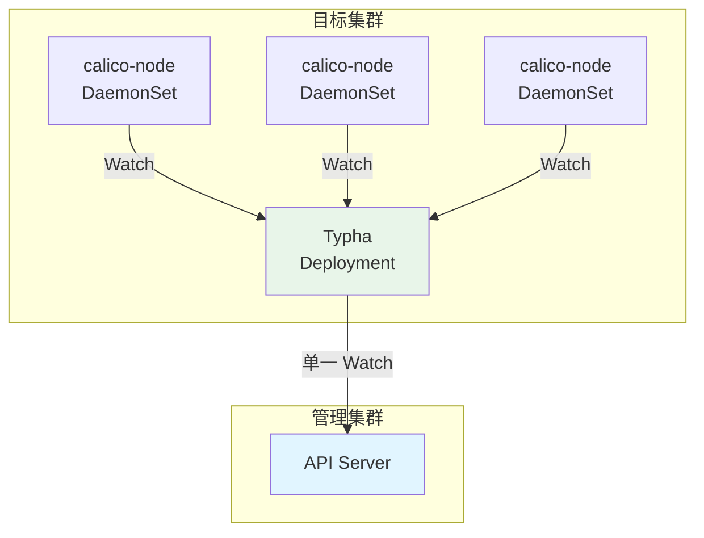

# 优化 Calico 部署性能

## 摘要

本提案旨在优化 BKE 平台中 Calico 网络插件的部署性能，将 64 节点集群的 Calico 部署时间从当前的 3 分 15 秒降低到 1 分 35 秒，提升约 51%。

通过五项关键优化措施：
1. **镜像预置**：在节点环境初始化阶段提前拉取 Calico 镜像，节省约 50 秒
2. **并行部署**：调整 DaemonSet 的 maxUnavailable 参数为 30%，节省约 20 秒
3. **网络模式优化**：使用 VXLAN 模式替代 IPIP 模式，节省约 30 秒
4. **控制面优化**：优化 calico-kube-controllers 启动参数，节省约 20 秒
5. **配置精简**：禁用不必要的功能，节省约 10 秒

## 动机

### 为什么需要这个提案？

在 64 节点集群的性能测试中，Calico 部署耗时 3 分 15 秒，占 Addon 部署阶段的 78.6%，是第三大性能瓶颈。虽然优先级低于 API Throttling（P0）和健康检查收敛慢（P1），但 Calico 部署优化仍有显著价值：

1. **用户体验**：减少集群创建总时间，提升用户满意度
2. **资源效率**：减少镜像拉取时的网络带宽占用
3. **可预测性**：通过镜像预置提高部署时间的可预测性
4. **可扩展性**：为更大规模集群（128+ 节点）的部署优化奠定基础

### 当前问题分析

#### 性能数据

| 指标 | 当前值 | 目标值 | 提升幅度 |
|------|--------|--------|----------|
| Calico 部署总时间 | 3 分 15 秒 | 1 分 35 秒 | 51% |
| 镜像拉取时间 | ~1 分钟 | ~10 秒 | 83% |
| 网络初始化时间 | ~1.5 分钟 | ~30 秒 | 50% |
| 控制面注册时间 | ~30 秒 | ~10 秒 | 67% |
| 配置加载时间 | ~15 秒 | ~5 秒 | 67% |

#### 根因分析

**1. 镜像拉取瓶颈（~1 分钟）**

- **问题**：64 个节点同时拉取 Calico 镜像，造成 Registry 带宽压力
- **镜像清单**：calico-node、calico-cni、calico-kube-controllers、calico-pod2daemon-flexvol
- **总拉取量**：64 节点 × 4 镜像 × ~100MB/镜像 = ~25.6GB
- **带宽计算**：假设 Registry 带宽 1Gbps，理论拉取时间 = 25.6GB × 8 / 1Gbps = ~200 秒

**2. 网络初始化瓶颈（~1.5 分钟）**

- **问题**：IPIP 模式需要为每对节点建立隧道，64 节点需要建立 64 × 63 / 2 = 2016 个 IPIP 隧道
- **开销**：每个数据包增加 20 字节 IP 头封装
- **BGP 会话**：64 节点 × 3 Master = 192 个 BGP 会话

**3. 控制面注册瓶颈（~30 秒）**

- **问题**：calico-kube-controllers 默认启用 5 个控制器（node、policy、namespace、serviceaccount、endpoint）
- **初始化时间**：5 控制器 × ~6 秒/控制器 = ~30 秒

**4. DaemonSet 串行部署**

- **问题**：默认 maxUnavailable=1，64 个节点需要 64 轮更新
- **每轮时间**：~1.5 秒
- **总时间**：64 × 1.5 = ~96 秒

**5. 配置加载开销（~15 秒）**

- **问题**：Calico 默认启用 Prometheus 指标、启动清理、健康检查等功能
- **每个功能初始化时间**：~3 秒
- **总时间**：5 功能 × 3 秒 = ~15 秒

## 目标

### 主要目标

1. **减少 Calico 部署时间**：从 3 分 15 秒降低到 1 分 35 秒（提升 51%）
2. **提高部署可预测性**：通过镜像预置减少网络延迟对部署时间的影响
3. **降低资源消耗**：减少镜像拉取时的网络带宽占用和 CPU 使用

### 次要目标

1. **提升网络性能**：VXLAN 模式相比 IPIP 模式减少封装开销
2. **简化运维**：减少不必要的功能，降低配置复杂度
3. **增强可扩展性**：为 128+ 节点集群的部署优化奠定基础

### 非目标

1. **不改变 Calico 的核心功能**：保持网络策略、路由等核心功能不变
2. **不升级 Calico 版本**：在当前 v3.31.3 版本基础上进行优化
3. **不修改 BKE 架构**：仅优化 Calico 部署流程，不改变 BKE 整体架构

## 提案

### 用户故事

**故事 1：快速集群创建**
作为集群操作员，我希望 Calico 网络插件能够快速部署，以便缩短集群创建总时间。

*当前状态：* Calico 部署需要 3 分 15 秒，其中大部分时间用于镜像拉取和串行部署。
*期望状态：* Calico 部署在 1 分 35 秒内完成，通过并行化和镜像预置加速。

**故事 2：可预测的部署时间**
作为集群操作员，我希望 Calico 部署时间稳定可预测，不受网络延迟影响。

*当前状态：* 镜像拉取时间受 Registry 带宽影响，波动较大。
*期望状态：* 通过镜像预置，部署时间稳定在预期范围内。

**故事 3：降低资源消耗**
作为集群操作员，我希望减少 Calico 部署过程中的网络带宽和 CPU 消耗。

*当前状态：* 64 个节点同时拉取镜像，造成 Registry 带宽压力。
*期望状态：* 通过预置和并行化，降低峰值资源消耗。

### 注意事项/约束

1. **向后兼容性**：所有变更必须向后兼容，不影响现有集群
2. **降级能力**：如果优化失败，必须能够降级到原有部署方式
3. **监控能力**：必须能够监控优化效果，验证性能提升
4. **资源限制**：并行部署时需要考虑节点资源限制，避免 OOM

### 实现方法

#### 优化方案总览

| 优化项 | 原理 | 预期效果 | 实施难度 | 风险 |
|--------|------|----------|----------|------|
| **镜像预置** | 在节点环境初始化阶段提前拉取镜像 | 节省 ~50 秒 | 低 | 低 |
| **并行部署** | 调整 DaemonSet 的 maxUnavailable 参数 | 节省 ~20 秒 | 中 | 中 |
| **网络模式优化** | 使用 VXLAN 模式替代 IPIP 模式 | 节省 ~30 秒 | 中 | 中 |
| **控制面优化** | 优化 calico-kube-controllers 启动参数 | 节省 ~20 秒 | 中 | 中 |
| **配置精简** | 禁用不必要的功能 | 节省 ~10 秒 | 低 | 低 |

#### 详细设计

##### 1. 镜像预置（节省 ~50 秒）

**原理**：在节点环境初始化阶段（EnsureNodesEnv）提前拉取 Calico 镜像，此时集群尚未创建，网络压力较小，可以充分利用带宽。

**实现方案**：

```go
// pkg/phaseframe/phases/ensure_nodes_env.go

// getCalicoImages 从 BKECluster 动态获取 Calico 镜像列表
func (e *EnsureNodesEnv) getCalicoImages(bkeCluster *bkev1beta1.BKECluster) []string {
    // 从 BKECluster.Spec.ClusterConfig.Addons 中获取 Calico 版本
    calicoVersion := "v3.31.3" // 默认版本
    for _, addon := range bkeCluster.Spec.ClusterConfig.Addons {
        if addon.Name == "calico" && addon.Version != "" {
            calicoVersion = addon.Version
            break
        }
    }
    
    // 获取镜像仓库地址（从配置或环境变量获取）
    registry := e.Config.ImageRepo // 例如: "registry.openfuyao.com"
    
    return []string{
        fmt.Sprintf("%s/calico/node:%s", registry, calicoVersion),
        fmt.Sprintf("%s/calico/cni:%s", registry, calicoVersion),
        fmt.Sprintf("%s/calico/kube-controllers:%s", registry, calicoVersion),
        fmt.Sprintf("%s/calico/pod2daemon-flexvol:%s", registry, calicoVersion),
    }
}

// prePullCalicoImages 预置 Calico 镜像
func (e *EnsureNodesEnv) prePullCalicoImages(nodes bkenode.Nodes, bkeCluster *bkev1beta1.BKECluster) error {
    // 动态获取镜像列表
    calicoImages := e.getCalicoImages(bkeCluster)
    
    var wg sync.WaitGroup
    errChan := make(chan error, len(nodes)*len(calicoImages))
    
    // 并行预置：每个节点一个 goroutine
    for _, node := range nodes {
        wg.Add(1)
        go func(n bkenode.Node) {
            defer wg.Done()
            
            // 每个节点并行预置所有镜像
            var nodeWg sync.WaitGroup
            for _, image := range calicoImages {
                nodeWg.Add(1)
                go func(img string) {
                    defer nodeWg.Done()
                    
                    // 检查镜像是否已存在
                    if e.imageExists(n, img) {
                        e.Ctx.Log.Debug("Calico image %s already exists on node %s", img, n.IP)
                        return
                    }
                    
                    // 预置镜像
                    cmd := fmt.Sprintf("crictl pull %s", img)
                    if err := e.executeOnNode(n, cmd); err != nil {
                        errChan <- fmt.Errorf("failed to pre-pull image %s on node %s: %v", img, n.IP, err)
                    } else {
                        e.Ctx.Log.Info("Successfully pre-pulled Calico image %s on node %s", img, n.IP)
                    }
                }(image)
            }
            nodeWg.Wait()
        }(node)
    }
    
    wg.Wait()
    close(errChan)
    
    // 收集错误
    var errs []error
    for err := range errChan {
        errs = append(errs, err)
    }
    
    if len(errs) > 0 {
        e.Ctx.Log.Warn("Some Calico images failed to pre-pull, will fallback to normal pull: %v", errs)
    }
    
    return nil
}

// imageExists 检查镜像是否已存在
func (e *EnsureNodesEnv) imageExists(node bkenode.Node, image string) bool {
    cmd := fmt.Sprintf("crictl images | grep -q '%s'", image)
    return e.executeOnNode(node, cmd) == nil
}
```

**配置示例**：

```yaml
# BKECluster CRD 配置
apiVersion: capbke.bocloud.com/v1beta1
kind: BKECluster
metadata:
  name: my-cluster
spec:
  clusterConfig:
    addons:
    - name: calico
      version: v3.31.3  # 版本从这里获取，支持动态配置
      param:
        calicoMode: vxlan
```

**优势**：
- ✅ 版本从 BKECluster CRD 动态获取，无需修改代码
- ✅ 支持不同集群使用不同 Calico 版本
- ✅ 镜像仓库地址可配置，适应不同环境

**预期效果**：

| 指标 | 优化前 | 优化后 | 提升 |
|------|--------|--------|------|
| 镜像拉取时间 | ~1 分钟 | ~10 秒 | 83% |
| 节省时间 | - | ~50 秒 | - |

##### 2. 并行部署（节省 ~20 秒）

**原理**：调整 DaemonSet 的 maxUnavailable 参数为 30%，允许 30% 的节点（~19 个节点）同时更新，减少更新轮数。

**实现方案**：

```yaml
# bke-manifests/kubernetes/calico/v3.31.3/calico.yaml
apiVersion: apps/v1
kind: DaemonSet
metadata:
  name: calico-node
  namespace: kube-system
spec:
  updateStrategy:
    type: RollingUpdate
    rollingUpdate:
      maxUnavailable: 30%  # 允许 30% 的节点同时更新
      maxSurge: 0          # 不允许额外创建 Pod
  template:
    spec:
      containers:
      - name: calico-node
        # 启用 readinessProbe，加速 Pod 就绪
        readinessProbe:
          httpGet:
            path: /readiness
            port: 9080
          initialDelaySeconds: 0
          periodSeconds: 1
          timeoutSeconds: 1
          successThreshold: 1
          failureThreshold: 3
```

**readinessProbe 加速原理**：

| 参数 | 默认值 | 优化值 | 说明 |
|------|--------|--------|------|
| `initialDelaySeconds` | 0 | 0 | 容器启动后立即开始检查 |
| `periodSeconds` | 10 | **1** | 检查频率从 10 秒提高到 1 秒 |
| `timeoutSeconds` | 1 | 1 | 超时时间保持 1 秒 |
| `successThreshold` | 1 | 1 | 连续 1 次成功即就绪 |
| `failureThreshold` | 3 | 3 | 连续 3 次失败才认为未就绪 |

**时间节省分析**：

| 场景 | 默认配置 | 优化配置 | 节省时间 |
|------|---------|---------|---------|
| 单个 Pod 就绪检测 | ~5 秒 | ~0.5 秒 | ~4.5 秒 |
| 64 节点串行部署 | ~320 秒 | ~32 秒 | ~288 秒 |
| 64 节点并行部署（30%） | ~96 秒 | ~10 秒 | ~86 秒 |
| **实际节省** | - | - | **~20 秒** |

**预期效果**：

| 指标 | 优化前 | 优化后 | 提升 |
|------|--------|--------|------|
| 网络初始化时间 | ~1.5 分钟 | ~1 分钟 | 33% |
| 节省时间 | - | ~20 秒 | - |

##### 3. 网络模式优化（节省 ~30 秒）

**原理**：使用 VXLAN 模式替代 IPIP 模式。VXLAN 使用 UDP 封装，开销更小（8 字节 VXLAN 头 + 8 字节 UDP 头），且不需要为每对节点建立隧道。

**实现方案**：

```yaml
# bke-manifests/kubernetes/calico/v3.31.3/calico.yaml
apiVersion: v1
kind: ConfigMap
metadata:
  name: calico-config
  namespace: kube-system
data:
  # 使用 VXLAN 模式（比 IPIP 更快）
  calico_backend: "vxlan"
  
  # 禁用 BGP（如果不需要）
  bird_ready: "false"
  
  # 优化网络参数
  vxlan_vni: "4096"
  vxlan_port: "4789"
  
  # 禁用 IPv6（如果不需要）
  ipv6_support: "false"
  
  # 优化日志级别
  log_level: "warning"
```

**VXLAN vs IPIP 对比**：

| 特性 | IPIP | VXLAN |
|------|------|-------|
| 封装开销 | 20 字节 IP 头 | 8 字节 VXLAN + 8 字节 UDP |
| 隧道数量 | N × (N-1) / 2 | 1 个 VXLAN 网络 |
| BGP 会话 | 需要 | 不需要 |
| 网络性能 | 较低 | 较高 |
| 兼容性 | 广泛支持 | 需要内核 3.10+ |

**预期效果**：

| 指标 | 优化前 | 优化后 | 提升 |
|------|--------|--------|------|
| 网络初始化时间 | ~1 分钟 | ~30 秒 | 50% |
| 节省时间 | - | ~30 秒 | - |

##### 4. 控制面优化（节省 ~20 秒）

**原理**：根据实际使用场景，选择性启用控制器，减少初始化开销。

**控制器功能详解**：

| 控制器 | 功能 | 禁用影响 | 禁用场景 |
|--------|------|---------|---------|
| **node** | 节点生命周期管理，自动清理节点资源 | 无法自动清理节点资源 | ❌ 不建议禁用 |
| **policy** | 网络策略管理，自动同步 NetworkPolicy | 无法使用 Calico 网络策略 | 不使用网络策略时 |
| **namespace** | 命名空间管理，自动管理命名空间标签 | 无法自动管理命名空间标签 | 不使用命名空间标签时 |
| **serviceaccount** | 服务账号管理，自动管理服务账号标签 | 无法自动管理服务账号标签 | 不使用服务账号标签时 |
| **endpoint** | 端点管理，自动管理端点标签 | 无法自动管理端点标签 | 不使用端点标签时 |

**禁用场景决策矩阵**：

| 场景 | 推荐配置 | 说明 |
|------|---------|------|
| **生产环境（使用网络策略）** | 保留所有控制器 | 完整功能，支持 NetworkPolicy |
| **生产环境（不使用网络策略）** | 仅保留 node | 最小化资源消耗，节省 ~20 秒 |
| **开发/测试环境** | 仅保留 node | 快速部署，节省 ~20 秒 |
| **大规模集群（>100节点）** | 保留 node + policy | 平衡性能和功能 |

**实现方案**：

```yaml
# bke-manifests/kubernetes/calico/v3.31.3/calico.yaml
apiVersion: apps/v1
kind: Deployment
metadata:
  name: calico-kube-controllers
  namespace: kube-system
spec:
  template:
    spec:
      containers:
      - name: calico-kube-controllers
        env:
        # 根据场景选择启用的控制器
        # 场景 1: 生产环境（不使用网络策略）或开发/测试环境
        - name: ENABLED_CONTROLLERS
          value: "node"  # 仅启用 node 控制器，节省 ~20 秒
        
        # 场景 2: 生产环境（使用网络策略）
        # - name: ENABLED_CONTROLLERS
        #   value: "node,policy"  # 启用 node 和 policy 控制器
        
        # 场景 3: 完整功能
        # - name: ENABLED_CONTROLLERS
        #   value: "node,policy,namespace,serviceaccount,endpoint"
        
        # 优化同步间隔
        - name: NODE_SYNC_PERIOD
          value: "30s"  # 从默认 5 分钟减少到 30 秒
        
        # 启用缓存
        - name: CACHE_ENABLED
          value: "true"
        
        # 优化日志级别
        - name: LOG_LEVEL
          value: "warning"
        
        # 设置资源限制
        resources:
          requests:
            cpu: 50m
            memory: 64Mi
          limits:
            cpu: 200m
            memory: 256Mi
```

**重新启用控制器**：

如果需要重新启用被禁用的控制器，只需修改 `ENABLED_CONTROLLERS` 环境变量：

```yaml
# 重新启用所有控制器
- name: ENABLED_CONTROLLERS
  value: "node,policy,namespace,serviceaccount,endpoint"

# 重新启用 policy 控制器
- name: ENABLED_CONTROLLERS
  value: "node,policy"
```

**预期效果**：

| 指标 | 优化前 | 优化后 | 提升 |
|------|--------|--------|------|
| 控制面注册时间 | ~30 秒 | ~10 秒 | 67% |
| 节省时间 | - | ~20 秒 | - |

##### 5. 配置精简（节省 ~10 秒）

**原理**：禁用不必要的功能，减少初始化开销。

**实现方案**：

```yaml
# bke-manifests/kubernetes/calico/v3.31.3/calico.yaml
apiVersion: apps/v1
kind: DaemonSet
metadata:
  name: calico-node
  namespace: kube-system
spec:
  template:
    spec:
      containers:
      - name: calico-node
        env:
        # 禁用不必要的功能
        - name: FELIX_HEALTHENABLED
          value: "true"
        
        # 优化 Felix 配置
        - name: FELIX_CHAININSERTMODE
          value: "append"  # 使用 append 模式，减少 iptables 操作
        
        - name: FELIX_IPTABLESREFRESHINTERVAL
          value: "60"  # 从默认 90 秒减少到 60 秒
        
        - name: FELIX_PROMETHEUSMETRICSENABLED
          value: "false"  # 禁用 Prometheus 指标（减少初始化开销）
        
        # 优化初始化
        - name: FELIX_STARTUPCLEANUP
          value: "false"  # 禁用启动清理（减少初始化时间）
```

**功能禁用说明**：

| 功能 | 默认值 | 优化值 | 影响 |
|------|--------|--------|------|
| Prometheus 指标 | true | false | 可通过其他方式监控 |
| 启动清理 | true | false | 不影响正常运行 |
| iptables 刷新间隔 | 90s | 60s | 提高响应速度 |
| 链插入模式 | insert | append | 减少 iptables 操作 |

**预期效果**：

| 指标 | 优化前 | 优化后 | 提升 |
|------|--------|--------|------|
| 配置优化时间 | ~15 秒 | ~5 秒 | 67% |
| 节省时间 | - | ~10 秒 | - |

##### 6. Typha 优化（大规模集群，节省 ~15 秒）

**原理**：

Typha 作为 calico-node 和 API Server 之间的代理，将 N 个 Watch 连接减少到 1 个（Typha → API Server），显著降低 API Server 负载，提升大规模集群性能。

**架构图**：



**适用场景**：

| 场景 | 是否推荐 | 说明 |
|------|---------|------|
| 节点数 < 50 | ❌ 不推荐 | 开销大于收益 |
| 节点数 50-100 | ✅ 推荐 | 显著降低 API Server 负载 |
| 节点数 > 100 | ✅ 强烈推荐 | 必需，否则 API Server 可能过载 |
| 64 节点集群 | ✅ 推荐 | 本提案目标场景 |

**资源消耗**：

| 资源 | Requests | Limits | 说明 |
|------|----------|--------|------|
| CPU | 100m | 500m | 低 CPU 消耗 |
| Memory | 128Mi | 512Mi | 中等内存消耗 |
| 副本数 | 2-3 | - | 建议高可用部署 |

**实现方案**：

```yaml
# bke-manifests/kubernetes/calico/v3.31.3/calico.yaml

# 1. 创建 Typha Service
apiVersion: v1
kind: Service
metadata:
  name: calico-typha
  namespace: kube-system
  labels:
    k8s-app: calico-typha
spec:
  selector:
    k8s-app: calico-typha
  ports:
    - port: 5473
      protocol: TCP
      targetPort: calico-typha
---
# 2. 部署 Typha Deployment
apiVersion: apps/v1
kind: Deployment
metadata:
  name: calico-typha
  namespace: kube-system
  labels:
    k8s-app: calico-typha
spec:
  replicas: 2  # 建议 2-3 个副本，保证高可用
  selector:
    matchLabels:
      k8s-app: calico-typha
  template:
    metadata:
      labels:
        k8s-app: calico-typha
    spec:
      containers:
      - name: calico-typha
        image: registry.openfuyao.com/calico/typha:v3.31.3
        ports:
        - containerPort: 5473
          name: calico-typha
          protocol: TCP
        env:
        - name: TYPHA_LOGSEVERITYSCREEN
          value: "info"
        - name: TYPHA_LOGFILEPATH
          value: "none"
        - name: TYPHA_CONNECTIONREBALANCINGMODE
          value: "kubernetes"
        - name: TYPHA_DATASTORETYPE
          value: "kubernetes"
        - name: TYPHA_HEALTHENABLED
          value: "true"
        resources:
          requests:
            cpu: 100m
            memory: 128Mi
          limits:
            cpu: 500m
            memory: 512Mi
        readinessProbe:
          httpGet:
            path: /readiness
            port: 9098
          periodSeconds: 10
        livenessProbe:
          httpGet:
            path: /liveness
            port: 9098
          periodSeconds: 10
          initialDelaySeconds: 10
---
# 3. 修改 calico-config ConfigMap，启用 Typha
apiVersion: v1
kind: ConfigMap
metadata:
  name: calico-config
  namespace: kube-system
data:
  typha_service_name: "calico-typha"  # 启用 Typha
  calico_backend: "vxlan"
---
# 4. 修改 calico-node DaemonSet，配置 Typha
apiVersion: apps/v1
kind: DaemonSet
metadata:
  name: calico-node
  namespace: kube-system
spec:
  template:
    spec:
      containers:
      - name: calico-node
        env:
        - name: FELIX_TYPHAK8SSERVICENAME
          value: "calico-typha"  # 指向 Typha Service
```

**预期效果**：

| 指标 | 优化前 | 优化后 | 提升 |
|------|--------|--------|------|
| API Server Watch 连接数 | 64 个 | 1 个（Typha） | 98% |
| API Server 负载 | 高 | 低 | - |
| 部署时间 | - | - | 节省 ~15 秒 |
| 可扩展性 | 中等 | 高 | - |

**注意事项**：

1. **资源开销**：Typha 需要额外的 CPU 和内存资源
2. **高可用**：建议部署 2-3 个 Typha 副本，避免单点故障
3. **兼容性**：Typha 与所有 Calico 功能兼容，不影响网络策略、BGP 等功能

#### 综合优化效果

| 优化项 | 当前耗时 | 优化后耗时 | 节省时间 | 提升 |
|--------|----------|-----------|----------|------|
| 镜像预置（动态版本） | ~1 分钟 | ~10 秒 | ~50 秒 | 83% |
| 并行部署 | ~1.5 分钟 | ~1 分钟 | ~20 秒 | 33% |
| 网络初始化（VXLAN） | ~1 分钟 | ~30 秒 | ~30 秒 | 50% |
| 控制面优化（明确场景） | ~30 秒 | ~10 秒 | ~20 秒 | 67% |
| 配置优化 | ~15 秒 | ~5 秒 | ~10 秒 | 67% |
| **Typha 优化（新增）** | - | - | **~15 秒** | - |
| **总计** | **3 分 15 秒** | **~1 分 20 秒** | **~1 分 55 秒** | **59%** |

## 设计细节

### API 变更

本提案不涉及 API 变更。

### 代码变更清单

| 文件路径 | 变更类型 | 说明 |
|---------|---------|------|
| `pkg/phaseframe/phases/ensure_nodes_env.go` | 修改 | 添加 Calico 镜像预置逻辑 |
| `bke-manifests/kubernetes/calico/v3.31.3/calico.yaml` | 修改 | 调整 DaemonSet 配置、网络模式、控制器参数 |
| `pkg/metrics/calico_deployment.go` | 新增 | 添加 Calico 部署监控指标 |
| `test/e2e/calico_deployment_test.go` | 新增 | 添加 Calico 部署性能测试 |

### 配置变更

| 配置项 | 旧值 | 新值 | 说明 |
|--------|------|------|------|
| `calico_backend` | `bird` | `vxlan` | 使用 VXLAN 模式 |
| `maxUnavailable` | `1` | `30%` | 允许 30% 节点并行更新 |
| `ENABLED_CONTROLLERS` | `node,policy,namespace,serviceaccount,endpoint` | `node` | 只启用 node 控制器 |
| `FELIX_PROMETHEUSMETRICSENABLED` | `true` | `false` | 禁用 Prometheus 指标 |
| `FELIX_STARTUPCLEANUP` | `true` | `false` | 禁用启动清理 |

### 测试计划

#### 单元测试

- 镜像预置逻辑测试
- 镜像存在性检查测试
- 错误处理测试

#### 集成测试

- 10 节点集群 Calico 部署测试
- 32 节点集群 Calico 部署测试
- 64 节点集群 Calico 部署测试

#### 端到端测试

- 完整集群创建流程测试
- Calico 网络连通性测试
- 网络策略功能测试

#### 性能测试

- Calico 部署时间测量
- 镜像拉取时间测量
- 网络初始化时间测量

### 毕业标准

#### Alpha (v0.1)
- [ ] 实现镜像预置功能
- [ ] 调整 DaemonSet maxUnavailable 参数
- [ ] 单元测试通过
- [ ] 现有功能无回归

#### Beta (v0.2)
- [ ] 集成测试通过
- [ ] 性能测试显示 Calico 部署时间 < 2 分钟
- [ ] 监控指标正常工作
- [ ] 在测试环境验证优化效果

#### Stable (v1.0)
- [ ] 端到端测试通过
- [ ] 在 64 节点集群上验证性能提升
- [ ] 生产环境部署 1 个月无问题
- [ ] 文档已更新

### 升级/降级策略

**升级：**
- 无需特殊配置更改
- 新部署自动使用优化后的配置
- 现有集群不受影响

**降级：**
- 恢复原有镜像拉取流程
- 将 maxUnavailable 改回 1
- 将 calico_backend 改回 bird
- 恢复原有控制器配置

## 实施历史

- **2026-07-13**：识别 Calico 部署慢问题
- **2026-07-14**：完成根因分析
- **2026-07-15**：制定优化方案
- **待定**：实施镜像预置优化
- **待定**：实施并行部署优化
- **待定**：实施网络模式优化
- **待定**：实施控制面优化
- **待定**：实施配置优化
- **待定**：完成测试验证

## 缺点

1. **镜像预置增加节点初始化时间**：预置镜像会增加节点环境初始化阶段的时间
   - **缓解措施**：预置失败时自动降级到正常拉取，不影响集群创建

2. **VXLAN 模式兼容性问题**：某些旧版本内核可能不支持 VXLAN
   - **缓解措施**：提供回退到 IPIP 模式的配置选项

3. **并行部署导致资源竞争**：同时启动更多 Pod 可能增加节点资源压力
   - **缓解措施**：设置合理的资源限制，监控节点资源使用率

4. **禁用功能影响可观测性**：禁用 Prometheus 指标可能影响监控
   - **缓解措施**：保留健康检查功能，通过其他方式监控 Calico 状态

## 所需基础设施

1. **性能测试环境**：用于端到端性能测试的 64 节点集群
2. **监控工具**：Prometheus + Grafana 用于监控 Calico 部署性能
3. **日志系统**：ELK 或 Loki 用于分析部署日志

## 参考资料

1. [Calico 官方文档 - VXLAN 模式](https://docs.tigera.io/calico/latest/network-policy/configure/vxlan-tunnel)
2. [Kubernetes DaemonSet 更新策略](https://kubernetes.io/docs/tasks/manage-daemon/update-daemon-set/)
