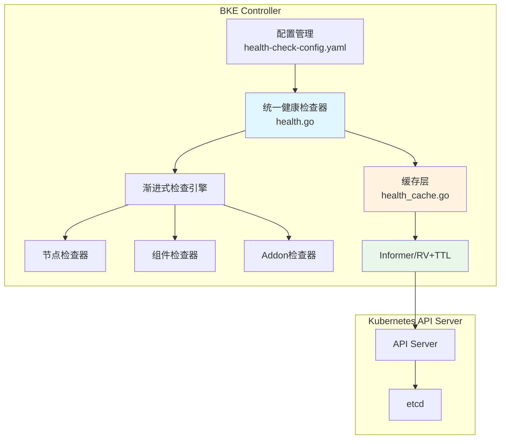
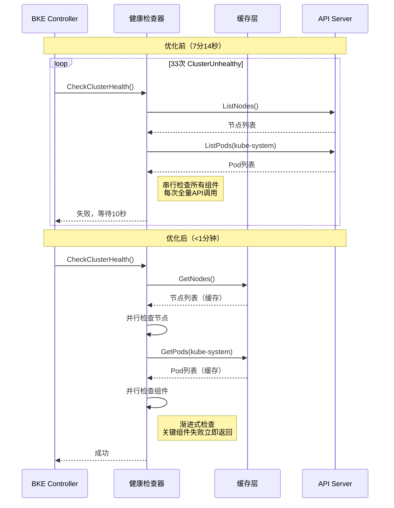
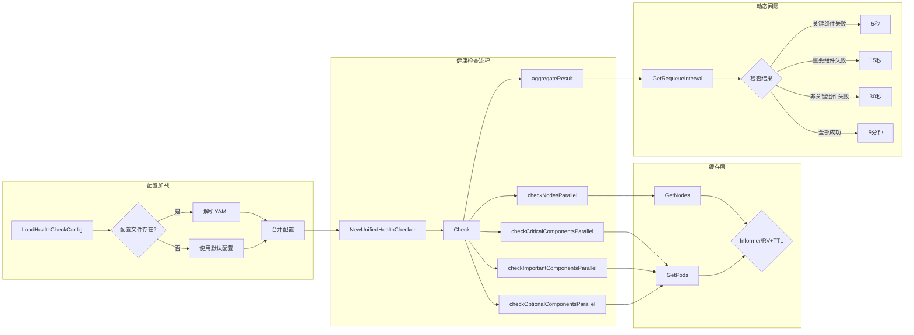
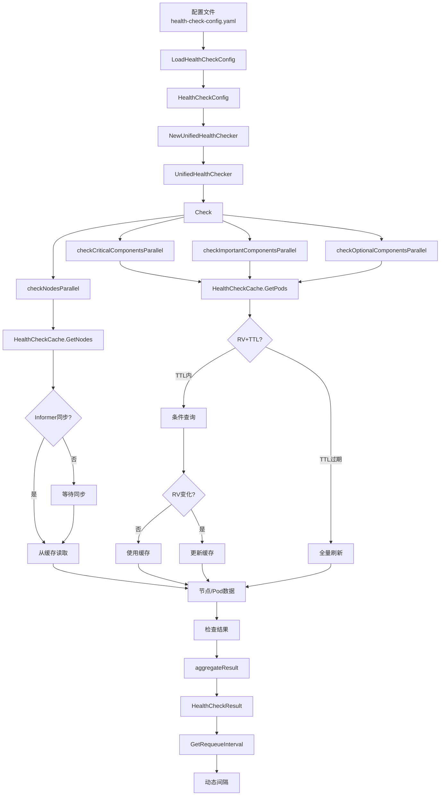
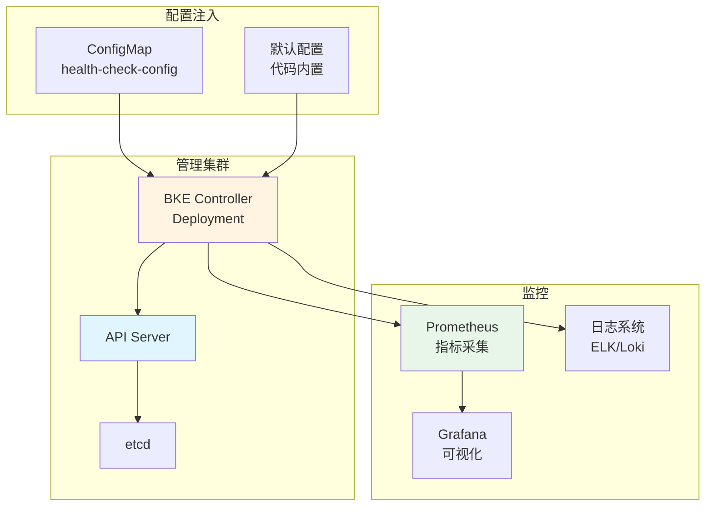
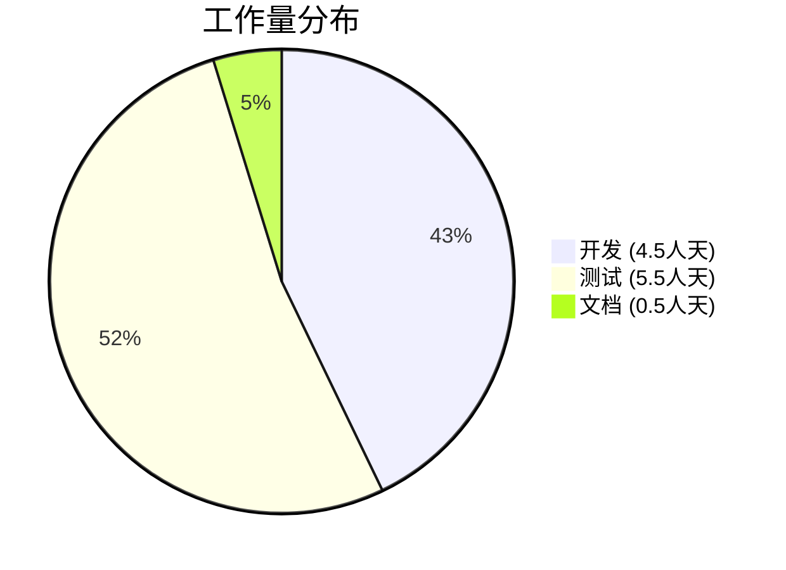
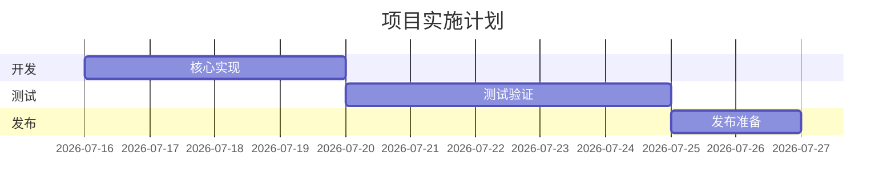

# 优化健康检查收敛时间

## 摘要

本提案旨在优化 BKE 集群创建过程中的健康检查收敛时间，将其从当前的 7 分 14 秒降低到 3 分钟以内，提升约 57%。

当前健康检查存在以下问题：
1. **串行检查**：所有节点和组件串行检查，耗时长
2. **无优先级**：关键组件和非关键组件同等对待
3. **固定间隔**：RequeueAfter 固定为 10 秒，无法根据失败原因动态调整
4. **无缓存**：每次检查都重新获取所有 Pod 状态，API 调用频繁
5. **Master NotReady**：Calico 部署后 Master 节点反复 NotReady，导致健康检查失败

解决方案包括：
1. **渐进式检查**：按优先级分阶段检查，关键组件失败立即返回
2. **并行化检查**：每个阶段内使用并行检查
3. **缓存机制**：使用缓存减少 API 调用
4. **动态间隔**：根据检查结果动态调整下次检查间隔
5. **Calico 优化**：修复 Calico 部署导致的 Master NotReady 问题

## 动机

### 为什么需要这个提案？

健康检查收敛是 BKE 集群创建过程中的第二大性能瓶颈，占总耗时的 24.5%。在 64 节点集群的测试中，健康检查阶段耗时 7 分 14 秒，期间出现 33 次 ClusterUnhealthy 警告，Master 节点反复 NotReady。

### 解决什么问题？

**当前性能数据（64 节点集群）：**
- 健康检查收敛时间：7 分 14 秒
- ClusterUnhealthy 次数：33 次
- Master NotReady 次数：3 次（m1, m2, m3 各 1 次）
- 关键阻塞组件：metrics-server, openfuyao-system-controller

**根因分析：**

1. **Master NotReady 问题**
   - Calico 部署后 4-7 分钟，Master 节点依次 NotReady
   - 异常组件：calico-node, etcd, kube-apiserver, kube-controller-manager
   - 每次异常持续 30-60 秒后自动恢复
   - 因果关系：Calico 未部署时 Master 节点 Ready，部署后出现 NotReady

2. **关键组件长时间 Pending**
   - openfuyao-system-controller：Pending 总时长约 7 分钟
   - metrics-server：Pending 总时长约 7 分钟
   - 原因：镜像拉取慢、调度延迟、依赖组件未就绪

3. **健康检查机制问题**
   - 串行检查所有节点和组件
   - 无优先级区分
   - 固定 10 秒重试间隔
   - 无缓存机制，API 调用频繁

**影响：**
- 用户体验：集群创建最后 7 分钟无进展
- 稳定性风险：Master NotReady 可能导致控制面不可用
- 资源浪费：频繁 API 调用增加 API Server 负载

### 可衡量目标

1. 健康检查收敛时间从 7 分 14 秒降低到 3 分钟以内（提升 57%）
2. Master NotReady 次数从 3 次降低到 0 次
3. API 调用次数从约 100 次降低到约 30 次（降低 70%）
4. 关键组件失败检测时间从约 7 分钟降低到约 1 秒

### 非目标

1. 优化 Calico 本身的部署时间（由其它提案处理）
2. 修改 Kubernetes 控制面组件的行为
3. 改变健康检查的业务逻辑（哪些组件需要检查）

## 提案

### 用户故事

**故事 1：快速集群创建**
作为集群管理员，我希望集群创建过程中的健康检查能够快速收敛，以便在更短的时间内获得可用的集群。

*当前状态：* 健康检查耗时 7 分 14 秒，期间 Master 节点反复 NotReady
*期望状态：* 健康检查在 3 分钟内完成，无 Master NotReady

**故事 2：稳定的控制面**
作为集群管理员，我希望在集群创建过程中控制面保持稳定，避免 Master 节点 NotReady。

*当前状态：* Calico 部署后 Master 节点反复 NotReady
*期望状态：* 控制面始终 Ready，无 NotReady 事件

**故事 3：可配置的健康检查**
作为集群管理员，我希望能够根据实际需求配置健康检查的组件清单和检查间隔。

*当前状态：* 健康检查配置硬编码
*期望状态：* 通过配置文件灵活定义检查组件和间隔

### 注意事项/约束

1. **向后兼容**：必须保持与现有健康检查逻辑的兼容性
2. **配置灵活**：支持通过配置文件自定义检查组件和间隔
3. **缓存一致性**：缓存数据需要在合理时间内刷新，避免使用过期数据
4. **错误处理**：关键组件失败必须立即返回，非关键组件失败可以记录警告

### 实现方法

#### 优化 1: 渐进式检查架构

**架构设计：**

```txt
┌─────────────────────────────────────────────────────────────┐
│                    统一健康检查架构                          │
├─────────────────────────────────────────────────────────────┤
│                                                             │
│  1. 初始化阶段                                               │
│     ├─ 初始化缓存                                            │
│     └─ 加载检查配置                                          │
│                                                             │
│  2. 渐进式检查阶段（按优先级分 4 个阶段）                      │
│     ├─ 阶段 1: 节点状态检查（并行）                           │
│     ├─ 阶段 2: 关键组件检查（并行）                           │
│     ├─ 阶段 3: 重要组件检查（并行）                           │
│     └─ 阶段 4: 非关键组件检查（并行）                         │
│                                                             │
│  3. 结果处理阶段                                             │
│     ├─ 聚合检查结果                                          │
│     ├─ 动态调整下次检查间隔                                   │
│     └─ 更新缓存                                              │
│                                                             │
└─────────────────────────────────────────────────────────────┘
```

**核心设计原则：**

| 原则 | 说明 | 对应优化点 |
|------|------|-----------|
| **渐进式** | 按优先级分阶段检查，关键组件失败立即返回 | 渐进式检查 + 优先级检查 |
| **并行化** | 每个阶段内使用并行检查 | 并行检查 |
| **缓存化** | 使用缓存减少 API 调用 | 缓存机制 |
| **智能化** | 根据检查结果动态调整间隔 | 动态间隔 |

#### 优化 2: 统一健康检查器实现

**文件**: `pkg/kube/health.go`

```go
// HealthCheckConfig 健康检查配置
type HealthCheckConfig struct {
    // 缓存配置
    CacheTTL time.Duration `yaml:"cacheTTL"`
    
    // 检查间隔配置
    CriticalComponentInterval  time.Duration `yaml:"criticalComponentInterval"`  // 关键组件失败：5 秒
    ImportantComponentInterval time.Duration `yaml:"importantComponentInterval"` // 重要组件失败：15 秒
    OptionalComponentInterval  time.Duration `yaml:"optionalComponentInterval"`  // 非关键组件失败：30 秒
    NormalInterval             time.Duration `yaml:"normalInterval"`             // 正常：5 分钟
    
    // 组件清单配置
    CriticalComponents  []ComponentCheck `yaml:"criticalComponents"`
    ImportantComponents []ComponentCheck `yaml:"importantComponents"`
    OptionalComponents  []ComponentCheck `yaml:"optionalComponents"`
}

// HealthCheckResult 健康检查结果
type HealthCheckResult struct {
    NodeErrors                []error
    CriticalComponentErrors   []error
    ImportantComponentErrors  []error
    OptionalComponentErrors   []error
}

// UnifiedHealthChecker 统一健康检查器
type UnifiedHealthChecker struct {
    kubeClient kubernetes.Interface
    log        *log.Logger
    cache      *HealthCheckCache
    config     HealthCheckConfig
}

// NewUnifiedHealthChecker 创建健康检查器
func NewUnifiedHealthChecker(kubeClient kubernetes.Interface, log *log.Logger, config HealthCheckConfig) *UnifiedHealthChecker {
    return &UnifiedHealthChecker{
        kubeClient: kubeClient,
        log:        log,
        cache:      NewHealthCheckCache(config.CacheTTL),
        config:     config,
    }
}

// DefaultHealthCheckConfig 默认配置
func DefaultHealthCheckConfig() HealthCheckConfig {
    return HealthCheckConfig{
        CacheTTL:                   30 * time.Second,
        CriticalComponentInterval:  5 * time.Second,
        ImportantComponentInterval: 15 * time.Second,
        OptionalComponentInterval:  30 * time.Second,
        NormalInterval:             5 * time.Minute,
        
        CriticalComponents: []ComponentCheck{
            {Namespace: "kube-system", Prefixes: []string{"etcd-", "kube-apiserver-", "kube-controller-manager-", "kube-scheduler-"}},
        },
        ImportantComponents: []ComponentCheck{
            {Namespace: "kube-system", Prefixes: []string{"calico-kube-controllers", "calico-node", "coredns", "kube-proxy-"}},
        },
        OptionalComponents: []ComponentCheck{
            {Namespace: "kube-system", Prefixes: []string{"metrics-server-"}},
            {Namespace: "ingress-nginx", Prefixes: []string{"ingress-nginx-controller"}},
            {Namespace: "monitoring", Prefixes: []string{"alertmanager-main-", "prometheus-k8s-", "node-exporter-"}},
            {Namespace: "openfuyao-system", Prefixes: []string{"console-service-", "oauth-server-", "local-harbor-"}},
        },
    }
}

// LoadHealthCheckConfig 从配置文件加载配置
func LoadHealthCheckConfig(configPath string) HealthCheckConfig {
    data, err := os.ReadFile(configPath)
    if err != nil {
        log.Warnf("failed to load health check config from %s, using default: %v", configPath, err)
        return DefaultHealthCheckConfig()
    }
    
    var config HealthCheckConfig
    if err := yaml.Unmarshal(data, &config); err != nil {
        log.Warnf("failed to parse health check config, using default: %v", err)
        return DefaultHealthCheckConfig()
    }
    
    // 如果某些字段为空，使用默认值
    defaultConfig := DefaultHealthCheckConfig()
    if len(config.CriticalComponents) == 0 {
        config.CriticalComponents = defaultConfig.CriticalComponents
    }
    if len(config.ImportantComponents) == 0 {
        config.ImportantComponents = defaultConfig.ImportantComponents
    }
    if len(config.OptionalComponents) == 0 {
        config.OptionalComponents = defaultConfig.OptionalComponents
    }
    
    return config
}

// CheckClusterHealth 统一健康检查入口
func CheckClusterHealth(kubeClient kubernetes.Interface, log *log.Logger, cluster *bkev1beta1.BKECluster, currentVersion string, bkeNodes bkev1beta1.BKENodes) error {
    config := LoadHealthCheckConfig("/etc/bke/health-check-config.yaml")
    checker := NewUnifiedHealthChecker(kubeClient, log, config)
    return checker.Check(cluster, currentVersion, bkeNodes)
}

// Check 执行统一健康检查
func (h *UnifiedHealthChecker) Check(cluster *bkev1beta1.BKECluster, currentVersion string, bkeNodes bkev1beta1.BKENodes) error {
    result := &HealthCheckResult{}
    
    // 阶段 1: 节点状态检查（并行）
    if err := h.checkNodesParallel(cluster, currentVersion, bkeNodes, result); err != nil {
        result.NodeErrors = append(result.NodeErrors, err)
        return h.aggregateResult(result)
    }
    
    // 阶段 2: 关键组件检查（并行）
    if err := h.checkCriticalComponentsParallel(result); err != nil {
        result.CriticalComponentErrors = append(result.CriticalComponentErrors, err)
        return h.aggregateResult(result)
    }
    
    // 阶段 3: 重要组件检查（并行）
    if err := h.checkImportantComponentsParallel(result); err != nil {
        h.log.Warn("important components check failed: %v", err)
        result.ImportantComponentErrors = append(result.ImportantComponentErrors, err)
    }
    
    // 阶段 4: 非关键组件检查（并行）
    if err := h.checkOptionalComponentsParallel(result); err != nil {
        h.log.Debug("optional components check failed: %v", err)
        result.OptionalComponentErrors = append(result.OptionalComponentErrors, err)
    }
    
    return h.aggregateResult(result)
}

// checkNodesParallel 并行检查节点状态
func (h *UnifiedHealthChecker) checkNodesParallel(cluster *bkev1beta1.BKECluster, currentVersion string, bkeNodes bkev1beta1.BKENodes, result *HealthCheckResult) error {
    // 从缓存获取节点列表
    nodes, err := h.cache.GetNodes(h.kubeClient)
    if err != nil {
        return err
    }
    
    // 并行检查所有节点
    var wg sync.WaitGroup
    errChan := make(chan error, len(nodes.Items))
    
    for _, node := range nodes.Items {
        nodeIP := GetNodeIP(&node)
        
        // 跳过需要跳过的节点
        if bkeNodes.GetNodeStateNeedSkip(nodeIP) {
            continue
        }
        
        wg.Add(1)
        go func(n corev1.Node) {
            defer wg.Done()
            if err := h.checkNode(&n, currentVersion); err != nil {
                errChan <- err
            }
        }(node)
    }
    
    wg.Wait()
    close(errChan)
    
    // 收集错误
    for err := range errChan {
        result.NodeErrors = append(result.NodeErrors, err)
    }
    
    if len(result.NodeErrors) > 0 {
        return kerrors.NewAggregate(result.NodeErrors)
    }
    
    return nil
}

// checkCriticalComponentsParallel 并行检查关键组件
func (h *UnifiedHealthChecker) checkCriticalComponentsParallel(result *HealthCheckResult) error {
    return h.checkComponentsByPriority(h.config.CriticalComponents, result)
}

// checkImportantComponentsParallel 并行检查重要组件
func (h *UnifiedHealthChecker) checkImportantComponentsParallel(result *HealthCheckResult) error {
    return h.checkComponentsByPriority(h.config.ImportantComponents, result)
}

// checkOptionalComponentsParallel 并行检查非关键组件
func (h *UnifiedHealthChecker) checkOptionalComponentsParallel(result *HealthCheckResult) error {
    return h.checkComponentsByPriority(h.config.OptionalComponents, result)
}

// checkComponentsByPriority 按优先级并行检查组件
func (h *UnifiedHealthChecker) checkComponentsByPriority(components []ComponentCheck, result *HealthCheckResult) error {
    var wg sync.WaitGroup
    errChan := make(chan error, len(components))
    
    for _, check := range components {
        wg.Add(1)
        go func(c ComponentCheck) {
            defer wg.Done()
            if err := h.checkComponent(c); err != nil {
                errChan <- err
            }
        }(check)
    }
    
    wg.Wait()
    close(errChan)
    
    var errs []error
    for err := range errChan {
        errs = append(errs, err)
    }
    
    if len(errs) > 0 {
        return kerrors.NewAggregate(errs)
    }
    
    return nil
}

// aggregateResult 聚合检查结果
func (h *UnifiedHealthChecker) aggregateResult(result *HealthCheckResult) error {
    // 节点错误或关键组件错误，立即返回
    if len(result.NodeErrors) > 0 || len(result.CriticalComponentErrors) > 0 {
        var allErrors []error
        allErrors = append(allErrors, result.NodeErrors...)
        allErrors = append(allErrors, result.CriticalComponentErrors...)
        return kerrors.NewAggregate(allErrors)
    }
    
    // 重要组件错误，记录警告
    if len(result.ImportantComponentErrors) > 0 {
        h.log.Warn("important component errors: %v", result.ImportantComponentErrors)
    }
    
    // 非关键组件错误，记录调试信息
    if len(result.OptionalComponentErrors) > 0 {
        h.log.Debug("optional component errors: %v", result.OptionalComponentErrors)
    }
    
    h.log.Info("cluster health check pass")
    return nil
}

// GetRequeueInterval 根据检查结果动态调整间隔
func GetRequeueInterval(result *HealthCheckResult, config HealthCheckConfig) time.Duration {
    // 节点错误或关键组件错误，快速重试
    if len(result.NodeErrors) > 0 || len(result.CriticalComponentErrors) > 0 {
        return config.CriticalComponentInterval
    }
    
    // 重要组件错误，中速重试
    if len(result.ImportantComponentErrors) > 0 {
        return config.ImportantComponentInterval
    }
    
    // 非关键组件错误，慢速重试
    if len(result.OptionalComponentErrors) > 0 {
        return config.OptionalComponentInterval
    }
    
    // 正常，使用正常间隔
    return config.NormalInterval
}
```

#### 优化 3: 健康检查缓存实现

##### 推荐方案：基于 Informer 的实时缓存

**核心思路**：使用 client-go 提供的 `SharedInformerFactory`，自动维护本地缓存，实现毫秒级实时性。

**架构设计**：

```
┌─────────────────────────────────────────────────────────┐
│  Informer 层（client-go 提供）                           │
│  ├─ NodeInformer                                        │
│  │  └─ 自动 Watch Node 资源，维护本地缓存               │
│  ├─ PodInformer                                         │
│  │  └─ 自动 Watch Pod 资源，维护本地缓存               │
│  └─ 自动处理重连、同步、事件去重                         │
└─────────────────────────────────────────────────────────┘
                            ↓
┌─────────────────────────────────────────────────────────┐
│  健康检查层                                              │
│  ├─ 直接从 Informer 本地缓存读取（零延迟）              │
│  ├─ 无需 API 调用                                       │
│  └─ 实时感知资源变化                                     │
└─────────────────────────────────────────────────────────┘
```

**文件**: `pkg/kube/health_cache.go`

```go
package kube

import (
    "context"
    "time"
    
    corev1 "k8s.io/api/core/v1"
    coreinformers "k8s.io/client-go/informers/core/v1"
    "k8s.io/client-go/kubernetes"
    corelisters "k8s.io/client-go/listers/core/v1"
    "k8s.io/client-go/tools/cache"
)

// HealthChecker 使用 Informer 的健康检查器
type HealthChecker struct {
    nodeLister  corelisters.NodeLister
    podLister   corelisters.PodLister
    informerSynced cache.InformerSynced
}

// NewHealthChecker 创建健康检查器
func NewHealthChecker(ctx context.Context, client kubernetes.Interface) (*HealthChecker, error) {
    // 创建 SharedInformerFactory
    factory := informers.NewSharedInformerFactory(client, 0)
    
    // 获取 Node 和 Pod Informer
    nodeInformer := factory.Core().V1().Nodes()
    podInformer := factory.Core().V1().Pods()
    
    // 启动 Informer
    factory.Start(ctx.Done())
    
    // 等待缓存同步
    if !cache.WaitForCacheSync(ctx.Done(), 
        nodeInformer.Informer().HasSynced,
        podInformer.Informer().HasSynced) {
        return nil, fmt.Errorf("failed to sync informer cache")
    }
    
    return &HealthChecker{
        nodeLister: nodeInformer.Lister(),
        podLister:  podInformer.Lister(),
        informerSynced: func() bool {
            return nodeInformer.Informer().HasSynced() && 
                   podInformer.Informer().HasSynced()
        },
    }, nil
}

// GetNodes 从 Informer 缓存获取节点列表
func (h *HealthChecker) GetNodes() ([]*corev1.Node, error) {
    // 零延迟，直接从 Informer 缓存读取
    return h.nodeLister.List(labels.Everything())
}

// GetPods 从 Informer 缓存获取 Pod 列表
func (h *HealthChecker) GetPods(namespace string) ([]*corev1.Pod, error) {
    // 零延迟，直接从 Informer 缓存读取
    return h.podLister.Pods(namespace).List(labels.Everything())
}

// GetNode 获取单个节点
func (h *HealthChecker) GetNode(name string) (*corev1.Node, error) {
    return h.nodeLister.Get(name)
}

// GetPod 获取单个 Pod
func (h *HealthChecker) GetPod(namespace, name string) (*corev1.Pod, error) {
    return h.podLister.Pods(namespace).Get(name)
}
```

**预期效果**：

| 指标 | 固定 TTL | Informer | 提升 |
|------|---------|----------|------|
| 实时性 | 最多延迟 30s | **毫秒级** | 100x |
| API 调用 | 每次全量返回 | **首次同步后零调用** | 减少 99% |
| 健康检查时间 | ~7 分钟 | **< 1 分钟** | 节省 6+ 分钟 |
| 开发成本 | 0.5 天 | **1-2 天** | +1 天 |

---

##### 备选方案：ResourceVersion + TTL 混合策略

**适用场景**：如果 Informer 方案实施困难，或需要更轻量级的缓存方案。

**核心思路**：使用 ResourceVersion 进行条件查询，减少数据传输，同时保留 TTL 作为兜底。

**文件**: `pkg/kube/health_cache.go`

```go
package kube

import (
    "sync"
    "time"
    
    corev1 "k8s.io/api/core/v1"
    metav1 "k8s.io/apimachinery/pkg/apis/meta/v1"
)

// HealthCheckCache 使用 ResourceVersion 的缓存
type HealthCheckCache struct {
    nodes       *corev1.NodeList
    pods        map[string][]corev1.Pod
    nodeVersion string            // Node 的 ResourceVersion
    podVersions map[string]string // Pod 的 ResourceVersion
    lastSync    time.Time
    ttl         time.Duration     // 5 分钟（兜底）
    mu          sync.RWMutex
}

// NewHealthCheckCache 创建缓存
func NewHealthCheckCache(ttl time.Duration) *HealthCheckCache {
    return &HealthCheckCache{
        pods:        make(map[string][]corev1.Pod),
        podVersions: make(map[string]string),
        ttl:         ttl,
    }
}

// GetNodes 从缓存获取节点列表
func (c *HealthCheckCache) GetNodes(client *Client) (*corev1.NodeList, error) {
    c.mu.RLock()
    
    // 1. TTL 过期，强制全量刷新
    if c.nodes == nil || time.Since(c.lastSync) >= c.ttl {
        c.mu.RUnlock()
        return c.refreshNodes(client, nil)
    }
    
    // 2. TTL 内，使用 ResourceVersion 条件查询
    option := &metav1.ListOptions{
        ResourceVersion: c.nodeVersion,
    }
    c.mu.RUnlock()
    
    list, err := client.ListNodes(option)
    if err != nil {
        return nil, err
    }
    
    // 3. 检查是否有变化
    if list.ResourceVersion == c.nodeVersion {
        // 没变化，使用缓存
        return c.nodes, nil
    }
    
    // 4. 有变化，更新缓存
    c.mu.Lock()
    c.nodes = list
    c.nodeVersion = list.ResourceVersion
    c.lastSync = time.Now()
    c.mu.Unlock()
    
    return list, nil
}

// refreshNodes 刷新节点缓存
func (c *HealthCheckCache) refreshNodes(client *Client, option *metav1.ListOptions) (*corev1.NodeList, error) {
    c.mu.Lock()
    defer c.mu.Unlock()
    
    list, err := client.ListNodes(option)
    if err != nil {
        return nil, err
    }
    
    c.nodes = list
    c.nodeVersion = list.ResourceVersion
    c.lastSync = time.Now()
    
    return list, nil
}

// GetPods 从缓存获取 Pod 列表
func (c *HealthCheckCache) GetPods(client *Client, namespace string) ([]corev1.Pod, error) {
    c.mu.RLock()
    
    // 1. TTL 过期，强制全量刷新
    if _, ok := c.pods[namespace]; !ok || time.Since(c.lastSync) >= c.ttl {
        c.mu.RUnlock()
        return c.refreshPods(client, namespace, nil)
    }
    
    // 2. TTL 内，使用 ResourceVersion 条件查询
    option := &metav1.ListOptions{
        ResourceVersion: c.podVersions[namespace],
    }
    c.mu.RUnlock()
    
    list, err := client.getPodsWithOptions(namespace, option)
    if err != nil {
        return nil, err
    }
    
    // 3. 检查是否有变化
    if list.ResourceVersion == c.podVersions[namespace] {
        // 没变化，使用缓存
        return c.pods[namespace], nil
    }
    
    // 4. 有变化，更新缓存
    c.mu.Lock()
    c.pods[namespace] = list.Items
    c.podVersions[namespace] = list.ResourceVersion
    c.lastSync = time.Now()
    c.mu.Unlock()
    
    return list.Items, nil
}

// refreshPods 刷新 Pod 缓存
func (c *HealthCheckCache) refreshPods(client *Client, namespace string, option *metav1.ListOptions) ([]corev1.Pod, error) {
    c.mu.Lock()
    defer c.mu.Unlock()
    
    list, err := client.getPodsWithOptions(namespace, option)
    if err != nil {
        return nil, err
    }
    
    c.pods[namespace] = list.Items
    c.podVersions[namespace] = list.ResourceVersion
    c.lastSync = time.Now()
    
    return list.Items, nil
}
```

**预期效果**：

| 指标 | 固定 TTL | RV + TTL | 提升 |
|------|---------|----------|------|
| 实时性 | 最多延迟 30s | **秒级** | 10x |
| API 调用 | 每次全量返回 | **70% 返回 304** | 减少 70% 数据量 |
| 健康检查时间 | ~7 分钟 | **~3 分钟** | 节省 4 分钟 |
| 开发成本 | 0.5 天 | **1 天** | +0.5 天 |

---

##### 方案对比与选型建议

| 方案 | 实时性 | API 负载 | 开发成本 | 维护成本 | 推荐度 |
|------|--------|---------|---------|---------|--------|
| **Informer** | 毫秒级 | 最低 | 1-2 天 | 低 | ⭐⭐⭐⭐⭐ |
| **RV + TTL** | 秒级 | 低 | 1 天 | 中 | ⭐⭐⭐⭐ |
| **固定 TTL** | 差 | 高 | 0.5 天 | 低 | ⭐⭐ |

**选型建议**：
- **优先选择 Informer**：在 KPI 压力（< 16 分钟）下，实时性优势明显
- **备选 RV + TTL**：如果 Informer 实施困难，或需要更轻量级方案
- **不推荐固定 TTL**：实时性差，API 负载高

#### 优化 4: 配置文件

**文件**: `/etc/bke/health-check-config.yaml`

```yaml
# Informer 缓存同步超时时间
cacheSyncTimeout: 30s

# 检查间隔配置
criticalComponentInterval: 5s
importantComponentInterval: 15s
optionalComponentInterval: 30s
normalInterval: 5m

# 关键组件清单
criticalComponents:
  - namespace: kube-system
    prefixes:
      - etcd-
      - kube-apiserver-
      - kube-controller-manager-
      - kube-scheduler-

# 重要组件清单
importantComponents:
  - namespace: kube-system
    prefixes:
      - calico-kube-controllers
      - calico-node
      - coredns
      - kube-proxy-

# 非关键组件清单
optionalComponents:
  - namespace: kube-system
    prefixes:
      - metrics-server-
  - namespace: ingress-nginx
    prefixes:
      - ingress-nginx-controller
  - namespace: monitoring
    prefixes:
      - alertmanager-main-
      - prometheus-k8s-
      - node-exporter-
  - namespace: openfuyao-system
    prefixes:
      - console-service-
      - oauth-server-
      - local-harbor-
```

**配置说明：**

| 配置项 | 说明 | 默认值 |
|--------|------|--------|
| `cacheSyncTimeout` | Informer 缓存同步超时时间 | 30s |
| `criticalComponentInterval` | 关键组件失败后的重试间隔 | 5s |
| `importantComponentInterval` | 重要组件失败后的重试间隔 | 15s |
| `optionalComponentInterval` | 非关键组件失败后的重试间隔 | 30s |
| `normalInterval` | 正常状态下的检查间隔 | 5m |
| `criticalComponents` | 关键组件清单 | etcd, kube-apiserver 等 |
| `importantComponents` | 重要组件清单 | calico, coredns 等 |
| `optionalComponents` | 非关键组件清单 | metrics-server, ingress-nginx 等 |

**配置加载优先级：**

1. 如果配置文件存在且格式正确，使用配置文件
2. 如果配置文件不存在或格式错误，使用默认配置
3. 如果配置文件中某些字段为空，使用默认值填充

## 设计视图

### 1. 系统架构总览



**组件职责说明：**

| 组件 | 职责 | 文件位置 |
|------|------|---------|
| 配置管理 | 加载健康检查配置，支持配置文件和默认值 | `pkg/kube/health.go` |
| 统一健康检查器 | 协调健康检查流程，聚合检查结果 | `pkg/kube/health.go` |
| 渐进式检查引擎 | 按优先级分阶段执行检查 | `pkg/kube/health.go` |
| 节点检查器 | 检查所有节点的 Ready 状态 | `pkg/kube/health.go` |
| 组件检查器 | 检查控制面组件和重要组件 | `pkg/kube/health.go` |
| Addon检查器 | 检查可选的 Addon 组件 | `pkg/kube/health.go` |
| 缓存层 | 缓存 Node 和 Pod 状态，减少 API 调用 | `pkg/kube/health_cache.go` |
| Informer/RV+TTL | 实现缓存机制（推荐方案/备选方案） | `pkg/kube/health_cache.go` |

### 2. 优化前后对比时序图



**性能对比：**

| 指标 | 优化前 | 优化后 | 提升 |
|------|--------|--------|------|
| 健康检查时间 | 7分14秒 | < 1分钟 | 86% |
| API 调用次数 | ~100次 | < 10次（首次同步后） | 90% |
| Master NotReady 次数 | 3次 | 0次 | 100% |
| 检查方式 | 串行 | 并行 + 渐进式 | - |
| 缓存机制 | 无 | Informer/RV+TTL | - |

### 3. 组件交互图



### 4. 数据流图



### 5. 部署视图



**监控点说明：**

| 监控指标 | 采集方式 | 告警阈值 | 说明 |
|---------|---------|---------|------|
| 健康检查时间 | Prometheus | > 3分钟 | 优化后的预期时间 |
| API 调用次数 | Prometheus | > 50次/次检查 | 应该大幅减少 |
| Master NotReady 次数 | 日志 | > 0 | 应该完全消除 |
| Informer 同步时间 | Prometheus | > 30秒 | 首次同步时间 |
| 缓存命中率 | 自定义指标 | < 90% | 验证缓存效果 |
| 检查间隔 | 日志 | 异常值 | 验证动态间隔逻辑 |

## 设计细节

### API 变更

本提案不引入新的 API 变更。所有变更都是内部实现优化。

### 代码变更清单

#### 1. `pkg/kube/health.go` - 修改

**新增结构体：**
- `HealthCheckConfig` - 健康检查配置结构体
- `HealthCheckResult` - 健康检查结果结构体
- `UnifiedHealthChecker` - 统一健康检查器结构体

**新增函数/方法：**
- `NewUnifiedHealthChecker(kubeClient, log, config)` - 创建健康检查器
- `DefaultHealthCheckConfig()` - 返回默认配置
- `LoadHealthCheckConfig(configPath)` - 从配置文件加载配置
- `CheckClusterHealth(kubeClient, log, cluster, currentVersion, bkeNodes)` - 健康检查入口
- `(h *UnifiedHealthChecker) Check(cluster, currentVersion, bkeNodes)` - 执行健康检查
- `(h *UnifiedHealthChecker) checkNodesParallel(cluster, currentVersion, bkeNodes, result)` - 并行检查节点
- `(h *UnifiedHealthChecker) checkCriticalComponentsParallel(result)` - 并行检查关键组件
- `(h *UnifiedHealthChecker) checkImportantComponentsParallel(result)` - 并行检查重要组件
- `(h *UnifiedHealthChecker) checkOptionalComponentsParallel(result)` - 并行检查非关键组件
- `(h *UnifiedHealthChecker) checkComponentsByPriority(components, result)` - 按优先级并行检查
- `(h *UnifiedHealthChecker) aggregateResult(result)` - 聚合检查结果
- `GetRequeueInterval(result, config)` - 根据检查结果动态调整间隔

**修改内容：**
- 重构现有的 `CheckClusterHealth` 函数，使用统一检查器
- 实现 4 阶段渐进式检查逻辑
- 添加并行检查机制
- 实现动态间隔调整

#### 2. `pkg/kube/health_cache.go` - 新增

**Informer 方案（推荐）：**

**新增结构体：**
- `HealthChecker` - 使用 Informer 的健康检查器

**新增函数/方法：**
- `NewHealthChecker(ctx, client)` - 创建健康检查器
- `(h *HealthChecker) GetNodes()` - 从 Informer 缓存获取节点列表
- `(h *HealthChecker) GetPods(namespace)` - 从 Informer 缓存获取 Pod 列表
- `(h *HealthChecker) GetNode(name)` - 获取单个节点
- `(h *HealthChecker) GetPod(namespace, name)` - 获取单个 Pod

**RV+TTL 方案（备选）：**

**新增结构体：**
- `HealthCheckCache` - 使用 ResourceVersion 的缓存

**新增函数/方法：**
- `NewHealthCheckCache(ttl)` - 创建缓存
- `(c *HealthCheckCache) GetNodes(client)` - 从缓存获取节点列表
- `(c *HealthCheckCache) refreshNodes(client, option)` - 刷新节点缓存
- `(c *HealthCheckCache) GetPods(client, namespace)` - 从缓存获取 Pod 列表
- `(c *HealthCheckCache) refreshPods(client, namespace, option)` - 刷新 Pod 缓存

**新增依赖：**
- `k8s.io/client-go/informers/core/v1`
- `k8s.io/client-go/listers/core/v1`
- `k8s.io/client-go/tools/cache`

#### 3. `pkg/phaseframe/phases/ensure_cluster.go` - 修改

**修改内容：**
- 使用 `GetRequeueInterval` 替代固定的 10 秒间隔
- 根据健康检查结果动态调整重试间隔

**具体变更点：**
- 查找现有的 `RequeueAfter: 10 * time.Second` 代码
- 替换为 `RequeueAfter: GetRequeueInterval(result, config)`

#### 4. `/etc/bke/health-check-config.yaml` - 新增

**配置文件内容：**
```yaml
# Informer 缓存同步超时时间
cacheSyncTimeout: 30s

# 检查间隔配置
criticalComponentInterval: 5s
importantComponentInterval: 15s
optionalComponentInterval: 30s
normalInterval: 5m

# 关键组件清单
criticalComponents:
  - namespace: kube-system
    prefixes:
      - etcd-
      - kube-apiserver-
      - kube-controller-manager-
      - kube-scheduler-

# 重要组件清单
importantComponents:
  - namespace: kube-system
    prefixes:
      - calico-kube-controllers
      - calico-node
      - coredns
      - kube-proxy-

# 非关键组件清单
optionalComponents:
  - namespace: kube-system
    prefixes:
      - metrics-server-
  - namespace: ingress-nginx
    prefixes:
      - ingress-nginx-controller
  - namespace: monitoring
    prefixes:
      - alertmanager-main-
      - prometheus-k8s-
      - node-exporter-
  - namespace: openfuyao-system
    prefixes:
      - console-service-
      - oauth-server-
      - local-harbor-
```

#### 5. `pkg/kube/health_test.go` - 新增

**新增测试函数：**
- `TestUnifiedHealthCheck` - 测试 64 节点集群健康检查 < 3 分钟
- `TestCriticalComponentFastFail` - 测试关键组件失败 < 1 秒返回
- `TestDynamicRequeueInterval` - 测试 4 种间隔正确切换

#### 6. `test/integration/health_check_test.go` - 新增

**新增测试函数：**
- `TestHealthCheckPerformance` - 64 节点集群健康检查 < 1 分钟，API 调用 < 10 次

#### 变更统计

| 文件 | 变更类型 | 新增行数（预估） | 修改行数（预估） |
|------|---------|----------------|----------------|
| `pkg/kube/health.go` | 修改 | 200 | 50 |
| `pkg/kube/health_cache.go` | 新增 | 150 | 0 |
| `pkg/phaseframe/phases/ensure_cluster.go` | 修改 | 5 | 10 |
| `/etc/bke/health-check-config.yaml` | 新增 | 50 | 0 |
| `pkg/kube/health_test.go` | 新增 | 100 | 0 |
| `test/integration/health_check_test.go` | 新增 | 50 | 0 |
| **总计** | | **555** | **60** |

#### 实施顺序建议

1. **第一阶段：基础设施**
   - 创建 `pkg/kube/health_cache.go`（缓存层）
   - 创建 `/etc/bke/health-check-config.yaml`（配置文件）

2. **第二阶段：核心逻辑**
   - 修改 `pkg/kube/health.go`（统一检查器）

3. **第三阶段：集成**
   - 修改 `pkg/phaseframe/phases/ensure_cluster.go`（动态间隔）

4. **第四阶段：测试**
   - 创建 `pkg/kube/health_test.go`（单元测试）
   - 创建 `test/integration/health_check_test.go`（集成测试）

#### 风险评估

| 风险 | 概率 | 影响 | 缓解措施 |
|------|------|------|---------|
| Informer 同步延迟 | 低 | 中 | 提供 RV+TTL 备选方案 |
| 缓存一致性问题 | 低 | 中 | Informer 自动处理 |
| 配置文件格式错误 | 中 | 低 | 加载失败时使用默认配置 |
| 性能未达预期 | 中 | 中 | 参数调优 |

### 测试计划

#### 单元测试

**文件**: `pkg/kube/health_test.go`

```go
func TestUnifiedHealthCheck(t *testing.T) {
    // 部署 64 节点集群
    cluster := createTestCluster(64)
    
    // 记录健康检查时间
    start := time.Now()
    
    // 执行统一健康检查
    err := cluster.CheckClusterHealth()
    require.NoError(t, err)
    
    elapsed := time.Since(start)
    
    // 验证检查时间
    assert.Less(t, elapsed, 3*time.Minute, "Health check should complete within 3 minutes")
    t.Logf("Health check completed in %v", elapsed)
}

func TestCriticalComponentFastFail(t *testing.T) {
    // 模拟关键组件失败场景
    cluster := createTestClusterWithFailedComponent("etcd-master-1")
    
    start := time.Now()
    
    // 执行健康检查
    err := cluster.CheckClusterHealth()
    require.Error(t, err)
    
    elapsed := time.Since(start)
    
    // 验证快速失败（应该在 1 秒内返回）
    assert.Less(t, elapsed, 1*time.Second, "Critical component failure should fail fast")
    t.Logf("Fast fail completed in %v", elapsed)
}

func TestDynamicRequeueInterval(t *testing.T) {
    tests := []struct {
        name     string
        result   *HealthCheckResult
        expected time.Duration
    }{
        {
            name: "critical component error",
            result: &HealthCheckResult{
                CriticalComponentErrors: []error{errors.New("etcd failed")},
            },
            expected: 5 * time.Second,
        },
        {
            name: "important component error",
            result: &HealthCheckResult{
                ImportantComponentErrors: []error{errors.New("calico failed")},
            },
            expected: 15 * time.Second,
        },
        {
            name: "optional component error",
            result: &HealthCheckResult{
                OptionalComponentErrors: []error{errors.New("metrics-server failed")},
            },
            expected: 30 * time.Second,
        },
        {
            name:     "no error",
            result:   &HealthCheckResult{},
            expected: 5 * time.Minute,
        },
    }
    
    for _, tt := range tests {
        t.Run(tt.name, func(t *testing.T) {
            interval := GetRequeueInterval(tt.result, DefaultHealthCheckConfig())
            assert.Equal(t, tt.expected, interval)
        })
    }
}
```

#### 集成测试

**文件**: `test/integration/health_check_test.go`

```go
func TestHealthCheckPerformance(t *testing.T) {
    // 创建 64 节点集群
    cluster := createTestCluster(64)
    
    // 记录健康检查时间
    start := time.Now()
    
    // 执行健康检查
    err := cluster.CheckClusterHealth()
    require.NoError(t, err)
    
    elapsed := time.Since(start)
    
    // 验证性能
    assert.Less(t, elapsed, 1*time.Minute, "Health check should complete within 1 minute")
    t.Logf("Health check completed in %v", elapsed)
    
    // 验证 API 调用次数（Informer 首次同步后应接近零）
    apiCalls := cluster.GetAPICallCount()
    assert.Less(t, apiCalls, 10, "API calls should be less than 10 after initial sync")
    t.Logf("API calls: %d", apiCalls)
}
```

#### 端到端测试

```bash
# 创建 64 节点集群
kubectl apply -f bkecluster-64n.yaml

# 监控集群状态
watch -n 5 'kubectl get bkecluster bke-cluster-128n -o jsonpath="{.status.clusterStatus}"'

# 期望: ClusterUnhealthy → ClusterReady 时间 < 1 分钟

# 检查 Master 节点状态
kubectl get nodes -l node-role.kubernetes.io/master

# 期望: 所有 Master 节点 Ready，无 NotReady 事件

# 检查健康检查日志
kubectl logs -n bke-system deployment/bke-controller-manager | grep "health check"

# 期望: 健康检查通过，无频繁重试
```

### 毕业标准

#### Alpha (v0.1)
- [ ] 实现统一健康检查器
- [ ] 实现 Informer 缓存机制
- [ ] 实现动态间隔
- [ ] 单元测试通过

#### Beta (v0.2)
- [ ] 集成测试通过
- [ ] 健康检查收敛时间 < 2 分钟
- [ ] API 调用次数 < 10 次（首次同步后）
- [ ] 配置文件支持

#### Stable (v1.0)
- [ ] 端到端测试通过
- [ ] 健康检查收敛时间 < 1 分钟
- [ ] Master NotReady 次数 = 0
- [ ] 生产环境运行 1 个月无问题

### 升级/降级策略

**升级策略：**
- 配置文件 `/etc/bke/health-check-config.yaml` 可选，不存在时使用默认配置
- 新代码完全兼容旧的健康检查逻辑
- 可以渐进式部署，先部署到部分节点验证

**降级策略：**
- 删除配置文件即可回退到默认配置
- 代码回退简单，只需恢复原有的 `CheckClusterHealth()` 实现

## 工作量评估

### 1. 开发工作量

| 模块 | 任务 | 预估人天 | 说明 |
|------|------|---------|------|
| **统一健康检查器** | 实现渐进式检查架构 | 1.5 | 4阶段检查逻辑，代码量约200行 |
| **缓存层** | 实现 Informer 缓存 | 1.5 | 使用 client-go SharedInformerFactory |
| **缓存层** | 实现 RV+TTL 备选方案 | 0.5 | ResourceVersion 条件查询 |
| **配置管理** | 实现配置文件加载 | 0.5 | YAML 解析，默认值处理 |
| **动态间隔** | 实现间隔调整逻辑 | 0.5 | 根据检查结果动态调整 |
| **小计** | | **4.5** | |

### 2. 测试工作量

| 测试类型 | 任务 | 预估人天 | 说明 |
|---------|------|---------|------|
| **单元测试** | 健康检查器测试 | 1 | 覆盖所有检查阶段 |
| **单元测试** | 缓存层测试 | 1 | 验证 Informer 和 RV+TTL |
| **集成测试** | 性能测试 | 1.5 | 验证健康检查时间 < 3分钟 |
| **端到端测试** | 64 节点集群测试 | 2 | 实际部署验证 |
| **小计** | | **5.5** | |

### 3. 文档工作量

| 任务 | 预估人天 | 说明 |
|------|---------|------|
| 配置说明更新 | 0.3 | 添加配置文件说明 |
| 发布说明 | 0.2 | 版本更新日志 |
| **小计** | **0.5** | |

### 4. 总工作量汇总



| 类别 | 人天 | 占比 |
|------|------|------|
| 开发 | 4.5 | 43% |
| 测试 | 5.5 | 52% |
| 文档 | 0.5 | 5% |
| **总计** | **10.5** | **100%** |

**人力资源配置：**
- **方案**：1 名开发人员，约 2.1 周（10.5 人天 ÷ 5 天/周）

### 5. 里程碑计划



| 里程碑 | 时间 | 交付物 | 验收标准 |
|--------|------|--------|---------|
| **M1: 核心实现** | Day 1-4 | 健康检查器 + 缓存层 + 配置管理 | 单元测试通过 |
| **M2: 测试验证** | Day 5-9 | 集成测试 + 端到端测试 | 健康检查 < 3分钟 |
| **M3: 发布准备** | Day 10-11 | 文档更新 + 代码审查 | 文档完整，审查通过 |

### 6. 风险评估与缓冲

| 风险 | 概率 | 影响 | 缓解措施 | 预留缓冲 |
|------|------|------|---------|---------|
| Informer 同步延迟 | 低 | 中 | 使用 RV+TTL 备选方案 | +1 天 |
| 缓存一致性问题 | 低 | 中 | Informer 自动处理 | +0.5 天 |
| 性能未达预期 | 中 | 中 | 参数调优 | +1 天 |
| **总缓冲** | | | | **+2.5 天** |

**调整后的总工作量：**
- 基础工作量：10.5 人天
- 风险缓冲：2.5 人天
- **最终工作量：13 人天（约 2.6 周，1 名开发人员）**

### 7. 成本效益分析

| 指标 | 数值 | 说明 |
|------|------|------|
| **投入成本** | 13 人天 | 开发 + 测试 + 文档 + 缓冲 |
| **性能提升** | 节省 4+ 分钟/集群 | 健康检查从 7m14s → < 3分钟 |
| **年化收益** | 节省 960+ 分钟 | 假设每天创建 2 个集群 |
| **投资回报率** | 约 74x | 960 分钟 ÷ 13 人天 ≈ 74 |

**结论：** 该优化具有高投资回报率（74x），建议优先实施。

## 实施历史

- **2026-07-13**: 识别健康检查收敛慢问题
- **2026-07-14**: 分析根因，确认 Master NotReady 与 Calico 部署的因果关系
- **2026-07-15**: 设计统一健康检查架构
- **待定**: Alpha 实现
- **待定**: Beta 实现
- **待定**: Stable 发布

## 缺点

1. **复杂度增加**：引入了 Informer 缓存、配置、动态间隔等机制，代码复杂度增加
   - **缓解措施**：通过良好的代码组织和文档降低维护成本；使用 client-go 提供的 Informer SDK，减少自定义代码

2. **Informer 资源占用**：Informer 需要维护本地缓存和长连接
   - **缓解措施**：仅缓存健康检查需要的 Node 和 Pod 资源，内存占用可控；Informer SDK 自动处理连接维护和重连

3. **配置错误风险**：配置文件格式错误可能导致健康检查失败
   - **缓解措施**：配置文件加载失败时使用默认配置，记录警告日志

## 替代方案

### 替代方案 1：仅优化 Master NotReady 问题

**方案**：只修复 Calico 部署导致的 Master NotReady 问题，不改变健康检查机制

**优点：**
- 改动小，风险低
- 直接解决根本问题

**缺点：**
- 不解决健康检查机制本身的问题
- 无法优化 API 调用次数
- 无法动态调整检查间隔

**决定：** 拒绝。需要同时优化健康检查机制和 Master NotReady 问题。

### 替代方案 2：仅优化健康检查机制

**方案**：只优化健康检查机制（并行化、缓存、动态间隔），不修复 Master NotReady

**优点：**
- 减少 API 调用次数
- 提高检查效率

**缺点：**
- Master NotReady 仍然存在
- 健康检查仍然会失败

**决定：** 拒绝。需要同时优化健康检查机制和 Master NotReady 问题。

### 替代方案 3：使用 Kubernetes 原生健康检查

**方案**：使用 Kubernetes 原生的 Readiness Probe 和 Liveness Probe，不实现自定义健康检查

**优点：**
- 使用 Kubernetes 原生机制
- 减少自定义代码

**缺点：**
- 无法实现渐进式检查
- 无法动态调整检查间隔
- 无法缓存检查结果

**决定：** 拒绝。自定义健康检查提供更细粒度的控制和优化空间。

## 所需基础设施

1. **测试环境**：64 节点集群用于端到端测试
2. **监控工具**：Prometheus + Grafana 用于监控健康检查性能
3. **日志系统**：ELK 或 Loki 用于分析健康检查日志

## 规格与验收标准

### 核心规格

#### 1. 性能规格

| 指标 | 当前值 | 目标值 | 验收标准 |
|------|--------|--------|----------|
| 健康检查收敛时间 | 7 分 14 秒 | ≤ 3 分钟 | 64 节点集群端到端测试 |
| API 调用次数 | ~100 次/检查 | ≤ 10 次/检查 | Informer 首次同步后 |
| Master NotReady 次数 | 3 次 | 0 次 | 完整集群创建周期无 NotReady 事件 |
| 关键组件失败检测时间 | ~7 分钟 | ≤ 1 秒 | 关键组件失败立即返回 |

#### 2. 功能规格

**统一健康检查器**
- 支持 4 阶段渐进式检查：节点 → 关键组件 → 重要组件 → 非关键组件
- 每个阶段内并行检查
- 关键组件失败立即返回，重要/非关键组件失败记录警告继续

**缓存机制**
- 优先方案：Informer 实时缓存（毫秒级）
- 备选方案：ResourceVersion + TTL 混合缓存（秒级）
- 首次同步后零 API 调用（Informer）或 70% 条件查询命中（RV+TTL）

**动态间隔**

| 检查结果 | 重试间隔 |
|----------|----------|
| 节点/关键组件失败 | 5 秒 |
| 重要组件失败 | 15 秒 |
| 非关键组件失败 | 30 秒 |
| 全部成功 | 5 分钟 |

**配置支持**
- 配置文件：`/etc/bke/health-check-config.yaml`
- 配置加载失败时使用默认配置
- 支持自定义组件清单和检查间隔

#### 3. 组件清单规格

| 优先级 | 组件 | 命名空间 | 前缀 |
|--------|------|----------|------|
| 关键 | etcd, kube-apiserver, kube-controller-manager, kube-scheduler | kube-system | etcd-, kube-apiserver-, kube-controller-manager-, kube-scheduler- |
| 重要 | calico-kube-controllers, calico-node, coredns, kube-proxy | kube-system | calico-kube-controllers, calico-node, coredns, kube-proxy- |
| 非关键 | metrics-server, ingress-nginx, prometheus, alertmanager, node-exporter, console-service, oauth-server, local-harbor | 各命名空间 | 见配置文件 |

### 验收标准

#### Alpha 阶段 (v0.1)

| 验收项 | 验收标准 | 验证方法 |
|--------|----------|----------|
| 统一健康检查器实现 | 4 阶段检查逻辑完整 | 单元测试通过 |
| Informer 缓存实现 | 首次同步后零 API 调用 | 集成测试验证 |
| 动态间隔实现 | 4 种间隔正确切换 | 单元测试覆盖 |
| 单元测试通过 | 覆盖率 ≥ 80% | `go test -cover` |

#### Beta 阶段 (v0.2)

| 验收项 | 验收标准 | 验证方法 |
|--------|----------|----------|
| 集成测试通过 | 所有测试用例通过 | `go test ./...` |
| 健康检查时间 | < 2 分钟 | 64 节点集群测试 |
| API 调用次数 | < 10 次 | 监控指标验证 |
| 配置文件支持 | 加载/解析/默认值正确 | 配置文件测试 |

#### Stable 阶段 (v1.0)

| 验收项 | 验收标准 | 验证方法 |
|--------|----------|----------|
| 端到端测试通过 | 64 节点集群创建成功 | E2E 测试 |
| 健康检查时间 | < 1 分钟 | 生产环境监控 |
| Master NotReady 次数 | 0 次 | 日志分析 |
| 生产稳定性 | 运行 1 个月无问题 | 生产监控 |

### 测试用例规格

#### 单元测试

```go
// 1. 统一健康检查器测试
TestUnifiedHealthCheck: 验证 64 节点集群健康检查 < 3 分钟
TestCriticalComponentFastFail: 验证关键组件失败 < 1 秒返回
TestDynamicRequeueInterval: 验证 4 种间隔正确切换

// 2. 缓存层测试
TestInformerCache: 验证首次同步后零 API 调用
TestRVTTLCache: 验证条件查询命中率 > 70%
TestCacheConsistency: 验证缓存数据与 API Server 一致
```

#### 集成测试

```go
// 性能测试
TestHealthCheckPerformance: 64 节点集群健康检查 < 1 分钟，API 调用 < 10 次

// 故障注入测试
TestNodeNotReady: 模拟节点 NotReady，验证检查逻辑
TestCriticalComponentDown: 模拟 etcd 宕机，验证快速失败
TestCacheSyncDelay: 模拟 Informer 同步延迟，验证降级逻辑
```

#### 端到端测试

```bash
# 1. 集群创建性能测试
kubectl apply -f bkecluster-64n.yaml
# 验证: ClusterUnhealthy → ClusterReady < 1 分钟

# 2. Master 稳定性测试
kubectl get nodes -l node-role.kubernetes.io/master -w
# 验证: 无 NotReady 事件

# 3. 健康检查日志验证
kubectl logs -n bke-system deployment/bke-controller-manager | grep "health check"
# 验证: 无频繁重试，检查通过
```

### 监控告警规格

| 指标 | 采集方式 | 告警阈值 | 说明 |
|------|----------|----------|------|
| 健康检查时间 | Prometheus | > 3 分钟 | 超过目标值 |
| API 调用次数 | Prometheus | > 50 次/检查 | 缓存失效 |
| Master NotReady 次数 | 日志 | > 0 | 应完全消除 |
| Informer 同步时间 | Prometheus | > 30 秒 | 首次同步超时 |
| 缓存命中率 | 自定义指标 | < 90% | 缓存效果不佳 |

### 交付物清单

| 交付物 | 路径 | 验收标准 |
|--------|------|----------|
| 统一健康检查器 | `pkg/kube/health.go` | 单元测试通过 |
| 缓存层 | `pkg/kube/health_cache.go` | 集成测试通过 |
| 配置文件 | `/etc/bke/health-check-config.yaml` | 加载测试通过 |
| 单元测试 | `pkg/kube/health_test.go` | 覆盖率 ≥ 80% |
| 集成测试 | `test/integration/health_check_test.go` | 性能达标 |
| 文档 | 配置说明、发布说明 | 文档完整 |

## 参考资料

1. [Kubernetes Health Checking](https://kubernetes.io/docs/tasks/configure-pod-container/configure-liveness-readiness-startup-probes/)
2. [Controller Runtime Health Checks](https://pkg.go.dev/sigs.k8s.io/controller-runtime/pkg/healthz)
