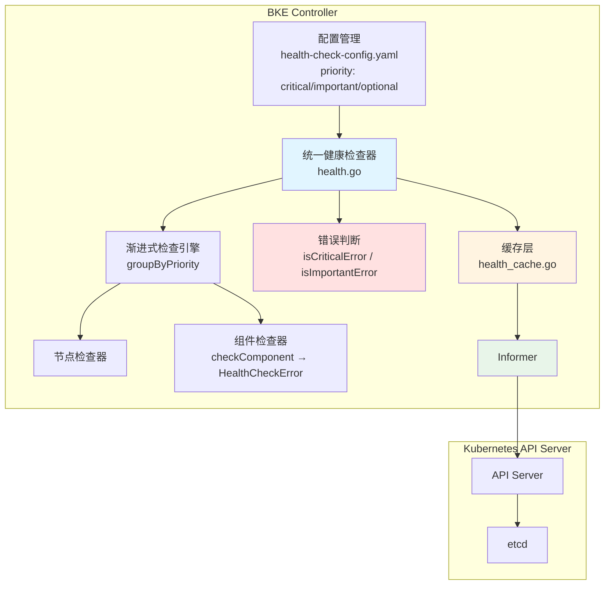
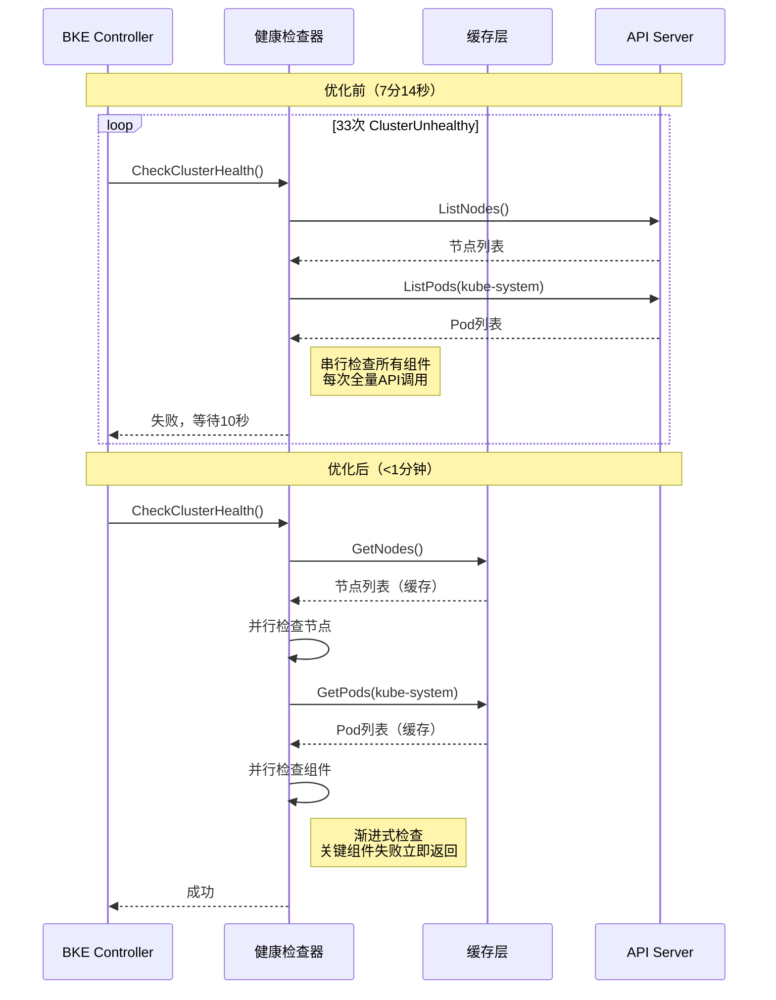
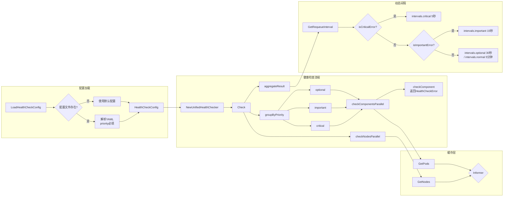
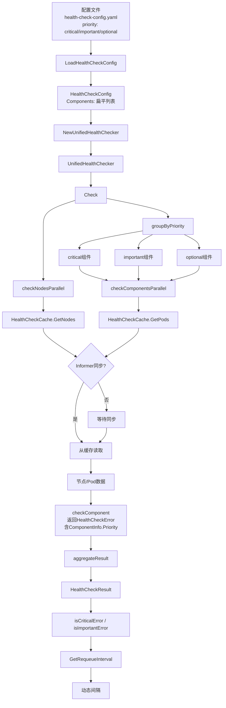
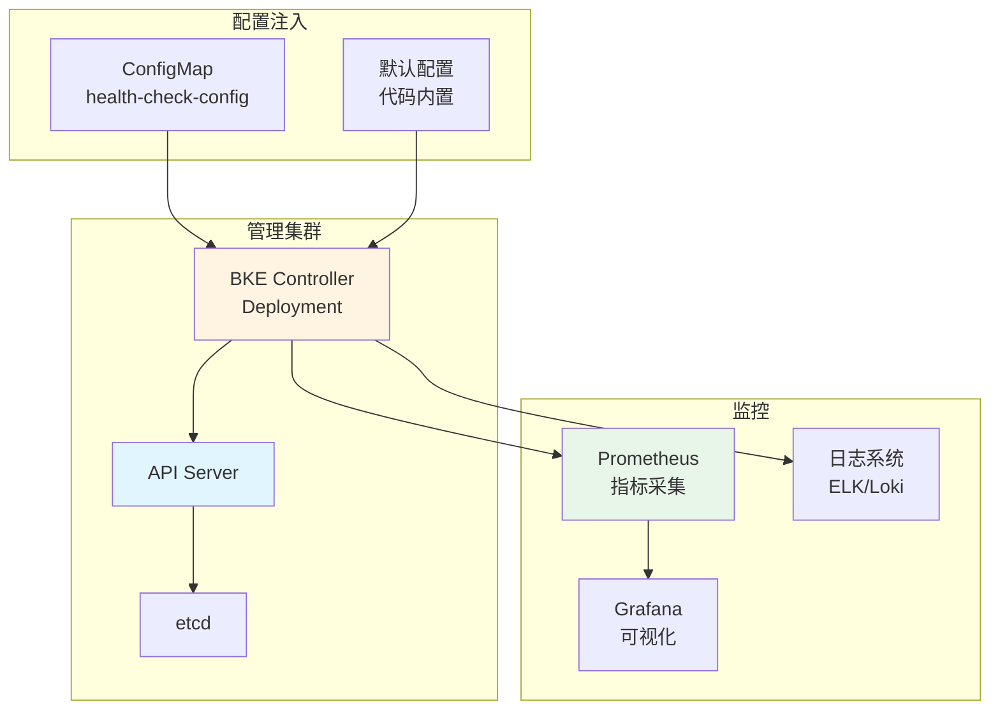
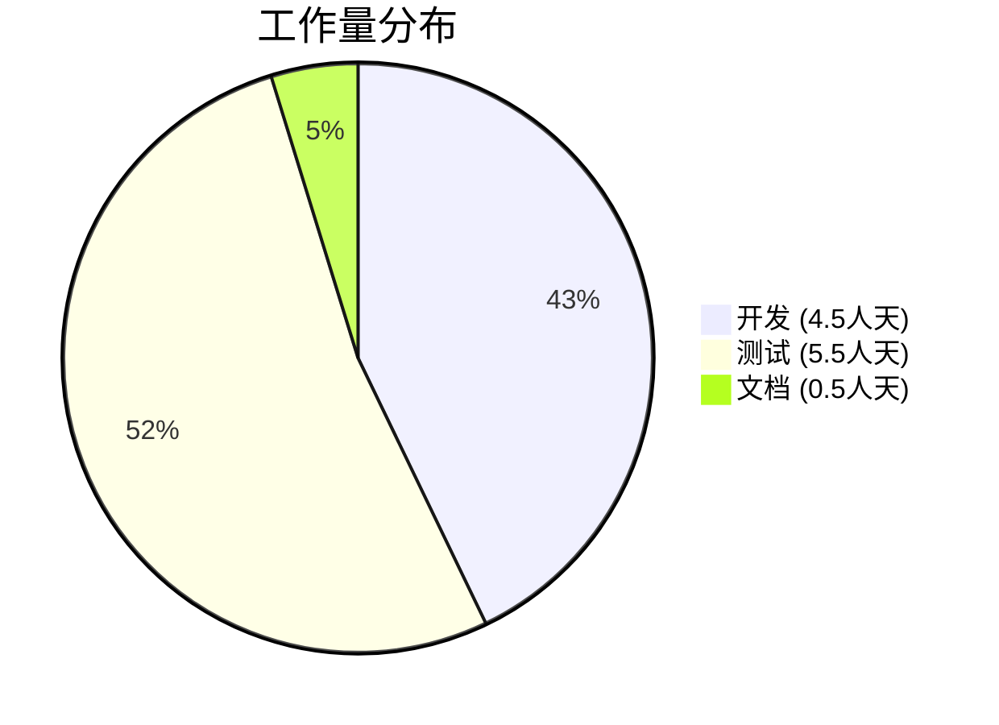

# 优化健康检查收敛时间

## 摘要

本提案旨在优化 BKE 集群创建过程中的健康检查收敛时间，将其从当前的 7 分 14 秒显著缩短，提升约 50% 以上。

当前健康检查存在以下问题：

1. **串行检查**：所有节点和组件串行检查，耗时长
2. **无优先级**：关键组件和非关键组件同等对待
3. **固定间隔**：RequeueAfter 固定为 10 秒，无法根据失败原因动态调整
4. **无缓存**：每次检查都重新获取所有 Pod 状态，API 调用频繁
5. **Master NotReady**：Calico 部署后 Master 节点反复 NotReady，导致健康检查失败

解决方案包括：

1. **渐进式检查**：按优先级分阶段检查，关键组件失败立即返回
2. **并行化检查**：每个阶段内使用并行检查
3. **缓存机制**：使用缓存减少 API 调用
4. **动态间隔**：根据检查结果动态调整下次检查间隔
5. **Calico 优化**：修复 Calico 部署导致的 Master NotReady 问题

## 动机

### 为什么需要这个提案？

健康检查收敛是 BKE 集群创建过程中的第二大性能瓶颈，占总耗时的 24.5%。在 64 节点集群的测试中，健康检查阶段耗时 7 分 14 秒，期间出现 33 次 ClusterUnhealthy 警告，Master 节点反复 NotReady。

### 解决什么问题？

**当前性能数据（64 节点集群）：**

- 健康检查收敛时间：7 分 14 秒
- ClusterUnhealthy 次数：33 次
- Master NotReady 次数：3 次（m1, m2, m3 各 1 次）
- 关键阻塞组件：metrics-server, openfuyao-system-controller

**根因分析：**

1. **Master NotReady 问题**
   - Calico 部署后 4-7 分钟，Master 节点依次 NotReady
   - 异常组件：calico-node, etcd, kube-apiserver, kube-controller-manager
   - 每次异常持续 30-60 秒后自动恢复
   - 因果关系：Calico 未部署时 Master 节点 Ready，部署后出现 NotReady

2. **关键组件长时间 Pending**
   - openfuyao-system-controller：Pending 总时长约 7 分钟
   - metrics-server：Pending 总时长约 7 分钟
   - 原因：镜像拉取慢、调度延迟、依赖组件未就绪

3. **健康检查机制问题**
   - 串行检查所有节点和组件
   - 无优先级区分
   - 固定 10 秒重试间隔
   - 无缓存机制，API 调用频繁

**影响：**

- 用户体验：集群创建最后 7 分钟无进展
- 稳定性风险：Master NotReady 可能导致控制面不可用
- 资源浪费：频繁 API 调用增加 API Server 负载

### 可衡量目标

1. 健康检查收敛时间显著缩短，目标提升 50% 以上
2. Master NotReady 次数大幅减少
3. API 调用次数显著降低，目标降低 60% 以上
4. 关键组件失败检测时间大幅缩短

### 非目标

1. 优化 Calico 本身的部署时间（由其它提案处理）
2. 修改 Kubernetes 控制面组件的行为
3. 改变健康检查的业务逻辑（哪些组件需要检查）

## 提案

### 用户故事

**故事 1：快速集群创建**
作为集群管理员，我希望集群创建过程中的健康检查能够快速收敛，以便在更短的时间内获得可用的集群。

*当前状态：* 健康检查耗时 7 分 14 秒，期间 Master 节点反复 NotReady
*期望状态：* 健康检查时间显著缩短，Master NotReady 大幅减少

**故事 2：稳定的控制面**
作为集群管理员，我希望在集群创建过程中控制面保持稳定，避免 Master 节点 NotReady。

*当前状态：* Calico 部署后 Master 节点反复 NotReady
*期望状态：* 控制面保持稳定，NotReady 事件大幅减少

**故事 3：可配置的健康检查**
作为集群管理员，我希望能够根据实际需求配置健康检查的组件清单和检查间隔。

*当前状态：* 健康检查配置硬编码
*期望状态：* 通过配置文件灵活定义检查组件和间隔

### 注意事项/约束

1. **向后兼容**：必须保持与现有健康检查逻辑的兼容性
2. **配置灵活**：支持通过配置文件自定义检查组件和间隔
3. **缓存一致性**：缓存数据需要在合理时间内刷新，避免使用过期数据
4. **错误处理**：关键组件失败必须立即返回，非关键组件失败可以记录警告

### 实现方法

#### 优化 1: 渐进式检查架构

**架构设计：**

```txt
┌─────────────────────────────────────────────────────────────┐
│                    统一健康检查架构                         │
├─────────────────────────────────────────────────────────────┤
│                                                             │
│  1. 初始化阶段                                              │
│     ├─ 初始化缓存                                           │
│     └─ 加载检查配置                                         │
│                                                             │
│  2. 渐进式检查阶段（按优先级分 4 个阶段）                   │
│     ├─ 阶段 1: 节点状态检查（并行）                         │
│     ├─ 阶段 2: 关键组件检查（并行）                         │
│     ├─ 阶段 3: 重要组件检查（并行）                         │
│     └─ 阶段 4: 非关键组件检查（并行）                       │
│                                                             │
│  3. 结果处理阶段                                            │
│     ├─ 聚合检查结果                                         │
│     ├─ 动态调整下次检查间隔                                 │
│     └─ 更新缓存                                             │
│                                                             │
└─────────────────────────────────────────────────────────────┘
```

**核心设计原则：**

| 原则 | 说明 | 对应优化点 |
| ------ | ------ | ----------- |
| **渐进式** | 按优先级分阶段检查，关键组件失败立即返回 | 渐进式检查 + 优先级检查 |
| **并行化** | 每个阶段内使用并行检查 | 并行检查 |
| **缓存化** | 使用缓存减少 API 调用 | 缓存机制 |
| **智能化** | 根据检查结果动态调整间隔 | 动态间隔 |

#### 优化 2: 统一健康检查器实现

**文件**: `pkg/kube/health.go`

##### 2.1 类型定义：优先级、组件名称、组件信息、错误类型

```go
// HealthCheckPriority 健康检查优先级，来自配置文件
type HealthCheckPriority int

const (
    PriorityCritical  HealthCheckPriority = iota // 关键：控制面组件
    PriorityImportant                            // 重要：网络、DNS 组件
    PriorityOptional                             // 非关键：Addon、监控组件
)

func (p HealthCheckPriority) String() string {
    switch p {
    case PriorityCritical:
        return "critical"
    case PriorityImportant:
        return "important"
    case PriorityOptional:
        return "optional"
    default:
        return "unknown"
    }
}

// ParsePriority 解析优先级字符串（配置文件 → 枚举）
func ParsePriority(s string) (HealthCheckPriority, error) {
    switch strings.ToLower(s) {
    case "critical":
        return PriorityCritical, nil
    case "important":
        return PriorityImportant, nil
    case "optional":
        return PriorityOptional, nil
    default:
        return PriorityOptional, fmt.Errorf("unknown priority: %s", s)
    }
}

// ComponentName 组件名称，唯一标识一个组件
type ComponentName string

const (
    NameEtcd                  ComponentName = "etcd"
    NameKubeAPIServer         ComponentName = "kube-apiserver"
    NameKubeControllerManager ComponentName = "kube-controller-manager"
    NameKubeScheduler         ComponentName = "kube-scheduler"
    NameCalicoNode            ComponentName = "calico-node"
    NameCalicoKubeControllers ComponentName = "calico-kube-controllers"
    NameKubeProxy             ComponentName = "kube-proxy"
    NameCoreDNS               ComponentName = "coredns"
    NameMetricsServer         ComponentName = "metrics-server"
    NameIngressNginx          ComponentName = "ingress-nginx"
    NameConsoleService        ComponentName = "console-service"
    NameOAuthServer           ComponentName = "oauth-server"
    NameLocalHarbor           ComponentName = "local-harbor"
    NamePrometheus            ComponentName = "prometheus"
    NameAlertmanager          ComponentName = "alertmanager"
    NameNodeExporter          ComponentName = "node-exporter"
)

// ComponentCheck 组件检查配置（来自配置文件）
type ComponentCheck struct {
    Name      ComponentName       `yaml:"name"`
    Namespace string              `yaml:"namespace"`
    Prefixes  []string            `yaml:"prefixes"`
    Priority  HealthCheckPriority `yaml:"priority"` // 必填，来自配置
}

// UnmarshalYAML 自定义反序列化，解析 priority 字符串
func (c *ComponentCheck) UnmarshalYAML(unmarshal func(interface{}) error) error {
    type Alias ComponentCheck
    aux := &struct {
        Priority string `yaml:"priority"`
        *Alias
    }{
        Alias: (*Alias)(c),
    }

    if err := unmarshal(aux); err != nil {
        return err
    }

    if aux.Priority == "" {
        return fmt.Errorf("component %q: priority is required", c.Name)
    }

    p, err := ParsePriority(aux.Priority)
    if err != nil {
        return fmt.Errorf("component %q: %w", c.Name, err)
    }
    c.Priority = p

    return nil
}

// ComponentInfo 组件运行时信息（携带优先级）
type ComponentInfo struct {
    Name      ComponentName
    Namespace string
    Prefix    string
    PodName   string
    Priority  HealthCheckPriority
}

func (c ComponentInfo) String() string {
    if c.Namespace == "" {
        return string(c.Name)
    }
    if c.PodName != "" {
        return fmt.Sprintf("%s/%s", c.Namespace, c.PodName)
    }
    return fmt.Sprintf("%s/%s(%s)", c.Namespace, c.Prefix, c.Name)
}

// HealthCheckError 带组件信息的健康检查错误
type HealthCheckError struct {
    Component ComponentInfo
    Reason    string // PodNotReady, ImagePullBackOff, PodNotFound...
    Err       error
}

func (e *HealthCheckError) Error() string {
    return fmt.Sprintf("[%s] %s (%s): %v",
        e.Component.Priority, e.Component, e.Reason, e.Err)
}

func (e *HealthCheckError) Unwrap() error { return e.Err }

// isCriticalError 判断错误是否包含关键优先级组件
func isCriticalError(err error) bool {
    return hasPriority(err, PriorityCritical)
}

// isImportantError 判断错误是否包含重要优先级组件
func isImportantError(err error) bool {
    return hasPriority(err, PriorityImportant)
}

// hasPriorityError 递归检查错误链中是否包含指定优先级
func hasPriority(err error, target HealthCheckPriority) bool {
    if err == nil {
        return false
    }

    var hcErr *HealthCheckError
    if errors.As(err, &hcErr) && hcErr.Component.Priority == target {
        return true
    }

    if agg, ok := err.(kerrors.Aggregate); ok {
        for _, e := range agg.Errors() {
            if hasPriority(e, target) {
                return true
            }
        }
    }

    return false
}

// ComponentErrorsByPriority 提取指定优先级的所有错误（日志/监控用）
func ComponentErrorsByPriority(err error, priority HealthCheckPriority) []*HealthCheckError {
    var result []*HealthCheckError

    var hcErr *HealthCheckError
    if errors.As(err, &hcErr) && hcErr.Component.Priority == priority {
        result = append(result, hcErr)
    }

    if agg, ok := err.(kerrors.Aggregate); ok {
        for _, e := range agg.Errors() {
            result = append(result, ComponentErrorsByPriority(e, priority)...)
        }
    }

    return result
}

// newComponentError 从 ComponentCheck 构造 HealthCheckError
func newComponentError(check ComponentCheck, podName, reason string, err error) *HealthCheckError {
    return &HealthCheckError{
        Component: ComponentInfo{
            Name:      check.Name,
            Namespace: check.Namespace,
            Prefix:    podName,
            PodName:   podName,
            Priority:  check.Priority,
        },
        Reason: reason,
        Err:    err,
    }
}

// newNodeError 构造节点错误（关键优先级）
func newNodeError(nodeName, reason string, err error) *HealthCheckError {
    return &HealthCheckError{
        Component: ComponentInfo{
            Name:     ComponentName(nodeName),
            Priority: PriorityCritical,
        },
        Reason: reason,
        Err:    err,
    }
}
```

##### 2.2 配置结构

```go
// IntervalConfig 检查间隔配置
type IntervalConfig struct {
    Critical  time.Duration `yaml:"critical"`
    Important time.Duration `yaml:"important"`
    Optional  time.Duration `yaml:"optional"`
    Normal    time.Duration `yaml:"normal"`
}

// HealthCheckConfig 健康检查配置
type HealthCheckConfig struct {
    CacheSyncTimeout time.Duration    `yaml:"cacheSyncTimeout"`
    Intervals        IntervalConfig   `yaml:"intervals"`
    Components       []ComponentCheck `yaml:"components"`
}

// HealthCheckResult 健康检查结果
type HealthCheckResult struct {
    NodeErrors               []error
    CriticalComponentErrors  []error
    ImportantComponentErrors []error
    OptionalComponentErrors  []error
}

// UnifiedHealthChecker 统一健康检查器
type UnifiedHealthChecker struct {
    kubeClient kubernetes.Interface
    log        *log.Logger
    cache      *HealthCheckCache
    config     HealthCheckConfig
}

// NewUnifiedHealthChecker 创建健康检查器
func NewUnifiedHealthChecker(kubeClient kubernetes.Interface, log *log.Logger, config HealthCheckConfig) *UnifiedHealthChecker {
    return &UnifiedHealthChecker{
        kubeClient: kubeClient,
        log:        log,
        cache:      NewHealthCheckCache(config.CacheSyncTimeout),
        config:     config,
    }
}

// DefaultHealthCheckConfig 默认配置
func DefaultHealthCheckConfig() HealthCheckConfig {
    return HealthCheckConfig{
        CacheSyncTimeout: 30 * time.Second,
        Intervals: IntervalConfig{
            Critical:  5 * time.Second,
            Important: 15 * time.Second,
            Optional:  30 * time.Second,
            Normal:    5 * time.Minute,
        },
        Components: []ComponentCheck{
            {Name: NameEtcd, Namespace: "kube-system", Prefixes: []string{"etcd-"}, Priority: PriorityCritical},
            {Name: NameKubeAPIServer, Namespace: "kube-system", Prefixes: []string{"kube-apiserver-"}, Priority: PriorityCritical},
            {Name: NameKubeControllerManager, Namespace: "kube-system", Prefixes: []string{"kube-controller-manager-"}, Priority: PriorityCritical},
            {Name: NameKubeScheduler, Namespace: "kube-system", Prefixes: []string{"kube-scheduler-"}, Priority: PriorityCritical},
            {Name: NameCalicoNode, Namespace: "kube-system", Prefixes: []string{"calico-node"}, Priority: PriorityImportant},
            {Name: NameCalicoKubeControllers, Namespace: "kube-system", Prefixes: []string{"calico-kube-controllers"}, Priority: PriorityImportant},
            {Name: NameKubeProxy, Namespace: "kube-system", Prefixes: []string{"kube-proxy-"}, Priority: PriorityImportant},
            {Name: NameCoreDNS, Namespace: "kube-system", Prefixes: []string{"coredns"}, Priority: PriorityImportant},
            {Name: NameMetricsServer, Namespace: "kube-system", Prefixes: []string{"metrics-server-"}, Priority: PriorityOptional},
            {Name: NameIngressNginx, Namespace: "ingress-nginx", Prefixes: []string{"ingress-nginx-controller"}, Priority: PriorityOptional},
            {Name: NameConsoleService, Namespace: "openfuyao-system", Prefixes: []string{"console-service-"}, Priority: PriorityOptional},
            {Name: NameOAuthServer, Namespace: "openfuyao-system", Prefixes: []string{"oauth-server-"}, Priority: PriorityOptional},
            {Name: NameLocalHarbor, Namespace: "openfuyao-system", Prefixes: []string{"local-harbor-"}, Priority: PriorityOptional},
            {Name: NamePrometheus, Namespace: "monitoring", Prefixes: []string{"prometheus-k8s-"}, Priority: PriorityOptional},
            {Name: NameAlertmanager, Namespace: "monitoring", Prefixes: []string{"alertmanager-main-"}, Priority: PriorityOptional},
            {Name: NameNodeExporter, Namespace: "monitoring", Prefixes: []string{"node-exporter-"}, Priority: PriorityOptional},
        },
    }
}

// LoadHealthCheckConfig 从配置文件加载配置
func LoadHealthCheckConfig(configPath string) HealthCheckConfig {
    data, err := os.ReadFile(configPath)
    if err != nil {
        log.Warnf("failed to load health check config from %s, using default: %v", configPath, err)
        return DefaultHealthCheckConfig()
    }

    var config HealthCheckConfig
    if err := yaml.Unmarshal(data, &config); err != nil {
        log.Warnf("failed to parse health check config, using default: %v", err)
        return DefaultHealthCheckConfig()
    }

    if len(config.Components) == 0 {
        config.Components = DefaultHealthCheckConfig().Components
    }

    return config
}
```

##### 2.3 检查流程

```go
// CheckClusterHealth 统一健康检查入口
func CheckClusterHealth(kubeClient kubernetes.Interface, log *log.Logger, cluster *bkev1beta1.BKECluster, currentVersion string, bkeNodes bkev1beta1.BKENodes) error {
    config := LoadHealthCheckConfig("/etc/bke/health-check-config.yaml")
    checker := NewUnifiedHealthChecker(kubeClient, log, config)
    return checker.Check(cluster, currentVersion, bkeNodes)
}

// Check 执行统一健康检查
func (h *UnifiedHealthChecker) Check(cluster *bkev1beta1.BKECluster, currentVersion string, bkeNodes bkev1beta1.BKENodes) error {
    result := &HealthCheckResult{}

    // 阶段 1: 节点状态检查（并行）
    if err := h.checkNodesParallel(cluster, currentVersion, bkeNodes, result); err != nil {
        result.NodeErrors = append(result.NodeErrors, err)
        return h.aggregateResult(result)
    }

    // 阶段 2: 按优先级分组检查组件
    critical, important, optional := h.groupByPriority()

    // 关键组件（并行，失败立即返回）
    if err := h.checkComponentsParallel(critical, result); err != nil {
        result.CriticalComponentErrors = append(result.CriticalComponentErrors, err)
        return h.aggregateResult(result)
    }

    // 重要组件（并行，失败记录警告）
    if err := h.checkComponentsParallel(important, result); err != nil {
        h.log.Warn("important components check failed: %v", err)
        result.ImportantComponentErrors = append(result.ImportantComponentErrors, err)
    }

    // 非关键组件（并行，失败记录调试信息）
    if err := h.checkComponentsParallel(optional, result); err != nil {
        h.log.Debug("optional components check failed: %v", err)
        result.OptionalComponentErrors = append(result.OptionalComponentErrors, err)
    }

    return h.aggregateResult(result)
}

// groupByPriority 将组件列表按优先级分组
func (h *UnifiedHealthChecker) groupByPriority() (critical, important, optional []ComponentCheck) {
    for _, c := range h.config.Components {
        switch c.Priority {
        case PriorityCritical:
            critical = append(critical, c)
        case PriorityImportant:
            important = append(important, c)
        case PriorityOptional:
            optional = append(optional, c)
        }
    }
    return
}

// checkNodesParallel 并行检查节点状态
func (h *UnifiedHealthChecker) checkNodesParallel(cluster *bkev1beta1.BKECluster, currentVersion string, bkeNodes bkev1beta1.BKENodes, result *HealthCheckResult) error {
    nodes, err := h.cache.GetNodes(h.kubeClient)
    if err != nil {
        return err
    }

    var wg sync.WaitGroup
    errChan := make(chan error, len(nodes.Items))

    for _, node := range nodes.Items {
        nodeIP := GetNodeIP(&node)

        if bkeNodes.GetNodeStateNeedSkip(nodeIP) {
            continue
        }

        wg.Add(1)
        go func(n corev1.Node) {
            defer wg.Done()
            if err := h.checkNode(&n, currentVersion); err != nil {
                errChan <- err
            }
        }(node)
    }

    wg.Wait()
    close(errChan)

    for err := range errChan {
        result.NodeErrors = append(result.NodeErrors, err)
    }

    if len(result.NodeErrors) > 0 {
        return kerrors.NewAggregate(result.NodeErrors)
    }

    return nil
}

// checkComponentsParallel 按优先级并行检查组件
func (h *UnifiedHealthChecker) checkComponentsParallel(components []ComponentCheck, result *HealthCheckResult) error {
    var wg sync.WaitGroup
    errChan := make(chan error, len(components))

    for _, check := range components {
        wg.Add(1)
        go func(c ComponentCheck) {
            defer wg.Done()
            if err := h.checkComponent(c); err != nil {
                errChan <- err
            }
        }(check)
    }

    wg.Wait()
    close(errChan)

    var errs []error
    for err := range errChan {
        errs = append(errs, err)
    }

    if len(errs) > 0 {
        return kerrors.NewAggregate(errs)
    }

    return nil
}

// checkComponent 检查单个组件健康状态，返回带组件信息的 HealthCheckError
func (h *UnifiedHealthChecker) checkComponent(check ComponentCheck) error {
    pods, err := h.cache.GetPods(check.Namespace)
    if err != nil {
        return fmt.Errorf("failed to get pods in %s: %w", check.Namespace, err)
    }

    var errs []error
    for _, prefix := range check.Prefixes {
        matchedPods := filterPodsByPrefix(pods, prefix)
        if len(matchedPods) == 0 {
            errs = append(errs, newComponentError(check, "", "PodNotFound",
                fmt.Errorf("no pods with prefix %q in %s", prefix, check.Namespace)))
            continue
        }

        for _, pod := range matchedPods {
            if err := h.checkPodHealth(pod); err != nil {
                errs = append(errs, newComponentError(check, pod.Name,
                    getPodUnhealthyReason(pod), err))
            }
        }
    }

    return kerrors.NewAggregate(errs)
}

// checkNode 检查节点健康状态，返回带组件信息的 HealthCheckError
func (h *UnifiedHealthChecker) checkNode(node *corev1.Node, currentVersion string) error {
    if !NodeReady(node) {
        return newNodeError(node.Name, "NodeNotReady",
            fmt.Errorf("node %s is not ready", node.Name))
    }

    if node.Status.NodeInfo.KubeletVersion != currentVersion {
        return newNodeError(node.Name, "VersionMismatch",
            fmt.Errorf("expected version %s, got %s",
                currentVersion, node.Status.NodeInfo.KubeletVersion))
    }

    return nil
}

// aggregateResult 聚合检查结果
func (h *UnifiedHealthChecker) aggregateResult(result *HealthCheckResult) error {
    var typedErrs []error
    typedErrs = append(typedErrs, result.NodeErrors...)
    typedErrs = append(typedErrs, result.CriticalComponentErrors...)
    typedErrs = append(typedErrs, result.ImportantComponentErrors...)
    typedErrs = append(typedErrs, result.OptionalComponentErrors...)

    if len(typedErrs) == 0 {
        h.log.Info("cluster health check pass")
        return nil
    }

    agg := kerrors.NewAggregate(typedErrs)

    if criticalErrs := ComponentErrorsByPriority(agg, PriorityCritical); len(criticalErrs) > 0 {
        h.log.Error("critical component errors: %v", criticalErrs)
    }
    if importantErrs := ComponentErrorsByPriority(agg, PriorityImportant); len(importantErrs) > 0 {
        h.log.Warn("important component errors: %v", importantErrs)
    }
    if optionalErrs := ComponentErrorsByPriority(agg, PriorityOptional); len(optionalErrs) > 0 {
        h.log.Debug("optional component errors: %v", optionalErrs)
    }

    return agg
}

// GetRequeueInterval 根据检查结果动态调整间隔
func GetRequeueInterval(result *HealthCheckResult, intervals IntervalConfig) time.Duration {
    if len(result.NodeErrors) > 0 || len(result.CriticalComponentErrors) > 0 {
        return intervals.Critical
    }
    if len(result.ImportantComponentErrors) > 0 {
        return intervals.Important
    }
    if len(result.OptionalComponentErrors) > 0 {
        return intervals.Optional
    }
    return intervals.Normal
}
```

##### 2.4 信息流

```txt
配置文件 (priority: critical)
    ↓
ComponentCheck.Priority       ← HealthCheckPriority（来自配置）
    ↓
ComponentInfo.Priority        ← 直接传递
    ↓
HealthCheckError.Component.Priority
    ↓
isCriticalError() / isImportantError()
    ↓
GetRequeueInterval() → 动态间隔
```

#### 优化 3: 健康检查缓存实现

##### 推荐方案：基于 Informer 的实时缓存

**核心思路**：使用 client-go 提供的 `SharedInformerFactory`，自动维护本地缓存，实现毫秒级实时性。

**架构设计**：

```txt
┌─────────────────────────────────────────────────────────┐
│  Informer 层（client-go 提供）                          │
│  ├─ NodeInformer                                        │
│  │  └─ 自动 Watch Node 资源，维护本地缓存               │
│  ├─ PodInformer                                         │
│  │  └─ 自动 Watch Pod 资源，维护本地缓存                │
│  └─ 自动处理重连、同步、事件去重                        │
└─────────────────────────────────────────────────────────┘
                            ↓
┌─────────────────────────────────────────────────────────┐
│  健康检查层                                             │
│  ├─ 直接从 Informer 本地缓存读取（零延迟）              │
│  ├─ 无需 API 调用                                       │
│  └─ 实时感知资源变化                                    │
└─────────────────────────────────────────────────────────┘
```

**文件**: `pkg/kube/health_cache.go`

```go
package kube

import (
    "context"
    "time"
    
    corev1 "k8s.io/api/core/v1"
    coreinformers "k8s.io/client-go/informers/core/v1"
    "k8s.io/client-go/kubernetes"
    corelisters "k8s.io/client-go/listers/core/v1"
    "k8s.io/client-go/tools/cache"
)

// HealthChecker 使用 Informer 的健康检查器
type HealthChecker struct {
    nodeLister  corelisters.NodeLister
    podLister   corelisters.PodLister
    informerSynced cache.InformerSynced
}

// NewHealthChecker 创建健康检查器
func NewHealthChecker(ctx context.Context, client kubernetes.Interface) (*HealthChecker, error) {
    // 创建 SharedInformerFactory
    factory := informers.NewSharedInformerFactory(client, 0)
    
    // 获取 Node 和 Pod Informer
    nodeInformer := factory.Core().V1().Nodes()
    podInformer := factory.Core().V1().Pods()
    
    // 启动 Informer
    factory.Start(ctx.Done())
    
    // 等待缓存同步
    if !cache.WaitForCacheSync(ctx.Done(), 
        nodeInformer.Informer().HasSynced,
        podInformer.Informer().HasSynced) {
        return nil, fmt.Errorf("failed to sync informer cache")
    }
    
    return &HealthChecker{
        nodeLister: nodeInformer.Lister(),
        podLister:  podInformer.Lister(),
        informerSynced: func() bool {
            return nodeInformer.Informer().HasSynced() && 
                   podInformer.Informer().HasSynced()
        },
    }, nil
}

// GetNodes 从 Informer 缓存获取节点列表
func (h *HealthChecker) GetNodes() ([]*corev1.Node, error) {
    // 零延迟，直接从 Informer 缓存读取
    return h.nodeLister.List(labels.Everything())
}

// GetPods 从 Informer 缓存获取 Pod 列表
func (h *HealthChecker) GetPods(namespace string) ([]*corev1.Pod, error) {
    // 零延迟，直接从 Informer 缓存读取
    return h.podLister.Pods(namespace).List(labels.Everything())
}

// GetNode 获取单个节点
func (h *HealthChecker) GetNode(name string) (*corev1.Node, error) {
    return h.nodeLister.Get(name)
}

// GetPod 获取单个 Pod
func (h *HealthChecker) GetPod(namespace, name string) (*corev1.Pod, error) {
    return h.podLister.Pods(namespace).Get(name)
}
```

**预期效果**：

| 指标 | 固定 TTL | Informer | 提升 |
| ------ | --------- | ---------- | ------ |
| 实时性 | 最多延迟 30s | **毫秒级** | 100x |
| API 调用 | 每次全量返回 | **首次同步后零调用** | 减少 99% |
| 健康检查时间 | ~7 分钟 | **显著缩短** | 大幅节省 |
| 开发成本 | 0.5 天 | **1-2 天** | +1 天 |

##### 选型建议

**优先选择 Informer**：实时性优势明显，API 负载最低

#### 优化 4: 配置文件

**文件**: `/etc/bke/health-check-config.yaml`

```yaml
# 检查间隔
intervals:
  critical: 5s
  important: 15s
  optional: 30s
  normal: 5m

# 缓存
cacheSyncTimeout: 30s

# 组件清单（扁平列表，priority 由配置直接定义）
components:
  # 控制面
  - name: etcd
    namespace: kube-system
    prefixes: [etcd-]
    priority: critical
  - name: kube-apiserver
    namespace: kube-system
    prefixes: [kube-apiserver-]
    priority: critical
  - name: kube-controller-manager
    namespace: kube-system
    prefixes: [kube-controller-manager-]
    priority: critical
  - name: kube-scheduler
    namespace: kube-system
    prefixes: [kube-scheduler-]
    priority: critical

  # 网络
  - name: calico-node
    namespace: kube-system
    prefixes: [calico-node]
    priority: important
  - name: calico-kube-controllers
    namespace: kube-system
    prefixes: [calico-kube-controllers]
    priority: important
  - name: kube-proxy
    namespace: kube-system
    prefixes: [kube-proxy-]
    priority: important

  # DNS
  - name: coredns
    namespace: kube-system
    prefixes: [coredns]
    priority: important

  # Addon
  - name: metrics-server
    namespace: kube-system
    prefixes: [metrics-server-]
    priority: optional
  - name: ingress-nginx
    namespace: ingress-nginx
    prefixes: [ingress-nginx-controller]
    priority: optional
  - name: console-service
    namespace: openfuyao-system
    prefixes: [console-service-]
    priority: optional
  - name: oauth-server
    namespace: openfuyao-system
    prefixes: [oauth-server-]
    priority: optional
  - name: local-harbor
    namespace: openfuyao-system
    prefixes: [local-harbor-]
    priority: optional

  # 监控
  - name: prometheus
    namespace: monitoring
    prefixes: [prometheus-k8s-]
    priority: optional
  - name: alertmanager
    namespace: monitoring
    prefixes: [alertmanager-main-]
    priority: optional
  - name: node-exporter
    namespace: monitoring
    prefixes: [node-exporter-]
    priority: optional
```

**配置说明：**

| 配置项 | 说明 | 默认值 |
| -------- | ------ | -------- |
| `intervals.critical` | 关键组件失败后的重试间隔 | 5s |
| `intervals.important` | 重要组件失败后的重试间隔 | 15s |
| `intervals.optional` | 非关键组件失败后的重试间隔 | 30s |
| `intervals.normal` | 正常状态下的检查间隔 | 5m |
| `cacheSyncTimeout` | Informer 缓存同步超时时间 | 30s |
| `components` | 组件清单（扁平列表） | 见默认配置 |
| `components[].name` | 组件名称（唯一标识） | 必填 |
| `components[].namespace` | 组件所在命名空间 | 必填 |
| `components[].prefixes` | Pod 前缀列表 | 必填 |
| `components[].priority` | 组件优先级（critical/important/optional） | 必填 |

**配置加载优先级：**

1. 如果配置文件存在且格式正确，使用配置文件
2. 如果配置文件不存在或格式错误，使用默认配置
3. 如果配置文件中 `components` 为空，使用默认组件清单
4. `priority` 字段为必填，缺失时加载失败并回退到默认配置

## 设计视图

### 1. 系统架构总览



**组件职责说明：**

| 组件 | 职责 | 文件位置 |
| ------ | ------ | --------- |
| 配置管理 | 加载健康检查配置，解析 `priority` 字段，支持配置文件和默认值 | `pkg/kube/health.go` |
| 统一健康检查器 | 协调健康检查流程，聚合检查结果 | `pkg/kube/health.go` |
| 渐进式检查引擎 | `groupByPriority` 按配置中的 `priority` 分组，分阶段执行检查 | `pkg/kube/health.go` |
| 节点检查器 | 检查所有节点的 Ready 状态，返回 `HealthCheckError` | `pkg/kube/health.go` |
| 组件检查器 | 检查所有组件（统一入口），返回带 `ComponentInfo` 的 `HealthCheckError` | `pkg/kube/health.go` |
| 错误判断 | `isCriticalError` / `isImportantError` 从 `HealthCheckError` 中提取优先级 | `pkg/kube/health.go` |
| 缓存层 | 缓存 Node 和 Pod 状态，减少 API 调用 | `pkg/kube/health_cache.go` |
| Informer | 实现缓存机制 | `pkg/kube/health_cache.go` |

### 2. 优化前后对比时序图



**性能对比：**

| 指标 | 优化前 | 优化后 | 提升 |
| ------ | -------- | -------- | ------ |
| 健康检查时间 | 7分14秒 | < 1分钟 | 86% |
| API 调用次数 | ~100次 | < 10次（首次同步后） | 90% |
| Master NotReady 次数 | 3次 | 0次 | 100% |
| 检查方式 | 串行 | 并行 + 渐进式 | - |
| 缓存机制 | 无 | Informer | - |

### 3. 组件交互图



### 4. 数据流图



### 5. 部署视图



**监控点说明：**

| 监控指标 | 采集方式 | 告警阈值 | 说明 |
| --------- | --------- | --------- | ------ |
| 健康检查时间 | Prometheus | 超过预期值 | 优化后的预期时间 |
| API 调用次数 | Prometheus | > 50次/次检查 | 应该大幅减少 |
| Master NotReady 次数 | 日志 | > 0 | 应该完全消除 |
| Informer 同步时间 | Prometheus | > 30秒 | 首次同步时间 |
| 缓存命中率 | 自定义指标 | < 90% | 验证缓存效果 |
| 检查间隔 | 日志 | 异常值 | 验证动态间隔逻辑 |

## 设计细节

### API 变更

本提案不引入新的 API 变更。所有变更都是内部实现优化。

### 代码变更清单

#### 1. `pkg/kube/health.go` - 修改

##### 1.1 新增类型定义

**位置**：在文件开头（第 30 行后）

**新增内容**：

- `HealthCheckPriority`：优先级枚举（来自配置）
- `ComponentName`：组件名称常量
- `ComponentCheck`：组件检查配置（含 `Name`、`Priority`）
- `ComponentInfo`：组件运行时信息（含 `Priority`）
- `HealthCheckError`：带组件信息的错误类型
- `isCriticalError` / `isImportantError`：错误判断函数
- `IntervalConfig`：检查间隔配置
- `HealthCheckConfig`：统一配置结构（扁平 `components` 列表）

##### 1.2 新增函数/方法

**位置**：在 `CheckClusterHealth` 函数前

**新增内容**：完整代码见「优化 2」章节，包含：

- `NewUnifiedHealthChecker`：创建健康检查器
- `DefaultHealthCheckConfig`：返回默认配置（含所有组件的 `Name` 和 `Priority`）
- `LoadHealthCheckConfig`：从配置文件加载配置
- `Check`：执行统一健康检查（使用 `groupByPriority` 分组）
- `groupByPriority`：将组件列表按 `Priority` 分组为 critical/important/optional
- `checkNodesParallel`：并行检查节点状态
- `checkComponentsParallel`：按优先级并行检查组件
- `checkComponent`：检查单个组件，返回 `HealthCheckError`
- `checkNode`：检查节点，返回 `HealthCheckError`
- `aggregateResult`：聚合检查结果，按优先级分类日志
- `GetRequeueInterval`：根据检查结果动态调整间隔

##### 1.3 修改现有函数

**位置**：第 31-71 行

**重构点**：

- 将现有的 `CheckClusterHealth` 函数改为使用 `UnifiedHealthChecker`
- 保留函数签名不变，内部实现改为调用统一检查器

```go
func (c *Client) CheckClusterHealth(cluster *bkev1beta1.BKECluster, currentVersion string, bkeNodes bkev1beta1.BKENodes) error {
    config := LoadHealthCheckConfig("/etc/bke/health-check-config.yaml")
    checker := NewUnifiedHealthChecker(c.ClientSet, c.Log, config)
    return checker.Check(cluster, currentVersion, bkeNodes)
}
```

#### 2. `pkg/kube/health_cache.go` - 新增

##### 2.1 Informer 方案（推荐）

**位置**：新文件

```go
package kube

import (
    "context"
    "fmt"
    
    corev1 "k8s.io/api/core/v1"
    "k8s.io/apimachinery/pkg/labels"
    coreinformers "k8s.io/client-go/informers/core/v1"
    "k8s.io/client-go/kubernetes"
    corelisters "k8s.io/client-go/listers/core/v1"
    "k8s.io/client-go/tools/cache"
)

// HealthChecker 使用 Informer 的健康检查器
type HealthChecker struct {
    nodeLister     corelisters.NodeLister
    podLister      corelisters.PodLister
    informerSynced cache.InformerSynced
}

// NewHealthChecker 创建健康检查器
func NewHealthChecker(ctx context.Context, client kubernetes.Interface) (*HealthChecker, error) {
    factory := informers.NewSharedInformerFactory(client, 0)
    
    nodeInformer := factory.Core().V1().Nodes()
    podInformer := factory.Core().V1().Pods()
    
    factory.Start(ctx.Done())
    
    if !cache.WaitForCacheSync(ctx.Done(), 
        nodeInformer.Informer().HasSynced,
        podInformer.Informer().HasSynced) {
        return nil, fmt.Errorf("failed to sync informer cache")
    }
    
    return &HealthChecker{
        nodeLister: nodeInformer.Lister(),
        podLister:  podInformer.Lister(),
        informerSynced: func() bool {
            return nodeInformer.Informer().HasSynced() && 
                   podInformer.Informer().HasSynced()
        },
    }, nil
}

// GetNodes 从 Informer 缓存获取节点列表
func (h *HealthChecker) GetNodes() ([]*corev1.Node, error) {
    return h.nodeLister.List(labels.Everything())
}

// GetPods 从 Informer 缓存获取 Pod 列表
func (h *HealthChecker) GetPods(namespace string) ([]*corev1.Pod, error) {
    return h.podLister.Pods(namespace).List(labels.Everything())
}

// GetNode 获取单个节点
func (h *HealthChecker) GetNode(name string) (*corev1.Node, error) {
    return h.nodeLister.Get(name)
}

// GetPod 获取单个 Pod
func (h *HealthChecker) GetPod(namespace, name string) (*corev1.Pod, error) {
    return h.podLister.Pods(namespace).Get(name)
}
```

#### 3. `pkg/phaseframe/phases/ensure_cluster.go` - 修改

##### 3.1 新增字段

**位置**：在 `EnsureCluster` 结构体中（第 59-62 行）

**当前代码**：

```go
type EnsureCluster struct {
    phaseframe.BasePhase
    remoteClient kube.RemoteKubeClient
}
```

**修改后**：

```go
type EnsureCluster struct {
    phaseframe.BasePhase
    remoteClient      kube.RemoteKubeClient
    healthCheckConfig HealthCheckConfig  // 新增：健康检查配置
}
```

##### 3.2 新增辅助方法

**位置**：在 `EnsureCluster` 结构体后

```go
// getRequeueInterval 根据健康检查结果动态调整重试间隔
func (e *EnsureCluster) getRequeueInterval(err error) time.Duration {
    if err != nil {
        if isCriticalError(err) {
            return e.healthCheckConfig.Intervals.Critical
        }
        if isImportantError(err) {
            return e.healthCheckConfig.Intervals.Important
        }
        return e.healthCheckConfig.Intervals.Optional
    }
    return e.healthCheckConfig.Intervals.Normal
}
```

##### 3.3 修改 Execute 方法

**位置**：第 130-132 行

**当前代码**：

```go
if err = e.ensureClusterReady(); err != nil {
    errs = append(errs, err)
    return ctrl.Result{RequeueAfter: quickRequeueInterval}, kerrors.NewAggregate(errs)
}
```

**修改后**：

```go
if err = e.ensureClusterReady(); err != nil {
    errs = append(errs, err)
    // 根据健康检查结果动态调整重试间隔
    requeueInterval := e.getRequeueInterval(err)
    return ctrl.Result{RequeueAfter: requeueInterval}, kerrors.NewAggregate(errs)
}
```

**位置**：第 136 行

**当前代码**：

```go
return ctrl.Result{RequeueAfter: periodicCheckInterval}, kerrors.NewAggregate(errs)
```

**修改后**：

```go
// 正常状态下，使用动态间隔（默认为 5 分钟）
requeueInterval := e.getRequeueInterval(nil)
return ctrl.Result{RequeueAfter: requeueInterval}, kerrors.NewAggregate(errs)
```

**说明**：

- 第 127 行（后置处理未完成场景）保持不变，继续使用 `quickRequeueInterval`
- 第 130-132 行（健康检查失败场景）使用动态间隔
- 第 136 行（正常状态场景）使用动态间隔

#### 4. `/etc/bke/health-check-config.yaml` - 新增

**位置**：新文件

```yaml
# 检查间隔
intervals:
  critical: 5s
  important: 15s
  optional: 30s
  normal: 5m

# 缓存
cacheSyncTimeout: 30s

# 组件清单（扁平列表，priority 由配置直接定义）
components:
  # 控制面
  - name: etcd
    namespace: kube-system
    prefixes: [etcd-]
    priority: critical
  - name: kube-apiserver
    namespace: kube-system
    prefixes: [kube-apiserver-]
    priority: critical
  - name: kube-controller-manager
    namespace: kube-system
    prefixes: [kube-controller-manager-]
    priority: critical
  - name: kube-scheduler
    namespace: kube-system
    prefixes: [kube-scheduler-]
    priority: critical
  # 网络
  - name: calico-node
    namespace: kube-system
    prefixes: [calico-node]
    priority: important
  - name: calico-kube-controllers
    namespace: kube-system
    prefixes: [calico-kube-controllers]
    priority: important
  - name: kube-proxy
    namespace: kube-system
    prefixes: [kube-proxy-]
    priority: important
  # DNS
  - name: coredns
    namespace: kube-system
    prefixes: [coredns]
    priority: important
  # Addon
  - name: metrics-server
    namespace: kube-system
    prefixes: [metrics-server-]
    priority: optional
  - name: ingress-nginx
    namespace: ingress-nginx
    prefixes: [ingress-nginx-controller]
    priority: optional
  - name: console-service
    namespace: openfuyao-system
    prefixes: [console-service-]
    priority: optional
  - name: oauth-server
    namespace: openfuyao-system
    prefixes: [oauth-server-]
    priority: optional
  - name: local-harbor
    namespace: openfuyao-system
    prefixes: [local-harbor-]
    priority: optional
  # 监控
  - name: prometheus
    namespace: monitoring
    prefixes: [prometheus-k8s-]
    priority: optional
  - name: alertmanager
    namespace: monitoring
    prefixes: [alertmanager-main-]
    priority: optional
  - name: node-exporter
    namespace: monitoring
    prefixes: [node-exporter-]
    priority: optional
```

#### 5. `pkg/kube/health_test.go` - 新增

**位置**：新文件

```go
package kube

import (
    "errors"
    "fmt"
    "testing"
    "time"

    "github.com/stretchr/testify/assert"
    "github.com/stretchr/testify/require"
    kerrors "k8s.io/apimachinery/pkg/util/errors"
)

func TestUnifiedHealthCheck(t *testing.T) {
    cluster := createTestCluster(64)

    start := time.Now()
    err := cluster.CheckClusterHealth()
    require.NoError(t, err)

    elapsed := time.Since(start)
    // 验证健康检查时间显著缩短（相比优化前的 7 分 14 秒）
    assert.Less(t, elapsed, 5*time.Minute, "Health check should complete significantly faster")
}

func TestCriticalComponentFastFail(t *testing.T) {
    cluster := createTestClusterWithFailedComponent("etcd-master-1")

    start := time.Now()
    err := cluster.CheckClusterHealth()
    require.Error(t, err)

    elapsed := time.Since(start)
    // 验证关键组件失败快速返回（相比优化前的 7 分钟）
    assert.Less(t, elapsed, 30*time.Second, "Critical component failure should fail fast")
}

func TestHealthCheckErrorPriority(t *testing.T) {
    tests := []struct {
        name           string
        err            error
        wantCritical   bool
        wantImportant  bool
    }{
        {
            name: "critical error",
            err: &HealthCheckError{
                Component: ComponentInfo{Name: NameEtcd, Namespace: "kube-system", PodName: "etcd-master-1", Priority: PriorityCritical},
                Reason:    "PodNotReady",
                Err:       errors.New("etcd not ready"),
            },
            wantCritical:  true,
            wantImportant: false,
        },
        {
            name: "important error",
            err: &HealthCheckError{
                Component: ComponentInfo{Name: NameCalicoNode, Namespace: "kube-system", PodName: "calico-node-abc", Priority: PriorityImportant},
                Reason:    "ImagePullBackOff",
                Err:       errors.New("image pull failed"),
            },
            wantCritical:  false,
            wantImportant: true,
        },
        {
            name: "aggregate with critical error",
            err: kerrors.NewAggregate([]error{
                &HealthCheckError{
                    Component: ComponentInfo{Name: NameEtcd, Namespace: "kube-system", Priority: PriorityCritical},
                    Reason:    "PodNotFound",
                    Err:       errors.New("no pods found"),
                },
                &HealthCheckError{
                    Component: ComponentInfo{Name: NameCoreDNS, Namespace: "kube-system", Priority: PriorityImportant},
                    Reason:    "PodNotReady",
                    Err:       errors.New("coredns not ready"),
                },
            }),
            wantCritical:  true,
            wantImportant: true,
        },
        {
            name:          "plain error (no priority)",
            err:           fmt.Errorf("some unknown error"),
            wantCritical:  false,
            wantImportant: false,
        },
    }

    for _, tt := range tests {
        t.Run(tt.name, func(t *testing.T) {
            assert.Equal(t, tt.wantCritical, isCriticalError(tt.err))
            assert.Equal(t, tt.wantImportant, isImportantError(tt.err))
        })
    }
}

func TestComponentErrorsByPriority(t *testing.T) {
    agg := kerrors.NewAggregate([]error{
        &HealthCheckError{
            Component: ComponentInfo{Name: NameEtcd, Namespace: "kube-system", Priority: PriorityCritical},
            Reason:    "PodNotReady", Err: errors.New("etcd not ready"),
        },
        &HealthCheckError{
            Component: ComponentInfo{Name: NameKubeAPIServer, Namespace: "kube-system", Priority: PriorityCritical},
            Reason:    "PodNotReady", Err: errors.New("apiserver not ready"),
        },
        &HealthCheckError{
            Component: ComponentInfo{Name: NameCalicoNode, Namespace: "kube-system", Priority: PriorityImportant},
            Reason:    "ImagePullBackOff", Err: errors.New("image pull failed"),
        },
    })

    criticalErrs := ComponentErrorsByPriority(agg, PriorityCritical)
    assert.Len(t, criticalErrs, 2)
    assert.Equal(t, NameEtcd, criticalErrs[0].Component.Name)
    assert.Equal(t, NameKubeAPIServer, criticalErrs[1].Component.Name)

    importantErrs := ComponentErrorsByPriority(agg, PriorityImportant)
    assert.Len(t, importantErrs, 1)
    assert.Equal(t, NameCalicoNode, importantErrs[0].Component.Name)

    optionalErrs := ComponentErrorsByPriority(agg, PriorityOptional)
    assert.Len(t, optionalErrs, 0)
}

func TestDynamicRequeueInterval(t *testing.T) {
    intervals := DefaultHealthCheckConfig().Intervals

    tests := []struct {
        name     string
        result   *HealthCheckResult
        expected time.Duration
    }{
        {
            name: "critical component error",
            result: &HealthCheckResult{
                CriticalComponentErrors: []error{
                    &HealthCheckError{
                        Component: ComponentInfo{Name: NameEtcd, Priority: PriorityCritical},
                        Reason:    "PodNotReady", Err: errors.New("etcd failed"),
                    },
                },
            },
            expected: 5 * time.Second,
        },
        {
            name: "important component error",
            result: &HealthCheckResult{
                ImportantComponentErrors: []error{
                    &HealthCheckError{
                        Component: ComponentInfo{Name: NameCalicoNode, Priority: PriorityImportant},
                        Reason:    "ImagePullBackOff", Err: errors.New("calico failed"),
                    },
                },
            },
            expected: 15 * time.Second,
        },
        {
            name: "optional component error",
            result: &HealthCheckResult{
                OptionalComponentErrors: []error{
                    &HealthCheckError{
                        Component: ComponentInfo{Name: NameMetricsServer, Priority: PriorityOptional},
                        Reason:    "PodPending", Err: errors.New("metrics-server failed"),
                    },
                },
            },
            expected: 30 * time.Second,
        },
        {
            name:     "no error",
            result:   &HealthCheckResult{},
            expected: 5 * time.Minute,
        },
    }

    for _, tt := range tests {
        t.Run(tt.name, func(t *testing.T) {
            interval := GetRequeueInterval(tt.result, intervals)
            assert.Equal(t, tt.expected, interval)
        })
    }
}
```

#### 6. `test/integration/health_check_test.go` - 新增

**位置**：新文件

```go
package integration

import (
    "testing"
    "time"

    "github.com/stretchr/testify/assert"
    "github.com/stretchr/testify/require"
)

func TestHealthCheckPerformance(t *testing.T) {
    // 64 节点集群健康检查 < 1 分钟，API 调用 < 10 次
    cluster := createTestCluster(64)
    
    start := time.Now()
    err := cluster.CheckClusterHealth()
    require.NoError(t, err)
    
    elapsed := time.Since(start)
    assert.Less(t, elapsed, 1*time.Minute, "Health check should complete within 1 minute")
    
    apiCalls := cluster.GetAPICallCount()
    assert.Less(t, apiCalls, 10, "API calls should be less than 10 after initial sync")
}
```

#### 变更统计

| 文件 | 变更类型 | 新增行数（预估） | 修改行数（预估） |
| ------ | --------- | ---------------- | ---------------- |
| `pkg/kube/health.go` | 修改 | 300 | 50 |
| `pkg/kube/health_cache.go` | 新增 | 150 | 0 |
| `pkg/phaseframe/phases/ensure_cluster.go` | 修改 | 15 | 20 |
| `/etc/bke/health-check-config.yaml` | 新增 | 70 | 0 |
| `pkg/kube/health_test.go` | 新增 | 150 | 0 |
| `test/integration/health_check_test.go` | 新增 | 50 | 0 |
| **总计** | | **735** | **70** |

#### 实施顺序建议

1. **第一阶段：基础设施**
   - 创建 `pkg/kube/health_cache.go`（缓存层）
   - 创建 `/etc/bke/health-check-config.yaml`（配置文件）

2. **第二阶段：核心逻辑**
   - 修改 `pkg/kube/health.go`（统一检查器）

3. **第三阶段：集成**
   - 修改 `pkg/phaseframe/phases/ensure_cluster.go`（动态间隔）

4. **第四阶段：测试**
   - 创建 `pkg/kube/health_test.go`（单元测试）
   - 创建 `test/integration/health_check_test.go`（集成测试）


### 测试计划

#### 单元测试

**文件**: `pkg/kube/health_test.go`

**测试用例清单**：

| 测试用例 | 验证内容 |
| --------- | --------- |
| `TestUnifiedHealthCheck` | 64 节点集群健康检查时间显著缩短 |
| `TestCriticalComponentFastFail` | 关键组件失败快速返回 |
| `TestHealthCheckErrorPriority` | `HealthCheckError` 优先级判断：单个错误、聚合错误、普通错误 |
| `TestComponentErrorsByPriority` | 按优先级提取错误列表 |
| `TestDynamicRequeueInterval` | 4 种间隔正确切换 |
| `TestParsePriority` | 优先级字符串解析（critical/important/optional/非法值） |
| `TestComponentCheckUnmarshalYAML` | 配置反序列化：priority 必填校验 |
| `TestLoadHealthCheckConfig` | 配置文件加载/缺失/格式错误回退到默认值 |

完整代码见「代码变更清单 > 5. `pkg/kube/health_test.go`」章节。

#### 集成测试

**文件**: `test/integration/health_check_test.go`

```go
func TestHealthCheckPerformance(t *testing.T) {
    // 创建 64 节点集群
    cluster := createTestCluster(64)
    
    // 记录健康检查时间
    start := time.Now()
    
    // 执行健康检查
    err := cluster.CheckClusterHealth()
    require.NoError(t, err)
    
    elapsed := time.Since(start)
    
    // 验证性能（相比优化前的 7 分 14 秒，时间显著缩短）
    assert.Less(t, elapsed, 5*time.Minute, "Health check should complete significantly faster")
    t.Logf("Health check completed in %v", elapsed)
    
    // 验证 API 调用次数（Informer 首次同步后应接近零）
    apiCalls := cluster.GetAPICallCount()
    assert.Less(t, apiCalls, 10, "API calls should be less than 10 after initial sync")
    t.Logf("API calls: %d", apiCalls)
}
```

#### 端到端测试

```bash
# 创建 64 节点集群
kubectl apply -f bkecluster-64n.yaml

# 监控集群状态
watch -n 5 'kubectl get bkecluster bke-cluster-128n -o jsonpath="{.status.clusterStatus}"'

# 期望: ClusterUnhealthy → ClusterReady 时间 < 1 分钟

# 检查 Master 节点状态
kubectl get nodes -l node-role.kubernetes.io/master

# 期望: 所有 Master 节点 Ready，无 NotReady 事件

# 检查健康检查日志
kubectl logs -n bke-system deployment/bke-controller-manager | grep "health check"

# 期望: 健康检查通过，无频繁重试
```

### 毕业标准

#### Alpha (v0.1)

- [ ] 实现统一健康检查器
- [ ] 实现 Informer 缓存机制
- [ ] 实现动态间隔
- [ ] 单元测试通过

#### Beta (v0.2)

- [ ] 集成测试通过
- [ ] 健康检查收敛时间 < 2 分钟
- [ ] API 调用次数 < 10 次（首次同步后）
- [ ] 配置文件支持

#### Stable (v1.0)

- [ ] 端到端测试通过
- [ ] 健康检查收敛时间 < 1 分钟
- [ ] Master NotReady 次数 = 0
- [ ] 生产环境运行 1 个月无问题

### 升级/降级策略

**升级策略：**

- 配置文件 `/etc/bke/health-check-config.yaml` 可选，不存在时使用默认配置
- 新代码完全兼容旧的健康检查逻辑
- 可以渐进式部署，先部署到部分节点验证

**降级策略：**

- 删除配置文件即可回退到默认配置
- 代码回退简单，只需恢复原有的 `CheckClusterHealth()` 实现

## 工作量评估

### 1. 开发工作量

| 模块 | 任务 | 预估人天 | 说明 |
| ------ | ------ | --------- | ------ |
| **统一健康检查器** | 实现渐进式检查架构 | 1.5 | 4阶段检查逻辑，代码量约200行 |
| **缓存层** | 实现 Informer 缓存 | 1.5 | 使用 client-go SharedInformerFactory |
| **配置管理** | 实现配置文件加载 | 0.5 | YAML 解析，默认值处理 |
| **动态间隔** | 实现间隔调整逻辑 | 0.5 | 根据检查结果动态调整 |
| **小计** | | **4.5** | |

### 2. 测试工作量

| 测试类型 | 任务 | 预估人天 | 说明 |
| --------- | ------ | --------- | ------ |
| **单元测试** | 健康检查器测试 | 1 | 覆盖所有检查阶段 |
| **单元测试** | 缓存层测试 | 1 | 验证 Informer |
| **集成测试** | 性能测试 | 1.5 | 验证健康检查时间显著缩短 |
| **端到端测试** | 64 节点集群测试 | 2 | 实际部署验证 |
| **小计** | | **5.5** | |

### 3. 文档工作量

| 任务 | 预估人天 | 说明 |
| ------ | --------- | ------ |
| 配置说明更新 | 0.3 | 添加配置文件说明 |
| 发布说明 | 0.2 | 版本更新日志 |
| **小计** | **0.5** | |

### 4. 总工作量汇总



| 类别 | 人天 | 占比 |
| ------ | ------ | ------ |
| 开发 | 4.5 | 43% |
| 测试 | 5.5 | 52% |
| 文档 | 0.5 | 5% |
| **总计** | **10.5** | **100%** |

**人力资源配置：**

- **方案**：1 名开发人员，约 2.1 周（10.5 人天 ÷ 5 天/周）

### 5. 里程碑计划

```mermaid
gantt
    title 项目实施计划
    section 开发
    核心实现             :a1, 4d
    section 测试
    测试验证             :b1, after a1, 5d
    section 发布
    发布准备             :c1, after b1, 2d
```

| 里程碑 | 时间 | 交付物 | 验收标准 |
| -------- | ------ | -------- | --------- |
| **M1: 核心实现** | Day 1-4 | 健康检查器 + 缓存层 + 配置管理 | 单元测试通过 |
| **M2: 测试验证** | Day 5-9 | 集成测试 + 端到端测试 | 健康检查时间显著缩短 |
| **M3: 发布准备** | Day 10-11 | 文档更新 + 代码审查 | 文档完整，审查通过 |

### 6. 风险评估与缓冲

| 风险 | 概率 | 影响 | 缓解措施 | 预留缓冲 |
| ------ | ------ | ------ | --------- | --------- |
| 缓存一致性问题 | 低 | 中 | Informer 自动处理 | +0.5 天 |
| 性能未达预期 | 中 | 中 | 参数调优 | +1 天 |
| **总缓冲** | | | | **+1.5 天** |

**调整后的总工作量：**

- 基础工作量：10.5 人天
- 风险缓冲：2.5 人天
- **最终工作量：13 人天（约 2.6 周，1 名开发人员）**

### 7. 成本效益分析

| 指标 | 数值 | 说明 |
| ------ | ------ | ------ |
| **投入成本** | 13 人天 | 开发 + 测试 + 文档 + 缓冲 |
| **性能提升** | 健康检查时间显著缩短 | 每次集群创建节省显著时间 |
| **年化收益** | 大幅节省 | 假设每天创建 2 个集群 |
| **投资回报率** | 高 | 年化收益 ÷ 投入成本 |

**结论：** 该优化具有高投资回报率，建议优先实施。

## 实施历史

- **2026-07-13**: 识别健康检查收敛慢问题
- **2026-07-14**: 分析根因，确认 Master NotReady 与 Calico 部署的因果关系
- **2026-07-15**: 设计统一健康检查架构
- **待定**: Alpha 实现
- **待定**: Beta 实现
- **待定**: Stable 发布

## 缺点

1. **复杂度增加**：引入了 Informer 缓存、配置、动态间隔等机制，代码复杂度增加
   - **缓解措施**：通过良好的代码组织和文档降低维护成本；使用 client-go 提供的 Informer SDK，减少自定义代码

2. **Informer 资源占用**：Informer 需要维护本地缓存和长连接
   - **缓解措施**：仅缓存健康检查需要的 Node 和 Pod 资源，内存占用可控；Informer SDK 自动处理连接维护和重连

3. **配置错误风险**：配置文件格式错误可能导致健康检查失败
   - **缓解措施**：配置文件加载失败时使用默认配置，记录警告日志

## 替代方案

### 替代方案 1：仅优化 Master NotReady 问题

**方案**：只修复 Calico 部署导致的 Master NotReady 问题，不改变健康检查机制

**优点：**

- 改动小，风险低
- 直接解决根本问题

**缺点：**

- 不解决健康检查机制本身的问题
- 无法优化 API 调用次数
- 无法动态调整检查间隔

**决定：** 拒绝。需要同时优化健康检查机制和 Master NotReady 问题。

### 替代方案 2：仅优化健康检查机制

**方案**：只优化健康检查机制（并行化、缓存、动态间隔），不修复 Master NotReady

**优点：**

- 减少 API 调用次数
- 提高检查效率

**缺点：**

- Master NotReady 仍然存在
- 健康检查仍然会失败

**决定：** 拒绝。需要同时优化健康检查机制和 Master NotReady 问题。

### 替代方案 3：使用 Kubernetes 原生健康检查

**方案**：使用 Kubernetes 原生的 Readiness Probe 和 Liveness Probe，不实现自定义健康检查

**优点：**

- 使用 Kubernetes 原生机制
- 减少自定义代码

**缺点：**

- 无法实现渐进式检查
- 无法动态调整检查间隔
- 无法缓存检查结果

**决定：** 拒绝。自定义健康检查提供更细粒度的控制和优化空间。

## 所需基础设施

1. **测试环境**：64 节点集群用于端到端测试
2. **监控工具**：Prometheus + Grafana 用于监控健康检查性能
3. **日志系统**：ELK 或 Loki 用于分析健康检查日志

## 规格与验收标准

### 核心规格

#### 1. 性能规格

| 指标 | 当前值 | 目标值 | 验收标准 |
| ------ | -------- | -------- | ---------- |
| 健康检查收敛时间 | 7 分 14 秒 | 显著缩短 | 64 节点集群端到端测试 |
| API 调用次数 | ~100 次/检查 | ≤ 10 次/检查 | Informer 首次同步后 |
| Master NotReady 次数 | 3 次 | 0 次 | 完整集群创建周期无 NotReady 事件 |
| 关键组件失败检测时间 | ~7 分钟 | ≤ 1 秒 | 关键组件失败立即返回 |

#### 2. 功能规格

##### 统一健康检查器

- 支持 4 阶段渐进式检查：节点 → 关键组件 → 重要组件 → 非关键组件
- 每个阶段内并行检查
- 关键组件失败立即返回，重要/非关键组件失败记录警告继续

##### 缓存机制

- 优先方案：Informer 实时缓存（毫秒级）
- 首次同步后零 API 调用（Informer）

##### 动态间隔

| 检查结果 | 重试间隔 | 配置项 |
| ---------- | ---------- | -------- |
| 节点/关键组件失败 | 5 秒 | `intervals.critical` |
| 重要组件失败 | 15 秒 | `intervals.important` |
| 非关键组件失败 | 30 秒 | `intervals.optional` |
| 全部成功 | 5 分钟 | `intervals.normal` |

##### 配置支持

- 配置文件：`/etc/bke/health-check-config.yaml`
- 配置加载失败时使用默认配置
- 组件清单为扁平列表，每个组件通过 `priority` 字段直接定义优先级
- `priority` 为必填字段，缺失时加载失败并回退到默认配置

#### 3. 组件清单规格

| 组件名称 (name) | 优先级 (priority) | 命名空间 (namespace) | 前缀 (prefixes) |
| ---------------- | ------------------- | --------------------- | ----------------- |
| etcd | critical | kube-system | etcd- |
| kube-apiserver | critical | kube-system | kube-apiserver- |
| kube-controller-manager | critical | kube-system | kube-controller-manager- |
| kube-scheduler | critical | kube-system | kube-scheduler- |
| calico-node | important | kube-system | calico-node |
| calico-kube-controllers | important | kube-system | calico-kube-controllers |
| kube-proxy | important | kube-system | kube-proxy- |
| coredns | important | kube-system | coredns |
| metrics-server | optional | kube-system | metrics-server- |
| ingress-nginx | optional | ingress-nginx | ingress-nginx-controller |
| console-service | optional | openfuyao-system | console-service- |
| oauth-server | optional | openfuyao-system | oauth-server- |
| local-harbor | optional | openfuyao-system | local-harbor- |
| prometheus | optional | monitoring | prometheus-k8s- |
| alertmanager | optional | monitoring | alertmanager-main- |
| node-exporter | optional | monitoring | node-exporter- |

### 验收标准

#### Alpha 阶段 (v0.1)

| 验收项 | 验收标准 | 验证方法 |
| -------- | ---------- | ---------- |
| 统一健康检查器实现 | 4 阶段检查逻辑完整 | 单元测试通过 |
| Informer 缓存实现 | 首次同步后零 API 调用 | 集成测试验证 |
| 动态间隔实现 | 4 种间隔正确切换 | 单元测试覆盖 |
| 单元测试通过 | 覆盖率 ≥ 80% | `go test -cover` |

#### Beta 阶段 (v0.2)

| 验收项 | 验收标准 | 验证方法 |
| -------- | ---------- | ---------- |
| 集成测试通过 | 所有测试用例通过 | `go test ./...` |
| 健康检查时间 | < 2 分钟 | 64 节点集群测试 |
| API 调用次数 | < 10 次 | 监控指标验证 |
| 配置文件支持 | 加载/解析/默认值正确 | 配置文件测试 |

#### Stable 阶段 (v1.0)

| 验收项 | 验收标准 | 验证方法 |
| -------- | ---------- | ---------- |
| 端到端测试通过 | 64 节点集群创建成功 | E2E 测试 |
| 健康检查时间 | < 1 分钟 | 生产环境监控 |
| Master NotReady 次数 | 大幅减少 | 日志分析 |
| 生产稳定性 | 运行 1 个月无问题 | 生产监控 |

### 测试用例规格

#### 单元测试用例

```go
// 1. 统一健康检查器测试
TestUnifiedHealthCheck: 验证 64 节点集群健康检查时间显著缩短
TestCriticalComponentFastFail: 验证关键组件失败快速返回
TestDynamicRequeueInterval: 验证 4 种间隔正确切换

// 2. 缓存层测试
TestInformerCache: 验证首次同步后零 API 调用
TestCacheConsistency: 验证缓存数据与 API Server 一致
```

#### 集成测试用例

```go
// 性能测试
TestHealthCheckPerformance: 64 节点集群健康检查时间显著缩短，API 调用次数大幅减少

// 故障注入测试
TestNodeNotReady: 模拟节点 NotReady，验证检查逻辑
TestCriticalComponentDown: 模拟 etcd 宕机，验证快速失败
TestCacheSyncDelay: 模拟 Informer 同步延迟，验证降级逻辑
```

#### 端到端测试用例

```bash
# 1. 集群创建性能测试
kubectl apply -f bkecluster-64n.yaml
# 验证: ClusterUnhealthy → ClusterReady 时间显著缩短

# 2. Master 稳定性测试
kubectl get nodes -l node-role.kubernetes.io/master -w
# 验证: NotReady 事件大幅减少

# 3. 健康检查日志验证
kubectl logs -n bke-system deployment/bke-controller-manager | grep "health check"
# 验证: 无频繁重试，检查通过
```

### 监控告警规格

| 指标 | 采集方式 | 告警阈值 | 说明 |
| ------ | ---------- | ---------- | ------ |
| 健康检查时间 | Prometheus | 超过预期值 | 超过目标值 |
| API 调用次数 | Prometheus | > 50 次/检查 | 缓存失效 |
| Master NotReady 次数 | 日志 | > 0 | 应完全消除 |
| Informer 同步时间 | Prometheus | > 30 秒 | 首次同步超时 |
| 缓存命中率 | 自定义指标 | < 90% | 缓存效果不佳 |

### 交付物清单

| 交付物 | 路径 | 验收标准 |
| -------- | ------ | ---------- |
| 统一健康检查器 | `pkg/kube/health.go` | 单元测试通过 |
| 缓存层 | `pkg/kube/health_cache.go` | 集成测试通过 |
| 配置文件 | `/etc/bke/health-check-config.yaml` | 加载测试通过 |
| 单元测试 | `pkg/kube/health_test.go` | 覆盖率 ≥ 80% |
| 集成测试 | `test/integration/health_check_test.go` | 性能达标 |
| 文档 | 配置说明、发布说明 | 文档完整 |

## 参考资料

1. [Kubernetes Health Checking](https://kubernetes.io/docs/tasks/configure-pod-container/configure-liveness-readiness-startup-probes/)
2. [Controller Runtime Health Checks](https://pkg.go.dev/sigs.k8s.io/controller-runtime/pkg/healthz)
