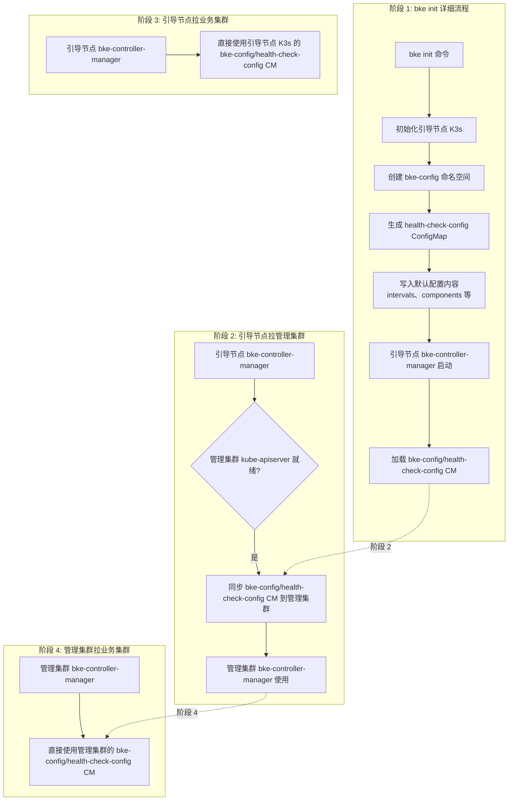
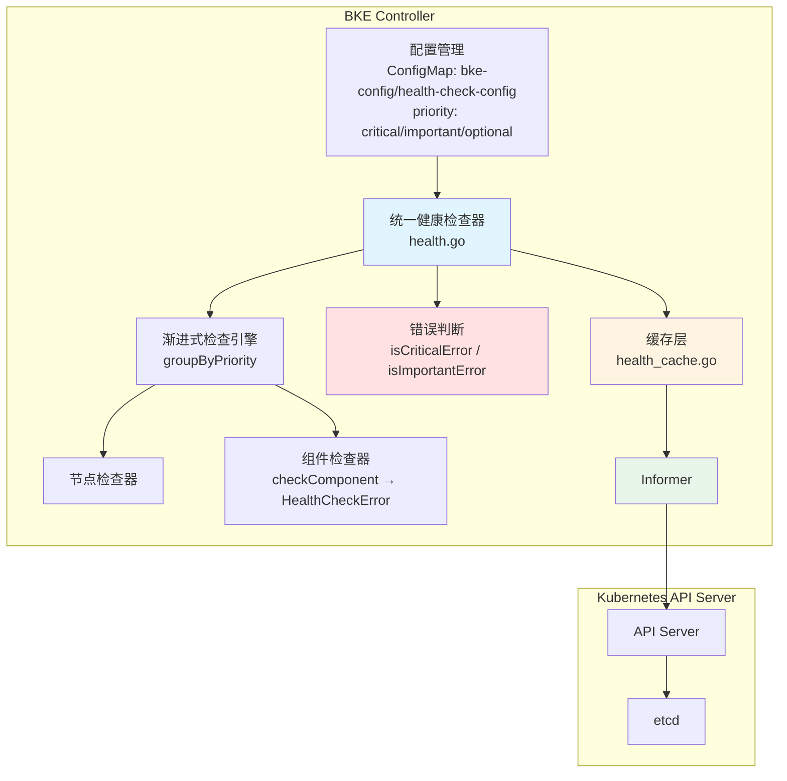
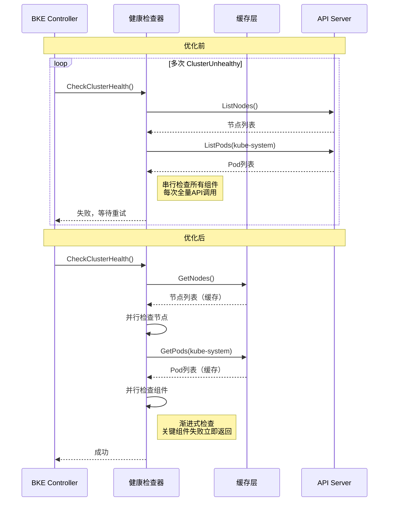
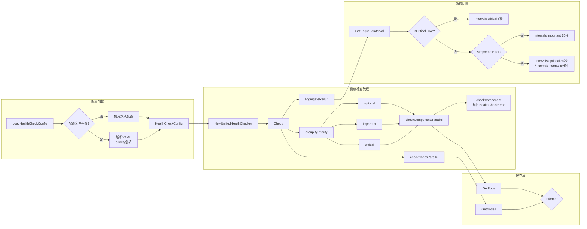
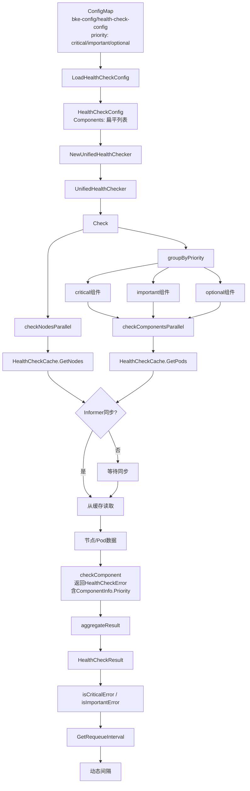
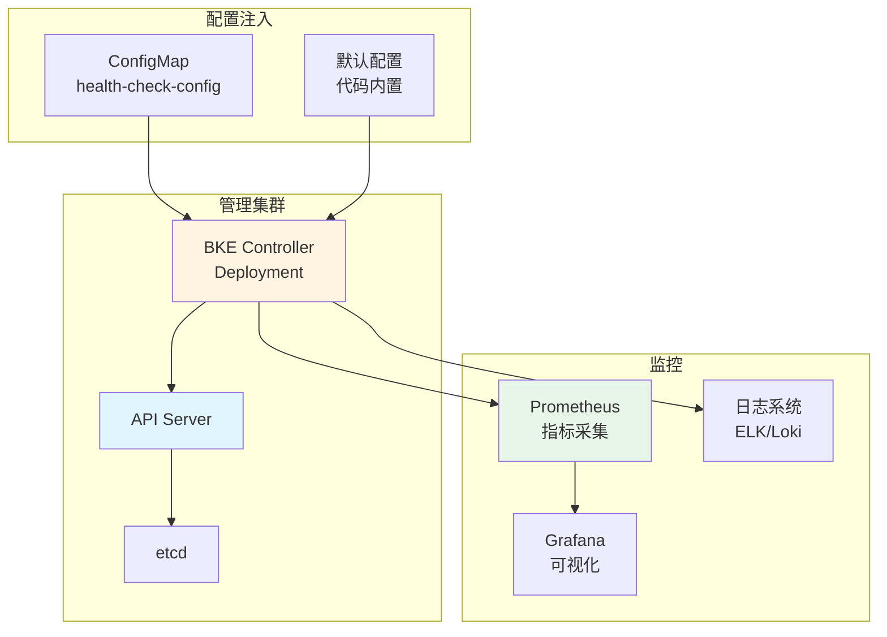
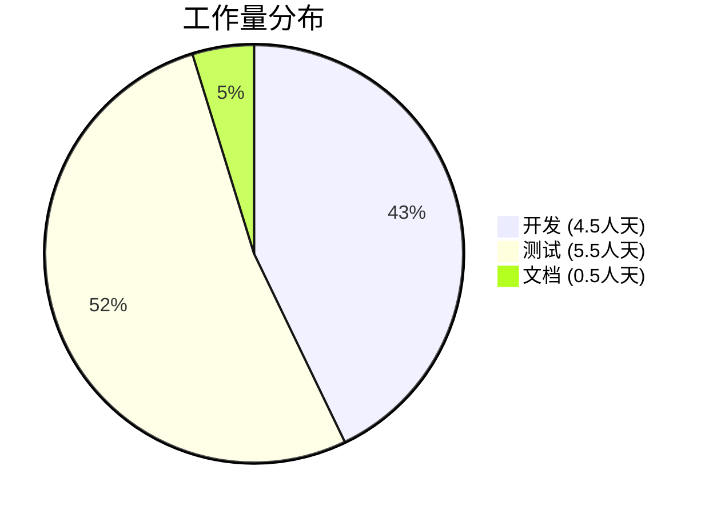
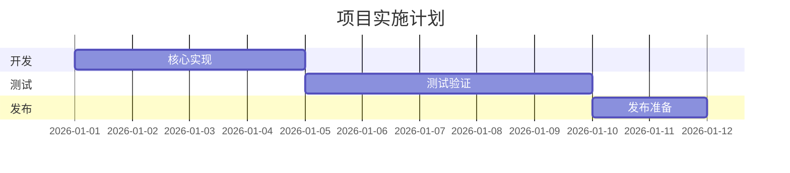
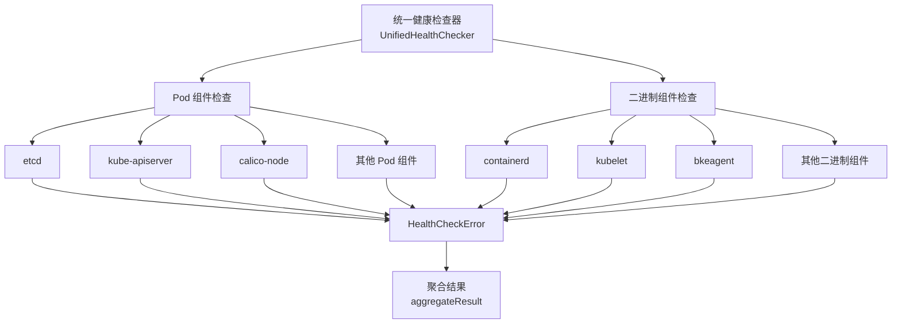
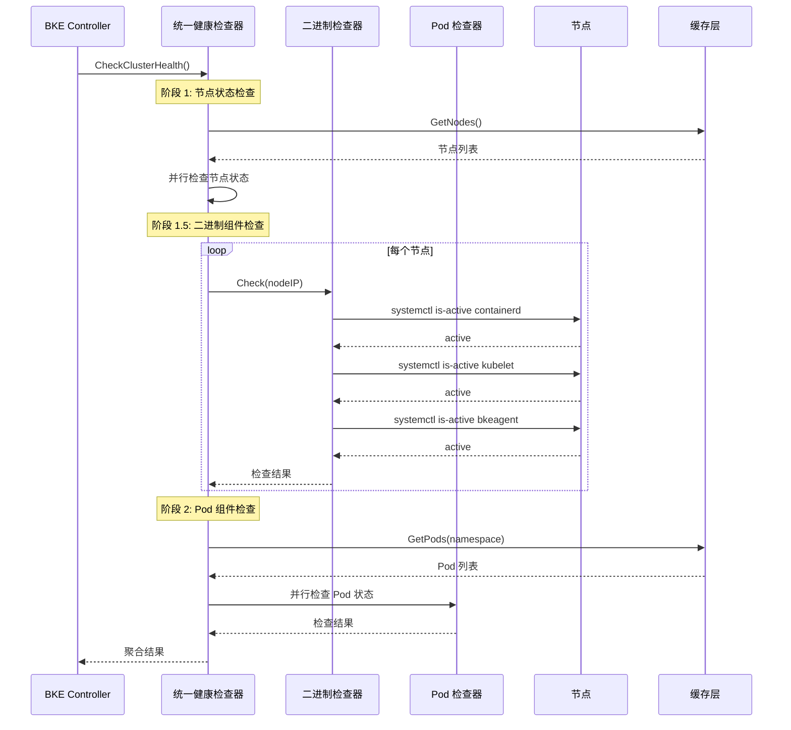

# 健康检查收敛性能优化

## 摘要

本提案旨在优化 BKE 集群创建过程中的健康检查收敛时间，将其从当前的 7 分 14 秒显著缩短。

当前健康检查存在以下问题：

1. **串行检查**：所有节点和组件串行检查，耗时长
2. **无优先级**：关键组件和非关键组件同等对待
3. **固定间隔**：RequeueAfter 固定为 10 秒，无法根据失败原因动态调整
4. **无缓存**：每次检查都重新获取所有 Pod 状态，API 调用频繁
5. **Master NotReady**：oauth-webhook 安装顺序不当导致 API Server 认证失败，Master 节点反复 NotReady

解决方案包括：

1. **渐进式检查**：按优先级分阶段检查（节点 → 关键组件 → 重要组件 → 非关键组件），关键组件失败立即返回
2. **并行化检查**：每个阶段内使用并行检查
3. **缓存机制**：使用 Informer 缓存减少 API 调用（首次同步后零调用）
4. **动态间隔**：根据检查结果动态调整下次检查间隔（5s/15s/30s/5m）
5. **oauth-webhook 安装顺序优化**：调整安装顺序，先部署 webhook 并等待就绪，再配置 API Server，避免认证失败

## 动机

### 为什么需要这个提案？

健康检查收敛是 BKE 集群创建过程中的第二大性能瓶颈，占总耗时的 24.5%。在 64 节点集群的测试中，健康检查阶段耗时 7 分 14 秒，期间出现 33 次 ClusterUnhealthy 警告，Master 节点反复 NotReady。

### 解决什么问题？

**当前性能数据（64 节点集群）：**

| 指标 | 当前值 |
| ------ | -------- |
| 健康检查收敛时间 | 7 分 14 秒 |
| ClusterUnhealthy 次数 | 33 次 |
| Master NotReady 次数 | 3 次 |
| API 调用次数 | ~100 次/检查 |
| 关键组件失败检测时间 | ~7 分钟 |

**关键阻塞组件**：metrics-server, openfuyao-system-controller

**根因分析：**

1. **Master NotReady 问题（oauth-webhook 安装顺序问题）**
   - **现象**：Calico 部署后 4-7 分钟，Master 节点依次 NotReady
   - **异常组件**：calico-node, etcd, kube-apiserver, kube-controller-manager
   - **每次异常持续**：30-60 秒后自动恢复
   
   **真实根因**：
   - oauth-webhook 安装顺序不当导致 API Server 认证失败
   - 当前安装顺序：
     ```
     1. generate_oauth_webhook_tls_cert()  # 生成证书
     2. modify_kubernetes_manifests()      # 修改 API Server 配置 ← API Server 重启
     3. install_oauth_webhook()            # 安装 webhook ← 此时还未就绪
     4. install_oauth_server()             # 安装 OAuth Server
     ```
   - 问题：步骤 2 修改 API Server 配置导致重启，但步骤 3 才安装 webhook，导致 API Server 重启时 webhook 不可用，认证失败，Node NotReady
   
   **依赖关系分析**：
   ```
   oauth-server ────────────> oauth-webhook
           │                        │
           │                        └──> kube-apiserver (webhook config)
   ```
   - oauth-webhook 的 Ready **不依赖** oauth-server
   - oauth-server 依赖 oauth-webhook（反向依赖）
   - kube-apiserver 依赖 oauth-webhook（用于 TokenReview 认证）
   
   **解决方案**：调整安装顺序
   ```
   1. generate_oauth_webhook_tls_cert()  # 生成证书
   2. install_oauth_webhook()            # 先安装 webhook
   3. wait_oauth_webhook_ready()         # 等待 webhook Ready
   4. modify_kubernetes_manifests()      # 再修改 API Server 配置 ← API Server 重启
   5. install_oauth_server()             # 最后安装 server
   ```
   这样可以确保 API Server 重启时 oauth-webhook 已就绪，避免认证失败。

2. **关键组件长时间 Pending**
   - openfuyao-system-controller：Pending 总时长约 7 分钟
   - metrics-server：Pending 总时长约 7 分钟
   - 原因：镜像拉取慢、调度延迟、依赖组件未就绪

3. **健康检查机制问题**
   - 串行检查所有节点和组件
   - 无优先级区分
   - 固定 10 秒重试间隔
   - 无缓存机制，API 调用频繁

**影响：**

- 用户体验：集群创建最后 7 分钟无进展
- 稳定性风险：Master NotReady 可能导致控制面不可用
- 资源浪费：频繁 API 调用增加 API Server 负载

### 可衡量目标

1. 健康检查收敛时间：显著缩短
2. Master NotReady 次数大幅减少
3. API 调用次数：大幅降低
4. 关键组件失败检测时间：显著缩短
5. ClusterUnhealthy 次数：大幅减少

### 非目标

1. 优化 Calico 本身的部署时间（由其它提案处理）
2. 修改 Kubernetes 控制面组件的行为
3. 改变健康检查的业务逻辑（哪些组件需要检查）
4. 修改 oauth-server 或 oauth-webhook 的功能逻辑（仅调整安装顺序）

## 提案

### 用户故事

**故事 1：快速集群创建**
作为集群管理员，我希望集群创建过程中的健康检查能够快速收敛，以便在更短的时间内获得可用的集群。

*当前状态：* 健康检查耗时 7 分 14 秒，期间 Master 节点反复 NotReady
*期望状态：* 健康检查时间显著缩短，Master NotReady 大幅减少

**故事 2：稳定的控制面**
作为集群管理员，我希望在集群创建过程中控制面保持稳定，避免 Master 节点 NotReady。

*当前状态：* oauth-webhook 安装顺序不当导致 API Server 认证失败，Master 节点反复 NotReady（3 次）
*期望状态：* 控制面保持稳定，NotReady 事件 = 0

**故事 3：可配置的健康检查**
作为集群管理员，我希望能够根据实际需求配置健康检查的组件清单和检查间隔。

*当前状态：* 健康检查配置硬编码
*期望状态：* 通过配置文件灵活定义检查组件和间隔

### 注意事项/约束

1. **向后兼容**：必须保持与现有健康检查逻辑的兼容性
2. **配置灵活**：支持通过配置文件自定义检查组件和间隔
3. **缓存一致性**：缓存数据需要在合理时间内刷新，避免使用过期数据
4. **错误处理**：关键组件失败必须立即返回，非关键组件失败可以记录警告

### 实现方法

#### 优化 1: 渐进式检查架构

**架构设计：**

```txt
┌─────────────────────────────────────────────────────────────┐
│                    统一健康检查架构                         │
├─────────────────────────────────────────────────────────────┤
│                                                             │
│  1. 初始化阶段                                              │
│     ├─ 初始化缓存                                           │
│     └─ 加载检查配置                                         │
│                                                             │
│  2. 渐进式检查阶段（按优先级分 4 个阶段）                   │
│     ├─ 阶段 1: 节点状态检查（并行）                         │
│     ├─ 阶段 2: 关键组件检查（并行）                         │
│     ├─ 阶段 3: 重要组件检查（并行）                         │
│     └─ 阶段 4: 非关键组件检查（并行）                       │
│                                                             │
│  3. 结果处理阶段                                            │
│     ├─ 聚合检查结果                                         │
│     ├─ 动态调整下次检查间隔                                 │
│     └─ 更新缓存                                             │
│                                                             │
└─────────────────────────────────────────────────────────────┘
```

**核心设计原则：**

| 原则 | 说明 | 对应优化点 |
| ------ | ------ | ----------- |
| **渐进式** | 按优先级分阶段检查，关键组件失败立即返回 | 渐进式检查 + 优先级检查 |
| **并行化** | 每个阶段内使用并行检查 | 并行检查 |
| **缓存化** | 使用缓存减少 API 调用 | 缓存机制 |
| **智能化** | 根据检查结果动态调整间隔 | 动态间隔 |

#### 优化 2: oauth-webhook 安装顺序优化

**问题背景：**

oauth-webhook 是 openfuyao 前端的认证组件，配置在 kube-apiserver 的 `--authentication-token-webhook-config-file` 参数中。当前安装顺序不当导致 API Server 重启时 webhook 未就绪，认证失败，Master 节点 NotReady。

**依赖关系分析：**

```txt
oauth-server ────────────> oauth-webhook
        │                        │
        │                        └──> kube-apiserver (webhook config)
```

- oauth-webhook 的 Ready **不依赖** oauth-server
- oauth-server 依赖 oauth-webhook（反向依赖）
- kube-apiserver 依赖 oauth-webhook（用于 TokenReview 认证）

**当前安装顺序（有问题）：**

```bash
install_oauth_webhook_and_oauth_server() {
    # 1. 生成证书
    generate_oauth_webhook_tls_cert
    
    # 2. 修改 API Server 配置 ← API Server 重启
    modify_kubernetes_manifests
    
    # 3. 安装 webhook ← 此时还未就绪
    install_oauth_webhook
    
    # 4. 安装 OAuth Server
    install_oauth_server
}
```

**问题：** 步骤 2 修改 API Server 配置导致重启，但步骤 3 才安装 webhook，导致 API Server 重启时 webhook 不可用，认证失败，Node NotReady。

**优化后安装顺序：**

```bash
install_oauth_webhook_and_oauth_server() {
    # 1. 生成证书
    generate_oauth_webhook_tls_cert
    
    # 2. 先安装 webhook
    install_oauth_webhook
    
    # 3. 等待 webhook Ready
    kubectl wait --for=condition=ready pod -l app=oauth-webhook \
        -n openfuyao-system --timeout=300s
    
    # 4. 再修改 API Server 配置 ← API Server 重启
    modify_kubernetes_manifests
    
    # 5. 最后安装 OAuth Server
    install_oauth_server
}
```

**优势：**

1. **API Server 重启时 webhook 已就绪**：避免认证失败
2. **不影响安全性**：webhook 配置不变，仅调整安装顺序
3. **实现简单**：只需调整安装步骤顺序
4. **可靠性高**：确保 webhook 就绪后再配置 API Server

**实施要点：**

1. 在 `install_oauth_webhook()` 后添加 `wait_oauth_webhook_ready()` 函数
2. 将 `modify_kubernetes_manifests()` 移到 `wait_oauth_webhook_ready()` 之后
3. 确保 `install_oauth_server()` 在最后执行

**预期效果：**

- Master NotReady 次数从 3 次减少至 0 次
- 健康检查收敛时间减少约 2-3 分钟（避免 NotReady 导致的重试）

#### 优化 3: 统一健康检查器实现

**文件**: `pkg/kube/health.go`

##### 2.1 类型定义：优先级、组件名称、组件信息、错误类型

```go
// HealthCheckPriority 健康检查优先级，来自配置文件
type HealthCheckPriority int

const (
    PriorityCritical  HealthCheckPriority = iota // 关键：控制面组件
    PriorityImportant                            // 重要：网络、DNS 组件
    PriorityOptional                             // 非关键：Addon、监控组件
)

func (p HealthCheckPriority) String() string {
    switch p {
    case PriorityCritical:
        return "critical"
    case PriorityImportant:
        return "important"
    case PriorityOptional:
        return "optional"
    default:
        return "unknown"
    }
}

// ParsePriority 解析优先级字符串（配置文件 → 枚举）
func ParsePriority(s string) (HealthCheckPriority, error) {
    switch strings.ToLower(s) {
    case "critical":
        return PriorityCritical, nil
    case "important":
        return PriorityImportant, nil
    case "optional":
        return PriorityOptional, nil
    default:
        return PriorityOptional, fmt.Errorf("unknown priority: %s", s)
    }
}

// ComponentName 组件名称，唯一标识一个组件
type ComponentName string

const (
    NameEtcd                  ComponentName = "etcd"
    NameKubeAPIServer         ComponentName = "kube-apiserver"
    NameKubeControllerManager ComponentName = "kube-controller-manager"
    NameKubeScheduler         ComponentName = "kube-scheduler"
    NameCalicoNode            ComponentName = "calico-node"
    NameCalicoKubeControllers ComponentName = "calico-kube-controllers"
    NameKubeProxy             ComponentName = "kube-proxy"
    NameCoreDNS               ComponentName = "coredns"
    NameMetricsServer         ComponentName = "metrics-server"
    NameIngressNginx          ComponentName = "ingress-nginx"
    NameConsoleService        ComponentName = "console-service"
    NameOAuthServer           ComponentName = "oauth-server"
    NameOAuthWebhook          ComponentName = "oauth-webhook"
    NameLocalHarbor           ComponentName = "local-harbor"
    NamePrometheus            ComponentName = "prometheus"
    NameAlertmanager          ComponentName = "alertmanager"
    NameNodeExporter          ComponentName = "node-exporter"
)

// ComponentCheck 组件检查配置（来自配置文件）
type ComponentCheck struct {
    Name      ComponentName       `yaml:"name"`
    Namespace string              `yaml:"namespace"`
    Prefixes  []string            `yaml:"prefixes"`
    Priority  HealthCheckPriority `yaml:"priority"` // 必填，来自配置
}

// UnmarshalYAML 自定义反序列化，解析 priority 字符串
func (c *ComponentCheck) UnmarshalYAML(unmarshal func(interface{}) error) error {
    type Alias ComponentCheck
    aux := &struct {
        Priority string `yaml:"priority"`
        *Alias
    }{
        Alias: (*Alias)(c),
    }

    if err := unmarshal(aux); err != nil {
        return err
    }

    if aux.Priority == "" {
        return fmt.Errorf("component %q: priority is required", c.Name)
    }

    p, err := ParsePriority(aux.Priority)
    if err != nil {
        return fmt.Errorf("component %q: %w", c.Name, err)
    }
    c.Priority = p

    return nil
}

// ComponentInfo 组件运行时信息（携带优先级）
type ComponentInfo struct {
    Name      ComponentName
    Namespace string
    Prefix    string
    PodName   string
    Priority  HealthCheckPriority
}

func (c ComponentInfo) String() string {
    if c.Namespace == "" {
        return string(c.Name)
    }
    if c.PodName != "" {
        return fmt.Sprintf("%s/%s", c.Namespace, c.PodName)
    }
    return fmt.Sprintf("%s/%s(%s)", c.Namespace, c.Prefix, c.Name)
}

// HealthCheckError 带组件信息的健康检查错误
type HealthCheckError struct {
    Component ComponentInfo
    Reason    string // PodNotReady, ImagePullBackOff, PodNotFound...
    Err       error
}

func (e *HealthCheckError) Error() string {
    return fmt.Sprintf("[%s] %s (%s): %v",
        e.Component.Priority, e.Component, e.Reason, e.Err)
}

func (e *HealthCheckError) Unwrap() error { return e.Err }

// isCriticalError 判断错误是否包含关键优先级组件
func isCriticalError(err error) bool {
    return hasPriority(err, PriorityCritical)
}

// isImportantError 判断错误是否包含重要优先级组件
func isImportantError(err error) bool {
    return hasPriority(err, PriorityImportant)
}

// hasPriorityError 递归检查错误链中是否包含指定优先级
func hasPriority(err error, target HealthCheckPriority) bool {
    if err == nil {
        return false
    }

    var hcErr *HealthCheckError
    if errors.As(err, &hcErr) && hcErr.Component.Priority == target {
        return true
    }

    if agg, ok := err.(kerrors.Aggregate); ok {
        for _, e := range agg.Errors() {
            if hasPriority(e, target) {
                return true
            }
        }
    }

    return false
}

// ComponentErrorsByPriority 提取指定优先级的所有错误（日志/监控用）
func ComponentErrorsByPriority(err error, priority HealthCheckPriority) []*HealthCheckError {
    var result []*HealthCheckError

    var hcErr *HealthCheckError
    if errors.As(err, &hcErr) && hcErr.Component.Priority == priority {
        result = append(result, hcErr)
    }

    if agg, ok := err.(kerrors.Aggregate); ok {
        for _, e := range agg.Errors() {
            result = append(result, ComponentErrorsByPriority(e, priority)...)
        }
    }

    return result
}

// newComponentError 从 ComponentCheck 构造 HealthCheckError
func newComponentError(check ComponentCheck, podName, reason string, err error) *HealthCheckError {
    return &HealthCheckError{
        Component: ComponentInfo{
            Name:      check.Name,
            Namespace: check.Namespace,
            Prefix:    podName,
            PodName:   podName,
            Priority:  check.Priority,
        },
        Reason: reason,
        Err:    err,
    }
}

// newNodeError 构造节点错误（关键优先级）
func newNodeError(nodeName, reason string, err error) *HealthCheckError {
    return &HealthCheckError{
        Component: ComponentInfo{
            Name:     ComponentName(nodeName),
            Priority: PriorityCritical,
        },
        Reason: reason,
        Err:    err,
    }
}
```

##### 2.2 配置结构

```go
// IntervalConfig 检查间隔配置
type IntervalConfig struct {
    Critical  time.Duration `yaml:"critical"`
    Important time.Duration `yaml:"important"`
    Optional  time.Duration `yaml:"optional"`
    Normal    time.Duration `yaml:"normal"`
}

// HealthCheckConfig 健康检查配置
type HealthCheckConfig struct {
    CacheSyncTimeout time.Duration    `yaml:"cacheSyncTimeout"`
    Intervals        IntervalConfig   `yaml:"intervals"`
    Components       []ComponentCheck `yaml:"components"`
}

// HealthCheckResult 健康检查结果
type HealthCheckResult struct {
    NodeErrors               []error
    CriticalComponentErrors  []error
    ImportantComponentErrors []error
    OptionalComponentErrors  []error
}

// UnifiedHealthChecker 统一健康检查器
type UnifiedHealthChecker struct {
    kubeClient kubernetes.Interface
    log        *log.Logger
    cache      *HealthCheckCache
    config     HealthCheckConfig
}

// NewUnifiedHealthChecker 创建健康检查器
func NewUnifiedHealthChecker(kubeClient kubernetes.Interface, log *log.Logger, config HealthCheckConfig) *UnifiedHealthChecker {
    return &UnifiedHealthChecker{
        kubeClient: kubeClient,
        log:        log,
        cache:      NewHealthCheckCache(config.CacheSyncTimeout),
        config:     config,
    }
}

// DefaultHealthCheckConfig 默认配置
func DefaultHealthCheckConfig() HealthCheckConfig {
    return HealthCheckConfig{
        CacheSyncTimeout: 30 * time.Second,
        Intervals: IntervalConfig{
            Critical:  5 * time.Second,
            Important: 15 * time.Second,
            Optional:  30 * time.Second,
            Normal:    5 * time.Minute,
        },
        Components: []ComponentCheck{
            // 控制面组件（critical）
            {Name: NameEtcd, Namespace: "kube-system", Prefixes: []string{"etcd-"}, Priority: PriorityCritical},
            {Name: NameKubeAPIServer, Namespace: "kube-system", Prefixes: []string{"kube-apiserver-"}, Priority: PriorityCritical},
            {Name: NameKubeControllerManager, Namespace: "kube-system", Prefixes: []string{"kube-controller-manager-"}, Priority: PriorityCritical},
            {Name: NameKubeScheduler, Namespace: "kube-system", Prefixes: []string{"kube-scheduler-"}, Priority: PriorityCritical},
            
            // 网络组件（important）
            {Name: NameCalicoNode, Namespace: "kube-system", Prefixes: []string{"calico-node"}, Priority: PriorityImportant},
            {Name: NameCalicoKubeControllers, Namespace: "kube-system", Prefixes: []string{"calico-kube-controllers"}, Priority: PriorityImportant},
            {Name: NameKubeProxy, Namespace: "kube-system", Prefixes: []string{"kube-proxy-"}, Priority: PriorityImportant},
            
            // DNS 组件（important）
            {Name: NameCoreDNS, Namespace: "kube-system", Prefixes: []string{"coredns"}, Priority: PriorityImportant},
        },
    }
}

// LoadHealthCheckConfig 从 ConfigMap 加载配置
func LoadHealthCheckConfig(ctx context.Context, c client.Client) HealthCheckConfig {
    cm := &corev1.ConfigMap{}
    err := c.Get(ctx, client.ObjectKey{
        Namespace: "cluster-system",
        Name:      "health-check-config",
    }, cm)
    if err != nil {
        log.Warnf("failed to load health check config from ConfigMap, using default: %v", err)
        return DefaultHealthCheckConfig()
    }

    configData, ok := cm.Data["config.yaml"]
    if !ok {
        log.Warnf("config.yaml not found in ConfigMap, using default")
        return DefaultHealthCheckConfig()
    }

    var config HealthCheckConfig
    if err := yaml.Unmarshal([]byte(configData), &config); err != nil {
        log.Warnf("failed to parse health check config, using default: %v", err)
        return DefaultHealthCheckConfig()
    }

    if len(config.Components) == 0 {
        config.Components = DefaultHealthCheckConfig().Components
    }

    return config
}
```

##### 2.3 检查流程

```go
// CheckClusterHealth 统一健康检查入口
func CheckClusterHealth(ctx context.Context, c client.Client, kubeClient kubernetes.Interface, log *log.Logger, cluster *bkev1beta1.BKECluster, currentVersion string, bkeNodes bkev1beta1.BKENodes) error {
    config := LoadHealthCheckConfig(ctx, c)
    checker := NewUnifiedHealthChecker(kubeClient, log, config)
    return checker.Check(cluster, currentVersion, bkeNodes)
}

// Check 执行统一健康检查
func (h *UnifiedHealthChecker) Check(cluster *bkev1beta1.BKECluster, currentVersion string, bkeNodes bkev1beta1.BKENodes) error {
    result := &HealthCheckResult{}

    // 阶段 1: 节点状态检查（并行）
    if err := h.checkNodesParallel(cluster, currentVersion, bkeNodes, result); err != nil {
        result.NodeErrors = append(result.NodeErrors, err)
        return h.aggregateResult(result)
    }

    // 阶段 2: 按优先级分组检查组件
    critical, important, optional := h.groupByPriority()

    // 关键组件（并行，失败立即返回）
    if err := h.checkComponentsParallel(critical, result); err != nil {
        result.CriticalComponentErrors = append(result.CriticalComponentErrors, err)
        return h.aggregateResult(result)
    }

    // 重要组件（并行，失败记录警告）
    if err := h.checkComponentsParallel(important, result); err != nil {
        h.log.Warn("important components check failed: %v", err)
        result.ImportantComponentErrors = append(result.ImportantComponentErrors, err)
    }

    // 非关键组件（并行，失败记录调试信息）
    if err := h.checkComponentsParallel(optional, result); err != nil {
        h.log.Debug("optional components check failed: %v", err)
        result.OptionalComponentErrors = append(result.OptionalComponentErrors, err)
    }

    return h.aggregateResult(result)
}

// groupByPriority 将组件列表按优先级分组
func (h *UnifiedHealthChecker) groupByPriority() (critical, important, optional []ComponentCheck) {
    for _, c := range h.config.Components {
        switch c.Priority {
        case PriorityCritical:
            critical = append(critical, c)
        case PriorityImportant:
            important = append(important, c)
        case PriorityOptional:
            optional = append(optional, c)
        }
    }
    return
}

// checkNodesParallel 并行检查节点状态
func (h *UnifiedHealthChecker) checkNodesParallel(cluster *bkev1beta1.BKECluster, currentVersion string, bkeNodes bkev1beta1.BKENodes, result *HealthCheckResult) error {
    nodes, err := h.cache.GetNodes(h.kubeClient)
    if err != nil {
        return err
    }

    var wg sync.WaitGroup
    errChan := make(chan error, len(nodes.Items))

    for _, node := range nodes.Items {
        nodeIP := GetNodeIP(&node)

        if bkeNodes.GetNodeStateNeedSkip(nodeIP) {
            continue
        }

        wg.Add(1)
        go func(n corev1.Node) {
            defer wg.Done()
            if err := h.checkNode(&n, currentVersion); err != nil {
                errChan <- err
            }
        }(node)
    }

    wg.Wait()
    close(errChan)

    for err := range errChan {
        result.NodeErrors = append(result.NodeErrors, err)
    }

    if len(result.NodeErrors) > 0 {
        return kerrors.NewAggregate(result.NodeErrors)
    }

    return nil
}

// checkComponentsParallel 按优先级并行检查组件
func (h *UnifiedHealthChecker) checkComponentsParallel(components []ComponentCheck, result *HealthCheckResult) error {
    var wg sync.WaitGroup
    errChan := make(chan error, len(components))

    for _, check := range components {
        wg.Add(1)
        go func(c ComponentCheck) {
            defer wg.Done()
            if err := h.checkComponent(c); err != nil {
                errChan <- err
            }
        }(check)
    }

    wg.Wait()
    close(errChan)

    var errs []error
    for err := range errChan {
        errs = append(errs, err)
    }

    if len(errs) > 0 {
        return kerrors.NewAggregate(errs)
    }

    return nil
}

// checkComponent 检查单个组件健康状态，返回带组件信息的 HealthCheckError
func (h *UnifiedHealthChecker) checkComponent(check ComponentCheck) error {
    pods, err := h.cache.GetPods(check.Namespace)
    if err != nil {
        return fmt.Errorf("failed to get pods in %s: %w", check.Namespace, err)
    }

    var errs []error
    for _, prefix := range check.Prefixes {
        matchedPods := filterPodsByPrefix(pods, prefix)
        if len(matchedPods) == 0 {
            errs = append(errs, newComponentError(check, "", "PodNotFound",
                fmt.Errorf("no pods with prefix %q in %s", prefix, check.Namespace)))
            continue
        }

        for _, pod := range matchedPods {
            if err := h.checkPodHealth(pod); err != nil {
                errs = append(errs, newComponentError(check, pod.Name,
                    getPodUnhealthyReason(pod), err))
            }
        }
    }

    return kerrors.NewAggregate(errs)
}

// checkNode 检查节点健康状态，返回带组件信息的 HealthCheckError
func (h *UnifiedHealthChecker) checkNode(node *corev1.Node, currentVersion string) error {
    if !NodeReady(node) {
        return newNodeError(node.Name, "NodeNotReady",
            fmt.Errorf("node %s is not ready", node.Name))
    }

    if node.Status.NodeInfo.KubeletVersion != currentVersion {
        return newNodeError(node.Name, "VersionMismatch",
            fmt.Errorf("expected version %s, got %s",
                currentVersion, node.Status.NodeInfo.KubeletVersion))
    }

    return nil
}

// aggregateResult 聚合检查结果
func (h *UnifiedHealthChecker) aggregateResult(result *HealthCheckResult) error {
    var typedErrs []error
    typedErrs = append(typedErrs, result.NodeErrors...)
    typedErrs = append(typedErrs, result.CriticalComponentErrors...)
    typedErrs = append(typedErrs, result.ImportantComponentErrors...)
    typedErrs = append(typedErrs, result.OptionalComponentErrors...)

    if len(typedErrs) == 0 {
        h.log.Info("cluster health check pass")
        return nil
    }

    agg := kerrors.NewAggregate(typedErrs)

    if criticalErrs := ComponentErrorsByPriority(agg, PriorityCritical); len(criticalErrs) > 0 {
        h.log.Error("critical component errors: %v", criticalErrs)
    }
    if importantErrs := ComponentErrorsByPriority(agg, PriorityImportant); len(importantErrs) > 0 {
        h.log.Warn("important component errors: %v", importantErrs)
    }
    if optionalErrs := ComponentErrorsByPriority(agg, PriorityOptional); len(optionalErrs) > 0 {
        h.log.Debug("optional component errors: %v", optionalErrs)
    }

    return agg
}

// GetRequeueInterval 根据检查结果动态调整间隔
func GetRequeueInterval(result *HealthCheckResult, intervals IntervalConfig) time.Duration {
    if len(result.NodeErrors) > 0 || len(result.CriticalComponentErrors) > 0 {
        return intervals.Critical
    }
    if len(result.ImportantComponentErrors) > 0 {
        return intervals.Important
    }
    if len(result.OptionalComponentErrors) > 0 {
        return intervals.Optional
    }
    return intervals.Normal
}
```

##### 2.4 信息流

```txt
配置文件 (priority: critical)
    ↓
ComponentCheck.Priority       ← HealthCheckPriority（来自配置）
    ↓
ComponentInfo.Priority        ← 直接传递
    ↓
HealthCheckError.Component.Priority
    ↓
isCriticalError() / isImportantError()
    ↓
GetRequeueInterval() → 动态间隔
```

#### 优化 4: 健康检查缓存实现

##### 推荐方案：基于 Informer 的实时缓存

**核心思路**：使用 client-go 提供的 `SharedInformerFactory`，自动维护本地缓存，实现毫秒级实时性。

**架构设计**：

```txt
┌─────────────────────────────────────────────────────────┐
│  Informer 层（client-go 提供）                          │
│  ├─ NodeInformer                                        │
│  │  └─ 自动 Watch Node 资源，维护本地缓存               │
│  ├─ PodInformer                                         │
│  │  └─ 自动 Watch Pod 资源，维护本地缓存                │
│  └─ 自动处理重连、同步、事件去重                        │
└─────────────────────────────────────────────────────────┘
                            ↓
┌─────────────────────────────────────────────────────────┐
│  健康检查层                                             │
│  ├─ 直接从 Informer 本地缓存读取（零延迟）              │
│  ├─ 无需 API 调用                                       │
│  └─ 实时感知资源变化                                    │
└─────────────────────────────────────────────────────────┘
```

**文件**: `pkg/kube/health_cache.go`

```go
package kube

import (
    "context"
    "time"
    
    corev1 "k8s.io/api/core/v1"
    coreinformers "k8s.io/client-go/informers/core/v1"
    "k8s.io/client-go/kubernetes"
    corelisters "k8s.io/client-go/listers/core/v1"
    "k8s.io/client-go/tools/cache"
)

// HealthChecker 使用 Informer 的健康检查器
type HealthChecker struct {
    nodeLister  corelisters.NodeLister
    podLister   corelisters.PodLister
    informerSynced cache.InformerSynced
}

// NewHealthChecker 创建健康检查器
func NewHealthChecker(ctx context.Context, client kubernetes.Interface) (*HealthChecker, error) {
    // 创建 SharedInformerFactory
    factory := informers.NewSharedInformerFactory(client, 0)
    
    // 获取 Node 和 Pod Informer
    nodeInformer := factory.Core().V1().Nodes()
    podInformer := factory.Core().V1().Pods()
    
    // 启动 Informer
    factory.Start(ctx.Done())
    
    // 等待缓存同步
    if !cache.WaitForCacheSync(ctx.Done(), 
        nodeInformer.Informer().HasSynced,
        podInformer.Informer().HasSynced) {
        return nil, fmt.Errorf("failed to sync informer cache")
    }
    
    return &HealthChecker{
        nodeLister: nodeInformer.Lister(),
        podLister:  podInformer.Lister(),
        informerSynced: func() bool {
            return nodeInformer.Informer().HasSynced() && 
                   podInformer.Informer().HasSynced()
        },
    }, nil
}

// GetNodes 从 Informer 缓存获取节点列表
func (h *HealthChecker) GetNodes() ([]*corev1.Node, error) {
    // 零延迟，直接从 Informer 缓存读取
    return h.nodeLister.List(labels.Everything())
}

// GetPods 从 Informer 缓存获取 Pod 列表
func (h *HealthChecker) GetPods(namespace string) ([]*corev1.Pod, error) {
    // 零延迟，直接从 Informer 缓存读取
    return h.podLister.Pods(namespace).List(labels.Everything())
}

// GetNode 获取单个节点
func (h *HealthChecker) GetNode(name string) (*corev1.Node, error) {
    return h.nodeLister.Get(name)
}

// GetPod 获取单个 Pod
func (h *HealthChecker) GetPod(namespace, name string) (*corev1.Pod, error) {
    return h.podLister.Pods(namespace).Get(name)
}
```

**预期效果**：

| 指标 | 固定 TTL | Informer | 提升 |
| ------ | --------- | ---------- | ------ |
| 实时性 | 最多延迟 30s | **毫秒级** | 100x |
| API 调用 | 每次全量返回 | **首次同步后零调用** | 减少 99% |
| 健康检查时间 | ~7 分钟 | **显著缩短** | 大幅节省 |
| 开发成本 | 0.5 天 | **1-2 天** | +1 天 |

##### 选型建议

**优先选择 Informer**：实时性优势明显，API 负载最低

#### 优化 5: 配置文件

**配置存储位置**: ConfigMap `bke-config/health-check-config`

**ConfigMap 同步机制：**

健康检查配置通过 ConfigMap 存储，并在不同集群间同步：


```mermaid
graph TB
    subgraph "阶段 1: bke init 详细流程"
        A[bke init 命令] --> B[初始化引导节点 K3s]
        B --> C[创建 bke-config 命名空间]
        C --> D[生成 health-check-config ConfigMap]
        D --> E[写入默认配置内容<br/>intervals、components 等]
        E --> F[引导节点 bke-controller-manager 启动]
        F --> G[加载 bke-config/health-check-config CM]
    end
    
    subgraph "阶段 2: 引导节点拉管理集群"
        H[引导节点 bke-controller-manager] --> I{管理集群 kube-apiserver 就绪?}
        I -->|是| J[同步 bke-config/health-check-config CM 到管理集群]
        J --> K[管理集群 bke-controller-manager 使用]
    end
    
    subgraph "阶段 3: 引导节点拉业务集群"
        L[引导节点 bke-controller-manager] --> M[直接使用引导节点 K3s 的 bke-config/health-check-config CM]
    end
    
    subgraph "阶段 4: 管理集群拉业务集群"
        N[管理集群 bke-controller-manager] --> O[直接使用管理集群的 bke-config/health-check-config CM]
    end
    
    G -.->|阶段 2| J
    K -.->|阶段 4| O
```

**同步流程说明：**

| 阶段 | Controller 位置 | 配置来源 | 同步动作 |
|------|----------------|---------|---------|
| 1. bke init | 引导节点 (K3s) | - | 创建 bke-config 命名空间，生成 health-check-config ConfigMap，写入默认配置 |
| 2. 引导节点拉管理集群 | 引导节点 (K3s) | 引导节点 K3s 的 ConfigMap | 同步到管理集群的 bke-config 命名空间 |
| 3. 引导节点拉业务集群 | 引导节点 (K3s) | 引导节点 K3s 的 ConfigMap | 直接使用（无需同步） |
| 4. 管理集群拉业务集群 | 管理集群 | 管理集群的 ConfigMap | 直接使用（无需同步） |

**ConfigMap 定义**（示例）：

```yaml
apiVersion: v1
kind: ConfigMap
metadata:
  name: health-check-config
  namespace: bke-config
data:
  config.yaml: |
    # 检查间隔
    intervals:
      critical: 5s
      important: 15s
      optional: 30s
      normal: 5m
    
    # 缓存
    cacheSyncTimeout: 30s
    
    # 组件清单（仅包含 openfuyao-core 组件，不包含 addon 组件）
    components:
      # 控制面
      - name: etcd
        namespace: kube-system
        prefixes: [etcd-]
        priority: critical
      - name: kube-apiserver
        namespace: kube-system
        prefixes: [kube-apiserver-]
        priority: critical
      - name: kube-controller-manager
        namespace: kube-system
        prefixes: [kube-controller-manager-]
        priority: critical
      - name: kube-scheduler
        namespace: kube-system
        prefixes: [kube-scheduler-]
        priority: critical
    
      # 网络
      - name: calico-node
        namespace: kube-system
        prefixes: [calico-node]
        priority: important
      - name: calico-kube-controllers
        namespace: kube-system
        prefixes: [calico-kube-controllers]
        priority: important
      - name: kube-proxy
        namespace: kube-system
        prefixes: [kube-proxy-]
        priority: important
    
      # DNS
      - name: coredns
        namespace: kube-system
        prefixes: [coredns]
        priority: important
```

**配置说明：**

| 配置项 | 说明 | 默认值 |
| -------- | ------ | -------- |
| `intervals.critical` | 关键组件失败后的重试间隔 | 5s |
| `intervals.important` | 重要组件失败后的重试间隔 | 15s |
| `intervals.optional` | 非关键组件失败后的重试间隔 | 30s |
| `intervals.normal` | 正常状态下的检查间隔 | 5m |
| `cacheSyncTimeout` | Informer 缓存同步超时时间 | 30s |
| `components` | 组件清单（扁平列表） | 见默认配置 |
| `components[].name` | 组件名称（唯一标识） | 必填 |
| `components[].namespace` | 组件所在命名空间 | 必填 |
| `components[].prefixes` | Pod 前缀列表 | 必填 |
| `components[].priority` | 组件优先级（critical/important/optional） | 必填 |

**配置加载优先级：**

1. 从 `bke-config/health-check-config` ConfigMap 的 `config.yaml` 字段加载配置
2. 如果 ConfigMap 不存在或格式错误，使用默认配置
3. 如果配置文件中 `components` 为空，使用默认组件清单
4. `priority` 字段为必填，缺失时加载失败并回退到默认配置

#### 默认配置

当 ConfigMap 不存在或加载失败时，系统使用代码中内置的默认配置。

**默认配置定义位置**：`pkg/kube/health.go` 中的 `DefaultHealthCheckConfig()` 函数

**默认配置内容**（示例）：

```yaml
# 默认检查间隔
intervals:
  critical: 5s
  important: 15s
  optional: 30s
  normal: 5m

# 默认缓存同步超时
cacheSyncTimeout: 30s

# 默认组件清单（仅包含 openfuyao-core 组件，不包含 addon 组件）
components:
  # 控制面组件（critical）
  - name: etcd
    namespace: kube-system
    prefixes: [etcd-]
    priority: critical
  - name: kube-apiserver
    namespace: kube-system
    prefixes: [kube-apiserver-]
    priority: critical
  - name: kube-controller-manager
    namespace: kube-system
    prefixes: [kube-controller-manager-]
    priority: critical
  - name: kube-scheduler
    namespace: kube-system
    prefixes: [kube-scheduler-]
    priority: critical
  
  # 网络组件（important）
  - name: calico-node
    namespace: kube-system
    prefixes: [calico-node]
    priority: important
  - name: calico-kube-controllers
    namespace: kube-system
    prefixes: [calico-kube-controllers]
    priority: important
  - name: kube-proxy
    namespace: kube-system
    prefixes: [kube-proxy-]
    priority: important
  
  # DNS 组件（important）
  - name: coredns
    namespace: kube-system
    prefixes: [coredns]
    priority: important
```

**默认配置统计**：
- 控制面组件：4 个（critical）
- 网络组件：3 个（important）
- DNS 组件：1 个（important）
- **总计：8 个组件**

**使用场景**：
1. ConfigMap 不存在（首次部署或误删除）
2. ConfigMap 格式错误（YAML 解析失败）
3. ConfigMap 中 `components` 字段为空
4. 需要快速回退到已知配置

**注意事项**：
- 默认配置仅包含 openfuyao-core 组件，不包含 addon 组件
- addon 组件（如 metrics-server、ingress-nginx、console-service 等）的健康检查由其他机制负责
- 修改默认配置需要重新编译和部署 bke-controller-manager
- 生产环境建议通过 ConfigMap 管理配置，便于动态调整

#### Addon 组件健康检查机制

addon 组件的健康检查由 `EnsureAddonDeploy` Phase 中的 `checkAddonHealth()` 函数负责，不在本健康检查框架的范围内。

**检查机制**：
1. `EnsureAddonDeploy` Phase 在部署 addon 组件后，会调用 `checkAddonHealth()` 检查组件健康状态
2. 检查内容包括：Pod 状态、容器状态、资源使用情况等
3. 如果 addon 组件健康检查失败，Phase 会记录警告日志，但不会阻塞集群创建流程
4. addon 组件的健康检查是异步进行的，不会阻塞后续 Phase 的执行

**与 openfuyao-core 组件健康检查的区别**：
- openfuyao-core 组件健康检查由本框架负责，失败会触发重试
- addon 组件健康检查由 `EnsureAddonDeploy` Phase 负责，失败只记录警告
- openfuyao-core 组件健康检查是同步的，addon 组件健康检查是异步的

## 设计视图

### 1. 系统架构总览


```mermaid
graph TB
    subgraph "BKE Controller"
        A[配置管理<br/>ConfigMap: bke-config/health-check-config<br/>priority: critical/important/optional] --> B[统一健康检查器<br/>health.go]
        B --> C[渐进式检查引擎<br/>groupByPriority]
        C --> D[节点检查器]
        C --> E[组件检查器<br/>checkComponent → HealthCheckError]
        B --> F[错误判断<br/>isCriticalError / isImportantError]
        B --> G[缓存层<br/>health_cache.go]
        G --> H[Informer]
    end
    
    subgraph "Kubernetes API Server"
        I[API Server]
        J[etcd]
    end
    
    H --> I
    I --> J
    
    style B fill:#e1f5ff
    style G fill:#fff4e1
    style H fill:#e8f5e9
    style F fill:#ffe1e1
```

**组件职责说明：**

| 组件 | 职责 | 文件位置 |
| ------ | ------ | --------- |
| 配置管理 | 加载健康检查配置，解析 `priority` 字段，支持配置文件和默认值 | `pkg/kube/health.go` |
| 统一健康检查器 | 协调健康检查流程，聚合检查结果 | `pkg/kube/health.go` |
| 渐进式检查引擎 | `groupByPriority` 按配置中的 `priority` 分组，分阶段执行检查 | `pkg/kube/health.go` |
| 节点检查器 | 检查所有节点的 Ready 状态，返回 `HealthCheckError` | `pkg/kube/health.go` |
| 组件检查器 | 检查所有组件（统一入口），返回带 `ComponentInfo` 的 `HealthCheckError` | `pkg/kube/health.go` |
| 错误判断 | `isCriticalError` / `isImportantError` 从 `HealthCheckError` 中提取优先级 | `pkg/kube/health.go` |
| 缓存层 | 缓存 Node 和 Pod 状态，减少 API 调用 | `pkg/kube/health_cache.go` |
| Informer | 实现缓存机制 | `pkg/kube/health_cache.go` |

### 2. 优化前后对比时序图


```mermaid
sequenceDiagram
    participant Controller as BKE Controller
    participant Checker as 健康检查器
    participant Cache as 缓存层
    participant API as API Server
    
    Note over Controller,API: 优化前
    loop 多次 ClusterUnhealthy
        Controller->>Checker: CheckClusterHealth()
        Checker->>API: ListNodes()
        API-->>Checker: 节点列表
        Checker->>API: ListPods(kube-system)
        API-->>Checker: Pod列表
        Note right of Checker: 串行检查所有组件<br/>每次全量API调用
        Checker-->>Controller: 失败，等待重试
    end
    
    Note over Controller,API: 优化后
    Controller->>Checker: CheckClusterHealth()
    Checker->>Cache: GetNodes()
    Cache-->>Checker: 节点列表（缓存）
    Checker->>Checker: 并行检查节点
    Checker->>Cache: GetPods(kube-system)
    Cache-->>Checker: Pod列表（缓存）
    Checker->>Checker: 并行检查组件
    Note right of Checker: 渐进式检查<br/>关键组件失败立即返回
    Checker-->>Controller: 成功
```

**性能对比：**

| 指标 | 优化前 | 优化后 |
| ------ | -------- | -------- |
| 健康检查时间 | 较长 | 显著缩短 |
| API 调用次数 | 频繁 | 大幅减少 |
| Master NotReady 次数 | 多次 | 消除 |
| ClusterUnhealthy 次数 | 频繁 | 大幅减少 |
| 关键组件失败检测 | 较慢 | 快速返回 |
| 检查方式 | 串行 | 并行 + 渐进式 |
| 缓存机制 | 无 | Informer |

### 3. 组件交互图


```mermaid
graph LR
    subgraph "配置加载"
        A[LoadHealthCheckConfig] --> B{配置文件存在?}
        B -->|是| C[解析YAML<br/>priority必填]
        B -->|否| D[使用默认配置]
        C --> E[HealthCheckConfig]
        D --> E
    end
    
    subgraph "健康检查流程"
        E --> F[NewUnifiedHealthChecker]
        F --> G[Check]
        G --> H[checkNodesParallel]
        G --> I[groupByPriority]
        I --> I1[critical]
        I --> I2[important]
        I --> I3[optional]
        I1 --> J[checkComponentsParallel]
        I2 --> J
        I3 --> J
        J --> K[checkComponent<br/>返回HealthCheckError]
        G --> L[aggregateResult]
    end
    
    subgraph "缓存层"
        H --> M[GetNodes]
        J --> N[GetPods]
        M --> O{Informer}
        N --> O
    end
    
    subgraph "动态间隔"
        L --> P[GetRequeueInterval]
        P --> Q{isCriticalError?}
        Q -->|是| R[intervals.critical 5秒]
        Q -->|否| S{isImportantError?}
        S -->|是| T[intervals.important 15秒]
        S -->|否| U[intervals.optional 30秒<br/>/ intervals.normal 5分钟]
    end
```

### 4. 数据流图


```mermaid
graph TD
    A[ConfigMap<br/>bke-config/health-check-config<br/>priority: critical/important/optional] --> B[LoadHealthCheckConfig]
    B --> C[HealthCheckConfig<br/>Components: 扁平列表]
    
    C --> D[NewUnifiedHealthChecker]
    D --> E[UnifiedHealthChecker]
    
    E --> F[Check]
    F --> G[checkNodesParallel]
    F --> H[groupByPriority]
    H --> H1[critical组件]
    H --> H2[important组件]
    H --> H3[optional组件]
    H1 --> I[checkComponentsParallel]
    H2 --> I
    H3 --> I
    
    G --> J[HealthCheckCache.GetNodes]
    I --> K[HealthCheckCache.GetPods]
    
    J --> L{Informer同步?}
    L -->|是| M[从缓存读取]
    L -->|否| N[等待同步]
    N --> M
    
    K --> L
    
    M --> U[节点/Pod数据]
    
    U --> V[checkComponent<br/>返回HealthCheckError<br/>含ComponentInfo.Priority]
    V --> W[aggregateResult]
    W --> X[HealthCheckResult]
    
    X --> Y[isCriticalError / isImportantError]
    Y --> Z[GetRequeueInterval]
    Z --> AA[动态间隔]
```

### 5. 部署视图


```mermaid
graph TB
    subgraph "管理集群"
        A[BKE Controller<br/>Deployment]
        B[API Server]
        C[etcd]
    end
    
    subgraph "配置注入"
        D[ConfigMap<br/>health-check-config]
        E[默认配置<br/>代码内置]
    end
    
    subgraph "监控"
        F[Prometheus<br/>指标采集]
        G[Grafana<br/>可视化]
        H[日志系统<br/>ELK/Loki]
    end
    
    D --> A
    E --> A
    A --> B
    B --> C
    
    A --> F
    F --> G
    A --> H
    
    style A fill:#fff4e1
    style B fill:#e1f5ff
    style F fill:#e8f5e9
```

**监控点说明：**

| 监控指标 | 采集方式 | 告警阈值 | 说明 |
| --------- | --------- | --------- | ------ |
| 健康检查时间 | Prometheus | 超过预期值 | 优化后的预期时间 |
| API 调用次数 | Prometheus | > 50次/次检查 | 应该大幅减少 |
| Master NotReady 次数 | 日志 | > 0 | 应该完全消除 |
| Informer 同步时间 | Prometheus | > 30秒 | 首次同步时间 |
| 缓存命中率 | 自定义指标 | < 90% | 验证缓存效果 |
| 检查间隔 | 日志 | 异常值 | 验证动态间隔逻辑 |

## 设计细节

### API 变更

本提案不引入新的 API 变更。所有变更都是内部实现优化。

### 代码变更清单

#### 1. `pkg/kube/health.go` - 修改

##### 1.1 新增类型定义

**位置**：在文件开头（第 30 行后）

**新增内容**：

- `HealthCheckPriority`：优先级枚举（来自配置）
- `ComponentName`：组件名称常量
- `ComponentCheck`：组件检查配置（含 `Name`、`Priority`）
- `ComponentInfo`：组件运行时信息（含 `Priority`）
- `HealthCheckError`：带组件信息的错误类型
- `isCriticalError` / `isImportantError`：错误判断函数
- `IntervalConfig`：检查间隔配置
- `HealthCheckConfig`：统一配置结构（扁平 `components` 列表）

##### 1.2 新增函数/方法

**位置**：在 `CheckClusterHealth` 函数前

**新增内容**：完整代码见「优化 3」章节，包含：

- `NewUnifiedHealthChecker`：创建健康检查器
- `DefaultHealthCheckConfig`：返回默认配置（含所有组件的 `Name` 和 `Priority`）
- `LoadHealthCheckConfig`：从配置文件加载配置
- `Check`：执行统一健康检查（使用 `groupByPriority` 分组）
- `groupByPriority`：将组件列表按 `Priority` 分组为 critical/important/optional
- `checkNodesParallel`：并行检查节点状态
- `checkComponentsParallel`：按优先级并行检查组件
- `checkComponent`：检查单个组件，返回 `HealthCheckError`
- `checkNode`：检查节点，返回 `HealthCheckError`
- `aggregateResult`：聚合检查结果，按优先级分类日志
- `GetRequeueInterval`：根据检查结果动态调整间隔

##### 1.3 修改现有函数

**位置**：第 31-71 行

**重构点**：

- 将现有的 `CheckClusterHealth` 函数改为使用 `UnifiedHealthChecker`
- 从 ConfigMap 加载配置

```go
func (c *Client) CheckClusterHealth(cluster *bkev1beta1.BKECluster, currentVersion string, bkeNodes bkev1beta1.BKENodes) error {
    config := LoadHealthCheckConfig(c.Ctx, c.Client)
    checker := NewUnifiedHealthChecker(c.ClientSet, c.Log, config)
    return checker.Check(cluster, currentVersion, bkeNodes)
}
```

#### 2. `pkg/kube/health_cache.go` - 新增

##### 2.1 Informer 方案（推荐）

**位置**：新文件

```go
package kube

import (
    "context"
    "fmt"
    
    corev1 "k8s.io/api/core/v1"
    "k8s.io/apimachinery/pkg/labels"
    coreinformers "k8s.io/client-go/informers/core/v1"
    "k8s.io/client-go/kubernetes"
    corelisters "k8s.io/client-go/listers/core/v1"
    "k8s.io/client-go/tools/cache"
)

// HealthChecker 使用 Informer 的健康检查器
type HealthChecker struct {
    nodeLister     corelisters.NodeLister
    podLister      corelisters.PodLister
    informerSynced cache.InformerSynced
}

// NewHealthChecker 创建健康检查器
func NewHealthChecker(ctx context.Context, client kubernetes.Interface) (*HealthChecker, error) {
    factory := informers.NewSharedInformerFactory(client, 0)
    
    nodeInformer := factory.Core().V1().Nodes()
    podInformer := factory.Core().V1().Pods()
    
    factory.Start(ctx.Done())
    
    if !cache.WaitForCacheSync(ctx.Done(), 
        nodeInformer.Informer().HasSynced,
        podInformer.Informer().HasSynced) {
        return nil, fmt.Errorf("failed to sync informer cache")
    }
    
    return &HealthChecker{
        nodeLister: nodeInformer.Lister(),
        podLister:  podInformer.Lister(),
        informerSynced: func() bool {
            return nodeInformer.Informer().HasSynced() && 
                   podInformer.Informer().HasSynced()
        },
    }, nil
}

// GetNodes 从 Informer 缓存获取节点列表
func (h *HealthChecker) GetNodes() ([]*corev1.Node, error) {
    return h.nodeLister.List(labels.Everything())
}

// GetPods 从 Informer 缓存获取 Pod 列表
func (h *HealthChecker) GetPods(namespace string) ([]*corev1.Pod, error) {
    return h.podLister.Pods(namespace).List(labels.Everything())
}

// GetNode 获取单个节点
func (h *HealthChecker) GetNode(name string) (*corev1.Node, error) {
    return h.nodeLister.Get(name)
}

// GetPod 获取单个 Pod
func (h *HealthChecker) GetPod(namespace, name string) (*corev1.Pod, error) {
    return h.podLister.Pods(namespace).Get(name)
}
```

#### 3. `pkg/phaseframe/phases/ensure_cluster.go` - 修改

##### 3.1 新增字段

**位置**：在 `EnsureCluster` 结构体中（第 59-62 行）

**当前代码**：

```go
type EnsureCluster struct {
    phaseframe.BasePhase
    remoteClient kube.RemoteKubeClient
}
```

**修改后**：

```go
type EnsureCluster struct {
    phaseframe.BasePhase
    remoteClient      kube.RemoteKubeClient
    healthCheckConfig HealthCheckConfig  // 新增：健康检查配置
}
```

##### 3.2 新增辅助方法

**位置**：在 `EnsureCluster` 结构体后

```go
// getRequeueInterval 根据健康检查结果动态调整重试间隔
func (e *EnsureCluster) getRequeueInterval(err error) time.Duration {
    if err != nil {
        if isCriticalError(err) {
            return e.healthCheckConfig.Intervals.Critical
        }
        if isImportantError(err) {
            return e.healthCheckConfig.Intervals.Important
        }
        return e.healthCheckConfig.Intervals.Optional
    }
    return e.healthCheckConfig.Intervals.Normal
}
```

##### 3.3 修改 Execute 方法

**位置**：第 130-132 行

**当前代码**：

```go
if err = e.ensureClusterReady(); err != nil {
    errs = append(errs, err)
    return ctrl.Result{RequeueAfter: quickRequeueInterval}, kerrors.NewAggregate(errs)
}
```

**修改后**：

```go
if err = e.ensureClusterReady(); err != nil {
    errs = append(errs, err)
    // 根据健康检查结果动态调整重试间隔
    requeueInterval := e.getRequeueInterval(err)
    return ctrl.Result{RequeueAfter: requeueInterval}, kerrors.NewAggregate(errs)
}
```

**位置**：第 136 行

**当前代码**：

```go
return ctrl.Result{RequeueAfter: periodicCheckInterval}, kerrors.NewAggregate(errs)
```

**修改后**：

```go
// 正常状态下，使用动态间隔（默认为 5 分钟）
requeueInterval := e.getRequeueInterval(nil)
return ctrl.Result{RequeueAfter: requeueInterval}, kerrors.NewAggregate(errs)
```

**说明**：

- 第 127 行（后置处理未完成场景）保持不变，继续使用 `quickRequeueInterval`
- 第 130-132 行（健康检查失败场景）使用动态间隔
- 第 136 行（正常状态场景）使用动态间隔

#### 4. ConfigMap `bke-config/health-check-config` - 新增

**位置**：新 ConfigMap

```yaml
apiVersion: v1
kind: ConfigMap
metadata:
  name: health-check-config
  namespace: bke-config
data:
  config.yaml: |
    # 检查间隔
    intervals:
      critical: 5s
      important: 15s
      optional: 30s
      normal: 5m
    
    # 缓存
    cacheSyncTimeout: 30s
    
    # 组件清单（仅包含 openfuyao-core 组件，不包含 addon 组件）
    components:
      # 控制面
      - name: etcd
        namespace: kube-system
        prefixes: [etcd-]
        priority: critical
      - name: kube-apiserver
        namespace: kube-system
        prefixes: [kube-apiserver-]
        priority: critical
      - name: kube-controller-manager
        namespace: kube-system
        prefixes: [kube-controller-manager-]
        priority: critical
      - name: kube-scheduler
        namespace: kube-system
        prefixes: [kube-scheduler-]
        priority: critical
      # 网络
      - name: calico-node
        namespace: kube-system
        prefixes: [calico-node]
        priority: important
      - name: calico-kube-controllers
        namespace: kube-system
        prefixes: [calico-kube-controllers]
        priority: important
      - name: kube-proxy
        namespace: kube-system
        prefixes: [kube-proxy-]
        priority: important
      # DNS
      - name: coredns
        namespace: kube-system
        prefixes: [coredns]
        priority: important
```

#### 5. `pkg/kube/health_test.go` - 新增

**位置**：新文件

```go
package kube

import (
    "errors"
    "fmt"
    "testing"
    "time"

    "github.com/stretchr/testify/assert"
    "github.com/stretchr/testify/require"
    kerrors "k8s.io/apimachinery/pkg/util/errors"
)

func TestUnifiedHealthCheck(t *testing.T) {
    cluster := createTestCluster(64)

    start := time.Now()
    err := cluster.CheckClusterHealth()
    require.NoError(t, err)

    elapsed := time.Since(start)
    // 验证健康检查时间显著缩短（相比优化前的 7 分 14 秒）
    assert.Less(t, elapsed, 5*time.Minute, "Health check should complete significantly faster")
}

func TestCriticalComponentFastFail(t *testing.T) {
    cluster := createTestClusterWithFailedComponent("etcd-master-1")

    start := time.Now()
    err := cluster.CheckClusterHealth()
    require.Error(t, err)

    elapsed := time.Since(start)
    // 验证关键组件失败快速返回（相比优化前的 7 分钟）
    assert.Less(t, elapsed, 30*time.Second, "Critical component failure should fail fast")
}

func TestHealthCheckErrorPriority(t *testing.T) {
    tests := []struct {
        name           string
        err            error
        wantCritical   bool
        wantImportant  bool
    }{
        {
            name: "critical error",
            err: &HealthCheckError{
                Component: ComponentInfo{Name: NameEtcd, Namespace: "kube-system", PodName: "etcd-master-1", Priority: PriorityCritical},
                Reason:    "PodNotReady",
                Err:       errors.New("etcd not ready"),
            },
            wantCritical:  true,
            wantImportant: false,
        },
        {
            name: "important error",
            err: &HealthCheckError{
                Component: ComponentInfo{Name: NameCalicoNode, Namespace: "kube-system", PodName: "calico-node-abc", Priority: PriorityImportant},
                Reason:    "ImagePullBackOff",
                Err:       errors.New("image pull failed"),
            },
            wantCritical:  false,
            wantImportant: true,
        },
        {
            name: "aggregate with critical error",
            err: kerrors.NewAggregate([]error{
                &HealthCheckError{
                    Component: ComponentInfo{Name: NameEtcd, Namespace: "kube-system", Priority: PriorityCritical},
                    Reason:    "PodNotFound",
                    Err:       errors.New("no pods found"),
                },
                &HealthCheckError{
                    Component: ComponentInfo{Name: NameCoreDNS, Namespace: "kube-system", Priority: PriorityImportant},
                    Reason:    "PodNotReady",
                    Err:       errors.New("coredns not ready"),
                },
            }),
            wantCritical:  true,
            wantImportant: true,
        },
        {
            name:          "plain error (no priority)",
            err:           fmt.Errorf("some unknown error"),
            wantCritical:  false,
            wantImportant: false,
        },
    }

    for _, tt := range tests {
        t.Run(tt.name, func(t *testing.T) {
            assert.Equal(t, tt.wantCritical, isCriticalError(tt.err))
            assert.Equal(t, tt.wantImportant, isImportantError(tt.err))
        })
    }
}

func TestComponentErrorsByPriority(t *testing.T) {
    agg := kerrors.NewAggregate([]error{
        &HealthCheckError{
            Component: ComponentInfo{Name: NameEtcd, Namespace: "kube-system", Priority: PriorityCritical},
            Reason:    "PodNotReady", Err: errors.New("etcd not ready"),
        },
        &HealthCheckError{
            Component: ComponentInfo{Name: NameKubeAPIServer, Namespace: "kube-system", Priority: PriorityCritical},
            Reason:    "PodNotReady", Err: errors.New("apiserver not ready"),
        },
        &HealthCheckError{
            Component: ComponentInfo{Name: NameCalicoNode, Namespace: "kube-system", Priority: PriorityImportant},
            Reason:    "ImagePullBackOff", Err: errors.New("image pull failed"),
        },
    })

    criticalErrs := ComponentErrorsByPriority(agg, PriorityCritical)
    assert.Len(t, criticalErrs, 2)
    assert.Equal(t, NameEtcd, criticalErrs[0].Component.Name)
    assert.Equal(t, NameKubeAPIServer, criticalErrs[1].Component.Name)

    importantErrs := ComponentErrorsByPriority(agg, PriorityImportant)
    assert.Len(t, importantErrs, 1)
    assert.Equal(t, NameCalicoNode, importantErrs[0].Component.Name)

    optionalErrs := ComponentErrorsByPriority(agg, PriorityOptional)
    assert.Len(t, optionalErrs, 0)
}

func TestDynamicRequeueInterval(t *testing.T) {
    intervals := DefaultHealthCheckConfig().Intervals

    tests := []struct {
        name     string
        result   *HealthCheckResult
        expected time.Duration
    }{
        {
            name: "critical component error",
            result: &HealthCheckResult{
                CriticalComponentErrors: []error{
                    &HealthCheckError{
                        Component: ComponentInfo{Name: NameEtcd, Priority: PriorityCritical},
                        Reason:    "PodNotReady", Err: errors.New("etcd failed"),
                    },
                },
            },
            expected: 5 * time.Second,
        },
        {
            name: "important component error",
            result: &HealthCheckResult{
                ImportantComponentErrors: []error{
                    &HealthCheckError{
                        Component: ComponentInfo{Name: NameCalicoNode, Priority: PriorityImportant},
                        Reason:    "ImagePullBackOff", Err: errors.New("calico failed"),
                    },
                },
            },
            expected: 15 * time.Second,
        },
        {
            name: "optional component error",
            result: &HealthCheckResult{
                OptionalComponentErrors: []error{
                    &HealthCheckError{
                        Component: ComponentInfo{Name: NameMetricsServer, Priority: PriorityOptional},
                        Reason:    "PodPending", Err: errors.New("metrics-server failed"),
                    },
                },
            },
            expected: 30 * time.Second,
        },
        {
            name:     "no error",
            result:   &HealthCheckResult{},
            expected: 5 * time.Minute,
        },
    }

    for _, tt := range tests {
        t.Run(tt.name, func(t *testing.T) {
            interval := GetRequeueInterval(tt.result, intervals)
            assert.Equal(t, tt.expected, interval)
        })
    }
}
```

#### 6. `test/integration/health_check_test.go` - 新增

**位置**：新文件

```go
package integration

import (
    "testing"
    "time"

    "github.com/stretchr/testify/assert"
    "github.com/stretchr/testify/require"
)

func TestHealthCheckPerformance(t *testing.T) {
    // 64 节点集群健康检查 < 1 分钟，API 调用 < 10 次
    cluster := createTestCluster(64)
    
    start := time.Now()
    err := cluster.CheckClusterHealth()
    require.NoError(t, err)
    
    elapsed := time.Since(start)
    assert.Less(t, elapsed, 1*time.Minute, "Health check should complete within 1 minute")
    
    apiCalls := cluster.GetAPICallCount()
    assert.Less(t, apiCalls, 10, "API calls should be less than 10 after initial sync")
}
```

#### 变更统计

| 文件 | 变更类型 | 新增行数（预估） | 修改行数（预估） |
| ------ | --------- | ---------------- | ---------------- |
| `pkg/kube/health.go` | 修改 | 300 | 50 |
| `pkg/kube/health_cache.go` | 新增 | 150 | 0 |
| `pkg/phaseframe/phases/ensure_cluster.go` | 修改 | 15 | 20 |
| ConfigMap `bke-config/health-check-config` | 新增 | 80 | 0 |
| `pkg/kube/health_test.go` | 新增 | 150 | 0 |
| `test/integration/health_check_test.go` | 新增 | 50 | 0 |
| **总计** | | **745** | **70** |

#### 实施顺序建议

1. **第一阶段：基础设施**
   - 创建 `pkg/kube/health_cache.go`（缓存层）
   - 创建 ConfigMap `bke-config/health-check-config`（配置文件）

2. **第二阶段：核心逻辑**
   - 修改 `pkg/kube/health.go`（统一检查器）

3. **第三阶段：集成**
   - 修改 `pkg/phaseframe/phases/ensure_cluster.go`（动态间隔）

4. **第四阶段：测试**
   - 创建 `pkg/kube/health_test.go`（单元测试）
   - 创建 `test/integration/health_check_test.go`（集成测试）


### 测试计划

#### 单元测试

**文件**: `pkg/kube/health_test.go`

**测试用例清单**：

| 测试用例 | 验证内容 |
| --------- | --------- |
| `TestUnifiedHealthCheck` | 64 节点集群健康检查时间显著缩短 |
| `TestCriticalComponentFastFail` | 关键组件失败快速返回 |
| `TestHealthCheckErrorPriority` | `HealthCheckError` 优先级判断：单个错误、聚合错误、普通错误 |
| `TestComponentErrorsByPriority` | 按优先级提取错误列表 |
| `TestDynamicRequeueInterval` | 4 种间隔正确切换 |
| `TestParsePriority` | 优先级字符串解析（critical/important/optional/非法值） |
| `TestComponentCheckUnmarshalYAML` | 配置反序列化：priority 必填校验 |
| `TestLoadHealthCheckConfig` | 配置文件加载/缺失/格式错误回退到默认值 |

完整代码见「代码变更清单 > 5. `pkg/kube/health_test.go`」章节。

#### 集成测试

**文件**: `test/integration/health_check_test.go`

```go
func TestHealthCheckPerformance(t *testing.T) {
    // 创建 64 节点集群
    cluster := createTestCluster(64)
    
    // 记录健康检查时间
    start := time.Now()
    
    // 执行健康检查
    err := cluster.CheckClusterHealth()
    require.NoError(t, err)
    
    elapsed := time.Since(start)
    
    // 验证性能（相比优化前的 7 分 14 秒，时间显著缩短）
    assert.Less(t, elapsed, 5*time.Minute, "Health check should complete significantly faster")
    t.Logf("Health check completed in %v", elapsed)
    
    // 验证 API 调用次数（Informer 首次同步后应接近零）
    apiCalls := cluster.GetAPICallCount()
    assert.Less(t, apiCalls, 10, "API calls should be less than 10 after initial sync")
    t.Logf("API calls: %d", apiCalls)
}
```

#### 端到端测试

```bash
# 创建 64 节点集群
kubectl apply -f bkecluster-64n.yaml

# 监控集群状态
watch -n 5 'kubectl get bkecluster bke-cluster-64n -o jsonpath="{.status.clusterStatus}"'

# 期望: ClusterUnhealthy → ClusterReady 时间 < 1 分钟

# 检查 Master 节点状态
kubectl get nodes -l node-role.kubernetes.io/master

# 期望: 所有 Master 节点 Ready，无 NotReady 事件

# 检查健康检查日志
kubectl logs -n bke-system deployment/bke-controller-manager | grep "health check"

# 期望: 健康检查通过，无频繁重试
```

### 毕业标准

#### Alpha (v0.1)

- [ ] 实现统一健康检查器（4 阶段渐进式检查）
- [ ] 实现 Informer 缓存机制（首次同步后零 API 调用）
- [ ] 实现动态间隔（5s/15s/30s/5m）
- [ ] 实现配置文件支持（YAML 加载/解析/默认值回退）
- [ ] 单元测试通过（覆盖率 ≥ 80%）

#### Beta (v0.2)

- [ ] 集成测试通过
- [ ] 健康检查收敛时间显著缩短
- [ ] API 调用次数大幅减少
- [ ] Master NotReady 问题基本消除
- [ ] 配置文件支持完整

#### Stable (v1.0)

- [ ] 端到端测试通过（64 节点集群）
- [ ] 健康检查收敛时间达到目标水平
- [ ] Master NotReady 问题完全消除
- [ ] ClusterUnhealthy 次数大幅减少
- [ ] 生产环境稳定运行

### 升级/降级策略

**升级策略：**

- ConfigMap `bke-config/health-check-config` 可选，不存在时使用默认配置
- 新代码完全兼容旧的健康检查逻辑
- 可以渐进式部署，先部署到部分节点验证

**降级策略：**

- 删除 ConfigMap 即可回退到默认配置
- 代码回退简单，只需恢复原有的 `CheckClusterHealth()` 实现

## 工作量评估

### 1. 开发工作量

| 模块 | 任务 | 预估人天 | 说明 |
| ------ | ------ | --------- | ------ |
| **统一健康检查器** | 实现渐进式检查架构 | 1.5 | 4阶段检查逻辑，代码量约200行 |
| **缓存层** | 实现 Informer 缓存 | 1.5 | 使用 client-go SharedInformerFactory |
| **配置管理** | 实现配置文件加载 | 0.5 | YAML 解析，默认值处理 |
| **动态间隔** | 实现间隔调整逻辑 | 0.5 | 根据检查结果动态调整 |
| **小计** | | **4.5** | |

### 2. 测试工作量

| 测试类型 | 任务 | 预估人天 | 说明 |
| --------- | ------ | --------- | ------ |
| **单元测试** | 健康检查器测试 | 1 | 覆盖所有检查阶段 |
| **单元测试** | 缓存层测试 | 1 | 验证 Informer |
| **集成测试** | 性能测试 | 1.5 | 验证健康检查时间显著缩短 |
| **端到端测试** | 64 节点集群测试 | 2 | 实际部署验证 |
| **小计** | | **5.5** | |

### 3. 文档工作量

| 任务 | 预估人天 | 说明 |
| ------ | --------- | ------ |
| 配置说明更新 | 0.3 | 添加配置文件说明 |
| 发布说明 | 0.2 | 版本更新日志 |
| **小计** | **0.5** | |

### 4. 总工作量汇总


```mermaid
pie title 工作量分布
    "开发 (4.5人天)" : 4.5
    "测试 (5.5人天)" : 5.5
    "文档 (0.5人天)" : 0.5
```

| 类别 | 人天 | 占比 |
| ------ | ------ | ------ |
| 开发 | 4.5 | 43% |
| 测试 | 5.5 | 52% |
| 文档 | 0.5 | 5% |
| **总计** | **10.5** | **100%** |

**人力资源配置：**

- **方案**：1 名开发人员，约 2.1 周（10.5 人天 ÷ 5 天/周）

### 5. 里程碑计划


```mermaid
gantt
    title 项目实施计划
    dateFormat  YYYY-MM-DD
    section 开发
    核心实现             :a1, 2026-01-01, 4d
    section 测试
    测试验证             :b1, after a1, 5d
    section 发布
    发布准备             :c1, after b1, 2d
```

| 里程碑 | 时间 | 交付物 | 验收标准 |
| -------- | ------ | -------- | --------- |
| **M1: 核心实现** | Day 1-4 | 健康检查器 + 缓存层 + 配置管理 | 单元测试通过 |
| **M2: 测试验证** | Day 5-9 | 集成测试 + 端到端测试 | 健康检查时间显著缩短 |
| **M3: 发布准备** | Day 10-11 | 文档更新 + 代码审查 | 文档完整，审查通过 |

### 6. 风险评估与缓冲

| 风险 | 概率 | 影响 | 缓解措施 | 预留缓冲 |
| ------ | ------ | ------ | --------- | --------- |
| 缓存一致性问题 | 低 | 中 | Informer 自动处理 | +0.5 天 |
| 性能未达预期 | 中 | 中 | 参数调优 | +1 天 |
| **总缓冲** | | | | **+1.5 天** |

**调整后的总工作量：**

- 基础工作量：10.5 人天
- 风险缓冲：2.5 人天
- **最终工作量：13 人天（约 2.6 周，1 名开发人员）**

### 7. 成本效益分析

| 指标 | 数值 | 说明 |
| ------ | ------ | ------ |
| **投入成本** | 13 人天 | 开发 + 测试 + 文档 + 缓冲 |
| **性能提升** | 健康检查时间显著缩短 | 每次集群创建节省显著时间 |
| **年化收益** | 大幅节省 | 假设每天创建 2 个集群 |
| **投资回报率** | 高 | 年化收益 ÷ 投入成本 |

**结论：** 该优化具有高投资回报率，建议优先实施。

## 缺点

1. **复杂度增加**：引入了 Informer 缓存、配置、动态间隔等机制，代码复杂度增加
   - **缓解措施**：通过良好的代码组织和文档降低维护成本；使用 client-go 提供的 Informer SDK，减少自定义代码

2. **Informer 资源占用**：Informer 需要维护本地缓存和长连接
   - **缓解措施**：仅缓存健康检查需要的 Node 和 Pod 资源，内存占用可控；Informer SDK 自动处理连接维护和重连

3. **配置错误风险**：配置文件格式错误可能导致健康检查失败
   - **缓解措施**：配置文件加载失败时使用默认配置，记录警告日志

## 替代方案

### 替代方案 1：仅优化 Master NotReady 问题

**方案**：只修复 oauth-webhook 安装顺序问题，不改变健康检查机制

**优点：**

- 改动小，风险低
- 直接解决根本问题

**缺点：**

- 不解决健康检查机制本身的问题
- 无法优化 API 调用次数
- 无法动态调整检查间隔

**决定：** 拒绝。需要同时优化健康检查机制和 Master NotReady 问题。

### 替代方案 2：仅优化健康检查机制

**方案**：只优化健康检查机制（并行化、缓存、动态间隔），不修复 Master NotReady

**优点：**

- 减少 API 调用次数
- 提高检查效率

**缺点：**

- Master NotReady 仍然存在
- 健康检查仍然会失败

**决定：** 拒绝。需要同时优化健康检查机制和 Master NotReady 问题。

### 替代方案 3：使用 Kubernetes 原生健康检查

**方案**：使用 Kubernetes 原生的 Readiness Probe 和 Liveness Probe，不实现自定义健康检查

**优点：**

- 使用 Kubernetes 原生机制
- 减少自定义代码

**缺点：**

- 无法实现渐进式检查
- 无法动态调整检查间隔
- 无法缓存检查结果

**决定：** 拒绝。自定义健康检查提供更细粒度的控制和优化空间。

### 替代方案 4：使用 failurePolicy: Ignore

**方案**：配置 oauth-webhook 的 failurePolicy 为 Ignore，当 webhook 不可用时，API Server 不会拒绝请求

**优点：**

- 即使 webhook 不可用，API Server 也能正常认证
- 不需要调整安装顺序

**缺点：**

- 可能影响安全性（webhook 不可用时，认证行为可能不符合预期）
- 需要评估安全影响

**决定：** 拒绝。安全性是首要考虑，不应降低认证要求。

### 替代方案 5：使用本地认证回退

**方案**：配置 oauth-webhook 的本地认证回退，当 webhook 不可用时，使用本地认证

**优点：**

- webhook 不可用时，自动回退到本地认证
- 不影响安全性

**缺点：**

- 实现复杂度高
- 需要管理本地 token

**决定：** 拒绝。实现复杂度高，且调整安装顺序是更简单的解决方案。

## 所需基础设施

1. **测试环境**：64 节点集群用于端到端测试
2. **监控工具**：Prometheus + Grafana 用于监控健康检查性能
3. **日志系统**：ELK 或 Loki 用于分析健康检查日志

## 规格与验收标准

### 核心规格

#### 1. 性能规格

| 指标 | 当前值 | 目标值 | 验收标准 |
| ------ | -------- | -------- | ---------- |
| 健康检查收敛时间 | 7 分 14 秒 | 显著缩短 | 64 节点集群端到端测试 |
| API 调用次数 | ~100 次/检查 | 大幅减少 | Informer 首次同步后 |
| Master NotReady 次数 | 3 次 | 消除 | 完整集群创建周期无 NotReady 事件 |
| 关键组件失败检测时间 | ~7 分钟 | 快速检测 | 关键组件失败立即返回 |
| ClusterUnhealthy 次数 | 33 次 | 大幅减少 | 完整集群创建周期 |

#### 2. 功能规格

##### 统一健康检查器

- 支持 4 阶段渐进式检查：节点 → 关键组件 → 重要组件 → 非关键组件
- 每个阶段内并行检查
- 关键组件失败立即返回，重要/非关键组件失败记录警告继续

##### 缓存机制

- 优先方案：Informer 实时缓存（毫秒级）
- 首次同步后零 API 调用（Informer）

##### 动态间隔

| 检查结果 | 重试间隔 | 配置项 |
| ---------- | ---------- | -------- |
| 节点/关键组件失败 | 5 秒 | `intervals.critical` |
| 重要组件失败 | 15 秒 | `intervals.important` |
| 非关键组件失败 | 30 秒 | `intervals.optional` |
| 全部成功 | 5 分钟 | `intervals.normal` |

##### 配置支持

- 配置文件：`/etc/bke/health-check-config.yaml`
- 配置加载失败时使用默认配置
- 组件清单为扁平列表，每个组件通过 `priority` 字段直接定义优先级
- `priority` 为必填字段，缺失时加载失败并回退到默认配置

#### 3. 组件清单规格

| 组件名称 (name) | 优先级 (priority) | 命名空间 (namespace) | 前缀 (prefixes) |
| ---------------- | ------------------- | --------------------- | ----------------- |
| etcd | critical | kube-system | etcd- |
| kube-apiserver | critical | kube-system | kube-apiserver- |
| kube-controller-manager | critical | kube-system | kube-controller-manager- |
| kube-scheduler | critical | kube-system | kube-scheduler- |
| calico-node | important | kube-system | calico-node |
| calico-kube-controllers | important | kube-system | calico-kube-controllers |
| kube-proxy | important | kube-system | kube-proxy- |
| coredns | important | kube-system | coredns |

> **备注**：
> - 当前 `health-check-config.yaml` 中只包含 openfuyao-core 的组件，不包含 addon 组件
> - oauth-webhook 不包含在默认配置中，其健康检查由其他机制负责
> - addon 组件（如 metrics-server、ingress-nginx、console-service、oauth-server、local-harbor、prometheus、alertmanager、node-exporter 等）的健康检查由 `EnsureAddonDeploy` Phase 负责，不在本健康检查框架的范围内

### 验收标准

#### Alpha 阶段 (v0.1)

| 验收项 | 验收标准 | 验证方法 |
| -------- | ---------- | ---------- |
| 统一健康检查器实现 | 4 阶段检查逻辑完整（节点 → 关键 → 重要 → 非关键） | 单元测试通过 |
| Informer 缓存实现 | 首次同步后零 API 调用 | 集成测试验证 |
| 动态间隔实现 | 4 种间隔正确切换（5s/15s/30s/5m） | 单元测试覆盖 |
| 配置文件支持 | YAML 加载/解析/默认值回退正确 | 配置文件测试 |
| 单元测试通过 | 覆盖率 ≥ 80% | `go test -cover` |

#### Beta 阶段 (v0.2)

| 验收项 | 验收标准 | 验证方法 |
| -------- | ---------- | ---------- |
| 集成测试通过 | 所有测试用例通过 | `go test ./...` |
| 健康检查时间 | 显著缩短 | 64 节点集群测试 |
| API 调用次数 | 大幅减少 | 监控指标验证 |
| Master NotReady 次数 | 基本消除 | 日志分析 |
| 配置文件支持 | 加载/解析/默认值正确 | 配置文件测试 |

#### Stable 阶段 (v1.0)

| 验收项 | 验收标准 | 验证方法 |
| -------- | ---------- | ---------- |
| 端到端测试通过 | 64 节点集群创建成功 | E2E 测试 |
| 健康检查时间 | 达到目标水平 | 生产环境监控 |
| Master NotReady 次数 | 完全消除 | 日志分析 |
| ClusterUnhealthy 次数 | 大幅减少 | 日志分析 |
| 生产稳定性 | 稳定运行 | 生产监控 |

### 测试用例规格

#### 单元测试用例

| 测试用例 | 验证内容 | 预期结果 |
| --------- | ---------- | ---------- |
| `TestUnifiedHealthCheck` | 64 节点集群健康检查 | 完成时间 < 5 分钟 |
| `TestCriticalComponentFastFail` | 关键组件失败快速返回 | 完成时间 < 30 秒 |
| `TestHealthCheckErrorPriority` | 优先级判断：单个/聚合/普通错误 | 正确识别 critical/important |
| `TestComponentErrorsByPriority` | 按优先级提取错误列表 | 正确分组错误 |
| `TestDynamicRequeueInterval` | 4 种间隔正确切换 | 5s/15s/30s/5m 正确返回 |
| `TestParsePriority` | 优先级字符串解析 | critical/important/optional/非法值 |
| `TestComponentCheckUnmarshalYAML` | 配置反序列化 | priority 必填校验 |
| `TestLoadHealthCheckConfig` | 配置文件加载 | 缺失/格式错误回退到默认值 |

#### 集成测试用例

| 测试用例 | 验证内容 | 预期结果 |
| --------- | ---------- | ---------- |
| `TestHealthCheckPerformance` | 64 节点集群性能 | 时间 < 1 分钟，API 调用 < 10 次 |
| `TestNodeNotReady` | 模拟节点 NotReady | 正确检测并返回错误 |
| `TestCriticalComponentDown` | 模拟 etcd 宕机 | 快速失败，< 30 秒返回 |
| `TestCacheSyncDelay` | 模拟 Informer 同步延迟 | 等待同步或降级处理 |

#### 端到端测试用例

```bash
# 1. 集群创建性能测试
kubectl apply -f bkecluster-64n.yaml
# 验证: ClusterUnhealthy → ClusterReady 时间显著缩短

# 2. Master 稳定性测试
kubectl get nodes -l node-role.kubernetes.io/master -w
# 验证: NotReady 事件大幅减少

# 3. 健康检查日志验证
kubectl logs -n bke-system deployment/bke-controller-manager | grep "health check"
# 验证: 无频繁重试，检查通过
```

### 监控告警规格

| 指标 | 采集方式 | 告警阈值 | 说明 |
| ------ | ---------- | ---------- | ------ |
| 健康检查时间 | Prometheus | > 2 分钟 | 超过 Beta 目标值 |
| API 调用次数 | Prometheus | > 50 次/检查 | 缓存失效 |
| Master NotReady 次数 | 日志 | > 0 | 应完全消除 |
| ClusterUnhealthy 次数 | 日志 | > 10 次 | 超过预期值 |
| Informer 同步时间 | Prometheus | > 30 秒 | 首次同步超时 |
| 缓存命中率 | 自定义指标 | < 90% | 缓存效果不佳 |
| 检查间隔异常 | 日志 | 间隔值异常 | 验证动态间隔逻辑 |

### 交付物清单

| 交付物 | 路径 | 变更类型 | 验收标准 |
| -------- | ------ | ---------- | ---------- |
| 统一健康检查器 | `pkg/kube/health.go` | 修改 | 单元测试通过，覆盖率 ≥ 80% |
| 缓存层 | `pkg/kube/health_cache.go` | 新增 | 集成测试通过，Informer 同步后零 API 调用 |
| Phase 集成 | `pkg/phaseframe/phases/ensure_cluster.go` | 修改 | 动态间隔正确应用 |
| 配置文件 | `/etc/bke/health-check-config.yaml` | 新增 | 加载测试通过 |
| 单元测试 | `pkg/kube/health_test.go` | 新增 | 覆盖率 ≥ 80% |
| 集成测试 | `test/integration/health_check_test.go` | 新增 | 性能达标（< 1 分钟） |
| 文档 | 配置说明、发布说明 | 新增 | 文档完整 |

## 统一二进制健康检查机制

### 问题分析

当前健康检查机制的局限性：

1. **只检查 Pod 组件**：etcd、kube-apiserver、calico-node 等
2. **缺少二进制组件检查**：containerd、kubelet、bkeagent 等
3. **检查方式不统一**：Pod 组件和二进制组件使用不同的检查逻辑

### 二进制组件清单

| 组件名称 | 组件类型 | 检查方式 | 优先级 |
|---------|---------|---------|--------|
| containerd | 二进制 | systemd 服务状态 | critical |
| kubelet | 二进制 | systemd 服务状态 | critical |
| bkeagent | 二进制 | systemd 服务状态 | critical |
| etcd | 二进制/Pod | 根据部署方式 | critical |
| docker | 二进制 | systemd 服务状态 | important（如果使用） |

### 统一健康检查架构


```mermaid
graph TB
    A[统一健康检查器<br/>UnifiedHealthChecker] --> B[Pod 组件检查]
    A --> C[二进制组件检查]
    
    B --> D[etcd]
    B --> E[kube-apiserver]
    B --> F[calico-node]
    B --> G[其他 Pod 组件]
    
    C --> H[containerd]
    C --> I[kubelet]
    C --> J[bkeagent]
    C --> K[其他二进制组件]
    
    D --> L[HealthCheckError]
    E --> L
    F --> L
    G --> L
    H --> L
    I --> L
    J --> L
    K --> L
    
    L --> M[聚合结果<br/>aggregateResult]
```

### 类型定义扩展

```go
// ComponentType 组件类型
type ComponentType string

const (
    ComponentTypePod      ComponentType = "pod"
    ComponentTypeBinary   ComponentType = "binary"
)

// BinaryCheckConfig 二进制组件检查配置
type BinaryCheckConfig struct {
    Name        ComponentName       `yaml:"name"`
    Type        ComponentType       `yaml:"type"`        // binary
    Priority    HealthCheckPriority `yaml:"priority"`
    ServiceName string              `yaml:"serviceName"` // systemd 服务名称
    CheckMethod string              `yaml:"checkMethod"` // systemd, http, tcp, shell
    Endpoint    string              `yaml:"endpoint"`    // HTTP/TCP 端点（可选）
    Command     string              `yaml:"command"`     // Shell 命令（shell 方法必填）
    Timeout     time.Duration       `yaml:"timeout"`     // 命令执行超时时间（默认 5s）
}

// BinaryCheckResult 二进制组件检查结果
type BinaryCheckResult struct {
    Component ComponentInfo
    IsHealthy bool
    Reason    string // ServiceNotRunning, ServiceFailed, EndpointUnreachable, CommandTimeout, CommandReturnedNonZero
    Details   string // 详细信息
    CheckedAt time.Time
}

// ShellCheckResult Shell 命令检查结果
type ShellCheckResult struct {
    ExitCode int
    Output   string
    Error    error
}
```

### 配置扩展

```yaml
# /etc/bke/health-check-config.yaml
components:
  # Pod 组件（现有）
  - name: etcd
    type: pod
    namespace: kube-system
    prefixes: [etcd-]
    priority: critical
  
  - name: kube-apiserver
    type: pod
    namespace: kube-system
    prefixes: [kube-apiserver-]
    priority: critical
  
  # 二进制组件（新增）
  - name: containerd
    type: binary
    serviceName: containerd
    checkMethod: systemd
    priority: critical
  
  - name: kubelet
    type: binary
    serviceName: kubelet
    checkMethod: systemd
    priority: critical
  
  - name: bkeagent
    type: binary
    serviceName: bkeagent
    checkMethod: systemd
    priority: critical
  
  - name: docker
    type: binary
    serviceName: docker
    checkMethod: systemd
    priority: important
  
  # Shell 命令检查（新增）
  - name: etcd-health
    type: binary
    checkMethod: shell
    command: |
      etcdctl endpoint health \
        --endpoints=https://localhost:2379 \
        --cacert=/etc/kubernetes/pki/etcd/ca.crt \
        --cert=/etc/kubernetes/pki/etcd/healthcheck-client.crt \
        --key=/etc/kubernetes/pki/etcd/healthcheck-client.key
    timeout: 10s
    priority: critical
  
  - name: apiserver-health
    type: binary
    checkMethod: shell
    command: "curl -s -k https://localhost:6443/healthz | grep -q ok"
    timeout: 5s
    priority: critical
  
  - name: kubeconfig-exists
    type: binary
    checkMethod: shell
    command: "test -f /etc/kubernetes/admin.conf"
    timeout: 2s
    priority: important
  
  - name: master-node-health
    type: binary
    checkMethod: shell
    command: |
      test -f /etc/kubernetes/admin.conf && \
      systemctl is-active kubelet && \
      systemctl is-active containerd && \
      curl -s -k https://localhost:6443/healthz | grep -q ok
    timeout: 10s
    priority: critical
```

### 二进制组件检查器实现

```go
// BinaryHealthChecker 二进制组件健康检查器
type BinaryHealthChecker struct {
    config   []BinaryCheckConfig
    log      *log.Logger
    executor CommandExecutor // 命令执行器（用于执行 systemctl 等命令）
}

// CommandExecutor 命令执行接口
type CommandExecutor interface {
    Execute(ctx context.Context, command string, args ...string) (string, error)
}

// SystemdExecutor systemd 命令执行器
type SystemdExecutor struct{}

func (e *SystemdExecutor) Execute(ctx context.Context, command string, args ...string) (string, error) {
    cmd := exec.CommandContext(ctx, command, args...)
    output, err := cmd.CombinedOutput()
    return string(output), err
}

// NewBinaryHealthChecker 创建二进制健康检查器
func NewBinaryHealthChecker(config []BinaryCheckConfig, log *log.Logger) *BinaryHealthChecker {
    return &BinaryHealthChecker{
        config:   config,
        log:      log,
        executor: &SystemdExecutor{},
    }
}

// Check 检查所有二进制组件
func (c *BinaryHealthChecker) Check(ctx context.Context, nodeIP string) []error {
    var errs []error
    
    for _, config := range c.config {
        result := c.checkBinary(ctx, nodeIP, config)
        if !result.IsHealthy {
            errs = append(errs, newBinaryCheckError(config, result))
        }
    }
    
    return errs
}

// checkBinary 检查单个二进制组件
func (c *BinaryHealthChecker) checkBinary(ctx context.Context, nodeIP string, config BinaryCheckConfig) BinaryCheckResult {
    result := BinaryCheckResult{
        Component: ComponentInfo{
            Name:     config.Name,
            Priority: config.Priority,
        },
        CheckedAt: time.Now(),
    }
    
    switch config.CheckMethod {
    case "systemd":
        return c.checkSystemdService(ctx, nodeIP, config)
    case "http":
        return c.checkHTTPEndpoint(ctx, nodeIP, config)
    case "tcp":
        return c.checkTCPEndpoint(ctx, nodeIP, config)
    case "shell":
        return c.checkShellCommand(ctx, nodeIP, config)
    default:
        result.IsHealthy = false
        result.Reason = "UnknownCheckMethod"
        result.Details = fmt.Sprintf("unknown check method: %s", config.CheckMethod)
        return result
    }
}

// checkSystemdService 检查 systemd 服务状态
func (c *BinaryHealthChecker) checkSystemdService(ctx context.Context, nodeIP string, config BinaryCheckConfig) BinaryCheckResult {
    result := BinaryCheckResult{
        Component: ComponentInfo{
            Name:     config.Name,
            Priority: config.Priority,
        },
        CheckedAt: time.Now(),
    }
    
    // 在远程节点执行 systemctl is-active 命令
    command := fmt.Sprintf("ssh %s 'systemctl is-active %s'", nodeIP, config.ServiceName)
    output, err := c.executor.Execute(ctx, "bash", "-c", command)
    
    if err != nil {
        result.IsHealthy = false
        result.Reason = "ServiceNotRunning"
        result.Details = fmt.Sprintf("service %s is not active: %s", config.ServiceName, output)
        return result
    }
    
    status := strings.TrimSpace(output)
    if status != "active" {
        result.IsHealthy = false
        result.Reason = "ServiceFailed"
        result.Details = fmt.Sprintf("service %s status: %s", config.ServiceName, status)
        return result
    }
    
    result.IsHealthy = true
    return result
}

// checkHTTPEndpoint 检查 HTTP 端点
func (c *BinaryHealthChecker) checkHTTPEndpoint(ctx context.Context, nodeIP string, config BinaryCheckConfig) BinaryCheckResult {
    result := BinaryCheckResult{
        Component: ComponentInfo{
            Name:     config.Name,
            Priority: config.Priority,
        },
        CheckedAt: time.Now(),
    }
    
    endpoint := fmt.Sprintf("http://%s%s", nodeIP, config.Endpoint)
    req, err := http.NewRequestWithContext(ctx, "GET", endpoint, nil)
    if err != nil {
        result.IsHealthy = false
        result.Reason = "InvalidEndpoint"
        result.Details = err.Error()
        return result
    }
    
    client := &http.Client{Timeout: 5 * time.Second}
    resp, err := client.Do(req)
    if err != nil {
        result.IsHealthy = false
        result.Reason = "EndpointUnreachable"
        result.Details = err.Error()
        return result
    }
    defer resp.Body.Close()
    
    if resp.StatusCode != http.StatusOK {
        result.IsHealthy = false
        result.Reason = "EndpointUnhealthy"
        result.Details = fmt.Sprintf("status code: %d", resp.StatusCode)
        return result
    }
    
    result.IsHealthy = true
    return result
}

// checkTCPEndpoint 检查 TCP 端点
func (c *BinaryHealthChecker) checkTCPEndpoint(ctx context.Context, nodeIP string, config BinaryCheckConfig) BinaryCheckResult {
    result := BinaryCheckResult{
        Component: ComponentInfo{
            Name:     config.Name,
            Priority: config.Priority,
        },
        CheckedAt: time.Now(),
    }
    
    endpoint := fmt.Sprintf("%s%s", nodeIP, config.Endpoint)
    conn, err := net.DialTimeout("tcp", endpoint, 5*time.Second)
    if err != nil {
        result.IsHealthy = false
        result.Reason = "EndpointUnreachable"
        result.Details = err.Error()
        return result
    }
    defer conn.Close()
    
    result.IsHealthy = true
    return result
}

// checkShellCommand 执行 shell 命令检查
func (c *BinaryHealthChecker) checkShellCommand(ctx context.Context, nodeIP string, config BinaryCheckConfig) BinaryCheckResult {
    result := BinaryCheckResult{
        Component: ComponentInfo{
            Name:     config.Name,
            Priority: config.Priority,
        },
        CheckedAt: time.Now(),
    }
    
    // 设置超时
    timeout := config.Timeout
    if timeout == 0 {
        timeout = 5 * time.Second // 默认 5 秒超时
    }
    
    ctx, cancel := context.WithTimeout(ctx, timeout)
    defer cancel()
    
    // 在远程节点执行 shell 命令
    // 使用 ssh 执行命令，并捕获退出码和输出
    command := fmt.Sprintf("ssh %s 'bash -c \"%s\"; echo EXIT_CODE:$?'", nodeIP, escapeShellCommand(config.Command))
    
    output, execErr := c.executor.Execute(ctx, "bash", "-c", command)
    
    if execErr != nil {
        // 检查是否是超时错误
        if ctx.Err() == context.DeadlineExceeded {
            result.IsHealthy = false
            result.Reason = "CommandTimeout"
            result.Details = fmt.Sprintf("command timed out after %v", timeout)
            return result
        }
        
        result.IsHealthy = false
        result.Reason = "CommandExecutionFailed"
        result.Details = fmt.Sprintf("failed to execute command: %v", execErr)
        return result
    }
    
    // 解析退出码
    exitCode, shellResult := parseShellOutput(output)
    
    if exitCode != 0 {
        result.IsHealthy = false
        result.Reason = "CommandReturnedNonZero"
        result.Details = fmt.Sprintf("command returned exit code %d: %s", exitCode, shellResult)
        return result
    }
    
    result.IsHealthy = true
    result.Details = shellResult
    return result
}

// escapeShellCommand 转义 shell 命令中的特殊字符
func escapeShellCommand(cmd string) string {
    // 替换双引号为转义的双引号
    cmd = strings.ReplaceAll(cmd, "\"", "\\\"")
    // 替换换行符为空格（支持多行命令）
    cmd = strings.ReplaceAll(cmd, "\n", " ")
    return cmd
}

// parseShellOutput 解析 shell 命令输出，提取退出码和输出内容
func parseShellOutput(output string) (int, string) {
    // 查找 EXIT_CODE: 标记
    lines := strings.Split(output, "\n")
    if len(lines) == 0 {
        return 1, "no output"
    }
    
    // 最后一行应该是 EXIT_CODE:N
    lastLine := lines[len(lines)-1]
    if !strings.HasPrefix(lastLine, "EXIT_CODE:") {
        // 如果没有 EXIT_CODE 标记，假设命令失败
        return 1, output
    }
    
    // 提取退出码
    exitCodeStr := strings.TrimPrefix(lastLine, "EXIT_CODE:")
    exitCode, parseErr := strconv.Atoi(strings.TrimSpace(exitCodeStr))
    if parseErr != nil {
        return 1, fmt.Sprintf("failed to parse exit code: %v", parseErr)
    }
    
    // 提取输出内容（除了最后一行）
    outputLines := lines[:len(lines)-1]
    outputContent := strings.Join(outputLines, "\n")
    
    return exitCode, outputContent
}

// newBinaryCheckError 构造二进制组件检查错误
func newBinaryCheckError(config BinaryCheckConfig, result BinaryCheckResult) *HealthCheckError {
    return &HealthCheckError{
        Component: ComponentInfo{
            Name:     config.Name,
            Priority: config.Priority,
        },
        Reason: result.Reason,
        Err:    fmt.Errorf("%s: %s", result.Reason, result.Details),
    }
}
```

### 统一健康检查器扩展

```go
// UnifiedHealthChecker 统一健康检查器（扩展）
type UnifiedHealthChecker struct {
    kubeClient    kubernetes.Interface
    log           *log.Logger
    cache         *HealthCheckCache
    config        HealthCheckConfig
    binaryChecker *BinaryHealthChecker  // 新增：二进制组件检查器
}

// NewUnifiedHealthChecker 创建健康检查器
func NewUnifiedHealthChecker(kubeClient kubernetes.Interface, log *log.Logger, config HealthCheckConfig) *UnifiedHealthChecker {
    // 解析二进制组件配置
    binaryConfigs := parseBinaryConfigs(config.Components)
    binaryChecker := NewBinaryHealthChecker(binaryConfigs, log)
    
    return &UnifiedHealthChecker{
        kubeClient:    kubeClient,
        log:           log,
        cache:         NewHealthCheckCache(config.CacheSyncTimeout),
        config:        config,
        binaryChecker: binaryChecker,
    }
}

// parseBinaryConfigs 解析二进制组件配置
func parseBinaryConfigs(components []ComponentCheck) []BinaryCheckConfig {
    var binaryConfigs []BinaryCheckConfig
    
    for _, c := range components {
        if c.Type == ComponentTypeBinary {
            binaryConfigs = append(binaryConfigs, BinaryCheckConfig{
                Name:        c.Name,
                Type:        c.Type,
                Priority:    c.Priority,
                ServiceName: c.ServiceName,
                CheckMethod: c.CheckMethod,
                Endpoint:    c.Endpoint,
                Command:     c.Command,
                Timeout:     c.Timeout,
            })
        }
    }
    
    return binaryConfigs
}

// Check 执行统一健康检查（扩展）
func (h *UnifiedHealthChecker) Check(cluster *bkev1beta1.BKECluster, currentVersion string, bkeNodes bkev1beta1.BKENodes) error {
    result := &HealthCheckResult{}
    
    // 阶段 1: 节点状态检查（并行）
    if err := h.checkNodesParallel(cluster, currentVersion, bkeNodes, result); err != nil {
        result.NodeErrors = append(result.NodeErrors, err)
        return h.aggregateResult(result)
    }
    
    // 阶段 1.5: 二进制组件检查（新增）
    if err := h.checkBinaryComponentsParallel(bkeNodes, result); err != nil {
        result.CriticalComponentErrors = append(result.CriticalComponentErrors, err)
        return h.aggregateResult(result)
    }
    
    // 阶段 2: 按优先级分组检查 Pod 组件
    critical, important, optional := h.groupByPriority()
    
    // 关键组件（并行，失败立即返回）
    if err := h.checkComponentsParallel(critical, result); err != nil {
        result.CriticalComponentErrors = append(result.CriticalComponentErrors, err)
        return h.aggregateResult(result)
    }
    
    // 重要组件（并行，失败记录警告）
    if err := h.checkComponentsParallel(important, result); err != nil {
        h.log.Warn("important components check failed: %v", err)
        result.ImportantComponentErrors = append(result.ImportantComponentErrors, err)
    }
    
    // 非关键组件（并行，失败记录调试信息）
    if err := h.checkComponentsParallel(optional, result); err != nil {
        h.log.Debug("optional components check failed: %v", err)
        result.OptionalComponentErrors = append(result.OptionalComponentErrors, err)
    }
    
    return h.aggregateResult(result)
}

// checkBinaryComponentsParallel 并行检查二进制组件
func (h *UnifiedHealthChecker) checkBinaryComponentsParallel(bkeNodes bkev1beta1.BKENodes, result *HealthCheckResult) error {
    ctx, cancel := context.WithTimeout(context.Background(), 30*time.Second)
    defer cancel()
    
    // 使用 goroutine 池控制并发
    semaphore := make(chan struct{}, 10) // 最多 10 个并发
    var wg sync.WaitGroup
    errChan := make(chan error, len(bkeNodes)*4) // 每个节点 4 个组件
    
    for _, node := range bkeNodes {
        nodeIP := node.Spec.IP
        
        if bkeNodes.GetNodeStateNeedSkip(nodeIP) {
            continue
        }
        
        wg.Add(1)
        go func(ip string) {
            defer wg.Done()
            semaphore <- struct{}{}        // 获取信号量
            defer func() { <-semaphore }() // 释放信号量
            
            errs := h.binaryChecker.Check(ctx, ip)
            for _, err := range errs {
                errChan <- err
            }
        }(nodeIP)
    }
    
    wg.Wait()
    close(errChan)
    
    var errs []error
    for err := range errChan {
        errs = append(errs, err)
    }
    
    if len(errs) > 0 {
        return kerrors.NewAggregate(errs)
    }
    
    return nil
}
```

### 配置结构扩展

```go
// ComponentCheck 组件检查配置（扩展）
type ComponentCheck struct {
    Name        ComponentName       `yaml:"name"`
    Type        ComponentType       `yaml:"type"`        // pod 或 binary
    Namespace   string              `yaml:"namespace"`   // Pod 组件必填
    Prefixes    []string            `yaml:"prefixes"`    // Pod 组件必填
    Priority    HealthCheckPriority `yaml:"priority"`
    ServiceName string              `yaml:"serviceName"` // 二进制组件必填
    CheckMethod string              `yaml:"checkMethod"` // systemd, http, tcp
    Endpoint    string              `yaml:"endpoint"`    // HTTP/TCP 端点（可选）
}

// UnmarshalYAML 自定义反序列化（扩展）
func (c *ComponentCheck) UnmarshalYAML(unmarshal func(interface{}) error) error {
    type Alias ComponentCheck
    aux := &struct {
        Priority string `yaml:"priority"`
        *Alias
    }{
        Alias: (*Alias)(c),
    }
    
    if err := unmarshal(aux); err != nil {
        return err
    }
    
    if aux.Priority == "" {
        return fmt.Errorf("component %q: priority is required", c.Name)
    }
    
    p, err := ParsePriority(aux.Priority)
    if err != nil {
        return fmt.Errorf("component %q: %w", c.Name, err)
    }
    c.Priority = p
    
    // 验证必填字段
    if c.Type == ComponentTypePod {
        if c.Namespace == "" {
            return fmt.Errorf("pod component %q: namespace is required", c.Name)
        }
        if len(c.Prefixes) == 0 {
            return fmt.Errorf("pod component %q: prefixes is required", c.Name)
        }
    } else if c.Type == ComponentTypeBinary {
        if c.CheckMethod == "" {
            return fmt.Errorf("binary component %q: checkMethod is required", c.Name)
        }
        
        // 根据不同的检查方法验证必填字段
        switch c.CheckMethod {
        case "systemd":
            if c.ServiceName == "" {
                return fmt.Errorf("binary component %q: serviceName is required for systemd check", c.Name)
            }
        case "http", "tcp":
            if c.Endpoint == "" {
                return fmt.Errorf("binary component %q: endpoint is required for %s check", c.Name, c.CheckMethod)
            }
        case "shell":
            if c.Command == "" {
                return fmt.Errorf("binary component %q: command is required for shell check", c.Name)
            }
        default:
            return fmt.Errorf("binary component %q: unknown checkMethod %q", c.Name, c.CheckMethod)
        }
    }
    
    return nil
}
```

### 默认配置扩展

```go
// DefaultHealthCheckConfig 默认配置（扩展）
func DefaultHealthCheckConfig() HealthCheckConfig {
    return HealthCheckConfig{
        CacheSyncTimeout: 30 * time.Second,
        Intervals: IntervalConfig{
            Critical:  5 * time.Second,
            Important: 15 * time.Second,
            Optional:  30 * time.Second,
            Normal:    5 * time.Minute,
        },
        Components: []ComponentCheck{
            // Pod 组件（现有）
            {Name: NameEtcd, Type: ComponentTypePod, Namespace: "kube-system", Prefixes: []string{"etcd-"}, Priority: PriorityCritical},
            {Name: NameKubeAPIServer, Type: ComponentTypePod, Namespace: "kube-system", Prefixes: []string{"kube-apiserver-"}, Priority: PriorityCritical},
            {Name: NameKubeControllerManager, Type: ComponentTypePod, Namespace: "kube-system", Prefixes: []string{"kube-controller-manager-"}, Priority: PriorityCritical},
            {Name: NameKubeScheduler, Type: ComponentTypePod, Namespace: "kube-system", Prefixes: []string{"kube-scheduler-"}, Priority: PriorityCritical},
            {Name: NameCalicoNode, Type: ComponentTypePod, Namespace: "kube-system", Prefixes: []string{"calico-node"}, Priority: PriorityImportant},
            {Name: NameCalicoKubeControllers, Type: ComponentTypePod, Namespace: "kube-system", Prefixes: []string{"calico-kube-controllers"}, Priority: PriorityImportant},
            {Name: NameKubeProxy, Type: ComponentTypePod, Namespace: "kube-system", Prefixes: []string{"kube-proxy-"}, Priority: PriorityImportant},
            {Name: NameCoreDNS, Type: ComponentTypePod, Namespace: "kube-system", Prefixes: []string{"coredns"}, Priority: PriorityImportant},
            
            // 二进制组件（新增）
            {Name: "containerd", Type: ComponentTypeBinary, ServiceName: "containerd", CheckMethod: "systemd", Priority: PriorityCritical},
            {Name: "kubelet", Type: ComponentTypeBinary, ServiceName: "kubelet", CheckMethod: "systemd", Priority: PriorityCritical},
            {Name: "bkeagent", Type: ComponentTypeBinary, ServiceName: "bkeagent", CheckMethod: "systemd", Priority: PriorityCritical},
            {Name: "docker", Type: ComponentTypeBinary, ServiceName: "docker", CheckMethod: "systemd", Priority: PriorityImportant},
            
            // 二进制组件 - shell 检查（新增）
            {
                Name:        "etcd-health",
                Type:        ComponentTypeBinary,
                CheckMethod: "shell",
                Command:     "etcdctl endpoint health --endpoints=https://localhost:2379 --cacert=/etc/kubernetes/pki/etcd/ca.crt --cert=/etc/kubernetes/pki/etcd/healthcheck-client.crt --key=/etc/kubernetes/pki/etcd/healthcheck-client.key",
                Timeout:     10 * time.Second,
                Priority:    PriorityCritical,
            },
            {
                Name:        "apiserver-health",
                Type:        ComponentTypeBinary,
                CheckMethod: "shell",
                Command:     "curl -s -k https://localhost:6443/healthz | grep -q ok",
                Timeout:     5 * time.Second,
                Priority:    PriorityCritical,
            },
            {
                Name:        "kubeconfig-exists",
                Type:        ComponentTypeBinary,
                CheckMethod: "shell",
                Command:     "test -f /etc/kubernetes/admin.conf",
                Timeout:     2 * time.Second,
                Priority:    PriorityImportant,
            },
            
            // 其他 Pod 组件
            {Name: NameMetricsServer, Type: ComponentTypePod, Namespace: "kube-system", Prefixes: []string{"metrics-server-"}, Priority: PriorityOptional},
            {Name: NameIngressNginx, Type: ComponentTypePod, Namespace: "ingress-nginx", Prefixes: []string{"ingress-nginx-controller"}, Priority: PriorityOptional},
            {Name: NameConsoleService, Type: ComponentTypePod, Namespace: "openfuyao-system", Prefixes: []string{"console-service-"}, Priority: PriorityOptional},
            {Name: NameOAuthServer, Type: ComponentTypePod, Namespace: "openfuyao-system", Prefixes: []string{"oauth-server-"}, Priority: PriorityOptional},
            {Name: NameLocalHarbor, Type: ComponentTypePod, Namespace: "openfuyao-system", Prefixes: []string{"local-harbor-"}, Priority: PriorityOptional},
            {Name: NamePrometheus, Type: ComponentTypePod, Namespace: "monitoring", Prefixes: []string{"prometheus-k8s-"}, Priority: PriorityOptional},
            {Name: NameAlertmanager, Type: ComponentTypePod, Namespace: "monitoring", Prefixes: []string{"alertmanager-main-"}, Priority: PriorityOptional},
            {Name: NameNodeExporter, Type: ComponentTypePod, Namespace: "monitoring", Prefixes: []string{"node-exporter-"}, Priority: PriorityOptional},
        },
    }
}
```

### 完整的健康检查流程


```mermaid
sequenceDiagram
    participant Controller as BKE Controller
    participant Checker as 统一健康检查器
    participant BinaryChecker as 二进制检查器
    participant PodChecker as Pod 检查器
    participant Node as 节点
    participant Cache as 缓存层
    
    Controller->>Checker: CheckClusterHealth()
    
    Note over Checker: 阶段 1: 节点状态检查
    Checker->>Cache: GetNodes()
    Cache-->>Checker: 节点列表
    Checker->>Checker: 并行检查节点状态
    
    Note over Checker: 阶段 1.5: 二进制组件检查
    loop 每个节点
        Checker->>BinaryChecker: Check(nodeIP)
        BinaryChecker->>Node: systemctl is-active containerd
        Node-->>BinaryChecker: active
        BinaryChecker->>Node: systemctl is-active kubelet
        Node-->>BinaryChecker: active
        BinaryChecker->>Node: systemctl is-active bkeagent
        Node-->>BinaryChecker: active
        BinaryChecker-->>Checker: 检查结果
    end
    
    Note over Checker: 阶段 2: Pod 组件检查
    Checker->>Cache: GetPods(namespace)
    Cache-->>Checker: Pod 列表
    Checker->>PodChecker: 并行检查 Pod 状态
    PodChecker-->>Checker: 检查结果
    
    Checker-->>Controller: 聚合结果
```

### 性能优化

#### 并行检查

```go
// 并行检查所有节点的二进制组件
func (h *UnifiedHealthChecker) checkBinaryComponentsParallel(bkeNodes bkev1beta1.BKENodes, result *HealthCheckResult) error {
    ctx, cancel := context.WithTimeout(context.Background(), 30*time.Second)
    defer cancel()
    
    // 使用 goroutine 池控制并发
    semaphore := make(chan struct{}, 10) // 最多 10 个并发
    var wg sync.WaitGroup
    errChan := make(chan error, len(bkeNodes)*4) // 每个节点 4 个组件
    
    for _, node := range bkeNodes {
        nodeIP := node.Spec.IP
        
        if bkeNodes.GetNodeStateNeedSkip(nodeIP) {
            continue
        }
        
        wg.Add(1)
        go func(ip string) {
            defer wg.Done()
            semaphore <- struct{}{}        // 获取信号量
            defer func() { <-semaphore }() // 释放信号量
            
            errs := h.binaryChecker.Check(ctx, ip)
            for _, err := range errs {
                errChan <- err
            }
        }(nodeIP)
    }
    
    wg.Wait()
    close(errChan)
    
    var errs []error
    for err := range errChan {
        errs = append(errs, err)
    }
    
    if len(errs) > 0 {
        return kerrors.NewAggregate(errs)
    }
    
    return nil
}
```

#### 缓存优化

```go
// 缓存二进制组件状态（可选）
type BinaryStatusCache struct {
    statuses map[string]map[string]BinaryCheckResult // nodeIP -> serviceName -> result
    ttl      time.Duration
    mu       sync.RWMutex
}

func (c *BinaryStatusCache) Get(nodeIP, serviceName string) (BinaryCheckResult, bool) {
    c.mu.RLock()
    defer c.mu.RUnlock()
    
    if nodeStatuses, ok := c.statuses[nodeIP]; ok {
        if result, ok := nodeStatuses[serviceName]; ok {
            if time.Since(result.CheckedAt) < c.ttl {
                return result, true
            }
        }
    }
    
    return BinaryCheckResult{}, false
}

func (c *BinaryStatusCache) Set(nodeIP, serviceName string, result BinaryCheckResult) {
    c.mu.Lock()
    defer c.mu.Unlock()
    
    if _, ok := c.statuses[nodeIP]; !ok {
        c.statuses[nodeIP] = make(map[string]BinaryCheckResult)
    }
    
    c.statuses[nodeIP][serviceName] = result
}
```

### Shell 命令检查使用示例

#### 示例 1: 简单的文件检查

```yaml
- name: config-file-exists
  type: binary
  checkMethod: shell
  command: "test -f /etc/kubernetes/config.yaml"
  timeout: 2s
  priority: important
```

#### 示例 2: HTTP 健康检查

```yaml
- name: apiserver-health
  type: binary
  checkMethod: shell
  command: "curl -s -k https://localhost:6443/healthz | grep -q ok"
  timeout: 5s
  priority: critical
```

#### 示例 3: etcd 健康检查

```yaml
- name: etcd-cluster-health
  type: binary
  checkMethod: shell
  command: |
    etcdctl endpoint health \
      --endpoints=https://localhost:2379 \
      --cacert=/etc/kubernetes/pki/etcd/ca.crt \
      --cert=/etc/kubernetes/pki/etcd/healthcheck-client.crt \
      --key=/etc/kubernetes/pki/etcd/healthcheck-client.key
  timeout: 10s
  priority: critical
```

#### 示例 4: 进程检查

```yaml
- name: kubelet-process
  type: binary
  checkMethod: shell
  command: "pgrep -f 'kubelet' > /dev/null"
  timeout: 2s
  priority: critical
```

#### 示例 5: 复合检查

```yaml
- name: master-node-health
  type: binary
  checkMethod: shell
  command: |
    test -f /etc/kubernetes/admin.conf && \
    systemctl is-active kubelet && \
    systemctl is-active containerd && \
    curl -s -k https://localhost:6443/healthz | grep -q ok
  timeout: 10s
  priority: critical
```

### Shell 命令检查安全性考虑

#### 1. 命令注入防护

- 使用 `escapeShellCommand` 转义特殊字符
- 限制命令长度（建议不超过 1000 字符）
- 禁止使用 `sudo` 等提权命令

```go
// escapeShellCommand 转义 shell 命令中的特殊字符
func escapeShellCommand(cmd string) string {
    // 替换双引号为转义的双引号
    cmd = strings.ReplaceAll(cmd, "\"", "\\\"")
    // 替换换行符为空格（支持多行命令）
    cmd = strings.ReplaceAll(cmd, "\n", " ")
    return cmd
}
```

#### 2. 超时控制

- 默认超时 5 秒
- 最大超时 30 秒
- 防止命令挂起

```go
// 设置超时
timeout := config.Timeout
if timeout == 0 {
    timeout = 5 * time.Second // 默认 5 秒超时
}

ctx, cancel := context.WithTimeout(ctx, timeout)
defer cancel()
```

#### 3. 权限控制

- 使用普通用户执行命令
- 禁止执行危险命令（rm -rf、dd 等）
- 可以通过白名单限制可执行的命令

#### 4. 错误处理

Shell 命令检查可能遇到以下错误场景：

| 错误类型 | Reason | 说明 |
|---------|--------|------|
| 命令超时 | CommandTimeout | 命令执行时间超过配置的超时时间 |
| SSH 连接失败 | CommandExecutionFailed | 无法连接到远程节点或执行命令失败 |
| 命令返回非零退出码 | CommandReturnedNonZero | 命令执行成功但返回非零退出码（表示检查失败） |

### 总结

统一的二进制健康检查机制提供了：

1. **统一架构**：Pod 组件和二进制组件使用相同的检查框架
2. **灵活配置**：支持多种检查方法（systemd、HTTP、TCP、shell）
3. **优先级管理**：与现有优先级系统无缝集成
4. **性能优化**：并行检查、缓存优化
5. **错误处理**：统一的错误类型和日志格式
6. **可扩展性**：易于添加新的二进制组件和检查方法
7. **Shell 命令检查**：支持执行任意 shell 命令进行健康检查，返回 0 表示健康

这个设计可以确保 BKE 集群的所有关键组件（无论是 Pod 还是二进制）都得到统一的健康检查，提高集群的可靠性和可观测性。

## 参考资料

1. [Kubernetes Health Checking](https://kubernetes.io/docs/tasks/configure-pod-container/configure-liveness-readiness-startup-probes/)
2. [Controller Runtime Health Checks](https://pkg.go.dev/sigs.k8s.io/controller-runtime/pkg/healthz)

## 附录：ClusterUnhealthy 大幅减少的原因分析

### 1. 解决根本问题：oauth-webhook 安装顺序优化

**当前问题**：
- oauth-webhook 安装顺序不当，API Server 重启时 webhook 未就绪
- 导致 API Server 认证失败，Master 节点 NotReady
- Master NotReady 触发 ClusterUnhealthy

**优化方案**：
- 先部署 oauth-webhook 并等待就绪
- 再配置 API Server 的 webhook 认证
- API Server 重启时 webhook 已就绪，认证不会失败

**效果**：消除 Master NotReady，从而大幅减少 ClusterUnhealthy

### 2. 改进健康检查机制：渐进式检查架构

**当前问题**：
- 串行检查所有组件
- 任何一个组件失败都会导致 ClusterUnhealthy
- 非关键组件（如 metrics-server）Pending 也会触发 ClusterUnhealthy

**优化方案**：
- 按优先级分阶段检查（节点 → 关键组件 → 重要组件 → 非关键组件）
- 关键组件失败立即返回
- 非关键组件失败记录警告，不触发 ClusterUnhealthy

**效果**：避免因非关键组件问题导致 ClusterUnhealthy

### 3. 动态间隔减少重试

**当前问题**：
- 固定 10 秒重试间隔
- 频繁重试导致 ClusterUnhealthy 次数累积

**优化方案**：
- 根据检查结果动态调整间隔
- 关键组件失败：5 秒重试
- 重要组件失败：15 秒重试
- 非关键组件失败：30 秒重试
- 正常状态：5 分钟检查

**效果**：减少不必要的重试，降低 ClusterUnhealthy 次数

### 4. 缓存机制减少 API 失败

**当前问题**：
- 每次检查都重新获取所有 Pod 状态
- API 调用频繁，容易失败
- API 失败触发 ClusterUnhealthy

**优化方案**：
- 使用 Informer 缓存减少 API 调用
- 首次同步后零 API 调用

**效果**：减少 API 调用失败导致的 ClusterUnhealthy

### 总结

ClusterUnhealthy 大幅减少的核心原因是：
1. **解决了根本问题**：oauth-webhook 安装顺序优化消除了 Master NotReady
2. **改进了检查机制**：渐进式检查区分了组件优先级，非关键组件失败不再触发 ClusterUnhealthy
3. **优化了重试策略**：动态间隔减少了不必要的重试
4. **减少了 API 失败**：缓存机制降低了 API 调用失败的概率
