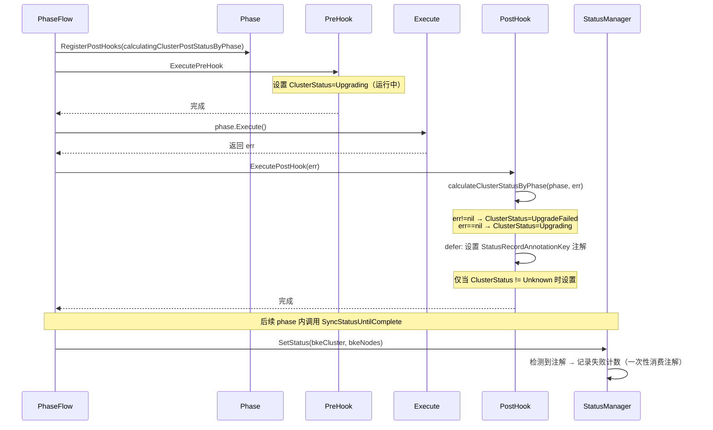

# `calculatingClusterPostStatusByPhase` 作用

## `calculatingClusterPostStatusByPhase` 的作用

**位置**：[phase_flow.go:311-320](file:///cluster-api-provider-bke/pkg/phaseframe/phases/phase_flow.go#L311-L320)

```go
func calculatingClusterPostStatusByPhase(phase phaseframe.Phase, err error) error {
    defer func() {
        ctx := phase.GetPhaseContext()
        // 设置一个标识，配合状态记录器，从而忽略phase运行中的状态被重复记录
        if ctx.BKECluster.Status.ClusterStatus != bkev1beta1.ClusterUnknown {
            annotation.SetAnnotation(ctx.BKECluster, annotation.StatusRecordAnnotationKey, "")
        }
    }()
    return calculateClusterStatusByPhase(phase, err)
}
```

### 一、核心定位

它是 **Phase 的后置 Hook**，在每个 phase 执行完成后被调用（[phase_flow.go:246](file:///cluster-api-provider-bke/pkg/phaseframe/phases/phase_flow.go#L246) `phase.RegisterPostHooks(calculatingClusterPostStatusByPhase)`），承担**两大职责**：

| 职责 | 说明 |
|------|------|
| **计算集群最终状态** | 根据 phase 执行结果（err 是否为 nil）设置 `ClusterStatus` |
| **触发状态记录器** | 设置 `StatusRecordAnnotationKey` 注解，供 StatusManager 记录失败计数 |

### 二、两大作用详解

#### 作用一：计算 phase 执行后的集群状态

通过调用 `calculateClusterStatusByPhase(phase, err)`，按 phase 所属场景分发到对应的 handler：
```go
// 以升级场景为例（phase_flow.go:422-428）
func handleClusterUpgradePhase(ctx *phaseframe.PhaseContext, err error) {
    if err != nil {
        ctx.BKECluster.Status.ClusterStatus = bkev1beta1.ClusterUpgradeFailed  // 失败
    } else {
        ctx.BKECluster.Status.ClusterStatus = bkev1beta1.ClusterUpgrading      // 进行中
    }
}
```

**状态决策规则**：

| err 值 | 升级场景状态 | 含义 |
|--------|-------------|------|
| `nil` | `ClusterUpgrading` | phase 成功，集群处于升级中 |
| 非 `nil` | `ClusterUpgradeFailed` | phase 失败，集群升级失败 |

**与前置 Hook 的对比**：

| 维度 | `calculatingClusterPreStatusByPhase`（前置） | `calculatingClusterPostStatusByPhase`（后置） |
|------|---------------------------------------------|----------------------------------------------|
| 调用时机 | phase 执行**前** | phase 执行**后** |
| 入参 | `phase`（无 err） | `phase, err`（携带执行结果） |
| 状态语义 | 设置"运行中"状态（如 `ClusterUpgrading`） | 根据 err 设置"成功/失败"状态 |
| 特殊处理 | `EnsureCluster` 强制设为 `ClusterChecking` | 设置 `StatusRecordAnnotationKey` 注解 |

#### 作用二：触发 StatusManager 的状态记录（关键设计）

`defer` 块中的注解设置是**核心设计**：
```go
defer func() {
    ctx := phase.GetPhaseContext()
    if ctx.BKECluster.Status.ClusterStatus != bkev1beta1.ClusterUnknown {
        annotation.SetAnnotation(ctx.BKECluster, annotation.StatusRecordAnnotationKey, "")
    }
}()
```

**为什么需要这个注解？**

StatusManager 的 `recordBKEClusterStatus` 通过检查此注解决定是否记录失败计数（[statusmanager.go:121-123](file:///cluster-api-provider-bke/pkg/statusmanage/statusmanager.go#L121-L123)）：
```go
if _, ok := annotation.HasAnnotation(bkeCluster, annotation.StatusRecordAnnotationKey); !ok {
    return  // 无注解则跳过
}
defer annotation.RemoveAnnotation(bkeCluster, annotation.StatusRecordAnnotationKey)  // 一次性消费
```
**设计目的**（代码注释明确说明）：

> 设置一个标识，配合状态记录器，从而忽略 phase 运行中的状态被重复记录

### 三、完整执行时序



### 四、注解触发机制的必要性

**问题场景**：如果不使用注解控制，会发生什么？
```
1. phase A 执行 → PreHook 设置 ClusterStatus=Upgrading
2. phase A 中途调用 SyncStatusUntilComplete → SetStatus 被触发
   → 此时 ClusterStatus=Upgrading（非 Failed），StatusManager 记录"正常状态"
3. phase A 执行失败 → PostHook 设置 ClusterStatus=UpgradeFailed
4. phase A 再次调用 SyncStatusUntilComplete → SetStatus 被触发
   → 此时 ClusterStatus=UpgradeFailed，StatusManager 记录失败 + 计数++
```

**问题**：步骤 2 的中间状态记录是**无意义的**，phase 还未结束，状态可能多次变化。

**注解机制的解决**：
```
1. phase A 执行 → PreHook 设置 ClusterStatus=Upgrading（无注解）
2. phase A 中途调用 SyncStatusUntilComplete → SetStatus 检测无注解 → 跳过记录
3. phase A 执行完成 → PostHook 设置 ClusterStatus=UpgradeFailed + 设置注解
4. phase A 内调用 SyncStatusUntilComplete → SetStatus 检测到注解 → 记录失败 + 计数++ → 消费注解
```
**效果**：确保 StatusManager **仅在 phase 最终状态确定后**才记录一次，避免中间状态干扰失败计数。

### 五、与前置 Hook 的协作

| 阶段 | Hook | 设置的状态 | 是否设置注解 |
|------|------|-----------|-------------|
| phase 执行前 | `calculatingClusterPreStatusByPhase` | `ClusterUpgrading` / `ClusterChecking`（运行中） | 否 |
| phase 执行后 | `calculatingClusterPostStatusByPhase` | `ClusterUpgrading`（成功）/ `ClusterUpgradeFailed`（失败） | **是**（仅当状态 != Unknown） |

**协作效果**：
- 前置 Hook 设置"运行中"状态，不触发记录
- 后置 Hook 设置"最终状态"，并通过注解触发 StatusManager 记录
- 两者配合实现"**仅记录 phase 最终状态，忽略运行中中间状态**"

### 六、`ClusterUnknown` 的特殊处理

```go
if ctx.BKECluster.Status.ClusterStatus != bkev1beta1.ClusterUnknown {
    annotation.SetAnnotation(ctx.BKECluster, annotation.StatusRecordAnnotationKey, "")
}
```
**含义**：当 phase 属于未知类型（`default` 分支，[phase_flow.go:352-353](file:///cluster-api-provider-bke/pkg/phaseframe/phases/phase_flow.go#L352-L353)），状态被设为 `ClusterUnknown`，此时**不设置注解**，StatusManager 不会记录。

**目的**：避免未知 phase 类型污染失败计数。

### 七、总结

`calculatingClusterPostStatusByPhase` 的本质是 **phase 状态收尾器**，承担两大职责：

1. **状态计算**：根据 phase 执行结果（err）计算集群最终状态（成功/失败）
2. **记录触发**：通过 `StatusRecordAnnotationKey` 注解，精确控制 StatusManager 的记录时机，确保"**每个 phase 仅记录一次最终状态**"，避免运行中的中间状态被重复记录，从而保证失败计数的准确性。
