# OpenShift 集群安装与扩容回滚能力洞察报告

## 一、OpenShift 集群生命周期管理架构

### 1.1 核心组件

| 组件 | 职责 | 关键 CRD |
|------|------|---------|
| **Cluster Version Operator (CVO)** | 集群版本管理，驱动升级/回滚 | `ClusterVersion` |
| **Machine Config Operator (MCO)** | 节点配置管理，驱动节点级变更 | `MachineConfig`, `MachineConfigPool` |
| **Cluster API Provider** | 基础设施管理，驱动节点扩缩容 | `Machine`, `MachineSet`, `MachineDeployment` |

### 1.2 状态管理模型

```
ClusterVersion (集群级)
  ├─ desired.version: 目标版本
  ├─ status.desired: 当前目标
  ├─ status.history: 升级历史
  └─ status.conditions: 状态条件

MachineConfigPool (节点池级)
  ├─ spec.configuration: 目标配置
  ├─ status.configuration: 当前配置
  ├─ status.machineCount: 节点数量
  └─ status.unavailableMachineCount: 不可用节点数
```

## 二、集群安装机制

### 2.1 安装流程

```
1. 安装程序 (openshift-install)
   ├─ 生成 Ignition 配置
   ├─ 创建 Bootstrap 节点
   └─ 创建控制平面节点

2. Bootstrap 阶段
   ├─ 启动临时控制平面
   ├─ 创建 etcd 集群
   └─ 启动 CVO

3. CVO 接管
   ├─ 应用 ClusterVersion
   ├─ 部署核心 Operator
   └─ 部署工作负载

4. Bootstrap 完成
   └─ 销毁 Bootstrap 节点
```

### 2.2 安装回滚能力

**关键洞察**：OpenShift 安装过程**不支持自动回滚**，原因：

| 因素 | 说明 |
|------|------|
| **状态不可逆** | etcd 数据、证书、网络配置一旦创建无法简单回滚 |
| **基础设施耦合** | 云资源（VM、网络、存储）已创建 |
| **时间窗口** | 安装失败通常在早期阶段，重建比回滚更快 |

**推荐做法**：安装失败时销毁集群重新安装，而非回滚。

## 三、扩容机制

### 3.1 扩容流程

```
1. 修改 MachineDeployment/MachineSet
   └─ replicas: 3 → 5

2. Machine Controller 创建 Machine
   ├─ 调用 Cloud Provider API
   └─ 创建 VM/实例

3. Node Controller 批准 CSR
   └─ 节点加入集群

4. MCO 应用配置
   ├─ 应用 MachineConfig
   └─ 节点配置完成
```

### 3.2 扩容后的缩容能力

**支持缩容**（注意：这是节点缩容，不是版本回滚），机制如下：

```yaml
# 缩容 MachineDeployment
apiVersion: machine.openshift.io/v1beta1
kind: MachineDeployment
metadata:
  name: worker-us-east-1a
spec:
  replicas: 3  # 从 5 缩容到 3
```

**缩容流程**：
1. 减少 `replicas` 数量
2. Machine Controller 删除多余的 Machine
3. Cloud Provider 销毁 VM/实例
4. Node 从集群中移除

**关键设计**：
- **声明式缩容**：通过修改期望状态触发缩容
- **优雅删除**：先 cordon → drain → delete
- **数据保留**：PVC 数据可选择保留或删除

## 四、升级与回滚机制

### 4.1 升级流程

```
1. 设置目标版本
   └─ oc adm upgrade --to=4.12.0

2. CVO 验证升级路径
   ├─ 检查当前版本
   ├─ 检查目标版本
   └─ 验证升级图

3. CVO 执行升级
   ├─ 更新 ClusterVersion.status
   ├─ 按顺序更新 Operator
   └─ 等待 Operator 就绪

4. MCO 更新节点
   ├─ 生成新的 MachineConfig
   ├─ 逐节点更新配置
   └─ 重启节点应用配置

5. 升级完成
   └─ 更新 ClusterVersion.status.history
```

### 4.2 升级失败处理

**关键事实：OpenShift 不支持将集群还原到以前版本**

根据 Red Hat 官方文档，OpenShift 升级是单向操作，不支持版本回滚。

#### 4.2.1 升级失败后的状态

当升级失败时，系统会：

```yaml
# 升级失败时的 ClusterVersion 状态
status:
  history:
  - state: Partial              # 升级失败，保持在 Partial 状态
    version: "4.12.0"
    startedTime: "2024-01-15T10:00:00Z"
  conditions:
  - type: Failing
    status: "True"
    reason: UpgradeFailed
    message: "Upgrade to 4.12.0 failed: Operator health check failed"
```

**升级失败后的状态**：
- ClusterVersion 保持在 `Partial` 状态
- `Failing=True` condition 标记失败
- **不支持回滚到旧版本**

#### 4.2.2 升级失败后的处理方式

**方式一：联系 Red Hat 支持**
- 提交支持工单
- Red Hat 支持团队提供专业指导
- 可能需要收集诊断信息（`oc adm must-gather`）

**方式二：从 etcd 备份恢复**
```bash
# 恢复 etcd 备份（需要在所有控制平面节点执行）
# 1. 停止所有控制平面组件
# 2. 恢复 etcd 快照
# 3. 重启控制平面组件
```

**方式三：重建集群**
- 如果无法从备份恢复，需要重建集群
- 重新安装 OpenShift
- 重新部署应用

#### 4.2.3 为什么 OpenShift 不支持回滚？

1. **数据格式变更不可逆**：升级过程中 etcd 数据格式可能发生变化
2. **组件版本依赖复杂**：多个 Operator 之间存在复杂的版本依赖关系
3. **状态一致性难以保证**：回滚可能导致集群状态不一致
4. **测试覆盖困难**：回滚路径的测试矩阵过于庞大

#### 4.2.4 最佳实践

**升级前**：
1. 备份 etcd 数据
2. 在测试环境验证升级
3. 阅读版本发布说明
4. 确认升级路径

**升级失败后**：
1. 收集诊断信息（`oc adm must-gather`）
2. 联系 Red Hat 支持
3. 评估是否可以从 etcd 备份恢复
4. 必要时重建集群

#### 4.2.1 回滚限制的设计原因

**为什么限制只能回滚到相邻版本？**

##### 1. 技术层面的限制

###### 1.1 数据结构变更不可逆

```yaml
# 示例：CRD schema 变更
# 4.10 → 4.11 升级
apiVersion: apiextensions.k8s.io/v1
kind: CustomResourceDefinition
spec:
  versions:
  - name: v1
    schema:
      openAPIV3Schema:
        properties:
          newField:  # 4.11 新增字段
            type: string

# 如果从 4.11 回滚到 4.10
# 问题：4.10 的代码不认识 newField
# 可能导致：数据丢失、验证失败、API 错误
```

**问题**：
- 每个版本可能引入新的 CRD 字段
- 旧版本代码无法处理新字段
- 回滚时需要删除或转换新字段，但可能丢失数据

###### 1.2 etcd 数据迁移

```go
// 示例：etcd 数据格式变更
type ClusterVersion struct {
    Status ClusterVersionStatus `json:"status"`
}

// 4.10
type ClusterVersionStatus struct {
    History []UpdateHistory `json:"history"`
}

// 4.11 新增字段
type ClusterVersionStatus struct {
    History []UpdateHistory `json:"history"`
    OperationState string `json:"operationState"` // 新增
}

// 回滚问题：
// 1. 4.10 的代码不认识 OperationState
// 2. 从 etcd 读取时会忽略该字段
// 3. 如果再次升级到 4.11，该字段可能丢失或损坏
```

###### 1.3 API 版本兼容性

```yaml
# 示例：API 版本变更
# 4.10: config.openshift.io/v1
# 4.11: config.openshift.io/v1alpha1 (新增)

# 回滚问题：
# 1. 4.11 创建的资源使用 v1alpha1
# 2. 4.10 不认识 v1alpha1
# 3. 回滚后这些资源无法访问
```

##### 2. 数据一致性考虑

###### 2.1 升级是单向过程

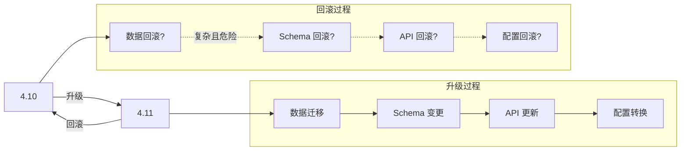
```mermaid
graph LR
    A[4.10] -->|升级| B[4.11]
    B -->|回滚| A
    
    subgraph "升级过程"
        B1[数据迁移]
        B2[Schema 变更]
        B3[API 更新]
        B4[配置转换]
    end
    
    B --> B1 --> B2 --> B3 --> B4
    
    subgraph "回滚过程"
        A1[数据回滚?]
        A2[Schema 回滚?]
        A3[API 回滚?]
        A4[配置回滚?]
    end
    
    A --> A1 -.->|复杂且危险| A2 -.-> A3 -.-> A4
```

**问题**：
- 升级过程包含多个步骤，每个步骤可能修改数据
- 回滚需要逆向执行所有步骤，但某些步骤不可逆
- 跨版本回滚需要处理多个版本的变更，复杂度指数级增长

###### 2.2 状态不一致风险

```yaml
# 示例：跨版本回滚的状态不一致
status:
  # 4.12 的状态
  history:
  - version: "4.12.0"
    state: "Completed"
  - version: "4.11.18"
    state: "Completed"
  - version: "4.11.0"
    state: "Completed"
  
  # 如果从 4.12 回滚到 4.11.0
  # 问题：
  # 1. 4.11.18 的配置可能已被 4.12 修改
  # 2. 4.11.0 的配置可能与当前状态不匹配
  # 3. 某些资源可能处于中间状态
```

##### 3. 升级路径的复杂性

###### 3.1 OpenShift 升级图

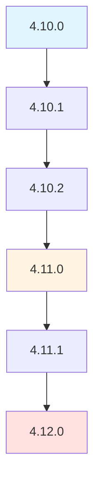
```mermaid
graph TB
    A[4.10.0] --> B[4.10.1]
    B --> C[4.10.2]
    C --> D[4.11.0]
    D --> E[4.11.1]
    E --> F[4.12.0]
    
    style A fill:#e1f5ff
    style D fill:#fff4e1
    style F fill:#ffe1e1
```

**设计原则**：
- 每个版本之间的升级路径经过严格测试
- 只允许经过验证的升级路径
- 跨版本升级需要逐步进行（4.10 → 4.11 → 4.12）

###### 3.2 回滚路径同样需要验证

```go
// 示例：回滚路径验证
type RollbackPath struct {
    FromVersion string
    ToVersion   string
    Tested      bool
    Verified    bool
}

// 允许的相邻回滚
var AllowedRollbacks = []RollbackPath{
    {From: "4.12.0", To: "4.11.18", Tested: true, Verified: true},
    {From: "4.11.18", To: "4.11.0", Tested: true, Verified: true},
}

// 不允许的跨版本回滚
var DisallowedRollbacks = []RollbackPath{
    {From: "4.12.0", To: "4.11.0", Tested: false, Verified: false},
    {From: "4.12.0", To: "4.10.0", Tested: false, Verified: false},
}
```

**原因**：
- 跨版本回滚没有经过充分测试
- 可能存在未发现的兼容性问题
- 风险太高，可能导致集群不可用

##### 4. 实际场景的需求

###### 4.1 大多数场景只需相邻回滚

```yaml
# 场景 1：升级后立即发现问题
时间线：
T0: 升级到 4.12.0
T1: 发现严重 bug
T2: 回滚到 4.11.18

# 场景 2：升级后运行一段时间发现问题
时间线：
T0: 升级到 4.12.0
T30: 运行 30 天
T31: 发现性能问题
T32: 回滚到 4.11.18

# 这两种场景都只需要相邻回滚
```

###### 4.2 需要跨版本回滚的场景

```yaml
# 场景 3：多次升级后发现问题
时间线：
T0: 升级到 4.11.0
T30: 升级到 4.11.18
T60: 升级到 4.12.0
T90: 发现严重问题，需要回滚到 4.11.0

# 这种场景很少见，通常建议：
# 1. 重建集群（推荐）
# 2. 逐步回滚（4.12 → 4.11.18 → 4.11.0）
```

##### 5. 理论和实践的差距

###### 5.1 理论上可以跨版本回滚

```go
// 理论上的跨版本回滚实现
func (cvo *ClusterVersionOperator) RollbackToVersion(targetVersion string) error {
    currentVersion := cvo.getCurrentVersion()
    
    // 1. 计算回滚路径
    path := cvo.calculateRollbackPath(currentVersion, targetVersion)
    
    // 2. 逐步回滚
    for _, version := range path {
        if err := cvo.rollbackToAdjacent(version); err != nil {
            return err
        }
    }
    
    return nil
}
```

**理论上可行的原因**：
- 可以逐步回滚（4.12 → 4.11.18 → 4.11.0）
- 每个步骤都是相邻版本回滚
- 最终达到目标版本

###### 5.2 实践中的挑战

```yaml
# 挑战 1：数据迁移的复杂性
升级 4.10 → 4.11 → 4.12：
- 4.10 → 4.11: 数据迁移 A
- 4.11 → 4.12: 数据迁移 B

回滚 4.12 → 4.11 → 4.10：
- 4.12 → 4.11: 需要逆向执行 B
- 4.11 → 4.10: 需要逆向执行 A

问题：
1. 某些迁移可能不可逆
2. 逆向迁移可能丢失数据
3. 需要为每个迁移编写逆向逻辑

# 挑战 2：测试覆盖
相邻回滚：
- 4.12 → 4.11: 需要测试
- 4.11 → 4.11.18: 需要测试
- 4.11.18 → 4.11.0: 需要测试

跨版本回滚：
- 4.12 → 4.11.0: 需要测试（4.12 → 4.11.18 → 4.11.0）
- 4.12 → 4.10.0: 需要测试（4.12 → 4.11.18 → 4.11.0 → 4.10.x）

问题：
1. 测试矩阵爆炸
2. 某些路径可能无法测试（版本已废弃）
3. 维护成本太高
```

##### 6. OpenShift 的设计哲学

###### 6.1 保守策略

```yaml
# OpenShift 的选择
设计原则：
1. 只支持经过充分测试的功能
2. 降低复杂度，提高可靠性
3. 对于复杂场景，推荐重建集群

回滚策略：
1. 只支持相邻版本回滚
2. 跨版本回滚需要逐步进行
3. 如果需要回滚多个版本，建议重建集群
```

###### 6.2 替代方案

```bash
# 如果需要回滚多个版本

# OpenShift 不支持版本回滚
# 升级失败后的处理方式：

# 方案 1：联系 Red Hat 支持（推荐）
# 提交支持工单，获取专业指导

# 方案 2：从 etcd 备份恢复
# 如果有 etcd 备份，可以恢复到备份时的状态

# 方案 3：重建集群
openshift-install destroy cluster
openshift-install create cluster
```

##### 7. 总结

###### 7.1 限制原因

| 原因 | 说明 | 影响 |
|------|------|------|
| **数据结构变更** | CRD schema、API 版本等变更可能不可逆 | 跨版本回滚可能导致数据丢失 |
| **数据一致性** | 升级过程包含多个不可逆步骤 | 回滚需要逆向执行所有步骤 |
| **测试覆盖** | 跨版本回滚路径未经充分测试 | 可能存在未发现的兼容性问题 |
| **复杂度** | 跨版本回滚需要处理多个版本的变更 | 维护成本太高 |
| **实际需求** | 大多数场景只需相邻回滚 | 跨版本回滚场景很少 |

###### 7.2 理论上可以跨版本回滚吗？

**可以，但不推荐**：

1. **理论上可行**：通过逐步回滚（4.12 → 4.11.18 → 4.11.0）
2. **实践中困难**：
   - 需要为每个版本编写逆向迁移逻辑
   - 测试矩阵爆炸
   - 某些版本可能已废弃，无法测试
3. **更好的替代方案**：
   - 逐步回滚（推荐）
   - 重建集群（更推荐）
   - 从备份恢复

###### 7.3 OpenShift 的设计选择

OpenShift 选择了**保守策略**：
- 只支持相邻版本回滚
- 降低复杂度，提高可靠性
- 对于复杂场景，推荐重建集群

这是一个**权衡取舍**：
- **优点**：简单、可靠、易维护
- **缺点**：灵活性受限

对于 BKE 的设计，可以考虑：
1. **初期**：只支持相邻版本回滚（降低复杂度）
2. **后期**：根据实际需求，逐步支持跨版本回滚
3. **始终**：提供重建集群的替代方案

### 4.3 回滚版本获取机制

**核心问题**：如何确定可以回滚到哪个版本？

#### 4.3.1 升级历史数据结构

OpenShift ClusterVersion 的 `status.history` 字段存储了完整的升级历史：

```go
type UpdateHistory struct {
    // state 记录升级状态
    // - Completed: 升级/回滚成功完成
    // - Partial: 升级/回滚进行中，或升级失败
    State UpdateState `json:"state"`
    
    // version 是目标版本
    Version string `json:"version"`
    
    // image 是发布镜像
    Image string `json:"image"`
    
    // startedTime 是升级/回滚开始时间
    StartedTime metav1.Time `json:"startedTime"`
    
    // completionTime 是完成时间
    // - state=Completed 时：升级/回滚成功完成时间
    // - state=Partial 时：不存在（操作尚未完成）
    CompletionTime *metav1.Time `json:"completionTime,omitempty"`
    
    // verified 表示发布镜像是否已验证
    Verified bool `json:"verified"`
    
    // acceptedRisks 记录升级过程中接受的风险
    AcceptedRisks string `json:"acceptedRisks,omitempty"`
}

type UpdateState string

const (
    // CompletedUpdateState 表示升级/回滚已成功完成
    CompletedUpdateState UpdateState = "Completed"
    
    // PartialUpdateState 表示升级/回滚进行中，或升级失败
    // 这是一个中间状态，操作尚未完成
    PartialUpdateState UpdateState = "Partial"
)
```

**状态说明**：

OpenShift 的 UpdateHistory 只有两个状态，设计非常简洁：

| state | 含义 | completionTime | 是否终态 |
|-------|------|----------------|---------|
| `Completed` | 升级/回滚成功完成 | 有（完成时间） | 是 |
| `Partial` | 升级/回滚进行中，或升级失败 | 不存在 | 否 |

**关键设计原则**：
1. **没有独立的回滚状态**：回滚和升级共用 `Partial` 和 `Completed` 状态
2. **通过版本比较判断操作类型**：`desiredVersion > currentVersion` 为升级，`desiredVersion < currentVersion` 为降级（回滚）
3. **Partial 状态的多重含义**：可以是升级中、升级失败、回滚中

#### 4.3.2 升级历史示例

**成功升级的历史记录：**

```yaml
status:
  history:
  - state: Completed
    version: 4.12.0
    image: quay.io/openshift-release-dev/ocp-release:4.12.0-x86_64
    startedTime: "2024-01-15T10:00:00Z"
    completionTime: "2024-01-15T11:30:00Z"
    verified: true
  - state: Completed
    version: 4.11.18
    image: quay.io/openshift-release-dev/ocp-release:4.11.18-x86_64
    startedTime: "2023-12-01T08:00:00Z"
    completionTime: "2023-12-01T09:30:00Z"
    verified: true
```

**升级失败时的历史记录：**

```yaml
status:
  history:
  - state: Partial          # 升级失败，state 保持为 Partial
    version: 4.12.0
    image: quay.io/openshift-release-dev/ocp-release:4.12.0-x86_64
    startedTime: "2024-01-15T10:00:00Z"
    # completionTime 不存在，因为升级未完成
    verified: true
  - state: Completed
    version: 4.11.18
    image: quay.io/openshift-release-dev/ocp-release:4.11.18-x86_64
    startedTime: "2023-12-01T08:00:00Z"
    completionTime: "2023-12-01T09:30:00Z"
    verified: true
  conditions:
  - type: Failing
    status: "True"
    reason: UpgradeFailed
    message: "Unable to apply 4.12.0: Operator health check failed"
    lastTransitionTime: "2024-01-15T10:45:00Z"
```

**手动触发回滚后的历史记录：**

```yaml
# 用户手动设置 spec.desiredUpdate.version = 4.11.18
# CVO 检测到 desiredVersion < currentVersion，执行降级流程
status:
  history:
  - state: Partial          # 回滚进行中
    version: 4.11.18        # 回滚目标版本
    image: quay.io/openshift-release-dev/ocp-release:4.11.18-x86_64
    startedTime: "2024-01-15T12:00:00Z"
    verified: true
  - state: Partial          # 升级失败记录，保持 Partial 状态
    version: 4.12.0
    startedTime: "2024-01-15T10:00:00Z"
    verified: true
  - state: Completed
    version: 4.11.18
    startedTime: "2023-12-01T08:00:00Z"
    completionTime: "2023-12-01T09:30:00Z"
    verified: true
```

**回滚完成后的历史记录：**

```yaml
status:
  history:
  - state: Completed        # 回滚成功完成
    version: 4.11.18
    image: quay.io/openshift-release-dev/ocp-release:4.11.18-x86_64
    startedTime: "2024-01-15T12:00:00Z"
    completionTime: "2024-01-15T12:30:00Z"
    verified: true
  - state: Partial          # 升级失败记录，保持 Partial 状态
    version: 4.12.0
    startedTime: "2024-01-15T10:00:00Z"
    verified: true
  - state: Completed
    version: 4.11.18
    startedTime: "2023-12-01T08:00:00Z"
    completionTime: "2023-12-01T09:30:00Z"
    verified: true
```

**关键设计点**：

1. **升级失败记录保留**：升级失败的记录保持在 `Partial` 状态，不会被删除或修改
2. **回滚创建新记录**：手动触发回滚时，创建新的 `Partial` 记录
3. **回滚完成更新状态**：回滚成功后，将新记录更新为 `Completed`
4. **版本一致性**：回滚记录的 `version` 字段指向回滚目标版本

**Partial 状态的详细含义：**

**字面含义**：Partial = 部分的、不完整的

**在 OpenShift 中的含义**：
- 升级已开始但尚未完成
- 没有 `completionTime`（完成时间）
- 可能是正常状态（升级中）或异常状态（升级失败）

**Partial 的两种场景**：

| 场景 | state | conditions | 含义 |
|------|-------|------------|------|
| **升级进行中** | `Partial` | `Progressing=True` | 正常状态，升级正在执行 |
| **升级失败** | `Partial` | `Failing=True` | 异常状态，升级失败 |

**为什么使用 Partial 而不是 Failed？**

1. **升级是渐进过程**：OpenShift 升级涉及多个组件，可能部分成功、部分失败
2. **保留失败记录**：即使失败，也需要保留记录用于回滚和审计
3. **允许手动干预**：用户可以选择重试升级或触发回滚
4. **状态一致性**：Partial 表示"未完成"，不预设结果（成功/失败）

**状态转换图**：

```
Partial (升级中) → Completed (成功)
     ↓
Partial (失败) → [用户手动触发回滚] → Partial (回滚中) → Completed (回滚成功)
```

**关键区别：**

| 状态 | history[0].state | completionTime | conditions |
|------|------------------|----------------|------------|
| 升级成功 | `Completed` | 有值 | `Available=True` |
| 升级失败 | `Partial` | 无值 | `Failing=True` |
| 升级中 | `Partial` | 无值 | `Progressing=True` |
| 回滚中 | `Partial` | 无值 | `Progressing=True` |
| 回滚成功 | `Completed` | 有值 | `Available=True` |

**CVO 如何检测升级失败：**

```go
func (cvo *ClusterVersionOperator) isUpgradeFailed(cv *configv1.ClusterVersion) bool {
    if len(cv.Status.History) == 0 {
        return false
    }
    
    latest := cv.Status.History[0]
    
    // 条件 1: state 为 Partial（未完成）
    if latest.State != configv1.PartialUpdateState {
        return false
    }
    
    // 条件 2: 检查 Failing condition
    for _, cond := range cv.Status.Conditions {
        if cond.Type == "Failing" && cond.Status == "True" {
            return true
        }
    }
    
    // 条件 3: 检查是否超时
    if time.Since(latest.StartedTime.Time) > cvo.upgradeTimeout {
        return true
    }
    
    return false
}
```

#### 4.3.3 版本选择算法

**CVO 通过以下算法确定可回滚版本**：

```go
// GetRollbackTarget 获取可回滚的目标版本
func (cvo *ClusterVersionOperator) GetRollbackTarget(cv *configv1.ClusterVersion) (string, error) {
    // 1. 获取升级历史
    history := cv.Status.History
    
    // 2. 查找最新的 Completed 状态记录（当前版本）
    var currentVersion string
    for _, h := range history {
        if h.State == configv1.CompletedUpdateState {
            currentVersion = h.Version
            break
        }
    }
    
    if currentVersion == "" {
        return "", fmt.Errorf("no completed upgrade found")
    }
    
    // 3. 查找上一条 Completed 状态记录（可回滚版本）
    var rollbackVersion string
    foundCurrent := false
    for _, h := range history {
        if h.State == configv1.CompletedUpdateState {
            if foundCurrent {
                // 这是上一条 Completed 记录
                rollbackVersion = h.Version
                break
            }
            if h.Version == currentVersion {
                foundCurrent = true
            }
        }
    }
    
    if rollbackVersion == "" {
        return "", fmt.Errorf("no rollback target found")
    }
    
    // 4. 验证回滚版本是否在升级图中
    if !cvo.isVersionInUpgradeGraph(rollbackVersion) {
        return "", fmt.Errorf("rollback version %s not in upgrade graph", rollbackVersion)
    }
    
    return rollbackVersion, nil
}
```

#### 4.3.4 版本验证机制

**CVO 在回滚前会进行以下验证**：

1. **升级图验证**：检查目标版本是否在官方升级图中
   ```bash
   # 查看可用升级路径
   oc adm upgrade --allow-explicit-upgrade --to-image=<image>
   ```

2. **发布镜像验证**：验证目标版本的发布镜像签名
   ```go
   if !verified {
       return fmt.Errorf("release image not verified")
   }
   ```

3. **兼容性验证**：检查目标版本与当前组件的兼容性
   ```go
   if !cvo.isCompatible(currentComponents, targetVersion) {
       return fmt.Errorf("version not compatible with current components")
   }
   ```

### 4.4 回滚时 ClusterVersion 的目标版本

**核心问题**：回滚时 ClusterVersion 的 `spec.desiredUpdate.version` 是什么？

#### 4.4.1 目标版本确定规则

**回滚目标版本 = 上一个成功升级的版本**

```
升级前状态：
  spec.desiredUpdate.version: 4.11.18  (当前运行版本)
  status.history[0].version: 4.11.18
  status.history[0].state: Completed

升级到 4.12.0：
  spec.desiredUpdate.version: 4.12.0   (目标版本)
  status.history[0].version: 4.12.0
  status.history[0].state: Partial     (升级中)
  status.history[1].version: 4.11.18
  status.history[1].state: Completed

升级失败后（OpenShift 不支持回滚）：
  spec.desiredUpdate.version: 4.12.0  (保持失败版本)
  status.history[0].version: 4.12.0
  status.history[0].state: Partial     (升级失败记录，保持 Partial)
  status.history[1].version: 4.11.18
  status.history[1].state: Completed   (上一个成功版本)
  
  # 需要联系 Red Hat 支持或从 etcd 备份恢复
```

#### 4.4.2 目标版本设置时机

**升级失败后（OpenShift 不支持回滚）**：

```bash
# OpenShift 不支持版本回滚
# 升级失败后需要：
# 1. 联系 Red Hat 支持
# 2. 从 etcd 备份恢复
# 3. 重建集群
```

**CVO 检测到回滚请求**：

```go
// CVO 在 Reconcile 循环中检测回滚请求
func (cvo *ClusterVersionOperator) Reconcile(ctx context.Context, req ctrl.Request) (ctrl.Result, error) {
    cv := &configv1.ClusterVersion{}
    if err := cvo.client.Get(ctx, req.NamespacedName, cv); err != nil {
        return ctrl.Result{}, err
    }
    
    // 获取当前版本
    currentVersion := getCurrentVersion(cv)
    
    // 获取目标版本
    desiredVersion := cv.Spec.DesiredUpdate.Version
    
    // 判断操作类型
    if desiredVersion > currentVersion {
        // 升级
        return cvo.handleUpgrade(ctx, cv, desiredVersion)
    } else if desiredVersion < currentVersion {
        // 降级（回滚）
        return cvo.handleDowngrade(ctx, cv, desiredVersion)
    }
    
    return ctrl.Result{}, nil
}
```

#### 4.4.3 ClusterVersion 状态变化

**升级前**：
```yaml
apiVersion: config.openshift.io/v1
kind: ClusterVersion
metadata:
  name: version
spec:
  clusterID: xxx
  channel: stable-4.11
  desiredUpdate:
    version: 4.11.18
    image: quay.io/openshift-release-dev/ocp-release:4.11.18-x86_64
status:
  desired:
    version: 4.11.18
    image: quay.io/openshift-release-dev/ocp-release:4.11.18-x86_64
  history:
  - state: Completed
    version: 4.11.18
    startedTime: "2023-12-01T08:00:00Z"
    completionTime: "2023-12-01T09:30:00Z"
  - state: Completed
    version: 4.11.0
    startedTime: "2023-10-15T10:00:00Z"
    completionTime: "2023-10-15T11:30:00Z"
```

**升级到 4.12.0（失败）**：
```yaml
spec:
  desiredUpdate:
    version: 4.12.0
    image: quay.io/openshift-release-dev/ocp-release:4.12.0-x86_64
status:
  desired:
    version: 4.12.0
    image: quay.io/openshift-release-dev/ocp-release:4.12.0-x86_64
  history:
  - state: Partial          # 升级失败
    version: 4.12.0
    startedTime: "2024-01-15T10:00:00Z"
  - state: Completed
    version: 4.11.18
    startedTime: "2023-12-01T08:00:00Z"
    completionTime: "2023-12-01T09:30:00Z"
  conditions:
  - type: Failing
    status: "True"
    reason: UpgradeFailed
    message: "Upgrade to 4.12.0 failed: Operator health check failed"
```

**升级失败后（OpenShift 不支持回滚）**：
```yaml
# OpenShift 不支持版本回滚
# 升级失败后的状态保持不变
spec:
  desiredUpdate:
    version: 4.12.0        # 保持失败版本
    image: quay.io/openshift-release-dev/ocp-release:4.12.0-x86_64
status:
  desired:
    version: 4.12.0        # 目标版本保持不变
    image: quay.io/openshift-release-dev/ocp-release:4.12.0-x86_64
  history:
  - state: Partial          # 升级失败记录，保持 Partial
    version: 4.12.0
    startedTime: "2024-01-15T10:00:00Z"
  - state: Completed
    version: 4.11.18
    startedTime: "2023-12-01T08:00:00Z"
    completionTime: "2023-12-01T09:30:00Z"
  conditions:
  - type: Progressing
    status: "True"
    reason: Downgrade
    message: "Downgrading to 4.11.18"
```

**回滚触发详细流程**：

**步骤 1: 检测升级失败**

CVO 在调谐循环中持续检查升级状态，通过以下条件判断升级是否失败：

```go
func (cvo *ClusterVersionOperator) detectUpgradeFailure(cv *configv1.ClusterVersion) bool {
    // 条件 1: 检查最新的升级记录是否为 Partial 状态
    if len(cv.Status.History) == 0 {
        return false
    }
    
    latest := cv.Status.History[0]
    if latest.State != configv1.PartialUpdateState {
        return false
    }
    
    // 条件 2: 检查 Failing condition 是否为 True
    for _, cond := range cv.Status.Conditions {
        if cond.Type == "Failing" && cond.Status == metav1.ConditionTrue {
            return true
        }
    }
    
    // 条件 3: 检查是否超时（默认 30 分钟）
    if time.Since(latest.StartedTime.Time) > cvo.upgradeTimeout {
        return true
    }
    
    return false
}
```

**步骤 2: 获取回滚目标版本**

```go
func (cvo *ClusterVersionOperator) getRollbackTarget(cv *configv1.ClusterVersion) (string, error) {
    // 遍历 history，找到最近的 Completed 状态记录
    // 跳过第一个 Partial 状态记录（失败的升级）
    for i := 1; i < len(cv.Status.History); i++ {
        if cv.Status.History[i].State == configv1.CompletedUpdateState {
            return cv.Status.History[i].Version, nil
        }
    }
    return "", fmt.Errorf("no rollback target found")
}
```

**步骤 3: 创建新的回滚记录**

```go
func (cvo *ClusterVersionOperator) createRollbackRecord(cv *configv1.ClusterVersion, targetVersion string) {
    // 创建新的回滚记录
    rollbackRecord := configv1.UpdateHistory{
        State:       configv1.PartialUpdateState,  // 初始为 Partial
        Version:     targetVersion,
        Image:       cvo.getReleaseImage(targetVersion),
        StartedTime: metav1.Now(),
        // CompletionTime 不存在，因为回滚尚未完成
    }
    
    // 插入到 history 数组的开头
    newHistory := make([]configv1.UpdateHistory, len(cv.Status.History)+1)
    newHistory[0] = rollbackRecord        // 新的回滚记录
    copy(newHistory[1:], cv.Status.History)  // 其他历史记录
    
    cv.Status.History = newHistory
    
    // 更新 desired 状态
    cv.Status.Desired.Version = targetVersion
    cv.Status.Desired.Image = rollbackRecord.Image
}
```

**步骤 4: 更新 ClusterVersion 对象**

```go
func (cvo *ClusterVersionOperator) executeDowngrade(cv *configv1.ClusterVersion) error {
    // 1. 获取降级目标
    targetVersion := cv.Spec.DesiredUpdate.Version
    
    // 2. 创建新的回滚记录
    cvo.createRollbackRecord(cv, targetVersion)
    
    // 3. 更新 Progressing condition
    for i, cond := range cv.Status.Conditions {
        if cond.Type == "Progressing" {
            cv.Status.Conditions[i].Status = metav1.ConditionTrue
            cv.Status.Conditions[i].Reason = "Downgrading"
            cv.Status.Conditions[i].Message = fmt.Sprintf("Downgrading to %s", targetVersion)
            break
        }
    }
    
    // 4. 更新 ClusterVersion 对象到 API Server
    if err := cvo.client.Status().Update(context.TODO(), cv); err != nil {
        return err
    }
    
    // 5. 发送事件
    cvo.recorder.Eventf(cv, corev1.EventTypeNormal, "DowngradeStarted",
        "Downgrade to %s started", targetVersion)
    
    return nil
}
```
    
    return nil
}
```

**状态转换时序图**：

```
时间线                          ClusterVersion 状态变化
────────────────────────────────────────────────────────────────
T0: 升级到 4.12.0 开始          history[0] = {state: Partial, version: 4.12.0}
                                
T1: 升级失败                    history[0] = {state: Partial, version: 4.12.0}
                                conditions = [{type: Failing, status: True}]
                                
T2: 升级失败后（OpenShift 不支持回滚）
                                spec.desiredUpdate.version = 4.12.0 (保持不变)
                                # 需要联系 Red Hat 支持或从 etcd 备份恢复
                                
T3: 联系 Red Hat 支持           提交支持工单
                                收集诊断信息（oc adm must-gather）
                                
T4: 评估恢复方案               评估是否可以从 etcd 备份恢复
                                或重建集群
```

**关键点总结**：

| 步骤 | 操作 | history 变化 |
|------|------|-------------|
| 1. 检测失败 | 检查 `Partial` + `Failing=True` | 无变化 |
| 2. 用户触发回滚 | 用户设置 `spec.desiredUpdate.version` | 无变化 |
| 3. 创建回滚记录 | 在 `history` 开头插入新记录 | 新增 `history[0]`: `{state: Partial, version: 4.11.18}` |
| 4. 执行回滚 | CVO 执行降级操作 | `history[0]`: `Partial` → `Completed` |

**为什么失败记录保持 Partial 状态？**

1. **保留失败记录**：升级失败的记录保持在 `Partial` 状态，用于审计和问题排查
2. **不修改历史**：OpenShift 不会修改或删除失败的升级记录
3. **触发回滚执行**：创建新的 `Partial` 记录，表示回滚正在进行
4. **状态一致性**：`spec.desiredUpdate.version` 与 `history[0].version` 一致，触发回滚执行

**回滚完成**：
```yaml
spec:
  desiredUpdate:
    version: 4.11.18        # 保持回滚目标
    image: quay.io/openshift-release-dev/ocp-release:4.11.18-x86_64
status:
  desired:
    version: 4.11.18
    image: quay.io/openshift-release-dev/ocp-release:4.11.18-x86_64
  history:
  - state: Completed        # 回滚成功
    version: 4.11.18
    startedTime: "2024-01-15T12:00:00Z"
    completionTime: "2024-01-15T12:30:00Z"
  - state: Partial          # 失败的升级记录，保持 Partial
    version: 4.12.0
    startedTime: "2024-01-15T10:00:00Z"
  - state: Completed
    version: 4.11.18
    startedTime: "2023-12-01T08:00:00Z"
    completionTime: "2023-12-01T09:30:00Z"
  conditions:
  - type: Available
    status: "True"
    reason: AsExpected
    message: "Cluster version is 4.11.18"
```

#### 4.4.4 目标版本选择规则

**CVO 遵循以下规则选择回滚目标**：

| 规则 | 说明 | 示例 |
|------|------|------|
| **最近成功原则** | 选择最近的 `state=Completed` 版本 | 4.12.0 失败 → 回滚到 4.11.18 |
| **升级图验证** | 目标版本必须在官方升级图中 | 不能回滚到不在升级图中的版本 |
| **镜像验证** | 目标版本的发布镜像必须可用且已验证 | 镜像签名验证通过 |
| **兼容性检查** | 目标版本与当前组件兼容 | 不能回滚到不兼容的版本 |
| **单一回滚** | 只能回滚一个版本，不能跨多个版本 | 4.12.0 → 4.11.18，不能直接到 4.11.0 |

#### 4.4.5 特殊情况处理

**情况 1：没有可回滚版本**

```yaml
status:
  history:
  - state: Partial        # 只有失败的升级记录
    version: 4.12.0
  - state: Failed         # 没有 Completed 状态
    version: 4.11.18
```

**处理**：OpenShift 不支持版本回滚，需要联系 Red Hat 支持或从 etcd 备份恢复
```bash
# OpenShift 不支持版本回滚
# 升级失败后的处理方式：
# 1. 联系 Red Hat 支持
# 2. 从 etcd 备份恢复
# 3. 重建集群
```

**情况 2：升级失败后无法恢复**

```go
// OpenShift 不支持版本回滚
// 升级失败后需要联系 Red Hat 支持或从 etcd 备份恢复
if upgradeFailed {
    // 收集诊断信息
    // 联系 Red Hat 支持
    // 或从 etcd 备份恢复
}
```

**处理**：联系 Red Hat 支持或从 etcd 备份恢复

**情况 3：多次升级失败**

```yaml
status:
  history:
  - state: Partial        # 第三次升级失败
    version: 4.13.0
  - state: Partial        # 第二次升级失败，保持 Partial
    version: 4.12.0
  - state: Completed      # 当前稳定版本
    version: 4.11.18
```

**处理**：回滚目标仍然是最近的 `Completed` 版本（4.11.18）

### 4.5 回滚触发机制

**核心问题**：CVO 如何判断是升级还是降级（回滚）？

#### 4.5.1 关键对比：spec.desiredUpdate vs currentVersion

**CVO 通过比较 `spec.desiredUpdate.version` 与当前运行版本来判断操作类型**

```
稳定状态：
  spec.desiredUpdate.version: 4.11.18
  currentVersion (从 history 中第一个 Completed 记录获取): 4.11.18
  → desired == current，无需操作

升级到 4.12.0：
  spec.desiredUpdate.version: 4.12.0  ← 用户设置目标
  currentVersion: 4.11.18
  → desired (4.12.0) > current (4.11.18)，执行升级
  → history[0] = {state: Partial, version: 4.12.0}

升级失败：
  spec.desiredUpdate.version: 4.12.0
  currentVersion: 4.11.18 (从 history[1] 获取，因为 history[0] 是 Partial)
  → history[0] = {state: Partial, version: 4.12.0, Failing=True}
  → 等待用户手动触发回滚

升级失败后（OpenShift 不支持回滚）：
  spec.desiredUpdate.version: 4.12.0 ← 保持失败版本
  currentVersion: 4.11.18 (从 history[1] 获取)
  → 需要联系 Red Hat 支持或从 etcd 备份恢复

恢复方案评估：
  方案 1：联系 Red Hat 支持
  方案 2：从 etcd 备份恢复
  方案 3：重建集群
```

#### 4.5.2 CVO 调谐循环逻辑

```go
func (cvo *ClusterVersionOperator) Reconcile() error {
    cv := cvo.getClusterVersion()
    
    // 1. 获取期望版本
    desiredVersion := cv.Spec.DesiredUpdate.Version
    
    // 2. 获取当前状态
    currentHistory := cv.Status.History[0]
    
    // 3. 判断是否需要操作
    if cvo.needsUpgradeOrRollback(desiredVersion, currentHistory) {
        // 4. 判断是升级还是回滚
        actionType := cvo.determineActionType(desiredVersion, currentHistory)
        
        // 5. 执行升级或回滚
        return cvo.executeUpgradeOrRollback(desiredVersion, actionType)
    }
    
    return nil
}

func (cvo *ClusterVersionOperator) needsUpgradeOrRollback(
    desiredVersion string,
    currentHistory configv1.UpdateHistory,
) bool {
    // 情况 1: 当前版本与期望版本一致且已完成 → 无需操作
    if currentHistory.Version == desiredVersion && 
       currentHistory.State == configv1.CompletedUpdateState {
        return false
    }
    
    // 情况 2: 当前版本与期望版本不一致 → 需要升级或回滚
    if currentHistory.Version != desiredVersion {
        return true
    }
    
    // 情况 3: 当前版本与期望版本一致但未完成 → 继续执行
    if currentHistory.State == configv1.PartialUpdateState {
        return true
    }
    
    return false
}

// determineActionType 判断是升级还是降级（回滚）
func (cvo *ClusterVersionOperator) determineActionType(
    desiredVersion string,
    currentVersion string,
) ActionType {
    // 通过版本比较判断操作类型
    return cvo.compareVersions(desiredVersion, currentVersion)
}

// compareVersions 通过版本比较判断是升级还是降级
func (cvo *ClusterVersionOperator) compareVersions(desired, current string) ActionType {
    // 使用语义化版本比较
    desiredSemver, err := semver.Parse(desired)
    if err != nil {
        return ActionUpgrade // 解析失败，默认升级
    }
    
    currentSemver, err := semver.Parse(current)
    if err != nil {
        return ActionUpgrade // 解析失败，默认升级
    }
    
    // 版本比较
    if desiredSemver.GT(currentSemver) {
        return ActionUpgrade   // desired > current → 升级
    } else if desiredSemver.LT(currentSemver) {
        return ActionDowngrade // desired < current → 降级（回滚）
    }
    
    return ActionUpgrade // 版本相同，默认升级
}

type ActionType string

const (
    ActionUpgrade   ActionType = "Upgrade"
    ActionDowngrade ActionType = "Downgrade" // 降级（回滚）
)
```

#### 4.5.3 升级与降级的判断逻辑

**核心问题**：如何判断是执行升级还是降级（回滚）？

**判断方法：版本比较（唯一方法）**

CVO 通过比较版本号的大小来判断操作类型：

```go
func (cvo *ClusterVersionOperator) compareVersions(desired, current string) ActionType {
    // 使用语义化版本（Semantic Versioning）比较
    desiredSemver, _ := semver.Parse(desired)
    currentSemver, _ := semver.Parse(current)
    
    if desiredSemver.GT(currentSemver) {
        return ActionUpgrade   // 4.12.0 > 4.11.18 → 升级
    } else if desiredSemver.LT(currentSemver) {
        return ActionDowngrade // 4.11.18 < 4.12.0 → 降级（回滚）
    }
    
    return ActionUpgrade
}
```

**版本比较示例**：

| 场景 | desired | current | 比较结果 | 操作类型 |
|------|---------|---------|---------|---------|
| 正常升级 | 4.12.0 | 4.11.18 | 4.12.0 > 4.11.18 | `ActionUpgrade` |
| 跨版本升级 | 4.13.0 | 4.11.18 | 4.13.0 > 4.11.18 | `ActionUpgrade` |

**注意**：OpenShift 不支持版本回滚/降级。上表中的 "手动降级" 是 BKE 的设计目标，非 OpenShift 能力。

**问题 1: current 是如何获取的？**

`current` 版本是从 `status.history` 中获取的，但具体获取逻辑取决于 `history[0].state`：

```go
func (cvo *ClusterVersionOperator) getCurrentVersion(cv *configv1.ClusterVersion) string {
    if len(cv.Status.History) == 0 {
        return ""
    }
    
    latest := cv.Status.History[0]
    
    // 情况 1: 最新记录是 Completed 状态
    // → 直接使用其 version 作为 current
    if latest.State == configv1.CompletedUpdateState {
        return latest.Version
    }
    
    // 情况 2: 最新记录是 Partial 状态（升级中或失败）
    // → 需要查找上一个 Completed 记录作为 current
    if latest.State == configv1.PartialUpdateState {
        // 遍历 history，找到第一个 Completed 记录
        for i := 1; i < len(cv.Status.History); i++ {
            if cv.Status.History[i].State == configv1.CompletedUpdateState {
                return cv.Status.History[i].Version
            }
        }
    }
    
    return ""
}
```

**升级成功时的 history 变化**：

```
升级前：
  history[0] = {state: Completed, version: 4.11.18}  ← current = 4.11.18

升级开始：
  history[0] = {state: Partial, version: 4.12.0}     ← 新记录插入
  history[1] = {state: Completed, version: 4.11.18}  ← 原记录后移
  → current = history[1].version = 4.11.18（保持不变）

升级成功：
  history[0] = {state: Completed, version: 4.12.0}   ← state 更新为 Completed
  history[1] = {state: Completed, version: 4.11.18}
  → current = history[0].version = 4.12.0（更新为新版本）
```

**升级失败时的 history 变化**：

```
升级前：
  history[0] = {state: Completed, version: 4.11.18}  ← current = 4.11.18

升级开始：
  history[0] = {state: Partial, version: 4.12.0}
  history[1] = {state: Completed, version: 4.11.18}
  → current = history[1].version = 4.11.18（保持不变）

升级失败：
  history[0] = {state: Partial, version: 4.12.0}     ← state 保持为 Partial
  history[1] = {state: Completed, version: 4.11.18}
  → current = history[1].version = 4.11.18（仍保持不变）
```

**关键结论**：

| 场景 | history[0].state | current 来源 | current 值 |
|------|------------------|-------------|-----------|
| 稳定状态 | `Completed` | `history[0].version` | 当前运行版本 |
| 升级中 | `Partial` | `history[1].version`（第一个 Completed） | 升级前版本 |
| 升级失败 | `Partial` | `history[1].version`（第一个 Completed） | 升级前版本 |
| 回滚中 | `Partial` | `history[1].version`（第一个 Completed） | 回滚目标版本 |

**current 获取的设计思路**：

**设计原则 1: current 表示"当前稳定运行的版本"**

`current` 的核心语义是**当前稳定运行的版本**，而不是"最新尝试的版本"。这决定了获取逻辑：

- `Completed` 状态表示该版本已稳定运行 → 可以作为 current
- `Partial` 状态表示该版本正在升级中或失败 → 不能作为 current

**设计原则 2: 升级过程中 current 保持不变**

在升级过程中，虽然 `history[0]` 是新版本（Partial 状态），但集群实际仍在运行旧版本。因此：

- 升级开始前：`current = 4.11.18`（旧版本）
- 升级过程中：`current = 4.11.18`（仍为旧版本，因为新版本尚未稳定）
- 升级成功后：`current = 4.12.0`（新版本已稳定）

**设计原则 3: 通过查找第一个 Completed 记录确定 current**

无论 `history[0]` 是什么状态，`current` 总是从 `history` 中查找第一个 `Completed` 状态的记录。这确保了：

- 升级中：`history[0] = Partial (4.12.0)`，`history[1] = Completed (4.11.18)` → `current = 4.11.18`
- 升级失败：`history[0] = Partial (4.12.0)`，`history[1] = Completed (4.11.18)` → `current = 4.11.18`
- 降级中：`history[0] = Partial (4.11.18)`，`history[1] = Partial (4.12.0)`，`history[2] = Completed (4.11.18)` → `current = 4.11.18`

**设计原则 4: current 用于版本比较判断操作类型**

`current` 的主要用途是与 `desired` 进行版本比较，判断是升级还是降级：

```go
if desired > current {
    return ActionUpgrade   // 升级到更高版本
} else if desired < current {
    return ActionDowngrade // 降级到更低版本
}
```

**整体状态转换图**：

```
┌─────────────────────────────────────────────────────────────────────────────┐
│                        ClusterVersion 状态机                                 │
└─────────────────────────────────────────────────────────────────────────────┘

                              ┌──────────────┐
                              │   Partial    │  ← 用户设置 desiredUpdate
                              │  (升级中)    │
                              └──────┬───────┘
                                     │
                          ┌──────────┴──────────┐
                          │                     │
                升级成功  │                     │ 升级失败
                          │                     │
                          ▼                     ▼
                   ┌──────────────┐      ┌──────────────┐
                   │  Completed   │      │   Partial    │
                   │  (成功)      │      │  (失败)      │
                   └──────────────┘      └──────┬───────┘
                                                │
                                                │ 用户手动触发降级
                                                ▼
                                         ┌──────────────┐
                                         │   Partial    │
                                         │  (降级中)    │
                                         └──────┬───────┘
                                                │
                                                │ 降级成功
                                                ▼
                                         ┌──────────────┐
                                         │  Completed   │
                                         │  (成功)      │
                                         └──────────────┘

状态说明：
- Partial:      升级/降级正在进行，或升级失败
- Completed:    升级/降级已成功完成（终态）

history 数组变化：
- 升级开始：在 history[0] 插入新记录 {Partial, desired}
- 升级成功：更新 history[0].state = Completed
- 升级失败：保持 history[0].state = Partial
- 用户触发降级：在 history[0] 插入新记录 {Partial, desired}
- 降级成功：更新 history[0].state = Completed
```

**状态转换规则**：

| 当前状态 | 触发条件 | 目标状态 | history 变化 |
|---------|---------|---------|-------------|
| `Partial` | 升级成功 | `Completed` | 更新 `history[0].state = Completed` |
| `Partial` | 升级失败 | `Partial` | 保持 `history[0].state = Partial`，设置 `Failing=True` |
| `Partial` | 用户触发降级 | `Partial` | 插入新 `history[0] = {Partial, desired}` |
| `Partial` | 降级成功 | `Completed` | 更新 `history[0].state = Completed` |
| `Partial` | 降级失败 | `Partial` | 保持 `history[0].state = Partial`，设置 `Failing=True` |
| `Completed` | 用户设置新 desired | `Partial` | 插入新 `history[0] = {Partial, desired}` |

**降级失败的场景分析**：

**场景：升级失败后，降级也失败**

```
T0: 升级到 4.12.0 开始
    history[0] = {state: Partial, version: 4.12.0, startedTime: T0}

T1: 升级失败
    history[0] = {state: Partial, version: 4.12.0}
    conditions = [{type: Failing, status: True}]

T2: 升级失败后处理（OpenShift 不支持降级）
    # OpenShift 不支持版本降级
    # 需要联系 Red Hat 支持或从 etcd 备份恢复

T3: 评估恢复方案
    评估是否可以从 etcd 备份恢复
    或重建集群
```

**BKE 降级失败时的状态（BKE 设计目标，非 OpenShift 能力）**：

```yaml
status:
  history:
  - state: Partial                 # 降级失败，保持为 Partial
    version: "v26.05"
    startedTime: "2024-01-15T12:00:00Z"
    # 没有 completionTime，因为降级未完成
  
  - state: Partial                 # 原升级失败记录，保持 Partial
    version: "v26.06"
    startedTime: "2024-01-15T10:00:00Z"
  
  - state: Completed               # 上一个稳定版本
    version: "v26.05"
    startedTime: "2023-12-01T08:00:00Z"
    completionTime: "2023-12-01T09:30:00Z"
  
  conditions:
  - type: Failing
    status: "True"
    reason: DowngradeFailed
    message: "Downgrade to 4.11.18 failed: Operator health check failed"
```

**回滚失败时的集群状态**：

| 维度 | 状态 | 说明 |
|------|------|------|
| **集群版本** | 不一致 | 可能处于 4.12.0 和 4.11.18 之间的混合状态 |
| **current 值** | `4.11.18` | 从 `history[2]`（第一个 Completed）获取 |
| **desired 值** | `4.11.18` | 回滚目标版本 |
| **集群健康** | 不健康 | `Failing=True`，需要人工干预 |
| **CVO 行为** | 持续重试 | CVO 会持续尝试修复，但可能无法成功 |

**回滚失败的处理方式**：

1. **人工干预**：需要集群管理员手动介入
   ```bash
   # 检查集群状态
   oc get clusterversion version -o yaml
   
   # 查看失败原因
   oc describe clusterversion version
    
    # OpenShift 不支持版本回滚
    # 需要联系 Red Hat 支持或从 etcd 备份恢复
    ```

2. **从 etcd 备份恢复**：如果有 etcd 备份，可以尝试恢复
   ```bash
   # 恢复 etcd 备份
   # 需要在所有控制平面节点执行
   ```

3. **重建集群**：如果无法从备份恢复，需要重建集群
   ```bash
   # 备份数据
   # 销毁集群
   openshift-install destroy cluster
   # 重新安装
   openshift-install create cluster
   ```

**关键结论**：

| 场景 | history[0].state | history[1].state | 集群状态 | 处理方式 |
|------|------------------|------------------|---------|---------|
| 升级成功 | `Completed` | `Completed` | 健康 | 无需处理 |
| 升级失败 | `Partial` | `Completed` | 不健康 | 等待用户手动触发降级 |
| 降级中 | `Partial` | `Partial` | 不健康 | 等待降级完成 |
| **降级失败** | `Partial` | `Partial` | **严重不健康** | **需要人工干预** |
| 降级成功 | `Completed` | `Partial` | 健康 | 无需处理 |

**current 值在不同状态下的含义**：

| 状态 | history 示例 | current 值 | 含义 |
|------|-------------|-----------|------|
| `Completed` | `[{Completed, 4.11.18}]` | `4.11.18` | 当前稳定运行的版本 |
| `Partial` (升级中) | `[{Partial, 4.12.0}, {Completed, 4.11.18}]` | `4.11.18` | 仍在运行旧版本 |
| `Partial` (升级失败) | `[{Partial, 4.12.0}, {Completed, 4.11.18}]` | `4.11.18` | 仍在运行旧版本 |
| `Partial` (降级中) | `[{Partial, 4.11.18}, {Partial, 4.12.0}, {Completed, 4.11.18}]` | `4.11.18` | 正在降级到旧版本 |
| `Completed` (降级完成) | `[{Completed, 4.11.18}, {Partial, 4.12.0}, {Completed, 4.11.18}]` | `4.11.18` | 已降级到旧版本 |

**UpdateState 完整定义**：

```go
type UpdateState string

const (
    // CompletedUpdateState 表示升级/降级已成功完成
    CompletedUpdateState UpdateState = "Completed"
    
    // PartialUpdateState 表示升级/降级正在进行或失败
    // 包括：升级中、升级失败、降级中、降级失败
    PartialUpdateState UpdateState = "Partial"
)
```

**状态说明**：

OpenShift 的 UpdateHistory 只有两个状态，设计非常简洁：

| 状态 | 含义 | completionTime | 是否终态 |
|------|------|----------------|---------|
| `Partial` | 升级/降级进行中，或升级/降级失败 | 无（操作未完成） | 否 |
| `Completed` | 升级/降级成功完成 | 有（完成时间） | 是 |

**关键设计原则**：

1. **没有独立的回滚状态**：回滚和升级共用 `Partial` 和 `Completed` 状态
2. **通过版本比较判断操作类型**：`desiredVersion > currentVersion` 为升级，`desiredVersion < currentVersion` 为降级
3. **Partial 状态的多重含义**：可以是升级中、升级失败、降级中、降级失败
4. **失败记录保持不变**：升级/降级失败的记录保持在 `Partial` 状态，不会被删除或修改

**判断方法：版本比较（唯一方法）**

CVO 通过比较版本号的大小来判断操作类型：

```go
func (cvo *ClusterVersionOperator) compareVersions(desired, current string) ActionType {
    // 使用语义化版本（Semantic Versioning）比较
    desiredSemver, _ := semver.Parse(desired)
    currentSemver, _ := semver.Parse(current)
    
    if desiredSemver.GT(currentSemver) {
        return ActionUpgrade   // 4.12.0 > 4.11.18 → 升级
    } else if desiredSemver.LT(currentSemver) {
        return ActionDowngrade // 4.11.18 < 4.12.0 → 降级（回滚）
    }
    
    return ActionUpgrade
}
```

**版本比较示例**：

| 场景 | desired | current | 比较结果 | 操作类型 |
|------|---------|---------|---------|---------|
| 正常升级 | 4.12.0 | 4.11.18 | 4.12.0 > 4.11.18 | `ActionUpgrade` |
| 手动降级 | 4.11.18 | 4.12.0 | 4.11.18 < 4.12.0 | `ActionDowngrade` |
| 版本相同 | 4.11.18 | 4.11.18 | 4.11.18 == 4.11.18 | 无操作 |

**判断方法 3: 升级图验证（安全校验）**

CVO 在执行操作前会验证目标版本是否在升级图中：

```go
func (cvo *ClusterVersionOperator) validateUpgradePath(desired, current string) error {
    // 检查目标版本是否在官方升级图中
    if !cvo.isVersionInUpgradeGraph(desired) {
        return fmt.Errorf("version %s not in upgrade graph", desired)
    }
    
    // 检查是否允许从 current 升级到 desired
    if !cvo.isUpgradeAllowed(current, desired) {
        return fmt.Errorf("upgrade from %s to %s not allowed", current, desired)
    }
    
    return nil
}
```

**完整的判断流程**：

```
┌─────────────────────────────────────────────────────────────┐
│              CVO 判断升级/降级的完整流程                       │
└─────────────────────────────────────────────────────────────┘

步骤 1: 检查是否需要操作
  └─ desired == current && state == Completed → 无需操作
  └─ desired != current → 需要操作
  
步骤 2: 判断操作类型
  └─ 版本比较（唯一方法）
      └─ desired > current → ActionUpgrade
      └─ desired < current → ActionDowngrade
  
步骤 3: 执行操作
  └─ ActionUpgrade → 执行升级流程
  └─ ActionDowngrade → 执行降级流程
```

**关键洞察**：

1. **版本比较是唯一方法**：通过语义化版本比较，`desired > current` 为升级，`desired < current` 为降级
2. **升级图是安全校验**：确保操作路径在官方支持的范围内
3. **强制标志可覆盖**：用户可以通过 `--force` 标志强制执行不支持的操作

#### 4.5.4 降级触发流程详解

**步骤 1: 升级失败检测**

```go
func (cvo *ClusterVersionOperator) detectUpgradeFailure(cv *configv1.ClusterVersion) bool {
    // 检查最新的升级记录
    if len(cv.Status.History) == 0 {
        return false
    }
    
    latest := cv.Status.History[0]
    
    // 检查是否是失败的升级
    if latest.State != configv1.PartialUpdateState {
        return false
    }
    
    // 检查是否超时
    if time.Since(latest.StartedTime.Time) > cvo.upgradeTimeout {
        return true
    }
    
    // 检查 Operator 健康状态
    for _, op := range cvo.getOperators() {
        if !op.isHealthy() {
            return true
        }
    }
    
    // 检查节点状态
    for _, node := range cvo.getNodes() {
        if !node.isReady() {
            return true
        }
    }
    
    return false
}
```

**步骤 2: 升级失败后的处理（OpenShift 不支持降级）**

```go
// OpenShift 不支持版本降级
// 升级失败后需要联系 Red Hat 支持或从 etcd 备份恢复

// 以下是 BKE 的设计目标（非 OpenShift 能力）
func (bke *BKEClusterVersionOperator) handleDowngrade(cv *configv1.ClusterVersion) error {
    // 1. 获取降级目标版本
    targetVersion := cv.Spec.DesiredUpdate.Version
    
    // 2. 创建新的降级记录
    newHistory := configv1.UpdateHistory{
        State:       configv1.PartialUpdateState,
        Version:     targetVersion,
        Image:       bke.getReleaseImage(targetVersion),
        StartedTime: metav1.Time{Time: time.Now()},
    }
    
    // 3. 插入到历史记录开头
    cv.Status.History = append([]configv1.UpdateHistory{newHistory}, cv.Status.History...)
    
    // 4. 更新状态
    cv.Status.Desired.Version = targetVersion
    cv.Status.Desired.Image = newHistory.Image
    
    // 5. 更新 ClusterVersion 对象
    if err := bke.client.Status().Update(context.TODO(), cv); err != nil {
        return err
    }
    
    // 6. 发送事件
    cvo.recorder.Eventf(cv, corev1.EventTypeNormal, "DowngradeStarted",
        "Downgrade to %s started", targetVersion)
    
    return nil
}
```

**步骤 3: 降级执行**

```go
func (cvo *ClusterVersionOperator) executeDowngrade(targetVersion string) error {
    cv := cvo.getClusterVersion()
    
    // 1. 创建新的降级记录
    newHistory := configv1.UpdateHistory{
        State:       configv1.PartialUpdateState,
        Version:     targetVersion,
        Image:       cvo.getReleaseImage(targetVersion),
        StartedTime: metav1.Time{Time: time.Now()},
    }
    
    // 2. 插入到历史记录开头
    cv.Status.History = append([]configv1.UpdateHistory{newHistory}, cv.Status.History...)
    
    // 3. 更新状态
    cv.Status.Desired.Version = targetVersion
    cv.Status.Desired.Image = newHistory.Image
    
    // 4. 开始执行降级
    cvo.recorder.Eventf(cv, corev1.EventTypeNormal, "DowngradeStarted",
        "Starting downgrade to %s", targetVersion)
    
    // 5. 执行实际的降级操作
    return cvo.performDowngrade(targetVersion)
}
```

#### 4.5.4 状态转换图

```
┌─────────────────────────────────────────────────────────────┐
│                     升级/降级状态机                           │
└─────────────────────────────────────────────────────────────┘

状态 1: 稳定状态
  spec.desiredUpdate.version = 4.11.18
  currentVersion = 4.11.18
  status.history[0].state = Completed
  → CVO: 无需操作

状态 2: 用户触发升级
  spec.desiredUpdate.version = 4.12.0  ← 用户修改
  currentVersion = 4.11.18
  → CVO: 检测到 desired > current，开始升级
  → 创建新记录：history[0] = {state: Partial, version: 4.12.0}

状态 3: 升级进行中
  spec.desiredUpdate.version = 4.12.0
  status.history[0].version = 4.12.0
  status.history[0].state = Partial
  → CVO: 继续升级

状态 4: 升级失败
  spec.desiredUpdate.version = 4.12.0
  status.history[0].version = 4.12.0
  status.history[0].state = Partial
  conditions = [{type: Failing, status: True}]
  → CVO: 检测到失败，需要联系 Red Hat 支持或从 etcd 备份恢复

状态 5: 升级失败后处理（OpenShift 不支持降级）
  # OpenShift 不支持版本降级
  # 升级失败后的处理方式：
  # 1. 联系 Red Hat 支持
  # 2. 从 etcd 备份恢复
  # 3. 重建集群

状态 6: 恢复方案评估
  评估是否可以从 etcd 备份恢复
  或重建集群

状态 7: 恢复完成
  # 从 etcd 备份恢复后
  # 或重建集群后
  → 集群恢复到升级前状态
```

#### 4.5.5 关键洞察

**OpenShift 升级触发的本质是：用户设置 `spec.desiredUpdate.version` 为更高版本**

| 场景 | spec.desiredUpdate | currentVersion | 操作类型 |
|------|-------------------|----------------|---------|
| 稳定状态 | 4.11.18 | 4.11.18 | 无操作 |
| 用户触发升级 | 4.12.0 | 4.11.18 | 升级 (desired > current) |
| 升级进行中 | 4.12.0 | 4.11.18 | 继续升级 |
| 升级失败 | 4.12.0 | 4.11.18 | 联系 Red Hat 支持或从备份恢复 |

**注意**：OpenShift 不支持版本降级。上表中的 "降级" 相关描述是 BKE 的设计目标，非 OpenShift 能力。

**关键点**：
1. 升级失败时，`status.history[0].state` 保持为 `Partial`，`Failing=True`
2. **用户手动**执行 `kubectl patch clusterversion` 触发降级（BKE 设计目标）
3. CVO 创建新的降级记录 `status.history[0] = {Partial, v26.05}`
4. 原失败记录后移 `status.history[1] = {Partial, v26.06}`
5. 降级执行时，按照正常升级流程反向执行（BKE 设计目标）

### 4.6 BKE 降级流程设计（BKE 设计目标，非 OpenShift 能力）

**重要说明**：OpenShift 不支持版本降级。以下内容是 BKE 的设计目标，作为与 OpenShift 的差异化能力。

#### 4.6.1 BKE 手动降级流程设计

```
步骤 1: 查看升级历史
  └─ kubectl get clusterversion version -o yaml
     └─ 查看 status.history 字段

步骤 2: 确定降级目标
  └─ 找到上一条 state=Completed 的记录
  └─ 记录其 version 字段（如 v26.05）

步骤 3: 验证降级路径
  └─ 确认 UpgradePath CRD 中存在降级路径
  └─ 确认目标版本的 ReleaseImage 可用

步骤 4: 触发降级
  └─ kubectl patch clusterversion --type merge -p '{"spec":{"desiredVersion":"v26.05"}}'
  └─ 或修改 ClusterVersion.spec.desiredUpdate

步骤 5: 监控降级进度
  └─ kubectl get clusterversion version -w
  └─ 查看 status.history 中新增的降级记录

步骤 6: 验证降级完成
  └─ 确认 status.history[0].version = v26.05
  └─ 确认 status.history[0].state = Completed
  └─ 确认所有组件已降级到 v26.05
```

#### 4.6.2 BKE 降级状态转换设计

**重要说明**：以下是 BKE 的设计目标，非 OpenShift 能力。

```
升级前：
  status.history:
  - state: Completed, version: v26.05  ← 当前版本
  - state: Completed, version: v26.03

升级中（失败）：
  status.history:
  - state: Partial, version: v26.06  ← 升级失败
  - state: Completed, version: v26.05
  - state: Completed, version: v26.03

用户触发降级：
  status.history:
  - state: Partial, version: v26.05  ← 新建降级记录
  - state: Partial, version: v26.06  ← 原失败记录保持
  - state: Completed, version: v26.05
  - state: Completed, version: v26.03

降级完成：
  status.history:
  - state: Completed, version: v26.05  ← 降级成功
  - state: Partial, version: v26.06    ← 原失败记录保持
  - state: Completed, version: v26.05
  - state: Completed, version: 4.11.0
```
  - state: Completed, version: 4.11.18  ← 当前版本
  - state: Completed, version: 4.11.0
```

### 4.5 回滚数据模型

```go
type UpgradeHistory struct {
    FromVersion   string        // 升级前版本
    ToVersion     string        // 升级后版本
    StartedAt     *metav1.Time  // 开始时间
    CompletedAt   *metav1.Time  // 完成时间
    Result        UpgradeResult // 结果（Completed/Failed/Aborted）
    FailedStep    *UpgradeStep  // 失败的步骤
    RollbackTo    string        // 回滚到的版本
}
```

### 4.7 升级对业务的影响分析

基于 OpenShift 官方文档（4.18 版本），本节深入分析升级过程对业务工作负载的影响机制。

#### 4.7.1 升级两阶段影响概览

OpenShift 升级分为两个主要阶段，对业务的影响各不相同：

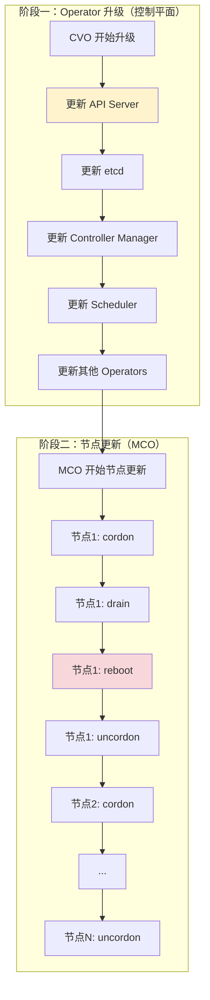
```mermaid
graph TB
    subgraph "阶段一：Operator 升级（控制平面）"
        A1[CVO 开始升级] --> A2[更新 API Server]
        A2 --> A3[更新 etcd]
        A3 --> A4[更新 Controller Manager]
        A4 --> A5[更新 Scheduler]
        A5 --> A6[更新其他 Operators]
    end
    
    subgraph "阶段二：节点更新（MCO）"
        B1[MCO 开始节点更新] --> B2[节点1: cordon]
        B2 --> B3[节点1: drain]
        B3 --> B4[节点1: reboot]
        B4 --> B5[节点1: uncordon]
        B5 --> B6[节点2: cordon]
        B6 --> B7[...]
        B7 --> B8[节点N: uncordon]
    end
    
    A6 --> B1
    
    style A2 fill:#fff3cd
    style B4 fill:#f8d7da
```

| 阶段 | 主要操作 | 对业务影响 | 影响程度 |
|------|---------|-----------|---------|
| **Operator 升级** | 控制面组件滚动更新 | API Server 短暂不可用 | 低（秒级） |
| **节点更新** | 逐节点 cordon/drain/reboot | Pod 被驱逐并重新调度 | 中（分钟级） |

#### 4.7.2 控制平面升级影响

##### (a) API Server 更新影响

```yaml
apiServerUpdateImpact:
  # 更新策略
  updateStrategy: "RollingUpdate"
  
  # 影响分析
  impact:
    - type: "短暂不可用"
      duration: "5-30秒"
      cause: "API Server Pod 重启"
      mitigation: "客户端重试机制"
      
    - type: "请求延迟增加"
      duration: "更新期间"
      cause: "负载均衡切换"
      mitigation: "多副本部署"
      
  # 高可用保障
  highAvailability:
    - "API Server 至少 2 副本"
    - "LB 自动摘除不可用实例"
    - "客户端指数退避重试"
```

##### (b) etcd 集群更新影响

```yaml
etcdUpdateImpact:
  # 更新策略
  updateStrategy: "逐成员滚动更新"
  
  # 影响分析
  impact:
    - type: "单成员不可用"
      duration: "1-3分钟/成员"
      cause: "etcd Pod 重启"
      mitigation: "多数派保持可用"
      
    - type: "写入延迟增加"
      duration: "更新期间"
      cause: "Leader 切换"
      mitigation: "3/5 节点 etcd 集群"
      
  # 关键约束
  constraints:
    - "3 节点集群：最多 1 个成员同时更新"
    - "5 节点集群：最多 2 个成员同时更新"
    - "必须保持多数派可用（quorum）"
```

##### (c) 控制面节点重启影响

```yaml
controlPlaneNodeReboot:
  # 更新策略
  updateStrategy: "逐节点滚动重启"
  
  # 影响分析
  impact:
    - type: "节点短暂不可用"
      duration: "3-10分钟/节点"
      cause: "节点重启应用新配置"
      
    - type: "控制面组件中断"
      duration: "节点重启期间"
      cause: "静态 Pod 随节点重启"
      mitigation: "多控制面节点"
      
  # 关键约束
  constraints:
    - "3 控制面节点：逐节点更新"
    - "每个节点更新前等待前一个节点就绪"
    - "etcd 健康检查通过后才继续"
```

#### 4.7.3 节点更新影响（MCO）

##### (a) Cordon-Drain-Reboot 流程

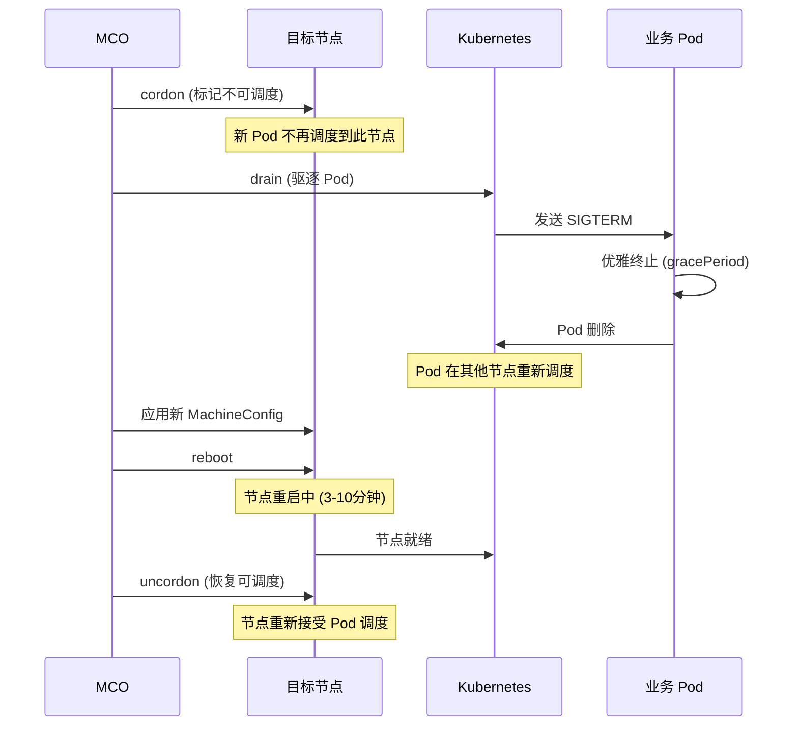
```mermaid
sequenceDiagram
    participant MCO as MCO
    participant Node as 目标节点
    participant K8s as Kubernetes
    participant Pods as 业务 Pod
    
    MCO->>Node: cordon (标记不可调度)
    Note over Node: 新 Pod 不再调度到此节点
    
    MCO->>K8s: drain (驱逐 Pod)
    K8s->>Pods: 发送 SIGTERM
    Pods->>Pods: 优雅终止 (gracePeriod)
    Pods->>K8s: Pod 删除
    
    Note over K8s: Pod 在其他节点重新调度
    
    MCO->>Node: 应用新 MachineConfig
    MCO->>Node: reboot
    
    Note over Node: 节点重启中 (3-10分钟)
    
    Node->>K8s: 节点就绪
    MCO->>Node: uncordon (恢复可调度)
    
    Note over Node: 节点重新接受 Pod 调度
```

##### (b) 节点重启期间的服务中断

```yaml
nodeRebootImpact:
  # 单节点影响
  singleNode:
    duration: "3-10分钟"
    impact:
      - "节点上所有 Pod 被驱逐"
      - "本地存储数据暂时不可访问"
      - "网络中断"
      
  # 多节点集群影响
  multiNodeCluster:
    impact:
      - "其他节点继续提供服务"
      - "被驱逐 Pod 在其他节点重新调度"
      - "Service 自动更新 Endpoints"
      
  # 关键指标
  metrics:
    - "单节点更新时间: 3-10分钟"
    - "Pod 驱逐时间: 30秒-5分钟"
    - "Pod 重新调度时间: 10秒-2分钟"
    - "总升级时间: 节点数 × 单节点时间"
```

##### (c) Node Disruption Policies（4.18+ 新特性）

OpenShift 4.18 引入 Node Disruption Policies，允许自定义节点更新行为以减少中断：

```yaml
# Node Disruption Policy 示例
apiVersion: machineconfiguration.openshift.io/v1
kind: NodeDisruptionPolicy
metadata:
  name: custom-policy
spec:
  # 定义哪些配置变更不需要重启
  policies:
    - actions:
        - type: "None"    # 不需要重启
      queries:
        - path: "/etc/chrony.conf"  # chrony 配置变更
        
    - actions:
        - type: "DaemonReload"     # 只需 daemon-reload
      queries:
        - path: "/etc/systemd/system/custom.service"
        
    - actions:
        - type: "Restart"          # 只需重启服务
        - service: "crio.service"
      queries:
        - path: "/etc/crio/crio.conf.d/"
        
    - actions:
        - type: "Reboot"           # 需要重启节点（默认）
      queries:
        - path: "/etc/kernel/"     # 内核变更
```

#### 4.7.4 业务影响评估矩阵

##### (a) 不同工作负载类型的影响

| 工作负载类型 | 影响程度 | 影响描述 | 缓解措施 |
|-------------|---------|---------|---------|
| **Deployment** | 低 | Pod 被驱逐后在其他节点重新调度 | 多副本 + PDB |
| **StatefulSet** | 中 | Pod 重建，PV 需重新挂载 | 多副本 + 存储多路径 |
| **DaemonSet** | 中 | 每节点一个 Pod，节点重启时中断 | 容忍节点中断 |
| **Job/CronJob** | 低-中 | 运行中的 Job 被中断 | 幂等设计 + 重试 |
| **有状态应用** | 高 | 数据一致性风险 | 主从架构 + 多副本 |

##### (b) 典型业务场景影响分析

```yaml
scenarioAnalysis:
  # 场景1：Web 应用（Deployment + Service + Ingress）
  webApp:
    replicas: 3
    impact: "几乎无感知"
    reason: "PDB 保证至少 2 个副本可用"
    mitigation: "确保 Pod 分布在不同节点"
    
  # 场景2：数据库（StatefulSet + PVC）
  database:
    replicas: 3
    impact: "短暂主从切换"
    reason: "主节点 Pod 被驱逐时触发故障转移"
    mitigation: "多副本 + 存储多路径"
    
  # 场景3：消息队列（StatefulSet）
  messageQueue:
    replicas: 3
    impact: "短暂消息延迟"
    reason: "Broker 重启期间消息堆积"
    mitigation: "多副本 + 持久化队列"
    
  # 场景4：单副本应用
  singleReplica:
    replicas: 1
    impact: "服务中断"
    reason: "Pod 被驱逐后需要等待重新调度"
    mitigation: "升级到维护窗口"
```

#### 4.7.5 最小化业务影响的机制

##### (a) Pod Disruption Budget (PDB)

```yaml
# PDB 示例
apiVersion: policy/v1
kind: PodDisruptionBudget
metadata:
  name: web-app-pdb
spec:
  minAvailable: 2          # 至少保持 2 个 Pod 可用
  # maxUnavailable: 1      # 或最多允许 1 个不可用
  selector:
    matchLabels:
      app: web-app
      
# 效果：
# - 节点 drain 时，最多驱逐 1 个 Pod
# - 保证至少 2 个 Pod 持续提供服务
# - MCO 会等待 PDB 条件满足后才继续
```

##### (b) Pod Anti-Affinity

```yaml
# Pod Anti-Affinity 示例
apiVersion: apps/v1
kind: Deployment
metadata:
  name: web-app
spec:
  replicas: 3
  template:
    spec:
      affinity:
        podAntiAffinity:
          requiredDuringSchedulingIgnoredDuringExecution:
            - labelSelector:
                matchLabels:
                  app: web-app
              topologyKey: "kubernetes.io/hostname"
              
# 效果：
# - 3 个 Pod 分布在不同节点
# - 单节点故障只影响 1 个 Pod
# - 升级时其他节点 Pod 继续服务
```

##### (c) 优雅终止（Graceful Termination）

```yaml
# 优雅终止配置
apiVersion: apps/v1
kind: Deployment
metadata:
  name: web-app
spec:
  template:
    spec:
      terminationGracePeriodSeconds: 60  # 优雅终止超时时间
      containers:
        - name: app
          lifecycle:
            preStop:
              exec:
                command: ["/bin/sh", "-c", "sleep 10"]  # 等待 LB 更新
                
# 效果：
# - Pod 删除前先执行 preStop hook
# - 等待现有请求处理完成
# - 通知 LB 摘除 Pod
# - 避免请求中断
```

#### 4.7.6 升级时间估算

##### (a) 集群规模与升级时间关系

```go
// 升级时间估算模型
type UpgradeTimeEstimator struct {
    // 控制面节点数
    ControlPlaneNodes int
    
    // Worker 节点数
    WorkerNodes int
    
    // 单节点更新时间（分钟）
    NodeUpdateTime int
    
    // Operator 更新时间（分钟）
    OperatorUpdateTime int
}

func (e *UpgradeTimeEstimator) EstimateTotalTime() int {
    // 控制面升级时间
    controlPlaneTime := e.ControlPlaneNodes * e.NodeUpdateTime
    
    // Operator 升级时间
    operatorTime := e.OperatorUpdateTime
    
    // Worker 节点升级时间
    workerTime := e.WorkerNodes * e.NodeUpdateTime
    
    // 总时间 = 控制面 + Operator + Worker
    return controlPlaneTime + operatorTime + workerTime
}

// 示例估算
// 3 控制面 + 10 Worker，单节点 5 分钟，Operator 15 分钟
// 总计: 3*5 + 15 + 10*5 = 15 + 15 + 50 = 80 分钟 ≈ 1.5 小时
```

##### (b) 典型集群升级时间参考

| 集群规模 | 控制面节点 | Worker 节点 | 预计升级时间 |
|---------|-----------|------------|-------------|
| **小型** | 3 | 3-5 | 30-45 分钟 |
| **中型** | 3 | 10-20 | 1-2 小时 |
| **大型** | 3-5 | 50-100 | 4-8 小时 |
| **超大型** | 5 | 100+ | 8-16 小时 |

#### 4.7.7 对 BKE 的借鉴

##### (a) 升级影响评估模型

```go
// BKE 升级影响评估模型
type UpgradeImpactAssessment struct {
    // 集群拓扑
    ClusterTopology ClusterTopology
    
    // 工作负载分析
    WorkloadAnalysis WorkloadAnalysis
    
    // 影响评估
    ImpactAssessment ImpactAssessment
    
    // 缓解建议
    MitigationRecommendations []Recommendation
}

type WorkloadAnalysis struct {
    // 单副本应用数量
    SingleReplicaApps int
    
    // 多副本应用数量
    MultiReplicaApps int
    
    // 有状态应用数量
    StatefulApps int
    
    // 关键业务应用
    CriticalApps []string
}

type ImpactAssessment struct {
    // 预计中断时间
    EstimatedDowntime time.Duration
    
    // 受影响应用
    AffectedApps []string
    
    // 风险等级
    RiskLevel RiskLevel
    
    // 建议升级窗口
    RecommendedWindow string
}
```

##### (b) 业务中断最小化设计

| 设计原则 | OpenShift 实现 | BKE 建议 |
|---------|---------------|---------|
| **渐进式更新** | 逐节点滚动更新 | 实现相同策略 |
| **PDB 支持** | 尊重 PDB 约束 | 必须实现 |
| **优雅终止** | 支持 preStop hook | 必须实现 |
| **健康检查** | 节点就绪后才继续 | 必须实现 |
| **升级失败处理** | OpenShift 不支持回滚，需联系支持或从备份恢复 | BKE 建议实现降级能力 |
| **维护窗口** | 支持暂停升级 | 建议实现 |

##### (c) 关键结论

**OpenShift 升级是否影响业务？**

**答案：会，但影响可控**

| 场景 | 影响程度 | 条件 |
|------|---------|------|
| **设计良好的无状态应用** | 几乎无感知 | 多副本 + PDB + Anti-Affinity |
| **有状态应用** | 可能受影响 | 需确保副本分布在多节点 |
| **单节点集群** | 必然中断 | 需选择升级窗口 |
| **关键基础设施** | 需特别关注 | Router/Registry 需多副本 |

**核心设计原则**：
1. **多副本部署**：至少 2 副本分布在不同节点
2. **PDB 保护**：设置 minAvailable 或 maxUnavailable
3. **Anti-Affinity**：确保 Pod 分布在不同节点
4. **优雅终止**：支持 preStop hook 和 gracePeriod
5. **维护窗口**：单副本应用选择低峰期升级

#### 4.7.8 停机窗口需求分析

基于 OpenShift 官方文档和最佳实践，本节深入分析 OpenShift 升级是否需要停机窗口，以及不同场景下的停机窗口需求。

##### (a) 停机窗口的定义与分类

```yaml
downtimeWindowClassification:
  # 完全停机窗口
  fullDowntime:
    definition: "集群完全不可用，所有服务中断"
    duration: "30分钟 - 数小时"
    scenario: "单节点集群升级、etcd 集群重建"
    impact: "所有业务中断"
    
  # 部分停机窗口
  partialDowntime:
    definition: "部分服务不可用，但核心业务可继续"
    duration: "秒级 - 分钟级"
    scenario: "单副本应用 Pod 重启、节点维护"
    impact: "部分业务受影响"
    
  # 零停机窗口
  zeroDowntime:
    definition: "业务无感知，服务持续可用"
    duration: "0（理论上的短暂抖动）"
    scenario: "多副本应用滚动更新、PDB 保护"
    impact: "无业务影响"
```

##### (b) OpenShift 升级的停机窗口需求矩阵

| 集群拓扑 | 应用架构 | 工作负载类型 | 业务容忍度 | 是否需要停机窗口 | 理由 |
|---------|---------|-------------|-----------|----------------|------|
| **多节点（≥3）** | 多副本（≥2） | 无状态 | 高可用 | ❌ 不需要 | PDB + Anti-Affinity 保证连续性 |
| **多节点（≥3）** | 多副本（≥2） | 有状态 | 高可用 | ⚠️ 可选 | 取决于数据一致性要求 |
| **多节点（≥3）** | 单副本 | 任意 | 可中断 | ✅ 需要 | Pod 驱逐期间服务中断 |
| **单节点** | 任意 | 任意 | 任意 | ✅ 必须 | 节点重启期间完全不可用 |
| **多节点（≥3）** | 多副本 | 关键基础设施 | 高可用 | ⚠️ 建议 | Router/Registry 中断影响全局 |

##### (c) 不同场景的停机窗口需求分析

**场景 1：多节点集群 + 多副本无状态应用**

```yaml
scenario1:
  clusterTopology: "3 控制面 + 10 Worker"
  application:
    type: "Deployment"
    replicas: 3
    stateless: true
  highAvailability:
    pdb: "minAvailable: 2"
    antiAffinity: "跨节点分布"
    
  upgradeImpact:
    apiServer: "短暂抖动（秒级），多副本自动切换"
    etcd: "单成员更新，多数派保持可用"
    workerNodes: "逐节点更新，PDB 保证至少 2 个 Pod 可用"
    application: "无感知，服务持续可用"
    
  downtimeRequirement: "❌ 不需要停机窗口"
  recommendation: "可直接在生产环境执行升级"
```

**场景 2：多节点集群 + 多副本有状态应用**

```yaml
scenario2:
  clusterTopology: "3 控制面 + 10 Worker"
  application:
    type: "StatefulSet"
    replicas: 3
    stateful: true
    storage: "PVC（网络存储）"
  highAvailability:
    pdb: "minAvailable: 2"
    antiAffinity: "跨节点分布"
    
  upgradeImpact:
    apiServer: "短暂抖动，多副本自动切换"
    etcd: "单成员更新，多数派保持可用"
    workerNodes: "逐节点更新，Pod 在其他节点重建"
    storage: "PVC 重新挂载，数据一致性由存储层保证"
    application: "短暂主从切换（如有），服务持续可用"
    
  downtimeRequirement: "⚠️ 可选停机窗口"
  recommendation: |
    - 如果应用支持自动故障转移（如 MySQL 主从、Redis Sentinel）：不需要停机窗口
    - 如果应用需要手动干预：建议在维护窗口升级
    - 如果数据一致性要求极高：建议在低峰期升级
```

**场景 3：多节点集群 + 单副本应用**

```yaml
scenario3:
  clusterTopology: "3 控制面 + 10 Worker"
  application:
    type: "Deployment"
    replicas: 1
    stateless: false
  highAvailability:
    pdb: "无"
    antiAffinity: "无"
    
  upgradeImpact:
    apiServer: "短暂抖动"
    etcd: "单成员更新"
    workerNodes: "Pod 所在节点更新时，Pod 被驱逐"
    application: "Pod 驱逐后需要等待重新调度（10秒-2分钟）"
    
  downtimeRequirement: "✅ 需要停机窗口"
  recommendation: |
    - 在业务低峰期执行升级
    - 提前通知用户可能的短暂中断
    - 考虑增加副本数以消除停机窗口需求
```

**场景 4：单节点集群**

```yaml
scenario4:
  clusterTopology: "1 控制面 + 0 Worker（单节点）"
  application:
    type: "任意"
    replicas: "任意"
  highAvailability:
    pdb: "不适用"
    antiAffinity: "不适用"
    
  upgradeImpact:
    controlPlane: "控制面组件重启，API Server 不可用"
    etcd: "etcd 重启，所有数据暂时不可访问"
    workerNodes: "节点重启，所有 Pod 中断"
    application: "完全中断（3-10分钟）"
    
  downtimeRequirement: "✅ 必须停机窗口"
  recommendation: |
    - 必须在维护窗口执行升级
    - 提前通知所有用户
    - 考虑迁移到多节点集群以获得高可用
```

**场景 5：关键基础设施组件**

```yaml
scenario5:
  components:
    - name: "Ingress Controller (Router)"
      replicas: 2
      impact: "中断会导致所有外部流量不可达"
      
    - name: "Image Registry"
      replicas: 2
      impact: "中断会导致镜像推送/拉取失败"
      
    - name: "DNS Operator"
      replicas: 2
      impact: "中断会导致服务发现失败"
      
    - name: "Monitoring Stack"
      replicas: 2
      impact: "中断会导致监控数据丢失"
      
  downtimeRequirement: "⚠️ 建议停机窗口"
  recommendation: |
    - 确保关键基础设施组件至少 2 副本
    - 配置 PDB 保证至少 1 个副本可用
    - 在维护窗口升级以降低风险
    - 升级前验证组件健康状态
```

##### (d) OpenShift 官方最佳实践

**升级前检查清单**

```yaml
preUpgradeChecklist:
  # 1. 集群健康检查
  clusterHealth:
    - "所有节点处于 Ready 状态"
    - "所有 ClusterOperator 处于 Available 状态"
    - "etcd 集群健康（无告警）"
    - "无 Degraded 或 Failed 的 Operator"
    
  # 2. 备份验证
  backupVerification:
    - "etcd 备份已完成且可恢复"
    - "应用数据备份已完成"
    - "备份存储位置可访问"
    
  # 3. 应用架构检查
  applicationArchitecture:
    - "关键应用配置了 PDB"
    - "多副本应用配置了 Anti-Affinity"
    - "单副本应用已识别并安排维护窗口"
    
  # 4. 资源充足性
  resourceSufficiency:
    - "集群有足够资源容纳 Pod 迁移"
    - "存储空间充足（至少 20% 可用）"
    - "网络带宽充足"
    
  # 5. 升级路径验证
  upgradePathValidation:
    - "目标版本在支持的升级路径中"
    - "升级镜像可访问"
    - "升级前置条件已满足"
```

**PDB 配置建议**

```yaml
pdbRecommendations:
  # 关键业务应用
  criticalApplications:
    minAvailable: "70%"  # 至少保持 70% 的 Pod 可用
    example: |
      apiVersion: policy/v1
      kind: PodDisruptionBudget
      metadata:
        name: critical-app-pdb
      spec:
        minAvailable: "70%"
        selector:
          matchLabels:
            app: critical-app
            
  # 一般业务应用
  generalApplications:
    maxUnavailable: 1  # 最多允许 1 个 Pod 不可用
    example: |
      apiVersion: policy/v1
      kind: PodDisruptionBudget
      metadata:
        name: general-app-pdb
      spec:
        maxUnavailable: 1
        selector:
          matchLabels:
            app: general-app
            
  # 基础设施组件
  infrastructureComponents:
    minAvailable: 1  # 至少保持 1 个副本可用
    example: |
      apiVersion: policy/v1
      kind: PodDisruptionBudget
      metadata:
        name: router-pdb
        namespace: openshift-ingress
      spec:
        minAvailable: 1
        selector:
          matchLabels:
            ingresscontroller.operator.openshift.io/deployment-ingresscontroller: default
```

**升级时间规划**

```yaml
upgradeTimePlanning:
  # 小型集群（3 控制面 + 5 Worker）
  smallCluster:
    estimatedTime: "30-45 分钟"
    recommendedWindow: "1 小时"
    bestTime: "业务低峰期（如凌晨 2-4 点）"
    
  # 中型集群（3 控制面 + 15 Worker）
  mediumCluster:
    estimatedTime: "1-2 小时"
    recommendedWindow: "3 小时"
    bestTime: "周末或节假日"
    
  # 大型集群（5 控制面 + 50 Worker）
  largeCluster:
    estimatedTime: "4-8 小时"
    recommendedWindow: "12 小时"
    bestTime: "计划维护窗口"
    
  # 超大型集群（5 控制面 + 100+ Worker）
  extraLargeCluster:
    estimatedTime: "8-16 小时"
    recommendedWindow: "24 小时"
    bestTime: "分批次升级或计划维护窗口"
```

##### (e) 停机窗口决策流程图

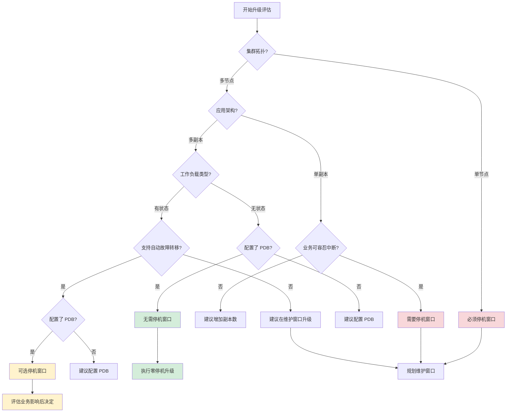
```mermaid
graph TD
    A[开始升级评估] --> B{集群拓扑?}
    
    B -->|单节点| C[必须停机窗口]
    B -->|多节点| D{应用架构?}
    
    D -->|单副本| E{业务可容忍中断?}
    E -->|是| F[需要停机窗口]
    E -->|否| G[建议增加副本数]
    
    D -->|多副本| H{工作负载类型?}
    
    H -->|无状态| I{配置了 PDB?}
    I -->|是| J[无需停机窗口]
    I -->|否| K[建议配置 PDB]
    
    H -->|有状态| L{支持自动故障转移?}
    L -->|是| M{配置了 PDB?}
    M -->|是| N[可选停机窗口]
    M -->|否| O[建议配置 PDB]
    L -->|否| P[建议在维护窗口升级]
    
    J --> Q[执行零停机升级]
    N --> R[评估业务影响后决定]
    P --> S[规划维护窗口]
    F --> S
    C --> S
    
    style J fill:#d4edda
    style Q fill:#d4edda
    style C fill:#f8d7da
    style F fill:#f8d7da
    style N fill:#fff3cd
    style R fill:#fff3cd
```

##### (f) 对 BKE 的建议

**停机窗口评估模型**

```go
// BKE 停机窗口评估模型
type DowntimeWindowAssessment struct {
    // 输入参数
    Input DowntimeAssessmentInput
    
    // 评估结果
    Result DowntimeAssessmentResult
    
    // 建议
    Recommendations []Recommendation
}

type DowntimeAssessmentInput struct {
    // 集群信息
    ClusterInfo ClusterInfo
    
    // 应用信息
    Applications []ApplicationInfo
    
    // 业务要求
    BusinessRequirements BusinessRequirements
}

type ClusterInfo struct {
    // 控制面节点数
    ControlPlaneNodes int
    
    // Worker 节点数
    WorkerNodes int
    
    // 是否单节点集群
    IsSingleNode bool
}

type ApplicationInfo struct {
    // 应用名称
    Name string
    
    // 副本数
    Replicas int
    
    // 是否有状态
    Stateful bool
    
    // 是否配置 PDB
    HasPDB bool
    
    // 是否配置 Anti-Affinity
    HasAntiAffinity bool
    
    // 是否关键业务
    IsCritical bool
    
    // 是否支持自动故障转移
    SupportsAutoFailover bool
}

type BusinessRequirements struct {
    // 最大可容忍中断时间（秒）
    MaxTolerableDowntime int
    
    // 是否允许在维护窗口升级
    AllowMaintenanceWindow bool
    
    // 升级时间偏好（如凌晨、周末）
    PreferredUpgradeTime string
}

type DowntimeAssessmentResult struct {
    // 是否需要停机窗口
    RequiresDowntimeWindow bool
    
    // 停机窗口类型
    DowntimeType DowntimeType
    
    // 预计中断时间（秒）
    EstimatedDowntime int
    
    // 受影响的应用
    AffectedApplications []string
    
    // 风险等级
    RiskLevel RiskLevel
    
    // 建议的升级策略
    RecommendedStrategy UpgradeStrategy
}

type DowntimeType string

const (
    DowntimeTypeNone          DowntimeType = "None"          // 无需停机窗口
    DowntimeTypePartial       DowntimeType = "Partial"       // 部分停机窗口
    DowntimeTypeFull          DowntimeType = "Full"          // 完全停机窗口
    DowntimeTypeMaintenance   DowntimeType = "Maintenance"   // 维护窗口
)

type UpgradeStrategy string

const (
    UpgradeStrategyZeroDowntime    UpgradeStrategy = "ZeroDowntime"    // 零停机升级
    UpgradeStrategyLowRisk         UpgradeStrategy = "LowRisk"         // 低风险升级
    UpgradeStrategyMaintenanceWindow UpgradeStrategy = "MaintenanceWindow" // 维护窗口升级
    UpgradeStrategyBatchUpgrade    UpgradeStrategy = "BatchUpgrade"    // 分批升级
)

// 评估函数
func (a *DowntimeWindowAssessment) Evaluate() {
    // 1. 检查单节点集群
    if a.Input.ClusterInfo.IsSingleNode {
        a.Result.RequiresDowntimeWindow = true
        a.Result.DowntimeType = DowntimeTypeFull
        a.Result.RecommendedStrategy = UpgradeStrategyMaintenanceWindow
        a.Result.RiskLevel = RiskLevelHigh
        return
    }
    
    // 2. 检查单副本应用
    hasSingleReplicaApp := false
    for _, app := range a.Input.Applications {
        if app.Replicas == 1 {
            hasSingleReplicaApp = true
            break
        }
    }
    
    if hasSingleReplicaApp {
        if a.Input.BusinessRequirements.MaxTolerableDowntime == 0 {
            a.Result.RequiresDowntimeWindow = true
            a.Result.DowntimeType = DowntimeTypePartial
            a.Result.RecommendedStrategy = UpgradeStrategyMaintenanceWindow
            a.Result.RiskLevel = RiskLevelMedium
        } else {
            a.Result.RequiresDowntimeWindow = true
            a.Result.DowntimeType = DowntimeTypePartial
            a.Result.RecommendedStrategy = UpgradeStrategyMaintenanceWindow
            a.Result.RiskLevel = RiskLevelMedium
        }
        return
    }
    
    // 3. 检查多副本应用配置
    allAppsConfigured := true
    for _, app := range a.Input.Applications {
        if !app.HasPDB || !app.HasAntiAffinity {
            allAppsConfigured = false
            break
        }
    }
    
    if !allAppsConfigured {
        a.Result.RequiresDowntimeWindow = false
        a.Result.DowntimeType = DowntimeTypePartial
        a.Result.RecommendedStrategy = UpgradeStrategyLowRisk
        a.Result.RiskLevel = RiskLevelLow
        a.Recommendations = append(a.Recommendations, Recommendation{
            Type: "ConfigurePDB",
            Description: "建议为所有应用配置 PDB 和 Anti-Affinity",
        })
        return
    }
    
    // 4. 检查有状态应用
    hasStatefulApp := false
    for _, app := range a.Input.Applications {
        if app.Stateful && !app.SupportsAutoFailover {
            hasStatefulApp = true
            break
        }
    }
    
    if hasStatefulApp {
        a.Result.RequiresDowntimeWindow = false
        a.Result.DowntimeType = DowntimeTypePartial
        a.Result.RecommendedStrategy = UpgradeStrategyLowRisk
        a.Result.RiskLevel = RiskLevelLow
        return
    }
    
    // 5. 零停机升级
    a.Result.RequiresDowntimeWindow = false
    a.Result.DowntimeType = DowntimeTypeNone
    a.Result.RecommendedStrategy = UpgradeStrategyZeroDowntime
    a.Result.RiskLevel = RiskLevelLow
}
```

**升级策略选择**

| 场景 | 推荐策略 | 停机窗口需求 | 实施复杂度 | 风险等级 |
|------|---------|-------------|-----------|---------|
| **零停机升级** | 多副本 + PDB + Anti-Affinity | 无 | 高（需前期架构设计） | 低 |
| **低风险升级** | 多副本 + 部分配置 | 可选 | 中 | 低 |
| **维护窗口升级** | 单副本或单节点 | 必须 | 低 | 中 |
| **分批升级** | 超大型集群 | 必须 | 高 | 中 |

**业务连续性保障**

```yaml
businessContinuityGuarantee:
  # 架构设计阶段
  architectureDesign:
    - "所有关键应用至少 2 副本"
    - "配置 PDB 保证最小可用副本数"
    - "配置 Anti-Affinity 跨节点分布"
    - "有状态应用支持自动故障转移"
    
  # 升级前准备
  preUpgradePreparation:
    - "验证所有应用配置正确"
    - "执行 etcd 备份"
    - "验证升级路径"
    - "通知相关团队"
    
  # 升级执行
  upgradeExecution:
    - "监控升级进度"
    - "检查 Operator 状态"
    - "验证节点就绪"
    - "验证应用健康"
    
  # 升级后验证
  postUpgradeVerification:
    - "验证所有节点 Ready"
    - "验证所有 Operator Available"
    - "验证所有应用健康"
    - "执行端到端测试"
    
  # 回滚准备
  rollbackPreparation:
    - "保留 etcd 备份"
    - "准备回滚脚本"
    - "定义回滚触发条件"
    - "测试回滚流程"
```

**核心结论**

**OpenShift 升级是否需要停机窗口？**

**答案：取决于场景，但通过合理设计可以实现零停机升级**

| 关键因素 | 影响 | 建议 |
|---------|------|------|
| **集群拓扑** | 单节点必须停机，多节点可选 | 生产环境使用多节点集群 |
| **应用架构** | 单副本必须停机，多副本可选 | 关键应用至少 2 副本 |
| **高可用配置** | PDB + Anti-Affinity 是关键 | 所有应用配置 PDB |
| **工作负载类型** | 有状态应用需特别关注 | 支持自动故障转移 |
| **业务容忍度** | 决定是否需要维护窗口 | 明确业务 SLA 要求 |

**OpenShift 升级的三种模式**：

1. **零停机升级（推荐）**
   - 条件：多节点 + 多副本 + PDB + Anti-Affinity
   - 影响：业务无感知
   - 适用：生产环境关键业务

2. **低风险升级**
   - 条件：多节点 + 多副本 + 部分配置
   - 影响：短暂抖动（秒级）
   - 适用：一般业务应用

3. **维护窗口升级**
   - 条件：单节点或单副本
   - 影响：服务中断（分钟级）
   - 适用：开发测试环境或非关键业务

**对 BKE 的最终建议**：

1. **架构设计阶段**：确保所有关键应用满足零停机升级条件
2. **升级策略选择**：根据业务容忍度选择合适的升级策略
3. **停机窗口评估**：升级前执行自动化评估，确定是否需要停机窗口
4. **业务连续性保障**：建立完整的升级前检查、执行监控、升级后验证流程
5. **回滚准备**：始终保留回滚能力，定义明确的回滚触发条件

## 五、回滚时的配置与数据管理

### 5.1 回滚时组件启动参数的一致性保证

#### 5.1.1 核心机制：manifest 随版本走

OpenShift 的每个组件（API Server、Controller Manager、Scheduler、etcd 等）的静态 Pod manifest 都包含在 **release payload** 中。每个版本都有自己完整的一套 manifest：

```
Release Payload v4.11
├── manifests/
│   ├── kube-apiserver-pod.yaml       ← v4.11 的启动参数
│   ├── kube-controller-manager-pod.yaml
│   ├── kube-scheduler-pod.yaml
│   └── etcd-pod.yaml

Release Payload v4.12
├── manifests/
│   ├── kube-apiserver-pod.yaml       ← v4.12 的启动参数（可能有变化）
│   ├── kube-controller-manager-pod.yaml
│   ├── kube-scheduler-pod.yaml
│   └── etcd-pod.yaml
```

**回滚时的行为**：不是"修改"当前 manifest，而是**用旧版本的完整 manifest 替换当前 manifest**。

#### 5.1.2 CVO 的回滚流程

```
1. CVO 拉取旧版本的 release payload（OCI 镜像）
   │
   v
2. CVO 从 payload 中提取旧版本的 manifest
   │
   ├── kube-apiserver-pod.yaml (旧版本)
   │   包含: 旧版本的 feature gates
   │   包含: 旧版本的启动参数
   │   不包含: 新版本新增的参数
   │
   v
3. CVO 将旧版本的 manifest 写入 /etc/kubernetes/manifests/
   │  （覆盖新版本的 manifest）
   │
   v
4. kubelet 检测到 manifest 文件变化
   │
   v
5. kubelet 停止旧的静态 Pod（新版本参数）
   │
   v
6. kubelet 用新的 manifest 启动静态 Pod（旧版本参数）
```

#### 5.1.3 具体示例

假设 v4.12 的 API Server 新增了一个启动参数：

**v4.11 的 kube-apiserver-pod.yaml**：
```yaml
apiVersion: v1
kind: Pod
metadata:
  name: kube-apiserver
spec:
  containers:
  - name: kube-apiserver
    image: quay.io/openshift/kube-apiserver:v4.11
    command:
    - kube-apiserver
    - --authorization-mode=Node,RBAC
    - --enable-admission-plugins=NodeRestriction
    - --feature-gates=RotateKubeletServerCertificate=true
    # v4.11 没有 --new-feature 参数
```

**v4.12 的 kube-apiserver-pod.yaml**：
```yaml
apiVersion: v1
kind: Pod
metadata:
  name: kube-apiserver
spec:
  containers:
  - name: kube-apiserver
    image: quay.io/openshift/kube-apiserver:v4.12
    command:
    - kube-apiserver
    - --authorization-mode=Node,RBAC
    - --enable-admission-plugins=NodeRestriction
    - --feature-gates=RotateKubeletServerCertificate=true
    - --new-feature=enabled              # v4.12 新增的参数
```

**回滚到 v4.11 时**：
- v4.11 的 manifest 直接覆盖 v4.12 的 manifest
- `--new-feature` 参数消失（因为 v4.11 的 manifest 中没有）
- API Server 使用 v4.11 的启动参数重新启动

#### 5.1.4 配置文件的处理

除了静态 Pod manifest，还有一些配置文件也包含在 release payload 中：

```
/etc/kubernetes/static-pod-resources/
├── kube-apiserver/
│   ├── config.yaml           ← API Server 配置
│   ├── encryption-config.yaml ← 加密配置
│   └── audit-policy.yaml     ← 审计策略
```

这些配置文件回滚时同样会被旧版本的配置覆盖。

#### 5.1.5 需要关注的边界情况

| 边界情况 | 说明 | 处理方式 |
|---------|------|---------|
| **Feature Gate 变化** | v4.12 新增 FeatureC，回滚后参数消失 | 如果用户在 v4.12 期间使用了 FeatureC 创建的资源，回滚后可能无法被 v4.11 理解 |
| **Admission Plugin 变化** | v4.12 新增 NewPlugin，回滚后消失 | NewPlugin 创建的资源仍然存在（只要 API 兼容） |
| **etcd 数据格式变化** | v4.12 在 etcd 中写入新格式数据 | 需要确保存储版本迁移兼容旧版本 |

### 5.2 用户配置的回滚保护机制

#### 5.2.1 两层管理架构

```
┌──────────────────────────────────────────────────────────────┐
│  第一层：CVO（Cluster Version Operator）                      │
│  管理范围：平台自身的"骨架"                                    │
│  ├─ 静态 Pod manifest（API Server、etcd 等）                  │
│  ├─ Cluster Operator 的 Deployment（如 ingress-operator）     │
│  ├─ CRD 定义本身                                              │
│  └─ 回滚时：完全替换为旧版本                                   │
├──────────────────────────────────────────────────────────────┤
│  第二层：Cluster Operator（由 CVO 部署）                      │
│  管理范围：用户通过 CR 配置的"血肉"                            │
│  ├─ IngressController CR → 生成 router Deployment            │
│  ├─ Authentication CR → 生成 OAuth 配置                      │
│  ├─ Proxy CR → 生成代理配置                                   │
│  └─ 回滚时：CR 不动，Operator 继续按 CR 配置                  │
└──────────────────────────────────────────────────────────────┘
```

#### 5.2.2 具体示例：Ingress 配置

用户创建了一个 IngressController CR：

```yaml
apiVersion: operator.openshift.io/v1
kind: IngressController
metadata:
  name: default
  namespace: openshift-ingress-operator
spec:
  replicas: 5                          # 用户自定义：5 个副本
  routeSelector:                       # 用户自定义：路由选择器
    matchLabels:
      type: production
  nodePlacement:                       # 用户自定义：调度到特定节点
    nodeSelector:
      matchLabels:
        node-role.kubernetes.io/infra: ""
```

**回滚时发生了什么**：

| 资源 | 谁管理 | 回滚行为 |
|------|--------|---------|
| `openshift-ingress-operator` Deployment | CVO | 替换为旧版本的 Operator 二进制 |
| `IngressController` CR | 用户（etcd 数据） | **不动**，CR 仍在 etcd 中 |
| `router-default` Deployment（5 副本） | ingress-operator | Operator 重启后重新读取 CR，按 CR 配置重建 |

#### 5.2.3 技术实现原理

**所有权标记（Owner Reference）**：

CVO 创建的资源带有 CVO 的 owner reference：

```yaml
metadata:
  ownerReferences:
  - apiVersion: config.openshift.io/v1
    kind: ClusterVersion
    name: version
    uid: <cvo-uid>
```

回滚时，CVO 只操作带有自己 owner reference 的资源。用户创建的 CR 没有 CVO 的 owner reference，所以不会被回滚。

**Operator 的 Reconcile 循环**：

```
ingress-operator 的 Reconcile 循环：

1. 读取 IngressController CR（从 etcd）
2. 根据 CR 的 spec 计算期望状态
3. 创建/更新 router Deployment（按 CR 配置）
4. 持续监听 CR 变化，实时同步

回滚时：
1. Operator 二进制被替换为旧版本
2. Operator Pod 重启
3. Reconcile 循环重新启动
4. 重新读取 etcd 中的 IngressController CR
5. 按 CR 配置重建 router → 用户配置不丢失 ✓
```

#### 5.2.4 数据存储在 etcd 中

用户的所有 CR 都存储在 etcd 中：

```
etcd 中的数据：
├── /registry/operator.openshift.io/ingresscontrollers/.../default
│   └── {replicas: 5, routeSelector: ...}    ← 用户配置，回滚不动
├── /registry/authentication/.../cluster
│   └── {type: OIDC, ...}                    ← 用户配置，回滚不动
└── /registry/config.openshift.io/proxies/.../cluster
    └── {httpProxy: ..., httpsProxy: ...}    ← 用户配置，回滚不动
```

回滚只替换 Operator 的二进制和 manifest，不删除 etcd 中的用户数据。

#### 5.2.5 需要注意的边界情况

| 边界情况 | 说明 | 影响 |
|---------|------|------|
| **CRD 不兼容** | v4.12 的 CRD 新增了字段，用户在 CR 中使用了这些字段 | 回滚到 v4.11 后，v4.11 的 CRD 不认识新字段，但 Kubernetes 会保留未知字段 |
| **Operator 行为变化** | v4.12 的 Operator 对同一个 CR 字段有不同的处理逻辑 | 回滚后 Operator 按 v4.11 的逻辑处理 CR，行为可能变化 |
| **不可逆的数据迁移** | v4.12 的 Operator 对 etcd 中的数据做了不可逆的修改 | 回滚后 v4.11 的 Operator 可能无法正确恢复配置 |

### 5.3 配置数据的持久化方式

#### 5.3.1 核心原理

```
回滚时 CVO 替换的内容（会丢失）：
├── 静态 Pod manifest（/etc/kubernetes/manifests/）
├── Operator Deployment 的 manifest
├── CVO 管理的 ConfigMap/Secret（带有 CVO owner reference 的）
└── CVO 管理的 CRD 定义

回滚时不动的内容（会保留）：
├── etcd 数据目录（/var/lib/etcd/）
├── 用户创建的 CR
├── 用户创建的 ConfigMap/Secret
├── 用户创建的业务资源（Pod、Service 等）
└── 节点上的非 CVO 管理文件
```

**关键洞察**：只要数据存储在 etcd 中（任何 K8s 资源都存储在 etcd 中），且不被 CVO 主动删除，回滚后就会保留。

#### 5.3.2 四种持久化方式

| 方式 | 用途 | 回滚后是否保留 | 说明 |
|------|------|--------------|------|
| **CR** | Operator 管理的核心配置 | ✓ 保留 | Operator 主动 watch CR，自动按 CR 配置重建资源 |
| **ConfigMap/Secret** | 证书、代理配置等 | ✓ 保留 | 存储在 etcd 中，回滚后保留 |
| **MachineConfig** | 节点级配置（kubelet 参数等） | ✓ 保留 | MCO 管理，存储在 etcd 中 |
| **注解/标签** | 资源元数据 | ✓ 保留 | 存储在 etcd 中 |

#### 5.3.3 哪些配置必须 CR 化

| 配置类型 | 是否必须 CR 化 | 原因 |
|---------|--------------|------|
| **Operator 行为配置**（如 replicas、调度策略） | **是** | Operator 需要 watch 并自动 reconcile |
| **集群级策略**（如认证、网络策略） | **是** | 需要 schema 验证和版本管理 |
| **TLS 证书/密钥** | **否** | Secret 存储在 etcd，回滚后保留 |
| **环境变量/简单键值对** | **否** | ConfigMap 存储在 etcd，回滚后保留 |
| **节点级配置**（kubelet 参数） | **是**（通过 MachineConfig） | 需要 MCO 管理并自动应用到节点 |
| **用户业务资源** | **否** | 普通 K8s 资源存储在 etcd，回滚后保留 |

#### 5.3.4 CR 化的真正价值

CR 化不是为了"保留数据"（ConfigMap 也能保留），而是为了：

| 价值 | 说明 |
|------|------|
| **Schema 验证** | CRD 定义字段类型，防止配置错误 |
| **版本转换** | CRD 支持 conversion webhook，跨版本兼容 |
| **Operator 自动 reconcile** | watch CR → 自动同步状态 |
| **状态反馈** | CR.status 反映配置的实际执行状态 |
| **所有权管理** | owner reference 明确谁管理什么 |
| **RBAC 控制** | 可以对 CR 做细粒度权限控制 |

### 5.4 CRD 变化时的回滚处理

#### 5.4.1 场景分析

假设 v4.12 新增了一个 CRD：

```
v4.11 的 release payload：
├── CRD: IngressController (已有)
├── CRD: Authentication (已有)
└── 没有 NewFeature CRD

v4.12 的 release payload：
├── CRD: IngressController (已有)
├── CRD: Authentication (已有)
├── CRD: NewFeature (新增)    ← 新增
└── 用户创建了 NewFeature CR 实例
```

#### 5.4.2 回滚时的行为

**OpenShift 的实际行为：保留新增的 CRD，不删除**

```
回滚前（v4.12）：
  etcd 中：
  ├── CRD: NewFeature          ← v4.12 新增的
  ├── CR: NewFeature/my-config ← 用户创建的实例
  └── CRD: IngressController   ← 已有的

回滚后（v4.11）：
  etcd 中：
  ├── CRD: NewFeature          ← 保留（CVO 不删除）
  ├── CR: NewFeature/my-config ← 保留（数据不丢失）
  └── CRD: IngressController   ← 保留
```

**OpenShift 选择保留新增 CRD 的原因**：

1. **数据安全优先**：删除 CRD 会导致用户数据丢失，这是不可接受的
2. **CRD 本身是声明式的**：CRD 只是 schema 定义，保留它不会造成危害
3. **Operator 不存在**：v4.11 没有对应的 Operator，CR 不会被 reconcile，但数据仍在
4. **用户可以手动处理**：用户可以选择保留或手动删除

#### 5.4.3 不同 CRD 变化类型的处理

| 变化类型 | CVO 行为 | 数据是否丢失 | 用户需要做什么 |
|---------|---------|------------|--------------|
| **新增 CRD** | 保留 CRD（不删除） | 不丢失 | 无需操作，或手动清理 |
| **新增 CRD 字段** | CRD 替换为旧版本 | 不丢失（etcd 保留） | 无需操作 |
| **删除 CRD 字段** | CRD 替换为旧版本 | 可能丢失（取决于数据迁移） | 检查数据完整性 |
| **修改 CRD 字段类型** | CRD 替换为旧版本 | 可能不兼容 | 检查数据兼容性 |

#### 5.4.4 Kubernetes 对未知字段的处理

CRD 中删除字段定义后：
- etcd 中已有的 CR 数据**不会被清除**
- 通过 API 读取 CR 时，未知字段会被**静默丢弃**（不返回）
- 但数据仍在 etcd 中，如果 CRD 恢复该字段，数据又可见

#### 5.4.5 对 BKE 的启示

| 设计要点 | 建议 |
|---------|------|
| **新增 CRD** | 回滚时保留 CRD 和 CR，不删除 |
| **CRD 字段变化** | 保证相邻版本 CRD 向后兼容 |
| **数据迁移** | 如果必须删除字段，先做数据迁移再删除 |
| **版本转换** | 考虑实现 CRD conversion webhook |
| **回滚前检查** | 检查是否有新版本独有的 CR/数据 |

### 5.5 总结

#### 5.5.1 回滚时数据保护的核心原则

| 原则 | 说明 |
|------|------|
| **manifest 随版本走** | 每个版本的 release payload 中包含完整的 manifest 和配置文件 |
| **CVO 只管 CVO 创建的资源** | 用户通过 CR 创建的资源归 Operator 管，回滚时不动 |
| **数据持久化在 etcd** | 只要数据存储在 etcd 中且不被主动删除，回滚后就会保留 |
| **新增 CRD 不删除** | 数据安全优先，保留新增的 CRD 和 CR |

#### 5.5.2 对 BKE 的设计建议

| 设计要点 | OpenShift 的做法 | BKE 需要做的 |
|---------|-----------------|-------------|
| **分层管理** | CVO 管骨架，Operator 管血肉 | 明确区分平台配置和用户配置 |
| **CR 存储在 etcd** | 用户配置作为 CR 存储在 etcd | 用户配置通过 BKECluster CR 管理 |
| **Operator 独立 Reconcile** | 每个 Operator 独立读取 CR | BKE Agent 独立读取配置 |
| **回滚只替换二进制** | CVO 只替换 Operator 的 Deployment | 回滚时只替换二进制，不删除用户 CR |
| **CRD 兼容性** | 保证相邻版本 CRD 兼容 | 保证相邻版本 BKECluster CRD 兼容 |
| **manifest 版本化** | 每个版本有完整的 manifest 集合 | 需要在 ReleaseImage Bundle 中包含完整 manifest |

## 六、关键设计洞察

### 5.1 回滚能力对比

| 场景 | 是否支持回滚 | 处理方式 | 复杂度 |
|------|------------|---------|--------|
| **安装失败** | ❌ 不支持 | 重建集群 | 低 |
| **扩容失败** | ✅ 支持 | 缩容（减少 replicas） | 低 |
| **升级失败** | ❌ 不支持 | 联系 Red Hat 支持或从 etcd 备份恢复 | 高 |
| **配置变更失败** | ✅ 支持 | 回滚 MachineConfig | 中 |

### 5.2 回滚粒度

```
集群级回滚
  ├─ ClusterVersion 回滚
  ├─ Operator 回滚
  └─ 节点配置回滚

节点级回滚
  ├─ MachineConfig 回滚
  └─ 节点重启应用配置

资源级回滚
  ├─ Machine/MachineSet 回滚
  └─ 云资源销毁
```

### 5.3 升级/降级状态机

```
Partial (升级中) → Completed (升级成功)
     ↓
Partial (升级失败) → [用户手动触发降级] → Partial (降级中) → Completed (降级成功)
```

### 5.4 关键设计原则

| 原则 | 说明 | OpenShift 实现 |
|------|------|---------------|
| **声明式** | 通过期望状态触发回滚 | 修改 `spec.desiredUpdate` |
| **渐进式** | 逐组件、逐节点回滚 | CVO 按顺序回滚 Operator |
| **可观测** | 完整的状态和事件记录 | `status.history` + Events |
| **安全** | 回滚前验证 | 健康检查 + 超时控制 |
| **幂等** | 多次回滚结果一致 | 基于期望状态的收敛 |

## 七、对 BKE 的借鉴意义

### 7.1 已借鉴的设计

从代码分析看，BKE 已借鉴 OpenShift 的核心设计：

| OpenShift | BKE 对应 | 说明 |
|-----------|---------|------|
| `ClusterVersion` | `ClusterVersion` | 集群版本管理 |
| `ReleaseImage` | `ReleaseImage` | 发布版本清单 |
| `UpdateHistory` | `UpdateHistory` | 升级历史 |
| `UpgradeHistory` | `UpgradeHistory` | 升级历史 |
| `ClusterVersionRollingBack` | `ClusterVersionRollingBack` | 回滚状态 |

### 7.2 建议增强的能力

基于 OpenShift 经验，建议 BKE 增强以下能力：

#### 7.2.1 安装失败处理

```go
// 建议：增加安装失败处理机制
type InstallFailureHandler struct {
    // 自动重试策略
    RetryPolicy RetryPolicy
    
    // 清理策略
    CleanupStrategy CleanupStrategy
    
    // 通知策略
    NotificationStrategy NotificationStrategy
}
```

#### 7.2.2 扩容回滚优化

```go
// 建议：增强扩容回滚能力
type ScaleRollbackSpec struct {
    // 优雅删除策略
    GracefulDeletion bool
    
    // 数据保留策略
    RetainPVC bool
    
    // 回滚超时
    Timeout *metav1.Duration
    
    // 回滚钩子
    PreRollbackHook  *Hook
    PostRollbackHook *Hook
}
```

#### 7.2.3 升级回滚增强

```go
// 建议：增强升级降级能力
type UpgradeDowngradeSpec struct {
    // 降级条件（手动触发）
    DowngradeConditions []DowngradeCondition
    
    // 降级策略
    Strategy DowngradeStrategy
    
    // 降级验证
    Validation DowngradeValidation
    
    // 降级历史保留
    HistoryRetention int
}

type DowngradeCondition struct {
    // 条件类型（HealthCheck/Timeout/ErrorThreshold）
    Type DowngradeConditionType
    
    // 阈值
    Threshold int
    
    // 时间窗口
    TimeWindow *metav1.Duration
}
```

### 7.3 实施建议

| 优先级 | 能力 | 工作量 | 价值 |
|--------|------|--------|------|
| **P0** | 升级失败降级能力（BKE 差异化能力） | 高 | 高 |
| **P0** | 扩容失败缩容能力 | 低 | 高 |
| **P1** | 降级历史审计 | 低 | 中 |
| **P1** | 降级钩子机制 | 中 | 中 |
| **P2** | 跨版本降级 | 高 | 低 |
| **P2** | 部分降级 | 高 | 低 |

## 八、总结

### 8.1 OpenShift 回滚能力特点

1. **安装不支持回滚**：设计哲学是"快速失败，重建集群"
2. **扩容支持缩容**：通过声明式 API 减少 replicas（注意：这是节点缩容，不是版本回滚）
3. **升级不支持回滚**：OpenShift 不支持将集群还原到以前版本，升级失败后需联系 Red Hat 支持或从 etcd 备份恢复
4. **配置支持回滚**：通过 MachineConfig 版本管理

### 8.2 核心设计洞察

1. **声明式优于命令式**：通过修改期望状态触发回滚，而非调用回滚 API
2. **渐进式回滚**：逐组件、逐节点回滚，降低风险
3. **完整的历史记录**：`status.history` 提供完整的升级/回滚审计
4. **安全优先**：回滚前验证、超时控制、健康检查

### 8.3 对 BKE 的启示

1. **安装失败**：建议实现自动重试和清理机制，而非回滚
2. **扩容失败**：实现声明式缩容，减少 replicas 即可
3. **升级失败**：由于 OpenShift 不支持版本回滚，BKE 可以考虑实现自己的降级机制作为差异化能力
4. **状态管理**：完善 `UpgradeHistory`，记录完整的升级/降级历史

## 九、优化状态设计方案

### 9.1 当前设计的问题分析

#### 9.1.1 状态转换过于复杂

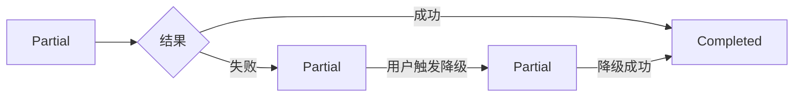
```mermaid
graph LR
    A[Partial] --> B{结果}
    B -->|成功| C[Completed]
    B -->|失败| D[Partial]
    D -->|用户触发降级| E[Partial]
    E -->|降级成功| C
```

**问题**：
- 状态转换路径不清晰
- 需要同时管理 history 数组和 state 字段

#### 9.1.2 history 数组管理复杂

```go
// current 获取逻辑复杂
func getCurrentVersion(cv *ClusterVersion) string {
    latest := cv.Status.History[0]
    
    if latest.State == CompletedUpdateState {
        return latest.Version
    }
    
    if latest.State == PartialUpdateState {
        for i := 1; i < len(cv.Status.History); i++ {
            if cv.Status.History[i].State == CompletedUpdateState {
                return cv.Status.History[i].Version
            }
        }
    }
    
    return ""
}
```

**问题**：
- 需要遍历 history 数组
- 不同状态的获取逻辑不同
- 容易出错

#### 9.1.3 状态语义不清晰

| 状态 | 问题 |
|------|------|
| `Partial` | 既表示"升级中"，又表示"升级失败"，又表示"降级中" |
| `Completed` | 既表示"升级成功"，又表示"降级成功" |

#### 9.1.4 降级失败场景处理复杂

```yaml
# 降级失败时的状态
status:
  history:
  - state: Partial                 # 失败的升级记录
    version: "4.12.0"
  
  - state: Partial                 # 失败的降级记录
    version: "4.11.18"
  
  conditions:
  - type: Failing
    status: "True"
    reason: DowngradeFailed
```

**问题**：
- 状态不一致
- 需要人工干预
- 难以自动恢复

### 9.2 新的状态设计方案

#### 9.2.1 设计原则

1. **分离关注点**：将"操作状态"和"版本状态"分离
2. **简化状态转换**：减少状态数量，明确状态语义
3. **独立审计日志**：使用独立的审计日志记录所有操作
4. **清晰的 current**：使用单一字段表示当前版本

#### 9.2.2 核心设计

##### 1. 状态字段设计

```go
type ClusterVersionStatus struct {
    // CurrentVersion 当前稳定运行的版本
    CurrentVersion string `json:"currentVersion"`
    
    // DesiredVersion 期望的目标版本
    DesiredVersion string `json:"desiredVersion"`
    
    // OperationState 当前操作状态
    OperationState OperationState `json:"operationState"`
    
    // AuditLog 审计日志（独立于状态）
    AuditLog []AuditRecord `json:"auditLog"`
    
    // Conditions 状态条件
    Conditions []metav1.Condition `json:"conditions"`
}
```

##### 2. 操作状态设计

```go
type OperationState string

const (
    // OperationIdle 空闲状态，无操作进行中
    OperationIdle OperationState = "Idle"
    
    // OperationUpgrading 正在升级
    OperationUpgrading OperationState = "Upgrading"
    
    // OperationRollingBack 正在回滚
    OperationRollingBack OperationState = "RollingBack"
    
    // OperationFailed 操作失败（升级或回滚失败）
    OperationFailed OperationState = "Failed"
)
```

**状态语义**：

| 状态 | 含义 | 是否终态 |
|------|------|---------|
| `Idle` | 无操作，集群稳定 | 是 |
| `Upgrading` | 正在升级到新版本 | 否 |
| `RollingBack` | 正在回滚到旧版本 | 否 |
| `Failed` | 操作失败，需要人工干预 | 是 |

##### 3. 审计日志设计

```go
type AuditRecord struct {
    // ID 唯一标识符
    ID string `json:"id"`
    
    // OperationType 操作类型
    OperationType OperationType `json:"operationType"`
    
    // FromVersion 操作前版本
    FromVersion string `json:"fromVersion"`
    
    // ToVersion 操作后版本
    ToVersion string `json:"toVersion"`
    
    // Status 操作状态
    Status OperationStatus `json:"status"`
    
    // StartedAt 开始时间
    StartedAt metav1.Time `json:"startedAt"`
    
    // CompletedAt 完成时间
    CompletedAt *metav1.Time `json:"completedAt,omitempty"`
    
    // ErrorMessage 错误信息
    ErrorMessage string `json:"errorMessage,omitempty"`
    
    // Metadata 元数据
    Metadata map[string]string `json:"metadata,omitempty"`
}

type OperationType string

const (
    OperationTypeUpgrade    OperationType = "Upgrade"
    OperationTypeRollback   OperationType = "Rollback"
)

type OperationStatus string

const (
    OperationStatusPending    OperationStatus = "Pending"
    OperationStatusInProgress OperationStatus = "InProgress"
    OperationStatusSucceeded  OperationStatus = "Succeeded"
    OperationStatusFailed     OperationStatus = "Failed"
)
```

##### 4. 状态转换设计

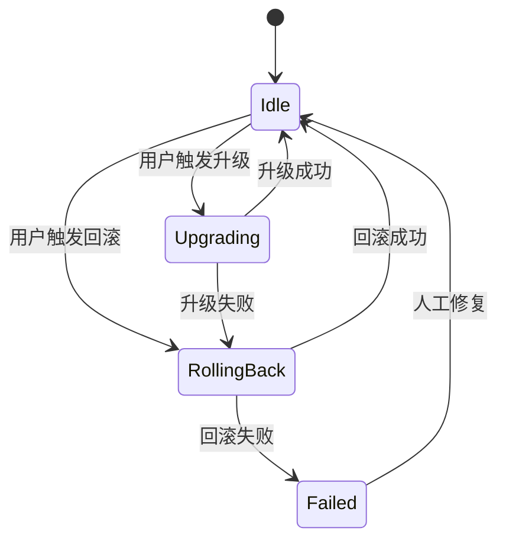
```mermaid
stateDiagram-v2
    [*] --> Idle
    
    Idle --> Upgrading : 用户触发升级
    Idle --> RollingBack : 用户触发回滚
    
    Upgrading --> Idle : 升级成功
    Upgrading --> RollingBack : 升级失败
    
    RollingBack --> Idle : 回滚成功
    RollingBack --> Failed : 回滚失败
    
    Failed --> Idle : 人工修复
```

**状态转换规则**：

| 当前状态 | 触发条件 | 目标状态 | 操作 |
|---------|---------|---------|------|
| `Idle` | 用户触发升级 | `Upgrading` | 创建审计记录，开始升级 |
| `Idle` | 用户触发回滚 | `RollingBack` | 创建审计记录，开始回滚 |
| `Upgrading` | 升级成功 | `Idle` | 更新 currentVersion，标记审计记录成功 |
| `Upgrading` | 升级失败 | `RollingBack` | 创建回滚审计记录，开始回滚 |
| `RollingBack` | 回滚成功 | `Idle` | 标记审计记录成功 |
| `RollingBack` | 回滚失败 | `Failed` | 标记审计记录失败，需要人工干预 |
| `Failed` | 人工修复 | `Idle` | 清除错误状态 |

##### 5. 版本管理设计

```go
type ClusterVersionStatus struct {
    // CurrentVersion 当前稳定运行的版本
    // 只有在操作成功完成后才更新
    CurrentVersion string `json:"currentVersion"`
    
    // DesiredVersion 期望的目标版本
    // 用户设置的目标版本
    DesiredVersion string `json:"desiredVersion"`
    
    // PendingVersion 待生效的版本
    // 在操作进行中，表示即将生效的版本
    PendingVersion string `json:"pendingVersion,omitempty"`
}
```

**版本状态**：

| 字段 | 含义 | 更新时机 |
|------|------|---------|
| `CurrentVersion` | 当前稳定版本 | 操作成功后 |
| `DesiredVersion` | 期望目标版本 | 用户设置时 |
| `PendingVersion` | 待生效版本 | 操作开始时 |

**示例**：

```yaml
# 升级中
status:
  currentVersion: "4.11.18"    # 仍在运行旧版本
  desiredVersion: "4.12.0"     # 目标版本
  pendingVersion: "4.12.0"     # 待生效版本
  operationState: "Upgrading"

# 升级成功
status:
  currentVersion: "4.12.0"     # 已更新为新版本
  desiredVersion: "4.12.0"
  pendingVersion: ""           # 已清空
  operationState: "Idle"

# 升级失败，开始回滚
status:
  currentVersion: "4.11.18"    # 仍为旧版本
  desiredVersion: "4.12.0"     # 仍为目标版本
  pendingVersion: "4.11.18"    # 回滚目标
  operationState: "RollingBack"

# 回滚成功
status:
  currentVersion: "4.11.18"    # 保持旧版本
  desiredVersion: "4.11.18"    # 更新为目标版本
  pendingVersion: ""           # 已清空
  operationState: "Idle"
```

##### 6. 审计日志示例

```yaml
status:
  auditLog:
  - id: "upgrade-001"
    operationType: "Upgrade"
    fromVersion: "4.11.18"
    toVersion: "4.12.0"
    status: "Failed"
    startedAt: "2024-01-15T10:00:00Z"
    completedAt: "2024-01-15T10:45:00Z"
    errorMessage: "Operator health check failed"
  
  - id: "rollback-001"
    operationType: "Rollback"
    fromVersion: "4.12.0"
    toVersion: "4.11.18"
    status: "Succeeded"
    startedAt: "2024-01-15T11:00:00Z"
    completedAt: "2024-01-15T12:00:00Z"
```

### 9.3 新设计的优势

#### 9.3.1 简化状态转换

| 对比项 | 旧设计 | 新设计 |
|--------|--------|--------|
| 状态数量 | 2 个（Partial, Completed） | 4 个（Idle, Upgrading, RollingBack, Failed） |
| 状态语义 | 复杂（Partial 有多种含义） | 清晰（每个状态有明确含义） |
| 转换路径 | 复杂（需要多次转换） | 简单（直接转换） |

#### 9.3.2 简化版本管理

| 对比项 | 旧设计 | 新设计 |
|--------|--------|--------|
| current 获取 | 需要遍历 history 数组 | 直接读取 currentVersion 字段 |
| 版本状态 | 分散在 history 数组中 | 集中在 status 字段中 |
| 版本一致性 | 需要手动维护 | 自动维护 |

#### 9.3.3 独立的审计日志

| 对比项 | 旧设计 | 新设计 |
|--------|--------|--------|
| 历史记录 | 与状态混合 | 独立存储 |
| 查询历史 | 需要解析 history 数组 | 直接查询审计日志 |
| 审计能力 | 有限 | 完整（支持任意查询） |

#### 9.3.4 清晰的错误处理

| 对比项 | 旧设计 | 新设计 |
|--------|--------|--------|
| 错误状态 | 分散在多个状态中 | 统一的 Failed 状态 |
| 错误恢复 | 需要人工判断 | 明确的恢复路径 |
| 错误信息 | 分散在 conditions 中 | 集中在审计日志中 |

### 9.4 实现示例

#### 9.4.1 升级流程

```go
func (cvo *ClusterVersionOperator) StartUpgrade(targetVersion string) error {
    cv := cvo.getClusterVersion()
    
    // 1. 检查当前状态
    if cv.Status.OperationState != OperationIdle {
        return fmt.Errorf("cannot start upgrade: operation in progress")
    }
    
    // 2. 创建审计记录
    auditRecord := AuditRecord{
        ID:            generateID(),
        OperationType: OperationTypeUpgrade,
        FromVersion:   cv.Status.CurrentVersion,
        ToVersion:     targetVersion,
        Status:        OperationStatusInProgress,
        StartedAt:     metav1.Now(),
    }
    
    // 3. 更新状态
    cv.Status.DesiredVersion = targetVersion
    cv.Status.PendingVersion = targetVersion
    cv.Status.OperationState = OperationUpgrading
    cv.Status.AuditLog = append(cv.Status.AuditLog, auditRecord)
    
    // 4. 保存
    return cvo.client.Status().Update(context.TODO(), cv)
}

func (cvo *ClusterVersionOperator) CompleteUpgrade(success bool, errMsg string) error {
    cv := cvo.getClusterVersion()
    
    // 1. 更新审计记录
    lastAudit := &cv.Status.AuditLog[len(cv.Status.AuditLog)-1]
    lastAudit.CompletedAt = &metav1.Time{Time: time.Now()}
    
    if success {
        // 2. 升级成功
        lastAudit.Status = OperationStatusSucceeded
        cv.Status.CurrentVersion = cv.Status.DesiredVersion
        cv.Status.PendingVersion = ""
        cv.Status.OperationState = OperationIdle
    } else {
        // 3. 升级失败，开始回滚
        lastAudit.Status = OperationStatusFailed
        lastAudit.ErrorMessage = errMsg
        cv.Status.OperationState = OperationRollingBack
        cv.Status.PendingVersion = cv.Status.CurrentVersion
        
        // 4. 创建回滚审计记录
        rollbackAudit := AuditRecord{
            ID:            generateID(),
            OperationType: OperationTypeRollback,
            FromVersion:   cv.Status.DesiredVersion,
            ToVersion:     cv.Status.CurrentVersion,
            Status:        OperationStatusInProgress,
            StartedAt:     metav1.Now(),
        }
        cv.Status.AuditLog = append(cv.Status.AuditLog, rollbackAudit)
    }
    
    return cvo.client.Status().Update(context.TODO(), cv)
}
```

#### 9.4.2 查询当前版本

```go
// 新设计：直接读取
func getCurrentVersion(cv *ClusterVersion) string {
    return cv.Status.CurrentVersion
}

// 旧设计：需要遍历
func getCurrentVersionOld(cv *ClusterVersion) string {
    latest := cv.Status.History[0]
    
    if latest.State == CompletedUpdateState {
        return latest.Version
    }
    
    if latest.State == PartialUpdateState {
        for i := 1; i < len(cv.Status.History); i++ {
            if cv.Status.History[i].State == CompletedUpdateState {
                return cv.Status.History[i].Version
            }
        }
    }
    
    // ... 更多逻辑
    return ""
}
```

### 9.5 总结

新设计的核心优势：

1. **简化状态转换**：4 个状态，语义清晰，转换路径简单
2. **简化版本管理**：直接读取 currentVersion，无需遍历
3. **独立审计日志**：完整的操作历史，支持任意查询
4. **清晰的错误处理**：统一的 Failed 状态，明确的恢复路径

这个设计更适合从头实现，避免了 OpenShift 历史包袱带来的复杂性。

## 十、兼容重构方案

### 10.1 重构策略选择

#### 10.1.1 可选策略对比

| 策略 | 优点 | 缺点 | 适用场景 |
|------|------|------|---------|
| **渐进式迁移** | 风险低，可回滚 | 复杂度高，维护成本大 | 生产环境 |
| **适配层模式** | 对外透明，兼容性好 | 性能开销，代码冗余 | API 变更 |
| **双写模式** | 数据一致，可验证 | 存储开销，写入延迟 | 数据迁移 |
| **特性开关** | 灵活控制，快速切换 | 测试覆盖，代码分支 | 功能迭代 |

**推荐策略**：**渐进式迁移 + 特性开关**

### 10.2 兼容重构架构

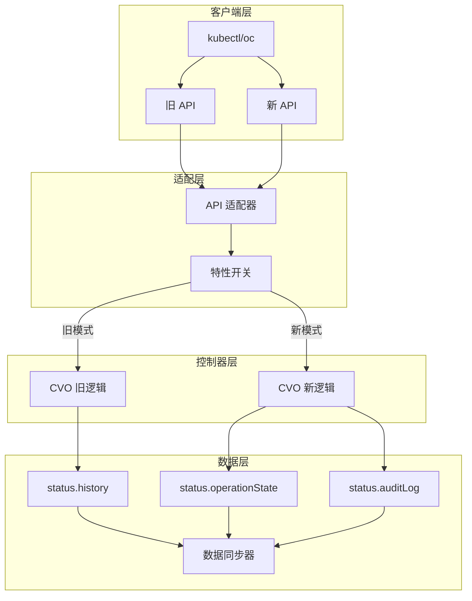
```mermaid
graph TB
    subgraph "客户端层"
        A[kubectl/oc] --> B[旧 API]
        A --> C[新 API]
    end
    
    subgraph "适配层"
        B --> D[API 适配器]
        C --> D
        D --> E[特性开关]
    end
    
    subgraph "控制器层"
        E -->|旧模式| F[CVO 旧逻辑]
        E -->|新模式| G[CVO 新逻辑]
    end
    
    subgraph "数据层"
        F --> H[status.history]
        G --> I[status.operationState]
        G --> J[status.auditLog]
        H --> K[数据同步器]
        I --> K
        J --> K
    end
```

### 10.3 分阶段实施计划

#### 10.3.1 阶段 1: 基础设施准备（2 周）

**目标**：搭建兼容框架，不改变现有行为

**任务**：

1. 添加特性开关

```go
type ClusterVersionStatus struct {
    // ... 现有字段 ...
    
    // FeatureFlags 特性开关
    FeatureFlags FeatureFlags `json:"featureFlags,omitempty"`
}

type FeatureFlags struct {
    // EnableNewStateModel 启用新状态模型
    EnableNewStateModel bool `json:"enableNewStateModel,omitempty"`
    
    // EnableAuditLog 启用审计日志
    EnableAuditLog bool `json:"enableAuditLog,omitempty"`
}
```

2. 添加新字段（向后兼容）

```go
type ClusterVersionStatus struct {
    // ... 现有字段 ...
    
    // 新字段（可选）
    OperationState OperationState `json:"operationState,omitempty"`
    AuditLog []AuditRecord `json:"auditLog,omitempty"`
    CurrentVersion string `json:"currentVersion,omitempty"`
    DesiredVersion string `json:"desiredVersion,omitempty"`
    PendingVersion string `json:"pendingVersion,omitempty"`
}
```

3. 数据同步器

```go
type DataSyncer struct {
    client client.Client
}

// SyncHistoryToNewModel 将 history 同步到新模型
func (s *DataSyncer) SyncHistoryToNewModel(cv *ClusterVersion) {
    if !cv.Status.FeatureFlags.EnableNewStateModel {
        return
    }
    
    // 从 history 推导 operationState
    if len(cv.Status.History) > 0 {
        latest := cv.Status.History[0]
        
        switch latest.State {
        case CompletedUpdateState:
            cv.Status.OperationState = OperationIdle
            cv.Status.CurrentVersion = latest.Version
        case PartialUpdateState:
            cv.Status.OperationState = OperationUpgrading
            cv.Status.PendingVersion = latest.Version
        }
    }
    
    // 同步审计日志
    if cv.Status.FeatureFlags.EnableAuditLog {
        cv.Status.AuditLog = convertHistoryToAuditLog(cv.Status.History)
    }
}

// SyncNewModelToHistory 将新模型同步到 history
func (s *DataSyncer) SyncNewModelToHistory(cv *ClusterVersion) {
    if !cv.Status.FeatureFlags.EnableNewStateModel {
        return
    }
    
    // 从新模型推导 history
    // ... 实现逻辑 ...
}
```

#### 10.3.2 阶段 2: 控制器适配（3 周）

**目标**：控制器同时支持新旧两种模式

**任务**：

1. 控制器适配层

```go
type ClusterVersionReconciler struct {
    client client.Client
    syncer *DataSyncer
}

func (r *ClusterVersionReconciler) Reconcile(ctx context.Context, req ctrl.Request) (ctrl.Result, error) {
    cv := &ClusterVersion{}
    if err := r.client.Get(ctx, req.NamespacedName, cv); err != nil {
        return ctrl.Result{}, err
    }
    
    // 数据同步
    r.syncer.SyncHistoryToNewModel(cv)
    
    // 根据特性开关选择逻辑
    if cv.Status.FeatureFlags.EnableNewStateModel {
        return r.reconcileNew(ctx, cv)
    }
    return r.reconcileOld(ctx, cv)
}

// reconcileOld 旧逻辑（保持现有行为）
func (r *ClusterVersionReconciler) reconcileOld(ctx context.Context, cv *ClusterVersion) (ctrl.Result, error) {
    // ... 现有逻辑 ...
}

// reconcileNew 新逻辑
func (r *ClusterVersionReconciler) reconcileNew(ctx context.Context, cv *ClusterVersion) (ctrl.Result, error) {
    // ... 新逻辑 ...
    
    // 同步回 history（兼容）
    r.syncer.SyncNewModelToHistory(cv)
    
    return ctrl.Result{}, r.client.Status().Update(ctx, cv)
}
```

2. 升级流程适配

```go
func (r *ClusterVersionReconciler) handleUpgrade(ctx context.Context, cv *ClusterVersion, targetVersion string) error {
    if cv.Status.FeatureFlags.EnableNewStateModel {
        // 新逻辑
        cv.Status.OperationState = OperationUpgrading
        cv.Status.DesiredVersion = targetVersion
        cv.Status.PendingVersion = targetVersion
        
        // 创建审计记录
        audit := AuditRecord{
            ID: generateID(),
            OperationType: OperationTypeUpgrade,
            FromVersion: cv.Status.CurrentVersion,
            ToVersion: targetVersion,
            Status: OperationStatusInProgress,
            StartedAt: metav1.Now(),
        }
        cv.Status.AuditLog = append(cv.Status.AuditLog, audit)
    } else {
        // 旧逻辑
        cv.Status.Desired = Update{
            Version: targetVersion,
            Image: getReleaseImage(targetVersion),
        }
        
        // 创建 history 记录
        history := UpdateHistory{
            State: PartialUpdateState,
            Version: targetVersion,
            StartedTime: metav1.Now(),
        }
        cv.Status.History = append([]UpdateHistory{history}, cv.Status.History...)
    }
    
    return r.client.Status().Update(ctx, cv)
}
```

#### 10.3.3 阶段 3: 验证与测试（2 周）

**目标**：确保新旧模式行为一致

**任务**：

1. 对比测试

```go
func TestCompatibility(t *testing.T) {
    tests := []struct {
        name string
        scenario func(*ClusterVersion)
    }{
        {
            name: "升级成功",
            scenario: func(cv *ClusterVersion) {
                // 触发升级
                // 验证 history 和 operationState 一致
            },
        },
        {
            name: "升级失败并回滚",
            scenario: func(cv *ClusterVersion) {
                // 触发升级失败
                // 触发回滚
                // 验证两种模式的状态一致
            },
        },
    }
    
    for _, tt := range tests {
        t.Run(tt.name, func(t *testing.T) {
            // 测试旧模式
            cvOld := createTestClusterVersion()
            cvOld.Status.FeatureFlags.EnableNewStateModel = false
            tt.scenario(cvOld)
            
            // 测试新模式
            cvNew := createTestClusterVersion()
            cvNew.Status.FeatureFlags.EnableNewStateModel = true
            tt.scenario(cvNew)
            
            // 对比结果
            assertEqual(t, cvOld, cvNew)
        })
    }
}
```

2. 性能测试

```go
func BenchmarkReconcile(b *testing.B) {
    b.Run("OldMode", func(b *testing.B) {
        cv := createTestClusterVersion()
        cv.Status.FeatureFlags.EnableNewStateModel = false
        
        for i := 0; i < b.N; i++ {
            reconciler.Reconcile(context.Background(), req)
        }
    })
    
    b.Run("NewMode", func(b *testing.B) {
        cv := createTestClusterVersion()
        cv.Status.FeatureFlags.EnableNewStateModel = true
        
        for i := 0; i < b.N; i++ {
            reconciler.Reconcile(context.Background(), req)
        }
    })
}
```

#### 10.3.4 阶段 4: 灰度发布（2 周）

**目标**：逐步切换到新模式

**任务**：

1. 灰度策略

```yaml
# 灰度配置
apiVersion: v1
kind: ConfigMap
metadata:
  name: cvo-feature-flags
  namespace: openshift-cluster-version
data:
  enableNewStateModel: "10%"  # 10% 的集群使用新模式
  enableAuditLog: "10%"
```

2. 灰度控制器

```go
func (r *ClusterVersionReconciler) shouldUseNewMode(cv *ClusterVersion) bool {
    // 检查灰度配置
    configMap := &corev1.ConfigMap{}
    if err := r.client.Get(context.Background(), 
        types.NamespacedName{
            Name: "cvo-feature-flags",
            Namespace: "openshift-cluster-version",
        }, 
        configMap); err != nil {
        return false
    }
    
    percentage, _ := strconv.Atoi(configMap.Data["enableNewStateModel"])
    
    // 基于集群 ID 哈希决定
    hash := fnv.New32a()
    hash.Write([]byte(string(cv.UID)))
    return int(hash.Sum32()%100) < percentage
}
```

#### 10.3.5 阶段 5: 全量切换（1 周）

**目标**：完全切换到新模式

**任务**：

1. 数据迁移工具

```go
type MigrationTool struct {
    client client.Client
}

func (m *MigrationTool) MigrateAll(ctx context.Context) error {
    cvList := &ClusterVersionList{}
    if err := m.client.List(ctx, cvList); err != nil {
        return err
    }
    
    for _, cv := range cvList.Items {
        // 启用新模式
        cv.Status.FeatureFlags.EnableNewStateModel = true
        cv.Status.FeatureFlags.EnableAuditLog = true
        
        // 同步数据
        syncer := &DataSyncer{client: m.client}
        syncer.SyncHistoryToNewModel(&cv)
        
        if err := m.client.Status().Update(ctx, &cv); err != nil {
            return err
        }
    }
    
    return nil
}
```

2. 清理旧代码

```go
// 移除旧逻辑
// 移除特性开关
// 移除数据同步器
```

### 10.4 风险控制

#### 10.4.1 回滚方案

```bash
# 快速回滚到旧模式
kubectl patch configmap cvo-feature-flags -n openshift-cluster-version \
  -p '{"data":{"enableNewStateModel":"0%"}}'

# 重启 CVO
kubectl rollout restart deployment/cluster-version-operator -n openshift-cluster-version
```

#### 10.4.2 监控指标

```go
// 监控新旧模式的使用情况
var (
    reconcileModeCounter = prometheus.NewCounterVec(
        prometheus.CounterOpts{
            Name: "cvo_reconcile_mode_total",
            Help: "Number of reconciles by mode",
        },
        []string{"mode"}, // "old" or "new"
    )
    
    reconcileDuration = prometheus.NewHistogramVec(
        prometheus.HistogramOpts{
            Name: "cvo_reconcile_duration_seconds",
            Help: "Duration of reconcile by mode",
        },
        []string{"mode"},
    )
)
```

### 10.5 时间线

| 阶段 | 时间 | 里程碑 |
|------|------|--------|
| 阶段 1 | 第 1-2 周 | 基础设施准备完成 |
| 阶段 2 | 第 3-5 周 | 控制器适配完成 |
| 阶段 3 | 第 6-7 周 | 验证与测试完成 |
| 阶段 4 | 第 8-9 周 | 灰度发布完成 |
| 阶段 5 | 第 10 周 | 全量切换完成 |

**总计**：10 周（2.5 个月）

### 10.6 关键成功因素

1. **充分的测试覆盖**：确保新旧模式行为一致
2. **完善的监控指标**：实时监控新旧模式的使用情况
3. **清晰的回滚方案**：确保可以快速回滚
4. **渐进式的灰度策略**：降低风险，逐步验证
5. **完整的文档**：记录所有变更和决策

这个兼容重构方案既采用了新设计的优势，又确保了与现有实现的兼容性，降低了迁移风险。

## 十一、重建集群方案

### 11.1 重建集群的场景

#### 11.1.1 触发条件

重建集群是**最后的手段**，只在以下情况下使用：

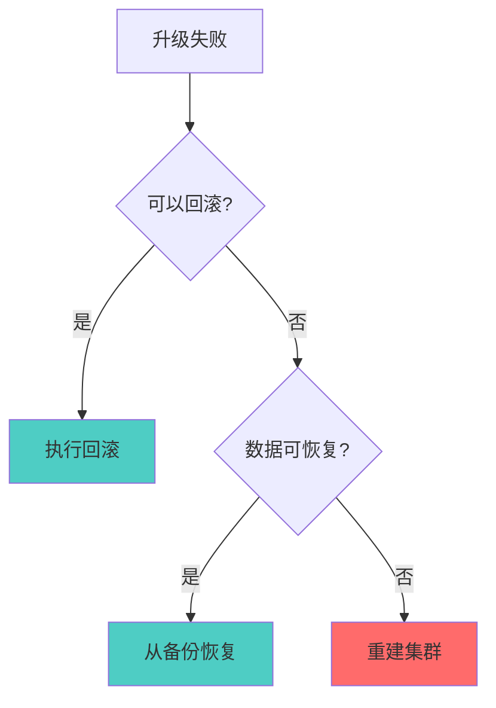
```mermaid
graph TB
    A[升级失败] --> B{可以回滚?}
    B -->|是| C[执行回滚]
    B -->|否| D{数据可恢复?}
    D -->|是| E[从备份恢复]
    D -->|否| F[重建集群]
    
    style F fill:#ff6b6b
    style C fill:#4ecdc4
    style E fill:#4ecdc4
```

**具体场景**：

| 场景 | 描述 | 重建原因 |
|------|------|---------|
| **跨版本回滚失败** | 需要回滚多个版本，但逐步回滚也失败 | 数据结构不兼容 |
| **etcd 数据损坏** | etcd 数据损坏且无法从快照恢复 | 控制面不可用 |
| **证书完全过期** | 所有证书过期且无法续期 | 集群无法通信 |
| **基础设施故障** | 底层基础设施（VM、网络、存储）故障 | 无法修复 |
| **配置严重错误** | 配置错误导致集群无法启动 | 无法回滚 |

#### 11.1.2 重建 vs 回滚的决策

```go
type RebuildDecision struct {
    // ShouldRebuild 是否应该重建
    ShouldRebuild bool
    
    // Reason 重建原因
    Reason string
    
    // Alternatives 替代方案
    Alternatives []string
    
    // DataLossRisk 数据丢失风险
    DataLossRisk RiskLevel
    
    // EstimatedDowntime 预计停机时间
    EstimatedDowntime time.Duration
}

type RiskLevel string

const (
    RiskLow    RiskLevel = "Low"
    RiskMedium RiskLevel = "Medium"
    RiskHigh   RiskLevel = "High"
)

func (cvo *ClusterVersionOperator) ShouldRebuildCluster(cv *ClusterVersion) *RebuildDecision {
    // 检查是否可以回滚
    if canRollback := cvo.canRollback(cv); canRollback {
        return &RebuildDecision{
            ShouldRebuild: false,
            Reason:        "Can rollback to previous version",
            Alternatives:  []string{"Rollback to " + cvo.getPreviousVersion(cv)},
            DataLossRisk:  RiskLow,
        }
    }
    
    // 检查是否有备份
    if hasBackup := cvo.hasValidBackup(cv); hasBackup {
        return &RebuildDecision{
            ShouldRebuild: false,
            Reason:        "Can restore from backup",
            Alternatives:  []string{"Restore from latest backup"},
            DataLossRisk:  RiskLow,
        }
    }
    
    // 必须重建
    return &RebuildDecision{
        ShouldRebuild: true,
        Reason:        "Cannot rollback or restore",
        Alternatives:  []string{"Rebuild cluster from scratch"},
        DataLossRisk:  RiskHigh,
        EstimatedDowntime: 2 * time.Hour,
    }
}
```

### 11.2 重建前的准备工作

#### 11.2.1 数据备份清单

**必须备份的数据**：

```yaml
# 备份清单
backupChecklist:
  # 1. etcd 数据
  etcd:
    - snapshot: "etcd-snapshot-$(date +%Y%m%d-%H%M%S).db"
      command: "etcdctl snapshot save"
      location: "/backup/etcd/"
      
  # 2. Kubernetes 资源
  kubernetes:
    - all-namespaces: true
      command: "kubectl get all --all-namespaces -o yaml"
      location: "/backup/k8s-resources/"
      
  # 3. ConfigMaps 和 Secrets
  configs:
    - configmaps: true
      secrets: true
      command: "kubectl get cm,secret --all-namespaces -o yaml"
      location: "/backup/configs/"
      
  # 4. Persistent Volumes
  pv:
    - persistentVolumes: true
      persistentVolumeClaims: true
      command: "kubectl get pv,pvc --all-namespaces -o yaml"
      location: "/backup/pv/"
      
  # 5. 应用数据
  application:
    - databases: true
      files: true
      command: "application-specific-backup"
      location: "/backup/application/"
```

#### 11.2.2 备份脚本

```bash
#!/bin/bash
# backup-before-rebuild.sh

set -e

BACKUP_DIR="/backup/rebuild-$(date +%Y%m%d-%H%M%S)"
mkdir -p "$BACKUP_DIR"

echo "Starting backup to $BACKUP_DIR..."

# 1. 备份 etcd
echo "Backing up etcd..."
etcdctl snapshot save "$BACKUP_DIR/etcd-snapshot.db" \
  --endpoints=https://127.0.0.1:2379 \
  --cacert=/etc/kubernetes/pki/etcd/ca.crt \
  --cert=/etc/kubernetes/pki/etcd/healthcheck-client.crt \
  --key=/etc/kubernetes/pki/etcd/healthcheck-client.key

# 2. 备份所有 Kubernetes 资源
echo "Backing up Kubernetes resources..."
kubectl get all --all-namespaces -o yaml > "$BACKUP_DIR/all-resources.yaml"

# 3. 备份 ConfigMaps 和 Secrets
echo "Backing up ConfigMaps and Secrets..."
kubectl get cm,secret --all-namespaces -o yaml > "$BACKUP_DIR/configs-secrets.yaml"

# 4. 备份 PV 和 PVC
echo "Backing up Persistent Volumes..."
kubectl get pv,pvc --all-namespaces -o yaml > "$BACKUP_DIR/pv-pvc.yaml"

# 5. 备份 ClusterVersion
echo "Backing up ClusterVersion..."
kubectl get clusterversion version -o yaml > "$BACKUP_DIR/clusterversion.yaml"

# 6. 备份所有 CRD
echo "Backing up CRDs..."
kubectl get crd -o yaml > "$BACKUP_DIR/crds.yaml"

# 7. 备份所有自定义资源
echo "Backing up custom resources..."
for crd in $(kubectl get crd -o jsonpath='{.items[*].metadata.name}'); do
    kubectl get "$crd" --all-namespaces -o yaml > "$BACKUP_DIR/cr-$crd.yaml" 2>/dev/null || true
done

echo "Backup completed: $BACKUP_DIR"
ls -lh "$BACKUP_DIR"
```

#### 11.2.3 备份验证

```bash
#!/bin/bash
# verify-backup.sh

BACKUP_DIR="$1"

if [ -z "$BACKUP_DIR" ]; then
    echo "Usage: $0 <backup-dir>"
    exit 1
fi

echo "Verifying backup in $BACKUP_DIR..."

# 1. 验证 etcd 快照
echo "Verifying etcd snapshot..."
etcdctl snapshot status "$BACKUP_DIR/etcd-snapshot.db" --write-out=table

# 2. 验证 Kubernetes 资源文件
echo "Verifying Kubernetes resources..."
if [ -f "$BACKUP_DIR/all-resources.yaml" ]; then
    echo "✓ all-resources.yaml exists"
    wc -l "$BACKUP_DIR/all-resources.yaml"
else
    echo "✗ all-resources.yaml missing"
    exit 1
fi

# 3. 验证配置文件
echo "Verifying configs..."
if [ -f "$BACKUP_DIR/configs-secrets.yaml" ]; then
    echo "✓ configs-secrets.yaml exists"
else
    echo "✗ configs-secrets.yaml missing"
    exit 1
fi

echo "Backup verification completed"
```

### 11.3 重建流程

#### 11.3.1 自动化重建流程

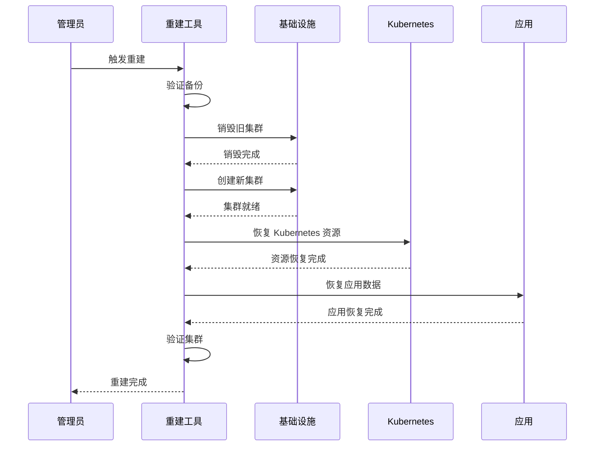
```mermaid
sequenceDiagram
    participant Admin as 管理员
    participant Tool as 重建工具
    participant Infra as 基础设施
    participant K8s as Kubernetes
    participant App as 应用
    
    Admin->>Tool: 触发重建
    Tool->>Tool: 验证备份
    Tool->>Infra: 销毁旧集群
    Infra-->>Tool: 销毁完成
    Tool->>Infra: 创建新集群
    Infra-->>Tool: 集群就绪
    Tool->>K8s: 恢复 Kubernetes 资源
    K8s-->>Tool: 资源恢复完成
    Tool->>App: 恢复应用数据
    App-->>Tool: 应用恢复完成
    Tool->>Tool: 验证集群
    Tool-->>Admin: 重建完成
```

#### 11.3.2 重建工具设计

```go
type ClusterRebuilder struct {
    client          client.Client
    infraProvider   InfrastructureProvider
    backupManager   *BackupManager
    config          RebuildConfig
}

type RebuildConfig struct {
    // ClusterName 集群名称
    ClusterName string
    
    // TargetVersion 目标版本
    TargetVersion string
    
    // BackupPath 备份路径
    BackupPath string
    
    // RestoreData 是否恢复数据
    RestoreData bool
    
    // RestoreConfigs 是否恢复配置
    RestoreConfigs bool
    
    // DryRun 是否干运行
    DryRun bool
}

type InfrastructureProvider interface {
    // DestroyCluster 销毁集群
    DestroyCluster(ctx context.Context, clusterName string) error
    
    // CreateCluster 创建集群
    CreateCluster(ctx context.Context, config ClusterConfig) error
    
    // WaitForReady 等待集群就绪
    WaitForReady(ctx context.Context, clusterName string) error
}

func (r *ClusterRebuilder) Rebuild(ctx context.Context) error {
    // 1. 验证备份
    if err := r.validateBackup(); err != nil {
        return fmt.Errorf("backup validation failed: %w", err)
    }
    
    // 2. 销毁旧集群
    if !r.config.DryRun {
        if err := r.infraProvider.DestroyCluster(ctx, r.config.ClusterName); err != nil {
            return fmt.Errorf("destroy cluster failed: %w", err)
        }
    }
    
    // 3. 创建新集群
    clusterConfig := ClusterConfig{
        Name:    r.config.ClusterName,
        Version: r.config.TargetVersion,
    }
    
    if !r.config.DryRun {
        if err := r.infraProvider.CreateCluster(ctx, clusterConfig); err != nil {
            return fmt.Errorf("create cluster failed: %w", err)
        }
    }
    
    // 4. 等待集群就绪
    if !r.config.DryRun {
        if err := r.infraProvider.WaitForReady(ctx, r.config.ClusterName); err != nil {
            return fmt.Errorf("wait for ready failed: %w", err)
        }
    }
    
    // 5. 恢复 Kubernetes 资源
    if r.config.RestoreConfigs {
        if err := r.restoreKubernetesResources(ctx); err != nil {
            return fmt.Errorf("restore k8s resources failed: %w", err)
        }
    }
    
    // 6. 恢复应用数据
    if r.config.RestoreData {
        if err := r.restoreApplicationData(ctx); err != nil {
            return fmt.Errorf("restore application data failed: %w", err)
        }
    }
    
    // 7. 验证集群
    if err := r.validateCluster(ctx); err != nil {
        return fmt.Errorf("cluster validation failed: %w", err)
    }
    
    return nil
}
```

#### 11.3.3 手动重建步骤

```bash
#!/bin/bash
# manual-rebuild.sh

set -e

CLUSTER_NAME="my-cluster"
TARGET_VERSION="4.11.0"
BACKUP_DIR="/backup/rebuild-20240115-100000"

echo "=== Manual Cluster Rebuild ==="
echo "Cluster: $CLUSTER_NAME"
echo "Target Version: $TARGET_VERSION"
echo "Backup: $BACKUP_DIR"
echo ""

# 步骤 1: 确认备份
echo "Step 1: Verify backup"
ls -lh "$BACKUP_DIR"
read -p "Backup verified? (y/n) " -n 1 -r
echo
if [[ ! $REPLY =~ ^[Yy]$ ]]; then
    exit 1
fi

# 步骤 2: 销毁旧集群
echo ""
echo "Step 2: Destroy old cluster"
read -p "Destroy cluster $CLUSTER_NAME? (y/n) " -n 1 -r
echo
if [[ $REPLY =~ ^[Yy]$ ]]; then
    openshift-install destroy cluster --dir="$CLUSTER_NAME"
    echo "Cluster destroyed"
fi

# 步骤 3: 创建新集群
echo ""
echo "Step 3: Create new cluster"
cat > install-config.yaml <<EOF
apiVersion: v1
metadata:
  name: $CLUSTER_NAME
baseDomain: example.com
controlPlane:
  replicas: 3
compute:
- replicas: 3
platform:
  aws:
    region: us-west-2
EOF

openshift-install create cluster --dir="$CLUSTER_NAME"
echo "Cluster created"

# 步骤 4: 配置 kubectl
echo ""
echo "Step 4: Configure kubectl"
export KUBECONFIG="$CLUSTER_NAME/auth/kubeconfig"
kubectl cluster-info

# 步骤 5: 恢复 Kubernetes 资源
echo ""
echo "Step 5: Restore Kubernetes resources"
read -p "Restore Kubernetes resources? (y/n) " -n 1 -r
echo
if [[ $REPLY =~ ^[Yy]$ ]]; then
    kubectl apply -f "$BACKUP_DIR/all-resources.yaml"
    echo "Resources restored"
fi

# 步骤 6: 恢复配置
echo ""
echo "Step 6: Restore configs and secrets"
read -p "Restore configs and secrets? (y/n) " -n 1 -r
echo
if [[ $REPLY =~ ^[Yy]$ ]]; then
    kubectl apply -f "$BACKUP_DIR/configs-secrets.yaml"
    echo "Configs restored"
fi

# 步骤 7: 验证集群
echo ""
echo "Step 7: Validate cluster"
kubectl get nodes
kubectl get pods --all-namespaces

echo ""
echo "=== Rebuild Completed ==="
```

### 11.4 重建后的恢复

#### 11.4.1 恢复 Kubernetes 资源

```bash
#!/bin/bash
# restore-k8s-resources.sh

BACKUP_DIR="$1"

if [ -z "$BACKUP_DIR" ]; then
    echo "Usage: $0 <backup-dir>"
    exit 1
fi

echo "Restoring Kubernetes resources from $BACKUP_DIR..."

# 1. 恢复 Namespace
echo "Restoring namespaces..."
kubectl apply -f "$BACKUP_DIR/all-resources.yaml" --selector='kind=Namespace'

# 2. 恢复 ConfigMaps
echo "Restoring ConfigMaps..."
kubectl apply -f "$BACKUP_DIR/configs-secrets.yaml" --selector='kind=ConfigMap'

# 3. 恢复 Secrets
echo "Restoring Secrets..."
kubectl apply -f "$BACKUP_DIR/configs-secrets.yaml" --selector='kind=Secret'

# 4. 恢复 Services
echo "Restoring Services..."
kubectl apply -f "$BACKUP_DIR/all-resources.yaml" --selector='kind=Service'

# 5. 恢复 Deployments
echo "Restoring Deployments..."
kubectl apply -f "$BACKUP_DIR/all-resources.yaml" --selector='kind=Deployment'

# 6. 恢复 StatefulSets
echo "Restoring StatefulSets..."
kubectl apply -f "$BACKUP_DIR/all-resources.yaml" --selector='kind=StatefulSet'

# 7. 恢复 DaemonSets
echo "Restoring DaemonSets..."
kubectl apply -f "$BACKUP_DIR/all-resources.yaml" --selector='kind=DaemonSet'

echo "Kubernetes resources restored"
```

#### 11.4.2 恢复应用数据

```bash
#!/bin/bash
# restore-application-data.sh

BACKUP_DIR="$1"

if [ -z "$BACKUP_DIR" ]; then
    echo "Usage: $0 <backup-dir>"
    exit 1
fi

echo "Restoring application data from $BACKUP_DIR..."

# 1. 恢复数据库
echo "Restoring databases..."
if [ -f "$BACKUP_DIR/database-dump.sql" ]; then
    kubectl exec -it deployment/mysql -- mysql -u root -p < "$BACKUP_DIR/database-dump.sql"
    echo "Database restored"
fi

# 2. 恢复文件
echo "Restoring files..."
if [ -d "$BACKUP_DIR/files" ]; then
    kubectl cp "$BACKUP_DIR/files" default/file-server:/data
    echo "Files restored"
fi

# 3. 恢复 Persistent Volumes
echo "Restoring Persistent Volumes..."
kubectl apply -f "$BACKUP_DIR/pv-pvc.yaml"
echo "PV/PVC restored"

echo "Application data restored"
```

#### 11.4.3 验证恢复

```bash
#!/bin/bash
# verify-restoration.sh

echo "=== Verifying Restoration ==="

# 1. 检查节点状态
echo "Checking nodes..."
kubectl get nodes
if [ $(kubectl get nodes --no-headers | wc -l) -lt 3 ]; then
    echo "✗ Not enough nodes"
    exit 1
fi
echo "✓ Nodes OK"

# 2. 检查 Pod 状态
echo "Checking pods..."
kubectl get pods --all-namespaces | grep -v Running | grep -v Completed
if [ $? -eq 0 ]; then
    echo "✗ Some pods not running"
    exit 1
fi
echo "✓ Pods OK"

# 3. 检查服务
echo "Checking services..."
kubectl get svc --all-namespaces
echo "✓ Services OK"

# 4. 检查应用
echo "Checking applications..."
kubectl get deployments --all-namespaces
echo "✓ Applications OK"

# 5. 检查数据
echo "Checking data..."
# 应用特定的数据验证
echo "✓ Data OK"

echo ""
echo "=== Restoration Verified ==="
```

### 11.5 重建最佳实践

#### 11.5.1 重建前检查清单

```yaml
# rebuild-checklist.yaml
preRebuildChecklist:
  - name: "备份验证"
    checks:
      - "etcd 快照完整"
      - "Kubernetes 资源文件完整"
      - "配置文件完整"
      - "应用数据备份完整"
      
  - name: "环境准备"
    checks:
      - "基础设施可用"
      - "网络连通性正常"
      - "存储空间充足"
      - "证书和密钥就绪"
      
  - name: "人员准备"
    checks:
      - "运维团队就位"
      - "开发团队待命"
      - "管理层知情"
      - "用户已通知"
      
  - name: "回滚准备"
    checks:
      - "回滚方案已准备"
      - "回滚脚本已测试"
      - "回滚时间窗口已确认"
```

#### 11.5.2 重建时间估算

```go
type RebuildTimeline struct {
    // Backup 备份时间
    Backup time.Duration
    
    // Destroy 销毁时间
    Destroy time.Duration
    
    // Create 创建时间
    Create time.Duration
    
    // RestoreK8s 恢复 Kubernetes 资源时间
    RestoreK8s time.Duration
    
    // RestoreData 恢复应用数据时间
    RestoreData time.Duration
    
    // Validate 验证时间
    Validate time.Duration
    
    // Total 总时间
    Total time.Duration
}

func EstimateRebuildTime(clusterSize int, dataSizeGB int) *RebuildTimeline {
    timeline := &RebuildTimeline{
        Backup:      30 * time.Minute,
        Destroy:     15 * time.Minute,
        Create:      45 * time.Minute,
        RestoreK8s:  20 * time.Minute,
        RestoreData: time.Duration(dataSizeGB) * 2 * time.Minute,
        Validate:    15 * time.Minute,
    }
    
    timeline.Total = timeline.Backup + timeline.Destroy + timeline.Create + 
                     timeline.RestoreK8s + timeline.RestoreData + timeline.Validate
    
    return timeline
}

// 示例：100GB 数据的重建时间
// Backup: 30m
// Destroy: 15m
// Create: 45m
// RestoreK8s: 20m
// RestoreData: 200m (100GB * 2m/GB)
// Validate: 15m
// Total: 325m ≈ 5.4 小时
```

#### 11.5.3 风险控制

```yaml
# risk-mitigation.yaml
risks:
  - name: "数据丢失"
    probability: "Medium"
    impact: "High"
    mitigation:
      - "多次备份验证"
      - "备份到多个位置"
      - "备份加密"
      
  - name: "重建失败"
    probability: "Low"
    impact: "High"
    mitigation:
      - "先在测试环境验证"
      - "准备回滚方案"
      - "分阶段重建"
      
  - name: "停机时间过长"
    probability: "Medium"
    impact: "Medium"
    mitigation:
      - "提前通知用户"
      - "选择低峰期重建"
      - "准备应急方案"
      
  - name: "资源不足"
    probability: "Low"
    impact: "Medium"
    mitigation:
      - "提前检查资源"
      - "预留额外资源"
      - "准备扩容方案"
```

### 11.6 总结

#### 11.6.1 重建 vs 回滚对比

| 维度 | 回滚 | 重建 |
|------|------|------|
| **时间** | 30 分钟 - 2 小时 | 2 - 6 小时 |
| **数据丢失** | 无 | 可能丢失 |
| **复杂度** | 低 | 高 |
| **风险** | 低 | 高 |
| **适用场景** | 相邻版本回滚 | 跨版本或严重故障 |

#### 11.6.2 决策流程

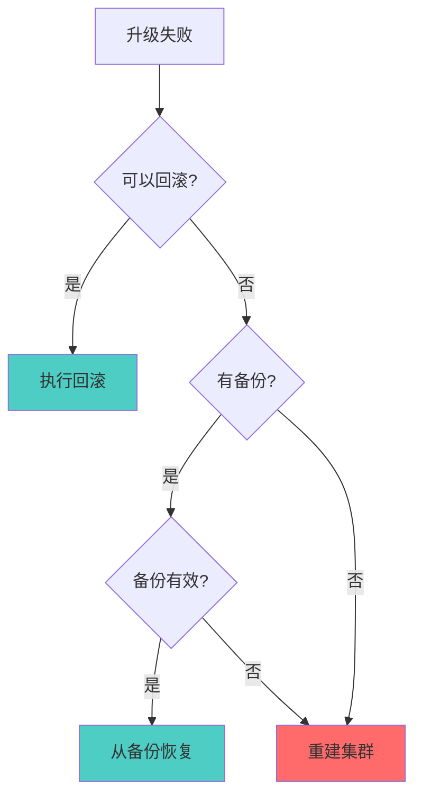
```mermaid
graph TD
    A[升级失败] --> B{可以回滚?}
    B -->|是| C[执行回滚]
    B -->|否| D{有备份?}
    D -->|是| E{备份有效?}
    E -->|是| F[从备份恢复]
    E -->|否| G[重建集群]
    D -->|否| G
    
    style C fill:#4ecdc4
    style F fill:#4ecdc4
    style G fill:#ff6b6b
```

#### 11.6.3 最佳实践

1. **定期备份**：每天自动备份，每周验证备份
2. **备份验证**：在测试环境验证备份可恢复
3. **重建演练**：每季度进行一次重建演练
4. **文档完善**：详细记录重建步骤和注意事项
5. **团队培训**：确保运维团队熟悉重建流程

重建集群是最后的手段，应该尽量避免。通过完善的备份策略和回滚机制，可以最大程度减少重建的需求。

## 十二、OpenShift 备份机制

OpenShift 提供了多层次的备份机制，确保集群数据的安全性和可恢复性。

### 14.1 etcd 备份

etcd 是 OpenShift 的核心数据存储，备份 etcd 是灾难恢复的关键。

#### 14.1.1 自动备份机制

##### (a) CronJob 定时备份

OpenShift 通过 CronJob 实现每日自动备份：

```yaml
apiVersion: batch/v1
kind: CronJob
metadata:
  name: etcd-backup
  namespace: kube-system
spec:
  schedule: "0 0 * * *"          # 每天凌晨 0 点执行
  startingDeadlineSeconds: 300    # 5 分钟启动宽限期
  jobTemplate:
    spec:
      template:
        spec:
          containers:
          - name: etcd-backup
            image: registry.redhat.io/openshift4/etcd-backup:latest
            env:
            - name: ETCDCTL_API
              value: "3"
            - name: ENDPOINTS
              value: "https://10.0.0.1:2379,https://10.0.0.2:2379,https://10.0.0.3:2379"
            - name: RESERVEDNUM
              value: "30"          # 保留最近 30 个备份
            volumeMounts:
            - mountPath: /etc/kubernetes/pki/etcd
              name: etcd-certs
              readOnly: true
            - mountPath: /backup
              name: backup
          affinity:
            nodeAffinity:
              requiredDuringSchedulingIgnoredDuringExecution:
                nodeSelectorTerms:
                - matchExpressions:
                  - key: node-role.kubernetes.io/master
                    operator: Exists
          hostNetwork: true
          volumes:
          - name: etcd-certs
            secret:
              secretName: etcd-backup-secrets
          - name: backup
            hostPath:
              path: /var/backup/etcd
              type: DirectoryOrCreate
```

**关键特性**：
- 调度策略：每天凌晨执行
- 保留策略：保留最近 30 个备份文件
- 调度约束：仅在 master 节点运行
- 网络模式：使用 `hostNetwork: true` 直接访问 etcd

##### (b) 升级前自动备份

在 etcd 升级和控制面升级过程中，OpenShift 会自动触发 etcd 备份：

```go
// 升级前自动备份逻辑
if params.NeedBackup && params.Node.IP == params.BackupNode.IP {
    upgrade.BackUpEtcd = true
}
```

#### 14.1.2 手动备份方法

##### (a) 使用 etcdctl 命令行工具

```bash
#!/bin/bash
# 遍历所有 etcd endpoints，找到一个健康的节点进行备份
ENDPOINTS="https://10.0.0.1:2379,https://10.0.0.2:2379,https://10.0.0.3:2379"

for ENDPOINT in $(echo $ENDPOINTS | tr ',' ' '); do
  etcdctl --endpoints=${ENDPOINT} \
    --cacert=/etc/kubernetes/pki/etcd/ca.crt \
    --cert=/etc/kubernetes/pki/etcd/healthcheck-client.crt \
    --key=/etc/kubernetes/pki/etcd/healthcheck-client.key \
    endpoint health
  
  if [ $? -eq 0 ]; then
    etcdctl --endpoints=${ENDPOINT} \
      --cacert=/etc/kubernetes/pki/etcd/ca.crt \
      --cert=/etc/kubernetes/pki/etcd/healthcheck-client.crt \
      --key=/etc/kubernetes/pki/etcd/healthcheck-client.key \
      snapshot save /backup/etcd-snapshot-$(date +%Y-%m-%d_%H-%M-%S).db
    break
  fi
done
```

##### (b) 使用 oc 命令触发备份

```bash
# 在 master 节点上执行
oc debug node/master-0
chroot /host
etcdctl snapshot save /var/backup/etcd/snapshot-$(date +%Y%m%d).db \
  --cacert=/etc/kubernetes/pki/etcd/ca.crt \
  --cert=/etc/kubernetes/pki/etcd/healthcheck-client.crt \
  --key=/etc/kubernetes/pki/etcd/healthcheck-client.key
```

#### 12.1.3 备份验证

```bash
# 验证 etcd 快照完整性
etcdctl snapshot status /backup/etcd-snapshot.db --write-out=table

# 输出示例：
# +----------+----------+------------+------------+
# |   HASH   | REVISION| TOTAL KEYS | TOTAL SIZE |
# +----------+----------+------------+------------+
# | 12345678 |  1234567 |       1234 |      12 MB |
# +----------+----------+------------+------------+
```

### 12.2 集群资源备份

#### 12.2.1 使用 oc/kubectl 命令备份资源

```bash
#!/bin/bash
BACKUP_DIR="/backup/cluster-$(date +%Y%m%d-%H%M%S)"
mkdir -p "$BACKUP_DIR"

# 1. 备份所有 Kubernetes 资源
oc get all --all-namespaces -o yaml > "$BACKUP_DIR/all-resources.yaml"

# 2. 备份 ConfigMaps 和 Secrets
oc get cm,secret --all-namespaces -o yaml > "$BACKUP_DIR/configs-secrets.yaml"

# 3. 备份 PV 和 PVC
oc get pv,pvc --all-namespaces -o yaml > "$BACKUP_DIR/pv-pvc.yaml"

# 4. 备份 ClusterVersion (OpenShift 特有)
oc get clusterversion version -o yaml > "$BACKUP_DIR/clusterversion.yaml"

# 5. 备份所有 CRD
oc get crd -o yaml > "$BACKUP_DIR/crds.yaml"

# 6. 备份所有自定义资源
for crd in $(oc get crd -o jsonpath='{.items[*].metadata.name}'); do
    oc get "$crd" --all-namespaces -o yaml > "$BACKUP_DIR/cr-$crd.yaml" 2>/dev/null || true
done
```

#### 12.2.2 备份范围

| 资源类型 | 备份命令 | 说明 |
|---------|---------|------|
| **所有资源** | `oc get all --all-namespaces -o yaml` | Pod、Service、Deployment 等 |
| **ConfigMaps** | `oc get cm --all-namespaces -o yaml` | 配置数据 |
| **Secrets** | `oc get secret --all-namespaces -o yaml` | 敏感数据 |
| **PV/PVC** | `oc get pv,pvc --all-namespaces -o yaml` | 持久化存储 |
| **CRD** | `oc get crd -o yaml` | 自定义资源定义 |
| **自定义资源** | `oc get <crd-name> --all-namespaces -o yaml` | 自定义资源实例 |

### 12.3 应用数据备份

#### 12.3.1 Persistent Volume 备份

```bash
# 备份 PV 和 PVC 定义
oc get pv,pvc --all-namespaces -o yaml > pv-pvc.yaml

# 恢复 PV/PVC
oc apply -f pv-pvc.yaml
```

#### 12.3.2 数据库备份

```bash
# MySQL 备份
oc exec -it deployment/mysql -- mysqldump -u root -p --all-databases > database-dump.sql

# PostgreSQL 备份
oc exec -it deployment/postgres -- pg_dumpall -U postgres > database-dump.sql

# 恢复数据库
oc exec -it deployment/mysql -- mysql -u root -p < database-dump.sql
```

#### 12.3.3 应用文件备份

```bash
# 备份应用文件
oc cp default/file-server:/data ./backup/files

# 恢复应用文件
oc cp ./backup/files default/file-server:/data
```

### 12.4 灾难恢复

#### 12.4.1 从 etcd 备份恢复

```bash
# 1. 停止所有静态 Pod
# 在 master 节点上执行
crictl stopp $(crictl pods -q)

# 2. 恢复 etcd 快照
etcdctl snapshot restore /backup/etcd-snapshot.db \
  --data-dir=/var/lib/etcd-from-backup \
  --name=master-0 \
  --initial-cluster="master-0=https://10.0.0.1:2380" \
  --initial-cluster-token="etcd-cluster-1" \
  --initial-advertise-peer-urls=https://10.0.0.1:2380

# 3. 更新 etcd 数据目录
mv /var/lib/etcd /var/lib/etcd.bak
mv /var/lib/etcd-from-backup /var/lib/etcd

# 4. 重启 etcd 静态 Pod
# 5. 验证集群健康
etcdctl endpoint health --endpoints=https://10.0.0.1:2379
```

#### 12.4.2 从资源备份恢复

```bash
#!/bin/bash
BACKUP_DIR="$1"

# 按依赖顺序恢复
# 1. 恢复 Namespace
oc apply -f "$BACKUP_DIR/all-resources.yaml" --selector='kind=Namespace'

# 2. 恢复 ConfigMaps
oc apply -f "$BACKUP_DIR/configs-secrets.yaml" --selector='kind=ConfigMap'

# 3. 恢复 Secrets
oc apply -f "$BACKUP_DIR/configs-secrets.yaml" --selector='kind=Secret'

# 4. 恢复 Services
oc apply -f "$BACKUP_DIR/all-resources.yaml" --selector='kind=Service'

# 5. 恢复 Deployments
oc apply -f "$BACKUP_DIR/all-resources.yaml" --selector='kind=Deployment'

# 6. 恢复 StatefulSets
oc apply -f "$BACKUP_DIR/all-resources.yaml" --selector='kind=StatefulSet'

# 7. 恢复 DaemonSets
oc apply -f "$BACKUP_DIR/all-resources.yaml" --selector='kind=DaemonSet'
```

#### 12.4.3 集群重建恢复

```bash
#!/bin/bash
CLUSTER_NAME="my-cluster"
BACKUP_DIR="/backup/cluster-20240115-100000"

# 步骤 1: 确认备份
ls -lh "$BACKUP_DIR"

# 步骤 2: 销毁旧集群
openshift-install destroy cluster --dir="$CLUSTER_NAME"

# 步骤 3: 创建新集群
openshift-install create cluster --dir="$CLUSTER_NAME"

# 步骤 4: 配置 kubectl
export KUBECONFIG="$CLUSTER_NAME/auth/kubeconfig"
oc cluster-info

# 步骤 5: 恢复 Kubernetes 资源
oc apply -f "$BACKUP_DIR/all-resources.yaml"

# 步骤 6: 恢复配置
oc apply -f "$BACKUP_DIR/configs-secrets.yaml"

# 步骤 7: 验证集群
oc get nodes
oc get pods --all-namespaces
```

### 12.5 手工备份集群与恢复方案设计（基于 OpenShift 官方文档）

基于 OpenShift 4.17 官方文档，本节提供严格遵循官方标准操作流程的手工备份与恢复方案设计。

#### 12.5.1 备份方案设计

##### (a) 备份架构总览

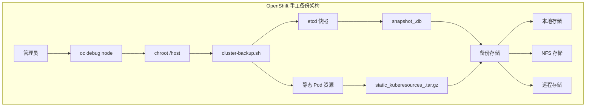
```mermaid
graph TB
    subgraph "OpenShift 手工备份架构"
        A[管理员] --> B[oc debug node]
        B --> C[chroot /host]
        C --> D[cluster-backup.sh]
        
        D --> E[etcd 快照]
        D --> F[静态 Pod 资源]
        
        E --> G[snapshot_<timestamp>.db]
        F --> H[static_kuberesources_<timestamp>.tar.gz]
        
        G --> I[备份存储]
        H --> I
        
        I --> J[本地存储]
        I --> K[NFS 存储]
        I --> L[远程存储]
    end
```

##### (b) 手工备份操作流程（官方 cluster-backup.sh）

**前置条件**：

```yaml
prerequisites:
  - "拥有 cluster-admin 角色的用户访问权限"
  - "检查集群是否启用了全局代理"
  - "选择一个控制面节点执行备份"
  - "确保备份目录有足够的存储空间"
  
importantNotes:
  - "只从单个控制面主机执行备份，不要对每个控制面主机都执行备份"
  - "安装后 24 小时内不要执行备份（证书尚未完成首次轮换）"
  - "建议在非高峰时段执行备份（etcd 快照 I/O 开销大）"
  - "升级前必须执行备份"
  - "恢复时必须使用与当前集群相同 z-stream 版本的备份"
```

**操作步骤**：

```bash
#!/bin/bash
# OpenShift 官方手工备份流程

# 步骤 1: 启动控制面节点的 debug 会话（以 root 身份）
$ oc debug --as-root node/master-0

# 步骤 2: 在 debug shell 中切换到 /host 目录
sh-4.4# chroot /host

# 步骤 3: 如果启用了集群代理，设置环境变量
sh-4.4# export HTTP_PROXY=http://<your_proxy.example.com>:8080
sh-4.4# export HTTPS_PROXY=https://<your_proxy.example.com>:8080
sh-4.4# export NO_PROXY=<example.com>

# 步骤 4: 执行 cluster-backup.sh 脚本
sh-4.4# /usr/local/bin/cluster-backup.sh /home/core/assets/backup

# 步骤 5: 验证备份结果
sh-4.4# ls -lh /home/core/assets/backup/
# 应该看到两个文件：
# - snapshot_<timestamp>.db
# - static_kuberesources_<timestamp>.tar.gz

# 步骤 6: 退出 debug 会话
sh-4.4# exit
```

**备份产物说明**：

| 文件 | 说明 | 用途 |
|------|------|------|
| `snapshot_<timestamp>.db` | etcd 快照文件 | 恢复 etcd 数据 |
| `static_kuberesources_<timestamp>.tar.gz` | 静态 Pod 资源（含加密密钥） | 恢复控制面组件 |

**重要提示**：
- 如果启用了 etcd 加密，建议将 `static_kuberesources_<timestamp>.tar.gz` 与 etcd 快照分开存储（安全原因）
- 但恢复时必须同时使用这两个文件
- etcd 加密只加密值，不加密键（资源类型、命名空间、对象名称未加密）

##### (c) 自动化备份方案（EtcdBackup CR）

**单次备份**：

```yaml
# 1. 创建 PVC（动态存储）
apiVersion: v1
kind: PersistentVolumeClaim
metadata:
  name: etcd-backup-pvc
  namespace: openshift-etcd
spec:
  accessModes:
    - ReadWriteOnce
  resources:
    requests:
      storage: 200Gi  # 根据需求调整
  volumeMode: Filesystem

---
# 2. 创建 EtcdBackup CR
apiVersion: operator.openshift.io/v1alpha1
kind: EtcdBackup
metadata:
  name: etcd-single-backup
  namespace: openshift-etcd
spec:
  pvcName: etcd-backup-pvc  # PVC 名称
```

**定期备份**：

```yaml
# 创建 EtcdBackupSchedule CR
apiVersion: operator.openshift.io/v1alpha1
kind: EtcdBackupSchedule
metadata:
  name: etcd-daily-backup
  namespace: openshift-etcd
spec:
  schedule: "0 2 * * *"  # 每天凌晨 2 点执行
  pvcName: etcd-backup-pvc
  retentionPolicy:
    maxCount: 30  # 保留最近 30 个备份
    maxAge: "7d"  # 最长保留 7 天
```

**注意**：自动化备份是 Technology Preview 功能，不建议在生产环境使用。

##### (d) 备份存储策略

| 存储类型 | 适用场景 | 优点 | 缺点 |
|---------|---------|------|------|
| **本地存储** | 快速恢复、测试环境 | 恢复速度快 | 节点故障时备份丢失 |
| **NFS 存储** | 生产环境、共享备份 | 多节点可访问 | 依赖 NFS 服务 |
| **动态 PVC** | 云环境、高可用 | 自动管理、可扩展 | 成本较高 |
| **远程存储** | 灾难恢复、异地备份 | 高可用性 | 恢复速度慢 |

**推荐策略**：
- 生产环境：本地 + NFS 双重备份
- 云环境：动态 PVC + 远程对象存储
- 关键业务：本地 + NFS + 远程三重备份

##### (e) 备份关键约束与最佳实践

```yaml
backupConstraints:
  # 必须遵守的约束
  mandatory:
    - "只从单个控制面节点备份，不要每个节点都备份"
    - "恢复时必须使用与当前集群相同 z-stream 版本的备份"
    - "安装后 24 小时内不要备份（证书尚未轮换）"
    - "升级前必须备份"
    
  # 强烈建议的最佳实践
  recommended:
    - "在非高峰时段备份（减少 I/O 影响）"
    - "定期验证备份可恢复性"
    - "备份到多个位置（本地 + 远程）"
    - "备份数据加密存储"
    - "保留最近 30 个备份"
    - "记录每次备份的元数据（时间、版本、大小）"
    
  # 避免的做法
  avoid:
    - "不要在生产高峰期备份"
    - "不要将备份存储在单一位置"
    - "不要使用过期的备份进行恢复"
    - "不要跳过备份验证"
```

#### 12.5.2 恢复方案设计

##### (a) 恢复场景分类

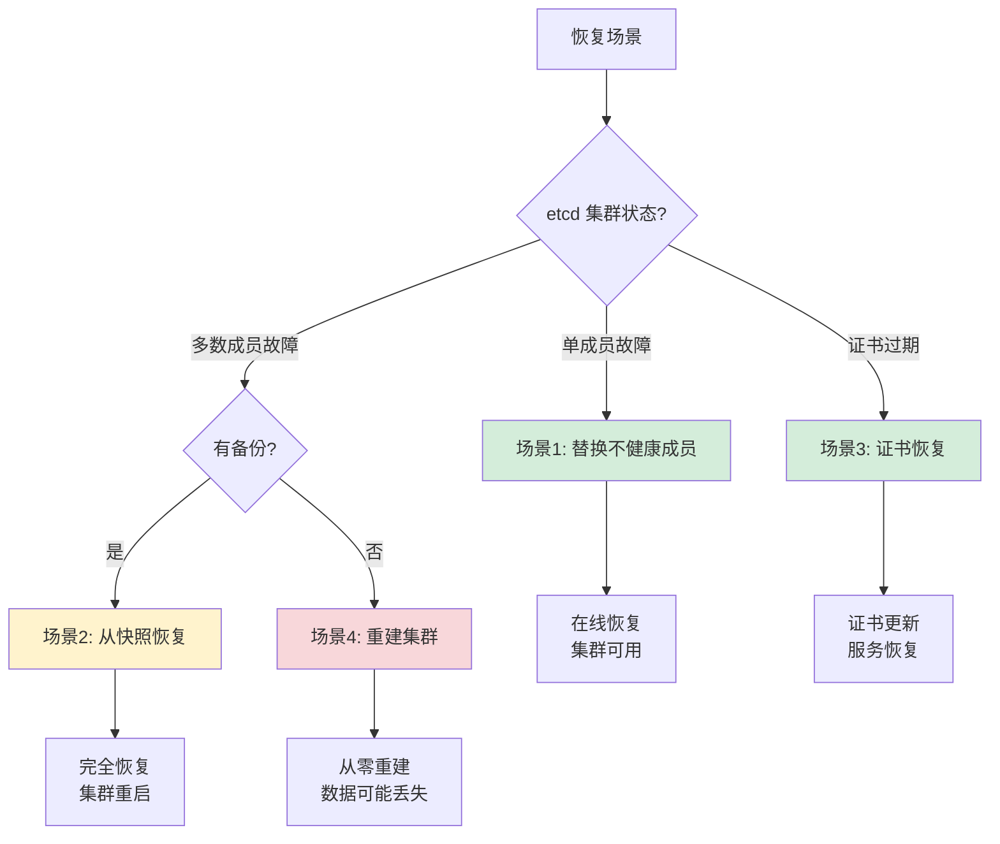
```mermaid
graph TD
    A[恢复场景] --> B{etcd 集群状态?}
    
    B -->|单成员故障| C[场景1: 替换不健康成员]
    B -->|多数成员故障| D{有备份?}
    
    D -->|是| E[场景2: 从快照恢复]
    D -->|否| F[场景4: 重建集群]
    
    B -->|证书过期| G[场景3: 证书恢复]
    
    C --> H[在线恢复<br/>集群可用]
    E --> I[完全恢复<br/>集群重启]
    G --> J[证书更新<br/>服务恢复]
    F --> K[从零重建<br/>数据可能丢失]
    
    style C fill:#d4edda
    style E fill:#fff3cd
    style G fill:#d4edda
    style F fill:#f8d7da
```

| 场景 | 触发条件 | 恢复方式 | 停机时间 | 数据丢失 |
|------|---------|---------|---------|---------|
| **场景1** | 单个 etcd 成员故障 | 替换成员 | 无 | 无 |
| **场景2** | 多数 etcd 成员故障 | 从快照恢复 | 30-60 分钟 | 可能 |
| **场景3** | 控制面证书过期 | 证书恢复 | 10-30 分钟 | 无 |
| **场景4** | 整个集群状态回滚 | 从备份恢复 | 60-120 分钟 | 可能 |

##### (b) 场景1：替换不健康的 etcd 成员

**识别不健康成员**：

```bash
# 1. 获取 etcd Pod 列表
$ oc get pods -n openshift-etcd -o wide

# 2. 检查 etcd 成员健康状态
$ oc rsh -n openshift-etcd etcd-master-0
sh-4.4# etcdctl endpoint health \
  --endpoints=https://10.0.0.1:2379,https://10.0.0.2:2379,https://10.0.0.3:2379 \
  --cacert=/etc/kubernetes/static-pod-resources/etcd-certs-configmaps/etcd-all-bundles/server-ca-bundle.crt \
  --cert=/etc/kubernetes/static-pod-certs/secrets/etcd-all-certs/etcd-peer-master-0.crt \
  --key=/etc/kubernetes/static-pod-certs/secrets/etcd-all-certs/etcd-peer-master-0.key

# 输出示例：
# https://10.0.0.1:2379 is healthy: successfully committed proposal: took = 2.312882ms
# https://10.0.0.2:2379 is healthy: successfully committed proposal: took = 2.512882ms
# https://10.0.0.3:2379 is unhealthy: failed to commit proposal: context deadline exceeded
```

**判断成员状态**：

```bash
# 检查 etcd 成员列表
sh-4.4# etcdctl member list \
  --endpoints=https://10.0.0.1:2379 \
  --cacert=/etc/kubernetes/static-pod-resources/etcd-certs-configmaps/etcd-all-bundles/server-ca-bundle.crt \
  --cert=/etc/kubernetes/static-pod-certs/secrets/etcd-all-certs/etcd-peer-master-0.crt \
  --key=/etc/kubernetes/static-pod-certs/secrets/etcd-all-certs/etcd-peer-master-0.key \
  --write-out=table

# 输出示例：
# +------------------+---------+----------+---------------------------+---------------------------+------------+
# |        ID        | STATUS  |   NAME   |        PEER ADDRS         |       CLIENT ADDRS        | IS LEARNER |
# +------------------+---------+----------+---------------------------+---------------------------+------------+
# | 1234567890abcdef | started | master-0 | https://10.0.0.1:2380     | https://10.0.0.1:2379     |      false |
# | 234567890abcdef1 | started | master-1 | https://10.0.0.2:2380     | https://10.0.0.2:2379     |      false |
# | 34567890abcdef12 | started | master-2 | https://10.0.0.3:2380     | https://10.0.0.3:2379     |      false |
# +------------------+---------+----------+---------------------------+---------------------------+------------+
```

**替换操作步骤**：

```bash
# 1. 从不健康节点删除 etcd 数据
$ oc debug node/master-2
sh-4.4# chroot /host
sh-4.4# rm -rf /var/lib/etcd/*

# 2. 删除不健康的 etcd Pod
$ oc delete pod etcd-master-2 -n openshift-etcd

# 3. 等待 etcd Operator 自动重建成员
$ oc get pods -n openshift-etcd -w

# 4. 验证成员健康状态
$ oc rsh -n openshift-etcd etcd-master-0
sh-4.4# etcdctl endpoint health --endpoints=https://10.0.0.1:2379,https://10.0.0.2:2379,https://10.0.0.3:2379 ...
```

**注意事项**：
- 替换成员期间集群仍然可用（多数派保持健康）
- etcd Operator 会自动处理成员重建
- 如果自动重建失败，需要手动干预

##### (c) 场景2：从 etcd 快照恢复集群状态

**前置条件**：

```yaml
prerequisites:
  - "拥有 cluster-admin 角色的用户访问权限"
  - "拥有与当前集群相同 z-stream 版本的 etcd 备份"
  - "备份包含两个文件：snapshot_<timestamp>.db 和 static_kuberesources_<timestamp>.tar.gz"
  - "如果启用了 etcd 加密，需要加密密钥文件"
  
warnings:
  - "恢复过程会导致集群完全不可用"
  - "恢复后 etcd 数据不可逆（无法恢复到恢复后的状态）"
  - "恢复期间所有工作负载中断"
  - "恢复后需要验证所有组件健康"
```

**恢复操作步骤**：

```bash
#!/bin/bash
# OpenShift 官方 etcd 恢复流程

# 步骤 1: 停止所有控制面静态 Pod
# 在健康的控制面节点上执行
$ oc debug node/master-0
sh-4.4# chroot /host

# 停止所有静态 Pod
sh-4.4# crictl stopp $(crictl pods -q)

# 步骤 2: 将备份文件复制到目标节点
sh-4.4# mkdir -p /home/core/backup
sh-4.4# cp /path/to/snapshot_<timestamp>.db /home/core/backup/
sh-4.4# cp /path/to/static_kuberesources_<timestamp>.tar.gz /home/core/backup/

# 如果启用了 etcd 加密，还需要复制加密密钥
sh-4.4# cp /path/to/encryption-config /home/core/backup/

# 步骤 3: 执行 cluster-restore.sh 脚本
sh-4.4# /usr/local/bin/cluster-restore.sh /home/core/backup

# 脚本输出示例：
# etcdctl version: 3.4.14
# API version: 3.4
# Restored etcd snapshot to /var/lib/etcd
# Restored static pod resources to /etc/kubernetes/static-pod-resources
# etcd data and static pod resources are successfully restored

# 步骤 4: 重启 etcd 静态 Pod
sh-4.4# systemctl restart etcd

# 步骤 5: 重启其他控制面组件
sh-4.4# systemctl restart kube-apiserver
sh-4.4# systemctl restart kube-controller-manager
sh-4.4# systemctl restart kube-scheduler

# 步骤 6: 验证 etcd 健康状态
sh-4.4# etcdctl endpoint health \
  --endpoints=https://10.0.0.1:2379 \
  --cacert=/etc/kubernetes/static-pod-resources/etcd-certs-configmaps/etcd-all-bundles/server-ca-bundle.crt \
  --cert=/etc/kubernetes/static-pod-certs/secrets/etcd-all-certs/etcd-peer-master-0.crt \
  --key=/etc/kubernetes/static-pod-certs/secrets/etcd-all-certs/etcd-peer-master-0.key

# 输出示例：
# https://10.0.0.1:2379 is healthy: successfully committed proposal: took = 2.312882ms

# 步骤 7: 验证集群健康
sh-4.4# exit
$ oc get nodes
$ oc get pods -n openshift-etcd
$ oc get clusterversion
```

**恢复流程图**：

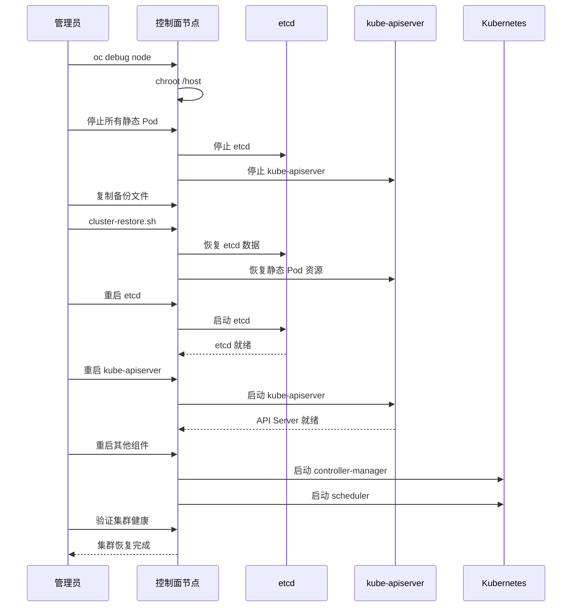
```mermaid
sequenceDiagram
    participant Admin as 管理员
    participant Node as 控制面节点
    participant Etcd as etcd
    participant API as kube-apiserver
    participant K8s as Kubernetes
    
    Admin->>Node: oc debug node
    Node->>Node: chroot /host
    Admin->>Node: 停止所有静态 Pod
    Node->>Etcd: 停止 etcd
    Node->>API: 停止 kube-apiserver
    
    Admin->>Node: 复制备份文件
    Admin->>Node: cluster-restore.sh
    Node->>Etcd: 恢复 etcd 数据
    Node->>API: 恢复静态 Pod 资源
    
    Admin->>Node: 重启 etcd
    Node->>Etcd: 启动 etcd
    Etcd-->>Node: etcd 就绪
    
    Admin->>Node: 重启 kube-apiserver
    Node->>API: 启动 kube-apiserver
    API-->>Node: API Server 就绪
    
    Admin->>Node: 重启其他组件
    Node->>K8s: 启动 controller-manager
    Node->>K8s: 启动 scheduler
    
    Admin->>Node: 验证集群健康
    Node-->>Admin: 集群恢复完成
```

**恢复后验证**：

```bash
# 1. 验证节点状态
$ oc get nodes
# 所有节点应该处于 Ready 状态

# 2. 验证 etcd 集群健康
$ oc rsh -n openshift-etcd etcd-master-0
sh-4.4# etcdctl endpoint health ...

# 3. 验证 ClusterVersion
$ oc get clusterversion
# 应该显示正确的版本和状态

# 4. 验证关键 Operator
$ oc get clusteroperator
# 所有 Operator 应该处于 Available 状态

# 5. 验证工作负载
$ oc get pods --all-namespaces
# 关键 Pod 应该处于 Running 状态

# 6. 验证应用服务
$ oc get svc -n <namespace>
# 应用服务应该可访问
```

##### (d) 场景3：从过期证书恢复

**触发条件**：
- 控制面证书过期
- API Server 无法启动
- etcd 无法连接

**恢复操作步骤**：

```bash
# 1. 启动 debug 会话
$ oc debug node/master-0
sh-4.4# chroot /host

# 2. 检查证书过期时间
sh-4.4# openssl x509 -in /etc/kubernetes/static-pod-certs/secrets/kube-apiserver-to-kubelet-client/current-cert.pem -noout -dates

# 3. 如果证书已过期，使用备份的证书恢复
sh-4.4# cd /etc/kubernetes/static-pod-certs/secrets/
sh-4.4# tar -xzf /home/core/backup/static_kuberesources_<timestamp>.tar.gz

# 4. 重启控制面组件
sh-4.4# systemctl restart kube-apiserver
sh-4.4# systemctl restart kube-controller-manager
sh-4.4# systemctl restart kube-scheduler

# 5. 验证证书已更新
sh-4.4# openssl x509 -in /etc/kubernetes/static-pod-certs/secrets/kube-apiserver-to-kubelet-client/current-cert.pem -noout -dates

# 6. 验证集群健康
sh-4.4# exit
$ oc get nodes
```

**注意事项**：
- 证书恢复后，集群会自动轮换证书
- 恢复后需要验证所有组件健康
- 建议定期检查证书过期时间

##### (e) 恢复关键约束

```yaml
restoreConstraints:
  # 必须遵守的约束
  mandatory:
    - "必须使用与当前集群相同 z-stream 版本的备份"
    - "恢复过程会导致集群完全不可用"
    - "恢复后 etcd 数据不可逆"
    - "恢复期间所有工作负载中断"
    
  # 强烈建议的最佳实践
  recommended:
    - "在维护窗口执行恢复"
    - "提前通知所有用户"
    - "准备回滚方案"
    - "恢复后立即验证所有组件"
    - "记录恢复过程和时间"
    
  # 避免的做法
  avoid:
    - "不要在生产高峰期恢复"
    - "不要使用过期的备份"
    - "不要跳过恢复后验证"
    - "不要在未备份的情况下恢复"
```

#### 12.5.3 备份恢复 Go 代码模型

##### BackupManager 设计

```go
// BackupManager 管理 etcd 备份操作
type BackupManager struct {
    client         kubernetes.Interface
    etcdClient     etcd.Client
    backupStorage  BackupStorage
    config         BackupConfig
}

type BackupConfig struct {
    // 备份目录
    BackupDir string
    
    // 保留策略
    RetentionPolicy RetentionPolicy
    
    // 加密配置
    EncryptionConfig *EncryptionConfig
    
    // 存储配置
    StorageConfig StorageConfig
}

type RetentionPolicy struct {
    // 最大保留数量
    MaxCount int
    
    // 最大保留时间
    MaxAge time.Duration
    
    // 清理策略
    CleanupPolicy CleanupPolicy
}

type CleanupPolicy string

const (
    CleanupPolicyFIFO CleanupPolicy = "FIFO"  // 先进先出
    CleanupPolicyLIFO CleanupPolicy = "LIFO"  // 后进先出
)

// Backup 执行 etcd 备份
func (m *BackupManager) Backup(ctx context.Context) (*BackupResult, error) {
    // 1. 验证前置条件
    if err := m.validatePrerequisites(ctx); err != nil {
        return nil, fmt.Errorf("validate prerequisites failed: %w", err)
    }
    
    // 2. 创建备份目录
    backupDir, err := m.createBackupDir()
    if err != nil {
        return nil, fmt.Errorf("create backup dir failed: %w", err)
    }
    
    // 3. 执行 cluster-backup.sh
    snapshotPath, resourcesPath, err := m.executeClusterBackup(ctx, backupDir)
    if err != nil {
        return nil, fmt.Errorf("execute cluster backup failed: %w", err)
    }
    
    // 4. 验证备份完整性
    if err := m.validateBackup(snapshotPath, resourcesPath); err != nil {
        return nil, fmt.Errorf("validate backup failed: %w", err)
    }
    
    // 5. 清理旧备份
    if err := m.cleanupOldBackups(ctx); err != nil {
        return nil, fmt.Errorf("cleanup old backups failed: %w", err)
    }
    
    // 6. 返回备份结果
    return &BackupResult{
        SnapshotPath:   snapshotPath,
        ResourcesPath:  resourcesPath,
        BackupTime:     time.Now(),
        Size:           m.getBackupSize(snapshotPath, resourcesPath),
    }, nil
}

// validatePrerequisites 验证备份前置条件
func (m *BackupManager) validatePrerequisites(ctx context.Context) error {
    // 1. 检查集群版本
    version, err := m.getClusterVersion(ctx)
    if err != nil {
        return fmt.Errorf("get cluster version failed: %w", err)
    }
    
    // 2. 检查安装时间（24 小时内不要备份）
    installTime, err := m.getInstallTime(ctx)
    if err != nil {
        return fmt.Errorf("get install time failed: %w", err)
    }
    
    if time.Since(installTime) < 24*time.Hour {
        return fmt.Errorf("cluster installed less than 24 hours ago, skip backup")
    }
    
    // 3. 检查存储空间
    if err := m.checkStorageSpace(); err != nil {
        return fmt.Errorf("check storage space failed: %w", err)
    }
    
    return nil
}

// executeClusterBackup 执行 cluster-backup.sh
func (m *BackupManager) executeClusterBackup(ctx context.Context, backupDir string) (string, string, error) {
    // 1. 启动 debug 会话
    debugPod, err := m.startDebugSession(ctx)
    if err != nil {
        return "", "", fmt.Errorf("start debug session failed: %w", err)
    }
    defer m.stopDebugSession(debugPod)
    
    // 2. 执行 cluster-backup.sh
    cmd := fmt.Sprintf("/usr/local/bin/cluster-backup.sh %s", backupDir)
    output, err := m.execInPod(debugPod, cmd)
    if err != nil {
        return "", "", fmt.Errorf("execute cluster-backup.sh failed: %w, output: %s", err, output)
    }
    
    // 3. 解析输出，获取备份文件路径
    snapshotPath, resourcesPath, err := m.parseBackupOutput(output)
    if err != nil {
        return "", "", fmt.Errorf("parse backup output failed: %w", err)
    }
    
    return snapshotPath, resourcesPath, nil
}

// validateBackup 验证备份完整性
func (m *BackupManager) validateBackup(snapshotPath, resourcesPath string) error {
    // 1. 验证 etcd 快照
    if err := m.validateEtcdSnapshot(snapshotPath); err != nil {
        return fmt.Errorf("validate etcd snapshot failed: %w", err)
    }
    
    // 2. 验证静态 Pod 资源
    if err := m.validateStaticResources(resourcesPath); err != nil {
        return fmt.Errorf("validate static resources failed: %w", err)
    }
    
    return nil
}

// validateEtcdSnapshot 验证 etcd 快照
func (m *BackupManager) validateEtcdSnapshot(snapshotPath string) error {
    // 使用 etcdctl snapshot status 验证
    cmd := fmt.Sprintf("etcdctl snapshot status %s --write-out=json", snapshotPath)
    output, err := exec.Command("sh", "-c", cmd).Output()
    if err != nil {
        return fmt.Errorf("etcdctl snapshot status failed: %w", err)
    }
    
    var status []EtcdSnapshotStatus
    if err := json.Unmarshal(output, &status); err != nil {
        return fmt.Errorf("unmarshal snapshot status failed: %w", err)
    }
    
    if len(status) == 0 {
        return fmt.Errorf("invalid snapshot status")
    }
    
    // 验证快照大小
    if status[0].TotalSize == 0 {
        return fmt.Errorf("snapshot size is 0")
    }
    
    return nil
}

type EtcdSnapshotStatus struct {
    Hash      uint32 `json:"hash"`
    Revision  int64  `json:"revision"`
    TotalKey  int64  `json:"totalKey"`
    TotalSize int64  `json:"totalSize"`
}
```

##### RestoreManager 设计

```go
// RestoreManager 管理 etcd 恢复操作
type RestoreManager struct {
    client         kubernetes.Interface
    etcdClient     etcd.Client
    backupStorage  BackupStorage
    config         RestoreConfig
}

type RestoreConfig struct {
    // 备份文件路径
    BackupPath string
    
    // 恢复策略
    RestoreStrategy RestoreStrategy
    
    // 是否跳过验证
    SkipValidation bool
}

type RestoreStrategy string

const (
    RestoreStrategyFull     RestoreStrategy = "Full"     // 完全恢复
    RestoreStrategyPartial RestoreStrategy = "Partial"  // 部分恢复
)

// Restore 执行 etcd 恢复
func (m *RestoreManager) Restore(ctx context.Context) (*RestoreResult, error) {
    // 1. 验证备份文件
    if err := m.validateBackupFiles(ctx); err != nil {
        return nil, fmt.Errorf("validate backup files failed: %w", err)
    }
    
    // 2. 停止所有控制面静态 Pod
    if err := m.stopControlPlanePods(ctx); err != nil {
        return nil, fmt.Errorf("stop control plane pods failed: %w", err)
    }
    
    // 3. 执行 cluster-restore.sh
    if err := m.executeClusterRestore(ctx); err != nil {
        return nil, fmt.Errorf("execute cluster restore failed: %w", err)
    }
    
    // 4. 重启控制面组件
    if err := m.startControlPlanePods(ctx); err != nil {
        return nil, fmt.Errorf("start control plane pods failed: %w", err)
    }
    
    // 5. 验证集群健康
    if err := m.validateClusterHealth(ctx); err != nil {
        return nil, fmt.Errorf("validate cluster health failed: %w", err)
    }
    
    // 6. 返回恢复结果
    return &RestoreResult{
        RestoreTime:  time.Now(),
        BackupTime:   m.getBackupTime(),
        Duration:     m.getRestoreDuration(),
    }, nil
}

// validateBackupFiles 验证备份文件
func (m *RestoreManager) validateBackupFiles(ctx context.Context) error {
    // 1. 检查备份文件是否存在
    snapshotPath := filepath.Join(m.config.BackupPath, "snapshot_*.db")
    resourcesPath := filepath.Join(m.config.BackupPath, "static_kuberesources_*.tar.gz")
    
    snapshots, err := filepath.Glob(snapshotPath)
    if err != nil || len(snapshots) == 0 {
        return fmt.Errorf("etcd snapshot not found")
    }
    
    resources, err := filepath.Glob(resourcesPath)
    if err != nil || len(resources) == 0 {
        return fmt.Errorf("static resources not found")
    }
    
    // 2. 验证备份版本与当前集群版本一致
    if err := m.validateBackupVersion(ctx, snapshots[0]); err != nil {
        return fmt.Errorf("validate backup version failed: %w", err)
    }
    
    return nil
}

// stopControlPlanePods 停止所有控制面静态 Pod
func (m *RestoreManager) stopControlPlanePods(ctx context.Context) error {
    // 1. 启动 debug 会话
    debugPod, err := m.startDebugSession(ctx)
    if err != nil {
        return fmt.Errorf("start debug session failed: %w", err)
    }
    defer m.stopDebugSession(debugPod)
    
    // 2. 停止所有静态 Pod
    cmd := "crictl stopp $(crictl pods -q)"
    if _, err := m.execInPod(debugPod, cmd); err != nil {
        return fmt.Errorf("stop control plane pods failed: %w", err)
    }
    
    return nil
}

// executeClusterRestore 执行 cluster-restore.sh
func (m *RestoreManager) executeClusterRestore(ctx context.Context) error {
    // 1. 启动 debug 会话
    debugPod, err := m.startDebugSession(ctx)
    if err != nil {
        return fmt.Errorf("start debug session failed: %w", err)
    }
    defer m.stopDebugSession(debugPod)
    
    // 2. 执行 cluster-restore.sh
    cmd := fmt.Sprintf("/usr/local/bin/cluster-restore.sh %s", m.config.BackupPath)
    output, err := m.execInPod(debugPod, cmd)
    if err != nil {
        return fmt.Errorf("execute cluster-restore.sh failed: %w, output: %s", err, output)
    }
    
    return nil
}

// startControlPlanePods 重启控制面组件
func (m *RestoreManager) startControlPlanePods(ctx context.Context) error {
    // 1. 启动 debug 会话
    debugPod, err := m.startDebugSession(ctx)
    if err != nil {
        return fmt.Errorf("start debug session failed: %w", err)
    }
    defer m.stopDebugSession(debugPod)
    
    // 2. 重启 etcd
    if _, err := m.execInPod(debugPod, "systemctl restart etcd"); err != nil {
        return fmt.Errorf("restart etcd failed: %w", err)
    }
    
    // 3. 等待 etcd 就绪
    if err := m.waitForEtcdReady(ctx); err != nil {
        return fmt.Errorf("wait for etcd ready failed: %w", err)
    }
    
    // 4. 重启 kube-apiserver
    if _, err := m.execInPod(debugPod, "systemctl restart kube-apiserver"); err != nil {
        return fmt.Errorf("restart kube-apiserver failed: %w", err)
    }
    
    // 5. 重启 controller-manager 和 scheduler
    if _, err := m.execInPod(debugPod, "systemctl restart kube-controller-manager"); err != nil {
        return fmt.Errorf("restart kube-controller-manager failed: %w", err)
    }
    
    if _, err := m.execInPod(debugPod, "systemctl restart kube-scheduler"); err != nil {
        return fmt.Errorf("restart kube-scheduler failed: %w", err)
    }
    
    return nil
}

// validateClusterHealth 验证集群健康
func (m *RestoreManager) validateClusterHealth(ctx context.Context) error {
    // 1. 验证节点状态
    nodes, err := m.client.CoreV1().Nodes().List(ctx, metav1.ListOptions{})
    if err != nil {
        return fmt.Errorf("list nodes failed: %w", err)
    }
    
    for _, node := range nodes.Items {
        if !isNodeReady(&node) {
            return fmt.Errorf("node %s is not ready", node.Name)
        }
    }
    
    // 2. 验证 etcd 健康
    if err := m.validateEtcdHealth(ctx); err != nil {
        return fmt.Errorf("validate etcd health failed: %w", err)
    }
    
    // 3. 验证 ClusterVersion
    if err := m.validateClusterVersion(ctx); err != nil {
        return fmt.Errorf("validate cluster version failed: %w", err)
    }
    
    // 4. 验证关键 Operator
    if err := m.validateClusterOperators(ctx); err != nil {
        return fmt.Errorf("validate cluster operators failed: %w", err)
    }
    
    return nil
}
```

##### BackupSchedule 设计

```go
// BackupSchedule 管理定期备份
type BackupSchedule struct {
    client         kubernetes.Interface
    backupManager  *BackupManager
    config         ScheduleConfig
    stopCh         chan struct{}
}

type ScheduleConfig struct {
    // Cron 表达式
    CronExpression string
    
    // 是否启用
    Enabled bool
    
    // 备份配置
    BackupConfig BackupConfig
}

// Start 启动定期备份
func (s *BackupSchedule) Start(ctx context.Context) error {
    if !s.config.Enabled {
        return nil
    }
    
    // 解析 cron 表达式
    schedule, err := cron.ParseStandard(s.config.CronExpression)
    if err != nil {
        return fmt.Errorf("parse cron expression failed: %w", err)
    }
    
    // 启动定时任务
    go func() {
        for {
            select {
            case <-s.stopCh:
                return
            case <-time.After(time.Until(schedule.Next(time.Now()))):
                // 执行备份
                result, err := s.backupManager.Backup(ctx)
                if err != nil {
                    klog.Errorf("scheduled backup failed: %v", err)
                    continue
                }
                
                klog.Infof("scheduled backup completed: %s", result.SnapshotPath)
            }
        }
    }()
    
    return nil
}

// Stop 停止定期备份
func (s *BackupSchedule) Stop() {
    close(s.stopCh)
}
```

#### 12.5.4 对 BKE 的借鉴

##### 备份恢复 API 设计

```go
// BKE Backup API
type BackupAPI struct {
    backupManager  *BackupManager
    restoreManager *RestoreManager
}

// CreateBackup 创建备份
func (api *BackupAPI) CreateBackup(ctx context.Context, req *CreateBackupRequest) (*CreateBackupResponse, error) {
    // 1. 验证请求
    if err := api.validateCreateRequest(req); err != nil {
        return nil, err
    }
    
    // 2. 执行备份
    result, err := api.backupManager.Backup(ctx)
    if err != nil {
        return nil, fmt.Errorf("backup failed: %w", err)
    }
    
    // 3. 返回响应
    return &CreateBackupResponse{
        BackupID:     result.BackupID,
        SnapshotPath: result.SnapshotPath,
        BackupTime:   result.BackupTime,
        Size:         result.Size,
    }, nil
}

// RestoreBackup 恢复备份
func (api *BackupAPI) RestoreBackup(ctx context.Context, req *RestoreBackupRequest) (*RestoreBackupResponse, error) {
    // 1. 验证请求
    if err := api.validateRestoreRequest(req); err != nil {
        return nil, err
    }
    
    // 2. 执行恢复
    result, err := api.restoreManager.Restore(ctx)
    if err != nil {
        return nil, fmt.Errorf("restore failed: %w", err)
    }
    
    // 3. 返回响应
    return &RestoreBackupResponse{
        RestoreID:    result.RestoreID,
        RestoreTime:  result.RestoreTime,
        Duration:     result.Duration,
    }, nil
}

// ListBackups 列出备份
func (api *BackupAPI) ListBackups(ctx context.Context, req *ListBackupsRequest) (*ListBackupsResponse, error) {
    backups, err := api.backupManager.ListBackups(ctx)
    if err != nil {
        return nil, fmt.Errorf("list backups failed: %w", err)
    }
    
    return &ListBackupsResponse{
        Backups: backups,
    }, nil
}

// DeleteBackup 删除备份
func (api *BackupAPI) DeleteBackup(ctx context.Context, req *DeleteBackupRequest) (*DeleteBackupResponse, error) {
    if err := api.backupManager.DeleteBackup(ctx, req.BackupID); err != nil {
        return nil, fmt.Errorf("delete backup failed: %w", err)
    }
    
    return &DeleteBackupResponse{
        Success: true,
    }, nil
}
```

##### 自动化备份调度

```yaml
# BKE 自动化备份调度配置
apiVersion: bke.io/v1
kind: BackupSchedule
metadata:
  name: daily-backup
spec:
  # Cron 表达式
  schedule: "0 2 * * *"  # 每天凌晨 2 点
  
  # 是否启用
  enabled: true
  
  # 备份配置
  backupConfig:
    # 保留策略
    retentionPolicy:
      maxCount: 30
      maxAge: "7d"
      
    # 存储配置
    storageConfig:
      type: "NFS"
      nfs:
        server: "nfs.example.com"
        path: "/backup"
        
    # 加密配置
    encryptionConfig:
      enabled: true
      keySecret: "backup-encryption-key"

---
# 备份结果
apiVersion: bke.io/v1
kind: Backup
metadata:
  name: backup-20240115-020000
spec:
  backupID: "backup-20240115-020000"
  snapshotPath: "/backup/snapshot_20240115_020000.db"
  resourcesPath: "/backup/static_kuberesources_20240115_020000.tar.gz"
  backupTime: "2024-01-15T02:00:00Z"
  size: "114MB"
  clusterVersion: "4.17.5"
status:
  phase: "Completed"
  valid: true
```

##### 恢复流程编排

```go
// BKE 恢复流程编排
type RestoreOrchestrator struct {
    restoreManager *RestoreManager
    notifier       Notifier
    validator      ClusterValidator
}

// OrchestrateRestore 编排恢复流程
func (o *RestoreOrchestrator) OrchestrateRestore(ctx context.Context, req *RestoreRequest) error {
    // 1. 发送通知：开始恢复
    o.notifier.Notify("RestoreStarted", map[string]string{
        "BackupID":  req.BackupID,
        "StartTime": time.Now().Format(time.RFC3339),
    })
    
    // 2. 执行恢复
    result, err := o.restoreManager.Restore(ctx)
    if err != nil {
        // 发送通知：恢复失败
        o.notifier.Notify("RestoreFailed", map[string]string{
            "BackupID": req.BackupID,
            "Error":    err.Error(),
        })
        return fmt.Errorf("restore failed: %w", err)
    }
    
    // 3. 验证集群健康
    if err := o.validator.ValidateCluster(ctx); err != nil {
        // 发送通知：验证失败
        o.notifier.Notify("RestoreValidationFailed", map[string]string{
            "BackupID": req.BackupID,
            "Error":    err.Error(),
        })
        return fmt.Errorf("validation failed: %w", err)
    }
    
    // 4. 发送通知：恢复成功
    o.notifier.Notify("RestoreCompleted", map[string]string{
        "BackupID":    req.BackupID,
        "RestoreTime": result.RestoreTime.Format(time.RFC3339),
        "Duration":    result.Duration.String(),
    })
    
    return nil
}
```

**对 BKE 的核心建议**：

| 维度 | OpenShift 方案 | BKE 建议 |
|------|---------------|---------|
| **备份工具** | cluster-backup.sh | 实现类似的封装脚本 |
| **备份产物** | etcd 快照 + 静态 Pod 资源 | 保持一致 |
| **恢复工具** | cluster-restore.sh | 实现类似的封装脚本 |
| **版本约束** | 必须同 z-stream 版本 | 必须实现 |
| **自动化备份** | EtcdBackup CR (Tech Preview) | 实现 BackupSchedule CRD |
| **恢复编排** | 手动执行 | 实现 RestoreOrchestrator |
| **通知机制** | 无 | 实现 Notifier 接口 |

#### 12.5.5 证书与 Service、Node 绑定的备份恢复方案

OpenShift 中的证书体系复杂，不同类型的证书与不同的组件（控制面、Service、Node）绑定，在备份和恢复时需要采用不同的策略。

##### (a) OpenShift 证书体系架构

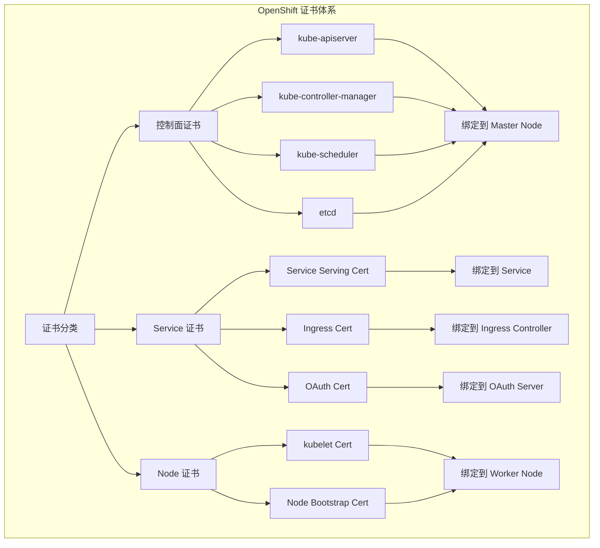
```mermaid
graph TB
    subgraph "OpenShift 证书体系"
        A[证书分类] --> B[控制面证书]
        A --> C[Service 证书]
        A --> D[Node 证书]
        
        B --> B1[kube-apiserver]
        B --> B2[kube-controller-manager]
        B --> B3[kube-scheduler]
        B --> B4[etcd]
        
        C --> C1[Service Serving Cert]
        C --> C2[Ingress Cert]
        C --> C3[OAuth Cert]
        
        D --> D1[kubelet Cert]
        D --> D2[Node Bootstrap Cert]
        
        B1 --> E[绑定到 Master Node]
        B2 --> E
        B3 --> E
        B4 --> E
        
        C1 --> F[绑定到 Service]
        C2 --> G[绑定到 Ingress Controller]
        C3 --> H[绑定到 OAuth Server]
        
        D1 --> I[绑定到 Worker Node]
        D2 --> I
    end
```

**证书绑定关系总结**：

| 证书类型 | 绑定对象 | 存储位置 | 管理方式 | 有效期 |
|---------|---------|---------|---------|--------|
| **控制面证书** | Master Node | `/etc/kubernetes/static-pod-certs/` | 手动/自动轮换 | 10 年 |
| **Service 证书** | Service | etcd (Secret) | service-ca Operator 自动管理 | 2 年 |
| **Node 证书** | Worker Node | Node 本地 `/var/lib/kubelet/pki/` | kubelet 自动轮换 | 1 年 |
| **Ingress 证书** | Ingress Controller | etcd (Secret) | 手动配置或 cert-manager | 自定义 |

##### (b) 备份时的证书处理方案

**控制面证书备份**：

```bash
# 控制面证书目录结构
/etc/kubernetes/static-pod-certs/
├── secrets/
│   ├── etcd-all-certs/                    # etcd 证书
│   ├── kube-apiserver-to-kubelet-client/  # API Server 到 kubelet 客户端证书
│   ├── kube-control-plane-signer/         # 控制面签名证书
│   └── ...
└── configmaps/
    ├── etcd-all-bundles/                  # etcd CA bundle
    └── kube-apiserver-server-ca/          # API Server CA bundle

# OpenShift 官方备份脚本会自动包含证书
/usr/local/bin/cluster-backup.sh /home/core/assets/backup

# 产物：
# - snapshot_<timestamp>.db                    # etcd 快照（包含 Service 证书）
# - static_kuberesources_<timestamp>.tar.gz    # 静态 Pod 资源（包含控制面证书）
```

**Service 证书备份**：

```yaml
# Service Serving Certificates 存储在 etcd 的 Secret 中
# etcd 快照会自动包含这些证书
# 由 service-ca Operator 自动管理和轮换

# 无需单独备份，etcd 快照已包含
# 但可以额外导出用于验证

# 导出所有 Service 证书
$ oc get secrets --all-namespaces -o yaml > service-certs-backup.yaml

# 导出特定 Service 的证书
$ oc get secret my-service-serving-cert -n my-namespace -o yaml > my-service-cert.yaml
```

**Node 证书备份**：

```bash
# 方案1：不备份，依赖自动轮换（推荐）
# - kubelet 证书会在 Node 加入集群时自动生成
# - 恢复后 Node 会自动申请新证书

# 方案2：备份 Node 证书（用于快速恢复）
$ oc debug node/worker-0
sh-4.4# chroot /host
sh-4.4# tar -czf /tmp/kubelet-certs.tar.gz /var/lib/kubelet/pki/
sh-4.4# cp /tmp/kubelet-certs.tar.gz /backup/
```

##### (c) 恢复时的证书处理方案

**控制面证书恢复**：

```bash
# 1. 从备份恢复控制面证书
/usr/local/bin/cluster-restore.sh /home/core/backup

# 2. 验证证书有效性
$ openssl x509 -in /etc/kubernetes/static-pod-certs/secrets/kube-apiserver-to-kubelet-client/current-cert.pem \
  -noout -dates

# 3. 重启控制面组件
$ systemctl restart kube-apiserver kube-controller-manager kube-scheduler etcd
```

**关键约束**：
- 恢复的证书必须与 etcd 快照版本一致
- 证书过期时间必须有效
- 如果证书已过期，需要手动更新

**Service 证书恢复**：

```bash
# 1. etcd 快照恢复后，Service 证书自动恢复
# 2. 验证 service-ca Operator 状态
$ oc get clusteroperator service-ca

# 3. 验证 Service 证书
$ oc get secret my-service-serving-cert -n my-namespace \
  -o jsonpath='{.data.tls\.crt}' | base64 -d | openssl x509 -noout -dates

# 4. 如果证书有问题，手动触发重新生成
$ oc delete secret my-service-serving-cert -n my-namespace
# service-ca Operator 会自动重新生成
```

**常见问题**：
- Service 证书可能在恢复后过期
- service-ca Operator 需要时间重新同步
- 某些 Service 可能需要重启以加载新证书

**Node 证书恢复**：

```bash
# 方案1：自动重新生成（推荐）
# 1. 恢复后，kubelet 会自动申请新证书
# 2. 批准证书签名请求
$ oc get csr
$ oc approve csr-xxxxx

# 3. 验证 Node 状态
$ oc get nodes

# 方案2：使用备份的证书（快速恢复）
$ oc debug node/worker-0
sh-4.4# chroot /host
sh-4.4# tar -xzf /backup/kubelet-certs.tar.gz -C /
sh-4.4# systemctl restart kubelet
```

**关键约束**：
- 恢复的 Node 证书必须与集群 CA 一致
- 如果 Node 证书过期，需要重新申请
- Node 重新加入集群后，会自动获得新证书

##### (d) 证书备份恢复策略设计

**备份策略**：

```yaml
# BKE 证书备份策略
apiVersion: bke.io/v1
kind: CertificateBackupPolicy
metadata:
  name: default
spec:
  # 控制面证书
  controlPlane:
    enabled: true
    backupMethod: "cluster-backup.sh"  # 使用 OpenShift 官方脚本
    includeSecrets: true
    includeConfigMaps: true
    
  # Service 证书
  serviceCertificates:
    enabled: true
    backupMethod: "etcd-snapshot"  # 通过 etcd 快照备份
    exportSecrets: true  # 额外导出 Secret 用于验证
    
  # Node 证书
  nodeCertificates:
    enabled: false  # 不备份，依赖自动轮换
    backupMethod: "auto-regenerate"
    
  # 备份调度
  schedule:
    frequency: "daily"
    retention:
      maxCount: 30
      maxAge: "7d"
```

**恢复策略**：

```yaml
# BKE 证书恢复策略
apiVersion: bke.io/v1
kind: CertificateRestorePolicy
metadata:
  name: default
spec:
  # 恢复顺序
  restoreOrder:
    - "controlPlane"      # 1. 先恢复控制面证书
    - "etcd"              # 2. 恢复 etcd（包含 Service 证书）
    - "serviceCA"         # 3. 验证 service-ca Operator
    - "nodes"             # 4. 恢复 Node（自动申请证书）
    
  # 控制面证书恢复
  controlPlane:
    method: "cluster-restore.sh"
    validateExpiry: true
    autoRenewIfExpired: true
    
  # Service 证书恢复
  serviceCertificates:
    method: "etcd-restore"
    validateOperator: true
    autoRegenerateIfInvalid: true
    
  # Node 证书恢复
  nodeCertificates:
    method: "auto-regenerate"
    approveCSR: true
    timeout: "10m"
```

##### (e) 证书备份恢复 Go 代码实现

```go
// CertificateBackupManager 证书备份管理器
type CertificateBackupManager struct {
    client          kubernetes.Interface
    backupStorage   BackupStorage
    config          CertificateBackupConfig
}

type CertificateBackupConfig struct {
    // 控制面证书配置
    ControlPlane ControlPlaneCertConfig
    
    // Service 证书配置
    Service ServiceCertConfig
    
    // Node 证书配置
    Node NodeCertConfig
}

type ControlPlaneCertConfig struct {
    CertDir         string  // /etc/kubernetes/static-pod-certs/
    IncludeSecrets  bool
    IncludeCABundle bool
}

type ServiceCertConfig struct {
    ExportSecrets  bool
    Namespaces     []string  // 空表示所有命名空间
}

type NodeCertConfig struct {
    BackupMethod   string  // "auto-regenerate" or "backup"
    BackupDir      string  // /var/lib/kubelet/pki/
}

// Backup 执行证书备份
func (m *CertificateBackupManager) Backup(ctx context.Context) (*CertificateBackupResult, error) {
    result := &CertificateBackupResult{
        BackupTime: time.Now(),
    }
    
    // 1. 备份控制面证书
    if m.config.ControlPlane.Enabled() {
        controlPlaneBackup, err := m.backupControlPlaneCerts(ctx)
        if err != nil {
            return nil, fmt.Errorf("backup control plane certs failed: %w", err)
        }
        result.ControlPlaneBackup = controlPlaneBackup
    }
    
    // 2. 备份 Service 证书
    if m.config.Service.Enabled() {
        serviceBackup, err := m.backupServiceCerts(ctx)
        if err != nil {
            return nil, fmt.Errorf("backup service certs failed: %w", err)
        }
        result.ServiceBackup = serviceBackup
    }
    
    // 3. Node 证书不备份（依赖自动轮换）
    if m.config.Node.BackupMethod == "backup" {
        nodeBackup, err := m.backupNodeCerts(ctx)
        if err != nil {
            return nil, fmt.Errorf("backup node certs failed: %w", err)
        }
        result.NodeBackup = nodeBackup
    }
    
    return result, nil
}

// backupControlPlaneCerts 备份控制面证书
func (m *CertificateBackupManager) backupControlPlaneCerts(ctx context.Context) (*ControlPlaneBackup, error) {
    // 1. 启动 debug 会话
    debugPod, err := m.startDebugSession(ctx, "master-0")
    if err != nil {
        return nil, err
    }
    defer m.stopDebugSession(debugPod)
    
    // 2. 打包证书目录
    cmd := fmt.Sprintf("tar -czf /tmp/control-plane-certs.tar.gz -C %s .", 
        m.config.ControlPlane.CertDir)
    if _, err := m.execInPod(debugPod, cmd); err != nil {
        return nil, err
    }
    
    // 3. 复制到备份存储
    backupPath := fmt.Sprintf("control-plane-certs-%s.tar.gz", 
        time.Now().Format("20060102-150405"))
    if err := m.copyFromPod(debugPod, "/tmp/control-plane-certs.tar.gz", backupPath); err != nil {
        return nil, err
    }
    
    return &ControlPlaneBackup{
        BackupPath: backupPath,
        CertCount:  m.countCertificates(backupPath),
    }, nil
}

// backupServiceCerts 备份 Service 证书
func (m *CertificateBackupManager) backupServiceCerts(ctx context.Context) (*ServiceBackup, error) {
    // 1. 获取所有 Service 证书 Secret
    secrets, err := m.client.CoreV1().Secrets("").List(ctx, metav1.ListOptions{
        FieldSelector: "type=kubernetes.io/tls",
    })
    if err != nil {
        return nil, err
    }
    
    // 2. 过滤 Service Serving Certificates
    var serviceSecrets []v1.Secret
    for _, secret := range secrets.Items {
        if isServiceServingCert(&secret) {
            serviceSecrets = append(serviceSecrets, secret)
        }
    }
    
    // 3. 导出到 YAML
    yamlData, err := yaml.Marshal(serviceSecrets)
    if err != nil {
        return nil, err
    }
    
    // 4. 保存到备份存储
    backupPath := fmt.Sprintf("service-certs-%s.yaml", 
        time.Now().Format("20060102-150405"))
    if err := m.backupStorage.Write(backupPath, yamlData); err != nil {
        return nil, err
    }
    
    return &ServiceBackup{
        BackupPath:  backupPath,
        SecretCount: len(serviceSecrets),
    }, nil
}

// isServiceServingCert 判断是否为 Service Serving Certificate
func isServiceServingCert(secret *v1.Secret) bool {
    // Service Serving Certificates 由 service-ca Operator 创建
    // 注解包含 service.alpha.openshift.io/serving-cert-secret-name
    _, exists := secret.Annotations["service.alpha.openshift.io/serving-cert-secret-name"]
    return exists
}

// CertificateRestoreManager 证书恢复管理器
type CertificateRestoreManager struct {
    client          kubernetes.Interface
    restoreStorage  RestoreStorage
    config          CertificateRestoreConfig
}

type CertificateRestoreConfig struct {
    // 恢复顺序
    RestoreOrder []string  // ["controlPlane", "etcd", "serviceCA", "nodes"]
    
    // 控制面证书恢复配置
    ControlPlane ControlPlaneRestoreConfig
    
    // Service 证书恢复配置
    Service ServiceRestoreConfig
    
    // Node 证书恢复配置
    Node NodeRestoreConfig
}

type ControlPlaneRestoreConfig struct {
    ValidateExpiry      bool
    AutoRenewIfExpired  bool
}

type ServiceRestoreConfig struct {
    ValidateOperator        bool
    AutoRegenerateIfInvalid bool
}

type NodeRestoreConfig struct {
    ApproveCSR  bool
    Timeout     time.Duration
}

// Restore 执行证书恢复
func (m *CertificateRestoreManager) Restore(ctx context.Context, backupID string) (*CertificateRestoreResult, error) {
    result := &CertificateRestoreResult{
        RestoreTime: time.Now(),
    }
    
    // 按顺序恢复
    for _, step := range m.config.RestoreOrder {
        switch step {
        case "controlPlane":
            if err := m.restoreControlPlaneCerts(ctx, backupID); err != nil {
                return nil, fmt.Errorf("restore control plane certs failed: %w", err)
            }
            result.ControlPlaneRestored = true
            
        case "etcd":
            // etcd 恢复由 RestoreManager 处理
            result.EtcdRestored = true
            
        case "serviceCA":
            if err := m.validateServiceCAOperator(ctx); err != nil {
                return nil, fmt.Errorf("validate service-ca operator failed: %w", err)
            }
            result.ServiceCARestored = true
            
        case "nodes":
            if err := m.restoreNodeCerts(ctx); err != nil {
                return nil, fmt.Errorf("restore node certs failed: %w", err)
            }
            result.NodesRestored = true
        }
    }
    
    return result, nil
}

// restoreControlPlaneCerts 恢复控制面证书
func (m *CertificateRestoreManager) restoreControlPlaneCerts(ctx context.Context, backupID string) error {
    // 1. 启动 debug 会话
    debugPod, err := m.startDebugSession(ctx, "master-0")
    if err != nil {
        return err
    }
    defer m.stopDebugSession(debugPod)
    
    // 2. 从备份存储获取证书
    backupPath := fmt.Sprintf("control-plane-certs-%s.tar.gz", backupID)
    localPath := "/tmp/control-plane-certs.tar.gz"
    if err := m.restoreStorage.Read(backupPath, localPath); err != nil {
        return err
    }
    
    // 3. 复制到节点
    if err := m.copyToPod(debugPod, localPath, "/tmp/control-plane-certs.tar.gz"); err != nil {
        return err
    }
    
    // 4. 解压到证书目录
    cmd := fmt.Sprintf("tar -xzf /tmp/control-plane-certs.tar.gz -C %s",
        m.config.ControlPlane.CertDir)
    if _, err := m.execInPod(debugPod, cmd); err != nil {
        return err
    }
    
    // 5. 验证证书有效性
    if m.config.ControlPlane.ValidateExpiry {
        if err := m.validateCertificateExpiry(ctx); err != nil {
            if m.config.ControlPlane.AutoRenewIfExpired {
                if err := m.renewExpiredCertificates(ctx); err != nil {
                    return fmt.Errorf("renew expired certificates failed: %w", err)
                }
            } else {
                return fmt.Errorf("certificate expired: %w", err)
            }
        }
    }
    
    // 6. 重启控制面组件
    if _, err := m.execInPod(debugPod, "systemctl restart kube-apiserver kube-controller-manager kube-scheduler etcd"); err != nil {
        return err
    }
    
    return nil
}

// validateServiceCAOperator 验证 service-ca Operator
func (m *CertificateRestoreManager) validateServiceCAOperator(ctx context.Context) error {
    // 1. 检查 Operator 状态
    co, err := m.getClusterOperator(ctx, "service-ca")
    if err != nil {
        return err
    }
    
    if !isClusterOperatorAvailable(co) {
        return fmt.Errorf("service-ca operator is not available")
    }
    
    // 2. 等待 Operator 同步
    if err := m.waitForOperatorSync(ctx, "service-ca", 5*time.Minute); err != nil {
        return fmt.Errorf("wait for service-ca operator sync failed: %w", err)
    }
    
    // 3. 验证 Service 证书
    if m.config.Service.AutoRegenerateIfInvalid {
        if err := m.validateAndRegenerateServiceCerts(ctx); err != nil {
            return fmt.Errorf("validate and regenerate service certs failed: %w", err)
        }
    }
    
    return nil
}

// restoreNodeCerts 恢复 Node 证书
func (m *CertificateRestoreManager) restoreNodeCerts(ctx context.Context) error {
    // 方案1：自动重新生成（推荐）
    // 1. 等待 Node 重新加入集群
    nodes, err := m.client.CoreV1().Nodes().List(ctx, metav1.ListOptions{})
    if err != nil {
        return err
    }
    
    // 2. 批准证书签名请求
    if m.config.Node.ApproveCSR {
        if err := m.approvePendingCSRs(ctx); err != nil {
            return fmt.Errorf("approve pending CSRs failed: %w", err)
        }
    }
    
    // 3. 等待所有 Node 就绪
    if err := m.waitForNodesReady(ctx, len(nodes.Items), m.config.Node.Timeout); err != nil {
        return fmt.Errorf("wait for nodes ready failed: %w", err)
    }
    
    return nil
}

// approvePendingCSRs 批准待处理的 CSR
func (m *CertificateRestoreManager) approvePendingCSRs(ctx context.Context) error {
    csrs, err := m.client.CertificatesV1().CertificateSigningRequests().List(ctx, metav1.ListOptions{})
    if err != nil {
        return err
    }
    
    for _, csr := range csrs.Items {
        if !isCSRApproved(&csr) {
            // 批准 CSR
            csr.Status.Conditions = append(csr.Status.Conditions, certv1.CertificateSigningRequestCondition{
                Type:    certv1.CertificateApproved,
                Status:  v1.ConditionTrue,
                Reason:  "AutoApproved",
                Message: "Auto-approved by certificate restore manager",
            })
            
            if _, err := m.client.CertificatesV1().CertificateSigningRequests().UpdateApproval(ctx, csr.Name, &csr, metav1.UpdateOptions{}); err != nil {
                return fmt.Errorf("approve CSR %s failed: %w", csr.Name, err)
            }
        }
    }
    
    return nil
}
```

##### (f) 证书恢复顺序

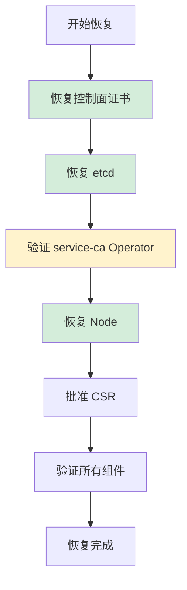
```mermaid
graph TD
    A[开始恢复] --> B[恢复控制面证书]
    B --> C[恢复 etcd]
    C --> D[验证 service-ca Operator]
    D --> E[恢复 Node]
    E --> F[批准 CSR]
    F --> G[验证所有组件]
    G --> H[恢复完成]
    
    style B fill:#d4edda
    style C fill:#d4edda
    style D fill:#fff3cd
    style E fill:#d4edda
```

**恢复顺序说明**：

| 步骤 | 操作 | 原因 | 注意事项 |
|------|------|------|---------|
| **1. 控制面证书** | 从备份恢复 | 控制面组件依赖证书启动 | 必须与 etcd 快照版本一致 |
| **2. etcd** | 从快照恢复 | etcd 包含所有集群状态（包括 Service 证书） | 恢复后 Service 证书自动恢复 |
| **3. service-ca** | 验证 Operator | service-ca 负责管理 Service 证书 | 可能需要等待同步 |
| **4. Node** | 自动重新生成 | kubelet 会自动申请新证书 | 需要批准 CSR |

##### (g) 关键设计要点

**证书绑定关系总结**：

| 证书类型 | 绑定对象 | 备份方式 | 恢复方式 | 注意事项 |
|---------|---------|---------|---------|---------|
| **控制面证书** | Master Node | cluster-backup.sh | cluster-restore.sh | 必须与 etcd 快照版本一致 |
| **Service 证书** | Service | etcd 快照 | etcd 恢复 + service-ca 验证 | 可能需要在恢复后重新生成 |
| **Node 证书** | Worker Node | 不备份 | 自动重新生成 | 恢复后需要批准 CSR |

**对 BKE 的核心建议**：

| 维度 | OpenShift 方案 | BKE 建议 |
|------|---------------|---------|
| **控制面证书** | cluster-backup.sh 自动包含 | 使用官方脚本，确保完整备份 |
| **Service 证书** | etcd 快照自动包含 | 额外导出 Secret 用于验证 |
| **Node 证书** | 不备份，依赖自动轮换 | 不备份，恢复后批准 CSR |
| **证书验证** | 手动验证 | 实现自动化验证逻辑 |
| **证书轮换** | 自动轮换 | 实现 CertificateRotationManager |

**关键约束**：

```yaml
certificateConstraints:
  # 必须遵守的约束
  mandatory:
    - "控制面证书必须与 etcd 快照版本一致"
    - "恢复后必须验证所有证书的有效性"
    - "Node 证书恢复后必须批准 CSR"
    
  # 强烈建议的最佳实践
  recommended:
    - "定期验证证书过期时间"
    - "备份时额外导出 Service 证书"
    - "恢复后验证 service-ca Operator 状态"
    - "实现自动化证书轮换"
    
  # 避免的做法
  avoid:
    - "不要备份 Node 证书（依赖自动轮换）"
    - "不要跳过证书验证"
    - "不要使用过期的证书"
    - "不要手动修改 service-ca 管理的证书"
```

### 12.6 第三方工具

#### 12.5.1 OADP (OpenShift API for Data Protection)

OADP 是 Red Hat 提供的备份解决方案，基于 Velero。

##### 安装 OADP

```bash
# 安装 OADP Operator
oc subscribe --source=redhat-operators --channel=stable-1.3 \
  --name=redhat-oadp-operator --namespace=openshift-adp

# 创建 DataProtectionApplication
cat <<EOF | oc apply -f -
apiVersion: oadp.openshift.io/v1alpha1
kind: DataProtectionApplication
metadata:
  name: velero
  namespace: openshift-adp
spec:
  configuration:
    velero:
      defaultPlugins:
        - openshift
        - aws
  backupLocations:
    - velero:
        provider: aws
        default: true
        config:
          region: us-west-2
          profile: "default"
        credential:
          name: cloud-credentials
          key: cloud
        objectStorage:
          bucket: my-cluster-backups
          prefix: "velero"
EOF
```

##### 使用 Velero 备份和恢复

```bash
# 创建备份
velero backup create my-backup --include-namespaces my-app

# 查看备份
velero backup get

# 恢复
velero restore create --from-backup my-backup

# 定时备份
velero schedule create daily-backup --schedule="0 1 * * *"
```

#### 12.5.2 其他备份工具

| 工具 | 用途 | 说明 |
|------|------|------|
| **Restic** | 文件级备份 | 可集成到 Velero 进行 PV 数据备份 |
| **Kopia** | 文件级备份 | Velero 1.9+ 支持的替代方案 |
| **Rsync** | 数据同步 | PV 数据的增量同步 |
| **Storage Snapshot** | 存储快照 | 利用存储后端原生快照能力 |

### 12.6 最佳实践

#### 12.6.1 备份策略

| 维度 | 推荐做法 |
|------|---------|
| **频率** | etcd 每日备份；升级前必须备份 |
| **保留** | 保留最近 30 个 etcd 快照 |
| **存储** | 备份到多个位置（本地 + 远程） |
| **加密** | 备份数据加密存储 |
| **验证** | 每周验证备份可恢复性 |

#### 12.6.2 升级前检查清单

```yaml
preUpgradeChecklist:
  - name: "备份验证"
    checks:
      - "etcd 快照完整"
      - "Kubernetes 资源文件完整"
      - "配置文件完整"
      - "应用数据备份完整"
      
  - name: "环境准备"
    checks:
      - "基础设施可用"
      - "网络连通性正常"
      - "存储空间充足"
      - "证书和密钥就绪"
      
  - name: "人员准备"
    checks:
      - "运维团队就位"
      - "开发团队待命"
      - "管理层知情"
      - "用户已通知"
```

#### 12.6.3 灾难恢复决策流程

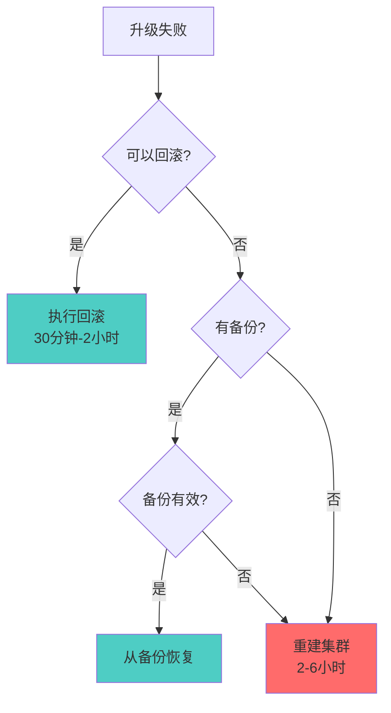
```mermaid
graph TD
    A[升级失败] --> B{可以回滚?}
    B -->|是| C[执行回滚<br/>30分钟-2小时]
    B -->|否| D{有备份?}
    D -->|是| E{备份有效?}
    E -->|是| F[从备份恢复]
    E -->|否| G[重建集群<br/>2-6小时]
    D -->|否| G
    
    style C fill:#4ecdc4
    style F fill:#4ecdc4
    style G fill:#ff6b6b
```

#### 12.6.4 时间估算

| 操作 | 预计时间 |
|------|---------|
| 备份 | 30 分钟 |
| 销毁集群 | 15 分钟 |
| 创建新集群 | 45 分钟 |
| 恢复 K8s 资源 | 20 分钟 |
| 恢复应用数据 | 数据量 × 2 分钟/GB |
| 验证 | 15 分钟 |
| **总计（100GB 数据）** | **约 5.4 小时** |

### 12.7 总结

OpenShift 提供了多层次的备份机制：

1. **etcd 备份**：核心数据存储的备份，支持自动和手动备份
2. **集群资源备份**：使用 oc/kubectl 命令备份所有 Kubernetes 资源
3. **应用数据备份**：数据库、文件等应用特定数据的备份
4. **灾难恢复**：从 etcd 备份恢复、从资源备份恢复、集群重建
5. **第三方工具**：OADP/Velero 提供更强大的备份能力

**关键建议**：
- 定期备份并验证备份可恢复性
- 备份到多个位置（本地 + 远程）
- 升级前必须备份
- 制定清晰的灾难恢复流程
- 定期进行灾难恢复演练

## 十三、OpenShift 备份数据存储方案深度分析

基于 OpenShift 官方文档（4.18 版本），本章深入分析 OpenShift 的备份数据存储架构，为 BKE 备份体系设计提供参考。

### 14.1 备份存储体系总览

OpenShift 采用**分层备份架构**，将备份数据按重要性和恢复粒度分为两层：

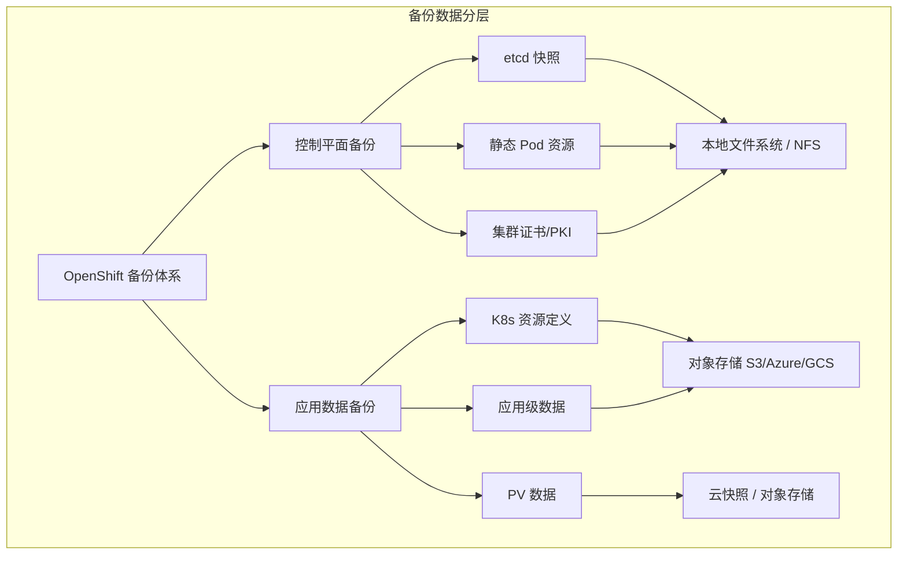
```mermaid
graph TB
    subgraph "备份数据分层"
        A[OpenShift 备份体系]
        A --> B[控制平面备份]
        A --> C[应用数据备份]
        
        B --> B1[etcd 快照]
        B --> B2[静态 Pod 资源]
        B --> B3[集群证书/PKI]
        
        C --> C1[K8s 资源定义]
        C --> C2[PV 数据]
        C --> C3[应用级数据]
        
        B1 --> D1[本地文件系统 / NFS]
        B2 --> D1
        B3 --> D1
        
        C1 --> D2[对象存储 S3/Azure/GCS]
        C2 --> D3[云快照 / 对象存储]
        C3 --> D2
    end
```

### 14.2 控制平面备份存储方案

#### 14.2.1 etcd 快照存储

##### 存储位置与路径

```yaml
etcdBackupStorage:
  # 默认存储路径（RHCOS 节点本地）
  defaultPath: "/var/lib/etcd/backup/"
  
  # 推荐存储路径（独立挂载点）
  recommendedPath: "/backup/etcd/"
  
  # 存储介质要求
  requirements:
    - "独立磁盘或分区（避免与 etcd 数据盘竞争 I/O）"
    - "至少 2x etcd 数据大小"
    - "支持 POSIX 文件系统"
    
  # 备份文件命名规范
  namingConvention: "snapshot-{YYYY-MM-DD}-{HH-MMSS}.db"
  
  # 保留策略
  retention:
    maxCount: 30              # 最多保留 30 个快照
    maxAge: "7d"              # 最长保留 7 天
    cleanupPolicy: "FIFO"     # 先进先出
```

##### 快照存储格式

```go
type EtcdSnapshotMetadata struct {
    // Hash etcd 数据哈希（用于完整性校验）
    Hash uint32 `json:"hash"`
    
    // Revision etcd 修订版本号
    Revision int64 `json:"revision"`
    
    // TotalKeys 键总数
    TotalKeys int64 `json:"totalKeys"`
    
    // TotalSize 快照文件大小（字节）
    TotalSize int64 `json:"totalSize"`
    
    // CreatedAt 快照创建时间
    CreatedAt time.Time `json:"createdAt"`
    
    // EtcdVersion etcd 版本
    EtcdVersion string `json:"etcdVersion"`
    
    // ClusterID etcd 集群 ID
    ClusterID string `json:"clusterID"`
}
```

##### 存储容量估算

```go
func EstimateEtcdBackupSize(nodeCount int, namespaceCount int) int64 {
    // etcd 快照大小经验公式
    // 基础大小: ~50MB
    // 每个节点: ~5MB（MachineConfig、Node 对象等）
    // 每个命名空间: ~2MB（Pod、Service、ConfigMap、Secret 等）
    baseSize := int64(50 * 1024 * 1024) // 50MB
    perNode := int64(5 * 1024 * 1024)   // 5MB
    perNamespace := int64(2 * 1024 * 1024) // 2MB
    
    return baseSize + int64(nodeCount)*perNode + int64(namespaceCount)*perNamespace
}

// 示例：50 节点、200 命名空间的集群
// 50MB + 50*5MB + 200*2MB = 50 + 250 + 400 = 700MB
// 建议存储预留: 700MB * 30(保留数) ≈ 21GB
```

##### 存储安全要求

```yaml
etcdBackupSecurity:
  # etcd 快照包含所有 Secrets，必须加密
  encryption:
    atRest: true
    method: "AES-256-GCM"
    keyManagement: "外部 KMS 或本地密钥文件"
    
  # 访问控制
  accessControl:
    filePermissions: "0600"       # 仅 root 可读写
    ownerUser: "root"
    ownerGroup: "root"
    
  # 传输安全
  transport:
    tlsRequired: true
    certAuth: true                # 使用客户端证书认证
    endpoints:
      - "https://<master-ip>:2379"
```

#### 14.2.2 静态 Pod 资源与证书存储

```yaml
staticResourceBackup:
  # 备份内容
  contents:
    - path: "/etc/kubernetes/manifests/"
      description: "静态 Pod 清单（etcd、kube-apiserver、kube-controller-manager、kube-scheduler）"
    - path: "/etc/kubernetes/pki/"
      description: "集群 PKI 证书和密钥"
    - path: "/etc/kubernetes/static-pod-resources/"
      description: "静态 Pod 资源配置"
      
  # 存储位置
  storageLocation:
    localPath: "/backup/cluster-static-resources/"
    remotePath: "s3://backup-bucket/static-resources/{cluster-id}/"
    
  # 存储格式
  format:
    type: "tar.gz"
    compression: "gzip"
    includeTimestamp: true
```

### 14.3 应用数据备份存储方案（OADP）

#### 14.3.1 OADP 存储架构

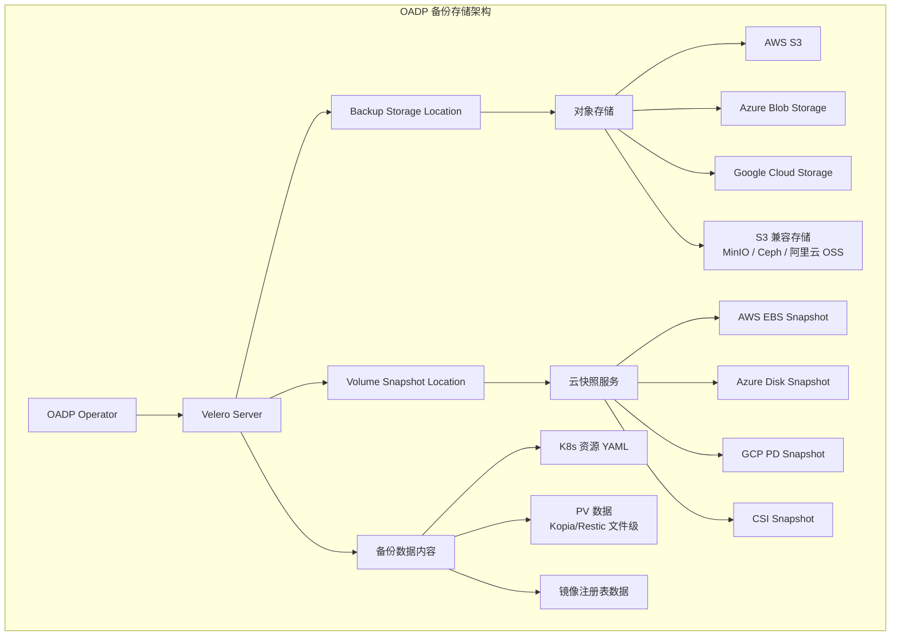
```mermaid
graph TB
    subgraph "OADP 备份存储架构"
        A[OADP Operator] --> B[Velero Server]
        B --> C[Backup Storage Location]
        B --> D[Volume Snapshot Location]
        
        C --> E[对象存储]
        D --> F[云快照服务]
        
        E --> E1[AWS S3]
        E --> E2[Azure Blob Storage]
        E --> E3[Google Cloud Storage]
        E --> E4[S3 兼容存储<br/>MinIO / Ceph / 阿里云 OSS]
        
        F --> F1[AWS EBS Snapshot]
        F --> F2[Azure Disk Snapshot]
        F --> F3[GCP PD Snapshot]
        F --> F4[CSI Snapshot]
        
        B --> G[备份数据内容]
        G --> G1[K8s 资源 YAML]
        G --> G2[PV 数据<br/>Kopia/Restic 文件级]
        G --> G3[镜像注册表数据]
    end
```

#### 14.3.2 BackupStorageLocation 配置

```yaml
apiVersion: oadp.openshift.io/v1alpha1
kind: DataProtectionApplication
metadata:
  name: velero
  namespace: openshift-adp
spec:
  configuration:
    velero:
      defaultPlugins:
        - openshift
        - aws            # AWS / S3 兼容存储
        # - azure        # Azure Blob Storage
        # - gcp          # Google Cloud Storage
        - csi            # CSI 卷快照
      defaultVolumesToFsBackup: false  # 默认使用 CSI 快照而非文件级复制
      
  backupLocations:
    - name: default
      velero:
        provider: aws
        default: true
        config:
          region: us-east-1
          s3Url: "https://s3.amazonaws.com"    # 或 MinIO 端点
          s3ForcePathStyle: false
          # insecureSkipTLSVerify: false        # 生产环境必须为 false
        credential:
          name: cloud-credentials
          key: cloud
        objectStorage:
          bucket: "openshift-backup-prod"
          prefix: "cluster-01"
          caCert: <base64-encoded-ca-cert>     # 自定义 CA 证书（私有存储）
          
  snapshotLocations:
    - name: default
      velero:
        provider: aws
        config:
          region: us-east-1
        credential:
          name: cloud-credentials
          key: cloud
```

#### 14.3.3 备份数据存储格式

```
对象存储桶 (Bucket)
├── backups/
│   └── {backup-name}/
│       ├── velero-backup.json          # 备份元数据（CR 定义）
│       ├── {backup-name}-logs.gz       # 备份日志
│       ├── {backup-name}-resource-list.json.gz  # 资源清单索引
│       ├── {backup-name}-results.gz    # 备份结果摘要
│       ├── resources/
│       │   ├── v1/
│       │   │   ├── configmaps.json.gz         # ConfigMap 数据
│       │   │   ├── secrets.json.gz            # Secret 数据
│       │   │   ├── pods.json.gz               # Pod 定义
│       │   │   ├── services.json.gz           # Service 定义
│       │   │   └── ...
│       │   └── apps/v1/
│       │       ├── deployments.json.gz        # Deployment 定义
│       │       ├── statefulsets.json.gz       # StatefulSet 定义
│       │       └── ...
│       └── cluster-scoped-resources/
│           ├── v1/
│           │   ├── namespaces.json.gz         # Namespace 定义
│           │   ├── persistentvolumes.json.gz  # PV 定义
│           │   └── ...
│           └── config.openshift.io/v1/
│               └── clusterversions.json.gz    # ClusterVersion 定义
│
├── restic/                          # Restic 仓库（文件级 PV 备份）
│   └── {namespace}/
│       └── {pv-name}/
│           ├── index/
│           ├── data/
│           └── snapshots/
│
├── kopia/                           # Kopia 仓库（替代 Restic）
│   └── repo/
│       ├── index/
│       ├── data/
│       └── snapshots/
│
└── schedules/                       # 定时备份记录
    └── {schedule-name}/
        └── {backup-name}/
            └── ...                  # 同上 backups/ 结构
```

#### 14.3.4 PV 数据存储方式对比

| 存储方式 | 后端 | 适用场景 | 性能 | 增量支持 |
|---------|------|---------|------|---------|
| **CSI 快照** | 云存储原生快照（EBS/PD/Disk） | 云环境、大规模数据 | 高 | 是（云原生） |
| **Kopia 文件级** | 对象存储（S3/GCS/Azure） | 通用、跨平台 | 中 | 是（文件级） |
| **Restic 文件级** | 对象存储（S3/GCS/Azure） | 通用（旧版） | 中 | 是（文件级） |
| **Storage 快照** | CSI 驱动 + 对象存储 | CSI 兼容环境 | 高 | 取决于 CSI |

#### 14.3.5 DataMover 大规模数据搬运

```yaml
# DataMover 架构：高效搬运 PVC 数据到备份存储
dataMover:
  # 工作原理
  workflow:
    1: "创建 VolumeSnapshot（CSI 快照）"
    2: "从快照创建临时 Pod（挂载快照数据）"
    3: "使用 Restic/Kopia 将数据复制到对象存储"
    4: "清理临时资源"
    
  # 配置
  config:
    volumeSnapshotClass: "csi-aws-vsc"    # CSI VolumeSnapshotClass
    enableDataMover: true                  # 启用 DataMover
    dataMoverTimeout: "4h"                 # 超时时间
    
  # 优势
  advantages:
    - "不占用工作节点网络带宽（直接访问快照）"
    - "支持增量备份（CSI 增量快照）"
    - "适合大规模 PVC 数据（TB 级）"
```

### 14.4 备份存储后端选型分析

#### 14.4.1 存储后端对比矩阵

```go
type BackupStorageBackend struct {
    Name           string
    Type           string   // "object" | "file" | "block"
    Scalability    string   // "high" | "medium" | "low"
    Cost           string   // "high" | "medium" | "low"
    Durability     string   // "high" | "medium" | "low"
    Latency        string   // "high" | "medium" | "low"
    Incremental    bool
    Encryption     bool
    MultiRegion    bool
}

var BackupStorageBackends = []BackupStorageBackend{
    // 对象存储（推荐用于应用数据备份）
    {Name: "AWS S3", Type: "object", Scalability: "high", Cost: "medium", Durability: "high", Latency: "medium", Incremental: true, Encryption: true, MultiRegion: true},
    {Name: "Azure Blob", Type: "object", Scalability: "high", Cost: "medium", Durability: "high", Latency: "medium", Incremental: true, Encryption: true, MultiRegion: true},
    {Name: "GCS", Type: "object", Scalability: "high", Cost: "medium", Durability: "high", Latency: "medium", Incremental: true, Encryption: true, MultiRegion: true},
    {Name: "MinIO", Type: "object", Scalability: "high", Cost: "low", Durability: "high", Latency: "medium", Incremental: true, Encryption: true, MultiRegion: false},
    {Name: "Ceph RGW", Type: "object", Scalability: "high", Cost: "low", Durability: "high", Latency: "medium", Incremental: true, Encryption: true, MultiRegion: false},
    {Name: "阿里云 OSS", Type: "object", Scalability: "high", Cost: "medium", Durability: "high", Latency: "medium", Incremental: true, Encryption: true, MultiRegion: true},
    
    // 文件系统（用于 etcd 快照）
    {Name: "NFS", Type: "file", Scalability: "medium", Cost: "low", Durability: "medium", Latency: "high", Incremental: false, Encryption: false, MultiRegion: false},
    {Name: "本地磁盘", Type: "file", Scalability: "low", Cost: "low", Durability: "low", Latency: "low", Incremental: false, Encryption: false, MultiRegion: false},
    
    // 块存储（用于云快照）
    {Name: "AWS EBS Snapshot", Type: "block", Scalability: "high", Cost: "medium", Durability: "high", Latency: "low", Incremental: true, Encryption: true, MultiRegion: false},
    {Name: "Azure Disk Snapshot", Type: "block", Scalability: "high", Cost: "medium", Durability: "high", Latency: "low", Incremental: true, Encryption: true, MultiRegion: false},
    {Name: "GCP PD Snapshot", Type: "block", Scalability: "high", Cost: "medium", Durability: "high", Latency: "low", Incremental: true, Encryption: true, MultiRegion: false},
}
```

#### 14.4.2 推荐存储组合

```yaml
recommendedStorageCombination:
  # 控制平面备份（etcd 快照）
  controlPlane:
    primary:
      type: "本地文件系统"
      path: "/backup/etcd/"
      reason: "低延迟、快速恢复、无需网络"
    secondary:
      type: "对象存储（S3 兼容）"
      bucket: "etcd-backup-{cluster-id}"
      reason: "异地容灾、长期保留"
    schedule: "每日 + 升级前"
    
  # 应用数据备份
  application:
    metadata:
      type: "对象存储（S3 兼容）"
      bucket: "openshift-backup-{cluster-id}"
      reason: "K8s 资源定义体积小、需持久化"
    pvData:
      type: "CSI 快照 + 对象存储"
      reason: "大规模数据高效备份"
      csiSnapshot: "用于快速恢复"
      objectStorage: "用于长期保留和跨区复制"
    schedule: "每日增量 + 每周全量"
    
  # 镜像注册表备份
  imageRegistry:
    type: "对象存储（S3 兼容）"
    bucket: "registry-backup-{cluster-id}"
    reason: "镜像数据量大、需持久化"
    schedule: "按需（新镜像推送后）"
```

### 14.5 备份存储生命周期管理

#### 14.5.1 数据生命周期策略

```go
type BackupLifecyclePolicy struct {
    // HotStorage 热存储（快速恢复，保留 7 天）
    HotStorage StorageTierConfig `json:"hotStorage"`
    
    // WarmStorage 温存储（标准恢复，保留 30 天）
    WarmStorage StorageTierConfig `json:"warmStorage"`
    
    // ColdStorage 冷存储（归档，保留 1 年）
    ColdStorage StorageTierConfig `json:"coldStorage"`
    
    // ArchiveStorage 归档存储（合规，永久保留）
    ArchiveStorage StorageTierConfig `json:"archiveStorage"`
}

type StorageTierConfig struct {
    StorageClass string        // 存储类型（Standard/IA/Glacier）
    Retention    time.Duration // 保留时长
    AccessLatency time.Duration // 访问延迟要求
    CostPerGB    float64       // 每 GB 成本
}

// 生命周期转换规则
var LifecycleRules = []LifecycleRule{
    {From: "HotStorage", To: "WarmStorage", AfterDays: 7},
    {From: "WarmStorage", To: "ColdStorage", AfterDays: 30},
    {From: "ColdStorage", To: "ArchiveStorage", AfterDays: 365},
    {From: "ArchiveStorage", To: "Deleted", AfterDays: 2555}, // 7 年
}
```

#### 14.5.2 存储容量规划

```go
func CalculateBackupStorageRequirement(
    clusterSize int,         // 节点数
    namespaceCount int,      // 命名空间数
    pvDataSizeGB int,        // PV 数据总量 (GB)
    retentionDays int,       // 保留天数
    backupFrequencyPerDay int, // 每日备份次数
) int64 {
    // etcd 快照大小
    etcdSnapshotSize := EstimateEtcdBackupSize(clusterSize, namespaceCount)
    etcdDailySize := etcdSnapshotSize * int64(backupFrequencyPerDay)
    etcdTotalSize := etcdDailySize * int64(retentionDays)
    
    // 应用元数据大小（K8s 资源定义）
    metadataSizePerBackup := int64(namespaceCount) * 5 * 1024 * 1024 // 5MB per namespace
    metadataTotalSize := metadataSizePerBackup * int64(backupFrequencyPerDay) * int64(retentionDays)
    
    // PV 数据大小（考虑增量备份压缩）
    pvFullBackupSize := int64(pvDataSizeGB) * 1024 * 1024 * 1024
    pvIncrementalRatio := 0.1 // 增量备份约为全量的 10%
    pvDailySize := pvFullBackupSize + pvFullBackupSize * pvIncrementalRatio * int64(backupFrequencyPerDay-1)
    pvTotalSize := pvDailySize * int64(retentionDays)
    
    // 总存储需求（含 20% 冗余）
    totalSize := etcdTotalSize + metadataTotalSize + pvTotalSize
    return int64(float64(totalSize) * 1.2)
}
```

### 14.6 备份存储安全架构

#### 14.6.1 安全分层

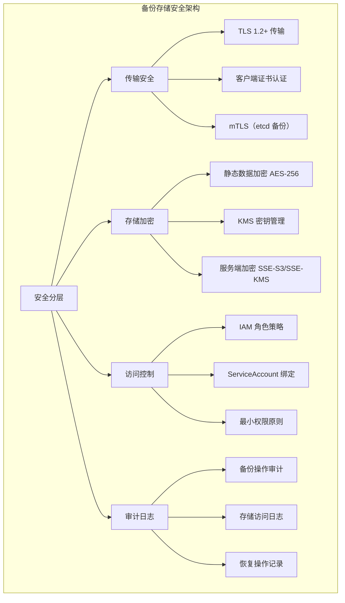
```mermaid
graph TB
    subgraph "备份存储安全架构"
        A[安全分层] --> B[传输安全]
        A --> C[存储加密]
        A --> D[访问控制]
        A --> E[审计日志]
        
        B --> B1[TLS 1.2+ 传输]
        B --> B2[客户端证书认证]
        B --> B3[mTLS（etcd 备份）]
        
        C --> C1[静态数据加密 AES-256]
        C --> C2[KMS 密钥管理]
        C --> C3[服务端加密 SSE-S3/SSE-KMS]
        
        D --> D1[IAM 角色策略]
        D --> D2[ServiceAccount 绑定]
        D --> D3[最小权限原则]
        
        E --> E1[备份操作审计]
        E --> E2[存储访问日志]
        E --> E3[恢复操作记录]
    end
```

#### 14.6.2 凭证安全存储

```yaml
backupCredentialSecurity:
  # 云存储凭证
  cloudCredentials:
    storageType: "Kubernetes Secret"
    secretName: "cloud-credentials"
    namespace: "openshift-adp"
    data:
      cloud: |
        [default]
        aws_access_key_id = <AKIA...>
        aws_secret_access_key = <...>
    
    # 安全增强
    securityEnhancements:
      - "使用 Workload Identity（替代静态 AK/SK）"
      - "启用 STS 临时凭证（15 分钟过期）"
      - "Secret 加密存储（etcd 加密或 Sealed Secrets）"
      - "定期轮换凭证"
      
  # etcd 备份证书
  etcdCertificates:
    storageType: "Kubernetes Secret"
    secretName: "etcd-backup-secrets"
    namespace: "kube-system"
    data:
      ca.crt: "<etcd CA 证书>"
      client.crt: "<客户端证书>"
      client.key: "<客户端密钥>"
    
    securityEnhancements:
      - "证书有效期不超过 1 年"
      - "使用独立 CA（不共用集群 CA）"
      - "密钥文件权限 0600"
```

### 14.7 对 BKE 备份存储设计的建议

#### 14.7.1 存储架构设计

```go
type BKEBackupStorageConfig struct {
    // 控制平面备份存储
    ControlPlaneBackup ControlPlaneBackupStorage `json:"controlPlaneBackup"`
    
    // 应用数据备份存储
    ApplicationBackup ApplicationBackupStorage `json:"applicationBackup"`
    
    // 全局配置
    Global GlobalBackupConfig `json:"global"`
}

type ControlPlaneBackupStorage struct {
    // 主存储（本地，快速恢复）
    Primary LocalStorageConfig `json:"primary"`
    
    // 副本存储（远程，异地容灾）
    Secondary RemoteStorageConfig `json:"secondary"`
    
    // 备份调度
    Schedule BackupSchedule `json:"schedule"`
}

type ApplicationBackupStorage struct {
    // 元数据存储
    Metadata ObjectStorageConfig `json:"metadata"`
    
    // PV 数据存储
    PVData PVDataStorageConfig `json:"pvData"`
    
    // 备份调度
    Schedule BackupSchedule `json:"schedule"`
}

type PVDataStorageConfig struct {
    // 快照方式
    SnapshotMethod SnapshotMethod `json:"snapshotMethod"` // "csi" | "kopia" | "restic"
    
    // 对象存储配置
    ObjectStorage ObjectStorageConfig `json:"objectStorage"`
    
    // 增量策略
    IncrementalPolicy IncrementalPolicy `json:"incrementalPolicy"`
}
```

#### 14.7.2 关键设计决策

| 决策点 | OpenShift 方案 | BKE 建议 | 理由 |
|--------|---------------|---------|------|
| **etcd 备份存储** | 本地文件系统 | 本地 + 对象存储双副本 | 本地快速恢复 + 远程容灾 |
| **应用元数据存储** | 对象存储（S3 兼容） | S3 兼容对象存储 | 通用性强、成本低、持久化好 |
| **PV 数据存储** | CSI 快照 + 文件级复制 | CSI 快照为主 + Kopia 兜底 | 云环境用 CSI 快照，裸金属用 Kopia |
| **增量备份** | CSI 增量快照 | CSI 增量 + 对象存储增量 | 减少存储成本和网络带宽 |
| **加密** | AES-256 + KMS | AES-256 + 外部 KMS | 合规要求，防止数据泄露 |
| **生命周期** | 手动管理 | 自动分层（热/温/冷/归档） | 降低长期存储成本 |

#### 14.7.3 文件级备份引擎对比：Kopia / Restic / BorgBackup

在 OADP 备份体系中，PV 数据的文件级备份依赖底层备份引擎。OpenShift 4.18 默认使用 **Kopia**（替代旧版 Restic）。以下对三种主流去重归档工具进行深度对比。

##### 14.7.3.1 Kopia

**定位**：现代高性能备份引擎，Velero/OADP 的默认文件级备份后端（自 Velero 1.9+）。

```yaml
kopia:
  language: "Go"
  license: "Apache-2.0"
  maintainer: "Kopia Open Source Project"
  
  coreFeatures:
    - "内容寻址存储（Content-Addressable Storage）"
    - "全局去重（跨快照、跨机器）"
    - "端到端加密（AES-256-GCM / ChaCha20-Poly1305）"
    - "压缩（LZ4 / Zstandard / Deflate / gzip 等）"
    - "错误纠正码（ECC，Reed-Solomon）"
    - "快照不可变性（Ransomware Protection）"
    - "FUSE 挂载浏览（无需完整恢复）"
    - "策略引擎（保留策略、调度、排除规则）"
    
  supportedBackends:
    objectStorage:
      - "AWS S3 / S3 兼容（MinIO、Ceph RGW、阿里云 OSS）"
      - "Azure Blob Storage"
      - "Google Cloud Storage"
      - "Backblaze B2"
    fileSystem:
      - "本地文件系统"
      - "NFS / SMB"
    protocol:
      - "WebDAV"
      - "SFTP"
      - "Rclone（实验性，支持 Dropbox/OneDrive/Google Drive）"
    server:
      - "Kopia Repository Server（客户端/服务器架构）"
      
  dataModel:
    description: |
      Kopia 使用内容寻址存储模型：
      1. 文件被分割为可变大小的数据块（默认 4KB-16MB）
      2. 每个块通过 SHA2-256 哈希寻址
      3. 相同内容的块只存储一份（去重）
      4. 块按目录树结构组织为快照（Snapshot）
      5. 快照引用内容对象，形成不可变 DAG
      
    structure: |
      Repository
      ├── index/                    # 内容索引（块哈希 → 存储位置）
      ├── x{hash}.kopiafile        # 数据块文件（按哈希前缀分目录）
      ├── x{hash}/
      │   └── x{subhash}.kopiafile
      ├── snapshots/               # 快照元数据
      │   └── {manifest-id}       # 每个快照一个 manifest
      └── policies/               # 保留策略
      
  performance:
    deduplication: "全局去重（跨快照、跨机器、跨存储库）"
    compression: "Zstandard（默认）、LZ4、Deflate 等"
    concurrency: "并行分块、并行加密、并行上传"
    caching: "本地元数据缓存 + 内容缓存"
    incrementalBackup: "原生增量（仅上传变更块）"
    
  security:
    encryption:
      - "AES-256-GCM（默认）"
      - "ChaCha20-Poly1305"
      - "用户控制的端到端加密"
      - "密钥派生：scrypt/Argon2"
    ransomwareProtection: "快照不可变性（Immutable Snapshots）"
    ecc: "Reed-Solomon 错误纠正码"
    
  advantages:
    - "性能最优：内容寻址 + 并行处理，备份速度显著快于 Restic"
    - "全局去重：跨机器去重，大幅降低存储成本"
    - "快照不可变：防勒索软件篡改"
    - "FUSE 挂载：无需完整恢复即可浏览和复制单个文件"
    - "策略引擎：内置保留策略和调度"
    - "活跃维护：持续更新，社区活跃"
    
  disadvantages:
    - "仓库格式不兼容 Restic（无法直接使用 Restic 仓库）"
    - "相对较新（2020 年首次发布），生态成熟度低于 Restic"
    - "内存占用较高（索引缓存）"
```

##### 14.7.3.2 Restic

**定位**：经典 Go 语言备份工具，Velero 1.9 之前的默认文件级备份后端。

```yaml
restic:
  language: "Go"
  license: "BSD-2-Clause"
  maintainer: "Restic Open Source Project"
  
  coreFeatures:
    - "内容寻址存储"
    - "去重（仓库内去重）"
    - "端到端加密（AES-256-CTR + Poly1305）"
    - "压缩（Zstandard，自 0.14.0+）"
    - "FUSE 挂载浏览"
    - "快照管理（tag、描述、保留策略）"
    - "多种后端支持"
    
  supportedBackends:
    objectStorage:
      - "AWS S3 / S3 兼容"
      - "Azure Blob Storage"
      - "Google Cloud Storage"
      - "Backblaze B2"
      - "OpenStack Swift"
      - "阿里云 OSS"
    fileSystem:
      - "本地文件系统"
      - "SFTP"
      - "REST Server（rest-server）"
    protocol:
      - "Rclone（支持 40+ 云存储后端）"
      
  dataModel:
    description: |
      Restic 使用类似 Git 的内容寻址模型：
      1. 文件被分割为可变大小的数据块（CDC，默认 512KB-8MB）
      2. 每个块通过 SHA-256 哈希寻址
      3. 相同内容的块只存储一份（去重）
      4. 块组织为 Tree 对象，Tree 组成 Snapshot
      5. 所有对象存储在 Pack 文件中
      
    structure: |
      Repository
      ├── data/                    # Pack 文件（包含多个加密的数据块）
      │   ├── {pack-hash}
      │   └── ...
      ├── index/                   # 索引文件（块哈希 → Pack 位置）
      ├── keys/                    # 加密密钥
      ├── locks/                   # 锁文件（防止并发操作冲突）
      ├── snapshots/               # 快照元数据
      └── config                   # 仓库配置
      
  performance:
    deduplication: "仓库内去重"
    compression: "Zstandard（可选，自 0.14.0）"
    concurrency: "并行处理（但比 Kopia 慢）"
    caching: "本地索引缓存"
    incrementalBackup: "原生增量（仅上传变更块）"
    
  security:
    encryption:
      - "AES-256-CTR + HMAC-Poly1305"
      - "密钥派生：scrypt"
      - "所有数据在客户端加密"
    
  advantages:
    - "成熟稳定：2016 年首次发布，社区庞大"
    - "后端支持最广：40+ 存储后端（通过 Rclone）"
    - "简单易用：单二进制文件，无依赖"
    - "Velero 集成最成熟"
    - "跨平台：Linux / macOS / Windows / FreeBSD"
    
  disadvantages:
    - "性能瓶颈：大量小文件时索引操作慢"
    - "内存占用高：大仓库索引加载消耗大量 RAM"
    - "无全局去重：仅仓库内去重"
    - "无快照不可变性"
    - "Velero 已逐步迁移到 Kopia（Restic 模式标记为遗留）"
    - "压缩功能较晚加入（0.14.0，2022 年）"
```

##### 14.7.3.3 BorgBackup

**定位**：Python 实现的去重归档工具，主要用于 Linux 系统级备份。

```yaml
borgbackup:
  language: "Python + C"
  license: "BSD-3-Clause"
  maintainer: "Borg Collective"
  currentVersion: "1.4.x / 2.0.x（开发中）"
  
  coreFeatures:
    - "内容寻址去重"
    - "端到端加密（AES-256-CTR / ChaCha20）"
    - "压缩（LZ4 / Zstd / LZMA）"
    - "FUSE 挂载浏览"
    - "保留策略（prune）"
    - "空间回收（compact）"
    - "远程仓库（SSH 原生）"
    
  supportedBackends:
    fileSystem:
      - "本地文件系统"
      - "SSH 远程主机（原生支持，无需额外服务）"
      - "sshfs 挂载的远程文件系统"
    note: "不直接支持对象存储（S3/Azure/GCS），需通过 sshfs 或 rclone mount 中转"
      
  dataModel:
    description: |
      Borg 使用内容寻址的分块模型：
      1. 文件通过 buzhash 算法分割为可变大小块
      2. 每个块通过 BLAKE2b-256 或 SHA-256 哈希去重
      3. 块压缩后存储在 Segment 文件中
      4. Archive 记录文件元数据和块引用
      5. Manifest 跟踪所有 Archive
      
    structure: |
      Repository
      ├── config                   # 仓库配置
      ├── data/                    # Segment 文件（包含压缩加密的数据块）
      │   ├── 0
      │   ├── 1
      │   └── ...
      ├── index.{txn-id}/         # 块索引（哈希 → Segment 位置）
      ├── hints.{txn-id}          # 索引辅助信息
      └── integrity.{txn-id}      # 完整性校验数据
      
      Archives（在 Repository 内）
      └── {archive-name}          # 每次备份创建一个 Archive
          └── 文件树 + 块引用
      
  performance:
    deduplication: "仓库内去重（跨 Archive）"
    compression: "LZ4（默认，最快）、Zstd、LZMA（最高压缩比）"
    concurrency: "单线程为主（C 扩展加速关键路径）"
    caching: "本地文件缓存（文件变更检测）"
    incrementalBackup: "原生增量（仅上传新数据块）"
    
  security:
    encryption:
      - "AES-256-CTR + HMAC-SHA256"
      - "ChaCha20-Poly1305"
      - "RepoKey（密钥存储在仓库配置中，密码保护）"
      - "KeyFile（密钥存储在用户主目录）"
      - "密钥派生：PBKDF2"
    
  advantages:
    - "SSH 原生远程支持：无需在远端安装额外服务"
    - "压缩选项丰富：LZ4（快）/ Zstd（均衡）/ LZMA（高压缩比）"
    - "成熟稳定：2014 年首次发布，Linux 生态广泛使用"
    - "空间回收：compact 命令回收已删除 Archive 的空间"
    - "文件缓存：快速检测未变更文件，加速增量备份"
    - "低资源需求：适合资源受限的 Linux 服务器"
    
  disadvantages:
    - "仅支持 Linux/macOS（无 Windows 原生支持）"
    - "不直接支持对象存储（S3/Azure/GCS）"
    - "单线程性能受限"
    - "无快照不可变性"
    - "无全局去重（仅仓库内去重）"
    - "Python 性能瓶颈（虽有 C 扩展）"
    - "与 Velero/OADP 无原生集成"
    - "仓库空间管理复杂（需手动 prune + compact）"
```

##### 14.7.3.4 三者综合对比

| 维度 | Kopia | Restic | BorgBackup |
|------|-------|--------|------------|
| **语言** | Go | Go | Python + C |
| **首次发布** | 2020 | 2016 | 2014 |
| **许可证** | Apache-2.0 | BSD-2 | BSD-3 |
| **去重范围** | 全局（跨仓库、跨机器） | 仓库内 | 仓库内 |
| **加密算法** | AES-256-GCM / ChaCha20 | AES-256-CTR + Poly1305 | AES-256-CTR / ChaCha20 |
| **压缩算法** | Zstd / LZ4 / Deflate / gzip | Zstandard | LZ4 / Zstd / LZMA |
| **分块算法** | 可变大小（Gear） | 可变大小（CDC） | 可变大小（Buzhash） |
| **哈希算法** | SHA2-256 | SHA-256 | BLAKE2b-256 / SHA-256 |
| **对象存储** | 原生支持（S3/Azure/GCS/B2） | 原生支持（S3/Azure/GCS/B2/Swift） | 不支持（需 SSH/sshfs 中转） |
| **远程访问** | SFTP / WebDAV / Server | SFTP / REST Server | SSH（原生） |
| **FUSE 挂载** | 支持 | 支持 | 支持 |
| **快照不可变** | 支持 | 不支持 | 不支持 |
| **错误纠正** | Reed-Solomon ECC | 不支持 | 不支持 |
| **并行处理** | 高（多核并行） | 中 | 低（单线程为主） |
| **Velero/OADP 集成** | 默认（推荐） | 遗留（逐步弃用） | 无集成 |
| **Windows 支持** | 支持 | 支持 | 不支持 |
| **GUI** | 有（KopiaUI） | 无 | 无（有第三方 Vorta/Pika） |
| **适用场景** | 云原生备份、大规模数据 | 通用备份、多云环境 | Linux 服务器系统级备份 |

##### 14.7.3.5 OADP 中的使用方式

```yaml
# OADP 中使用 Kopia（推荐，默认）
oadpKopia:
  description: "Velero 1.9+ 默认的文件级备份引擎"
  enableFlag: "defaultVolumesToFsBackup: true"
  workflow:
    1: "Velero 为每个 PVC 创建一个 PodBackupVolume"
    2: "node-agent DaemonSet 在对应节点挂载 PVC"
    3: "Kopia 将 PVC 数据分割、去重、加密、压缩"
    4: "数据块上传到 BackupStorageLocation（对象存储）"
    5: "Kopia 仓库元数据更新"
  repositoryPerPVC: true    # 每个 PVC 一个独立的 Kopia 仓库
  
# OADP 中使用 Restic（遗留，不推荐）
oadpRestic:
  description: "Velero 1.9 之前的默认引擎，仍可用但逐步弃用"
  enableFlag: "defaultVolumesToFsBackup: true + useNodeAgent: false"
  note: "新部署应使用 Kopia 替代 Restic"
  
# BorgBackup 在 OADP 中的使用
oadpBorg:
  description: "OADP/Velero 不原生支持 BorgBackup"
  alternative: "可通过自定义脚本或外部备份流程使用"
  useCase: "适合作为节点级系统备份的补充工具"
```

##### 14.7.3.6 选型建议

```mermaid
graph TD
    A[选择备份引擎] --> B{使用 OADP/Velero?}
    B -->|是| C{PV 数据备份}
    C -->|云环境| D[Kopia + CSI 快照]
    C -->|裸金属| E[Kopia 文件级备份]
    B -->|否| F{备份目标}
    F -->|对象存储| G[Kopia 独立部署]
    F -->|SSH 远程服务器| H[BorgBackup]
    F -->|多云/混合| I[Restic 独立部署]
    
    style D fill:#4ecdc4
    style E fill:#4ecdc4
    style G fill:#4ecdc4
```

| 场景 | 推荐工具 | 理由 |
|------|---------|------|
| **OADP/Velero PV 备份** | Kopia | 默认引擎，性能最优，活跃维护 |
| **独立云原生备份** | Kopia | 原生对象存储支持，全局去重 |
| **Linux 服务器系统备份** | BorgBackup | SSH 原生，压缩比高，资源占用低 |
| **多云/遗留环境** | Restic | 后端支持最广，成熟稳定 |
| **BKE 控制平面备份** | Kopia 或 etcd 快照 | etcd 快照为主，Kopia 补充远程复制 |

#### 14.7.4 实施优先级

| 优先级 | 能力 | 存储需求 | 工作量 |
|--------|------|---------|--------|
| **P0** | etcd 定期快照（本地） | 本地磁盘 | 低 |
| **P0** | etcd 升级前自动备份 | 本地磁盘 | 低 |
| **P1** | 应用元数据备份到对象存储 | S3 兼容存储 | 中 |
| **P1** | CSI 卷快照 | 云存储 / CSI 驱动 | 中 |
| **P2** | etcd 快照异地复制 | 对象存储 | 中 |
| **P2** | Kopia 文件级 PV 备份 | 对象存储 | 高 |
| **P3** | DataMover 大规模数据搬运 | 对象存储 + CSI | 高 |
| **P3** | 备份生命周期自动管理 | 对象存储生命周期策略 | 中 |

## 十四、openFuyao 版本升级策略分析

### 14.1 openFuyao 版本策略概述

openFuyao 采用基于时间的版本命名策略，具有以下特点：

```yaml
versionStrategy:
  # 版本命名格式
  namingFormat: "YY.MM"
  examples:
    - "25.12"  # 2025年12月版本
    - "26.03"  # 2026年3月版本
    - "26.06"  # 2026年6月版本
    - "26.09"  # 2026年9月版本
    - "26.12"  # 2026年12月版本
    
  # 发布频率
  releaseFrequency: "每季度一次"
  
  # LTS 策略
  ltsStrategy:
    rule: "每年最后一个版本为 LTS 版本"
    examples:
      - "25.12"  # 2025年 LTS
      - "26.12"  # 2026年 LTS
      
  # 升级路径
  upgradePaths:
    - type: "相邻版本升级"
      examples:
        - "26.03 → 26.06"
        - "26.06 → 26.09"
        - "26.09 → 26.12"
        
    - type: "LTS 跨版本升级"
      examples:
        - "25.12 → 26.12"  # 跨越 4 个版本
```

### 14.2 与 OpenShift 策略对比

| 维度 | OpenShift | openFuyao | 评估 |
|------|-----------|-----------|------|
| **版本格式** | 4.X (主版本.次版本) | YY.MM (年.月) | openFuyao 更直观 |
| **发布频率** | 约每 2-3 个月 | 每季度 | 相似 |
| **LTS 策略** | 每个次版本支持约 18 个月 | 每年 LTS | openFuyao 更清晰 |
| **升级路径** | 只能相邻升级 (4.16→4.17→4.18) | 相邻 + LTS 跨版本 | openFuyao 更灵活 |
| **支持周期** | 标准版 18 个月，LTS 更长 | 未明确 | 需补充 |
| **补丁版本** | 4.17.1, 4.17.2 等 | 无 | 需增加 |

### 14.3 优势分析

#### ✅ 优点

**1. 版本号直观**
- YY.MM 格式清晰表达发布时间
- 用户一眼可知版本新旧
- 便于版本管理和沟通

**2. LTS 策略明确**
- 每年最后一个版本为 LTS
- 便于企业用户选择长期支持版本
- 降低版本选择复杂度

**3. 升级路径灵活**
- 支持相邻版本升级（快速迭代）
- 支持 LTS 跨版本升级（减少升级次数）
- 适应不同用户需求

**4. 发布节奏稳定**
- 每季度一次，可预期性强
- 便于企业规划升级计划
- 与季度业务周期匹配

#### ⚠️ 潜在问题

**1. LTS 跨版本升级风险**

```
25.12 → 26.12 跨越了 4 个版本
需要确保：
- API 兼容性
- 数据迁移路径
- 配置变更处理
- 回滚方案
```

**2. 非 LTS 版本支持周期短**

```
26.03 → 26.06 → 26.09
如果用户停留在 26.03，3 个月后就需要升级
建议明确非 LTS 版本的支持周期
```

**3. 缺少补丁版本机制**

```
OpenShift 有 4.17.1, 4.17.2 等补丁版本
openFuyao 缺少紧急修复版本机制
建议增加 26.03.1 格式的补丁版本
```

### 14.4 改进建议

#### 建议 1: 增加补丁版本机制

```yaml
patchVersionStrategy:
  format: "YY.MM.PATCH"
  examples:
    - "26.03.0"  # 初始版本
    - "26.03.1"  # 安全修复
    - "26.03.2"  # Bug 修复
    - "26.06.0"  # 下一个季度版本
    
  patchReleasePolicy:
    securityFix: "立即发布"
    criticalBug: "1 周内发布"
    minorBug: "随下个版本发布"
```

#### 建议 2: 明确支持周期

```yaml
supportPolicy:
  ltsVersions:
    supportPeriod: "3 年"
    examples:
      - version: "25.12"
        releaseDate: "2025-12-01"
        eolDate: "2028-12-01"
        
      - version: "26.12"
        releaseDate: "2026-12-01"
        eolDate: "2029-12-01"
        
  standardVersions:
    supportPeriod: "6 个月"
    examples:
      - version: "26.03"
        releaseDate: "2026-03-01"
        eolDate: "2026-09-01"
        
      - version: "26.06"
        releaseDate: "2026-06-01"
        eolDate: "2026-12-01"
        
  patchVersions:
    supportPeriod: "跟随主版本"
    note: "补丁版本继承主版本的支持周期"
```

#### 建议 3: 优化 LTS 升级路径

```yaml
ltsUpgradeStrategy:
  # 推荐路径（逐步升级）
  recommendedPath:
    - "25.12 → 26.03 → 26.06 → 26.09 → 26.12"
    description: "逐步升级，风险最低"
    
  # 快捷路径（直接升级）
  shortcutPath:
    - "25.12 → 26.12"
    description: "直接升级，需验证兼容性"
    
  # 升级保障措施
  upgradeAssurance:
    - "提供升级前检查工具"
    - "提供详细的变更日志"
    - "提供回滚方案"
    - "提供升级后验证清单"
```

#### 建议 4: 增加版本生命周期管理

```go
type VersionLifecycle struct {
    Version        string    `json:"version"`
    ReleaseDate    time.Time `json:"releaseDate"`
    EOLDate        time.Time `json:"eolDate"`  // End of Life
    LTS            bool      `json:"lts"`
    Supported      bool      `json:"supported"`
    SecurityFix    bool      `json:"securityFix"`
}

// 示例
versions := []VersionLifecycle{
    {
        Version:     "25.12",
        ReleaseDate: time.Date(2025, 12, 1, 0, 0, 0, 0, time.UTC),
        EOLDate:     time.Date(2028, 12, 1, 0, 0, 0, 0, time.UTC),
        LTS:         true,
        Supported:   true,
        SecurityFix: true,
    },
    {
        Version:     "26.03",
        ReleaseDate: time.Date(2026, 3, 1, 0, 0, 0, 0, time.UTC),
        EOLDate:     time.Date(2026, 9, 1, 0, 0, 0, 0, time.UTC),
        LTS:         false,
        Supported:   true,
        SecurityFix: true,
    },
    {
        Version:     "26.06",
        ReleaseDate: time.Date(2026, 6, 1, 0, 0, 0, 0, time.UTC),
        EOLDate:     time.Date(2026, 12, 1, 0, 0, 0, 0, time.UTC),
        LTS:         false,
        Supported:   true,
        SecurityFix: true,
    },
}

// 版本生命周期管理
func (v *VersionLifecycle) IsEOL() bool {
    return time.Now().After(v.EOLDate)
}

func (v *VersionLifecycle) MonthsUntilEOL() int {
    return int(v.EOLDate.Sub(time.Now()).Hours() / 24 / 30)
}
```

### 14.5 OpenShift 升级策略参考

根据 OpenShift 官方文档，其版本策略具有以下特点：

#### OpenShift 版本格式

```yaml
openshiftVersionFormat:
  format: "4.X.Y"
  components:
    major: "4"
    description: "主版本（长期不变）"
    
    minor: "X"
    description: "次版本（每 2-3 个月发布）"
    examples:
      - "4.16"
      - "4.17"
      - "4.18"
      
    patch: "Y"
    description: "补丁版本（按需发布）"
    examples:
      - "4.17.1"
      - "4.17.2"
      - "4.17.3"
```

#### OpenShift 升级路径

```yaml
openshiftUpgradePaths:
  # 只能相邻升级
  supportedPaths:
    - "4.16 → 4.17"
    - "4.17 → 4.18"
    
  # 不支持跨版本升级
  unsupportedPaths:
    - "4.16 → 4.18"  # ❌ 不支持
    
  # 升级流程
  upgradeProcess:
    1: "检查当前版本和目标版本"
    2: "验证升级路径是否支持"
    3: "备份 etcd 数据"
    4: "执行升级"
    5: "验证升级结果"
```

#### OpenShift 支持周期

```yaml
openshiftSupportPolicy:
  standardVersions:
    supportPeriod: "18 个月"
    description: "标准支持周期"
    
  eusVersions:
    supportPeriod: "更长（具体根据版本）"
    description: "Extended Update Support（扩展更新支持）"
    
  patchVersions:
    supportPeriod: "跟随主版本"
    description: "补丁版本继承主版本的支持周期"
```

#### OpenShift 的优势

**1. 严格的升级路径**
- 降低升级风险
- 确保数据一致性
- 简化测试和验证

**2. 完善的补丁机制**
- 快速修复安全漏洞
- 不影响版本节奏
- 提供紧急修复渠道

**3. 清晰的 EOL 策略**
- 提前通知用户
- 提供迁移工具
- 确保平滑过渡

### 14.6 综合评估

| 评估项 | 评分 | 说明 |
|--------|------|------|
| 版本命名 | ⭐⭐⭐⭐⭐ | YY.MM 格式直观清晰 |
| 发布节奏 | ⭐⭐⭐⭐ | 季度发布稳定可预期 |
| LTS 策略 | ⭐⭐⭐⭐ | 年度 LTS 策略清晰 |
| 升级路径 | ⭐⭐⭐ | 需完善 LTS 跨版本升级 |
| 支持周期 | ⭐⭐ | 需明确定义 |
| 补丁机制 | ⭐ | 缺少补丁版本机制 |

**总体评分: 3.5/5**

### 14.7 最终建议

#### 立即可做

1. ✅ **明确非 LTS 版本的支持周期**（建议 6 个月）
2. ✅ **明确 LTS 版本的支持周期**（建议 3 年）
3. ✅ **提供版本生命周期文档**

#### 短期改进（1-3 个月）

1. **增加补丁版本机制** (YY.MM.PATCH)
2. **提供 LTS 跨版本升级指南**
3. **开发升级前检查工具**

#### 长期优化（3-6 个月）

1. **参考 OpenShift 的 EUS (Extended Update Support) 策略**
2. **提供自动化升级工具**
3. **建立版本兼容性矩阵**

### 14.8 结论

openFuyao 的版本策略**整体合理**，具有以下特点：

✅ **优点**：
- 版本号直观
- 发布节奏稳定
- LTS 策略清晰
- 升级路径灵活

⚠️ **需改进**：
- 缺少补丁版本机制
- 支持周期不明确
- LTS 跨版本升级需更多保障

**建议**：在保持现有策略基础上，增加补丁版本机制，明确支持周期，完善 LTS 升级路径，即可形成一个成熟的企业级版本策略。

---

**报告完成**。此报告基于 OpenShift 4.x 架构和 BKE 代码分析，提供了完整的集群安装与扩容回滚能力洞察，包括重建集群、备份机制和备份数据存储方案的完整分析。