# 代码中实现的升级规格清单

> 本文档梳理 cluster-api-provider-bke 工程中升级相关的完整规格，覆盖升级场景、状态机、失败处理与重试机制三个维度。

---

## 目录

- [1. 升级场景规格](#1-升级场景规格)
  - [1.1 升级路径分类](#11-升级路径分类)
  - [1.2 版本决策机制（VersionContext）](#12-版本决策机制versioncontext)
  - [1.3 各升级场景规格](#13-各升级场景规格)
  - [1.4 声明式 DAG 升级编排](#14-声明式-dag-升级编排)
  - [1.5 升级场景汇总](#15-升级场景汇总)
  - [1.6 关键设计约束](#16-关键设计约束)
- [2. 升级状态机规格](#2-升级状态机规格)
  - [2.1 状态定义](#21-状态定义)
  - [2.2 集群层状态机](#22-集群层状态机)
  - [2.3 节点层状态机](#23-节点层状态机)
  - [2.4 完整升级流程状态机](#24-完整升级流程状态机集群节点联动)
  - [2.5 DAG 路径状态机](#25-dag-路径状态机声明式升级)
  - [2.6 状态切换规格汇总](#26-状态切换规格汇总)
- [3. 升级失败处理规格](#3-升级失败处理规格)
  - [3.1 失败策略与版本回滚](#31-失败策略与版本回滚)
  - [3.2 备份机制与恢复路径](#32-备份机制与恢复路径)
  - [3.3 回滚能力缺口](#33-回滚能力缺口)
- [4. 升级重试规格与执行流程](#4-升级重试规格与执行流程)
  - [4.1 三层重试机制总览](#41-三层重试机制总览)
  - [4.2 L1：workqueue 限速重试](#42-l1workqueue-限速重试)
  - [4.3 L2：StatusManager 失败计数](#43-l2statusmanager-失败计数)
  - [4.4 L3：手动重试](#44-l3手动重试)
  - [4.5 重试幂等性保障](#45-重试幂等性保障)
  - [4.6 各升级场景重试规格汇总](#46-各升级场景重试规格汇总)
  - [4.7 DAG 路径的重试流程（断点续传）](#47-dag-路径的重试流程断点续传)
  - [4.8 各组件重试流程差异](#48-各组件重试流程差异)
  - [4.9 重试终止与恢复](#49-重试终止与恢复)
  - [4.10 重试风险与注意事项](#410-重试风险与注意事项)
  - [4.11 重试流程注意事项](#411-重试流程注意事项)
  - [4.12 重试流程的完整时间线](#412-重试流程的完整时间线)
- [5. 运维操作规格](#5-运维操作规格)
  - [5.1 升级触发参数（BKECluster Spec）](#51-升级触发参数bkecluster-spec)
  - [5.2 升级运行时控制（BKECluster Annotations）](#52-升级运行时控制bkecluster-annotations)
  - [5.3 声明式升级 CRD 资源](#53-声明式升级-crd-资源)
  - [5.4 控制器全局参数（命令行 Flags）](#54-控制器全局参数命令行-flags)
  - [5.5 环境变量](#55-环境变量)
  - [5.6 ConfigMap 配置](#56-configmap-配置)
  - [5.7 升级操作手册](#57-升级操作手册)
  - [5.8 失败感知与初步判断](#58-失败感知与初步判断)
  - [5.9 失败信息采集清单](#59-失败信息采集清单)
  - [5.10 失败根因分类与 Reason 映射](#510-失败根因分类与-reason-映射)
  - [5.11 问题定位决策树](#511-问题定位决策树)
  - [5.12 各组件失败定位详解](#512-各组件失败定位详解)
  - [5.13 恢复决策与操作路径](#513-恢复决策与操作路径)
  - [5.14 恢复后验证清单](#514-恢复后验证清单)
  - [5.15 常见问题速查表](#515-常见问题速查表)
- [6. 关键结论](#6-关键结论)

---

## 1. 升级场景规格

### 1.1 升级路径分类

工程中升级分两条路径，由 `DeclarativeDAGCompleted` 标志切换（[phase_flow.go:101-107](file:///cluster-api-provider-bke/pkg/phaseframe/phases/phase_flow.go#L101-L107)）：

| 路径 | 触发条件 | 调度方式 | 覆盖组件 |
|------|----------|----------|----------|
| **声明式 DAG 路径** | ReleaseImage 驱动，DAG 已完成 | DAG 批次调度 | pre-upgrade-resources / agent / etcd / containerd / master / worker |
| **旧 PhaseFlow 路径** | 无 ReleaseImage 或 DAG 未完成 | 串行 Phase 列表 | provider / agent / containerd / master / worker / component |

两条路径注册见 [list.go:35-69](file:///cluster-api-provider-bke/pkg/phaseframe/phases/list.go#L35-L69)。

### 1.2 版本决策机制（VersionContext）

所有声明式升级 phase 统一通过 `NeedExecuteWithVersionContext` 判定（[ensure_master_upgrade.go:172](file:///cluster-api-provider-bke/pkg/phaseframe/phases/ensure_master_upgrade.go#L172)）。

**组件常量定义**（[pkg/upgrade/components.go:17-26](file:///cluster-api-provider-bke/pkg/upgrade/components.go#L17-L26)）：

| 组件常量 | 值 | 对应 Phase |
|----------|------|-----------|
| `ComponentPreUpgradeResources` | pre-upgrade-resources | EnsurePreUpgradeResources |
| `ComponentBKEAgent` | bkeagent | EnsureAgentUpgrade |
| `ComponentEtcd` | etcd | EnsureEtcdUpgrade |
| `ComponentContainerd` | containerd | EnsureContainerdUpgrade |
| `ComponentKubernetesMaster` | kubernetes-master | EnsureMasterUpgrade |
| `ComponentKubernetesWorker` | kubernetes-worker | EnsureWorkerUpgrade |
| `ComponentProvider` | provider | EnsureProviderSelfUpgrade |
| `ComponentOpenFuyao` | openfuyao | EnsureComponentUpgrade |
| `ComponentKubeProxy` / `ComponentCoreDNS` | kube-proxy / coredns | DAG 声明式（YAML） |

**决策规则**：
- `vc.GetTarget(component)` 非空且 ≠ `vc.GetCurrent(component)` → 需要升级
- master/worker 的 target 支持回退到 `ComponentKubernetesWorker` / `ComponentKubernetesMaster` / `kubernetes` 三级查找（[ensure_master_upgrade.go:102-110](file:///cluster-api-provider-bke/pkg/phaseframe/phases/ensure_master_upgrade.go#L102-L110)）

### 1.3 各升级场景规格

#### 1.3.1 升级前资源预创建（EnsurePreUpgradeResources）

**位置**：[ensure_pre_upgrade_resources.go:71-127](file:///cluster-api-provider-bke/pkg/phaseframe/phases/ensure_pre_upgrade_resources.go#L71-L127)

| 维度 | 规格 |
|------|------|
| 触发条件 | `ComponentVersionDecision(ComponentPreUpgradeResources)` 返回 need=true |
| 执行动作 | 按 kind 排序后 provision ConfigMap / Secret / 任意 manifest |
| 幂等性 | `IsAlreadyExists` 错误被忽略 |
| DAG 依赖 | 被自动加入所有升级组件的依赖前置（[bundle.go:70-78](file:///cluster-api-provider-bke/pkg/upgrade/bundle.go#L70-L78)） |

#### 1.3.2 BKEAgent 升级（EnsureAgentUpgrade）

**位置**：[ensure_agent_upgrade.go:59-160](file:///cluster-api-provider-bke/pkg/phaseframe/phases/ensure_agent_upgrade.go#L59-L160)

| 维度 | 规格 |
|------|------|
| 触发条件 | `NeedExecuteWithVersionContext(ComponentBKEAgent, ...)` 无额外回调 |
| 升级方式 | SSH 推送二进制（非 kubeadm） |
| 节点范围 | 全部 BKENodes（master + worker） |
| 架构发现 | `DiscoverArchs` 区分 amd64/arm64 |
| 失败策略 | master 节点失败立即返回；worker 节点失败汇总后返回 |
| 二进制备份 | `cp -f bkeagent bkeagent.bak.$(date +%s)` |
| 健康验证 | 升级后 `PingBKEAgentOnNodes` 验证 agent 可达 |
| 版本来源 | `vc.GetTarget(ComponentBKEAgent)` → 回退 `legacyReleaseBKEAgentComponent` |

#### 1.3.3 Etcd 升级（EnsureEtcdUpgrade）

**位置**：[ensure_etcd_upgrade.go:150-438](file:///cluster-api-provider-bke/pkg/phaseframe/phases/ensure_etcd_upgrade.go#L150-L438)

| 维度 | 规格 |
|------|------|
| 触发条件 | `target != current` 且两者均非空（[ensure_etcd_upgrade.go:166-172](file:///cluster-api-provider-bke/pkg/phaseframe/phases/ensure_etcd_upgrade.go#L166-L172)） |
| 升级策略 | **滚动升级**，逐节点串行（`upgradeNodes` for 循环） |
| 节点过滤 | 仅 agent ready 的 etcd 角色节点 |
| 备份规格 | 首个 etcd 节点做 `snapshot save`（`determineBackupNode`） |
| 单节点流程 | markUpgrading → upgradeEtcd → waitForUpgradeComplete → waitForEtcdHealthCheck → markSuccess |
| 失败处理 | 标记 `EtcdUpgradeFailed`，**立即中断**后续节点（非 Continue） |
| 跳过逻辑 | `shouldSkipNode`：已是目标版本的节点跳过 |
| 收尾 | `finalizeUpgrade` 更新 `Status.EtcdVersion` |

#### 1.3.4 Containerd 升级（EnsureContainerdUpgrade）

**位置**：[ensure_containerd_upgrade.go:46-237](file:///cluster-api-provider-bke/pkg/phaseframe/phases/ensure_containerd_upgrade.go#L46-L237)

| 维度 | 规格 |
|------|------|
| 触发条件 | 版本比较 `newv > oldv` 且存在非 skip、非 failed 的节点（[ensure_containerd_upgrade.go:181-213](file:///cluster-api-provider-bke/pkg/phaseframe/phases/ensure_containerd_upgrade.go#L181-L213)） |
| 升级模式 | **reset + redeploy 两步原子替换**（非滚动） |
| 执行步骤 | `resetContainerd` → `redeployContainerd` |
| 节点范围 | `GetNeedUpgradeNodesWithBKENodes` 过滤 |
| 等待方式 | `envCommand.Wait()` 返回 successNodes/failedNodes |
| 失败策略 | failedNodes > 0 即返回 error，**不回滚**已 reset 的节点 |
| 版本更新 | 成功后 `Status.ContainerdVersion = targetVersion` |
| 降级限制 | `version.Compare` 返回 -1（降级）时不触发 |

#### 1.3.5 Master 升级（EnsureMasterUpgrade）

**位置**：[ensure_master_upgrade.go:60-365](file:///cluster-api-provider-bke/pkg/phaseframe/phases/ensure_master_upgrade.go#L60-L365)

| 维度 | 规格 |
|------|------|
| 触发条件 | `desiredVersion != currentVersion` 且 cluster 非 Unhealthy/Unknown 且有 agent ready 的 master 节点 |
| 升级策略 | **滚动升级**，逐节点串行 |
| 前置动作 | 设置 `deployAction=k8s_upgrade` 注解；`syncLegacyTargetKubernetesVersion` 同步 spec |
| etcd 备份 | 首个 etcd 节点做备份（与 etcd 升级独立） |
| 单节点流程 | markUpgrading → executeNodeUpgrade → waitForNodeHealthCheck → markSuccess |
| 失败策略 | **FailFast**：单节点失败立即 return，中断后续节点（[ensure_master_upgrade.go:340-348](file:///cluster-api-provider-bke/pkg/phaseframe/phases/ensure_master_upgrade.go#L340-L348)） |
| 跳过逻辑 | `remoteNode.Status.NodeInfo.KubeletVersion == target` 跳过 |
| 收尾 | 更新 `Status.KubernetesVersion` + `updateAddonVersions` |

#### 1.3.6 Worker 升级（EnsureWorkerUpgrade）

**位置**：[ensure_worker_upgrade.go:94-505](file:///cluster-api-provider-bke/pkg/phaseframe/phases/ensure_worker_upgrade.go#L94-L505)

| 维度 | 规格 |
|------|------|
| 触发条件 | 同 Master，组件为 `ComponentKubernetesWorker` |
| 升级策略 | **滚动升级**，逐节点串行 |
| 失败策略 | **Continue**：单节点失败记录到 `failedUpgradeNodes`，继续下一节点（[ensure_worker_upgrade.go:300-310](file:///cluster-api-provider-bke/pkg/phaseframe/phases/ensure_worker_upgrade.go#L300-L310)） |
| Drainer | 已创建 `NewDrainer` 但 `upgradeNode` 未实际调用（设计缺口） |
| 节点状态 | markUpgrading → 失败 markUpgradeFailed → 成功 markNotReady("Upgrading success") |
| 版本回滚 | 无（仅标记状态） |

#### 1.3.7 Provider 自升级（EnsureProviderSelfUpgrade）

**位置**：[ensure_provider_self_upgrade.go:61-149](file:///cluster-api-provider-bke/pkg/phaseframe/phases/ensure_provider_self_upgrade.go#L61-L149)

| 维度 | 规格 |
|------|------|
| 触发条件 | Deployment 当前镜像 ≠ 目标镜像（[ensure_provider_self_upgrade.go:84-118](file:///cluster-api-provider-bke/pkg/phaseframe/phases/ensure_provider_self_upgrade.go#L84-L118)） |
| 初次安装规则 | `Status.OpenFuyaoVersion == ""` 时，仅 patch 版本（非 x.y.0）才触发 |
| 升级动作 | `PatchDeploymentImage` 修改容器镜像 |
| 等待就绪 | `WaitDeploymentReady` 等待新版本 Pod ready（超时 `deploymentReadyTimeout`） |
| 影响范围 | provider 自身 Pod 滚动重启，不影响集群节点 |

#### 1.3.8 openFuyao 核心组件升级（EnsureComponentUpgrade）

**位置**：[ensure_component_upgrade.go:55-218](file:///cluster-api-provider-bke/pkg/phaseframe/phases/ensure_component_upgrade.go#L55-L218)

| 维度 | 规格 |
|------|------|
| 触发条件 | 初次安装 patch 版本，或存在 `GetNeedUpgradeComponentNodes` 节点 |
| 配置来源 | 本地 `bke-config` CM 的 `patch.{version}` + `openfuyao-patch/CM` 的 `cm.{version}` |
| 升级动作 | `processImageUpdates` 遍历 repos → subImages → images，逐个更新镜像 |
| 跳过规则 | `repo.IsKubernetes` 跳过（k8s 组件由其他流程升级） |
| 收尾 | 更新 `Status.OpenFuyaoVersion` |

### 1.4 声明式 DAG 升级编排

**DAG 依赖与批次**（[pkg/upgrade/bundle.go](file:///cluster-api-provider-bke/pkg/upgrade/bundle.go)）：

- `ComponentPreUpgradeResources` 自动作为所有升级组件的前置依赖
- DAG 调度支持 `FailurePolicyFailFast` / `FailurePolicyContinue` / `FailurePolicyRollback`（后者仅定义未实现）
- DAG 完成后通过 `DeclarativeDAGCompleted` 标志阻止 inline phase 重复执行（[phase_flow.go:101-107](file:///cluster-api-provider-bke/pkg/phaseframe/phases/phase_flow.go#L101-L107)）

### 1.5 升级场景汇总

| 组件 | 触发条件 | 升级策略 | 失败策略 | 版本来源 | 节点范围 |
|------|----------|----------|----------|----------|----------|
| PreUpgradeResources | DAG 决策 | 一次性 provision | 失败即停 | ComponentVersion.Spec.Resources | N/A |
| BKEAgent | vc target≠current | SSH 推送全节点 | master 失败即停 | vc.GetTarget(bkeagent) | 全部节点 |
| Etcd | target≠current | 滚动串行 | FailFast | vc.GetTarget(etcd) | etcd 角色节点 |
| Containerd | newv>oldv + 有可升级节点 | reset+redeploy | 失败不回滚 | vc.GetTarget(containerd) | 需升级节点 |
| Master | target≠current + cluster健康 | 滚动串行 | FailFast | vc.GetTarget(kubernetes-master) | master 角色节点 |
| Worker | target≠current + cluster健康 | 滚动串行 | Continue | vc.GetTarget(kubernetes-worker) | worker 角色节点 |
| Provider | 镜像不一致 | PatchDeployment | 等待 ready 超时即失败 | spec.OpenFuyaoVersion | provider Pod |
| Component | patch 版本/有节点 | 镜像更新 | 失败即停 | patch CM 配置 | 远程集群工作负载 |

### 1.6 关键设计约束

1. **版本比较统一走 VersionContext**：所有声明式 phase 不再直接读 spec，避免 spec 与 status 不一致
2. **master/worker 版本回退查找**：支持 master↔worker↔kubernetes 三级回退，兼容历史配置
3. **containerd 仅允许升级不允许降级**：`version.Compare` 返回 -1 时跳过
4. **etcd/master 滚动串行 + FailFast**：保证控制面稳定性，单点失败立即止损
5. **worker 滚动串行 + Continue**：允许部分失败，最大化升级进度
6. **provider 自升级独立于集群升级**：仅 patch 版本初次安装时触发，避免每次升级都重启 controller

---

## 2. 升级状态机规格

### 2.1 状态定义

#### 2.1.1 集群状态（ClusterStatus）

**位置**：[api/capbke/v1beta1/bkecluster_consts.go:152-182](file:///cluster-api-provider-bke/api/capbke/v1beta1/bkecluster_consts.go#L152-L182)

| 常量 | 值 | 类别 |
|------|----|------|
| `ClusterReady` | Ready | 正常态 |
| `ClusterUnhealthy` | Unhealthy | 异常态 |
| `ClusterUnknown` | Unknown | 异常态 |
| `ClusterChecking` | Checking | 中间态 |
| `ClusterInitializing` | Initializing | 安装中间态 |
| `ClusterInitializationFailed` | InitializationFailed | 安装失败态 |
| **`ClusterUpgrading`** | **Upgrading** | **升级中间态** |
| **`ClusterUpgradeFailed`** | **UpgradeFailed** | **升级失败态** |
| `ClusterMasterScalingUp` | ScalingMasterNodesUp | 扩容中间态 |
| `ClusterMasterScalingDown` | ScalingMasterNodesDown | 缩容中间态 |
| `ClusterWorkerScalingUp` | ScalingWorkerNodesUp | 扩容中间态 |
| `ClusterWorkerScalingDown` | ScalingWorkerNodesDown | 缩容中间态 |
| `ClusterScaleFailed` | ScaleFailed | 扩缩容失败态 |
| `ClusterManaging` | Managing | 纳管中间态 |
| `ClusterManageFailed` | ManageFailed | 纳管失败态 |

#### 2.1.2 集群健康状态（ClusterHealthState）

**位置**：[api/capbke/v1beta1/bkecluster_consts.go:222-230](file:///cluster-api-provider-bke/api/capbke/v1beta1/bkecluster_consts.go#L222-L230)

| 常量 | 值 | 用途 |
|------|----|------|
| `Deploying` | Deploying | 部署中 |
| `DeployFailed` | DeployFailed | 部署失败 |
| **`Upgrading`** | **Upgrading** | **升级中** |
| **`UpgradeFailed`** | **UpgradeFailed** | **升级失败** |
| `Managing` | Managing | 纳管中 |
| `ManageFailed` | ManageFailed | 纳管失败 |
| `Unhealthy` | Unhealthy | 不健康 |
| `Healthy` | Healthy | 健康 |
| `Deleting` | Deleting | 删除中 |

#### 2.1.3 节点状态（NodeState）

**位置**：[api/bkecommon/v1beta1/bkenode_types.go:36-42](file:///cluster-api-provider-bke/api/bkecommon/v1beta1/bkenode_types.go#L36-L42) + [api/capbke/v1beta1/bkecluster_consts.go:197-218](file:///cluster-api-provider-bke/api/capbke/v1beta1/bkecluster_consts.go#L197-L218)

| 常量 | 值 | 升级场景用途 |
|------|----|-------------|
| `NodeReady` | Ready | 升级前/升级后正常 |
| `NodeNotReady` | NotReady | 升级成功后临时状态 |
| `NodePending` | Pending | 等待中 |
| **`NodeUpgrading`** | **Upgrading** | **节点升级中** |
| **`NodeUpgradeFailed`** | **UpgradeFailed** | **节点升级失败** |
| `NodeFailed` | Failed | 节点失败 |
| `NodeDeleting` | Deleting | 删除中 |
| `NodeProvisioned` | Provisioned | 已配置 |
| **`EtcdUpgrading`** | **Upgrading** | **etcd 升级中（复用 Upgrading 值）** |
| **`EtcdUpgradeFailed`** | **UpgradeFailed** | **etcd 升级失败（复用 UpgradeFailed 值）** |

### 2.2 集群层状态机

#### 2.2.1 完整状态流转图

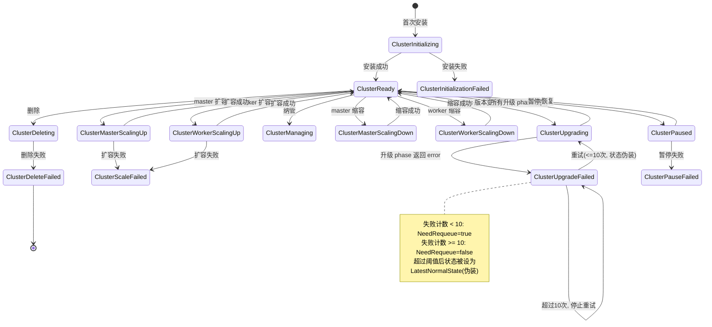
```mermaid
stateDiagram-v2
    [*] --> ClusterInitializing: 首次安装
    ClusterInitializing --> ClusterReady: 安装成功
    ClusterInitializing --> ClusterInitializationFailed: 安装失败
    
    ClusterReady --> ClusterUpgrading: spec 版本变更
    ClusterReady --> ClusterMasterScalingUp: master 扩容
    ClusterReady --> ClusterWorkerScalingUp: worker 扩容
    ClusterReady --> ClusterManaging: 纳管
    
    ClusterUpgrading --> ClusterUpgradeFailed: 升级 phase 返回 error
    ClusterUpgrading --> ClusterReady: 所有升级 phase 成功
    
    ClusterUpgradeFailed --> ClusterUpgrading: 重试(<=10次, 状态伪装)
    ClusterUpgradeFailed --> ClusterUpgradeFailed: 超过10次, 停止重试
    
    ClusterMasterScalingUp --> ClusterReady: 扩容成功
    ClusterMasterScalingUp --> ClusterScaleFailed: 扩容失败
    ClusterWorkerScalingUp --> ClusterReady: 扩容成功
    ClusterWorkerScalingUp --> ClusterScaleFailed: 扩容失败
    
    ClusterReady --> ClusterMasterScalingDown: master 缩容
    ClusterReady --> ClusterWorkerScalingDown: worker 缩容
    ClusterMasterScalingDown --> ClusterReady: 缩容成功
    ClusterWorkerScalingDown --> ClusterReady: 缩容成功
    
    ClusterReady --> ClusterDeleting: 删除
    ClusterDeleting --> ClusterDeleteFailed: 删除失败
    ClusterDeleteFailed --> [*]
    
    ClusterReady --> ClusterPaused: 暂停
    ClusterPaused --> ClusterReady: 恢复
    ClusterPaused --> ClusterPauseFailed: 暂停失败
    
    note right of ClusterUpgradeFailed
        失败计数 < 10: NeedRequeue=true
        失败计数 >= 10: NeedRequeue=false
        超过阈值后状态被设为
        LatestNormalState(伪装)
    end note
```

#### 2.2.2 升级状态切换规则

**位置**：[phase_flow.go:422-428](file:///cluster-api-provider-bke/pkg/phaseframe/phases/phase_flow.go#L422-L428)

```go
func handleClusterUpgradePhase(ctx *phaseframe.PhaseContext, err error) {
    if err != nil {
        ctx.BKECluster.Status.ClusterStatus = bkev1beta1.ClusterUpgradeFailed
    } else {
        ctx.BKECluster.Status.ClusterStatus = bkev1beta1.ClusterUpgrading
    }
}
```

**触发 Phase 范围**（[phase_flow.go:340-341](file:///cluster-api-provider-bke/pkg/phaseframe/phases/phase_flow.go#L340-L341)）：

```go
case phaseName.In(ClusterUpgradePhaseNames) || phaseName.In(DeclarativeClusterUpgradePhaseNames):
    handleClusterUpgradePhase(ctx, err)
```

| Phase 列表 | 包含 Phase |
|------------|-----------|
| `ClusterUpgradePhaseNames` | EnsureAgentUpgrade、EnsureContainerdUpgrade、EnsureMasterUpgrade、EnsureWorkerUpgrade、EnsureComponentUpgrade |
| `DeclarativeClusterUpgradePhaseNames` | EnsurePreUpgradeResources、EnsureAgentUpgrade、EnsureEtcdUpgrade、EnsureContainerdUpgrade、EnsureMasterUpgrade、EnsureWorkerUpgrade |

#### 2.2.3 DAG 路径状态切换

**位置**：[bkecluster_upgrade_dag.go:92-113](file:///cluster-api-provider-bke/controllers/capbke/bkecluster_upgrade_dag.go#L92-L113)

```go
// DAG 执行前
if err := r.patchClusterStatus(newCluster, bkev1beta1.ClusterUpgrading); err != nil { ... }

// DAG 执行失败
if err := sched.ExecuteDAG(ctx, phaseCtx, oldCluster, newCluster, dag); err != nil {
    _ = r.patchClusterStatus(newCluster, bkev1beta1.ClusterUpgradeFailed)
    ...
}
```

#### 2.2.4 集群状态映射

**位置**：[phase_flow.go:319-327](file:///cluster-api-provider-bke/pkg/phaseframe/phases/phase_flow.go#L319-L327)

| Phase 范围 | 成功状态 | 失败状态 |
|------------|----------|----------|
| `ClusterUpgradePhaseNames`（旧路径） | ClusterUpgrading | ClusterUpgradeFailed |
| `DeclarativeClusterUpgradePhaseNames`（DAG 路径） | ClusterUpgrading | ClusterUpgradeFailed |

#### 2.2.5 节点状态标记规格

| 场景 | 标记 | 位置 |
|------|------|------|
| Agent 升级失败 | master 节点失败立即返回 | ensure_agent_upgrade.go:155 |
| Etcd 升级中 | `EtcdUpgrading` | ensure_etcd_upgrade.go:335 |
| Etcd 升级失败 | `EtcdUpgradeFailed` | ensure_etcd_upgrade.go:371 |
| Master 升级中 | `NodeUpgrading` | ensure_master_upgrade.go:325 |
| Master 升级失败 | `NodeUpgradeFailed` | ensure_master_upgrade.go:342 |
| Master 升级成功 | `NodeNotReady`("Upgrading success") | ensure_master_upgrade.go:351 |
| Worker 升级失败 | `NodeUpgradeFailed` | ensure_worker_upgrade.go:302 |
| Worker 升级成功 | `NodeNotReady`("Upgrading success") | ensure_worker_upgrade.go:309 |
| 跳过节点 | `NeedSkip` 标志 | containerd 过滤逻辑 |

### 2.3 节点层状态机

#### 2.3.1 Master 升级节点状态机

**位置**：[ensure_master_upgrade.go:323-341](file:///cluster-api-provider-bke/pkg/phaseframe/phases/ensure_master_upgrade.go#L323-L341)

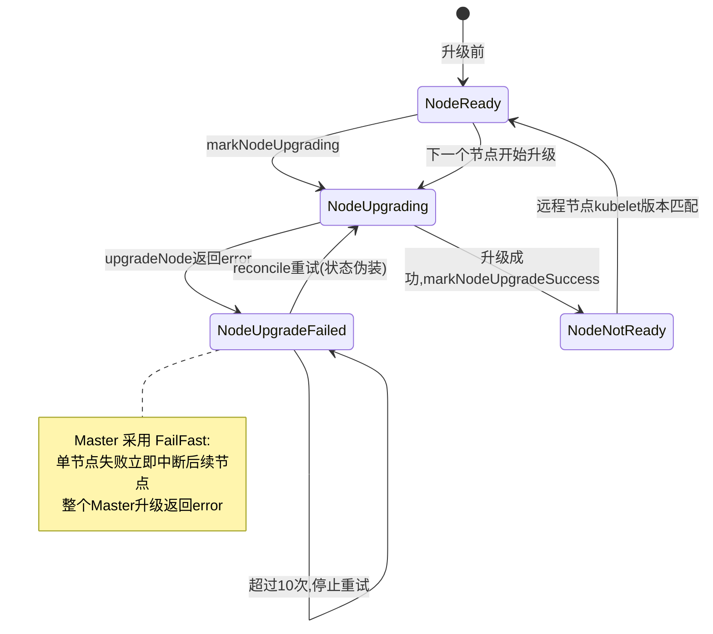
```mermaid
stateDiagram-v2
    direction TB
    [*] --> NodeReady: 升级前
    
    NodeReady --> NodeUpgrading: markNodeUpgrading
    NodeUpgrading --> NodeUpgradeFailed: upgradeNode返回error
    NodeUpgrading --> NodeNotReady: 升级成功,markNodeUpgradeSuccess
    
    NodeUpgradeFailed --> NodeUpgrading: reconcile重试(状态伪装)
    NodeUpgradeFailed --> NodeUpgradeFailed: 超过10次,停止重试
    
    NodeNotReady --> NodeReady: 远程节点kubelet版本匹配
    
    NodeReady --> NodeUpgrading: 下一个节点开始升级
    
    note right of NodeUpgradeFailed
        Master 采用 FailFast:
        单节点失败立即中断后续节点
        整个Master升级返回error
    end note
```

**状态切换代码**：

```go
// 升级中
nodeFetcher.SetNodeStateWithMessageForCluster(..., bkev1beta1.NodeUpgrading, "Upgrading")

// 升级失败
nodeFetcher.SetNodeStateWithMessageForCluster(..., bkev1beta1.NodeUpgradeFailed, err.Error())

// 升级成功
nodeFetcher.SetNodeStateWithMessageForCluster(..., bkev1beta1.NodeNotReady, "Upgrading success")
```

#### 2.3.2 Worker 升级节点状态机

**位置**：[ensure_worker_upgrade.go:300-330](file:///cluster-api-provider-bke/pkg/phaseframe/phases/ensure_worker_upgrade.go#L300-L330)

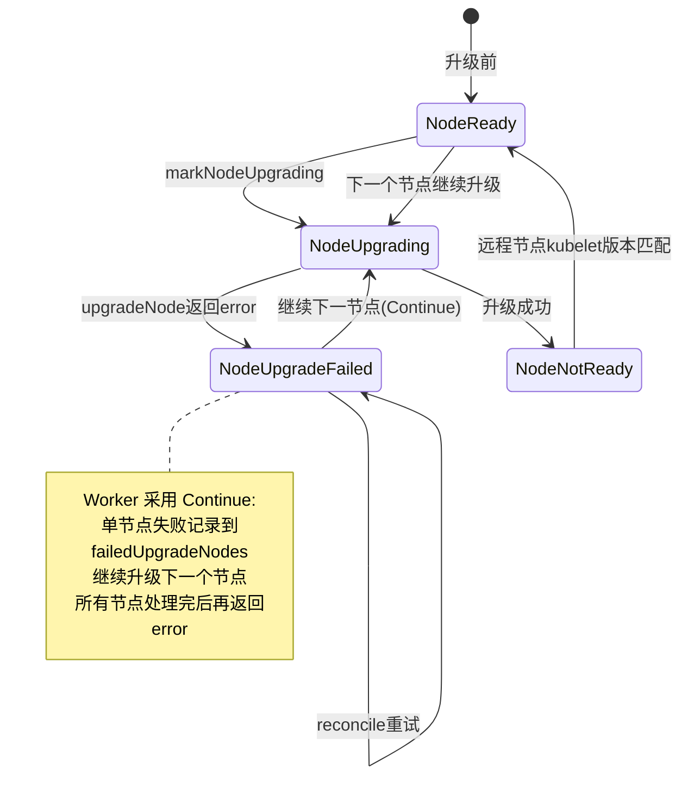
```mermaid
stateDiagram-v2
    direction TB
    [*] --> NodeReady: 升级前
    
    NodeReady --> NodeUpgrading: markNodeUpgrading
    NodeUpgrading --> NodeUpgradeFailed: upgradeNode返回error
    NodeUpgrading --> NodeNotReady: 升级成功
    
    NodeUpgradeFailed --> NodeUpgrading: 继续下一节点(Continue)
    NodeUpgradeFailed --> NodeUpgradeFailed: reconcile重试
    
    NodeNotReady --> NodeReady: 远程节点kubelet版本匹配
    
    NodeReady --> NodeUpgrading: 下一个节点继续升级
    
    note right of NodeUpgradeFailed
        Worker 采用 Continue:
        单节点失败记录到failedUpgradeNodes
        继续升级下一个节点
        所有节点处理完后再返回error
    end note
```

#### 2.3.3 Etcd 升级节点状态机

**位置**：[ensure_etcd_upgrade.go:345-377](file:///cluster-api-provider-bke/pkg/phaseframe/phases/ensure_etcd_upgrade.go#L345-L377)

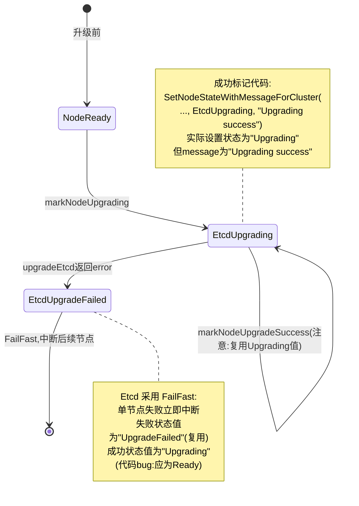
```mermaid
stateDiagram-v2
    direction TB
    [*] --> NodeReady: 升级前
    
    NodeReady --> EtcdUpgrading: markNodeUpgrading
    EtcdUpgrading --> EtcdUpgradeFailed: upgradeEtcd返回error
    EtcdUpgrading --> EtcdUpgrading: markNodeUpgradeSuccess(注意:复用Upgrading值)
    
    EtcdUpgradeFailed --> [*]: FailFast,中断后续节点
    
    note right of EtcdUpgradeFailed
        Etcd 采用 FailFast:
        单节点失败立即中断
        失败状态值为"UpgradeFailed"(复用)
        成功状态值为"Upgrading"(代码bug:应为Ready)
    end note
    
    note left of EtcdUpgrading
        成功标记代码:
        SetNodeStateWithMessageForCluster(
          ..., EtcdUpgrading, "Upgrading success")
        实际设置状态为"Upgrading"
        但message为"Upgrading success"
    end note
```

#### 2.3.4 Containerd 升级节点状态机

**位置**：[ensure_containerd_upgrade.go:100-160](file:///cluster-api-provider-bke/pkg/phaseframe/phases/ensure_containerd_upgrade.go#L100-L160)

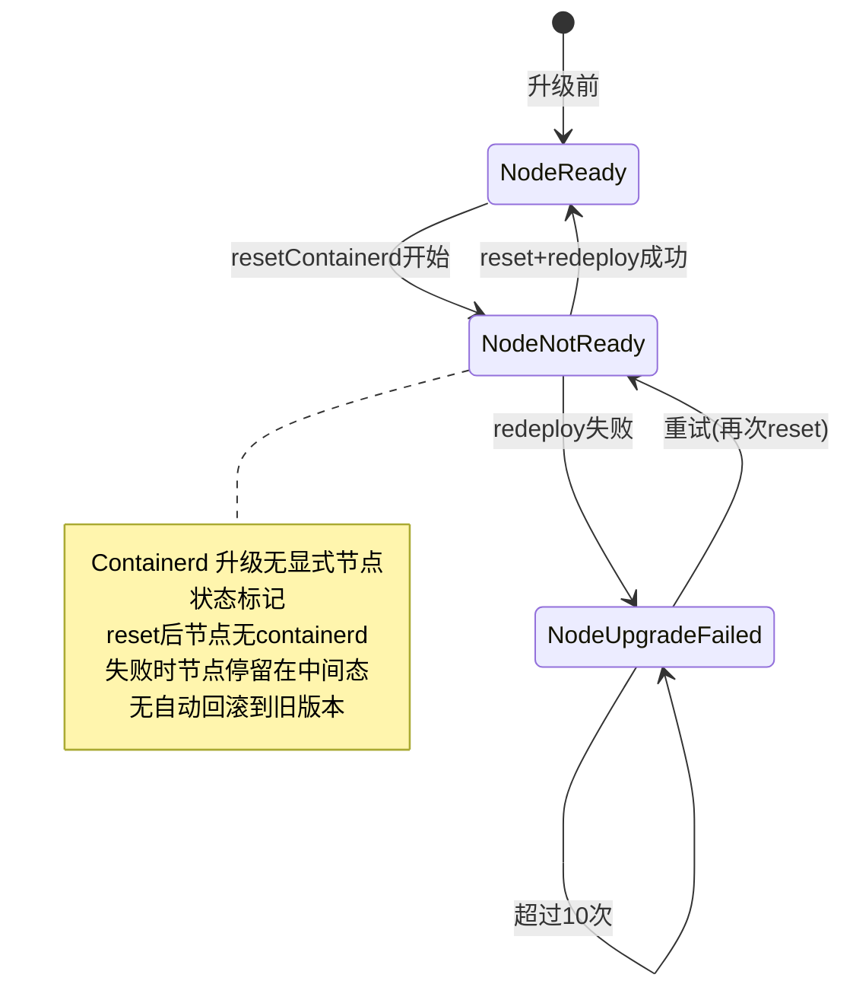
```mermaid
stateDiagram-v2
    direction TB
    [*] --> NodeReady: 升级前
    
    NodeReady --> NodeNotReady: resetContainerd开始
    NodeNotReady --> NodeReady: reset+redeploy成功
    NodeNotReady --> NodeUpgradeFailed: redeploy失败
    
    NodeUpgradeFailed --> NodeNotReady: 重试(再次reset)
    NodeUpgradeFailed --> NodeUpgradeFailed: 超过10次
    
    note right of NodeNotReady
        Containerd 升级无显式节点状态标记
        reset后节点无containerd
        失败时节点停留在中间态
        无自动回滚到旧版本
    end note
```

#### 2.3.5 BKEAgent 升级节点状态机

**位置**：[ensure_agent_upgrade.go:145-160](file:///cluster-api-provider-bke/pkg/phaseframe/phases/ensure_agent_upgrade.go#L145-L160)

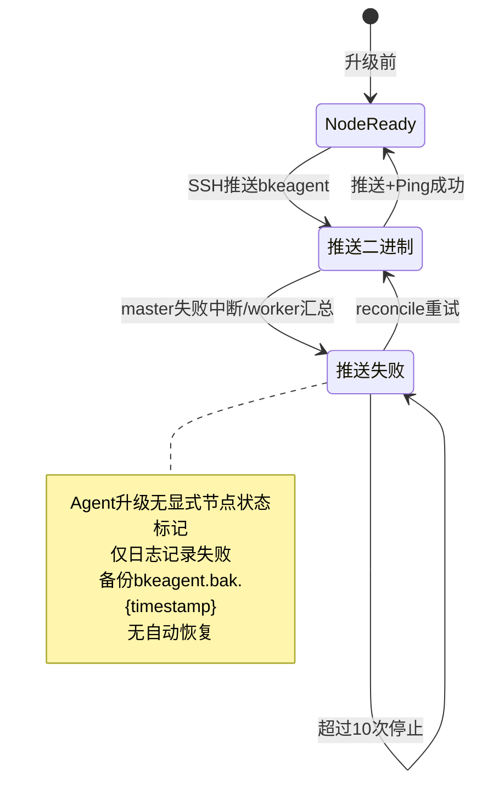
```mermaid
stateDiagram-v2
    direction TB
    [*] --> NodeReady: 升级前
    
    NodeReady --> 推送二进制: SSH推送bkeagent
    推送二进制 --> NodeReady: 推送+Ping成功
    推送二进制 --> 推送失败: master失败中断/worker汇总
    
    推送失败 --> 推送二进制: reconcile重试
    推送失败 --> 推送失败: 超过10次停止
    
    note right of 推送失败
        Agent升级无显式节点状态标记
        仅日志记录失败
        备份bkeagent.bak.{timestamp}
        无自动恢复
    end note
```

### 2.4 完整升级流程状态机（集群+节点联动）


```mermaid
stateDiagram-v2
    direction TB
    [*] --> ClusterReady: 集群就绪
    
    ClusterReady --> ClusterUpgrading: spec版本变更\n或ReleaseImage变更
    
    state ClusterUpgrading {
        direction TB
        [*] --> PreUpgradeResources
        PreUpgradeResources --> AgentUpgrade
        AgentUpgrade --> EtcdUpgrade
        EtcdUpgrade --> ContainerdUpgrade
        ContainerdUpgrade --> MasterUpgrade
        MasterUpgrade --> WorkerUpgrade
        WorkerUpgrade --> ComponentUpgrade
        ComponentUpgrade --> [*]
    }
    
    state AgentUpgrade {
        direction TB
        [*] --> Agent推送中
        Agent推送中 --> Agent成功: Ping通过
        Agent推送中 --> Agent失败: master失败中断
        Agent成功 --> [*]
        Agent失败 --> [*]
    }
    
    state EtcdUpgrade {
        direction TB
        [*] --> Etcd备份
        Etcd备份 --> Etcd节点1升级
        Etcd节点1升级 --> Etcd节点2升级: 成功
        Etcd节点1升级 --> Etcd失败: 失败(FailFast)
        Etcd节点2升级 --> Etcd节点N升级: 成功
        Etcd节点N升级 --> Etcd成功: 全部完成
        Etcd失败 --> [*]
        Etcd成功 --> [*]
    }
    
    state MasterUpgrade {
        direction TB
        [*] --> Master备份
        Master备份 --> Master节点1升级
        Master节点1升级 --> Master节点2升级: 成功
        Master节点1升级 --> Master失败: 失败(FailFast)
        Master节点2升级 --> Master节点N升级: 成功
        Master节点N升级 --> Master成功: 全部完成
        Master失败 --> [*]
        Master成功 --> [*]
    }
    
    state WorkerUpgrade {
        direction TB
        [*] --> Worker节点1升级
        Worker节点1升级 --> Worker节点2升级: 成功或失败都继续
        Worker节点2升级 --> Worker节点N升级: 成功或失败都继续
        Worker节点N升级 --> Worker汇总: 全部处理完
        Worker汇总 --> Worker成功: 无失败节点
        Worker汇总 --> Worker部分失败: 有失败节点
        Worker成功 --> [*]
        Worker部分失败 --> [*]
    }
    
    ClusterUpgrading --> ClusterReady: 所有Phase成功
    ClusterUpgrading --> ClusterUpgradeFailed: 任一Phase失败
    
    ClusterUpgradeFailed --> ClusterUpgrading: StatusManager重试(<10次)
    ClusterUpgradeFailed --> ClusterUpgradeFailed: 超过10次,暂停
    
    note right of ClusterUpgradeFailed
        重试规则:
        1. workqueue限速器: 2s×10次, 60s×N次
        2. StatusManager: 同状态失败<10次,NeedRequeue=true
        3. 超过10次: NeedRequeue=false,暂停调谐
        4. retry注解: 清除失败标记,恢复调谐
    end note
```

### 2.5 DAG 路径状态机（声明式升级）

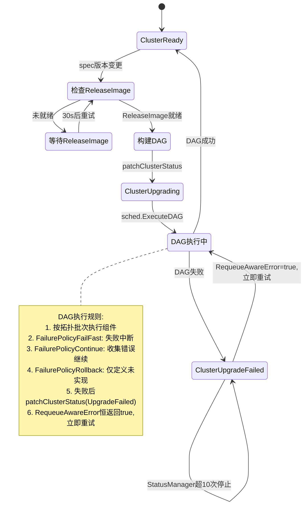
```mermaid
stateDiagram-v2
    direction TB
    [*] --> ClusterReady
    
    ClusterReady --> 检查ReleaseImage: spec版本变更
    检查ReleaseImage --> 等待ReleaseImage: 未就绪
    等待ReleaseImage --> 检查ReleaseImage: 30s后重试
    
    检查ReleaseImage --> 构建DAG: ReleaseImage就绪
    构建DAG --> ClusterUpgrading: patchClusterStatus
    
    ClusterUpgrading --> DAG执行中: sched.ExecuteDAG
    DAG执行中 --> ClusterReady: DAG成功
    DAG执行中 --> ClusterUpgradeFailed: DAG失败
    
    ClusterUpgradeFailed --> DAG执行中: RequeueAwareError=true,立即重试
    ClusterUpgradeFailed --> ClusterUpgradeFailed: StatusManager超10次停止
    
    note right of DAG执行中
        DAG执行规则:
        1. 按拓扑批次执行组件
        2. FailurePolicyFailFast: 失败中断
        3. FailurePolicyContinue: 收集错误继续
        4. FailurePolicyRollback: 仅定义未实现
        5. 失败后patchClusterStatus(UpgradeFailed)
        6. RequeueAwareError恒返回true,立即重试
    end note
```

### 2.6 状态切换规格汇总

| 层次 | 状态 | 触发条件 | 设置位置 |
|------|------|----------|----------|
| 集群 | `ClusterUpgrading` | 升级 Phase 开始执行 | phase_flow.go:426 |
| 集群 | `ClusterUpgradeFailed` | 升级 Phase 返回 error | phase_flow.go:424 |
| 集群 | `ClusterReady` | 所有升级 Phase 成功 | ensure_cluster.go:149 |
| 集群 | `ClusterUpgrading` | DAG 开始执行 | bkecluster_upgrade_dag.go:92 |
| 集群 | `ClusterUpgradeFailed` | DAG 执行失败 | bkecluster_upgrade_dag.go:113 |
| 集群 | `UpgradeFailed`(HealthState) | 失败超 10 次 | statusmanager.go:210 |
| 节点 | `NodeUpgrading` | master/worker 升级前标记 | ensure_master_upgrade.go:324 |
| 节点 | `NodeUpgradeFailed` | master/worker 升级失败 | ensure_master_upgrade.go:332 |
| 节点 | `NodeNotReady` | master/worker 升级成功 | ensure_master_upgrade.go:339 |
| 节点 | `EtcdUpgrading` | etcd 升级前标记 | ensure_etcd_upgrade.go:345 |
| 节点 | `EtcdUpgradeFailed` | etcd 升级失败 | ensure_etcd_upgrade.go:357 |
| 节点 | `EtcdUpgrading` | etcd 升级成功（复用值） | ensure_etcd_upgrade.go:350 |

---

## 3. 升级失败处理规格

### 3.1 失败策略与版本回滚

#### 3.1.1 总体结论

**代码中所有节点实例升级场景均不支持自动版本回滚**。失败处理仅有"状态标记 + 中断/继续"两种模式，无任何将节点版本恢复到旧版本的动作。

| 升级场景 | 失败后是否回滚版本 | 实际处理 |
|----------|:------------------:|----------|
| BKEAgent 升级 | ❌ 否 | 标记失败 + 中断/继续 |
| Etcd 升级 | ❌ 否 | 标记失败 + FailFast |
| Containerd 升级 | ❌ 否 | 节点停留在 reset 中间态 |
| Master 升级 | ❌ 否 | 标记失败 + FailFast |
| Worker 升级 | ❌ 否 | 标记失败 + Continue |

#### 3.1.2 各场景失败处理详情

**BKEAgent 升级失败**（[ensure_agent_upgrade.go:145-160](file:///cluster-api-provider-bke/pkg/phaseframe/phases/ensure_agent_upgrade.go#L145-L160)）：

| 维度 | 规格 |
|------|------|
| 失败检测 | `pushErrs` 非空 或 `PingBKEAgentOnNodes` 返回 failedNodes |
| 回滚动作 | **无**。仅保留 `bkeagent.bak.{timestamp}` 二进制备份，不自动恢复 |
| master 节点失败 | 立即返回 error，中断升级 |
| worker 节点失败 | 汇总失败节点后返回 error |
| 节点状态标记 | 无显式状态标记（仅日志） |
| 人工恢复路径 | 手动 `cp bkeagent.bak.* bkeagent` + `systemctl restart bkeagent` |

**Etcd 升级失败**（[ensure_etcd_upgrade.go:290-300](file:///cluster-api-provider-bke/pkg/phaseframe/phases/ensure_etcd_upgrade.go#L290-L300)、[ensure_etcd_upgrade.go:362-377](file:///cluster-api-provider-bke/pkg/phaseframe/phases/ensure_etcd_upgrade.go#L362-L377)）：

| 维度 | 规格 |
|------|------|
| 失败检测 | `upgradeEtcd` 返回 error |
| 回滚动作 | **无**。`handleUpgradeFailure` 仅标记状态 |
| 失败策略 | **FailFast**：`upgradeSingleNode` 返回 error 后 `upgradeNodes` 立即 return，中断后续节点 |
| 节点状态标记 | `EtcdUpgradeFailed` + 错误消息 |
| 备份利用 | etcd snapshot 保存到 `{workspace}/etcd-backup/`，**不自动 restore** |
| 人工恢复路径 | 手动 `etcdctl snapshot restore` + 替换 etcd 数据目录 |

```go
func (e *EnsureEtcdUpgrade) handleUpgradeFailure(params UpgradeFailureParams) error {
    params.Log.Error(...)
    e.Ctx.NodeFetcher().SetNodeStateWithMessageForCluster(..., bkev1beta1.EtcdUpgradeFailed, params.Error.Error())
    if err := mergecluster.SyncStatusUntilComplete(...); err != nil { ... }
    return errors.Errorf("upgrade node %q failed: %v", ...)
}
```

**Containerd 升级失败**（[ensure_containerd_upgrade.go:100-160](file:///cluster-api-provider-bke/pkg/phaseframe/phases/ensure_containerd_upgrade.go#L100-L160)）：

| 维度 | 规格 |
|------|------|
| 失败检测 | `envCommand.Wait()` 返回 `len(failedNodes) > 0` |
| 回滚动作 | **无** |
| 失败时节点状态 | **危险中间态**：reset 成功但 redeploy 失败时，节点无可用 containerd |
| 失败策略 | 直接返回 error，不重试，不恢复 |
| 节点状态标记 | 无显式标记（仅日志 `ContainerdUpgradeFailed`） |
| 人工恢复路径 | 手动重新执行 redeploy 或从备份恢复配置 |

```go
err := e.resetContainerd()
if err != nil {
    return ctrl.Result{}, err  // reset 失败直接返回
}
err = e.redeployContainerd()
if err != nil {
    return ctrl.Result{}, err  // redeploy 失败直接返回，节点已无 containerd
}
```

> **设计盲点**：这是所有升级场景中风险最高的，reset 后节点容器运行时被清除，失败后节点完全不可用。

**Master 升级失败**（[ensure_master_upgrade.go:340-348](file:///cluster-api-provider-bke/pkg/phaseframe/phases/ensure_master_upgrade.go#L340-L348)）：

| 维度 | 规格 |
|------|------|
| 失败检测 | `upgradeNode` 返回 error |
| 回滚动作 | **无**。仅标记 `NodeUpgradeFailed` |
| 失败策略 | **FailFast**：单节点失败立即 return，中断后续 master 升级 |
| 节点状态标记 | `NodeUpgradeFailed` + 错误消息 |
| 版本回滚 | **不支持**。节点停留在升级中间版本 |
| 备份利用 | etcd snapshot + /etc/kubernetes 备份，**不自动 restore** |
| 人工恢复路径 | 手动 `kubeadm upgrade apply` 重试 或 从备份恢复配置 |

```go
if err := e.upgradeNode(params.NeedBackupEtcd, params.BackEtcdNode, node, remoteNode); err != nil {
    params.Log.Error(constant.MasterUpgradeFailedReason, "upgrade node %q failed: %v", ...)
    nodeFetcher.SetNodeStateWithMessageForCluster(..., bkev1beta1.NodeUpgradeFailed, err.Error())
    if err = mergecluster.SyncStatusUntilComplete(...); err != nil { ... }
    return errors.Errorf("upgrade node %q failed: %v", ...)  // 立即中断
}
```

**Worker 升级失败**（[ensure_worker_upgrade.go:300-310](file:///cluster-api-provider-bke/pkg/phaseframe/phases/ensure_worker_upgrade.go#L300-L310)）：

| 维度 | 规格 |
|------|------|
| 失败检测 | `upgradeNode` 返回 error |
| 回滚动作 | **无**。仅标记 `NodeUpgradeFailed` |
| 失败策略 | **Continue**：记录到 `failedUpgradeNodes`，继续下一节点 |
| 节点状态标记 | `NodeUpgradeFailed` + 错误消息 |
| 版本回滚 | **不支持**。失败节点停留中间版本，成功节点已是新版本 |
| 人工恢复路径 | 手动重试该节点升级 |

```go
if err := e.upgradeNode(node, remoteNode, params.Drainer); err != nil {
    failedUpgradeNodes = append(failedUpgradeNodes, phaseutil.NodeInfo(node))
    params.Log.Warn(constant.WorkerUpgradeFailedReason, "upgrade node %q failed: %v", ...)
    nodeFetcher.SetNodeStateWithMessage(params.Ctx, params.BKECluster.Namespace, params.BKECluster.Name,
        node.IP, bkev1beta1.NodeUpgradeFailed, err.Error())
    if err = mergecluster.SyncStatusUntilComplete(params.Client, params.BKECluster); err != nil { ... }
    continue  // 继续下一节点
}
```

#### 3.1.3 回滚规格汇总

| 场景 | 失败策略 | 版本回滚 | 备份机制 | 自动恢复 | 节点最终状态 | 人工干预 |
|------|:--------:|:--------:|:--------:|:--------:|--------------|:--------:|
| BKEAgent | master FailFast / worker Continue | ❌ | ✅ 二进制 | ❌ | 旧或新版本 | 需要 |
| Etcd | FailFast | ❌ | ✅ snapshot | ❌ | 中间版本 | 需要 |
| Containerd | FailFast | ❌ | ❌ | ❌ | **无 containerd** | 必须 |
| Master | FailFast | ❌ | ✅ snapshot + 配置 | ❌ | 中间版本 | 需要 |
| Worker | Continue | ❌ | ❌ | ❌ | 中间版本 | 需要 |

### 3.2 备份机制与恢复路径

#### 3.2.1 有备份但无自动恢复的场景

| 场景 | 备份内容 | 备份位置 | 自动恢复 | 人工恢复难度 |
|------|----------|----------|:--------:|:------------:|
| Etcd 升级 | etcd snapshot | `{workspace}/etcd-backup/` | ❌ | 高（需停 etcd + restore） |
| Master 升级 | etcd snapshot + /etc/kubernetes | 节点本地 | ❌ | 高（需停服务 + 恢复配置） |
| BKEAgent 升级 | 旧二进制 | 节点本地 `.bak.{ts}` | ❌ | 低（cp + restart） |
| 配置文件变更 | `.bak` 文件 | 原地 | ❌ | 低（cp 还原） |

#### 3.2.2 无备份且无恢复的场景

| 场景 | 失败后节点状态 | 恢复难度 |
|------|----------------|:--------:|
| Containerd 升级（reset 后 redeploy 失败） | **无容器运行时** | 极高 |
| Worker 升级失败 | 中间版本 | 中（重试升级） |

### 3.3 回滚能力缺口

#### 3.3.1 未实现的回滚策略

| 设计项 | 设计文档 | 代码实现 |
|--------|----------|----------|
| `FailurePolicyRollback` | [kep6-detailed-design.md:422-426](file:///cluster-api-provider-bke/code/kep/kep6/kep6-detailed-design.md#L422-L426) | ❌ 常量已定义，逻辑未实现 |
| `UninstallScript` 回滚 | [kep6-detailed-design.md:556](file:///cluster-api-provider-bke/code/kep/kep6/kep6-detailed-design.md#L556) | ❌ 未实现 |
| `RollbackSpec` | [kep6-detailed-design.md:856-863](file:///cluster-api-provider-bke/code/kep/kep6/kep6-detailed-design.md#L856-L863) | ❌ 未实现 |

---

## 4. 升级重试规格

### 4.1 三层重试机制总览

升级失败返回 error 后，调谐器会通过 **三层机制** 处理重试：

| 层次 | 机制 | 触发对象 | 控制参数 | 实现位置 |
|------|------|----------|----------|----------|
| L1 | **controller-runtime workqueue 限速重试** | 单次 reconcile 失败 | FastSlowRateLimiter | [cmd/capbke/main.go:481-486](file:///cluster-api-provider-bke/cmd/capbke/main.go#L481-L486) |
| L2 | **StatusManager 失败计数 + 状态回滚** | BKECluster 状态级 | `ReconcileAllowedFailedCount` (默认10) | [pkg/statusmanage/statusmanager.go:175-215](file:///cluster-api-provider-bke/pkg/statusmanage/statusmanager.go#L175-L215) |
| L3 | **RetryAnnotation 手动重试** | 失败节点级 | 注解 `annotation.RetryAnnotationKey` | [bkecluster_controller.go:660-738](file:///cluster-api-provider-bke/controllers/capbke/bkecluster_controller.go#L660-L738) |

### 4.2 L1：workqueue 限速重试

#### 4.2.1 限速器配置

**位置**：[cmd/capbke/main.go:75-86](file:///cluster-api-provider-bke/cmd/capbke/main.go#L75-L86)

```go
FastSlowRateLimiterSlowDuration = 60 * time.Second  // 慢速间隔
FastSlowRateLimiterFastDuration = 2 * time.Second   // 快速间隔
FastSlowRateLimiterRetryCount   = 10                // 快速次数阈值
```

**位置**：[cmd/capbke/main.go:481-486](file:///cluster-api-provider-bke/cmd/capbke/main.go#L481-L486)

```go
RateLimiter: workqueue.NewItemFastSlowRateLimiter(
    FastSlowRateLimiterFastDuration,
    FastSlowRateLimiterSlowDuration,
    FastSlowRateLimiterRetryCount),
```

#### 4.2.2 重试节奏

| 失败次数 | 间隔 | 累计耗时 |
|----------|------|----------|
| 第 1~10 次 | 2 秒 | 20 秒 |
| 第 11 次起 | 60 秒 | 80 秒、140 秒... |

#### 4.2.3 触发条件

- **Reconcile 返回 error 且 `Requeue=false`、`RequeueAfter=0`**：workqueue 自动按限速器节奏重试
- **Reconcile 返回 `Requeue=true`**：立即重新入队（优先级高于 RateLimiter）
- **Reconcile 返回 `RequeueAfter>0`**：按指定延迟入队

#### 4.2.4 升级场景的 Requeue 矩阵

| Phase | 失败时返回 | 重试行为 |
|-------|------------|----------|
| EnsureMasterUpgrade | `ctrl.Result{Requeue: true}, err` ([ensure_master_upgrade.go:211](file:///cluster-api-provider-bke/pkg/phaseframe/phases/ensure_master_upgrade.go#L211)) | **立即重试**（不走限速器） |
| EnsureEtcdUpgrade | `ctrl.Result{Requeue: true}, err` ([ensure_etcd_upgrade.go:204](file:///cluster-api-provider-bke/pkg/phaseframe/phases/ensure_etcd_upgrade.go#L204)) | **立即重试** |
| EnsureWorkerUpgrade | `ctrl.Result{Requeue: true}, err` ([ensure_worker_upgrade.go:345](file:///cluster-api-provider-bke/pkg/phaseframe/phases/ensure_worker_upgrade.go#L345)) | **立即重试** |
| EnsureContainerdUpgrade | `ctrl.Result{}, err` | 走限速器节奏 |
| EnsureAgentUpgrade | `ctrl.Result{}, err` | 走限速器节奏 |
| DAG executeUpgradeDAG | `ctrl.Result{}, err` + `RequeueAwareError` 恒返回 `true` ([scheduler.go:404-409](file:///cluster-api-provider-bke/pkg/dagexec/scheduler.go#L404-L409)) | **立即重试** |

> 关键点：master/etcd/worker/DAG 失败都返回 `Requeue: true`，意味着**不受 2 秒/60 秒限速器约束，立即重新入队**。这会导致失败升级的快速重试风暴。

#### 4.2.5 workqueue 最大重试次数

controller-runtime workqueue 默认 **无最大次数限制**（除非配置 `MaxRetries`，本工程未配置），即：
- 只要 Reconcile 持续返回 error，会无限重试
- 限速器仅控制重试节奏，不停止重试

### 4.3 L2：StatusManager 失败计数

#### 4.3.1 核心机制

**位置**：[pkg/statusmanage/statusmanager.go:175-215](file:///cluster-api-provider-bke/pkg/statusmanage/statusmanager.go#L175-L215)

```go
if sr.AllowFailed() {
    bkeCluster.Status.ClusterStatus = confv1beta1.ClusterStatus(sr.LatestNormalState)
    sr.NeedRequeue = true   // 继续重试
    return
} else {
    // 超过限制次数，停止重试
    sr.NeedRequeue = false  // 停止重试
    sr.Reset()
    return
}
```

#### 4.3.2 失败计数规则

| 维度 | 规格 |
|------|------|
| 默认阈值 | `DefaultAllowedFailedCount = 10` |
| 环境变量覆盖 | `ALLOWED_FAILED_COUNT` |
| 计数粒度 | 集群级（每个 BKECluster 独立计数） |
| 计数触发 | 状态以 `Failed` 结尾（如 `ClusterUpgradeFailed`） |
| 计数累加 | 同一失败状态连续出现，计数器 +1 |
| 计数重置 | 失败状态变化 或 超过阈值后处理完毕 |
| 正常状态处理 | 非 Failed 状态重置计数器，`NeedRequeue = false` |

#### 4.3.3 失败次数内的"状态伪装"

**关键设计**（[statusmanager.go:195-198](file:///cluster-api-provider-bke/pkg/statusmanage/statusmanager.go#L195-L198)）：

```go
// 如果没有超过允许失败的次数，修改bkeCluster状态为上一次的正常状态
if sr.AllowFailed() {
    bkeCluster.Status.ClusterStatus = confv1beta1.ClusterStatus(sr.LatestNormalState)
```

**效果**：
- 升级失败 10 次内，BKECluster.Status.ClusterStatus 被改回升级前的状态（如 `ClusterReady`）
- 对外表现为"升级未发生"，但实际重试在后台进行
- 这是工程中的"软失败"设计

#### 4.3.4 超过阈值后的处理

**位置**：[statusmanager.go:200-215](file:///cluster-api-provider-bke/pkg/statusmanage/statusmanager.go#L200-L215)

```go
} else {
    log.Infof("The failedStatus %s occur more than %d times, not allow to retry", ...)
    // 根据当前状态设置最终失败状态
    switch sr.CurrentClusterState {
    case bkev1beta1.Upgrading:
        bkeCluster.Status.ClusterHealthState = bkev1beta1.UpgradeFailed
    }
    sr.NeedRequeue = false  // 停止自动重试
}
```

**规格**：
- 超过 10 次后，`NeedRequeue = false`，停止自动重试
- BKECluster.Status.ClusterHealthState 设为 `UpgradeFailed`
- **调谐暂停，直至 spec 被修改**（注释明确说明）

### 4.4 L3：手动重试

#### 4.4.1 触发方式

**位置**：[bkecluster_controller.go:660-668](file:///cluster-api-provider-bke/controllers/capbke/bkecluster_controller.go#L660-L668)

```go
if retryNodeIPs, ok := annotation.HasAnnotation(bkeCluster, annotation.RetryAnnotationKey); ok {
    r.processRetryLogic(ctx, bkeCluster, retryNodeIPs)
    retryFlag = true
    patchFunc = r.createRemoveRetryAnnotationFunc()
}
```

#### 4.4.2 重试粒度

| 注解值 | 重试范围 | 处理函数 |
|--------|----------|----------|
| 空 `""` | 全部节点 | `processAllNodesRetry` |
| `"ip1,ip2"` | 指定节点 | `processSpecificNodesRetry` |

#### 4.4.3 重试动作

**仅清理失败状态，不重试升级命令**：

```go
// 清理 NodeFailedFlag
r.NodeFetcher.UnmarkNodeStateFlagForCluster(ctx, bkeCluster, nodeIP, bkev1beta1.NodeFailedFlag)
// 移除状态缓存
statusmanage.BKEClusterStatusManager.RemoveSingleNodeStatusCache(bkeCluster, nodeIP)
```

**规格**：
- 仅清除 `NodeFailedFlag` 和 StatusManager 缓存
- 不直接重试升级命令
- 通过清除失败标记，让下次 reconcile 时 `NeedExecute` 重新返回 true，从而重新执行升级

### 4.5 重试幂等性保障

重试时重新执行升级命令，幂等性依赖：

| 组件 | 幂等机制 | 位置 |
|------|----------|------|
| Etcd | `shouldSkipNode`：已是目标版本的节点跳过 | ensure_etcd_upgrade.go |
| Containerd | `GetNeedUpgradeNodesWithBKENodes`：版本匹配的节点过滤 | ensure_containerd_upgrade.go |
| Master | `remoteNode.Status.NodeInfo.KubeletVersion == target` 跳过 | ensure_master_upgrade.go |
| Worker | `remoteNode.Status.NodeInfo.KubeletVersion == target` 跳过 | ensure_worker_upgrade.go |
| Agent | agent 版本对比跳过 | ensure_agent_upgrade.go |

### 4.6 重试风险点

1. **master/etcd/worker/DAG 失败立即重试**：返回 `Requeue: true` 绕过限速器，**可能造成重试风暴**
   - 失败 10 次内每次间隔接近 0
   - 升级命令本身耗时较长时影响较小，但若快速失败会形成紧密循环

2. **StatusManager 的"状态伪装"设计**：失败 10 次内对外显示正常状态，可能掩盖真实问题

3. **超过 10 次后完全停止**：需修改 spec 或添加 retry annotation 才能恢复，**无指数退避过渡**

4. **Containerd 升级失败重试风险最高**：
   - reset 后 redeploy 失败时，节点无 containerd
   - 重试会再次执行 `resetContainerd`（已无 containerd 可 reset）+ `redeployContainerd`
   - 若 redeploy 持续失败，10 次重试后节点永久不可用

5. **DAG 的 `RequeueAwareError` 实现简化**：[scheduler.go:404-409](file:///cluster-api-provider-bke/pkg/dagexec/scheduler.go#L404-L409) 恒返回 `true`，所有 DAG 错误都立即重试，未区分错误类型

#### 各升级场景重试规格汇总

| 场景 | Phase 返回 | L1 限速器 | L2 计数 | L3 手动 | 最终停止 |
|------|------------|-----------|---------|---------|----------|
| Master 升级失败 | `Requeue: true, err` | 立即重试 | 计入 | 支持 | L2 超 10 次 |
| Etcd 升级失败 | `Requeue: true, err` | 立即重试 | 计入 | 支持 | L2 超 10 次 |
| Worker 升级失败 | `Requeue: true, err` | 立即重试 | 计入 | 支持 | L2 超 10 次 |
| Containerd 升级失败 | `Result{}, err` | 2s→60s 重试 | 计入 | 支持 | L2 超 10 次 |
| Agent 升级失败 | `Result{}, err` | 2s→60s 重试 | 计入 | 支持 | L2 超 10 次 |
| DAG 升级失败 | `Result{}, err` (RequeueAware=true) | 立即重试 | 计入 | 支持 | L2 超 10 次 |
| ReleaseImage 未就绪 | `RequeueAfter: 30s, nil` | 30s 延迟 | 不计入 | N/A | ReleaseImage ready |


> 本章从**流程视角**描述升级失败后重试的完整执行链路，与第 4 章的"重试机制规格"互补：第 4 章定义重试机制的参数与规则，本章描述重试的实际执行流程与时序。与第 7 章的"问题定位流程"互补：第 7 章聚焦定位根因，本章聚焦重试本身如何发生、如何推进、如何终止。

### 4.7 重试分层联动总览

升级失败后，三层重试机制按以下时序联动：

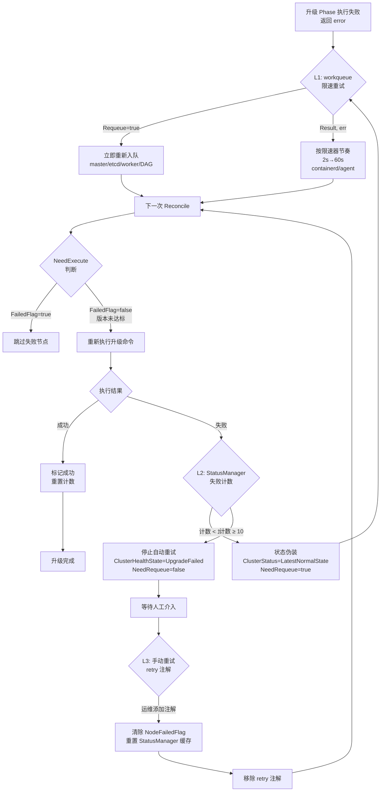
```mermaid
flowchart TD
    UpgradeFail[升级 Phase 执行失败<br/>返回 error] --> L1{L1: workqueue<br/>限速重试}

    L1 -->|Requeue=true| Immediate[立即重新入队<br/>master/etcd/worker/DAG]
    L1 -->|Result, err| RateLimited[按限速器节奏<br/>2s→60s<br/>containerd/agent]

    Immediate --> Reconcile[下一次 Reconcile]
    RateLimited --> Reconcile

    Reconcile --> NeedExecute{NeedExecute<br/>判断}
    NeedExecute -->|FailedFlag=true| Skip[跳过失败节点]
    NeedExecute -->|FailedFlag=false<br/>版本未达标| ReExecute[重新执行升级命令]

    ReExecute --> Result{执行结果}
    Result -->|成功| Success[标记成功<br/>重置计数]
    Result -->|失败| L2{L2: StatusManager<br/>失败计数}

    L2 -->|计数 < 10| Camouflage[状态伪装<br/>ClusterStatus=LatestNormalState<br/>NeedRequeue=true]
    L2 -->|计数 ≥ 10| Stop[停止自动重试<br/>ClusterHealthState=UpgradeFailed<br/>NeedRequeue=false]

    Camouflage --> L1
    Stop --> WaitManual[等待人工介入]

    WaitManual --> L3{L3: 手动重试<br/>retry 注解}
    L3 -->|运维添加注解| ClearFlag[清除 NodeFailedFlag<br/>重置 StatusManager 缓存]
    ClearFlag --> RemoveAnno[移除 retry 注解]
    RemoveAnno --> Reconcile

    Success --> Done[升级完成]
```

**三层联动要点**：

| 层次 | 触发时机 | 作用 | 终止条件 |
|------|----------|------|----------|
| **L1** | 每次 Reconcile 返回 error | 控制重试节奏（立即 or 限速） | 不自行终止，由 L2 控制 |
| **L2** | 失败状态以 `Failed` 结尾 | 计数 + 状态伪装 + 上限控制 | 计数 ≥ 10 停止 |
| **L3** | 运维添加 retry 注解 | 清除失败标记，恢复重试 | 注解被移除后由 L1/L2 接管 |

### 4.8 L1 自动重试执行流程

#### 4.8.1 触发条件

L1 重试由 controller-runtime workqueue 自动驱动，**无需人工干预**。

**触发位置**：[bkecluster_controller.go:135-138](file:///cluster-api-provider-bke/controllers/capbke/bkecluster_controller.go#L135-L138)

```go
phaseResult, err := r.executePhaseFlow(ctx, bkeCluster, oldBkeCluster, bkeLogger)
if err != nil {
    return ctrl.Result{}, err  // 返回错误，触发 workqueue 重试
}
```

#### 4.8.2 L1 重试执行时序

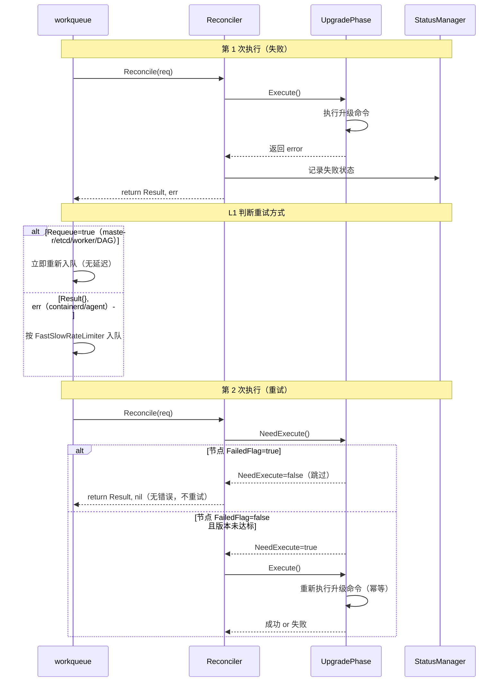
```mermaid
sequenceDiagram
    participant WQ as workqueue
    participant Recon as Reconciler
    participant Phase as UpgradePhase
    participant SM as StatusManager

    Note over WQ,SM: 第 1 次执行（失败）
    WQ->>Recon: Reconcile(req)
    Recon->>Phase: Execute()
    Phase->>Phase: 执行升级命令
    Phase-->>Recon: 返回 error
    Recon->>SM: 记录失败状态
    Recon-->>WQ: return Result, err

    Note over WQ,SM: L1 判断重试方式
    alt Requeue=true（master/etcd/worker/DAG）
        WQ->>WQ: 立即重新入队（无延迟）
    else Result{}, err（containerd/agent）
        WQ->>WQ: 按 FastSlowRateLimiter 入队
    end

    Note over WQ,SM: 第 2 次执行（重试）
    WQ->>Recon: Reconcile(req)
    Recon->>Phase: NeedExecute()
    alt 节点 FailedFlag=true
        Phase-->>Recon: NeedExecute=false（跳过）
        Recon-->>WQ: return Result, nil（无错误，不重试）
    else 节点 FailedFlag=false 且版本未达标
        Phase-->>Recon: NeedExecute=true
        Recon->>Phase: Execute()
        Phase->>Phase: 重新执行升级命令（幂等）
        Phase-->>Recon: 成功 or 失败
    end
```

#### 4.8.3 重试节奏矩阵

| 失败次数 | containerd/agent（限速器） | master/etcd/worker/DAG（立即） |
|----------|---------------------------|-------------------------------|
| 第 1~10 次 | 间隔 2 秒 | 间隔 ≈ 0 秒（立即） |
| 第 11 次起 | 间隔 60 秒 | 间隔 ≈ 0 秒（立即） |
| 累计 10 次失败后 | L2 介入，停止重试 | L2 介入，停止重试 |

> **注意**：master/etcd/worker/DAG 返回 `Requeue: true` 绕过限速器，**前 10 次重试在极短时间内完成**，可能形成重试风暴。

#### 4.8.4 L1 重试中的幂等保障

重试时重新执行升级命令，幂等性依赖各组件的版本跳过机制：

| 组件 | 跳过已升级节点的机制 | 位置 |
|------|---------------------|------|
| Etcd | `shouldSkipNode`：已是目标版本的节点跳过 | [ensure_etcd_upgrade.go](file:///cluster-api-provider-bke/pkg/phaseframe/phases/ensure_etcd_upgrade.go) |
| Containerd | `GetNeedUpgradeNodesWithBKENodes`：版本匹配的节点过滤 | [ensure_containerd_upgrade.go](file:///cluster-api-provider-bke/pkg/phaseframe/phases/ensure_containerd_upgrade.go) |
| Master | `remoteNode.Status.NodeInfo.KubeletVersion == target` 跳过 | [ensure_master_upgrade.go](file:///cluster-api-provider-bke/pkg/phaseframe/phases/ensure_master_upgrade.go) |
| Worker | `remoteNode.Status.NodeInfo.KubeletVersion == target` 跳过 | [ensure_worker_upgrade.go](file:///cluster-api-provider-bke/pkg/phaseframe/phases/ensure_worker_upgrade.go) |
| Agent | agent 版本对比跳过 | [ensure_agent_upgrade.go](file:///cluster-api-provider-bke/pkg/phaseframe/phases/ensure_agent_upgrade.go) |

### 4.9 L2 失败计数与状态伪装流程

#### 4.9.1 L2 触发条件

L2 在 **StatusManager 处理集群状态**时触发，当集群状态以 `Failed` 结尾时计数器 +1。

**位置**：[pkg/statusmanage/statusmanager.go:175-215](file:///cluster-api-provider-bke/pkg/statusmanage/statusmanager.go#L175-L215)

#### 4.9.2 L2 执行时序

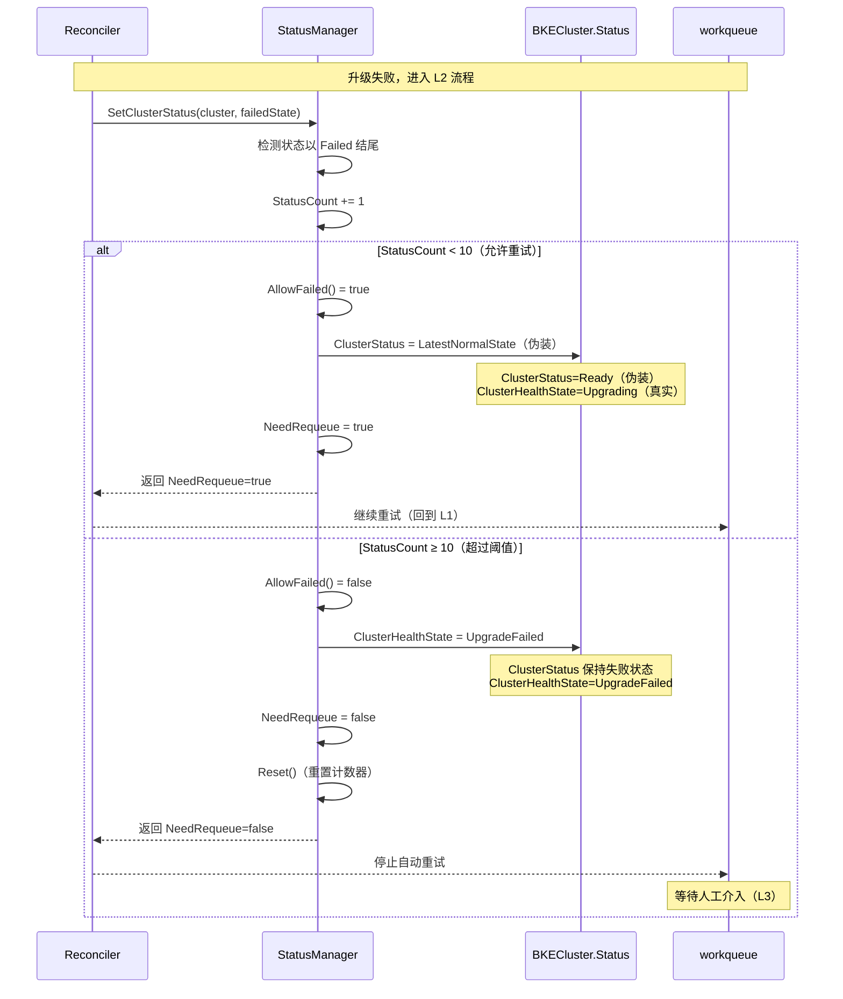
```mermaid
sequenceDiagram
    participant Recon as Reconciler
    participant SM as StatusManager
    participant Status as BKECluster.Status
    participant WQ as workqueue

    Note over Recon,WQ: 升级失败，进入 L2 流程
    Recon->>SM: SetClusterStatus(cluster, failedState)
    SM->>SM: 检测状态以 Failed 结尾
    SM->>SM: StatusCount += 1

    alt StatusCount < 10（允许重试）
        SM->>SM: AllowFailed() = true
        SM->>Status: ClusterStatus = LatestNormalState（伪装）
        Note over Status: ClusterStatus=Ready（伪装）<br/>ClusterHealthState=Upgrading（真实）
        SM->>SM: NeedRequeue = true
        SM-->>Recon: 返回 NeedRequeue=true
        Recon-->>WQ: 继续重试（回到 L1）
    else StatusCount ≥ 10（超过阈值）
        SM->>SM: AllowFailed() = false
        SM->>Status: ClusterHealthState = UpgradeFailed
        Note over Status: ClusterStatus 保持失败状态<br/>ClusterHealthState=UpgradeFailed
        SM->>SM: NeedRequeue = false
        SM->>SM: Reset()（重置计数器）
        SM-->>Recon: 返回 NeedRequeue=false
        Recon-->>WQ: 停止自动重试
        Note over WQ: 等待人工介入（L3）
    end
```

#### 4.9.3 状态伪装的演进过程

| 阶段 | ClusterStatus | ClusterHealthState | StatusCount | 对外表现 |
|------|---------------|-------------------|-------------|----------|
| 升级前 | Ready | Healthy | 0 | 正常 |
| 升级中 | Upgrading | Upgrading | 0 | 升级中 |
| 第 1 次失败 | **Ready**（伪装） | Upgrading | 1 | 表面正常，后台重试 |
| 第 2 次失败 | **Ready**（伪装） | Upgrading | 2 | 表面正常，后台重试 |
| ... | **Ready**（伪装） | Upgrading | ... | 表面正常，后台重试 |
| 第 10 次失败 | **Ready**（伪装） | Upgrading | 10 | 表面正常，后台重试 |
| 第 11 次失败 | UpgradeFailed | **UpgradeFailed** | 0（已重置） | 真实失败暴露 |

> **关键提醒**：失败 1~10 次期间，`ClusterStatus` 被伪装为 `Ready`，**运维监控若仅看 `ClusterStatus` 会误判升级未发生**。必须同时检查 `ClusterHealthState`。

#### 4.9.4 计数器重置条件

| 事件 | 计数器动作 | 说明 |
|------|-----------|------|
| 失败状态连续出现 | +1 | 累加 |
| 成功状态出现 | 重置为 0 | 升级成功 |
| 失败状态变化（如 UpgradeFailed→DeployFailed） | 重置为 0 | 状态类型变化 |
| 超过阈值后 | 重置为 0 | 停止重试后重置 |

### 4.10 L3 手动重试执行流程

#### 4.10.1 L3 触发条件

L3 由运维人员添加 `bke.bocloud.com/retry` 注解触发，**适用于 L2 停止后的恢复，或 L2 重试过程中主动介入**。

**位置**：[bkecluster_controller.go:660-668](file:///cluster-api-provider-bke/controllers/capbke/bkecluster_controller.go#L660-L668)

#### 4.10.2 L3 执行时序

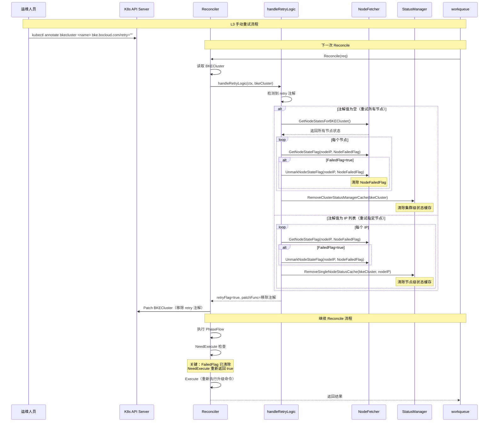
```mermaid
sequenceDiagram
    participant Ops as 运维人员
    participant API as K8s API Server
    participant Recon as Reconciler
    participant HRL as handleRetryLogic
    participant NF as NodeFetcher
    participant SM as StatusManager
    participant WQ as workqueue

    Note over Ops,WQ: L3 手动重试流程

    Ops->>API: kubectl annotate bkecluster <name> bke.bocloud.com/retry=""

    Note over Recon,WQ: 下一次 Reconcile
    WQ->>Recon: Reconcile(req)
    Recon->>Recon: 读取 BKECluster

    Recon->>HRL: handleRetryLogic(ctx, bkeCluster)
    HRL->>HRL: 检测到 retry 注解

    alt 注解值为空（重试所有节点）
        HRL->>NF: GetNodeStatesForBKECluster()
        NF-->>HRL: 返回所有节点状态
        loop 每个节点
            HRL->>NF: GetNodeStateFlag(nodeIP, NodeFailedFlag)
            alt FailedFlag=true
                HRL->>NF: UnmarkNodeStateFlag(nodeIP, NodeFailedFlag)
                Note over NF: 清除 NodeFailedFlag
            end
        end
        HRL->>SM: RemoveClusterStatusManagerCache(bkeCluster)
        Note over SM: 清除集群级状态缓存
    else 注解值为 IP 列表（重试指定节点）
        loop 每个 IP
            HRL->>NF: GetNodeStateFlag(nodeIP, NodeFailedFlag)
            alt FailedFlag=true
                HRL->>NF: UnmarkNodeStateFlag(nodeIP, NodeFailedFlag)
            end
            HRL->>SM: RemoveSingleNodeStatusCache(bkeCluster, nodeIP)
            Note over SM: 清除节点级状态缓存
        end
    end

    HRL-->>Recon: retryFlag=true, patchFunc=移除注解
    Recon->>API: Patch BKECluster（移除 retry 注解）

    Note over Recon,WQ: 继续 Reconcile 流程
    Recon->>Recon: 执行 PhaseFlow
    Recon->>Recon: NeedExecute 检查

    Note over Recon: 关键：FailedFlag 已清除<br/>NeedExecute 重新返回 true

    Recon->>Recon: Execute（重新执行升级命令）
    Recon-->>WQ: 返回结果
```

#### 4.10.3 L3 重试的关键设计

**L3 仅清理失败标记，不直接重试升级命令**：

```go
// 仅清除 NodeFailedFlag
r.NodeFetcher.UnmarkNodeStateFlagForCluster(ctx, bkeCluster, nodeIP, bkev1beta1.NodeFailedFlag)
// 仅移除状态缓存
statusmanage.BKEClusterStatusManager.RemoveSingleNodeStatusCache(bkeCluster, nodeIP)
```

**原理**：清除 `NodeFailedFlag` 后，下次 reconcile 时 `NeedExecute` 不再跳过该节点，从而重新执行升级命令。这是一种"间接重试"设计。

#### 4.10.4 L3 重试的两种粒度

| 注解值 | 重试范围 | 处理函数 | 缓存清理范围 |
|--------|----------|----------|--------------|
| `""`（空） | 全部失败节点 | `processAllNodesRetry` | 集群级（所有节点缓存） |
| `"ip1,ip2"` | 指定节点 | `processSpecificNodesRetry` | 节点级（仅指定节点缓存） |

#### 4.10.5 L3 重试操作命令

```bash
# 场景一：L2 停止后恢复重试（重试所有节点）
kubectl annotate bkecluster <name> bke.bocloud.com/retry="" --overwrite

# 场景二：L2 重试中主动介入，重试指定节点
kubectl annotate bkecluster <name> bke.bocloud.com/retry="192.168.1.10,192.168.1.11" --overwrite

# 场景三：修复问题后重试单个关键节点
kubectl annotate bkecluster <name> bke.bocloud.com/retry="192.168.1.10" --overwrite
```

### 4.11 DAG 路径的重试流程（断点续传）

声明式 DAG 路径的重试具有**断点续传**能力，与旧 PhaseFlow 路径有本质区别。

#### 4.11.1 DAG 重试触发

**位置**：[bkecluster_upgrade_dag.go:112-117](file:///cluster-api-provider-bke/controllers/capbke/bkecluster_upgrade_dag.go#L112-L117)

```go
if err := sched.ExecuteDAG(ctx, phaseCtx, oldCluster, newCluster, dag); err != nil {
    _ = r.patchClusterStatus(newCluster, bkev1beta1.ClusterUpgradeFailed)
    if res, requeue := dagexec.RequeueAwareError(err); requeue {
        return res, err  // 返回重试结果
    }
    return ctrl.Result{}, err
}
```

**`RequeueAwareError`**（[scheduler.go:404-409](file:///cluster-api-provider-bke/pkg/dagexec/scheduler.go#L404-L409)）恒返回 `true`，所有 DAG 错误都触发**立即重试**。

#### 4.11.2 DAG 断点续传机制

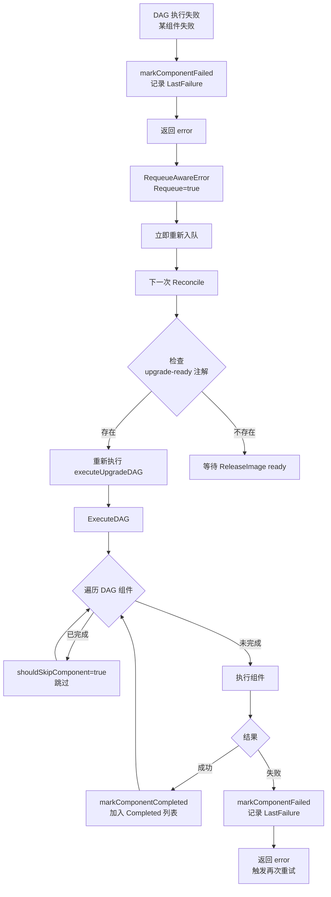
```mermaid
flowchart TD
    DAGFail[DAG 执行失败<br/>某组件失败] --> MarkFailed[markComponentFailed<br/>记录 LastFailure]
    MarkFailed --> ReturnErr[返回 error]
    ReturnErr --> RequeueAware[RequeueAwareError<br/>Requeue=true]
    RequeueAware --> ImmediateRetry[立即重新入队]

    ImmediateRetry --> NextReconcile[下一次 Reconcile]
    NextReconcile --> CheckAnnotation{检查<br/>upgrade-ready 注解}
    CheckAnnotation -->|存在| ReExecuteDAG[重新执行 executeUpgradeDAG]
    CheckAnnotation -->|不存在| WaitRelease[等待 ReleaseImage ready]

    ReExecuteDAG --> ExecuteDAG[ExecuteDAG]
    ExecuteDAG --> LoopComp{遍历 DAG 组件}

    LoopComp -->|已完成| Skip[shouldSkipComponent=true<br/>跳过]
    LoopComp -->|未完成| Execute[执行组件]

    Skip --> LoopComp
    Execute --> Result{结果}
    Result -->|成功| MarkDone[markComponentCompleted<br/>加入 Completed 列表]
    Result -->|失败| MarkFailed2[markComponentFailed<br/>记录 LastFailure]

    MarkDone --> LoopComp
    MarkFailed2 --> DAGFail2[返回 error<br/>触发再次重试]
```

#### 4.11.3 断点续传的关键实现

**跳过已完成组件**（[scheduler.go:145-150](file:///cluster-api-provider-bke/pkg/dagexec/scheduler.go#L145-L150)）：

```go
func (s *Scheduler) shouldSkipComponent(...) bool {
    if bc.Status.DeclarativeUpgrade != nil {
        if bc.Status.DeclarativeUpgrade.IsComponentCompleted(node.Name, s.nodeVersionKey(node)) {
            return true  // 跳过已完成的组件
        }
    }
    return false
}
```

**标记组件完成**：

```go
st.MarkCompleted(node.Name, version, metav1.Now())
st.LastError = ""
st.ClearFailure()
```

**标记组件失败**：

```go
st.MarkFailure(name, version, errMsg, metav1.Now())
// LastFailure.Attempt++ （连续失败计数）
```

#### 4.11.4 DAG 重试 vs PhaseFlow 重试对比

| 维度 | DAG 路径 | 旧 PhaseFlow 路径 |
|------|----------|-------------------|
| **重试粒度** | 组件级（DAG 节点） | Phase 级 |
| **断点续传** | ✅ 跳过已完成组件 | ❌ 从头执行 PhaseFlow |
| **重试节奏** | 立即重试（RequeueAwareError） | 立即 or 限速（取决于 Phase） |
| **失败记录** | DeclarativeUpgrade.lastFailure | StatusManager 计数 |
| **幂等保障** | IsComponentCompleted | 版本比较跳过 |

### 4.12 各组件重试流程差异

#### 4.12.1 重试流程差异矩阵

| 组件 | L1 重试方式 | L2 计数 | L3 支持 | 幂等机制 | 特殊风险 |
|------|------------|---------|---------|----------|----------|
| **Etcd** | 立即重试（Requeue=true） | 计入 | ✅ | shouldSkipNode 版本跳过 | Fail-Fast，有备份无自动回滚 |
| **Master** | 立即重试（Requeue=true） | 计入 | ✅ | KubeletVersion 版本跳过 | Fail-Fast，有 /etc/kubernetes.bak |
| **Worker** | 立即重试（Requeue=true） | 计入 | ✅ | KubeletVersion 版本跳过 | Best-Effort，部分节点可继续 |
| **Containerd** | 限速重试（Result, err） | 计入 | ✅ | OpenFuyaoVersion 版本跳过 | reset 后 redeploy 失败→无运行时 |
| **Agent** | 限速重试（Result, err） | 计入 | ✅ | agent 版本对比跳过 | 无限重试 |
| **DAG** | 立即重试（RequeueAware） | 计入 | ✅ | IsComponentCompleted | 断点续传 |
| **Provider** | 限速重试（Result, err） | 计入 | ✅ | patch 版本判断 | 无限重试 |
| **组件** | 限速重试（Result, err） | 计入 | ✅ | 无 | 无限重试 |

#### 4.12.2 Containerd 重试的特殊风险

Containerd 升级采用"reset + redeploy"模式，重试流程有特殊风险：

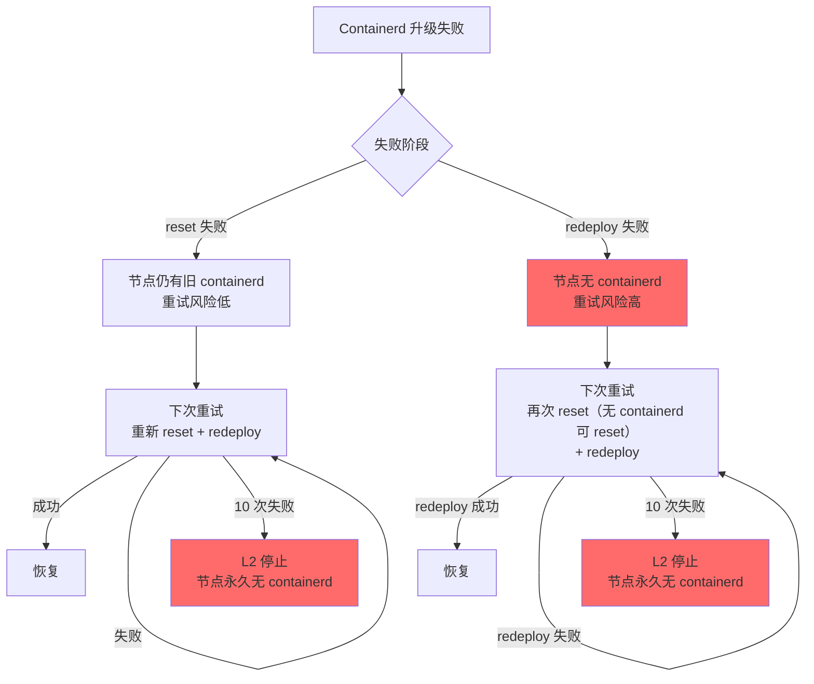
```mermaid
flowchart TD
    ContainerdFail[Containerd 升级失败] --> CheckPhase{失败阶段}

    CheckPhase -->|reset 失败| ResetFail[节点仍有旧 containerd<br/>重试风险低]
    CheckPhase -->|redeploy 失败| RedeployFail[节点无 containerd<br/>重试风险高]

    ResetFail --> Retry1[下次重试<br/>重新 reset + redeploy]
    Retry1 -->|成功| OK1[恢复]
    Retry1 -->|失败| Retry1

    RedeployFail --> Retry2[下次重试<br/>再次 reset（无 containerd 可 reset）<br/>+ redeploy]
    Retry2 -->|redeploy 成功| OK2[恢复]
    Retry2 -->|redeploy 失败| Retry2

    Retry1 -->|10 次失败| Permanent1[L2 停止<br/>节点永久无 containerd]
    Retry2 -->|10 次失败| Permanent2[L2 停止<br/>节点永久无 containerd]

    style RedeployFail fill:#ff6b6b
    style Permanent1 fill:#ff6b6b
    style Permanent2 fill:#ff6b6b
```

> **关键风险**：reset 成功后 redeploy 持续失败，10 次重试后节点**永久无容器运行时**，必须人工执行 `bkeagent redeploy containerd` 恢复。

#### 4.12.3 Etcd/Master Fail-Fast 重试流程

Etcd 和 Master 采用 Fail-Fast 策略，单节点失败立即中断：

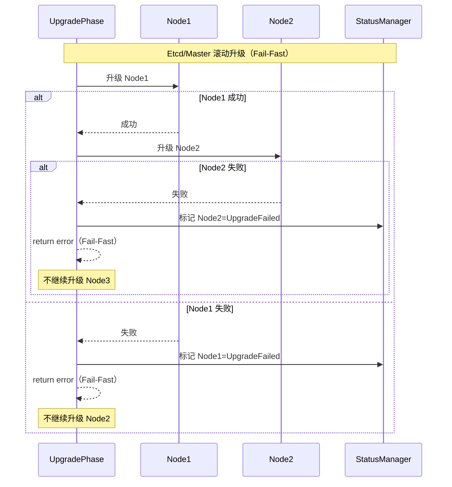
```mermaid
sequenceDiagram
    participant Phase as UpgradePhase
    participant Node1 as Node1
    participant Node2 as Node2
    participant SM as StatusManager

    Note over Phase,SM: Etcd/Master 滚动升级（Fail-Fast）

    Phase->>Node1: 升级 Node1
    alt Node1 成功
        Node1-->>Phase: 成功
        Phase->>Node2: 升级 Node2
        alt Node2 失败
            Node2-->>Phase: 失败
            Phase->>SM: 标记 Node2=UpgradeFailed
            Phase-->>Phase: return error（Fail-Fast）
            Note over Phase: 不继续升级 Node3
        end
    else Node1 失败
        Node1-->>Phase: 失败
        Phase->>SM: 标记 Node1=UpgradeFailed
        Phase-->>Phase: return error（Fail-Fast）
        Note over Phase: 不继续升级 Node2
    end
```

### 4.13 重试终止与恢复流程

#### 4.13.1 重试终止条件

| 终止条件 | 触发者 | 表现 | 恢复方式 |
|----------|--------|------|----------|
| L2 计数 ≥ 10 | StatusManager | `ClusterHealthState=UpgradeFailed`，`NeedRequeue=false` | L3 手动重试 |
| 运维暂停升级 | 运维（pause 注解） | Reconcile 跳过升级 | 移除 pause 注解 |
| BKECluster 删除 | 运维 | Reconcile 进入删除流程 | 不可恢复 |
| Controller 停止 | 系统 | 重试暂停 | Controller 重启后继续 |

#### 4.13.2 重试恢复决策流程

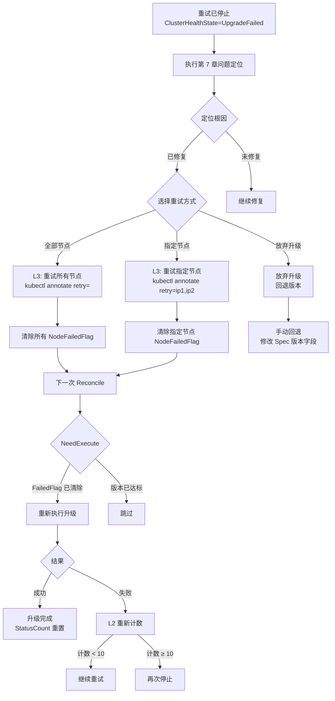
```mermaid
flowchart TD
    Stop[重试已停止<br/>ClusterHealthState=UpgradeFailed] --> Investigate[执行第 7 章问题定位]

    Investigate --> RootCause{定位根因}

    RootCause -->|已修复| DecideRetry{选择重试方式}
    RootCause -->|未修复| ContinueFix[继续修复]

    DecideRetry -->|全部节点| RetryAll[L3: 重试所有节点<br/>kubectl annotate retry=]
    DecideRetry -->|指定节点| RetrySpecific[L3: 重试指定节点<br/>kubectl annotate retry=ip1,ip2]
    DecideRetry -->|放弃升级| Abandon[放弃升级<br/>回退版本]

    RetryAll --> ClearFlag1[清除所有 NodeFailedFlag]
    RetrySpecific --> ClearFlag2[清除指定节点 NodeFailedFlag]

    ClearFlag1 --> Reconcile[下一次 Reconcile]
    ClearFlag2 --> Reconcile

    Reconcile --> NeedExecute2{NeedExecute}
    NeedExecute2 -->|FailedFlag 已清除| ReExecute[重新执行升级]
    NeedExecute2 -->|版本已达标| Skip2[跳过]

    ReExecute --> Result{结果}
    Result -->|成功| Success[升级完成<br/>StatusCount 重置]
    Result -->|失败| L2Again[L2 重新计数]

    L2Again -->|计数 < 10| Continue[继续重试]
    L2Again -->|计数 ≥ 10| Stop2[再次停止]

    Abandon --> Rollback[手动回退<br/>修改 Spec 版本字段]
```

#### 4.13.3 恢复后的状态重置

L3 手动重试触发后，StatusManager 的状态变化：

| 时机 | ClusterStatus | ClusterHealthState | StatusCount | NodeFailedFlag |
|------|---------------|-------------------|-------------|----------------|
| L2 停止时 | UpgradeFailed | UpgradeFailed | 0（已重置） | true |
| L3 注解添加后 | UpgradeFailed | UpgradeFailed | 0 | **false**（已清除） |
| 下次 reconcile 成功 | Ready | Healthy | 0 | false |
| 下次 reconcile 失败 | **Ready**（伪装） | Upgrading | 1 | true |

### 4.14 重试流程注意事项

#### 4.14.1 重试风暴风险

**问题**：master/etcd/worker/DAG 失败返回 `Requeue: true`，绕过限速器立即重试，前 10 次重试在极短时间内完成。

**影响**：
- 若升级命令本身耗时较长（如 etcd 数据迁移），影响较小
- 若升级命令快速失败（如网络不可达），形成紧密循环，加重 API Server 和节点负载

**应对**：
- 监控 controller 日志中的失败频率
- 若发现重试风暴，使用 `pause` 注解暂停升级
- 修复问题后移除 `pause` 注解恢复

#### 4.14.2 状态伪装的监控陷阱

**问题**：L2 失败计数 < 10 时，`ClusterStatus` 被伪装为 `LatestNormalState`（如 `Ready`），仅看 `ClusterStatus` 会误判升级未发生。

**正确监控方式**：

```bash
# ❌ 错误：仅看 ClusterStatus
kubectl get bkecluster <name> -o jsonpath='{.status.clusterStatus}'
# 输出: Ready（可能是伪装）

# ✅ 正确：同时检查 ClusterHealthState
kubectl get bkecluster <name> -o jsonpath='{.status.clusterStatus}{"\t"}{.status.clusterHealthState}'
# 输出: Ready    Upgrading（正在重试中）

# ✅ 正确：检查 DeclarativeUpgrade 失败记录
kubectl get bkecluster <name> -o jsonpath='{.status.declarativeUpgrade.lastError}'
# 输出: "etcd upgrade failed: ..."（有错误说明在重试）
```

#### 4.14.3 L3 重试前的必要检查

添加 retry 注解前，**必须确认问题已修复**，否则重试会再次失败：

| 检查项 | 命令 | 通过条件 |
|--------|------|----------|
| 节点可达 | `ssh <node-ip> "echo ok"` | 返回 ok |
| 磁盘空间 | `ssh <node-ip> "df -h"` | 可用空间 > 20% |
| 镜像仓库可达 | `ssh <node-ip> "crictl pull <image>"` | 拉取成功 |
| etcd 健康（master 升级） | `etcdctl endpoint health` | healthy |
| API Server 可达（master 升级） | `kubectl get --raw='/healthz'` | ok |
| containerd 运行（containerd 升级） | `ssh <node-ip> "systemctl is-active containerd"` | active |

#### 4.14.4 重试与幂等性的边界

重试时重新执行升级命令，幂等性依赖版本比较跳过已升级节点。但存在以下边界：

| 场景 | 幂等性保障 | 风险 |
|------|-----------|------|
| 节点已成功升级 | 版本匹配跳过 | 无风险 |
| 节点升级到中间状态 | 版本不匹配，重新执行 | 可能重复执行部分操作 |
| Containerd reset 成功 redeploy 失败 | 版本不匹配，重新执行 reset+redeploy | reset 无 containerd 可 reset，但 redeploy 可恢复 |
| Etcd 部分成员升级成功 | shouldSkipNode 跳过已升级成员 | 未升级成员重新执行，可能数据不一致 |

#### 4.14.5 重试流程的完整时间线

以 containerd 升级失败为例，完整重试时间线：

```
T+0s     升级失败，L1 触发第 1 次重试
T+2s     第 2 次重试（限速器 2s 间隔）
T+4s     第 3 次重试
...
T+18s    第 10 次重试
T+20s    第 11 次重试，L2 计数=11 ≥ 10，停止自动重试
         ClusterHealthState=UpgradeFailed

T+?      运维发现问题，执行第 7 章定位流程
T+?      运维修复问题
T+?      运维添加 retry 注解，L3 触发
         清除 NodeFailedFlag，重置 StatusManager 缓存
T+?+1    下次 reconcile，重新执行升级命令
T+?+1    升级成功，StatusCount 重置，ClusterHealthState=Healthy
```

---
---

## 5. 运维视角的可配置参数规格

> 本节从运维人员视角梳理升级相关的所有外部可配置参数，按"触发升级 → 运行时控制 → 全局调优 → 配置文件 → 操作手册"的层次组织。

### 5.1 升级触发参数（BKECluster Spec）

**位置**：[api/bkecommon/v1beta1/bkecluster_spec.go:98-165](file:///cluster-api-provider-bke/api/bkecommon/v1beta1/bkecluster_spec.go#L98-L165)

运维人员通过修改 `BKECluster.Spec.ClusterConfig.Cluster` 下的版本字段触发升级。这些字段是升级的"源头配置"。

#### 5.1.1 版本字段

| 字段 | JSON Path | 作用 | 升级场景 | 约束 |
|------|-----------|------|----------|------|
| `OpenFuyaoVersion` | `.spec.clusterConfig.cluster.openFuyaoVersion` | openFuyao 平台版本 | Provider 自升级 + 组件升级 | patch 版本（非 x.y.0）才触发初次安装 |
| `KubernetesVersion` | `.spec.clusterConfig.cluster.kubernetesVersion` | K8s 版本 | Master/Worker 升级 | 最高支持 v1.25.6 |
| `EtcdVersion` | `.spec.clusterConfig.cluster.etcdVersion` | etcd 版本 | Etcd 升级 | 无降级限制说明 |
| `ContainerdVersion` | `.spec.clusterConfig.cluster.containerdVersion` | containerd 版本 | Containerd 升级 | **仅允许升级，不允许降级** |

**版本决策规则**（[pkg/upgrade/build.go:17-49](file:///cluster-api-provider-bke/pkg/upgrade/build.go#L17-L49)）：
- 声明式 DAG 路径：`vc.GetTarget(component) != vc.GetCurrent(component)` → 触发升级
- 旧 PhaseFlow 路径：直接对比 spec 与 status 的版本字段

#### 5.1.2 容器运行时配置

| 字段 | JSON Path | 作用 | 默认值 |
|------|-----------|------|--------|
| `ContainerRuntime.CRI` | `.spec.clusterConfig.cluster.containerRuntime.cri` | 容器运行时类型 | docker / containerd |
| `ContainerRuntime.Runtime` | `.spec.clusterConfig.cluster.containerRuntime.runtime` | 底层 runtime | runc / richrunc / kata |
| `ContainerRuntime.Param` | `.spec.clusterConfig.cluster.containerRuntime.param` | runtime 参数 | - |
| `ContainerdConfigRef` | `.spec.clusterConfig.cluster.containerdConfigRef` | 引用 ContainerdConfig CR | nil（使用默认配置） |

#### 5.1.3 仓库与镜像配置

| 字段 | JSON Path | 作用 | 升级影响 |
|------|-----------|------|----------|
| `ImageRepo` | `.spec.clusterConfig.cluster.imageRepo` | 镜像仓库地址 | 升级时拉取镜像的来源 |
| `HTTPRepo` | `.spec.clusterConfig.cluster.httpRepo` | HTTP 软件源 | 二进制/RPM 包来源 |
| `ChartRepo` | `.spec.clusterConfig.cluster.chartRepo` | Chart 仓库 | Helm 组件升级来源 |
| `ImageRepo.InsecureSkipTLSVerify` | `.spec.clusterConfig.cluster.imageRepo.insecureSkipTLSVerify` | 跳过 TLS 校验 | 默认 false |

#### 5.1.4 控制平面与 Kubelet 配置

| 字段 | JSON Path | 作用 | 节点级覆盖 |
|------|-----------|------|------------|
| `ControlPlane.Etcd.DataDir` | `.spec.clusterConfig.cluster.controlPlane.etcd.dataDir` | etcd 数据目录 | BKENode 可覆盖 |
| `Kubelet.ExtraArgs` | `.spec.clusterConfig.cluster.kubelet.extraArgs` | kubelet 额外参数 | BKENode 可覆盖 |
| `KubeletConfigRef` | `.spec.KubeletConfigRef` | 引用 KubeletConfig CR | - |

### 5.2 升级运行时控制（BKECluster Annotations）

**位置**：[utils/capbke/annotation/helper.go](file:///cluster-api-provider-bke/utils/capbke/annotation/helper.go)

运维人员通过在 BKECluster 上添加/修改注解来控制升级运行时行为。注解变更会触发 Reconcile（[BKEClusterAnnotationsChange predicate](file:///cluster-api-provider-bke/utils/capbke/predicates/bkecluster.go)）。

#### 5.2.1 升级控制注解

| 注解键 | 值格式 | 作用 | 运维场景 |
|--------|--------|------|----------|
| `bke.bocloud.com/retry` | `""` 或 `"ip1,ip2"` | 手动重试失败节点 | L3 重试，清除失败标记 |
| `bke.bocloud.com/pause` | - | 暂停调谐 | 升级过程中暂停后续操作 |
| `bke.bocloud.com/dryrun` | `true`/`false` | 干运行模式 | 验证升级配置不实际执行 |
| `cvo.openfuyao.cn/upgrade-ready` | - | 触发声明式 DAG 升级 | 由 ClusterVersion 控制器设置 |
| `cvo.openfuyao.cn/cluster-version` | ClusterVersion 名称 | 关联 ClusterVersion CR | 声明式升级上下文 |
| `cvo.openfuyao.cn/upgrade-path` | UpgradePath 名称 | 记录升级路径 | 升级路径校验 |

**重试注解使用示例**：
```bash
# 重试所有失败节点
kubectl annotate bkecluster <name> bke.bocloud.com/retry="" --overwrite

# 重试指定节点
kubectl annotate bkecluster <name> bke.bocloud.com/retry="192.168.1.10,192.168.1.11" --overwrite
```

#### 5.2.2 集群管理注解

| 注解键 | 作用 | 默认值 | 升级影响 |
|--------|------|--------|----------|
| `bke.bocloud.com/cluster-from` | 集群来源（bke/bocloud/other） | 空 | `other` 时不支持 pause/dryRun/reset |
| `bke.bocloud.com/full-management` | 完全管理标志 | - | 影响升级控制权 |
| `bke.bocloud.com/master-schedulable` | master 是否可调度 | `false` | 升级时影响调度 |
| `bke.bocloud.com/node-boot-wait-timeout` | 节点引导超时 | `10m` | 升级后节点就绪等待 |
| `bke.bocloud.com/deep-restore-node` | 深度恢复节点 | `true` | 节点恢复深度 |

### 5.3 声明式升级 CRD 资源

#### 5.3.1 ClusterVersion

**位置**：[api/v1alpha1/clusterversion_types.go](file:///cluster-api-provider-bke/api/v1alpha1/clusterversion_types.go)

| 字段 | JSON Path | 作用 | 运维操作 |
|------|-----------|------|----------|
| `Spec.DesiredVersion` | `.spec.desiredVersion` | 目标 openFuyao 版本 | 修改此字段触发声明式升级 |

**运维操作**：
```bash
# 查看当前版本状态
kubectl get clusterversion <name> -o yaml

# 触发升级
kubectl patch clusterversion <name> --type merge -p '{"spec":{"desiredVersion":"v2.6.0"}}'
```

#### 5.3.2 ReleaseImage

**位置**：[api/v1alpha1/releaseimage_types.go](file:///cluster-api-provider-bke/api/v1alpha1/releaseimage_types.go)

| 字段 | JSON Path | 作用 | 运维关注点 |
|------|-----------|------|------------|
| `Spec.Version` | `.spec.version` | 发布版本号 | 版本标识 |
| `Spec.Digest` | `.spec.digest` | OCI 制品摘要 | 完整性校验 |
| `Spec.VerifySignature` | `.spec.verifySignature` | 是否校验签名 | 安全策略 |
| `Spec.AllowCacheFallback` | `.spec.allowCacheFallback` | 允许缓存回退 | 离线场景 |
| `Spec.Install.Components` | `.spec.install.components` | 安装组件列表 | 初始安装 |
| `Spec.Upgrade.Components` | `.spec.upgrade.components` | 升级组件列表 | 升级时使用 |
| `Status.Phase` | `.status.phase` | 校验阶段 | Valid/Invalid/ManifestMissing/CompatibilityFailed |

**运维操作**：
```bash
# 查看 ReleaseImage 校验状态
kubectl get releaseimage <name> -o wide

# 查看组件清单
kubectl get releaseimage <name> -o jsonpath='{.status.components}'
```

#### 5.3.3 ComponentVersion

**位置**：[api/v1alpha1/componentversion_types.go](file:///cluster-api-provider-bke/api/v1alpha1/componentversion_types.go)

| 字段 | JSON Path | 作用 | 可配置值 |
|------|-----------|------|----------|
| `Spec.Name` | `.spec.name` | 组件名称 | - |
| `Spec.Type` | `.spec.type` | 组件类型 | yaml/helm/inline/binary |
| `Spec.Version` | `.spec.version` | 组件版本 | - |
| `Spec.UpgradeStrategy.Mode` | `.spec.upgradeStrategy.mode` | 升级模式 | - |
| `Spec.UpgradeStrategy.BatchSize` | `.spec.upgradeStrategy.batchSize` | 批次大小 | - |
| `Spec.UpgradeStrategy.Timeout` | `.spec.upgradeStrategy.timeout` | 超时时间 | - |
| `Spec.UpgradeStrategy.FailurePolicy` | `.spec.upgradeStrategy.failurePolicy` | 失败策略 | FailFast/Continue/Rollback |
| `Spec.Compatibility.Constraints` | `.spec.compatibility.constraints` | 兼容性约束 | - |
| `Spec.Dependencies` | `.spec.dependencies` | 依赖组件 | - |
| `Spec.Resources` | `.spec.resources` | 预创建资源 | ConfigMap/Secret/Manifest |

### 5.4 控制器全局参数（命令行 Flags）

**位置**：[utils/capbke/config/config.go:22-70](file:///cluster-api-provider-bke/utils/capbke/config/config.go#L22-L70)

这些参数在 controller 启动时通过命令行 flags 设置，影响所有集群的升级行为。

#### 5.4.1 升级相关 Flags

| Flag | 默认值 | 作用 | 运维场景 |
|------|--------|------|----------|
| `--declarative-upgrade` | `false` | 启用声明式 DAG 升级 | 切换升级路径 |
| `--enable-internal-update` | `false` | 启用内部更新 | 内部测试 |
| `--bke-cluster-concurrency` | `DefaultConcurrency` | BKECluster 并发数 | 控制升级并发度 |
| `--bke-machine-concurrency` | `DefaultConcurrency` | BKEMachine 并发数 | 控制节点并发度 |

#### 5.4.2 ReleaseImage 监控 Flags

| Flag | 默认值 | 作用 |
|------|--------|------|
| `--enable-oci-digest-monitor` | `true` | 启用 OCI 摘要监控 |
| `--oci-digest-check-interval` | `300`（秒） | OCI 摘要检查间隔 |
| `--oci-registry-username` | 空 | OCI 仓库认证用户名 |
| `--oci-registry-password` | 空 | OCI 仓库认证密码 |
| `--oci-registry-insecure-skip-verify` | `true` | 跳过 TLS 校验 |
| `--release-cache-dir` | `/var/lib/bke/release-cache` | Release 缓存目录 |

#### 5.4.3 控制器运行 Flags

| Flag | 默认值 | 作用 |
|------|--------|------|
| `--leader-elect` | `false` | 启用 Leader Election |
| `--metrics-bind-address` | `0` | Metrics 端口 |
| `--health-probe-bind-address` | `:8081` | 健康探针地址 |
| `--health-probe-scheme` | `http` | 健康探针协议 |
| `--health-probe-port` | `9444` | HTTPS 健康探针端口 |
| `--webhook-port` | `9443` | Webhook 端口 |
| `--e2e-mode` | `false` | E2E 测试模式 |

#### 5.4.4 限速器参数（编译期固定）

**位置**：[cmd/capbke/main.go:75-86](file:///cluster-api-provider-bke/cmd/capbke/main.go#L75-L86)

| 参数 | 值 | 作用 | 可配置性 |
|------|----|------|----------|
| `FastSlowRateLimiterFastDuration` | `2s` | 快速重试间隔 | 编译期固定 |
| `FastSlowRateLimiterSlowDuration` | `60s` | 慢速重试间隔 | 编译期固定 |
| `FastSlowRateLimiterRetryCount` | `10` | 快速次数阈值 | 编译期固定 |

> **运维注意**：这些参数无法通过 flag 或环境变量修改，需重新编译。Command 控制器有独立的限速器（[command_controller.go:64-66](file:///cluster-api-provider-bke/controllers/bkeagent/command_controller.go#L64-L66)）：`fastDelay=10s, slowDelay=60s, maxFastAttempts=5`。

### 5.5 环境变量

**位置**：[pkg/statusmanage/statusmanager.go:51-65](file:///cluster-api-provider-bke/pkg/statusmanage/statusmanager.go#L51-L65)

| 环境变量 | 默认值 | 作用 | 运维场景 |
|----------|--------|------|----------|
| `ALLOWED_FAILED_COUNT` | `10` | L2 失败计数阈值 | 调整自动重试上限 |

**使用示例**：
```bash
# 在 controller Deployment 中设置
env:
  - name: ALLOWED_FAILED_COUNT
    value: "5"  # 降低重试上限，更快进入人工干预
```

> **运维注意**：超过此阈值后，StatusManager 停止自动重试，`ClusterHealthState` 设为 `UpgradeFailed`，需修改 spec 或添加 retry 注解才能恢复。

### 5.6 ConfigMap 配置

#### 5.6.1 bke-config ConfigMap

**位置**：`common/constants.go` 中 `BKEClusterConfigFileName = "bke-config"`

| Data Key | 作用 | 升级影响 |
|----------|------|----------|
| `patch.<version>` | 特定版本的 patch 配置 | openFuyao 组件升级时读取 |
| 镜像清单 | 组件镜像版本映射 | 镜像更新时使用 |

#### 5.6.2 openfuyao-patch ConfigMap

| Data Key | 作用 | 升级影响 |
|----------|------|----------|
| `cm.<version>` | 特定版本的 ConfigMap 配置 | openFuyao 组件升级时读取 |

**位置**：[ensure_component_upgrade.go:55-218](file:///cluster-api-provider-bke/pkg/phaseframe/phases/ensure_component_upgrade.go#L55-L218)

### 5.7 运维操作手册

#### 5.7.1 升级前检查清单

| 检查项 | 命令 | 预期状态 |
|--------|------|----------|
| 集群状态 | `kubectl get bkecluster <name>` | `Ready` |
| 集群健康 | `kubectl get bkecluster <name> -o jsonpath='{.status.clusterHealthState}'` | `Healthy` |
| 节点状态 | `kubectl get bkenode -l cluster.x-k8s.io/cluster-name=<name>` | 全部 `Ready` |
| Agent 可达 | 检查 `bke.bocloud.com/bkeagent-listener` | agent ready |
| ReleaseImage 校验 | `kubectl get releaseimage <name>` | `Valid` |
| ComponentVersion 存在 | `kubectl get componentversion` | 组件 CR 存在 |
| 备份空间 | 检查 `{workspace}/etcd-backup/` | 可写 |

#### 5.7.2 触发升级

**方式一：修改 BKECluster Spec（旧路径）**
```bash
kubectl patch bkecluster <name> --type merge -p '{
  "spec": {
    "clusterConfig": {
      "cluster": {
        "kubernetesVersion": "v1.29.0",
        "etcdVersion": "v3.5.12",
        "containerdVersion": "v1.7.18",
        "openFuyaoVersion": "v2.6.0"
      }
    }
  }
}'
```

**方式二：修改 ClusterVersion（声明式路径）**
```bash
kubectl patch clusterversion <name> --type merge -p '{"spec":{"desiredVersion":"v2.6.0"}}'
```

#### 5.7.3 升级监控

| 监控项 | 命令 | 关注点 |
|--------|------|--------|
| 集群状态 | `kubectl get bkecluster <name> -w` | `Upgrading` → `Ready`/`UpgradeFailed` |
| 节点状态 | `kubectl get bkenode -l cluster.x-k8s.io/cluster-name=<name> -w` | `Upgrading` → `Ready`/`UpgradeFailed` |
| Controller 日志 | `kubectl logs -n bke-system deployment/bke-controller-manager` | 错误信息 |
| ClusterVersion | `kubectl get clusterversion <name> -w` | `Phase: Upgrading` |
| DeclarativeUpgrade | `kubectl get bkecluster <name> -o jsonpath='{.status.declarativeUpgrade}'` | `completed` 列表 |

#### 5.7.4 失败恢复操作

**场景一：升级失败，自动重试未耗尽（< 10次）**

StatusManager 会自动重试，运维人员只需监控。注意此时 `ClusterStatus` 被伪装为正常状态，需查看 `ClusterHealthState`。

**场景二：升级失败，自动重试已耗尽（≥ 10次）**

```bash
# 1. 检查失败原因
kubectl get bkecluster <name> -o jsonpath='{.status.clusterHealthState}'
kubectl logs -n bke-system deployment/bke-controller-manager --tail=200

# 2. 修复问题后，通过 retry 注解触发重试
kubectl annotate bkecluster <name> bke.bocloud.com/retry="" --overwrite

# 或重试指定节点
kubectl annotate bkecluster <name> bke.bocloud.com/retry="192.168.1.10" --overwrite
```

**场景三：Containerd 升级失败（高风险）**

```bash
# 1. 检查节点状态（节点可能无 containerd）
ssh <node-ip> systemctl status containerd

# 2. 手动恢复 containerd
ssh <node-ip> /opt/bke/bin/bkeagent redeploy containerd --version <target-version>

# 3. 验证恢复
ssh <node-ip> ctr version

# 4. 清除失败标记
kubectl annotate bkecluster <name> bke.bocloud.com/retry="<node-ip>" --overwrite
```

**场景四：Etcd/Master 升级失败（需人工恢复）**

```bash
# 1. 检查 etcd 备份
ls -la {workspace}/etcd-backup/

# 2. 手动恢复 etcd（如需）
ssh <master-ip> ETCDCTL_API=3 etcdctl snapshot restore <backup-file> --data-dir /var/lib/openFuyao/etcd

# 3. 手动恢复 /etc/kubernetes（如需）
ssh <master-ip> cp -r /etc/kubernetes.bak.* /etc/kubernetes

# 4. 清除失败标记后重试
kubectl annotate bkecluster <name> bke.bocloud.com/retry="<master-ip>" --overwrite
```

#### 5.7.5 暂停与恢复升级

```bash
# 暂停升级
kubectl annotate bkecluster <name> bke.bocloud.com/pause="" --overwrite

# 恢复升级
kubectl annotate bkecluster <name> bke.bocloud.com/pause- --overwrite
```

#### 5.7.6 可配置参数总览

| 配置层级 | 参数类型 | 可调范围 | 修改方式 | 影响范围 |
|----------|----------|----------|----------|----------|
| **BKECluster Spec** | 版本字段 | OpenFuyaoVersion/KubernetesVersion/EtcdVersion/ContainerdVersion | kubectl patch | 单集群 |
| **BKECluster Spec** | 容器运行时 | CRI/Runtime/ContainerdConfigRef | kubectl patch | 单集群 |
| **BKECluster Annotation** | retry | `""` / `"ip1,ip2"` | kubectl annotate | 单集群 |
| **BKECluster Annotation** | pause/dryrun | `true`/`false` | kubectl annotate | 单集群 |
| **ClusterVersion Spec** | desiredVersion | openFuyao 版本号 | kubectl patch | 单集群 |
| **ReleaseImage Spec** | install/upgrade components | 组件列表 | kubectl apply | 全局 |
| **ComponentVersion Spec** | upgradeStrategy | Mode/BatchSize/Timeout/FailurePolicy | kubectl apply | 组件级 |
| **Controller Flags** | 并发度 | bke-cluster-concurrency/bke-machine-concurrency | 修改 Deployment | 全局 |
| **Controller Flags** | 声明式升级 | declarative-upgrade | 修改 Deployment | 全局 |
| **Controller Flags** | OCI 监控 | enable-oci-digest-monitor/oci-digest-check-interval | 修改 Deployment | 全局 |
| **环境变量** | 失败计数 | ALLOWED_FAILED_COUNT | 修改 Deployment env | 全局 |
| **ConfigMap** | bke-config/openfuyao-patch | patch.<version> / cm.<version> | kubectl apply | 版本级 |
| **限速器（编译期）** | 重试节奏 | FastDuration/SlowDuration/RetryCount | 重新编译 | 全局 |


> 本章从运维视角梳理升级失败后的完整处置流程，覆盖"失败感知 → 信息采集 → 根因定位 → 恢复决策 → 验证闭环"五步法。与 6.7.4 节的"失败恢复操作"互补：6.7.4 聚焦具体命令，本章聚焦定位方法论与决策路径。

### 5.8 失败感知与初步判断

#### 5.8.1 失败感知的三种途径

| 途径 | 表现 | 适用场景 |
|------|------|----------|
| **集群状态异常** | `BKECluster.Status.ClusterHealthState = UpgradeFailed` | 自动重试已耗尽（≥10 次） |
| **状态伪装期监控** | `ClusterStatus` 回退到正常值，但 `ClusterHealthState` 保持真实失败状态 | 自动重试进行中（<10 次） |
| **DeclarativeUpgrade 失败记录** | `status.declarativeUpgrade.lastError` 非空 或 `lastFailure` 非空 | 声明式 DAG 路径 |

> **关键提醒**：升级失败 10 次内 `ClusterStatus` 会被 StatusManager 伪装为升级前状态（[statusmanager.go:195-198](file:///cluster-api-provider-bke/pkg/statusmanage/statusmanager.go#L195-L198)），**仅看 `ClusterStatus` 会误判升级未发生**。必须同时检查 `ClusterHealthState` 与 `declarativeUpgrade.lastError`。

#### 5.8.2 初步判断快速命令

```bash
# 一行获取关键状态
kubectl get bkecluster <name> -o jsonpath='{.status.clusterStatus}{"\t"}{.status.clusterHealthState}{"\t"}{.status.declarativeUpgrade.lastError}'

# 查看 DAG 失败组件（声明式路径）
kubectl get bkecluster <name> -o jsonpath='{.status.declarativeUpgrade.lastFailure}'
```

#### 5.8.3 初步分流判断

| 观察 | 判断 | 下一步 |
|------|------|--------|
| `ClusterHealthState=UpgradeFailed` | 自动重试耗尽，需人工介入 | 进入 7.2 信息采集 |
| `ClusterHealthState=Upgrading` + `lastError` 非空 | 自动重试进行中，DAG 路径 | 监控重试进度，判断是否需提前介入 |
| `ClusterStatus` 反复在 Upgrading/Ready 间跳变 | StatusManager 伪装中 | 查看 controller 日志确认真实失败原因 |
| 节点状态 `EtcdUpgradeFailed`/`MasterUpgradeFailed` | 单节点失败 | 进入 7.5 对应组件定位 |

### 5.9 失败信息采集清单

升级失败后，按以下清单**全量采集**信息，避免遗漏关键线索。

#### 5.9.1 控制面侧信息（必采）

| 采集项 | 命令 | 关注字段/内容 |
|--------|------|---------------|
| **BKECluster 完整状态** | `kubectl get bkecluster <name> -o yaml` | `clusterStatus`、`clusterHealthState`、`declarativeUpgrade`（targetVersion/startedAt/finishedAt/lastError/lastFailure/completed） |
| **BKECluster Events** | `kubectl describe bkecluster <name>` | `Events` 段，按 Reason 过滤 |
| **BKENode 状态** | `kubectl get bkenode -l cluster.x-k8s.io/cluster-name=<name> -o wide` | `STATE`、`MESSAGE` 列 |
| **BKENode 详细状态** | `kubectl get bkenode <node-name> -o yaml` | `status.state`、`status.message`、`status.conditions` |
| **ClusterVersion 状态**（声明式） | `kubectl get clusterversion <name> -o yaml` | `status.phase`、`status.currentVersion`、`status.upgradeHistory` |
| **ReleaseImage 状态** | `kubectl get releaseimage <version> -o yaml` | `status.phase`、`status.components` |
| **Controller 日志（全量）** | `kubectl logs -n bke-system deployment/bke-controller-manager --since=2h` | 按 Reason 常量过滤 |
| **Controller Events** | `kubectl get events -n bke-system --field-selector reason=<Reason>` | 精确过滤失败事件 |

#### 5.9.2 Controller 日志过滤模板

按 Reason 常量（[constants.go](file:///cluster-api-provider-bke/utils/capbke/constant/constants.go)）过滤日志，快速锁定失败点：

```bash
# Etcd 升级失败
kubectl logs -n bke-system deployment/bke-controller-manager --since=2h | grep -E "EtcdUpgradeFailed|EtcdUpgrading"

# Master 升级失败
kubectl logs -n bke-system deployment/bke-controller-manager --since=2h | grep -E "MasterUpgradeFailed|MasterUpgrading"

# Worker 升级失败
kubectl logs -n bke-system deployment/bke-controller-manager --since=2h | grep -E "WorkerUpgradeFailed|WorkerUpgrading"

# Containerd 升级失败
kubectl logs -n bke-system deployment/bke-controller-manager --since=2h | grep -E "ContainerdUpgradeFailed|ContainerdUpgrading"

# Agent 升级失败
kubectl logs -n bke-system deployment/bke-controller-manager --since=2h | grep -E "AgentUpgradeFailed|AgentUpgrading"

# 组件升级失败
kubectl logs -n bke-system deployment/bke-controller-manager --since=2h | grep -E "ComponentUpgradeFailed|ComponentUpgrading"

# Provider 自升级失败
kubectl logs -n bke-system deployment/bke-controller-manager --since=2h | grep -E "ProviderSelfUpgradeFailed|ProviderSelfUpgrading"
```

#### 5.9.3 节点侧信息（按失败节点采集）

| 采集项 | 命令 | 适用失败场景 |
|--------|------|--------------|
| **etcd 日志** | `ssh <node-ip> "journalctl -u etcd --since '2 hours ago'"` | EtcdUpgradeFailed |
| **kubelet 日志** | `ssh <node-ip> "journalctl -u kubelet --since '2 hours ago'"` | MasterUpgradeFailed / WorkerUpgradeFailed |
| **kubeadm 日志** | `ssh <node-ip> "cat /var/log/kubeadm.log 2>/dev/null \|\| journalctl -u kubeadm"` | MasterUpgradeFailed / WorkerUpgradeFailed |
| **containerd 日志** | `ssh <node-ip> "journalctl -u containerd --since '2 hours ago'"` | ContainerdUpgradeFailed |
| **containerd 配置** | `ssh <node-ip> "cat /etc/containerd/config.toml"` | ContainerdUpgradeFailed |
| **containerd 运行状态** | `ssh <node-ip> "systemctl status containerd && ctr version"` | ContainerdUpgradeFailed |
| **bkeagent 日志** | `ssh <node-ip> "journalctl -u bkeagent --since '2 hours ago'"` | AgentUpgradeFailed |
| **kubelet 静态 Pod** | `ssh <node-ip> "ls -la /etc/kubernetes/manifests/"` | MasterUpgradeFailed |
| **etcd 备份目录** | `ssh <node-ip> "ls -la {workspace}/etcd-backup/"` | Etcd 升级需回滚时 |
| **/etc/kubernetes 备份** | `ssh <node-ip> "ls -la /etc/kubernetes.bak.*"` | Master 升级需回滚时 |
| **磁盘空间** | `ssh <node-ip> "df -h /var/lib /etc /opt"` | 所有失败（排除磁盘满） |
| **节点资源** | `ssh <node-ip> "free -h && nproc"` | 所有失败（排除资源不足） |

### 5.10 失败根因分类与 Reason 映射

#### 5.10.1 Reason 常量到根因的映射

**位置**：[utils/capbke/constant/constants.go](file:///cluster-api-provider-bke/utils/capbke/constant/constants.go)

| Reason 常量 | 失败组件 | 典型根因类别 | 严重程度 |
|-------------|----------|--------------|----------|
| `EtcdUpgradeFailed` | etcd | 备份失败、健康检查失败、数据迁移失败、磁盘满 | **Fatal**（Fail-Fast，0 次重试） |
| `MasterUpgradeFailedReason` | master | kubeadm upgrade 失败、API Server 不可达、镜像拉取失败、证书过期 | **Fatal**（Fail-Fast，0 次重试） |
| `WorkerUpgradeFailedReason` | worker | kubeadm upgrade 失败、节点资源不足、drain 失败、镜像拉取失败 | Error（Best-Effort，最多 3 次） |
| `ContainerdUpgradeFailed` | containerd | reset 失败、redeploy 失败、config.toml 错误、二进制下载失败 | Error（单节点重试，3 次） |
| `AgentUpgradeFailed` | bkeagent | DaemonSet 更新失败、镜像拉取失败、bkeagent 二进制损坏 | Error（Requeue 无限重试） |
| `ComponentUpgradeFailed` | CoreDNS/kube-proxy | 镜像拉取失败、ConfigMap 错误、YAML 应用失败 | Error（Requeue 无限重试） |
| `ProviderSelfUpgradeFailed` | provider | Provider 镜像更新失败、Deployment 滚动失败 | Error（Requeue 无限重试） |
| `ClusterUnhealthyReason` | 集群健康检查 | 控制面不可达、etcd 不健康、节点 NotReady | Error（Requeue 无限重试） |

#### 5.10.2 根因分类与排查方向

| 根因类别 | 排查方向 | 验证命令 |
|----------|----------|----------|
| **网络问题** | 节点网络、DNS、防火墙、仓库连通性 | `ssh <node-ip> "curl -I <repo-url>"`、`ping <registry>` |
| **镜像/制品拉取失败** | 镜像仓库认证、镜像是否存在、网络 | `ssh <node-ip> "crictl pull <image>"` |
| **资源不足** | 磁盘、内存、CPU、inode | `ssh <node-ip> "df -h && free -h && df -i"` |
| **证书/认证问题** | 证书过期、kubeconfig 失效、etcd 证书 | `ssh <node-ip> "openssl x509 -in <cert> -noout -dates"` |
| **配置错误** | config.toml、kubeadm config、bke-config | `ssh <node-ip> "containerd config dump"` |
| **版本不兼容** | 跨大版本升级、kubernetes/etcd/containerd 兼容矩阵 | 查阅兼容矩阵文档 |
| **etcd 数据问题** | 数据损坏、成员不一致、快照损坏 | `ssh <node-ip> "ETCDCTL_API=3 etcdctl endpoint status -w table"` |
| **API Server 不可达** | apiserver 容器崩溃、证书问题、负载均衡器问题 | `ssh <node-ip> "kubectl get --raw='/healthz'"` |

### 5.11 问题定位决策树

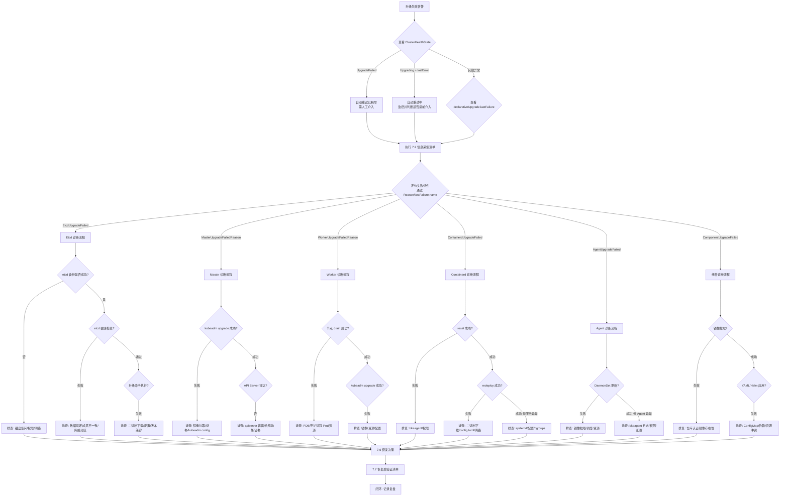
```mermaid
flowchart TD
    Start[升级失败告警] --> CheckStatus{查看 ClusterHealthState}

    CheckStatus -->|UpgradeFailed| RetryExhausted[自动重试已耗尽<br/>需人工介入]
    CheckStatus -->|Upgrading + lastError| Retrying[自动重试中<br/>监控并判断是否提前介入]
    CheckStatus -->|其他异常| CheckDeclarative{查看 declarativeUpgrade.lastFailure}

    RetryExhausted --> CollectInfo[执行 7.2 信息采集清单]
    Retrying --> CollectInfo
    CheckDeclarative --> CollectInfo

    CollectInfo --> LocateComponent{定位失败组件<br/>通过 Reason/lastFailure.name}

    LocateComponent -->|EtcdUpgradeFailed| EtcdDiag[Etcd 诊断流程]
    LocateComponent -->|MasterUpgradeFailedReason| MasterDiag[Master 诊断流程]
    LocateComponent -->|WorkerUpgradeFailedReason| WorkerDiag[Worker 诊断流程]
    LocateComponent -->|ContainerdUpgradeFailed| ContainerdDiag[Containerd 诊断流程]
    LocateComponent -->|AgentUpgradeFailed| AgentDiag[Agent 诊断流程]
    LocateComponent -->|ComponentUpgradeFailed| ComponentDiag[组件诊断流程]

    EtcdDiag --> CheckBackup{etcd 备份是否成功?}
    CheckBackup -->|否| BackupFail[排查: 磁盘空间/权限/网络]
    CheckBackup -->|是| CheckHealth{etcd 健康检查?}
    CheckHealth -->|失败| HealthFail[排查: 数据损坏/成员不一致/网络分区]
    CheckHealth -->|通过| CheckUpgrade{升级命令执行?}
    CheckUpgrade -->|失败| UpgradeFail[排查: 二进制下载/配置/版本兼容]

    MasterDiag --> CheckKubeadm{kubeadm upgrade 成功?}
    CheckKubeadm -->|失败| KubeadmFail[排查: 镜像拉取/证书/kubeadm config]
    CheckKubeadm -->|成功| CheckAPIServer{API Server 可达?}
    CheckAPIServer -->|否| APIFail[排查: apiserver 容器/负载均衡/证书]

    WorkerDiag --> CheckDrain{节点 drain 成功?}
    CheckDrain -->|失败| DrainFail[排查: PDB/守护进程 Pod/资源]
    CheckDrain -->|成功| CheckKubeadmWorker{kubeadm upgrade 成功?}
    CheckKubeadmWorker -->|失败| WorkerKubeadmFail[排查: 镜像/资源/配置]

    ContainerdDiag --> CheckReset{reset 成功?}
    CheckReset -->|失败| ResetFail[排查: bkeagent/权限]
    CheckReset -->|成功| CheckRedeploy{redeploy 成功?}
    CheckRedeploy -->|失败| RedeployFail[排查: 二进制下载/config.toml/网络]
    CheckRedeploy -->|成功 但服务异常| SvcFail[排查: systemd/配置/cgroups]

    AgentDiag --> CheckDaemonSet{DaemonSet 更新?}
    CheckDaemonSet -->|失败| DSFail[排查: 镜像拉取/调度/资源]
    CheckDaemonSet -->|成功 但 Agent 异常| AgentRunFail[排查: bkeagent 日志/权限/配置]

    ComponentDiag --> CheckImage{镜像拉取?}
    CheckImage -->|失败| ImageFail[排查: 仓库认证/镜像存在性]
    CheckImage -->|成功| CheckApply{YAML/Helm 应用?}
    CheckApply -->|失败| ApplyFail[排查: ConfigMap/依赖/资源冲突]

    BackupFail --> Recovery[7.6 恢复决策]
    HealthFail --> Recovery
    UpgradeFail --> Recovery
    KubeadmFail --> Recovery
    APIFail --> Recovery
    DrainFail --> Recovery
    WorkerKubeadmFail --> Recovery
    ResetFail --> Recovery
    RedeployFail --> Recovery
    SvcFail --> Recovery
    DSFail --> Recovery
    AgentRunFail --> Recovery
    ImageFail --> Recovery
    ApplyFail --> Recovery

    Recovery --> Verify[7.7 恢复后验证清单]
    Verify --> CloseLoop[闭环: 记录复盘]
```

### 5.12 各组件失败定位详解

#### 5.12.1 Etcd 升级失败定位

**失败特征**：Reason=`EtcdUpgradeFailed`，节点状态=`EtcdUpgradeFailed`，Fail-Fast 不自动重试。

**定位步骤**：

1. **确认失败阶段**：从 controller 日志区分是"备份失败"、"健康检查失败"还是"升级命令失败"
   ```bash
   kubectl logs -n bke-system deployment/bke-controller-manager --since=2h | grep -A5 "EtcdUpgradeFailed"
   ```

2. **检查 etcd 备份**
   ```bash
   ssh <master-ip> "ls -la {workspace}/etcd-backup/"
   # 若备份目录为空 → 备份失败，检查磁盘空间和权限
   ssh <master-ip> "df -h {workspace}"
   ```

3. **检查 etcd 健康**
   ```bash
   ssh <master-ip> "ETCDCTL_API=3 etcdctl --endpoints=https://127.0.0.1:2379 \
     --cacert=/etc/kubernetes/pki/etcd/ca.crt \
     --cert=/etc/kubernetes/pki/etcd/healthcheck-client.crt \
     --key=/etc/kubernetes/pki/etcd/healthcheck-client.key \
     endpoint status -w table"
   ```

4. **检查 etcd 日志**
   ```bash
   ssh <master-ip> "journalctl -u etcd --since '2 hours ago' | grep -iE 'error|fatal|panic'"
   ```

5. **检查版本兼容性**：确认 etcd 与 kubernetes 版本兼容（如 k8s v1.25 需要 etcd v3.5+）

**特别注意**：etcd 升级失败后**有备份但无自动回滚路径**（[ensure_etcd_upgrade.go](file:///cluster-api-provider-bke/pkg/phaseframe/phases/ensure_etcd_upgrade.go) 无 Restore 调用），需人工执行恢复，见 7.6。

#### 5.12.2 Master 升级失败定位

**失败特征**：Reason=`MasterUpgradeFailedReason`，Fail-Fast 不自动重试。

**定位步骤**：

1. **检查 kubeadm upgrade 日志**
   ```bash
   ssh <master-ip> "cat /var/log/kubeadm.log 2>/dev/null || journalctl -u kubeadm --since '2 hours ago'"
   ```

2. **检查控制面 Pod 状态**
   ```bash
   kubectl get pods -n kube-system -o wide | grep -E "apiserver|controller-manager|scheduler|etcd"
   ```

3. **检查 API Server 可达性**
   ```bash
   ssh <master-ip> "kubectl get --raw='/healthz' 2>&1"
   ssh <master-ip> "curl -k https://localhost:6443/healthz"
   ```

4. **检查镜像拉取**
   ```bash
   ssh <master-ip> "crictl images | grep -E 'kube-apiserver|kube-controller-manager|kube-scheduler|etcd'"
   ssh <master-ip> "crictl pull <registry>/kube-apiserver:v1.29.0"
   ```

5. **检查证书有效期**
   ```bash
   ssh <master-ip> "kubeadm certs check-expiration"
   ```

6. **检查 /etc/kubernetes 备份**（升级前自动备份）
   ```bash
   ssh <master-ip> "ls -la /etc/kubernetes.bak.*"
   ```

#### 5.12.3 Worker 升级失败定位

**失败特征**：Reason=`WorkerUpgradeFailedReason`，Best-Effort 最多重试 3 次，单节点失败不影响其他节点。

**定位步骤**：

1. **检查节点 drain 状态**
   ```bash
   kubectl get node <node-name> -o jsonpath='{.spec.unschedulable}'
   kubectl get pods -A --field-selector spec.nodeName=<node-name> | grep -v Completed
   ```

2. **检查 PDB 阻止 drain**
   ```bash
   kubectl get pdb -A -o wide
   ```

3. **检查 kubeadm upgrade 日志**（同 Master 步骤 1）

4. **检查节点资源**
   ```bash
   ssh <worker-ip> "df -h && free -h && nproc"
   ```

#### 5.12.4 Containerd 升级失败定位

**失败特征**：Reason=`ContainerdUpgradeFailed`，采用"reset + redeploy"模式，**风险最高**——reset 成功后 redeploy 失败会导致节点完全无容器运行时。

**定位步骤**：

1. **确认失败阶段**：reset 失败 or redeploy 失败
   ```bash
   kubectl logs -n bke-system deployment/bke-controller-manager --since=2h | grep -B2 -A5 "ContainerdUpgradeFailed"
   ```

2. **检查 containerd 服务状态**
   ```bash
   ssh <node-ip> "systemctl status containerd"
   ssh <node-ip> "ctr version"
   ```

3. **若 containerd 服务不存在**（reset 成功但 redeploy 失败）
   ```bash
   # 紧急恢复：手动 redeploy
   ssh <node-ip> "/opt/bke/bin/bkeagent redeploy containerd --version <target-version>"
   ```

4. **检查 containerd 配置**
   ```bash
   ssh <node-ip> "cat /etc/containerd/config.toml"
   ssh <node-ip> "containerd config dump"  # 验证配置语法
   ```

5. **检查二进制下载**（离线包场景）
   ```bash
   ssh <node-ip> "ls -la /opt/bke/bin/containerd*"
   ```

**特别注意**：Containerd 升级**无节点状态标记**（不调用 `SetNodeStateWithMessageForCluster`），失败时节点状态停留在升级前，需从 controller 日志判断。

#### 5.12.5 Agent 升级失败定位

**失败特征**：Reason=`AgentUpgradeFailed`，Requeue 无限重试。

**定位步骤**：

1. **检查 DaemonSet 状态**
   ```bash
   kubectl get daemonset -n bke-system bkeagent -o wide
   kubectl rollout status daemonset/bkeagent -n bke-system
   ```

2. **检查 bkeagent Pod 状态**
   ```bash
   kubectl get pods -n bke-system -l k8s-app=bkeagent -o wide
   kubectl describe pod <bkeagent-pod> -n bke-system
   ```

3. **检查镜像拉取**
   ```bash
   kubectl get events -n bke-system --field-selector reason=FailedToPullImage
   ```

4. **检查 bkeagent 日志**
   ```bash
   ssh <node-ip> "journalctl -u bkeagent --since '2 hours ago'"
   ```

#### 5.12.6 组件（CoreDNS/kube-proxy）升级失败定位

**失败特征**：Reason=`ComponentUpgradeFailed`，Requeue 无限重试。

**定位步骤**：

1. **检查组件 Pod 状态**
   ```bash
   kubectl get pods -n kube-system -l k8s-app=kube-dns
   kubectl get pods -n kube-system -l k8s-app=kube-proxy
   ```

2. **检查镜像版本**
   ```bash
   kubectl get pods -n kube-system -o jsonpath='{range .items[*]}{.metadata.name}{"\t"}{.spec.containers[*].image}{"\n"}{end}' | grep -E "coredns|kube-proxy"
   ```

3. **检查 ConfigMap**
   ```bash
   kubectl get cm -n kube-system coredns -o yaml
   ```

### 5.13 恢复决策与操作路径

根据 7.5 定位的失败组件和根因，选择对应的恢复路径。

#### 5.13.1 恢复决策矩阵

| 失败组件 | 根因 | 恢复路径 | 是否需手动修复 | 重试方式 |
|----------|------|----------|----------------|----------|
| **Etcd** | 备份失败 | 修复磁盘/权限后重试 | 是 | `kubectl annotate bkecluster <name> bke.bocloud.com/retry="<ip>"` |
| **Etcd** | 数据损坏 | **从快照恢复**后重试 | 是（人工 etcdctl snapshot restore） | 同上 |
| **Master** | 镜像拉取 | 修复仓库/网络后重试 | 否 | 同上 |
| **Master** | kubeadm 失败 | **从 /etc/kubernetes.bak 恢复**后重试 | 是（人工 cp 恢复） | 同上 |
| **Master** | 证书过期 | `kubeadm certs renew` 后重试 | 是 | 同上 |
| **Worker** | drain 失败 | 修复 PDB/驱逐 Pod 后重试 | 视情况 | 同上 |
| **Worker** | kubeadm 失败 | 可直接重试（Best-Effort） | 否 | 自动重试或手动 |
| **Containerd** | reset 后 redeploy 失败 | **紧急手动 redeploy** | 是（紧急） | `bkeagent redeploy containerd` |
| **Containerd** | config.toml 错误 | 修复配置后重试 | 是 | 同上 |
| **Agent** | 镜像拉取 | 修复仓库后重试 | 否 | 自动无限重试 |
| **组件** | 镜像拉取 | 修复仓库后重试 | 否 | 自动无限重试 |
| **Provider** | 镜像更新失败 | 修复仓库/Deployment 后重试 | 视情况 | 自动无限重试 |

#### 5.13.2 关键恢复操作

**操作一：触发手动重试（通用）**
```bash
# 重试所有失败节点
kubectl annotate bkecluster <name> bke.bocloud.com/retry="" --overwrite

# 重试指定节点
kubectl annotate bkecluster <name> bke.bocloud.com/retry="192.168.1.10,192.168.1.11" --overwrite
```

**操作二：Etcd 从快照恢复（高风险，需停服）**
```bash
# 1. 停止 etcd
ssh <master-ip> "systemctl stop etcd"

# 2. 备份当前数据（以防万一）
ssh <master-ip> "mv /var/lib/openFuyao/etcd /var/lib/openFuyao/etcd.failed"

# 3. 从快照恢复
ssh <master-ip> "ETCDCTL_API=3 etcdctl snapshot restore {workspace}/etcd-backup/<backup-file> --data-dir /var/lib/openFuyao/etcd"

# 4. 启动 etcd
ssh <master-ip> "systemctl start etcd"

# 5. 验证
ssh <master-ip> "ETCDCTL_API=3 etcdctl endpoint health"
```

**操作三：Master 从 /etc/kubernetes 备份恢复**
```bash
# 1. 恢复配置
ssh <master-ip> "cp -r /etc/kubernetes.bak.* /etc/kubernetes/"

# 2. 重启控制面静态 Pod
ssh <master-ip> "mv /etc/kubernetes/manifests/{kube-apiserver,kube-controller-manager,kube-scheduler}.yaml /tmp/"
ssh <master-ip> "sleep 10"
ssh <master-ip> "mv /tmp/*.yaml /etc/kubernetes/manifests/"

# 3. 验证 API Server
ssh <master-ip> "kubectl get --raw='/healthz'"
```

**操作四：Containerd 紧急恢复**
```bash
# 节点无 containerd 时的紧急操作
ssh <node-ip> "/opt/bke/bin/bkeagent redeploy containerd --version <target-version>"
ssh <node-ip> "systemctl restart containerd"
ssh <node-ip> "ctr version"
```

#### 5.13.3 何时放弃重试

| 场景 | 处置 |
|------|------|
| etcd 数据严重损坏，快照恢复后仍不可用 | 考虑从集群级备份重建，或回退到升级前 etcd 版本 |
| Master 多次 kubeadm upgrade 失败，控制面不可恢复 | 从 /etc/kubernetes.bak 恢复到升级前版本，回退 K8s 版本 |
| Containerd 节点完全不可用且无法 redeploy | 将节点标记为失败，从集群移除后重新加入 |
| 升级目标版本与现有组件不兼容 | 修正 BKECluster Spec 版本字段，触发降级（注意：containerd 不允许降级） |

### 5.14 恢复后验证清单

恢复操作完成后，按清单逐项验证，确保升级真正完成。

#### 5.14.1 集群级验证

| 验证项 | 命令 | 预期结果 |
|--------|------|----------|
| 集群状态 | `kubectl get bkecluster <name>` | `ClusterStatus=Ready`，`ClusterHealthState=Healthy` |
| 集群版本 | `kubectl get bkecluster <name> -o jsonpath='{.status.kubernetesVersion}'` | 等于目标版本 |
| DeclarativeUpgrade | `kubectl get bkecluster <name> -o jsonpath='{.status.declarativeUpgrade}'` | `finishedAt` 非空，`lastError` 为空 |
| 集群健康 | `kubectl get --raw='/healthz'` | `ok` |
| 节点就绪 | `kubectl get nodes` | 所有节点 `Ready` |

#### 5.14.2 组件级验证

| 验证项 | 命令 | 预期结果 |
|--------|------|----------|
| etcd 版本 | `ssh <master-ip> "ETCDCTL_API=3 etcdctl endpoint status -w table"` | 版本号等于目标版本 |
| etcd 健康 | `ssh <master-ip> "ETCDCTL_API=3 etcdctl endpoint health"` | healthy |
| K8s 版本 | `kubectl version --short` | 等于目标版本 |
| Containerd 版本 | `ssh <node-ip> "ctr version"` | 等于目标版本 |
| Containerd 服务 | `ssh <node-ip> "systemctl is-active containerd"` | active |
| BKEAgent 版本 | `ssh <node-ip> "/opt/bke/bin/bkeagent version"` | 等于目标版本 |
| CoreDNS 版本 | `kubectl get deploy -n kube-system coredns -o jsonpath='{.spec.template.spec.containers[*].image}'` | 等于目标版本 |
| kube-proxy 版本 | `kubectl get ds -n kube-system kube-proxy -o jsonpath='{.spec.template.spec.containers[*].image}'` | 等于目标版本 |

#### 5.14.3 业务影响验证

| 验证项 | 命令 | 预期结果 |
|--------|------|----------|
| Pod 运行状态 | `kubectl get pods -A \| grep -v Running \| grep -v Completed` | 无异常 Pod |
| 控制面 Pod | `kubectl get pods -n kube-system \| grep -E "apiserver\|controller-manager\|scheduler\|etcd"` | 全部 Running |
| 集群事件 | `kubectl get events -A --sort-by='.lastTimestamp' \| tail -20` | 无 Warning/Error 事件 |
| 节点资源 | `kubectl top nodes` | 资源使用正常 |

### 5.15 常见问题速查表

| 现象 | 可能原因 | 快速定位命令 | 解决方案 |
|------|----------|--------------|----------|
| `ClusterStatus` 反复跳变 Upgrading/Ready | StatusManager 状态伪装（<10 次重试） | `kubectl get bkecluster <name> -o jsonpath='{.status.clusterHealthState}'` | 查看 controller 日志确认真实失败，监控重试进度 |
| `ClusterHealthState=UpgradeFailed` 但无 lastError | 旧 PhaseFlow 路径失败 | `kubectl logs -n bke-system deployment/bke-controller-manager \| grep -iE "error\|failed"` | 从 controller 日志定位 |
| 所有节点升级失败 | 镜像仓库不可达或认证失败 | `ssh <node-ip> "crictl pull <image>"` | 修复仓库连通性/认证 |
| 单节点反复失败 | 节点资源不足/磁盘满/网络异常 | `ssh <node-ip> "df -h && free -h"` | 扩容资源或更换节点 |
| Etcd 升级后集群不可用 | etcd 数据不一致或成员丢失 | `etcdctl endpoint status -w table` | 从快照恢复或重新加入成员 |
| Containerd 升级后节点 NotReady | reset 成功但 redeploy 失败 | `ssh <node-ip> "systemctl status containerd"` | 紧急执行 `bkeagent redeploy containerd` |
| Master 升级后 API Server 不可达 | 静态 Pod 未启动或证书问题 | `ssh <master-ip> "crictl ps \| grep apiserver"` | 检查静态 Pod 清单和证书 |
| Worker drain 卡住 | PDB 阻止或守护进程 Pod 无法驱逐 | `kubectl get pdb -A` | 临时调整 PDB 或强制 drain |
| Agent 升级后节点失联 | bkeagent Pod 崩溃 | `kubectl get pods -n bke-system -l k8s-app=bkeagent` | 检查 bkeagent 镜像和日志 |
| DeclarativeUpgrade 的 `lastFailure.attempt` 持续增长 | 同一组件连续失败 | `kubectl get bkecluster <name> -o jsonpath='{.status.declarativeUpgrade.lastFailure}'` | 查看 7.5 对应组件定位流程 |
| 升级后版本号未更新 | 升级未真正完成或状态同步延迟 | `kubectl get bkecluster <name> -o yaml` | 检查 `declarativeUpgrade.completed` 列表是否完整 |

---
---

## 6. 关键结论

### 6.1 升级场景设计特点

1. **版本比较统一走 VersionContext**：所有声明式 phase 不再直接读 spec，避免 spec 与 status 不一致
2. **master/worker 版本回退查找**：支持 master↔worker↔kubernetes 三级回退，兼容历史配置
3. **containerd 仅允许升级不允许降级**：`version.Compare` 返回 -1 时跳过
4. **etcd/master 滚动串行 + FailFast**：保证控制面稳定性，单点失败立即止损
5. **worker 滚动串行 + Continue**：允许部分失败，最大化升级进度
6. **provider 自升级独立于集群升级**：仅 patch 版本初次安装时触发，避免每次升级都重启 controller

### 6.2 状态机设计特点

1. **集群状态与节点状态独立管理**：集群状态由 PhaseFlow hook 自动设置，节点状态由各 phase 显式标记
2. **StatusManager 的状态伪装**：失败 10 次内将 `ClusterStatus` 改回 `LatestNormalState`，但 `ClusterHealthState` 保持真实失败状态
3. **Etcd 节点成功状态复用 Upgrading**：[ensure_etcd_upgrade.go:350](file:///cluster-api-provider-bke/pkg/phaseframe/phases/ensure_etcd_upgrade.go#L350) 成功时设置 `EtcdUpgrading`（值为 "Upgrading"），仅 message 不同，**这是代码 bug**
4. **Containerd 升级无节点状态标记**：整个流程不调用 `SetNodeStateWithMessageForCluster`，失败时节点状态停留在升级前
5. **DAG 失败立即重试**：`RequeueAwareError` 恒返回 true，所有 DAG 错误都触发立即重试，无指数退避
6. **Master FailFast vs Worker Continue**：Master 单节点失败立即中断，Worker 单节点失败继续下一个

### 6.3 回滚能力结论

1. **所有节点实例升级失败均不支持自动版本回滚**，仅有状态标记和中断/继续策略
2. **备份机制存在但恢复路径完全缺失**：etcd snapshot、/etc/kubernetes、bkeagent 二进制均有备份，但代码中无任何 `Restore` 调用
3. **Containerd 升级失败风险最高**：reset+redeploy 模式下，reset 成功后 redeploy 失败会导致节点完全无容器运行时
4. **Master 升级采用 FailFast**：单节点失败立即止损，保护控制面稳定性
5. **Worker 升级采用 Continue**：允许部分失败，最大化升级进度，但会导致集群内版本不一致
6. **KEP-6 设计了完整回滚规格但未落地**：`FailurePolicyRollback`、`UninstallScript`、`RollbackSpec` 均停留在设计文档

### 6.4 重试机制结论

1. **三层重试叠加**：workqueue 限速器（节奏）+ StatusManager 计数（上限）+ 手动注解（人工干预）
2. **master/etcd/worker/DAG 失败立即重试**：返回 `Requeue: true` 绕过限速器，**可能造成重试风暴**
3. **StatusManager 的"状态伪装"设计**：失败 10 次内对外显示正常状态，可能掩盖真实问题
4. **超过 10 次后完全停止**：需修改 spec 或添加 retry annotation 才能恢复，**无指数退避过渡**
5. **Containerd 升级失败重试风险最高**：reset 后 redeploy 失败时，节点无 containerd，10 次重试后节点永久不可用
6. **DAG 的 `RequeueAwareError` 实现简化**：恒返回 `true`，所有 DAG 错误都立即重试，未区分错误类型

---

**文档版本**: v1.3  
**基于代码**: cluster-api-provider-bke  
**维护者**: openFuyao Team