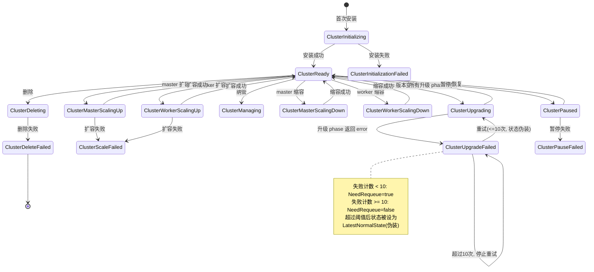
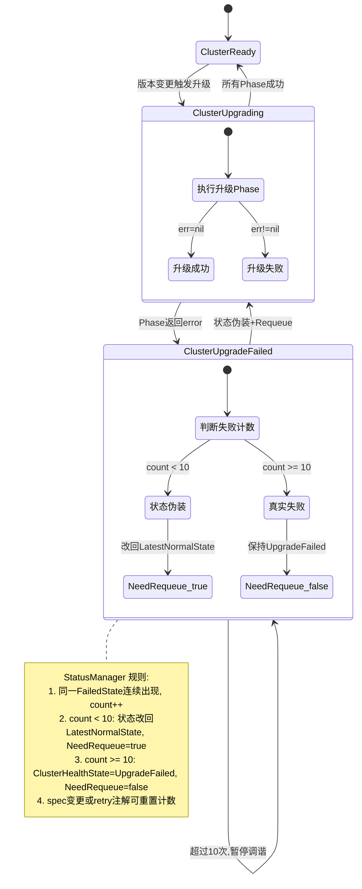
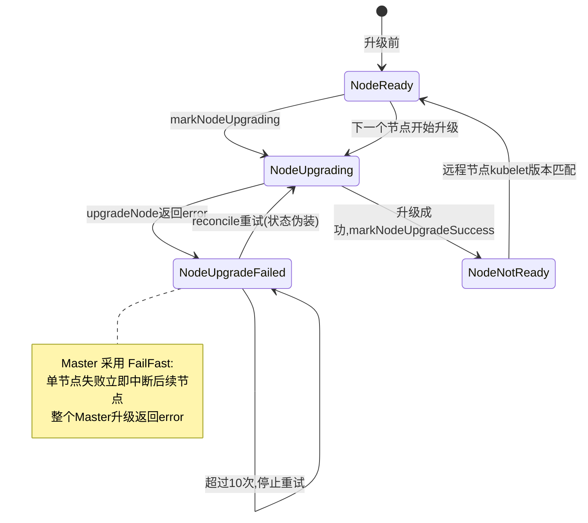
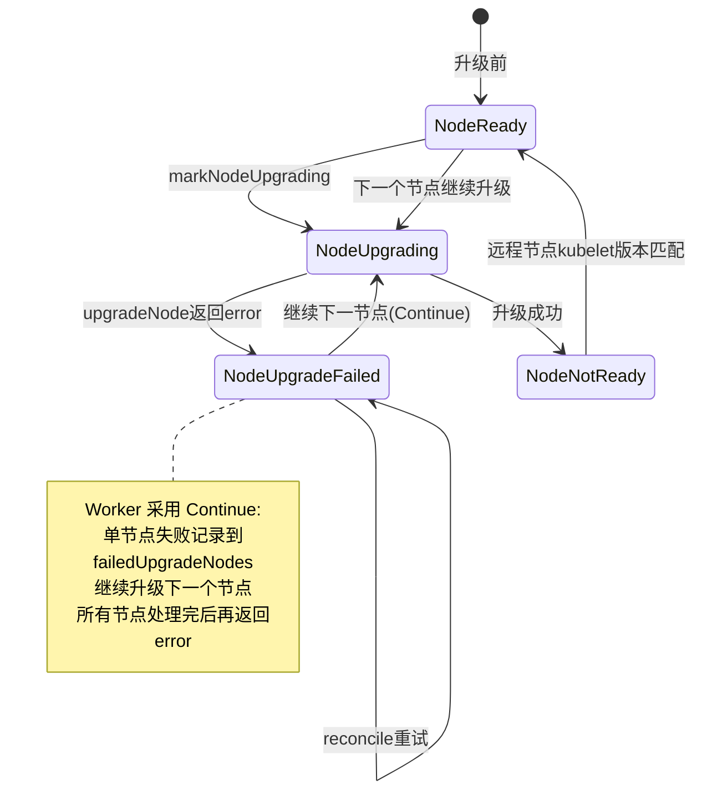
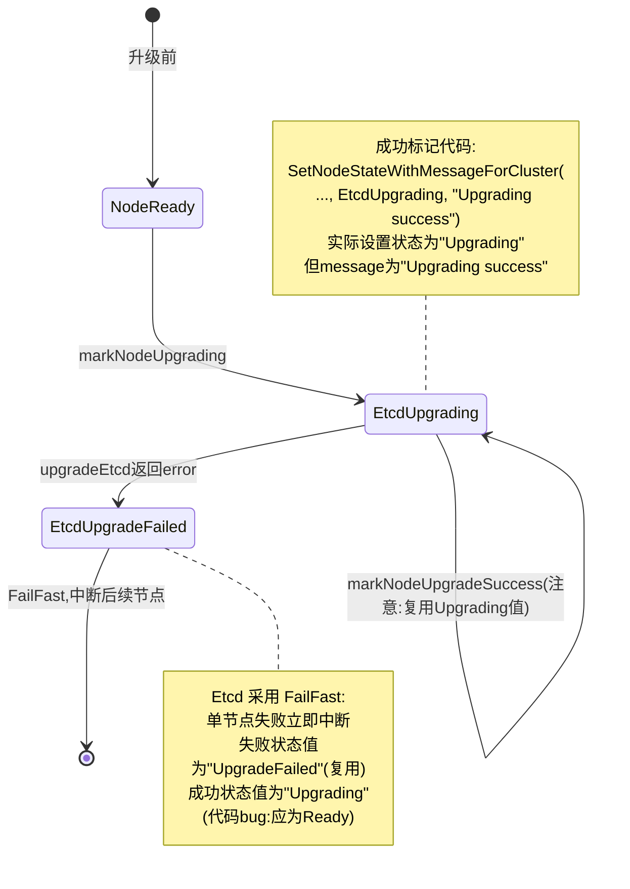
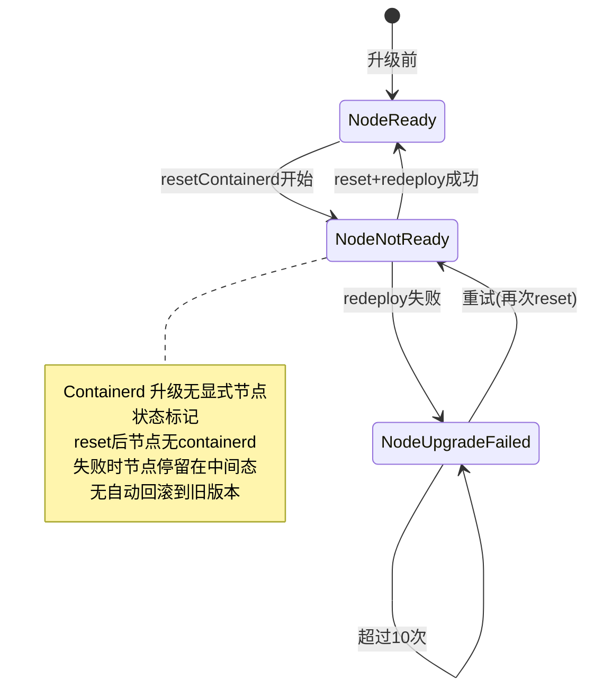
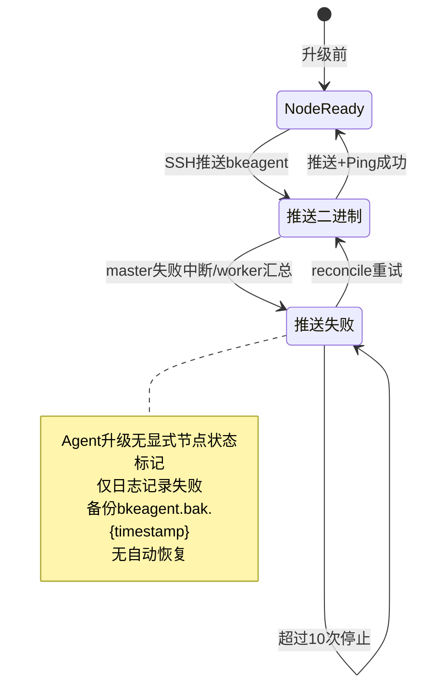
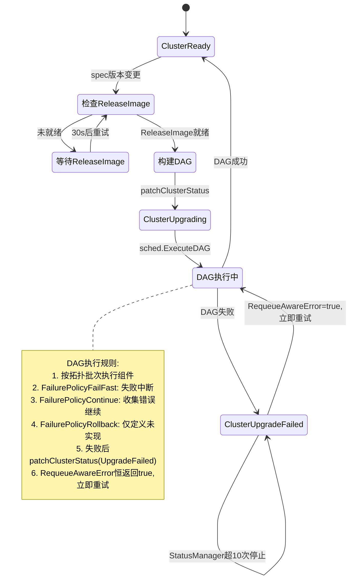

```mermaid
stateDiagram-v2
    direction TB
    [*] --> ClusterReady: 集群就绪
    
    ClusterReady --> ClusterUpgrading: spec版本变更\n或ReleaseImage变更
    
    state ClusterUpgrading {
        direction TB
        [*] --> PreUpgradeResources
        PreUpgradeResources --> AgentUpgrade
        AgentUpgrade --> EtcdUpgrade
        EtcdUpgrade --> ContainerdUpgrade
        ContainerdUpgrade --> MasterUpgrade
        MasterUpgrade --> WorkerUpgrade
        WorkerUpgrade --> ComponentUpgrade
        ComponentUpgrade --> [*]
    }
    
    state AgentUpgrade {
        direction TB
        [*] --> Agent推送中
        Agent推送中 --> Agent成功: Ping通过
        Agent推送中 --> Agent失败: master失败中断
        Agent成功 --> [*]
        Agent失败 --> [*]
    }
    
    state EtcdUpgrade {
        direction TB
        [*] --> Etcd备份
        Etcd备份 --> Etcd节点1升级
        Etcd节点1升级 --> Etcd节点2升级: 成功
        Etcd节点1升级 --> Etcd失败: 失败(FailFast)
        Etcd节点2升级 --> Etcd节点N升级: 成功
        Etcd节点N升级 --> Etcd成功: 全部完成
        Etcd失败 --> [*]
        Etcd成功 --> [*]
    }
    
    state MasterUpgrade {
        direction TB
        [*] --> Master备份
        Master备份 --> Master节点1升级
        Master节点1升级 --> Master节点2升级: 成功
        Master节点1升级 --> Master失败: 失败(FailFast)
        Master节点2升级 --> Master节点N升级: 成功
        Master节点N升级 --> Master成功: 全部完成
        Master失败 --> [*]
        Master成功 --> [*]
    }
    
    state WorkerUpgrade {
        direction TB
        [*] --> Worker节点1升级
        Worker节点1升级 --> Worker节点2升级: 成功或失败都继续
        Worker节点2升级 --> Worker节点N升级: 成功或失败都继续
        Worker节点N升级 --> Worker汇总: 全部处理完
        Worker汇总 --> Worker成功: 无失败节点
        Worker汇总 --> Worker部分失败: 有失败节点
        Worker成功 --> [*]
        Worker部分失败 --> [*]
    }
    
    ClusterUpgrading --> ClusterReady: 所有Phase成功
    ClusterUpgrading --> ClusterUpgradeFailed: 任一Phase失败
    
    ClusterUpgradeFailed --> ClusterUpgrading: StatusManager重试(<10次)
    ClusterUpgradeFailed --> ClusterUpgradeFailed: 超过10次,暂停
    
    note right of ClusterUpgradeFailed
        重试规则:
        1. workqueue限速器: 2s×10次, 60s×N次
        2. StatusManager: 同状态失败<10次,NeedRequeue=true
        3. 超过10次: NeedRequeue=false,暂停调谐
        4. retry注解: 清除失败标记,恢复调谐
    end note
```

# 代码中实现的升级场景规格清单

## 升级场景规格清单

### 一、升级场景总体分类

工程中升级分两条路径，由 `DeclarativeDAGCompleted` 标志切换（[phase_flow.go:101-107](file:///cluster-api-provider-bke/pkg/phaseframe/phases/phase_flow.go#L101-L107)）：

| 路径 | 触发条件 | 调度方式 | 覆盖组件 |
|------|----------|----------|----------|
| **声明式 DAG 路径** | ReleaseImage 驱动，DAG 已完成 | DAG 批次调度 | pre-upgrade-resources / agent / etcd / containerd / master / worker |
| **旧 PhaseFlow 路径** | 无 ReleaseImage 或 DAG 未完成 | 串行 Phase 列表 | provider / agent / containerd / master / worker / component |

两条路径注册见 [list.go:35-69](file:///cluster-api-provider-bke/pkg/phaseframe/phases/list.go#L35-L69)。

### 二、版本决策机制（VersionContext）

所有声明式升级 phase 统一通过 `NeedExecuteWithVersionContext` 判定（[ensure_master_upgrade.go:172](file:///cluster-api-provider-bke/pkg/phaseframe/phases/ensure_master_upgrade.go#L172)）。

**组件常量定义**（[pkg/upgrade/components.go:17-26](file:///cluster-api-provider-bke/pkg/upgrade/components.go#L17-L26)）：

| 组件常量 | 值 | 对应 Phase |
|----------|------|-----------|
| `ComponentPreUpgradeResources` | pre-upgrade-resources | EnsurePreUpgradeResources |
| `ComponentBKEAgent` | bkeagent | EnsureAgentUpgrade |
| `ComponentEtcd` | etcd | EnsureEtcdUpgrade |
| `ComponentContainerd` | containerd | EnsureContainerdUpgrade |
| `ComponentKubernetesMaster` | kubernetes-master | EnsureMasterUpgrade |
| `ComponentKubernetesWorker` | kubernetes-worker | EnsureWorkerUpgrade |
| `ComponentProvider` | provider | EnsureProviderSelfUpgrade |
| `ComponentOpenFuyao` | openfuyao | EnsureComponentUpgrade |
| `ComponentKubeProxy` / `ComponentCoreDNS` | kube-proxy / coredns | DAG 声明式（YAML） |

**决策规则**：
- `vc.GetTarget(component)` 非空且 ≠ `vc.GetCurrent(component)` → 需要升级
- master/worker 的 target 支持回退到 `ComponentKubernetesWorker` / `ComponentKubernetesMaster` / `kubernetes` 三级查找（[ensure_master_upgrade.go:102-110](file:///d:/code/github/cluster-api-provider-bke/pkg/phaseframe/phases/ensure_master_upgrade.go#L102-L110)）

### 三、各升级场景规格

#### 3.1 升级前资源预创建（EnsurePreUpgradeResources）

**位置**：[ensure_pre_upgrade_resources.go:71-127](file:///cluster-api-provider-bke/pkg/phaseframe/phases/ensure_pre_upgrade_resources.go#L71-L127)

| 维度 | 规格 |
|------|------|
| 触发条件 | `ComponentVersionDecision(ComponentPreUpgradeResources)` 返回 need=true |
| 执行动作 | 按 kind 排序后 provision ConfigMap / Secret / 任意 manifest |
| 幂等性 | `IsAlreadyExists` 错误被忽略 |
| DAG 依赖 | 被自动加入所有升级组件的依赖前置（[bundle.go:70-78](file:///cluster-api-provider-bke/pkg/upgrade/bundle.go#L70-L78)） |

#### 3.2 BKEAgent 升级（EnsureAgentUpgrade）

**位置**：[ensure_agent_upgrade.go:59-160](file:///cluster-api-provider-bke/pkg/phaseframe/phases/ensure_agent_upgrade.go#L59-L160)

| 维度 | 规格 |
|------|------|
| 触发条件 | `NeedExecuteWithVersionContext(ComponentBKEAgent, ...)` 无额外回调 |
| 升级方式 | SSH 推送二进制（非 kubeadm） |
| 节点范围 | 全部 BKENodes（master + worker） |
| 架构发现 | `DiscoverArchs` 区分 amd64/arm64 |
| 失败策略 | master 节点失败立即返回；worker 节点失败汇总后返回 |
| 二进制备份 | `cp -f bkeagent bkeagent.bak.$(date +%s)` |
| 健康验证 | 升级后 `PingBKEAgentOnNodes` 验证 agent 可达 |
| 版本来源 | `vc.GetTarget(ComponentBKEAgent)` → 回退 `legacyReleaseBKEAgentComponent` |

#### 3.3 Etcd 升级（EnsureEtcdUpgrade）

**位置**：[ensure_etcd_upgrade.go:150-438](file:///cluster-api-provider-bke/pkg/phaseframe/phases/ensure_etcd_upgrade.go#L150-L438)

| 维度 | 规格 |
|------|------|
| 触发条件 | `target != current` 且两者均非空（[ensure_etcd_upgrade.go:166-172](file:///cluster-api-provider-bke/pkg/phaseframe/phases/ensure_etcd_upgrade.go#L166-L172)） |
| 升级策略 | **滚动升级**，逐节点串行（`upgradeNodes` for 循环） |
| 节点过滤 | 仅 agent ready 的 etcd 角色节点 |
| 备份规格 | 首个 etcd 节点做 `snapshot save`（`determineBackupNode`） |
| 单节点流程 | markUpgrading → upgradeEtcd → waitForUpgradeComplete → waitForEtcdHealthCheck → markSuccess |
| 失败处理 | 标记 `EtcdUpgradeFailed`，**立即中断**后续节点（非 Continue） |
| 跳过逻辑 | `shouldSkipNode`：已是目标版本的节点跳过 |
| 收尾 | `finalizeUpgrade` 更新 `Status.EtcdVersion` |

#### 3.4 Containerd 升级（EnsureContainerdUpgrade）

**位置**：[ensure_containerd_upgrade.go:46-237](file:///cluster-api-provider-bke/pkg/phaseframe/phases/ensure_containerd_upgrade.go#L46-L237)

| 维度 | 规格 |
|------|------|
| 触发条件 | 版本比较 `newv > oldv` 且存在非 skip、非 failed 的节点（[ensure_containerd_upgrade.go:181-213](file:///cluster-api-provider-bke/pkg/phaseframe/phases/ensure_containerd_upgrade.go#L181-L213)） |
| 升级模式 | **reset + redeploy 两步原子替换**（非滚动） |
| 执行步骤 | `resetContainerd` → `redeployContainerd` |
| 节点范围 | `GetNeedUpgradeNodesWithBKENodes` 过滤 |
| 等待方式 | `envCommand.Wait()` 返回 successNodes/failedNodes |
| 失败策略 | failedNodes > 0 即返回 error，**不回滚**已 reset 的节点 |
| 版本更新 | 成功后 `Status.ContainerdVersion = targetVersion` |
| 降级限制 | `version.Compare` 返回 -1（降级）时不触发 |

#### 3.5 Master 升级（EnsureMasterUpgrade）

**位置**：[ensure_master_upgrade.go:60-365](file:///cluster-api-provider-bke/pkg/phaseframe/phases/ensure_master_upgrade.go#L60-L365)

| 维度 | 规格 |
|------|------|
| 触发条件 | `desiredVersion != currentVersion` 且 cluster 非 Unhealthy/Unknown 且有 agent ready 的 master 节点 |
| 升级策略 | **滚动升级**，逐节点串行 |
| 前置动作 | 设置 `deployAction=k8s_upgrade` 注解；`syncLegacyTargetKubernetesVersion` 同步 spec |
| etcd 备份 | 首个 etcd 节点做备份（与 etcd 升级独立） |
| 单节点流程 | markUpgrading → executeNodeUpgrade → waitForNodeHealthCheck → markSuccess |
| 失败策略 | **FailFast**：单节点失败立即 return，中断后续节点（[ensure_master_upgrade.go:340-348](file:///cluster-api-provider-bke/pkg/phaseframe/phases/ensure_master_upgrade.go#L340-L348)） |
| 跳过逻辑 | `remoteNode.Status.NodeInfo.KubeletVersion == target` 跳过 |
| 收尾 | 更新 `Status.KubernetesVersion` + `updateAddonVersions` |

#### 3.6 Worker 升级（EnsureWorkerUpgrade）

**位置**：[ensure_worker_upgrade.go:94-505](file:///cluster-api-provider-bke/pkg/phaseframe/phases/ensure_worker_upgrade.go#L94-L505)

| 维度 | 规格 |
|------|------|
| 触发条件 | 同 Master，组件为 `ComponentKubernetesWorker` |
| 升级策略 | **滚动升级**，逐节点串行 |
| 失败策略 | **Continue**：单节点失败记录到 `failedUpgradeNodes`，继续下一节点（[ensure_worker_upgrade.go:300-310](file:///cluster-api-provider-bke/pkg/phaseframe/phases/ensure_worker_upgrade.go#L300-L310)） |
| Drainer | 已创建 `NewDrainer` 但 `upgradeNode` 未实际调用（设计缺口） |
| 节点状态 | markUpgrading → 失败 markUpgradeFailed → 成功 markNotReady("Upgrading success") |
| 版本回滚 | 无（仅标记状态） |

#### 3.7 Provider 自升级（EnsureProviderSelfUpgrade）

**位置**：[ensure_provider_self_upgrade.go:61-149](file:///cluster-api-provider-bke/pkg/phaseframe/phases/ensure_provider_self_upgrade.go#L61-L149)

| 维度 | 规格 |
|------|------|
| 触发条件 | Deployment 当前镜像 ≠ 目标镜像（[ensure_provider_self_upgrade.go:84-118](file:///cluster-api-provider-bke/pkg/phaseframe/phases/ensure_provider_self_upgrade.go#L84-L118)） |
| 初次安装规则 | `Status.OpenFuyaoVersion == ""` 时，仅 patch 版本（非 x.y.0）才触发 |
| 升级动作 | `PatchDeploymentImage` 修改容器镜像 |
| 等待就绪 | `WaitDeploymentReady` 等待新版本 Pod ready（超时 `deploymentReadyTimeout`） |
| 影响范围 | provider 自身 Pod 滚动重启，不影响集群节点 |

#### 3.8 openFuyao 核心组件升级（EnsureComponentUpgrade）

**位置**：[ensure_component_upgrade.go:55-218](file:///cluster-api-provider-bke/pkg/phaseframe/phases/ensure_component_upgrade.go#L55-L218)

| 维度 | 规格 |
|------|------|
| 触发条件 | 初次安装 patch 版本，或存在 `GetNeedUpgradeComponentNodes` 节点 |
| 配置来源 | 本地 `bke-config` CM 的 `patch.{version}` + `openfuyao-patch/CM` 的 `cm.{version}` |
| 升级动作 | `processImageUpdates` 遍历 repos → subImages → images，逐个更新镜像 |
| 跳过规则 | `repo.IsKubernetes` 跳过（k8s 组件由其他流程升级） |
| 收尾 | 更新 `Status.OpenFuyaoVersion` |

### 四、声明式 DAG 升级编排规格

**DAG 依赖与批次**（[pkg/upgrade/bundle.go](file:///cluster-api-provider-bke/pkg/upgrade/bundle.go)）：

- `ComponentPreUpgradeResources` 自动作为所有升级组件的前置依赖
- DAG 调度支持 `FailurePolicyFailFast` / `FailurePolicyContinue` / `FailurePolicyRollback`（后者仅定义未实现）
- DAG 完成后通过 `DeclarativeDAGCompleted` 标志阻止 inline phase 重复执行（[phase_flow.go:101-107](file:///cluster-api-provider-bke/pkg/phaseframe/phases/phase_flow.go#L101-L107)）

### 五、集群状态映射规格

**位置**：[phase_flow.go:319-327](file:///cluster-api-provider-bke/pkg/phaseframe/phases/phase_flow.go#L319-L327)

| Phase 范围 | 成功状态 | 失败状态 |
|------------|----------|----------|
| `ClusterUpgradePhaseNames`（旧路径） | ClusterUpgrading | ClusterUpgradeFailed |
| `DeclarativeClusterUpgradePhaseNames`（DAG 路径） | ClusterUpgrading | ClusterUpgradeFailed |

### 六、节点状态标记规格

| 场景 | 标记 | 位置 |
|------|------|------|
| Agent 升级失败 | master 节点失败立即返回 | ensure_agent_upgrade.go:155 |
| Etcd 升级中 | `EtcdUpgrading` | ensure_etcd_upgrade.go:335 |
| Etcd 升级失败 | `EtcdUpgradeFailed` | ensure_etcd_upgrade.go:371 |
| Master 升级中 | `NodeUpgrading` | ensure_master_upgrade.go:325 |
| Master 升级失败 | `NodeUpgradeFailed` | ensure_master_upgrade.go:342 |
| Master 升级成功 | `NodeNotReady`("Upgrading success") | ensure_master_upgrade.go:351 |
| Worker 升级失败 | `NodeUpgradeFailed` | ensure_worker_upgrade.go:302 |
| Worker 升级成功 | `NodeNotReady`("Upgrading success") | ensure_worker_upgrade.go:309 |
| 跳过节点 | `NeedSkip` 标志 | containerd 过滤逻辑 |

### 七、升级场景规格汇总表

| 组件 | 触发条件 | 升级策略 | 失败策略 | 版本来源 | 节点范围 |
|------|----------|----------|----------|----------|----------|
| PreUpgradeResources | DAG 决策 | 一次性 provision | 失败即停 | ComponentVersion.Spec.Resources | N/A |
| BKEAgent | vc target≠current | SSH 推送全节点 | master 失败即停 | vc.GetTarget(bkeagent) | 全部节点 |
| Etcd | target≠current | 滚动串行 | FailFast | vc.GetTarget(etcd) | etcd 角色节点 |
| Containerd | newv>oldv + 有可升级节点 | reset+redeploy | 失败不回滚 | vc.GetTarget(containerd) | 需升级节点 |
| Master | target≠current + cluster健康 | 滚动串行 | FailFast | vc.GetTarget(kubernetes-master) | master 角色节点 |
| Worker | target≠current + cluster健康 | 滚动串行 | Continue | vc.GetTarget(kubernetes-worker) | worker 角色节点 |
| Provider | 镜像不一致 | PatchDeployment | 等待 ready 超时即失败 | spec.OpenFuyaoVersion | provider Pod |
| Component | patch 版本/有节点 | 镜像更新 | 失败即停 | patch CM 配置 | 远程集群工作负载 |

### 八、关键设计约束

1. **版本比较统一走 VersionContext**：所有声明式 phase 不再直接读 spec，避免 spec 与 status 不一致
2. **master/worker 版本回退查找**：支持 master↔worker↔kubernetes 三级回退，兼容历史配置
3. **containerd 仅允许升级不允许降级**：`version.Compare` 返回 -1 时跳过
4. **etcd/master 滚动串行 + FailFast**：保证控制面稳定性，单点失败立即止损
5. **worker 滚动串行 + Continue**：允许部分失败，最大化升级进度
6. **provider 自升级独立于集群升级**：仅 patch 版本初次安装时触发，避免每次升级都重启 controller

# 针对**节点实例升级失败时是否支持回滚**这一维度，梳理代码中实现的规格

## 节点实例升级失败回滚规格

### 一、总体结论

**代码中所有节点实例升级场景均不支持自动版本回滚**。失败处理仅有"状态标记 + 中断/继续"两种模式，无任何将节点版本恢复到旧版本的动作。

| 升级场景 | 失败后是否回滚版本 | 实际处理 |
|----------|:------------------:|----------|
| BKEAgent 升级 | ❌ 否 | 标记失败 + 中断/继续 |
| Etcd 升级 | ❌ 否 | 标记失败 + FailFast |
| Containerd 升级 | ❌ 否 | 节点停留在 reset 中间态 |
| Master 升级 | ❌ 否 | 标记失败 + FailFast |
| Worker 升级 | ❌ 否 | 标记失败 + Continue |

### 二、各场景失败处理规格

#### 2.1 BKEAgent 升级失败

**位置**：[ensure_agent_upgrade.go:145-160](file:///cluster-api-provider-bke/pkg/phaseframe/phases/ensure_agent_upgrade.go#L145-L160)

| 维度 | 规格 |
|------|------|
| 失败检测 | `pushErrs` 非空 或 `PingBKEAgentOnNodes` 返回 failedNodes |
| 回滚动作 | **无**。仅保留 `bkeagent.bak.{timestamp}` 二进制备份，不自动恢复 |
| master 节点失败 | 立即返回 error，中断升级 |
| worker 节点失败 | 汇总失败节点后返回 error |
| 节点状态标记 | 无显式状态标记（仅日志） |
| 人工恢复路径 | 手动 `cp bkeagent.bak.* bkeagent` + `systemctl restart bkeagent` |

**关键缺口**：备份了旧二进制但未实现自动恢复，需人工介入。

#### 2.2 Etcd 升级失败

**位置**：[ensure_etcd_upgrade.go:290-300](file:///cluster-api-provider-bke/pkg/phaseframe/phases/ensure_etcd_upgrade.go#L290-L300)、[ensure_etcd_upgrade.go:362-377](file:///cluster-api-provider-bke/pkg/phaseframe/phases/ensure_etcd_upgrade.go#L362-L377)

| 维度 | 规格 |
|------|------|
| 失败检测 | `upgradeEtcd` 返回 error |
| 回滚动作 | **无**。`handleUpgradeFailure` 仅标记状态 |
| 失败策略 | **FailFast**：`upgradeSingleNode` 返回 error 后 `upgradeNodes` 立即 return，中断后续节点 |
| 节点状态标记 | `EtcdUpgradeFailed` + 错误消息 |
| 备份利用 | etcd snapshot 保存到 `{workspace}/etcd-backup/`，**不自动 restore** |
| 人工恢复路径 | 手动 `etcdctl snapshot restore` + 替换 etcd 数据目录 |

**关键代码**（[ensure_etcd_upgrade.go:362-377](file:///cluster-api-provider-bke/pkg/phaseframe/phases/ensure_etcd_upgrade.go#L362-L377)）：
```go
func (e *EnsureEtcdUpgrade) handleUpgradeFailure(params UpgradeFailureParams) error {
    params.Log.Error(...)
    e.Ctx.NodeFetcher().SetNodeStateWithMessageForCluster(..., bkev1beta1.EtcdUpgradeFailed, params.Error.Error())
    if err := mergecluster.SyncStatusUntilComplete(...); err != nil { ... }
    return errors.Errorf("upgrade node %q failed: %v", ...)
}
```

#### 2.3 Containerd 升级失败

**位置**：[ensure_containerd_upgrade.go:100-160](file:///cluster-api-provider-bke/pkg/phaseframe/phases/ensure_containerd_upgrade.go#L100-L160)

| 维度 | 规格 |
|------|------|
| 失败检测 | `envCommand.Wait()` 返回 `len(failedNodes) > 0` |
| 回滚动作 | **无** |
| 失败时节点状态 | **危险中间态**：reset 成功但 redeploy 失败时，节点无可用 containerd |
| 失败策略 | 直接返回 error，不重试，不恢复 |
| 节点状态标记 | 无显式标记（仅日志 `ContainerdUpgradeFailed`） |
| 人工恢复路径 | 手动重新执行 redeploy 或从备份恢复配置 |

**关键代码**（[ensure_containerd_upgrade.go:108-120](file:///cluster-api-provider-bke/pkg/phaseframe/phases/ensure_containerd_upgrade.go#L108-L120)）：
```go
err := e.resetContainerd()
if err != nil {
    return ctrl.Result{}, err  // reset 失败直接返回
}
err = e.redeployContainerd()
if err != nil {
    return ctrl.Result{}, err  // redeploy 失败直接返回，节点已无 containerd
}
```

**设计盲点**：这是所有升级场景中风险最高的，reset 后节点容器运行时被清除，失败后节点完全不可用。

#### 2.4 Master 升级失败

**位置**：[ensure_master_upgrade.go:340-348](file:///cluster-api-provider-bke/pkg/phaseframe/phases/ensure_master_upgrade.go#L340-L348)

| 维度 | 规格 |
|------|------|
| 失败检测 | `upgradeNode` 返回 error |
| 回滚动作 | **无**。仅标记 `NodeUpgradeFailed` |
| 失败策略 | **FailFast**：单节点失败立即 return，中断后续 master 升级 |
| 节点状态标记 | `NodeUpgradeFailed` + 错误消息 |
| 版本回滚 | **不支持**。节点停留在升级中间版本 |
| 备份利用 | etcd snapshot + /etc/kubernetes 备份，**不自动 restore** |
| 人工恢复路径 | 手动 `kubeadm upgrade apply` 重试 或 从备份恢复配置 |

**关键代码**（[ensure_master_upgrade.go:340-348](file:///cluster-api-provider-bke/pkg/phaseframe/phases/ensure_master_upgrade.go#L340-L348)）：
```go
if err := e.upgradeNode(params.NeedBackupEtcd, params.BackEtcdNode, node, remoteNode); err != nil {
    params.Log.Error(constant.MasterUpgradeFailedReason, "upgrade node %q failed: %v", ...)
    nodeFetcher.SetNodeStateWithMessageForCluster(..., bkev1beta1.NodeUpgradeFailed, err.Error())
    if err = mergecluster.SyncStatusUntilComplete(...); err != nil { ... }
    return errors.Errorf("upgrade node %q failed: %v", ...)  // 立即中断
}
```

#### 2.5 Worker 升级失败

**位置**：[ensure_worker_upgrade.go:300-310](file:///cluster-api-provider-bke/pkg/phaseframe/phases/ensure_worker_upgrade.go#L300-L310)

| 维度 | 规格 |
|------|------|
| 失败检测 | `upgradeNode` 返回 error |
| 回滚动作 | **无**。仅标记 `NodeUpgradeFailed` |
| 失败策略 | **Continue**：记录到 `failedUpgradeNodes`，继续下一节点 |
| 节点状态标记 | `NodeUpgradeFailed` + 错误消息 |
| 版本回滚 | **不支持**。失败节点停留中间版本，成功节点已是新版本 |
| 人工恢复路径 | 手动重试该节点升级 |

**关键代码**（[ensure_worker_upgrade.go:300-310](file:///cluster-api-provider-bke/pkg/phaseframe/phases/ensure_worker_upgrade.go#L300-L310)）：
```go
if err := e.upgradeNode(node, remoteNode, params.Drainer); err != nil {
    failedUpgradeNodes = append(failedUpgradeNodes, phaseutil.NodeInfo(node))
    params.Log.Warn(constant.WorkerUpgradeFailedReason, "upgrade node %q failed: %v", ...)
    nodeFetcher.SetNodeStateWithMessageForCluster(..., bkev1beta1.NodeUpgradeFailed, err.Error())
    if err = mergecluster.SyncStatusUntilComplete(...); err != nil { ... }
    continue  // 继续下一节点
}
```

### 三、回滚能力缺口分析

#### 3.1 有备份但无自动恢复的场景

| 场景 | 备份内容 | 备份位置 | 自动恢复 | 人工恢复难度 |
|------|----------|----------|:--------:|:------------:|
| Etcd 升级 | etcd snapshot | `{workspace}/etcd-backup/` | ❌ | 高（需停 etcd + restore） |
| Master 升级 | etcd snapshot + /etc/kubernetes | 节点本地 | ❌ | 高（需停服务 + 恢复配置） |
| BKEAgent 升级 | 旧二进制 | 节点本地 `.bak.{ts}` | ❌ | 低（cp + restart） |
| 配置文件变更 | `.bak` 文件 | 原地 | ❌ | 低（cp 还原） |

#### 3.2 无备份且无恢复的场景

| 场景 | 失败后节点状态 | 恢复难度 |
|------|----------------|:--------:|
| Containerd 升级（reset 后 redeploy 失败） | **无容器运行时** | 极高 |
| Worker 升级失败 | 中间版本 | 中（重试升级） |

#### 3.3 未实现的回滚策略

| 设计项 | 设计文档 | 代码实现 |
|--------|----------|----------|
| `FailurePolicyRollback` | [kep6-detailed-design.md:422-426](file:///cluster-api-provider-bke/code/kep/kep6/kep6-detailed-design.md#L422-L426) | ❌ 常量已定义，逻辑未实现 |
| `UninstallScript` 回滚 | [kep6-detailed-design.md:556](file:///cluster-api-provider-bke/code/kep/kep6/kep6-detailed-design.md#L556) | ❌ 未实现 |
| `RollbackSpec` | [kep6-detailed-design.md:856-863](file:///cluster-api-provider-bke/code/kep/kep6/kep6-detailed-design.md#L856-L863) | ❌ 未实现 |

### 四、回滚规格汇总表

| 场景 | 失败策略 | 版本回滚 | 备份机制 | 自动恢复 | 节点最终状态 | 人工干预 |
|------|:--------:|:--------:|:--------:|:--------:|--------------|:--------:|
| BKEAgent | master FailFast / worker Continue | ❌ | ✅ 二进制 | ❌ | 旧或新版本 | 需要 |
| Etcd | FailFast | ❌ | ✅ snapshot | ❌ | 中间版本 | 需要 |
| Containerd | FailFast | ❌ | ❌ | ❌ | **无 containerd** | 必须 |
| Master | FailFast | ❌ | ✅ snapshot + 配置 | ❌ | 中间版本 | 需要 |
| Worker | Continue | ❌ | ❌ | ❌ | 中间版本 | 需要 |

### 五、关键结论

1. **所有节点实例升级失败均不支持自动版本回滚**，仅有状态标记和中断/继续策略
2. **备份机制存在但恢复路径完全缺失**：etcd snapshot、/etc/kubernetes、bkeagent 二进制均有备份，但代码中无任何 `Restore` 调用
3. **Containerd 升级失败风险最高**：reset+redeploy 模式下，reset 成功后 redeploy 失败会导致节点完全无容器运行时
4. **Master 升级采用 FailFast**：单节点失败立即止损，保护控制面稳定性
5. **Worker 升级采用 Continue**：允许部分失败，最大化升级进度，但会导致集群内版本不一致
6. **KEP-6 设计了完整回滚规格但未落地**：`FailurePolicyRollback`、`UninstallScript`、`RollbackSpec` 均停留在设计文档

# 升级失败后调谐器重试规格的梳理。

## 升级失败后调谐器重试规格

### 一、三层重试机制总览

升级失败返回 error 后，调谐器会通过 **三层机制** 处理重试：

| 层次 | 机制 | 触发对象 | 控制参数 | 实现位置 |
|------|------|----------|----------|----------|
| L1 | **controller-runtime workqueue 限速重试** | 单次 reconcile 失败 | FastSlowRateLimiter | [cmd/capbke/main.go:481-486](file:///cluster-api-provider-bke/cmd/capbke/main.go#L481-L486) |
| L2 | **StatusManager 失败计数 + 状态回滚** | BKECluster 状态级 | `ReconcileAllowedFailedCount` (默认10) | [pkg/statusmanage/statusmanager.go:175-215](file:///cluster-api-provider-bke/pkg/statusmanage/statusmanager.go#L175-L215) |
| L3 | **RetryAnnotation 手动重试** | 失败节点级 | 注解 `annotation.RetryAnnotationKey` | [bkecluster_controller.go:660-738](file:///cluster-api-provider-bke/controllers/capbke/bkecluster_controller.go#L660-L738) |

### 二、L1：workqueue 限速重试规格

#### 2.1 限速器配置

**位置**：[cmd/capbke/main.go:75-86](file:///cluster-api-provider-bke/cmd/capbke/main.go#L75-L86)

```go
FastSlowRateLimiterSlowDuration = 60 * time.Second  // 慢速间隔
FastSlowRateLimiterFastDuration = 2 * time.Second   // 快速间隔
FastSlowRateLimiterRetryCount   = 10                // 快速次数阈值
```

**位置**：[cmd/capbke/main.go:481-486](file:///cluster-api-provider-bke/cmd/capbke/main.go#L481-L486)

```go
RateLimiter: workqueue.NewItemFastSlowRateLimiter(
    FastSlowRateLimiterFastDuration,
    FastSlowRateLimiterSlowDuration,
    FastSlowRateLimiterRetryCount),
```

#### 2.2 重试节奏

| 失败次数 | 间隔 | 累计耗时 |
|----------|------|----------|
| 第 1~10 次 | 2 秒 | 20 秒 |
| 第 11 次起 | 60 秒 | 80 秒、140 秒... |

#### 2.3 触发条件

- **Reconcile 返回 error 且 `Requeue=false`、`RequeueAfter=0`**：workqueue 自动按限速器节奏重试
- **Reconcile 返回 `Requeue=true`**：立即重新入队（优先级高于 RateLimiter）
- **Reconcile 返回 `RequeueAfter>0`**：按指定延迟入队

#### 2.4 升级场景的 Requeue 矩阵

| Phase | 失败时返回 | 重试行为 |
|-------|------------|----------|
| EnsureMasterUpgrade | `ctrl.Result{Requeue: true}, err` ([ensure_master_upgrade.go:211](file:///cluster-api-provider-bke/pkg/phaseframe/phases/ensure_master_upgrade.go#L211)) | **立即重试**（不走限速器） |
| EnsureEtcdUpgrade | `ctrl.Result{Requeue: true}, err` ([ensure_etcd_upgrade.go:204](file:///cluster-api-provider-bke/pkg/phaseframe/phases/ensure_etcd_upgrade.go#L204)) | **立即重试** |
| EnsureWorkerUpgrade | `ctrl.Result{Requeue: true}, err` ([ensure_worker_upgrade.go:345](file:///cluster-api-provider-bke/pkg/phaseframe/phases/ensure_worker_upgrade.go#L345)) | **立即重试** |
| EnsureContainerdUpgrade | `ctrl.Result{}, err` | 走限速器节奏 |
| EnsureAgentUpgrade | `ctrl.Result{}, err` | 走限速器节奏 |
| DAG executeUpgradeDAG | `ctrl.Result{}, err` + `RequeueAwareError` 恒返回 `true` ([scheduler.go:404-409](file:///cluster-api-provider-bke/pkg/dagexec/scheduler.go#L404-L409)) | **立即重试** |

> 关键点：master/etcd/worker/DAG 失败都返回 `Requeue: true`，意味着**不受 2 秒/60 秒限速器约束，立即重新入队**。这会导致失败升级的快速重试风暴。

#### 2.5 workqueue 最大重试次数

controller-runtime workqueue 默认 **无最大次数限制**（除非配置 `MaxRetries`，本工程未配置），即：
- 只要 Reconcile 持续返回 error，会无限重试
- 限速器仅控制重试节奏，不停止重试

### 三、L2：StatusManager 失败计数规格

#### 3.1 核心机制

**位置**：[pkg/statusmanage/statusmanager.go:175-215](file:///cluster-api-provider-bke/pkg/statusmanage/statusmanager.go#L175-L215)

```go
if sr.AllowFailed() {
    bkeCluster.Status.ClusterStatus = confv1beta1.ClusterStatus(sr.LatestNormalState)
    sr.NeedRequeue = true   // 继续重试
    return
} else {
    // 超过限制次数，停止重试
    sr.NeedRequeue = false  // 停止重试
    sr.Reset()
    return
}
```

#### 3.2 失败计数规则

| 维度 | 规格 |
|------|------|
| 默认阈值 | `DefaultAllowedFailedCount = 10` |
| 环境变量覆盖 | `ALLOWED_FAILED_COUNT` |
| 计数粒度 | 集群级（每个 BKECluster 独立计数） |
| 计数触发 | 状态以 `Failed` 结尾（如 `ClusterUpgradeFailed`） |
| 计数累加 | 同一失败状态连续出现，计数器 +1 |
| 计数重置 | 失败状态变化 或 超过阈值后处理完毕 |
| 正常状态处理 | 非 Failed 状态重置计数器，`NeedRequeue = false` |

#### 3.3 失败次数内的"状态伪装"

**关键设计**（[statusmanager.go:195-198](file:///cluster-api-provider-bke/pkg/statusmanage/statusmanager.go#L195-L198)）：

```go
// 如果没有超过允许失败的次数，修改bkeCluster状态为上一次的正常状态
if sr.AllowFailed() {
    bkeCluster.Status.ClusterStatus = confv1beta1.ClusterStatus(sr.LatestNormalState)
```

**效果**：
- 升级失败 10 次内，BKECluster.Status.ClusterStatus 被改回升级前的状态（如 `ClusterReady`）
- 对外表现为"升级未发生"，但实际重试在后台进行
- 这是工程中的"软失败"设计

#### 3.4 超过阈值后的处理

**位置**：[statusmanager.go:200-215](file:///cluster-api-provider-bke/pkg/statusmanage/statusmanager.go#L200-L215)

```go
} else {
    log.Infof("The failedStatus %s occur more than %d times, not allow to retry", ...)
    // 根据当前状态设置最终失败状态
    switch sr.CurrentClusterState {
    case bkev1beta1.Upgrading:
        bkeCluster.Status.ClusterHealthState = bkev1beta1.UpgradeFailed
    }
    sr.NeedRequeue = false  // 停止自动重试
}
```

**规格**：
- 超过 10 次后，`NeedRequeue = false`，停止自动重试
- BKECluster.Status.ClusterHealthState 设为 `UpgradeFailed`
- **调谐暂停，直至 spec 被修改**（注释明确说明）

### 四、L3：手动重试规格

#### 4.1 触发方式

**位置**：[bkecluster_controller.go:660-668](file:///cluster-api-provider-bke/controllers/capbke/bkecluster_controller.go#L660-L668)

```go
if retryNodeIPs, ok := annotation.HasAnnotation(bkeCluster, annotation.RetryAnnotationKey); ok {
    r.processRetryLogic(ctx, bkeCluster, retryNodeIPs)
    retryFlag = true
    patchFunc = r.createRemoveRetryAnnotationFunc()
}
```

#### 4.2 重试粒度

| 注解值 | 重试范围 | 处理函数 |
|--------|----------|----------|
| 空 `""` | 全部节点 | `processAllNodesRetry` |
| `"ip1,ip2"` | 指定节点 | `processSpecificNodesRetry` |

#### 4.3 重试动作

**仅清理失败状态，不重试升级命令**：

```go
// 清理 NodeFailedFlag
r.NodeFetcher.UnmarkNodeStateFlagForCluster(ctx, bkeCluster, nodeIP, bkev1beta1.NodeFailedFlag)
// 移除状态缓存
statusmanage.BKEClusterStatusManager.RemoveSingleNodeStatusCache(bkeCluster, nodeIP)
```

**规格**：
- 仅清除 `NodeFailedFlag` 和 StatusManager 缓存
- 不直接重试升级命令
- 通过清除失败标记，让下次 reconcile 时 `NeedExecute` 重新返回 true，从而重新执行升级

### 五、各升级场景的重试规格汇总

| 场景 | Phase 返回 | L1 限速器 | L2 计数 | L3 手动 | 最终停止 |
|------|------------|-----------|---------|---------|----------|
| Master 升级失败 | `Requeue: true, err` | 立即重试 | 计入 | 支持 | L2 超 10 次 |
| Etcd 升级失败 | `Requeue: true, err` | 立即重试 | 计入 | 支持 | L2 超 10 次 |
| Worker 升级失败 | `Requeue: true, err` | 立即重试 | 计入 | 支持 | L2 超 10 次 |
| Containerd 升级失败 | `Result{}, err` | 2s→60s 重试 | 计入 | 支持 | L2 超 10 次 |
| Agent 升级失败 | `Result{}, err` | 2s→60s 重试 | 计入 | 支持 | L2 超 10 次 |
| DAG 升级失败 | `Result{}, err` (RequeueAware=true) | 立即重试 | 计入 | 支持 | L2 超 10 次 |
| ReleaseImage 未就绪 | `RequeueAfter: 30s, nil` | 30s 延迟 | 不计入 | N/A | ReleaseImage ready |

### 六、重试的幂等性保障

重试时重新执行升级命令，幂等性依赖：

| 组件 | 幂等机制 | 位置 |
|------|----------|------|
| Etcd | `shouldSkipNode`：已是目标版本的节点跳过 | ensure_etcd_upgrade.go |
| Containerd | `GetNeedUpgradeNodesWithBKENodes`：版本匹配的节点过滤 | ensure_containerd_upgrade.go |
| Master | `remoteNode.Status.NodeInfo.KubeletVersion == target` 跳过 | ensure_master_upgrade.go |
| Worker | `remoteNode.Status.NodeInfo.KubeletVersion == target` 跳过 | ensure_worker_upgrade.go |
| Agent | agent 版本对比跳过 | ensure_agent_upgrade.go |

### 七、关键结论与风险点

1. **三层重试叠加**：workqueue 限速器（节奏）+ StatusManager 计数（上限）+ 手动注解（人工干预）

2. **master/etcd/worker/DAG 失败立即重试**：返回 `Requeue: true` 绕过限速器，**可能造成重试风暴**
   - 失败 10 次内每次间隔接近 0
   - 升级命令本身耗时较长时影响较小，但若快速失败会形成紧密循环

3. **StatusManager 的"状态伪装"设计**：失败 10 次内对外显示正常状态，可能掩盖真实问题

4. **超过 10 次后完全停止**：需修改 spec 或添加 retry annotation 才能恢复，**无指数退避过渡**

5. **Containerd 升级失败重试风险最高**：
   - reset 后 redeploy 失败时，节点无 containerd
   - 重试会再次执行 `resetContainerd`（已无 containerd 可 reset）+ `redeployContainerd`
   - 若 redeploy 持续失败，10 次重试后节点永久不可用

6. **DAG 的 `RequeueAwareError` 实现简化**：[scheduler.go:404-409](file:///cluster-api-provider-bke/pkg/dagexec/scheduler.go#L404-L409) 恒返回 `true`，所有 DAG 错误都立即重试，未区分错误类型

# 升级中状态机规格梳理

## 升级中状态机规格梳理

### 一、状态定义

#### 1.1 集群状态（ClusterStatus）

**位置**：[api/capbke/v1beta1/bkecluster_consts.go:152-182](file:///cluster-api-provider-bke/api/capbke/v1beta1/bkecluster_consts.go#L152-L182)

| 常量 | 值 | 类别 |
|------|----|------|
| `ClusterReady` | Ready | 正常态 |
| `ClusterUnhealthy` | Unhealthy | 异常态 |
| `ClusterUnknown` | Unknown | 异常态 |
| `ClusterChecking` | Checking | 中间态 |
| `ClusterInitializing` | Initializing | 安装中间态 |
| `ClusterInitializationFailed` | InitializationFailed | 安装失败态 |
| **`ClusterUpgrading`** | **Upgrading** | **升级中间态** |
| **`ClusterUpgradeFailed`** | **UpgradeFailed** | **升级失败态** |
| `ClusterMasterScalingUp` | ScalingMasterNodesUp | 扩容中间态 |
| `ClusterMasterScalingDown` | ScalingMasterNodesDown | 缩容中间态 |
| `ClusterWorkerScalingUp` | ScalingWorkerNodesUp | 扩容中间态 |
| `ClusterWorkerScalingDown` | ScalingWorkerNodesDown | 缩容中间态 |
| `ClusterScaleFailed` | ScaleFailed | 扩缩容失败态 |
| `ClusterManaging` | Managing | 纳管中间态 |
| `ClusterManageFailed` | ManageFailed | 纳管失败态 |

#### 1.2 集群健康状态（ClusterHealthState）

**位置**：[api/capbke/v1beta1/bkecluster_consts.go:222-230](file:///cluster-api-provider-bke/api/capbke/v1beta1/bkecluster_consts.go#L222-L230)

| 常量 | 值 | 用途 |
|------|----|------|
| `Deploying` | Deploying | 部署中 |
| `DeployFailed` | DeployFailed | 部署失败 |
| **`Upgrading`** | **Upgrading** | **升级中** |
| **`UpgradeFailed`** | **UpgradeFailed** | **升级失败** |
| `Managing` | Managing | 纳管中 |
| `ManageFailed` | ManageFailed | 纳管失败 |
| `Unhealthy` | Unhealthy | 不健康 |
| `Healthy` | Healthy | 健康 |
| `Deleting` | Deleting | 删除中 |

#### 1.3 节点状态（NodeState）

**位置**：[api/bkecommon/v1beta1/bkenode_types.go:36-42](file:///cluster-api-provider-bke/api/bkecommon/v1beta1/bkenode_types.go#L36-L42) + [api/capbke/v1beta1/bkecluster_consts.go:197-218](file:///d:/code/github/cluster-api-provider-bke/api/capbke/v1beta1/bkecluster_consts.go#L197-L218)

| 常量 | 值 | 升级场景用途 |
|------|----|-------------|
| `NodeReady` | Ready | 升级前/升级后正常 |
| `NodeNotReady` | NotReady | 升级成功后临时状态 |
| `NodePending` | Pending | 等待中 |
| **`NodeUpgrading`** | **Upgrading** | **节点升级中** |
| **`NodeUpgradeFailed`** | **UpgradeFailed** | **节点升级失败** |
| `NodeFailed` | Failed | 节点失败 |
| `NodeDeleting` | Deleting | 删除中 |
| `NodeProvisioned` | Provisioned | 已配置 |
| **`EtcdUpgrading`** | **Upgrading** | **etcd 升级中（复用 Upgrading 值）** |
| **`EtcdUpgradeFailed`** | **UpgradeFailed** | **etcd 升级失败（复用 UpgradeFailed 值）** |

### 二、集群层状态机

#### 2.1 完整状态流转图



#### 2.2 升级状态切换规则

**位置**：[phase_flow.go:422-428](file:///cluster-api-provider-bke/pkg/phaseframe/phases/phase_flow.go#L422-L428)

```go
func handleClusterUpgradePhase(ctx *phaseframe.PhaseContext, err error) {
    if err != nil {
        ctx.BKECluster.Status.ClusterStatus = bkev1beta1.ClusterUpgradeFailed
    } else {
        ctx.BKECluster.Status.ClusterStatus = bkev1beta1.ClusterUpgrading
    }
}
```

**触发 Phase 范围**（[phase_flow.go:340-341](file:///cluster-api-provider-bke/pkg/phaseframe/phases/phase_flow.go#L340-L341)）：

```go
case phaseName.In(ClusterUpgradePhaseNames) || phaseName.In(DeclarativeClusterUpgradePhaseNames):
    handleClusterUpgradePhase(ctx, err)
```

| Phase 列表 | 包含 Phase |
|------------|-----------|
| `ClusterUpgradePhaseNames` | EnsureAgentUpgrade、EnsureContainerdUpgrade、EnsureMasterUpgrade、EnsureWorkerUpgrade、EnsureComponentUpgrade |
| `DeclarativeClusterUpgradePhaseNames` | EnsurePreUpgradeResources、EnsureAgentUpgrade、EnsureEtcdUpgrade、EnsureContainerdUpgrade、EnsureMasterUpgrade、EnsureWorkerUpgrade |

#### 2.3 DAG 路径状态切换

**位置**：[bkecluster_upgrade_dag.go:92-113](file:///cluster-api-provider-bke/controllers/capbke/bkecluster_upgrade_dag.go#L92-L113)

```go
// DAG 执行前
if err := r.patchClusterStatus(newCluster, bkev1beta1.ClusterUpgrading); err != nil { ... }

// DAG 执行失败
if err := sched.ExecuteDAG(ctx, phaseCtx, oldCluster, newCluster, dag); err != nil {
    _ = r.patchClusterStatus(newCluster, bkev1beta1.ClusterUpgradeFailed)
    ...
}
```

### 三、集群层状态机（含 StatusManager 重试逻辑）



### 四、节点层状态机

#### 4.1 Master 升级节点状态机

**位置**：[ensure_master_upgrade.go:323-341](file:///cluster-api-provider-bke/pkg/phaseframe/phases/ensure_master_upgrade.go#L323-L341)



**状态切换代码**：

```go
// 升级中
nodeFetcher.SetNodeStateWithMessageForCluster(..., bkev1beta1.NodeUpgrading, "Upgrading")

// 升级失败
nodeFetcher.SetNodeStateWithMessageForCluster(..., bkev1beta1.NodeUpgradeFailed, err.Error())

// 升级成功
nodeFetcher.SetNodeStateWithMessageForCluster(..., bkev1beta1.NodeNotReady, "Upgrading success")
```

#### 4.2 Worker 升级节点状态机

**位置**：[ensure_worker_upgrade.go:300-330](file:///cluster-api-provider-bke/pkg/phaseframe/phases/ensure_worker_upgrade.go#L300-L330)



#### 4.3 Etcd 升级节点状态机

**位置**：[ensure_etcd_upgrade.go:345-377](file:///cluster-api-provider-bke/pkg/phaseframe/phases/ensure_etcd_upgrade.go#L345-L377)



#### 4.4 Containerd 升级节点状态机

**位置**：[ensure_containerd_upgrade.go:100-160](file:///cluster-api-provider-bke/pkg/phaseframe/phases/ensure_containerd_upgrade.go#L100-L160)



#### 4.5 BKEAgent 升级节点状态机

**位置**：[ensure_agent_upgrade.go:145-160](file:///cluster-api-provider-bke/pkg/phaseframe/phases/ensure_agent_upgrade.go#L145-L160)



### 五、完整升级流程状态机（集群+节点联动）



### 六、DAG 路径状态机（声明式升级）



### 七、状态切换规格汇总表

| 层次 | 状态 | 触发条件 | 设置位置 |
|------|------|----------|----------|
| 集群 | `ClusterUpgrading` | 升级 Phase 开始执行 | phase_flow.go:426 |
| 集群 | `ClusterUpgradeFailed` | 升级 Phase 返回 error | phase_flow.go:424 |
| 集群 | `ClusterReady` | 所有升级 Phase 成功 | ensure_cluster.go:149 |
| 集群 | `ClusterUpgrading` | DAG 开始执行 | bkecluster_upgrade_dag.go:92 |
| 集群 | `ClusterUpgradeFailed` | DAG 执行失败 | bkecluster_upgrade_dag.go:113 |
| 集群 | `UpgradeFailed`(HealthState) | 失败超 10 次 | statusmanager.go:210 |
| 节点 | `NodeUpgrading` | master/worker 升级前标记 | ensure_master_upgrade.go:324 |
| 节点 | `NodeUpgradeFailed` | master/worker 升级失败 | ensure_master_upgrade.go:332 |
| 节点 | `NodeNotReady` | master/worker 升级成功 | ensure_master_upgrade.go:339 |
| 节点 | `EtcdUpgrading` | etcd 升级前标记 | ensure_etcd_upgrade.go:345 |
| 节点 | `EtcdUpgradeFailed` | etcd 升级失败 | ensure_etcd_upgrade.go:357 |
| 节点 | `EtcdUpgrading` | etcd 升级成功（复用值） | ensure_etcd_upgrade.go:350 |

### 八、关键设计点

1. **集群状态与节点状态独立管理**：集群状态由 PhaseFlow hook 自动设置，节点状态由各 phase 显式标记
2. **StatusManager 的状态伪装**：失败 10 次内将 `ClusterStatus` 改回 `LatestNormalState`，但 `ClusterHealthState` 保持真实失败状态
3. **Etcd 节点成功状态复用 Upgrading**：[ensure_etcd_upgrade.go:350](file:///d:/code/github/cluster-api-provider-bke/pkg/phaseframe/phases/ensure_etcd_upgrade.go#L350) 成功时设置 `EtcdUpgrading`（值为 "Upgrading"），仅 message 不同，**这是代码 bug**
4. **Containerd 升级无节点状态标记**：整个流程不调用 `SetNodeStateWithMessageForCluster`，失败时节点状态停留在升级前
5. **DAG 失败立即重试**：`RequeueAwareError` 恒返回 true，所有 DAG 错误都触发立即重试，无指数退避
6. **Master FailFast vs Worker Continue**：Master 单节点失败立即中断，Worker 单节点失败继续下一个
