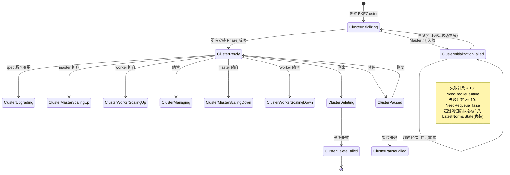
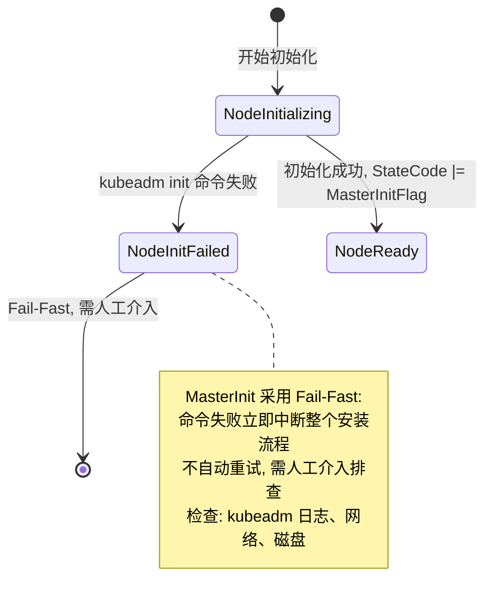
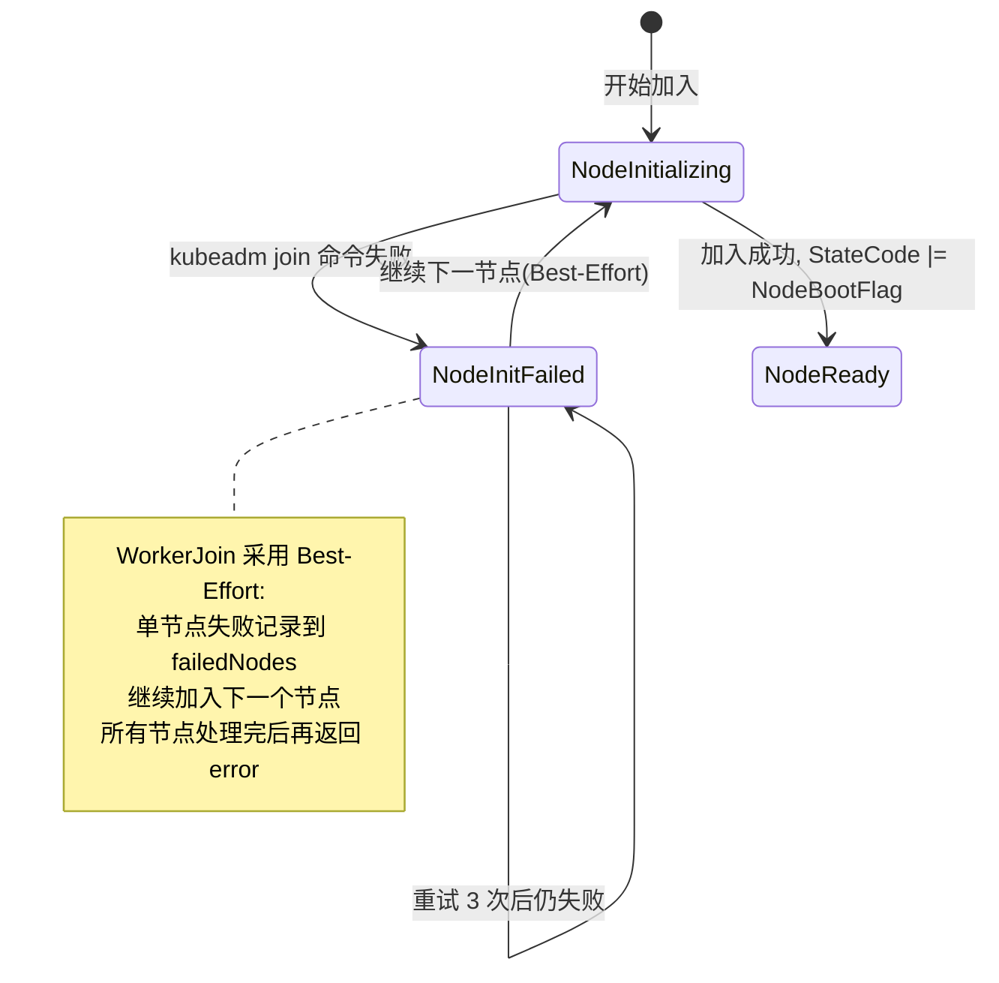
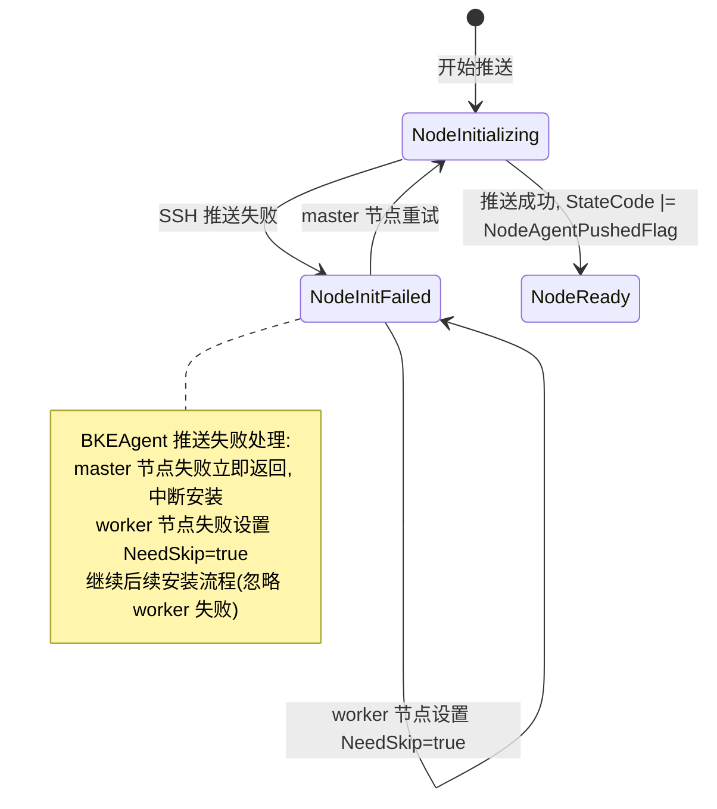
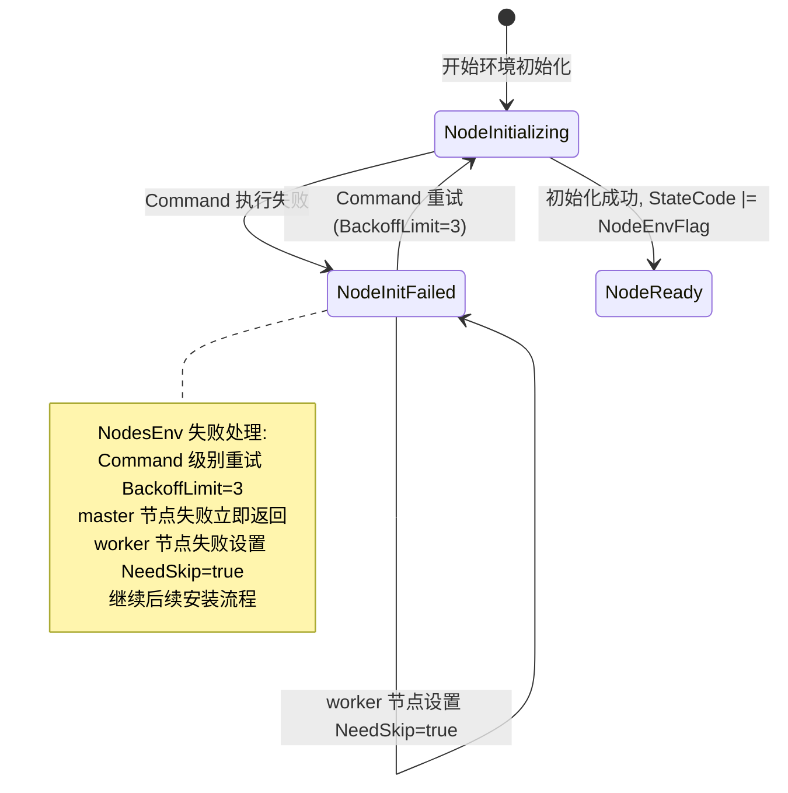

# 代码中实现的安装规格清单

> 本文档梳理 cluster-api-provider-bke 工程中安装相关的完整规格，覆盖安装场景、状态机、失败处理与重试机制四个维度。

---

## 目录

- [1. 安装场景规格](#1-安装场景规格)
  - [1.1 安装路径分类](#11-安装路径分类)
  - [1.2 Phase 入口与执行机制](#12-phase-入口与执行机制)
  - [1.3 各安装场景规格](#13-各安装场景规格)
  - [1.4 安装场景汇总](#14-安装场景汇总)
  - [1.5 关键设计约束](#15-关键设计约束)
- [2. 安装状态机规格](#2-安装状态机规格)
  - [2.1 状态定义](#21-状态定义)
  - [2.2 集群层状态机](#22-集群层状态机)
  - [2.3 节点层状态机](#23-节点层状态机)
  - [2.4 完整安装流程状态机](#24-完整安装流程状态机集群节点联动)
  - [2.5 状态切换规格汇总](#25-状态切换规格汇总)
- [3. 安装失败处理规格](#3-安装失败处理规格)
  - [3.1 失败策略分类](#31-失败策略分类)
  - [3.2 各Phase失败处理详情](#32-各phase失败处理详情)
  - [3.3 失败处理汇总](#33-失败处理汇总)
- [4. 安装重试规格](#4-安装重试规格)
  - [4.1 三层重试机制总览](#41-三层重试机制总览)
  - [4.2 各Phase重试配置](#42-各phase重试配置)
  - [4.3 重试幂等性保障](#43-重试幂等性保障)
  - [4.4 重试风险点](#44-重试风险点)
- [5. 运维操作规格](#5-运维操作规格)
  - [5.1 安装触发参数](#51-安装触发参数bkecluster-spec)
  - [5.2 安装运行时控制](#52-安装运行时控制bkecluster-annotations)
  - [5.3 安装操作手册](#53-安装操作手册)
  - [5.4 失败感知与初步判断](#54-失败感知与初步判断)
  - [5.5 失败信息采集清单](#55-失败信息采集清单)
  - [5.6 失败根因分类](#56-失败根因分类与-reason-映射)
  - [5.7 问题定位决策树](#57-问题定位决策树)
  - [5.8 恢复决策与操作路径](#58-恢复决策与操作路径)
  - [5.9 常见问题速查表](#59-常见问题速查表)
- [6. 关键结论](#6-关键结论)

---

## 1. 安装场景规格

### 1.1 安装路径分类

工程中安装分为两个阶段，共 16 个 Phase：

| 阶段 | Phase 数量 | 执行条件 | 覆盖范围 |
|------|-----------|---------|---------|
| **CommonPhases** | 5 个 | 所有场景都执行 | 前置判断（Finalizer、暂停、纳管、删除、DryRun） |
| **DeployPhases** | 11 个 | 集群部署时执行 | 实际安装流程（Agent、环境、证书、Master、Worker、Addon） |

**Phase 执行顺序**：

```
第一阶段: CommonPhases (所有场景都执行)
─────────────────────────────────────────
    ├── Phase 1: EnsureFinalizer
    ├── Phase 2: EnsurePaused
    ├── Phase 3: EnsureClusterManage
    ├── Phase 4: EnsureDeleteOrReset
    └── Phase 5: EnsureDryRun

第二阶段: DeployPhases (集群部署时执行)
─────────────────────────────────────────
    ├── Phase 6: EnsureBKEAgent
    ├── Phase 7: EnsureNodesEnv
    ├── Phase 8: EnsureClusterAPIObj
    ├── Phase 9: EnsureCerts
    ├── Phase 10: EnsureLoadBalance
    ├── Phase 11: EnsureMasterInit
    ├── Phase 12: EnsureMasterJoin
    ├── Phase 13: EnsureWorkerJoin
    ├── Phase 14: EnsureAddonDeploy
    ├── Phase 15: EnsureNodesPostProcess
    └── Phase 16: EnsureAgentSwitch
```

Phase 注册见 [list.go:35-69](file:///cluster-api-provider-bke/pkg/phaseframe/phases/list.go#L35-L69)。

### 1.2 Phase 入口与执行机制

#### 1.2.1 Phase 注册入口

**文件位置**：[pkg/phaseframe/phases/list.go](file:///cluster-api-provider-bke/pkg/phaseframe/phases/list.go)

**安装 Phase 入口**（L23-44）：

```go
// CommonPhases - 前置判断（5个）
CommonPhases = []func(ctx *phaseframe.PhaseContext) phaseframe.Phase{
    NewEnsureFinalizer,      // L24
    NewEnsurePaused,         // L25
    NewEnsureClusterManage,  // L26
    NewEnsureDeleteOrReset,  // L27
    NewEnsureDryRun,         // L28
}

// DeployPhases - 实际安装（11个）
DeployPhases = []func(ctx *phaseframe.PhaseContext) phaseframe.Phase{
    NewEnsureBKEAgent,           // L33
    NewEnsureNodesEnv,           // L34
    NewEnsureClusterAPIObj,      // L35
    NewEnsureCerts,              // L36
    NewEnsureLoadBalance,        // L37
    NewEnsureMasterInit,         // L38
    NewEnsureMasterJoin,         // L39  ← 也用于 Master 扩容
    NewEnsureWorkerJoin,         // L40  ← 也用于 Worker 扩容
    NewEnsureAddonDeploy,        // L41
    NewEnsureNodesPostProcess,   // L42
    NewEnsureAgentSwitch,        // L43
}
```

**升级 Phase 入口**（L48-78）：

```go
// DeclarativeInlineUpgradePhases - 声明式升级（6个）
DeclarativeInlineUpgradePhases = []func(ctx *phaseframe.PhaseContext) phaseframe.Phase{
    NewEnsurePreUpgradeResources,  // L56
    NewEnsureAgentUpgrade,         // L57
    NewEnsureContainerdUpgrade,    // L58
    NewEnsureEtcdUpgrade,          // L59
    NewEnsureMasterUpgrade,        // L60
    NewEnsureWorkerUpgrade,        // L61
}

// PostDeployPhases - 包含升级和缩容（11个）
PostDeployPhases = []func(ctx *phaseframe.PhaseContext) phaseframe.Phase{
    NewEnsureProviderSelfUpgrade,        // L67
    NewEnsureAgentUpgrade,               // L68
    NewEnsureContainerdUpgrade,          // L69
    NewEnsureEtcdUpgrade,                // L70
    NewEnsureWorkerUpgrade,              // L71
    NewEnsureMasterUpgrade,              // L72
    NewEnsureWorkerDelete,               // L73  ← Worker 缩容
    NewEnsureMasterDelete,               // L74  ← Master 缩容
    NewEnsureComponentUpgrade,           // L75
    NewEnsureClusterAPIManagerManifest,  // L76
    NewEnsureCluster,                    // L77
}
```

**扩容 Phase 入口**（L116-128）：

```go
// Master 扩容
ClusterScaleMasterUpPhaseNames = []confv1beta1.BKEClusterPhase{
    EnsureMasterJoinName,  // L120
}

// Worker 扩容
ClusterScaleWorkerUpPhaseNames = []confv1beta1.BKEClusterPhase{
    EnsureWorkerJoinName,  // L127
}
```

**缩容 Phase 入口**（L116-124）：

```go
// Master 缩容
ClusterScaleMasterDownPhaseNames = []confv1beta1.BKEClusterPhase{
    EnsureMasterDeleteName,  // L117
}

// Worker 缩容
ClusterScaleWorkerDownPhaseNames = []confv1beta1.BKEClusterPhase{
    EnsureWorkerDeleteName,  // L123
}
```

#### 1.2.2 Phase 执行入口

**文件位置**：[pkg/phaseframe/phases/phase_flow.go](file:///cluster-api-provider-bke/pkg/phaseframe/phases/phase_flow.go)

**Phase 计算入口**（L59-63）：

```go
func (p *PhaseFlow) CalculatePhase(old, new *bkev1beta1.BKECluster) error {
    phasesFuncs := p.determinePhasesFuncs()  // L60 - 确定使用哪些 Phase 列表
    p.calculateAndAddPhases(old, new, phasesFuncs)  // L61 - 计算需要执行的 Phase
    return p.ReportPhaseStatus()  // L62 - 上报 Phase 状态
}
```

**Phase 执行入口**（L158-166）：

```go
func (p *PhaseFlow) Execute() (ctrl.Result, error) {
    defer p.handlePanic()
    phases := p.determinePhases()  // L161 - 确定需要执行的 Phase
    go p.ctx.WatchBKEClusterStatus()  // L163 - 启动状态监控
    return p.executePhases(phases)  // L165 - 执行 Phase
}
```

**状态切换入口**（L322-356）：

```go
func calculateClusterStatusByPhase(phase phaseframe.Phase, err error) error {
    phaseName := phase.Name()
    ctx := phase.GetPhaseContext()

    switch {
    case phaseName.In(ClusterInitPhaseNames):           // L329 - 安装
        handleClusterInitPhase(ctx, err)
    case phaseName.In(ClusterScaleMasterUpPhaseNames):  // L331 - Master 扩容
        handleClusterScaleMasterUpPhase(ctx, err)
    case phaseName.In(ClusterScaleWorkerUpPhaseNames):  // L333 - Worker 扩容
        handleClusterScaleWorkerUpPhase(ctx, err)
    case phaseName.In(ClusterUpgradePhaseNames) || 
         phaseName.In(DeclarativeClusterUpgradePhaseNames):  // L343 - 升级
        handleClusterUpgradePhase(ctx, err)
    case phaseName.In(ClusterScaleMasterDownPhaseNames):  // L345 - Master 缩容
        handleClusterScaleMasterDownPhase(ctx, err)
    case phaseName.In(ClusterScaleWorkerDownPhaseNames):  // L347 - Worker 缩容
        handleClusterScaleWorkerDownPhase(ctx, err)
    // ... 其他场景
    }
}
```

#### 1.2.3 各场景 Phase 入口汇总

| 场景 | Phase 入口 | 文件位置 | 行号 |
|------|-----------|---------|------|
| **安装** | CommonPhases + DeployPhases | list.go | L23-44 |
| **升级** | DeclarativeInlineUpgradePhases + PostDeployPhases | list.go | L55-78 |
| **回滚** | 无专门 Phase，通过升级失败处理 | phase_flow.go | L422-428 |
| **Master 扩容** | EnsureMasterJoin | list.go | L119-121 |
| **Worker 扩容** | EnsureWorkerJoin | list.go | L126-128 |
| **Master 缩容** | EnsureMasterDelete | list.go | L116-118 |
| **Worker 缩容** | EnsureWorkerDelete | list.go | L122-124 |

**关键发现**：
- **扩容和安装共用 Phase**：`EnsureMasterJoin` 和 `EnsureWorkerJoin` 既用于首次安装，也用于后续扩容
- **回滚无专门 Phase**：回滚通过升级 Phase 的失败处理实现，失败时副本数回滚
- **状态切换统一入口**：`calculateClusterStatusByPhase()` 函数（L322）是所有场景状态切换的统一入口

### 1.3 各安装场景规格

#### 1.3.1 EnsureFinalizer（添加 Finalizer 保护）

**位置**：[ensure_finalizer.go](file:///cluster-api-provider-bke/pkg/phaseframe/phases/ensure_finalizer.go)

| 维度 | 规格 |
|------|------|
| 触发条件 | BKECluster 创建时自动执行 |
| 执行动作 | 添加 Finalizer 保护集群不被误删 |
| 幂等性 | 已存在则跳过 |
| 失败策略 | Requeue-Until-Success |
| 超时配置 | 60 秒 |
| 重试次数 | 无限制（自动重试） |

#### 1.3.2 EnsurePaused（暂停状态检查）

**位置**：[ensure_paused.go](file:///cluster-api-provider-bke/pkg/phaseframe/phases/ensure_paused.go)

| 维度 | 规格 |
|------|------|
| 触发条件 | BKECluster 创建时自动执行 |
| 执行动作 | 检查集群是否被暂停管理 |
| 幂等性 | 已暂停则跳过后续 Phase |
| 失败策略 | Skip-Or-Judge |
| 超时配置 | 60 秒 |
| 重试次数 | 无限制（自动重试） |

#### 1.3.3 EnsureClusterManage（纳管判断）

**位置**：[ensure_cluster_manage.go](file:///cluster-api-provider-bke/pkg/phaseframe/phases/ensure_cluster_manage.go)

| 维度 | 规格 |
|------|------|
| 触发条件 | BKECluster 创建时自动执行 |
| 执行动作 | 判断是否纳管现有集群 |
| 幂等性 | 已纳管则跳过后续 Phase |
| 失败策略 | Skip-Or-Judge |
| 超时配置 | 60 秒 |
| 重试次数 | 无限制（自动重试） |

#### 1.3.4 EnsureDeleteOrReset（删除/重置判断）

**位置**：[ensure_delete_or_reset.go](file:///cluster-api-provider-bke/pkg/phaseframe/phases/ensure_delete_or_reset.go)

| 维度 | 规格 |
|------|------|
| 触发条件 | BKECluster 创建时自动执行 |
| 执行动作 | 判断是否删除或重置集群 |
| 幂等性 | 已删除则跳过后续 Phase |
| 失败策略 | Skip-Or-Judge |
| 超时配置 | 60 秒 |
| 重试次数 | 无限制（自动重试） |

#### 1.3.5 EnsureDryRun（DryRun 试运行模式）

**位置**：[ensure_dry_run.go](file:///cluster-api-provider-bke/pkg/phaseframe/phases/ensure_dry_run.go)

| 维度 | 规格 |
|------|------|
| 触发条件 | BKECluster 创建时自动执行 |
| 执行动作 | DryRun 试运行模式 |
| 幂等性 | DryRun 模式下跳过实际操作 |
| 失败策略 | Skip-Or-Judge |
| 超时配置 | 60 秒 |
| 重试次数 | 无限制（自动重试） |

#### 1.3.6 EnsureBKEAgent（Agent 推送）

**位置**：[ensure_bke_agent.go:63-96](file:///cluster-api-provider-bke/pkg/phaseframe/phases/ensure_bke_agent.go#L63-L96)

| 维度 | 规格 |
|------|------|
| 触发条件 | `HasNodesNeedingPhase(bkeNodes, NodeAgentPushedFlag)` 返回 true |
| 执行动作 | SSH 推送 bkeagent 二进制、证书、service 文件到所有节点 |
| 节点范围 | 全部 BKENodes（master + worker） |
| 架构发现 | `RegisterHostsInfo` 自动检测 amd64/arm64 |
| 失败策略 | master 节点失败立即返回；worker 节点失败标记 NeedSkip=true，继续安装 |
| 二进制备份 | 推送前执行 `rm -rf /usr/local/bin/bkeagent*` |
| 健康验证 | 推送后 `PingBKEAgentOnNodes` 验证 agent 可达 |
| 超时配置 | 600 秒（10 分钟） |
| 重试次数 | 3 次（节点级重试） |

#### 1.3.7 EnsureNodesEnv（节点环境初始化）

**位置**：[ensure_nodes_env.go:351-388](file:///cluster-api-provider-bke/pkg/phaseframe/phases/ensure_nodes_env.go#L351-L388)

| 维度 | 规格 |
|------|------|
| 触发条件 | `HasNodesNeedingPhase(bkeNodes, NodeEnvFlag)` 返回 true |
| 执行动作 | 创建 Command CRD 执行环境初始化脚本 |
| 脚本列表 | file-downloader、package-downloader、install-lxcfs、install-nfsutils、install-etcdctl、install-helm、install-calicoctl、update-runc、clean-docker-images |
| 节点过滤 | 跳过 Failed、Deleting、NeedSkip、Agent 未就绪的节点 |
| 失败策略 | 部分失败时标记节点 NodeInitFailed，worker 节点设置 NeedSkip=true |
| 超时配置 | 从 `GetBootTimeOut` 获取（默认 600-1200 秒） |
| 重试次数 | Command 级别 BackoffLimit=3 |

#### 1.3.8 EnsureClusterAPIObj（Cluster API 对象创建）

**位置**：[ensure_cluster_api_obj.go](file:///cluster-api-provider-bke/pkg/phaseframe/phases/ensure_cluster_api_obj.go)

| 维度 | 规格 |
|------|------|
| 触发条件 | Cluster API 对象未创建 |
| 执行动作 | 创建 Cluster、Machine、MachineDeployment 等 CRD 对象 |
| 幂等性 | 已存在则跳过 |
| 失败策略 | Requeue-Until-Success |
| 超时配置 | 300 秒（5 分钟） |
| 重试次数 | 无限制（自动重试） |

#### 1.3.9 EnsureCerts（证书生成）

**位置**：[ensure_certs.go](file:///cluster-api-provider-bke/pkg/phaseframe/phases/ensure_certs.go)

| 维度 | 规格 |
|------|------|
| 触发条件 | 证书 Secret 不存在或即将过期（<30 天） |
| 执行动作 | 生成 CA、Etcd、Kubernetes 等证书并存储到 Secret |
| 幂等性 | 已存在且有效则跳过 |
| 失败策略 | Requeue-Until-Success |
| 超时配置 | 300 秒（5 分钟） |
| 重试次数 | 无限制（自动重试） |

#### 1.3.10 EnsureLoadBalance（负载均衡配置）

**位置**：[ensure_load_balance.go](file:///cluster-api-provider-bke/pkg/phaseframe/phases/ensure_load_balance.go)

| 维度 | 规格 |
|------|------|
| 触发条件 | 负载均衡未配置 |
| 执行动作 | 配置集群入口负载均衡（VIP、健康检查） |
| 幂等性 | 已配置则跳过 |
| 失败策略 | Requeue-Until-Success |
| 超时配置 | 300 秒（5 分钟） |
| 重试次数 | 无限制（自动重试） |

#### 1.3.11 EnsureMasterInit（Master 初始化）

**位置**：[ensure_master_init.go:473-531](file:///cluster-api-provider-bke/pkg/phaseframe/phases/ensure_master_init.go#L473-L531)

| 维度 | 规格 |
|------|------|
| 触发条件 | `!conditions.IsTrue(Cluster, ControlPlaneInitializedCondition)` |
| 执行动作 | 创建 kubeadm init Command，轮询等待初始化完成 |
| 节点范围 | 第一个 Master 节点 |
| 轮询间隔 | 1 秒 |
| 轮询超时 | 从 `GetBootTimeOut` 获取（默认 900 秒/15 分钟） |
| 失败策略 | **Fail-Fast**：命令失败立即返回，需人工介入 |
| 日志输出频率 | 每 10 次轮询输出一次 |
| 超时配置 | 900 秒（15 分钟） |
| 重试次数 | 0（不重试，需人工介入） |

#### 1.3.12 EnsureMasterJoin（Master 加入）

**位置**：[ensure_master_join.go](file:///cluster-api-provider-bke/pkg/phaseframe/phases/ensure_master_join.go)

| 维度 | 规格 |
|------|------|
| 触发条件 | 存在未加入的 Master 节点 |
| 执行动作 | 创建 kubeadm join Command，等待加入完成 |
| 节点范围 | 除第一个 Master 外的其他 Master 节点 |
| 失败策略 | Per-Node-Retry：单节点失败重试 3 次 |
| 超时配置 | 600 秒（10 分钟） |
| 重试次数 | 3 次（节点级重试） |

#### 1.3.13 EnsureWorkerJoin（Worker 加入）

**位置**：[ensure_worker_join.go](file:///cluster-api-provider-bke/pkg/phaseframe/phases/ensure_worker_join.go)

| 维度 | 规格 |
|------|------|
| 触发条件 | 存在未加入的 Worker 节点 |
| 执行动作 | 创建 kubeadm join Command，等待加入完成 |
| 节点范围 | 所有 Worker 节点 |
| 失败策略 | **Best-Effort**：单节点失败记录到 failedNodes，继续其他节点 |
| 超时配置 | 600 秒（10 分钟） |
| 重试次数 | 3 次（节点级重试） |

#### 1.3.14 EnsureAddonDeploy（Addon 组件部署）

**位置**：[ensure_addon_deploy.go](file:///cluster-api-provider-bke/pkg/phaseframe/phases/ensure_addon_deploy.go)

| 维度 | 规格 |
|------|------|
| 触发条件 | Addon 组件未部署 |
| 执行动作 | 部署 coredns、kube-proxy 等 Addon 组件 |
| 幂等性 | 已部署则跳过 |
| 失败策略 | Requeue-Until-Success |
| 超时配置 | 600 秒（10 分钟） |
| 重试次数 | 无限制（自动重试） |

#### 1.3.15 EnsureNodesPostProcess（节点后置处理）

**位置**：[ensure_nodes_postprocess.go](file:///cluster-api-provider-bke/pkg/phaseframe/phases/ensure_nodes_postprocess.go)

| 维度 | 规格 |
|------|------|
| 触发条件 | 节点后置处理未完成 |
| 执行动作 | 设置节点标签、污点等 |
| 幂等性 | 已处理则跳过 |
| 失败策略 | **Ignore-And-Continue**：失败不影响集群功能 |
| 超时配置 | 300 秒（5 分钟） |
| 重试次数 | 0-1 次（快速失败或跳过） |

#### 1.3.16 EnsureAgentSwitch（Agent 监听模式切换）

**位置**：[ensure_agent_switch.go](file:///cluster-api-provider-bke/pkg/phaseframe/phases/ensure_agent_switch.go)

| 维度 | 规格 |
|------|------|
| 触发条件 | Agent 监听模式未切换 |
| 执行动作 | 切换 bkeagent 监听目标（从管理集群切换到目标集群） |
| 幂等性 | 已切换则跳过 |
| 失败策略 | Requeue-Until-Success |
| 超时配置 | 300 秒（5 分钟） |
| 重试次数 | 无限制（自动重试） |

### 1.4 安装场景汇总

| Phase | 触发条件 | 失败策略 | 超时 | 重试次数 | 节点范围 |
|-------|---------|---------|------|---------|---------|
| EnsureFinalizer | 自动执行 | Requeue | 60s | 无限制 | N/A |
| EnsurePaused | 自动执行 | Skip-Or-Judge | 60s | 无限制 | N/A |
| EnsureClusterManage | 自动执行 | Skip-Or-Judge | 60s | 无限制 | N/A |
| EnsureDeleteOrReset | 自动执行 | Skip-Or-Judge | 60s | 无限制 | N/A |
| EnsureDryRun | 自动执行 | Skip-Or-Judge | 60s | 无限制 | N/A |
| **EnsureBKEAgent** | Agent 未推送 | Per-Node-Retry | 600s | 3 | 全部节点 |
| **EnsureNodesEnv** | 环境未初始化 | Command-Retry | 600-1200s | 3 | Agent 就绪节点 |
| EnsureClusterAPIObj | 对象未创建 | Requeue | 300s | 无限制 | N/A |
| EnsureCerts | 证书未生成 | Requeue | 300s | 无限制 | N/A |
| EnsureLoadBalance | 负载均衡未配置 | Requeue | 300s | 无限制 | N/A |
| **EnsureMasterInit** | 控制面未初始化 | **Fail-Fast** | 900s | **0** | 第一个 Master |
| **EnsureMasterJoin** | Master 未加入 | Per-Node-Retry | 600s | 3 | 其他 Master |
| **EnsureWorkerJoin** | Worker 未加入 | **Best-Effort** | 600s | 3 | 所有 Worker |
| EnsureAddonDeploy | Addon 未部署 | Requeue | 600s | 无限制 | N/A |
| EnsureNodesPostProcess | 后置处理未完成 | **Ignore-And-Continue** | 300s | 0-1 | 所有节点 |
| EnsureAgentSwitch | Agent 未切换 | Requeue | 300s | 无限制 | 所有节点 |

### 1.5 关键设计约束

1. **Master 初始化采用 Fail-Fast**：MasterInit 失败不自动重试，需人工介入排查 kubeadm 日志、网络、磁盘等问题
2. **Worker 加入采用 Best-Effort**：WorkerJoin 失败不影响其他节点，最大化安装进度
3. **证书生成自动重试**：Certs 失败后无限重试，直到成功或人工介入
4. **节点环境初始化命令级重试**：NodesEnv 通过 Command CRD 的 BackoffLimit 控制重试次数
5. **节点状态标记避免重复执行**：通过 StateCode 位标记（NodeAgentPushedFlag、NodeEnvFlag 等）实现幂等性
6. **超时配置动态获取**：通过 `GetBootTimeOut` 从 BKECluster 配置获取超时时间，支持自定义

---

## 2. 安装状态机规格

### 2.1 状态定义

#### 2.1.1 集群状态（ClusterStatus）

**位置**：[api/capbke/v1beta1/bkecluster_consts.go:152-182](file:///cluster-api-provider-bke/api/capbke/v1beta1/bkecluster_consts.go#L152-L182)

| 常量 | 值 | 类别 |
|------|----|------|
| `ClusterReady` | Ready | 正常态 |
| `ClusterUnhealthy` | Unhealthy | 异常态 |
| `ClusterUnknown` | Unknown | 异常态 |
| `ClusterChecking` | Checking | 中间态 |
| **`ClusterInitializing`** | **Initializing** | **安装中间态** |
| **`ClusterInitializationFailed`** | **InitializationFailed** | **安装失败态** |
| `ClusterUpgrading` | Upgrading | 升级中间态 |
| `ClusterUpgradeFailed` | UpgradeFailed | 升级失败态 |
| `ClusterMasterScalingUp` | ScalingMasterNodesUp | 扩容中间态 |
| `ClusterMasterScalingDown` | ScalingMasterNodesDown | 缩容中间态 |
| `ClusterWorkerScalingUp` | ScalingWorkerNodesUp | 扩容中间态 |
| `ClusterWorkerScalingDown` | ScalingWorkerNodesDown | 缩容中间态 |
| `ClusterScaleFailed` | ScaleFailed | 扩缩容失败态 |
| `ClusterManaging` | Managing | 纳管中间态 |
| `ClusterManageFailed` | ManageFailed | 纳管失败态 |

#### 2.1.2 集群健康状态（ClusterHealthState）

**位置**：[api/capbke/v1beta1/bkecluster_consts.go:222-230](file:///cluster-api-provider-bke/api/capbke/v1beta1/bkecluster_consts.go#L222-L230)

| 常量 | 值 | 用途 |
|------|----|------|
| **`Deploying`** | **Deploying** | **部署中** |
| **`DeployFailed`** | **DeployFailed** | **部署失败** |
| `Upgrading` | Upgrading | 升级中 |
| `UpgradeFailed` | UpgradeFailed | 升级失败 |
| `Managing` | Managing | 纳管中 |
| `ManageFailed` | ManageFailed | 纳管失败 |
| `Unhealthy` | Unhealthy | 不健康 |
| `Healthy` | Healthy | 健康 |
| `Deleting` | Deleting | 删除中 |

#### 2.1.3 节点状态（NodeState）

**位置**：[api/bkecommon/v1beta1/bkenode_types.go:36-42](file:///cluster-api-provider-bke/api/bkecommon/v1beta1/bkenode_types.go#L36-L42) + [api/capbke/v1beta1/bkecluster_consts.go:197-218](file:///cluster-api-provider-bke/api/capbke/v1beta1/bkecluster_consts.go#L197-L218)

| 常量 | 值 | 安装场景用途 |
|------|----|-------------|
| `NodePending` | Pending | 等待中 |
| **`NodeInitializing`** | **Initializing** | **节点初始化中** |
| **`NodeInitFailed`** | **InitFailed** | **节点初始化失败** |
| `NodeBootStrapping` | BootStrapping | 引导中 |
| `NodeBootStrapFailed` | BootStrapFailed | 引导失败 |
| **`NodeReady`** | **Ready** | **节点就绪** |
| `NodeNotReady` | NotReady | 节点未就绪 |
| `NodeUpgrading` | Upgrading | 升级中 |
| `NodeUpgradeFailed` | UpgradeFailed | 升级失败 |
| `NodeFailed` | Failed | 节点失败 |
| `NodeDeleting` | Deleting | 删除中 |
| `NodeProvisioned` | Provisioned | 已配置 |

#### 2.1.4 节点 StateCode 位标记

**位置**：[api/capbke/v1beta1/bkecluster_consts.go:233-246](file:///cluster-api-provider-bke/api/capbke/v1beta1/bkecluster_consts.go#L233-L246)

```go
const (
    NodeAgentPushedFlag   = 1 << iota  // bit 0 = 1    (EnsureBKEAgent 阶段)
    NodeAgentReadyFlag                 // bit 1 = 2    (bkeagent 健康检查通过)
    NodeEnvFlag                        // bit 2 = 4    (EnsureNodesEnv 阶段)
    NodeBootFlag                       // bit 3 = 8    (bootstrap 命令成功)
    NodeHAFlag                         // bit 4 = 16   (高可用标记)
    MasterInitFlag                     // bit 5 = 32   (master init 完成)
    NodeDeletingFlag                   // bit 6 = 64   (节点删除中)
    NodeFailedFlag                     // bit 7 = 128  (节点失败)
    NodeStateNeedRecord                // bit 8 = 256  (状态需要记录)
    NodePostProcessFlag                // bit 9 = 512  (后处理完成)
)
```

**关键常量**:
```go
bootstrapReadyStateCode = 527  // = 1+2+4+8+32+256+128 = bits 0,1,2,3,5,7,8
```

### 2.2 集群层状态机

#### 2.2.1 完整状态流转图



#### 2.2.2 安装状态切换规则

**位置**：[phase_flow.go:319-327](file:///cluster-api-provider-bke/pkg/phaseframe/phases/phase_flow.go#L319-L327)

```go
func handleClusterInitPhase(ctx *phaseframe.PhaseContext, err error) {
    if err != nil {
        ctx.BKECluster.Status.ClusterStatus = bkev1beta1.ClusterInitializationFailed
    } else {
        ctx.BKECluster.Status.ClusterStatus = bkev1beta1.ClusterInitializing
    }
}
```

**触发 Phase 范围**：

| Phase 列表 | 包含 Phase |
|------------|-----------|
| `ClusterInitPhaseNames` | EnsureBKEAgent、EnsureNodesEnv、EnsureClusterAPIObj、EnsureCerts、EnsureLoadBalance、EnsureMasterInit、EnsureMasterJoin、EnsureWorkerJoin、EnsureAddonDeploy、EnsureNodesPostProcess、EnsureAgentSwitch |

#### 2.2.3 集群状态映射

**位置**：[phase_flow.go:319-327](file:///cluster-api-provider-bke/pkg/phaseframe/phases/phase_flow.go#L319-L327)

| Phase 范围 | 成功状态 | 失败状态 |
|------------|----------|----------|
| `ClusterInitPhaseNames` | ClusterInitializing | ClusterInitializationFailed |

### 2.3 节点层状态机

#### 2.3.1 MasterInit 节点状态机

**位置**：[ensure_master_init.go:473-531](file:///cluster-api-provider-bke/pkg/phaseframe/phases/ensure_master_init.go#L473-L531)



**状态切换代码**：

```go
// 初始化中
nodeFetcher.SetNodeStateWithMessageForCluster(..., bkev1beta1.NodeInitializing, "Initializing master")

// 初始化成功
nodeFetcher.MarkNodeStateFlagForCluster(..., bkev1beta1.MasterInitFlag)
nodeFetcher.SetNodeStateWithMessageForCluster(..., bkev1beta1.NodeReady, "Master init success")

// 初始化失败
nodeFetcher.SetNodeStateWithMessageForCluster(..., bkev1beta1.NodeInitFailed, err.Error())
```

#### 2.3.2 WorkerJoin 节点状态机

**位置**：[ensure_worker_join.go](file:///cluster-api-provider-bke/pkg/phaseframe/phases/ensure_worker_join.go)



#### 2.3.3 BKEAgent 推送节点状态机

**位置**：[ensure_bke_agent.go:252-317](file:///cluster-api-provider-bke/pkg/phaseframe/phases/ensure_bke_agent.go#L252-L317)



#### 2.3.4 NodesEnv 节点状态机

**位置**：[ensure_nodes_env.go:257-314](file:///cluster-api-provider-bke/pkg/phaseframe/phases/ensure_nodes_env.go#L257-L314)



### 2.4 完整安装流程状态机（集群+节点联动）

```mermaid
stateDiagram-v2
    direction TB
    [*] --> ClusterInitializing: 创建 BKECluster
    
    ClusterInitializing --> CommonPhases: 开始安装
    
    state CommonPhases {
        direction TB
        [*] --> EnsureFinalizer
        EnsureFinalizer --> EnsurePaused
        EnsurePaused --> EnsureClusterManage
        EnsureClusterManage --> EnsureDeleteOrReset
        EnsureDeleteOrReset --> EnsureDryRun
        EnsureDryRun --> [*]
    }
    
    CommonPhases --> DeployPhases: 通过前置判断
    
    state DeployPhases {
        direction TB
        [*] --> EnsureBKEAgent
        EnsureBKEAgent --> EnsureNodesEnv
        EnsureNodesEnv --> EnsureClusterAPIObj
        EnsureClusterAPIObj --> EnsureCerts
        EnsureCerts --> EnsureLoadBalance
        EnsureLoadBalance --> EnsureMasterInit
        EnsureMasterInit --> EnsureMasterJoin
        EnsureMasterJoin --> EnsureWorkerJoin
        EnsureWorkerJoin --> EnsureAddonDeploy
        EnsureAddonDeploy --> EnsureNodesPostProcess
        EnsureNodesPostProcess --> EnsureAgentSwitch
        EnsureAgentSwitch --> [*]
    }
    
    state EnsureBKEAgent {
        direction TB
        [*] --> Agent推送中
        Agent推送中 --> Agent成功: SSH 推送+Ping 成功
        Agent推送中 --> Agent失败: master 失败中断
        Agent成功 --> [*]
        Agent失败 --> [*]
    }
    
    state EnsureMasterInit {
        direction TB
        [*] --> Master初始化中
        Master初始化中 --> Master成功: kubeadm init 成功
        Master初始化中 --> Master失败: 命令失败(Fail-Fast)
        Master成功 --> [*]
        Master失败 --> [*]
    }
    
    state EnsureWorkerJoin {
        direction TB
        [*] --> Worker节点1加入
        Worker节点1加入 --> Worker节点2加入: 成功或失败都继续
        Worker节点2加入 --> Worker节点N加入: 成功或失败都继续
        Worker节点N加入 --> Worker汇总: 全部处理完
        Worker汇总 --> Worker成功: 无失败节点
        Worker汇总 --> Worker部分失败: 有失败节点
        Worker成功 --> [*]
        Worker部分失败 --> [*]
    }
    
    DeployPhases --> ClusterReady: 所有 Phase 成功
    DeployPhases --> ClusterInitializationFailed: MasterInit 失败
    
    ClusterInitializationFailed --> ClusterInitializing: StatusManager 重试(<10次)
    ClusterInitializationFailed --> ClusterInitializationFailed: 超过10次, 暂停
    
    note right of ClusterInitializationFailed
        重试规则:
        1. workqueue 限速器: 2s×10次, 60s×N次
        2. StatusManager: 同状态失败<10次,NeedRequeue=true
        3. 超过10次: NeedRequeue=false,暂停调谐
        4. retry 注解: 清除失败标记,恢复调谐
    end note
```



### 2.5 状态切换规格汇总

| 层次 | 状态 | 触发条件 | 设置位置 |
|------|------|----------|----------|
| 集群 | `ClusterInitializing` | 安装 Phase 开始执行 | phase_flow.go:326 |
| 集群 | `ClusterInitializationFailed` | MasterInit Phase 返回 error | phase_flow.go:324 |
| 集群 | `ClusterReady` | 所有安装 Phase 成功 | ensure_cluster.go:149 |
| 集群 | `Deploying`(HealthState) | 首次部署 | bkecluster_controller.go:765 |
| 集群 | `DeployFailed`(HealthState) | 失败超 10 次 | statusmanager.go:210 |
| 节点 | `NodeInitializing` | BKEAgent/NodesEnv 开始 | ensure_bke_agent.go:185 |
| 节点 | `NodeInitFailed` | BKEAgent/NodesEnv 失败 | ensure_bke_agent.go:261 |
| 节点 | `NodeReady` | MasterInit 成功 | ensure_master_init.go:529 |
| 节点 | `MasterInitFlag`(StateCode) | MasterInit 成功 | ensure_master_init.go:528 |
| 节点 | `NodeAgentPushedFlag`(StateCode) | BKEAgent 推送成功 | ensure_bke_agent.go:295 |
| 节点 | `NodeEnvFlag`(StateCode) | NodesEnv 成功 | ensure_nodes_env.go:268 |
| 节点 | `NodeBootFlag`(StateCode) | WorkerJoin 成功 | ensure_worker_join.go:xxx |

---

## 3. 安装失败处理规格

### 3.1 失败策略分类

工程中安装失败处理分为五种策略：

| 策略 | 标识 | 说明 | 适用 Phase |
|------|------|------|-----------|
| **Fail-Fast** | 立即中断 | 遇到错误立即中断流程，不自动重试，需人工介入 | EnsureMasterInit |
| **Best-Effort** | 尽力而为 | 遇到错误记录失败，继续处理其他资源，最后统一报告 | EnsureWorkerJoin |
| **Requeue-Until-Success** | 持续重试 | 临时性错误，自动重试直到成功 | EnsureCerts、EnsureClusterAPIObj、EnsureLoadBalance、EnsureAddonDeploy、EnsureAgentSwitch |
| **Per-Node-Retry** | 节点级重试 | 单节点失败可重试，但不影响其他节点 | EnsureBKEAgent、EnsureMasterJoin |
| **Ignore-And-Continue** | 忽略继续 | 非关键操作，失败不影响集群功能 | EnsureNodesPostProcess |

### 3.2 各 Phase 失败处理详情

#### 3.2.1 EnsureMasterInit 失败（Fail-Fast）

**位置**：[ensure_master_init.go:523-528](file:///cluster-api-provider-bke/pkg/phaseframe/phases/ensure_master_init.go#L523-L528)

| 维度 | 规格 |
|------|------|
| 失败检测 | `wait.PollImmediateUntil` 返回 error 或超时 |
| 回滚动作 | **无**。仅标记 `NodeInitFailed` |
| 失败策略 | **Fail-Fast**：立即 return，中断整个安装流程 |
| 节点状态标记 | `NodeInitFailed` + 错误消息 |
| 人工恢复路径 | 检查 kubeadm 日志、网络、磁盘、资源，手动重试 |

```go
if err != nil {
    if errors.Is(err, wait.ErrWaitTimeout) {
        return ctrl.Result{}, errors.Errorf("Wait master init failed")
    }
    return ctrl.Result{}, err  // 立即中断
}
```

#### 3.2.2 EnsureWorkerJoin 失败（Best-Effort）

**位置**：[ensure_worker_join.go](file:///cluster-api-provider-bke/pkg/phaseframe/phases/ensure_worker_join.go)

| 维度 | 规格 |
|------|------|
| 失败检测 | `upgradeNode` 返回 error |
| 回滚动作 | **无**。仅标记 `NodeInitFailed` |
| 失败策略 | **Best-Effort**：记录到 `failedNodes`，继续下一节点 |
| 节点状态标记 | `NodeInitFailed` + 错误消息 |
| 人工恢复路径 | 手动重试该节点加入 |

```go
if err := e.joinNode(node, remoteNode); err != nil {
    failedNodes = append(failedNodes, phaseutil.NodeInfo(node))
    params.Log.Warn(constant.WorkerJoinFailedReason, "join node %q failed: %v", ...)
    nodeFetcher.SetNodeStateWithMessage(..., bkev1beta1.NodeInitFailed, err.Error())
    continue  // 继续下一节点
}
```

#### 3.2.3 EnsureBKEAgent 失败（Per-Node-Retry）

**位置**：[ensure_bke_agent.go:274-317](file:///cluster-api-provider-bke/pkg/phaseframe/phases/ensure_bke_agent.go#L274-L317)

| 维度 | 规格 |
|------|------|
| 失败检测 | `sshPushAgent` 返回 failedNodeIPs |
| 回滚动作 | **无**。标记失败节点 |
| master 节点失败 | 立即返回 error，中断安装 |
| worker 节点失败 | 标记 `NeedSkip=true`，继续安装 |
| 节点状态标记 | `NodeInitFailed` + 错误消息 |
| 人工恢复路径 | 检查 SSH 连接、网络、磁盘空间 |

```go
// 有 master 节点没有成功返回
for _, nodeIP := range failedNodeIPs {
    if e.needPushNodes.Master().Filter(bkenode.FilterOptions{"IP": nodeIP}).Length() != 0 {
        e.Ctx.Log.Warn(constant.BKEAgentNotReadyReason, "Push agent to master node failed, process exit")
        return errors.Errorf("Push agent to master node failed, process exit")  // 立即中断
    }
}

// 逻辑调整，安装过程中忽略 worker 节点失败的情况，继续后面的安装流程
e.Ctx.Log.Info(constant.BKEAgentUpdatingReason, "at push bkeagent state, failed nodes: %v", failedNodeIPs)
```

#### 3.2.4 EnsureNodesEnv 失败（Command-Retry）

**位置**：[ensure_nodes_env.go:285-314](file:///cluster-api-provider-bke/pkg/phaseframe/phases/ensure_nodes_env.go#L285-L314)

| 维度 | 规格 |
|------|------|
| 失败检测 | `envCmd.Wait()` 返回 failedNodes |
| 回滚动作 | **无**。标记失败节点 |
| 失败策略 | Command 级别重试 BackoffLimit=3 |
| master 节点失败 | 立即返回 error，中断安装 |
| worker 节点失败 | 标记 `NeedSkip=true`，继续安装 |
| 节点状态标记 | `NodeInitFailed` + 错误消息 |
| 人工恢复路径 | 检查脚本执行日志、依赖包下载、磁盘空间 |

```go
for _, node := range failedNodes {
    nodeIP := phaseutil.GetNodeIPFromCommandWaitResult(node)
    if err := nodeFetcher.UpdateNodeStatusByIPForCluster(..., func(status *confv1beta1.BKENodeStatus) {
        status.State = bkev1beta1.NodeInitFailed
        status.Message = "Failed to check k8s env"
        if workerNodes.Filter(bkenode.FilterOptions{"IP": nodeIP}).Length() > 0 {
            status.NeedSkip = true  // worker 节点设置 NeedSkip
        }
    }); err != nil { ... }
}
```

### 3.3 失败处理汇总

| Phase | 失败策略 | 版本回滚 | 备份机制 | 自动恢复 | 节点最终状态 | 人工干预 |
|-------|:--------:|:--------:|:--------:|:--------:|--------------|:--------:|
| EnsureFinalizer | Requeue | ❌ | ❌ | ✅ | N/A | 不需要 |
| EnsurePaused | Skip | ❌ | ❌ | ✅ | N/A | 不需要 |
| EnsureClusterManage | Skip | ❌ | ❌ | ✅ | N/A | 不需要 |
| EnsureDeleteOrReset | Skip | ❌ | ❌ | ✅ | N/A | 不需要 |
| EnsureDryRun | Skip | ❌ | ❌ | ✅ | N/A | 不需要 |
| **EnsureBKEAgent** | Per-Node-Retry | ❌ | ❌ | ❌ | InitFailed | 需要（master） |
| **EnsureNodesEnv** | Command-Retry | ❌ | ❌ | ❌ | InitFailed | 需要（master） |
| EnsureClusterAPIObj | Requeue | ❌ | ❌ | ✅ | N/A | 不需要 |
| EnsureCerts | Requeue | ❌ | ❌ | ✅ | N/A | 不需要 |
| EnsureLoadBalance | Requeue | ❌ | ❌ | ✅ | N/A | 不需要 |
| **EnsureMasterInit** | **Fail-Fast** | ❌ | ❌ | ❌ | **InitFailed** | **必须** |
| **EnsureMasterJoin** | Per-Node-Retry | ❌ | ❌ | ❌ | InitFailed | 需要 |
| **EnsureWorkerJoin** | **Best-Effort** | ❌ | ❌ | ❌ | InitFailed | 需要 |
| EnsureAddonDeploy | Requeue | ❌ | ❌ | ✅ | N/A | 不需要 |
| EnsureNodesPostProcess | **Ignore-And-Continue** | ❌ | ❌ | ❌ | N/A | 不需要 |
| EnsureAgentSwitch | Requeue | ❌ | ❌ | ✅ | N/A | 不需要 |

---

## 4. 安装重试规格

### 4.1 三层重试机制总览

安装失败返回 error 后，调谐器会通过 **三层机制** 处理重试：

| 层次 | 机制 | 触发对象 | 控制参数 | 实现位置 |
|------|------|----------|----------|----------|
| L1 | **controller-runtime workqueue 限速重试** | 单次 reconcile 失败 | FastSlowRateLimiter | [cmd/capbke/main.go:481-486](file:///cluster-api-provider-bke/cmd/capbke/main.go#L481-L486) |
| L2 | **StatusManager 失败计数 + 状态回滚** | BKECluster 状态级 | `ReconcileAllowedFailedCount` (默认10) | [pkg/statusmanage/statusmanager.go:175-215](file:///cluster-api-provider-bke/pkg/statusmanage/statusmanager.go#L175-L215) |
| L3 | **RetryAnnotation 手动重试** | 失败节点级 | 注解 `annotation.RetryAnnotationKey` | [bkecluster_controller.go:660-738](file:///cluster-api-provider-bke/controllers/capbke/bkecluster_controller.go#L660-L738) |

### 4.2 各 Phase 重试配置

| Phase | BackoffLimit | ActiveDeadlineSecond | BackoffDelay | Requeue 策略 |
|-------|:------------:|:--------------------:|:------------:|--------------|
| EnsureFinalizer | 0 | 60 | 0 | 自动重试 |
| EnsurePaused | 0 | 60 | 0 | 自动重试 |
| EnsureClusterManage | 0 | 60 | 0 | 自动重试 |
| EnsureDeleteOrReset | 0 | 60 | 0 | 自动重试 |
| EnsureDryRun | 0 | 60 | 0 | 自动重试 |
| **EnsureBKEAgent** | **3** | **600** | **5** | 节点级重试 |
| **EnsureNodesEnv** | **3** | **600-1200** | **0** | Command 级重试 |
| EnsureClusterAPIObj | 0 | 300 | 0 | 自动重试 |
| EnsureCerts | 0 | 300 | 0 | 自动重试 |
| EnsureLoadBalance | 0 | 300 | 0 | 自动重试 |
| **EnsureMasterInit** | **0** | **900** | **0** | **不重试** |
| **EnsureMasterJoin** | **3** | **600** | **10** | 节点级重试 |
| **EnsureWorkerJoin** | **3** | **600** | **10** | 节点级重试 |
| EnsureAddonDeploy | 0 | 600 | 0 | 自动重试 |
| EnsureNodesPostProcess | 0-1 | 300 | 0 | 快速失败 |
| EnsureAgentSwitch | 0 | 300 | 0 | 自动重试 |

### 4.3 重试幂等性保障

重试时重新执行安装命令，幂等性依赖：

| Phase | 幂等机制 | 位置 |
|-------|----------|------|
| EnsureBKEAgent | `NodeAgentPushedFlag` 位标记 | ensure_bke_agent.go:295 |
| EnsureNodesEnv | `NodeEnvFlag` 位标记 | ensure_nodes_env.go:268 |
| EnsureMasterInit | `ControlPlaneInitializedCondition` | ensure_master_init.go:540 |
| EnsureMasterJoin | `NodeBootFlag` 位标记 | ensure_master_join.go:xxx |
| EnsureWorkerJoin | `NodeBootFlag` 位标记 | ensure_worker_join.go:xxx |
| EnsureCerts | Secret 存在性检查 | ensure_certs.go:xxx |
| EnsureClusterAPIObj | CRD 对象存在性检查 | ensure_cluster_api_obj.go:xxx |

### 4.4 重试风险点

1. **MasterInit 失败立即重试**：返回 `Requeue: true` 绕过限速器，**可能造成重试风暴**
   - 失败 10 次内每次间隔接近 0
   - kubeadm init 本身耗时较长时影响较小，但若快速失败会形成紧密循环

2. **StatusManager 的"状态伪装"设计**：失败 10 次内对外显示正常状态，可能掩盖真实问题

3. **超过 10 次后完全停止**：需修改 spec 或添加 retry annotation 才能恢复，**无指数退避过渡**

4. **BKEAgent 推送失败重试风险**：
   - master 节点失败立即中断，worker 节点失败继续安装
   - 重试会再次执行 SSH 推送，若 SSH 连接持续失败，10 次重试后节点永久不可用

5. **NodesEnv 命令执行失败重试风险**：
   - Command 级别重试 BackoffLimit=3
   - 若脚本执行持续失败（如依赖包下载失败），3 次重试后节点标记 InitFailed

---

## 5. 运维操作规格

### 5.1 安装触发参数（BKECluster Spec）

**位置**：[api/capbke/v1beta1/bkecluster_types.go](file:///cluster-api-provider-bke/api/capbke/v1beta1/bkecluster_types.go)

| 字段 | 类型 | 说明 | 示例 |
|------|------|------|------|
| `spec.nodes` | `[]Node` | 节点列表（IP、角色、SSH 认证） | `[{ip: "10.0.0.1", role: "master"}]` |
| `spec.clusterConfig` | `*ClusterConfig` | 集群配置（网络、Addon、容器运行时） | `{network: {podCIDR: "10.244.0.0/16"}}` |
| `spec.dryRun` | `bool` | DryRun 模式（仅模拟不执行） | `true` |
| `spec.paused` | `bool` | 暂停管理 | `true` |

### 5.2 安装运行时控制（BKECluster Annotations）

**位置**：[utils/capbke/annotation/annotations.go](file:///cluster-api-provider-bke/utils/capbke/annotation/annotations.go)

| 注解 | 说明 | 示例 |
|------|------|------|
| `bke.bocloud.com/retry` | 手动重试失败节点 | `""`（全部）或 `"10.0.0.1,10.0.0.2"`（指定） |
| `bke.bocloud.com/paused` | 暂停调谐 | `"true"` |
| `bke.bocloud.com/deep-restore` | 深度恢复模式 | `"true"` |

### 5.3 安装操作手册

#### 5.3.1 正常安装流程

```bash
# 1. 创建 BKECluster 资源
kubectl apply -f bkecluster.yaml

# 2. 查看安装进度
kubectl get bkecluster my-cluster -o yaml

# 3. 查看节点状态
kubectl get bkenode -l cluster.x-k8s.io/cluster-name=my-cluster

# 4. 查看 Phase 状态
kubectl get bkecluster my-cluster -o jsonpath='{.status.phaseStatus}'

# 5. 查看集群状态
kubectl get bkecluster my-cluster -o jsonpath='{.status.clusterStatus}'
```

#### 5.3.2 安装进度查看

```bash
# 查看当前 Phase
kubectl get bkecluster my-cluster -o jsonpath='{.status.phase}'

# 查看各 Phase 状态
kubectl get bkecluster my-cluster -o json | jq '.status.phaseStatus[] | {name, status}'

# 查看节点 StateCode
kubectl get bkenode -o json | jq '.items[] | {name, stateCode: .status.stateCode}'
```

#### 5.3.3 安装结果验证

```bash
# 验证集群状态
kubectl get bkecluster my-cluster -o jsonpath='{.status.clusterStatus}'
# 期望输出: Ready

# 验证节点状态
kubectl get bkenode -o json | jq '.items[] | {name, state: .status.state}'
# 期望输出: Ready

# 验证控制面
kubectl get cluster my-cluster -o jsonpath='{.status.conditions[?(@.type=="ControlPlaneInitialized")].status}'
# 期望输出: True
```

### 5.4 失败感知与初步判断

#### 5.4.1 失败事件识别

```bash
# 查看 BKECluster 事件
kubectl describe bkecluster my-cluster | grep -A 10 "Events:"

# 查看失败 Condition
kubectl get bkecluster my-cluster -o json | jq '.status.conditions[] | select(.status=="False")'

# 查看失败节点
kubectl get bkenode -o json | jq '.items[] | select(.status.state=="InitFailed" or .status.state=="Failed")'
```

#### 5.4.2 日志关键字

| Phase | 日志关键字 | 说明 |
|-------|-----------|------|
| EnsureBKEAgent | `Failed to push agent` | Agent 推送失败 |
| EnsureNodesEnv | `failed to check k8s env` | 环境初始化失败 |
| EnsureMasterInit | `Wait master init failed` | Master 初始化超时 |
| EnsureMasterInit | `Master node init command run failed` | kubeadm init 命令失败 |
| EnsureWorkerJoin | `join node failed` | Worker 加入失败 |

#### 5.4.3 状态检查命令

```bash
# 检查集群健康状态
kubectl get bkecluster my-cluster -o jsonpath='{.status.clusterHealthState}'

# 检查节点 StateCode
kubectl get bkenode my-node -o jsonpath='{.status.stateCode}'

# 检查 Command 状态
kubectl get command -l owner=my-cluster -o json | jq '.items[] | {name, phase: .status.phase}'
```

### 5.5 失败信息采集清单

| 类别 | 采集内容 | 命令 |
|------|---------|------|
| **集群状态** | ClusterStatus、ClusterHealthState、Phase | `kubectl get bkecluster -o yaml` |
| **节点状态** | State、StateCode、Message、NeedSkip | `kubectl get bkenode -o yaml` |
| **Command 状态** | Phase、Status、Conditions、StdErr | `kubectl get command -o yaml` |
| **控制器日志** | Phase 执行日志、错误信息 | `kubectl logs -n bke-system deployment/bke-controller-manager` |
| **节点日志** | kubeadm 日志、脚本执行日志 | SSH 登录节点查看 `/var/log/` |

### 5.6 失败根因分类与 Reason 映射

| 来源 | 说明 | 典型异常 | Reason |
|------|------|---------|--------|
| **Infrastructure** | K8s API、网络、存储等底层异常 | API Server 不可达、Secret 不存在 | `InternalError` |
| **Node** | 节点层面异常 | SSH 连接失败、Agent 未就绪、节点 NotReady | `BKEAgentNotReady`、`NodeInitFailed` |
| **Cluster** | 集群层面异常 | Etcd 不健康、控制平面不可用 | `MasterNotInit`、`ClusterUnhealthy` |
| **Configuration** | 配置错误或缺失 | BKEConfig 无效、版本不支持 | `ConfigInvalid` |
| **Command** | Agent 命令执行失败 | Kubeadm 执行失败、脚本执行错误 | `CommandFailed`、`NodesEnvNotReady` |

### 5.7 问题定位决策树

```mermaid
graph TD
    Start[安装失败] --> CheckCluster{检查集群状态}
    
    CheckCluster -->|ClusterInitializationFailed| CheckPhase{检查失败 Phase}
    CheckCluster -->|ClusterInitializing| CheckNode{检查节点状态}
    
    CheckPhase -->|EnsureMasterInit| MasterInitFail[MasterInit 失败]
    CheckPhase -->|EnsureBKEAgent| AgentFail[BKEAgent 失败]
    CheckPhase -->|EnsureNodesEnv| NodesEnvFail[NodesEnv 失败]
    
    MasterInitFail --> CheckKubeadm[检查 kubeadm 日志]
    CheckKubeadm --> CheckNetwork[检查网络连通性]
    CheckNetwork --> CheckDisk[检查磁盘空间]
    CheckDisk --> CheckResource[检查资源(CPU/内存)]
    
    AgentFail --> CheckSSH[检查 SSH 连接]
    CheckSSH --> CheckAgentBinary[检查 bkeagent 二进制]
    CheckAgentBinary --> CheckService[检查 systemd 服务]
    
    NodesEnvFail --> CheckCommand[检查 Command 状态]
    CheckCommand --> CheckScript[检查脚本执行日志]
    CheckScript --> CheckDependency[检查依赖包下载]
    
    CheckNode -->|NodeInitFailed| CheckNodeLog[检查节点日志]
    CheckNode -->|NodeReady| CheckPhaseStatus[检查 Phase 状态]
    
    style MasterInitFail fill:#ff6b6b
    style AgentFail fill:#ffa94d
    style NodesEnvFail fill:#ffa94d
```

### 5.8 恢复决策与操作路径

#### 5.8.1 自动恢复场景

| 场景 | 恢复机制 | 操作 |
|------|---------|------|
| 证书生成失败 | Requeue-Until-Success | 自动重试 |
| Cluster API 对象创建失败 | Requeue-Until-Success | 自动重试 |
| 负载均衡配置失败 | Requeue-Until-Success | 自动重试 |
| Addon 部署失败 | Requeue-Until-Success | 自动重试 |

#### 5.8.2 手动恢复步骤

**MasterInit 失败恢复**：

```bash
# 1. 检查 kubeadm 日志
ssh master-node "journalctl -u kubelet"

# 2. 检查网络连通性
ssh master-node "ping api-server-ip"

# 3. 检查磁盘空间
ssh master-node "df -h"

# 4. 检查资源
ssh master-node "free -m"
ssh master-node "nproc"

# 5. 手动重试
kubectl annotate bkecluster my-cluster bke.bocloud.com/retry=""
```

**BKEAgent 推送失败恢复**：

```bash
# 1. 检查 SSH 连接
ssh node-ip "echo test"

# 2. 检查 bkeagent 二进制
ssh node-ip "ls -l /usr/local/bin/bkeagent"

# 3. 检查 systemd 服务
ssh node-ip "systemctl status bkeagent"

# 4. 手动重试
kubectl annotate bkecluster my-cluster bke.bocloud.com/retry="node-ip"
```

**NodesEnv 失败恢复**：

```bash
# 1. 检查 Command 状态
kubectl get command -l owner=my-cluster -o yaml

# 2. 检查脚本执行日志
kubectl logs command-pod-name

# 3. 检查依赖包下载
ssh node-ip "ls -l /var/cache/bke/"

# 4. 手动重试
kubectl annotate bkecluster my-cluster bke.bocloud.com/retry=""
```

#### 5.8.3 重试操作

```bash
# 重试所有失败节点
kubectl annotate bkecluster my-cluster bke.bocloud.com/retry=""

# 重试指定节点
kubectl annotate bkecluster my-cluster bke.bocloud.com/retry="10.0.0.1,10.0.0.2"

# 清除重试注解（自动）
# 控制器执行重试后会自动移除注解
```

### 5.9 常见问题速查表

| 问题现象 | 可能原因 | 解决方案 |
|---------|---------|---------|
| MasterInit 超时 | kubeadm init 执行慢 | 增加超时时间、检查网络、检查资源 |
| MasterInit 失败 | kubeadm init 命令失败 | 检查 kubeadm 日志、检查配置、检查依赖 |
| BKEAgent 推送失败 | SSH 连接失败 | 检查 SSH 认证、检查网络、检查防火墙 |
| NodesEnv 失败 | 脚本执行失败 | 检查脚本日志、检查依赖包、检查磁盘空间 |
| WorkerJoin 失败 | kubeadm join 失败 | 检查 token、检查网络、检查 Master 状态 |
| 证书生成失败 | 证书配置错误 | 检查 BKEConfig、检查 Secret、检查证书工具 |
| 安装进度卡住 | Phase 执行阻塞 | 检查 Command 状态、检查节点状态、检查日志 |

---

## 6. 关键结论

1. **安装流程分两阶段**：CommonPhases（5 个前置判断）+ DeployPhases（11 个实际安装），共 16 个 Phase
2. **MasterInit 采用 Fail-Fast**：Master 初始化失败不自动重试，需人工介入，这是安装流程的关键卡点
3. **WorkerJoin 采用 Best-Effort**：Worker 加入失败不影响其他节点，最大化安装进度
4. **三层重试机制**：workqueue 限速重试 + StatusManager 失败计数 + 手动重试注解
5. **状态伪装设计**：失败 10 次内对外显示正常状态，掩盖真实问题，需关注 StatusManager 日志
6. **幂等性保障**：通过 StateCode 位标记和 Condition 状态实现安装流程的幂等性
7. **超时配置动态获取**：通过 `GetBootTimeOut` 从 BKECluster 配置获取超时时间，支持自定义
8. **失败处理策略多样**：Fail-Fast、Best-Effort、Requeue、Per-Node-Retry、Ignore-And-Continue 五种策略，根据 Phase 重要性选择

---

**文档版本**: v1.0  
**最后更新**: 2026-07-13  
**维护者**: cluster-api-provider-bke 开发团队
