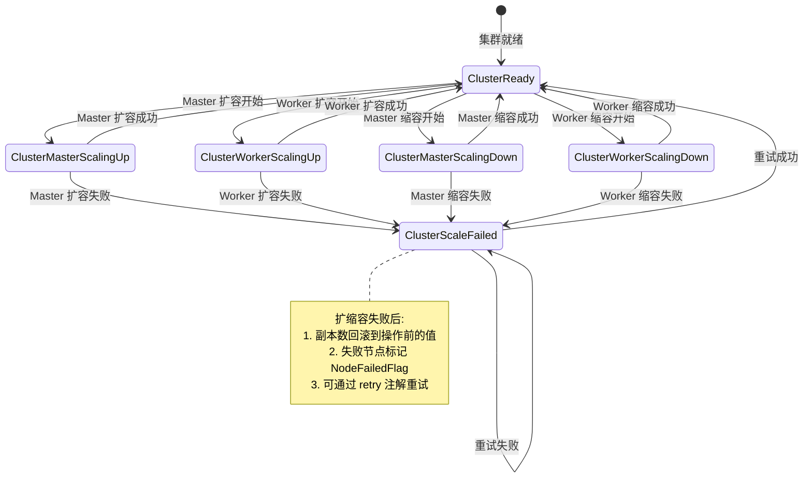
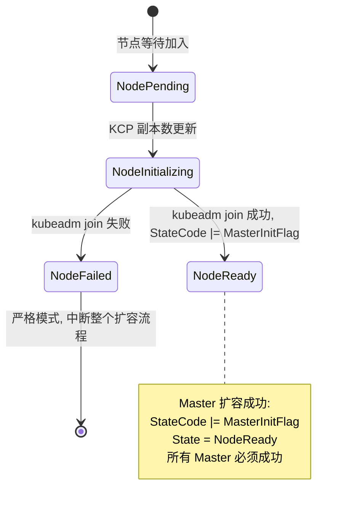
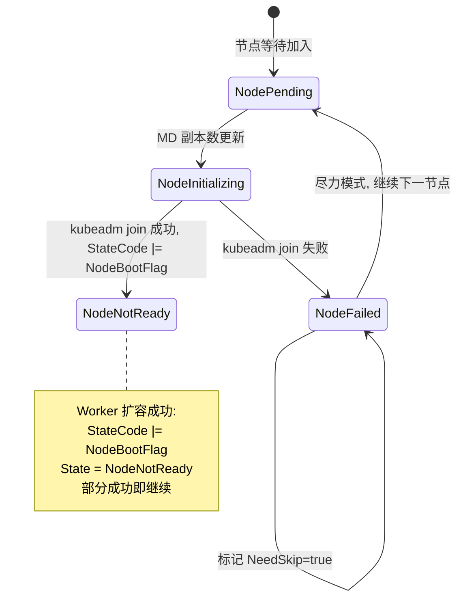
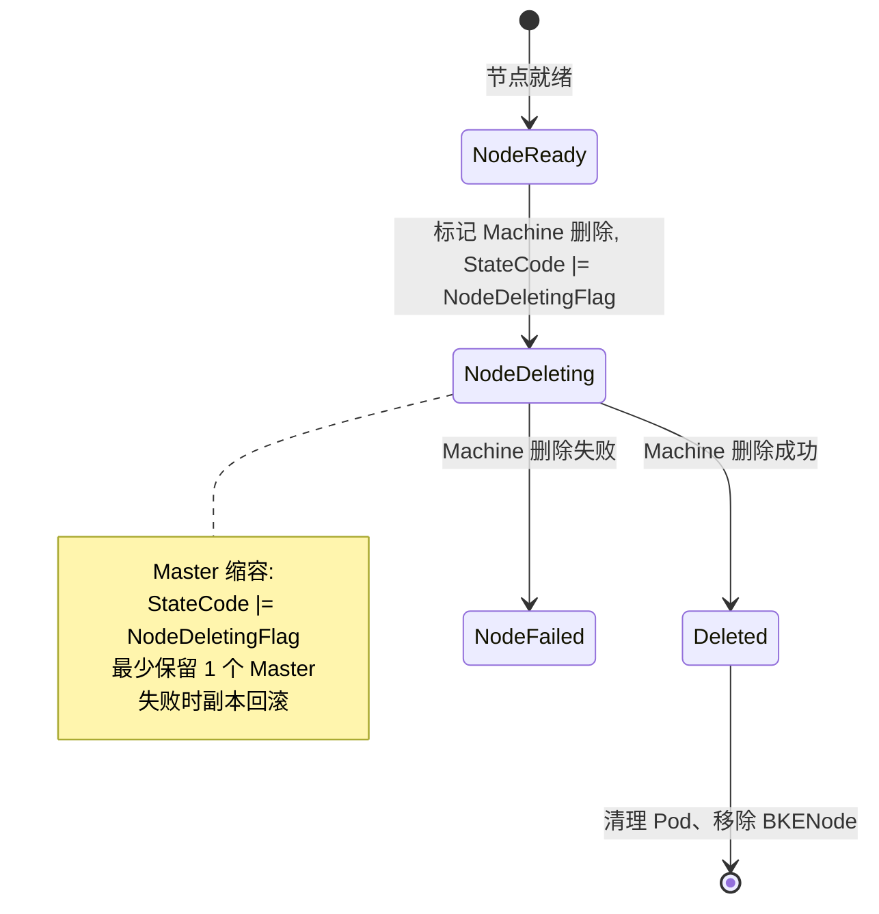
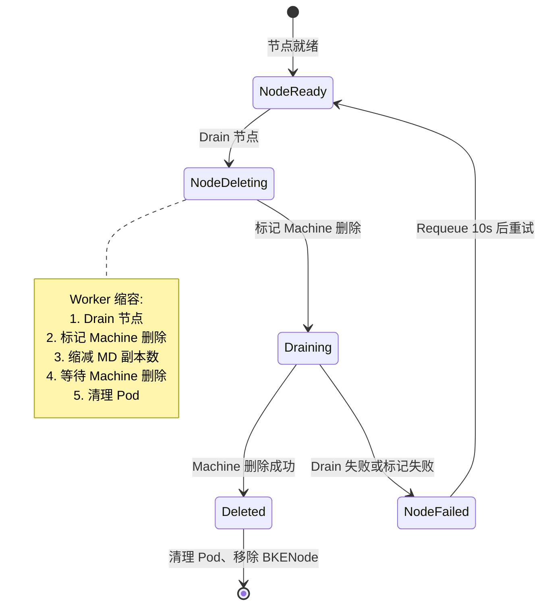
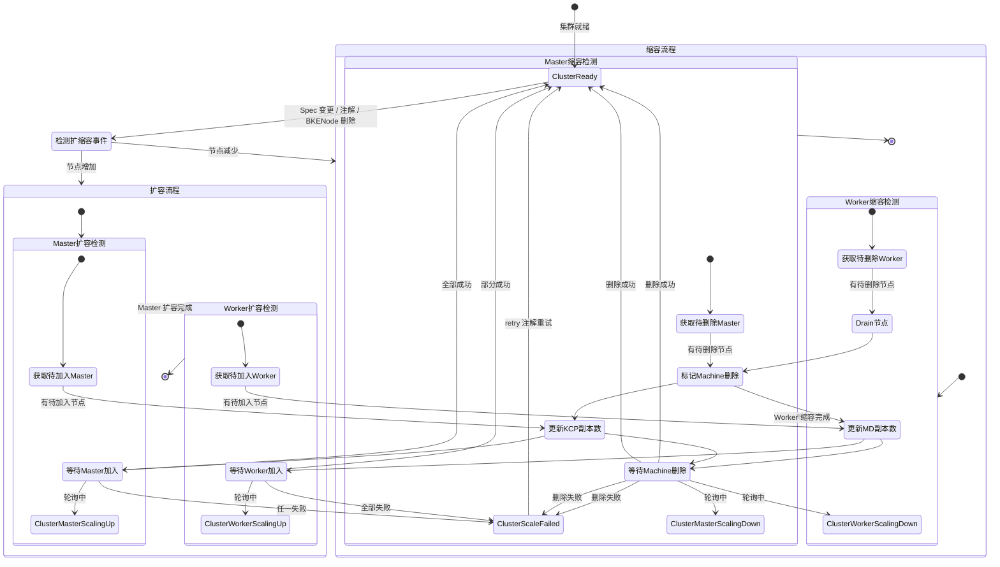
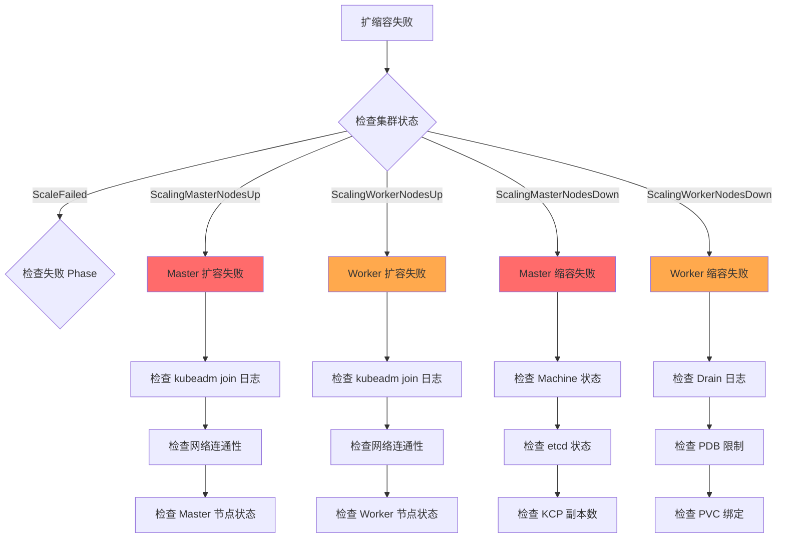

# 代码中实现的扩缩容规格清单

> 本文档梳理 cluster-api-provider-bke 工程中扩缩容相关的完整规格，覆盖扩缩容场景、状态机、失败处理与重试机制四个维度。

---

## 目录

- [1. 扩缩容场景规格](#1-扩缩容场景规格)
  - [1.1 扩缩容路径分类](#11-扩缩容路径分类)
  - [1.2 扩缩容触发机制](#12-扩缩容触发机制)
  - [1.3 各扩缩容场景规格](#13-各扩缩容场景规格)
  - [1.4 节点过滤规格](#14-节点过滤规格)
  - [1.5 扩缩容场景汇总](#15-扩缩容场景汇总)
  - [1.6 关键设计约束](#16-关键设计约束)
- [2. 扩缩容状态机规格](#2-扩缩容状态机规格)
  - [2.1 状态定义](#21-状态定义)
  - [2.2 集群层状态机](#22-集群层状态机)
  - [2.3 节点层状态机](#23-节点层状态机)
  - [2.4 完整扩缩容流程状态机](#24-完整扩缩容流程状态机集群节点联动)
  - [2.5 状态切换规格汇总](#25-状态切换规格汇总)
- [3. 扩缩容失败处理规格](#3-扩缩容失败处理规格)
  - [3.1 失败策略分类](#31-失败策略分类)
  - [3.2 各场景失败处理详情](#32-各场景失败处理详情)
  - [3.3 失败处理汇总](#33-失败处理汇总)
- [4. 扩缩容重试规格](#4-扩缩容重试规格)
  - [4.1 重试机制总览](#41-重试机制总览)
  - [4.2 各场景轮询配置](#42-各场景轮询配置)
  - [4.3 重试幂等性保障](#43-重试幂等性保障)
  - [4.4 重试风险点](#44-重试风险点)
- [5. 运维操作规格](#5-运维操作规格)
  - [5.1 扩缩容触发参数](#51-扩缩容触发参数bkecluster-spec)
  - [5.2 扩缩容运行时控制](#52-扩缩容运行时控制bkecluster-annotations)
  - [5.3 扩缩容操作手册](#53-扩缩容操作手册)
  - [5.4 失败感知与初步判断](#54-失败感知与初步判断)
  - [5.5 失败信息采集清单](#55-失败信息采集清单)
  - [5.6 失败根因分类](#56-失败根因分类与-reason-映射)
  - [5.7 问题定位决策树](#57-问题定位决策树)
  - [5.8 恢复决策与操作路径](#58-恢复决策与操作路径)
  - [5.9 常见问题速查表](#59-常见问题速查表)
- [6. 关键结论](#6-关键结论)

---

## 1. 扩缩容场景规格

### 1.1 扩缩容路径分类

工程中扩缩容分两条路径，由 Phase 注册顺序决定（[list.go:32-78](file:///cluster-api-provider-bke/pkg/phaseframe/phases/list.go#L32-L78)）：

| 路径 | Phase 分组 | 包含 Phase | 执行时机 |
|------|-----------|-----------|---------|
| **扩容路径** | `DeployPhases` | EnsureMasterJoin、EnsureWorkerJoin | 首次安装 + 后续扩容 |
| **缩容路径** | `PostDeployPhases` | EnsureWorkerDelete、EnsureMasterDelete | 集群就绪后的缩容 |

**Phase 执行顺序**：

```
DeployPhases (扩容):
─────────────────────────────────────────
    ... → EnsureMasterInit → EnsureMasterJoin → EnsureWorkerJoin → ...

PostDeployPhases (缩容):
─────────────────────────────────────────
    ... → EnsureWorkerDelete → EnsureMasterDelete → ...
```

**关键区别**：
- 扩容在 `DeployPhases` 中执行，首次安装时也会执行（安装 = 扩容到初始节点数）
- 缩容在 `PostDeployPhases` 中执行，仅在集群已就绪后触发

### 1.2 扩缩容触发机制

#### 1.2.1 Spec 变更触发（节点列表变化）

**位置**：[utils/capbke/predicates/bkecluster.go:70](file:///cluster-api-provider-bke/utils/capbke/predicates/bkecluster.go#L70)

| 维度 | 规格 |
|------|------|
| 触发条件 | `BKEClusterSpecChange()` 检测到 Spec generation 变化 |
| 检测逻辑 | `CompareBKEConfigNode(old, new)` 比较节点列表 |
| 扩容检测 | 节点在 `new` 中但不在 `old` 中 → `CreateNode` |
| 缩容检测 | 节点在 `old` 中但不在 `new` 中 → `RemoveNode` |
| 后续处理 | `handleNodeChanges()` 标记 `RemoveNode` 为 `NodeDeleting` 状态 |

#### 1.2.2 注解触发（appointment-add/deleted-nodes）

**位置**：[utils/capbke/predicates/bkecluster.go:139-159](file:///cluster-api-provider-bke/utils/capbke/predicates/bkecluster.go#L139-L159)

| 注解 | 用途 | 格式 | 示例 |
|------|------|------|------|
| `bke.bocloud.com/appointment-add-nodes` | 预约添加节点（扩容） | 逗号分隔 IP | `"10.0.0.10,10.0.0.11"` |
| `bke.bocloud.com/appointment-deleted-nodes` | 预约删除节点（缩容） | 逗号分隔 IP | `"10.0.0.10,10.0.0.11"` |

**触发条件**：`BKEClusterAnnotationsChange()` 检测到上述注解变化

#### 1.2.3 BKENode CRD 删除触发

**位置**：[controllers/capbke/bkecluster_controller.go:313-317](file:///cluster-api-provider-bke/controllers/capbke/bkecluster_controller.go#L313-L317)

| 维度 | 规格 |
|------|------|
| 触发条件 | BKENode CRD 被删除 |
| 检测方式 | `Watches(BKENode{}, ...)` + `BKENodeChange()` 谓词 |
| 后续处理 | `getDeleteTargetNodesIfDeployed()` 检测目标集群中仍存在但 BKENode 已删除的节点 |

### 1.3 各扩缩容场景规格

#### 1.3.1 Master 扩容（EnsureMasterJoin）

**位置**：[ensure_master_join.go:113-298](file:///cluster-api-provider-bke/pkg/phaseframe/phases/ensure_master_join.go#L113-L298)

| 维度 | 规格 |
|------|------|
| 触发条件 | `GetNeedJoinMasterNodesWithBKENodes()` 返回 > 0 个节点 |
| 前置检查 | 控制面已初始化（`ControlPlaneInitializedCondition = true`） |
| 节点过滤 | `!NodeBootFlag && !MasterInitFlag` + 排除已关联 Machine 的节点 |
| 执行动作 | 暂停 KCP → 更新副本数（`currentReplicas + nodesCount`）→ 恢复 KCP → 轮询等待加入 |
| 副本上限 | `min(currentReplicas + nodesCount, totalMasterCount)` |
| 轮询间隔 | 1 秒 |
| 轮询超时 | `nodesCount * bootTimeout`（默认 10 分钟/节点） |
| 失败策略 | **严格模式**：所有 Master 节点必须成功，否则返回 error |
| 回滚机制 | defer 回滚 KCP 副本数到 `currentReplicas` |
| 超时配置 | 从 `GetBootTimeOut` 获取（默认 10 分钟） |

**执行流程**：

```
reconcileMasterJoin()
  │
  ├─ 1. checkPreconditions(): 验证 Agent 就绪 + 控制面已初始化
  │
  ├─ 2. getJoinableNodes(): 过滤已关联 Machine 的节点
  │
  ├─ 3. scaleAndJoinMasterNodes():
  │     ├─ 获取 KubeadmControlPlane 对象
  │     ├─ 暂停 KCP
  │     ├─ 计算 exceptReplicas = currentReplicas + nodesCount
  │     ├─ 更新 KCP 副本数
  │     ├─ 恢复 KCP
  │     └─ waitMasterJoin(): 轮询等待所有节点加入
  │
  └─ 4. 失败时 defer 回滚 KCP 副本数
```

#### 1.3.2 Worker 扩容（EnsureWorkerJoin）

**位置**：[ensure_worker_join.go:105-505](file:///cluster-api-provider-bke/pkg/phaseframe/phases/ensure_worker_join.go#L105-L505)

| 维度 | 规格 |
|------|------|
| 触发条件 | `GetNeedJoinWorkerNodesWithBKENodes()` 返回 > 0 个节点 |
| 前置检查 | 控制面已初始化（`ControlPlaneInitializedCondition = true`） |
| 节点过滤 | `!NodeBootFlag && !MasterInitFlag` + `NodeEnvFlag = true` + `NodeAgentReadyFlag = true` + `!NeedSkip` |
| 执行动作 | 更新 MachineDeployment 副本数（`currentReplicas + nodesCount`）→ 轮询等待加入 |
| 副本上限 | `min(currentReplicas + nodesCount, totalWorkerCount)` |
| 轮询间隔 | 1 秒 |
| 轮询超时 | `bootTimeout`（默认 10 分钟） |
| 并发检查 | `checkAllNodesStatus()` 并发检查所有节点状态 |
| 失败策略 | **尽力模式**：部分成功即继续，失败节点标记 `NeedSkip=true` |
| 回滚机制 | defer 回滚 MachineDeployment 副本数到 `currentReplicas` |
| 超时配置 | 从 `GetBootTimeOut` 获取（默认 10 分钟） |

**执行流程**：

```
reconcileWorkerJoin()
  │
  ├─ 1. 检查 ControlPlaneInitializedCondition
  │
  ├─ 2. getExceptJoinNodes(): 过滤 NeedSkip/Env/AgentReady
  │
  ├─ 3. getJoinableNodesInfo(): 排除已关联 Machine 的节点
  │
  ├─ 4. scaleMachineDeployment():
  │     ├─ 获取 MachineDeployment 对象
  │     ├─ 计算 exceptReplicas = currentReplicas + nodesCount
  │     └─ 更新 MD 副本数
  │
  ├─ 5. waitWorkerJoin():
  │     ├─ pollWorkerJoinStatus(): 每 1 秒轮询
  │     ├─ checkAllNodesStatus(): 并发检查所有节点
  │     ├─ checkSingleNodeStatus(): 检查 NodeFailedFlag/BootStrapFailed/InitFailed
  │     ├─ categorizeJoinedNodes(): 分类成功/失败节点
  │     └─ 成功节点标记 NodeNotReady，失败节点标记 NeedSkip=true
  │
  ├─ 6. determineDeploymentResult():
  │     ├─ 任意节点成功 → 继续（非阻塞）
  │     ├─ 全部节点超时失败 → 继续（非阻塞）
  │     └─ 全部节点非超时失败 → 返回 error
  │
  └─ 7. 失败时 defer 回滚 MD 副本数
```

#### 1.3.3 Master 缩容（EnsureMasterDelete）

**位置**：[ensure_master_delete.go:100-340](file:///cluster-api-provider-bke/pkg/phaseframe/phases/ensure_master_delete.go#L100-L340)

| 维度 | 规格 |
|------|------|
| 触发条件 | 两种模式：Appointment 注解 或 BKENode 删除检测 |
| 节点过滤 | 两种模式：`GetNeedDeleteMasterNodes()` 或 `GetNeedDeleteMasterNodesWithTargetNodes()` |
| 执行动作 | 暂停 KCP → 标记 Machine 删除 → 缩减副本数 → 恢复 KCP → 轮询等待删除 → 清理 Pod |
| 副本下限 | `max(currentReplicas - deleteCount, 1)`（至少保留 1 个 Master） |
| 轮询间隔 | 2 秒 |
| 轮询超时 | 4 分钟 |
| 失败策略 | 标记失败的 Machine 从 deleteMap 移除，若 deleteMap 为空则返回 nil |
| 回滚机制 | defer 回滚 KCP 副本数到 `currentReplicas` |
| 清理动作 | `cleanupDeletedNodePods()` 强制删除 Pod、移除 BKENode、清除状态缓存 |

**执行流程**：

```
reconcileMasterDelete()
  │
  ├─ 1. GetTargetClusterNodes(): 获取目标集群节点
  │
  ├─ 2. ProcessNodeMachineMapping(): 映射节点到 Machine
  │     ├─ 无关联 Machine → 删除 BKENode、移除缓存
  │     ├─ Machine 已 Deleting → 加入 WaitDeleteMap
  │     ├─ Machine 已 Deleted → 跳过
  │     └─ 其他 → 加入 DeleteMap
  │
  ├─ 3. pauseAndScaleDownControlPlane():
  │     ├─ 获取 KubeadmControlPlane 对象
  │     ├─ 暂停 KCP
  │     ├─ MarkMachineForDeletion(): 标记 Machine 删除
  │     ├─ 计算 exceptReplicas = currentReplicas - len(deleteMap)
  │     ├─ 确保 exceptReplicas >= 1
  │     └─ 恢复 KCP 副本数
  │
  ├─ 4. waitMasterDelete():
  │     └─ waitForMachinesDelete(): 每 2 秒轮询，检查 Machine 是否 NotFound
  │
  ├─ 5. cleanupDeletedNodePods():
  │     ├─ 强制删除节点上的 Pod
  │     ├─ 移除 BKENode CRD
  │     └─ 清除状态缓存
  │
  └─ 6. 失败时 defer 回滚 KCP 副本数
```

#### 1.3.4 Worker 缩容（EnsureWorkerDelete）

**位置**：[ensure_worker_delete.go:413-664](file:///cluster-api-provider-bke/pkg/phaseframe/phases/ensure_worker_delete.go#L413-L664)

| 维度 | 规格 |
|------|------|
| 触发条件 | 两种模式：Appointment 注解 或 BKENode 删除检测 |
| 节点过滤 | 两种模式：`GetNeedDeleteWorkerNodes()` 或 `GetNeedDeleteWorkerNodesWithTargetNodes()` |
| 执行动作 | 暂停 MD → Drain 节点 → 标记 Machine 删除 → 缩减副本数 → 恢复 MD → 轮询等待删除 → 清理 Pod |
| 副本下限 | `max(currentReplicas - deleteCount, 0)`（可缩减到 0） |
| 轮询间隔 | 2 秒 |
| 轮询超时 | 4 分钟 |
| Drain 失败处理 | 节点移入 `canNotDeleteMachinesAndNodes`，从 deleteMap 移除 |
| 标记失败处理 | 节点移入 `canNotDelete`，从 deleteMap 移除 |
| Requeue 策略 | 若存在 `canNotDelete` 节点，10 秒后 Requeue |
| 回滚机制 | defer 回滚 MachineDeployment 副本数到 `currentReplicas` |
| 清理动作 | `cleanupNodePods()` 强制删除 Pod、移除 BKENode、清除状态缓存 |

**执行流程**：

```
reconcileWorkerDelete()
  │
  ├─ 1. initialSetup():
  │     ├─ 获取待删除节点（两种模式）
  │     ├─ ProcessNodeMachineMapping(): 映射节点到 Machine
  │     └─ 暂停 MachineDeployment
  │
  ├─ 2. processDrainAndMark():
  │     ├─ drainNodes(): Drain 每个节点的 Pod
  │     │   └─ Drain 失败 → 移入 canNotDeleteMachinesAndNodes
  │     └─ markMachinesForDeletion(): 标记 Machine 删除
  │         └─ 标记失败 → 移入 canNotDelete
  │
  ├─ 3. 检查 canNotDelete:
  │     └─ 若存在 → RequeueAfter = 10 秒
  │
  ├─ 4. finalizeDeletion():
  │     ├─ 计算 exceptReplicas = currentReplicas - len(deleteMap)
  │     ├─ 确保 exceptReplicas >= 0
  │     └─ 恢复 MachineDeployment 副本数
  │
  ├─ 5. waitWorkerDelete():
  │     └─ waitForMachinesDelete(): 每 2 秒轮询，检查 Machine 是否 NotFound
  │
  ├─ 6. processSuccessfulDeletions():
  │     └─ cleanupNodePods(): 强制删除 Pod、移除 BKENode、清除缓存
  │
  └─ 7. 失败时 defer 回滚 MD 副本数
```

### 1.4 节点过滤规格

#### 1.4.1 扩容节点选择

**位置**：[pkg/phaseframe/phaseutil/util.go:330-399](file:///cluster-api-provider-bke/pkg/phaseframe/phaseutil/util.go#L330-L399)

**核心过滤条件**：

| 条件 | 说明 | 代码位置 |
|------|------|---------|
| `!NodeBootFlag` | 节点未引导 | util.go:330 |
| `!MasterInitFlag` | Master 未初始化 | util.go:330 |
| `!NodeFailedFlag` | 节点未失败 | util.go:180 |
| `!NodeDeletingFlag` | 节点未删除 | util.go:180 |
| `!NeedSkip` | 节点未被跳过 | util.go:180 |

**Worker 扩容额外过滤**（[ensure_worker_join.go:77](file:///cluster-api-provider-bke/pkg/phaseframe/phases/ensure_worker_join.go#L77)）：

| 条件 | 说明 |
|------|------|
| `NodeEnvFlag = true` | 环境已初始化 |
| `NodeAgentReadyFlag = true` | Agent 已就绪 |

**排除已关联 Machine 的节点**（[ensure_master_join.go:177](file:///cluster-api-provider-bke/pkg/phaseframe/phases/ensure_master_join.go#L177)、[ensure_worker_join.go:230](file:///cluster-api-provider-bke/pkg/phaseframe/phases/ensure_worker_join.go#L230)）：

```go
// 排除已关联 Machine 的节点
for _, node := range exceptJoinNodes {
    machine, err := phaseutil.GetMachineForNode(ctx, c, bkeCluster, node.IP)
    if err == nil && machine != nil {
        continue // 已关联 Machine，跳过
    }
    joinableNodes = append(joinableNodes, node)
}
```

#### 1.4.2 缩容节点选择（两种模式）

**位置**：[pkg/phaseframe/phaseutil/util.go:467-585](file:///cluster-api-provider-bke/pkg/phaseframe/phaseutil/util.go#L467-L585)

**模式 1：Appointment（预约模式）**

| 函数 | 逻辑 |
|------|------|
| `GetAppointmentDeletedNodes(bkeCluster)` | 读取 `bke.bocloud.com/appointment-deleted-nodes` 注解（逗号分隔 IP） |
| `GetNeedDeleteWorkerNodes(ctx, c, bkeCluster)` | 预约节点 ∩ `GetNeedDeleteNodes().Worker()` |
| `GetNeedDeleteMasterNodes(ctx, c, bkeCluster)` | 预约节点 ∩ `GetNeedDeleteNodes().Master()` |

**模式 2：BKENode 删除检测**

| 函数 | 逻辑 |
|------|------|
| `GetNeedDeleteNodes(ctx, c, bkeCluster)` | 目标集群中 Ready 节点 - BKENode 资源中的节点 |
| `GetNeedDeleteNodesFromTargetNodes(ctx, c, bkeCluster, targetNodes)` | 目标集群节点中不在 BKENode 资源中的节点 |
| `GetNeedDeleteWorkerNodesWithTargetNodes(...)` | 模式 2 的 Worker 版本 |
| `GetNeedDeleteMasterNodesWithTargetNodes(...)` | 模式 2 的 Master 版本 |

#### 1.4.3 ProcessNodeMachineMapping（节点-Machine 映射）

**位置**：[pkg/phaseframe/phases/common.go:60](file:///cluster-api-provider-bke/pkg/phaseframe/phases/common.go#L60)

```go
func ProcessNodeMachineMapping(params ProcessNodeMachineMappingParams) (ProcessNodeMachineMappingResult, error)
```

**映射逻辑**：

| 场景 | 处理 |
|------|------|
| 无关联 Machine | 删除 BKENode、移除状态缓存、移除预约注解 |
| Machine Phase = `Deleting` | 加入 `WaitDeleteMap`（仅等待，不操作） |
| Machine Phase = `Deleted` | 完全跳过 |
| 其他 | 加入 `DeleteMap`（执行删除） |

### 1.5 扩缩容场景汇总

| 场景 | 触发条件 | 执行动作 | 副本管理 | 轮询间隔 | 轮询超时 | 失败策略 | 回滚机制 |
|------|---------|---------|---------|---------|---------|---------|---------|
| **Master 扩容** | `GetNeedJoinMasterNodes() > 0` | 更新 KCP 副本数 | `current + nodes` | 1s | `nodes * 10m` | 严格模式 | KCP 副本回滚 |
| **Worker 扩容** | `GetNeedJoinWorkerNodes() > 0` | 更新 MD 副本数 | `current + nodes` | 1s | 10m | 尽力模式 | MD 副本回滚 |
| **Master 缩容** | Appointment / BKENode 删除 | 标记删除 + 缩减 KCP | `current - delete` | 2s | 4m | 移除失败节点 | KCP 副本回滚 |
| **Worker 缩容** | Appointment / BKENode 删除 | Drain + 标记删除 + 缩减 MD | `current - delete` | 2s | 4m | Requeue 10s | MD 副本回滚 |

### 1.6 关键设计约束

1. **扩容在 DeployPhases 中执行**：首次安装时也会执行扩容 Phase（安装 = 扩容到初始节点数）
2. **缩容在 PostDeployPhases 中执行**：仅在集群已就绪后触发，避免安装过程中误缩容
3. **Master 扩容采用严格模式**：所有 Master 节点必须成功，否则返回 error
4. **Worker 扩容采用尽力模式**：部分成功即继续，失败节点标记 `NeedSkip=true`
5. **副本回滚机制**：所有扩缩容操作失败时，defer 回滚副本数到操作前的值
6. **Master 缩容最少保留 1 个节点**：`exceptReplicas = max(currentReplicas - deleteCount, 1)`
7. **Worker 缩容可缩减到 0 个节点**：`exceptReplicas = max(currentReplicas - deleteCount, 0)`
8. **缩容两种检测模式**：Appointment 注解（显式指定）或 BKENode 删除检测（隐式检测）
9. **Worker 缩容先 Drain 再删除**：确保 Pod 优雅迁移，避免服务中断
10. **缩容后清理 Pod**：强制删除节点上的 Pod，避免残留

---

## 2. 扩缩容状态机规格

### 2.1 状态定义

#### 2.1.1 集群状态（ClusterStatus）

**位置**：[api/capbke/v1beta1/bkecluster_consts.go:169-173](file:///cluster-api-provider-bke/api/capbke/v1beta1/bkecluster_consts.go#L169-L173)

| 常量 | 值 | 类别 |
|------|----|------|
| `ClusterReady` | Ready | 正常态 |
| **`ClusterMasterScalingUp`** | **ScalingMasterNodesUp** | **Master 扩容中间态** |
| **`ClusterMasterScalingDown`** | **ScalingMasterNodesDown** | **Master 缩容中间态** |
| **`ClusterWorkerScalingUp`** | **ScalingWorkerNodesUp** | **Worker 扩容中间态** |
| **`ClusterWorkerScalingDown`** | **ScalingWorkerNodesDown** | **Worker 缩容中间态** |
| **`ClusterScaleFailed`** | **ScaleFailed** | **扩缩容失败态** |

#### 2.1.2 节点状态（NodeState）

**位置**：[api/bkecommon/v1beta1/bkenode_types.go:36-42](file:///cluster-api-provider-bke/api/bkecommon/v1beta1/bkenode_types.go#L36-L42)

| 常量 | 值 | 扩缩容场景用途 |
|------|----|---------------|
| `NodeReady` | Ready | 扩容成功后临时状态 |
| `NodeNotReady` | NotReady | 扩容成功后标记 |
| **`NodeDeleting`** | **Deleting** | **缩容中标记** |
| `NodeFailed` | Failed | 节点失败 |

#### 2.1.3 节点 StateCode 位标记

**位置**：[api/capbke/v1beta1/bkecluster_consts.go:233-246](file:///cluster-api-provider-bke/api/capbke/v1beta1/bkecluster_consts.go#L233-L246)

```go
const (
    NodeAgentPushedFlag   = 1 << iota  // bit 0 = 1
    NodeAgentReadyFlag                 // bit 1 = 2
    NodeEnvFlag                        // bit 2 = 4
    NodeBootFlag                       // bit 3 = 8    ← 扩容完成标记
    NodeHAFlag                         // bit 4 = 16
    MasterInitFlag                     // bit 5 = 32   ← Master 扩容完成标记
    NodeDeletingFlag                   // bit 6 = 64   ← 缩容标记
    NodeFailedFlag                     // bit 7 = 128
    NodeStateNeedRecord                // bit 8 = 256
    NodePostProcessFlag                // bit 9 = 512
)
```

**扩缩容关键位标记**：

| 位标记 | 用途 | 设置时机 |
|--------|------|---------|
| `NodeBootFlag` | 节点引导完成 | Worker 扩容成功后 |
| `MasterInitFlag` | Master 初始化完成 | Master 扩容成功后 |
| `NodeDeletingFlag` | 节点删除中 | 缩容开始时 |
| `NodeFailedFlag` | 节点失败 | 扩缩容失败时 |

### 2.2 集群层状态机

#### 2.2.1 完整状态流转图



#### 2.2.2 扩缩容状态切换规则

**位置**：[phase_flow.go:368-445](file:///cluster-api-provider-bke/pkg/phaseframe/phases/phase_flow.go#L368-L445)

```go
// Master 扩容
func handleClusterScaleMasterUpPhase(ctx *phaseframe.PhaseContext, err error) {
    if err != nil {
        ctx.BKECluster.Status.ClusterStatus = bkev1beta1.ClusterScaleFailed
    } else {
        ctx.BKECluster.Status.ClusterStatus = bkev1beta1.ClusterMasterScalingUp
    }
}

// Worker 扩容
func handleClusterScaleWorkerUpPhase(ctx *phaseframe.PhaseContext, err error) {
    if err != nil {
        ctx.BKECluster.Status.ClusterStatus = bkev1beta1.ClusterScaleFailed
    } else {
        ctx.BKECluster.Status.ClusterStatus = bkev1beta1.ClusterWorkerScalingUp
    }
}

// Master 缩容
func handleClusterScaleMasterDownPhase(ctx *phaseframe.PhaseContext, err error) {
    if err != nil {
        ctx.BKECluster.Status.ClusterStatus = bkev1beta1.ClusterScaleFailed
    } else {
        ctx.BKECluster.Status.ClusterStatus = bkev1beta1.ClusterMasterScalingDown
    }
}

// Worker 缩容
func handleClusterScaleWorkerDownPhase(ctx *phaseframe.PhaseContext, err error) {
    if err != nil {
        ctx.BKECluster.Status.ClusterStatus = bkev1beta1.ClusterScaleFailed
    } else {
        ctx.BKECluster.Status.ClusterStatus = bkev1beta1.ClusterWorkerScalingDown
    }
}
```

**触发 Phase 范围**（[list.go:116-128](file:///cluster-api-provider-bke/pkg/phaseframe/phases/list.go#L116-L128)）：

| Phase 分组 | 包含 Phase | 状态映射 |
|------------|-----------|---------|
| `ClusterScaleMasterUpPhaseNames` | EnsureMasterJoin | ClusterMasterScalingUp / ClusterScaleFailed |
| `ClusterScaleWorkerUpPhaseNames` | EnsureWorkerJoin | ClusterWorkerScalingUp / ClusterScaleFailed |
| `ClusterScaleMasterDownPhaseNames` | EnsureMasterDelete | ClusterMasterScalingDown / ClusterScaleFailed |
| `ClusterScaleWorkerDownPhaseNames` | EnsureWorkerDelete | ClusterWorkerScalingDown / ClusterScaleFailed |

### 2.3 节点层状态机

#### 2.3.1 Master 扩容节点状态机

**位置**：[ensure_master_join.go:255-298](file:///cluster-api-provider-bke/pkg/phaseframe/phases/ensure_master_join.go#L255-L298)



#### 2.3.2 Worker 扩容节点状态机

**位置**：[ensure_worker_join.go:450-505](file:///cluster-api-provider-bke/pkg/phaseframe/phases/ensure_worker_join.go#L450-L505)



#### 2.3.3 Master 缩容节点状态机

**位置**：[ensure_master_delete.go:165-340](file:///cluster-api-provider-bke/pkg/phaseframe/phases/ensure_master_delete.go#L165-L340)



#### 2.3.4 Worker 缩容节点状态机

**位置**：[ensure_worker_delete.go:126-664](file:///cluster-api-provider-bke/pkg/phaseframe/phases/ensure_worker_delete.go#L126-L664)



### 2.4 完整扩缩容流程状态机（集群+节点联动）



### 2.5 状态切换规格汇总

| 层次 | 状态 | 触发条件 | 设置位置 |
|------|------|----------|----------|
| 集群 | `ClusterMasterScalingUp` | Master 扩容 Phase 开始执行 | phase_flow.go:372 |
| 集群 | `ClusterWorkerScalingUp` | Worker 扩容 Phase 开始执行 | phase_flow.go:380 |
| 集群 | `ClusterMasterScalingDown` | Master 缩容 Phase 开始执行 | phase_flow.go:388 |
| 集群 | `ClusterWorkerScalingDown` | Worker 缩容 Phase 开始执行 | phase_flow.go:396 |
| 集群 | `ClusterScaleFailed` | 扩缩容 Phase 返回 error | phase_flow.go:370/378/386/394 |
| 集群 | `ClusterReady` | 扩缩容 Phase 成功 | phase_flow.go:372/380/388/396 |
| 节点 | `NodeDeleting` | 缩容开始时 | ensure_worker_delete.go:xxx |
| 节点 | `NodeNotReady` | Worker 扩容成功后 | ensure_worker_join.go:360 |
| 节点 | `NodeReady` | Master 扩容成功后 | ensure_master_join.go:xxx |
| 节点 | `MasterInitFlag`(StateCode) | Master 扩容成功后 | ensure_master_join.go:xxx |
| 节点 | `NodeBootFlag`(StateCode) | Worker 扩容成功后 | ensure_worker_join.go:xxx |
| 节点 | `NodeDeletingFlag`(StateCode) | 缩容开始时 | ensure_worker_delete.go:xxx |
| 节点 | `NeedSkip=true` | Worker 扩容失败 | ensure_worker_join.go:364 |

---

## 3. 扩缩容失败处理规格

### 3.1 失败策略分类

工程中扩缩容失败处理分为两种策略：

| 策略 | 标识 | 说明 | 适用场景 |
|------|------|------|---------|
| **严格模式** | Strict | 所有节点必须成功，任一失败即中断 | Master 扩容 |
| **尽力模式** | Best-Effort | 部分成功即继续，失败节点标记跳过 | Worker 扩容 |

**关键区别**：

| 维度 | 严格模式（Master） | 尽力模式（Worker） |
|------|------------------|------------------|
| 失败容忍度 | 0%（任一失败即中断） | 100%（全部失败才中断） |
| 失败节点处理 | 返回 error，中断流程 | 标记 `NeedSkip=true`，继续 |
| 副本回滚 | 回滚 KCP 副本数 | 回滚 MD 副本数 |
| 后续操作 | 阻断后续 Phase | 继续后续 Phase |

### 3.2 各场景失败处理详情

#### 3.2.1 Master 扩容失败（严格模式）

**位置**：[ensure_master_join.go:255-298](file:///cluster-api-provider-bke/pkg/phaseframe/phases/ensure_master_join.go#L255-L298)

| 维度 | 规格 |
|------|------|
| 失败检测 | `waitMasterJoin()` 超时或节点加入失败 |
| 回滚动作 | **defer 回滚 KCP 副本数**到 `currentReplicas` |
| 失败策略 | **严格模式**：任一 Master 节点失败立即返回 error |
| 节点状态标记 | 失败节点保持原状态，不标记 |
| 人工恢复路径 | 检查 kubeadm join 日志、网络、Master 节点状态，手动重试 |

```go
// 回滚机制
currentReplicas := *kcp.Spec.Replicas
defer func() {
    if err != nil {
        // 回滚 KCP 副本数
        kcp.Spec.Replicas = &currentReplicas
        _ = r.Update(ctx, kcp)
    }
}()

// 等待 Master 加入
if err := e.waitMasterJoin(nodesCount); err != nil {
    return ctrl.Result{}, errors.Errorf("Wait master join failed")  // 严格模式
}
```

#### 3.2.2 Worker 扩容失败（尽力模式）

**位置**：[ensure_worker_join.go:383-405](file:///cluster-api-provider-bke/pkg/phaseframe/phases/ensure_worker_join.go#L383-L405)

| 维度 | 规格 |
|------|------|
| 失败检测 | `checkSingleNodeStatus()` 检测到 `NodeFailedFlag`/`BootStrapFailed`/`InitFailed` |
| 回滚动作 | **defer 回滚 MD 副本数**到 `currentReplicas` |
| 失败策略 | **尽力模式**：部分成功即继续，失败节点标记 `NeedSkip=true` |
| 节点状态标记 | 失败节点标记 `NeedSkip=true`，排除后续操作 |
| 人工恢复路径 | 检查 kubeadm join 日志、网络、Worker 节点状态，手动重试 |

```go
// 回滚机制
currentReplicas := *md.Spec.Replicas
defer func() {
    if err != nil {
        // 回滚 MD 副本数
        md.Spec.Replicas = &currentReplicas
        _ = r.Update(ctx, md)
    }
}()

// 分类成功/失败节点
successNodes, failedNodes := e.categorizeJoinedNodes(...)

// 标记失败节点
for _, nodeIP := range failedNodes {
    nodeFetcher.UpdateNodeStatusByIP(..., func(status *confv1beta1.BKENodeStatus) {
        status.NeedSkip = true  // 标记跳过
    })
}

// 决定最终结果
result := e.determineDeploymentResult(successNodes, failedNodes, timeout)
if result == DeploymentResultAllFailedNonTimeout {
    return ctrl.Result{}, errors.Errorf("All workers failed")  // 全部非超时失败
}
// 部分成功或全部超时失败 → 继续（非阻塞）
```

**Worker 扩容结果判定**（[ensure_worker_join.go:383-405](file:///cluster-api-provider-bke/pkg/phaseframe/phases/ensure_worker_join.go#L383-L405)）：

| 场景 | 结果 | 后续操作 |
|------|------|---------|
| 任意节点成功 | 继续 | 非阻塞 |
| 全部节点超时失败 | 继续 | 非阻塞 |
| 全部节点非超时失败 | 返回 error | 阻塞 |

#### 3.2.3 Master 缩容失败（副本回滚）

**位置**：[ensure_master_delete.go:165-298](file:///cluster-api-provider-bke/pkg/phaseframe/phases/ensure_master_delete.go#L165-L298)

| 维度 | 规格 |
|------|------|
| 失败检测 | `waitForMachinesDelete()` 超时或 Machine 删除失败 |
| 回滚动作 | **defer 回滚 KCP 副本数**到 `currentReplicas` |
| 失败策略 | 标记失败的 Machine 从 deleteMap 移除，若 deleteMap 为空则返回 nil |
| 节点状态标记 | 失败节点保持 `NodeDeleting` 状态 |
| 副本下限 | `max(currentReplicas - deleteCount, 1)`（至少保留 1 个 Master） |
| 人工恢复路径 | 检查 Machine 删除日志、etcd 状态，手动重试 |

```go
// 回滚机制
currentReplicas := *kcp.Spec.Replicas
defer func() {
    if err != nil {
        // 回滚 KCP 副本数
        kcp.Spec.Replicas = &currentReplicas
        _ = r.Update(ctx, kcp)
    }
}()

// 标记 Machine 删除
for node, machine := range deleteMap {
    if err := MarkMachineForDeletion(ctx, c, machine); err != nil {
        delete(deleteMap, node)  // 移除失败的 Machine
    }
}

// 若 deleteMap 为空，返回 nil（不报错）
if len(deleteMap) == 0 {
    return nil
}

// 计算副本数（最少保留 1 个）
exceptReplicas := currentReplicas - int32(len(deleteMap))
if exceptReplicas < 1 {
    exceptReplicas = 1
}
```

#### 3.2.4 Worker 缩容失败（Drain 失败处理）

**位置**：[ensure_worker_delete.go:126-664](file:///cluster-api-provider-bke/pkg/phaseframe/phases/ensure_worker_delete.go#L126-L664)

| 维度 | 规格 |
|------|------|
| 失败检测 | `drainNodes()` Drain 失败 或 `markMachinesForDeletion()` 标记失败 |
| 回滚动作 | **defer 回滚 MD 副本数**到 `currentReplicas` |
| Drain 失败处理 | 节点移入 `canNotDeleteMachinesAndNodes`，从 deleteMap 移除 |
| 标记失败处理 | 节点移入 `canNotDelete`，从 deleteMap 移除 |
| Requeue 策略 | 若存在 `canNotDelete` 节点，`RequeueAfter = 10 秒` |
| 节点状态标记 | 失败节点保持 `NodeDeleting` 状态 |
| 副本下限 | `max(currentReplicas - deleteCount, 0)`（可缩减到 0） |
| 人工恢复路径 | 检查 Pod 驱逐日志、PVC 绑定、节点状态，手动重试 |

```go
// 回滚机制
currentReplicas := *md.Spec.Replicas
defer func() {
    if err != nil {
        // 回滚 MD 副本数
        md.Spec.Replicas = &currentReplicas
        _ = r.Update(ctx, md)
    }
}()

// Drain 节点
for _, node := range deleteNodes {
    if err := e.drainNode(ctx, node); err != nil {
        canNotDeleteMachinesAndNodes = append(canNotDeleteMachinesAndNodes, node)
        delete(deleteMap, node)  // 从 deleteMap 移除
    }
}

// 标记 Machine 删除
for node, machine := range deleteMap {
    if err := MarkMachineForDeletion(ctx, c, machine); err != nil {
        canNotDelete = append(canNotDelete, node)
        delete(deleteMap, node)  // 从 deleteMap 移除
    }
}

// 若存在 canNotDelete 节点，Requeue 10 秒
if len(canNotDelete) > 0 {
    return ctrl.Result{RequeueAfter: WorkerDeleteRequeueAfterSeconds * time.Second}, nil
}

// 计算副本数（可缩减到 0）
exceptReplicas := currentReplicas - int32(len(deleteMap))
if exceptReplicas < 0 {
    exceptReplicas = 0
}
```

### 3.3 失败处理汇总

| 场景 | 失败策略 | 副本回滚 | 副本下限 | 失败节点处理 | Requeue | 人工干预 |
|------|:--------:|:--------:|:--------:|-------------|:-------:|:--------:|
| **Master 扩容** | 严格模式 | ✅ KCP | 无 | 保持原状态 | ❌ | 需要 |
| **Worker 扩容** | 尽力模式 | ✅ MD | 无 | 标记 `NeedSkip=true` | ❌ | 需要 |
| **Master 缩容** | 移除失败节点 | ✅ KCP | 1 | 保持 `NodeDeleting` | ❌ | 需要 |
| **Worker 缩容** | Drain/标记失败移除 | ✅ MD | 0 | 保持 `NodeDeleting` | ✅ 10s | 需要 |

---

## 4. 扩缩容重试规格

### 4.1 重试机制总览

扩缩容失败后，通过以下机制处理重试：

| 层次 | 机制 | 触发对象 | 控制参数 | 实现位置 |
|------|------|----------|----------|----------|
| L1 | **controller-runtime workqueue 限速重试** | 单次 reconcile 失败 | FastSlowRateLimiter | cmd/capbke/main.go:481-486 |
| L2 | **StatusManager 失败计数 + 状态回滚** | BKECluster 状态级 | `ReconcileAllowedFailedCount` (默认10) | pkg/statusmanage/statusmanager.go:175-215 |
| L3 | **RetryAnnotation 手动重试** | 失败节点级 | 注解 `bke.bocloud.com/retry` | bkecluster_controller.go:660-738 |
| L4 | **RequeueAfter 延迟重试** | Worker 缩容 Drain/标记失败 | `WorkerDeleteRequeueAfterSeconds` (10s) | ensure_worker_delete.go:372 |

### 4.2 各场景轮询配置

| 场景 | 轮询间隔 | 轮询超时 | 超时计算 | 文件位置 |
|------|---------|---------|---------|---------|
| **Master 扩容等待** | 1s | `nodesCount * bootTimeout` | 节点数 × 10 分钟 | ensure_master_join.go:264, 302 |
| **Worker 扩容等待** | 1s | `bootTimeout` | 默认 10 分钟 | ensure_worker_join.go:268, 456 |
| **Master 缩容等待** | 2s | 4 分钟 | 固定 4 分钟 | ensure_master_delete.go:264-266 |
| **Worker 缩容等待** | 2s | 4 分钟 | 固定 4 分钟 | ensure_worker_delete.go:556-558 |
| **Worker 缩容 Requeue** | N/A | 10 秒 | 固定 10 秒 | ensure_worker_delete.go:372 |

**Boot Timeout 配置**（[pkg/phaseframe/phaseutil/bkecluster.go:158](file:///cluster-api-provider-bke/pkg/phaseframe/phaseutil/bkecluster.go#L158)）：

| 维度 | 规格 |
|------|------|
| 注解 | `bke.bocloud.com/node-boot-wait-timeout` |
| 默认值 | 10 分钟 |
| 设置位置 | `SetBKEClusterDefaultAnnotation()` (annotation/helper.go:88-89) |

### 4.3 重试幂等性保障

重试时重新执行扩缩容操作，幂等性依赖：

| 场景 | 幂等机制 | 位置 |
|------|----------|------|
| Master 扩容 | `!MasterInitFlag` 过滤已加入节点 | ensure_master_join.go:177 |
| Worker 扩容 | `!NodeBootFlag` 过滤已加入节点 | ensure_worker_join.go:77 |
| Master 缩容 | `ProcessNodeMachineMapping()` 排除已删除 Machine | common.go:60 |
| Worker 缩容 | `ProcessNodeMachineMapping()` 排除已删除 Machine | common.go:60 |
| 副本数更新 | 检查当前副本数，避免重复扩展 | ensure_master_join.go:207 |

### 4.4 重试风险点

1. **Master 扩容失败立即重试**：返回 `Requeue: true` 绕过限速器，**可能造成重试风暴**
   - 失败 10 次内每次间隔接近 0
   - kubeadm join 本身耗时较长时影响较小，但若快速失败会形成紧密循环

2. **Worker 扩容部分成功重试**：失败节点标记 `NeedSkip=true`，重试时自动跳过
   - 若所有节点都标记 `NeedSkip=true`，扩容流程永久阻塞
   - 需手动清除 `NeedSkip` 标记才能重试

3. **Worker 缩容 Drain 失败 Requeue**：每 10 秒 Requeue 一次，**可能造成频繁调谐**
   - 若 Pod 无法驱逐（如 PDB 限制），会持续 Requeue
   - 需手动干预（强制删除 Pod 或调整 PDB）

4. **副本回滚风险**：扩缩容失败时回滚副本数，但已创建的 Machine 不会自动删除
   - 可能导致 Machine 数量与副本数不一致
   - 需手动清理残留 Machine

5. **StatusManager 状态伪装**：失败 10 次内对外显示正常状态，可能掩盖真实问题

---

## 5. 运维操作规格

### 5.1 扩缩容触发参数（BKECluster Spec）

**位置**：[api/capbke/v1beta1/bkecluster_types.go](file:///cluster-api-provider-bke/api/capbke/v1beta1/bkecluster_types.go)

| 字段 | 类型 | 说明 | 示例 |
|------|------|------|------|
| `spec.nodes` | `[]Node` | 节点列表（IP、角色、SSH 认证） | `[{ip: "10.0.0.1", role: "master"}]` |
| `spec.nodes[].role` | `string` | 节点角色 | `"master"` / `"worker"` |

**扩容触发**：`spec.nodes` 增加节点
**缩容触发**：`spec.nodes` 减少节点

### 5.2 扩缩容运行时控制（BKECluster Annotations）

**位置**：[utils/capbke/annotation/helper.go](file:///cluster-api-provider-bke/utils/capbke/annotation/helper.go)

| 注解 | 说明 | 格式 | 示例 |
|------|------|------|------|
| `bke.bocloud.com/appointment-add-nodes` | 预约添加节点（扩容） | 逗号分隔 IP | `"10.0.0.10,10.0.0.11"` |
| `bke.bocloud.com/appointment-deleted-nodes` | 预约删除节点（缩容） | 逗号分隔 IP | `"10.0.0.10,10.0.0.11"` |
| `bke.bocloud.com/retry` | 手动重试失败节点 | 空（全部）或逗号分隔 IP | `""` / `"10.0.0.1"` |
| `bke.bocloud.com/node-boot-wait-timeout` | 配置节点引导超时 | 时间字符串 | `"15m"` |

### 5.3 扩缩容操作手册

#### 5.3.1 扩容操作

```bash
# 方式 1: 修改 spec.nodes（推荐）
kubectl edit bkecluster my-cluster
# 在 spec.nodes 中添加新节点

# 方式 2: 使用预约注解
kubectl annotate bkecluster my-cluster \
  bke.bocloud.com/appointment-add-nodes="10.0.0.10,10.0.0.11"

# 查看扩容进度
kubectl get bkecluster my-cluster -o jsonpath='{.status.clusterStatus}'
# 期望输出: ScalingMasterNodesUp / ScalingWorkerNodesUp

# 查看节点状态
kubectl get bkenode -l cluster.x-k8s.io/cluster-name=my-cluster
```

#### 5.3.2 缩容操作

```bash
# 方式 1: 修改 spec.nodes（推荐）
kubectl edit bkecluster my-cluster
# 在 spec.nodes 中删除节点

# 方式 2: 删除 BKENode CRD
kubectl delete bkenode node-to-remove

# 方式 3: 使用预约注解
kubectl annotate bkecluster my-cluster \
  bke.bocloud.com/appointment-deleted-nodes="10.0.0.10,10.0.0.11"

# 查看缩容进度
kubectl get bkecluster my-cluster -o jsonpath='{.status.clusterStatus}'
# 期望输出: ScalingMasterNodesDown / ScalingWorkerNodesDown

# 查看节点状态
kubectl get bkenode -l cluster.x-k8s.io/cluster-name=my-cluster
```

#### 5.3.3 扩缩容结果验证

```bash
# 验证集群状态
kubectl get bkecluster my-cluster -o jsonpath='{.status.clusterStatus}'
# 期望输出: Ready

# 验证节点数量
kubectl get bkenode -l cluster.x-k8s.io/cluster-name=my-cluster --no-headers | wc -l
# 期望输出: 期望的节点数

# 验证 KCP 副本数（Master）
kubectl get kcp -l cluster.x-k8s.io/cluster-name=my-cluster -o jsonpath='{.items[0].spec.replicas}'

# 验证 MD 副本数（Worker）
kubectl get md -l cluster.x-k8s.io/cluster-name=my-cluster -o jsonpath='{.items[0].spec.replicas}'
```

### 5.4 失败感知与初步判断

#### 5.4.1 失败事件识别

```bash
# 查看 BKECluster 事件
kubectl describe bkecluster my-cluster | grep -A 10 "Events:"

# 查看失败状态
kubectl get bkecluster my-cluster -o jsonpath='{.status.clusterStatus}'
# 期望输出: ScaleFailed

# 查看失败节点
kubectl get bkenode -o json | jq '.items[] | select(.status.state=="Failed" or .status.needSkip==true)'
```

#### 5.4.2 日志关键字

| 场景 | 日志关键字 | 说明 |
|------|-----------|------|
| Master 扩容失败 | `Wait master join failed` | Master 加入超时 |
| Worker 扩容失败 | `All workers failed` | 所有 Worker 加入失败 |
| Worker 扩容部分失败 | `at push bkeagent state, failed nodes` | 部分 Worker 加入失败 |
| Master 缩容失败 | `some nodes cannot be completely deleted` | Master 删除失败 |
| Worker 缩容 Drain 失败 | `failed to drain node` | Pod 驱逐失败 |

#### 5.4.3 状态检查命令

```bash
# 检查集群状态
kubectl get bkecluster my-cluster -o jsonpath='{.status.clusterStatus}'

# 检查节点 StateCode
kubectl get bkenode -o json | jq '.items[] | {name, stateCode: .status.stateCode, needSkip: .status.needSkip}'

# 检查 KCP 副本数
kubectl get kcp -l cluster.x-k8s.io/cluster-name=my-cluster -o jsonpath='{.items[0].spec.replicas}'

# 检查 MD 副本数
kubectl get md -l cluster.x-k8s.io/cluster-name=my-cluster -o jsonpath='{.items[0].spec.replicas}'

# 检查 Machine 状态
kubectl get machine -l cluster.x-k8s.io/cluster-name=my-cluster -o json | jq '.items[] | {name, phase: .status.phase}'
```

### 5.5 失败信息采集清单

| 类别 | 采集内容 | 命令 |
|------|---------|------|
| **集群状态** | ClusterStatus、Phase | `kubectl get bkecluster -o yaml` |
| **节点状态** | State、StateCode、NeedSkip | `kubectl get bkenode -o yaml` |
| **KCP 状态** | Replicas、Phase | `kubectl get kcp -o yaml` |
| **MD 状态** | Replicas、Phase | `kubectl get md -o yaml` |
| **Machine 状态** | Phase、NodeRef | `kubectl get machine -o yaml` |
| **控制器日志** | Phase 执行日志、错误信息 | `kubectl logs -n bke-system deployment/bke-controller-manager` |
| **节点日志** | kubeadm join/delete 日志 | SSH 登录节点查看 `/var/log/` |

### 5.6 失败根因分类与 Reason 映射

| 来源 | 说明 | 典型异常 | Reason |
|------|------|---------|--------|
| **Infrastructure** | K8s API、网络、存储等底层异常 | API Server 不可达、Machine 创建失败 | `InternalError` |
| **Node** | 节点层面异常 | SSH 连接失败、kubeadm join 失败、Pod 驱逐失败 | `NodeJoinFailed`、`DrainFailed` |
| **Cluster** | 集群层面异常 | etcd 不健康、控制平面不可用 | `ClusterUnhealthy` |
| **Configuration** | 配置错误或缺失 | 节点角色错误、副本数超限 | `ConfigInvalid` |
| **Resource** | 资源不足 | CPU/内存不足、磁盘空间不足 | `ResourceInsufficient` |

### 5.7 问题定位决策树



### 5.8 恢复决策与操作路径

#### 5.8.1 自动恢复场景

| 场景 | 恢复机制 | 操作 |
|------|---------|------|
| Worker 缩容 Drain 失败 | RequeueAfter 10s | 自动重试 |
| 副本数不一致 | 副本回滚 | 自动回滚 |

#### 5.8.2 手动恢复步骤

**Master 扩容失败恢复**：

```bash
# 1. 检查 kubeadm join 日志
ssh master-node "journalctl -u kubelet"

# 2. 检查网络连通性
ssh master-node "ping api-server-ip"

# 3. 检查 Master 节点状态
kubectl get node master-node

# 4. 手动重试
kubectl annotate bkecluster my-cluster bke.bocloud.com/retry=""
```

**Worker 扩容失败恢复**：

```bash
# 1. 检查 kubeadm join 日志
ssh worker-node "journalctl -u kubelet"

# 2. 检查网络连通性
ssh worker-node "ping api-server-ip"

# 3. 清除 NeedSkip 标记
kubectl patch bkenode worker-node --type merge --subresource status -p '{"status":{"needSkip":false}}'

# 4. 手动重试
kubectl annotate bkecluster my-cluster bke.bocloud.com/retry="worker-node-ip"
```

**Master 缩容失败恢复**：

```bash
# 1. 检查 Machine 状态
kubectl get machine -l cluster.x-k8s.io/cluster-name=my-cluster

# 2. 检查 etcd 状态
ssh master-node "etcdctl endpoint health"

# 3. 检查 KCP 副本数
kubectl get kcp -l cluster.x-k8s.io/cluster-name=my-cluster -o jsonpath='{.items[0].spec.replicas}'

# 4. 手动删除 Machine
kubectl delete machine machine-to-delete

# 5. 手动重试
kubectl annotate bkecluster my-cluster bke.bocloud.com/retry=""
```

**Worker 缩容 Drain 失败恢复**：

```bash
# 1. 检查 Drain 日志
kubectl logs -n bke-system deployment/bke-controller-manager | grep "drain"

# 2. 检查 PDB 限制
kubectl get pdb -n all-namespaces

# 3. 强制删除 Pod
kubectl delete pod pod-name --force --grace-period=0

# 4. 手动重试
kubectl annotate bkecluster my-cluster bke.bocloud.com/retry=""
```

#### 5.8.3 重试操作

```bash
# 重试所有失败节点
kubectl annotate bkecluster my-cluster bke.bocloud.com/retry=""

# 重试指定节点
kubectl annotate bkecluster my-cluster bke.bocloud.com/retry="10.0.0.1,10.0.0.2"

# 清除 NeedSkip 标记
kubectl patch bkenode node-name --type merge --subresource status -p '{"status":{"needSkip":false}}'

# 清除重试注解（自动）
# 控制器执行重试后会自动移除注解
```

### 5.9 常见问题速查表

| 问题现象 | 可能原因 | 解决方案 |
|---------|---------|---------|
| Master 扩容超时 | kubeadm join 执行慢 | 增加超时时间、检查网络、检查 Master 节点 |
| Master 扩容失败 | kubeadm join 命令失败 | 检查 kubeadm 日志、检查网络、检查 etcd |
| Worker 扩容部分失败 | 部分节点 kubeadm join 失败 | 检查失败节点日志、清除 NeedSkip、手动重试 |
| Worker 扩容全部失败 | 所有节点 kubeadm join 失败 | 检查 API Server、检查网络、检查节点资源 |
| Master 缩容失败 | Machine 删除超时 | 检查 etcd 状态、手动删除 Machine |
| Worker 缩容 Drain 失败 | Pod 无法驱逐 | 检查 PDB、强制删除 Pod、调整 PDB |
| 副本数不一致 | 扩缩容失败后副本回滚 | 手动调整 KCP/MD 副本数、清理残留 Machine |
| 扩缩容进度卡住 | Phase 执行阻塞 | 检查 Machine 状态、检查节点状态、检查日志 |

---

## 6. 关键结论

1. **扩缩容分两条路径**：扩容在 `DeployPhases` 中执行（首次安装 + 后续扩容），缩容在 `PostDeployPhases` 中执行（集群就绪后）
2. **Master 扩容采用严格模式**：所有 Master 节点必须成功，否则返回 error，这是控制面稳定性的关键保障
3. **Worker 扩容采用尽力模式**：部分成功即继续，失败节点标记 `NeedSkip=true`，最大化扩容进度
4. **副本回滚机制**：所有扩缩容操作失败时，defer 回滚副本数到操作前的值，避免副本数不一致
5. **缩容两种检测模式**：Appointment 注解（显式指定）或 BKENode 删除检测（隐式检测），灵活适配不同场景
6. **Worker 缩容先 Drain 再删除**：确保 Pod 优雅迁移，避免服务中断
7. **Master 缩容最少保留 1 个节点**：`exceptReplicas = max(currentReplicas - deleteCount, 1)`，保证控制面可用性
8. **Worker 缩容可缩减到 0 个节点**：`exceptReplicas = max(currentReplicas - deleteCount, 0)`，支持完全缩容
9. **三层重试机制**：workqueue 限速重试 + StatusManager 失败计数 + 手动重试注解 + RequeueAfter 延迟重试
10. **幂等性保障**：通过 StateCode 位标记和 Machine 关联检查实现扩缩容流程的幂等性

---

**文档版本**: v1.0  
**最后更新**: 2026-07-13  
**维护者**: cluster-api-provider-bke 开发团队
