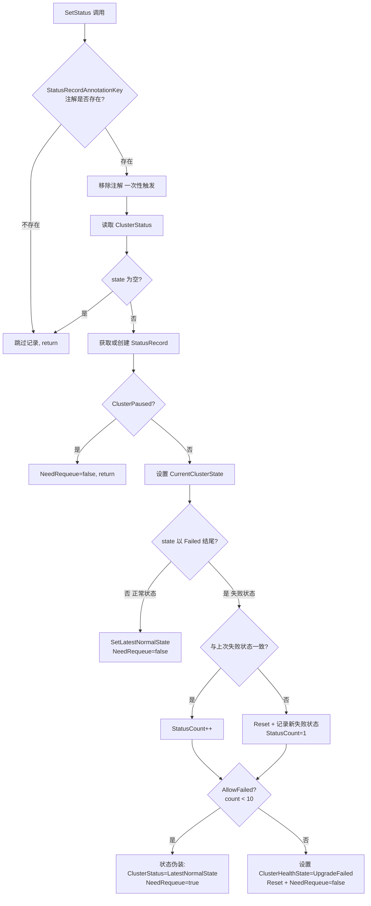
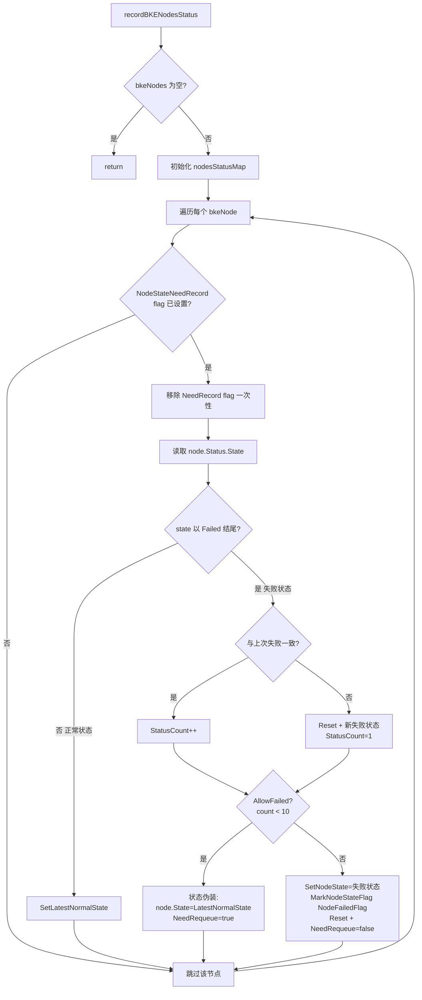
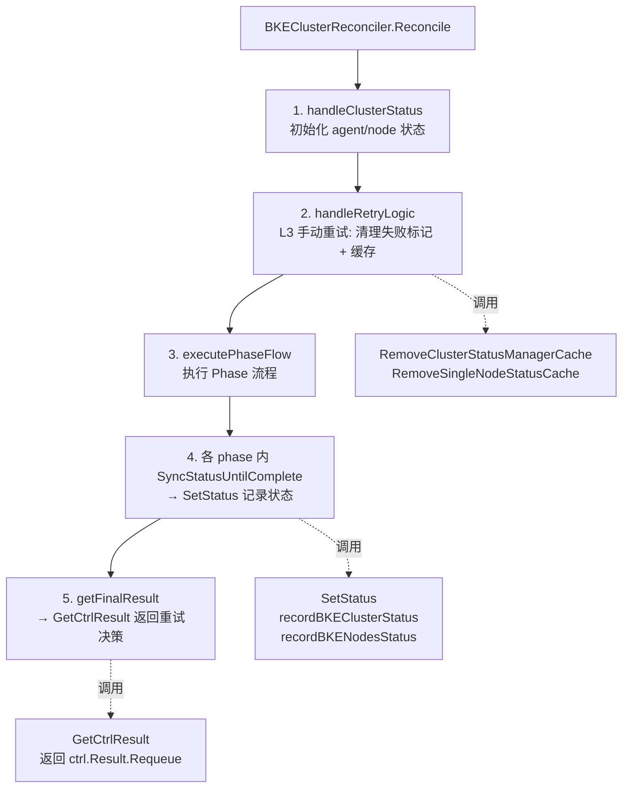

# StatusManager 状态管理器

## StatusManager 的作用

**位置**：[pkg/statusmanage/statusmanager.go](file:///cluster-api-provider-bke/pkg/statusmanage/statusmanager.go)

StatusManager 是 BKECluster 控制器的**状态管理单例**，核心职责是**控制失败状态的重试节奏与上限**，实现"软失败"机制。

### 一、核心定位

```go
// 用来控制 BKECluster 的失败状态，使用单例模式运行，在BKECluster更新的末端调用
type StatusManager struct {
    cmux sync.RWMutex                          // 集群级读写锁
    nmux sync.RWMutex                          // 节点级读写锁
    BKEClusterStatusMap map[string]*StatusRecord       // 集群级状态记录
    BKENodesStatusMap   map[string]map[string]*StatusRecord  // 节点级状态记录
}
```

全局单例 `BKEClusterStatusManager` 在控制器启动时创建，**跨 reconcile 持久化失败计数**（内存态，非 CRD 状态）。

### 二、四大核心作用

#### 1. 失败计数（L2 重试上限控制）

**记录规则**（[statusmanager.go:165-186](file:///cluster-api-provider-bke/pkg/statusmanage/statusmanager.go#L165-L186)）：

| 事件 | 计数动作 |
|------|----------|
| 状态以 `Failed` 结尾且与上次一致 | `StatusCount++` |
| 状态以 `Failed` 结尾但与上次不同 | 重置 + 记录新失败状态 + `StatusCount=1` |
| 正常状态（非 Failed） | 重置计数 |

**阈值**：`ReconcileAllowedFailedCount`（默认 10，可通过 `ALLOWED_FAILED_COUNT` 环境变量覆盖）

#### 2. 状态伪装（软失败设计）

**关键逻辑**（[statusmanager.go:195-198](file:///cluster-api-provider-bke/pkg/statusmanage/statusmanager.go#L195-L198)）：

```go
if sr.AllowFailed() {  // StatusCount < 10
    bkeCluster.Status.ClusterStatus = confv1beta1.ClusterStatus(sr.LatestNormalState)
    sr.NeedRequeue = true
}
```

**效果**：失败 10 次内，将 `ClusterStatus` 改回升级前的正常状态（如 `Ready`），对外表现"升级未发生"，但后台持续重试。

代码注释明确说明（[statusmanager.go:187-194](file:///cluster-api-provider-bke/pkg/statusmanage/statusmanager.go#L187-L194)）：
> 在一定失败次数内对其状态进行修正，表现出的效果为，实际执行失败但显示正常，控制器重试一定次数后停止重试，并暂停对该 bkeCluster 的调谐，直至 spec 被修改

#### 3. 超限终止与最终状态设置

超过阈值后（[statusmanager.go:200-226](file:///cluster-api-provider-bke/pkg/statusmanage/statusmanager.go#L200-L226)）：

```go
} else {
    switch sr.CurrentClusterState {
    case bkev1beta1.Upgrading:
        bkeCluster.Status.ClusterHealthState = bkev1beta1.UpgradeFailed
    case bkev1beta1.Deploying:
        bkeCluster.Status.ClusterHealthState = bkev1beta1.DeployFailed
    case bkev1beta1.Managing:
        bkeCluster.Status.ClusterHealthState = bkev1beta1.ManageFailed
    }
    sr.Reset()
    sr.NeedRequeue = false  // 停止自动重试
}
```

超限终止时还设置 Condition（[statusmanager.go:217-222](file:///cluster-api-provider-bke/pkg/statusmanage/statusmanager.go#L217-L222)）：

```go
v, ok := condition.HasCondition(bkev1beta1.ClusterHealthyStateCondition, bkeCluster)
if ok {
    condition.ConditionMark(bkeCluster, v.Type, confv1beta1.ConditionFalse, v.Reason, msg)
}
```

**效果**：
- `ClusterHealthState` 设为最终失败状态（如 `UpgradeFailed`）
- `Condition` 标记为 `False`（含失败原因 message）
- `NeedRequeue = false`，停止自动重试
- 调谐暂停，直至 spec 被修改或添加 retry 注解

#### 4. 控制 Requeue 行为

`GetCtrlResult` 方法（[statusmanager.go:85-102](file:///cluster-api-provider-bke/pkg/statusmanage/statusmanager.go#L85-L102)）返回 `ctrl.Result{Requeue: sr.NeedRequeue}`，控制是否继续重试：

| 场景 | NeedRequeue | 效果 |
|------|-------------|------|
| 失败 < 10 次 | true | 继续重试 |
| 失败 ≥ 10 次 | false | 停止重试 |
| 正常状态 | false | 不重试 |
| ClusterPaused | false | 不重试 |

### 三、双层管理（集群级 + 节点级）

StatusManager 同时管理两个层级，两者超限处理机制**本质不同**：

| 层级 | 数据结构 | 触发条件 | 超限处理 | 影响 |
|------|----------|----------|----------|------|
| **集群级** | `BKEClusterStatusMap` | `StatusRecordAnnotationKey` 注解存在 | 设 `ClusterHealthState=*Failed` + Condition `False` + `NeedRequeue=false` | 整个集群停止重试，暴露真实失败状态 |
| **节点级** | `BKENodesStatusMap` | `NodeStateNeedRecord` flag 设置 | 设 `NodeFailedFlag` + 保留失败状态 + `NeedRequeue=false` | 仅该节点被后续 phase 跳过，其他节点继续 |

> **关键差异**：集群级超限影响整个集群（停止调谐）；节点级超限仅隔离单个节点（其他节点不受影响，可继续升级）。集群级还会设置 Condition 为 `False`（含失败原因），节点级不设置 Condition。

节点级超限处理（[statusmanager.go:339-347](file:///cluster-api-provider-bke/pkg/statusmanage/statusmanager.go#L339-L347)）：

```go
// 标记失败，这将会让后续所有调谐跳过该节点
bkeNodes.SetNodeState(nodeIP, confv1beta1.NodeState(state))
bkeNodes.MarkNodeStateFlag(nodeIP, bkev1beta1.NodeFailedFlag)
```

### 四、与三层重试机制的关系

StatusManager 是三层重试机制的 **L2 层**：

| 层次 | 机制 | StatusManager 的角色 |
|------|------|---------------------|
| L1 | workqueue 限速器 | 无关（L1 由 controller-runtime 控制） |
| **L2** | **失败计数 + 状态伪装** | **核心实现者** |
| L3 | 手动重试注解 | 提供 `RemoveClusterStatusManagerCache` / `RemoveSingleNodeStatusCache` 清理缓存 |

L3 手动重试时，正是通过调用 StatusManager 的缓存清理方法来重置失败计数，从而恢复重试能力。

### 五、StatusRecord 数据结构

[staterecords.go](file:///cluster-api-provider-bke/pkg/statusmanage/staterecords.go)：

```go
type StatusRecord struct {
    CurrentClusterState confv1beta1.ClusterHealthState  // 当前集群健康状态（用于判断最终失败类型）
    LatestFailedState   string                          // 最近一次失败状态
    LatestNormalState   string                          // 最近一次正常状态（用于伪装）
    StatusCount         int                             // 连续失败次数
    NeedRequeue         bool                            // 是否需要重新入队
}
```

**`Reset()` 方法行为**（[staterecords.go:33-36](file:///cluster-api-provider-bke/pkg/statusmanage/staterecords.go#L33-L36)）：

```go
func (r *StatusRecord) Reset() {
    r.StatusCount = 0
    r.LatestFailedState = ""
}
```

> **注意**：`Reset()` 仅清零 `StatusCount` 和清空 `LatestFailedState`，**不清除** `LatestNormalState` 和 `NeedRequeue`。这意味着超限终止后 `LatestNormalState` 仍保留（供下次重试时恢复伪装状态），`NeedRequeue` 需由调用方显式设置。

**`AllowFailed()` 方法**（[staterecords.go:41-43](file:///cluster-api-provider-bke/pkg/statusmanage/staterecords.go#L41-L43)）：

```go
func (r *StatusRecord) AllowFailed() bool {
    return r.StatusCount < ReconcileAllowedFailedCount  // 严格 <，默认 < 10
}
```

> **注意**：`Inc()` 在 `AllowFailed()` 检查之前执行，因此 `StatusCount` 达到 10 时才停止重试，有效重试次数 = `ReconcileAllowedFailedCount`（默认 10 次）。

### 六、StatusManager 的更新流程

StatusManager 的状态更新通过 `SetStatus` 入口触发，分集群级和节点级两条记录链路。

#### 6.1 更新入口

**位置**：[statusmanager.go:83-86](file:///cluster-api-provider-bke/pkg/statusmanage/statusmanager.go#L83-L86)

```go
func (b *StatusManager) SetStatus(bkeCluster *bkev1beta1.BKECluster, bkeNodes bkev1beta1.BKENodes) {
    b.recordBKEClusterStatus(bkeCluster)
    b.recordBKENodesStatus(bkeCluster, bkeNodes)
}
```

`SetStatus` 在每次状态持久化（`SyncStatusUntilComplete`）时被调用，传入最新的 BKECluster 与 BKENodes。

#### 6.2 集群级更新流程（recordBKEClusterStatus）

**位置**：[statusmanager.go:121-228](file:///cluster-api-provider-bke/pkg/statusmanage/statusmanager.go#L121-L228)



**关键设计：注解触发机制**

集群级记录**不是每次都执行**，而是通过 `StatusRecordAnnotationKey` 注解控制触发时机（[statusmanager.go:122-125](file:///cluster-api-provider-bke/pkg/statusmanage/statusmanager.go#L122-L125)）：

```go
if _, ok := annotation.HasAnnotation(bkeCluster, annotation.StatusRecordAnnotationKey); !ok {
    return  // 无注解则跳过
}
defer annotation.RemoveAnnotation(bkeCluster, annotation.StatusRecordAnnotationKey)  // 一次性消费
```

该注解由 phase 后置 hook `calculatingClusterPostStatusByPhase` 设置（[phase_flow.go:314-318](file:///cluster-api-provider-bke/pkg/phaseframe/phases/phase_flow.go#L314-L318)），确保**仅在 phase 执行完成后才记录状态**，避免 phase 运行中的中间状态被重复记录。

#### 6.3 节点级更新流程（recordBKENodesStatus → recordSingleNodeState）

**位置**：[statusmanager.go:239-263](file:///cluster-api-provider-bke/pkg/statusmanage/statusmanager.go#L239-L263)（`recordBKENodesStatus`）+ [statusmanager.go:274-348](file:///cluster-api-provider-bke/pkg/statusmanage/statusmanager.go#L274-L348)（`recordSingleNodeState`）



**节点级与集群级的差异**：

| 维度 | 集群级 | 节点级 |
|------|--------|--------|
| 触发条件 | `StatusRecordAnnotationKey` 注解 | `NodeStateNeedRecord` flag |
| 触发时机 | phase 后置 hook 设置注解 | 各 phase 内显式 `MarkNodeStateFlag` |
| 超限处理 | 设置 `ClusterHealthState` | 标记 `NodeFailedFlag`，后续 phase 跳过该节点 |
| 状态伪装对象 | `bkeCluster.Status.ClusterStatus` | `bkeNode.Status.State` |

#### 6.4 更新流程的完整调用链

```
Phase 执行完成
  → calculatingClusterPostStatusByPhase (后置 hook)
    → 设置 StatusRecordAnnotationKey 注解
  → phase 内调用 SyncStatusUntilComplete (持久化状态)
    → UpdateCombinedBKECluster
      → updateClusterAndConfigMapWithParams
        → BKEClusterStatusManager.SetStatus(bkeCluster, bkeNodes)  ← 更新入口
          → recordBKEClusterStatus  (集群级: 检查注解 → 计数 → 伪装/终止)
          → recordBKENodesStatus    (节点级: 检查 flag → 计数 → 伪装/标记失败)
        → PatchHelper.Patch (写入 ETCD)
```

### 七、在调谐器中的调用

StatusManager 在 BKEClusterReconciler 的调谐流程中有**四类调用点**：状态记录、重试决策、手动重试缓存清理、资源删除缓存清理。

#### 7.1 调用点总览



#### 7.2 调用点一：状态记录（SetStatus）

**调用位置**：[bkecluster.go:435](file:///cluster-api-provider-bke/pkg/mergecluster/bkecluster.go#L435)

```go
// updateClusterAndConfigMapWithParams 内
statusmanage.BKEClusterStatusManager.SetStatus(newBKECuster, bkeNodes)
```

**调用链**：
```
Reconcile → executePhaseFlow → flow.Execute → executePhases
  → phase.ExecutePostHook (后置 hook 设置 StatusRecordAnnotationKey)
  → phase 内 SyncStatusUntilComplete (各 phase 显式调用，如 ensure_master_upgrade.go:140)
    → UpdateCombinedBKECluster → updateClusterAndConfigMapWithParams
      → SetStatus(newBKECuster, bkeNodes)
```

**触发频率**：每个 phase 执行完成后，若调用了 `SyncStatusUntilComplete`，就会触发一次 `SetStatus`。单个 Reconcile 周期内可能触发多次（每个执行的 phase 一次）。

#### 7.3 调用点二：重试决策（GetCtrlResult）

**调用位置**：[bkecluster_controller.go:287](file:///cluster-api-provider-bke/controllers/capbke/bkecluster_controller.go#L287)

```go
// getFinalResult 内
func (r *BKEClusterReconciler) getFinalResult(phaseResult ctrl.Result,
    bkeCluster *bkev1beta1.BKECluster) (ctrl.Result, error) {
    if phaseResult.Requeue || phaseResult.RequeueAfter > 0 {
        return phaseResult, nil  // phase 已决定重试，优先级更高
    }
    return statusmanage.BKEClusterStatusManager.GetCtrlResult(bkeCluster), nil
}
```

**调用链**：
```
Reconcile → getFinalResult → GetCtrlResult(bkeCluster)
  → 读取 StatusRecord.NeedRequeue
  → 返回 ctrl.Result{Requeue: sr.NeedRequeue}
```

**优先级规则**：phase 返回的 `Requeue`/`RequeueAfter` 优先级**高于** StatusManager 的决策。仅当 phase 未要求重试时，才由 StatusManager 决定是否继续重试。

#### 7.4 调用点三：L3 手动重试缓存清理

**调用位置**：[bkecluster_controller.go:714](file:///cluster-api-provider-bke/controllers/capbke/bkecluster_controller.go#L714)、[bkecluster_controller.go:734](file:///cluster-api-provider-bke/controllers/capbke/bkecluster_controller.go#L734)

```go
// handleRetryLogic → processAllNodesRetry 内
statusmanage.BKEClusterStatusManager.RemoveClusterStatusManagerCache(bkeCluster)

// handleRetryLogic → processSpecificNodesRetry 内
statusmanage.BKEClusterStatusManager.RemoveSingleNodeStatusCache(bkeCluster, nodeIP)
```

**调用链**：
```
Reconcile → handleClusterStatus → handleRetryLogic
  → 检查 RetryAnnotationKey 注解
  → processRetryLogic
    → processAllNodesRetry (注解值为空)
      → 清理所有节点 NodeFailedFlag
      → RemoveClusterStatusManagerCache (重置集群级 + 节点级全部缓存)
    → processSpecificNodesRetry (注解值为 IP 列表)
      → 清理指定节点 NodeFailedFlag
      → RemoveSingleNodeStatusCache (仅重置指定节点缓存)
```

**效果**：清理缓存后，`StatusCount` 归零，`LatestFailedState` 清空，下次 Reconcile 时 `GetCtrlResult` 不再阻止重试，失败节点重新参与升级。

#### 7.5 调用点四：资源删除时的缓存清理

| 场景 | 调用方法 | 位置 |
|------|----------|------|
| 集群删除/重置 | `RemoveBKEClusterStatusCache` | [ensure_delete_or_reset.go:369](file:///cluster-api-provider-bke/pkg/phaseframe/phases/ensure_delete_or_reset.go#L369) |
| Worker 节点删除 | `RemoveSingleNodeStatusCache` | [ensure_worker_delete.go:668](file:///cluster-api-provider-bke/pkg/phaseframe/phases/ensure_worker_delete.go#L668) |
| Master 节点删除 | `RemoveSingleNodeStatusCache` | [ensure_master_delete.go:357](file:///cluster-api-provider-bke/pkg/phaseframe/phases/ensure_master_delete.go#L357) |
| 节点通用清理 | `RemoveSingleNodeStatusCache` | [common.go:86](file:///cluster-api-provider-bke/pkg/phaseframe/phases/common.go#L86) |

**目的**：资源被删除后，清理对应的内存缓存，避免缓存泄漏导致后续创建的同名资源继承旧的失败计数。

#### 7.6 完整 Reconcile 流程中的调用时序

```
Reconcile(ctx, req)
│
├─ getAndValidateCluster          // 获取 BKECluster
├─ handleClusterStatus
│   ├─ computeAgentStatus
│   ├─ initNodeStatus
│   └─ handleRetryLogic           ← 【调用点3】RemoveClusterStatusManagerCache / RemoveSingleNodeStatusCache
│       (检查 retry 注解，清理失败标记 + 缓存)
│
├─ executePhaseFlow
│   └─ flow.Execute → executePhases
│       └─ 每个 phase:
│           ├─ ExecutePreHook (calculatingClusterPreStatusByPhase)
│           ├─ phase.Execute (执行升级逻辑)
│           │   └─ SyncStatusUntilComplete  ← 【调用点1】SetStatus (phase 内状态持久化)
│           └─ ExecutePostHook (calculatingClusterPostStatusByPhase)
│               └─ 设置 StatusRecordAnnotationKey 注解 (供下次 SetStatus 触发)
│
└─ getFinalResult                 ← 【调用点2】GetCtrlResult (返回 Requeue 决策)
    └─ return ctrl.Result{Requeue: sr.NeedRequeue}
```

### 八、总结

StatusManager 的本质是**失败重试控制器**，通过内存态的失败计数实现：
1. **限次重试**：10 次内自动重试
2. **状态伪装**：重试期间对外显示正常状态，避免误告警
3. **超限终止**：超过阈值停止重试，暴露真实失败状态
4. **节点隔离**：节点级失败不影响其他节点
5. **手动恢复**：通过清理缓存支持 L3 手动重试
6. **注解触发**：集群级记录通过 `StatusRecordAnnotationKey` 注解控制触发时机，避免中间状态被重复记录
