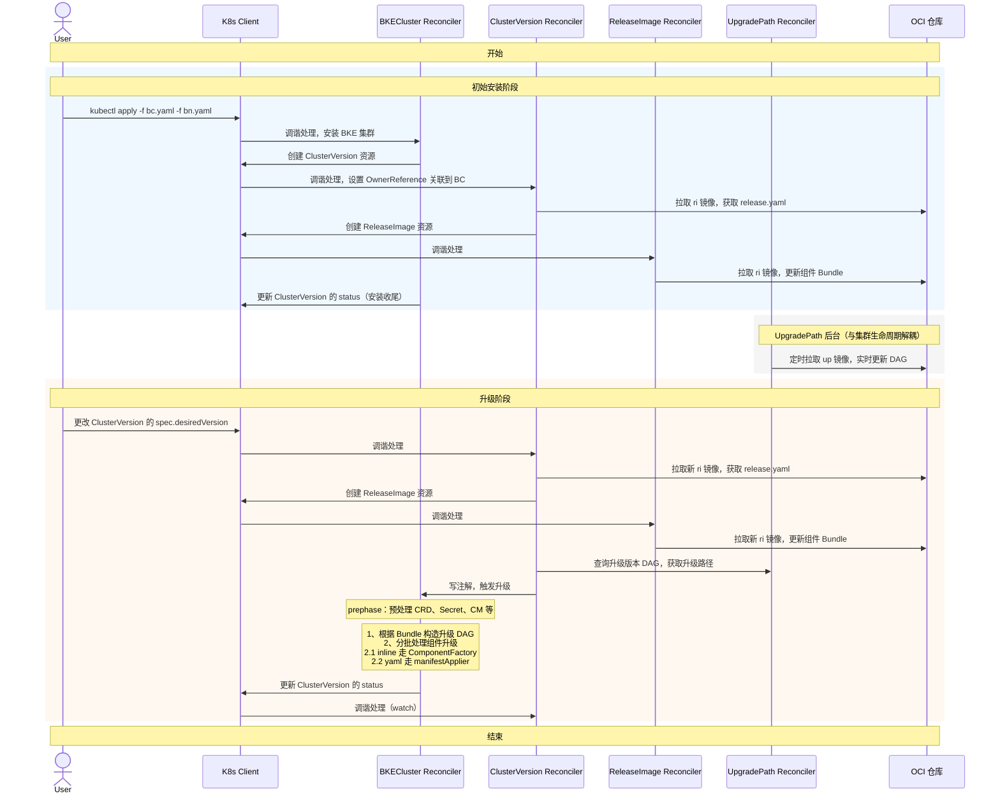
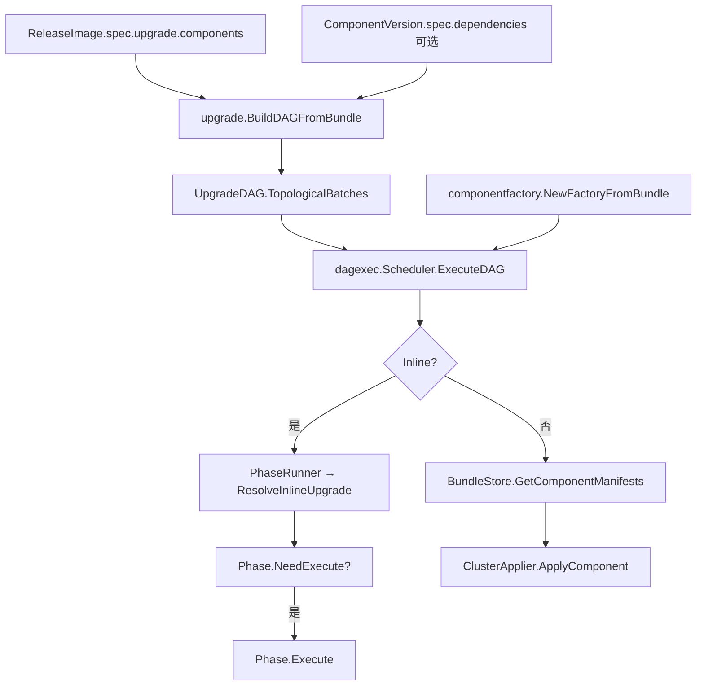
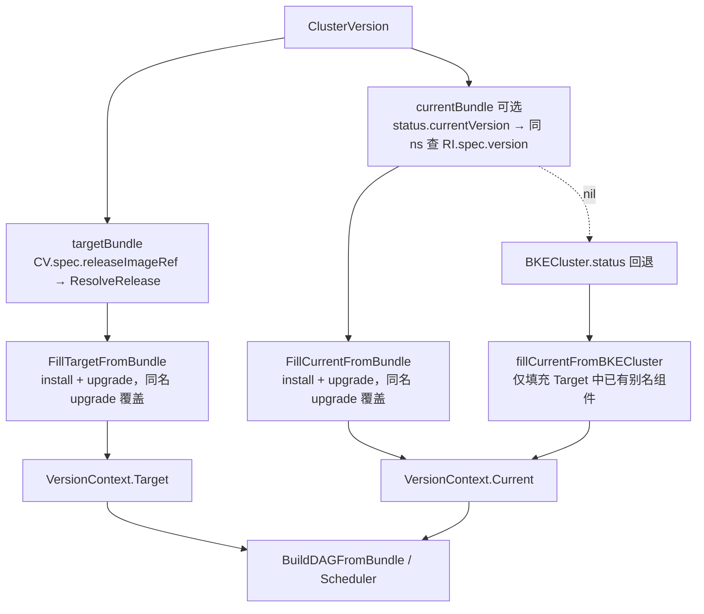
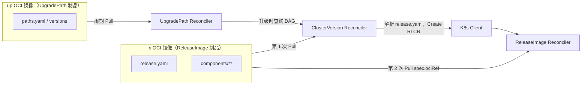

# 升级执行框架

声明式升级路径下，由 **ReleaseImage → DAG → 批次调度 → Manifest / Inline** 完成组件升级。`ComponentFactory` 在每次 DAG 执行前从 release bundle 动态注册 inline handler，不再使用全局默认工厂。

## 端到端时序

从创建 BKE 集群、准备 ReleaseImage / UpgradePath，到修改 `ClusterVersion.spec.desiredVersion` 触发升级的完整交互如下（与端到端时序图一致）：

- **安装**：BC 创建 CV → CV 从 OCI 拉取 **ri** 镜像解析 `release.yaml` → CV 经 KC 创建 **ReleaseImage** → RI 再次拉取 ri 更新 Bundle → **BC 经 KC 更新 ClusterVersion.status**（安装收尾；CV 不写 status）。
- **后台**：UP 周期从 OCI 拉取 **up** 镜像，维护升级路径 DAG。
- **升级**：用户改 `desiredVersion` → CV 拉取新 ri → 创建新 RI → RI 拉取新 ri → CV 查 UP 校验路径 → CV 写 BC 注解触发升级 → BC 执行 DAG → **BC 经 KC 更新 ClusterVersion.status**。

各 Reconciler 对 CR 的 **Create / Patch / Status** 均经 **K8s Client（API Server）** 落库。



### 阶段说明

| 阶段 | 触发方 | 关键动作 |
| :--- | :--- | :--- |
| **安装** | `kubectl apply` BKECluster / BKENode | BC→KC 创建 CV → CV→OCI 拉 ri / release.yaml → CV→KC 创建 RI → RI→OCI 拉 ri 更新 Bundle → **BC→KC 更新 CV status**（安装收尾） |
| **UpgradePath 后台** | UP Reconciler 周期调谐 | UP→OCI 定时拉 up 镜像，维护升级路径 DAG（与单次安装/升级解耦） |
| **升级** | Patch `ClusterVersion.spec.desiredVersion` | CV→OCI 拉新 ri → CV→KC 创建 RI → RI→OCI 拉新 ri → CV→UP 查路径 → CV→BC 写注解 → BC 执行 DAG → **BC→KC 更新 CV status** |

> **ClusterVersion.status**：安装与升级均由 **BKECluster Reconciler** 经 KC 写入；ClusterVersion Reconciler 不写 status。

## 数据流



## 函数调用流程

### 1. ReleaseImage 准备链（升级前，独立 Reconcile）

与 BKECluster 升级异步并行，只负责把 release 包校验为可用：

```go
ReleaseImageReconciler.Reconcile
  → Get(ReleaseImage)
  → manifest.Store.ResolveRelease(ctx, ReleaseRef{Version, OCIRef, Digest, ...})
       → [内存命中] memory.Load → DeepCopy
       → resolveFromPuller
            → puller.Pull(ctx, ref)              // ORAS / file://
            → verifier.Verify(...)
            → manifest.ParseBundle(files)        // release.yaml + component.yaml；Bundle.Files 保留全部 YAML
       → [失败且 AllowCacheFallback] loadDiskCache
  → compatibility.Engine.Check(ctx, bundle)
  → updateStatus(Phase=Valid|Invalid|CompatibilityFailed, Digest, ComponentCount, ...)
       // 只写 ReleaseImage.status，不执行升级
```

`main.go` 中 `ReleaseImageReconciler` 与 `BKEClusterReconciler` 注入同一 `releaseStore`（`/var/lib/bke/release-cache`），BKECluster 侧 `resolveUpgradeBundle` 通常命中缓存。

### 2. BKECluster 主入口

```go
BKEClusterReconciler.Reconcile
  → getAndValidateCluster          // mergecluster.GetCombinedBKECluster
  → getOldBKECluster               // mergecluster.GetLastUpdatedBKECluster
  → handleClusterStatus            // computeAgentStatus / initNodeStatus
  → executePhaseFlow               // 核心
       → phaseframe.NewReconcilePhaseCtx
            .SetClient / SetRestConfig / SetScheme / SetLogger / SetBKECluster
       → [门禁] shouldUseDeclarativeUpgrade(ctx, ...)
            → featuregate.DeclarativeUpgradeEnabled(bkeCluster)
            → !phaseutil.IsDeleteOrReset(bkeCluster)
            → featuregate.UpgradeReady(bkeCluster)   // 注解 cvo.openfuyao.cn/upgrade-ready
            → needsDeclarativeUpgrade(ctx, ...)      // 优先 ReleaseImage VersionContext，回退 BKECluster
       → [满足门禁] executeUpgradeDAG                // 见第 3 节
       → phases.NewPhaseFlow(phaseCtx)
       → PhaseFlow.CalculatePhase                   // legacy Phase 选择
       → PhaseFlow.Execute                          // DAG 成功后仍会走 legacy
  → setupClusterWatching
  → getFinalResult
```

### 3. 声明式 DAG 升级链

```go
executeUpgradeDAG
  │
  ├─ resolveUpgradeBundle
  │    → resolveReleaseImageCR
  │         → clusterversion.GetClusterVersionForBKECluster(ctx, Client, bkeCluster)
  │              // OwnerReference → BKECluster；fallback 同名 CV
  │         → getReleaseImageCR(ns, cv.Spec.ReleaseImageRef)
  │    → [Status.Phase == Valid] 否则 pending / 失败
  │    → releaseStore().ResolveRelease(ctx, releaseRefFromCR(ri))
  │         → ParseBundle → Bundle{Release, Components, Files}
  │
  ├─ resolveCurrentReleaseBundle(ctx, bkeCluster)     // CV.status.currentVersion ≠ desired 时解析旧 RI
  ├─ phaseCtx.BuildAndSetVersionContextFromBundle(targetBundle, currentBundle)
  │         → upgrade.BuildVersionContextForUpgrade
  │
  ├─ upgrade.BuildDAGFromBundle(bundle, BundleDependencyResolver(bundle))
  │    → UpgradeComponentsFromBundle              // enrich inline from component.yaml
  │    → topology.BuildUpgradeDAG
  │         → MergeDependencyResolver(BundleDependencyResolver, DefaultDependencyResolver)
  │
  ├─ patchClusterStatus(ClusterUpgrading)          // mergecluster.SyncStatusUntilComplete
  │
  ├─ componentfactory.NewFactoryFromBundle(bundle)   // 见「ComponentFactory」节
  │
  ├─ dagexec.NewScheduler(Config{          // ManifestStore / ManifestApplier 必填（无 Noop 默认）
  │       InlineRunner:    &componentfactory.PhaseRunner{Factory: factory},
  │       ManifestStore:   manifest.NewBundleStore(bundle),
  │       ManifestApplier: buildManifestApplier → manifest.NewClusterApplier,
  │    })
  │
  ├─ Scheduler.ExecuteDAG(ctx, phaseCtx, oldCluster, newCluster, dag)
  │
  └─ completeDeclarativeUpgrade(ctx, bkeCluster)
       → 删除 BKECluster 注解 upgrade-ready
       → clusterversion.GetClusterVersionForBKECluster
       → Patch ClusterVersion.status（currentVersion = desiredVersion, Phase=Ready）
```

### 4. DAG 内单组件执行

**Inline 组件**（etcd / master / worker / containerd 等）：

```go
Scheduler.ExecuteDAG
  → [phaseCtx.VersionContext == nil] phaseCtx.BuildAndSetVersionContext()  // 通常已在 executeUpgradeDAG 注入
  → dag.TopologicalBatches()
  → [每批] executeComponent
       → executeInline
            → PhaseRunner.Execute(phaseCtx, old, new, handler, version)
                 → ResolveInlineUpgrade(Factory, handler, version, phaseCtx)
                      → [VersionContext == nil] ctx.BuildAndSetVersionContext()  // 回退 BKECluster
                      → ComponentFactory.Resolve(handler, version, ctx)
                           → inst.Factory(ctx)             // 如 phases.NewEnsureEtcdUpgrade
                 → phase.NeedExecute(old, new)
                 → phase.ExecutePreHook()
                 → phase.Execute()
                 → phase.ExecutePostHook()
```

**Manifest 组件**（provider、bke-agent、coredns 等）：

```go
Scheduler.executeComponent
  → [node.Inline != nil] executeInline
  → executeManifest
       → [ManifestStore == nil] 报错
       → BundleStore.GetComponentManifests(ctx, name, version, tmpl)
            → CollectComponentManifests：components/<name>/<ver>/*.yaml（排除 component.yaml）
            → 以及 ComponentVersion.spec.resources[].manifest
       → [len(Manifests)==0] 报错（无 YAML 不可静默跳过）
       → [ManifestApplier == nil] 报错
       → ClusterApplier.ApplyComponent(ctx, pkg)
            → kubeClientForComponent(pkg.Name)
                 → provider: kube.NewClientFromRestConfig        // 管理集群
                 → 其它: kube.NewRemoteClientByBKECluster                  // 业务集群
            → Client.RenderParamsForCluster(bkeCluster, nodes, ...)
            → kube.Client.ApplyYaml(task)
                 → RenderYamlToDecoder → applyUnstructuredList
```

### 5. Legacy PhaseFlow 链（DAG 之后兜底）

```go
PhaseFlow.CalculatePhase
  → determinePhasesFuncs()              // list.go 注册的 Phase 列表
  → phase.NeedExecute(old, new)

PhaseFlow.Execute
  → executePhases
       → phase.NeedExecute
       → phase.ExecutePreHook
       → phase.Execute()                 // EnsureProviderSelfUpgrade / EnsureAgentUpgrade …
       → phase.ExecutePostHook
```

> 当前实现：DAG 成功完成后 **未跳过** legacy Phase，inline 组件存在重复执行风险，后续可按设计在 DAG 成功后短路 PhaseFlow。

### 6. 总览

```go
[准备] ReleaseImage.Reconcile
         → Store.ResolveRelease → ParseBundle → Compat.Check → Status.Valid

[触发] BKECluster.Reconcile → executePhaseFlow
         │
         ├─ shouldUseDeclarativeUpgrade（declarative-upgrade + upgrade-ready + VersionContext）
         ├─ executeUpgradeDAG
         │     resolveUpgradeBundle（CV.releaseImageRef → RI → Store.ResolveRelease）
         │     resolveCurrentReleaseBundle + BuildVersionContextForUpgrade
         │     BuildDAGFromBundle
         │     NewFactoryFromBundle(bundle)
         │     ExecuteDAG
         │        ├─ inline  → PhaseRunner → Factory.Resolve → Phase.Execute
         │        └─ manifest → BundleStore → ClusterApplier → kube.ApplyYaml
         │     completeDeclarativeUpgrade（清注解 + 写 CV status）
         │
         └─ PhaseFlow.CalculatePhase → PhaseFlow.Execute（legacy）
```

### 7. 关键函数对照表

| 阶段 | 入口函数 | 包/文件 |
| :--- | :--- | :--- |
| Release 校验 | `ReleaseImageReconciler.Reconcile` | `controllers/releaseimage/` |
| OCI 解析 | `Store.ResolveRelease` → `ParseBundle` | `pkg/release/manifest/` |
| 升级总控 | `BKEClusterReconciler.executePhaseFlow` | `controllers/capbke/bkecluster_controller.go` |
| 门禁 | `shouldUseDeclarativeUpgrade` / `needsDeclarativeUpgrade` | `controllers/capbke/bkecluster_upgrade_dag.go` |
| VersionContext | `BuildVersionContextForUpgrade` / `FillTargetFromBundle` | `pkg/upgrade/build_release.go` |
| 当前 Release | `resolveCurrentReleaseBundle` | `bkecluster_upgrade_dag.go` |
| 注入上下文 | `PhaseContext.BuildAndSetVersionContextFromBundle` | `pkg/phaseframe/context.go` |
| CV → RI | `resolveReleaseImageCR` | `bkecluster_upgrade_dag.go` |
| 取包 | `resolveUpgradeBundle`（无 ReleaseImage CR 则失败，无 catalog 兜底） | `bkecluster_upgrade_dag.go` |
| 收集 YAML | `CollectComponentManifests` | `pkg/release/manifest/component_files.go` |
| Manifest 加载 | `BundleStore.GetComponentManifests` | `pkg/manifest/bundle_store.go` |
| 建 DAG | `upgrade.BuildDAGFromBundle` | `pkg/upgrade/bundle.go` |
| Factory 注册 | `componentfactory.NewFactoryFromBundle` | `pkg/componentfactory/bundle_registry.go` |
| 调度执行 | `Scheduler.ExecuteDAG` | `pkg/dagexec/scheduler.go` |
| inline | `PhaseRunner.Execute` → `ResolveInlineUpgrade` → `Factory.Resolve` | `pkg/componentfactory/` |
| YAML | `ClusterApplier.ApplyComponent` | `pkg/manifest/applier.go` |
| 收尾 | `completeDeclarativeUpgrade` | `bkecluster_upgrade_dag.go` |
| 老流程 | `PhaseFlow.Execute` | `pkg/phaseframe/phases/phase_flow.go` |

---

## 声明式升级与 Legacy Phase 对照

声明式升级引入后，部分历史 `NewEnsure*` phase 会被映射为 **ReleaseImage upgrade component** 并由 DAG 调度执行；映射规则见 `pkg/upgrade/catalog.go`，执行方式由 DAG node 是否携带 `inline` 决定（`node.Inline != nil` 走 inline，否则走 manifests）。

下表按你列出的 phase 做一对一对照（以当前代码为准）：

| Legacy Phase 构造函数 | PhaseName（`phase.Name()`） | 声明式组件名（`release.yaml spec.upgrade.components[].name`） | 执行方式 | 说明 |
| :--- | :--- | :--- | :--- | :--- |
| `NewEnsureProviderSelfUpgrade` | `EnsureProviderSelfUpgrade` | `provider` | manifests | 声明式链路中以 manifest 组件执行（管理集群 apply）。`declarativeUpgradePhaseName()` 会把该 DAG 节点映射回此 phase 名用于状态展示。 |
| `NewEnsureAgentUpgrade` | `EnsureAgentUpgrade` | `bkeagent-upgrade` | inline | 声明式链路中以 inline handler 执行（handler 为 `EnsureAgentUpgrade`）。 |
| `NewEnsureContainerdUpgrade` | `EnsureContainerdUpgrade` | `containerd` | inline | 声明式链路中以 inline handler 执行（handler 为 `EnsureContainerdUpgrade`）。 |
| `NewEnsureEtcdUpgrade` | `EnsureEtcdUpgrade` | `etcd` | inline | 声明式链路中以 inline handler 执行（handler 为 `EnsureEtcdUpgrade`）。 |
| `NewEnsureWorkerUpgrade` | `EnsureWorkerUpgrade` | `kubernetes-worker` | inline | 声明式链路中以 inline handler 执行（handler 为 `EnsureWorkerUpgrade`）。 |
| `NewEnsureMasterUpgrade` | `EnsureMasterUpgrade` | `kubernetes-master` | inline | 声明式链路中以 inline handler 执行（handler 为 `EnsureMasterUpgrade`）。 |
| `NewEnsureComponentUpgrade` | `EnsureComponentUpgrade` | `coredns` | manifests | 声明式链路中以 manifest 组件执行。`declarativeUpgradePhaseName()` 会把该 DAG 节点映射回此 phase 名用于状态展示。 |
| （无，声明式新增） | `kube-proxy` | `kube-proxy` | manifests | 与 `coredns` 类似，声明式链路中以 manifest 组件执行；当前未映射到独立的 legacy `NewEnsure*` phase，状态展示默认使用组件名。 |

## VersionContext

声明式升级用 `VersionContext` 记录各组件 **Current**（集群/当前 Release 上的版本）与 **Target**（目标 Release 上的版本），供 `needsDeclarativeUpgrade`、`NeedExecuteWithVersionContext` / `ComponentVersionDecision` 比对。

### 数据结构

```go
// pkg/upgrade/context.go
type VersionContext struct {
    Current map[string]string  // 组件名 → 当前版本
    Target  map[string]string  // 组件名 → 目标版本
}
```

组件名与 `release.yaml` 的 `upgrade.components[].name` 一致（如 `etcd`、`kubernetes-master`、`provider`）。`DefaultComponentAliases`（`pkg/upgrade/aliases.go`）为 legacy Phase 提供 canonical 键（`kubernetes` ← `kubernetes-master` / `kubernetes-worker` 等）。

### 构建入口（ReleaseImage，非 BKECluster spec）

```go
// 主入口：pkg/upgrade/build_release.go
BuildVersionContextForUpgrade(targetBundle, currentBundle, bc *BKECluster) *VersionContext

// Phase 注入：pkg/phaseframe/context.go
phaseCtx.BuildAndSetVersionContextFromBundle(targetBundle, currentBundle)
```



### Target / Current 填充规则

| 字段 | 来源 | 规则 |
| :--- | :--- | :--- |
| **Target** | `targetBundle`（目标 ReleaseImage OCI） | 遍历 `spec.install.components`，再遍历 `spec.upgrade.components`；**同名时 upgrade 覆盖 install** |
| **Current**（优先） | `currentBundle`（当前 ReleaseImage OCI） | 与 Target 相同合并规则 |
| **Current**（回退） | `BKECluster` status | 无 `currentBundle` 时，对 Target 中已存在的别名组件写入 `status.EtcdVersion` / `KubernetesVersion` / `ContainerdVersion` / `OpenFuyaoVersion` |
| **Target**（回退） | `BKECluster` spec | 仅当 `targetBundle == nil` 时使用 `BuildVersionContextFromBKECluster` 的 spec 四元组 |

**与 DAG 的关系**：DAG 仅使用 `spec.upgrade.components`（`UpgradeComponentsFromBundle`）。Target 若包含**仅出现在 install** 的组件名（如 install 里的 `kubernetes`，而 upgrade 只有 `kubernetes-master` / `worker`），会进入 VersionContext 但**不会**成为 DAG 节点；门禁 `AnyTargetNeedsUpgrade` 可能因此判为需要升级。制品布局上宜让升级目标与 `upgrade.components` 一致。

### resolveCurrentReleaseBundle

```go
// controllers/capbke/bkecluster_upgrade_dag.go
resolveCurrentReleaseBundle(ctx, bkeCluster)
  → clusterversion.GetClusterVersionForBKECluster
  → [status.currentVersion 为空或与 spec.desiredVersion 相同] return nil
  → List(ReleaseImage in cluster namespace)
  → [spec.version == currentVersion 且 status.phase == Valid] ResolveRelease → currentBundle
```

尚无 `ClusterVersion.status.currentReleaseImageRef` 时，用 **version 字符串** 匹配 ReleaseImage CR；匹配失败则 Current 走 BKECluster status 回退。

### 门禁与 Phase 使用

```go
needsDeclarativeUpgrade(ctx, newCluster, oldCluster)
  → resolveUpgradeBundle → targetBundle
  → resolveCurrentReleaseBundle → currentBundle
  → vc := BuildVersionContextForUpgrade(targetBundle, currentBundle, newCluster)
  → [vc.AnyTargetNeedsUpgrade()] return true
  → 回退 BuildVersionContextFromBKECluster + 四元组 NeedsUpgrade
  → 回退 OpenFuyaoVersion 字符串差 / ClusterUpgrading
```

```go
// inline Phase：pkg/phaseframe/version_context.go
NeedExecuteWithVersionContext(component, old, new, legacy)
  → ComponentVersionDecision(component)  // VersionContext 优先，否则 legacy

ComponentVersionDecision
  → HasTarget(component) 或 DefaultComponentAliases 中的 release 名
  → NeedsUpgrade(name)
```

### 与旧实现的差异

| 项目 | 旧实现 | 当前实现 |
| :--- | :--- | :--- |
| 构建函数 | `BuildVersionContextFromBKECluster` | `BuildVersionContextForUpgrade` + Release bundle |
| Target | `BKECluster.spec` 四元组 | 目标 ReleaseImage `install` + `upgrade` |
| Current | `BKECluster.status` 四元组 | 当前 ReleaseImage bundle，或 status 回退 |
| 注入时机 | `BuildAndSetVersionContext()` 每次 DAG 内重建 | `executeUpgradeDAG` 先 `BuildAndSetVersionContextFromBundle`；Scheduler 仅在 nil 时回退 |

`BuildVersionContextFromBKECluster` 仍保留，用于无 bundle 或回退路径。

### ReleaseImage 示例（openfuyao-v2.6.0）

`install` 含 `containerd`、`kubernetes`；`upgrade` 含 `provider`、`bkeagent-upgrade`、`etcd`、`kubernetes-master`、`kubernetes-worker`、`containerd`、`coredns` 等。

- **Target** 合并后含 upgrade 全部条目；`containerd` 以 upgrade 为准；`kubernetes`（仅 install）也会进入 Target，除非制品只把 K8s 放在 master/worker 下且 install 无 `kubernetes`。
- **inline** 组件（etcd、master、worker、containerd）由 `NeedExecuteWithVersionContext` 比对 Current/Target。
- **manifest** 组件（`provider` 等）若 Current 为空且 Target 有值，则 `NeedsUpgrade == true`（首次部署或尚无当前 Release 记录时符合预期）。

---

## 周边组件

### ReleaseImage Reconciler

ReleaseImage CR 由 **ClusterVersion Reconciler** 经 KC 创建，`spec` 来自 CV 已拉取的 **ri** 镜像内 `release.yaml`（见上节）。本 Reconciler 按 `spec.ociRef` **再次** Pull 同一 ri 制品，校验 Bundle 并写 `ReleaseImage.status`。

| 步骤 | 做什么 | 写到哪里 |
| :--- | :--- | :--- |
| 1 | `Get(ReleaseImage CR)` | 读取 CV 创建的 `spec.ociRef` / `spec.version` |
| 2 | `Store.ResolveRelease`：按 `ociRef` Pull OCI（ORAS）/ 读缓存 | 内存 + 磁盘缓存 |
| 3 | `ParseBundle`：解析 `release.yaml` + 各 `component.yaml`，`Bundle.Files` 保留 OCI 内全部 YAML | 内存 `Bundle` |
| 4 | `compatibility.Engine.Check` | 用 `Bundle.Components` 做版本约束检查 |
| 5 | `updateStatus` | 只 Patch `ReleaseImage.status`（Phase、Digest、ComponentCount…） |

### ComponentFactory

ComponentFactory 是声明式升级里 **inline 组件** 的 Phase 注册表：把 release 清单里的 `inline.handler` + `inline.version` 映射到已有的 Go Phase 构造函数（如 `NewEnsureEtcdUpgrade`），再实例化出 `phaseframe.Phase` 执行。

**设计要点：**

- 无全局 `Default` 工厂；每次 `executeUpgradeDAG` 根据**当前 resolve 到的 bundle** 新建一个 `ComponentFactory`。
- 注册来源：`release.yaml` 的 `spec.upgrade.components[].inline`，以及 `component.yaml` 里 `spec.inline`（经 `UpgradeComponentsFromBundle` / `enrichUpgradeComponent` 合并）。
- DAG 节点上的 `handler` / `version` 与注册表 key 一致：`registryKey(handler, version)` → `"EnsureEtcdUpgrade@v1.0.0"` 形式。

**注册调用链：**

```go
executeUpgradeDAG
  → NewFactoryFromBundle(bundle)
       → NewComponentFactory()                         // 空 registry map
       → RegisterInlinePhasesFromBundle(f, bundle)
            → upgrade.UpgradeComponentsFromBundle(bundle)
            → 遍历每个 comp（含 enrich 后的 Inline）:
                 comp.Inline.Handler / comp.Inline.Version 非空
                 → registerInlineHandler(f, handler, version)
                      → ComponentFactory.Register(handler, version, PhaseFactory)
```

**`registerInlineHandler` 与 Phase 映射**（`pkg/componentfactory/registry.go`）：

| `inline.handler`（常量） | 注册的 Phase 构造函数 |
| :--- | :--- |
| `EnsureEtcdUpgrade` | `phases.NewEnsureEtcdUpgrade` |
| `EnsureMasterUpgrade` | `phases.NewEnsureMasterUpgrade` |
| `EnsureWorkerUpgrade` | `phases.NewEnsureWorkerUpgrade` |
| `EnsureContainerdUpgrade` | `phases.NewEnsureContainerdUpgrade` |

未识别的 handler 在注册阶段返回 error，DAG 不会启动。

**运行时解析：**

```go
Scheduler.executeInline(handler, version)
  → PhaseRunner.Execute(..., handler, version)
       → ResolveInlineUpgrade(Factory, handler, version, phaseCtx)
            → Factory.Resolve(handler, version, ctx)
                 → registry[handler@version].Factory(ctx)   // 得到 Phase 实例
```

**与 BKECluster Reconciler 的关系：**

```go
BKEClusterReconciler.Reconcile
  → executePhaseFlow
       → shouldUseDeclarativeUpgrade
            → DeclarativeUpgradeEnabled（全局 flag 或注解 declarative-upgrade=true）
            → UpgradeReady（注解 upgrade-ready，由 ClusterVersion 完整实现后写入；当前 stub 不写）
            → needsDeclarativeUpgrade（ReleaseImage VersionContext.AnyTargetNeedsUpgrade 或回退）
       → executeUpgradeDAG
            → resolveUpgradeBundle + resolveCurrentReleaseBundle
            → BuildAndSetVersionContextFromBundle
            → BuildDAGFromBundle
            → NewFactoryFromBundle(bundle)          ← 唯一注册点
            → Scheduler.ExecuteDAG（PhaseRunner 持有该 factory）
            → completeDeclarativeUpgrade
       → PhaseFlow.Execute()                       ← legacy，可能与 DAG inline 重复
```

**release 清单示例（触发注册）：**

```yaml
# release.yaml
spec:
  upgrade:
    components:
      - name: etcd
        version: v3.5.21-of.1
        inline:
          handler: EnsureEtcdUpgrade
          version: v1.0.0

# components/etcd/v3.5.21-of.1/component.yaml（也可只在 component.yaml 声明 spec.inline）
spec:
  inline:
    handler: EnsureEtcdUpgrade
    version: v1.0.0
```

### ClusterVersion Reconciler

与端到端时序图一致，CV 在安装与升级两阶段职责如下：

**安装阶段（BC 创建 CV 之后）**

```text
ClusterVersionReconciler.Reconcile
  → Patch spec：OwnerReference 指向 BKECluster
  → Pull OCI ri 镜像，解析 release.yaml（确定 version、ociRef、组件索引等）
  → 经 KC Create ReleaseImage CR，Patch spec.releaseImageRef
  → 等待 RI Reconcile 完成（RI 再次 Pull ri，更新 Bundle 并写 RI.status）
  → 不写 ClusterVersion.status（安装收尾由 BC 经 KC Patch）
```

**安装收尾（BKECluster Reconciler）**

```text
BKEClusterReconciler.Reconcile（安装阶段收尾）
  → 经 KC Patch ClusterVersion.status（phase、currentVersion、conditions 等）
```

**升级阶段（用户修改 spec.desiredVersion）**

```text
ClusterVersionReconciler.Reconcile
  → Pull OCI 新 ri 镜像，解析 release.yaml
  → 经 KC Create ReleaseImage CR（目标版本），Patch spec.releaseImageRef
  → 等待 RI Valid
  → 查询 UpgradePath：校验 from→to 升级路径
  → 写 BKECluster 注解（upgrade-ready），触发 BC（本阶段不写 CV.status）

BKEClusterReconciler.executeUpgradeDAG → completeDeclarativeUpgrade
  → 经 KC Patch ClusterVersion.status（currentVersion = desiredVersion，Phase=Ready）
  → 清除 BKECluster upgrade-ready 注解
```

#### ClusterVersion 创建 ReleaseImage 与 OCI 来源

**ri 镜像**（ReleaseImage OCI 制品）是版本内容的唯一来源。CV 在创建 `ReleaseImage` CR **之前**先从 OCI 拉取 ri、读取 `release.yaml`，据此填充 `ReleaseImage.spec`；RI Reconciler 再按同一 `spec.ociRef` 二次拉取 ri，完成 Bundle 校验与缓存。



| 步骤 | 谁 | OCI 制品 | 作用 |
| :--- | :--- | :--- | :--- |
| 1 | **ClusterVersion Reconciler** | **ri 镜像** | Pull → 读 `release.yaml` → 得到 `version`、`ociRef`、install/upgrade 组件索引 |
| 2 | **ClusterVersion → KC** | — | Create `ReleaseImage` CR（`spec` 来自上一步解析结果） |
| 3 | **ReleaseImage Reconciler** | **同一 ri 镜像**（`spec.ociRef`） | 再次 Pull → `ParseBundle` → 兼容性检查 → `status.phase=Valid` |
| 4 | **UpgradePath Reconciler**（后台） | **up 镜像** | 维护升级 DAG；**升级阶段** CV 在创建 RI 并等待 Valid 后查询 UP 校验路径 |
| 5 | **BKECluster Reconciler** | — | **安装收尾**与**升级 DAG 完成**（`completeDeclarativeUpgrade`）时，经 KC Patch `ClusterVersion.status` |

```yaml
# CV 拉取 ri 后创建的 ReleaseImage CR（示例）
apiVersion: config.openfuyao.com/v1alpha1
kind: ReleaseImage
metadata:
  name: release-v2.6.0
  namespace: <cluster-ns>
spec:
  version: v2.6.0
  ociRef: registry.example.com/openfuyao/release:v2.6.0
```

要点：

- **ri 两次 Pull**：CV 创建 CR 前拉一次（读 `release.yaml`）；RI 调谐时再拉一次（落盘缓存 + 校验 Bundle）。
- **up 与 ri 分工**：`up` 供升级路径 DAG；`ri` 供 release 内容与 `ReleaseImage` CR。安装阶段 CV **不**查 UP；升级阶段在 RI Valid 后 **CV→UP** 查路径再写 BC 注解。
- **status 写入方**：**ClusterVersion.status** 始终由 **BKECluster Reconciler** 经 KC 写入（安装收尾与升级 `completeDeclarativeUpgrade`）；**ClusterVersion Reconciler** 只写 spec / 创建 RI / 升级时写 BC 注解，不写 CV status。

BKECluster 侧通过 `pkg/clusterversion.GetClusterVersionForBKECluster` 读取 CV 与 `spec.releaseImageRef`；声明式升级门禁依赖 BC 注解 `cvo.openfuyao.cn/upgrade-ready`（由 CV 写入）。

> **实现备注**：当前代码中 CV Reconciler 可能仍为 stub；目标行为以本节与端到端时序图为准。

### UpgradePath Reconciler

与单次集群 Reconcile **解耦**，在后台持续维护全局升级路径：

```text
UpgradePathReconciler.Reconcile（周期）
  → Pull up 镜像（upgrade path OCI 制品）
  → 解析 paths.yaml、versions，更新内存 DAG
  → 供 ClusterVersion 在升级阶段查询：from → to 是否允许、多跳路径
```

安装不依赖 UP；升级在 CV 创建目标 RI 且 RI Valid 后，由 CV 查询 UP 再写 BC 注解触发 DAG。

## CR之间关系

```tex
UpgradePath.versions[].releaseImageRef  →  ReleaseImage（版本目录）
ClusterVersion.spec.releaseImageRef     →  ReleaseImage（集群绑定）
ReleaseImage.spec.upgrade.components    →  DAG 节点列表
ComponentVersion（bundle 或 CR）        →  dependencies / inline / resources
BKECluster + 注解                       →  触发 executeUpgradeDAG
```

下面详细展示了CR之间的联系

```
┌─────────────────────────────────────────────────────────────────┐
│                        BKECluster                               │
│  (集群实例，生命周期管理 / Phase & DAG 执行)                      │
└──────────────────────────┬──────────────────────────────────────┘
                           │ 1:1 (OwnerReference，或同名 fallback)
                           ▼
┌──────────────────────────────────────────────────────────────────┐
│                      ClusterVersion (CR)                         │
│  spec.desiredVersion: v2.6.0                                     │
│  spec.releaseImageRef: ri-v2.6.0   ←── 指向集群内 ReleaseImage CR │
│  status.currentVersion: v2.5.0                                   │
│  status.currentReleaseImageRef: ri-v2.5.0  (设计字段，可选)       │
└──────────────────────────┬───────────────────────────────────────┘
                           │ 1:1 引用 (spec.releaseImageRef)
                           ▼
┌──────────────────────────────────────────────────────────────────┐
│                    ReleaseImage (CR)                             │
│  spec.version: v2.6.0                                            │
│  spec.ociRef: registry/openfuyao/release:v2.6.0   ←── 唯一制品入口 │
│  spec.install / spec.upgrade.components (索引，可选镜像内冗余)     │
│  status.phase: Valid | Invalid | ...                             │
│  status.digest / componentCount                                  │
└──────────────────────────┬───────────────────────────────────────┘
                           │ Pull OCI（ORAS）→ ParseBundle
                           ▼
┌──────────────────────────────────────────────────────────────────┐
│              ReleaseImage OCI 制品（单一镜像，构建期打包）            │
│  ┌────────────────────────────────────────────────────────────┐  │
│  │ release.yaml          kind: ReleaseImage                   │  │
│  │   spec.version / install / upgrade.components (DAG 索引)   │  │
│  └────────────────────────────────────────────────────────────┘  │
│  ┌────────────────────────────────────────────────────────────┐  │
│  │ components/<name>/<ver>/component.yaml                     │  │
│  │ components/<name>/<ver>/*.yaml（部署清单，Apply 时加载）      │  │
│  │   kind: ComponentVersion  (依赖/兼容/inline/resources…)    │  │
│  └────────────────────────────────────────────────────────────┘  │
└──────────────────────────┬───────────────────────────────────────┘
                           │ 解析为内存 Bundle
                           ▼
┌──────────────────────────────────────────────────────────────────┐
│  manifest.Bundle（运行时，非独立 CR）                               │
│  Bundle.Release + Bundle.Components + Bundle.Files                 │
│  → CollectComponentManifests → BuildDAGFromBundle → Phase/Applier│
└──────────────────────────────────────────────────────────────────┘

┌──────────────────────────────────────────────────────────────────┐
│                       UpgradePath (CR)                           │
│  spec.ociRef: registry/openfuyao-upgradepath:latest                │
│  paths: [{from: v2.5.0, to: v2.6.0, blocked: false}, ...]        │
│  （独立 OCI；校验 desired 是否允许、多跳升级路径，与上链解耦）       │
└──────────────────────────────────────────────────────────────────┘
```
